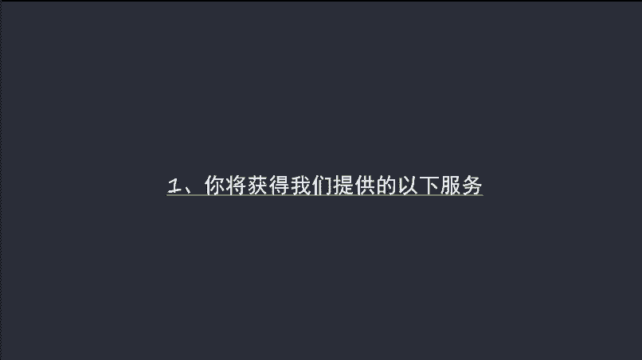
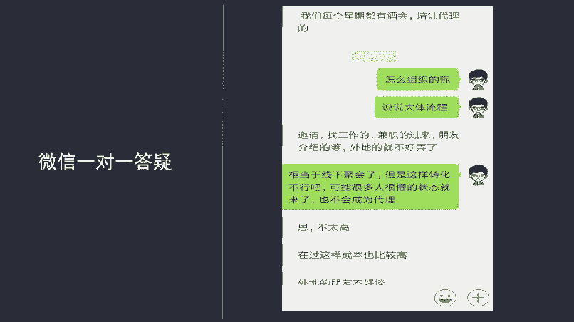
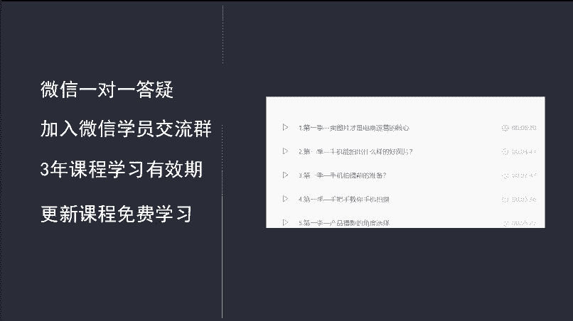
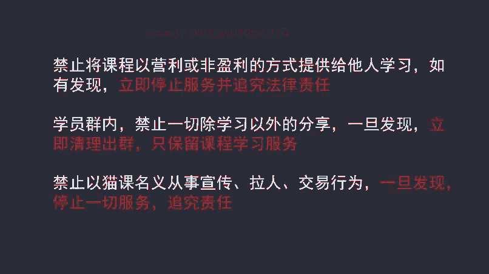

# 微社群裂变营销私域流量池增长秘籍创业运营销售获客视频课教程 合集 8套 374资料 13.1G - P1：1 课程介绍及相应学员服务 - 高端网创试错赚钱大师 - BV1sr421F7AZ

各位同学大家好，我是咱们猫客微信电商课程的老师啊，我叫张一成。呃，首先呢欢迎大家加入我们猫客微信电商课程学习。在今后的学习过程中呢，大家有什么问题都可以通过微信然后我进行交流联系。

首先呢我来给大家介绍一下我们这门课程主要讲了哪些内容。呃，这门课程呢主要是分为8个部分。第一部分呢讲规划呃，帮助大家呢建立一个呃好的学习计划啊，能够呢以更短的时间，更高的效率来完成我们课程的学习啊。

并且呢把在我们课程中学习到的方法，落实到自己的实际项目中进行实操。呃，希望呢也是希望呢大家能够在学习的过程中哈，能够取得比较好的学习效果。第二部分呢就是选品啊，我们做微信电商能不能成功呢？

80%是由选品决定的。如果你选择错了产品，你再怎么努力，那一定是没有太好的效果的啊。所以说呢在这节课程中呢，我们会来给大家讲啊，我们如何通过一个方法啊学会呢选择适合自己的产品。

而且呢这个产品本身有销售力比较容易成功。呃，第三部分呢是定位，呃，定位呢相对来说也是比较重要的啊。呃，就是呢我们要通过微信去对外展示一种什么样的形象，包括我们的微信头像、微信签名呃，微信朋友圈的呃。

个性地址如何设置呢？在这节课里面都有讲到那通过这一系列定位呢，希望大家呢在自己的粉丝中能够成为他们的意见领袖。这样呢更方便我们去进行营销。第四个部分呢是文案呃，文案呢也是做微信电商非常重要的一个环节。

毕竟我们的很多消息，我们的很多价值点的传输，都是通过朋友圈的文案进行的呃，所以说呢我们要想能够影响到客户呢，我们就要学会去写出具有感染力和影响力的文案。这一部分呢我们也是重点讲了呃。

从各个角度啊讲了文案的各种写法。呃，第五部分呢是吸粉呃，在这一部分的课程中呢，我们主要还是列举了几种比较常见的，而且呢是每个人基本上拿回来都可以用的基本方法。呃，通过这几个方法呢。

希望大家能够迅速的积累自己的技础粉丝。呃，第六个。部分呢是讲到了聊天。呃，聊天这个我觉得不需要我强调太多哈，毕竟微信呢我们也是通过呃微信这个平台来跟我们的粉丝跟我们的客户进行交流。

那在交流的过程中呢达成成交。呃，但是如果说你的交流方式是和你平常跟朋友交流的方式一样，那你就会发现你成交客户非常难，或者说这个周期呢是非常长的。呃，如果说你想缩短这个周期。

你就需要有一定的啊有一定的套路。呃，那聊天这这一部分课程呢，我们也是主要讲了一些套路啊，能够让你通过聊天呢迅速和我们的客户建立关系。呃，第七部分呢是活动呃，活动呢相对于前面这几点来说呢，并不是特别重要。

呃，但是呢你也要学会为什么这么说呢？呃，如果说你想快速的积累客户，或者说你想在短时间内提升你的业绩的话，那做活动是最好的选择。呃，但是呢这个活动也不是随便做，你需要把握活动的频率，包括活动。

你应该怎么设置内容呃，包括你应该怎么去把握这个呃活动的节点等等这些呢，你都需要呃去仔细的设计。那我们这节课呢也是主要讲了这个呃如何去做活动这一方面呃，第八个课程呢也是我们的最后一部分呃，就是进阶阶段呃。

进阶阶段呢先给大家讲它并不是适合每一个人的呃，如果说你是刚开始接触无线电商的小白，那你只要是先把第一阶段到第七阶段的课程学习好就行了。如果说。你是已经做了一段时间的微信电商，而且呢你的业绩还不错。

但是呢遇到了瓶颈，你想扩大啊找不到方法，那你就可以重点学习第八部分的课程。那我们会在这一部分呢融合进去付费推广啊，融合进去一些专业的营销流程，专业的营销知识来来帮助你的突破瓶颈。好。

那我们呢就先来看第一大部分内容规划啊，如何更好的学习和利用课程。在这里面我首先要讲到的第一个内容是什么呢？就是你报名了我们课程之后，你能够获得我们的哪些服务？

第一个服务哎，微信的一对一答疑，你只要是成为我们微信电商课程的学员之后呢，都会加到我个人的微信号上。那在这个微信上呢，你有任何问题都随时的可以与我进行交流沟通啊。

我也会呢跟大家啊详细的分析你每个人的情况，然后给出一些指导建议。

呃，第二个服务呢是加入我们的微信学员交流群。呃，这个没微信学员交流群呢，我们现在已经是有4个群了呃，大约呢是有呃接近2000个人。啊，包括之前呢我们有一部分学员啊，因为我们这个群呢是进行了一次升级啊。

所以说有一部分学员过课程过期之后，他没有加到我们的群里面来。呃，但是我们给大家保证的是呢，只要是你愿意啊，不管你课程有没有过期，你都可以进我们这个群，都可以在群里进行学习啊，建这个群的目的呢。

也是为了增加呃学员与学员之间行业与行业之间的交流沟通啊，能够在这个沟通的过程中呢，大家有所新的有新的发现新的启发啊，这是第二个服务。第三个服务呢，是我们的课程有效期是三年的呃。

比如说你是在2018年6月11号报名到我们的课程，那你可以学习到20。

21年6月11号3年的时间。呃，在这三年的时间内呢，你可以反复的无限次的来进行课程学习。那第四个服务是什么呢？就是在你的课程有效期内，我们更新的所有微信电商课程，你都可以免费学习。

那比如说你是6月11号报名的那我们在2019年6月11号，我们更新了一部分课程。那这个课程呢也是免费提供给你学习的啊，那这是我们呃给大家提供的这样相应几个服务。

啊，如果说你是已经报名的学员，你发现自己没有进学员群，那么你马上通过微信来联系我，我会核实之后呢，把你拉到群里面去。呃，相应的你有了义务之后呢，你相应的啊你有了一些服务的权利之后呢。

相应的你也要履行一些义务。什么义务呢？第一个非常重要的义务就是禁止将课程以盈利或非营利的方式提供给他人学习。如果说被我们发现了之后呢，我们会立即停止服务，并追究你的法律责任啊。

第二个义务呢就是学员群内啊，禁止呢一切除学习以外的分享，一旦发现它，立即清理出群啊，只允许你学习课程，不允许你进群了啊。第三个呢就是禁止以猫客的名义从事宣传拉人交易行为，一旦发现了停止一切服务追究责任。

呃，那这三个义务呢，说实话也非常简单哈，只要是大家把课程买来自己学习呃。在学员群里嘛遵守我们学员群的权规啊，也不要以我们猫课，以我的名义呢去进行一些宣传就可以了啊。我相信呢大家都是成年人是吧？

都有担当的啊，这一点呢也能够做到。

