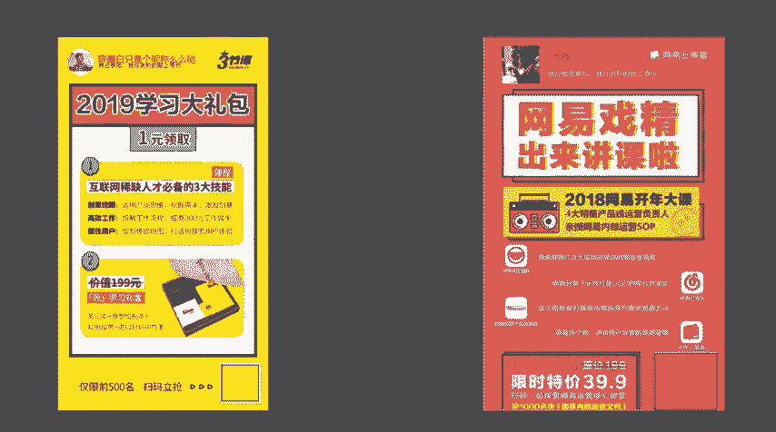
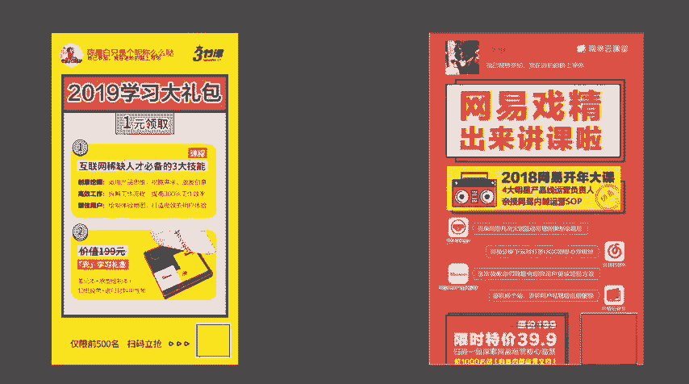
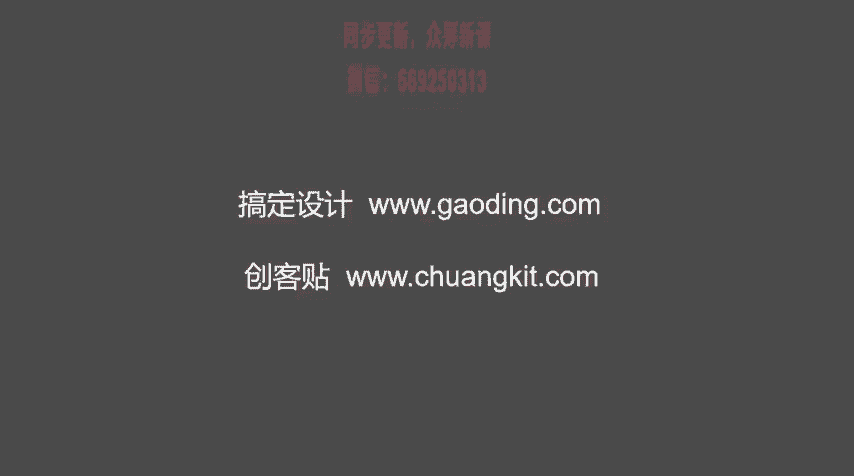

# 微社群裂变营销私域流量池增长秘籍创业运营销售获客视频课教程 合集 8套 374资料 13.1G - P23：2 裂变海报的设计 - 高端网创试错赚钱大师 - BV1sr421F7AZ

我们来讲一下海报是如何设计的。这个海报的设计呢非常关键啊，大家不要忽视，为什么关键呢？因为你这个海报是你整个裂变流程的一个开端。如果你的海报设计的比较乱，或者说呢没有突出重点。别人看了之后呢。

就可能忽略而过。如果说你这个海报设计的啊很简洁，然后重点突出啊，又能够吸引粉丝注意力，那你这个效果呢肯定不会太差。首先要强烈的一点呢，就是我们做海报的时候要拒绝牛皮癣呃。

就是想把所有的内容都在海报上体现，这是非常不对的啊，一定是有重点的来看案例。

那这个是三节课呃的一个呃1元学习课程的这样一个海报啊，我们可以看一下啊，它这个海报呢就是非常明确。2019年学习大礼包1元领取。第一是什么？第二是什么？然后仅限500名扫码很清楚一眼就可以看到重点。

然后第二个呢是网易云课堂的。它的这样一个海报也是非常重点突出。大标题就是网易细经出来讲课了，告诉你这一个听课的海报。然后呢下面是告诉你具体什么课谁来讲的，然后怎么参与很简单。

那我们来分析一下这两张海报啊，他们都是呃我们来看一下这两张海报的架构。第一个呢都是有logo，像三节课网易云课堂。第二个呢都是主题非常的突出不管是从色彩上还是从整个图占比上来说，它这个主题是非常突出的。

第三个就是内容内容呢也是非常的概括啊，内容概括。然后就是参与方式主要是分为这四部分logo主题内容参与方式。内容呢一定是概括的啊，不是让你去写常文章言的去赘述。

一定是概括的这你只要是海报包含这四个部分呢，呃，基本上呃这个海报的呃吸引力呢就比较好。你把这四部分的内容做好。当然了，还有一个我不知道大家有没有注意啊，还有一个就是什么。

就是除了logo主题内容参与方式之外，还有一个非常重要的环节就是色彩色彩。

呃，我们来可以看一下啊，我们可以看一下他这几张海报，现在看三节课的，它有有几个色彩呢？呃，像黄色呃，黑色是它的logo，然后还有一个蓝色，呃，还有一个是呃橙色啊，算是橙色，四基本上就是这四种色彩吧。

然后我们来看一下网易云课程，红色呃，边框是蓝色，然后还有白色。呃，还有一个是黄色，四种，也差不多是四种颜色啊。也就是说我们在去做海报的时候，也不要做到呃五颜六色啊，花里胡哨的啊。

就是还是以简洁扁平化这样的方式体现出来呢，是最好的。呃，如果说你自己不知道怎么去做海报的话，我可以给大家呃给大家一个网址啊，这个网址呢是做海报的网址非常的好用。呃，什么呢是第一个是搞定设计。

然后网址是3W点搞定点COM然后第二个是创客贴呃，3W点呃创KTKIT点COM啊，这都是我们自己也经常用到的呃，海报设计网站，大家呢都可以把它收藏保存。你借助这两个网站。

其实你不需你根本就不需要什么PS啊，你只要是在线稍微设计一下就可以了。

