# 微社群裂变营销私域流量池增长秘籍创业运营销售获客视频课教程 合集 8套 374资料 13.1G - P24：03【第一季】手机拍摄前的准备 - 高端网创试错赚钱大师 - BV1sr421F7AZ

这是我们的第三次课开始前的准备。在拍摄之前呢，我们需要准备一些道具。选择合适的房间，房间的话最好没有其他光线的干扰。例如这个这个呢是一个15平左右的房间，没有任何窗户，只有一个玻璃门透光进来。

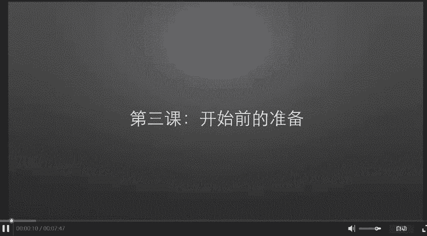

从里往外拍是这样子，从外往里拍呢是这样子，完全黑的。

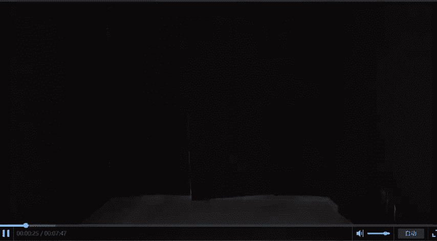

它上面呢有一个灯。打开之后呢，拍摄是这样子。很亮很亮，总之这个房间受其他光线的干扰会比较少。好，我们正式开始准备。第一个封进去的是一个静物台。这个静物台呢由下面的底座和上面的PVC板组成。

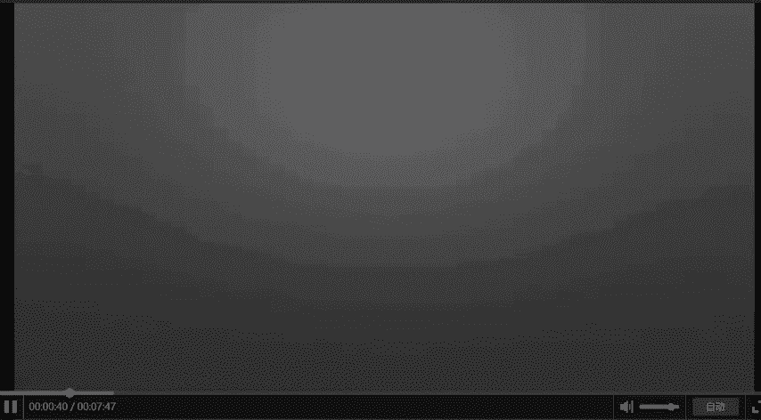

大概100来块钱，他主要是让你的背景更干净一些。你第二个需要的是一个三脚架，你也可以在淘宝上买，只要二十来块钱。你需要注意的是，它有一个最低高度和一个最高高度。你要确保你选择的三脚架和你的进舞台相匹配。

然后呢，你还需要一个手机，更准确的说是你需要一个手机里面的相机。那到底需要多好的手机呢？反正这套课程我们所有拍的照片都是用了这一步iphone SE1，我特意去闲鱼看了一下二手的价格已经跌破千元。

虽然iphone S一已经沦为一部千元机，但用手机拍照的话，用iphone会比较好。好，准备工作差不多了，我们正式开始。第一步把书立在积控台上。第二步把手机用三脚架固定住，然后打开相机应用。

让书在整个画面的中间。

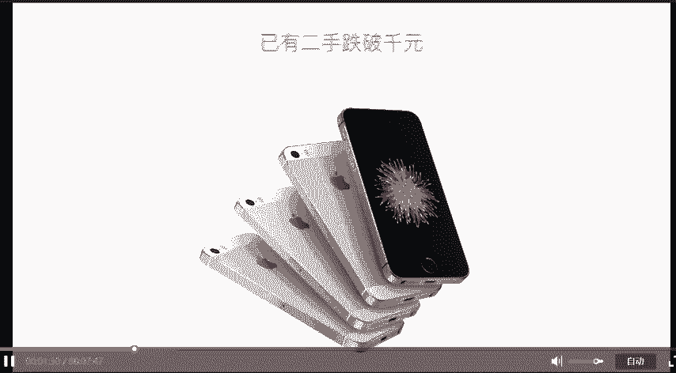

最后按下快门。对，就是这么简单。拍出来之后呢，是这样，你可能会说这根本就不是淘宝照片，对吧？也没关系，我们慢慢来。这张照片呢，它的四周太乱了，我们。再试一下，用双指像放大照片一样，把镜头里面的书本放大。

然后拍出来是这样子。好像还不错，对吧？那个精务台呢，100来块也就起一个背景作用。

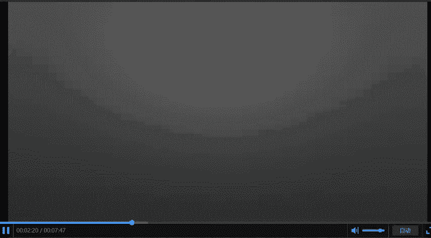

我们去掉它试一试。把书直接放在椅子上拍，看一下效果，对比一下两张呢，你会发现。

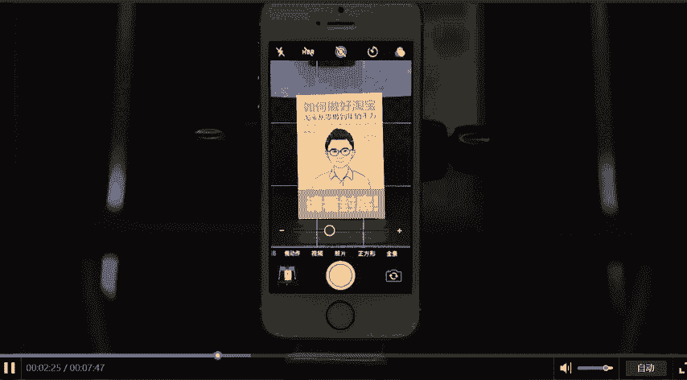

有背景。比没背景要好很多。但背景不一定，你非要花100来块钱买那个建舞台。你也可以。

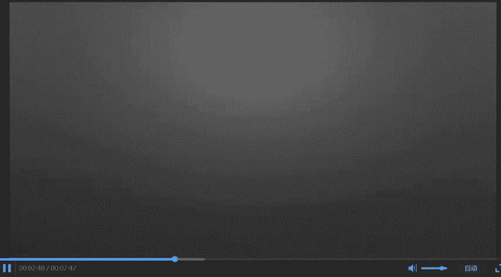

用几张A4纸试一试，老规矩放大拍摄。诶。好像也还不错。再来对比一下。放在一起，你会发现有背景和没背景区别很大。但这个背景是你用A4纸还是用静物台，还是用PVC版？不重要。有就行，不知道你注意到没有？

我们之前拍摄呢好像没用摄影灯，用的呢只是房间里面的灯。

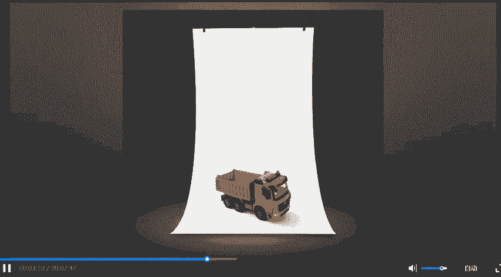

现在我们加一个摄影灯看看。

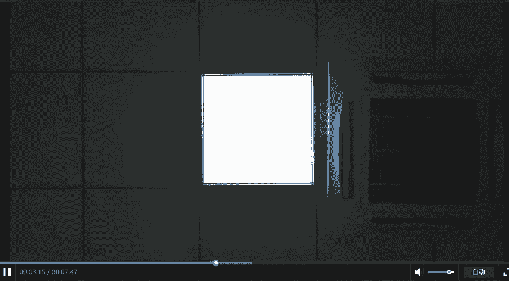

别怕。也只是一个节能灯，仔细看一下，也就是比我们生活中用的。瓦速更高而已吗？150瓦，我们把灯泡放进灯罩，然后开灯放在书本的左边照亮它。注意我的用词，我只需要你把灯放在左边，根本不需要你精确到哪个位置。

大概一个范围就行。对绝大多数淘宝照片而言，真在哪个位置没那么重要。你只需要把它照亮就行了。我们习惯性会把灯放到45度角的位置，从正面看是这样，稍微侧一点呢，是这样子。唇侧面看是这样子。现在我们用上了灯。

看一下拍摄效果会是什么样。再放大一些。拍出来的效果呢是这样。我们把用了灯拍出来的照片和之前我们只是用房间里面的灯拍的照片来对比一下。你会发现似乎用了灯，还是照片的右边多了一块阴影。没关系。

我们再加一个灯，把右边的阴影给打亮，是不是效果就好多了，我们放大一下，再拍一次。再来看一下。你会看到用两个灯会比一个灯的效果好很多。到目前为止呢，我们所做的事情都没有任何技术材料。无非是把灯打开。

把东西照亮，然后拍摄。现在我们来调整一下照片的亮度。当然也很简单。你把手摁一下屏幕，然后呢会出现一个亮度的进度条。往下滑呢就会变暗，往上滑呢就会变亮。这本书呢我希望它更亮一点，所以呢我往上调一点。

然后按下快门，照片呢就会从没调亮之前变成这样。你会看到它终于有一点像淘宝照片了。好，拍摄部分我们就讲完了。是不是很简单。对，淘宝照片就是这么简单。简单到，你只需要三步。第一。你放大它。放到合适大小。

ok可以了。第二步呢。你点一下，然后。体谅他。也是一样啊。选择合适的亮度。OK可以了。第三步呢。按下快门。大部分的淘宝卖家都会对淘宝照片的拍摄有一些些误会。其中的原因呢，我这里不细说。总之。

我想告诉你的是，淘宝照片真的很容易拍。不管是现在我们做的用手机拍摄淘宝照片的课程，还是之后我们推出的教大家怎么用相机拍摄更好的淘宝照片，甚至是拍摄高端的一流的商业摄影照片。都是一样，你不需要去学摄影。

甚至你连相机都不需要去熟悉它，你只需要按照我们课程所教的照着拍就行了。好，我们回来我们再来看一下我们的拍摄环境。这个环境呢主要是指它的光场环境，注意到我们的书本，它的左边和右边各有一盏灯。

从上往下打下来。然后呢，那个背景板我们用的是PVC板，它这个东西呢是反光的，它不仅反光，还同时反出两个方向的光。书本的底部从下往上反的光，书本的背面从后往前反的光，也就是说，书本的四面八方都有光。

这也就是我们打灯所要达到的效果，让我们所拍摄的东西处在一个光线很充足的环境里，也就是我们所说的照亮它。而我们做到这些只需要一张背景纸，一个三脚架。

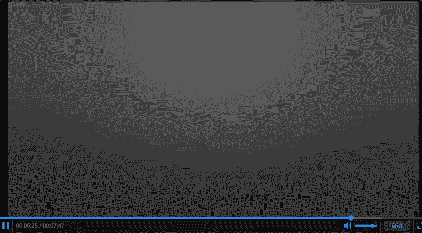

加上两个灯。再加上可能是千元以下的手机就行了，并且这些东西呢都不是必须的。

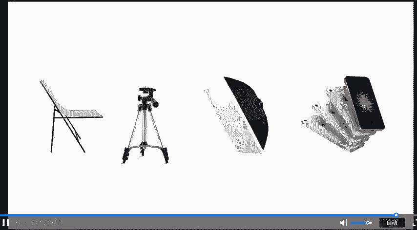

例如你可以这样创造一个充满光的环境。如果你觉得A4纸它反光不太强的话，你可以用PVC呀，对吧？淘宝上才35。如果你担心你的灯泡功率还不够大，那你也可以买这种纸嘛，对吧？像摄影灯一样，好。

这次课呢我们就到这里。我们下一次课见。