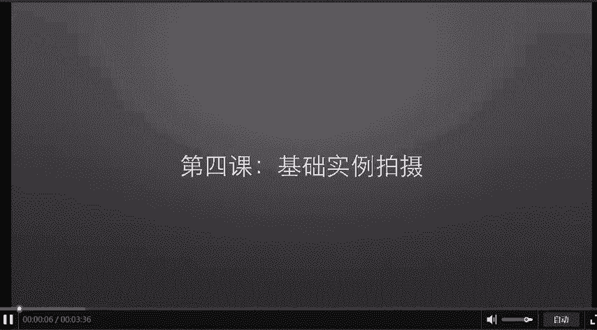
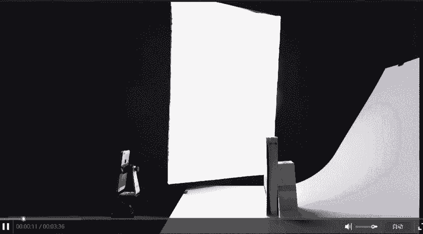
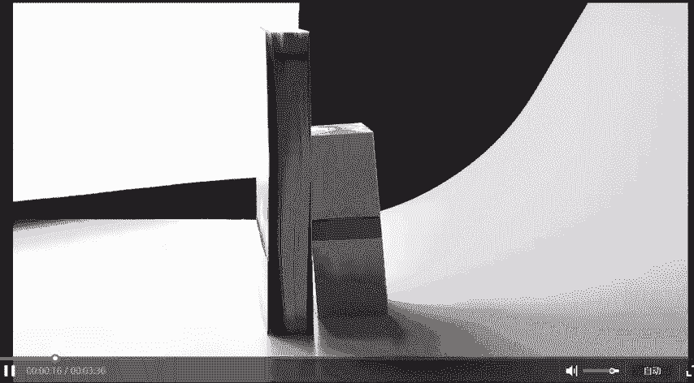
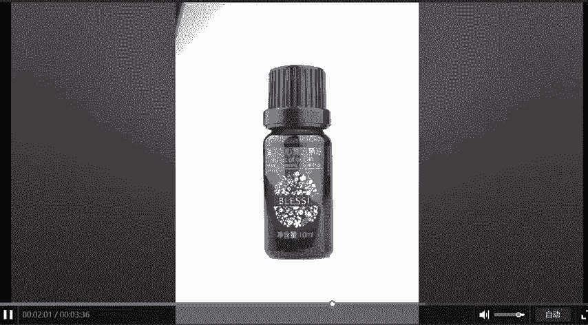
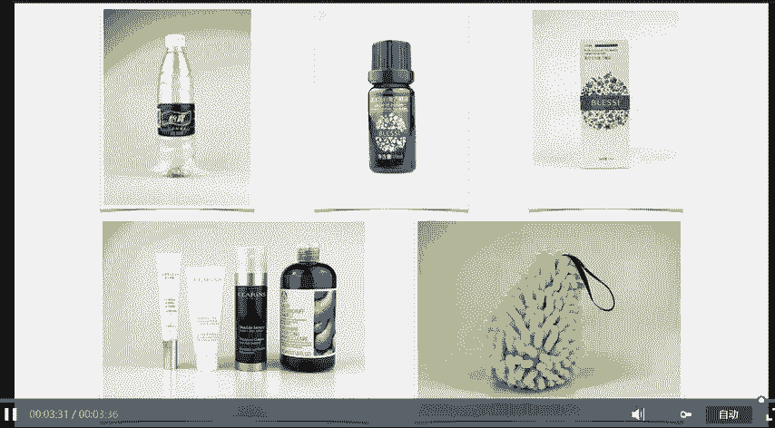

# 微社群裂变营销私域流量池增长秘籍创业运营销售获客视频课教程 合集 8套 374资料 13.1G - P25：04【第一季】手把手教你手机拍摄 - 高端网创试错赚钱大师 - BV1sr421F7AZ

这是我们的第四次课。这一次课呢我们来拍摄一些基础的案例。

这张照片呢是上一节课的照片。他书本立起来的背后呢，是有一个盒子在做支撑。我们现在来拍一下这个盒子。

还是一样的，把灯打开，照亮它，然后放在相机的中间。OK拍一下。再放大它再拍一下。不管你把盒子拍小还是拍大，最终你放在网上的一定是放大之后的效果。我们来研究一下到底哪一种方式拍出来的照片会更加清晰。

现在你倒然看不出来，我们放大一下。还是不好分辨，那我们继续放大。都放大成这样了，我们还是分辨不出来。那继续好，现在我们会发现右边那张照片会更好一些。也就是说。你在相机里面直接把你要拍摄的东西放大。

它这样出来的效果会好那么一点点。好，我们继续。我们按照上节课所说的。把照片提亮，然后拍摄。好，这个盒子我们就拍完了，是不是很简单，你只需要四部。第一呢。用灯把它照亮。第二呢，你摆好，然后放大。第三呢。

你调整亮度。第四呢按下快门，前期的拍摄虽然完成了，但是你别忘了，我们后期还需要修饰一下。我们把盒子里面的精油拿出来也拍一下。还是老规矩，摆在中间放大提亮，然后拍摄。是不是很简单？

当然你有可能会觉得这些东西你没看过，也许他本来就长得好看的，并不是你拍的好看，对吗？那我们来拍一些生活中你能看到的怡保的矿泉水平，你总见过吧。

按照我们讲的方法，放大提亮，然后拍摄。是不是效果也很不错？好，我们继续。接下来呢我们拍一些化妆品。还是老规矩。先把它摆正OK再放大提亮。OK好了。就是这么简单。这样的照片你敢信这是手机拍的吗？是。

确实是这个呢是一个洗手球，还是老歌曲拍出来效果呢是这样子。好了，这节课我们拍了这么多案例。它的拍摄步骤呢都是一样的。第一步，你照亮他。第二步，你放中间放大第三步调整亮度，最后呢按下快门就行了，特别简单。

注意还没完，我们还有后期没做呢，对吧？后期的流程呢也很简单，在我没告诉你拍照特别简单之前，你是不是认为摄影很难呢，对吧？

他没你想象的那么难，甚至特别简单。好，我们再来看一下这节课我所拍的五个概例。如果你没看过，把这些照片放在你面前，你能想到你敢想这是手机拍的吗？这次课就到这里，我们下次课见。

