# 微社群裂变营销私域流量池增长秘籍创业运营销售获客视频课教程 合集 8套 374资料 13.1G - P26：07【第一季】平铺拍摄的技巧 - 高端网创试错赚钱大师 - BV1sr421F7AZ

这是我们的第七次课。这次课呢我们来讲一讲平铺拍摄。之前我们所有拍的案例都是能够立起来的。有一些东西呢是你立不起来的，例如这双袜子，你只能把袜子平铺在背景板上，然后由上往下拍摄。

我们把这种拍摄呢叫做平铺拍摄其余的操作呢还是一样放大提亮，然后拍摄。接下来我们想平拍一下衣服，我们这个建物台显然就不够用了。我们得换一个大一点的。

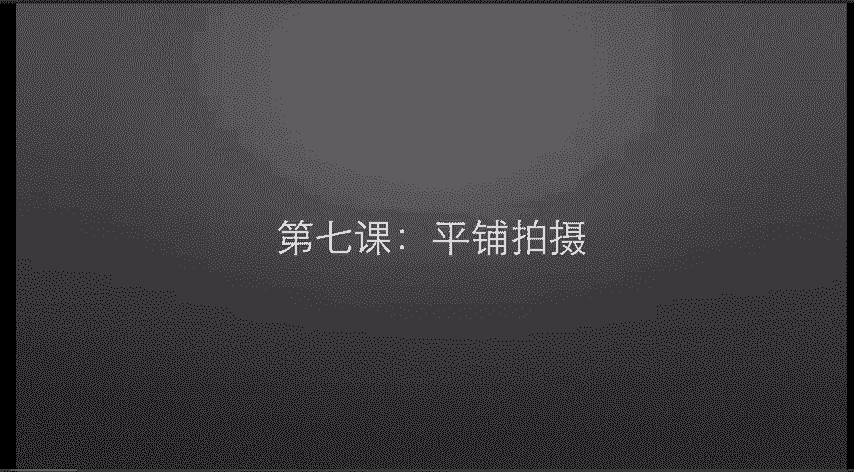

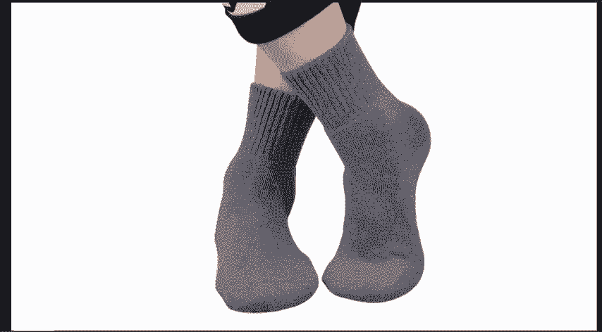

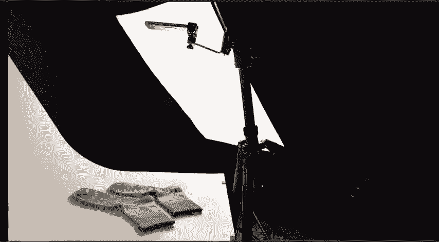

PVC背景板价格呢也非常便宜。

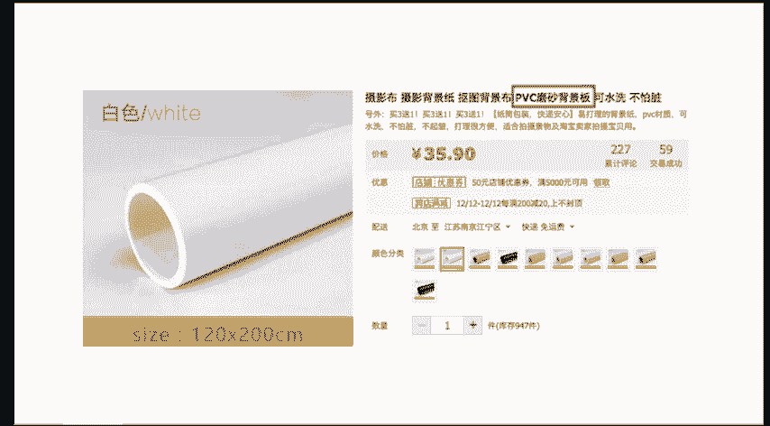

摆出来呢是这样子。好，我们来开始拍摄灯光背景，三脚架的位置呢是这样子，从上往下看呢是这样子。

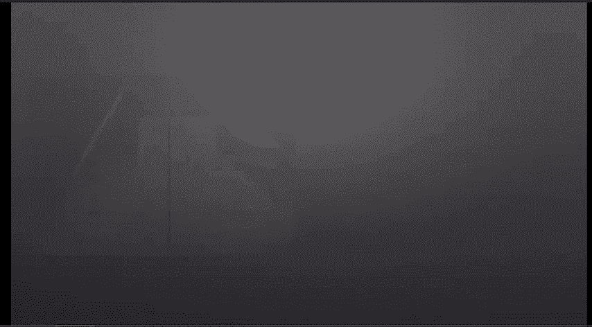

这样拍呢会有一点小问题，就是这个三脚架入镜了，三脚架占了一定的照片空间，它使得衣服就必须往上移。衣服如果不在照片中间，它的变形会非常的厉害，我们来看一下到底是什么原因，使得衣服不能移到照片中间。

是这个三脚架的问题，这个三脚架才2十来块钱，它就没有从上往下拍的功能。因为它的支撑结构，使得三脚架的三个腿它迈不开。这里顺便插一句，这块板子呢就是我们之前静物台下面的PVC板。

我放在这里只是为了给衣服多反应点光线而已。好，我们来看一下如何解决这个问题，这个三脚架呢，它的三个腿是可以分开的。我把后面那个腿拉的很长，然后使整个三脚架往前倾，这样操作的话，会使衣服更靠近中间一点。

我们来对比一下，用更好的三脚架呢？它的中间在这个位置。呃，二十来块钱的三脚架呢，它的中间是这样子，这个三脚架是我平常拍照用的，大概花了两300块钱吧。然后我还配了一个手机架。

这个手机架呢是可以360度旋转的，所以呢拍摄时候的操作空间就会比较大。好，我们这式开始拍摄，还是一样，放中间放大，然后提亮拍摄，它依然会有点变形，但是这一点变形呢，我们可以通过后期很容易的就把它校正。

如果你觉得它的两个衣袖会显得太宽了，那么你可以折一下再来拍摄，照片中最亮的两个地方呢是这个和这个这是因为节能灯就在那个位置。我们后期稍稍提亮，这个影响呢也不会太大，但有的时候就会出现一点点影响。

例如这个案例，我们拍摄出来的效果呢是这样子。你会发现它上面的衣服特别黑，根本就没有打亮。那是因为所有黑色的东西都会吸光，更准确的说是用。

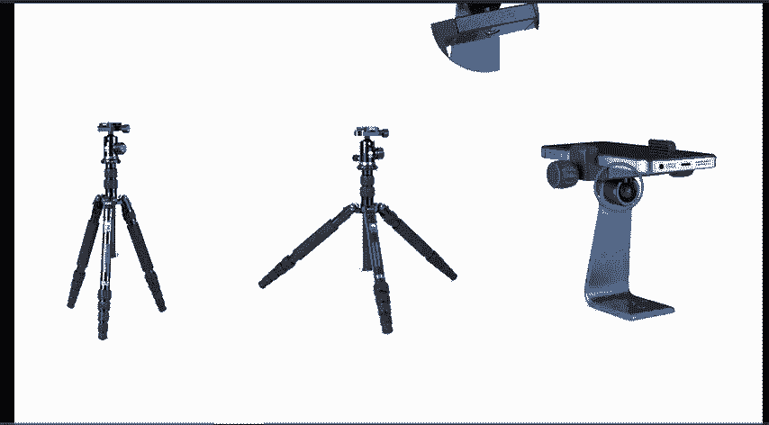

因为他把光线都吸进去了，所以你才看不到颜色。照片中最亮的点呢，还是那两个碰到这种情况，它一部分吸光比较厉害，就会显得比较暗。另一部分呢它不吸光，就会显得比较亮。这个时候呢，你可以把灯光往上移。

对着它不吸光的地方照取，这样子拍出来，效果就会好一点点，我们现在再来看两张照片中最亮的地方，右边那张呢在这里，左边那张呢还是在中间。当我们搞定了基本的平铺拍摄之后呢，我们再来增加一点点难度。

例如这个案例，这个吊带裙呢单拍下来，会是这样子。

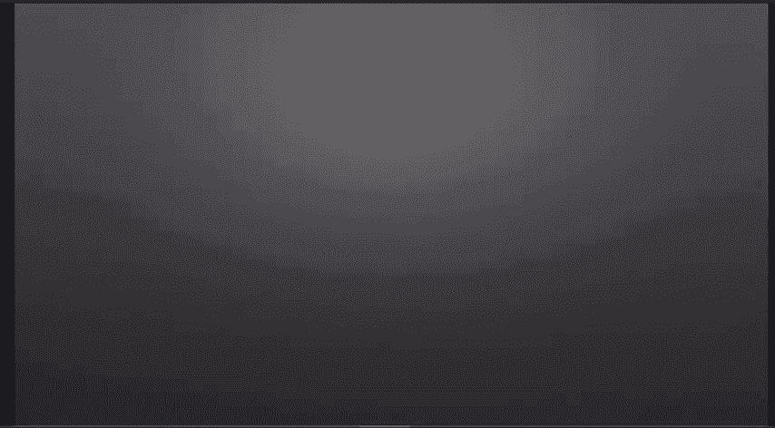

为了解决单调的问题呢，我们可以搭配着拍加一件针织衫上去，拍出来呢会是这样子，右边的效果呢拍出来会显得好看一点。但是如果我们去看一下别人拍的照片。你会觉得。是不是哪里出了问题，同样都是平铺拍摄。

差距怎么能这么大呢？其中的原因有两个。第一，人家不但不平，并且还凹凸有致。第二呢，就是我们设备的局限性，包括我们用的手机包括我们用的灯光，这一些都大大的限制了我们的拍摄效果，即使我们的设备不好。

但是呢我们也来试一下用手机到底能达到什么样的程度。一开始我们把衣服平铺在背景上面，然后拍出来是这样子，衣服其实不是特别适合平铺拍摄，因为设计的时候它会把腰部的那个位置给留下来。如果你就这样平铺在背景上。

它整个衣服呢会显得特别宽，因为衣服的衣领衣袖和腰部的位置，你看人穿在身上的时候，这些布料是没有的。所以衣服的平拍会显得衣服格外的宽，严重的破坏了它的美感。这个时候呢，我们。

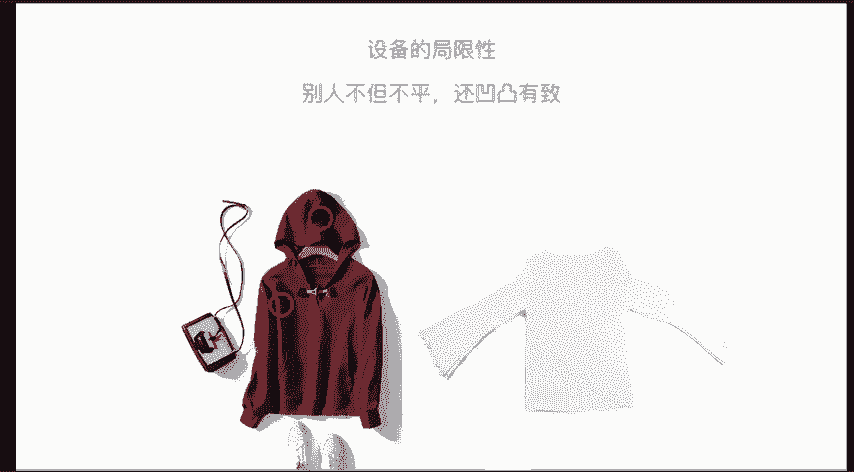

要把衣服折一下。第一呢，为了减轻它的宽度。第二呢，为了增加它的立体感，但还是很难看。我们再试着多折出一些比较美观的褶皱出来。依然没有什么作用，既不好看也不立体。别着急，我们慢慢来拍摄这些照片的时候。

我们的灯光还是没动的。就是说左边一个右边一个从上往下把衣服给打亮，但是这种打光方法并不能把衣服打的立体，把一个灯倒下来，从一边打向另一边。最开始它是这样子，我们改变了灯的方向之后呢，变成这样子。

虽然更立体了一点，但是整个照片还是不好看，就算我们把衣服弄得凹凸有致，但设备上的差距还是存在。右边那张呢是相机拍的，你会很明显的看到相机拍出来的画面会好很多。

而且用相机拍的这一张是我随便拍的一张相机还没发力呢，就已经比手机拍摄出来的效果要好很多了。这一套课程我们不过度的去讨论相机拍摄。我们回到手机上来，再花点时间重新。打一下加一个包包，加双鞋子。

拍摄出来是这个样子。我们前期拍摄的工作已经完成了，但后期还没开始呢。经过后期修饰之后呢，这张照片会变成。这样子。总之，如果你前期的设备更好，前期做的更多的话，你后期就动能少一点。

如果你前期拍摄只有这个条件，那么你后期修图就得辛苦一下了。好，这次课就到这里，我们下次课见。🎼是。🎼时光一是永。🎼不悔。

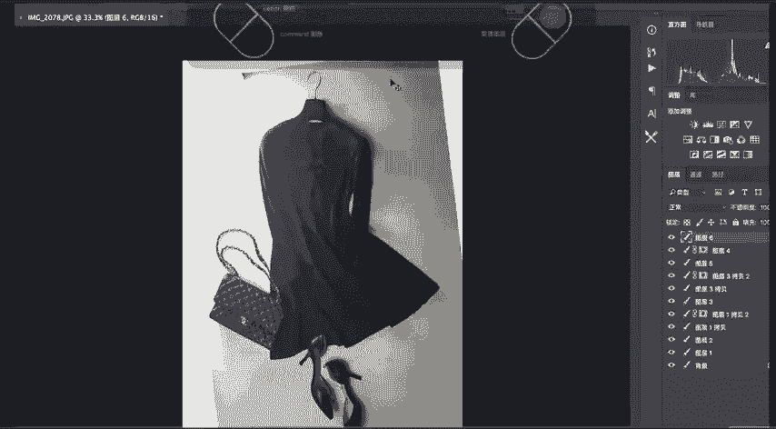

🎼当时。🎼只能。🎼い？🎼你同年。🎼本是。🎼日竹马青。

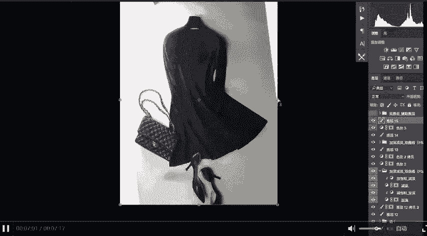

🎼明媚。🎼两小。🎼日夜相随。🎼The。🎼春风。

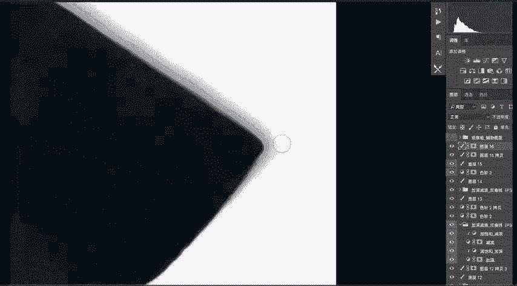

🎼吹红。

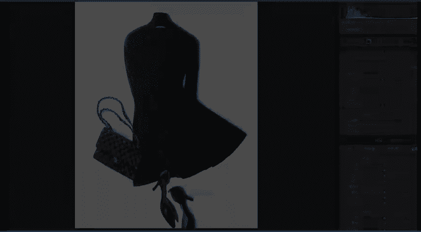