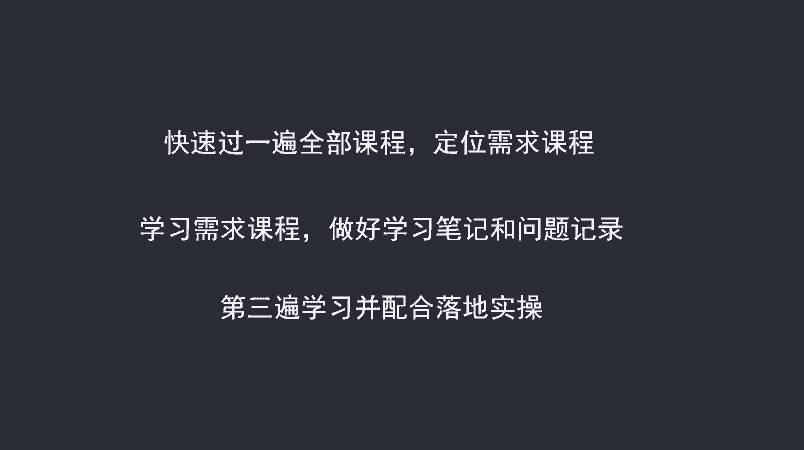
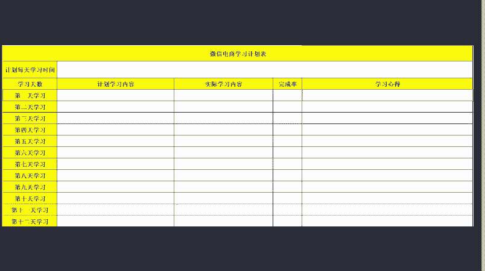
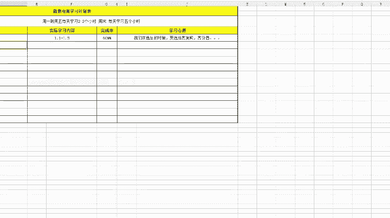
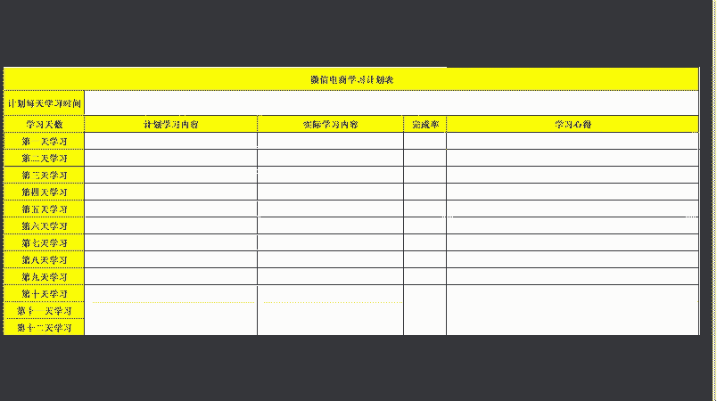

# 微社群裂变营销私域流量池增长秘籍创业运营销售获客视频课教程 合集 8套 374资料 13.1G - P2：2 制定一个合理的学习计划 - 高端网创试错赚钱大师 - BV1sr421F7AZ

好，我们来讲第二个内容，制定合理的学习计划。为了方便大家学习呢，我们对课程进行了系统的整理，也总结了一个比较实用的方法呃，学习三步法。呃，那通过这个学习三步法呢，能够让大家用最短的时间呃。

最高效率的来学习完咱们的这门课程，并且呢能够驾驭运用。呃，下面呢我们就来看一下具体是哪三步。第一步呢就是通过快速的学习一遍课程，找到解决自己问题和适合自己学习的内容。呃。

那我们在客服给我们开通课程之后呢。呃，大家呢拿到课程，把这个课程里面的所有内容不需要仔细的去看一遍，而是呢嗯跳跃式的把每一节课程的内容大体了解一下。那在这个了解的过程中呢。

我们就知道哪一部分的课程最能够解决我们现在遇到的问题。我们就下一步重点学习哪一部分的内容啊，这就是我们学习的第二学习需求课程做好学习笔记和问题记录。呃，第二遍学习的时候呢。

我们一定要做学习笔记和问题记录，为什么要做学习笔记呢？因为在以往的学员它存在这种情况。就是我在听课程的时候，我听的确实是很有道理，也确实是这样做。但是当我把课程关闭。

我要去落实归集到自己的项目当中的时候，我会发现我完全是没有入手的空间。我不知道应该如何去做。而我们在去写笔记的时候呢，就能够把这个理论和我们的实际相结合。比如说我们在做笔记的时候呢。

一定不是说把我课程中讲到的内容完整的抄录下来，而是你要在听课的过程中，往往会对你的项目有一些呃想法蹦出来。那你就把这个想法呢写下来。然后呢，结合我们在结合我在课程中讲的内容呢，你简单的做一个分析。

这是我们要做的笔记啊，记住啊笔记不是说你去摘录我课程讲的内容，而是说呃摘录你的项目和我们课程讲的内容，它的结合点，把这个结合点呢简单分析。呃，第二个内容呢就是要把你的问题记录下来。比如说讲到选品。

你感觉呃高价值的产品，你不理解，那你把它记录下来，然后呢听完这节课之后，你再来找我，我们呢一起呃交流一下，我再给你解决你所遇到的困惑。这是第二步的学习。第三遍学习呢，那我们就是要配合落地实操了。

在第二遍的时候呢，我们刚才也讲了做笔记，要把课程和你项目的结合点写出来。那在第三步学习的时候呢，我们就针对这个结合点，我们再去实操的过程中呃，再结合课程学习一遍，比如说细粉，那在课程中讲到了地推，呃。

我当时呢也做了一些笔记，对吧？那我下面要做的第三步学习，就是我再去递推的时候，再运用到我做笔记的几个点，然后呢去测试，如果说有一个点测试的不错，OK那这个点的课程内容呢，我们就不需要学习了。

如果说有一个点，比如说送小礼品，礼品的选择，对吧？我就是一直没找到呃，好的产品，那你可以回头再把我讲的选择递推产品的这节课呢，再好好的听一遍呃，把这个。把这个呢完整的理解一下就可以了啊，实际上呢。

这三步下来呢，大家基本上都能够把课程中讲到的基本理论呢啊基本方法都能够学会。但是有些学员呢他可能本身缺乏一些实操经验啊，或者说呢本身对这方面了解的不多。呃，如果说你是属于这种学员的话。

我建议你呢能够进行第四遍学习。第四遍学习呢是再次把所有的课程完整的学习一遍。好，这就是我们讲到了三步学习法哈。对于一些小班同学呢，我们建议是四步学习法。😊。

那针是这样呢，我也是给大家做了一个学习计划表。为什么要做这样一个学习计划表呢？就是。呃，也是呢总结了一下之前学员遇到的情况啊，有些学员呢可能会存在这种情况。就是说我第一天学习，我也想到了结合点是什么。

我也决定第二天去操作啊，但是呢到了第二天他可能不去做，而是把这些所有的东西呢都停留在了想的方面啊，这是不好的啊，也有些同学呢会存在这种情况，我第一天学习哎不错，第二天学习不错。

第三天我忘记学习了也有这种情况啊，所以说呢我要做了这样一个表格来给大家啊，大家呢可以做呃根据自己的实际情况啊，比如说计划每天学习多长时间啊，学习天数学习内容呢，根据自己的情况呢做一个表格啊。

我来拿我自己举个例子啊，比如说。😊。

计划每天学习时间，因为我周一到周五的事情比较多，拿不出太多时间来啊，所以说我可以是呃举个例子。周一到周五，每天我每天学习呃2到3个小时。然后周末两天呢，可以每天学习5个小时。

然后我就给这样每天学习计划做一个时间。然后根据你每天大约能够学习的时间，我们根据课程的时长啊，我们来。规定一下第一天学习什么内容。比如说第一天我计划学习第一章的第一节到第一章的第五节课。

那实际上到晚上之后，你有没有完成这个学习呢，你再统计一下。比如说我只学习了第一天的第一节到第一天的第三节。对吧实际上我只是完成了概率是多少，3除以5啊，60%，我只完成了60%。那在这60%的情况下。

我是学习了哪些东西呢？比如说我学习了选品，那我知道了，我应该。我们在选品的时候。我们在选品的时候要选择。高复购。高。高虎口啊。高价值。等等等等。巴拉巴拉。哎，你把它你今天的学习经验写下来。然后第二天呢。

我们也是有这样一个学习计划，这样写下来。啊，这是我们的一个学习计划啊，帮助大家能够呢比较好的来学习我们的课程。😊。

那有些同学呢他可能会存在这种情况，就是说我不知道什么课程对我来说啊比较实用，或者说能够解决我现在的问题。呃，那如果说你是存在这种情况的话啊，唯一的解决办法是什么呢？就是你找到我微信上找我。然后呢。

我来分析一下你的目前情况。然后呢，我给你一些指导性的课程来让你重点学习呃，这是我们这一节课要讲的内容学习计划。那我们还有一节课呢？呃，是第三节课啊，如何来呃就是我们学习过程中的其他问题应该如何解决呃。

我们下节课来讲。

