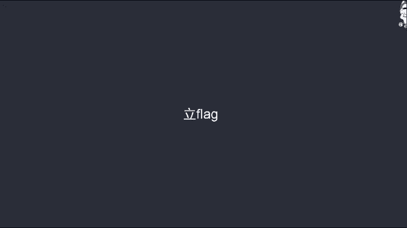
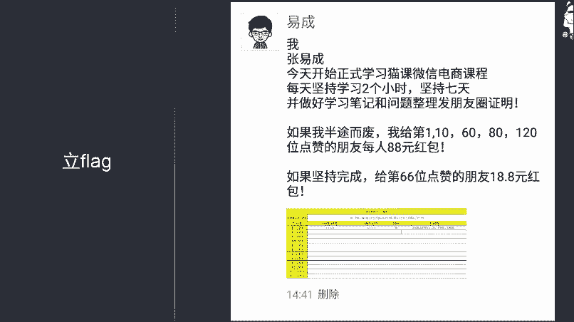
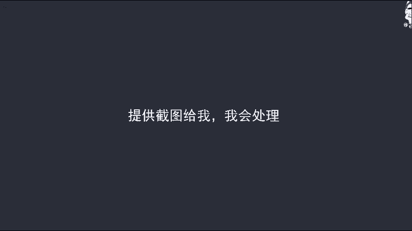

# 微社群裂变营销私域流量池增长秘籍创业运营销售获客视频课教程 合集 8套 374资料 13.1G - P3：3 其他学习和服务问题 - 高端网创试错赚钱大师 - BV1sr421F7AZ

好，我们接着来讲啊。这一节课呢主要来给大家讲一下我们在学习过程中，包括在接触服务的过程中。如果说遇到一些问题呢，应该怎么处理？呃，首先呢第一个遇到比较大的问题呢，我觉得还是自己没有耐心学习。

或者说没法坚持，每天学习。这个呢也是我们之前的学员普遍犯的一个问错误啊。呃，那遇到这种问题，我们应该怎么办呢？我想了一个比较好的解决办法，就是lea。什么意思呢？

就是把我们要做的这件事情呢发到朋友圈里面去，让我们的粉丝去共同见证我们要做这件事情。同时我们要给一个承诺，如果说这件事情我做成了，我会怎么样，我没做成又会怎么样呃，来看一个范例。

这个呢是我发的啊，大家来看一下大体的内容啊。首先内容是这样的。我张一成今天开始正式学习猫客微信电商课程，每天坚持学习两个小时，坚持7天并做好学习笔记和问题整理发朋友圈证明。如果我半途而废。

我会给第一、第十0、第60、第80、第120位点赞的朋友，每人88元红包。如果坚持完成给第66位点赞的朋友18。8元红包。我这就是一个内容。

那我这个内容呢之所以能够督促我去学习课程并不是很我害怕给这几个人发88块钱红包。而是呢因为我在我的粉丝在我的课程呃，在我的那个客户中呢，我做了一个承诺。如果说我失信了。

那就相当于我失信于他们以后我在卖他们产品就非常难了。如果说我做到了，那我就是在朋友圈里通过自己的行为证明了自己是一个可靠的人，可信任的人可以坚持的人等等。所以说呢这个方法相对来说还比较。

用的那如果说你发了，确实你还是不想做，那也没关系啊，就说明你对微信电商这个事情呢并不是很重视。呃，那我们也没有什么办法了啊。

呃，然后呢是下一个问题。如果说在微信上或者说在学员群在学员群里面呃，艾特我没有找到我怎么办呢呃。这个呢也是要提前跟大家讲一下啊，我是每周一到周五9点半到5点呢，是在公司正常上班的。呃。

那这个时间段之内呢，我基本上可以保证大家提到的问题能够及时解决。但是呢也不百分之百保证哈，因为我还有其他的事情要做，我还有一些项目我要去处理。呃，所以说呢我只能是尽可能的能够及时的回复大家的消息。

如果说不是在这个时间段内呢，因为我也有家庭，对吧？我也有家人啊，我也有朋友有其他的事情要做呃，不可能24小时盯着手机来回复大家的消息呃，所以说呢其他时间大家有什么问题呢，你给我留言就行了。

我看到呢都会呃及时的给大家回复啊，周六周日呢也是啊大家留言，我看到呢都会给大家回复啊。然后还有一个问题呢，也是我们学员之前遇到的问题是什么呢？就是遇到学员群里面的人呢对他进行骚扰啊。

或者说呢两个人一言不合就开骂。那遇到这种情况呢，我建议大家哈还是要忍得住自己的脾气，毕竟呢大家大部分人都是成年人，对不对？我们要对自己说的话，要对自己做的事情负责啊，所以说呢遇到这种情况，你忍一下。

然后呢把你们的截图提供给我，我会来协商啊，让你们和好也好，或者说确实有人过分了，那我们就把他踢出群去，对不对？我们就不让他学习了也可以。

毕竟呢我们卖这个课程呢不仅仅说是为了让大家教这1000来块钱的学费，对不对？我们更主要呢还是呢能够把这些做微信电商的中小卖家集中起来，大家相互交流，相互学习，共同进步，对不对？呃，如果说确实存在一些人。

他那个素质特别差。那我们他给钱，我们也不让他学啊，这是给大家要讲的几个内容啊，这几个内容呢相对来说很。简单对吧？也不是什么干货。但是呢提前给大家讲一下呃，也让大家呢能够心里有个数。

不要到时候出了问题之后呢呃到处投诉啊，或者说。呃，两个人骂起来了，这样就不好了。好，那第二节课呢我会。呃，再来给大家讲我们下面的具体的干货。那也希望大家呢呃能够认真的学习下面的课程。

