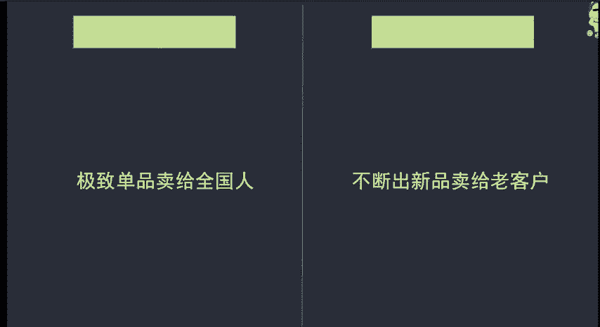
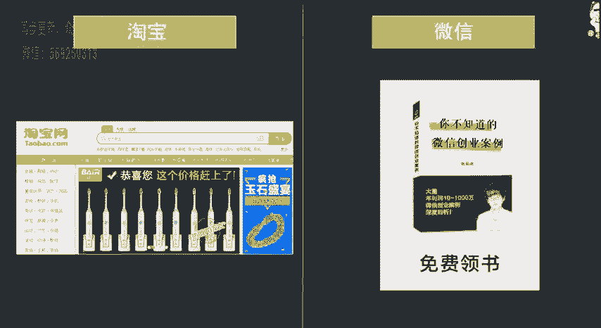
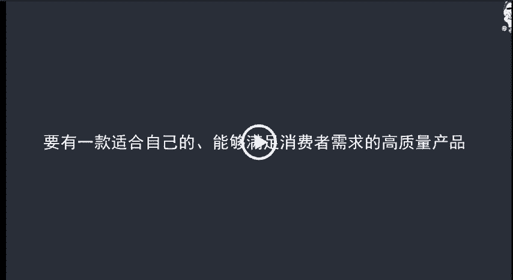

# 微社群裂变营销私域流量池增长秘籍创业运营销售获客视频课教程 合集 8套 374资料 13.1G - P4：01 微信电商不是流量电商选品要以人为核心 - 高端网创试错赚钱大师 - BV1sr421F7AZ

开始呢我们来讲选品呃，来教会大家呢去选择呃适合自己，而且呢比较容易成功的产品。呃，首先在讲之前呢，我们先来了解一个概念，就是微信电商呢，它不是流量电商。我们产品呢要以人为核心。呃，什么意思呢？

我们拿淘宝和微信来做一个举例。那我们淘宝呢它做的是极致单品卖给全国人，微信做的是什么？是不断的推出新品来卖给我们的老客户呃。这个呢我稍微呢给大家来解释一下吧。那只要是做过淘宝的同学应该都了解啊。

我们淘宝做的是什么，就是做爆款，对不对？你有一个爆款呢可以给你带来更多的流量。呃，相对的来说呢它能够。呃，带动你的其他产品啊，也能够卖的更好。而微信呢如果说你有爆款，那是不行的，为什么呢？

因为微信我们不像淘宝一样，它有大量的啊搜索来源，对吧？那淘宝呢他所有的粉丝都是通过关键词搜索进来的那只要是你这个产品呃销量高评价好。那这个流量呢就源源不断的会进来，你可以不断的卖这个产品。

但是微信不一样，微信是什么呢？微信的客户，一部分是我们身边的人转介绍啊，是我们的客户转介绍，一部分呢是我们通过全网推广的渠道，然后呢吸引到我们微信上来的。

那这页就决定了我们能够吸引到的粉丝，他是有限的。有些人他可能再怎么努力，他吸粉不会超过1000。有些人呢可能也就是呃两三万的粉丝，对不对？你就不可能啊拿一个爆款来反复的卖，反复的卖。

即使是呃高频次消费的产品呢，也不会也不可能的。所以说呢。呃，淘宝我们可以一个产品卖给所有的人，但是微信上我们就需要找不断的找产品来卖给我们已经吸引来的这部分客户，他们需要什么，我们卖什么，他们需要什么。

我们我们就卖什么，对吧？这是一个最简单的概念。呃，那另外呢还有一点是什么？在淘宝上，他所有的客户都是通过关键词搜索进来的。为什么他会去搜索这个关键词呢？就是因为他有需求，对不对？

比如说现在夏天我想买一件T恤衫，那我就会去淘宝上搜T恤，然后出来的，都是与这个相关的产品，哎，只要有感觉满意到。我点进去基本上有80%以上的概率会下单，对不对？但是微信不一样。

微信呢它很多人实际上本身呢对产品它没有一个非常刚性的需求啊，可能呢就是感觉呃你卖的这个产品啊还比较有意思。或者说呢我可能会有需要，仅仅是可能有一种这么比较小的概率，所以说呢我们需要什么呢？

去调动他的这个需求，让他能够把这个潜在的需求变成刚性刚性的需求，哎，这是微信和淘宝有一个非常大的差距。

呃，所以说呢也是啊因为这几个差距呢，淘宝卖家来做微信的话，相对来说做的都不是特别好。因为呢思维转变不过来。另外呢还有一个小的差距是什么？呃？淘宝呢基本上都是你发货评价之后呢啊就不怎么管啊。

现在大部分卖家仍然是处于这个一个状态。虽然说这个状态呢并不是特别好，而微信呢我们不能这样发货之后呢，仅仅是你下一次营销的一个开端，我们还需要去把这个客户维护好。因为我们还有大批量的这个产品要卖给他们。

对不对？所以说呢我们做微信的时候，要有一款适合自己的，能够满足消费者需求的高质量产品。而且呢通过这一款产品，我们积累了一部分客户之后呢，我们要在客户的基础上再去布局自己的产品矩阵。那产品矩阵如何布局呢？

在后面的课程中我们也会讲到。

