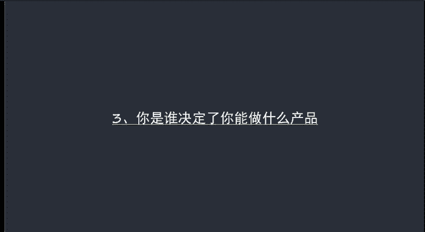
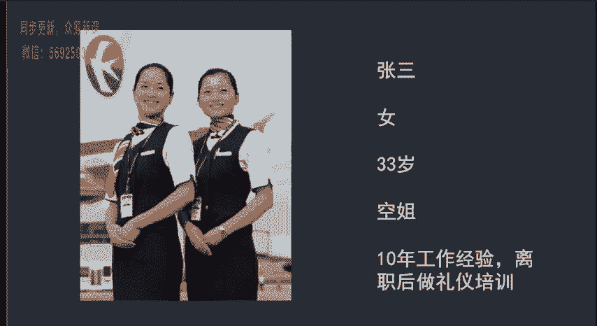
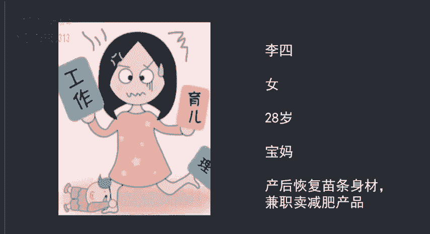
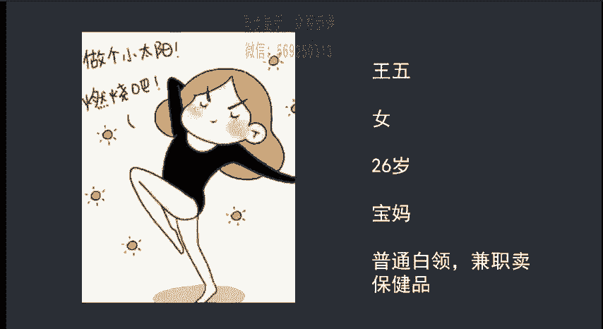
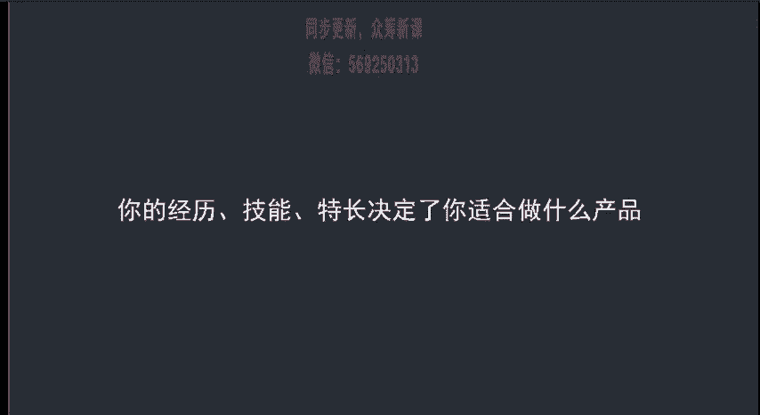

# 微社群裂变营销私域流量池增长秘籍创业运营销售获客视频课教程 合集 8套 374资料 13.1G - P5：03 你是谁决定了你能做什么产品 - 高端网创试错赚钱大师 - BV1sr421F7AZ

第三节课来给大家讲一下如何选择一款适合自己的产品。之前呢大家都应该听过这样一句话，要成为你粉丝的意见领袖。但是呢要成为绿剑领袖。首先你自己在这个行业要有所了解呃。

或者说呢你要比你的粉丝更懂得更这个行业更加的专业。而这个呢短时间是无法实现的。所以说要从本身实际情况分析到底什么产品适合自己来举一个比较极端的例子，方便大家理解。

比如说有这样一个衣衫褴褛的人，他要告诉你他自己做礼仪培训，你觉得合适吗？或者说你会跟他学习吗？呃，我相信肯定是百分之百的人呢，不会跟他学习，对吧？因为他的形象与他要从事的礼仪培训这项工作呃。

根本就不适合。所以呢你想要让别人相信你有实力做礼仪培训。首先你自己的在着装、仪表、行为用语等方面呢，证明你自己有做礼仪培训的实力才行啊。比如说你是空姐。呃，举一个例子啊，张三33岁的时候呢。

从阿联酋航空离职，然后呢有十年的空姐经验，呃，回家后自己开了一个礼仪培训班，是不是可以呢？这样实际上就可以了。因为他有工作经历和被公司背景呢作为信任背书。

做礼仪培训绝对是很容易让人信服的那如果说有另外一种情况啊，同样是张三，他做空姐啊，但是呢只有一年的工作经验，他能做礼仪培训吗？哎，我认为这个也是可以的。但是呢他在客户定位上就要发生一些变化。

你比如说有十年空姐经验的阿联酋航空毕业的那你就可以去做成人的礼仪培训。如果说你只有一年的空姐经验，你实际上就可以针对儿童做礼仪培训。那这个也是可以的。

我们再来举一个例子啊。李四啊，女生也是那28岁的宝妈，她自己在生完小孩之后呢，利用了某种方法，身材恢复的非常不错。所以说呢她在微信上来卖这个相关的产品，是不是可以，这个也是可以的。

因为自己本身就是很好的新任背书，自己体验了产品，受到了好的效果。你再去跟粉丝讲的时候呢，也有内容可以讲，也知道怎么能够打动客户。更重要的是这个方法有用。但是如果你自己没有体验，直接去卖的话。

就会发现完全找不到营销的突破口。这样讲，大家应该能够明白基本意思吧。为了加深大家的印象呢，我们再来看一个案例。

王五26岁的女生是一个普通的白领，然后上班期间呢，她兼职卖保健品，这个适不适合呢？我们都知道保健品相对来说，它针对的都是中老年人呃，对于一个白领来说呢，做保健品是不合适的。

除非说你有什么呃营养自质症或者有其他的一些比较强的信任背书。能够做出一个有充足说明力的信任背书，那这样是可以的。但是呢有这种信任背书的人，他是不会来做微信电商啊，也不会在呃也不能这么讲啊。

他是不会在微信上来卖保健品的。所以说呢这个选择就不对了。这是给大家举了几个例子啊，那总结一句话是什么呢？就是。

你适合做什么产品，是由你的经历技能和特长决定的，选择自己有优势的产品，其实呢是更加容易成功的。那么具体应该如何选择呢？首先就要学会分析自己的优势。这个呢在下节课的时候呢。

我们会配合一张表格呢来给大家进行讲。

