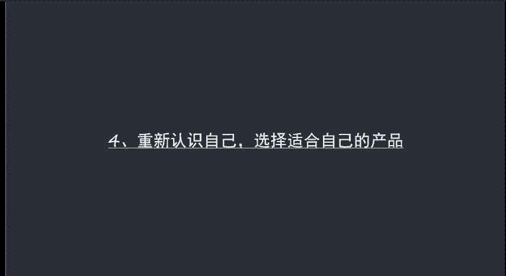
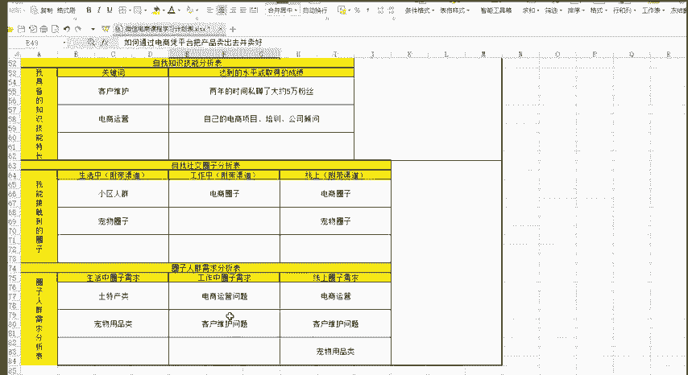
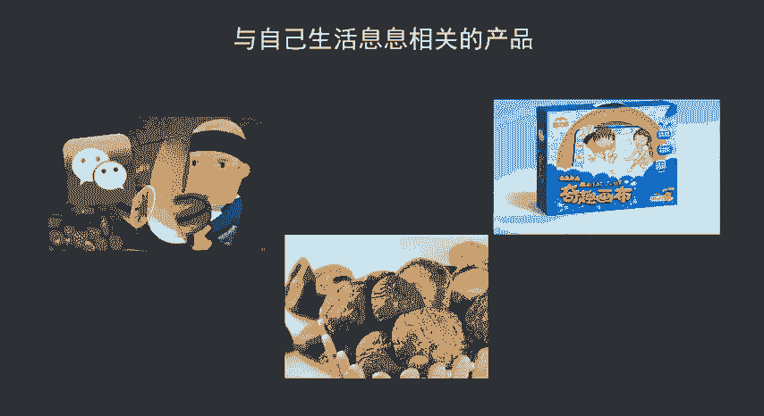

# 微社群裂变营销私域流量池增长秘籍创业运营销售获客视频课教程 合集 8套 374资料 13.1G - P6：04 重新认识自己，选择适合自己的产品 - 高端网创试错赚钱大师 - BV1sr421F7AZ

第四节课啊来给大家讲一下如何重新认识自己，选择适合自己的产品。那这节课呢主要是配合一张表格来给大家讲一下。

好，我们来看一下这个表格啊。好，我拿我自己来举一个例子啊，比如说我的姓名张一成，然后性别是男，年龄29岁。啊，首先呢是对自己的性格优势呢进行一个分析啊，包括性格劣势啊，像呃性格的特征关键词耐心。

然后举一个例子说明，那曾经呢是做过哈尔的售后客服。然后呢呃遇到了一位就是上来用方言破口大骂的这样一位客户啊，然后呢进行安抚啊，包括让客户最后呢让客户非常满意，这都是一些经历，然后呢自信啊。

比如说呢我曾经在刚毕业的时候，然后呢去一个人接了公司的市场营销推广工作，然后呢后来做的也还不错啊，然后是有责任心呃，具体呢应该是呃什么事情我把它写出来，还是慵懒啊，平实呢可能会比较懒散一些。啊。

这是我的一些性格特征。然后呢，我的优势性格特征呢也进行一下分析。比如说耐心，然后呢也去事例。实际上这个呢跟上面这个是稍微有点重复的啊，只是为了能够让大家把自己的性格特征呢呃进行更明更明显的区分。

那这个呢就不给大家来讲了啊，因为这个也并不是说特别的重要，只是呢能够让你知道你自己的在性格上有哪些优势和哪些劣势。更重要的是下面的。工作经历。比如说我的工作经历，那12年的时候呢。

是在山东做了海尔售后客服。呃，积累的什么经验呢？就是能够让客户满意和让不满意的客户呢。变得满意。那培养到什么能力呢？就是售后处理和客户沟通能力啊，取得了哪些成绩，这个就不讲了啊。

然后13年的时候也是在山东，然后是做了市场啊，能够呢如何让客户买更多，且能够回头买。呃，当时呢也是做的相对来说我感觉啊，包括今天我都感觉我能够做那样也是不错的了。呃。

每年呃都会有这些老客户呢能够来到我们当地的旅游市场，然后来找我来买产品哎这个。呃，可以说是让我比较骄傲的一件事情啊。因为第二年来的时候，好多人还是刻意的来找我买来找我买产品。然后培养了什么能力呢？

就是销售流程和客户心理的把控。哦，然后14年呢是来了南京，跟我们的蒋辉老师一起呢学习，然后是做了一个微信电商的课程呃。呃，能够呢学习到了呃积累到的经验呢，就是如何通过电商平台把产品卖出去啊。

培养了什么能力呢？就是像产品的差异化的塑造啊、定位文案等等这些。呃，然后是我具备的知识技能特长关键词，比如说客户维护两年的时间，私聊了大约5万粉丝，然后电商运营呃，自己的电商项目培训啊。

包括像一些公司的顾问等等，这都是自己的啊能够体现自己水平，或者说是自己取得的一些业绩。然后呢，我能够接触到的圈子，生活中的小区人群，然后宠物圈子工作中的电商圈子。然后线上的是电商圈子和宠物圈子。啊。

圈子人群的需求分析表，然后呢是分析一下你的圈子里这些人他需要什么。比如说生活圈子中，那小区的人他可能需要一些土特产，然后啊宠物圈子呢，他可能就需要一些宠物用品之类的啊。

工作中的圈子呢相对来说就更简单了哈，电商运营以及客户维护的一些问题。然后线上圈费的需求，电商运营客户维护和宠物用品类的。呃，这样的需求。那这个表格呢看起来实际上也是非常简单的啊。

主要是让你能够把在脑海里那些模糊的东西呢能够具体化啊，写出写出来之后呢，你就知道自己做哪一方面就更加优势。那相对对比一下啊，从我的工作经历，还有我的一些技能，还有我的社交圈子来说呢，我从事电商运营啊。

从事电商呃方面的工作呢是最合适的。因为呃不管是从哪方面来说呢，我是最有优势的对吧？

呃，那大家呢就要根据这张表去分析一下自己的特征，对应的应该做哪些产品或做哪些行业是比较适合的。嗯，这个表写完做完之后呢，你可以私聊发给我啊，我来帮你分析一下啊，或者帮你呢提一些建议。好。

上面我们讲到的是啊，我们应该如何重新认识自己，选择自己适合的产品。那讲到这里呢，可能有些同学还会存在这样的问题啊，就是说我就是一个普通人，没有任何特长和技能，我还能做微信电商吗？那这个也是可以的啊。

但是怎么做呢？也给大家一个思路。我们做的呢要做和自己生活息息相关的产品。什么叫和自己生活息息相关的产品呢？比如说呃你身边有做水果批发的，那么你可以从他那进货。

在微信上以小区团购或者身边人团购的形式进行销售，门槛呢比较低，而且呢水果都是人人需要的产品，你不需要有其他的特征，你都可以做，只要是你能找到货源。第二个呢就是呃你可以做一些啊，比如说啊你是农村的。

或者说你在农村有亲戚啊，有资源，那你可以把这些土特产放到微信上去卖。呃。这个呢也不需要你有什么人格体啊，只要是你能够把农村人的生活，还有你这些土特产，它的一个生长环境等等发出来就可以了。呃。

再比如说你是一个宝妈，你在家带孩子，那么你可以把自己孩子吃的用的玩的比较好的产品呢分享销售。同样呢也不需要很专业的形象啊，只需要表现呃只需要表现自己的真实宝妈生活，自己孩子的日常玩乐。

然后呢加一点点幼儿的知识分享就足够了。但是呢这些基本上呢都是每个月多赚个呃一两千块钱而已，想要赚更多的话，我们就需要在呃方方面面啊，下手下功夫了啊。呃，那下一节课呢我们再来给大家讲一下啊。

如何选择一个更容易成功的产品。

