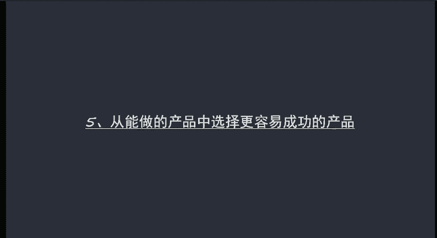
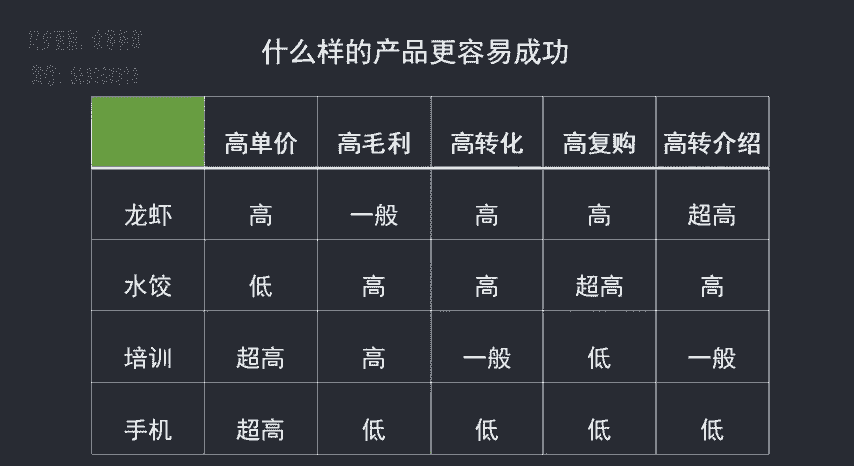
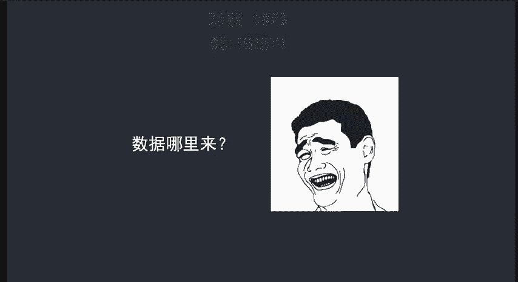
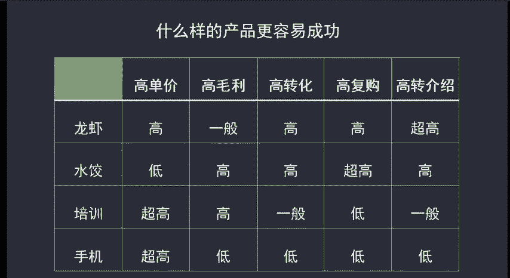

# 微社群裂变营销私域流量池增长秘籍创业运营销售获客视频课教程 合集 8套 374资料 13.1G - P7：05 从能做的产品中选择更容易成功的产品 - 高端网创试错赚钱大师 - BV1sr421F7AZ

好，第五课我们再来讲如何从能做的产品中找到最容易成功的。呃，根据我们多年的经验呢，总结出了一套判断一个产品在微信上卖会不会比较容易成功的方法论。呃，从5个维度来分析。

呃，高客单高毛利、高转化、高复购和高转介绍。如果一个产品呢能够满足这5个维度都占比比较高的话，那么在微信上呢一定是可以卖的很火。呃，而且呢是可以做的很大的。但是一般这样的产品呢是不好找的。

或者说根本就是不存在的。所以说我们在产选择产品的时候呢，只要是能够找到两个维度比较高就可以了。呃，看课件上的这几个例子啊，像我们自己投资的龙虾客单价呢就比较高，基本上都在230以上。

而且呢因为是做的比较好吃，有特色，所以说呢转化率和转介绍都比较高。这类产品呢我就可以做。呃，再比如说。呃，我们投资的水饺毛利率转化呃，复购和转介上呢都很高。虽然说客单价低一些。

但是呢已经是一个难得的好产品了。像这种产品来说呢，只要是呃你很勤劳呃，基本上呢都可以卖的非常好呃。然后呢还有一个就是呃培训呃相对于培训来说呢，客单价和毛利率呢都比较高。但也所以说呢也比较合适。

但是呢呃像手机这一类的产品呢就不是很合适了。因为除了客单价之外呢，呃不管是毛利还是转化率都比较低。呃，因为像这类产品的的话，它对你的信任度要求是比较大的。呃又因为手机的特性呢。

基本上呃一两年才会换一部手机，所以说呢复购也会比较低。因此呢做手机难度就非常大。除以说你有实体店相结合，这样是可以的。呃，那这样一讲呢，大家实际上可能觉得很简单啊，但肯定也是有疑问的。

比如说我是一个小白，或者说我还没有做这个产品，那我怎么去获得这些数据呢？呃，这个呢是大家比较关心的，也是之前我们学员啊经常问到的。

呃，不知道数据，我们就没法判断这个产品好不好卖。那我们的解决办法是什么呢？就是参考同行呃，直接问同行那肯定也是不会告诉我们的对吧？所以说我们要用微信小号用顾客的身份呢去和同行进行交谈。

必要的时候也要购买同行的商品来获得更多的关键数据。另外呢有些产品呢是可以参直接参考线下实体店的销售情况啊，这个呢也不是说直接去问的啊，而是我们应该去蹲守几天。然后看一下他每天的进店流量啊。

大约转化数据等等。在这些基础上呢，结合行业呃，我们可以在网络上查到的数据呢做出判断啊，基本上你就能够确定你要不要去做了。呃，如果说你有能力，直接能找到行业内做的不错的人来给你带路的话。

那你可以获得更精确的数据。呃，对你来说呢也是呃最有利的啊也是最有利的那这个呢就是给大家讲的啊，如何去判断一个产品呃，在微信上好不好卖，有5个维度。

高单价、高毛利、高转化、高复购和高转介绍。只要是有两个维度能够达到高。那这个产品呢我们就可以去做。如果说有两个以上的呃维度呢都比较高，那这个产品就是非常好的产品啊，是一定要去做的。好。

这节课呢就来给大家讲这么多啊。如果说有什么不懂的那我们就通过微信来聊这个呢实际上看起来很简单啊，但是你在实际上操作的过程中会涉及到一些数据问题啊，相对来说会复杂一些啊，大家呢一定要认真去思考。

认真去分析自己的产品。

