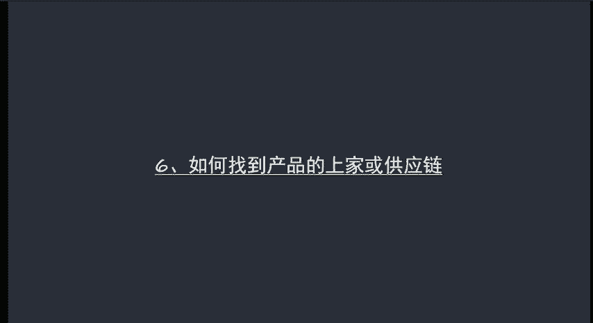
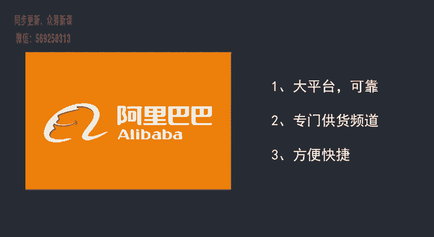
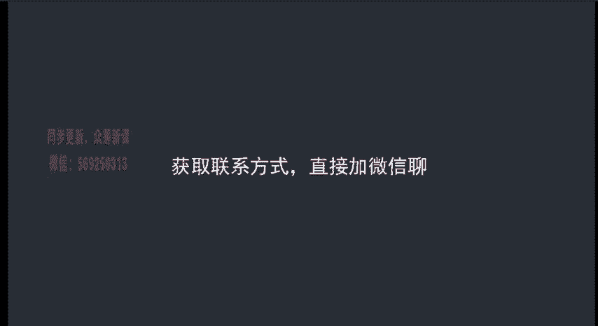

# 微社群裂变营销私域流量池增长秘籍创业运营销售获客视频课教程 合集 8套 374资料 13.1G - P8：06 如何找到一个好的供应商 - 高端网创试错赚钱大师 - BV1sr421F7AZ

开始呢来给大家分享一下啊，如何找到好的产品供应链，或者说找到好的上家。呃，这是我们做微信电商非常关键的一步。为什么这么说呢？因为我们没有稳定的供应链或者商家提供的产品，提供的产品有问题。呃。

上家本身有问题的话，我们即使销售流程做的再好，那也是没用的。呃，因为产品出了问题之后，客户是无法接受的，客户对我们的信任呢，也会大大的降低。

呃，首先第一个渠道呢就是阿里巴巴一个还算是比较靠谱的货源渠道呃，分为淘宝货源和微信货源两大类型。微供是专门给我们微信电商平台提供货源的子类目。除此之外呢，阿里巴巴上厂家作为上家是比较方便快捷的。

他们一般呢都会提供足量的图片以及一键代发服务。而在微信电商方面，他们自己呢也积累了很多的素材赠品等等，可以供我们选择使用。啊，这是我们选择阿里巴巴作为第一平台的一个原因。

我们可以在百度上或者说在其他搜索引擎上输入阿里巴巴，直接来搜索这个网站，然后点击登录呃，或者说呢我们在地址栏输入网址3W点1688点COM进入。进入之后呢，我们选择左上角的微商进货。

进入我们讲到的微供页面。那这个呢就是我们的微供页面，我们也可以呢直接登录网址WG点1688点COM来进入这个网址。好，我们打开一下这个网址啊，给大家看一下。那这个呢就是1688的网址，我们点击微商进货。

然后呢进入了就是这个微供的页面。呃，像这边呢是有一些类目，我们可以选择。然后下面呢都有一些产品的推荐。呃，这些呢相对来说都是推广比较好的产品。那这么多产品里面我们应该怎么选呢？主要是有几个参考数据。

我们来看一下。第一个数据呢是代理人数。第二个数据呢是响应速度。第三个呢是回头率。第四个是公司相册。第五个是我们需要去私聊。那这几个数据的它标准是什么呢？我们来讲一下啊，呃，首先代理人数呢。

我们尽量选择大于5万的代理人数大于5万的这样商家去合作。第二呢，响应速度，响应速度呢最基本的要求就是要高于同行6%以上，你跟同行持平这样的呃供应商呢，我们尽量也不要去选择。然后是回头率。

回头率呢至少要40%。因为回头率的高低，它直接就决定了你这个供应商合作是不是诚信，以及你的产品是不是能。能够让消费者或者说让我们这种卖家满意。然后另外一个呢就是公司相册，呃。

公司相册呢它需要有足够多的产品照片能够提供给你使用。如果说产品照片少的话，你在后期发朋友圈啊，或者做其他素材的时候，就非常的呃难去搞一些素材。呃，最后一个呢就是私聊能够提供哪些服务呢？我们在私聊的时候。

让他来提供啊。呃，我们先来看一下如何去看代理人数。呃，我们随便来看一下，比如说我点击女装，点击女装，然后它会有这么多的产品推荐出来。然后我把鼠标放在任意一个产品上，大家可以看我一放上之后呢。

它下面会出来公司，公司下面有一个代理人数啊，代理人数是79万。那这样呢我们就可以知道每个产品的代理人数是多少。比如说这个是6万。那我们就按照这个方法呢去找代理人数。呃。

像响应速度啊同呃回头率这个怎么看呢？比如说啊就这还是拿这个产品来举例子，我点开。点开之后呢，我们可以看到啊在上面有这样一啊，有这样一行啊，上面有货苗4%，响应22%，发货8%，回头率44%。

那就说明这家呢我们是可以跟他合作的。你只需要呢再去点击旺旺跟他们私聊，然后聊一些呃相对应我们需要知道的事情就行了。好，这个呢就是我们在去判断的时候呃，需要注意到一些事情。那私聊具体怎么私聊呢？

也给大家一个思路哈，我们需要问哪些内容。呃，比如说第一，你是不是可以给我提供一件代发的服务？第二，是不是在价格上有其他的优惠啊？如果说初期啊我初期拿货量比较少，或者说我卖的比较少的情况下啊，你不给优惠。

后期我达到一定量，是不是可以给我优惠。第三是能不能提供一些呃。根据我们自己的实际情况，他能不能提供一些微信素材呃，第四呢就是能不能有专门的服务人员对接呃，因为呢你做微信电商的话。

很多情况会呃我们自己呢没法解决。我们需要呢呃让他们来帮我们解。第四个呢就是能不能有专门的服务人员对接。因为我们在做微信电商的时候呢，可能会出现一些呃比较刁蛮的客户啊，或者一些售后问题。呃。

当有问题的时候，你通过旺旺联系呢，相对来说就会比较慢。客户呢可能就会反馈不好。所以说呢如果他们能够有专门的对接人员的话，那就能够及时的啊，在第一时间呢能够解决我们遇到的问题。呃。

第五个呢就是能不能提供活动支持，活动支持呢也是非常重要的一点啊。也其是对于我们呃新卖家刚刚开始要去吸粉，要去做促销。如果说没有活动支持的话，你自己去拉产品做活动。呃，那这个成本呢就比较高了哈。

如果说他们能够提供一些活动的产品给你支持，那呃就是最好不过的。然后第六个呢就是如果出现售后问题呢，应该怎么解决？呃，刚才我们上面讲到的是有服务人员，他出现售后问题呢，能够第一时间联系到。第二个就是呃。

应该如何解决是退货呢，换货呢呃退货周期是多长，换货周期是多长等等等等。这个呢也要跟他进行交流，包括像呃快递的运费之类的啊，都是要提前沟通好的。呃，因为呃如果说你不提前沟通好的话，后期出现问题。

真的是太容易扯皮了。呃，这样对你来说对客户来说呢都不是特别好。那我们在还有一个问题啊，刚才我们也讲到了，就是要不要考虑货苗呃，这个因素呢？呃，我觉得这个是完全没有必要考虑呢啊。

因为呃只要是我们看好一款商品的话，我们最好还是能够把这个产品买回来，自己体验一下。这样呢你再去销售的时候，也有东西对外讲，你也知道这个产品具体是什么样子的。如果说你不买的话呃，你对产品没有见过。

你对产品的呃属性啊也不了解。那你再去卖的时候，自己内心多多少少还是有些心虚的。呃，这个呢是通过阿里巴巴呃来进行选屏。那还有几个选举方法呢，像微店、微选之类的，我们应该怎么用呢？呃。像在微店和微选上。

你去选品的话啊，我建议大家呢你不要直接去跟商商家就去他说我要代领你的产品啊，我觉得你这产品好，想卖你的产品之类的，不要这样。而是呢。呃，通过这些平台呢去获得他们的联系方式，然后呢。

加到微信上以客户的身份去聊来买产品。然后呢，在这个过程中呢，你去摸一下这个上家他的呃性格呀之类的怎么样啊。如果说他能够很好的服务你的话，呃，把你当做把你这个客户服务的比较好，那你是可以再去跟他谈的。

如果说你在买了产品之后，你再去找他呃，聊一些事情，他对你爱搭不理的话，或者说态度不好的话，那这种商家呢呃干脆就直接抛弃，不要做啊，这个是在呃微店啊微选上去选品。

