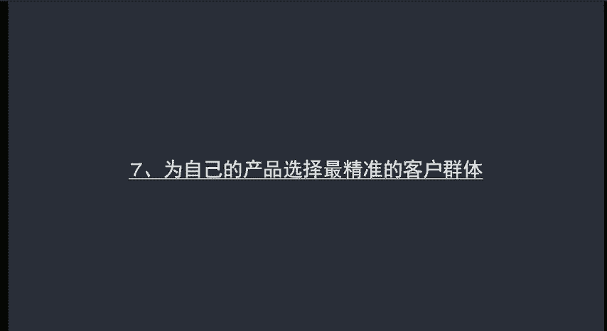
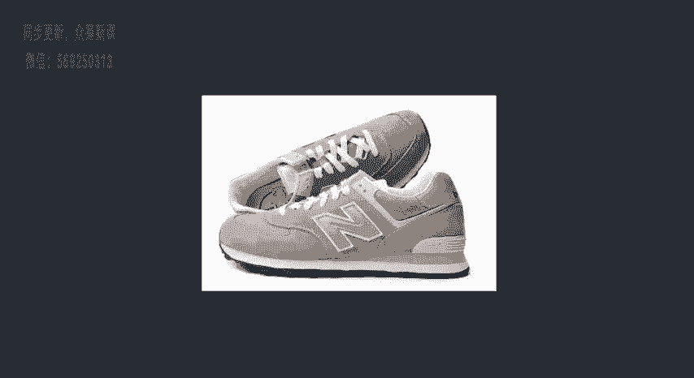
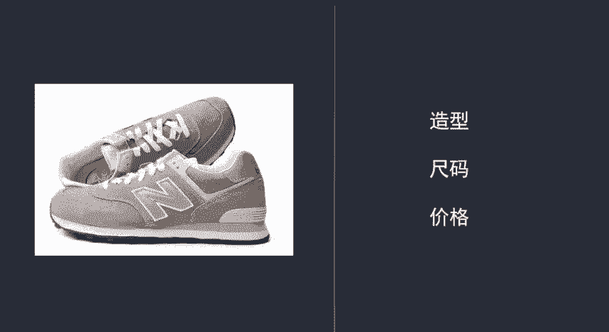
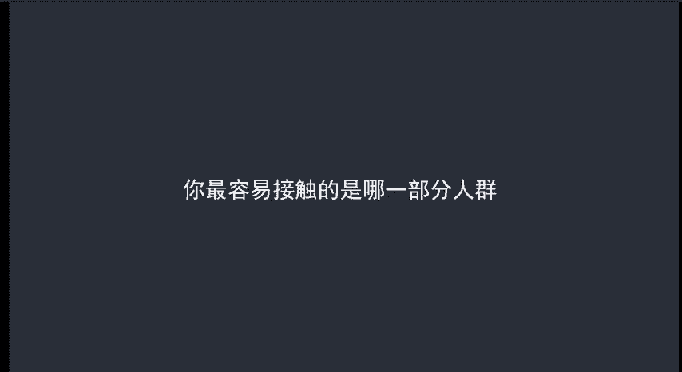

# 微社群裂变营销私域流量池增长秘籍创业运营销售获客视频课教程 合集 8套 374资料 13.1G - P9：07 为自己的产品选择最精准的客户群体 - 高端网创试错赚钱大师 - BV1sr421F7AZ

即客为自己的产品选择最精准的客户群体。呃，这个呢也是非常重要的一节课啊，客户群体呢呃是不是精准，决定了我们再去细粉的时候能不能顺利完成，以及呢能不能吸引到的粉丝呢，他的转化率是比较高的。呃。

大部分新手卖家呢在这里是容易犯一个错误啊，觉得所有的人都可能是自己的精准客户。呃，想尽一切办法呢去加人，结果嫁了一堆人也没没卖出去一单呃，来举一个例子。

比如说我们卖正版的新百伦鞋子，如果你的鞋子用途呃，如果你从鞋子的用途角度来考虑的话，你会发现，只要是有脚需要走路的人呢，都可能会买我的这双鞋子。呃，工人买来呢可以穿着工作防滑，对吧？

学生买来呢可以穿着比较有面子。那老人呢可能会买给自己的孙子等等。啊。这样想的话，理论上确实是没有错的。毕竟每个人都有可能啊，有一定的几率来买我们的鞋子。呃，但是呢。这些都是个例。

他可能在1000个客户里面只有一个。所以时呢我们不要去拼这个概率，毕竟这个概率发生的可能性实在是太小太小了。呃，而是应该呢要从其他的方面分析一下，到底什么人最有可能来买我们的这个鞋子。

那这部分人呢就是我们最精准的客户群体。

呃，现在我们知道了啊，觉得所有人都适合买我们鞋子肯定是不对的那我们应该从什么方面进行人群细分呢？呃。来看一下。比如说造型、价格、尺码、用途等等呢，我们都可以从这些方面来去分析。新百伦的鞋子。

即使是过去打折销售的，也会在500元以上。造成呢工人是基本上不会舍得买这么多呃这么贵的鞋子去打工的呃，这个可能性不大，对吧？那学生呢学生我们也要从几个层次来分析。

首先18岁以下的学生消费都是由自己的爸妈来掌控的。那去营销，他们的爸妈呢在微信上购买我们的产品，相对来说难度就已经是更上一个台阶了。因为他们可能更喜欢去实体店，带着自己的孩子去买，享受这种购物的感觉。

呃，所以说呢这部分人呢并不是我们的精准客户。那18岁以上的学生呢基本上已经实现了经济独立，或者说呢可以自由决定消费行为了。呃，他们对于品牌的追求呢也开始进一步的扩大。所以说呢我们就可以从这部分人群入手。

呃，另外的人群呢还有像白领，他们适不适合呢？呃，如果说上班穿正装的话，那你再穿个运动鞋肯定是不适合的。呃，如果说上班对着装没有要求的话，他们对这个鞋子还是有需求的啊。或是分析出这些需求人群之后呢，我们。

还要再进行一轮筛选，筛选什么呢？你最容易接触到的是哪一部分人群？比如说我们刚才筛选，我们知道了白领可以来买我们的鞋子，学生可以来买我们的鞋子。但是我们可能没办法，两个人群都接触得到。

比如说我们现在已经是工作的白领。那你再去接触学生的话，呃，相对来说渠道就比较窄了。对我们来说接触白领更容易，对吧？如果说你现在是学生，那你卖给学生更容易，你卖给白领的话，相对来说困难就更大了。

这个呢也是我们大家要去考虑的问题啊，非常现实的一个问题。这节课呢相对来说也不难，也很容易理解啊。但是呢你理解并不代表你学会了。呃，这节课听完之后呢，下面的课你先不要听，你先把这个再好好想想。

然后把你的精准人群啊写一下，写下来，分析一下哪个人群是你最精准的人群。

