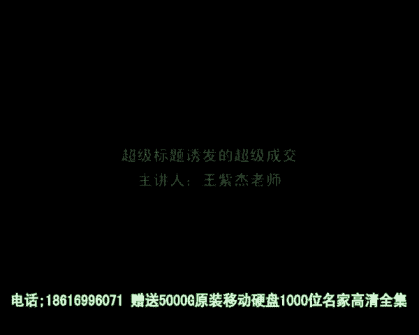
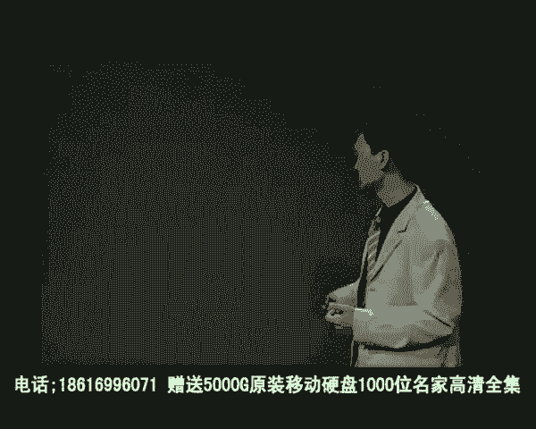

# 微社群裂变营销私域流量池增长秘籍创业运营销售获客视频课教程 合集 8套 374资料 13.1G 倍增业绩最快的方法：SRO - P3：04 超级标题诱发的超级成交 - 高端网创试错赚钱大师 - BV1Pm421G7nu

好，亲爱的朋友，我们继续来学习网站成交率优化SRO的知识。那么在这一讲呢，我跟大家来介绍一个非常关键的技巧，就是如何来写标题。那么写好标题有什么好处呢？叫做超级标题诱发的超级成交。

那么不同的标题引发出成交是截然不同的。我经常跟人家开玩笑说，哎，改个标题让成交率倍增。所以呢字字千金就是这个道理。一个网站其实最核心的要素之一就是标题，那么写好标题的网站成交是截然不同的。

我通过案例来大家展示一下到底超级标题如何来诱发超级成交。我给大家分享一个让你永生难忘的超级标题，请大家来看。那么这是一个台湾的网站，他卖的这种特殊的洁净产品。那么这个网站的标题是什么呢？大家一起来看。

你用马桶洗衣服。你看这标题喽，我再说一遍，你用马桶洗衣服。哇，你看到这个标题之后，你马上有什么感觉你感觉非常的意外，非常的惊讶。😡，非常难以置信。看了这个标题，你就要看后面的内容，对不对？好。

我们继续看后面的内容是什么。恐怖据调查，洗衣机比马桶脏530倍。你看这个标题子标题多么吓人啊，恐怖据调查，洗衣机比马桶脏530倍。然后呢，这个网站不止写了恐怖的标题，让你立刻被他吸引住。

而且还放了一个图片。你看啊一个很惊讶的一个女人。然后呢，这边是你洗衣机，一个等号，下边是一个马桶，然后下边是一个新闻报道。所以呢在这个网页里边立刻给你立刻的刺激。让你感觉马上就被他牢牢的抓住了眼球。

你用马桶洗衣服吗？谁会用马桶洗衣服呢？没人会用马桶洗衣服啊。那么你为什么要说用马桶洗衣服呢？因为他这里说洗衣机比马桶还脏，而且不是脏一点，是脏530倍。所以你用洗衣机洗衣服相当于。😡，用马桶洗衣服。

而且甚至比用马桶洗衣服还要脏。所以这么一个标题马上就立刻牢牢的抓住了人们的眼球。那么这么一个简单的文案，就把这个产品卖的非常的火爆。我们来看一下。😡，那么除了这个标题抓着我们研究以外。

还有什么地方吸引我们研究？😡。

那么后边呢就是他文案的几个信息块，就是很多的部分。我们来看其中的一个部分是什么呢？这里边是有一个视频，这边是对视频的解释。那么这个上边这个标题是什么呢？他说你是洗脏衣服还是洗脏衣服。

你看这个标题是不是很有意思啊，你看他说的是你是洗脏衣服还是洗脏衣服？😊，那什么叫做洗脏衣服呢？就是说洗衣机用来做什么呢？把脏衣给扔进去，把它洗干净。但是他说你如果搞错洗衣机或者是不懂其中的一些关键点。

衣服会越洗越脏，所以不是洗脏衣服，是洗脏了你的衣服。所以这样的一个标题马上就让我们产生巨大的好奇心。哎，到底什么叫把衣服洗脏呢？所以他就会接下来往下看，他看什么地方呢？这个地方有蚊字不吸引人。

他会重点看右手边的视频，他一点击就会发现原来有新闻报道说，大多数家庭里面的洗衣机由于滋生的细菌非常多，又没有及时的清洁与消毒，所以导致洗衣机本身是非常脏的，甚至比人家马桶还要脏。

那么你看了一个视频就产生了恐惧的洗理需需。哇，我洗衣机原来这么脏啊，那么视频该想办法处理一下。好，那么这就是非常有效的一种文案组织模式，直接引用一个新闻报道的方式，让你产生巨大的恐怖恐吓的呃。

恐惧的心理，尤其是一个标题，把这种恐惧的心理给放大出来。那么还没有结束，我们来看他把恐吓性放到了极致，让你产生更大的恐惧。你看他怎么写的？他是这里的标题是别再穿比马桶还脏的衣服了。

你看你下子你的衣服很干净吗？比马桶还脏喽。😡，光鲜亮丽的洗衣机外表架内槽外部近暗藏污垢。告诉你，你别再穿这光鲜亮的衣服，实际上上面比马桶还脏，因为呢上面有很多的污垢是你不知道的。

那么如何来证明这个标题的恐怖诉求是能够有说服力的呢？他又放了一张图片，这里写了您不可忽视。什么样的图片呢？是一个小孩子满脸都是感染的脓疮。然后下边写的是洗衣机内的细菌，可能会对薄裹的皮肤造成伤害。

你不是一开始不重视洗衣机问题吗？你不洗衣机比马筒还脏，你感觉也吓不到你，对不对？好，我给你一个更恐怖的事情。那就是你看你家的保本，如果你不清洁你家洗衣机，你保我的皮肤就变成这样子喽。😡，很恐怖吧。

你不希望自己宝宝的皮肤呃，满脸的都是那种暗疮，满脸都是那种血痕吧。那么你就要清洁你家的洗衣机了，不要伤害你宝宝的皮肤。所以呢这段的文字呢？就开始解释为什么洗衣机需要清洗，不清洗有什么害处。

所以这个文案通过首屏的大标题，再通过第二屏的标题，再通过第三屏的标题，不断刺激，你不断放大恐惧感，让你看了之后马上就产生了巨大的需求欲望。到底我们家洗衣机该如何清洗呢？😡，好。接下来呢产品就出来了。

这个产品是易洁净，洗衣潮的spar专家四大特色还泥530倍的洁净。啊，他卖的是什么呢？叫易洁净专门清洗你家洗衣机的洗衣槽的清洗液。那么它可以让你家洗衣机变得更加的干净。卫生更加的安全与健康。

所以呢当你产生巨大的恐惧感的时候，行动力就产生了。就我说的三大成交动力叫做狼乔与堂。那么这个网页文案它重点强调的呢就是狼。就是狼，不要再去。呃，使用比你家马桶还脏的洗衣机了，不要伤害你家保我的皮肤了。

你要使用易洁净易洁净。所以呢这一类的标题我们叫做恐吓型的标题。那么恐吓型标题呢，它对于网站成交有巨大的帮助与好处。在这里呢我来跟大家介绍一下恐吓型标题的创作模式。第一个，你要寻找客户可能的风险。哎。

如果他不买你的产品，他可能会有什么样的隐患，比如说你是卖保险，那客户不买保险可能有什么样风险呢？比如说啊发生意外以后，他的家人没有保障，不买保险。比如说他失业之后可能没有社会救济。

所以呢你要把不使用你产品扣可能有的风险罗列出来。把其中最大的风险变成你的标题，马上就会吸引人们的眼球。第二个。恐吓型标题可以从哪里选取素材呢？可以从竞争产品的缺陷入手。竞品的缺陷。

比如说你所销售的服装最大的好处呢是量身定制。那竞争产品呢，其他人卖的服装，一般都是标准尺寸的。那么他们缺陷就是不一定符合你客户的身材。所以你要说，如果你买了一件不符合身材的衣服呢就可能让你显得更加臃肿。

或者让你显得更加的病态，让你显得不专业，让你显得没有社会阅律，让你显得没有档次。所以一下就把客户竞品的缺陷变成了恐惧感，让消费者马上产生对量身定制这个好处的认识。所以呢恐吓型标题从哪里来呢？

第二个渠道叫做竞品的缺陷。第三。新闻报道。也就是说，你要去找新闻标题去看哎哎有没有哪些跟你产品相关的，而且恐吓性很强的。实际上我要跟您说啊，新闻标题的那些记者都是很厉害的文案写手。

因为他每天都要写新闻报道，所以他知道什么样的标题最能吸引人们的眼球。因此，绝大部分新闻标题都是恐吓性的。我会告诉你，这里有地震，那里有火灾呃，这里有坠机，那里有抢劫。

所以这些恐吓性标题都能够立刻抓住人们的眼球。同样的道理，你要去协会去借用这些新闻标题为自己所用。😡，而易洁净这个网站，它为什么写出这样的标题呢？它也是直接从新闻标题所引用出来的那新闻标题里边就写啊。

原来呃洗衣槽、比马桶要脏530倍，所以呢我就把它变成标题就可以了。所以他标的写你用马桶、洗衣服。OK好，从哪里来呢？新闻报道。所以呢要想去写恐吓型的标题。最简单的三个渠道呢就是第一，从客户角度思考。

它可能有点什么风险。第二，从竞争产品的缺陷出发，这个缺陷可能给客户造成什么样的伤害。第三，从新闻报道出发，去寻找哪些新闻报道跟我产品相关，而且真的很恐怖。那么把这三个综合起来。

你很容易为你的产品创作恐吓型的标题。其实呢这种恐吓性标题呢，对于抓住人们的眼球放大欲望是非常有帮助的。当你不知道该怎么写标题，当你不知道去描述产品价值的时候呢，你就写恐吓性的内容就可以了。

因为这是一只狼啊，狼越长越大，体型越大，对人们的这个伤害可能越大，为人们制造的痛苦越大，人们的行为也就越强。所以呢三大成效动力其中的狼这个要素用在哪里呢？就用在恐吓型标题里边是立竿这样就会见效果的。😊。

当然你还有最后一种写法，实在不知道该怎么写的时候，你就写过去客户的案例。呃，过过去库克有什么样的那个呃悲惨的经历，然后把它变成标题，然后把它变成案例来分享。所以呢这是孔怖些标题的几种渠道和写法。

那么最后我们总结成一句话，就是标题是提升转化率的非常关键的手段。也就是说修改标题是提升成交率最快的方法。所以呢如果你连最简单最简单方法都不知道该用什么时候呢，你就修改你网站的标题。网站标题一修改。

像易洁净一样，会马上产生不可思议的成交转化率。所以这就是标题的巨大规力。那么我们这一讲标题的创作呢就暂时揭合到这里。

