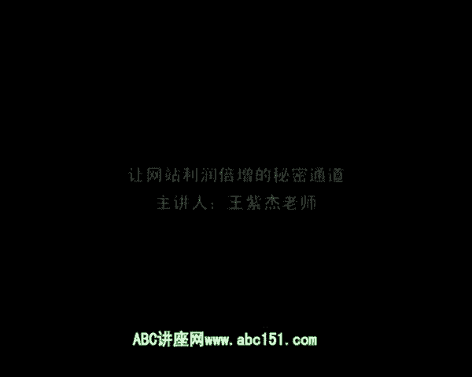

# 微社群裂变营销私域流量池增长秘籍创业运营销售获客视频课教程 合集 8套 374资料 13.1G 倍增业绩最快的方法：SRO - P5：06 让网站利润倍增的秘密通道 - 高端网创试错赚钱大师 - BV1Pm421G7nu

好，亲爱的朋友，我们继续来学习SL的系统知识。那么这一讲呢跟大家来分享让网站利润倍增的秘密通道。那么很多人设计网站啊，做网站啦，然后每天就投广告啊，等着别人来买东西。

他都不知道该怎么去让他的利润增加的更多，成交率更高。那么呢我今天来分享一个系统的思维方法。哎，通过这个系统思维方法，可以让你的网站运营，可以快速倍增利润，不止前端也有后端，不只是成交也有服务。

所以呢只要大家理解的这个系统的方法，也就是这个秘密通道，那么你的网站利润立刻进行倍增。好，我们现在来开始学习这个系统的方法。😊，实际上呢进行网站的优化，进行利润的这个倍增的设计。

其实我们所有的着力点都是一个角色，那就是客户。我们要学会从客户身上要答案。我们所有的答案都是在客户身上都可以解答。因为最终所有的财富都是空心客户贡献给我们的。那么看如何从客户身上要答案呢？

那么我们就要学会去跟客户进行沟通与交流。因为我已经说过了，沟通是一切问题的答案。我们要去跟客户进行沟通，不断的客户进行了解。我经常有客户，我的咨询客户啊来找我说哎，王老师呃，我想请您做咨询。

那么我该怎么启动我的咨询案呢？我一般对他的要求都是一件事，是给你的老客户打电话。如果你一天打10个，你坚持打一个月，那么你至少就能打300个，打300个客户电话。

你基本上就把客户他的担心客户所关心的要素，要解决的问题，客户最大的难点都调查出来了。所以呢网站优化利润倍增。你需要很多很多的信息，很多很多的方法与经验与技巧。但是你知道吗？

最关键的一条就是跟客户进行沟通，从客户身上要答案。所以每一个客户都是你最大的财富。那么到底跟如何该如何跟客户沟通呢，我们来看一下。

实际上呢你只需要去问客户五个问题就可以了。那么这5个问题可以让你的网站利润倍增。哎，这5个问题就把你网站利润倍增的系统全都解决出来。所以呢它是最关键的5个问题。我们来看一下。第一个问题就是痛苦。

什么叫痛苦呢？就是你要问客户，在您了解本产品之前有哪些苦恼？在你了解我的产品之前，没有使用同类产品之前，你有哪些不舒服的，有哪些痛苦的，有哪些难受的，有哪些担忧的地方呢？😡，你要问他。

那么客户就会跟你说，比如说你是卖减肥产品的，就是说啊我的痛苦就是说我体重太大太大了不好看。如果是卖化妆品的时候，我的痛苦就是我脸上的这个雀斑太多。如果你是卖服装的，他的痛苦说啊。

我买不到合适我身材的服装。所以呢你就会很容易的了解消费者购买之前的很重要的一个心理动机，就是他的痛苦着力点是什么。一旦你卖服装，你调查出来，完来很多客户最大的抱怨是说啊买不到合适他尺寸的服装。

你就知道啊，原来我卖服装之前如何来写我的文案呢？我的文案要着力一点放在如何让每个客户都买到自己符合尺寸的服装。所以你就了解了客户的痛苦点是什么。因为我们说过嘛，三大成交动力就是狼桥于糖。

那么狼呢就意味着痛苦。所以人们购买这痛苦越大，行为力越强。所以你要挖掘越来越多的痛苦，你的网站才越容越来越容易成交。所以呢要问第一个问题，就是你在买产品之前有哪些痛苦和苦恼。第二个问题，你要问客户。

也是渠道问题。你问客户什么呢？说您是从哪里看到本网站信息的呢？你是从哪里看到本网站信息的吗？那么他问的是什么呢？问的是渠道，为什么要问渠道呢？原来很简单吧，因为你如果在10个地方投广告。

你总需要知道这个客户从哪个地方来的吧。而且你也要知道哪一个广告，这个客户精准度最高。你要知道哪个广告性价比最好，就投入比较少，转化率比较高。所以呢你要问客户从哪里渠道来。😡，如果你问到客户，他说啊。

我是从百度知道的，其中百度呃上边有一个呃小小的论坛贴子，呃，上面写了好多关于你产品的评价。我是因为看那个评价才买你产品的。所以你通过这一个调研，你马上就知道，原来影响人们的角色，很关键一点。

就要到相关论坛上发软文。所以呢你就可以发动很多人力，把这一个工作给它放大。那么你为什么可以把这个工人工作放大呢？是因为你调研之后，你发现了客户，他了解你产品信息的关键渠道。

所以呢这个问题就直接可以让你的流量更加的精准，让你的广告转化率更加的高，大大的节约你的广告及宣传的费用和精准度。那么第三就是抗拒点。我来看一下，你要问顾客，看到本产品之后，你是立即购买的吗？

如果没有立即购买原因是什么？😡，那么这个问题问的就是消费者购买之前的抗拒点。就是你看到产品的时候，你是有没有立即买？如果没买包的时候有一些担忧嘛，是不是你担忧是什么呢？你知道我的产品是减肥的。

那么你担忧是什么呢？所以消费者就跟你说啊，我担忧第一啊，同类产品很多都试过了，没有效，那你产品也有效嘛，所以对你效果有担忧。第二个啊，你的很多客户见证呢都是南方人，但是我是北方人，所以对北方人也适合吗？

所第三个，你的产品呢看上去包装不是很精美。所以我在想你这个产品这个包装是不是很差是不是无效啊。第四个，我发现你的产品的价格有点高，我在想这么高的那我要不要考虑一下呢。所以你一旦问消费者的心理抗拒点之后。

他会告诉你很多很多他的心理抗拒。而且我可我要告诉你哦，很多抗拒是你事先根本想象不到的。😡，因为你不是消费者，你只能从消费者那里去挖掘他们真真正正内心的想法。

所以呢第三个问题就是问消费者了解信息却没有购买，或者说是迟疑。😡，要不要买它中间主要持于什么问题，所以呢要了解消费者的心理抗拒点。这是第三个问题。第四个问题，诱因。什么叫诱因呢？就是说你要问消费者。

那促使您最终购买本产品的关键原因是什么呢？虽然你有那么多抗拒，但最终您购买了，到底是什么因素最终促使您购买呢？那么有的消费者会跟你说啊，你的减肥产品呢，我一开始很多疑虑。😡，但是最后是什么出手购买呢？

是因为上边有一个老太太的客户见证。我感觉哇50多岁的人都能减肥下来，我也可以。看到了吗？原来处理的最后购买的原因是因为那一个客户见证。那同样的道理。

你也可以通过大量调研发现很多很多的诱因是你之先不知道的。有的诱因是因为价格优惠，有的诱因是因为有赠品，有的诱烟是有客户见证，有的诱因是你产品包装，有的诱因是由于你时间限制，有的诱因是你等等的其他的因素。

一旦你发现一些共同性的诱因的时候，你要把这个诱因放大。所以你的网站如何利润倍增，成交倍增呢。你要去了解驱使消费者最终下定决策的核心诱因是什么。第四点。我们看第五点，第五点是评价。那么你要跟消费者说。

那么你使用本产品之后有什么样的感觉呢？包括优点的缺点，请您都写下来吧。就是说哎我是卖减肥产品的，那么你吃了的减肥产品，你有什么感觉呢？你感觉比如说睡不着觉，你感觉食欲没有了，你孩是感觉拉肚子。

还是说你感觉唉功效不错，还是感觉效果不好，请你把优缺点都写下来，把你对产品的评论都写下来。所以呢消费者一旦喜爱这个评论，你就可以通过评论，要么优化自己的产品，要么就把这个评论放在网站上面。

去吸引更多人去相信这个产品。所以呢收集客户的反馈意见是非常重要的，而评论是核心的一块。😡，OK那么以上我们就介绍了让网站利润倍增的5个问题。这5个问题。😡，第一个用来写文案，放大痛苦可以。

第二个用来指导你直接投放广告，获得精准流量。第三个，在文案里边帮助你如何解除消费的抗拒。第四个，让你放大产品的成交主张。第五个，让你收集反馈意见，优化你的服务流程，同时去。

增加你产品客户评论的这个部分的内容。所以这5个部分从前端的流量到后端的服务全都概括来。那么使用这5个问题，你可以发现你网站隐藏不到的价值点，你发现网站最大的缺陷。所以呢这5个问题呢。

你要经常去最好是以直接跟客户打交道。如果你不方便客户打交道呢，你也可以让你的客服每天发这样的反馈表给你，你要经常阅读一手的资料。那么如何去让客户给你答案呢？就从这5个问题入手就可以了。

所以这5个问题是非常关键的5个问题，可以让你的网站利润倍增，这是价值百万的5个问题。好，希望大家能够记住，我们再重复一下这个问题叫做。第一个问痛苦。第二个问渠道。第三个问抗拒。第四个问诱因。

第五个问评价。就是这样，非常简单。好，我们来看一下这5个神奇问题的意义。那无意义呢就是第一个，你受到消费者痛苦之后，有什么好处呢？你可以运用到产品的定位之中。😡，可以用到产品的标题中。

可以用产品的素材之中。什么样产品的定位之中呢？比如说你卖减肥产品的，你发现绝大部分人都希望不运动还能减肥，而且健康。所以你的产品的定位就可以变成什么呢？叫做非运动。😡，健康减肥法非运动健康减肥法。

所以你一站你出提出这样的定位，马上就把消费者的痛苦变成你的卖点了。😡，所以呢这是非常重要的。如何去利用这个痛苦的反馈信息？第二个就是标题了，标题很简单啦，标题更新，你也想。😊，呃。

因为肥胖去失去男朋友嘛，如果你不想的话，来减肥吧。所以立刻把他的痛苦变成了一个标题，干嘛？那痛苦如果变素材呢那更简单了。你搜集很多痛苦的相片啊，痛苦的反馈评语往网上一放，马上产生心理。

所以痛苦该怎么用呢？就是定位标题及素材这三个方面应用。😊，第二，你问渠道，那么渠道反馈信息怎么用呢？主要的用途就是用来投放广告。因为在网上绝大多数老板赚不到钱，不是因为他不舍得花钱，而是因为他花错了钱。

😡，他同样砸了100万广告费，他没有产生两倍是三倍的回报，甚至连一一半都没有。那么他一定赔钱。关键在于他投错了广告，所以呢要经常了解消费者得知这个信息的渠道。优化你的广告投放，不要舍舍不得投广告。

其实投广告等于赚钱的话，你应该舍得投广告。使用我们SR的支识，你的转化率一定是很高的，很高转化率投钱就等以了，是吧？投1块钱的赚10块钱，为什么不投呢？对不对？所以呢要学会优化你的渠道。😡。

第三叫抗拒点。那么什么叫抗拒点呢？也就是文案的素材。哎，你发现原来很多人的抗拒是呃配送，很多抗拒是包装，很多人抗抗拒是这个产品的价格。那么你就一个一个抗拒在你文案中都解除掉了。你可以说啊。

有的人反馈说价格太贵，但是为什么价格这么贵呢？因为我们使用法国进口原料进口的一定比国产的好，所以呢我们贵是有道理的。哎，有人反馈为什么你的配送期比较长啊，你要告诉他，由为我们使用的是这个贵重物品的保全。

这种特殊的包装。所以呢配送过程中它只能运输的可能会比较慢一点，反而证明哎我们这个包装质量比较好，配送的时候不会损坏。所以不管消费者什么样的抗拒，你在文案里边直接一对一的把它解除就可以了。这个抗拒。

第四就是诱因。那么如果很多人消费者是奔着正品去的，那么你要把它放到你的成交主张里边去强化它的。😡，正品的价值。所以呢使用诱烟，你可以放大产品的价值，同时用来强化你的成交主张。那么第五就是评价。

你可以放到文案里面的素材，也可以用来优化你的服务。很多人反馈啊，打电话很多人很少人接，或者经常进行售后服务的时候呢，你们的服务员态度不好。那么你知道这些评价之后，你马上就可以优化了，是吧？

提升客服人员的这个训练水平啊，对他们进行奖惩，就让他们售后服务呢更加热情一点，所以通过评价，你可以马上去优化你的后端的服务。😊，因此，这5个神奇问题，他每一个问题都是不可缺少的。有的问题指向广告。

有的问题指向服务，有的问题指向成交，有的问题指向标题，有的问题指向定位。所以这5个问题每一个都不可或缺。你作为一个老板，你不需要每天盯着你的网站，你只需要看报表就得了。那报表是什么呢？

一是成交数据、流量数据等等。另外一个就是消费者的反馈信息。那最主要的就是这5个神奇问题。所以呢我们经常跟我的咨询客户说，你作为一个老板，你要每天去看反馈报表。其中一个报表就是这5个问题的反馈报告表。

你要安排你的客服，每天调查每天调查每天调查，然后每天给你反馈每天反馈每天反馈。你每天看这5个问题，你基本上就知道你的网站有什么问题，也基本知道该怎么改进了。你再安排具体的人手去做这个工作就可以了。

而且一旦这5个问题变成系统流水线作业的话，你的网站的优化就不是一次性的，而是持续自动的行为。那么你的网站就会越来越好，卖的东西越来越多，赚钱也越来越多。你们说好是不好呢？好。😡。

最后我们来给归纳一下利润提升的根本方向。实际上呢非常简单，就是一句话，也就是说要不断收集客户的反馈见，持续优化与改进。换句话说，客户是一切问题的答案，你只要跟客户沟通，向客户要答案，向客户要方法。

向客户要策略就可以了。所以呢这是利润提升的根本方向，跟客户沟通，向客户要答案。好，那么这一期的分享就暂时到这里。

