# 微社群裂变营销私域流量池增长秘籍创业运营销售获客视频课教程 合集 8套 374资料 13.1G 分销群裂变模式介绍及9大行业案例解析 - P10：第09节：分销高手实战分享：靠分销月入6万+，首次公开我的成交秘诀和带队心得 - 高端网创试错赚钱大师 - BV1Ux4y1b7xM

hello，大家好呃，我是今晚的分享人郭亮亮，大家都在线了吗？首先呢非常感谢阿妹的邀请，非常荣幸能够在这里和大家做个简单的分享，也非常感谢大家花时间啊过来聆听我们这次分享。因为咱们这次训练营里边。

很多小伙伴啊在参与了咱们之前这个训练营的一个推广啊，相信很多小伙伴对我已经比较熟悉了啊，当然还有很多小伙伴对我不太熟悉。那么呃在此呢我就做个简单的自我介绍。呃，首先的话我是一个私域流量的运营操盘手啊。

大家也知道私域流量最近比较火一些。那么我其实这一两年的时间一直在深耕微信的个人号、朋友圈，包括大家也都知道，我朋友圈卖课还是小有名气的啊，这是第一部分。第二部分的话是多款啊，这样一个爆款课程的操盘手啊。

包括我之前在这样一个千万粉丝的平台里边做了销量过千万的这样一个课程，包括自己操盘的一个课程也是直接销量过120万啊，当然啊朋友圈里边的很多爆款课程，我也都有在参与。啊。

包括像大家去年熟知的建峰的运营深度外脑呃，运营深度精选，我也是一个他们团队的外脑，有在深度的参与。呃，包括从麦克这个角度来说呃，去年2018年我也是喜马拉雅，这是呃大使的推广全国第一人啊。

包括带的整个第二名、第三名也是我们团队的。所以这是呃有资格和大家分享一下怎么去做朋友圈的分销，产品分销课程分销，以及啊怎么去带团队。再有的话有在做一个朋友圈服业赚钱特训营啊。

以上就是我的一个简单的自我介绍。那么接下来呢开始我们正式的课程。

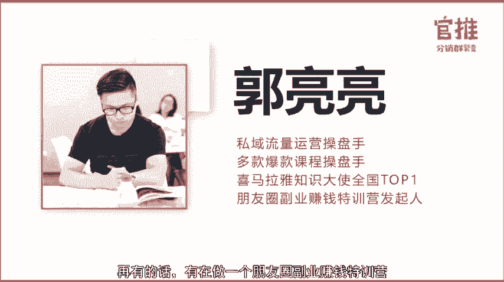

呃，大家也都看到我刚才发的一个海报啊，这次训练营的推广的话，呃，我们团队拿了这样一个冠军队伍啊，所以有资格和大家做一些分享。包括可能大家熟知的就是我在朋友圈做课程推广。其实还有在做一些其他产品的推广啊。

然后刚才是随手截了一下我们那个产品系统的截图，这个月做了在朋友圈呢做了14万的这样一个销售额。对，所以呃就其实分销这套玩法的话，除了支付费课程本身，还有产品也是可以来玩的。

那么我就把我们这段时间的这样一个呃积累的一些经验，包括一些教训，然后分享给大家。

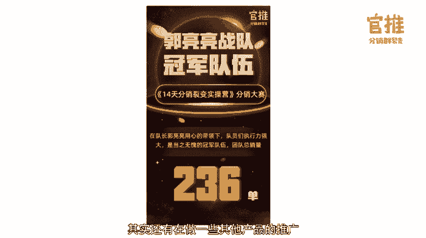

呃，其实呢很多呃小伙伴现在都在做朋友圈的推广，去推广一些课程，去推广知星球啊，乃至去推广一些呃399的这样一个社交电商的产品。大家就会发现说为什么你每次都能呃在这样一个支付费课程推广的时候。

拿到这样一个前三名，第一名甚至团队第一名，而且瓜分很多奖金。为什么你每次都可以做到啊，而有些人可能就是参与一下啊就发了一天朋友圈也出不了一单。那么这些问题是怎么出来的。

那么我接下来呢就围绕我们的这样一个呃经验给大家去做分享。啊，大家可以看到这个目录。目录的话是分为四部分。第一部分的话是分销的底层逻辑。第二部分的话是分销活动啊，设计的三个核心要素。

第三部分呢就是提升分销收入的三个技巧。第四部分是如何招募与管理分销团队。我们去做一件事情的时候，去起盘一个项目，去切入一个赛道的时候，首先需要去了解这个行业的规则，有一些规则。

那么我就特别喜欢去研究啊某个领域它的底层逻辑是什么？因为我们今天的主题是分销，那么我就给大家去分享一下分销的底层逻辑是什么？呃，举个例子啊，因为人类都是群居性的动物，对吧？啊，那从社会学的角度来说啊。

如果一个人有某某类需求，那么他周围的人也应该是会有类似的需求啊，再比如说我们啊这段时间抖音特别火，快手特别火，尤其是啊抖音上出现的这种就是李佳琦，然后牛肉哥，他会去带货能力特别强。

那么很多人很多商家就想学习怎么去在抖音短视频上去带货。那么相应的就会有相关的课程需求。如果有一个人呃有想学习这样的需求。那么它的同事，他的亲朋好友，他的同。

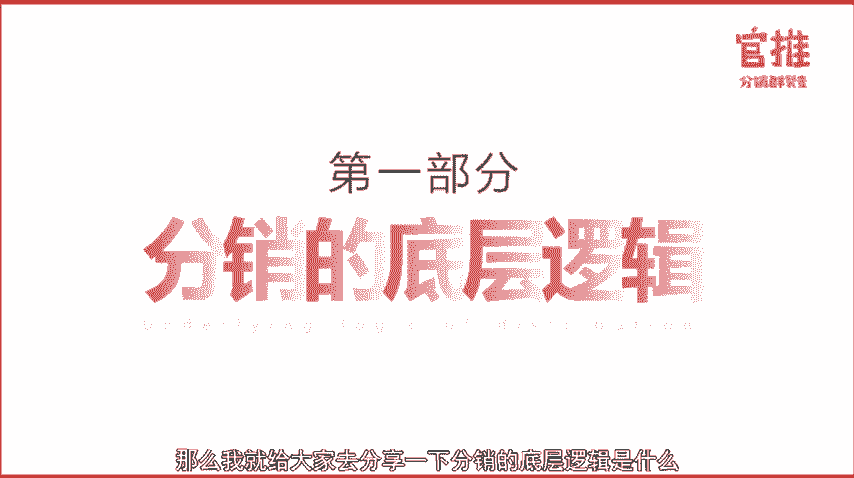

行啊可能也会有类似的需求。那么这个需求就成立的，就有一定的市场。呃，包括如果大家熟悉销售圈的话，对销售这个行业有所了解的话，这个行业里边有一个大神做汽车销售的叫乔吉拉德。

他的话有一个呃乔吉拉德250定律啊，这个定律的主要内容就是每一个顾客身后呢，大约有250名亲朋好友，大家可以算一下自己的这个身边的比较熟的社交关系。如果您赢得了一位顾客的好感。

就意味着说呃赢得了250个人的好感。反之，如果你得罪了一个顾客，也就意味着得罪了250名顾客。啊，他的意思呢在于说永远不要去得罪某一个顾客，对吧？因为一个顾客对你的产品啊，有不太好的意见，有负面印象。

然后他就会去传传播一传师十传百，大家对你这个产品都没有信心了，都觉得你这个产品特别垃圾。那我们去做课程推广，做产品推广的话啊，比如说我现在去做一个母婴类的课程啊，怎么去育儿的课程。如果我发到朋友圈。

发现有人购买了，那么我就会判定说他周围一定有这样的圈子。那我会进一步的去找他去私聊，问他能不能去帮我做传播做推广。那么呃如果正常情况下，一个人他买了一个课程，然后觉得体验蛮好的。

然后主动去发朋友圈帮你传播，这个是很偶然的。可能他今天心情好，所以你的呃整个产品的课程其实一开始就应该设置一套稳定的这种就是用户自动去传播，自动去帮你分享的风险的一套机制。那很多人都是无利不起早嘛。

对吧？如果你呃能给到他一些利益上的刺激，比如说他分享一下，他可以得一些佣金。那么对很多人来说，他是愿意去分享这个事情的。呃，我们再从啊宏观的去看第二章这个分销的这样一个传播模型啊。

就刚才提到的我们去呃做一个母婴类的课程，啊后发现获取到一批用户呃，是一些妈妈。那么妈妈身边也有一堆妈妈，他们尤其像妈妈这种群体是很密集，很集中的啊，因为他们呃到了这个阶段，尤其像这种母婴类的产品。

因为很多我包括我们直播圈里边的很多人呃，有些可能20出头，现在三十了，结婚生小孩，生小孩之后来说就一定会有相关的需求，怎么去呃备孕，怎么去养胎。那么你其实对这些东西是不太了解的。

那么你就需要急切的找到这样一个圈子去做互相的交流，找到这个行业里边的意见领袖，他告诉你说你去买哪个东西。啊，然后你可能就会比较信任他就会去买他推荐的奶粉啊，买他推荐的这些母婴的产品。呃。

那么就一个圈子可能呃。

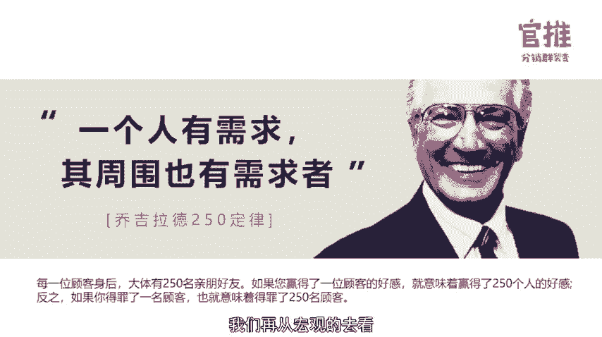

会购买这个产品，然后他们因为使用过这个产品，觉得口碑足够好，他们会分享到微信群里边。然后微信群里边的本来他们是群友关系，然后也会因为呃这个产品觉得足够好。因为我们是群友，我们是这种熟人关系。

我可能会信任你，然后我也会买了之后，我觉得体验OK也会去下单，然后再去做推荐这样的模型他就会传播开来。所以一个产品不论你去呃做产品做H5还是做一个app呃，怎么去推广呢？就是通过这样一个传播路径。

你先找到你的种子用户，然后让他能有效的去帮你做传播，然后吸引到他的这个用户群体里边。我们做用户增长，现在很重要一个观点就是我不仅要把我的用户，我的付费用户当做用户，我还要啊通过一些激励手段激励机制。

引导他们成为我的渠道。经由他们去触达到他们的社交圈子里边，触达到他们的家人啊，同事、亲朋好友，能帮我去做传播。那这样的话，我的产品才有可能去跳出圈子，跳出我原有的这个圈子。我的社交圈子。

然后去能做一个比较好的一个传播好的一个呃流水啊销销售啊这样子。

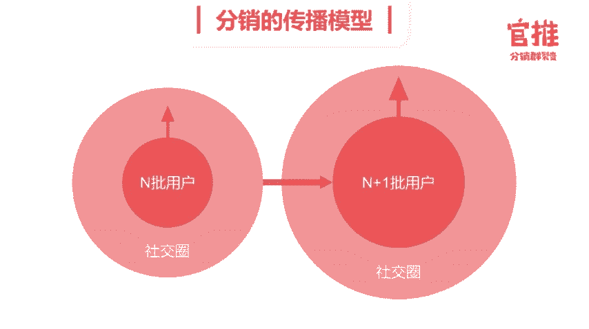

接下来呢我们进入第二部分分销活动设计的三个核心要素。因为我们这是一个实操的一个裂变的训练营，大家要考虑一下，结合自己的情况，自己去做一个活动的时候，怎么去设计这样一个分销活动。

那么分销活动的话会涉及到三个特别重要的要素。首先来说是利益分配。其次是物料设计。最后是活动策划。首先呢我们进入第一部分利益分配啊，这就是很多啊，不论你去做课程，做支付费的课程的推广。

还是做这种呃大家常见的这种399的社交电商的模式，里边很重要的一个部分，就是利润分配。嗯，因为所有的裂变一定是因为利益驱动利驱动而驱动的。因为大家觉得这个东西可以赚钱，可以成为我的传播的社交货币。

可以能给我贴标签，我才愿意参与进来。那么我们这块直接的去聊比较现实的一个问题。你怎么去通过这种分钱的形式形式去激励大家去做传播，去做推广。呃，如果是啊互联网从业者，或者说支付费行业的从业者，啊。

大家都知道去年呃，开年之后刷屏的网易吸经客。啊，短短时间内就有20多万人参与，对吧？大家可能很多人也有参与过。呃，就会发现说它短时间内有这么大的量级的传播。是因为里边有了很重要一个机制，就是这个呃。

二级分销里边的话，比如说一级分销啊，可以直接拿到60%，二级分销能拿到20%。这样活动主办方直接就把80%的这样一个呃利润分给了渠道方。那么渠道方啊就会特别卖力的去做推广。呃。

现在呃知识付费行业里边的话，呃，利益分配一般是分为两种形式，一种是直接这种一级分销的。一级分销的话，比如说我要判断你的渠道质量呃，你如果是这种就呃没有什么特别大的量，但是呃能帮我去做传播啊。

帮我去发个朋友圈，那么我愿意给你50%，对吧？如果你的渠道分销的量更好，那么我愿意去给到你60%或者更多，甚至说有这种专门的大渠道，比如说你有呃100万的用户有500万的用户，那么你能直接给我来带量。

那么我就愿意给到你大量的这个呃分销比例。呃，尤其是呃这段时间大家朋友圈经常经常可以看到这种就是呃9。9块的课程公开课。然后你买完之后他的客服呀，他的这个提示就会提提醒你呃，你购买之后。

如果呃会生成自己的分销海报。如果你去呃分享一下的话，你就可以得到99%，百分之百的这样一个收益。呃，这个原则设计就是你分享一单之后就可以回本，你的学费就可以回本了。

那很多人呃觉得这个参与门槛相对来说比较低，对吧？然后又有海报都给到我了，那我就愿意更主动的去做分销。包括如果啊你。呃，包括我们现在设计的整体的玩法是这样一个因素。

我首先比如说我一开始我的启动量里边有啊1000个用户，我先让我的一部分种子用户里边，他们可以免费参与这个事情。比如说我一开始把这个课程设置的呃，是一分钱，所有的用户你支付一分钱之后。

就算一个有效的订单了。然后我等到我整个就是部署完善之后，我开始对外发售的时候，我把价格调成9。9块呃，之后的话，你分享一单就可以赚9。9块。那么对于我的这些种子用户。

最早的第一批参与启动的这些用户来说呃，它相当于是零成本参与，然后就直接可以呃推广一单就可以赚9。9块了。啊，再有的话让这些呃裂变进来的用户。比如说你是看到这个海报，然后付了9。9块进来的。

那么我反硕就告诉你，你如果去推广这个课程的话，你就可以呃推广一单就可以回本。那对你来说也有这个刺激性。因为你自己去去花钱来购。这个课程的话，相对来说是这个课程的比较精准的用户了。

因为他是能达到你的需求的。再然后比如说我9。9块之后，还有这种啊99块钱的课程，99块钱的课程，799的这种课程的话，如果你买了9。9块的课程之后，还买了其他的课程，有两次到三次的复购。

那么我判定你为是一个呃有复购的用户，那么我就希望你能在这个平台里边可以赚到钱，对吧？那么我就给你更多的权限，比如说呃一个999%的课程，我可以给到你30%到50%的分销比例。

因为你自己买了是我这个忠实用户，然后呃又产生了复购。那么我愿意其实让你给你，因为我要看经由你去触达到你后面的这些呃亲朋好友社交关系。呃，再然后后面我会讲到的这个就是分销的团队成员怎么去找里边呃。

行业里边有一堆专门是做网赚的，或者说。在薅羊毛的这样一个批一部分群体，他们手头是有流量的。他们觉得这个事儿啊切入进来就可以玩。他就是冲着赚钱进来的。O那你是冲着赚钱进来的，我要给你设计一套躺赚的体系呃。

因为很多人会介意嘛，我手头有流量，对吧？如果我只是把海报发给他他购买的话，跟我呃没有太强关系，或者我只是赚了一个9。9块的钱。我觉得9。9块就把我的用户呃用户呃卖给你了，我会觉得有点不太值。

那么我会涉及到体系。你每拉一个人进来，然后你就直接跟他绑定这样一个上下级的关系了呃，你就锁粉了，等他后面再有其他的，比如说买了799的训练营，买了就是9999的联创合伙人，你都有这样一个收益。

因为你是是这在这场传播活动中，你做出了这样一个突出贡献。嗯，这样的话其实会有比较强的动力去推动这些渠道商，把这个呃。更有动力去做推广。另外一种呢就是一种就是啊多级分销。

我们刚才提到的像去年的网易新星课程。里边很重要的一部分就是有二级分销。因为一个课程如果只是比如说30%、50%的这样一个分销比例的话，它不足以形成裂变，它的传播链条会很容易断掉。呃，那有了二级分销之后。

我等于说有人从我这购买了。然后他再去传播的时候，我还能赚到他的呃给我贡献的佣金，那么我就会有比较强的动力去推广这个东西了。因为我们平常参与的这些裂变活动或者操盘的裂变活动还是挺多的。

那么我们就会研究之后，就会发现说不论是一级分销还是多级分销。当普通的一个用户啊，比如说他发到朋友圈之后啊，没有办法去把这个海报层层的穿到第7个人的时候呃，这个裂变活动很难就会跑起来。呃。

因为提到了裂变这块呢，那么我就再给大家发一张这个裂变增长的一个详细路径，大家去看，不论你自己啊作为一个活动参与者，还是说你自己去起盘，做一个活动，比如说作一个海报，作为一个H5的时候。

就会发现说就这样一个传播路径。首先你的海报出来，要让别人能够看到啊，这第一个环节可能就会出问题。比如说一开始没有做测试，然后发现说这个海报域名被封掉了，或者被屏蔽掉了。你虽然发了海报。

虽然很多人都在转发这个海报，但是他被降权，然后被域名被封。啊，到最后的结果就是只有你自己才能看到，那就属于这种自嗨，对吧？啊？一开始它的起始的启动量带来的曝光量就没有。

那这个活动很可能就一下子复死太终了，然后接下来你比如说一开始有一定的曝光量了。我课程还没有上线之前已经囤了10万个粉丝号，大家去每个人都在发朋友圈，那我起始的这个曝光量和粉丝量就已经有了。

接下来呢呃第二个就是虽然大家就像去占领货架一样，占领了朋友圈，大家觉得这个事好火，很多人都在转发，但是如果啊你的海报的问题，大家都没有欲望去点开，对吧？啊，虽然大家都去在转发，但是没有人多少人去点开。

觉得这个海报太low了，那也会影响他的传播效率，所以第二个点就要考虑说呃你的用户的参与率怎么样，对吧？嗯，你一下子有10万个人，有1000个人在发这个海报。

但是如你的海报里边的内容吸引足够的人愿意主动点开。点开之后还会扫码，然后呃去翻下面的详情页。那这个活动就更容易会被传播开来。再有的话呃第三个部分就是带人率。比如说呃一张课程海报。

比如说咱们这次训练营的推广海报。如果我发到朋友圈的话，到后面我可能带来了呃一个微信号里边，3000好友有呃500个到1000人在转发这个呃在点击这个海报，他点击之后，他觉得这个事儿可以去赚钱。

可以去分销，他就发到更多的海报里边，带更多的人会参与进来啊，包括我发了朋友圈之后呃，立马就有20个100个人去买了这个海报，买了这个课程。那我的带人的效率就比较高嘛，对吧？那同样可能你去找其他的这些人。

他不是这个圈子的，他发了一下这个海报，结果发了一天也没有人去点击，也没有人去购买。那这个传播链条又断掉了。呃，就是带人率里边除了这个待人的数量。短时间内带入们的数量，还有这个呃带人的效率。

比如说我发了一个小时之后就带了100个人，然后你发了一天才带了一个人进来，这个也会影响啊整个裂边的这样一个速度。呃，再有另外1个CT值的话，就是呃从一发到朋友圈，然后有了曝光，然后有用户参与进来。

然后有人购买了，这是一个路径，它会有一个周期，对吧？如果这个周期是呃5秒钟就有一个人看到了，然后参与进来，然后就买了，然后又去分享到朋友圈，呃，如果这个是5秒钟更新一次啊，这个周期等到下一轮的曝光。

又开始下一轮的这个参与，下一轮的这个带人，呃，如果你这个活动5分钟或者一个小时才能这样一轮的传播。那这个活动可能也就废掉了。所以我们会呃特别强调说你一场曝光里边要把每个因素都要考虑好一开始的启动量。

然后启动量后边是你要把这个社交链条打通了，让这些首先比如说会找一些好友基数比较多的这些KLL参与进来，然后呃不论是让他们主动去参与进来，还是说让给到他们一。些福利给到他们一些权益，让他们主动去分享啊。

所以这些前期的呃你的在整个活动流程啊，那么我们再总结啊分销这部分的玩法，包括我们总结出来的现在其实是会特别有效的一套方法，让你的种子用户他可以免费参与这场活动，让裂变过来的用户，他可以迅速的去回本。

让有复购的用户，他可以赚到钱，让赚钱的用户可以实现躺赚。接下来呢就进入第二部分物料设计的环节。物料设计呢不仅仅是这些海报什么的，还有呃比如说文案，比如说怎么教你去发朋友圈的话术。

还有像在群里边去推广一个海报的话术。怎么在群里边去发一个话术，然后不被群众踢，不让群主觉得这是一个特别硬的广告，让大家感觉到反感呢？呃，因为讲到这块，大家可能会觉得比较抽象或者比较空。

那么我就用大家啊特别熟悉的这次训练营的推广啊，和大家做个分享。那相信直播间里边很多小伙伴都有参与这次训练营的推广。呃，我们自己作为一个参与者呃，跳出来呃去用一个操盘。

一场裂变活动这样一个操盘手的视角来看待这个问题，我们去看一下这份啊推广的SOP的操作手册，呃，一场活动能够裂变起来，或者说啊一个事件能够迅速的传播开来，里边有两个重要的环节和原则。

首先是简单其次是可复制。呃，简单的话很重要的体现就是活动的参与门槛足够低，对吧？大家去看到说呃有一些H5去做传播的时候，他用小视频传播。结果我的场景是我在地铁上去上班的路上啊，然后地铁里边信号特别不好。

那我打开这个短视频的话。发现说缓冲好几十秒一分钟都打不开，那我就直接放弃掉了。我可能会想着说先把它保存起来，等到到了公司再去打开。那这样的话可能路上一个小时，这场活动他传播就断掉了。

所以你的活动一开始设计的时候，要让用户领门槛的足够来参与，对吧？就即是一是一个傻子，嗯，他看到这个活动，他也知道怎么去玩。呃，所以一个完整的严密的裂变活动，一定是一开始就会形成一套SOP操作手册的啊。

操作手册的意思就在于说我知道参与的每个人在每个时间点，他该做什么，这些都是像写剧本一样，一开始写好了的。那么呃就像我们一开始会去做队长的招募，去招募队长的话。

我们先去把我们整场活动活动的介绍活动的价值感活动的讲师是谁，他能给用户提供什么样的价值，然后你参与这场活动的话，你能获得什么样的收益啊，有什么样的一个回报，我会这些全部呃给到你。

然后里边的话还会有一些比如说你作为一个队长啊，愿意参与这个活动，你要去招募队员啊，这里边就是涉及到一个因为你自己还没有买这个课程，还没有参与这个呃具体的细节的东西。那你怎么去告诉你的队员队员。

让你的队员对这个活动有信心，然后加入进来呢？所以这里边很多物料就特别重。了，比如说关于这场活动的一个海报，对吧？嗯，因为到现在来说呃，这种嗯图文海报啊，尤其一个课程海报发到朋友圈是特别直观的。

那我一看就知道这是一个课程海报，这是一个呃送书的海报，这是一个就是活动海报，对吧？嗯，因为到现在大家整个已经被驯化的，对这些东西已经是敏感度啊，越来越高了。我一看我就知道这是要干嘛的。

所以一开始包括很多呃人在做海报的时候也会强调很多因素，对吧？比如说要有一些权威背书，要呃你的活动主题要足够的醒目，啊，吸引用户点进来，包括你的整个主视觉的颜色要足够醒目。

比如说像这种呃裂边起来的大型的活动，很多都是比如说黄色的红色的对吧？这种呃特别醒目的这些海报的内容，其次是文案。呃，包括我们所有的队长去对外招募队员的时候，会拿到一个海报。

这个海报里边是一个队长生成自己的二维码，需要去发到朋友圈，让招募者去给你交一分钱，大家要知道说我要参与一个活动，我自己没有什么没有得到，就需要先交一分钱，那么他是需要很多因素来说服你的对吧？啊。

比如说你参与这个活动，你可以体验一下整套整场这个裂变全流程，对吧？对你自己去做活动，会有特别好的一个帮助。其次，你参与这项活动，你可以赚到佣金。嗯，这个有实实在在的一笔收入，对吧？

这个可能对很多用户来说是会感兴趣的。呃，再有这个群话术，嗯，你怎么在群里边去混群，怎么去发一个东西，让大家觉得这个不是一个硬管，而是呃你很认真的把这个刷屏的东西啊。

放在群里边再和大家做这样一个运营层面的讨论，对吧？这个就特别讲究这个群话术。因为很多人可能情商并没有这么高。所以我们从一开始设计物料的时候，要把这些都要交付给用户啊，再有像这种朋友圈的话术。

大家在做推广的时候，也看到说我们至少编辑了五段发朋友圈这样一个话术。甚至说我们在呃推广的过程中不断的去发掘那些转化啊，效率特别好的成交效率特别好的一些话术海报啊，然后直接去同步到推广群里边。

让大家直接拿去去复制。呃，因为第二部分呢都是我们去从呃一场裂变活动的操盘手的角度去呃，怎么去设计这个活动需要注意的一些细节，一些因素。呃，接下来呢我们就从呃。很实际的角度，从个人去做分销的话。

怎么去提升啊转化这个角度来给大家聊一聊。那相信这部分呢也是大家特别期待的，因为这也是我特别核心的一个东西。大家很多人都会说，你为什么朋友圈转化那么高呀？呃，像我自己去做推广的话，有的时候呃一些活动。

我的课程的海报转化率能到30%到50%。也就是说有10个人点过之后就有5个人去购买。呃，那这里呢把一些特别赚钱的能给我带来很多收入的一些技巧分享给大家。首先第一部分是超级赠品，这个怎么理解呢？呃。

比如说我们去推广这次活动的时候呃，大家想一开始就已经有2000多个分销员报名了，也就是说这个活动嗯开始上线之前已经有2000人呃内部团队开始参与要推广这个活动了。

你要考虑说呃如果你们2000个人都有共同的好友，比如说都有呃你们2000个人都有我这个共同好友，那么我就要考量说你们这个活动起来了，我到底要买谁的对吧？呃，你们都是在买同一个产品。

这就是同质化竞争很严重，呃我可能就要说你们要考虑你有没有什么其他的额外的这些赠送品这些价值啊。呃，大家可以看一下我刚才发的这个截图啊，那么同样都是在发售一套产品。我这边除了发售产品之外。

还有我自己建的一个呃读书的一个共读群。那么我除了我的产品之外，标准化的产品之外，我还交付我的带我服务的这样一个训练营一个微信群。那么这就是你跟别人差异化的点。我们经常说到吗？

你卖产品要考虑说人我有人呃人有我忧，对不对？你要考量说你自己去跟你的用户沟通的时候，你能有哪些让他感兴趣的额外的赠送的一些产品的点。呃，这样的话我就不仅仅是在卖我的产品了。

我是在卖呃跟你的一个链接的社交机会，对吧？你除了购买我的产品，还可以进入我的微信群，跟我有更深入的一个链接和互动。那这是很多用户会比较喜欢的包括现在很多人都在教你怎么去做爆粉，怎么去被动引流。

那么你有机会进入一个微信群。大家还是呃会觉得说这个东西是蛮有吸引力的。而且比如说你们都是裂变圈的，都是增长圈的，都是呃精准引流圈的那你进入一个呃微信群的话，还是有比较强的这样一个社交的意义在里边的。呃。

第二部分呢是限时限量，举个比较典型的例子。包括像分销王子之前也有提到呃，我有和分销王子一块在帮关老师啊做他那个微信群的发售。我们当时都是导师包括参与了前期的整个游戏规则的设置。呃，里边的话。

我们就是用9。9块的公开课，然后把呃一堆付费用户导到我们的这个微信群里边，同时有呃七八个微信群几千人。然后从里边利用两三天的这样一个高密度的内容去交付给用户，用户觉得呃就会很信任呃。

我们这样一个训练营这样一个产品，然后会有比较强的安全感比较强的交付感。呃，他觉得干货很多。那么通过这种形式，我们迅速在群里边去做微信群发售。呃，当时直接转化了有就是400多单。呃。

因为里边很能够转化的很重要一个原因，就在于说我们在里边打一个限时限量的概念。比如说呃这次我们只招募啊1000人2000人，这是一个限量。对吧呃，再有的话就是限时如你要报名的话。

在这三天之内是799就可以报名。如果呃这次发售结束了之后，呃，我们会迅速解散这个群，呃，在群外你要再去购买的话，就是899了。那么我就会给你一个限时限量这样一个压力感啊。

包括呃其实呃去年新是这样做营销课的时候，短短3个1小时之内就卖了10万份的课程。呃，里边的话呃我们有一个很重要的动作，就是呃。阶梯涨价制，包括后面很多人都在用这套东西。

阶梯涨价值它的本质也是在做限时限量。比如说呃一场活动每卖出5000份，呃，我就涨价5块钱，涨价10块钱。那其实来说在前5000份里边这个就是限量的呃限量的5000份就是4049块钱。

你到5001份的时候，就是呃。54。9块了对吧？它就会涨价，就通过这种阶梯制的涨价，然后他就用了一个现实限量的原则去不断的去增加你的购买压力。所以到最后来说，早买到的这些拿到早点票的，他们就觉得赚到了。

然后那些买的越晚的人，他就相对说负责成本会比较高一些，这个也能有效的刺激呃迅速的去做转化。还有呃一个比较典型的案例，就是这种涨价值。呃，比如说很多社群呀，很多的这个就是去做活动，售卖门票的时候。

都会设置一些涨价的制度。比如说过了呃7月31号，8月1号我们就开始直接翻一倍了。原来是365的门票，然后8月1号我们就直接是呃760了。呃，这样的形式也能迅速的去带量。

可能真的是到涨价前一天那个几个小时里边会迅速的出量。我们之前做做了一个活动，就短短最后一天涨价的时候，直接进来500个付费用户，所以这一点大家。呃，第三部分的话就是用户建档。你要考量说呃。

你去在朋友圈发售一个产品的时候，卖一个产品的时候，你要考量对方你的用户里边是是有真的这些需求。比如说我们去发售这个呃裂变的训练营的时候，你要一开始就要考量说我朋友圈3000好友。

5000好友里边有多少人对会对这个产品感兴趣。那么怎么去判断他们对这个产品感不感兴趣呢？那可能需要我之前对他们的一个交流，比如说一开始所有的用户加到我这边，我首先会打标签，你是从哪个渠道过来的。

你是呃在知乎看到我的干货文章，然后添加了我的手机号进来的，还是说呃你在我的对外的一些公开课分享，然后直接扫了我课程海报上的二维码啊进来的。因为微信添加好友的方式，我可以直接去有9个以上的渠道去做判断。

比如说你是扫了我的这个微信二维码直接过来的，还是说是那个加了我。

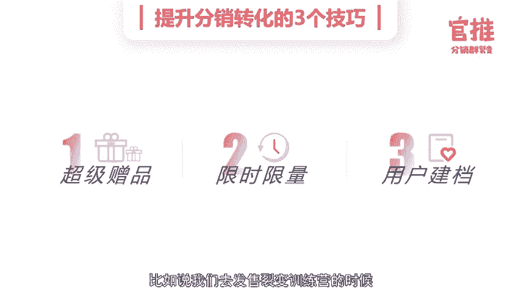

的这个微信的手机号，还是加了我手微信的QQ号，还是加了我的微信号呃，是通过群聊添加的，还是说呃别人把我的名片推给你，然后添加的，我会通过不同的渠道去打标签。那我相应的一开始设置。

比如说呃我在知乎上留的我的联系方式，就是我的手机号，那你添加我手机号，大概率会判断你是从我的这个知乎这个渠道过来的。呃，知乎过来的这个渠道，我就知道。然后我会去观察你朋友圈的这个平常会发哪些内容。

你会因为喜欢什么东西，你会呃对哪些东西其实是无感会反感的那我去呃发相应的内容的时候，就会和你有相应的契合。比如说我知道你是五月天的粉丝啊，最近他在呃要开演唱会了，我可能会呃发一些关于他的内容分享给你。

或者说只要你看到这部分内容，那么你就会觉得说我们有共同的语言。那我们的关系其实是不断的在呃大家要知道说。

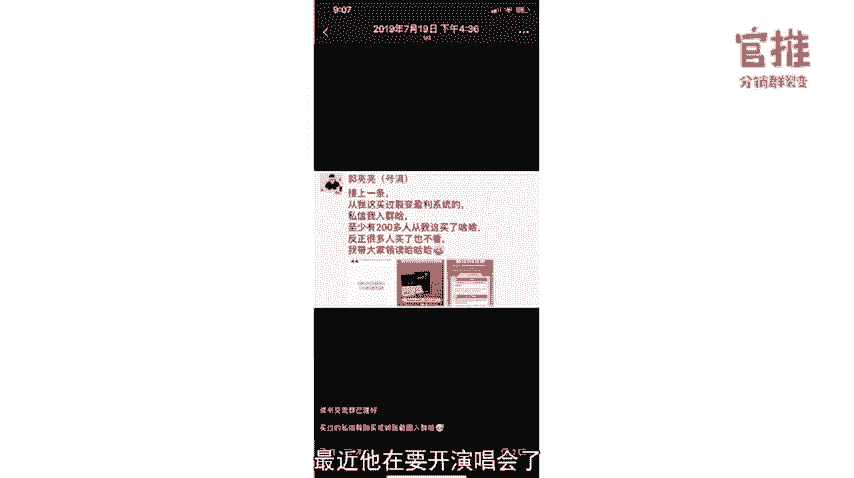

所有的成交一定是基于信任的。但你怎么在两个陌生人加了好友之后，迅速的去把这种信任感建立起来啊，这个就有很有讲究了。啊那里边很重要的一个一个部分，就是说我们要不断的去找跟对方的这种啊交集点共同的标签。

比如说我们都是呃老乡，对吧？我们都是呃某个大学的校友，我们都一起在上啊混沌大学，我们一起在听樊登读书。当你们双方的兴趣点标签啊越密集的时候，你很容易对对方产生好感的。那么相对应的信任感也会来加强。

所以我们要通过一些呃小细节的运营方式，去让用户感知到我们对他在用心，在呃有意识的在关注他。大家分享一下，只是我的一个微商朋友发给我，他怎么去备注他的啊客户和潜在客户的啊大家看一下这个图就觉得特别好笑。

他备注的官问不买，官问不买吹牛逼达人等等买。因为什么原因等呢等发工资，然后考虑接呃，考虑哥考虑解，然后天天砍价哥，问题贼多，贼能磨迹，天天磨迹。所以你去看他在呃跟他的用户跟他的客户去交流的时候。

他会很细节的去侦测啊去。呃，做标签，你即使没有买我的产品，我要问清楚你是因为什么原因没有买我这个产品的。通过这样的方式去有效的去积累用户的数据，对吧？包括我们很典型的啊，加了一个好友之后。

我会迅速的去备注，我们是在什么场合，什么时间认识的，对吧？我会去打标签。比如说我们是在一场线下沙沙龙嗯某个朋友的生日聚会现场认识的。我可能就会直接打标签，可能我们加了好友。

可能我们加了好友之后很长时间都不怎么联系，都不怎么说话，但是如果他有一个事儿主动找我，他可能会说到这样哎，你可能记不得我了，我们是在什么场合认识的，那我就可能会迅速的回复他啊。

我记得我是当时某个朋友认识的。然后当时还是我主动加的你，然后你当时介绍说你在做什么工作啊，你现在你当时遇到什么问题，那我我的回复比他呈现的信息量还要多，他可能就会觉得说我好用心。

我可能虽然我们没怎么说话，但是我一直在关注他，这样的话，你们之间这种就是信任感会迅速的建立起来，他的情绪也会有波动。因为在成交的过程中，如果对方呃对你完全冷漠，我感不回复你啊，那很很很难被成交的。

当你们有了这种情感的沟通，有了这种情绪的共鸣的时候，其实他大家都会呃很容易聊到一块的啊，也很容易去呃去成交，然后后面呢这是我的一个朋友圈怎么去备注，怎么去分组的一个图片，可以给大家做一些参考。

比如说呃我会给一些呃朋友去做备注，有一些就是不表态不说话的，有一些人是呃非常靠谱，非常钦佩的呃人，有了些虚就是有意识的想去认识一下他，有些人是这种就是略有好感的。有些人是这种呃很冲动的人，对吧？

很容易就是带情绪的人，那你通过这些备注去对一个用户。打不同的标签啊，比如说我对一个用户可能打了30多个标签啊，他是哪个大学的，然后他在我朋友圈买过几个课程，对吧？买过第一个课程是什么？第二个课程是什么？

然后总共买过几次课程。啊，还有就是他平常会关注哪些领域。啊，那比如说他买的都是这种短视频怎么带货。然后怎么去抖音涨粉。那我可能会判定说他在从事这个领域，或者说刚转行这个领域。

他需要急速的去学习相关的内容，我就会去呃有一是把我朋友圈看到的我的事业里边看到的很多关于短视频的一些干货分享给他定向的推送给他。那他会觉得你也是一个在关注他的需求的人，你们的这种关系。

其实会很容易来升级。关于怎么去朋友圈呃，提升转化，怎么去朋友圈和个人号一对一私聊，去建立信任感呃，怎么去通过一对一私聊呃成交对方，包括怎么在微信群里边去带节奏，让大家都来买你的东西。

而不觉得你只是一个打广告的人啊，这些都有一些系统的方法论啊，课后我们可以继续探讨，大家也可以呃在直播间提问，或者说直接私信我。接下来呢我们进入最后一个部分啊，怎么去招募和管理分销团队。

大家看一下我这次的推广的收入截图啊，这次单纯的分销佣金的话，啊，有6000多啊，因为我自己推广的这个单量也不太多，但主要是我整个团队里边啊，团队的很多成员给我贡献的二级分销的收益还蛮多的啊。

所以你怎么去招募啊，这种就是有战斗力的能出结果的团队，怎么去更呃合理的去管理他们激发他们的这个推广的动力，这个是很重要的一个事。枪。呃，包括我们很多小伙伴也都有在参与这次推广。

那么很多人可能只赚到了这样一个单纯的分销佣金，或者说只有我自己的一级的分销收益，也有一些有二级分销的收益。呃，但是我除了这份收入呢，还有呃咱们团队的一个奖金，比如说针对呃整个团队的2000的奖金。

我个人作为呃队长的1000的奖金。还有就是我个人达到了这个比如说50单以上，还有额外的奖金，加起来我就有小一万的一个收入了。这就是呃。给大家强调一下，现在已经进入这种团队作战的阶段啊。

之前呃行业边有很多人会说啊南有潘东升，北有郭亮两两个人麦克很猛。但我现在通过管理团队呢，把我这套呃能力，这套麦克的技能嗯传递给了我的团队。呃，然后为团队赋能，呃那我的势能就会更强一些了。呃。

接下来呢就涉及到两部分，也是大家会比较关心的问题。作为一个团队管理者，你首先怎么去招募这些分销团队成员。呃这里边呢其实有很多渠道，首先是呃有一些就是这种自发的分销者。像我的话啊看到一些好的课程。

我也都会主动去做分发分销。但因为现在来说每天主动找我来去分销课程分发课程的太多了，我可能会say no say no say no这个课不行，这个课程不行。呃，是嗯因为我会做很多判断。

不是所有的课程都会接分销。呃，有一些实在是想找我合作，那O我可能没有那么多时间精力去组队，你直接去投我一条呃朋友圈广告。因为我朋友圈其实到后面加了至少有一两千0个都是做朋友圈推广的。

他们觉得你的朋友圈转发很高。那我就直接复制你的文案，然后把海报呃生成我自己的海报改一下就可以去发了。所以我朋友圈会发一个海报的同时，很多人都会去转发，这样的话也会带来很大的量。

那我现在我就会跟很多这种呃负责课程推广的，我会跟他们说，我一条朋友圈是1500。如果熟人的话有一个优惠价，那很多人也愿意来投我。因为投一下，我跟我合作一下。

很容易也能回把起码啊朋友圈的很多分销从业者都会转发这个海报，到最后来说传播效果还是能让他呃有一个比较不错的传播效果的。包括我们去看各种啊课程的分销推广的排行榜里边，就会发现说啊排前面的经常是那些熟面孔。

对吧？包括像我团队里边，有时候直接带的人第二名到第10名，直接能霸屏，全是我们团队的那我就是呃有意识的去挖掘这些本身战斗能力很强，每次都推广成绩还不错，然后呃通过激励他们，每次带着他们都能赚到钱。

建立起这样的信任感，大家就愿意主动呃在我的队伍里边，很多人主动来呃撬我的团队的成员，但也撬不走。因为我们有比较强的这样一个凝聚力和强心力啊，第二个部分就是体感粉丝，呃。

真正的粉丝是呃为你愿意为你做任何事情的对吧？你推了文章，他帮你转发，还帮你点赞，呃，帮你点赞再看，帮你去打赏，帮你去评论，对吧？这是一个很用心的体感粉丝，你有体感粉丝的话，要呃就充分的利用起来，让他们。

去帮你做传播啊，用反正这些铁杆粉丝本身是一笔特别好的用户资产，你要有效的去利用这个渠道。呃，第三部分呢就是互联网的这样一个呃里边职业的网赚群体，有些人就通过网上赚钱的，他们是自由职业者啊。

他们就觉得只要一个事可以赚钱，就会迅速切进来。像我有一个在做这种就是呃网赚的朋友啊，他自己手头有几个核心的团队，他们同时在呃操盘70多个项目，比如说像这种呃呃演唱会的门票呀，比如说像这种就是呃。

前一段时间火的这种八5折的电影啊，他们就闻声而动，他们嗅觉是特别敏感的。觉得什么项目可以赚钱，就迅速会切入进来。如果你能有效的找到这些群体，也可以迅速的让自己的这个传播去迅速的去引爆。啊。

最后的话是圈内达人KOL啊，这个比较典型。像去年三年中读里边，他储备了很多KOL，比如说科技圈里边的这些大V冯大辉都在帮他们转发，冯队冯大辉转发一次，可能直接能带来2000多个付费用户，对吧？

包括像行业里边还有一些影响力的。比如说曹政曹大啊，他朋友圈，他的文章帮你转发一下，立马能带来几千几万的粉丝量啊，这个都是特别有影响力的KOL达人，包括像我自己现在的话。

其实也成为这个呃课程推广细分领域里边的1个KOL了。我推广一次的话，基本上呃认真推一下一个课程很容易就去推报了。因为我手头有800多个分销员呃，用我们将近1000个团队去。一个东西的话，很容易让它一爆。

呃，第二部分呢就是你们培训什么内容呢？我们主要分为五部分啊，首先来说呃是这个用户画像。你在推一个产品的时候，你要考虑清楚说啊这个用户啊，这个产品的用户是谁，对吧？你要把这个产品卖给谁，他们是男性女性。

啊，男女老少，他们活跃在哪些平台上，其次是产品卖点，就这个产品你拿去给别人讲的话啊，这个产品有什么不一样的点，它的差异点，它的功能点。比如说它便宜，它性价比高啊，它能让你就是充满逼格。

它能给自己啊作为社交货币啊，对吧？就他的卖点，你要梳理出来，包括你要提炼出啊，很多人很多都在做分销的人，就他的文案里边没法呈现的一些卖点，啊，包括你可以增加一些呃这些就是超级赠品，作为你的一个卖点。

就这就给了很多用户，我们都是共同好友，我看到你也在发了，B也在发了，那我也愿意选择A，对吧？这就是你能呈现。出来的不同的卖点。再有的话，销售策略啊。

我们团队里边会呃交付给大家怎么去做呃怎么去更有效的发朋友圈，激活用户，怎么去一对一的做成交，对吧？这里边也有很多方法论啊，大家可以交流，包括很多用户很多分销员可能会出现一个问题，我就500个好友。

就300个好友，就即使转化很高，那带的量总体也不多，所以他就需要去学习一些引流的方法啊，不论去主动报粉而被动引流啊，这些都也都有一一些方法方法论，再有的话像这种成交话术。当对方主动来聊你了。

一定是会对这个产品感兴趣。那么呃很多用户他其实跟你聊的过程中，他可能也不差几点钱，但他的内心就要占你的便宜，我就要能够占你便宜，或者说我能从你这买到一个全网最低价。那你要有效的给他一个台阶，对吧？啊。

能有效的去跟他做一个比较好的互动。然后最后把这个产品卖给他。嗯，再有呢卖完产品你还要去维护用户，因为很多用户还是有复购的。包括你要自己，因为这个产品是你从从你这边出去的，你要做好啊稍后做好这个客服。

对吧？因为很多用户他可能买这个产品，他都不知道上哪去听。那你把课程链接分享给他。嗯，他都不知道怎么使用这个产品，对吧？怎么去就是呃打开这个音频听链接，那你可能给他一些有效的建议。

他会对你有比较强的好感和这样一个信任感，下次看到你朋友圈再去买其他课程的话，嗯，就概率转化概率就会高很多。啊，最后一部分就是怎么去有效的管理一个团队。这里边的话啊作为内部团队的话。

比如说首先是这个分润体系，对吧？你们呃团队一起拿了奖金之后，怎么分，对吧？比如说我会把呃整个呃出了三单以上的，会单独的会每个人都有一个呃红包啊，其次来说只要出一单以上的啊。

包括你去呃在朋友圈转发的都会拉一个微信群，然后在群里边下啊几波红包雨，发个大几百大几千的红包，对吧？这个就是能有效的激励团队，他觉得呃哪怕这次我们有赚到特别多的钱，但跟你能学到东西了。

其次啊还在你这领到了很多红包，他会觉得呃对你好感比较强一些，其次是随时跟进啊，你在推广过程中，比如说这次课程的推广是一个一周7天的时间，你要随时跟进。每个人推广了多少单。那么我们群里边就会去做接龙啊。

今天晚上24点。啊，之前我现在已经推广了56单，然后第二名推广了多少多多少单，那我就会去关注那些已经推广了很多单数的人，我会去激励他，去推广更多的单数。然后那些还没有出单的，我要去呃让他们尽立起信心。

再有要树立榜样。呃，因为像我在我们团队里边已经是特别能卖，转化特别高的了。呃，但很多人都会说你已经有行业影响力了，你怎么卖都会特别好。等我们都是素人，从零开始给我们一个就是可以呃学习的榜样嘛。

那我会迅速的去看一个行业新人，然后加入我们的团队，然后很迅速的就会去出单，就让他会在群里边去分享，他是怎么做的，他用了哪些话术，他是怎么去一对于去呃成交对方的那作为就是整个团队内容的一个补充。呃。

很容易在团队里边去树立其他的个人的榜样。然后他的影响力也会起来，用团队为他去做赋能。呃，还有一部分就是机血激励。比如说有一些课程，一开始推广的时候，大家发了朋友圈，发现说没有人买。

你要嗯通过一些打鸡血的方式去激励整个团队，就把行业里边吧，就是同行里边做的挺好的数据截图发给他，建立大家的信心，对吧？这个产品有人是可以做的很好的那你为什么做不好，那那可能是你的问题。

我们要去重新反省我们哪个环节做的不到位，是我们的文案本身有问题，还是海报太low了，呃，压根没有人点进进来，还是有有些人就是呃都已经找过来了。你因为你的回复不及时，然后再去买别人的海报了。呃。

包括我们也会做一些内部的竞赛。比如说我们呃一个200人的团队，我们会分成呃五六个小组，每个小组呃，比如说今天去比拼。你们今天小组是第一名，那我直接会给你们一些奖金的激励，对吧？

然后你今天你们小组今天就是呃上升速度挺快的。昨天还是呃。几个团队里边倒数第一名，现在就今天就是第一名了呃，上升速度很快。那我会给你们嗯加小灶啊，教付你们一些怎么去做一对一私聊的这样一个秘诀。

这样的话很多人都会觉得比较有价值。啊，最后呢再给大家送个彩蛋啊，这是我跟一个我朋友圈的用户聊天的一个聊天记录，大家会发现说啊他会说哎你这里就是个核电站，你所有发售的客，我几乎都买了，对吧？

这就是比较典型的，你可能跟他没有太多的交流和沟通，但是他可能在默默的关注你的朋友圈。这就是信任感已经升级了。然后这是呃第二个案例。这个朋友是我们17年7月份加的。当时我还在呃直播行业，在网红行业。

当时他只是向我请教说呃直播用什么器材，嗯，然后后来没怎么交流和联系，只有上周五的时候，他突然啊复制一下我的朋友圈，问这个多少费用，然后还问那个联创还招吗？我报了价格之后呢，他就直接转账了。

就直接73007300在整个微信里边其实是一个一笔不小的数目了。但我们平常就没怎么交流，没怎么互动。那就是你在你的朋友圈呈现的人设。你发的内容，你发的每一条朋友圈都可能在影响对方的心智，对吧？

这种信赏感就建立起来了，解释对我们第三部分怎么去呃提升朋友圈的转化的一个补充。关于这块呢，大家可以做进一步的交流，再次次感谢大家。

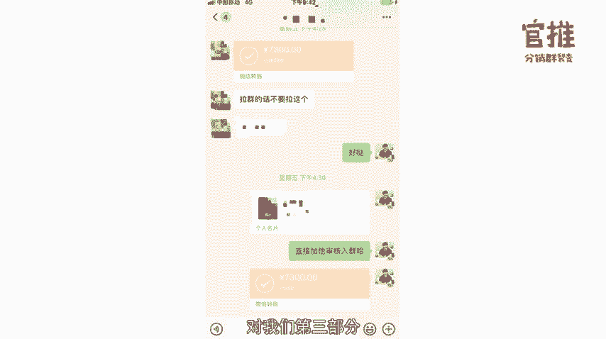

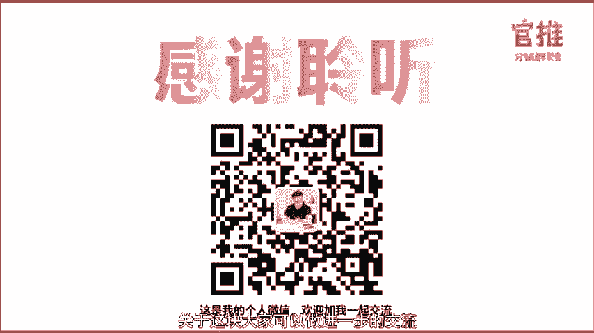

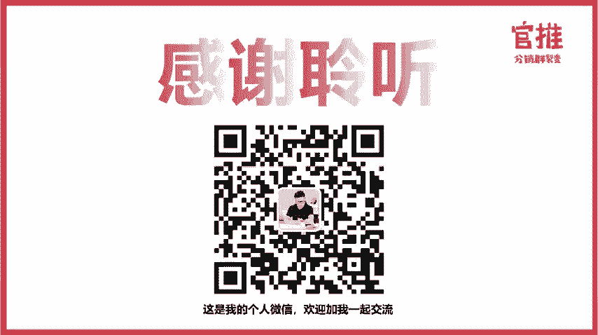

那从今天开始呢，我们的活动就要正式进行推广了，请根据你的活动情况，随时迭代优化你的活动流程，有什么问题可以在群内咨询。

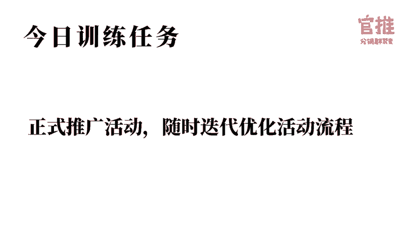

我们所有的课程都支持随时回看，大家可以在玩转社群66公众号菜单栏听课入口处进入观看。如果你学习完课程后，觉得课程内容对你有帮助，也希望你可以把优质的内容分享给你的朋友，也许能够帮到他。

点击玩转社群666公众号菜单栏生成专属分销海报，即可生成你的专属海报。有好友购买之后，你还可以拿到50%的奖励金哦。

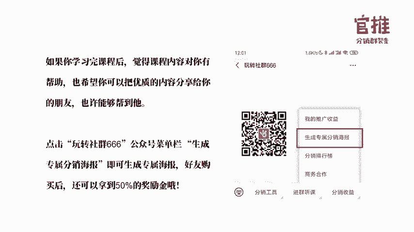