# 微社群裂变营销私域流量池增长秘籍创业运营销售获客视频课教程 合集 8套 374资料 13.1G 分销群裂变模式介绍及9大行业案例解析 - P11：第10节：操盘手深度复盘：知乎读书会“病毒式营销”背后的秘密 - 高端网创试错赚钱大师 - BV1Ux4y1b7xM

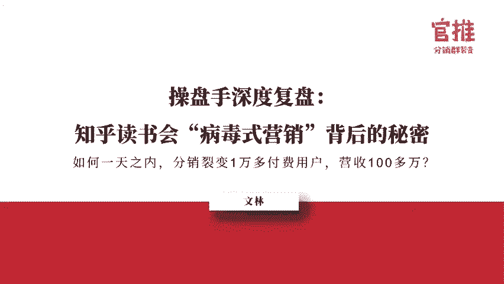

大家晚上好，感谢阿妹的邀请，我是文玲。前建分团队项目经理，是一个文艺的裂变增长者。我的经历有啊大学生项目10天裂变了42万的社群流量，公众号涨粉20万。第二个知乎项目啊。

也就是今天跟我跟大家分享的如何采用分销裂变的玩法。裂变了1万多付费用户营收100多万啊。第三个是环酒雅思。第四个是腾讯项目，我就不不去开讲了，感谢阿妹的邀请，能够和这么多优秀爱学习的伙伴在一起交流。

大家看到海报上的头像，会不会觉得哎这个人好正式好商务啊，但其实真实的我不是这样子的，其实我是一个文艺青年，不信你可以看这张图片。

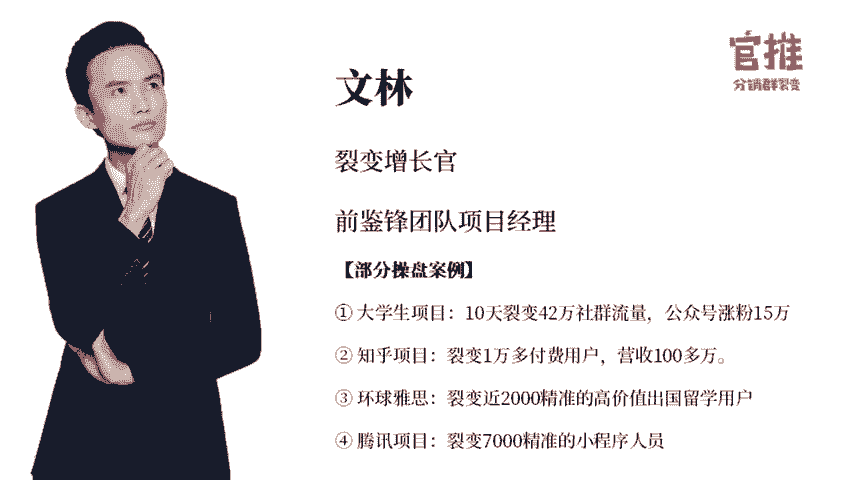

这是我第二次对外分享讲的不好的地方，大家多包涵我不是专业的讲师，但我愿意毫不保留的将项目过程中所有的细节和踩过的坑分享给大家。在分享前有两个关于裂变的小提问。第一个，大家平常的裂变流程是怎样的？第二。

大家觉得影响裂变有哪些因素，带着这两个问题和你心里的答案，听接下来的分享，或许对你的帮助会更大。OK那我们直接进入啊正式进入分享环节。今天要分享的主题是知乎读书会如何通过分销的玩法。

一天之间我们做了1026万的营收背后的一些坑和背后的一些小秘密是怎样子的，下面分为三个框架来讲，一第一，一个裂变，一个项目裂变的全流程。第二5个裂变活动中的坑和处理方法。第三，7个可复置的裂变技巧。

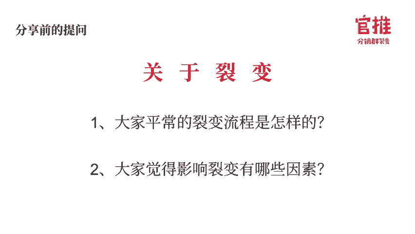

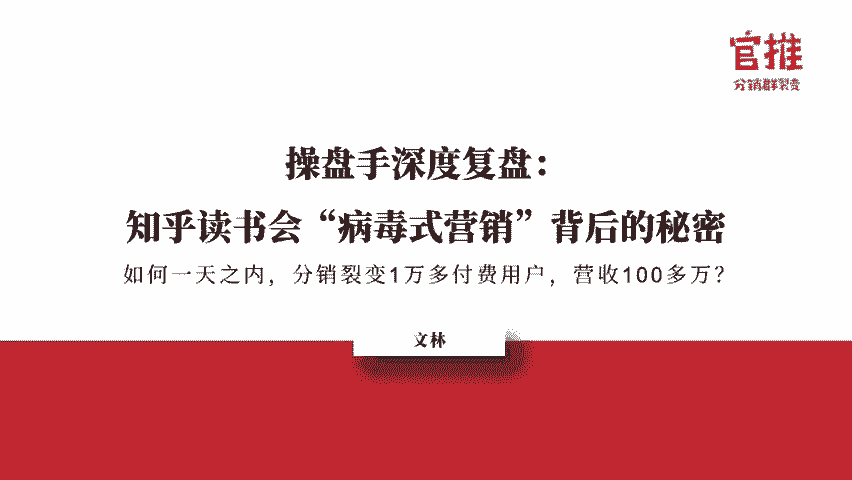

裂变项目全流程主要分为三个流程。第一步，项目背景和需求的确定。第二步选题的方法和决策流程。第三步，项目策划和执行。呃，下面我先介绍一下项目的背景和需求。

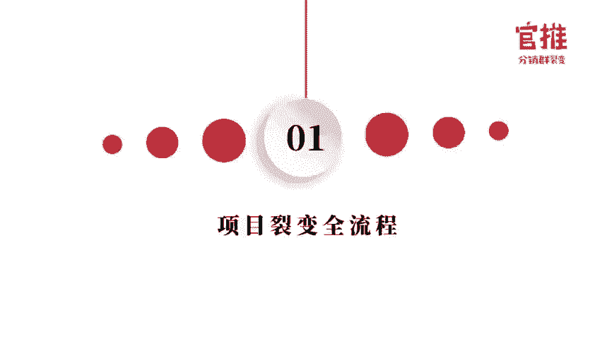

呃，3月初呃，知乎找到我们呃希望我们针对知乎读书会，他们这个新上的品类做一场裂变拉新活动，让更多人知道知乎读书会，并且呃付费使用。呃，知乎大家都知道，但知乎读书会它是一个新品。

那对标呃房登读书会呃得到混沌这些呃已经市场有的品牌的话，其实大家都不知道知乎正在这上这个新的品类。那这是整一个项目的一个背景和合作方的一个需求。那为什么我们要先去介绍一个点。

就是我第一我们做的第一步动作，我们都会去澄清呃合作方的需求。还有项目的一个背景，以便帮于我们接着进行活动的一个策划。呃，确定了需求之后，我们第一步是进行选题。为什么要先进行选题呢？对的。

选题是裂变成功的前提，选题方向错误，那么再好的包装和工具都难以裂变开来。那么选题的方法和全流程是怎么样的呢？

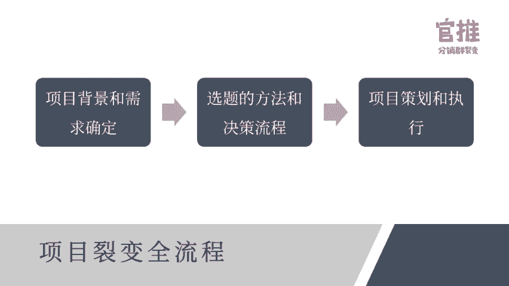

呃，那该怎样选题？接下来我会分享我这次项目中选题的方法和决策流程。选题的话有三个标准。第一，刚需第二，差异化。第三，黄金时间。刚需的话是通过用户调研，挖掘到用户真正的需求，拒绝伪需求。呃。

差异化是通过竞品分析，找到未被竞品和市场满足的需求来作为差异点。3、黄金时间4、在用户需求最强烈热度最高的时候去推一个活动。我们会根据内部的S裂呃裂变的SOP第一步是确定项目需求是甲方是付费付费用户。

那第二是用户调研来挖掘到用户的需求和痛点。第三步，竞品分析，挖掘未被竞品市场满足的需求来找到差异点。第三是差异化定位来进行单点的爆破。第四。呃，第五步是确定选题，找到对的选题方向来降低试错成本。呃。

经过用户调查，我们发现知乎读呃读书会这批用户其实有主要的三大需求和痛点。第一是优质的内容，第二是能够坚持学习。第三步是学以致用，但里面最痛的是，因为市场上不缺乏优质的内容，而是我怎么能够坚持是学习。

在做竞品分析时。发现市场上优质内容的需求上，市场上已经有很多了。在学以致用上，这个更多主要是看用户的自我行为。读书会作为一个标品类的产品，很难去满足用户这一点。

唯有坚持学习这个点上很少看到竞品有做好的一些动作。第三，差异化定位的分析。呃，通过竞品分析之后，我们找到了单点可爆破的差异点，就是坚持学习。那么怎么去利用这个差异点呢？我们琢磨出了一个打卡返现的玩法。

只要你坚持7天打卡学习，那么费用直接可以返回。为了保证这个差异点是真实有效的。我们调研了100个用户，他们听到这样有这样的一个活动，坚持读书就可以返现的活动立马很兴奋，直接说哎提前报名。

我们就知道有戏了，这个方法可行。哎，那在这里的话，有一些伙伴就会问，哎，有一个疑问，哎，我坚持打卡了，我返现了，那这个会不就会存在了一个漏洞，或者或者是存在一个问题，就是说哎我做完了这些的话。

那用户打卡返现了。那我没赚到钱。但其实这里是用一个词叫概率。其实很多人在。呃，买东西的时候，他是靠着冲动的。但买完了之后的话，他学习他并并不一定会去学，尤其是需要他坚持7天以上的一些打卡学习。

那在这一步的话，他就很难坚持。那这里就有一个概率。那目前市场上的呃呃听到了一部分的一个概率，就是哎坚持30天以上去打卡学习的时候，这个概率其实是只有20%的完成率。O那哪怕用户坚持打卡去学习了。

我们也不怕，为什么呢？因为你坚持打卡学习的时候，其实你分享我们这边有个小小的一个小套路，就是说你只有分享到朋友圈去打卡，我们才算你真正的打卡成功。

那他就是利用了大家呃呃用户的广告朋友圈来作为我们的广告位，那哪怕他打卡收回的学费。那我们也是呃值得。的因为我们用他的朋友圈持续7天的朋友圈，我们又能裂变了新来一新的一波一波的流量。呃。

第四个是黄金时间呃，在对的时间做对的事情，那么就是乘功而起，成功率会极大的提升。那么怎么去判断这是一个对的时间呢？我喜欢用百度指数拉长时间去看整个趋势拉了以往几年的读素会活动。

按主题搜索指数全部分析了一遍，发现百度指数显示。往年读书会是从4月份开始进入高峰期，这是以往的规律。那第二，截止活动前，今年读书会的关键词，热度上涨幅度趋势跟去年是一样的，正在快速的上涨。

也就是说今年的趋势是符合以往的规律。那结这一个点，我们就强烈的建议说把呃这场活动在4月中旬进行。呃，经过用户调研和竞品分析。我们确定了7天打卡，坚啊坚持7天打卡学习反费用。

这个主题是符合刚需差异化时黄金时间这三个选题的标准。于是在敲定了选题方向之后，我们就开干了。呃，我看到有些呃伙伴已经开始在说哎，请问启动量是多少人呢？一些问题呃。

因为现在呃分享我们就先呃把整个呃分享分享完了之后，等一下晚点会有一个统一的一个交流环节，咱们一起来交流。呃，项目的一个策划和执行流程是这样子的。呃，这次分销裂变的一个策划，我们总结了。

5个关键的传播传播点啊，第一是选推，第二是用户路径。第三的话是。海报的一个测试和海报的一个包装。那啊还有一个是启动渠道加工具叠加，工具叠加。这一次的话是用了啊这呃知乎这次是和阿妹团队他们合作的。

阿妹他们给到一个很大的一个支持。呃，刚才选题已经讲完了，我们直接讲啊用户路径。针对这次分销裂变，我们一共做了两版的一个计划。下面我们我会分别细说为什么要做两版计划。

以及这两版计划之间的一个链接和决策由来，希望大家能够去啊精细化的理解和复用其中的一个套路。呃，计划A的话是用小程序的一个裂变。一开始我们比较贪心。

我们想要裂变更多的用户而裂变流程最顺畅的莫过于小程序在微信生态里面裂变。现在裂变流程最顺畅的就是小程序。所以一开始的话我们计划A里面的用户路径是以小程序裂变为主的，就是这样子，大家可以看一下。

结果很坑的一个点，快开发好了，发现小程序的。客普绘话框那边的跳转，微信出了新的一个规定，说4月份会有大的改动，而这个改动造成一个结果是付费用户很难顺畅的进群，无法进行下一步裂变。而微信规则。

微信爸爸的一变。那我们必须去采用其他的一个计划。于是这个路径就被我们砍掉了，采用了计划B，也就是。呃，H5裂变。呃，吸收了呃计划A的教训。计划B我们就采用了成熟稳定的H5裂变。

因为呃小程序去年也是2018是刚兴起不久的小程序的一些规则是经常在变了。而H5是已经有很多年的技术和规则是比较稳啊稳定成熟的。所以相对来说的话，哎这一块就变动没那么大。呃。

在H5分销裂变的这块的流程和工具，阿明已经讲了很多了，我就不不重复了。然后。我们果然在采用H5裂变这种形式的话，就不会受到了微信改规则这种突发项突发项呃事件的影响，项目终于如期上线了。那项目如期上线了。

我们接着就来聊聊整个海报包装和设计背后的一些事。海报宣发出去的海报是这一张，但是估计部分的伙伴依然会有印象。

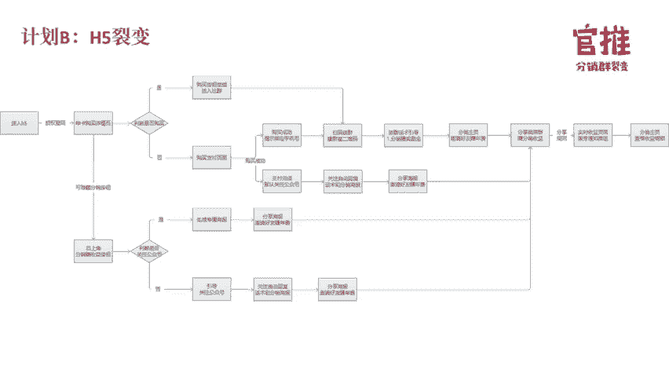

而且这张海报在今年有一家知识付费结构直接复用这张海报模板也裂遍了上万用户。海盗海报果然是好好的海报，果然是值得复用的。呃，第一张海报是呃正式宣发的海报。第二张呃第三张是我们备用的海报。

而大家看到的这三张海报只是我们背后十几张备选海报里面我们挑选出。最OK的给给到呃知乎这边选择，然后他们选择了第一张。这张海报看起来很简单，但背后其实是无数次修改次。的那我们背后怎么去包装这张海报呢？

包装这个海报的一个背后的方法论是怎样子呢？在包装前是这样子的，我们要善于利用势能，而这个势能就包括用户的需求痛点。他的情绪上的满足，品牌上的势能，而知乎读书会它的主要优势在于知乎的一个品牌。

很多用户一直以自己为一名知乎用户而自豪。那么如何利用知乎这个品牌来激发？出用户的这种自豪感。那我是这样子做。第一，把知乎读书会作为主标题，去突出知乎去放大知乎品牌。同时呃。

去放上各大大咖像富胜这种互联网大咖来作为一个背书。那第二个。我们要去作为一种社交货币来让用户来标榜自己，他才更愿意去分享。那么我这里就用了一句slogan，就是一个专业有趣多元的读书人聚集地。

尤其是读书人聚集地。因为读书人相对来说去请这像我半个读书人吧，也挺爱面子的。然后这句话还蛮打动我儿子打动我这句话是我和呃知乎这边一起碰出来的一句话。所以这句话也是很多人喜欢的一句话。

第三个的话是价值感的凸显。那你可以看到海报下面的话有呃连续似然说是600本大咖解读的音频书，500本严选电子书，两00本知乎原创书1二场专专享的力谱。这个是用4个。带有数字。

而且数字不断叠加的来叠加它的一个价值，来让大家觉得是超值的。而且尤其是在下面我们还用一个是说它是用一年的一年。这样子来突出这样的一个价值。那么在最后促进行动的时候，因为很多用户其实就差在临门一角。

那我们就采用了两种方式，就第一告诉他来对标。用现在99的预售价来对标1991年的原价。okK最后再告诉你，你只要坚持读书7天支付全额退款。

这个点就是说我们从刚开始选题那个策划那里来决定来打破最后用户的一个击破的一个点。结果在我们内测的时候在优呃整个优化调整海报，我们呃呃把上面三张海报发了测试群问大家的一个意见呃。

结果呃小部分的测试用户立马转发了朋友圈，都没用到什么渠道，就立马裂变开去，不到半个小时，立马就破了1000人的一个购买。结果微信立马就盯上了这个活动，域名就被封了，那封了我们怎么处理。

我们就紧急切换了域名。到第二天的时候已经有1万多人购买7000多个人进群，裂变速度越来越快。但由于呃活动太火爆，知乎储呃，弹误的一个储备资金立马消耗完，同时有听说有羊毛党卷入了一个风险。

所以应和呃合作办需求，暂停了大众分销这一块才呃。

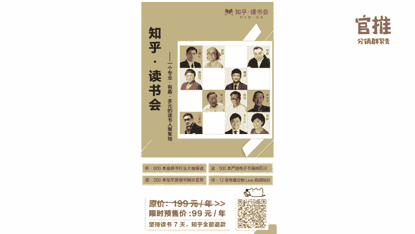

才才只有1万多，要不然的话这个活动至少有10万人参与进来。

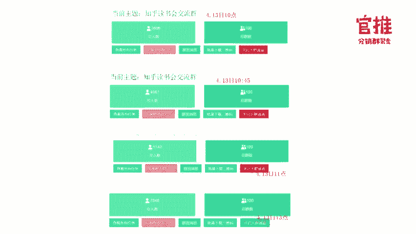

我们总结了海报传成功传播的主要原因啊呃，有以下4点。第一个是产品的卖点，我们去打造差异化，去突出百位大咖专业领夺加四大权益，以多位大咖和来增加用户的信任感，用四大基础权益的叠加的高价值的诱惑力。

让用户来产生立马购买的一个冲动。那在营销策略这一块是我们是7年7天打卡退年费的营销策略。及传了用户犹豫的环节，也给了用户最大的一个自我说服的一个购买理由。在定价策略这块，呃限时特价99元。

而99元这个是刚好处于用户感性下单和高分销收益的平衡点。那为什么这么说呢？99元啊，现在是所有的一个在线知识付费这块的话，呃，很有意思，会发现是9。9、39、69994、让用户。在100元以内。

这几个价格是分销成功率最高的那但是也为了说让保证合作方的一个基础权益嘛。那99是那用户收益更啊让合作方收益更大的对，所以我们就用了99这个当然呃伙伴们如果说你们做活动，你你们有各自的一个不同的一个产品。

包括怎样的一些东西不同。你们的定价应该也不同。但是基本上这几个价格可以作为你们几个呃在线上分销合作的一个价价格参考点。呃，第四个是宣发时间，我们是选择了呃4月10号12号。

这一天作为啊测试宣发的那这一天是周四，是一周用户中付费意愿最高的一个付费期，同时也避开了4月23号读书日竞品宣发的高峰期。他这里有两个点，大家可能不知道。第一就是在知识富贵行业，可能尤其是对于。呃。

在上班族这一批真正的付费高峰期是什么？它是周二到周四，这两呃这三天，它是付费最高峰期的一个呃一个时间。这个大家可能可能不知道为什么呢？因为周一大家刚来上班，那大家其实这个时候呃会有一些付位。

但没有那么高。那第二个是周周五大家都快快下班，你这个呃包括周末大家都都下班了。这个时候你让我来付费写东西，其实大家。不会的，所以你们大家也知道也了解，包括今天其实是周日大家能来听的话。

其实证明大家的一个真的是一个很爱学习的的的一批伙伴。那这是从一周的一个时间来评判。那为什么我们选4月12号这个这一天呢？他就是他基于两个点滴。我们。是根据百度指数。

也是刚才之前分享的这个百度指数去判断4月12号，哎，它接着就进入高峰期，这是一个点。那第二个点是我们要去和竞品啊提前拉开上去。因为4月23号就世界读书日，是这个是最高分最热点。

所有的竞品都突破在这啊4月23号前后一周啊，前后前面一周去去宣传。假如你作为一个新品，你和他这些已经成熟的这些品类去和它同时去冲突的话，那你是。力量和你的用户的注意力全部被吸引过去了，这不利你。

所以选择你的宣挖时期依然一样，包括。哦，提醒一下，接下来不是七夕吗？七夕有些伙伴可能在做一些七夕的活动。如果说你七夕你提前了呃提前了呃很久去上上一个活动的话，那可能大家七夕没有那种感觉。

因为七夕是真的到了七夕那一天秀恩爱了，撒狗粮的时候，大家在朋朋友圈被刺激到了的时候，你才会有那种感觉，你才会有那种传播去参加什么活动，包括啊脱单啊。

包括来说哎证明我七夕的一些什么什么什么一些怎样的的这样子。其实就是为什么要去强调宣发时间的一个原因。呃，渠道推广渠道这一块推广。刚好有呃群里有呃有伙伴在问到说唉，渠道推广。

其实这次主要是呃问到了说呃采用了招募分销KL。我们在开始前我们又招募了一批呃分销类的KOL，还有图图书类的呃读书类的KL在渠道招募这一块的话，其实相对来说呃前面的嘉宾大家有听的话。

其实大前面分析的很细了。我这里就不班门弄斧了。然后这里呃呃小小的呃有两个点。第一就是说。渠道这一块要呃两个精准，就是你要去找到读书类的K2。我们会发现最后复盘的时候。

发现为读书类的K2是在裂变的时候是效果不错的。另外一个就是分销类的分销的1个K2呃，像郭亮亮，像一些合作的一些伙伴，他们在这一块的一个势能，导致他们的分销的一个效效果都不错。呃。

然后在这里有发生了一个小小的有趣的事情，就是我们活动上线前本来没有那么快宣发的，结果在做海报AV测试时，也就是内测群。一个朋友不小心传到了朋友圈。朋友圈立马就刷爆起来了。这个是发现是哎。

其实如果我们前面花时间就打磨一些活动打磨海报的话，其实好的活动它是自带传播性的对，只要你的渠道呃准备的精准和呃有一批启动渠道。那么活动够给力，它是容易就更传播的。

当然这里有一个需要避可以避坑的一个点是在于要注意测试时去控制渠道。我这里发现我这里有个呃小漏洞，就是活动测试时，我把这个活动放上了活动的二维码。然后伙伴们一哎一看到这个活动不错，立马就宣传出去。

结果一旦裂变出去，我就控制不了，我前面的节奏就被打乱了一些些。还好我后面的话就又把它给控制住了。那活动整体的一个情况是怎样？他真的就是只用了一天一天一天来吧。

然后就是呃立马就裂变了啊1万1万0啊10715人，然后的话总的流水有10106万多，裂变的群有777个沉淀到群里面就有有700700多人了。对，那这个只是以其中一个小数据。呃。

如果说我们后面不不把这个活动停掉的话，整个裂变起来，我们预估因为呃可能有可能10万啊，这里这这里10万的人及部分用户。但是因为有些呃其他因素我们就不太去说它了。

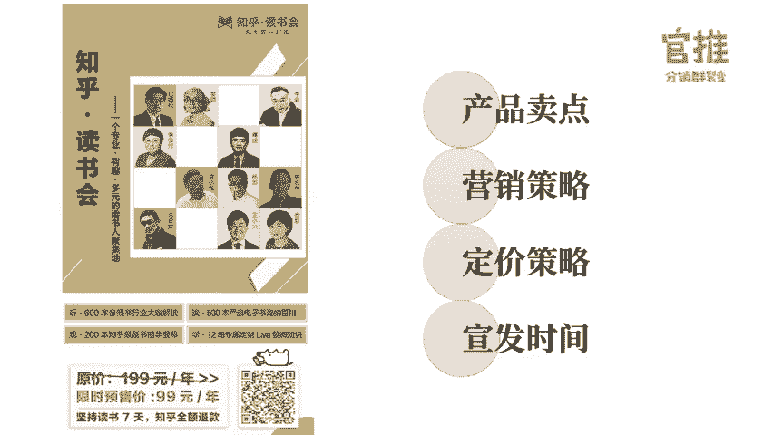

那我们直接说一下啊，我这次在活动中呃的5个坑和处理方法吧。啊第一个坑是微信规则。因为其实大家做微信生态会发现呃微信规则其实很多时候会有一些变化。然后这我这次遇到一个变化是小程序对小程序绘画框的一个限制。

导致小程序无法使用。那么这个时候我的采用措施就采用H5分销这种备用方案。也就是说现在阿梅阿梅加他们用的这种啊分销这种玩法其实就是基于X5啊，这种分销的形式去做的。这种就是比较稳定。

那第二个的话就是分销活动太太火爆，因为一下子太爆的话，多次被微信封。那么这里的措施就是准备多个域名随时去切换。以及接下来的话就是啊如果说活动太火爆的时候的话，你这个时候就呃可以关闭大众分销。

换成了针对大的KOA分销KO和渠道主机进行分销的形式。第三个是羊毛掸的一个卷入。羊毛党一个卷入的话。哦，是这样一种情况，就是哎羊毛党的话，他就觉得哎哎我有可能从这边套利。那在这个时候这种呃情况下的话。

我们可以采用定向招募。1000家渠道组，然后只对这些渠道组去开放分销权限，来屏蔽掉这些羊毛等。当然也可以从规则上去限制它。比如说呃。我这些活动是可能一要30天打卡，甚至90天打卡。像现在博荷阅读的话。

他出的出的一些活动是很多都90天打卡。那在这90天打卡的话，其实养马党他没有这个耐心去去90天去投入进来。所以从这个就可以去规避它。那第四个是技术的一些调试。因为。呃，当时的话呀。呃。

由于小程序那边的方案不行，所以呃技术这一块，我们临时是用X5这种分酸技术，所以在调试的时候留给技术的时间不够。对，所以就是有一些机型它暂时识别不了。

所以这个点就是在呃活动上年前这个技术一定要留一些充足的时间给到技术。那第五是哦个人号被封，也是去年少分，今年被封，大家应该大家应该感触很深。出现的情况就是个人号自动退出登录过了，因为被封了。

然后当时呃有一个原因就是我们挂过用原因是挂了V two这个号太新了，操作太频繁。所以这个时候我们立马就采用了切换高权限的客服号，然后这里去判断标准是最好是半年以上的一个微信号，这种相对于说会权限好。

今年的话最好一年以上的微信老号了。ok我们最后讲啊第三个7个可裂变呃，可复制的裂变技巧。第一个是。呃，一定要去呃，第一个是思考创新。现在裂变活动那么多，那你怎么去脱颖而出呢？那你就呃第一是对你玩法。

你的玩法要去创新。像知乎读书会，这一次是将分销的这种玩法和打卡的这种玩法结合在一一起。它才有这个效果。如果说单独分销，那可能没有这个效果，单独打卡，那也不一定有这个效果。

所以玩法两个玩法结两个是老的呀玩法，那你截起来，它就可能就变成它就变成了一个新的玩法，它会更加具有诱惑力。那第二个点是。海报的一个包装，海报的一个包装你一定要细致的打磨，然后看一下有没有一些新的海报。

然后在知乎这一次的话，我们是把。你可以看得到呃，以前是罗列罗列人头。啊，几十位呃七八位导师都罗列性排上去。但是我们这次的一个导师的排位，你可以看得到是用一个小方格，这个去去去进行。这是我们呃设计师啊。

他呃他去去去一个一个创新出来的。而这张海报他也是被今年啊一家呃其他伙伴去直接去拿去复用了，依然有效。去年的海报进用到今年的海报依然有效，就是好的一个海报方案去值得去复用。当然。呃，当然。

这种海报依然是常见的海报，那有没有一些海报的形式，能不能变一下，有没有一些怎样的方式。那我在做海报这个点，我摸索下来，有一个关键词叫熟悉感，就是说。你看到了很多熟悉的一些海报，你会觉得哎很有熟悉感。

且具有天然信任感。我在做论文的时候，依然拥有了一个熟悉感。呃，等一下我发一张海报，两张海报对比，你们会不会发现？

我从传统的海报变成了呃论文那种群裂变的海报，这个是呃去做了之后的话，算是我首创吧，去年首创，然后依然很有效果，但今年依然还有很多人在用。我说一下这张海报改版前的话，这张海报裂变速度速速度是一的话。

那改版海报后的裂变速度这张群二维码的裂变速度是十，也就是十0倍的翻倍的裂变速度。而且。呃，为什么这张海报会成功？我们我后来分析原因，主要是说大家很熟悉。

很很很就是因为大家在整个微信里面最熟悉的就是这我可以进群嘛，直接进群里面去。我哎看到这个群，只要那群的名字我感兴趣，我就会进去。而这张海报还有个最大的好处哦。只要你群名起的给力，OK那么你。就可以。

去用这张海报都不用设计。因为有时候你想一张设计图，你得想多久，而且你设计图设计很久，依然不一定有这张海报很有用。这个是我很多朋友在做了做了之后的一个感受。

然后呃今年呃有一批伙伴在呃用论文在做论文这一块也是用了这张海报去做，发现也确实很有效。在去年做的论文活动，在今年做依然有效。对他们依然也是复用这个套路，依然有效。那么。就是相对来说去琢磨。出来。

那么还有一个点，我等一下可以发一张新的海报，呃，是关于呃做一个excel课程的但excel课程大家可能用常常规的海报去做。但这一次做excel是我们如果说利用熟悉感，熟悉感就是你觉得很熟的一些东西。

就是你整个excel的一个界面，大家可以看一下这个海报。

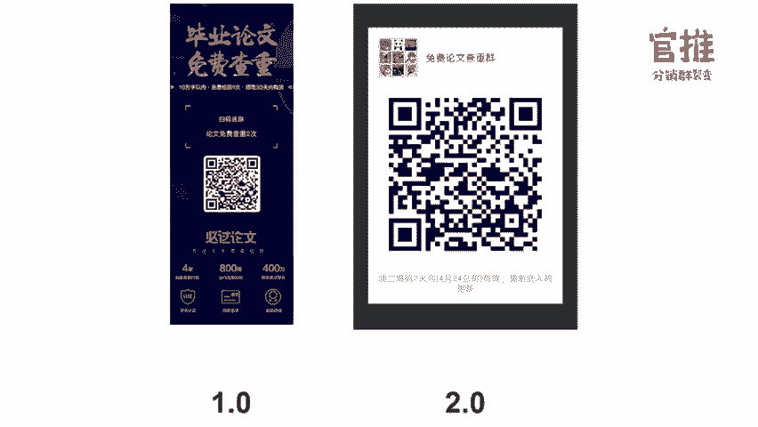

而这个海报我去观察它的裂变速度也确实比其他速度快很多。

呃，第二个点是真需求加真痛点。用户的需求和痛点是活动裂变的成功的第一步。所以呃为这也是在活动开展前要对用户进行充分的分析和调研，了解用户到的通真正的痛点去拒绝伪需求的一个原因。

这也是我在开场前为什么要去呃拆解分析。我哎，我是怎样子的做给大家的一个原因。那第三个是恰当的诱饵钓到什么样的鱼就用什么样的诱饵，幼饵的设置是能否吸引呃，用户参加，就决定了用户的参与度。

那么针对读书用户来说，坚持读书打卡就能退学会访学费。这个点就是对于他们最大的诱饵。那大家在想的说，哎，你们在做活动的时候，是否也想一下，哎，这批用户什么对他们来来说是才是真正的一个诱饵。那从重从重心理。

第四个是从重心理。当一个人在朋友圈连续看到三个好友在参加同个活动的时候，那么他就会被带度进去。怎么去做到这一个点呢？有两个方法，一个是找超级超级节点的KOL。那第二个是小范围的一个单点爆破。

那超级KL是指什么？超级KL就是比如说像运营圈，像阿妹和郭亮亮和王六六这些建峰。呃，他们就是在运营圈，像呃老黄这些人就是运营圈里的一个KOK。就是说当你这这些人是有很多人加他。

他就相当于说一个网里面的一个节点，很多人加他，那只要这几个人去同时去先发，那么okK你运营圈的人，这个活动就会连续在里面，起码三个人在发了ok就是这些操特。那这个点可能有有有一会有出现一个问题。

就是说哎呃有一些伙伴是没有这个资源的就比如说哦你你这个时候去链接到老黄链接到建崩，那其实还挺难的那有没有其他方法。那我这里还有一种小方法就是。呃，去单点的爆破。那么。这个点可能不明，我我我这里举个例子。

假如现在去让你去投放500个。大学生朋友圈。那你会去怎么投？很多人是这样子的。哎，500个大学生，那我就找啊全国高校。唉，那些大学生的1个KO来进行一个投。但其实你会发现。效果不好，而真正有效果是怎样？

你500个的高效的朋友圈是吧？不用多，只要选5所学校就可以了。一所学校100个朋友圈。然后你想一下，一所学校才一两万人。这张海报在学校100个人发，其实你已经人为的去制造小规模的一个刷屏事件了。

这个比你去力量很风散的去投。哎，全国高校一呃一所学校一个，比如说学生会长，他这种去投更有效果。你其实你很简单，你去想一下。的一个点就是假如说。我们是一潭啊一个湖面。你。你把你你把力量分成很多个小石头。

然后就砸向湖面，其实湖面波纹不大。而你把所有的力量聚集成一个大石头往湖面砸，那它由中心点，它的波澜就不断扩散，不断扩散，不断扩散，这个点就是一个呃小技巧。呃，第五是对的时机。

那对的时机是怎样可怎样可以去选对的时机。你可以去通过百度指数拉出往年的活动热度来找出呃参考出最佳的一个活动开展时间。在用户需求最大和活动最活跃的时候去推出活动。那第六个是呃按人群去包装。

不是所有的海报套路都对所有人受用的，就像读书人群一样。你如果你的设计很商业化，那么他们就很可能会瞧不起的设计，不为你去分享。所以这这次也就为什么说哎我们去设计的这个格调。

整个稍微会会会比我们传统在朋友圈你看到的那个海报，其他刷屏海报有点不同，或些区别，就是一个点稍微会去去注重这个格调。对，去适应这批人。那第七个是合适的工具。呃，这次这次知乎分销裂变的呃合作方。呃。

这次的一个呃用的工具就是呃阿梅加的阿梅加的话，从去年呃20181月就开始做这个分销裂变的这个工具了。所以他们的家的工具非常的一个成熟稳定。相对来说，而且很多细节的话，因为是呃和我们合作。

之前是我之前是在建门团队嘛，说和建门团队合作，这边一些细节我们是打磨的很好。所以相对于说的话，他们的家的技术也很给力。我们之前在上活动的时候，凌晨两点还早他们的一个老板聊技术的一问题。

他们依然跟我们解决了。所以就相对于说的话呃，其实我这也是去推荐的。当然这个也算一个小小的广告吧。但是相对于说呃成熟稳定的一个工具合作者比什么都重要。因为这是你呃整个裂变的一个基础。呃。

裂变的灵魂终相相遇，我是文玲，欢迎大家一起交流裂变啊，今天的分享就到此为止。今天的训练任务依然是正式推广你的活动，随时迭代优化你的活动流程。我们所有的课程都支持随时回看。

大家可以在玩转社群66公众号菜单栏听课入口处进入观看。如果你学习完课程后，觉得课程内容对你有帮助，也希望你可以把优质的内容分享给你的朋友，也许能够帮到他。点击玩转社群666公众号菜单栏生成专属分销海报。

即可生成你的专属海报。有好友购买之后，你还可以拿到50%的奖励金哦。

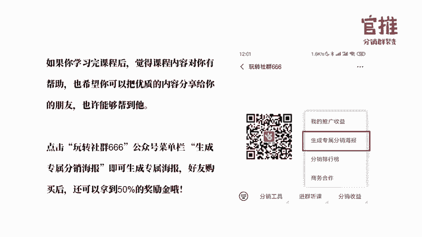