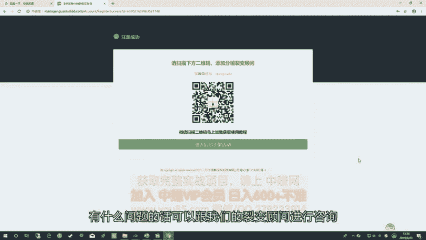
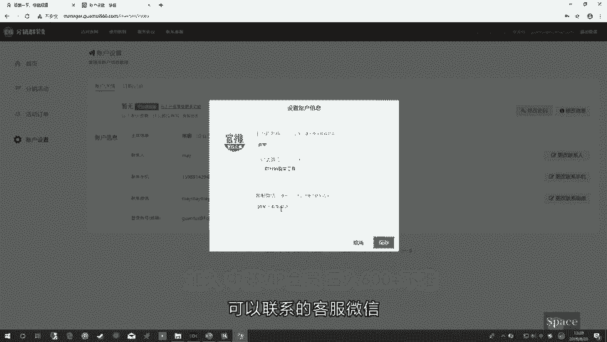
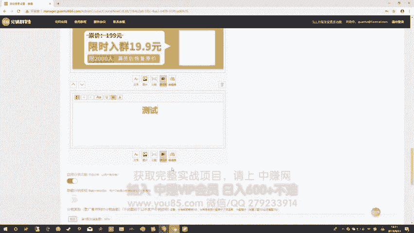
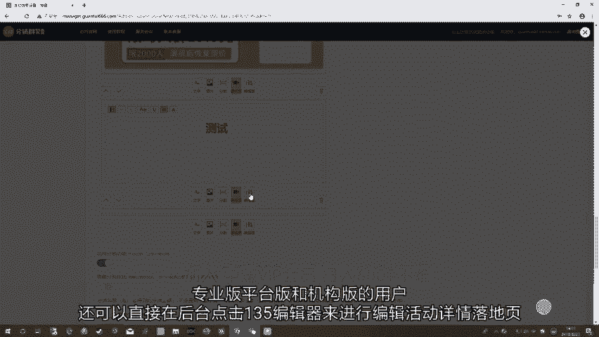
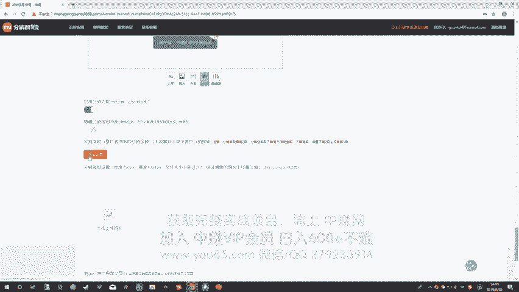
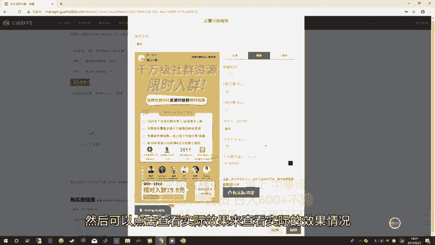
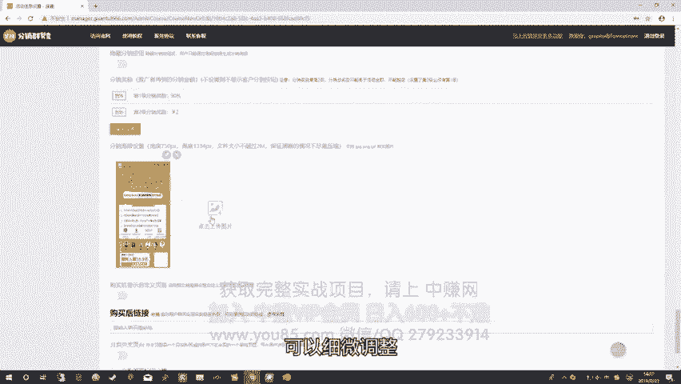
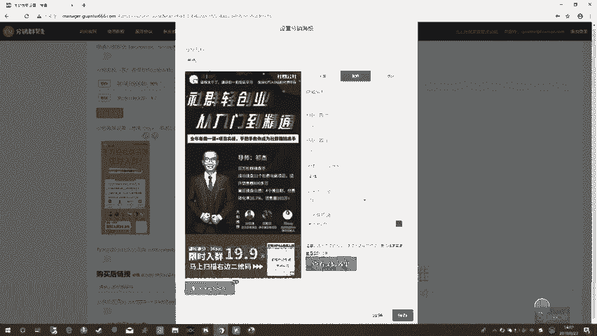
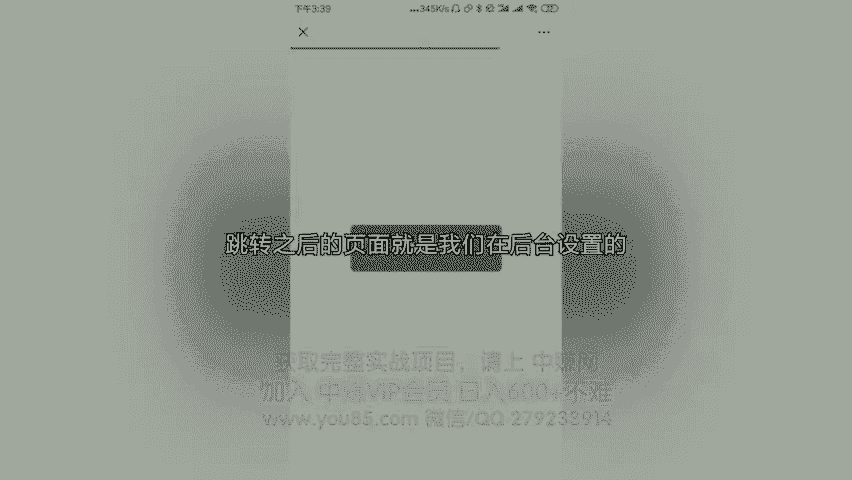
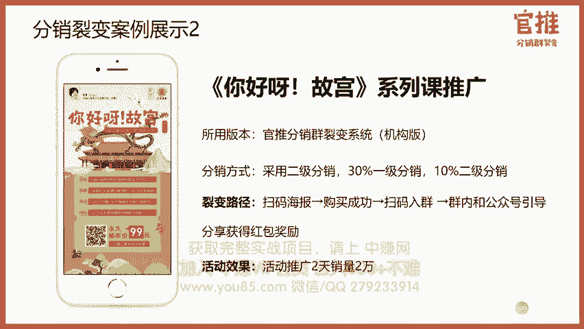

# 微社群裂变营销私域流量池增长秘籍创业运营销售获客视频课教程 合集 8套 374资料 13.1G 分销群裂变模式介绍及9大行业案例解析 - P12：第18节【选修】：工具操作基础课——官推分销群裂变工具实操课 - 高端网创试错赚钱大师 - BV1Ux4y1b7xM

好，接下来我们来了解如何用官推上加你的分销活动。首先在上架活动之前，先来了解一下系统有什么功能。目前，官推分销裂变系统主要有两大功能板块，一个是支付功能，一个是分销裂变功能。

其中支付功能可以帮助主主办方来解决用户付费后，让他加微信群或者加个人微信的难题。从让活动主办方在活动的过程当中，可以让这些付费用户都积累到你的私域流量实力。也就是你的微信群或者个人微信里。

这样一来呢你可以对这些已付费的用户进行后续的养和次转化，而且呢还可以通过刺激这些已付费的用户产生分享和推荐行为，从而带来新用户实现老带新。

而我们的分销裂变功能板块呢则是由很多关于分销过程当中可以刺激用户进行裂变的功能。比如说分销比例可以活设置最高可以设置99%佣金可以实现时到账到微信钱包支持二级分销以及分销PK排行榜。

还可以针对单一的用户来设置独立的分销渠道比例等等这些功能，从让用户可以自动生成自己的分销专属海报记录每一个用户的推荐好友的关系，方便你去识别每一个人的推荐用户关系和数量举行分销PK比赛等等。

从而助力主办方使用分销这方法来快速进行裂变。目前较适合用于推广付费社群付费课程以及线下。😊，门店活动，还有线上的电商活动等等，尤其是线下的门店活动，以及线下的峰会等活动，用起来效果特别好。

去年喜马拉雅的423听书节以及故宫官方出品的你好呀，故宫课程，以及我们自营的玩转社群666付费社群呃，应云圈运营圈的线下活动等活动用的，都是这套分销裂变系统在跑的。😊。

官推的官网是WW3W点官推666点comM，每一个用户都可以自行注册来进行使用，直接在浏览器当中输入官推666点comM就可以打开官网。那官网上面的话是会有这个工具的介绍以及价格服务的介绍。

目前这个套工具分为四个版本，体验版是长达一年的。这个呢是没有基础服务费，但是呢会按照你每笔的收入来收取8%的手续费。目前功能上面会有一些限制，但是呢完整去跑完一套分销裂变活动是没有问题的。

它所具备的功能依然是有呃分销即时到账，分销比例灵活设置呃，多张裂变海报随时展示等等等等这些功能呃，平台版呢就是1999元1年，这个就没有手续费了。呃，除了微信官方收取的千分之6的手续费之后。

平台不再收取任何手续费。它包含了体验版所有的功能，而且它上架活动数量没有限制，并且它可以针对单一的用户来设置它的分销比例。还有一个版本呢是专业版。专业版呢，它是包含了平台版所有的功能。

并且它支持设置二级分销，也支持对接你的专属服务号。通过引导用户关注你企业自己的服务号来生成分销海报和查看收益情况。这个是收费4999亿年。此外呢还有一个版本是机构版。这个呢是比较适合那些品牌机构。

满足他品牌宣传或者创新去做裂变，以及个性化定制一些深度的需求。呃，这个功能是2万起呃，但是呢我们是独立部署的，可以对接企业自己的微信服务号和微信支付商户。

并且支持开通子管理账号对接第三方APP或者小程序接口等等这些功能。好具体呢可以联系我们的工作人员进行了解。下面呢我来展示一下官推是如何注册账号的，以及如何登录官推后台的。

首先点击注册就可以按照上面的提示来一一注册。在这里的话，我只要详细讲一下，就是在注册账号的时候呃，务必记得就是你选择是你常用的登录邮箱，避免后续呢如果你忘记密码的时候呢，可以通过邮箱来找回密码。

第二个呢是很多用户会问到这个账户类型，这个账户类型，这里个人和企业的账号类型，它的功能是没有没有区别的。但是呢因为个人你没有企业的服务号，你就没有办法对接专业版或者机构版，企业就可以对接专业版和机构版。

😊，好，注册之后呢，就可以登录到后台了。接下来我呃直接演示登录后台下上面的一个情况。😡，好，这是注册后的页面。注册后呢会提示你加我们的分销裂变顾问，有什么问题的话，可以跟我们的裂变顾问进行咨询。

当然你也可以直接点击进入后台上架活动。😊。

进入后台之后呢，会提示你主办方的信息尚未完善。这个呢是在前端的页面会显示主办方的信息。所以在这里的话请你进行完善，点击去完善，点击替换到头像。😊，然后主办方名字。主方方的简介。然后客服的微信。

点击保存后台就会显示你的主办方信息，并且前端也会显示出你的主办方信息，让客户可以及时联系到你。接下来我们来配置分销活动，点击分享活动，进入分销活动列表页。首次上架活动时。

需要我们工作人员帮忙审核活动信息，在活动编辑后再联系我们的工作人员帮你启的活动，点击编辑修改就可以进入活动编辑页。在上架活动之前，请大家准备好活动主题活动头图活动海报页，还有活动的详情介绍页。

以及用户购买之后进入的微信群二维码或者个人微信二维码。输入活动标题。输入活动副标题，这里根据你的活动信息进行编辑，选择活动信息的类型。设置活动原价和限价，再设置你的特价活动截止时间。输入分销入账。

奖励说明。这里的报名666增享奖励金，就是用户推荐朋友购买之后，分销入账时的奖励说明对应的是。这里的入账详情说明就是用户推荐朋友购买之后，你的佣金会即时到账到微信钱包。

这时微信支付会推送出一条入账金额的说明信息。在这里录账详情就可以对应上我们的入账说明。所以这里请备注好你的活动主题加分享奖励金，但是不能过长，这里的字数仅限在15个字以内。上传你的活动头图。😡。

上传你的活动详情介绍页。如果你的活动详情介绍页过长，请使用图文编辑器来进行上传。你可以将你的活动详情介绍页分割成多张图片再进行上传。这也是演示效果而已哈。这个具体是根据大家的活动情况来进行配置。

当然也可以输入对应的文字。调试你的效果。

专业版平台版和机构版的用户，还可以直接在后台点击135编辑器来进行编辑活动详情落地页。进入135编辑器后，可以把文字和图片放到页面上，然后点击左边的漂亮的排版进行调用。

直接点击就可以自动引用对应漂亮的排版了。然后点击完成就可以到后台看到对应的排版信息。

如果你要启用分销的话，点击启用分销按钮，在分销奖励那里添加设置。😡。

输入层级一就可以设置第一一级分销的比例，可以按比例分成，也可以按金额分成。我们的后台是支持最高设置99%的分销奖励的，体验版的用户可以设置92%。品台版机构版专业版都可以最高设置99%。

如果设置二级分销，就点击二，然后设置分销的奖励就可以了。专业版和机构版都可以设置二级分销。要添加分销海报的时候呢，在海报名称那里可以输入对应的名称。这个呢可以在后期你再进行分销呃，分析的时候。

可以快速判别出来哪家海报的效果。后台呢这持分销海报的头像昵称和二维码进行拖拽。点击海报的头像可以设置隐藏或者设置头像的形状为圆形或方形。头像昵称可以设置对应的字体大小而设置呃黑颜色等等。也可以隐藏。

上面有坐标轴，也可以细微调整。然后可以点击查看实际效果，来查看实际的效果情况。

如果觉得不满意，可以视微调整，同时可以上传多张海报，就是随机想呃随机显示。

同样我们这次可以继续调整他的微信呃昵称的用户昵称的颜色等等。好，配置完海报之后呢，我们接下来可以看一下，如果你需要呃在前端隐藏分销按钮，也可以在上面的按钮来进行隐藏。当然，如果隐藏之后呢。

用户点击进去看不到分销的提醒，它可以通过分销海报来生成分销海报信息。另外的话，用户购买后的页面是可以自定义的。你可以点击购买后显示自定义页面，然后呢，在这个页面里边上传呃，购买后进群的二维码。

或者说微信好友二维码。这个页面呢其实可用的功能很多，大家可以摸索一下。此外呢，如果你是做大型那边活动的话，就可以把这个按钮关掉，然后显示出购买后的页面链接。

这时候呢就可以使用呃这种呃建群的机器人来实现呃快速切换群二维码。这个功能呢需要结合第三方的平牌来进行使用，就可以把进群活码链接放到这来。😡，此外呢还可以自定义购买页的按钮文案。

默认呢底部的那个购买按钮是立即购买。当然你也可以改成立即购买入群，立即购买听课等等这样的一个呃文案。购买后呢，左边的按钮呢会显示是联系主办方。

那你也可以在这里呢显示说马上入群或者马上联系客服等等这样的一个提示。好，设置完毕之后就可以提交。提交成功之后，再联系我们的工作人员进行审核就可以了。

那有些朋友呢可能是使用我们的分销群那边系统来上架电商或者线下活动等等活动信息，需要收集用户的报名信息或者收货地址。这时候呢，就可以借助报名表单的功能来进行设置，点击活动列表页的设置报名表单。

启用报名表单，然后在表单标题和说明分别写上你的表单的说明和呃标题，然后呢就可以让用户在购买之前来进行填写表单。同时呢可以在参与人的填写信息的选项勾上用户需要填写的表单信息。当然也可以自定义去选择。好。

我们现在来看一下用户报名时候需要填写的表单的信息在前端是怎么显示的。首先，复制活动链接到微信当中，点击打开就可以看到活动的呃前端页面。这里呢就是我们刚才设置的头图。

这里就是我们刚才设置的主题副标题活动的原价和限价，包括活动的优惠截止时间，这些都在前端页面可以直接展示。这是我们之前刚开始设置的活动主办方的信息。用户可以点击生成专属海报。

点击换一张就可以换成不同的分销海报，也可以保存下来。点击底部的立即购买，就可以看到我们刚才设置的表单信息了。这个呢表单信息，用户填写之后，在后台就可以在查看表单呃，报名表单数据，这里可以看得到。😊。

好的，那接下来我们来演示一下用户端的体验流程。首先，用户在微信群或者朋友圈看到的海报，看到海报之后扫码。场面识别二维码进入活动详情落地页。进入详情落地页之后，可以看到这是对应的活动的介绍。

如果你没有介绍主办方信息，就会显示这样。所以要大家要补充好呃主办方的信息，然后用户点击立即购买。如果用户之前没有关注过公众号，在这里一般会默认勾上关注公众号。如果关注过公众号，则不会显示。

也可以自己点击勾选。

点击完成。跳转之后的页面就是我们在后台设置的用户进群二维码或者个人微信二维码。

用户长按识别就可以进群。进去之后，主办方可以在群内进行说明。比如说购买的产品的兑奖说明或者引导用户进行二次的分享，分享给好友赚取现金奖励。因为刚才我扫的是我另外一个微信号的一个二维码。

所以在这里就可以看到分销佣金是即时到账到微信钱包，并且提示。同时呢如果关注了官推的公众号，可以看到收益的提示。呃，可以提示是谁购买我们的课程，并且在公众号里可以查询到我的订单，我的收益等等信息。此外。

刚才客户购买之后呢，可以看到他默认关注了公众号，并且公众号会立即帮他生成他的分销海报。客户可以在官推里边查看到我刚才已购买的订单，也可以在这里联系到对应的主办方。这个就是我们刚才购买后的页面。

同时在公众号里，你可以生成海报或者点击查看我的收益情况。可以具体看到收益的到账情况以及邀请的数据情况。好，这个是用户端的体验流程。好的，因为有很多朋友跟我们工作人反馈说呃。

虽然知道分销群裂变对用户增长和吸引精准的付费用户很有效，但是呢不知道怎么结合自己的行业来设置自己的分销裂变活动。在此呢我展示一些分销裂变的案例给到大家，希望给大家一些思路上的启发。

这个呢是喜马拉雅423听书节做的一次活动，这呢用我们官推机构版，它设置的分销方式是50%以级分销。他整个裂变路径是这样的，就是用户扫码海报购买成功之后呢，绑定手机号在引导用户呃。

购买之后下载喜马拉雅APP听课以及加入学员群。同时学员加入群内和公众号。其实也会引导用户去进行分销，并且获得现金的奖励。呃，喜马拉雅这次活动的策划呢，其实本质上是为了推广喜马拉雅APP的。

所以呢这里他用的机构版可以对接喜马拉雅APP呃，这样的话就可以把用户购买的数据直接同步到喜马拉雅APP里边去啊，所以呢这个路径大家可以参考。这是做用课程来做APP拉新的一种方式。第二个案例呢是你好呀。

故宫的系列课的推广。这个呢是呃也是用了机构版，他们采用的是二级分销。呃，当初是分销设置比例是30%的一级分销，10%的二级分销。它的整个裂变路径就不引导用户去下载APP了。

它裂变路径是让用户成功购买之后直接入群，在群内再引导用户去进行分享，同时获得红包的奖励。整个活动的效果推广起来是两天销量2万的。😊。

好，第三个案例呢是我们自营的一个社群活动，这是以玩转社群666的付费社员的招募。当初我们启用的启动量是150人，采用的是50%的一级分销。整个裂变路径呢也是让用户购买成功之后，直接扫码入群。

在公众号和群里面去引导用户进行分销，来获得现金的奖励。这个活动本质上当初我们是为了推广群供大家这款小程序来举举办的。所以整个活动的裂变效果也是很不错的。

当初活动启动后不到24小时就获得一1万左右的用户来付费进群，整个付费的购买转化率达到34%。呃，整个路径大家到时候可以去参考。这个用来做付费社群的招募真的非常的有效哈。第四个案例呢是一个线下的活动。

这是2018年线下陕西的运营年会，采用的是平台体验版。当初的分销方式，采用的是50%的一级分销，整个那变路径也是先让供户购买购买成功之后呢，添加主办方主办方在拉进微信群通过这样的路径呢。

微信群就可以到达500人的微信群。而且呢可以把用户沉淀到个人微信和微信群里边，整个活动效果也是相当不错的。当初吸引了近400人到场参位，全场爆满。最近呢我们也举行了一次活动，就是包压815的思维节。

在广州的一次创新的思维节。这个活动也是采用分销群那边的方式来做用的是专业版，而且呢分销比例并不是很高20%吧，吸引的是高管人群，也是效果相当不错。当初是到场1800。多人全场是爆满的嗯。

所以用分销群那边活动去做线下的大会和线下的沙龙是相当有效的。而且呢可以把用户的推荐好友关系以及用户的推荐好友数量都记录下来，方便主办方去进行分级的奖励。尤其是你自身有很多的销售人员的情况下。

这个效果就会更好。第五个呢也是一个线下的活动，这一个是一个中公的教师，他用的是平台体验版，单初启用的分销方式是50%的一级分销。他整个裂变路径设置的是用户扫码海报之后呢，是填写表单，以后呢。

购买成功之后添加助教，再引导用户去进行分销，再拉进微信群里边。因为这次活动呢，它有不同的参会地点，所以呢这里设置的表单呢是采用了逻辑表单的功能，可以让用户选择参与哪一个地方的呃场次。

再把用户拉进对应的微信群里，整个活动的效果也是相当不错的。呃，付费的用户数是高达3000多人，这是一个线下的活动哈。😊，整个活动的海报也是相当不错的，大可以参考。😊，第六个呢是一个线下门店。

这个呢是一个做火锅的一个线下门店，他叫蓝小二。他当初呢使用的是一个一级分销4元的一个奖励，用的是平台办。整个裂变路径呢就是让用户购买成功之后呢，加店长加入微信群。这是这个活动的启动量。

其实是他们的服务员加店主自己的那个亲朋好友，其实启动量并不高。但是呢因为他是一个线下的门店，用户信任度在这里，所以呢以购买的用户呢也会纷纷去帮他去参与推广，让亲朋好友都来购买付费的转化率也是非常高。

有3%2。87一下子销售了500多份到店消费。所以线下的门店的用户可以通过这种方式来积累到呃，用户到你的微信好友里边去，而且呢可以积累用户到微信群里边去，可以通过微。😊。

进运营进行后续的一个呃转化和让用户复购，效果也是相当不错的。第七个案例呢，采用的是一个线下的线上电商的方式。它其实呢就是打了一个口号，就是我产品免费送。但是呢你需要支付邮费9。9块给我。

所以呢很多用户在做这种活动的时候，你可以考虑到就是比如说那种9。9块包邮送的产品就可以用这种方式来进行。呃转换化，尤其是可以通过官推分销群那边活动，可以统计你每一级代理推荐的用户数据呃。

可以把用户沉淀到你的个人微信里边效果也是特别好的。这个付费的转换率高达75%。好的，这就是以上不同的场景和不同行业采用的方式，希望可以给到大家一些参考的思路。更多分销群里面的拆解案例。

可以关注玩转社群里6公众号，回复关键词分销裂变来获取。里边除了其他分销裂变操盘案例的复盘干货，还有可参考的分销活动策划资料参考文档。

