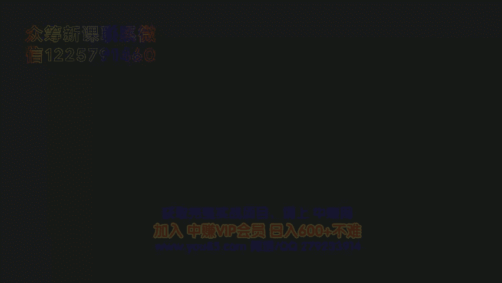
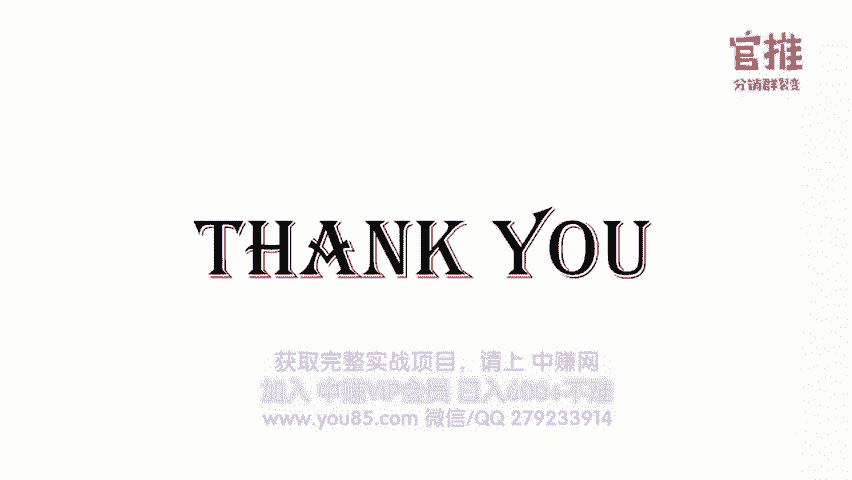

# 微社群裂变营销私域流量池增长秘籍创业运营销售获客视频课教程 合集 8套 374资料 13.1G 分销群裂变模式介绍及9大行业案例解析 - P1：第01节：先导课-分销群裂变模式介绍及9大行业案例解析 - 高端网创试错赚钱大师 - BV1Ux4y1b7xM

🎼。

hello，大家好，欢迎大家参加我的分销裂变实操体析课。我是阿妹，也是课程的主要负责人。😊，那应该有些朋友还没有认识我，所以呢我简单做个自我介绍。呃，我从大学毕业之后就一直从业着互联网营销相关的工作。

最早期呢是在做网站的推广。例如在用呃SEO搜索引擎优化的手段和百度竞价推广的手段来做推广。但后面呢在变成了移动互联网时代之后呢，就开始做新媒体运营和用户裂变增长的工作。至今呢从业已经有67年的时间了。

那从去年开始呢，我就跟一个朋友出来一起合伙创业。我们做了官推群购大好玩转、社群六6等多类的一个产品。呃，我自己亲自呢实操过很多的案例，因为从业那么多年了，基本上市面上可以见得到的同缘手段我都尝试了个遍。

那在操盘过大大小小的几百抢活动之后啊，我发现分销裂变这种模式呢，第一个他在吸引精准用户的方式上是一种非常有效的方式。第二个呢，它基本上可以算是呃永不会过时的一种方式。呃，因为我发现了分销这种方式。

从很早很早就开始有了。那在最近一年多来啊，我最常用的方案也是分销裂变的方案。例如在去年有我自己主要操盘的玩转社群六6。就在短短24小时内就获得1万多的付费社员。那前几个月呢。

我自己亲自操盘了7天辣妈训练营的活动。品牌方辣妈能力圈呢也是一个零粉丝基础的一个新品牌，也是通过分销类变这种方式呢呃领取到的费用就获得了近3000的精准付费用户。

那当我把呃这套分销裂变的玩法交给其他的朋友，发现他们同样都奏效。那截止到现在，我已经帮助了大概有300多个朋友使用这个分销裂变的方案来实现分流量增长和变现了。其中呢包括有喜马拉雅新榜美质检啊。

就真妙老师，还有那个图斯美誉侃卡网，还有泽宇教育分销王子麦子老师和琪杰老师等等人。不过有很多朋友跟我反馈说自己亲自去做实操的时候呢，发现自己还是比较迷茫的。有时候呢会产生很多的问题，要不知道该怎么做。

例如不知道如何从头开始策划一场活动，整个活动流程是怎么样的。然后呢，应该设计怎么样的分销方案，还有怎么去调动各路的资源来帮忙推广，怎么促进用户主动去转发分享。呃，我的是一个新的品牌线下的门店。

以及我是一个线下的沙龙活动等等。适不适合用分销裂变这种方式来做。那因为问题实在太多了，所以呢我就决定做这么一个分销类变实操体系课。通过给大家去深度复盘，分享我们做分销裂变案例的执行细节。

帮助大家真正去掌握这套玩法。那在前几个月呢，我其实用实操营的方式给他传递了我们整套分销裂变的玩法。这是之前的学员学习完之后反馈的一个效果。就很多同学其实之前没有做过活动的策划就完全是从零开始。

但是呢他会发现就是自己在学习完之后，按照我在课程上教的内容，一步一步去做自己的活动策划，打磨海报和做落地页，做宣传，做分销方案，招募分销的队长，整套流程走下来的话，整个效果还是很不错的。

这是之前一些学员反馈的一个截图，还有一些同学呢跟我反馈说自己呢之前一直有一些公众号或者有流量。但是呢不懂的运营。这次的课程和实操呢就整个开阔了他的视野，打开了他盈利的思路。

还有一些同学跟我反馈说呃通过学习这次课程已经能很。好的策划一个活动了，并且找到了很好的工作，呃，非常开心。😊，而且现在裂变操盘手的需求越来越大，很多企业都找上我说能不能给他介绍呃好的企业裂变操盘手呃。

或者能够找到一些就是操盘手帮他去做操盘呃，都是愿意付出高价去聘请，或者找到对应的操盘合伙人的这么一些企业。所以呢当你学会了分销裂变这套玩法，不仅呢能从很好的把现在自己的工作，自己的事业做的更好。

还具备了帮别人操盘的能力。呃，操盘手的想象空间是无限的。就好比说现在很多人去操盘一场裂变分销的活动，可能收费都要呃几万元起。所以很多呃上班的朋友就跟我说，没想到做一场分销裂变的活动，这个收益这么好，呃。

比我上班的工资要好太多了。那我们这套分销裂变体系课呢是偏实操性质的，我的目的也很简单，就是让大家学完之后呢，自己就能亲自去策划操盘一场分销裂变活动了。这是我们这个课程的内容大纲。前八节课呢由我来主讲。

我会从分销裂变的整套模式呃，以及案例的解析开始，告诉大家怎么从零开始策划一场分销裂变的活动。然后呢就每一个活动的细节。抛开来一步步的从细节和怎么操作的层面告诉大家怎么去设计一个高价值引爆裂变的活动。

诱饵，怎么去定价，怎么去设计你的分销规则，让渠道可以疯狂去推广。然后呢，怎么去打造可以让大家去帮你转发的裂变海报以及转化率高的落地页，包括朋友圈的分享文案应该怎么写呃，你自己启动量低的时候呢。

怎么去快速招募到大量的微信分销合作伙伴，以及在分销的过程当中，有哪些风险，可以怎么去控制，以及在社群运营过程当中，有哪些坑需要去避免用什么样的方式来解决。呃，整一个方完整的内容呢？用八节课的方式呢？

给他详细去解析。然后呢，我会邀请8位实战的老师，从他们的案例实操经验。把他们亲自操盘的案例呃，一五1十毫无保留的把详细的步骤拆解给大家，让大家了解不同行业，不同产品应该怎么去策划自己的活动。

在整个过程活动过程当中应该怎么去操盘。尤其是呃除了我们说怎么去策划活动，怎么去裂变流量之后呢，来了流量应该怎么去做呃，这个社群的运营，怎么做群发售，让客户从低客单价购买高客单价。然后呢。

怎么去通过社群的裂变和引流呃运营，让整个社群可以持续去活跃，持续产生收入，怎么去设计一套分销发售裂变的整个方程式，让大家可以多卖钱。呃，从这个角度呢给他深度去分享。好，那我们话不多说。

马上进入我们今天第一节课的内容。我将会从以下三个部分给大家去讲述。第一个呢是我们的分销裂变的传播要点。从这一点上面呢让大家详细去了解分销裂变的路径，以及呢我们怎么让用户从分享率从5%提高到60%的。

第二个呢，我会通过九大分销裂变的案例给大家解析，就是我们可以应用到哪些场景里边去。然后呢，不同的场景是怎么样的一个策划思路。在第三部分呢，我会提炼出我的分销裂变顾客的成交模型。在举具体的案例告诉大家。

例如我是做护肤品行业的，我是做社交电商行业的，我需要招代理，我是要招到精准的女性客户。那怎么样去结合分销裂变那种模式去策划自己的活动，用到自己的实际行业当中去。好，那我们进入第一部分的分享。

这三个关键词呢，相信大家都有听说过私域流量、社群和裂变。这是最近一年多营销圈比较火的三个关键词。为什么私域流量裂店社群这三个词特别的火呢？第一，因为流量的成本越来越高，竞争越来越大的。

比如说以前拼多多他获取一个新用户的一个成本大概是10块钱，现在大概需要200块钱了。所以呢大家想办法，就我怎么样才能把这个流量成本降下来。所以大家开始思考了，以前呢都是单次的流量呢。

投百度竞价推广或者投了这个呃今日头条来了单次的流量之后呢，就马上转化了嘛。那现在可不可以让这是多次单次流，可不可以让单次的流量变多次可利用的流量呢？

所以就诞生了私域流量这个词私域流量就相对于而然就指得我们不用再次付费，可以在任意时间任意频次直接触达到用户的渠道。比如说你的自媒体号、公众号、用户的群以及你的个人微信号，这些都是你的私域流量池。

这也是为什么我们在做活动的时候，都拼命的想办法让用户沉淀到我们的微信群和个人微信上的原因。因为这样一来啊，当你花钱或者做活动的时候，把用户加到个人微信之后。

就可以通过后续的运营和活动的触达进行二次的广转化和成交。相当于你拥有了这个朋友的终身价值，而不是一次性消费了。但是这样还不够，大家还在想办法，我可不可以让来的每一个用户都去转发和传播呢？

从而给我带来新的用户，这就产生了裂变这个关键词。裂变的本质其实是老带新。老用户分享带来新用户的分享。那让老用户帮你去拉新。这样的话呢你只要有一定的用户量，它就会一传十十传百的方式帮你裂变出去。

你的用户流量池就会越滚越大。这就是第二个关键词裂变的来源。其实说白了，为什么私域流量和那个裂变两个关键词为什么这么火？其实究其本质性味真的。今年来就是这个成本越来越高，大家真的很穷。

所以需要把这个流量成本降下去。那为什么社群也这么火了呢？其实是因为现在朋友圈成交越来越难了，很多人的注意力被抖音和头条这些东西所吸引。所以现在如果你只是做朋友圈营销时远远不够了，所以需要一个新的利器。

这个利器就是社群，社群是一对多批量成交的武器。如果你善于利用社群，成交效果是非常好的。所以呢这三个关键词其实究其本质就是大家想办法让来的流量都可以变成多次利用的流量。

让来的每一个流量都可以就是自传播滚动起来，让它可以带来新的用户。那样又来的流量之后怎么做成交呢？通过朋友圈成交不够，还需要做通过社群发售等方式去做批量的成交。这就变成了今年最火的三个关键词。

很多人以为分销裂变其实是传销啊等等。其实不是的，它本质上是我们把以前的广告费付给了用户，所以我把奖励返还给用户而已。所以在整个裂变时操营当中，我们的目的呢就要帮助大家掌握分销裂变这种玩法，解决三大问题。

第一个问题就是帮大家去构建自己的私域流量池。第二个问题就是帮大家去做好老带新，就是做好老用户带来新用户的裂变增长。第三个问题，教给大家怎么利用社群来做批量的成交。怎么通过社群，将低客单价的用户。

带到高客单价去做成交。好，那也好多人说分销啊。😊，好多人说分销啊，分销很常见啊。好我的那个商城用分销已经很久了，还有很多知识付费的平台，其实也会有分销的设置嘛，对吧？但是呢他们就会问了，哎。

我的用户主动分享很差的呀。呃，很少看到用户主动去帮我分销的，除非我自己去建我的团队是吧？😊，那为什么就是这个用户分享率那么差呢？虽然你就算有做了分销，但是分享率还是很差的呢？

怎么激励这个用户主动去做分享呢？我们来看一下以往很多活动是怎么设计这个活动流程的那往往呢就是一个听课的平台，呃，你可以看到他就是用户支付之后，往往就引导用户去听课了。会一个购物的微商城。

就用户支付购买之后呢，就会引导用户再去看订单，或者是引导用户再去购买其他的商品了。就整个流程是这么设置的。但是你会发现啊，这样一来，第一个用户只会在你的直播间里或者在你的微商城里边逛一逛。

可能听完课购完物就跳出来了，你可能再找不回来他了。也有可能呢就是用户再也没有办法接触到你的信息了。也极有可能呢会主动去把你的这个商品或者你的课程分享给他的朋友，他的分享率和这个呃转发力度是非。😊。

常低的。我们通过数据统计啊，这样的情况基本上就是他的主动分享率至基本上是只有5%左右。那么为什么我们去做分销的那个分享率那么高呢？是本质上呢，我们是因为设计了这个流程。

给大家看一下我们整个分销群裂变的流程哈。前面呢如果说你让用户购买之后呢，直接就让用户去听课，或者让用户再去购买其他产品呢。这样一来，就是用户其实整个流程是断掉的，就是用户的流量到了之后，他就转化了。

转化之后就断掉了，他就没有意识到帮你去转发分享了。那由于这个流量是不连续的用户分享也是断断续续的。所以你看到很多活动，虽然也设计分销的按钮，但是效果真的很一般。那我们的分销路径呢是让用户先购买。

购买之后呢，先进群进群之后呢，再去听课，然后呢，再去看他订单，再去购买其他产品。那在进群的过程当中呢，你就相当于把用户已经圈进你的微信私域流量池旅了。你在进群之后呢，再引导他去做分销。

去做呃就是做其他的引导，其实效果都会比你在你的H5里边，在你的网页里边去引导效果要好得多。因为他进群之后，一来你可以给他服务，他感受到你的服务了。第二来他进群之后，再给你跟你的一个距离就拉近了。

所以呢第一个进群之后，一方面给你涨粉。把用户圈进你的私域流量池里。第二个又把用户进群之后呢，又可以让用户去引导，去帮你分享。这样一来的话，用户又可以进行二次的培养，可以再次的变现。

整个链条的话就连续起来了。那用这套分销群裂变的整个路径，它之所以比普通的分销裂变效果好的原因啊，其背后的核心要点其实是这两个。第一个是戳进戳重用户需求的产品方案。第二个是激发用户分享的这个分销的机制。

好的产品是一切营销的基础。没有好的产品，一切营销空谈，就算你把流量引来了，成交也是很差的，成交之后口碑也会很差的。所以好的产品是一切营销的基础。那怎么样才能戳进用户需求呢？

怎么去设计戳中需求的产品方案呢？我们的设计路径是这样子的，首先要明确你裂变的用户人群，这是最基础的。很多人在做裂变的时候漫无目的。认为所有人都是自己的目标用户人群。

这是非常不可取的几乎没有一款产品是可以满足所有人需求的就算是大众的日用品，也是有精准的目标人群的。比如说紫金类的产品，你说是大动需求，所有人都需要吗？是是可能所有人都用得上。

但是最优质的目标人群其实是家庭主妇，你要抓住最有需求，最有购买力的那一批人群。那接下来你觉得需要去了解用户需求。去分析竞品情况，再去找出自己产品的差异化，从而去设计的的产品方案。

那么好多运营人员就会说了，还有产品方案都是现成的，公司就有这些产品，我没有办法去设计的。其实这就走进了误区，就是很多人在设计这个拉新方案的时候，觉得哎我自己有产什么产品和业务，就跟用户去推广什么。

除非你自己本身的产品和业务本身是非常好的一款爆款的产品可以用来引流。否则一般来说，作为运营负责人，你是需要思考哪些是引流品。你怎么去设计引流品的产品方案的，不是你有什么就给用户设计什么。

而是用户需要什么，我们就设计什么来吸引用户。而其中我觉得最简单的产品方案是。模仿加微创新了。后面呢我会举一个具体的例子，告诉大家应该怎么去拆解竞争对手，怎么去了解用户设计出合适的引流产品方案出来。

在这里我就不展开详细说了。正在收听快联系微信客服1225791460竟从步更新群，不更新群。那么怎么去。那么有了戳中用户需求的产品方案之后呢，怎么去设计促进用户分享率的分销方案呢？我们磨索了很久。

发现以下三种可以极大的提高用户的分享率。第一，建立社群进行强引导。这就是我们当初在改进用户的整个活动流程过程当中，最重要的一个环节就是建立社群。让用户支付之后呢，先引导用户进群。

进群之后再通过社群的封闭性，结合小号的互动，可以快速拉近用户对平台和公司的距离，增加用户的粘性。最对提高老带薪和复购率提升都是非常有帮助的。而且以往很多平台啊，虽然也有分销按钮等提醒。

但是用户很少留意到，也没有一识去推广。所以呢我们除了在页面上有意外按钮去做引导分销之外，还让用户进群之后呢。就马上去引导用户去转发和分享。

并且呢呃可以通过社群内就是老用户和和一些就是社群内的一些志愿者的引导，可以快速去激发用户老带薪的效应来放大整个流量和增加这个裂变的速度，并且这样一来，我们用户就流存到这个群里边了。

也有利于你复购和做用户价值的深度挖掘。那对用户本身来说呢，它在群里面可以获得资讯干货和和同行交流的机会。所以社群是我们付费社群留存的关键。同时社群还解决了企业另外一个问题。就用户到底是平台的还是自己的。

就以往的活动当中，用户听完课或者说浏览完产品，买完产品之后呢，就走了，就流存到平台这一级。如果下次你还做同样的活动，这部分用户是触达不到的。而社群就可以承载这些用户，帮助你去建立自己的流量池。

下次活动他就在活动的曝光范围之内，你可以继续去影响他们增加你的启动量。这是第一个就是做强引导，多方位多渠道去触达的用户，让用户去帮忙帮忙转发分享。第二个就是建立即时反馈的机制。

比如说我们的分销佣金是立即到账的微信钱包的。很多人在分销时遇到这样的情况，就发现你帮别人去做分销时候，根本不知道有没有人买。原因就在于你没有收到分销收益的提醒的通知。另外一方面呢，就算你有这个分销收益。

你只要你不关注公众号，你也收不到收益的提醒。所以我们改进了这个方案，让用户购买之后，分销收益是立即到账到微信钱包的这是非常刺激的。你想想嘛，他分享的朋友圈一会到上一个一会到账一个就会激励他不断的去分享。

他本来以为分享到朋友圈也没有人购买，或者顺便分享一下。但是呢一分享就人买了。你别小看就是分销收益很少，几块钱几10块钱。但是呢就相当于顿饭的钱啊，甚至几百块钱，甚至他一天的工作的钱啊。

所以呢对他来说还是比较刺激的，即时回报的反馈是让人上瘾了最大的动力，就分销佣金一即到账到微信钱包就让他的付出马上就得到回报，可以极大的提高和刺激他的参与热情。回报周期短，收益即使可见。

就会源源不断的刺激它去产生愉悦的一些体验，就会刺激它源源不断的投入进去。相反，你的分销收益要一天之后才能到账，几天之后才能到账，效果肯定就不如其实到账好了。

那第二个呢又可以利利用就是二级分销反馈机制这些来刺激首批的种子用户来快速去传播你的海报，来抢夺他下级的用户，从而呢实现朋友圈的快速刷屏传播等等。第三个呢就是通过活动策划。就是很多人做分销啊。

做完活动之后就发上线了，就像那些推广。😡，但是呢如果你做多一步，就是在前期上线之前，你先组织活动。比如说我们自己呢就是除了分销收益之外，我们还会组织分销组队的活动。比如说。分销组队。

我们还会组织分销组队和个人排行榜PK的比赛活动，通过分销PK的排名，通过排行榜的方式来呈现出来，让大家实时可见呃刺激大家去攀比。同时呢通过设计分销活动，比如说建立分销活动，另外的一些组队。

比如说我们会组建团队去分销，呃，给对应分销的团队一定额外的奖励金。比如说第一名或多少奖励金，第二名呃额外奖励金，还有队长呢额外给他奖励金，排名前几名呢又额额外给一些奖励金，高分销的收入啊。

高分优的收路啊可以让分销人疯狂的。比如说我们有一些活动哈，可以做到99%的分销收益啊，这个就非常重要了。这个就会可以让分销的人非常疯狂了。他推广了每一单基本上都是自己收的钱，这就招非常的管用哈。

而且呢通过分销排行榜的方式呢，也会刺激用户的攀比心理，也给一个用户非常明显的暗示，就其他人都挣钱啦，快来玩吧。其实最终我们发现了真正能够上到排行榜的，其实一些知名的参与者。

都当普通的用户都看到这些知名的人士都在参与的时候呢，心里就会产生一种认同感，就不再排斥这种分享了，反会觉得如果我自己不去分享啊，在这个圈里是不是孤陋把寡问的孤陋寡问的呀。😊，反而会觉得如果自己不去分享。

会觉得哎我在这个圈里是不是孤陋寡闻。反而自己不去分享的时候，会觉得哎，我在这个圈里是不是孤陋寡闻？孤陋寡闻。反而会觉得呢自己不去分享这些圈里是不是孤陋寡闻呀。而且呢有的时候我们会发现哈分享到最后。

很多人冲榜就是为了自己在圈内更出名。因为分销排行榜上排名越靠前，说明你的推广能力更好，影响力更大。很多时候呢到后面反而为了冲榜，而在极力去做推广。有些活动主办方呢还会特别策划支付分销排行榜排名前几名呃。

还有什么奖励之类的，从而刺激这些KOL了，就是关键意见影秀去大力的去推广活动。比如说新事项的营销课，他在分销活动当中就说明排名第一的，最后可以免费得到新事项价值50万的广告位。

这也直接导致了那场活动当中，很多知名的KOL了都参与推广，从而带动了很多人群参与到活动推广当中，引到整一个活动的效果。😊，那通过以上三点，强引导，多渠道，多触点去引导用户去进行分享。第二个，即时反馈。

让用户马上收到分享分销的佣金，促使他马上去持续分享。第三个呢，通过活动策划，比如说分销组队这种方式。就可以让用户主动的分享率大大提升。我们有些活动甚至可以达到60%左右的用户分享率的效果是特别好的。

那么在了解以上的这个核心要点之后呢，我们来了解一下就是呃怎么通过分销群类变这种模式应用到自己的行业当中。我们先来看第一个案例，就是第一个案例呢，是通过分销群那边的这种方式来做APP拉新推广的。

大家知道APP拉新推广的成本有多高吗？从以前的几块钱，几10块钱，甚至现在的可能几百块钱了。呃，特别是前几年就是互联网营销这个金融平台的巨额投入，就大幅度的提高这个整个行业的成本。

尤其很多企业现在啊还只会用大面积投放广告来进行曝光做竞价推广、烧钱补贴这种方式来做APP的拉新。但是呢喜马拉雅呢去年423听书节的时候呢，就通过分销裂变这种方式来进行推广。

比如说让用户通过购买喜马拉雅的会员卡的方式。然后购买之后呢，在引导加入微信群里边，在引导用户下载APP去听课。同时呢在群内和公众号里边也引导用户去进行分销，来获得现金的奖励。通过这种方式呢。

就是用户不但是。不需要补贴他费用，而且用户还支付费用来进行下载。所以呢你要设置一个活动，这个活动是收费的活动。然后再通过让用户购买之后加入学员群，通过分销裂变的方式，让这个活动效果变得更好。

在情群内让用户下载APP这种方式来进行APP拉新效果是比较好的。比如说像去年这个新事项的营销课，也是通过这种方式来进行推广他的APP的。当初他的整个定价是9。9块，每万人购买就涨5块钱。

3个小时就卖出了10万份呃，10万份，我就算1万文当中有9万人下载APP那就9万人下载APP啊，整个活动你想想9万乘以一个拉新，我就算10块钱，那就是190万的这个就是拉新费用，就这么不用花钱。

就用户就已经进来了，对吧？第二个案例呢是通过分销群利变方式来推广自己的付费社区呃付费课程。像你好呀，故宫的系列课推广，它就是通过分销裂变等种方式去玩的。它采用的是二级分销的方式。

当初设计了30%的一级分销10%的二级分销，通过让用户购买之后呢，先进群，他就不跟APP捆绑嘛，他是在就是他是通过小程序里听课的。呃，或者说H5网页来听课的。但是呢他是先让用户进群，进群之后呢。

再引导大家去哪里听课嘛。所以在群内呢又可以引导用户去进行分享。同时呢用户在购买的时候也关注了公众号，公众号又会引导用户去分享。所以整个效果呢就会比你通常让用户去直接购买呃，效果要好得多。

当初这场活动是两天销量就2万的。第三个应用的方式呢就是通过分销裂变的方式来推广线下的引流活动。很多人在做线下的活动的时候呢，就没有意识到说呃我要去用分销。很多人在做线下活动。

可能就靠自己的销售人员去推广或者拼命找渠道去推广，但是呢又没有很好的方式。所以呢在这里如果你用了分销裂变这种方式让用户购买之后就直接拉入现场的一个微信群。

要回又可以在群里面告诉大家怎么前往活动的现场啊等等。这个效果本来体验就很好，对吧？给用户体验就很好，用户有即时获得感嘛。第二个的话又可以在群里面告诉大家，你可以邀请朋友跟你一起来啊。

然后分享还可以得现金红包效果起来呢会比你一般不用去分销这个效果要好的多的。而且呢又可以用经纪时到账啊等等等等，这些刺激的一个手段加上去的话，整个效果就会很好的。像中公教师这个活动。当初他。

他是做了一个线下的活动和，两天的线下活动，他整一个做下来活动就是付费的用户高达3000多人哈，整个3000多人。因为他是呃有很多的场地嘛，所以当初他做了这个活动时候呢。

是呃让用户先填了个表单选择在哪个场地参加，然后再进群的。呃，整个活动流程是这样子的，但是效果是特别好的，转化的转化率也挺高的。😊。

而且呢最近我还我们还有一个主办方做了一个2019的这个广州创新思维节的线下活动，用的也是分销裂变这种方式，也是开了二级分销。当初他做这个活动啊，你看下线下就可以看到了整个场景啊，当初现场到场。

1800多人，他这个活动的这个呃这个费用还蛮高的，就是综上的价格吧，就普通票是399。然后呢，这个SVIP票是那个1999。所以可以看到就是用分销群那面这种方式远远要比你用普通的方式效果也好得多的。

之前呢他们是用这个呃互动吧去推广的，效果不是特别好，后来找到我来做方案，然后我就告诉他，你可以考虑用分销群那面这种方式去玩啊，结果他没想到就是一玩就真的嗨了，就因为他面对用户其实是高管嘛。

以为就是这些高管不会去分享的。没想到就是大家其实虽然几10块钱也很乐意去分享，再加上其实线下活动嘛，大家也会乐意去分享自己其实参与的这些线线下活动。尤其你有大咖到场的情况下，大家还会更加去认可。

而我去参加大咖的活动，大咖还可以帮我背书啊等等哈。😊，就是通过分销裂变方式推广线下活动，效果真的是非常好的。第五种应用场景呢就可以通过分销裂变这种方式来推广线下的那个付费的社群或者小程序。

像我们就是我们去年做这个完社群社员的招募活动用就是分销群那种方式去做的。以前很多人做付费社群，他用分什么方式，就二维码收款嘛，但二维码收款，你会有一个问题，就是用户二维码是扫码了收款了。

但是他没有加到你没办法找到你就很难触达到用户。而且呢就是就算你发你这个个人号去收款也很麻烦的。因为个人号加人一下子加不过来嘛。但是你先让用户付款之后呢，再拉他进群，整个流程就会很畅。

在群里里在在群内和公众号里面再引导他去分销的话，效果就会很好。所以我们这当初这场活动是呃不到24小时就1万多名用户付费进群的整个购买的转化率也是特别高。只要公众号当初是涨了8000多粉哈。呃。

这个活动其实我们当初是为了推广我们这个群购大小程序做了一场活动。呃，接下来呢就是第三个环节，我会给大家复盘整一个活动的流程。呃，在这里我赘述啊。

所以呢用分销群里那种方式推广付费社群和小程序依然是可以有效的。第六个案例呢是通过分销群裂变这种方式来推广向下的活动。这是我们平台一个蓝小二居火锅的门店。当初呢他以前的推广方案都是用发传单嘛。

但是你知道发传单效果真的很差的。就是可能你真的找了人，不但给发传单的人员是给他他费用，而且他发就说发了1000张传单能够到店几十人都很不错了。

所以他当初呢就想办法说我怎么样通过一些方式同可以通过线上来传播，让线上的客户传播之后呢，可以让客户到店来消费。所以当初他做了一个这样的活动，这个活动呢是一级分销4块钱的奖励哈，就是因为线下的活动嘛。

用户也是蛮信任的啦。所以已购买的用户其实是纷纷参与的这个分销的推广，让亲朋好友来购买的这个活动的启动量特别少。他就是他们这个服务人员嘛，再加上老板的亲朋好友嘛，加起来，也就就是服务人员几个。

然后几个再去分享。然后呢，还有自己的老板的这个亲朋好友加起来。呃，先把这些人拉到群里边，让他去分享，然后呢再去练练开去哈。😊，所以其实你别小看，就是线下的门店。

如果线下门店如果能够用分销链这用这种方式来做的话，效果也是特别好的。而且呢呃一下子这个门店的销量当初是一下子消了500多份，有500多人到店消费哈，只是用了一级分销4块钱的奖励啊。

当时有客户主动找上我们来说，我都帮他推广了好多客户了。所以如果是线下的门店也可以考虑。而且最重要的是你可以把用户这些已购买的用户，线下的门店的这些用户都积累到你的微信群里边。

你还可以通过微信群的再度去运营，促使这些用户再次进行复购，对吧？再次回来门店来消费，带上记者的亲朋好友。所以呢线下门店一定要记得从现在开始要去做你的私域流量池，要建立你的微信群。

要去做你的个人店长微信号IP的一个运营。呃，这个是非常重要的。第七个思路呢就是通过分销群裂变的方式呢裂变引流的活动。然后呢，再让户户进群之后呢，在群里面成交高价的产品。在这里面有个非常经典的案例。

就是关建明老师的案例。他当初呢是做了一个嗯三天朋友全程教课的这么一个活动。这课程呢他亲自来讲三天，说实话，我觉得三天的内容啊真的是非常的超值的，超预期的惊喜哈，最重要的是他定价9。9块。😊。

任何一个就是熟悉关建明老师或者想学朋友圈营销的人，看到这样的定价其实都会毫不犹豫的下单的。所以转化率会特别高。最重要的是他把这个分销的佣金设置为99%的返现，就相当于说你帮他推广一单。

你相当于说拿到所有的钱，所以当初啊分销人就疯狂了。呃，当初很多很多人自发的帮他去做推广，他活动一推出来，就一堆人帮他推广，在短短两三天之内呢就裂遍了4000多人，而且这些人都进了微信群里边。

在群里面呢通过讲课的方式通过群发售的方式呢，在成交高价的训练营，799的训练营。当初呢他是在群内马上就成交了400498位哈，就通过零广告成成本的方式裂变了4000多人进群。这些人呢进群之后呢。

再通过讲课的方式成交了。😊，90799的训练营。所以当初关建明老师特意给我发来了红包，说感谢我们就是呃帮他们开发了这么一个很好用的官推的这个软件，帮助他们就是类变做的非常的成功哈。

呃这是做分销类变引流课到成交课的整个流程。下面呢我们还会有一节课分销网址呢会给大家详细去讲述怎么去做群发售的，就是怎么去从低价产品成交高价产品的。呃。

到时候这堂课到时候大家一定要好好去听一听整个过程是怎么去设计的哈。😊，第八个案例呢是通过分销虐变这种方式去裂变精准的付费宝妈用户的这是一个实物的产品哈。你想一想他是怎么去做的哈。当时做的是呃。

他拿那个精装的绘本出来，就是做这个产品引流的产品。他打的口号是免费领。实际上是怎么样一个方式呢？就是我礼包是免免费领，但是呢你需要支付6。6块的邮费。所以6。6块的邮费大家觉得哎6。6块邮费无所谓啦。

是不是？所以呢产品虽然是免费领，但是邮费是支付嘛，所以他还是通过分销这种方式去做的。最重要的是它用的是分销一级4。5元，就是4。5块的一个分销佣金返现出去。😡，那用户用扫码海报之后呢。

因为我们后台是可以设置这个收货地址，先收集的嘛，设设计收货地址，用户填写收货地址，支付6。6块的邮费，再添加客服，拉进微信群里边，在添加客服的时候，客服会告诉他，你邀请朋友购买，还可以得到4。

5块的这个分享的佣金。在群里面也会告诉大家，还可以得到4。5块的红包。所以呢活动的效果很快就是一天一篇本，很快就全部的售候清了。所以通过这种方式，也可以把这个用户啊。

第一个把所有的用户都圈进你的微信号里边。第二呢又圈进你的微信群里边，再通过朋友圈的运营和微信群的运营，通过用户再去转化其他的高价的产品啊，这个引流的方式也是非常好的，给了大家去用哈。

就是很多现在很多就是9。9块包邮的一个书籍啊，绘本的这些包邮的产品啊，都可以用这种方式来做裂变的。第九个案例就是通过这个分销裂变等方式，通过裂变精准的女性用户。

她其实是一个做这护肤品的一个产品的一个公司。它设计这么一个流程，设计流程是什么呢？我还是打的免费送产品，但是呢你支付邮费9。9块的一个过程嘛，它其实相当有自己有有一个小程序。

但是呢它小程序没有群里变这个功能。那怎么去结合来用哈。大家可以看到他的流程他是怎么做哈。首先扫码海报要用户扫码海报，扫完海报到落地页之后呢，支付1块钱，支付1块钱之后呢，添加客服。

添加客服微信客服再给他发这个优惠券，就是发这个领产品的优惠券，领了产品之后再支付8块，在他小程序里面支付8。9块就可以领取这个产品。可以看到就是第一个就是用户呃首先是已经支付之后呢。

已经把所有的用户都添加到微信里边。而且呢通过这样的方式呢，又可以用户引引流到他的小程序里边，整个流程是这样子的。😊，那通过这样的流程下来哈，你可以看到。

就是如果你有很多的代理商想要统计这个代理商的要求好友的数据，有可能说你自己有很多销售，想要统计每一个销售的这个好友的邀请数量和好友的邀请情况的时候呢，通过这样的路径呢就可以把这个这个数量快速的统计出来。

而且呢把所有的这个购买的用户都加到客服微信里边，效果就会特别好。他这里边用到还是一级分销百90%的一个比例，就是0。9的分享佣金嘛。他转化率特别高。就是付费用户有600多人转化率有75%啊。

特别高的一个转化率。😊，那还有很多很多这样的案例哈，就是后面我们在课程的讲课的当程中呢，会给大家去就涉及到很多就别人是怎么策划活动的一些案例给到大家，就方便大家去启发自己去做自己怎么设计自己行业的活动。

那接下来的话，我们就是通过提炼我们刚才的整个案例的整个获客的模型。然后呢，希望大家能可以通过这个分销类变的这个获客的成交模型，来用到自己的这个行业当中去。😊，这完全是我自己原创的一个成交模型。而。

因为我市面上发现做做分销这个这个培训都很少。比如说成交模型了。呃，首先呢就是我们整个成交模型的思路是这样的。首先是用户现获取用户嘛，因为通过一个引流品来获取用户嘛，获取用户的过程当中是让用户直接购买。

就是到了用户转化环节，就是怎么让用户快速去下单购买。然后呢。😊，用户购买之后，马上就让用户去进行推荐。推荐的时候呢，又回到了用户获取，就是老带新整个环节。然后呢，接下来接下来呢就是用户的整个流程和运营。

用户获取的时候呢，你要思考就是你的目标用户是谁，他聚集在哪里？他怎么样才能可以被吸引。这里边涉及到文案和海报的打造。然后用户转化的时候，你要考虑就是怎么样用户下单购买。那就是要提供高价值的产品。

然后呢促进他行动的方案。比如说落地页，怎么去清晰去表达。然后呢怎么去定价啊，还有呢行动整个门槛流程，要便捷，就是流程怎么去设计更快速更便捷方便，然后呢，用哪些工具来做承载啊，然后呢。

用户推荐就是怎么提供什么东西给到用户他才会去推荐，以及呢我怎么样可以给用户提供额外的一些好处呃，让用户快速的去增加快更高的一个推荐率。呃，还有呢就是用户的流程，就是为用户持续去提供价值和服务呃。

比如说提供售后服务和超乎预期的一些惊喜。然后呢，怎么去高效去触达到用户和跟他链接呃。😊，可以通过公众号、个人号、微信群等等这种渠道，嗯，会更容易去跟客户高效去触达到他。嗯，这是我们整一个成交的模型。

那就会有很多朋友说了，哎呀，我虽然听了案例也感觉有点启发吧，但是我怎么结合我自己的一个产品去做方案呢？呃，然后呢我是做线下门店的，我是一个需要招代理的，我是做社计到电商去招招代理的一个产品。

我怎么去设计我的方案呢？在这里呢我在给大家一些思路的这个就在列举一些案例给到大家，希望给大家一些思路上的启发。我举个例子，就是比如说你是呃卖面膜的。那么你要确定新头来你的精准目标用户是谁，那卖面膜。

卖面膜的产品，他肯定是爱美的一个女性用户。那么你就要去思考他们需要什么，就是他们常常聚集在哪里。嗯，那他们需要什么和聚集到哪里，找出来之后呢，你就要找出他的一个最重要的一些呃需求。

以及呢你可以解决的方案，还有呢跟竞争。😊，对手差别差异点是在哪里？那我会发现就是这些用户他本质上是想变美的。那么但是很多用户呢就是在敷面膜的过程当中缺乏就持续，就是他可能买了很多面膜，囤在那里。

但是没有去敷，那导致是复购率比较低。第二个就是他就算囤了很多面膜，他也不可能再买新的了。嗯，然后呢就是。在这里的话，你可能就可以产产去做一个这样的思路，就是你可以不以面膜的方式去推广。

你如果是直接还是卖面膜的话，那导致是用户还是没有办法被你吸引过来。就目标用户还是没有办法被你吸引过来。如果你只是卖面膜的话哈。所以呢我就建议大家就是比如说我们可以成立什么呀？

比如说我去做一个敷面膜的打卡群，然后呢，21天1起来变美打卡这样的方式呢就是这个群是收费的，这个群是收费的，然后通过分销方式的分销裂变的方式去做去做推广。😊，甚至于呢就是这个群是收费的。然后呢。

你你购买的同时呢，我会送你一盒这个面膜，就我们家的面膜效果都好多好的面膜。然后呢，大家到时候打卡的时候就是定时打卡去敷面膜。然后呢，在这个其中呢，就是第一个你在大家进去是一个社群。

他就不会有那么大的一个心理压力嘛，对吧？他不是去买你的面膜，心理压力就没那么大，他进入一个社群要变美嘛。😊，然后第二个的话，你在这21天打卡面变面膜的过程当中。

其实你就已经跟用户产生了一个极深的一个链接哦，他会更了解你啊。所以你以后说要买面膜来我家，然后我家有多优惠面膜的确是好的。这样的话就是用户的这个粘性是不是建立起来了。

以后他买面膜会不会优先考虑到你他就会优先考虑到你啊，对吧？而且最重要的是你说打卡群，他可能他去分享的时候，他压力也没那么大呀，他去分享朋友圈的时候，他会让朋友觉得哎我是在分享一个变美打卡的社群，呃。

不是分享一个面膜，那往往就说很多就是产品啊，让用户去推广的时候呢，就会这里心理压力，哎，我我会不会让朋友在觉得我在卖面膜啊，就是感觉很不好嘛？但是你说打卡群读书群还有一些课程，他就不会有增样心理压力。

呃，而且呢有朋友还可以给他带来好处，他会觉得哎我带了朋友一起来学习。呃，我带了朋友一起来变美打卡。啊，我这是帮在帮朋友是吧？所以他转发起来压力也不会那么大。所以大家注意哈，你在设计引流产品的时候。

一定要记得，不是你有什么，我们就卖什么，而是要设计一个目标用户的引流品，先把他吸引过来，然后吸引过来之后，你再去做转化，这个效果才会更好的。😊，那再举个例子，比如说你是做社群电商的，你有399的产品哦。

我需要招代理，或者说招团长。那如果你只是还是天天在群里面去在这朋友圈里面发说哎，我去做什么什么什么项目，你要过来我带你赚钱。大家都不相信你知道吗？而且会觉得你天天在发广告，而且发的多了，大家都皮了。

所以呢你要想清楚，就是你的目标用户是谁，你目标用户是想要做副业赚钱的那批人或者说想自己找自自己有资源那批人，那你找清楚这些目标用户之后，你要思考他们需要什么？他们常常去聚在哪里。

他们往往这些人想要做代理，做团长那批人。第一个想要学习怎么赚钱是吧？第二个想要联合资源，这时候呢，你就可以做什么做朋友圈赚钱课，朋友圈副业变现课这样的方式来吸引他来。😊，跟你一起。来吸引他吸引他。

去听课，在听课的过程当中，你就可以把你这个项目嵌进去这样的方式。然后呢就可以通过这样的方式。但。うち。来吸引他来购买。

你就可以通过朋友圈见赚钱课、朋友圈、富约变现课这些课程呢来吸引到大量对学习朋友圈赚钱有兴趣的人。这些人往往其实就是你的精准目标用户。对吧而且呢你通过分校裂变的方式，他还可以去招募其他朋友跟他一起来听课。

通过这样的方式呢快速裂变大量的粉丝。你不知道你自己去做这个团长的社群，你自己天天爆粉，天天去被动引流那容引流这种引流效果都一般，因为你可能一天也加不了几几百个人可能都很难啊。但是你如果做活动。

那就不得了，你知道吗？像关键明老师，他做一个朋友圈赚钱课，几天时间就74000多人，4000多人都加到个人微信里边，个人微信还进了群，所以呢你通过课程的方式去裂变效果是真的很好的。

而且你呢课程他的一个编辑成本为0，基本上就效果是特别好的。那就会有人说啊，我不会讲课啊，我影响力不大啊，怎么办啊？没关系啊，你自己不会做客，你可以找别人合作嘛。你找大咖讲师跟你合作嘛。

比如说你去找这个朋友圈，讲课，讲课讲的很较好老师，你跟他说，我跟你合作，我帮你推广，你开课，我帮你推广，你赚的钱归你，然后群也归你。但是因为你要拉拉这个用户进群嘛，你把这个个人号粉丝导给自己就好了哇。

这样的话就是你拿他的课来做活动，个人好粉丝归你群归他。😊，然后再分钱这样的方式的话，就可以快速裂变出大量的用户了。这也是一种思路啊。通过这样的分析呢，希望能够给大家更多的启发，就是一定要记得。

你要去做活动的时候，要记得，不是你有什么就推什么呀，你要想方法去让更多的用户先引过来，然后再去从漏斗里边往下洗。这样的效果才会更好，这也是做类变一些思路，就是先打造一个引流品，然后呢让用户目标用户过来。

然后再通过运营的方式让用户转化去进行转化买你真正的产品。而且呢。后面我们会有一节课专门做奖群发售的，教你怎么从低价产品转化成高价产品。好，以上呢就是我们这节课的全部内容了，这是我的个人微信。

大家可以加我去呃深入的交流。我们所有的课程都支持随时回看，大家可以在玩转社群66公众号菜单栏听课入口处进入观看。如果你学习完课程后，觉得课程内容对你有帮助，也希望你可以把优质的内容分享给你的朋友。

也许能够帮到他。点击玩转社群666公众号菜单栏生成专属分销海报，即可生成你的专属海报。有好友购买之后，你还可以拿到50%的奖励金哦。

