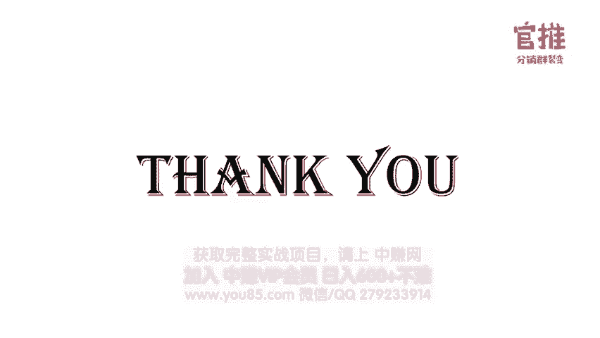

# 微社群裂变营销私域流量池增长秘籍创业运营销售获客视频课教程 合集 8套 374资料 13.1G 分销群裂变模式介绍及9大行业案例解析 - P2：第02节：如何从0开始策划一场分销裂变活动 - 高端网创试错赚钱大师 - BV1Ux4y1b7xM

他其实。

那下面呢我就会以一个实我自己实际操盘的案例给大家说明一场分销裂变活动究竟是怎么一步步从策划到执行的。这个案例呢就是我们去年8月份操盘的刷屏案例。一个全新的品牌几乎是零启动量，就通过分销裂变这种模式。

短短一天之内就吸引了1万多名付费社员。我将会从策划过程到执行过程，把整个操盘的细节全部公开给大家，从而让大家了解到怎么去从0到1去策划一场分销的裂变活动。以下呢就是策划一场分销裂变活动的8个步骤。

首先第一步是分析自身的业务和产品。那为了方便大家理解，我先介绍一下这个案例的背景。当初我们当初做这个场活动啊，是为了推广我们新上线的小程序。全过大家这款小程序。这款小程序呢。

它的核心用户是群主合运营从业人。它主要是解决用户两个需求，一个是自动收集群员的自我介绍整理成级这么一个需求。第二个呢是解决不同的这个微信群用户可以跨群沟通的几个难题啊。

就群主呢就可以用这个工具来自动收集大家自我介绍信息了，不用一一复制这个群里边的这个自我介绍的文字信息的，很很很难受。第二个呢可以通过这个多群合并的工具啊，可以去搭建这个超级人脉群啊，这么一个工具。

这是核心的功能。那么针对这么一个产品，怎么去设计一场活动呢？你要推一个新产品之前，你首先要验证你这个产品。首先是不是符合市场需求的用产品。所以呢我们当初是先要启动第一波启动量。

找到前100名这个群主的用户去验证这个产品是不是真的是大众需要的一款产品。那当初我用的方式是首先是因为它是一个群里面用的工具嘛，所以我们就加了其他的一个群去进行推广。

那发现就是用大家觉得哎这个小程序还是蛮有趣的。第二个呢是通过公众号的推文去介绍这个产品的一个功能，然后再去推广。然后呢，通过新球的方式去推广，再通过运营的群。因为他面对是群主的用户嘛，去推广。

通过这种方式呢吸引到就是大概是1000个左右的群主用户，并且呢通过用户的反馈，发现就是大家在用这款小程序的时候呢，这个效果的确很不错。这也坚定了让我们觉得就是我们可以放大去做了。

就是前期都是打磨产品的功能，把这个产品功能打磨之后呢，发现大家反馈。都很好，有人会说，哎，太感谢，太棒了，简直是拯救用户运营一水火水火之中，本月都可以少掉点人头发了，这都给我们极大的信心哈。😊。

那么怎么样才能快速找到更多的精准用户呢？尤其是群主的用户呢，因为我们的核心目标用户是群主嘛。那在这里的话就给大家介绍获取用户的两种思路，一种呢是主动加粉。这就是我刚才在做启动的时候呢，一直在用的方式。

就是主动去加到呃别人的群里，然后呢联系群主告诉群主群国大事是一款什么样的工具，推荐他去使用，然后呢，怎么怎么样怎么样。但是大家可想而知，就是你主动去加入群，然后再告知群主整个流程效率有多低。

你一个人一天能加多少个群呢？而且你介绍了不一定他会使用，对吧？所以效率是非常低的。那还有第二种方式就是要主动让群主主动找上我。就是这个我相信所有人都喜欢的一种方式，这就让别人主动找上门来。

这样目标客户主上主动找上门来，这就是被动引流的一种方式，被动吸引他过来。所以这时候呢你就要想方法，我策划一种什么样的活动，吸引用户主动找上门来。那当你自己没有什么思路的时候哈，我建议大家可以有两步。

就是从竞争对手那里和用户那里去想思路。就是我究竟策划什么样的活动才能吸引到用户主动找上门来呢？所以我们就进入第二步竞品分析和用户分析。什么叫竞品分析？应该怎么去做竞品分析？我给大家最快速的方案。

就是拆解竞品的这个套路。就比如说你去把它阅读量最高的文章找出来，去研究它的标题和内容是什么。就是这就是用户对什么感兴趣。呃，这个用户的痛点是哪些？这些用的标题和内容就能提高点击率。

因为这个是他阅读量最高的文章，你可以找出前十篇文章出来，这往往也是用户最关注的内容，否则的话，为什么他可以脱颖而出呢，对吧？第二个呢是竞争对手参与人群比较高的活动，就证明了这类型的活动。

用户喜欢用户需要，这往往呢你参考他的去做你的活动的话，效果会就是会也会很好？第三个呢就是去拆解他的投放渠道。这样的话往往呢你可以找到就是你的目标用户会聚集到哪里，呃，哪里的效果好。

这样的话可以节约你大量的一个时间。第四个呢可以找。到这个竞争对手，他的合作伙伴是哪些？这样也方便你去后续去策划活动的时候，如果你也找合作伙伴的话，可以找到这些合作伙伴去合作。

模仿加微创新是你最快速做方案的方式。所以通过拆解竞争对手他的活动，你可以很快找到很多活动的思路来的。那很多人可能是去帮别人操盘了，那有时候并不了解竞争对手嘛，这个时候可以从哪里去了解竞争对手呢？呃。

其实我当初在做辣妈活动的时候，就是辣妈能力圈活动的时候，我当初也是不了解，因为我不是辣妈嘛。我不了解就是辣妈，他通常会关注哪些平台。呃，这时候呢其实你就可以找一些精准的目标用户。

然后去问他就是你会关注哪些平台呀。然后呢呃通过分析好几个之后，你会发现他们其实很多人通常会关注这些平台大同小异，你就找到这些大同小异的平台。

或者说去新榜那里去找就是这个类目呃阅读量比较高的一些呃文章或者说公众号排名比较靠前的内容都可以这些呢都是可以快速找到竞争对手或者竞品的一些一种方式来的。好了，那找到竞争对手这种方案还不行。

这个时候呢你可能还需要配合进呃就是用户分析，才能找到真正用户的需求。因为呢很多用呃竞争对手可能自己也做的不是很好。那个时候呢，你就可以去探参考就是用户的留言。比如说用户他在这个公众号文章下边的留言。

或者说他在百度知道和租户常问的问题，啊，用户的投诉以及用户在群里边交流的内容，以及一些用户他自己的朋友圈，这些地方都可以让你快速去找到用户的需求。越是吐槽越是需求大。

这个时候其实你是可以快速定位到用户的痛点的那接下来你就要去思考，就是我有什么方案可以解决有这个用户的痛点，从而去确确定这个你这个引流品的这个产品方案就可以了。所以就进入了我们第三步。

就打仗活动诱饵的环节。其实适合用于做裂变的产品类型，无非就是这几种嘛。第一种就是线上的课程，虚拟的产品是吧？然后的话就是线要不是线下的沙龙啊，小沙龙，还有呢就是一些付费的社群哈，还有年原创的资料包。

还有比如说爆款的一个单品啊之类等等哈呃，因为我们第二节课呢会专门给大家讲是怎么去打造这个呃吸引人高价值的一个诱儿的产品。我在这里不讲不不类数哈。😊，那在这里的话，我就有两个选择。

就是因为我从前前面啊我去做用户分析和这个呃竞争对手分析的时候，我就发现大家对什么内容关注度比较大呢？就比如说像社群的推广的内容，运营的内容，怎么通过社群赚钱的内容。

以及呃就是有些文章专门去写别人的社群是怎么去赚钱的，怎么去变现的。就是别人的社群是怎么运营的，这个拆解的文章呢，运容量特别高。所以呢就断定出来，就是大家其实对这些内容是非常的感兴趣的。😊。

那第二个呢就是我会发现就是第二个点呢，就是会发现大家是很多人加入社群，他的目的就是找人找群，找合作呃，找人卖资源。其实这里边的话就是涉及到一个点，就是我在定这个产品类型的时候，我拿来做类变的时候。

我有很多种选择的。我可以做线上的课程啊，专门讲这个社群运营的课程不就可以吗，是吧？😡，那我还可以去选择做线下的活动，也可以选择做付费的社群。比如说呃做还有那还可以去选择做就是资料包。

就是做社群运营的资料包给到大家。呃，或者说就是用爆款的一些单品啊，社群的地图啊这样的方式去吸引大家。😊，那这时候我是怎么去选择的那在选择引流产品的时候，是有三个原则的。嗯高价值、低成本和业务相关性。

如果跟你业务一点关关系都没有的话，其实你后面再去做转化效果是很差的。所以这个时候呢我就要想办法了。因为做线下的话，就是那边的速度肯定很呃一般。因为线下最多容量容纳也就你你你几千人顺顶峰了吧，对吧？

所以呢我肯定考虑说线上，因为我本身群国大也是线上的一款产品嘛，那爆款单品就是整个制作流程比较长，不考虑。然后就在这个线上的课程，付费的社群和原创的资料包这三个点去考虑。这为原创资料包，他虽然做可以做。

但是它的价值感呢其实肯定没有付费社群价值感高的。嗯，然后呢第二个的话就是如果在课程和社群之间做对比的话，我就想到就是第一个。做社群的话，大家加入一个社群，因为尤其是我们群勾搭。

它本身是一个社群资源对接的这么一个最最最最合适的一个场景是资源对接嘛。那么本身呢做资源对接效果是特别好的。嗯，用原创资料包呢，它整个价值感肯定是没有这个付费社群和付费课程这个价值感高的。因为怎么说呢？

就是资料包大家都默认这种资料不用花费，不用收钱的嘛，可能免费的方式去做的话，效果还好一点。但是你用付费的方式去做的话，可能效果就没有那么好了。所以这个时候呢我就在这个课程和社群之间做对比。

这时候呢你就要考虑到你这个产品的相关度。所以我当初就想，其实在资源对接这个点呢，其实是是群购大家比较核心的一个点。因为群购大本身是一个做群友自我介绍的一款工具嘛。

那做自上介绍的过程当中不就是在做资源对接嘛，是吧？所以你当初就选定了用社群，还有一点就是大家在购买的时候啊，你想想你买课的时候，你会考虑什么问题。你可能会考虑哎我我有没有时间听课呀。

这个老师讲的好不好呀等等等一大堆问题嘛，对不对？😊，那做社群，他其实加入一个社群，他就没有那么大的压力。就是加入社群。他想着哎我进入一个社群，那我只要认识一个人，认识群主。然后呢，我获取一些资源。

我其实整个收获就很大了嘛，他就没有那么大的压力啊，就相对于与课程来说，做社群其实压力不大。而且最重要的是当初我在策划这场活动的时候，我考虑到就是用社群这种方式的话，就跟群购大就是契合度是最高的。

所以当初呢我就考虑到。我我做这场活动，我的目标主题我就定位为做资源对接群。所以大家可以看到我整个思路哈，这个思路就是我先考虑我的目标用户是谁，是群主精准的群主。那我就考虑就是群主他本身需要什么？

它痛点是什么？然后我通过竞争对手的这个调查和那个竞品的分析以及这个用户的调研之后呢，发现大家对社群推广运营变现资源对接，其他社群的案例拆解，这些呢非常的感兴趣。

所以呢我就确定了这个活动的主题是用完转社群利6资源对接群这个主题去打。所以这里呢有一个点非常重要的，就是一定考虑策划引流活动的时候，一定要考虑从用户需求的角度出发。😊。

很多人在做活动的时候就考虑哎我有什么产品，我就用什么产品去做推广。但是往往很多时候呢，你这个产品可能还需要教育用户才可以购买，才可能去购买。像我们群国大家这款产品。

就是我可能还需要告诉用户群勾搭是一款什么样的产品，它有什么样的功能，用户才可能去使用，对吧？它不是一看到像苹果iphone，不用解释，大家知道这是一款手机呃，然后功能怎么怎么的好。大家都知道了。

不需要你教育人一看就懂这种的话就是比较容易裂变和推广。但是当你的产品还需要教育用户的时候，一定要记得你要去用一个用户比较熟悉的产品代入这个效果还会比较好，所以我用完这社群66的资源对接群。

这么一个引流品，就要比我直接去用群勾搭这么一个产品去推广的话，效果要更好。好，那确定活动主题之后呢，我们就去罗列我们可用的资源。比如说呃我们可站台的大V呃，还有呢互推的大V呃，可以合作的大V呃。

没有的话就可以去在竞争对手那里去寻找。还有呢就是你去整理你自己已有的散乱的内容。比如说你呃自己有没有收集一些资料啊，自己之前有没有去讲过课啊或者什么之类的，还有呢有什么身边有什么资源啊。

这些东西呢可以罗列出来。然后呢，到时候呢可以组合包装成一个成体系的内容。还有呢去梳理自己的推广渠道。比如说你的个人微信，你的社群，你的公众号。

还有你的合作伙伴以及身边有推广资源的朋友都是哪些把这些推广渠道罗列出来。然后呢再去想哎我做为了做这些活动，我可以找到一些什么赠品。然后呢呃有多少预算呃去推广啊，就把你资源全部罗列出来。那当初呢。😊。

我就去找了，我就是因为也从事这个行业那么久了哈，也认识一些大V。所以当初呢就找的呃像penencer，还有那个呃曾妙，以及就是西轮阿喵等等等等。这些大V朋友来帮我去做站台，就是他们其实不需要奉献什么。

就是要投像出现在介绍页和海报上去帮我站台，这个就是最好的了。然后呢，第二个呢就是因为我自己在做社群运营已经很久了嘛，所以我自己其实也拆解过很多的这个社群的案例。然后呢。

也准备了很多这个相关的一些就是社群运营相关的一个资料，已经收集了很多了。那再有之前呢就是我们自己在做活动的时候呢，有累积到就是大概是1800多个群组的一个资源，这些资源，其实当初呢是把这些资源呢？

整理成一个超级群，就是用群国大超级群的方式合并成一个超级群叫人脉星球。这是我们当初就是已有的资源。😊，那。那到正常的情就是要去包装嘛，所以呢我就把那个呃就是首先找个大卫来帮我站台。第二个呢是内容当中呢。

我其实就相当于我有很多的资料，社群运营相关的资料，也是群主比较关心的内容。那很多人其实在准备这个资料包的时候，用的方式就是用百度网盘一放，然后呢，用户过来一下载就可以了。但是这个时候你用网盘的时候呢。

就会出现很多的问题嘛。呃，比如说用户只是把网盘的资料收藏了，根本就没有去看，没有感受到你这个高价值。所以当初我们就建立了一个知识星球呃，就是建立一个知识星球，把这个资料一篇一篇的内容。

在知识星球很清晰的表达出来。大家一进去就能清晰的看到。而且呢他可以搜索呃，可以去评论等等等等等这些内容，就让他马上感受到高价值嘛。😊，然后推广渠道这边的话，我就平时呃在参加分销活动的时候。

我会留意都是别人去都是谁在推广这个活动。然后呢，他会广数量是多少？如果就是推广的呃单数比较高的话，我会主动去勾搭这个人，就是积累这些资源。那当初我们当初做这场活动的时候，其实就只用了4个这个战队的队长。

然后呢，让他们去帮我招分销员这种方式去推广的，没有动用太多的推广资源，因为活动效果的确是超乎我们的预期，所以当初就没有再去铺渠道了。你知道吗？而且那会呢我为了塑造这个产品引流产品的高价值。

我还去找了创客贴幕布这些朋友，然后呢让他告诉他，问他是不是可以给我们呃一些会员的产品做互推这样的方式。所以当初他们也是非常给力。然后呢给我们答应给我们的这个这个社群的人员赠送一个月的会员这样的一个方式。

嗯，通过这样的这个互推组合资源整合的方式，把这个产品的高价值给塑造起来。😊，所以当初我们做完这个产品的主题之后啊，我们产品一推出去之后呢，就的确效果真的很好。的当初呢也有很多人写了复盘的文章。

你看这是当初别人写的复盘的文章，当初呢有一个叫闲人洞洞的作者好他是这么写的。就是说哎我们当初在海报的主题上平弃了那些明显的买卖关系，反而是用一种大家都能接受的千万社群资源对接这几个字。

相比麦克来说更容易打消用户的防御心理，用户呢也比较容易接受，一是呢关系就变成了这样，你想要大脑资源吗？做那边也好，做什么也好，我有1800多人的资源可以给你对接，不过呢你得付出辛苦费，我维护群也不容易。

你看可以吗？价格也不贵，19。9块，我也不多要你的，我还送你幕布一个月的会员，创客街的一个会员，还有知星球7天的免费试用等等，这些加起来要400多呢，怎么样很划算吧。😊，其实也是如此。

就是说当初我们整个这个转化率也是特别高。因为呃的确就是十9。9块的价格不贵。而且呢我们整个产品打包成这个价值也是非常的高哈。😊，好，产品的一个这个这方案确定之后呢，我们接下来就是要去想哎。

我们怎么去做这个类变的。路径了就是整个类变的机制，我们要选择哪一些。然后呢，那边路径也要选择哪一些？那在微信群用户裂变当中呢，其实有三大玩法的群裂变群邀请裂变，还有这个分销群裂变。

那这个群裂变呢其实是一种就是关注用户分享行为那种方式，他的方式就是呃你把我的这个产品海报分享到朋友圈或者微信群里边截图发到群里，然后机器人审核通过就可以获得奖励。这种情况的话，一般用户进入的门槛很低。

用户的精准度就一般，就质量就会一般。而且呢他这个活马很容易被封。😊，第二种方式呢就是群邀请那边。因为前面呢就是用户只是分享了朋友圈，但是没有确定说他是不是真的可以帮我带来用户是吧？

所以呢就产生了一个非常关注用户分享结果的方式。就群邀请那边。这个呢其实还是免费的这个方式，就是邀请你进群之后，你要拉多少人进去群内，你才可以通过审核获得奖励。这个时候呢用户的进入门槛也很低。

但是乱拉一番，你也就是没有办法嘛，是不他拉人进群的时候，别人进群，有的时候并不是你的精准客户，所以导致说这种方式他的来了群用户的这个精准路也一般，质量也很一般。还有一种方式呢是选择了分销群那变的方式。

分销群那边方式刚才我已经跟大家说过了哈，就是选择让用户分享给好友好友付费购买之后才可以获得佣金的返现。这种方式的话，第一个就是进来每一个用户都需要付费。所以呢他没有需求，他不会购买的。

所以这这部分的人群其实相对于精准。😊，多质量也是最高的。所以说当初我们去选择了最后一个方式。就个分销群裂变。而且最重要的是当初我们刚好是给喜马拉雅这个423听说直接刚好做了这个分销裂变的方式。

而且呢致星球当初这个如何打造百万付费社群的这个主题海报也是用了我们这个分销裂变工具去用的。当时我们就想哎前面都是知名的品牌和大咖的讲师。那可不可以就是一个全新的品牌，也可以用这种分销裂变的方式来使用。

😊，所以当初呢我就因为刚好我们是开发了这这套工具嘛，开发这个分销群那边的工具嘛，也就是用我们之前说过的这个分销那变的这个路径来做的。这个工具。所以当初我们就策划了这么一个活动。

就是采用了这套分销路径来做，就让用户购买之后呢，添加个人微信，然后再拉进微信群里面，在个人微信和微信群里面都引导用户去做，就是转发分享，获得佣金嘛。然后呢佣金可以即时到账，提醒用户。

而且呢当初我们设的分销比例是50%。所以还整个影响力。整个这个诱惑力还是蛮大的。所以当初很多很多人帮我们去转发和推广。而且我们当初根本就没有预料到是活动这么火爆，刚开始是采用就是让用户加微信。

再拉进微信群的方式，后面我发现根本就没有备用好那么多的个人号，所以就赶紧切换成这个活马进群的方式，用户购买之后先进群，然后呢，到后面再去拉分舵的时候，再让客户去加个人微信去去去去加到个人微信里边去。😊。

我们当初用的工具就是我们自己开发这个官推分销群裂变工具。这套工具大家也是可以用的，自己可以注册去使用的哈。😊，大家可以看一下我们当初整一个列边的路径。首先第一步呢先扫码，看到海报，看到海报之后呢。

扫码进入详情页，在详情落地页之后引导用户去进行购买。购买的时候呢呃有一部分用户其实是会默认关注公众号的。购买之后呢，马上就弹出注入群的活码。然后呢，他一扫码就马上就进入这个微信群里。然后呢。

在群里面及时去发发送我们赠送这个福利包，并引导用户去进行自我介绍。呃，用群公单来做自我介绍，并且引导用户去就是通过分销去获取红包的奖励金。同时呢，因为当初在购买的时候，不是默认关注公众号吗？

公众号也会自动推出他的自己分销海报，引导他去进行分享。嗯，如果他邀请朋友购买之后呢，这个公众号还会自动弹出消息通知他，并且这个分销的提成会即时到账到微信钱包里边。就是就算他不关注公众号。

微信钱包也会提醒他就是有佣金到账了。就通过这样的流程呢，就刺及了很多很多的人帮忙去推广和呃就是当天晚上就是整个运营圈可以说都是刷屏了。

整个活动的这个这个整个活动的曝光量应该是在呃几十万和100万左右的一个曝光的一个级别的。因为后面还有好多朋友说已经活动结束了，还看到海报在刷屏。好，整个路径。就是整个裂变路径，我们规划好之后呢。

我们就要去打造我们的宣传素材了。呃，整个宣传素材里面会有活动的头图，落地页活动的海报，以及就是活动购买之后的那个呃这个入群的二维码。这些在这里呢我重点跟大家说一下这个海报。就海报的时候。

其实这是就是用户分享之后，别人。第一次接触到信息，就是你的海报和你的这个分朋友圈分享文案。所以海报是非常非常重要的。所以在这里边的话有几个地方大家要注意哈，就是海报一定要大没有点开的时候。

这个主题呀也能看得到。所以你自己要做测试哈，自己要做测试。呃，你自己把的海报做完之后呢，发到朋友圈里面看一下，没有点开的时候是不是能看得到。第二个的话就文案一定是用户需求点，不是产品的介绍。第三个的话。

最重要的是不要大而全的主题，大全的主题，别人很难看得到的。后面我会讲到哈。😊，然后第二个版上就是清晰的告诉大家，就是整个海报。我购买的时候，我可以得到什么内容，就是要明确给用户的一个好处。

不要堆砌你的产品信息和卖点，然后尽可能的让用户对号入座，就是给他使用场景，用数字来表示哈。然后呢就是信用信任的背书了。因为我们是一个全新的品牌，那全新的品牌，别人对你一无所知的情况下。

那我只能去借助一些大平台的logo或者合作取到logo以及一些大V站台的方式呢来让大家快速去幸福，就是取得大家的信赖感去幸福你这个活动是真的，然后真的有这么好。

所以当初你非常感谢就是真妙penence剑锋呃，艺人阿喵这些朋友来给我站台哈，非常非常的感谢。😊，然后呢，有一个部分就是促进购买的环节了，就是基本上就是通过限时限量啊价格锚点还有短期利益的方式呢。

让用户快速去下决定啊，就就是让大家看到这个海报马上就要想扫，这个是非常关键的。好，现在素材都打造好了之后呢，接下来我们就要要去寻找我们的就是启动量了，也是找谁帮我们推广，在哪里推广是吧？

所以呢我们用的是分销类变这种方式哈，所以你要去找你的分销团队了，就是别人帮谁谁帮你去做这个分销啊，那往往就是分销队伍来源实实主要是这几个部分，就比如说你内部的员工呃，比如说一些圈子内的一个KL了。

以及你的忠实的粉丝，以及你的客户。还有呢就是业内同行的朋友以及一些有一些职业的，就是这个分销者以及一些宝妈大学生微商这些想赚钱的人，基本上来源于这些人。😊，当初就是找了4位，就是找了4个队长。

这四个朋友呢，他每一个人去组建了一个分销PK的团队，然后呢，他们再去招募人别人。因为其实是这样子的，你有的时候啊启动量比不是说呃我我没有启动量啊，很难去做这个分销推广的。其实不是的，这个分销队伍啊。

其实你只要找到这个有影响力的人，然后让他去帮你建立团队就可以了。像我们这次实操营活动哈，我们第一期实操营活动的时候，你想想嘛，参与分销人有2000多人说要报名分销，我一个人怎么可能搞得定了，是吧？

我一个人自己推广也就200多单嘛，如果全部都靠我们自己一个人去推广的话，我对顶多我就可能推广几百单就可以了。我可能没办法去裂变出2000多单出来。所以呢。😊，你自己一定要注意哈。

就是要借助就是身边有资源朋友的一个力量。当初呢我们这次活动呢，我们找了4位的伙伴。这个四位伙伴呢，我我当初呢是从别人的分销活动找到的。然后呢，去跟他说这个活动的情况，然后呢，他也答应去帮我们做推广嘛。

所以这四位伙伴，然后每个人呢大概招了呃50个人左右，就平均下来哈，大家每个人招了就是四五十人左右。呃我记得当初整个分销团队就是150人左右哈，就是就是150人，然后呢统一在晚上8点就统一发圈。

一发圈就是整个朋友圈就是先出现一篇刷屏。然后呢只要转化率上去的话，整个效果就会起来爆发起来了，就是因为已经在你活动托管之前已经找到别人帮你发朋友圈了，知道吧？所以这点也是非常重要的。

包括就是大家也不用担心启动量问题啊，包括我们前面我们讲到的这个案例，就是这个南小。😊，呃，鸡火锅店的这个案例哈，他们当初起动量也很少啊，他们当初就是那个服务员，就三四个服务员，三四4个服务员这老板。😊。

老板自己亲朋好友，就那些人，然后呢再拉一些朋当地的亲朋好友合起来几十个人，然后这几十个人去帮忙转发，然后呢一下子就爆发出去了，也也成交了几百单到店嘛。所以只要你活动效果好，你的启动量不用特多。

我们这次的启动量，我们就是100多人，这100多人就裂变了1万多人，知道吧？当初我们都吓呆了，我们在半夜三点多钟还保持几十分钟就是十几分钟一个群，十几分钟一个群，我们当处都通宵了，熬都熬不住。

没准备好这么多运营人力，我觉得他们都不睡觉的嘛？怎么半夜三更还在进群。这是这么一个情况啊，就是你整个活动海报和活动落地页这个转化率做上去的话，主要你找就是启动量不用特别多。

也可以快速的裂变开去的那当初我们其实因为对活动效果没有预估好。所以做了那么多，就是一天之内招了一万多人之后，我们紧急赶紧。😊，并把这个这个这个来源进行控制。因为我们当初实在运营能力跟不上。

所以当初就没有用到其他的推广渠道了。那么在这里面呢，就是做完这个启动量推广之后呢，一定要记得哈，就是你为了让效果更好，你其实要去进行调优的。就说你在活动上线之前，你要进行测试和调优，要达到最优的效果。

这样的话这个转化率才会上去，活动才会爆发。就很多人其实就凭自己的经验去做事情，就凭自己经验去把这个活动海报做出来了。做出来之后呢，呃找了分销团队，然后就去推广了，没有做测试，也没有去做好转化率的测试。

根本根本就没去做这些。那那就导致你整个活动效果不好嘛。你可能就是当你自己去做的时候，你可能感觉很好。但是用户不买单啊，不买你的单啊，所以这个时候啊做测试和做调优，是为了保证你上上线推广的时候。

活动转化率有一定的保障的。这样的话也会帮就是也会把把那些帮你去做分销那批人取得信赖感。就是你每次做活动，你又做了这些测试，导致别人会觉得哎这个这个这个公司做活动可以啊统话转化率都很高。

所以都每次都会乐意帮你去推广。所以上上线去做调试调优非常重要的。😊，像我们这次活动，我们一开始也不是最后定了这个千万级社群资源限时入取的这么一个标题的。你看我们之前一开始想啊。

群勾搭和你一起玩转社群666，以1700多个群组共同成长。你看一看，如果真的是这样的主题，你会去去去去去转发吗？😊，你会去裂变吗？所以我们当出这个海报做出来之后，我们去做一些调研，哎，大家都不感冒。

赶紧改，赶紧改。然后好后面就改成以1800多个群主一起搞事情。😊，然后发现其实还不行，大家觉得还是不感冒不感冒的话，就是在这里的话，到时候你要去做调研了，你就去用户调研了，问他哎，这个效果好不好。

你会不会买单，然后发现就是我们马上又改改改到最后那个版本的，就是这个版本我一发出去。哎，别人都觉得很好很好，我会买单我买单。这个时候呢，我我我们就才会把这个海报出去，呃，就是往外推广。😊。

整个活动部署的这个工具都用用的就是官推分销群里边这个工具，就是网址哈3W官推66点com呃，这次我们整个实操应用的工具呃，这个工具也是给大家提供的。就是大家可以直接去注册。

然后就可以上架活动去使用所以这个工具就结合了我们刚才的那个路径来做的。它可以实现就是用户购买之后引导入群或者加个人微信。然后让你的付费用户留存到你的个人微信和群里，可以自动生成专属的分销海报。

可以最高设置分销比例99%，还有你的分销佣金可以即时到账，到钱包里边实时提醒用户收益到账。啊，甚至呢一些高级的功能，就是比如说有些专业版呢可以支持二级分销这些的东西。反正这个东西的话，到时可以去体验。

啊，然后呢可以先熟悉熟悉工具的应用。后面呢我们正式在做活动的时候呢，就可以去部署啊，提前可以先。😊，演练一下。然后前面的活动做完了之后呢，就到了运营变现的环节啊。

就比如说这是我们当初做运营的时候用的一些动作啊，比如说建立的分舵。然后呢，邀请大咖来分享，然后进行社群的干货，组织用户去面积呃，线下来面积。这些呢都是后面的运营的方案，就是维系用户的一些就是感情嘛。

让用户进来之后呢呃持续还是可以得到这个服务，对你整个品牌的呃感觉会更好。那详细呢这次活动的很多详细的内容和方案呢。其实我当初是整理了一个干货的大全，大家呢可以在玩转社群66公众号后台回复关键词。

分销裂变来获取。那相信通过刚才的分享呢，大家已经了解了策划一场分销群那边活动的需要的八大步骤。首先第一步呢要分析你的业务和产品，确定出来你的精准目标用户是谁。然后呢去进行竞品的分析，以及用户需求的分析。

找出用户的痛点需求。然后呢打造出呃符合就是用户需求，以及以竞争对手有点差异化的一个活动的产品。呃，而且这个产品呢需要去高价值的呃低成本和以你的业务相关性比较高的这么一个活动的产品。

然后呢去确确定整个那变的路径和机制。呃，就把你的分销方案给设计出来。然后呢接下来就把你的宣传素材进行打造。然后呢就把你的这个呃就是去寻找你的启动量，然后招募这个分销的渠道，然后就去去测试和调优。

然后就是正式上线推广和后期的运营变现。这是。呃完整的一个八大的一个步骤。我们所有的课程都支持随时回看，大家可以在玩转社群66公众号菜单栏听课入口处进入观看。如果你学习完课程后，觉得课程内容对你有帮助。

也希望你可以把优质的内容分享给你的朋友，也许能够帮到他。点击玩转社群666公众号菜单栏生成专属分销海报，即可生成你的专属海报。有好友购买之后，你还可以拿到50%的奖励金哦。

