# 微社群裂变营销私域流量池增长秘籍创业运营销售获客视频课教程 合集 8套 374资料 13.1G 分销群裂变模式介绍及9大行业案例解析 - P3：第03节：如何设计一个高价值、引爆裂变的活动诱饵 - 高端网创试错赚钱大师 - BV1Ux4y1b7xM

大家好，欢迎来到分销类变实操体系课第三节课的现场，我是阿妹，我们又见面了。那在之前的课程里呢，我们一起探讨了分销裂变的三大要点。为什么同样都是用的分销？别人的活动分享率是5%，而我们可以高达60%。

这正是因为我们改进了整个分销的路径玩法，在用户路径上，别人是让用户付款后直接去听课或进行二次的购物。而我们呢是让用户付款后，先进微信群，从而一方面构建起自己的企业私域流量池。

方便对用户进行后续的培养和二次转化，而且呢还能通过社群、个人微信等多渠道提醒用户可以参与分销来获得奖励金，从而刺激用户产生分享和推荐行为，带来新用户实现老带薪。此外，还通过改进分销机制。

例如设置分销佣金即时到账，微信钱包，实时提醒用户收益到账，激励用户多次分享海报，结合分销PK排行榜，方便我们。举行分销PK比赛等等，刺激KO1的用户更加卖力的助推活动，从而引爆活动效果。

然后我列举了一些其他行业应用分销裂变这种模式的案例，让大家有个初始的思路。最后我给大家完整复盘了我们去年操盘玩赚社群666，在一天之内获得1万多付费用户的案例过程。

让大家先了解做一场分销裂变活动的八大步骤。我相信在刚开始的时候，也有些同学还会觉得分销啊就是传销就是拉人头骗人嘛。那通过之前的分享，相信大家应该对分销裂变这种模式，已经有了进一步的了解了。

分销裂变的本质，实际上就是把之前花到媒体上花在传单上的广告费付给你的用户，这是一种关注用户分享效果的奖励模式。

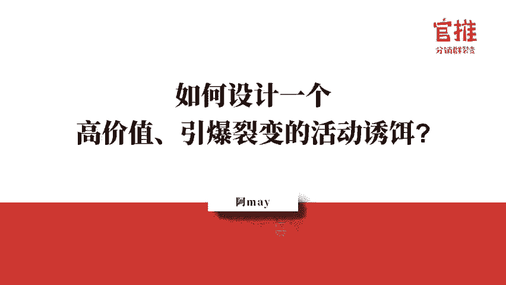

那在举行分销裂变活动当中，设计活动诱饵是最关键的第一步。你想要用户付费，就需要设计一个极具诱惑力的活动诱饵，给他一个很好的理由，这样才能上他动心，从而进一步的下单购买。

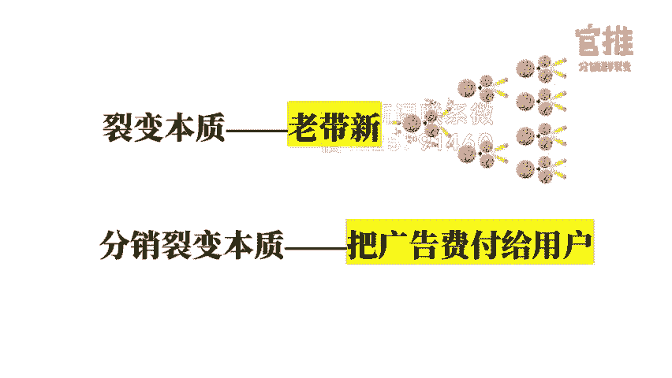

那这节课的内容我就从以下四个部分给大家详细解析我们如何设计一个高价值引爆裂变活动的活动诱饵。第一部分先跟大家讲一讲。

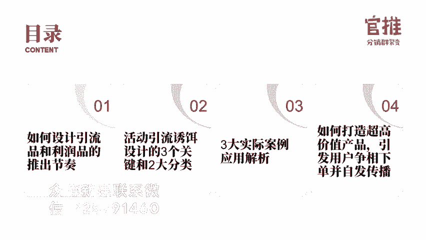

通常情况下，专业的操盘手，他是如何设计引流品和利润品的推出节奏的？我们都知道，做营销肯定是需要设计引流品和利润品的。其实，好的商业模式除了引流品和利润品之外，还会增加一款产品或者一种商业模式。

这个呢就是可以跟用户长期绑定关系的产品。首先先去设计一款高价值、高诱饵力的引流品，然后呢用低价去销售。这个产品其实是不赚钱的，目的就是要把用户吸引过来。例如，昨天晚上我们分享到的关建明老师的39。

9块的朋友圈赚钱课，他的分销佣金可以高达99%，抱着就是不打算赚钱的引流品。那通过这样的机制设置，他在短短三天之内就招募了2000多人进群。

然后你就可以针对这些引流过来的购买用户设计一个让人家无法抗拒的。个客单价稍高一点的产品，什么实现进一步的成交。比如说还是关建明老师的案例，他的799块钱的呃训练营。

他针对引流来的这个4000多人就给出了每一个人只要在群内购买。在限定的时间内购买，就可以得到减免1100块钱的优惠，同时还会赠送你一大堆赠品。从而呢就赢吸引了大概有400多人购买了他的高价训练营。

那这个整个发售的一个过程，分销网子将会在第10天的课程里边对这次社群发售和成交的过程。进行深度的复盘和拆解。让大家了解社群批量成交的细节操作，到时候大家可以留意。那么很多人呢可能涉计到这一步就算了。

其实你还可以设计多一步，就是针对已购买啊稍高的客单价产品的这部分用户，再设计一个让他无法抗拒的会员产品或者服务。比如说以前逻辑思维的铁杆会员，他就是设计了一个绑定的会员，每个月都给你寄一本书。

每个月都跟你发生一次一次关系。这样的话就会促进你跟这个用户长期打交道。很多美容院都是这么去设计的。此外呢，你还可以通过机制的设置来筛选出从老客户当中筛选出你的销售员。我们还是回到关建明老师的例子。

他在他的训练营开课的时候就会宣布你参加他的这个训练营，如果你获得了优秀学员，就可以获得内推的资格。什么叫做内推的资格？其实就是可以获得他训练营的分销权。而你要获得优秀学员。

就需要在训练营当中不断的输出做分享。那你在做输出和分享的过程当中，就会极大的提高其他学员参加训练营的学习体验。提高训练营的满意度。通过这种设计的方式，他就聚集了一大批对他非常认可的铁杆粉丝。

这些铁杆粉丝呢就会成为他的助教，他的销售员。所以现在包含他在内他自己的团队只有三个人，他可以做到几十个人团队才可以创造出来的业绩。

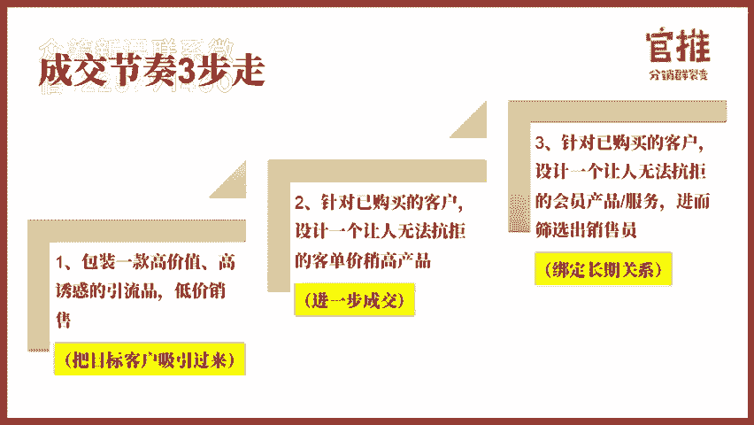

所以说你自己要做活动，首先就要搞清楚这三点。第一点就是你的活动目的是什么。你究竟是要涨粉引流，还是想直接卖货，追求你的利润，两种活动的打法是不一样的。第二个就是要明确你的活动人群。

就是你的目标人群是哪些人，一定要垂直精准，不能谁都想要，你的活动内容本身就划分了目标用户，而且你的用户标签越细分，行业越垂直，用户的聚集性就会越高，就越容易在这个群体里中引爆。

比如说宝妈这个群体就很广泛。如果说你可以在做细分一点，比如说你细分到3岁的宝妈妈妈，或者上海的宝妈妈妈，这样可能他的引爆性就会更强。第三点，你要确定出来你自己究竟要卖给这些人群什么。

也就是你设计的活动诱饵究竟是什么？一个好的活动，诱饵设计是裂变和引流活动成败的关键。不管你是做裂变引流还是做被动引流，都是非常重要的。另外呢，你这个活动诱儿本身的选择也会直接影响到你后续的成交转化率。

一个好的活动，你卖出的这个产品带来的都是精准的强需求的用户，转化率是非常高的。如果你本身这个引流活动的产品选择的不对。那就算你带来了粉丝，也很难成交和转化。

那么怎么去根据自己的产品和服务设计可以让用户疯狂裂变的引流活动产品呢？接下来我将会从活动引流。

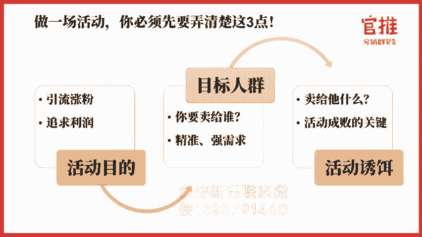

呃，右饵的设计的三大关键和两大分类跟大家详细说明。

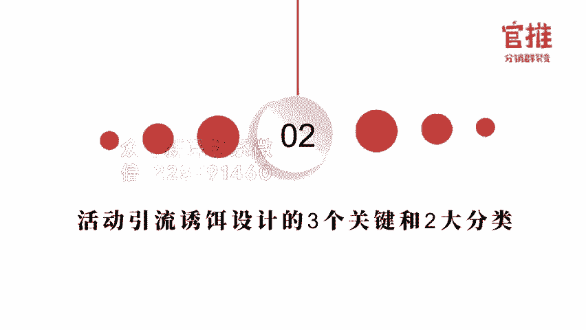

首先，在活动引流品的选择上，其实是有三大关键的要素的。第一个是业务相关性。什么是业务相关性？例如说你现在的宝妈群体是非常高价值、高消费的群体，很多人都在做宝妈粉丝的引流。比如说用玩具，用绘本。

用课程来做引流的产品。那比如说你做的产品和引流的诱饵是相关性比较弱的话，后期转化就会很困难。再比如说你是卖运动器材的。那如果你设计的诱饵是什么呢？你的活动引流品啊，你本来是卖运动器材的。

你的引流品是水果，那靠水果吸引来的粉丝和你的运动健身器材基本上就搭不上边。这样的话转化后续产品的一呃客户的机会就会很渺茫了。那如果说把这个引流品改成一个呃什么建运动的。

改成一个健身运动的什么VIP课程之类的，是不是会更好呢？再比如说你一个卖减肥产品的，你如果拿早教知识来引流，那就是不合适的。你就完全可以用什么21天瘦10斤这类的一个课程来找减肥的用户。

后续的转化就会很可观。那第二点呢就是高价值了。那什么叫高价值？高价值这四个用，有用使用通用必须用。那在这里边的话，很多餐饮行业常用的那个饮流品就有这种，比如说半价用餐啊，1元特特色菜等等。

这些呢就是高价值的产品。让用户一看就感知到它的价值很实用。那第三点呢就是低成本，低成本应该就很好理解了。你做出来的引流品，它的编际成本越来越越低，肯定是越好的，这样你才可以给出更高的分销比例。

给到推广员去帮你分享。但是就算是低成本也要高价值。那在这方面的话，就是付费产品就有天然的优势。第一个，只要你的课程打造出来，编辑成本几乎就为零了。你卖出越多，你赚的就越多。第二个。

它的价值是无法衡量的那一个思路，一个知识，你能判别出来这个知识和思路究竟值多少钱吗？其实是判别不出来的，所以他就很容易塑造高价值。这就是为什么某们非常喜欢用知识产品做诱饵做引流品的原因。

那么在引流产品的选择上呢，主要是有分为分为两大类，一类呢是实物产品，一类呢是虚拟产品。那在实物产品的选择上，其实要专行以下三个原呃四个原则的。首先是相关性。这个呢刚才我们已经非常强调了。

你一定要选择跟你自身产品，你要卖的真正的那款产品。呃，相关性非常强的产品。我举个例子，比如说你是做美妆类的那你就最好选择跟美妆相关的产品。呃，比如说呃送那个网红的呃，比如说那个网红的化妆套呃。

刷套装这种呢就可以作为你的引流产品。呃，再比如说书籍也是非常好的引流产品。因为书籍它本身就是大咖所写的。你只是把它卖呃就是把帮他卖出去而已。而且书籍呢其实有。

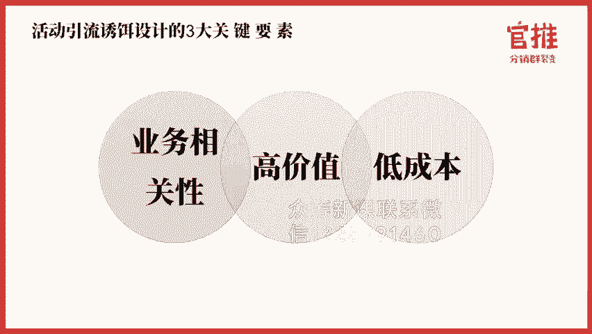

其实书籍本身是有分销平台的，所以你还可以拿到低价格。那如果你自己本身有产品呢，你的引流产品就可以做就是可以拿你的产品体验装试用装来做引流产品。昨天晚上给大家讲了一个案例，就是呃他是呃做这个护肤品的。

他就拿了一个他的洗面奶来做引流产品，他就说了引流产品我是免费送的，你需要付油邮费。所以呢他让用户先支付1块钱，用用户支付1块钱加客服领8。9块的优惠券，然后呢去支付8。9块的邮费，然后可以领到这款产品。

这就是当初他设计这个路径。第二点呢是实用性啊，什么叫实用性？刚才我们也说了，比如说半价的餐券哈，就是呃我们有个昨天有个客户做的就是那个火锅店哈，火锅店就是一个呃很实用性的产品。

还有比如说牛奶这种就是非常有实用性的，一看就知道，我用得上。第三呢就是通用性，就是什么叫通用性呢？就比如说你的产品其实不就人群是非常广泛的，不是小众的人群，那你就可以选择通用性的产品。

在日常生活中经常用到的产品，那你的用户覆卖覆覆盖面呢也会更广一些。第四个呢就是必需品。必须的品产品呢就是选择你这些目标用户必须要用的产品。比如说明年内的是男性用户，那你可以选择剃须刀，对吧？

那在虚拟产品的选择上呢，通常会有以下几种选择。第一种呢就是培训类的这就是很多啊就是很多支持付费类的产品都是培训类的产品。那其实所有的产品，如果你不是自己非常熟悉这个行业的话，其实都是需要学习的。

就管你天天吃饭，你知道怎么吃才能营养均衡吗？你知道什么才是好的饮食习惯吗？还有吃饭的礼仪，餐桌上的礼仪敬酒的礼仪，你都了解吗？你不知道，所以你要学习的。第二个，比如说你卖衣服。

你卖衣服虽然每个人都都会去买衣服对吧？对吧？但是你知不知道怎么去做服装搭配呀，你知不知道怎么做色彩的搭配呀，你知道不同体型的人该穿什么样的衣服吗？是不是都不太了解在生活当中。在生活当中，就是说工作当中。

任何一个行业其实都是有学问的。只要你不是这个行业的专家，你都需需要学习。所以任何行业在前端你基本上都可以设计对应的引流的培训课程，然后去卖课。

特别是那个销售金融类的、保健品类的美容、化妆类的、科技产品类的等等这类产品更需要去培训你的客户。因为很多这种产品都需要去教育用户之后，他才会有对应的需求产生。所以选择培训类的课程。

其实对你来说是非常好的。第二类呢就是资讯类。什么是资讯类哈。其实资资讯类的产品是有很多种类别的。比如说资料干货包呃，干货资料包。那比如说我们之前设计完众社情就第一波启动活动的时候。

我卖的就是呃呃可以说是一个干货的资料包。还有呢就是你整个线下的峰会，比如说线下的一个呃沙龙读书会，这种都是属于资讯类的一个产品。呃，这个呢其实相当于说你其实也不需要花费什么成本的。我举个例子。

比如说你是婚纱的摄影店。那么你是不是可以举行线下的沙龙去做哎，这个沙龙的名称叫做什么？如何花最少的钱去拍摄最完美的婚纱照，对吧？那这个沙龙去推广的话，是不是可以让用户去帮你转发分享？那对这个。

那对这个主题有兴趣的用户，是不是就是你的目标用户，你可以在课程里面教新人怎么去识别黑心婚纱店的猫腻婚纱店怎么拍好看的一些技巧和角度。呃，怎么样的一个拍摄方案不会累等等。

这些都是可以去在呃这个线下分享当中去设计到的那当然你在设计的时候，你千万不要以你是婚纱摄影店的这么一个角度去去去宣传。你肯定是说我是一个婚纱摄影的一个工作者专家在这么一个角度去宣传，然后安排的场地。

也不要安排在你的店里，要不的话就很容易让用户觉得你在就是就是要给我推销你的产品吗？你要可以安排在另外一个店，比如说咖啡店或者说那些重创空间去这样的话就可以呃导致用户心这个心理看拒压力就不会那么大。

因为不管从事什么。不管你是从事什么样的行业，不管你是销售什么样的产品，你的目标客户如果要决定购买这种类型产品的话，都是需要了解对应的知识和呃信息的。他需要了解的，就是你可以提供给他有价值的资讯。

如果你能够提供给他他需要了高价值的资讯。你就可以很容易抓住他就可以很容易的引导他主动去找你购买的。那第三种呢就是会员型的产品。那会员型的产品，比如说付费的社群啊，聚金社创业者社群就是一个付费的社群。

还有第二呢是你自己的1个VIP的会员，你的服务的VIP的会员。那比如说你是形象设计师。那你可以针对你形象设计，这个服务做一个会员的服务啊，比如说我可以做什么呢？啊，这个会员服务可以专享什么？每个月1次。

每个月一次形象设计啊或者是之类的哈，你就可以设计这样的服务。最后呢是那个服务型的服务型的那什么叫服务型的呢？就是比如说有很多那种呃就是诊断类的呃。产品就可以去设计诊断类的产品。呃，比如说保险哈。

保险是不是跟就可以设计。就比如说你是保险的那种呃第三方咨询机构，或者说保险的经纪人，那就可以设计一对一咨询的服务啊，还有很多呢就是比如说诊断的服务啊，怎么看很很多这种类型的。

还有呢就是设计的服务也是属于就是服务型的产品。下面呢我会结合实际的案例，跟大家想去去解释一下，就怎么去结合自己的行业去设计对应的产品。

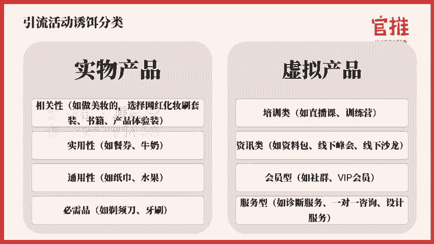

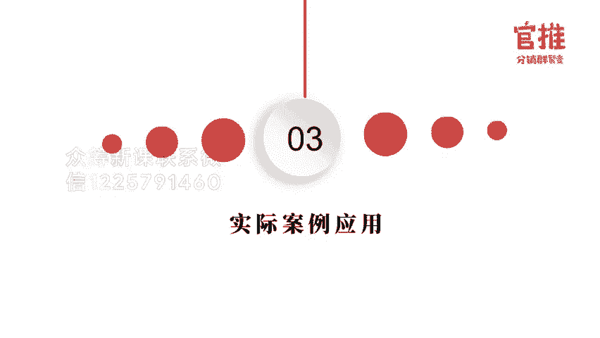

首先哈这个案例其实是呃我们这次的学员提出来的，他是一家线下的呃那个实体的母婴店，主要销售的产品是什么呢？营养品、童装、奶粉、纸尿裤。那我想问问大家，如果是你你会怎么去设计活动的引流品呢？

大家可以在评论区里边回复，可以参考一下我刚才列举的思路。

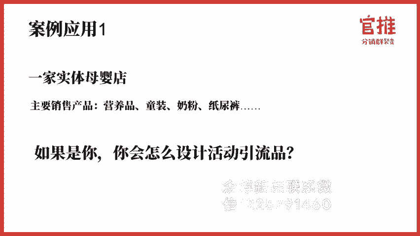

好的，我在评论区里边看到大家有回复啊，有些人说哎我可以去做绘本，宝宝的知识大全啊，我可以去做育儿的沙龙，唉，也可以去做宝宝的小玩具啊，育儿的课程，然后呢呃纸尿裤还有奶瓶呃等等等等。哎。

那我觉得大家其实已经上到了哈，就是结合大家的回复，可以看到大家其实陆陆续续呢都已经有了自己的思维。

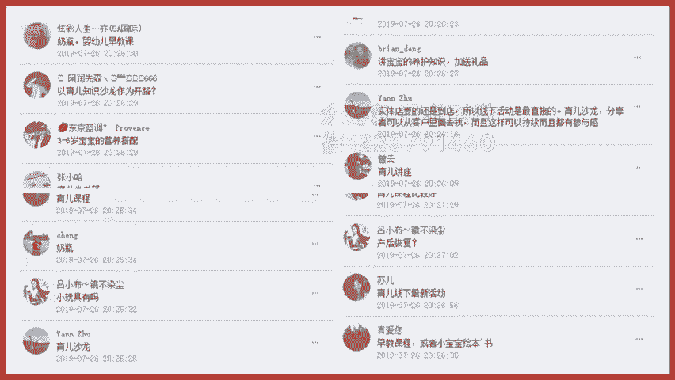

我分享一下我的思路哈，我们可以参考一下刚才我们所列举的那个产品的类型，我们来分析一下。呃，这个呢是一个线下的一个母婴店。它其实呢第一个它可以做线下的销售。实际上它能不能做线上的销售，其实也是可以的。

你能不能做电商，你能不能把货寄寄出去给用户，而且你还有线下的实体店，比那种做电商的一个公司其实效果要好很多的，对不对？其实不限制，但是呢更好的是肯定是要让用户到店消费。

那是效果最好的那我们参考一下我们刚才所说的，就是第一个实物产品，那实物产品那从实用呃从相关性来说啊，那是是不是可以针对，因为他的目标用户很明确，就是宝妈人群，对不对？

那可能更多的是那个0到3岁的宝妈人群是最适合他们的。他们是做。因为他们是做母婴店的嘛。那么我在相关性的话，我们就是不是可以做新手妈妈的月绘本。还有呢婴儿的早教部书啊等等这些哈。

是不是就可以作为你相关性的引流品。然后呢，做实用性上面，是不是就可以设计说，比如说宝宝的口水巾啊，宝宝的游泳贴啊，宝宝的那个玩具的益志啊，宝宝的餐具的套装啊。

这些其实是不是都可以成为你的食物产品的引流品。当然我觉得就是这位学员其实有跟我沟通啊，他自己也觉得就是在做引流品的情况下，他自己的思路其实是刚开始是这样子的。

大家可以看一下我发出来的聊天记录哈，这也是我们今天呃跟我沟通的学员。他觉得分销东西应该是标准化，大众的可以用得到的，的确是呃这个应该是。但是你看他的选择的引流产品是什么奶粉。

但是你要想一想奶粉这个东西呃，尤其是0到3岁的宝妈，我我我不是宝妈哈，我还没生小孩，但是我不太了解奶粉这个东西是不是可以是是是不是每个宝妈都用同一款产呃奶粉。

或者说是不是印象当中是一个小孩吃了一款这个奶粉之后，应该就是呃一直用这款了吧。他应该说不会更换品牌的吧。而且呢奶粉这个产品呢它本身的那个价格比较高，其实就不其实就不是属于那种引流产品了。所以大家在。

结合自己的思维重新去理一下哈，就是从我们刚才所梳理的角度来看，引流产品如果是做引流产品，一定是高价值、低成本的产品，对你来说效果才会比较好。后面呢我会分享怎么去找到高价值、低成本的实物产品。那在这里呢。

我取一个我们之前官推客户的一个实战案例。这个案例呢之前是我操盘的，它是辣妈能力圈，他们针对其实就是0到3岁的宝妈人群。它设计的这个引流产品，就是新手妈妈的7天成长营，就怎么去学会轻松带娃设计了七节课。

呃，主要围绕着宝妈人群最需要的7节课。比如说孩子哭什么教你读懂你的娃，然后呢感冒发烧、咳嗽7间7种常见疾病的正常护理。然后呢给孩子办卖保险，买保险这些坑一定要呃就是要房，还有呢就是怎么去告别奶岁呀。

还有5睡啊、夜岁啊这些啊，然后呢怎么去给宝宝添加科学的一个辅食，还有呢抓住孩子的关键成长期，然后呢怎么让爸爸回归家庭。这7个最关键的题。这7个最关键的宝妈最关心的问题去做了一个引流的活动。这个活动啊。

这个辣妈人一圈其实是新品牌。说实话，这个名字都是我起的，新品牌零粉丝完全没有粉丝。这场活动呢从零开始操盘，就是呃通过招募分销团队的方式。那最终得到结果是最后一场活动运行下来是3000多人付费。

那么大家可以看一下右边呃就是截图哈，就是呃我们当初一个队员，就是分销的队员，他自己呢去跟家婴儿的游泳馆去沟通，将这个课程作为会员的福利作为引流啊，效果的确很不错。这是搭当初给我的反馈啊。

因为现在拓客引流其实是线下商家。最头疼的一个事情，而且推广成本又特别高。啊，而且这次呢就是我们结合了这个课程给到这个实体产商家，而且是零成本的引流效果很不错。呃，就是借别人的鸡下蛋孵小鸡生蛋。

下面呢呃在接下来有一节课呢我会专门讲到大家，就是怎么去激励这个分销员去转发。然后呢，怎么去结合异业跟你一起合作，去做联合的活动，合合作去推广，从而呢把那个呃流量做大做强。那么我们再来看第二个案例啊。

一个线下的火锅店，它主要的产品是火锅的底料、菜品、饮料和酒水。如果是你，你会怎么去设计它的活动引流品。

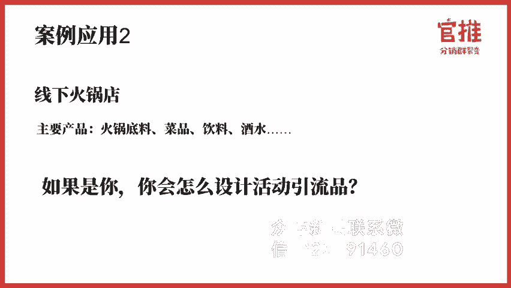

哎，我看到大家都有在做自己的思考哈，的确是送火锅底料、送消费，还有呢酒水1元等等等等哈，这些都是实体产品，实体商家最常用的一个门道了。那么我们这次其实用的是分销裂变种模式哈。

所以呢更多的要刺激用户一看这个产品超值？第二个能够让这些用户主动去分享。那在这一次的话，我直直接就把我们这个火锅底料的这个呃火锅店的一个客户直接他的那个设计素材展示给到大家。那可以看一下哈。

他设计的一个诱饵是什么？49。9块就给抢购他149元的鸡火锅套餐，外加100瓶啤酒，限购500500份。呃，限时9天内就要抢完。

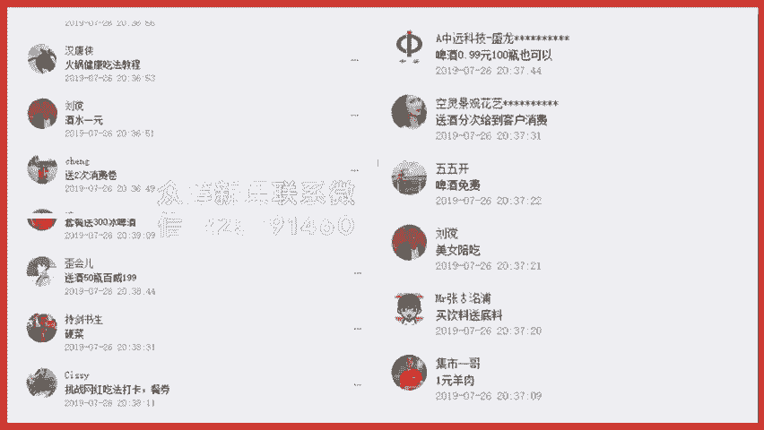

这个其实就是一个锁客的哈，一般来说这个客户来了电消费哈，他基本上是不会一次性把这个啤酒喝完的。那他就会呃留着下一次继续用，所以呢他就锁定了这个客户到店。而且呢大家可以知道吗？

就是我昨昨天晚上有跟他分享哈，就是有很多客户去会帮他乐续分享的。因为以前大家看到超值就自己买了，现在加了分销客户看到之后还转发朋友圈，甚至于他就私聊发小群里边推给自己的同事，推给自己身边的好友邻居。

这样的话就会促进大量的用户去购买他这款产品。所以以前他需要发传单去做活动很痛苦。现在他只要做一场这样的活动就圈到了500多人到店。而且这500多人加入的他的微信群里。

他还可以在他还可以在微信群里面每周做活动，每周做活动。这样的方式呢吸引这500多人持续去消费。而且这500多人又可以成为他下一次活动的启动用户。所以大家可以知道，如果你善于去玩分销类变这种模式。

如果你真的会策划这样的方案。其实你的你的还用担心你的流量没有办法过来吗？只要你找到一定的那个推广的推销员帮你去做分销，然后让这些用户过来之后再帮你去推广，你的流量就会源源的不断的。第三个呢。

我再讲一下具体的应用案例。这个案例呢叫摇身一变。这个呢是有个好朋友，他开的一家公司，他主要公司的产品是形象改造服务、高级女妆、护肤品、珠宝装饰品等等。呃。

我相信咱们这里学习的学员当中有很多人其实也是做美肤啊、护呃化妆品啊之类的这样的一个产品的。呃，但对而且呢很多微商其实自己也有很多的产品，比如说减肥产品啊等等哈，都可以参考他这样的一些思路。

那我就直接给大家展示一下他是怎么操作的。首先呢前阵子他做了一个引流的课程，这课程是什么呢？你想想他做实际形象设计的，做那个高级女装的，他做什么？他就做穿搭课，他的光穿搭课就卖9。9块。

当然他后面调价格是99哈。他刚开始的时候就是9。9块，9。9块的课程分销9。8块，也是通过这样的方式，呃，找一些朋友帮忙转发，也是在短短的两三天之内就卖出了900多单。

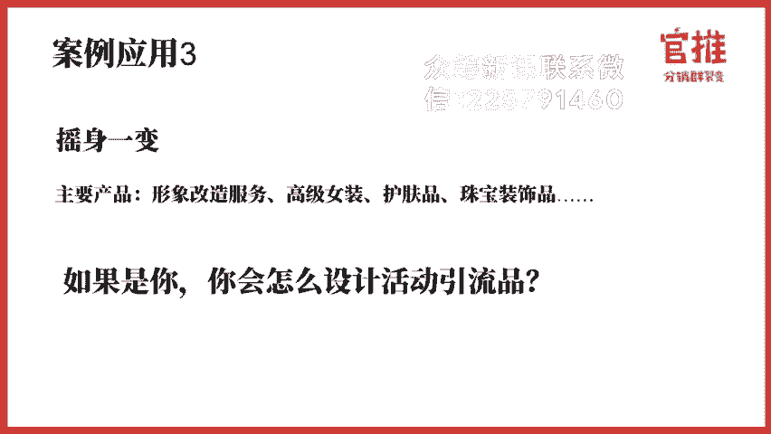

呃，大家可以看到，就是通过两节的干货课跟四节的小赵课，就吸引了大概1000个用户。这1000个用户听了他的穿搭课之后呢，他在课程里面在销售他的高价课以及他的高级女装。所以大家可以知，如果你。

学会用这种方式。去做推广的话，你只要设计好一个好的引流课程，你其实就可以源源不断的来对这个课程比较有兴趣的目标客户，而且是非常精准的目标客户。而他听了你的课对你有印象，对你信任。

这样子你再给他销售其他的产品。他的信任度是会高很多很多的。比你直接去刷朋友圈广告好太多了。那还有很多很多其他的案例，比如说呃有有家美容院，老板就将一楼的大厅设计成教室，然后呢。

专门请了专门的老师去教这些想减肥的人学习减肥操。每个会员一个月，你跳这个操，你只需要过来的话，只要100块钱，而且可以分销50块。你想想这个产品其实肯定是不赚钱的对吧？

他就是拿这个减肥培训操去做引流的产品，对于这种体重比较胖的用户是非常有吸引力的。你想一想嘛，有多少人能坚持一个月都来运动呢？但是他又想减肥怎么办？这个时候呢教他的老师就会建议你去二楼做减肥理疗。

是不是很容易？原因很简单，老师在跟学员相处这个时间内，通过奉献专业的价值，建立的权威感，又在互动当中建立了信赖感，再去销售减肥产品就会减多。再去销售减肥产品就会简单很多。

比如说你一个月收了200个会员学员过来，只要成交10%的学员，这个业绩就相当不错了。这就是运用到了我们刚才刚开始时候讲的那个思维，就是三步成交法。呃，它是运用引流品加利润品的方式来设计它的营销流程的。

那再比如健身房，那健身房卖什么？那你卖的都是会员，而且都是年费，那是不是可以拿一个月的健身月卡来做出引流品，再配合一两节私教的一个服务，我当初去做健身房的时候，我就参加过一次。然后呢。

那一次首先呢他帮我做了很全面的全身检测。然后呢，有一个私教教了我一个多小时，非常的体贴，他卖多少钱，卖19。91次，然后呢，再跟我说，你如果在享受这样的服务。然后呢，就可以在我们这里办卡呀。

然后你想首先呢会告诉你你想减多少斤，减多少斤，我们大概什么时间可以帮你做到这个。然后呢，我会有私教监督，你每天的吃饭饮食。啊，然后呢，你过来还有私教教你怎么培训，体验特别好。我真的是心动了。

前阵子我还看到一个非常有意思的一个案例啊。😊，大家看一下这个海报，海报写了什么？光头9。9块光影。呃，然后呢他是可以做成一个什么样的一个产品啊？这个引流方案可以是一个直发产品的引流方案。

就因为来的人吸引都是光头人群嘛，呃这个光头人群来了之后，基本上来了的人，基本上就是他的非常精准的目标客户，对吧？呃，再配上呃比较明显的这个影星，也是光头的形象的时候呢，就一下子就吸引大家的一个注意力了。

😊，呃，这个就是给给大家一个参考的思路。

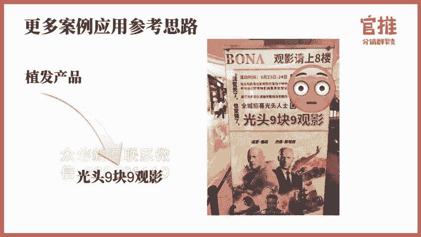

那再举个例子哈呃，我之前的公司是一家建站的公司，呃，是一个建营销型网站的公司。😊，你想想嘛，如果说你打的宣传的产品是一个网站，有多少人会听有多少客户会帮你主动去帮你转发。其实是微乎及微的。

因为这个太广告了，对吧？但是呢我转一个思路，比如说我们的引流品可以是什么？可以是网络营销相关的培训课程，告诉大家通过什么样的方式可以做好你的网络营销。这样的方式呢就可以吸引到大量客户的注意。

而且呢在听课的过程当中就可以教育客户。那因为因为网络营销是要配合工具的，需要配合你的网站来一起使用的，就可以把你的理念灌输给客户，教育客户什么样才是一个好的网站。呃。

什么样的网站才可以帮你快速去呃让目标客户咨询下单。通过这样的方式呢，就可以让客户一来呢可以快速吸引到一精准的目标客户。二来呢这些客户帮你转发分享的时候，他心里没有压力，因为他觉得他是在帮助别人。

那么在送实物产品的时候呢，最关键是要控制成本了，然后又有能体现高价值。所以在这里呢就给大家说一下，有3条可以寻找高高价值提成本实物产品的一个渠道。呃，第一个呢是淘宝的高分佣的产品。

这个呢是实是可以去一些淘客的平台，淘客的网站里面去寻找高佣金的产品，你可以按类目价格佣金的比例来搜索。这样的话你一下子就可以找到大量的引流品产品了。其实很多人以为引流产品就是在自己的产品里面选一款。

其实不对，你只要选中客户需要的产品，你把目标客户引过来，你再去销售你自己的产品都可以。所以引流产品，你要选择用户需要的，而不是你自己拥有的。而且呢你可以去这些淘客平台去购买这些产品。

你还可以得到高佣的返金返利金。用户接受到的价格。其实比如说一款产品，他看到淘宝的价格的话，看到其他的平台的价格可能是20块钱。实际上你高佣的返金的话，你可以拿到50%的利润，对吧？

那你可能只要10块钱就是可以搞定这款产品了，那我就可以把价格设置155块钱，我分销赚5块钱，那实际上你的成本其实是为几乎是可以说是抵过的那还获得大量的用户，对吧？

那第二种呢就是去那种呃阿里巴巴里面去批发。呃，阿里巴巴平台上基本上就是会比淘宝的价格啊，其他的价格啊呃会便宜很多。呃，这里边呢还可以支持一件代发，还可以定制你自家的logo。

这样的话就可以从低成本去呃购买到高价值的产品了。甚至于有一些呃很看起来很高价格的产品。实像在阿里巴巴可能几毛钱就可以购买到了。第三个呢就是可以去找呃拼多多的那个分佣的平台。

其实拼拼多多的产品已经够优惠了，够便宜了。但是实际上拼多的产品还可以更优惠，更便宜呃，很多产品都是几块钱包邮就可以了嘛。但是实际上你去那些拼多多的分佣平台，人还可以得到返佣，还可以更低成本。

所以呢我把思路提供给大家。呃，不一定是要用自己的产品去做引流的引流的产品其实有很多种的。

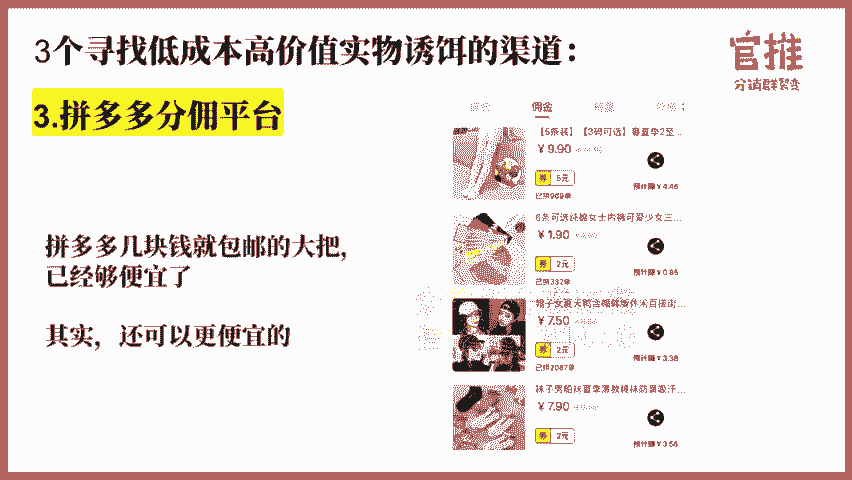

好，说完产品的分类，说完产品的呃注意的要素。那最后一个环节呢，我们来来分享一下，就是那我怎么去打造这款产品，然后呢让用户感觉到很。价值很高，然后让他可以愿意呃看到就买，然后帮我去转发传播呢。

这里边呢打造价值只是有5种方法，这是我常用的。第一个呢是数字呈现，就是你要把你的好处，用数字呈现出来，比如说价值多多少钱，一定要呈现出来。第二个呢是呈现你的客户见证，引发用户来从众。

比如说我这个课程已经有多少人学习了，3000多人都在学习了，这样的话就是可以引发用户来呃来呃呃就是他不会那么犹豫，觉得那么多人都在学习了，那我也学习一下，对吧？

第二个个呢就是虚切感和紧迫感。就是你在设计诱导这个引流品的时候，一定限时限量，这是非常关键的。我不是所有的人都能享受，必须提前购买前几名才可以有前500名，比如说这次我就限时限量。

昨天晚上之后还有很多人来问我，我错过时间了。M美老师，我能不能再买呀。那我说不好意思，现在买699块钱不能少。你在我宣传的时间之内，你没有购买，那你只能用高价来购买，要不你就参加第二期。

第二期我肯定价格会比现在更高。所以。你一定要限时限量，才能让用户尽快下单。你晚一点下单，我都会涨价。第三种呢就是公信力的背书，尤其是做课程了，这个就非常关键了。做课程的。如果不是知名的讲师，不是大机构。

可能会就客户在引导分享和分销的时候，他会有抵触心理，会觉得你这个课程质量高不高呀？那你可可不可以跟一些大V去混熟，让这些大V帮你去做背书。可不可以找一些大品牌跟合作，然后呢做联合活动。

啊我们就是这样子的，待会我会讲到，然后第三种呢就是第四种呢就是异业的联联盟，就是可以合作互推呀。你除了购买我各款产品，我还可以送你什么什么什么大礼包啊，这样的话就会促进用户呃，可能会因为大礼包而购买啊。

然后呢，第五种就是我最常用的。就是我引流品，我可能不仅是设计一种。我是组合来应用的。你现在买我的课，买了我的课，马上扫码进群，我还送你一个什么什么什资料包，送一个什么绝密文档。前几名购买的人。

我还额外赠送什么什么工具包，就是我最最常用的，就是让用户感觉得到，就是我现在马上要下单，我现在下单我还可以额外得到一些优惠，对他来说刺激力度就很大。而且呢他可以马上就获得这份资料马上就获得这个工具包。

对他呢他的这个呃就是获得感会更强。首先他在进群的时候就获得这个资料包或者获得这个工具，他呢就会不会犹豫，不会觉得你这个活动是不是真的，他就不加思索的会帮你去做分享。

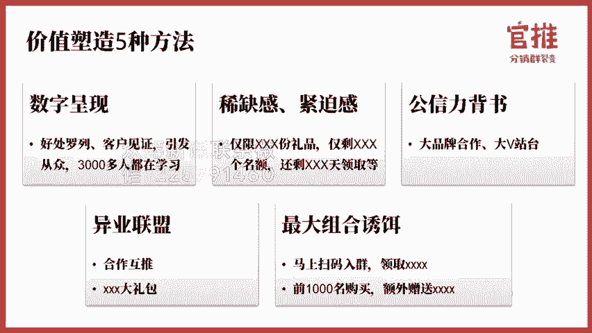

那尤其呢在虚拟产品当中，就是尤其是在课程啊，这类型的产品当中塑造价值是非常常用的。如果你不会去塑造你的价值的话，这个效果可能就会大打折扣。比如说社群的圈子。这里边你要做付费社群的话。

你的重点就是要找什么找大V帮你站台，去罗列你群成员有哪些资源，大家可以看一下军训社的一个详情稿哈。第二个呢是那个课程的知识，课程的知识，现在因为知识付费也蛮多的那如果你自己不会做课怎么办？

昨天晚上我也跟大家说了，不会自己做课，那你去找别的讲师合作，找大咖讲师合作。可以推荐大家去找喜马拉雅千聊地质微课等平台讲师，尤其是腰部的讲师，他是很乐意去跟你合作的。还有呢就是做训练营、打卡营。

这里边呢重点突出实操和陪伴服务。这个呢就会比单节的线上课程感知度呢会更就是用户的感知度会会更低。就是他不会觉得呃我买的这个客户我能不能听，反正他来的时候呢，他有陪伴的作用。那就会让他更有诱惑力。

那而且呢还可以形成大V的举证来进行互推。

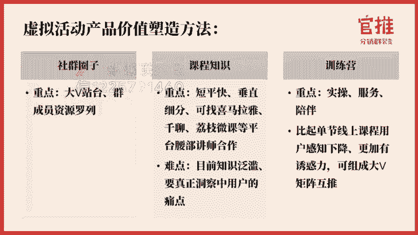

以我们做过的这三个案例哈，比如说像社群千万级社群限时入群这个活动。我当初做的就是第一个我标注了我的价值，我是1800个在册的群主用户资源。第二个呢，我找了联合合作工具方。比如说创客贴呃。

幕布这些就是我们当初合作的一个工具方，只9。9块，你还可以获得400多块钱的工具包非常值。然后呢，我还告诉你，我是有锚点效应的，只限前两前2000人。呃，然后呢，在某个时间就会恢复原价199。

这就促进了用户看到就下单，看到就下单。呃，但我们这次的训练营也是如此，我们这次的实操营，我也是联合了工具方啊，获得了3000多个3000多块钱的工具方给到大家。大咖的讲师就是合作的讲师。

也是呃找了业内比较知名的裂变行业的讲师，跟我一起去做这个体系课。还有呢我在今年年初操盘的这个社群呃，演习社也是如此哈，都是如此。所以呢大家在做右饵的时候啊，一定要注意了。好，讲到这里呢。

我们这节课的内容就差不多了。我们来重点来提炼一下这节课的重点内容。第一个呢，我们讲到我们整个活动推进的节奏，就一般设计的节奏是先设引流品，让用户先进社群，然后通过成交利润品来进行成交。

然后呢再通过设计一款。长期的绑定关系的产品来绑定用户的关系，甚至可以让这些用户成为我们的推广员。然后呢，在选择这个产品的过程当中，有三大最重要的原则，就是相关性、高价值和低成本。

策划思路里边呢主要有两大产品的分类。实物产品和虚拟产品。那在价值的塑造上面主要是五大价值的塑造方法，数字呈现虚切紧迫感，还有公信力的打造和异业联盟，还有最大的组合。你的活动。诱。

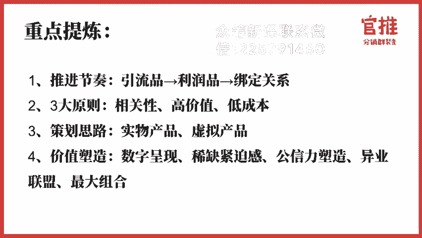

那这节课大家的训练任务是什么呢？首先第一点，大家先在玩转社群666公众号回复方案两个字来获取官推分销群裂变方案的模板。获取之后呢，点击右上角有个创建副本就可以直接套用了。第二个呢，根据我们这节课的内容。

结合你自己的产品和服务，设计出对应的活动诱饵。设计完之后呢，可以把你的内容发到我们的社群里边，让大家帮你去把把关。好，那今天的课程就到此结束。

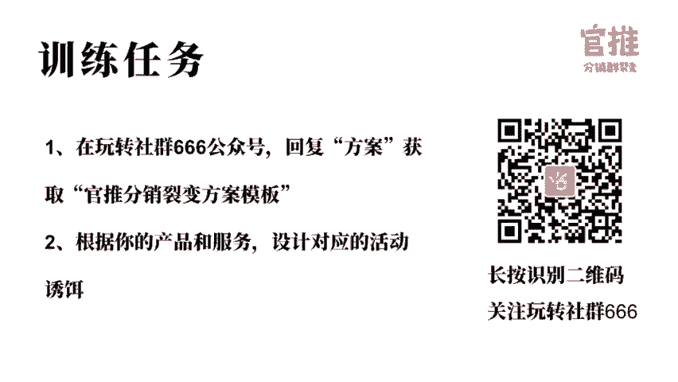

我们所有的课程都支持随时回看，大家可以在玩转社群66公众号菜单栏听课入口处进入观看。如果你学习完课程后，觉得课程内容对你有帮助，也希望你可以把优质的内容分享给你的朋友，也许能够帮到他。

点击玩转社群666公众号菜单栏生成专属分销海报，即可生成你的专属海报。有好友购买之后，你还可以拿到50%的奖励金哦。

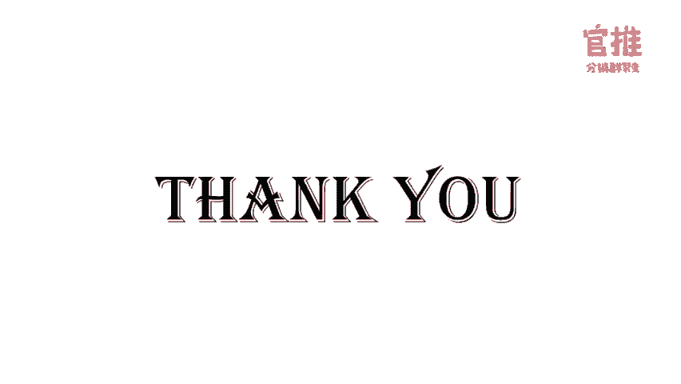