# 微社群裂变营销私域流量池增长秘籍创业运营销售获客视频课教程 合集 8套 374资料 13.1G 分销群裂变模式介绍及9大行业案例解析 - P4：第04节：如何定价与设计分销规则让渠道为之疯狂推广 - 高端网创试错赚钱大师 - BV1Ux4y1b7xM

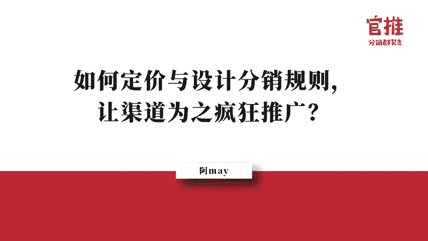

那么在正课开始之前呢，我们还是先复习一下我们昨天的课程内容，让大家加深一下印象。首先在昨天我们先探讨了专业的操盘手是如何推进活动成交节奏的。一般他们设计的节奏是先做引流品，让用户先进社群。

然后通过成交利润品的方式来进行成交。接下来呢再设计一款长期的可以绑定关系的产品来绑定绑定用户的关系，甚至呢可以让这些用户成为他们的铁杆粉丝，成为他们的推广员。那么在引流品的打造上。

我们是需要遵守三个非常重要的要素的，就是相关性、高价值和低成本。只有跟你的业务有相关性的引流品，他带来的用户才会是精准的强需求的用户。带来的用户才会是精准的强强需求的用户，你的后续成交转化率才会比较高。

那么很多人认为呀引流品就是低成本，而往往忽略了高价值，拿一些很廉价的东西去做引流，却往往忽略了这些东西，用户根本是不需求的，或者根本瞧不上的。所以就算是你的引流品，也一定是高价值的，用户用得上的才可以。

在这一点上，虚拟产品由于非常容易塑造价值，而且具有成呃编际成本为零的特点，就成为了非常好的引流品的选择。其实不管你是选择实物的产品还是虚拟产品来作为你活动的引流品，你都要学会学会如何塑造你产品的价值。

那昨天我给大家分享了我如何。我如何塑造价值的五大方法，就是用数字呈现，需求紧迫感、公力公信力的打造和异业联盟最大组合诱饵法等等。呃，通过结合用户的从众心理，规不规避损失心理呃，利用他们非常信任权威。

或者说心理价值有偏差。呃，可以即时获得满足感等等这些原理，从而呢把引流品打造成一个用户看了就想买单的超级产品，提高他们的成交转化率，以及他们的分享。律，接下来。我们就。确定下来我们的裂变产品了。那么。

究竟如何定价，又应该怎么设置分销规则，去刺激激励这些推广员去帮我们转发和分享呢？

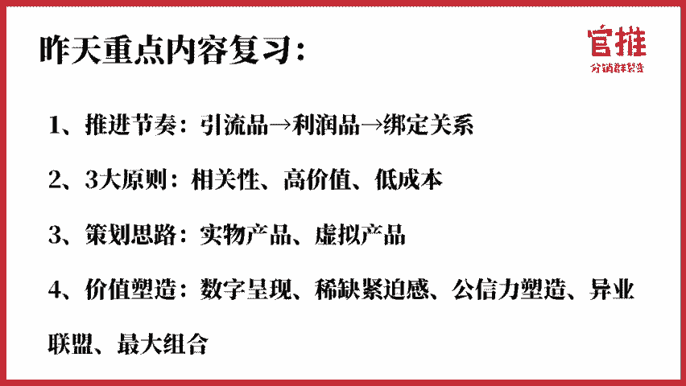

那么今天晚上啊我们将会从以下三个部分跟大家详细聊一聊我自己在亲自做项目策划的时候是怎么思考的，又是怎么去实操的。首先是定价问题。其实我在定价的时候，我自己是有原则的。我有三个原则。首先第一点。

我定价的引流品。因为我们现在谈的是引流品的定价哈。

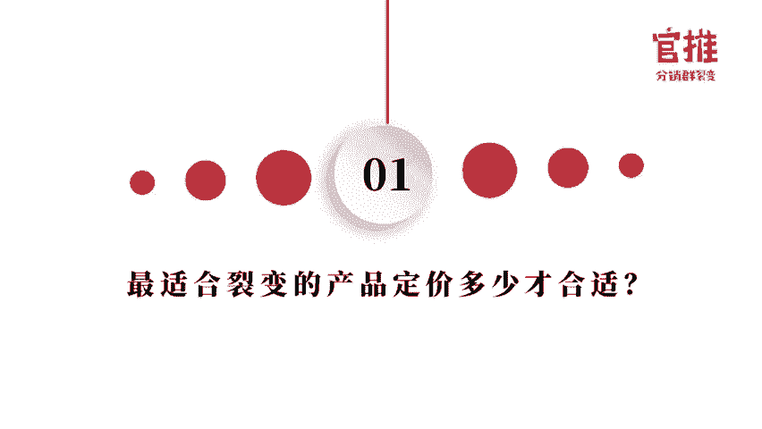

那我定价的时候，首先第一个原则就是我这个引流品的定价，我不能破坏我原本的产品的价格体系。这是第一点。因为你一旦破坏了原本的价格体系，就会导致你可能原本的客户的那个呃就是投诉率会上升。

或者是原本的客户不满意。也导致有可能会让你后面的那个价格很难恢复到你原本的价格。所以这个价格价格的原则里边，我是不可以破坏我原本的价格体系的。第二个，我不可以让后面买单的人比前面买单的人更便宜。

为什么我们要设计这么一个原则哈，就是。这就是我为什么我每次推出活动，大家一定要赶紧去购买的原因，因为我不可以让后面买的人比前面买的人更便宜。我不能让我前面支持我的人吃亏，这就是我最重要的第二个原则。

第三个原则，我的引流品，我一定是超值的。但是呢我不是廉价的产品不low逼的产品，让他们转发分享，不会觉得丢脸丢丢自己的面子。那转发到分享的朋友圈，不会说认为他是在给呃同学或者说他的亲朋好友。

认为他在做一个很丢脸的事情啊，所以呢呃这三个原则呢，就确定了。就是如果你能够遵守这三个原则，你后面去做第一场活动不不一定会很成功。但是你丢第二场活动的时候。

前面的活动参与过活动的朋友就会知道你其只有这样原。那一旦。他知道你有这样的原则，后面你推出的活动，他第一时间如果他真是有需求，他就会第一时间就加入，不会犹豫。现在这两天我已经接到很多很多的朋友跟我说。

哎，阿美老师不好意思，我错过了。我现在看了一下价格已经恢复到699了，能不能以优惠价进入啊，我说不好意思，已经超过我的活动时间了，不能进入哦，那你要不的话，你就看一下，我后面会不会搞活动。

但是实际上我要跟大家说，我做这次实操云，我基本上我是不会再去搞呃，特别优惠的活动了。因为我这次实操营，我毛利的一个价格点，就是699，这个699，其实是给我。官推的客户才能才能听的一门课。

你不买我的软件，其实是不可以听的一个门课。这是我后面要做的这个事情。所以呢这样的训这样的实操营，也许这样的价格只有一次呃，只有一次，后面的价格肯定会比原来的价格要高很多的，就是我定价的三个原则。

那么在定价上面呢，其实是有一些技巧的，就很多人定价的时候非常的懵逼，呃，就是不知道自己应该定多少钱才合理。呃，也不知道就究竟是定呃。具体到19。9块还是29。9块，用户才会去转发。

其实定价其实是有技巧的。

我先说一下我们在定价的时候常用的四个技巧。第一个呢是尾数的定价法。这个应该大家都很能理解哈，就是你一定听说过呃，同样一款商品呃，19。9块肯定会比20块买的好，就是这个就是心理定价中的那个入定价法。

这个尾数定价法呢。就是让用户感觉到便宜啊，基本上很多基础的生活用品都在用这招啊，但很多人来问了，那19。9块明显就是20块钱呢，不就少了一分钱一毛钱嘛，对不对？那消费者不傻吗？这有这真的有用吗？

其是有一家美国的公司做过数据统计的。同样的商品，定价0。99元。呃，0。99美元就比定价1美元多卖了62。7%，定价1。99元就会比定价2元多卖117。定价2222。99元就会比定价3元多卖63%。

所以呢。这个尾数定价法的确就会让消费者觉得便宜啊。但是呢，其实也不是商品都。非常适合用尾数定价法了。就是有如果有一些朋友他自己去做那个礼品的，你做礼品的就不要用尾数定价法。你想一想嘛，比如说你这个礼盒。

你定价本来是100块钱的，你定价99，你想想从消费者的心理来说哈，这个东西如果他是拿买买来送给别人的，你想一想。如果你是买给送给别人朋友的，你会买99块钱的礼盒，还是买100块钱的？

我相信大部分人都会买100块钱的，因为这显得你对朋友是重视的，100块钱就是比99块钱高出一个档次。再比如你是奢侈品的啊，你是一个高档的一个西装，你定价9999元还是1万块钱。

肯定是1万块钱更彰显你的身份嘛，我穿的可是万元的西装，对吧？那标价999元，就让人感觉你是极的。一定是不值钱的。所以大家要做定价的时候，一定要根据自己的产品来定价哈。

但是因为我们这边的话就是做分销裂变活动，大部分用的就是呃引流品嘛，那引流品大部分就是要用户赶紧下单。那用尾数定价组合法，其实是我们惯用的手段也可以看到，其实我的后台看到大家用的活动的定价。

基本上都是19。9块、29。9块、39。9块199嗯，就很少有整数的。😊，这是第一种方式啊。第二种方法是什么呢？第二种方法是锚锚定定价，锚定定价其实是也是很普遍的。你举个例子哈，像我们这期的实销营。

我就告诉大家，我原价是699的，你现实。第一次的首期众筹价是99元，这就是给了大家一个毛利额。实操盈市面上基本上不会低。几百块钱的对吧？大家也没有参加过一个几几10块钱的时槽营很少吧。

所以就是因为市面上的价格锚定了这个价值。所以我说我首期众筹价99元，就很多朋友就会加入进来。当然后面我还用了另外一个方法哈，就是待会我待会再再说。😊，还有呢就是第二个呢就是你在定价的时候。

比如说我我举课程为例哈，那有些老师他公开课很便宜。但实际上他如果找他一对一咨询的话，价格很高。那我就可以通过他的咨询费的一个高价来说明这个现在的公开课很低。举个例子。

你就可以说老师一小时的一个咨询费要3000块钱，你现在就可以用9。9块听他一节课。相当于你就相当于很超值嘛，这就是毛定定价的一个很好的一个对比。你就可以拿贵的东西跟便宜东西一对比。

就显得你这个东西很超值啊。第三种呢就是分割定价。分割定价呢就是这就是很也有很多常用的方式。比如说本来每天听本书这个产品啊，所到了产品是365块钱的，房登也是365块钱的。但是呢他告诉你每天1块钱就可以。

是不是他就分割了嘛，本来是整数的一年是365的，他分割下来每天只需要一块钱，让你觉得很值啊，包括他的专栏的费用199，他说每天5毛钱，你是不是觉得很值，每天5毛钱嘛，实际上你花的是199嘛，对吧？

这就是分割定价的好处，那这个呢其实就是在文案上面，你要说明哈是这样子的话就会让客户觉得很值。第四种方案呢就是短缺定价，这也是我惯用的方式。短缺的原理在商业上的应用就很多哈。

比如说你告诉客户这个我们这款产品数量是有限的，不一定保证有货。所以呢你赶紧下单，所以就会有什么截止日期、抢购秒杀等等这样收段销售手段来刺激用户的一个购买欲望。产品限量发售是非常有紧迫感的。比如说。

你本来是预预估这批东西，你要卖卖，可能要卖1000件，但是你不要一下子就放出1000件出来，你就告诉客户，我每次我只只放出300个，300个抢完就没有了，就让他有紧迫感。这个呢在社群发售的时候用的很多。

就要让客户感觉到哇，这么快就抢光了。那下次我要调好闹钟，准时来抢，就是在社群发售里面用的非常非常的多，而且非常有好，非非常呃呃有效果的。那还有一种呢就是促销的一个现实也是这样子的。

比如说呃我我我那个双十一呃仅全年仅此一天哈，就让他觉得呃今天不参与这个促销，就失去了这个机会呃，我就经常要来用这个短缺竞价。比如说这是实操营，我就告诉大家。每满500人就要涨10块。然后呢。

限量是多少人？我在什么时候截止之前就恢复原价，这就是这个就让用户看了之后要赶紧下单。还有呢就是有一些限量，就是每人限购一件，这种呢也是短缺定价一种应用的方式，这样的话也会觉得哎，好值。

每每个人只能限购一件，那说不定这个商家是在亏本买卖呢，对吧？😊，还有另外一种组合方法的，最后我我们也是常用的，就在做那个。呃，裂变产品定价上也是常用的，就是组合定价呃，组合定价组合定价是什么呢？本来。

有三款商产品，这三款商品在外边定价可能都是19。9块。我就告诉你三款产品打包起来，一个超值大礼包，可能就需要19。9块而已，或者29。9块，你拿走。这样的话就让客户感觉到非常非常的优惠。

这个其实在很多淘宝商家也是经常用到的。那我们来看一下真实的案例哈，就这就是我们做过的案例哈。呃，最后一个案例呢，其实不是我们亲自操盘的，是运营深度精选操盘的。

它也是用了分销裂变的模式来跑的那前面两案例呢，就是第一个的时候就是我们这次的14天裂变式超盈。这个呢就是我写的就是首期是99，原价699，这用了锚定定价的方法。第二个呢每满500人涨价10元。

用了短缺的原理。而且其实我在文案上面突出来了，就是7月25号就恢复原价699元。这个呢就是用了短缺的原理，促使大家赶紧下单。😊。

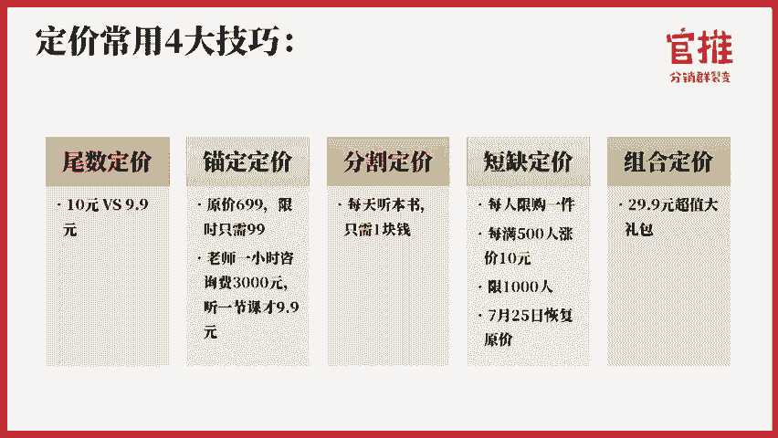

包括你在后面做分销的时候，很多文案上面也需要去体现这个。比如说我马上就要快满500人，还有100人嘛，对不对？我就告诉你109的那个价格只剩10100名了，再超就是再有100人购买就要涨到119人。

119了，你现在不下单，可能就要再花多10块钱，你赶紧下单。如果要购买的话。第二个呢就是我们当初做完这社群66的时候，也是用了同样的方式，就是原价是199的，限时是19。9块。而且我告诉你。

我限量2000人，2000人。你查我2000人，我可能就要恢复原价。第二个的话，我要告诉你。其实这个后来我们调了一下，刚开始都是2000人，没想到效果太太超过预期了。所以那么我马上做了调整。

就是呃在某某时间之内购买就就可以用19。9块的价格进群。如果超过某某时间，我就要恢复原价，19。9块。这个而且我恢复原价是说到做到的。第三个案例呢就是这个其实是一个购物商城啊，购物商场啊。

这是购物商场本身的那个管理处。他他的目标很正很很明确，就是我其实是要给商场引流的。我要让让我的商场百货商场，他其实是一个shopping mall嘛。我让我的收呃商场人流量更多。

那么他就做了一个这样的一个活动。我打包了很多什么星巴克的一个咖啡券，然后跟这个商家进联进行联合嘛，什么奶茶券呢，还有一些什么购物券呢，美食券呢，一堆的券包起来才29。9块。

其实这些商家一直都有在对外发这个券，只是呢更多是这个商家自己一个人去发，没有用。那他呢做一个打包的活动，将这些券呢全部整合起来，做了一个霸王券，这个霸王券是这个商场购物商城的做的那做这一场活动呢。

当初就是只是店员去转发。他当当天就卖了2000多份嘛，当天到店是1700多人给他这个商好像是创造了应该是。差不多1000万的销售额。1000万的销售额，你想想看啊。

这个这个威力还是蛮大的这是线下活动的威力。好了，那有了前面我们的三个原则，以及我们的这个5个技巧之外呢，究竟我到底应该怎么去定价合适呢？那我看着别人是9。9块9。9块39。9块。

那到底我的产品应该怎么定价更合理呢？我应该是定19。9块呢，还是39。9块呢？呃，怎么样去设定更合理呢？呃，还有一些朋友直接就问我，就是说哎，我要是有个引流品，我定价多少合适啊，我要是定19。9块呢。

还是定1992999行不行？其实我要告诉大家的是什么引流品。什么叫引流品？其实就像昨天我分析那个案例说的，它其实是个母婴店，他就告诉我用奶粉来做引流品行不行？什么叫引流品？奶粉是不是引流品？其实。

在微信用户零钱里边，大多数超过60块钱，少于60块钱的付费是没有感觉的。这所谓的引流品其实是指用户不需要考虑，他就可以下单，不用考虑价格的问题，就可以下单的产品才叫引流品。

需要考虑价格问题的都不叫引流品了。那其实就是你需要去做转化的了。所以真正引流品的产品价格其实不要超过60块，超过60块它其实就是变成了你要很强的塑造啊，很强的文案和打造的能力了。

那么我因为我是做的支付费和教育行业做的很多哈，我就以支付费和教育行业为例哈。这个呢是呃K12教教育增长圈做了一个图。这个图其实就很清晰的描述了整个支付费行业跟教育行业的整个产品转化的体系过程。😊。

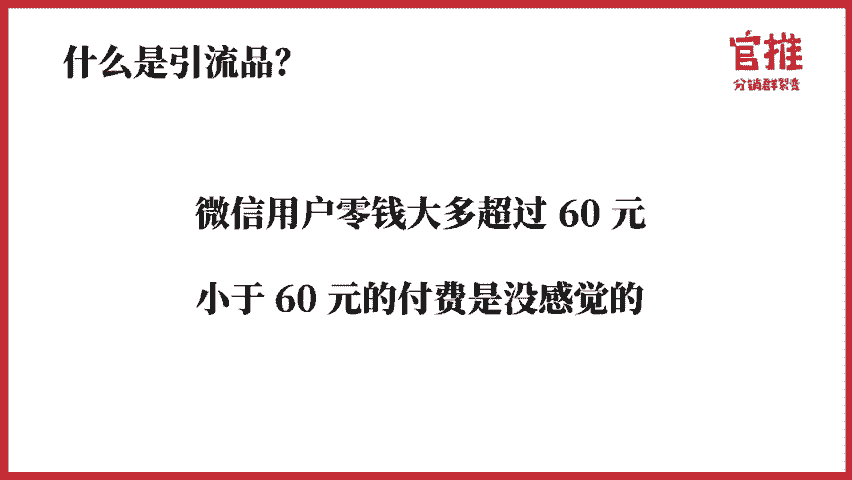

首先呢基本上就是有所谓的流量产品，就是我们说的引流品，基本上它的区间价格其实是在0到49块钱之间。那甚至有些人去用0元去做引流，但是0元的引流因为效果不好嘛，然后呢再去用信任产品做留存和成交。

什么叫信任产品？它的价格已经就是超过50块钱就变成信任产品了。50块钱到200块钱之间就叫信任产品了。对你没有一定的信任，是不会下单的。然后呢，从信任产品再去转盈利产，盈利产品呢。

就是500元到999元期间，就是就是盈利型的产品了，就1万元以内，500到1万元以内，基本上都是盈利型产品了。那到后面后面的话就是什么转介绍啊，续费啊，就是变成教育型的产品呢。

基本上是要结合一对一咨询或者线下的那种小班课啊，这种才可能卖这么高的费用了。线上其实卖这的高的费用的话，就很难了。那整个转化的流程其实是要根据用户的付费意愿和转化收周期的一个数据得出来的。

大家就根据这个图就可以判断一下你自己的课程究竟是在哪个环节，你应该怎么去调整你的成交步骤。前面呢就是0到200块钱的，就是知识付费的范畴，后面呢就变成了教育产品了。就包包括我们说的实操营其实需要服务的。

所以他。其实它就属于教育产品了，就不属于呃就是真正的知识付费产品了。呃，虽然我们卖的价格的确是很低哈。😊。

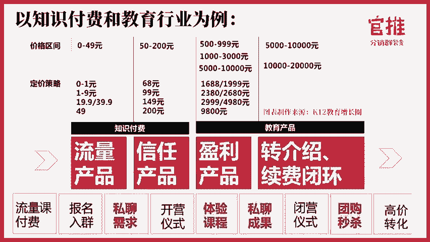

那么在价格的定价和转化率上，其实是有对应关系的。比如说0元的价格，0元的价格很多人都是不加思所报名的。但是这个类型其实人群围观就很多，而且很泛。最重要的是他报名的人多，但是听课的人很少，就玩课率非常低。

呃，还看似是轰轰烈烈，实际上效果就一般。第二个呢就是1块钱的，看了海报就能下单，不用思索的。这样这种人群其实要精准很多的。平均下来的话是15%的一个玩课率，也就是1100个人看了买了。

可能就有15个人过来听课，这种啊，不然就是85%的人是不不来听课的。那还有一个我的是9。9块的产品，9。9块的产品就是也是不用太多的思考。这种人群要比1块钱的，1块钱的要精准很多。

但是他的玩课率其实是1块钱的一倍。就是有30%的人会来听课。这种类型的话其实是要比呃那个1块1块钱的那个效果要好很多的。而且如果你配合社群的话，你玩课率还会再提高。😊，那这种类型的话是我们比较推荐的。

如果是作为领引流客来说的话，是比较合适的，容易爆发的一个价格。还有呢就是19。9块和39。9块啊，19。9块和39。9块呢还是需要一点思考的。这个时候呢，如果你不做分销，不做渠道推广的话。

你是很难传播出去的。呃，19。9块和39。9块本身它两个价格在用户看来转化率付费率和价格的感知度其实差不多。是呢。😊，🤧。但是呢39。9块的那个利润就会比19。9块高一倍嘛。呃，当当然了。

从呃购买用户数来说，肯定是19。9块要比39。9块更多更多的。那49块钱呢，是几49块钱这个这个课程呢，如果不做分销是没有办法裂变出去的了。所以你一旦要结合，一定要结合分销了。这个时候呢。

用户质量和购买意愿就会呃比较平衡。如果再高过49块钱就会有心理负担了。比如说69块钱，他决策的时候就开始犹豫了。这个时候呢就需要你进行强强包装才可能下单购买了。那超过100块钱，这个时候他就会很犹豫了。

100块钱的课程，如果你少于十几课，用户会觉得不值得不值得不值得购买了。因为在现在这个知识付费领域里边，的确是这样的，就是课程被大家卖的太便宜了。那超过就是200块钱要398。如果399499的话。

这个时候就需要社群来强转化了，需要有一定的信任度才会去去购买你了。而且如果399的价格，如果没有服务的话，其实是很难去取得用户信任，他会他很难去购买的了嗯。包括你说房登房登其实如果不做线下的读书会。

如果樊登他不做那个呃。代理商制度他其实也很难成交了。嗯，还有1000块钱的话，那就是需要那个社群和私聊强转化。然后再用那个通过引流课的方式，在社群里面进行秒杀团购的方式才可以去做转化了。

那超过5000块钱的课程基本上都是要呃电话销销售了。这个时候呢，你的课程基本上就是要一对一或者一对多的小班课才可能卖到这样的价格了。

这个价格体系呢就是教育产品和支付费产品的整个价格体系和对应的人群的一些精准度和它的一个判断力的一个呃就分析哈。这个呢其实从这个分析当中，大家就可以知道哈。如果你是做课程的推广和裂变的话，如果是定价的话。

那基本上你定在49块钱以下，你就很容易去爆发和裂变。如果你超过49块钱只是有比较难的了。那如果说这个也跟那个讲师本身的知名度有关系。如果你讲师知名度一般，那其实定19。9块或9。9块就就比较容易爆发。

嗯，这个也是我们这经常很多讲师用到的一个价格啊。当然，多节课肯定是要比单节课，他的一个用户价单的一个诱惑力要高很多的。好，那说完上面的一个定价之后，相信大家对定价应该心里有一点点呃。

就是知道大概会有什么样的一个区间了。那在实体产品当中，其实实体产品的定价就可能要跟你的成本。要相契合，你肯定不能亏本。在我的理念里边呢，就是因为我们做分销裂变跟在淘宝不一样，淘宝你可以亏本冲量。然后呢。

在冲量上面冲到那个排名，然后再通过淘宝自然的搜索流量来引引来更多的客户。但是你在做分销裂变的时候，就我不不建议大家去做那个亏损哈，就是一定是要在你成本之内啊，你一定是不能超过你的成本。

就是不能亏本的去卖这个货的。除非说你自己是本身是呃清库存啊，这样的行为，否则的话就是否则的话就很容易被人薅羊毛啊。而且如果你亏本的话，你更加更加没有太多的利润空间给到那个分销员去帮你推广了啊。

所以在这个点上的话，在做实物产品的时候要注意一点啊。所以我其实更加推崇大家去用服务产品和那个虚拟产品去做裂变和推广的。这样的话就是呃一来价值又比较容易去塑造。第二来的话就是价格上面，你比较容易去把控。

因为它的编辑成本可以去去相依为0嘛。好，那说完定价之后呢，我们来详细说一说分销规则应该怎么去设置啊。因为分分销规则设置的话，就是你分销的那个钱特别少的话，人家是没有动力帮你推广的对吧？那分钱特别多呢。

自己利润又跟不上。然后呢呃到底设置多少才合理的，其实大家心里也没有什么谱。然后分销的规则其实也有很多这种玩法的。😊。

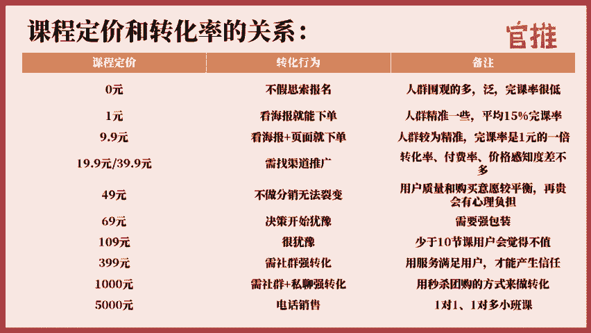

呃，所以我在这里呢就我我用实际的案例跟他说明一下，就是在分销规则上，我们应给一般来说都是有什么样的一个玩法。那在我们。自己操盘，甚至于我们自己的客户里边有3000多个客户里边。

大部分的玩法就脱离不了这这5种。要不的话就是组合玩。嗯。第一种的话就是统一去设置统一的分销规则呃，就是不做其他东西的，我就设一个统一的分销规则。比如说关建明老师9。9块的课程，我就设一个9。8块的一个。

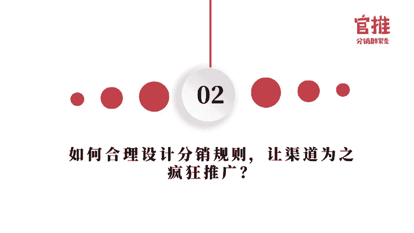

9。8块的也返佣。这样的话就是大家就会因为9。8块的一个高反高返佣就会疯狂帮我推广了。我不用再设其他的规则去玩。这样对我来说也很简单。那最重要的话，其实他还是需要建立一个指挥队。

让他去定时定点的去发朋友圈，这样的话对他来说效果会更好。第二个的话就是我除了设这个分销规则之外呢，我还组织的分销PK比赛，参与比赛的人，还我给你额外的奖励金，从而促进这部分有愿意帮我去传播了核心人员。

他更更助力他去更努力去帮我推广啊。因为他要额外的奖励金嘛。他为了冲这个奖励金，可能会更卖力啊，这是第二种，就是第三种的话，就是我可以针对优质的流量渠道，我还可以单独给他设置分销比例。

比如说我统一对外都是50%。那我可以针对某一个，比如说他有我的目标客户，这个渠道非常的优质。那如果你不玩分销，可能你他投广告你比的钱。但是如果你有分销的话，我告诉大家，我告诉他，就是你帮我推广。

我跟别人，我我我跟别人其实都是50%，我可以给你80%，有可能就可以触动他，不用花钱，他就帮你推广。因为他要佣金，他要流量变现嘛。就是呃针对第三种就优质的流量渠道啊。然后第四种的话就是呃针对不购买的人。

他是看不到分销的，就是不购买人不给他看到分销，让那些帮你分销的人呢，这里心理上的是有获得感的。就告诉因为他这样的话就会觉得呃我推广的话，朋友就看不知道我是挣了他的钱的。

以为我只是给他推广了好课程或者好东西给到他。这样的话就是有一有一丁点的就是可以促进这些分销员去转发的时候是没有心理压力的。呃，就是把这个分销的这个按钮呢隐藏起来。

第五种呢就是还有额外的1个PK排名排行榜奖励。那个分销排榜靠前几名，或者说团队总销量排靠前几名有额外的奖励金。这个呢就是呃我们在做分销当中最常见的5种的玩法。

那下面的话我每种玩法呢详细给大家详细去举例举例子哈。首先是第一个哈，就分销比例应该设是多少才合理。

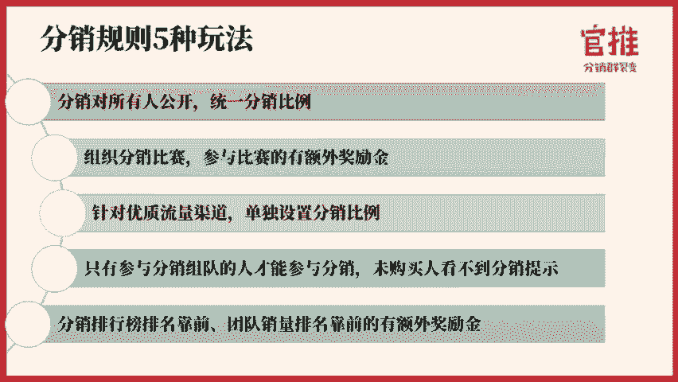

其实分销比例呢其实要根据你自己产品的一个利润值来设的。我举个例子，我做线上课或者线下课的话，因为我的成本主要是老师的成本嘛。那如果你自己没有你不会讲课。

那去讲找老师比如说励职微课和那个聊了腰部讲师昨天有人问到腰部讲师什么意思腰部讲师就是top讲师呢就是排名最最厉害那部分的讲师那部分是top讲师top讲师呢因为他比较咖位比较大嘛。

你基边上去链接他会跟他他谈困难。就咖位大的人你去找他合作可能就比较困难。那腰部讲师是除了大咖那些大咖讲师之外的下部的中部的部分的讲师就是腰部讲师这部分讲师本身的专业度是够的。

但是呢他的这个咖位没有那么大嘛他课程销量他想要拼命的往上冲嘛，所以他还是需要跟别人去合作。比如说渠道合作，他还是很愿意。那如果说我去找他去帮我讲课，我给一定的课酬给到他，其实还是OK的。

他也还是愿意给你讲课的，可能课酬也不会很贵。比如说你的课酬只需要呃几百块钱，1000多块钱，他可能也愿意帮你讲课了。那你做一场活动，投入个几百块钱1000块钱去请个讲师，你能获取到，比如说一两千的用户。

那你就非常值得了，对吧？第二个你买课的时候其实是赚钱的，其实你这个钱是可以赚回来的对吧？嗯，这个是呃做课程的一个事。😊，课程呢就是你的比例的话就可以设高一点。因为它卖的越多。

你其实整个你这个整个总价其实还是升上去的哇。而且你卖的越多，销量越高，你引来的粉丝量就越高嘛。所以很多就做线上课程的话，大部分的设的分销比例就可以50%，52%啊，都有啊，包括线下课其实也是如此。

包括你做线下活动哈。如果你觉得线做线下活动50%太高了，那我是30%，其实高于15%才有动力少于15%就很难有太多动力，除非你价格特别高，我成交一单，我有几千块钱佣金，那可能5%都愿意是吧？

但是你如果说成交一单的话，你那个那个客单价比较低的话，那成交一单才那么一点点钱，可能他就用那个动力就没那么强了。就是课程的一个比例的设置。呃，包括就是在设啊，不好意思哈，稍微卡了一下。好。

我们继续来说哈。就是刚才的课程比例的话，就是你设置的话，你尽量这个比例可以设高一点。因为虚拟产品的话，他编辑成本为0%嘛。嗯，然后呢课程比例的话，其实除了刚才所说的50%。甚至呢如果设9。9块。

你纯粹做引流品的话，你就关建明老师这招其实。😊，是很多用户都已经在复制了，而且效果真的很好。我是推荐大家如果自己想做课的话，其实可以参考的。比如说兔妈、千逊哈。

还有猫叔这些都在复制明老师这款这套玩法就是9。9块的定价。然后呢3天课程，然后可以返用9。8块，就是这个定价就是这个玩法就基本上每一个玩这个玩法的人，其现在都是超过千千千量的一个销量的啊。

所以这套玩法真的OK的。😊，好，那除了这个线上的那个课程之外呢，线下的社群也是如此哈呃就是那个付费社群啊，就我我我我我跟大家说哈，就我们那个分销裂变这种模式哈，以前做付费社群的人其实蛮苦逼的。

都是用那个个人号二维码来收款。然后呢又没办法做分销二维码收款，最重要的是还没办法联系到用户用户自己先加个然后再转账光是收红包，有的时候你发售一场那个线上付费社群。如果有几千人付费的话。

点红包点掉手类那个客服成本特别特别的高。那如果你用官推的话，其实整个分销逻辑可以跑通。第二个的话就是用户付费之后可以直接联系到你然后主动加过来，其实整个流程的话就会顺畅很多。

所以刚开始的时候我觉得官推是非常非常适合做付费社群的。后面呢又演化了很多很多的应用场景。比如说线下火锅店，还有线上课程，还有线下的活动这些都是后面演化。刚开始的候。😊，刚开始的时候。

我就觉得那个线上的那个线上的付费社群用我们官推这款产品去做，就是让用户付费。付费之后马上进群这个真的很好呃。当然现在其实你不用用户进群也OK直接加你个人号也OK有一些用户其实是不愿意做群了嘛。

因为怕别竞争对手来挖自己用户也好啊什么的那你就可以设置于用户付款之后，先加你个人微信就OK了，就不需要进群，那也是可以的因为整个逻辑是可以自定义的嘛。😊，那还有一种呢就是线下的门店哈。

线下门店的话就是基本上很少看到做分销的吧，就是什么餐饮啊什么的，你推荐客户去那里吃饭，基本上没有拿过但店家的钱吧，对不对？所以线下的门店里的分销比例可以不设置那么高。你觉是一点钱。

有些人就是为了那个9块钱5块钱就愿意帮你去转发了。😊，那比如说我附近的盒马生鲜啊，就是他就用这招嘛，就是我拉拉一个新用户给他开给我15块的奖励啊，就下1个APP嘛。这个的话就很多人很很有动力了哈。

这个这个其实也是呃玩的比较多的一种玩法吧。嗯，这个是线下门店的这个分销比例的设置。呃，那第二种呢就是。😊。

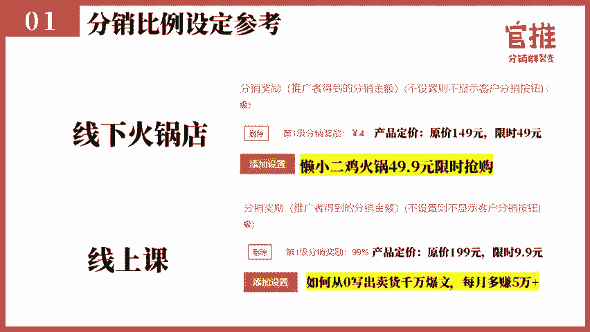

呃，分销比赛了分销比赛的规则的话，其实一般来说像我们去做的话，一般是会分两种的。一种的话就是统一的个人奖励。个人个人奖励的话就是我们刚才说的分销规则的设置。第二个呢会设团队奖励。

就是分销组队意思就是你先招募一个队长，这个队长呢他是招募他的队员。那每个队的话作为一个团队，这个团队里边呢，他可以你可以算他的总销量。什么意思？就是他除了他自己可以推广的时候呢，可以获得分销佣金之外。

如果他的团队。如果他团队在你设置的那个分销比赛里边，如果能够到你设置的那个条件，他就还可以获得团队的额外的奖金。那额外的奖金一除下来，可能他每单还可以再分到呃就是一定的一个奖励金。

这样的话就是就可以促进参与团队组队的那部分用户，尤其是在队长的带领之下，就可以积极去帮你转发和分享。当然你自己在设团队奖励金的时候，有一点一定要注意，要让他有一个销量的规定，就是你第一名设置奖励金。

但是你要规定他销量不能低于多少单。如果说你第一名到第14名，你全设置了，但是没有对销量进行设置的话，那有可能第一名，如果他不满足你这个300单，只是做了几十单也拿了第一名拿了那么多奖金，那你就亏了。

所以你自己要去设置这个销量的一个就是要有一个销量的规定。好，就是分销呃那个分销组队的，我给大家看一下我们之前做过的一些案例哈。这个就是我们之前设置分销组队的一些分销。😊。

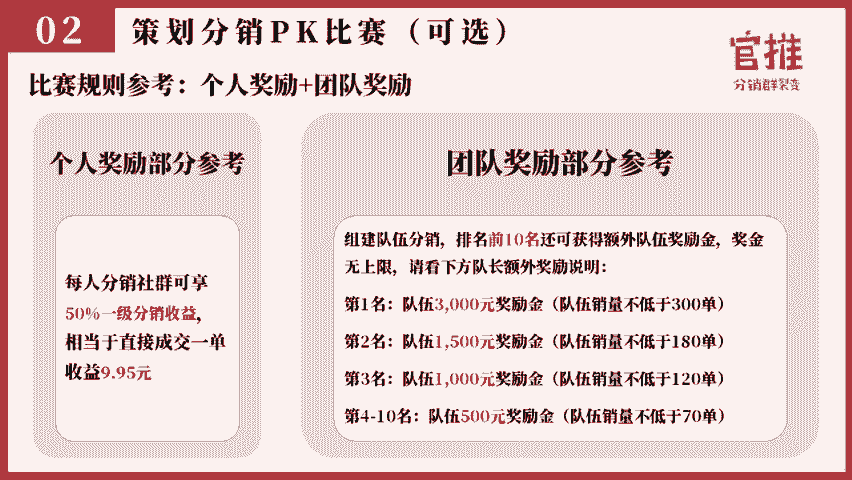

组队的具体的呃案例。大家可以看一下哈，就是。😊，分销组队的那个案例的话，比如说像这个PK赛哈，就PCPK赛的话，我除了让他就是可以有那个分销的团队奖之外呢，我还可以对个人进行这个奖励。

比如说你卖出多少单，我还可以额外再奖励多少钱。这样的话就是促进有一些用户，他自己明明呢只能卖卖卖五单。那我为了充十单，我可能就会更努力帮你去发。那有的时候我们做活动的时候，我们会看到哈。

有很多用户甚至于他会帮你群发一对一的好友，帮你推广这个广告。😊。

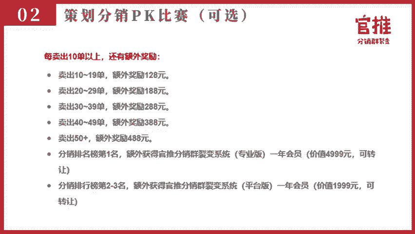

就你就会发现，其实用户真的就是激励给到位了，激励给到位了。有些人真的是愿意去帮你做这样的事情的。如果你不去做这样的激励的话，你可能都没有办法挖掘出来他这样的潜力啊。

这就是呃分销组队比赛里边的一些常用的一些规则啊，大家可以参考哈。

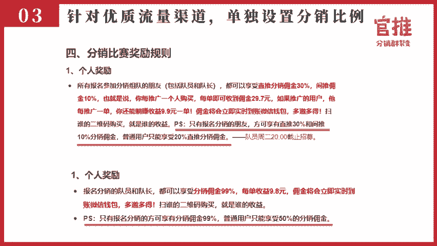

还有呢就是呃渠道的设置。什么叫渠道的设置哈，就是渠道的设置就是在我们在做那个刚才我说了，我们在做的时候呢，如果说你遇到一些非常呃优质的流量的大型的渠道，你那你可以给他单独去设计这个分销比例。

那促进他去帮你呃大量大量的一个发力和推广。像我这次其实我这次活动，我是有设分销这个渠道的一奖励的。比如说参与组队的人，我才可以给他30%的奖励金。然后还有10%的一个二级奖励，不组队的人员，我是不给啊。

😊，不组队的人，我可能只有20%的一个呃这个分销奖励就没有那么高嘛，对吧？这样的话就是参与分销的人，他会更加努力去帮你做推广，这也是激励了。就是帮帮你分销组队的人。

刚开始为什么要去参与你这个活动的原因哈。😊，好。那。这个呢其实在官推后台就是有一个添加渠道是可以设置的。不过呢体验版是没有这个功能的。专业版以呃就是平台版以上的话都可以设置渠道。呃。

但实际上如果你就是前面有多少种玩法嘛，你未必要用这个玩法呢，我就是跟大家说一下，有这么一个玩法而已哈。好，第四第四种方案呢就是隐藏这个分销按钮，让只有参与分销的人才可以看到那个分销呃增成记的分销海报。

呃，没购买的人是看不到这个分销提示的。就样呃帮你传传播分销那批人的话，心里面有没有什么意码。这个呢这个操作方案我先说一下具体的操作哈，就是在官队的后台是有一个按钮，叫做隐藏分隐藏分销按钮。

这个的话你打开之后，它就提交之后，就会在前端的那个活动页面就看不到那个按钮了。😊，啊，那么怎么去生成分销海报呢？后台是有一个专属的一个海报链接的，所有人都可以从这个海报链接去生成自己的专属分销海报。

这样的话你就可以直接用分销海报链接发给那个分销组队的人。然后这个呃没有购买的用户，他不知道你这个链接嘛，所以他就不知道你是有分销的啊，这个就是呃我们所设置的一些小技巧哈。然后呢已买的人已经买的人。

他关注了公众号之后，他会自动生成分销海报哈，所以呢就会促使他买的人去帮你推广他分销啊，这是我们呃也用过的这这样一种方式。😊，好呃，那下面的话我再继续举例子哦，就是最后一种就是额外对那个参与分销的人呃。

那个分销排行榜给他额外的奖励。这个就是我们之前做过一些方案，我直接把方案的具体的一个细节发给大家。哦，这个呢其实就是我们之前在做那个呃分销。😮，麦子的课的时候就是设置这样的分销比例的。

比如说呃呃这这这这。这次应该是我这个14天分销裂变时超赢的一个呃分销的一个奖励哈，就可以发给大家看一下哈。这个的话就是我设置的时候呢，就是有额外设置了一个排行的奖励。

就是你在排名第一名我还可以获得什么奖，排名第二名可以获得什么奖。然后团队排名第一名可以获得什么奖，团排名，第二名可以获得什么奖。然后呢，作为队长你还可以额外的奖励金额外的奖励金是什么呢？你超过多少份。

整个队伍超过60份之后呢，每多一单，你队长还可以每单都可以获得10元啊，这样的话就可以促使队长去带队嘛，促使队长去带着他们这个团队去冲刺嘛，就是我们在设置分销比例的时候呃。

最重要的一些呃就是刺激的一些玩法哈。呃，第二个呢是我在做那个辣漫能力圈，这个活动操盘的时候呢，也是用了一些案例，就是比如说呃排行第一名的时候呢，其实不一定要送自己家的东西。😊，也可以送送别人的东西的。

如果你能送一些实物啊，用户的获得感会更强。就是因为他能够收到实物，他还可以晒朋友圈嘛。嗯所以其实做分销的时候，你除了可以呃送他虚拟的产品哈呃现金哈，你还要给他晒晒一下他的机会。所以有一些。😊。

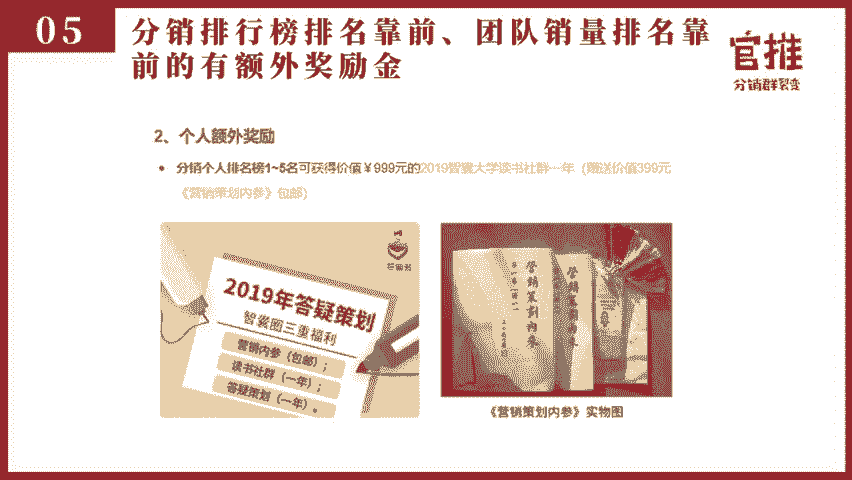

有一些分销的一个比赛的时候，在结束之后，还会给前三名和前三名团队还会额外去发放那个荣誉海报。我们这次也会设置就发放荣誉海报。这样的话他还可以发朋友圈，而且我们自己也会帮他去发。

这样的话就塑造了他在这个行业里面分销的影响力啊，很多用户也是需要的。哦，这个都是方案。然后具体的方案的话，大家是可以在完转社群六6回复分销方案。

分销方案就可以获取这个呃我们之前做过的一些方案的一个具体的方案了，可以去看一下。然后呢，还有一些其他的分销的细节，其实也可以在玩转社群六6后台回复分销裂变来获取。这是我之前整理过的一些呃内容。

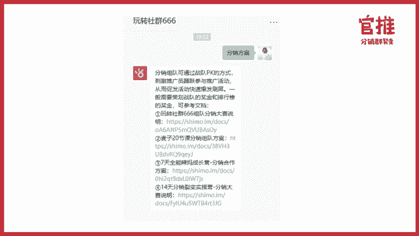

好呃，我们来讲一下，这是最后一个环节哈，就是第三个环节就是。😊，那用户来了之后，怎么去设置整个裂变的路径和成交率呢？

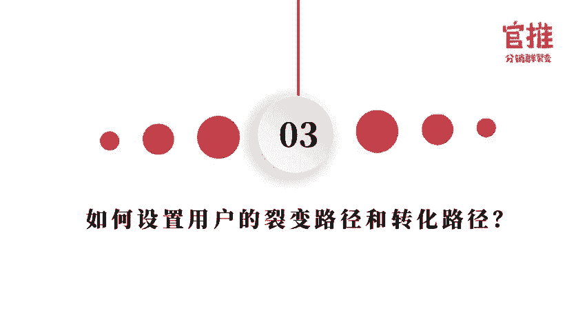

那整个成交路径呃，基本上的话，其实我们很多用户常用的比较粗暴的也是效果比较好的一个路径。就是很简单，让用户购买之后先进微信群，然后呢在微信群引导他分销，后让他去返现去推广就可以了。这个方式其实比较快的。

因为用户呢一扫码就进群了，他就可以获得感嘛。如果说他先加你微信，你再拉他进群呢多少呢，他会有一种就是那万一你啥时候通过我，你万一晚一点通过我他自己就觉得我好着急好着急。

就会有用户这么着急这次也会有这样学员，就是好像两分钟没通过他他天哪我买的东西他没通过我怎么办？他会有这样的着急心理。但是呢一扫码就能进群，他有立即的获得感，他会觉得马上取得联系了，他就放下心来了。

所以这个路径其实增长速度很快的路径。但是呢很多人其实做分销裂变呢，他很多时候是为了积很多时候是为了积攒自己的。😊，个人号粉丝的嘛。所以呢后面他会改变这个路径，就是先让他先加个人微信，以后再拉进群。好。

我展示一下，我再次展示一下，就是整个路径。大家可以看一下啊，就是我们之前做活动一个路径，就是用户先扫先扫海报海报之后呢进入一个详情页。详情页是购买购买之后呢，呃大部分用户会默认关注你的公众号。呃。

这个是专业版和机构版都可以绑定自己专属公众号的一个呃功能。如果是呃平台版和那个呃平台版和体验版的话，就是直接用官推啊。然后呢，最后就进群进群之后呢，就在群里面就引导分销。

然后公众号会自动弹出这个分销海报，引导用户去分销封销之后呢，那个佣金会立即到账，是整个这个路径，这就是完整的路径。

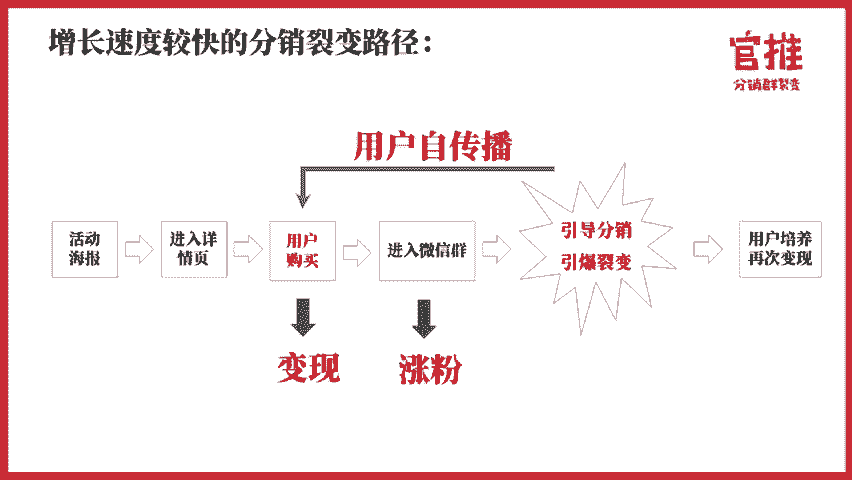

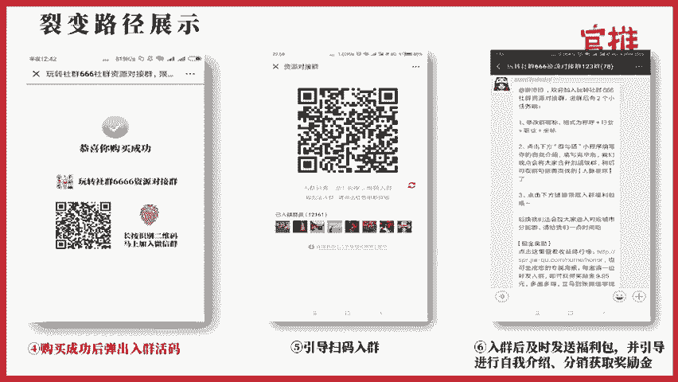

那么就是呃让用户先加个人微信，再拉进群。整个路径的话是这样子的啊，大家再看一下就好了。这个路径史实我在第一节课有讲过哈。好，我再详细讲一讲就是用户进群之后，就是怎么去成交这个成交路径怎么去设置。

这个路径的话，举支付费为例哈。因为我对这个行业是最熟悉的。😊，呃，其他行业其实做的是也做过，但是其他行业案例没有做那么多。所以我对支付行业和这个呃这个呃课程教育这个行业是比较熟悉的。

那么课程和知识付费行业的话，它是这么一个路径，就是用户进群之后。😊。

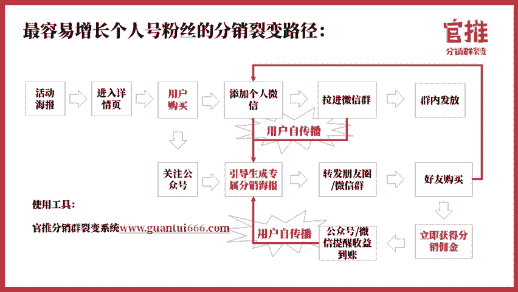

就是等待开课嘛，开课之后呢，就开始开始私聊一下用户，让让让让他了解一下用户的需求，学学习课程的需求，然后就开始开营。开营之后就是体验课程，然后要必营仪式仪式。必营仪式之后。

再私聊用户去聊一聊他学习的成果。然后呢，就开始在课在整个建好那个社群里边进行预购。预购之后呢，就开始启动一些促销的一个活动。其实就是针对这个群成员，专门设置了一个一个这个利润品。😊。

领导用户去秒杀去抢购啊，然后就开始转化，就是整个转化路径是这样子的呃，社群的成交一定要记得限时限量限时间呃，这个是非常重要的。否则的话呃，你的成交可能就不会那么好。因为他想着反反正我现在可能用不着。

我不用下单嘛。但是如果你有了限时限量限量，他现在不买就亏，就让他感觉这样的一个感觉的话，他下单的速度会快很多哈。

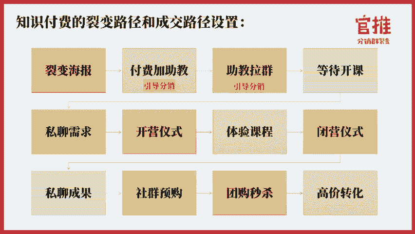

然后第二个的话是实体门店的，实体门店哈，实体门店的话其实跟支付费这个行业有点类似。但实体门店我还是建议大家先让用户加你这个这个你哈这个个人号要进行打造的这个人号的话，最好是嗯你要造一个。😊。

店长的形象就是你经营你你这个店经营的那个个人个人微信要有1个IP这个IP是店长呃，这老板年或者是老板老板嘛，就是店长嘛，对吧？那好好去打造一下你的朋友圈。然后呢，店长在拉群啊，因为用户加店长。

他整个心里跟加服务员的感觉完全不一样的，所以你你也塑造的话，塑造的好，就要加店长是效果最好的。😊，好在在群里面做社群运营，包括我之前说到的就是每周一个活动，或者说呃群内的一个呃就是运营。这个的话。

其实在第八天的时候，中午的时候，我会请琪杰老师给大家详细讲一讲就是线下餐饮业，他是怎么做社群运营的。然后引流，每天都到店两800多人呃，中午的时候，800多人的到店这样的引流方式。

他是怎么通过社群的方式来做运营的。到时候呢大家可以认真听一听第八天的这课程。第这个课程也是我们就是三天社群案例分享课的其中一节课啊，课程真的很干货，到时候大家一定要听啊。

就是那线下店的那个呃分销裂变的话，线上购买，它是要到店兑现的嘛。所以呢需要让户用户去到店兑现。然后再在社群里面去进行团购秒杀。然后进行社群活动，还会再结合店长本身的朋友圈运营。这样的话。

把整个逻辑成交逻辑走通的啊，所以在这里边的话，线下门店的话要注意一点，就是你自己要在社群里面的一个成交和秒杀，就是整个活动的节奏的把控。还有第二个的话是店长本身朋友圈的运营啊，好。

这就是今天课程的完整的内容了。我相信听完今天的内容之后呢，大家多多少少应该是可以了解清楚，就是在定价上面应该怎么去定价。然后呢，第二个路径怎么去路径。那分销PK比赛的话，大概应。

该怎么去设置你的分销PK的一个规则啊，那其实呢呃。呃，具体的分销规则，大家还是可以看一看我们之前做过的一个啊这个方案的，可以详细看一看哈。

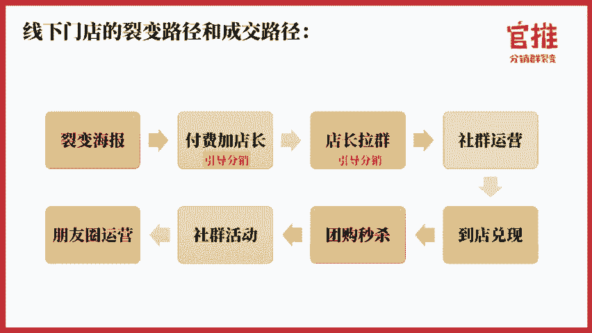

那这节课给到大家的训练任务是请在玩转社群666公众号回复分销方案这四个关键词来获取我们的分销裂变参考方案。并结合这节课的内容，确定你实战项目的活动价格和分销规则。好，那今天的课程就讲到这里，谢谢大家。

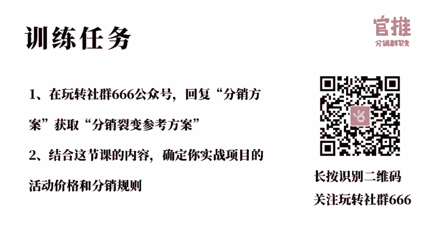

我们所有的课程都支持随时回看，大家可以在玩转社群66公众号菜单栏听课入口处进入观看。如果你学习完课程后，觉得课程内容对你有帮助，也希望你可以把优质的内容分享给你的朋友，也许能够帮到他。

点击玩转社群666公众号菜单栏生成专属分销海报，即可生成你的专属海报。有好友购买之后，你还可以拿到50%的奖励金哦。

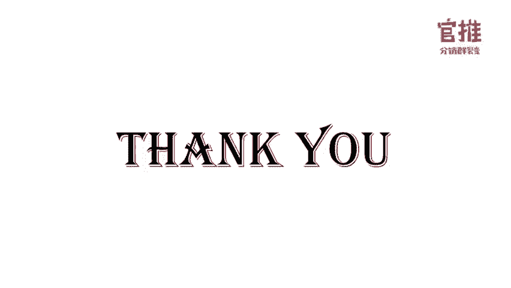