# 微社群裂变营销私域流量池增长秘籍创业运营销售获客视频课教程 合集 8套 374资料 13.1G 分销群裂变模式介绍及9大行业案例解析 - P5：第05节：如何打造刷爆朋友圈的裂变海报和转化率高的落地页 - 高端网创试错赚钱大师 - BV1Ux4y1b7xM

欢迎大家来到分销裂变实操系列课的第五课。今天呢我们一起来学习如何打造刷爆朋友圈的裂变海报和转化率高的落地页。

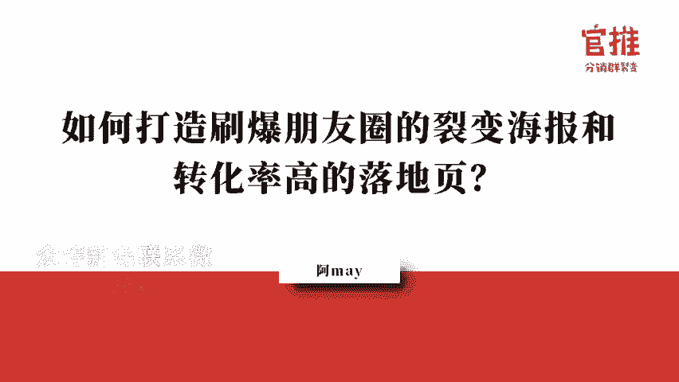

🎼啊，我们还是按照我们的惯例，在开始之前呢，我们先来复习一下我们昨晚讲课程的内容。🎼那昨晚的话给大家详细解析了在裂变活动的产品当中，呃，究竟我们应该怎么去定价才可能裂变的速度会更快。

推广员才会愿意去帮我们去推广。那在引流品的那个定价范围之内的话，基本上就是在60元以内才算是引流品超过60元，其实是不是领引流品了。🎼那在价格的定价上面的话，如以支识付费来算的话，其实支付费里边就是9。

9块和19。9块的价格会更加的呃容易引起呃用户的一个转发和裂变分享。但是呢有些用户有些朋友就说了，哎，有昨天晚上有个朋友说是不是价格越低越好，实际上真的不是的，这跟你产品相关。

就像我们说的蓝小二的火锅店，它定价是49。9块。其实49。9块对于一顿火锅来说，它价格就是很低的了。🎼所以并不是说你的价格呃低到10块钱以内才算是好。这跟你产品本身有关。

只要在60块钱之内的引流品其实都是OK的。呃，那就好比说我们在第二节课的时候说到有一个朋友说他拿奶粉来做引流品可不可以。那么奶粉其实高达就是几百块钱了，那就不算是引流品了，而是引客户进来店之后。

你再去引导他去购买奶粉了。🎼好的，那第二第二方面呢，我给大家详细说一说我们平时在做裂变呃分销裂变活动当中常用到的5种分销的玩法。第一种的话就是大家应该所有人做分销活动的时候呢，都是采用先采用第一种。

就是我的分销规则，对所有人都是公开的统一的。但是呢如果你要玩的好，其实是可以结合其他的玩法的。比如说。🎼比如说组织分销比赛，呃，拉一些战队和战战队的团成员给你一起去帮你推广和分销。

那么他们参与比赛的人员的话，还会给他额外的奖励金，这样的方式促使那些帮你推广的人，可以有更有动力去帮你推广。第二个的话就是去找优质的流量渠道。你单独给他额外的分销比例。比如说我统一对外是30%。

我可以给到这个优质的流量渠道售50%，甚至于60%。🎼那么还有一呢还有一种的话就是为了维护那种参与分销组队人的一个心理。那他可以我们的后台呢还可以支持将分销的按钮进行隐藏。

那这样的话就是不购买的用户看不到分销的提示。这样的话就是帮你分销推广那部分用户他就会大胆的去帮你推广，而不会让他觉得我在赚朋友的钱这样的心理。

🎼那最后一种的话就是我们在做分销组队当中经常结合一起来玩的玩法，就是呃额外给分销排行榜排排名靠前的团队总销量排名靠前的人，还额外给他奖励金。这样的话就会促使他疯狂去帮你推广。举个例子。

之前新事项那个分销活动的时候呢，他们就设置了排名第一名的人员是可以得到新事项价值50万的广告位的。🎼就是因为他给出这么大的一个诱饵，才导致了很多很多的流量方拼了命去帮他推广。

实际上这些流量方并不是想赚那点分销的钱，而是就是想要那个广告位。嗯，所以我当初记得是彪悍一只猫得到了第一名，他其实找了很多的资源去帮他推广。一个人就好像就干了几千单，甚至一万单。所以你想想。

如果你的排行榜的诱饵就是就是你排行榜的奖品设置的足够丰厚或者吸引人正是他们想要的话，其实他的促进效果是非常非常的。🎼呃，好的，非常滋非常刺激的。🎼好，那了解了前面的产品定价和分销的规则玩法之后呢。

我们再来梳理一下，就是整个裂变路径和转化的路径。那很多用户就觉得就是呃我最不清楚，就是我用户来了之后，我怎么去做转化。这个呢其实就是通过社群运营，或者说通过朋友圈的运营的方式，结合团购啊、秒杀。

还有发售啊等等这样的手段去转化和变现的。我给大家规划了大概的路径，但是具体怎么去做。这个呢在我们。🎼第十天的时候呢，会有分销王子给大家详细解析一下当初关建明老师是怎么在社群里面去做分发售的。

🎼他会用实际的案例，包括呃就是发售的具体的细细节、节奏和文案、话术等等这些东西详细剖析给大家，告诉大家。就是他们是怎么去做发售的，大家可以去做参考。好了，那复习完昨天晚上讲的内容之后呢。

我们就正式进入今天晚上的主题。那今天晚上主要是给大家讲呃裂变海报和落地页的打造。那我将会从以下三个方面给大家详细去讲讲解。首先呢是第一个，我们先来了解一下，就是你要做这个裂变海报。

那裂变海报其实是非常非常重要的一个载体来的。因为现在海报在整个裂变活动当中，它的重要性其实其起码占据了50%以上的一个重要性。

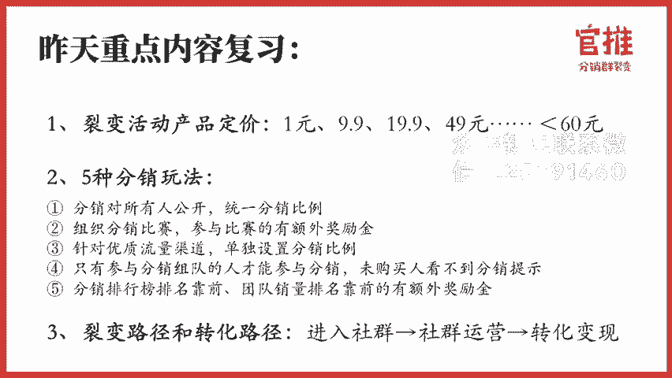

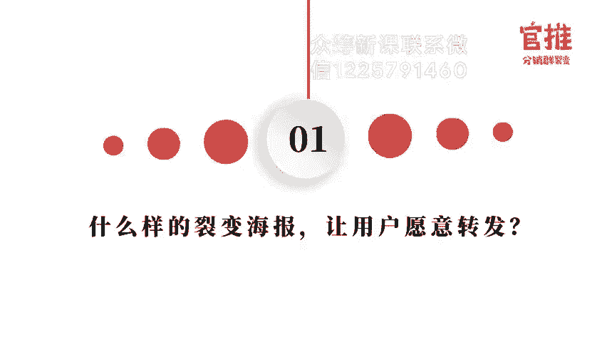

🎼为什么这么说哈？😡，🎼因为在朋友圈和群里面看到海报的人。🎼其实跟他看到文章的标题一样，他平均点开的动作一般不会超过0。3秒。如果你海报的信息引不起他的兴趣，他就立即会关掉海报。

甚至于他根本就不会点开来看。🎼所以呢你的海报吸不吸引人，其实决定了你海报传播出去之后，用户会不会进入你的落地页来进行购买。🎼所以那边海报是非常非常非常重要的，大家一定要注意注意额外的注意这一点。🎼那么。

🎼那么如果客户看了一下，哎，这个海报这个主标题有点兴趣，他就会点击来看看多几眼，停留时间呢就会延长到3秒左右，3秒之内的会做出决断，说要不要参加这个活动，那他会。

🎼发再花2到3秒的时间去寻找一下海报上其他的辅助信息来帮助他去做判断。整个过程耗时大概是8秒左右，一般呢不会超过10秒，这个过程就完全取取决于你做海报的制作过程了。所以我们可以说8秒决定你的生死。

决定你的活动和生死，就是说如果你的海报做的很垃圾，就算你有很多的资源去推广，你的效果其实也会大打折扣的。所以大家必须十分重视海报的设计，必须在8秒之内让客户采取行动去扫码进去。

🎼那么在呃说海报怎么去做之前呢，我们先来了解一下，就是用户为什么会愿意帮你去转发海报。

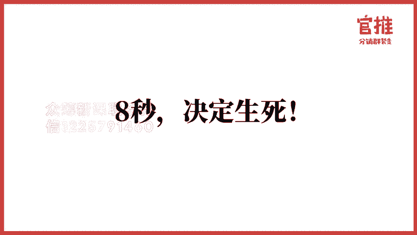

🎼他一般是基于哪些原因去帮你转发。那我总结了有5点。第一点的话就是利益诱惑。就是他帮我转发海报，有人购买，他可以赚钱嘛，或者会多者对应的奖品嘛，这个是最直接的，就是利益。第二个呢是可以提供他谈资。

就比如说很多人看到网易新金课的的刷品了。为什么他也发，就让大家觉得知道他也是圈子内的人。甚至于呢？🎼让他觉得就是我比大家知道的信息更早啊，提供谈资。第三种呢就是表达想法，就是什么意思哈。

就是相当于说我发到朋友圈里边，比如说我参加了一个，比如说我参加了一个时间管理的课程。那我在这个课课程参加完了之后呢，我再把这个分享海报，分享到朋友圈，就告诉大家呃这个时间管理真的很重要。我深受其苦。

大家如果不去学习时间管理的话，生活就会一团糟。建议大家都来学习学习啊。这样的想法表达的话，就是让大家觉得自己就是让大家觉得他自己其实很有想法的人表达出他自己想法，也给朋友的建议哈。第四个呢就是帮助别人。

帮助别人，就是哎我转发给有需要的人来看去学习啊。这个也是帮助别人。第五种呢就是塑造他的形象，有如很多人买了课程，他就会晒自己的入。🎼学通知书会赛制己上课的一个学习成绩。

这个为什么就是让大家觉得哎我很上进啊，我一直都在学习，我一直都不落后。呃，我是一个很上进的青年哈，大家快来勾搭啊，塑造他这样的一个形象啊，所以呢。🎼基于用户愿意转发海报这个五大动机哈。

大家一定要确定下来自己做海报的时候，你。🎼能够提供什么东西给到用户去让他帮你转发。就是你在做这个海报的时候，要不的话，你就是可以给提供给他谈资，对吧？去做刷屏的课程。

或者说你可以提供一些让他去帮助别人或者说塑造自己形象的一些东西。那在这里的话，其实呃做知识付费的课程。大家去转发的时候呢，就比较呃没有那那么大的心理压力。如果是买产品的话，可能就会有心理压力了。

就是你做产品分销跟做课程分销最大的区别是在于这里的。就很多人转发课程，他心理压力没那么大。因为转发课程对于他来说，第一个他可以塑造他的形象。第二个的话是可以帮助别人。

就是让他让让别人觉得他是一个很热爱学习的人，然后呢转发给其他需要学习的朋友。这个的话它的转发动力是比较强的。但是如果你是卖实物产品的话，他去转发的话，那只能有一种一种的话就是他觉得这个东西真的很好。

然后呢，我推荐给需要推荐给其他朋友。第二个的话就是觉得这个东西真的很便宜，很性价比很高，我才晒出来，就是这两种动音，动音可能会更合适啊，当然了，还有赚钱的动音哈，就是这三种。在这里的话就是知识付费产品。

就是会比那个实物的产品，它转发的动力会更强的啊，这里这也是为什么我们做裂变引流活动的时候常常采用知识付费的产品的原因啊。那么基于上面的五大动机的话，就确定下来，就是其实变海报其实是要有两大原则的。

第一个的话就是说人话。什么叫说人话？就是你的裂变海报，说出去的一看就用户一看就看得懂，不要弄那种文绉绉的语言哈。第二个是有逼格，就是昨天晚上我也说了，用户转发你的海报。

如果转发到朋友圈会觉得哎这东西那么low，好像在损坏我的形象，我是不可能转发的。

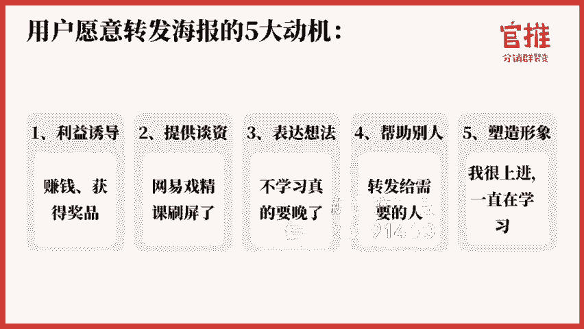

那你这样子的话，就是你做那个海报比较low的话，会让客户觉得转发朋友圈会损坏他的形象的话，那你这个活动肯定是没办法列起来。所以裂变海盗两大原则非常非常的重要。说人话好有逼格，就是你的海报的那个。

那个主题最重要的是从用户的角度出发去去阐述。那在我们第一天的时候，我也给大家详细说了一下，详细说了一下我们自己在设计海报时涉及到的五大原则。

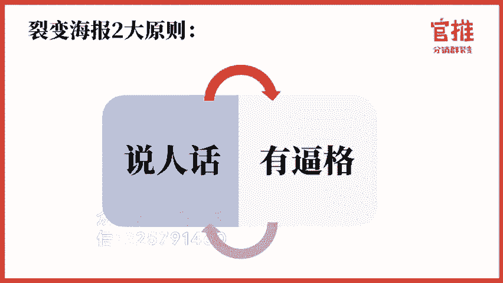

我们自自己在设计海报的时候，五大要素非常非常的关键哈。第一个的话就是信任背书。这个信任背书呢是去续去采取了分享者的信任背书。因为是他的好友又告购买嘛，所以要把分享者的头像和昵称放上去。😊。

第二个呢是主标题，主标题一定要大。这个你在呃朋友圈或者说在社群发到微信群里边，你不用点开它，你都能看得清楚那个主标题，这样才合格。呃，如果说你没没办法看得清楚，就是没点开的时候没办法看得清楚的话。

这个海报一定列不起来。因为人家刷朋友圈刷刷刷就过去了，可能留给你的海报的时间只有一秒钟，但是我都看不见你，我怎么可能去注意到你呢？虽然我看到你发了一张海报，对吧？但是我看不到你的内容啊。

第二个的话就是你的文案一定是用户的需求点，不是你的产品介绍。就比如说我我这次的实操训练实操营，我的海报的标题就是14天搞定裂变和那个成交，而不是说14天分销裂变成实操营。

14天分分销裂变史操营是我的产品。但是它不是用户的需求点，就是用户不一定需要这个实操营。我需要说服用户去参加的对吧？所以呢用户需要的是什么？我需要搞定怎么去做引流，怎么去做裂变，怎么去做成交。

这个是用户的需求点啊。第三点的话就是要解决具体的问题，具体一点，不要大额全。就是像那种哈就是呃一下子说出来就是呃。呃，如何成为一个美好的女人？😮，如何成为一个嗯就是那种很泛的标题，一看都不知道你讲什么。

就太泛了。😮，一定要更具体戳重他的内心，切切记大而全。第三个的话就是内容介绍。内容介绍的话就是要罗列好处，不要堆弃你的产品信息和痛点。你一定要告诉大家，我我看了这个东西，我能得到什么。

就是用户看了这个海报，我能知道我能得到什么，而不是说你你有什么，明白吧？还有信任背书，就是要找一些大平台的平台合作，或者说打SR大咖的背书之类的，就是信任背书，还有呢就是促进购买呃。

限时限量价格锚点和短期的利益。这个昨天我们都说过了，这一批的话我就不详细说了，因为我们后面还有其他的内容啊。😡，好。呃，因为呢那个海报设计里边的话是有很多内容可以讲的。比如说文案呃。

比如说呃海报本身的色调的设计啊等等这些。那我今天的话最重要的是让大家快速去掌握。所以呢我是给了很快速快捷的方式，过程给到大家，而不是说让大家从头到尾就是我学习我怎么去写文案，我怎么去呃策划。

这样的话就太慢了。那么首先我们自己在做设计海报的时候，是要经过六步的，缺一步效果都不好哦，就是可能很多人自己去设计海报的时候，觉得很简单。就是哎不就是告诉找一个设计师，或者说自己亲自上阵。

然后呢把那个文案一写，然后呢让他们去设计就可以了。实际上你如果只是那样去做，你就是很普通很普通的海报，你很难裂变开去。哦，你是要经过这六六个步骤，你才可能你的海报裂变出去。

所以我们叫做设计裂变海报的六大步骤，缺一不可。

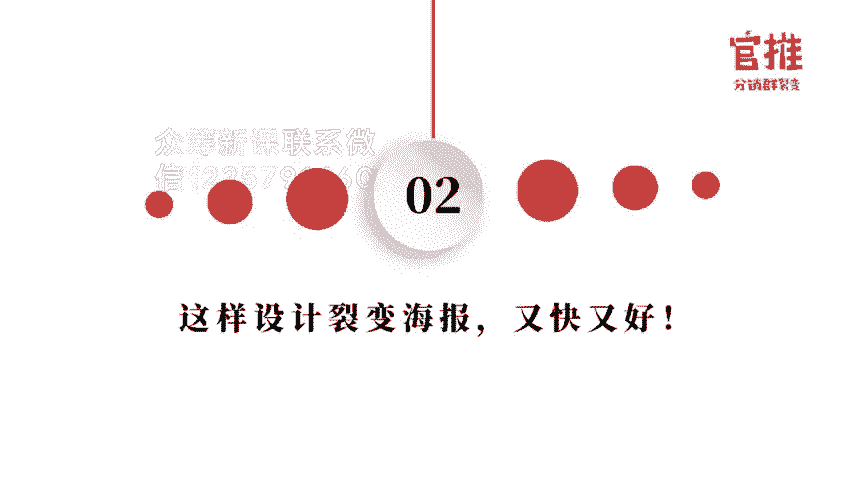

首先第一步是收集资资料。这个下面我会详细讲哈。第二个的话是选择海报的模板。第三个的话是写文案，然后呢进行设计，然后呢继续进行用户调研，再迭代的去修改。好，整个6个6个步骤。其实在做海报设计的时候。

我觉得最快捷的方式其实就是模仿加微创新。就是这是最快捷最快捷的方式，你不要自己从头到尾来学习，你就去模仿加微创新。这个方式是最快速的。😊。

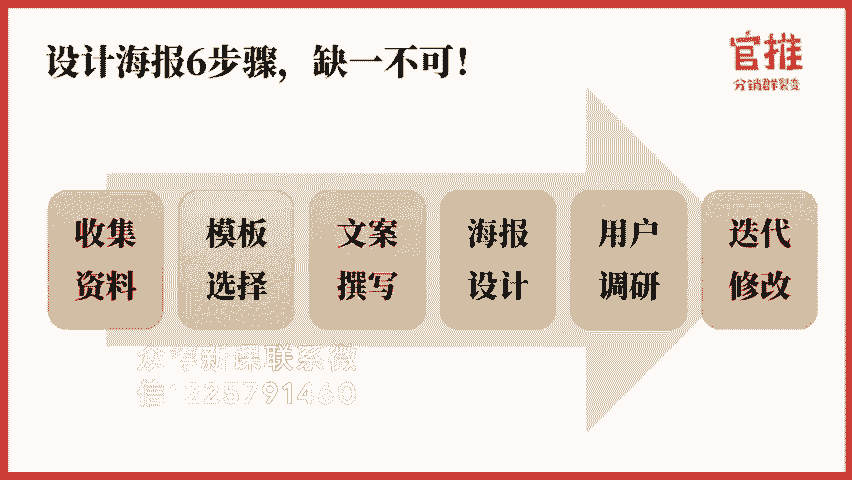

首先，怎么去模仿，怎么去微创新。

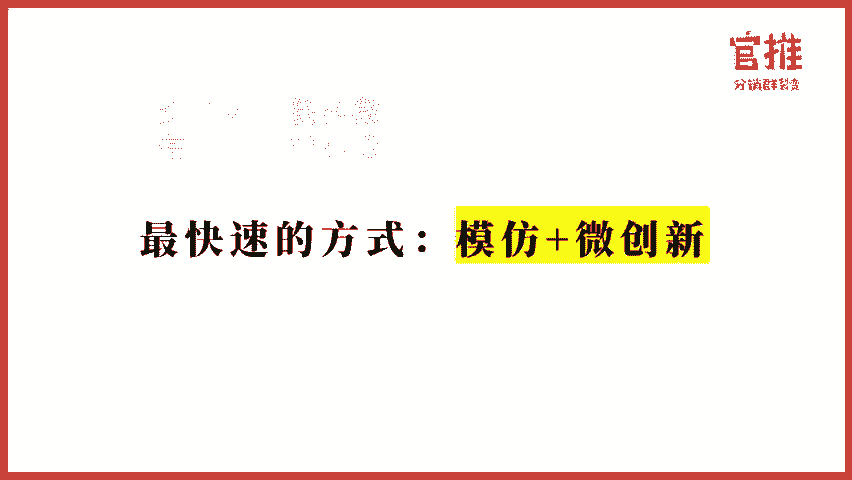

第一个就是去收集资料，你要学会站在巨人的肩膀上，就是说你自己不一定是文案的大牛，或者说策划的大牛，但是已经有大牛在前面，我学习他们，我跟大牛最top顶级的大牛学习，那我就可以很快的成长起来，对吧？

那我以课程为例哈，因为我做的比较多的就是课程啊。首先可以去什么？你在做一个活动的课程的之前，你可以先去市面上收集所有同类的课程。然后呢参考它的主题有哪些卖点和主打用户哪些痛点。

这个的话可以方便你快速快速的定位到用户的痛点和要呃打哪些点，会让用户注意到。那比如说一些呃其他的一些呃知识付费的平台。比如说千聊荔枝微客喜马拉雅这些呢都提供搜索的功能，你直接去搜索，然后按销量来排名。

销量排名最靠前的那基本上它的卖点的题炼呢，大纲啊，抓用户的痛点呢都是抓的比较好的那如果说你有行业内的呃这个app，它也有知识付费平台的话。😊，那就更好了。比如说宝妈人群，我之前做辣妈能力圈的案例的时候。

我就去挖什么挖那个宝宝树，妈妈帮，还有那个反正挖了好多，就是类似于呃还要去这个凯叔讲故事啊等等啊，就是靠谱爸妈啊之类的哈这些平台上面他们知识付费的课程，然后看他们销量哪些高。

然后去抓住抓出他们的痛点出来。然后第二步呢是什么？你第二步呢就是把这些课程的主题和卖点，和后他们的大纲整理出来，就是多个版本罗列出来。然后呢，你去。去去汇集，看一些他们都用到了哪些主题，哪些卖点。

这个就是用户最关心的。呃，既然大家都用，肯定是有一些东西是触动到用户的。正在收听快联系微信客服1225791460竟从步更新群不更新群。那么你就可以模仿的他的一个主题和大纲，先把内容做出来。

就是然后呢再给到老师。这样的话速度是最快的。因为很多老师他虽然自己有专业度，但是他最做客，其实是可能不太了解怎么去做课的那你可以提供这些讯息给到他他就可以快速去定位到哎我要讲哪些内容啊。

这个内容我怎么去讲更专业，这个都是老师的范畴了，但是很多老师本身因为他自己没有营销和运营的这个思维，所以你如果提前做了这些内容给到他的话，他的效率会就会大大的提升。那么之前呢我上过阿和私房课。

阿和私房课呢有一个知识付费质检清单，非常的好。在这里的话也发给大家，就是呃在好课程的标准上是分为这5个部分的，就是定位吸引力面。受众面效果传播性这5点，你自己按照上面所罗列的东西去去进行质检。

看一下你选出来这个主题和大纲是不是真的符合了这5点。如果符合的话，那这个课程肯定是好课程了。好，收集完大纲，还有那个主题之后呢，接下来我做什么？就是要收集其他人做的裂变海报。

就是市面上其他人做的转化率高的裂变海报，你自己要收集起来啊。

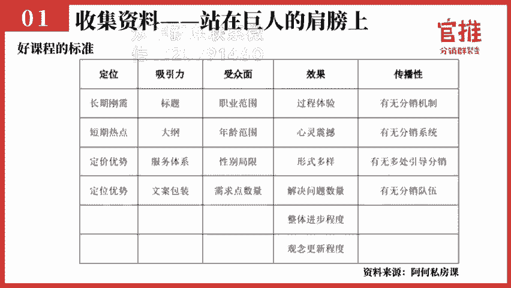

不管是你这个行业的还是其他行业的，都要收集起来，他们总是会有一些共同点的。那当然我肯定知道大家可能在前面没有去做这个事情哈，我是习惯去做这个事情的。我一旦看到朋友圈，有人哎，一直在转同一张海报。

我就会随手就把它保存下来。😡，那么希望后面哈大家在做这个就是自己在做朋友圈去刷朋友圈的时候，你一旦发现有这样的现象。很多人都都在同传同一张海报的时候，你不要觉得烦你首先第一个理念应该去想，哎。

这个到底是怎么一回事，我去分析一下，我去拆解一下啊。然后把这个海报保存下来体验一下他的活动流程，这个是一个呃说说实在话，这个是一个操盘手的一个基本的数字，就是拆解，是他的基本素质。

很多人的时候并不是自己想出来流程，而是结合别人的流程，然后呢加一下自己之前做过的经验，然后进行微创新，可能你效果就会出来了。那我之前呢有整理了这个裂变海报的合集。

那今天大家在玩转社群66公众号后台回复裂变海报就可以获得我之前整理的这个合合集了。我帮大家准备好了。😊，那好，准备好这个合集之后呢，就是前面我们收集了别的那个海报了嘛，对吧？

那么当我们真正做自己的活动的时候呢，这个时候呢大家就要选择合适的模板，就是从你的海报库里边挑一些跟你这个主题，或者跟你这个内容比较契合的海报。😊，比如说我们这次训练营的课程的时候。

我们当初在做这个海报打造的时候，就会选择对应的模板。比如说哎红色的海报哪一些可以参考黄色的海报，哪些可以参考黑色的海报哪些可以参考大家呢去根据这样的一个思维去选出海报的模板。呃。

这个有一点非常非常的重要，就是很多人去跟设计师沟通的时候，需求没有阐述清楚，导致呢设计师设计出来之后呢，很多需求变动来又变动去。那如果是高效的沟通是什么样呢？高效的沟通是说，第一个你找好模板。

抄找好可参考的东西给到设计师。第二个你设计好的那个文案分模块，哪一个模块应该讲什么内容啊，分模块告诉设计师有哪哪几个模块，这样的沟通才是比较高效的。如果你提前告跟设计师去沟通的时候。

什么都没有跟他说清楚，就是告诉他我要做这么一个事情，然后文案是什么，你帮我设计一下，他做出来的东西肯定有可能就跟你预想的结果就会差很远。因为你根本就没有给他一个锚定点，这个锚定点就是你给的案例，知道吧？

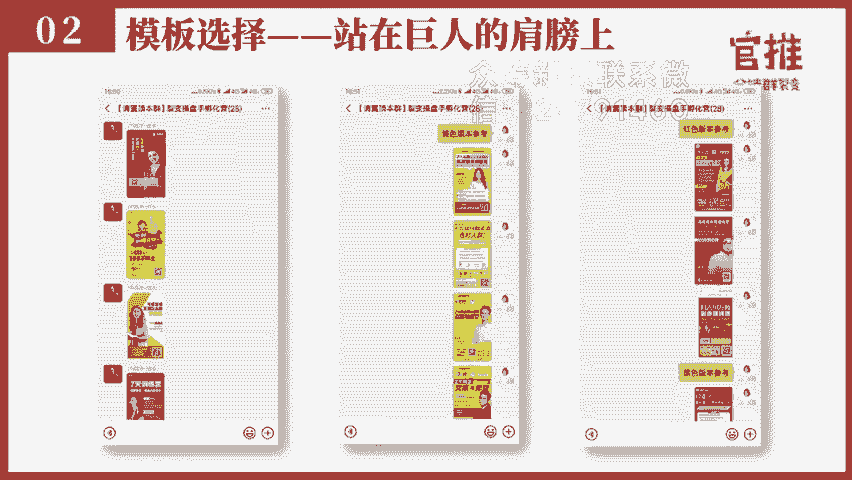

好，选了海报的模板之后，我们接下来就要进行文案的撰写了。那文案的撰写怎么去写呢？其实我自己其实刚开始的时候也不是文案高手，我自己之前写文案也是渣渣，说实话真的是渣渣，但是我是有技巧的。有一些技巧。

我今天就是完全是把我自己在做的一些实际实际操作的案例和技巧分享给大家。首先呢怎么做？先把那个热门的关键词提炼出来。你可以通过百度指数5118呃微信指数这样的工具，把相关的热门关键词记录下来。

百度指数真的是一个非常好的工具。你去搜一下对应的关键词，比如说我这个案例就是减肥，你搜一下减肥。然后呢，它有一个。😊，需求图谱需求图图谱下面呢是有一个时间轴是可以拉动的。

你可以看到减肥这个关键词在一段内。时间内用户最关注哪些点，你就可以把他关注的重点的关键词记录下来。这是第一个这些关键词往往就会成为你海报主题上的重点关键词。因为这些关键词就是用户最关注的东西。

第二个呢要给大家推超级推荐的一个工具，叫5118的需求图谱分析工具。这个工具真的很好用啊。你出一个关键词，它会给你分析出来呃，通过百度搜狗，还有那个微信、新媒体、微博等等这些平台结合起来的高频词是什么？

比如说减肥高频词是高减肥药。然后呢，其此其此外呢是那个什么期间夜晚上减肥效果。什么埋线减肥在这个减肥的样本出现多少次之类的。他这个他这个就相当于快速帮你提炼出重点的关键词。你要注意的了。

我再展示另外几张图示给到大家，大家一看就会觉得哇，这真的太省功夫了。以前你分析的话，可能会花很长时间。但是现在你可能就需要一输入马上得出答案出来，就分常非常的方便。

再比如说像现在这个你看你可以看到它的关键词数据当中与其相关联，就是减肥最关联的是期间和晚上。还有呢就是。关根据关系举证分析，减肥跟那个减肥药啊，还有期间做法这些有必然的关系。

还有呢跟有害和身体这个呢关系也比较比较大。它当然还有其他一些关键词哈，大家可以详细看一下。😊，包括就是用户在问减肥相关的问题的时候，常用的疑问词是什么啊？还有呢。对应的这些标题呃。

然后呢关注的内容的结果。你可以看到真的非常非常的详细，而且呢快速帮你定位出来，是不是非常非常非常好。第二个呢是找热门的，就是把热门的关键词记录下来之后呢，接下来我们就是要把热门的关键词组成标题嘛，对吧？

但是很多时候我们也不是文案高手去写标题对我们来说还是快困难了，对吧？那这个时候还有一种方法，就是你去找热门的标题和热门的文章出来，好，我举个例子哈，就去呃那个搜狗的微信那里去搜索减肥两个词。

你就你就可以得出公众号的文章，就是公众号的文章，往往就是用户关注的标题嘛。然后呢找出阅读量高的文章，就是可能就是用户比较关注的那些主标题了。可能往往这个标题就可以成为你海报的标题啊，我经常用这招哈。

非常好用。但包括百度也是可以，就是直接搜索这个标题，然后在宝度一看啊，就可以得得到这对应的标题，就别人已经帮你想好标题了，只是你去搜一下，把它的个标题挖出来。😊，啊，还有一个呢就是新榜有数。

新榜有数这个工具呢，就可以帮你去把就是阅读量最高的文章去进行排序，这个也是非常好的工具哈。那找好那个前面的热门关键词和热门的标题之后呢，接下来我们就可以遵循这个黄标题黄金的关键词法则来进进行组。

就是组合对比你的标题了。往往啊海报的标题，你不要只写一个，如果你只写一个的话，其是就没有对比嘛。如果像我们的话，我们一般会写10个或者说5个以上的标题。然后呢再去进行呃找用户去做调研和对比。

这样的话才能发现出效果最好的是哪一个。呃，这里的话举个例子哈，就是黄金关键词的法则真的很好用。这个是阿和斯方克里边的质检表来的哈。就是比如说有一个标题叫如何写出让用户喜欢的营销文案。😊。

如何写出让用户喜欢的营销文案，这个是不是已经是痛点了？是痛点了，这还可以更好。就是这里边的话，如何写出让用户喜欢的营销文案，他缺了一些东西。比如说他缺了，如果他加上数字。

加上数字就变成什么实招写出让用户疯传的转化文案，这样的效果就会更好。营销文案跟转化文案来说，转化关键词会比营销更有。激就是冲击力。然后呢，疯传两个字比那个喜欢更有紧迫性哈，更有场景化，是不是？

所以呢你结合这两个。这个两个标题来对比一下黄金关键词法则里面的东西。然后呢，你可以任意挑选。比如说我要三个，比如说数字对比和效果，这三个关键词写一条标题出来。然后呢，热点积雪写一条标题出来。

明星京剧写一条标标题出来，这样的话你就可以起到很多的。这样的话你就可以起到很多很多的标题了。

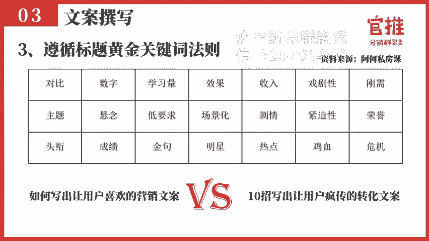

好，那起完标题之后呢。接下来就是海报设计了，那我们就要给到设计师去设计，对吧？那那么很多人在设计的时候呢，会有几个点，他自己不太了解的。第一个的话就是海报到底选什么颜色好呀。

选黄色、红色、白色蓝色还是黑色呢？是吧？😊，第二个的话就是呃。还有其他的排版的、字体啊，这些都不知道选哪个好。其实这里边的话就是我给大家一个一些参考的方案哈，就是配色上面的话，在做裂变海报当中。

我们经过测试暖色调是比较容易引人注目的。黄色、红色、橙色，它的扫码率会更比较高，尤其是电商，还有就是付费行业也是如此，就是色彩相亮丽一点的颇一点的。😊，它的那个色调会更引人注意。那如果你是家居风格的话。

可能就是简约高达一些哈。因为要讲究设计感嘛哈。啊，所以你自己在配色的时候，要不的话是跟你的主logo啊，色调保持一致。第二个的话就是可以选择暖色调，这样的会更显人肃目一些。第二个的话是排版。

排版上要有层次感和对对齐就是很多设计师啊，他这设计的时候，海报就没有高级感，就是不好看，不好看的原因是在于什么呢？其实在排版和层次上，比如说有些海报，你如果加一些几何的元素，它会就会显得很有高级感。

它这个海报的设计就会瞬间就上了一个档次，就是加一些几何的元素，就是有了层次感嘛。第三个的话就是非常大家非常要注意一点，就是你用的字体，一定要用可商用无版权的字体。

不要让那不要用那种呃就是不要用那种需要去购买的字体，说不定你做了一张海报发出去推广了，改天那个什么。方正就会找上门来说一个字要赔2万块钱，所以大家一定一定要注意字体一定要用可商用无版权的字体。呃。

到时候呢大家可以在玩转社群66后台回复一下无版权这两呃或者是回复一下字体两个字，我会整理一下无版权可商用的字体给到大家好，大家到时候可以回复字体两个字，在玩转社区后后台，我会给整理给大家。😊，好。

这是海报设计的时候最需要注意的。

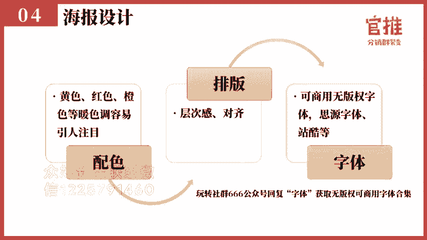

好，那在海报设计上面呢，其实在前面的话，一般来说就是你把海报的那个文案写出来之后呢，其实你要做一个海报的原型给到这个设计师，这样的话，他还会知道你大概的排版想要的样子是什么样子的。呃。

我一般呢推荐大家先用那个PPT或者说呃磨刀这样的工具去把海报原型画出来。就是那如果你实在不会用这种工具也没关系。你就用那个手写也可以。你看我们这次做那个训练营的时候，在前期的那个孵化的时候呢。

就有一个朋友直接就是用那个笔直接就画那个原型图出来。那设计师一看大概也知道你大概是想要什么样排版的。就是首先要有一个框架图出来。你没有框架图的话，设计师在做的时候。

可能很多时候就跟你想要的东西就是有区别有有差别。😊，那在海报设计上，其实我最推荐大家是首选找专业的设计师来做。因为呃毕竟一张海报，他其实找专业设计师也就几百块钱嘛。

但是他专业设计师做出来的海报的效果就会比你自己就是胡乱去做的效果真的是要好很多，而且呢档次也会高很多。所以大家就是如果能够有这样的预算的话，还是推荐大家去找专业的设计师。但是如果你实在没有预算。

那你就可以用创客贴这样的在线设计工具。我们光推的后台是可以直接选择在线的模板来套用的，然后你更换一下对应的文字和图片就可以了。上面呢也会会有不少的模板。

你直接搜索一下对应的产品名字就可以有出来对应的模板，然后更换一下，点击完成编辑就可以生成这个海报了。再还是在后台是可以有的那么设计海报就是设计师做完之后，接下来怎么办呢？那你就可以去找用户调研。

就是你先不要去往外推，就是海报出来就不要马上就往外推，先找用户调研问用户几个几个问问题啊，这是我给大家调研的时候可以参考的问题。比如说先调研一下他这个文案的吸引力呃，问一下用户，就说你看到这个海报标题。

你会有想解会学习的想法吗？第二个问他的吸引力就是比如说我这个课程收费1几。9块，你会不会下单购买，一定要问他愿不愿意花这个钱去买啊，这是判别你这个吸引力的。然后第三个辨识度。

就是你看得懂这个海报的标题讲什么内容了吗？然后呢，裂变度就是如果转发给好友购买，你可以获得分享奖励金10块钱，你会不会愿意转发呀？还问他你的动因是什么？你为什么愿意转发是基于什么原因啊。

通过这样的调研一轮下来找十几个20个用户调研下来，你就可以很了解知道的。你这个海报本身的一个吸引度，这个标题的吸引度怎么样？海报的一个整个活动的一个吸引力怎么样呃，他的裂变点呃合不合适。

这些呢就是可以调研出来了。😊。

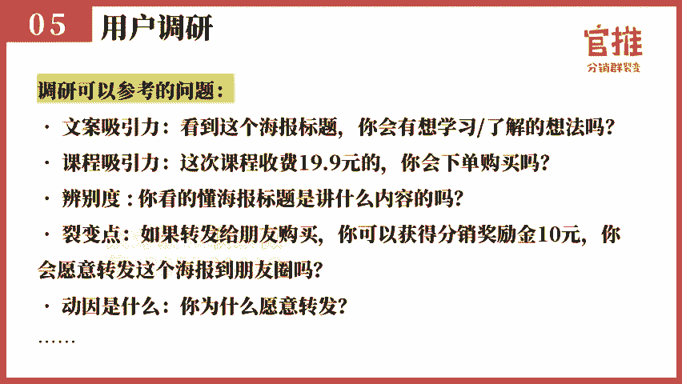

好，调研完毕之后呢，就根据调研的情况呢，继续做迭代和更新。我们每一次做活动其实都是按照这样的思路去做的。很多人是没有做调研的，你不做调研，你根本就不知道活动的效果。

很多时候呢你到了你活动真正推出去的时候，你才会发现就是啊原来这个活动报起来，我找了一堆人帮我推广，转化率很低，大家都没有信心推了一推就不推了，就是这样的，所以大家一定要注意调研，不要去忽略了。

这个非常重要。那在最后呢也给大家一些心得。就是第一个你海报的设计是要尽快确定下下来的。因为你落地页和ban图的设计是以海报的风格来做一参考的。第二个的话，海报的各个位置的那个文案和样式，可以先确定。

然后呢再去确定特定的文案。这样的话，其实在它的一个效率会更高。还有最关键。最关键的这个不管是在文章、新媒体里边还是海报和落地页上都是很关键的，就是一定要核对清楚他的文字是不是有错别字，这个就非常重要了。

还有呢就是用户的声音是最重要的，就是你去调研的时候啊，可能很多时候你自己觉得好的标题，用户不喜欢用户不认可。还有呢你自己觉得海报的颜色很好看。但实际上用户觉得那张更好看。实际上你要听用户的。

不要听自己的，你再有经验的人，其实也不能把握好每一点要听用户的哈。😊，呃，还有一点呢，就是很多人做海报出来之后呢，自己就在电脑上看嘛，在手机上自己点开看嘛，就没有测试过它真实的场景是怎么样的。

你一定要做海报出来之后呢，自己真的把话术和海报发到朋友圈，看一下在朋友圈的效果是怎么样的。这个很关键哈，很多人其实没有去测试过真实环境海报，在朋友圈里边能不能看得清楚。所以呢你自己在做海报的时候。

一定要注意要把这个呃场景真实的复原，看一下真正的效果，这个是非常非常关键的。😊，那最后呢就是有很多人在做裂变活动的时候，往往呢不只是做一版海报。那我们自己做活动的时候，往往也会做多版海报。第一来的话。

因为你自己再有经验，你其实也不知道真正就是会列起来的海报，它的颜色应该什么配色。然后呢它的那个主标题或者说它的版排版是哪一种会更合适。所以呢我们会做多款海报做AB test。

那新现在的话就是光推刚刚新上线的一个功能，就支持多张海报数据追踪。这样的话你就可以看到对应每一张海报，它的点击力。

就方便大家去做A test以前的话可能我们就需要每一次都是一张海报去做测试就很很不方便嘛。那现在的话就是可以直接在后台直接看到每一张海报对应的点击力了。呃，大家可以看一下，这是我们这次活动的效果。

就是有一有一段时间它的一个海报的点击率。其实我们做了三张海报是三个。😊，师做的三个设计师做出来的海报的话，就是我觉得都很好看。而且呢我我自己个人觉得就是黑色和那个橙色那一版的话，从美观度上是最好看的。

实际上真正的转化率的最高的点击率最高的是红色的海报。😊，好了，那讲完前面的那个海报之后呢，我们接下来讲落地页，就是其实落地页呀，其实就是销售员，就是他就是网上的销售员，呃，落地页其实相当于是什么呢？

相当于说用户进来你的店了，就是他扫你的海报进来进来你落地页了，那你得给他介绍你这个产品的一个情况。那你就需要去告诉他哎，我这个是卖的是什么呃，为什么要买是吧？然后呢呃为什么要相信我为什么要现在下单啊。

要要促进他马上去下单和购买。所以呢落地页。😊，最最重要的实现的两个目的就是第一个你要把你的价就是产品的价值可以提供给客户的价值展示出来。那往往是通过以下这几点就挖他的痛点，然后呢再给出对应的解药。

就是你的产品解决方案。然后呢再用你的案例来说服他，告诉他。告诉他我们是真的是可以做到的。然后呢，再列具体的数据，告诉他，我们又帮别人做到了呃，通过这样的方式把你的产品的价值展示出来。第二个的话就促成交。

促成交的话，就是要给出对应的这个马上下单的理由呃在这里边的话给一些数据给到大家。因为很多人自己在做活动的时候，不知道大概什么样的一个线才是合格线呃，其实在知是付费里边呃，包括在实体商品里边呃。

如果说呃成交率的话，主要不是说你自己的分销比例特做的特别高哈，或者曲线特别的精准哈，基本上是13%是合格线。就低于13%的话，说明你这个落地页的转化率太低了。你需要去优化落地页的一个价值。第二个呢。

如果你的落地页能够超过20%，那你就可以放心的去拿那个呃去谈大量的渠道去啊。超过20%，他的一个这个转化率就是比较优秀的。那我们做过一个活动，它的付费转化率可以高到68%。

所以其实如果说第一个你取道精准。第二个的话就是你的落地做的好，海报做的好的话，你转化率是可以提高上去的啊，一定要不断的去优化迭代更新更新哈。那在落地上面呢，我直接给一个呃结构给到大家。

这个结构呢是呃一个呃之前我们跟自星球合作的就是运运营深度精选，他们团队操盘的一个案例，叫做如何打造百度爆款付费社群这么一个课程的一个呃整个落地页的结构。

大家可以看到哈这个落地页它的付费转化率的话是在34%。😊，常规的一个落地页的结构。常规的落利结构就是勾起痛点，导师介绍课程大纲，你会收获什么常见问题、合作伙伴大咖推荐和学员评价。在。他的那个落地页的话。

他改进了几点。第一个的话，他加了一块，看看身边的人就是身边人的案例来引起他的注意。第二个的话加了一个适合这样的你，适合这样的你的话是激发他的兴趣了。然后呢加了一个已有多多少人建立了社群。

这样的去引发用户去从众心理哈，促进用户的这个行动和增加他的信任感哦，这是这样的结构。我我推荐大家是可以参考这样的结构来进行落地页的一个设置的。😊，那同样在落地页的制作的整个流程上面。

其实大家也是可以参考我们刚才做那个裂变海报的整个流程呃，依然是收集材料模板选择。

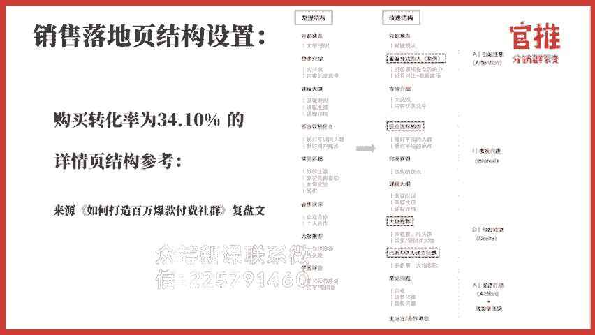

文案的撰写，然后呢设计排版，用户调研迭代修改。呃，但是在这里边的话就是呃有几个重点我就重点讲吧，就不详细去细说了。因为其实思路跟刚才我们做那边海报是很类似的。

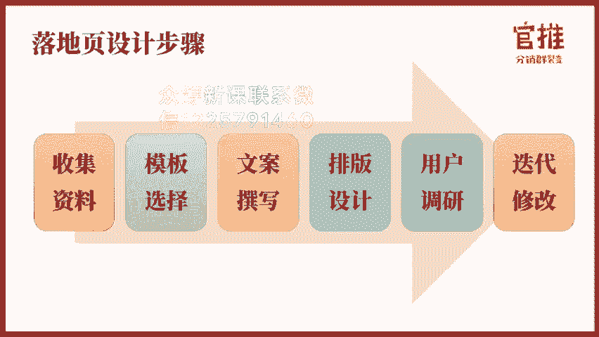

这里边最快速会快速的方式还是我们刚才那一招就是模模仿加微创新。那首先的话，你在刚开始的时候，你就要注意了，你自己要做活动，你就先要收集竞争对手同行，或者说其他的呃异业做的比较好的活动。

然后呢去搜索它销量高的转化率，它是怎么写的？就是还是站在巨人的肩膀上啊，做我们自己的活动。在这里边的话，我依然是收集了对应的一些落地页的合集。不过在落地页合集，我做的比较少。

所以还是大家可以在我们玩这社云66公众号后台回复落地页来获取这个合集的。包括那个海那个落地页。

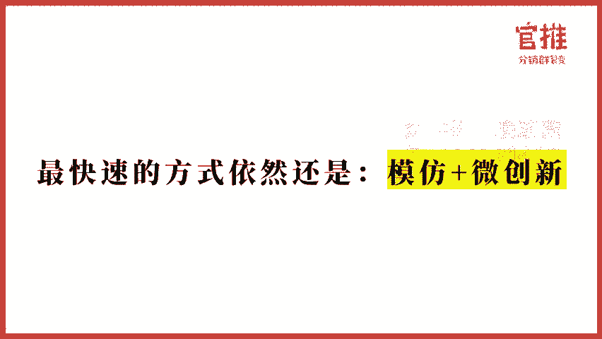

包括海报和落地页，除了这个参考的话，还有一些文案的撰写的一些技巧。这里边的话，今天我就没有时间详细去说了。呃，回复关键词之后呢，是可以有有对应的操作和文案的这个呃对应的教程给到大家的更详细的教程呃。

那个小详细教程就告诉你怎么去写呃，才是比较合适合理的了。😊。

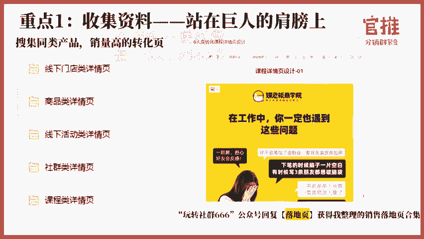

好。第二个呢就是排版和设计排版和设计。呃，因为这个呢排版和设计。其实你如果找设计师去设计的话，那当然效果最好了。但设计师是设计这么多的页面的话，它收费相相当来说的话就会比较贵了。因为海报一张海报的话。

设计就几百块钱嘛，但是你落地页的话，一般是好几瓶嘛，对不对？那这样算下来可能要10000左右或者1000多，这样的话价格来说可能比较高。那么呃如果你没有专业的设计师的话。

那你就可以使用135编辑器来进行编辑排版。关闭的后台是可以直接去使用的。呃，选中对应的文字和图片，你就可以套用比较漂亮的那个排版的格式了，就可以做出比较美观的那个落地页了。这个的话。

其实我之前做了很多个活动，我其实都没有让设计师去设计。因为要设计师设计，我要修改一个东西买又要找他我好麻烦啊，所以我都设自己用那个135编辑器来排排版编辑的呃，因为。😊，这种编辑器的话。

它是有很多很漂亮的格式嗯，你用选中一下它那个文字，然后呢点一下它的格式，它就格式就会帮你自动同步过来了。然后呢，在我们这个关推的后台是可以直接用到，然后点击编辑就可以把这个内容页展示出来嘛。

就会方便很多。那当然这个落地页的这个排版设计就是1355编辑器的使用方式。依然大家在后台回复落地页就可以得到这样的使用教程。包括刚才海报的那个设计里边的创客贴呃。

这个教程也是回复呃那边海报可以得到对应的教程。呃，具体的教程都在到时候看一下我们发出来的内容，我在这里就不详细说了哈。😊，好，第三个的话就是落地页一定要加一个重点，就是用户常见疑问。

这个的话很多人在做呃海报或者说落地页的时候忘记去做这个就落地页没有把用户的常见疑问写出来。其实很呃你你如果没有把这个写出来的话，就是很多用户有一些问题，他不太了解的情况下，第一个的话。

有一些用户他主动一点，他会找你问。但是这样的话就加大你客服的压力呀，对吧？第二个的话就是这个用户如果不主动的话，可能他就不买了。所以你要加常见这个你要加常见疑问的这个点。

就是你要把用户每一次在购买的时候常见的一些疑虑呃，不购买时候要需要问的内容，你整理出1个FK。FAQ出来，然后呢在落地页在最后的时候就罗列上来。就如说很多人去问我们课程能不能回放啊，然后呢。

课程什么方式的呀，课程买了之后能不能退款啊，这东西都罗列出来。尤其呢是我们关这个系统的话，更多的是用分销用具即时到账嘛。有些客户呢买了之后总是拿有一些人都会觉得哎我买错了什么，要不要退款啊。

那我先把预防针打在这里，我这个是一个虚拟的产品，我是一个服务的产品，你一旦付款是不可以接受退款的。还有线下的那个门店也是就是我都是打特价促销的产品，我就明确告诉你，我特价产品，我是不没有质量问题。

我是不退款的。如果你你要退你。😊，如果你要你要是不想用的话，你就转让给别人啊，就是通过这样的方式，包括很多那些呃买了那个什么演唱会的门票啊，这些都是不接受退款的。这个是因为什么呢？

就是这就是一第一个的话就是。虚拟物品里边本身呢存在一个问题，就是用户付进付款之后呢，可以马上享受到服务了。那这样的话就是有一个问题就是很多用户他可能就是来享受服务的时候呢，来找你退款。

有的时候呢就是有些人是来薅羊毛的哈。然后第二个的话就是如果真的有人来找你退款，的确是阐述是真的，我建议大家还是马上给他退，就不要跟他多纠结。因为有些用户你跟他多解取，反而浪费你时间是没有必要的嗯。😊。

但是呢因为你之前在落地业的时候说明了这一点，所以呢还是可以给你有比较好的一个就是保障，就是能够告诉用户，那就避免了有些用户就是不加思索的下单，这样的话就导致你后面的服客服压力。

那在最后呢就是呃落地页还是给到一个质质检的清单给到大家，就是你的那个落地页有没有把这些内容给展示上去。这样的话，如果你把内容都展示上去的话，你的效果会更好啊，就是从效果上有没有展示学员的评价呀。

大咖的背书啊，还有你的数据化的成绩呀，老师的声誉啊，往期的效果呀，还有就是你的服务体系呀、价格啊，赠送的福利呀，这些东西如果能够展示出来的话，你整个落地页的数就是会比较完整。😊，好。

那以上的话就是今天的完整的内容了。因为呢落地页和海报呢，其实它本质上也是比较专业的领域哈。就是如果说你之前没接触过的话，其实要马上上手的话是有点困难。所以呢我推荐大家还。😊。

推荐大家还是直接用模仿加微创新的方式，然后呢找一些专业的人。呃，比如说专业的设计师去帮你去设设计，可能效果会更好一些。那关于具体的文案怎么去写的话。

其实我在那个大家回在完整社群六六回复裂变海报和回复落地页之后呢，我会给一个详细的教程给到大家啊，那那个教程的话，就会针对裂变海报和落地页怎么去写哦，有一个更详细的说明好，那今天的课程就讲到这里。

那今天的训练任务就是第一个的话就是大家去我们呃完整社区六六的后台来获取对应的这个参考的素材库。第二个呢，根据我们今天的课程内容选定你的海报风格和参考模板。然后呢去把你的裂变海报的文案写出来并进行设计。

然后第三个的话就是把落地页的内容大纲先规划出来。因为一天。

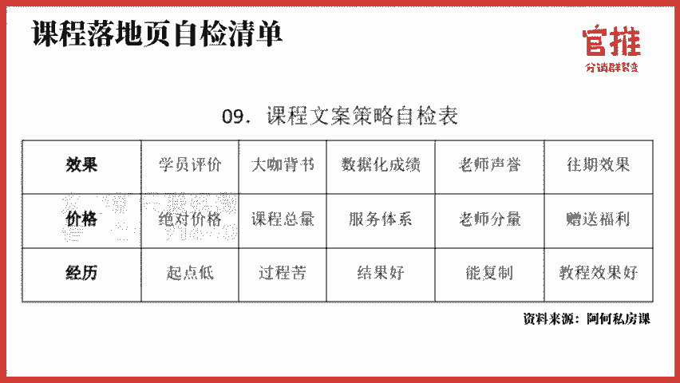

之内又让大家做裂变海报文案，又去设计海报，又要去写落地页。具体内容的话可能有点困难啊。呃，那我们就是今天呢先把海报的模板海报的文案，然后呢去做出来，然后呢可以给到专业的设计师去设置。

或者说自己用创客贴来做一块需要做出了海报出来。然后呢先把这个落地页的内容大纲，用思维导图的方式，先把它梳理出来。明天的话可以着手去写具体的文案。好，那今天晚上的课程就到这里。

我们所有的课程都支持随时回看，大家可以在玩转社群6略公众号菜单栏听课入口处进入观看。

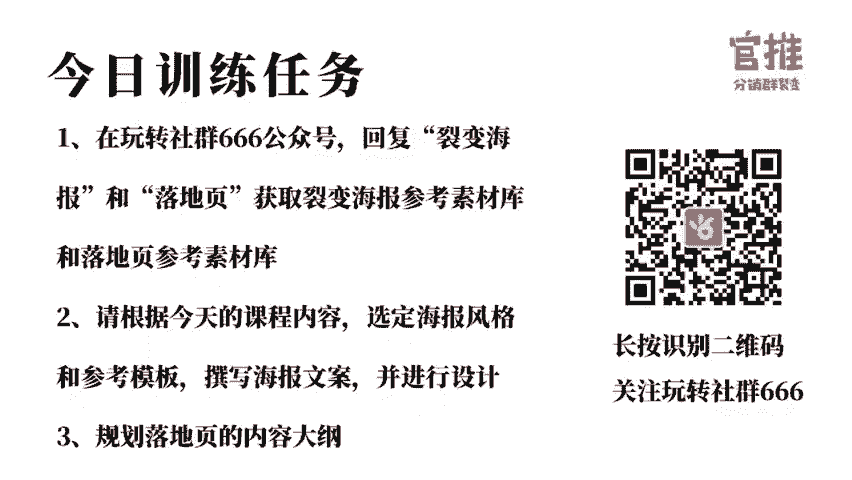

如果你学习完课程后，觉得课程内容对你有帮助，也希望你可以把优质的内容分享给你的朋友，也许能够帮到他。点击玩转社群666公众号菜单栏生成专属分销海报，即可生成你的专属海报。有好友购买之后。

你还可以拿到50%的奖励金哦。

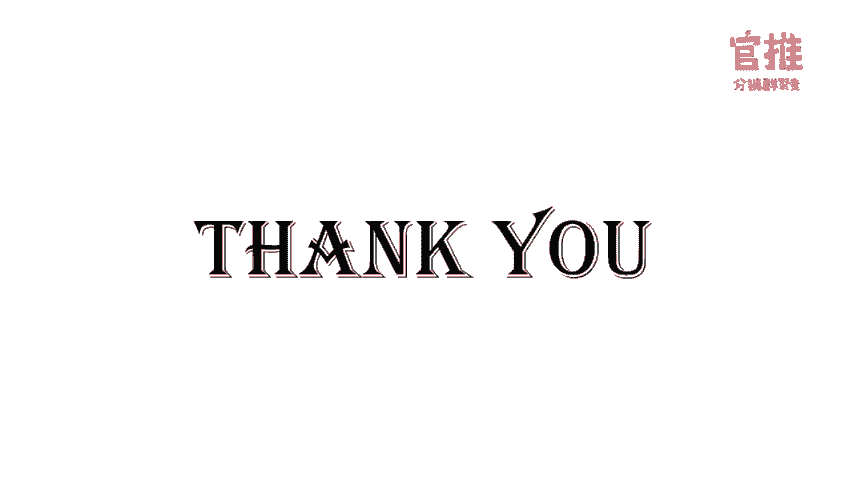