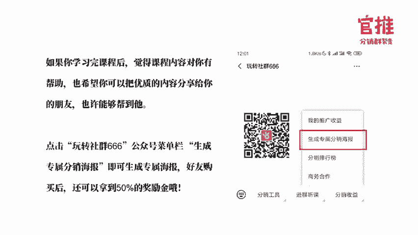

# 微社群裂变营销私域流量池增长秘籍创业运营销售获客视频课教程 合集 8套 374资料 13.1G 分销群裂变模式介绍及9大行业案例解析 - P6：第06节：朋友圈分享文案这样写，客户看了就下单 - 高端网创试错赚钱大师 - BV1Ux4y1b7xM

今天的课程呢我将会给大家分享朋友圈分享文案怎么写。那我们还是老规则，我们先来复习一下昨天的课程重点内容。昨天呢我带大家详细去了解了一下，呃，我们自己在做呃裂变海报和详情页的时候，是怎么去做策划的。

首先呢从用户的转发，5个动机来给大家分析，就是为什么你做的裂变海报，没有人转发。那真正可以引发用户转发的裂变海报，基本上是满足了哪5个因素，一个呢是利益诱诱导，就是可以让他赚到钱。

第二个的话是可以给他台提供谈资。比如说网易基金客诱火了，可以让他在他的朋友圈炫耀自己知道自己有最新的消息。第三个的话可以表达办法和想法。第五4个呢是可以让他去显示自己帮助别人。

然后呃第五个的话就是可以塑造他上进学习的一些形象啊，就是用户转发五大动机。然后呢，接下来我就告诉大家，我们自己在做裂变海报的时候，通常是遵循哪六个步骤的。其实呢只要你遵循这6个步骤，一步步去执行的话。

你的海报通常都不会太差。比如说刚开始的时候，在自己不会做的时候呢，先收集呃一些高手做的海报的资料。你看的多了，模仿的多了，开解的多了，自己自然也会变成高手的。所以呢前期收集资料非常的重要。

而且呢在收集资料的时候呢，我也给了对呃大家一些工具。比如说百度指数的工具，5118的呃用户需求分析的工具。比如还有那个搜狗微信新榜这些可以查询热门文章标题的一些工具。这些工具呢都可以帮助到大家。

就是可以快速去了解到哪些关键词呢是比较热门的。哪些标题呢是用户比较关心的。这样的话，有的时候自己并不一定说我文笔很好。但是呢市面上其实已经有很多高手已经写出很好的。呃。

可以吸引人点击吸金的一些文案的标题，那其实是可以直接复用的。此外呢，在做海报设计的时候呢，也给大家介绍了一些工具。比如说创客贴的工具。还有呢，昨天晚上我们也拉了一个专门去对接设计师的群。

大家如果有那边海报的需求呢，可以按照群公告的方式呃，去写一下你的需求发到群里边。我们群里边呢还是有蛮多设计师的。啊，那做了海报之后呢，其实不是马上就进行过活动的推广了。最重要的是还要去进行用户的调研。

比如说我去问一下用户这样对这样的主题感不感兴趣，这样的价格他愿不愿意下单购买，他有没有可能去帮我去做分享啊，分享的原因是什么？这些呢你去做一番调研之后，你会得到很多宝贵的意见，那方便你迭代去修改。

等到你迭代修改之后的那个海报，可能效果的话会比你第一版的海报要效果好很多。你再拿这一版海报去给到分销员去推广，这样的效果其实要比你一开始没有做任何的迭代修改的时候，它的效果要好很多。

而且呢分销员一发布朋友圈可能就要买马上就有人购买了。那给他的刺激力度也是很大的这个会大大促进你呃这个活动的成功。而讲完海报之后呢，我们又讲了落地页的制作。

其实落地页的制作的设计的一个步骤跟海报是非常类似的，也是通过收集资料式去参考模仿优秀的竞争对手或者优秀的同行优秀的高手他们所做的东西，然后呢自己再去模仿这样的话，其实你相当于是什么呢？

我已经跟高手的方式去用高手的标准来要求我们自己了。那这样我们很快也会成为高手的。好，那就是昨天晚上我们重点的内容呃，当然我觉得昨天内容其实有很多内容，我还没有详细去说。就昨天的课程。

其实建议大家还是好好回去复习。对你做裂变海报和做那个详情页是非常有帮助的。尤其有的时候并不是我们亲自自己去做。但是你自己你首先要了解什么才是好的裂变海报，什么才是好的落地页。这样的话你才可。

我能去判断出来我这个活动的裂变海报，我的策划，我的文案做出来效呃，这个这个效果符不符合用户的一个需求。然后我的设计师去设计出来的海报，他怎么去调整效果会更好。这个呢就取决于你自己对这个东西。

首先自己有没有一个判断的标准。那当然你自己先要知道什么才是好的，才知道怎么去让对方去调整和修改，是吧？所以不一定说你自己要去做策划和文案，才需要学习这门课，而是说你只要你做了活动，你是活动的参操盘手。

你就需要消先了解什么是好的，才方便你去做评判，去做调整。好，那昨天晚上的课程复习完毕之后呢，我们正式进入今天的课程。那前面来说，我们活动的，因我设计好了，我们的海报也设计好了，落地页也设计好了。

那这样的话接下来就是什么呢？最重点的内容是什么？就是光是有海报，光是有落地，其实还远远不够的。因为每一次你分享的朋友圈的内容，如果光突突一张图片，只是是没有人说按了一张图片，我马上就去点击的，是吧？

所以呢。在这个方面的话，其实文案在这里呢也起到非常重要的作用。而且呢有时候因为海报讲的内容毕竟是有限嘛。那你如果有朋友圈文案还做辅助的话，但但很多时候呢它可以作为你海报的一些呃就是价值的一些补充。

这样的话，有的时候很多时候不是因为海报吸引人而去去去点击扫码，而是更多时候呢也可能是因为文案的力量，而导致用户看了之后呢，会去扫码去去去点击进去看落地页的。所以在这里边呢呃我们的话术。

还有我们的文案海报就是海报分享的文案对应的话术这个也是相相当重要的。那今天的话我将会从以下呢四个部分跟大家去详细解析一下。就是我们自己在做分享文案的时候，怎么去写的。然后呢呃基本上就是当你是。

一个不会写文案的人，就是完全是小白是新手，怎么样的方式才可以快速去上手。呃，我今天讲的内容的逻辑呢，跟以往那些其他讲文案的老师可能是不一样的。我更多的是注重实战，就是让你看了这节课，可以马上上手的东西。

而不是告诉大家，我们要学习一个文案，然后怎么去遣词修饰，怎么写形容词，这个东西我今天不会教。因为这个东西说实话不是你学了之后就马上懂的，因为需要长期的磨练嘛。但是呢有很多技巧，就是你如果你知道了的话。

其实可以马上就上手的。而且呢做出来水平不亚于专业的人士。这是我今天讲这个门课的时候呢，我自己在给大家写做这门课的时候呢，立的一个目标，就是让一些没有做过专业文案的朋友。看了我听了我这门课。

就可以知道怎么去写一个文案，甚至于你知道怎么判断这个文案写的好不好。好，那首先呢是第一个部分的内容。首先我是从呃很多人在写文案活动文案的时候都会犯的呃两大坑点给大家讲的。

因为其实很多时候并不是大家不会写，而是有一些点呢，大家忽略了，导致你效果不好。那首先第一点是什么呢？第一点其实这个是应该是所有人都会犯的，很多活动者都会犯的一个问题。就是说第一个你写的文案比较长。

首先朋友圈文案如果你超过六行的话，其实是会被折叠起来的对吧？本来就有一个查看全文嘛。它太长的话，是没有办法全部显示出来的。所以呢首先第一点就是如果写的文案太长，它就会被折叠起来。当然，如果只是折叠起来。

有个查看全文，其实还是可以显示前面四行四行字的甚至五行字，对吧？但是呢有一些人因为。因为微信这边呢对朋友圈就复制粘贴的这个做了限制，很多人复制一张贴，它就只是显示一行。你可以看到我这发的这张图片。

左边的那个朋友发的，你就可以看到的只是小小的一行。那小小的一行。说实话，这样的朋友圈发了跟没发一样，就是基本上是很少人会点击这样的朋友圈海报去看的。

因为这样的朋友圈一看就广告给人感觉第一眼就是广告效果肯定是很不好的。第二个的话，就是你一看这样的话，就是就会让人家感觉到你其实你为人就不严谨。你做的东西肯定是复制粘贴出来的东西。

所以呢给到人家感觉就很不好。那作为活动主办方呢，很多时候我们写的文案就是没有办法很精简，因为可能又要表现出来我们这个活动的最大的价值。又要。又要促销是吧？又要促成成交。那可能时候呢。

我们提的文案就比较长。那这个时候呢，又有很多人不会去弄，怎么办呢？就作为活动的主办方来说，首先有一个技巧你是必须要懂的。就是我朋友圈文案怎么去发布折叠这个方法你一定懂一定要懂。

而且你要把这个方法交给你的推广员，交给你的分销团论人员，告诉他怎么去附注和粘贴文案才不会被折叠哦，这个是最关键的。那今天的话我就给大家说一下，就是我们自己常用的，而且是万能公示方。

就是基本上是朋呃苹果和安卓都能适用的一款，就是朋友圈文案不折叠的方法。这个方法呢就是什么？就是用那个输入法的剪切板。现在其实很多主流的那个输入法都有这个功能了。什么搜狗啊、讯飞呀、百度啊。

甚至还有一个专门针对于微商发朋友圈用的输入法叫做不折叠输入法。对，名字就叫不折叠输入法。我发一下截图给大家哈，就是你自己用的那个输入法，你可以看一下，就是在你的那个设置那里，其实是有一个剪切版的。

然后你再把剪切版的内容一点击再发的话，保存，它是不会被折叠起来的。甚至于百度输入法，它会重新帮你把这个文字啊，就是帮你一个字一个字的输入，但是它是自动帮你输入的那这种方式的话。

就相当于模拟输入的一个感觉，它也不会被折叠的，所以常常规的那个主流的这个输入法都有这个功能。好，这是第一点，就是朋友圈里边发文案不折叠的方法。第二个呢，很多人评论也会被折叠，对吧？

那发评论不折叠的方法是什么呢？这个是我自己磨索出来的。这个是我自己摸索出来的，就是评论折叠的方式，就是你在发完朋友圈之后，马上就在评论下方直接。直接粘贴复制。这样的话评论有的时候长的话。

而且你朋友圈如果说被判定为呃有一些营销的意味的话，可能就会被折叠起来了。那怎么样的评论才不会被折叠呢？其实是你点击你的头像，再点击你的相册进去那里去评论才不会被折叠。这是我模索出来的方法啊呃。

只告诉过大家，这是就是朋友圈我要不折叠的方法。你要全部都告知所有的帮你分销的人，让他都知道这个方法。这样的话，他去传播的时候才不会被折叠起来，这是第一个坑哈。第二个坑是什么呢？

第二个的时候是你写文案的时候是没有分场景，不分角色的。就是不管发哪里是一样的。不管发哪里都是一样的。第二个呢，是你不管发给谁都是一样的，这样的话就会导致是什么呢？就是。就是你想一想。

你发朋友圈的文案跟发群里面的文案跟发一对一的群发的文案可以是一样吗？因为不同的场景，他面对大家刷刷到你这个信息的心理情景是不一样的。我举个例子哈，朋友圈的转发文案，大家知道我就是在发朋友圈。

那你发的文案，很多时候呢，我知道你是对所有人说的，所以你说大家各位呀这些话是没有问题，对吧？然后呢，朋友圈呢因为是你自己发的信息嘛，大家都知道所以朋友圈的文案你其实是可以重种转化的。

就是促进大家马上购买的，这个是没有问题的。但是呢微信群里面跟朋友圈就不一样了。因为朋友圈是你的私人领域，大家刷到朋友圈顶多就说哎姐这个人就在发广告。

或者说什么他不会有别就是他不会干预到你顶多他可能看到你这个信息有可能会屏蔽你，但是他不会干预到你，他不会觉得哎你在骚扰我。呃，当然有这种心理，但是他不会那么强烈，对吧？

但是呢如果你在微信群里面直接发朋友圈的那个强成交的广告的话，他就会有被骚扰的感觉。因为你发一条朋友圈，他可能自己去主动刷才会刷到你，你不会提醒他嘛。但是你发微信群登，他就会提醒他，他会觉得哦好突兀。

你提醒到他了，对吧？所以呢你在微信群发的时候，更多时候要注重利他，就是说我是帮助到大家，我找到一本好的课程，我找到一个好的产品，各产品有什么好安利给大家利他的角色去写的文案，才会不会被他反感。

否则的话你在微信群打广告，赤裸裸的那种硬广，你在朋友圈可以发。但是在微信群里面一发，有可能就被群主，然后群友的话，也会觉得你哎这个人怎么又在打广告，老是在骚扰我，群主把他踢了，他都会有这样的心理。

还有呢就是。一对一群发的时候，很多人一对一群发，你自己在发的时候，你知道是发给大家嘛，所有人都一样嘛。所以你用的那个话术就是哎大家好，各位，然后呢呃希望推荐给大家，你你一看哈就知道是群发的内容，为什么？

因为我收到我这个用户，我收到你这条信息，你是私聊给我啊，你不是一对一跟我说的吗？你为什么说大家啊，这个心里马上就会有一种就是哪上知道你这条信息是群发给我的，就没有那种说你专门为我跟我互动的那种感觉在呢。

所以你自己在写一对一群发的话术的时候，一定要强调说我是跟一个人在对话。不是跟一群人在对话。所以你要记得你在发一对一群发的时候，轰动轰动的话术是什么？早上好，在干嘛呢？你好，然后你我觉得对你很有帮助。

而不是对大家有帮助。我推荐给你啊，为什么要推荐给你。我觉得你平时为人很好，很靠谱。所以呢我才觉得你这是就是类似这样的话术你能明白吧？就是转化那个场景，所以场景当中不同的这个场景，你的话术的点是不一样的。

朋友圈重转化，微信群重利他对大家有帮助。然后呢，一对一群发的时候重互动，重信任感。重专享感，这是不同场景你需要注重的地方。然后角色是什么呢？就是很多人在做朋友圈文案的时候啊，尤其是主办方。

尤其是主办方在做的时候呢，往往就会站在自己是主办方的角色去写文案。很少时候呢是站在用户的角上去写文案的。其实你要想一想，如果你要分销的人员，包括用户去帮你转发你的朋这个呃这个文案的话。

你就不可以用你的角度去帮他写文案。我举个例子哈呃很多官方的时候呢，在写文案的时候，就说哎，我们新上一门课，这个课有多好，请了多牛逼的讲师，对吧？但是呢你在用户的角度，他就转发你这个文案，莫名其妙。

我又不是你的员工，我为什么要转发这样的文案，这个纯打广告嘛？因为朋友圈的一个推荐其实是以个人信任为背书的推荐机制。如果使用很官方的话术，会很容易被他判定为垃圾广告的，所以转化率自然就不高嘛。

但是如果你从用户的角度。从用户的角度帮他去写文案的话，那效果完全就不一样。比如说哎我举个例子，他比如说说我刚刚加入了这个课程，我举这个课程就是群里面的氛围很好。老师呃很专业啊。

就是呃在哪些方面是对大家有帮助的，推荐大家跟我一起组队学习哦，这种角度就跟那个主办方角度完全是不一样的。下边的话我会详细去讲到怎么去写，就是用户口吻的一个角色啊。还有一个呢。

就是很多人给这个主就是给用户提供，尤其是分销员提供话术的时候，只提供了一种就是发朋友圈的文案，其实是不够的。如果说你能多做两步，就是把微信群和一对一私聊群发的话术都给他写上。

真的会有一些推广员他看到之后，他就知道有思路的。因为很多推广员他自己是无脑操作，你知道吗？他是无脑操作的，你给他什么文案，他就发么文案，他发朋友圈，他他听你的话，他就发朋友圈啊。

但是你告诉他可以发微信微信群哦，那他也可以他也可以帮你去挖微信微信群啊。然后你要告诉他，你可以一对一私聊群发哦，他又可以帮你去一对一私私聊群发，你把话术都给他写好，一对一段发什么，第二段发什么。

第三段发什么，是不是比他自己去想更好。所以如果说你作为主办方，你能够多写多几步，给多一些场景和触发点给到你的分销员，那他的动力和他想到的东西就会不一样啊，就是我们在做那个呃活动的时候要注意的。好。

那在写那个文案的时候，一定要注意，还是结合我们昨天说的海报，就是用户愿意转发海报的五大动机。其实你当你写朋友圈文案的时候，也一样去要注意，就是是不是满足他五大动机啊。那么这个就是参考哈。

就是我给大家看一下，就是这参考的不同的角色是不一样的。就是用户的角色的话，更多是一个哎我阿梅老师是我认识的老师之中什么什么什么什么的那作为主办方的角角度的话，更多是说我们之之前操盘的那个呃案例有多牛逼。

然后呢这一次我把我们的那个案例复制给大家，是不是？所以呢呃作为用户来说的话，更多是。让他就是他在发朋友圈的时候呢，让他觉得哎这个活动有多厉害，参加了有多少受益，想学习，想推荐这样子的一个角度去写。

那作为你的主办方，或者你客服去宣传的时候就要宣传哎，活动有多牛逼，参与了有多受益，有多少人参加了。然后呢，这个氛围有多火啊，然后呢，主讲的嘉宾有多牛逼啊，这样的角度去宣传。

所以你要从不同的角度去写不同的文案。好，讲完讲完前前面的大坑之后哈，就是相信大家可以质检一下自己平时在做活动的时候，自己犯了哪些问题，哪些坑了哈。嗯相相信我你你稍微改动一下，可能转化率就上去了。

然后第二个呢就是告诉大家怎么去写一条呃高准化率的分享文案了。呃，在写高的分享文案的时候呢，其实我只用到一个套路，就是这个套路给一条成交公式给到大家。这条公式呢就是你写的文案，你分为这四个步骤。

第一个引起注意。第二个激发欲望。第三个信任建设。第第四个促进行动，然后就可以了。就是这四点或者相互组合去写都OK就是就是围绕这个4点去讲。其实朋友圈啊更多的是社交传播。他基忆的就是信任。

就是用户去转发的时候，其实是他推荐给他的朋友和和他的。和他的同学啊、同事啊这些，所以其实是基于信任建设。大家看到他的朋友圈文案，首先是先认可他这个人的那认可这个人的话。

其实本质上是有一定一定的信任建设了。那在在这个朋友圈分享文案的时候呢，你再加一下其他的一些信任建设会更促进这个用户呃去扫码去购买。那我现在以实际的案例给大家分解一下，拆解一下。比如说像这条文案。

这个呢就是我们这次活动推广的过程当中，分销网址写的一条文案哈。你可以看到他刚开始的时候，首先明天结束是一个标题，其实标题也蛮重要的。这样的话会给到呃大家去一看就知道哎这个标题很引人注目是吧？

那个标题写什么，如何策划一场活动，没有启动量怎么办？怎么调动各路资源帮你推广，这个其实就引起大家的注意了。然后呢，接下来引起注意之后呢，接下来就是激发欲望。

云广告投入完全社群66资源对接群24小时裂变了1万个会员。关建明老师裂变了4000。437个人成交489个799元的训练营线下火锅店一次活动吸引540人到店，他们是怎么做到的，是不是你看了你也会激发起。

哎，他们到底是怎么做做到的，这样的会激发他的欲望。接下来的话就是信任建设，就告诉大家这个课程出来了，教你怎么去类变和成交，而且这个老师是什么样的老师实战的导师，而且到时候会告诉你怎么去做。

具体是怎么去做，那就是信任建设。在最后的时候，其实有的时候啊不一定是以朋友圈一下子把所有东西都写完。你在评论区加一点就OK的，就评论区加上促进行动的东西。比如说亚的引导。

还有那个呃就是现在购买有什么好处的引导，这个的话就是触触发你的用户赶紧行动，这个是标准的四个。节奏下来的，引起注意激发欲望，信任建设，促进行动的标准4个。四四个步骤的一个成交朋友圈呃。

分销王子在这次活动当中，除了官方之外，他是冠军，所以大家要多多跟他的这个朋友圈话术学习哈。那我继续去讲一下另外的一些话术，大家可以看一下。那第二条话术。他是推荐了千逊老师的那个穿搭课的，这个穿搭课的。

他也是如此。就是首先第一个如何从不懂穿搭到回头率100%，夏日显瘦20斤，这个是不是首先是一个标题，一引起你的注意，而且在这个时候引起注意的时候就激发你的欲望，就是夏日显瘦20二0斤嘛，对吧？然后呢。

就开始是信任建设了，就告诉你这个老师有多牛逼。他是中国形象管理协会的深圳秘书长，市值三300亿向市集团形象培训师推荐学习。那在最后的时候，还是在我们的那个评论区促进他的行动。呃，在这里的话。

现任建设其实有很多老师啊他自己不会怎么去想唉，自己有什么东西可以拿出来就去做背书的。其实第一个你你自己如果服务过的客户，就是自己有可能不是那么的牛逼是吧？但是如果你服务的客户牛逼的话。

其实是可以把你的客户拿出来去帮你做背书的。比如说我们官推官推分销群裂变软件，那有可能很多人没听过，对吧？因为我们其实是一个呃今年1月份上线的呃，产品嘛以前都是给大企业去服务的但是我告诉你。

我们的软件是喜马拉雅方指定的分销裂变工具，那你是不是一下子就觉得哎我这个工具这么大的公司都在用。那瞬间就觉得这个工具是很牛逼的公司工具，否则的话这么多的大公司也不会再用这么大这么多的大咖也不会再用。

是吧？所以呢有的时候不一定是自己牛逼，有时候呢是你客户牛逼就可以帮你去做背书了。说你的学员牛逼，那也OK是吧？好，那我们继续往下看下面另外一条朋友圈也是如此。这个是郭亮亮哈。

郭亮亮呢也是分也是也是我们这次的。呃，导师之一分销王者和郭亮亮老师呢都会在下面呢给大家去做分享。呃，郭亮亮老师呢在这次我们的温推分销训练这个训练营当中，他们带的团队是第一名冠军团队。

下面呢就是接下来他会在下面我忘了第几天了。他会讲一下，他是怎么带队的，然后呢去激发团队的人员，啊朋友圈的这个内容的话，到时候会详细跟大家去分析啊，那我们继续来看你看他分享了这个朋友圈。

他只是发售的是一个付费的社社群一样。第一个第一句话，看了看完内容介绍之后，我立即购买了。你想想看完内容介绍之后，立即购买了这个是什么。第一个引起注意吸引朋友圈的人，看到哎为什么他会买第二个信任建设。

因为他都买了，说明他觉得这个东西的确很不错，对吧？然后第二个呢就是激发欲望，解决人脉不足，渠道少，缺资源的难题，而且推荐给身边做市场。取道销售的朋友就是立场景嘛。然后接下来就是促进行动。

遇到问题可以直接在群里咨询。就是按照我们刚才所说的这个四个步骤来讲的。好，那在这个四个步骤里面的话，其实接有一些小技巧的，我直接在这里直接跟大家详细说一下，就是比如说引起注意。

是有个比较常见的一个公式的。比如说提问式，就是比如说我们这次的分销实操训练营，我常用用到一个方法，就是生意人必须要学的一套课，教你怎么不不花钱去吸引大量的精准客户，这个就是提问式啊。

然后呢呃还有如何在一天之内这个涨粉55500是吧？还有呢就是新知识，新知识是什么意思呢？就是告诉大家有一个新的东西要出来吸引大家注意。比如说预计这个课马上今天今天要刷屏，预计这个课马上到火。然后呢。

这个一天之内就涨价两两次。10万人都在学习啊，这都是新知识，就是告诉大家有一个新的资讯出来了，而且是比较牛逼的东西，要吸引大家注意。那在这里的话吸引引起注意的时候，常用的词语就是怎么做？

现在然后就在这里一个重要的决定啊，我觉做了一个重要的决定是吧？要下下单买了这门课是吧？哦，惊人啊惊文人就看了这个大纲之后，我惊为天人，然后呢是感动哇，这么看了这么丰富的一个大纲，我感动了。

是不是然后值得注意革命是令人吃惊。这是这些词语就是引起注意的时候，常用的词语。那么激发欲望又有什么方式呢？激发欲望的话，基本上是按照这三个步骤来的。第一个的话，有可能用到的是场景化。就刚才我所说的。

像郭亮亮那个就是推荐给这些学习市场销售营销的伙伴来学习，就是要你对号入座嘛。那我今我这次课程我就告诉大家，支持付费线下门店实体行业都可适用，就是让你对号入座，可以场景适应上去。

然后第二个的话就是你在做场景化的时候，其实要比你不做场景化更好。就想象一下，有有你看这个话术呢，就是很多人在写这个产品文案的时候都是文绉周的。我们产品经过什么什么样的。

国内唯一指定什么什么什么什么东西呀。这个的话就跟你去用场景化示发用户想象，就。就就这这个话术对比起来就完全不一样的感觉。你看别人用的是什么，在这上课跟跟在国外上课一样，瞬间他就可以想象的出来了。

所以跟你去描述你的产品的特点，跟你去描述给用户的好处，两个对比起来，场景化的场景会让用户更有想象力，马上就可以看得懂。还还有人就是价值的罗列，就告诉大家。

我这个课的确或者说我这个产品的确给你提供什么样的好处。还有是实际的利益，实际利益就是他可以获得什么哦，马上就可以获得什么哦，这个就是比如说一来1100来块，你就可以拿走我们多年打磨的经验。

帮你少走很多弯路，就是实际的利益。现在下单还送什么超级工具包啊，这些就是实际的利益，激发欲望的时候，用到常常常用的一些技巧。嗯。就是信任建设了。信任建设这里其实有很多人都会踩坑的这就是我前面说踩坑的。

最重要的一个点，就是你在写话术的时候，没有用用户的口吻。其实如果用用户口吻的话，就是往往的时候呢，是可以促进他的朋友圈下单购买的。如果你有观察的话，你一定会发现一般引起别人关注的话术。

前面都会加上哎我已加入我觉得推荐你这样的字眼，这样给人的感觉，就是好像这是用户自己接触过的。而且这个效果还不错，非常真诚的推荐，这样就形成了信任建设。朋友圈的推荐机制，就是以个人信任对书为推荐机制的。

如果使用你的自己的官方的话术就会转化率很低哈。而且呢这种诚心的推荐啊，还会刺刺激他自己的朋友圈的那个好友的好奇心，想一想，当你看到朋友在推荐一件东西的时候，就算你自己可能对这个东西完全不感兴趣。

那你是不是会因为他。因为他去推荐你去看一看他在推荐什么这样的欲望，下意识去看一眼。所以在好奇心的驱使上，你的一个图文的一个转化率，或者说你海报的扫码率就会高很多。那常用的句式就是哎，我买了，我已加入。

推荐你。然后呢呃阿米老师是我认识的导师当中是什么我的好朋友啥啥啥啥啥就是这样的一个用户的口吻。还有呢就是强调自身的收获，就是在写这个话术的时候，强调用户自身可以得到什么。

比如说我之前通过阿米老师的文章学习到了什么什么什么，之前运用他教育这个方法。然后呢，教有有什么样一个成果哈，就是自身的收获。还有呢，更多的是要具体去想说而不是说哎这个老师可厉害了，推荐你学习。

这样的话就是给人感觉很不可信。但是如果你加上一些具体的数字，比如说哎这个老师三天裂变了1万多个付费会员，那瞬间就给给人的感觉更可信一些。那这好像下面的那个文案对比来说哈，就比如说呃让购物让生活更美好。

它就不具体，让人感觉就是很宽泛。但是如果你换成另外一个名家的这么一个一个文案的话，就是三天不购物，便是灵魂可增，你是不是瞬间就觉得哎我一定要去购物了，要不我灵魂都可增了，是吧？所以就这就完全不一样啊。

还有呢信任建设呢是可以拿一些知名来做背书的。比如说我们刚才所说到的你知名的客户，知名的学员，啊后呢，你跟知名的平台合作啊，还有呢就不一定说呃跟这些平台合作啊什么的，但是呢如果他有在用啊。

还有呢是说你大咖有加入你这个群，然后呢呃有一些明星在用你的产品，其实这些呢都是可以作为你信任的背书。举个例子。举个例子，我们自己也之前有一些社群哈，就是我们做完这社群66的时候。

这个社群本身可能刚开始的时候新社群嘛，那很多人不太了解，那可能不是特别牛逼的社群。但是呢你可以怎么去说呢？比如说你社群里面加入了好几个很牛逼的人，那你就告诉大家，哎，连京东的运营总监都称称赞的社群。

连京东运营总监都加入了这么一个社群。那你瞬间是不是觉得这个社群其实还是很好的，否则的话这么大咖怎么可能会付费加入呢，是吧？所以有的时候呢，你要去善于去为自己找一些信任的背书。最后呢就是促进行动了。

促进行动就是限时限量，然后给价格锚点，然后给短期的利益哦，刺激它就是制作稀缺感。因为前面我们经说过很多次了，所以今天的话在这里就不详细说。好，我们继续往下看。那讲完前面的那个公式之后哈。

你就要按照这个公式去写，其实是可以得出一个转化率比较高的文案了。而且呢用户呢也会比较去乐于去帮你转发。因为他转化率高嘛，他也愿意去帮你转发，而且持续去帮你转发。但是很多人就说了，我的确不会写。

你就算这么告诉我这个原则啊要素啊，我还是不会写怎么办？所以这个时候呢，对最需要学习的是什么？就是我接下来要教给你的这个方式，最快速去写报款文案的方式，真的没有之一，这方式是什么？第一个。

我最强调的还是回到我们昨天最强调的模仿加微创新，这个是非常非常重要的一个快速学习的方式。这是我学习了那么多年最重要的一种学习方式，就是找到牛人跟他学习啊，刚开始可能就是模仿。然后你在微创新。

然后呢就慢慢的内化成自己的经验啊，这是非非常重要。非常非常重要的。我给大了两个方案。第一个方案就是找一个朋友圈的成交高手，以去裁解他朋友圈的活动文案，然后呢去模仿价微创新。这个是非常非常重要的。

就是去模仿朋友圈成交高手的文案。啊，第二个的话就是去参加别人的裂变活动，尤其是做的比较好的类变活动。你成为他活动的分销者。你只有参加他的分销者，分销团队，你才可以参与，就更深入。

你才可能知道更多的活动细节。然后呢，你把它对应的话术全全部整理出来，然后呢再模仿加微创新。这是最快速的。有的时候并不需要说我自己去学习，怎么去写文案。你直接拿把别人的文案拿出过来，然后稍微修改一下啊。

这个就是最快速的。那今天的话其实。我已经帮大家整理好我们之前对推广文案的一些参考的合集。大家在后台回复推广文案是可以获得这个合集的。在课程结束之后哈，在课程结束之后去回复。现在我还没有放上去。

课程结束之后放上去。就是这是我们之前做活动写的这个参考文案，大家可以借用哈。那么还有几点呢是大家可能在做的时候呢，忽略的点，就是可能写好了推广文案了。但是有几个点你是忽略掉的。

这个忽略掉的话术呢就是有4个点。第一个的话是用户购买后的话术，你没要去写，然后第二个的话是用户加个人号的话术，你们要去写好。然后呢，用户进群之后，话术也没有说好。

还有怎么引导用户分销的话术有没有写好这四个四个点呢，其实是在做活动之前，你要准备好的，而不是你活动都开始了，急急忙忙的才去做准备。而且呢我建议大家每一次活动都要提前去做测试，测试整个流程顺不顺畅。

哪个流程有出纰漏？这个一定要作为一个活动的操盘手来说，一定一定要注意的。那用户购买后的话术可以我直接给大家参考了哈。购买后的话术大家可以看一下哈。购买后的话术可以在那里设置呢。

因为官方就是我们官推的分销群那边系统在后台呢是可以直接支持大家自定义购买后的页面的这个自定义购购买后的页面呢是可以直接设置。购买之后呢，让用户进进群或者加个人微信，或者直接显示你的呃线下活动地址啊。

时间呢，这些就是大家可以直接在那里做编辑的。也可以直接支持呢，我我直接跳转到一个自定义的链接。比如说你活动量比较大，一天的销量超过2000的时候，你就可以考虑用活马自动切换微信群入群二维码。

活马链接的这样方式去做活动。那我截图了这个地方呢，就是可以的让大家打开之后显示自定义页面的。那他有两种方式，第一种方式的话是直接放群二维码，让用户直接扫码进群。第二种的话是放你个人号的二维码。

然后呢让用户加你个人号再拉进群。因为呢呃有很多用户呢对这个呢，其实因为他之前参加的活动可能是买了之后我就去听课，或者我买了之后，我先去呃参加线下的活动了，我就不管了。或者买了之后就去呃去发货地址啊。

这些东西我就不管了，没有加群或者加好友这个提示嘛。所以我们这个活动形式呢，相对于很多人的活动形式来说还是比较新。所以在这里的话要借助文案的力量，让用户及时加上我们个人微信。

或者加入我们的群里面去领取对对应的课程或者兑现对应的产品，或者说到线下核销。到线下去核销啊，这个点的话就是要用话术，让用户务必要加到群里边。还有就是呃就是设置第三种的话。

就是设置呃大规模的活动时候是设置入群的活马链接，就是把之前的那个自定义的页面关闭之后呢，就可以显示出来购买后的页面的一个链接的设置。呃，大家可以看一下我的截图嗯。

那我直接放一下我们自己放的时候是怎么去写这个文案的哈，就是购买成功，马上就提示他要加助教微信，拉他进实操型学习，并且告诉他我们是什么时候开课。然后告诉他添加之后要做什么动作，就是要附上你的购买截图。

这样的话就很多人到这里的话，他自动就会截图下来。他有这样的意识，就避免用户在购买之后，他的截图没有及时保存，到时候还要去找。那用户添加之后，加了个人号之后，你还要去发话术给他引导嘛？

这个时候呢人少的时候呢，当然是可以用手动的那人多的时候怎么办？这个时候呢是可以选一个辅助的工具。这个工具呢是我常用的个人号管理工具，叫V two呃，这个这个工具其实是在PC版用的就是。

特别特别的要强调这一点，好多人来问我这个问题哈，就是这个工具是在。呃，windows电脑的PC版微信配合使用的。就是不是手机上使用，所以手机下载也没用，也不是你的苹果电脑能用。如果你是苹果电脑。

请你双开系统。或者说你加一个服器，只能在windows电脑使用，并且一定要配合PC版的微信来使。这工具可以在百度直接搜索Vwo两个字就可以搜出来，然后呢去下载的。然后它有免费版本，也有付费的版本。

免费版本呢对一般的企业来说也是够了的。呃，然后呢，主要用到什么功能呢？就是接受新好友和新好友应答这两个功能，是因为你家人比较多的时候，是可以用它这个工具去帮你自动去通过好友的。

第二个的话就通过好友之后可以给他发一段话呃，就是做引导。这个新号慎用哈，因为最近的话就是微信对这种工具是打击是比较打压的。新号千万不要用。说实话，新号用的话有可能被封号。

所以建议新号千万不要用老号的话用起来也要注意哈。第一个，先登PC版微信。先不要登Vwo挂5个小时以上，你再打开V two自动挂上，然后设置新好友接受的时候，永远要比官方推几个。

官方推荐你那个时间要长翻倍翻倍。然后新好友应答的时候，那个时间也要长。你要记住你打字的速度。比如说你打字一个一个分钟可以打60个字，那你这个段话如果有200个字，你就瘦个3分钟。3分钟左右。

这样的话才会是一个比较安全的一个范围。所以我们弄一图呢，我们比较少被封的原因是做好这种风险的控制啊。因为今天的5号我其实不是特别想给大家推荐这个款工具的。因为因为大家可能听到之后的太多问题来问我了。

我请大家自己去搜索一下这个款工具，然后问他们的客服，我们的客服压力很大哈，就是这种工具其实外部的工具，但是呢我给大家提提示一下是可以提高你的效率，但是请不要过的了来咨询我们我们的客服压力真的很大啊。

自己去百度一下，再问。百度一下再问，如果不懂百去问一下V two自己的客服哈，谢谢大家谢谢大家。呃，然后呢。这是加个人号的话术。嗯，话术的话，一般来说第一句话就告诉他哎，你是不是来参加学员。

然后呢呃麻烦发一下付款截图给我，我拉你进群。然后呢，呃就是一般学员就会先发过来嘛，发过来之后呢，再告诉大家，就是呃我们课人什么时候开始。然后呢，拉他进群，然后再引导他去分销。然后如果你是有课的话。

比如说我们这次用的是励枝微课哈，用励枝微课的话，就是你可以在我们的那个官推的工具后台，有一个兑奖链接，那可以把励枝微课的那个听课的优惠券，用兑奖链接加那个呃超练的方式把那个优惠券放上去。

这样的话就避免说你直接发那个优惠券链接到群里的话，很多人转发出去嘛。那你用我们的官的官推的那个兑奖链接的话，他就可以避免就是别人转发出去。如果他没购买的话，他也点击不进来。

他就领不到你那个优惠券就避免你个优惠券外泄。这样的话就可以直接对接到荔枝微课啊、千聊啊这样的一个听课平台上去哈。当然如果说你有需要去做接口对接的话，我们其实官推也是支持做接口对接的，就是数进行数据同步。

不需要领那个听课券。呃，直接就领呃直接购买了之后，的数据就订单直接同步到你的小额通啊，还有你的那个什么其他平台。比如说有赞啊，这些平台我们都是可以同步的。这样的话就是用户在这里购买之后。

在那边就可以得到服务啊，可以通过呃这个技术接口对接的方式把你的订单数据同步过去啊哦这样的话就是用户体验会更好一些。好，我们继续哈就是。在那个个人号话术的时候，我再给大家发一下其他的那个话术的参考的话。

我们常用的一些参考的话术的一个指引哈就是。呃，比如说用户付费之后，参考的话术可以设置什么？然后一般的话我会建议大家去设置让他发借款付款截图嘛。收到截图之后再回复什么样的话术。然后就这是第一个。

然后第二个的话是用户。付款之后，截图也发给你了，拉他进群之后，他的话术怎么去提示。比如说进群之后怎么去提示话术，我也直接给一些参考的给到大家，可以直接复用。

这样的话大家到时候呢可以在我们的基础上进行修改，这样的话效率会更快一些。好，我我我直接把那个图片直接发给大家。能看得清吗？应该能看得清吧。好。然后用户进群后的话术哈有有几有几点要跟大家说一下的。

有一些小技巧。第一个的话就是你用户量比较大的时候，其实就是可以通过改群名的方式让用户及时接收到你的信息。比如说你可以通过改名字告诉大家是周四开营。如果你把一些重要的信息可以放在群公告里面，然后呢。

群名上面去写的进群，请看群公告。还有呢，如果你说客服压力比较大的时候，你先设禁言，然后呢，到真正开课的时候，再把禁言删掉，这样的方式呢，可以帮你降低你的客服服务压力。第二个的话就是你在入群欢迎语的时候。

其实人工发效果是不是要比你用机器人发效果真的要好很多的。所以你可以请一些志愿者，招募一些志愿者去帮你发，或者说请一些大学生兼职去帮你做群管。大学兼职做群管的话，也一天就几10块钱就可以了。

这样的话可以大大奖，就是提高你的用户的满意度。第三点的话就是兑现可以啊马上兑现，就用户进群之后，马上就发放你承诺的东西。比如说发放你的工具包，要告诉大家什么时候开课。

如果要需要线下去参加活动或者线下到店的话，怎么去核销，需要带上什么证据呃，带上什么凭证，这些东西呢，要马上去说明让用户进群之后呢，马上就知道哎，接下来我要怎么做。而不是进群之后很久才知道怎么做啊。

这是进群后的一个话术。然后第四个呢就是提示用户去做分销了，提示用户分销的话，其实有两种方式的。第一种的话就强调用户帮你分销有奖励，就是现金奖励，而且呢就是告诉大家。

就是你邀请一个好友购买进群是可以获得那个奖励金多少多少元，多要多得，一定要强调是励志到账到微信钱零钱钱包的，就是强调奖励的。第二种呢是强调本的。强调撰横本的。

比如说哎你每邀请多少学员去就邀请5个人购买就可以赚回学费了哟。这样的话就是给他一个目标，就告诉你要邀请5个人啊，给他一个目标感啊，就是有两种这个分销的话术的提示。好。

那今天的内容就到这里就是其实话术的写文案怎么去写，我就不详细说，但是我给大家一条思路就告诉大家更多的话，你是可以去参考别人的。然后呢，去改动，这样的话其实会比你独自去摸索速度会快很多。

那今天的任务是什么？今天的任务的话就是呃第一个是在我们玩转社群66公众号后台回复推广文案来获取我们参考的话术。第二个的话是在昨天你的落地页内容大纲上去完善你活动的销售落地页。

并找设计师设计或用或者用135编辑器来。来编辑排版之后呢，再把这个编辑后排版的页面形成图片上传到官推的后台活动页里边去。

然后第三点的话就是针对今天所说的内容去写你这个活动的朋友圈微信群一对于群发的推广话术，并且建议每一条写三三条以上哈。然后并且完善一下用户购买之后的话术，加好友后的话术。

还有微信群的话术以及分销指导的话术。这是我们今天的所有任务。好的。🎼我们所有的课程都支持随时回看，大家可以在玩转社群66公众号菜单栏听课入口处进入观看。🎼如果你学习完课程后，觉得课程内容对你有帮助。

也希望你可以把优质的内容分享给你的朋友，也许能够帮到他。🎼点击玩转社群666公众号菜单栏生成专属分销海报，即可生成你的专属海报。有好友购买之后，你还可以拿到50%的奖励金哦。

