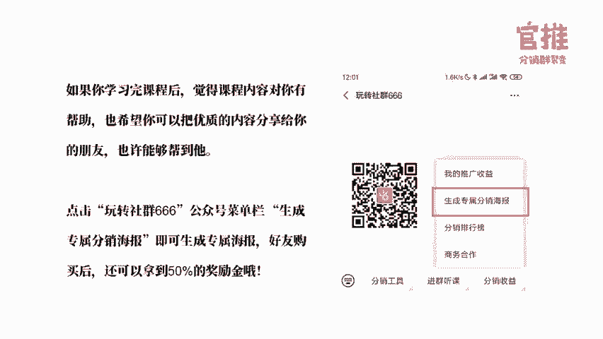

# 微社群裂变营销私域流量池增长秘籍创业运营销售获客视频课教程 合集 8套 374资料 13.1G 分销群裂变模式介绍及9大行业案例解析 - P7：第07节：这几招，帮你快速招募到大量微信分销合作伙伴 - 高端网创试错赚钱大师 - BV1Ux4y1b7xM

🎼今天正式开始之前呢，我要想跟大家说一下非常开心非常开心的一件事情。就是今天我在呃学员群里边已经有两位朋友跟我说。

他用了我们的那个讲的海报的打造的方法和我们前面讲过的分销类变的方式已经做出来对应的成绩了。其中盘叔跟我说，他做了一场海报的发售活动，转化率高达55%，进群人数已经高达1128人了。😊。

🎼另外一个是聚情社的朋友告诉我需两个都是叔哈，呃叫孙叔呃，不是就叫申叔哈。他说他在按照我的方式，今天试了一下。今在今天是用9。9块特价小范围的转发，超过100个后就马上涨价了。

现在是付费人数已经超过100人了。呃，所以呢大家是这样的，就是行动快的人，如果你真的去实操了，这个方法真的是还是可行的哈。😊，🎼好的，那我们前面说完我们开心的事情之后。

我们还是先来复习一下我们昨天讲的内容。😊，🎼好，昨天的内容我们讲到了怎么去写呃，就活动的文案。那首先呢呃活动文案里边的话其实是有两大坑的，一个是文案折叠。呃，文案折叠你又不管又不教哈，不教你的推广员。

导致你文案折叠起来，转化率是要超低的。然后第二个的话是你文案的时候是不分场合，不分对象的，就是说你的文案其实要分朋友圈的文案。🎼微信群的文案和一对一私聊群发的文案。这三种文案呢对应也是不同的角度的。

比如说朋友圈文案，你可以中转化，这个没有问题。因为你可能不是每一次都在做活动嘛。但是呢你在微信群里面做做做推广的时候呢，就不能那么强的推广的。而是更多的是重力他的角度。

而且呢往往很多时候你发微信群的文案，推广文案的时候，可能还要带上一个小红包，这样的话，大家才会关注度比较大。而且我也发现了带上小红包的转化率，一般会比不带小红包的转化率要高很多的。

而且大家对你来说也是会比较喜欢，而不是对你反感。那一对一一对一私聊的群群发的时候呢，更多的是注重双方的一个互动感。也就是说你要发送给一对一群发的好友，要让他接收到信息的时候。

跟的感觉到你是跟他单独对话的。🎼那讲完朋友圈的那个文案两大坑之后呢，我们给大家一条成交的公式。这个公式呢，大家按照这个公式去写呢，可以很快速去写出一个朋友圈的成交文案出来。呃，他按照四个步骤，引起注意。

激发欲望，信任建设，促进行动。那今天我就不展开讲了，大家可以回去我们昨天的课程进行复习。最后呢我也可以给大家就是告诉大家最快速去写文案的方式，其实是模仿加微创新。

那也给了一个文案的素材库给到大家也提醒大家，其实除了活动推广文案之后呢，其实你还要准备一下购买后的参考文案，还有个人号的一个进群啊，还有分销引导的文案。这些文案都要提前做准备好的。🎼好的。

那上面的复习的内容差不多的话，我们就正式进入今天的正式课题。今天讲的内容的话主要是几告诉大家，就是在我启动量第一的时候，有资源的时候，没有资源的时候，我怎么去呃找到更多的推广员去帮我推广。

那我没有大咖没有合作讲师没有合作的流量渠道的时候，我可以通过什么样的方式找到这些大咖和合作渠道。🎼那么我做了活动之后，发现推广员其实积极性根本调动不起来。虽然我也招募了一大批人，但是他们不发力怎么办呢？

怎么持续去刺激他去发力呢？今天的内容主要是根据这三个步骤来讲的。🎼因为今天的内容啊准备的东西比较多，所以我讲的语速会快一点哈。🎼那首先的话就是第一个部分，就是当你自己在打造产品的时候。

你发现自己没有讲师，或者说自己没有名气找不到大咖来当你背书和推荐的时候怎么办？第二个呢就是呃怎么去说服，就是就算你找到了这些合作的讲师，你怎么说服。🎼怎么说服这些合作讲师跟你合作。

甚至于说怎么去找到联合推广的合作伙伴，然后呢说服他们跟你合作。🎼我相信其实很多朋友都会遇到从同样的问题呃，尤其是在跟别人谈合作的时候，现在的话我也每天我都接收到几十条跟我谈合作的的的这个资讯哈。

说实话我就是看都看不过来。🎼但是呢你会发现有些呢我会很认真的去回复。有一些呢就是可能我就说哎那你月预算多少啊，那就是有一些问题呀，就是大家没有注意到，就是你找跟找别人谈合作的时候，其实是要做好准备的。

🎼好，下面我会详细展开来说。首先呢是怎么去找到合作的呃大咖。其实合作大咖其实在这一点上。🎼你自己去找合作大咖的时候，其实有几些方法。我常用的方法的话是有这三步。第一步的话就是勾搭大家呃都勾搭到大咖。

就是先让大咖知道我首先你先要找到他，对吧？找到他之后呢，让他知道我，就比如说你付费加入他的社群，加入他的线下课程，然后呢多给他打赏，多在他的公众号评论，这些呢都是可以让大咖知道你的。

很多人呢加入了别人的社群，比如说很多人也加入了的我的付费社群，包括呃很多人也加入了我的线下线线上的课程，对吧？但是呃有的时候我真的没有办法就是别人加入来，我都知道他。因为有可能我的学员太多了。

我的付费群有太多了，我可能几千人几万人，我没有办法识别到你，所以呢你怎么让我识别到你呢，让我知道你呢，所以你要想办。🎼办法在就是在大咖面前露出。🎼在他面前露出，让他知道你怎么让他知道你呢？

就来到了第二步，就是你要让他觉得你人不错，做事靠谱，靠谱这一点呢非常的重要，这样才会他才会重视你，然后呢才会愿意去帮你去做背书。🎼说实话，如果你跟我只是付费家务的社群，然后告诉我哎，能不能帮我推荐。

说实话我真的不敢，因为我帮你推荐，就拿我去去去帮你做背书嘛。那我我我我能得到什么呢，对吧？所以我一定很慎重，就要不的话就是的确我跟你长期接触，我觉得你这个人不错，做是靠谱。😡，🎼做事的确好。

所以呢我才会愿意帮你推荐，否则的话我对你又不了解，你只是付费了我一个产品。那为什么要被给你推荐呢？还要带上我的人品是吧？那万一我对你推荐，你还做了什么事儿，不利于一个学员，我还要背大锅呢？

所以我是很慎重的那照照我这个心理来说的话，其他的一个呃就是其他的大V或者说其他的KOL了也会有一段的心理。我为什么要去给你推荐。🎼那有两种方法。第一个的话就是。🎼你真的参加了我的活动，而且是深度参与。

比如说在这次的实操营当中，你真的参与了我们的实操，并且真的做出了很好的成果。比如说像盘叔，还有呃我们的孙叔这样的他很快就去行动，并且真的做出了成果。

那我就会觉得唉至少在执行力上他是有的那而且他有这做出成果，那这个人做事还是可以的对吧？有这样的印象留下来。那如果你能够在我们的实操营当中，在这么多团队的PK当中，你能得到冠军亚军。

那我会对你更深了更进一步了解。🎼尤其比如说。🎼比如说。🎼你在这次的PK大赛里边，你获得了冠军，那我肯定非常的重视你，我肯定会调研你而去了解一下你的身你的背景，然后呢进一步去认识你。

🎼这个就是就是这个是优秀的人，肯定是愿意跟优秀的人在一起的，是吧？所以你要展示出来你的右秀出来。第二个的话就是优秀的学员，你可以去参加他的活动，成为他的优秀学员。比如说呃每一次我都看到有一些朋友哈。

就是每一天的评论都非常的用心。你看96编辑器啊。😊，🎼他每一天学习完马上就做出了这个心得体会，我就对他印象特别深刻，就会觉得哎这个学员至少是认真，就是学习能力是很好的，而且他可以结婚则结合老师讲的东西。

马上给出自己的心得体会，学习力是很好的，这一点上是认可的，非常的认可，对吧？🎼那还有呢就是。🎼还有呢就是你如果得到了成果，你及时反馈给我，那我也会看得到就是大家是互利的一个关系嘛。你学了我的课程。

然后告诉我你做出了成果，那我肯定会帮你宣传啊，然后这就是这是互利嘛，你帮我做你你把你的成果告诉我，让我知道哎，原来我的这个教的方式，大家真的去实抄了，真的有成果是吧？那反过来说的话。

我也愿意去帮你去宣传。第一来的话是双赢。我宣传的时候也在证实我讲的东西是真的对吧？第二的话，帮你宣传的过程当中，其实为了做了大量的曝光。🎼还有呢就是多分享，就是很多人加入很多的大咖的社群。

但是呢其实进了社群之后，就在那里默默的潜水潜水潜水。其实这样的话对你一点利益都没有。🎼一定要多积极多分享，这样的话别人才会认识到你。🎼然后呢才会觉得你这个人的确不错。其实真正的不是你去认识别人。

重要的是让别人知道你这个是最重要的。然后最后一步呢就是你你搞定一个大咖之后呢，其实是可以。🎼很容易获得这个大咖，他的朋友的支持的。比如说呃就是当初有朋友找我的时候，哎，他就告诉我。

其实龙共龙共火火老师已经帮他做背书了。那我我跟火火是好朋友嘛。而且我知道火火其实是一非常靠谱的老师哈。他推荐的肯定不会错嘛，我信赖他，所以我也愿意帮他推荐，就是这么一个道理。

🎼你只要导搞定一个人就可以搞定另外一个人。🎼那么第二步呢，就是很多人在做那个大咖合作的时候，会让大咖来做背书的时候，是没有做任何准备的。就问哎，老师，你能不能帮我做背书。

就是这么一个简单的这这这个简单的一个说说法就过来了。实际上你会你会让他觉得很突兀。🎼就是一来你没有说明干嘛要给你做背书，然后我可以获得什么，我需要给你提供什么支持，就是一定要说清楚，找别人谈合作的时候。

一定要把合作方案就是对方要做什么东西，然后他可以获得什么，说的清清楚楚，这样的话别人才可能说哎我一目了然。因为其实大家都很忙。🎼我没有办法天天去问你，哎，你要我合作什么，你海报做出来了吗？

活动是什么主题，面对什么人群。🎼这东西请你先准备好，然后再来找，这样的话会更就是效率会更高。这个其实也是基本礼貌来的。就是你找别人谈合作，你一定去准备好合作的方案或者合作的需求，清晰的对接。

这样的话会比你盲目去谈效果会更好。🎼这是找大咖合作的一个方式哈。🎼那第二个呢是呃合作的。🎼讲师，那找合作的讲师怎么去找呢？其实这两天一直有同学在问我，就是说呃因为前阵子我不是教大家怎么去找。

就是自己不会讲课的时候，如果你想用课程来做那个活动的引引流品的时候，可以去找合作的讲师来进行合作嘛，让讲师来讲嘛。🎼你来推广嘛，要用户你来拿嘛，对吧？那怎么去找到这合作讲师呢？

就我就建议大家去找腰部的讲师呃，腰部的讲师其实很多人不懂哈，腰部的讲师就是有一些讲师top讲师，他销量是几万的呃，那这些讲师你很难合作得到。因为当当你知名度还不是很够的时候，你很难跟他合作。

腰部的讲师是销量几千人几千的这些平台其实就可以在千聊荔枝微课，喜马拉雅这些支付费平台很快是可以找到的。他是可以跟对对应的主题，对应的人进行筛选的。😊，🎼找到找讲师之后呢，怎么去找到他的自己的联系方式。

第一种的话就是教务。第一个，你看他的课程有没有社群，如果有社群就很容易找到他的联系方式。第二个的话，你找这个讲师，他自己的公众号或者微博，包括麦麦。🎼卖买这些地方呢都可以找到他的联系方式。

然后呢再去跟他谈合作。🎼那你跟他谈合作的时候，一样的道理，你跟老师谈合作的时候，跟大咖谈合作是一样的。你要提前准备好方案。🎼第二个方法呢就是可以在你的朋友圈微信群里面，或者说找经常参加培训学习的朋友。

帮你去推荐合作的讲师，找找到靠谱的讲师。🎼往往呢就是你自己的朋友圈的能量，你自己其实是不知道的。但是有的时候你一发，哎，真的可能是万能的朋友圈哈，有可能呢也也有一些万能的微信群啊。

🎼还有呢就是可以找经常学习的朋友来推荐。因为他经常学习嘛，他就可以知道哪些老师是是是是讲课讲的比较好的。🎼好，那怎么去准备跟导师合作的方案呢？我这里先给一份我们这次训练营。

我们找老师合作的方案样板给到大家啊，大家可以参考这个样板去写啊。🎼就是第一部分的话就是就是活动背景嗯，活动的背景先说清楚你的活动是呃做什么样的活动啊，为什么要做这样的活动。

第二个的话是主办方的简简介就告诉他是谁主办的，主办方是谁，然后呢，有什么的背景。第三个的话就活动的信息了。这活动到底是做什么样的主题，他需要什么的内容哦。🎼那我做的是训练营嘛，讲课程都是如此哈。

做训练营或者做课程，你提前要做用户调研的，所以我会提前去做用户调研，去了解用户的痛点。把用户的痛点做出来之后呢，我提供给讲师，讲师就很容易针对这些痛点去制定对应的主题，是吧？🎼还要告诉他。

如果是讲课的话，是在哪里讲，以什么样的形式讲。然后大概每节课需要多长时间，然后他大概的一个时间安排是怎么样的？这些信息呢都要详细去说明。🎼然后最后呢就是要说明合作的形式是什么样的。然后合作的权益有哪些。

这些地方都要说清楚，让他明确的知道我跟你合作，我来给你讲课，我可以得到什么。当然呃除了就是合作的权益里边，除了说一些资源互换呢？这些需求之外，还可以有一些更强简单粗暴的方式，就是怎么说服老师合作。

🎼最简单的方式你就给他课酬嘛，他讲一节课，你给一节课的课酬给他嘛。那有一些腰部的讲师课酬也不是很高。比如说一节课下来，他可能是呃几百块钱，几千块钱就可可以搞定嘛。那很多讲师就是几百块钱讲一节课就可以了。

因为有很多课程他是现成的。他只是过来讲一节课，而且你还可以给他曝光是吧？所以。🎼更简单粗暴的方式就是给客酬，你就告诉他，老师，你这边可以什么时候可以来我们这里讲一节课吗？我们会给对应的报酬。

不知道你的课酬预算就是需要大大概多少钱一节课啊，费用是怎么样收取的呃，这个的话跟他谈就可以了。这样给钱其实就比较容易合作了。那最怕是什么呢？最怕你就是没有资源，又没有又没有课酬，没有什么都没有给到人家。

就要人家过来免费给你讲，那这样的合作方案，你就千万不要给出来了。这样的话只会让别人鄙视你的就。🎼在这个圈子里面混，你自己要知道就是怎么样的形式规范哈，就是这样子才会有后后面的持续的合作啊。好的。

那讲完我们的讲师合作之后呢，继续我们往下走哈，就是前面呢通过大咖和讲师合作之后呢，我们找到了合作和倍书的大咖了。那接下来我们怎么的找到合作的那个呃共同推进的一个合作的伙伴，或者说优质的流量渠道呢。

其实有一些方法告诉大家哈，这是第一种的话就是可以去找竞争对手，他自己的合的活动。然后呢，我每次去参加别人的活动的时候，我都会额外去注意他这个联合的合作方。

哪些有哪些呃这个什么协作协协办方、承办方还有一些联合举办方都有哪些人，然后呢去主动勾搭这些人。往往呢就是竞争对手的活动，他的那些支持方。😊，🎼就是你自己的可以合作的那个。🎼呃，合作方。

而且往往呢就是如果你跟竞争对手去就是竞争对手的渠道去去谈合作的话，其实你自己去去了解过这个活动的话，再去找这个合作渠道去谈的话，他会觉得你呃非常的有诚意。第一个的话，他会认为哎你之前告诉我。

你已经跟呃哪个平台合作了，是不是可以跟我合作，那他就会认为你已经做足了功课，知道他是跟哪个品牌有过合作，是带着合作诚意来跟他谈的。第二个呢就是你可以去了解竞争对手的产品了。

那就可以知道他从哪些地方做的不足。就比如说他的质量价格，售后这些地方有哪些不足，就可以促成呃你跟渠道相关的合作。而且呢就是因为用户群非常的一致。大家有非常熟悉合作的流程容易达成合作的。

🎼但是呢谈合作的时候也一定要注意这一点，就是跟就是合作的渠道，谈合作的时候，也要准备好合作渠道的合作方案给到对方，让对方可以无脑操作。而且第二个的话就是你准备好的合作方案给到大家之后。

后面大家怎么去执行，也一样要准备好对应的素材给到对方，让他可以无脑操作。就比如说你让他帮你推广，那你就自己要准备好。哎，比如说呃海报啊、文案啊，还有推文啊，这些地东西，你自己要准备好这些内容。

然后再去找渠道去帮你推广。而且呢你准备好这些高转化率的一个相关的宣传文案，他去转有一定的转化数据给到对方的话。🎼对方会更容易接受。🎼而且高转化率的话，他也会觉得就是你真的做足了功课而来啊。

🎼因为你在转化率特别低的话，你会就是以后再也不会合作了，对吧？这是第一个。第二个的话就是你这个宣传的一个内容会不会很很很就硬广啊或者什么呀，他会有这样的担忧。如果你已经做好这样的一个文案给到他的话。

他一看哎觉得我的粉丝很契合啊，不伤害我的粉丝啊，那合作的方式会更容易一些。🎼还有一种方法呢，就是快速可以对接，就是优质的资源的，就是混群。混群其实可以帮助你快速对接有效的资源。但是呢很多人也会混群啊。

但是呢认为混群没有方向，其实你在混群的时候，你要有目的，要有方向去选群。第一种的话就是我不建议大家加入免费群。因为免费群通常就意味着就是。🎼运营管理很差，就意味着这个群其实是很难产生高质量的互动的。

这样的话就意味着这个群其实是对你来说是没有太多的价值的。🎼那付费群是我首选加入的社群，付费群它的方向可以选哪些呢？因为你主要是找资源嘛，找合作嘛，是吧？所以推荐大家加入什么群，创业者群，资源对接群。

🎼还有一些市场的联盟群，还有互推群，什么运营联盟群，这些群呢就是可以对接有效资源的。第二个的话就是私密的小群，就是比如说我有一些群就是公众号大号的群。这些群呢就是有一些门槛的呃。

必须是粉丝达到多少万才能进去啊，或者说你的粉丝达到呃就是好友好友超过多少人才能进去，这种就是有门槛的群啊，你自己要要有意识的去加入这些群。🎼这样的话才会有机会勾搭到更多的资源。那么在进群之后。

混群是有技巧的。再次强调一下，在群里面不要默默无闻的。🎼不要默默无闻，不要默默无闻。这样的话你只可能说沉沉没在烟烟的大海之中，你交了报名费，你又没有什么收获。但是一旦你重视这个群，多去在这个群里面冒泡。

其实你就会容易有很高的收获。那混群里边有两大技巧。因为为什么大家愿意跟你对接啊，无非就两种嘛，第一种牛人，你很牛，你很牛，我愿意跟你勾搭，大家都喜欢跟大佬勾搭，对吧？那你怎么证明你很牛呢？

那你就多干实事，怎么叫多干实事啊，你做做牛事出来，就是你把你的案例，你做的事情说出来展示给大家看。🎼这样的话才才能让大家知道哎，你真的牛。第二个的话就nice，就是你的人品很好，多发红包，多做奉献。

多发好的资料给到大家。这样的话也会让大家认识到你这个人很好啊，或者说帮一下群主去帮你做管理，这样的话也能证明你很好。🎼好，说明第一part的内容之后呢，我们来讲第二part。第一趴的内容。

我们讲到就是怎么去找到合作渠道，合作的讲师，还有大咖来背做背书了。那相当于说什么？我们前面的引流的产品已经准备好了。但是引流的产品准备好了之后，我怎么找到更多的渠道帮我推广呢？尤其是对于没有资源。

没有流量的新品牌来说，呃，或者说你自己小就是知名度不够高的时候，怎么去找到更多的推广员呢？很多人在做这一块的时候，其实是非常无错的。🎼其实我之前已经跟他分享过了，其实分分校推广也有很多的来源渠道。

这种呢是最常见的。🎼这10个呢是最常见的。第一个的话就是你的亲朋好友。说实话，你一个人总会有50个亲朋好友吧。🎼我爸和我妈是这么凹的人，他都他的微信都有几百人了，对吧？所以亲朋好友你一定能找到。

🎼几十个人的。第二个的话就是可以来源于是什么呢？你的员工和同事啊，员工和同事还有呢就是你的老客户啊，这些呢都是成为你最最坚定的最支持你的人啊，这三个。然后还有是谁呢？就是你刚才我跟你说到的。

你加入一些高质量的群。你在里边是熟人的群，同学群，或者说一些你经常参加培训的高质量的群社群里边，也是可以在这些成员当中招募你的分销队员的。还有什么呢？就是链接这些分销的达人。

🎼比如说多关注别人的分销活动，看一下排行榜排名前几名的都是谁，这些人能不能找到去链接这些分销达人。往往这些分销达人可能一个人20%的人就可以帮你创造出80%的销量。还有就是KOL了。

所谓的KOL就是在这个行业有影响力的。有资源也资源的人多去跟他们勾搭。还有就是社群的群主，就是因为做分销这个事情啊，如果做公众号的话，有可能有些号会很忌讳给你导流。但是呢社群的群主他不会忌讳。

因为社群一般会有很强的粘性，就算他给你导流，帮你做分销，你也没有办法代替他在他这个社群里面，群主的价值，因为年度很高嘛，他的一个销售转化率也会比公众号帮你导流的转化率要高很多。

🎼往往啊1500多名成员的社群的群群群主以及。🎼就是往往有很多人啊有1500号人的一个社群的群主，他可能会比60万的公众号，他的一个持续推广的业绩都差不多。所以群主在转化和带货能力上其实是非常强的。

而且他能有能力带货高客单价的产品，而公众号往往就做不到这一点。🎼还有一种呢就是微商。微商的用户的话，就是他本身是想要赚钱的嘛，而且呢微商有大量的人脉。对于你是教育类的产品来说。

跟微商合作是一个非常不错的选择。第一个的话是微商本身具备很好的学习动力，他们能够很快的就将知识来变现。第二个的话，好的微商自己也有自我包装的需求，可以帮你去分享教育和学习理念，有助于提高他们粉丝的黏度。

🎼我举个例子，你可以指导微商去展开微信群的讲座，指导家长们关于怎么叫游戏啊呃幼儿园升小学啊、阅读技巧啊这些就是从微商的角度来说的话，他就创造了他这个社群的价值，提升了他的信任度和年度，还可以做变现啊。

🎼还有就是保险从业者了。😡，🎼保险从业者也一样，而且呢保险从业者他身边的人员跟他的其实关系是非常高粘度的。因为他他身边的人要不的话就是买过他保险的人，要不是咨询他保险的人。

这部分的人群基本上都是高收入人群也是中高端人群，购买力是相当不错的。还有一种呢就是销售了，他本身是在做销售的。所以他其实本身有很多的客户资源。他除了可以卖他自己产品之外。

其实帮你做分销也是增加他收入一个很好的方式。所以这几种人群啊，你只要选出一两个两三个可以中正帮你充充当队长，而且是有能量的人的话，你可能就不后面的一个分销员的来源了。

我们之前在做完做社群运用的活动的时候。🎼我们当初是是招了4个队长，就是从我们之前参与的分销活动当中，我们去链接这些分销的达人，找到了4个队长，然后呢，让他们去帮我们去招募呃，分销的成员。

从而呢呃引爆了我们当初地场的活动。我们那场活动当初是招募到了100多人来帮我们分销。🎼就当天晚上一天就22四小时就有1万多人付费，就是那场活动，我们本质上就是通过四个队长带来了100多名的分销人员的。

所以大家身边其实真的有肯定有。🎼很多个铁杆支持你的粉丝，1个总是有的，你找一找，肯定可以找得到。🎼那么说完分销员来源之后，我们具体来来说怎么去做招募。因为很多人虽要招募队长了，知道招募队员了。

但是实际上要他操作的时候，还是觉得哎不知道怎么做呀。第一步怎么走，第二步怎么走。所以呢接下来5我们就实际的告诉大家一步步怎么去做下来。首先招募分销的比赛的人员时候呢，也一一般来说我们先提议大家先招队长。

因为队长是要比队员更重要的那队长呢招募第一步是什么？第一步就是要确定下来你的分销方案，并且明确明确的指出，作为队长有什么好处。一个牛叉的队长可以给你带来50%的销量的。

所以队长你要非常非常的重视主办方主要对接的也是队长呃，不是队员。🎼那么在队长的呃这个方案上面的话，我给大家两个两个可以参考的方案。第一个的话就是队长有额外的奖励。这个额外的奖励呢是跟他团队的销量挂钩的。

🎼一般来说的话，我会设一个呃销量，有一个就是起始值。比如说呃一旦它的销量超过多少单，每增加一单就可以额外获得多少钱的奖励。那没有超过这个单的话是没有奖励的，这样的话就保证了，就是如果他能力不行。

🎼做的不够好，那他是没有奖励的那就要拼命做的好才可以有奖励。这是第一个这个的话是跟他的那个团队的销量，每一单都挂钩的。🎼第二个方案呢就是跟他的团队总销量的单量挂钩。而是呢它达到某一个等级。

比如说团队的销量在100单到200单之间可以获得什么样的奖励。这样的话就是按等级来算。呃，很多人的话就是等级的话，你不要设的那么。🎼那么大嗯，你主要设的合理一点的话。

很多队长为了升等级也会帮你去冲销量的。在队长的奖励上面一定要记得，就是队长的奖励其实蛮重要的，不要忘记去设这个了。🎼好，你准备好分销方案和队长的奖励方案之后，第二步是什么呢？

第二步就是招募招募怎么招募朋友圈微信群去发募你招募信息。呃，招募的文案我在这里给大家展示一下，就相当于说我先建一个微信群，告诉大家我要招募这个分销推广员。

然后呢再结合一条朋友圈告诉大家为什么要参加我们这个呃分销的活动，这个活动的撰写的方案就按照我们之前所说的。🎼引起注意。🎼然后勾起勾取欲欲望，然后信任背书，然后促进行动，就按照这个公式来写就可以了。

🎼然后建了微信群之后，大家都是少了微信群了吗？在在群里面去告诉大家我们这个分销方案是怎么样的。然后呢，你要报名当队长还是报名当队员。这个的话就是第一步，第二步要做的事情。

就朋友圈和微信群都可以去发布这个招募信息的。🎼那除了我们在朋友圈和微信群去发之外，呢这种的话就是当你是一个大喇叭。🎼你大喇叭告诉大家，我要做活动啦。然后呢，有没有人要参加了，参加了，加我进群。

🎼但是呢有一些有能量的队长，他未必会看到你这个消息是吧？所以呢你自己要留一些有能量的人。比如说他本身推广能力很厉害，他自己有很多资源，或者说他自己在以前的分销活动当中排行比较靠前。那这些队长的话。

你如果看中他的话，你就要私聊他。然后特地特地的去邀请他去参与组队。这样的话才可能提高你的这个转化率，否则的可能别人有可能别人没有看到你这个信息，那有一些能量的队长本来是可以参加的，却没有参加到就可惜了。

🎼好，那招募好队长之后呢，就是别人不是要去呃报名队长了吗？那报名队长之后，你就单独去组建一个队长群，然后在群里面进行规则说明和培训。🎼首先呢很多人当队长这个事情很多人是不了解的。

估计没有参加过分销比赛的人，其实根本就不知道队长是怎么一回事。他也不知道怎么玩。所以作为主办方，非常要注意的是你要提前准备好作为队长他怎么去招募他的分销队员的操作教程。这个教程呃，我我已经准备好了。呃。

是一个参考的，大家可以在我们的公众号后台回复组队教程，这个来获得我们参考队长的一个组队教程。🎼到时候呢就是大家可以按照我们里面的教程，然后准备一份这样的教程给到你自己的这个分销的呃活动的队长。

让他按照你这个方法去招募他的队员。因为甚至于他连发朋友圈的话术，他都不知道应该怎么发。所以你自己要把这个戏这个东西先准备好，作为主办方来说，如果你没有准备好，有可能就是队长在做的时候一脸懵逼。

那效果肯定就很差了。🎼那好，那准备好队长群之后呢。🎼大家就是队长就进群了嘛，那队长进群之后，你自己要培训的，就是告诉大家我们究竟是要参加什么样的活动。这个活动是怎么样子的，什么时候开始推广。

大家可以得到什么样的收益，要要把你这个分销的规则，活动的方案进行说明，然后给大家做一次培训，让他先了活动的一个过程，很多人是没有做这一点的。就是你没有做培训，导致说很多人根本对你这个活动，根本就不了解。

你到底要推什么样的活动啊，怎么参与啊，我怎么去拉人呢，这些东西一无所知。所以你要提前去做这个培训。😡，🎼好，那做好培训之后，队长不是要开始呃组建这个队员群，他要去招募队员了嘛？

那接下来你就要确定这个队长和队员的名单，要给他准备好一个报名的链接，让他去呃报名。🎼就是你要确保一下哪个队员是在哪个队长名下的，所以你要准备好一个报名的链接，让他去报名。那一般来说的话。

我们是可以采取呃官推后台来进行就新建一个活动。就这个活动的话，专属于用来分销组队报名用的。🎼就是你可以正式的活动，正式的推广活动弄一个链接，然后呢，分销的活动，另外再弄一个链接。这个分销的活动。

它的目的主要是统计这个队长和队员之间的关系。它主要是统计你的队员名单的，这样的话就方便你后续去结算你的战队的一个额外的佣金，或者额外的奖金的时候，可以方便去统计出这个结果出来。🎼那怎么去创建呢？

首先点击创建一个新活动，在官推的后台可以添建创建一个新活动。然后呢，创建之后呢，你在这之前你要准备好一个战队的报名海报，这个战队的报名海报不用做的很漂亮。其实我一般就是用PPT搞一下就行了。

就是说明一下是什么样的活动，以后分销组队报名。因为我们这个官推的后台啊，它是可以根据你的呃就是可以自动去调整你的报名的昵称啊，这样啊还有那个海报的那个二维码呀，这些都是可以随意去调整的。

而且大小啊位置啊都是可以随意调整的。呃，所以呢你是可以按照我们这样的格式去把你的组队海报给做出来。🎼海报做出来之后呢，就是在后台上架活动嘛，上架活动的时候就把这些参数输进去设置好就可以了。

🎼那有一些朋友可能就有疑惑了，就是可能你用的是体验版和跟平台版专业版机构版的用户。他其实在功能上是有区别的。因为平台版和专业版机构版的用户，他会有更高的一些权限。比如说他价格可以设一分钱。

那体验版的用户的话，最低是设1块钱嘛。所以呢呃这里边在设置那个报名的过程当中的话，有一点点小区别。比如说你用体验版，你用体验版的话是可以把价格设高一些，比如说99599块钱。那强调的是让大家不用买。

因为有有时候你要让他支付1块钱的话，可能队员就不报名了，所以你要强调大家不用买点击一下授权就行了。实际上这个报名，只需要获取队员和队奖之间的关系就行了，不用购买，也可以获取到这个关系的。

主要他这个队员扫了队长自己的一个海报专属二维码进来，后台就可以记录，他是从哪个二维码邀请进来。🎼的了，你就可以把这个公用户关系记录下来了。所以对于体验版的用户，你可以把价格设高。然后呢强调大家不用购买。

点击授权就可以了。那对于平台版和专业版机构版的用户呢，你可以把价格设为一分钱，让大家报名支付一分钱来报名。那这样的话是可以获取到更精准愿意帮你推广的用户的。🎼那还有一些要注意的是呢。

因为这次的话我们是让队长可以生成自己的战队海报，而，队员他不需要生成自己的海报，只要扫码呃战队长的海报报名就可以了。所以你在后台设置的时候，你要启用你的分销功能。但是呢把分销按钮隐藏起来。

这样的话队员扫队长的海报进去的时候，他看不到那个按钮，这样的话他就不会生成自己的那个呃就是海报了，就避免了有些队员他自己也也去生成自己的海报，然后又去报名，就导致你这这个数据，到时候会混乱。

就没有办法把所有的数据都归归到那个队长名下。🎼那在这里边的话有一些注意的细节，就是呃因为战队的报名跟那个下单购买它是不一样的。我们光推的后台呢，就是那个购买订单那个按钮是可以改文字的。

🎼那因为我们默认的那个文字叫马上购买嘛，那因为你是主要是招募队员嘛，所以呢这里面文案的话是要稍微变会更好，稍微变动一下会更好一些。比如说你体验版的用户，因为不用他购买嘛，不用他购买。

你就把这个按钮的文字写成你已成功报名分销组队就可以了。那他点击进来，很多人懵逼，觉得我是不是报名了，他一看到你这个按钮就知道哎他已经报名了。那如果你是使用平台版专业版和机构版呢？

因为你下面是可以支付一分钱的嘛，还是让他支付，这样的话可以筛选出更有效的用户，这样的话，你就会把下面的文字改成支付一分钱，一直报名参加组组队分销，这样就可以了。🎼那同样就是你自己在做活动的时候。

比如说你是参加社群，那底部就是可以马上购买入群。那如果说你参加课程，那是马上购买听课，就是这样的方式去改动跟你的这个场景相结合，就是可以自定义去设计一些文案。🎼好，我们继续往下。

那前面我调后呢呃就是把这个活动就生成了，生成这个活动之后呢，你就把活动的海报复制。🎼下来，然后发给队长，让队长生成自己的专属战队海报，让他把他的战队海报发给他的成员去推去去报名。啊，就是这么一个过程。

嗯，那在后台的话，就是如果有人扫了这个队长的海报进来的话，授权进来的话，他是可以马上就看到他的推荐者是谁的。就是你后面如果要导出这个名单的话，就是体验版的用户，你就点击用户数据。

然后就可以直接把你的一销表格导出来了。那如果是平台版专业版机构版的用户。因为刚才是设置的让用户支付一分钱嘛，那你就筛选一下呃，筛选已下单的用户数据再导出来就可以了。这样的话就可以把战队数据全部导出来。

呃，就可以知道哎哪个哪个用户在哪个对价了。🎼那导出来表格之后呢，我怎么一下子就把那个队长和队员之间的关系来进行整理呢？这里的话我给大家具体的方案哈，因为我们讲究的事实操盈。

所以要告诉大家每一步怎么去操作。你导出表格之后呢，你就全选这个表格。然后呢，在一销里边有一个插入数据透视表这么一个功能，点击插入透视表，然后再点击设置，在那里把队长和那个呃队员的人数进行设置一下。

你就可以统计出来每个战队的总人数了。啊，这个数据透视表，大家如果不会用，也可以百度一下，其实很简单，而且透数据透视表。如果在数据统计上，如果你会用的话，真的是帮助很大的。🎼那在这里特别注意的是。

就是很多人在做这个战队报名的时候，就忘记了队长本身，就是忘记给这个战队的队长加上他自己了。所以你在呃队长名单统计出来之后，知道哪些队长生成自己的海报去邀请别人去报名了。你要把队长的名单自己再复制一下。

到队员那里去。然后呢，旁边队长的。🎼队长就是队长自己啊，然后呢要注意一下，就是数据透视表，它是每次数据更新，你自己要去刷新一下数据才会出来的。🎼哎而且呢要提醒大家，就是你要用哪个微信号去分销。

就用哪个微信号去报名分销，否则的话到时候很难统计得上。因为我们要跟户根据你的用户昵称来对那个数据的。如果你用的这个微信号是A。然后另外要用B微信号去推广的话。

你报名A的微信号昵称跟B微信号这个昵称对不上，就会导致到时候统计起来的时候，你这个名称对不上数据就混。🎼好，那前面呢我们统计出来这个队长和队员的这个名单的方法告诉大家之后呢。

就是前面队长等这个步骤我们已经搞定了。那队员怎么去招募呢？这个其实是要大家去告诉队长自己怎么去做的。所以基本上我们就是在组队分销的时候，队员招募的节奏就是这样的。

首先第一个让队长先把自己的战队微信群建立起来，然后呢自己在去朋友圈，微信群去发募呃，招募队员的信息，然后呢或者要私聊有能量的队员加入他的战队。呃，这两个方式同时去运用。

反正就是让大这个队员先加入他的微信群里面。然后他在群里面去进行规则说明和培训，告诉大家，我们这个活动是怎么样的活动，大家要跟着他一起玩。🎼然后队长。🎼队长再把这个战队的报名海报发给队员，让队员去报名。

这是这么一个步骤啊，一步步下来的这个步骤下来的话，就是可以统计出来，就是整个队员和队长之间的关系。然后对队员的报名这个流程的话，就按照这个步骤来。那以上的所有的节奏，还有以上所有的操作。

其实我都有准备对应的资料给到大家。因为有些人的确在实操的时候，可能会遇到一些细节上想不通，那我就会把细节全部告诉给到大家，把这个细节呃，就是怎么去写的话术呃，怎么去呃操作的，这些都告诉大家。

🎼这个到时候大家在玩转社群6公众号后台回复组队交程就可以得到这份资料了。🎼好了，那前面我已经把队伍组建起来了。那接下来大家可能一个疑惑了，可能我组建了团队了。

就包括今天也有个朋友说他已经把团队组建起来了，也在继群活动了，但是大家不给力啊，大不发，就是大家不发，或者说大家不持续发，这个到时你怎么办呢？你怎么持续让他去发力呢。

你这你怎么调动这些推广的人员早上给你发，中午给你发，晚上给你发，第二天给你发，第三天还给你发，结束时候还给你发呢，持续的给你发呢？🎼呃，不是刚刚开始第一步就发了就没事了。这个时候的话就是有很多的技巧哈。

我我只是把我自己的经验总结给大家，就未必说我这个经验说是很系统了。但是我真的是这么做的。🎼首先第一步。🎼这个是很多人都会犯的错误。🎼就是自己呢呃在做活动的时候呢，很着急去找推广渠道。

很着急去把分销人员都组建起来。但是呢却忽略了。🎼但是呢却忽略了第一步就是你的第一步是什么？你给人家推广的这个产品好卖吗？😡，🎼你给别人推了这个东西，你做过用户调研了吗？你发过朋友圈了吗？

你这个朋友圈发出去之后，有多人买了，你做过测试了吗？你给人家发的那个文案，是不是真的是转转化率高的文案呢？😡，🎼你给人家做这个海报，这个海报发出去是不是真的好呀？你做过测试了吗？你真的做过调研了吗？

你连真真真正的这个基本的素材没有准备好，就让大家给你发。那当然了，可能第一波大家因为信赖你都给你发了，但是发了之后发现没成交。🎼然后问了一圈，没人成交。那你想一想他会有什么动力给你持续法。

🎼所以很多人很多操盘手都会犯的一个问题，就是你急忙的把渠道啊什么都准备好了。但是最重要的你的引流品没打造好，没打造好，这什么？🎼就会导致你的转化率低，导致说别人帮你转发的时候，其实效果很差。

就导致说你第二次再去让人家帮你推广的时候，人家会觉得你这个人不专业，我不跟你玩了，就是这样。所以这个点啊真的非常非常重要。你在做活动之前，你真的要去做用户测试，你把你的海报弄出来，去做调研。

去问一下真实的用户告诉问大家你会不会学习，你愿不愿意付费学习，你看得懂是讲什么吗？你愿不愿意帮我转发这个东西做个调研。第二个，你选选一个小号，或者说你自己有大号的话，你分组。🎼然后呢。

按照你的海报有文案和那个海报发一下朋友圈，看一下有没有人下单哈，这个非常非常重要。如果都没有人下单，你自己发都没有人下单，你想一想会有多少人下单。🎼的时候会有多少人下岗呢？🎼所以在这一点上。

大家一定要注意，你提前要真的做好这个测试，否则就是坑了你也坑了你的合作伙伴，也坑了你的那个推销推推广员哈。当然，如果刚开始的时候，当然还是有补救的机会的。比如说你第一波活动发现哎，效果不好。

那你赶紧调整啊，你不要懒呢，你赶紧把你的海报重新弄一个主题呀，把你文案马上改一遍呢。🎼你不要懒啊，你不要觉得这个效果不好之后，自己就丧失信息了啊，这活动吹不起来了啊，好郁闷好郁闷，好郁闷有什么用。

赶紧改呀，迭代呀。没有人活动一推出来就爆的是吧？所以就包括我去年在做一场这个电商演习社的时候，刚开始我以课程的主题去打的时候，我也发现就是效果不是很好。后来的话马上就做了几版海报可以去迭代。

然后发现就是那个呃社群的方式还是好的很，所以一定要注意在做活动的过程当中，一定要随时根据你的数据来进行调整。我们官推的后台是提供了很完善的数据给大家去看的。你的付费转化率可以马上就看得到。

你每一个小时的成交率，在你的海在官推的后台都可以明显的看得到。然后海报的点击率，每一张海报的点击率都可以明显的看得到，而且后台还可以提供你每一个用户他进来了，访问了多久。😊，下单这个数据都清清楚楚。

大家可都可以在用户数据那里看的清清楚楚的这数据就方便你做决决策啊。🎼好了，那你确保你自己调研过用户了，确保这个真的是转化率比较好的这个内容了。那怎么持续去调动这个分销人员去帮你积极推动去推广呢？

🎼我给大家分享一下我去做的时候的五大招。我的五大招就是下面这个给信心晒收入加数点范通数据。究竟这5个方法是讲什么？我给大家。🎼就是用案例的方式给大家展示一下，让应应该就很明白了。

第一个给信心给信心是什么意思？第一个就是持续提供宣传素材给他。🎼就是你希望他天天发，希望他每早中晚发，那你自己是不是需要早上中午晚上都提供素材给到大家。而且早上中午晚上你都告诉大家可以发什么样的文案。

你要持续提供这个素材给到大家嘛。第二个，你要让他帮忙你去推广。那你推广的东西靠不靠谱。你需要给对应的宣传素材给他，他才会知道判断出来你这个东西是不是靠谱。比如说我在做分销实操云的时候。

我让他帮我推广的时候，我真的是有人在做推广的时候，因为我们之前有很多的用户哈，这用户推了之后，他真的效果很好，他就发出来了。那我马上就把这个内容截图发给队长们告诉队长，哎可以把这个内容发给你的团队。

让他们用这个截图来做宣传的素材。因为这个截图在写写说什么，说的就是我这个方法很有用啊，我帮他了，我帮了。🎼他一天几体就是在零筹资的时候呢，就赚了1万块钱呢。🎼所以大家自己在做活动的时候，你作为主办方。

有没有持续去给到可以帮助你提高你产品的一个实力，或者说呃成交的素材给到你的战队的人员。第二个有没有持续去帮他打气。持续去触动，然后持续提供这个文案素材给到他，这个是非常关键的。

因为有的时候就是你推动一下，他就动一下，真的忘记不起来了，很多人是都很忙的嘛，他又不是专门帮你做推广是吧？🎼第二个的话就是传递别人的成功。🎼就是有些自己可能自己发了不一定成功，但是别人发了马上就到账了。

马上就成交了。就是传递别人的成功，可以有一个信心给到大家，有可能会让他觉得哎可能我发的话术不对。可能我发的文那个时间不对，可能我发的微信群用户不对。这样的话他就可以多做尝试。因为别人赚到钱了。

而且很快就赚到钱了，就传递别人成功，可以促进他，让他相信你这活动是好的活动，成交率好的活动，可以帮他赚点小钱的活动真的是可以赚钱的活动。这就是第一个就给信心。🎼第二个叫晒收入。

晒收入的意思就很多人都明白了，就是把你的收入晒出来嘛。即使到账了，那即使到账是在哪里到账呢？为在微信钱包，这个钱是马上到你微信钱包啊，你把这个截图晒出来。

这样的话给大家的冲击力要比你直接说我微信钱到钱包的冲击力要强很多，这有画面感嘛。有的时候可能你还要做视频，就是把你这个这个到账了整一个素材啊，就是做个视频滚动的视频，让大家看到哇，这个人赚了好多钱。

第二个的话就晒总收入嘛，就可能有些人赚了几千块钱啊，一下子你晒出来的话就很轰动的。🎼好，第三个方法呢。🎼第三个方法的话就是教方法，就是很多人不懂得分销，就是他有心帮你分销的时候，他自己根本就不懂。

所以作为活动操盘手呃，你自己一定要懂。🎼所以大家才需要来学习，知道吧？🎼就是你要教方法给到他们，告诉大家怎么去做分销效果才会好。🎼比如说我们统计的一个呃朋友圈呃怎么发什么时候发效果才会比较好啊。

早上的时候，他用户是什么样的是什么样的一个状态。然后呢呃什么时候下单率会比较高。比如说哎7点前很多晨喜成型型的人他就会比较理性思考嘛。这个时候呢他会比较容去容易去下单去购买课程，就是7点前啊，然后呢。

第二个呢就是这个8点到9点是黄金的时刻。这个时候大部分人在赶路，会阅读较长的文章和内容。这个时候呢，你去推广效果也会比较好。但是呢9点到12点，这个是个雷区，很多人在认真上班，很少去看手机的内容。

就算看也是为了订餐比较匆忙。🎼到第二个黄金时间呢，又是中午，中午的时候是午休时间啊，然后呢就到小黄金，小黄金是下午茶时间，然后呢就到晚上这个晚上的一个黄金时间，就是8点到9点半，这个也是金时间。

🎼所以你根据这个方式呢告诉大家，哎，什么时候是朋友圈成交的高峰期，现在去发朋友圈，这个成交率会高很多。那怎么去发朋友圈，才不会让人家觉得这个就是比较烦，比如说你发宣传海报哈，你这你这个这个小时发了。

那接下来你还要发怎么办呢？如果你要重复发，别人会觉得你在刷屏，很引很引人讨厌是吧？第二个的话就是朋友圈它是有降权的。比如说你朋朋友超过3000人的话。

可能只有只有就是每个小时看到你的人可能只有两三0百人。那就算你3000人，你发一条朋友圈，以为真的有30人看到吗？不可能只有两三0百人看到。那你就要持续去发。所以作为我们通常经常做分销的人来说的话。

我们就知道我要需要把我一个小时。🎼发的海报删掉，再重新发一条，那新的一个小时又会有两三百人看到，然后再过了两个小时又删掉，又重新发一条，这样的话才会让他触达到更多的用户。

另外的话就是触达更多的用户同时又不会引起别人的反感，因为他始终看你朋友圈就只有一条嘛，是吧？🎼另外的话，你要告诉他的一些成交的方法。比如说我会告诉大家在社群里面成交怎么成交效果比较好。

比如说发一个小红包效果比较好。比如说你分销，你分销能够拿50块钱佣金的话，就告诉大家，哎，大家课程找我购买，我可以给你10块钱红包。你是就就别人找你购买，你再给他返10块。这样的话。

别人会觉得哎我从你这里赚了便宜哦，他就会乐意去找你购买。有的时候呢会特意找上你说哎，这个课程我我我从你这个购买，有没有红包返现呢，他会有这样的一个呃主动找上你的一个这这么一个这么一个行为。

因你要把你会的分销方法告诉大家，当然具体怎么去做朋友圈成交，怎么去做分销成交。郭亮亮老师会在他的课程里面详细去告诉大家，他通过分销每个月赚6万块钱。🎼你愿用6万以上的分销的分销的一个大神哈。

所以到时候月亮亮老师呢会告诉大家怎么去做，具体怎么去操作。因为我讲的内容的话太太多了，我今天就不详细在这里讲了。🎼好，教完方法之后呢。🎼第四个呢就是数点范了。什么叫数典范？🎼就是说。🎼有一些人做的很好。

有一些人做的不好，那做的不好的人肯定有他的问题。那做的好的人肯定有他的方法。所以你做的好的人，你要去调研他，你要告诉大家去做调研，说，哎，我看你排名第一哦，你是怎么做到的呀，技巧和方法呀。

这样的话你去问他哎，你用了哪些技巧和方法呀，你把他的方法就可以教给大家。比如说我们当初在做辣妈这个活动的时候，😡，🎼第一名的伙伴在第一天第二天的时候就成交了四五百单，我瞬间惊呆了四五百单哎。

不是四五十单。唉，我就去马上调研他问他为什么怎么做到的。然后他就告诉我呃，他是怎么做的。然后我就把他的方法复制告诉了我们的队长们，然后让队长们去告诉他的队员们。😡，🎼其实在做这个方法。

在这个方法传递的过程当中，其实他们在做分销的过程当中就学习到很多推广的方法。🎼对他们参与分销团队的人来说，第一个他在你这个活动里面赚到了小钱。第二个也学习了很多通广营销的方法，他就会觉得学有所成。

跟着你玩很好玩。我喜欢跟你搞事情。这就是为什么我们每动的时候，这就是为什么我每次搞活动的时候，都会有很多人来参加我的分销，就是这个原因。因为我每次他参与的时候，我都会给他传递很多的方法和技巧。🎼那。

🎼前上一次的时候就是就是辣妈这个活动，我传播我传播了这个方法之后，我们会发现有另外一个队长，他其实销量为一，你知道吗？他推广的时候，他销量为11一个团队成交了一单。但是当他知道了这个方法之后。

🎼他按照这个方法去复制。🎼瞬间一天就成交了100多单。😡，🎼他就告诉我，他就是因为我在群里面分享了这个引流的思路，所以他去抄船了。然后呢，他很快就有这样的一个方法，很快就有这样的一个成果出来了。

所以你自己要去把你的典范树立起来，然后呢去找怎么去做到的，然后把这做到的东西传呀，这样的话很多人就学到了这个方法，你就是要把牛人的经验复制出来啊，就是在做分销的时候也是非常重要的。🎼好，那输完典范之后。

第五步呢就是什么？第五步的话就是要。🎼通数据什么叫通数据啊？就是你的数据要及时反馈给到你的用户，就是参与分销的人呢，他虽然是有即时到账，这样及时反馈。但是因为他是战队PK嘛，战队PK的话。

他就要及时知道哎，我这个战队现在排名第几啦。🎼我能不能得到这个奖励的一个门槛了呀？我要不要继续发力呀？我要发力多少单呢？🎼我要发力多少单呢？然后呃如果我要得到那个排行榜的奖励的话，我现在是第几名啊。

我还差多少单呢？🎼这些数据你作为主办方，你就要及时掌握，并且及时告知大家，这样才会促使大家大家知道这个数据。同时呢呃及时去了解你这个活动的情况。像我的话，我就会比如说我们这次活动，我们就是涨价的活动。

每满500人，我就涨10块嘛。那我就会告诉大家。比如说呃还有100人要涨价的时候，我就告诉大家，还有100人就要涨价了，大家开赶紧发力，告诉所有的人就是现在不买的话，马上要涨价了。

再买的话要贵贵10块钱了。呃，这样的话就会促使到所有人去发力一番呃，就实是这个数据的通通数据及时反馈。第二个的话就是你你有有有一些就是个人排行榜，比较靠前的用户，你就可以告诉大家。

比如说在活动最后结束的时候，排行榜前几名不是有奖励吗？那你就可以把后进就是落后的那些人私聊一下他，告诉他，哎，你还有几单就要超过前面的哦，你还差几单哦。🎼你要发力啊，要加油啊，然后呢。

要告诉大家别人是怎么做的啊，你可以按这个方法操作一下，这样的话也会刺激它去就是持续发力。那同时呢官推的这个分销排行榜呢是实时更新的，大家也可以及时在前端页面的话，及及时的看到这个分销排行榜的数据情况。

然后呢，及时去截图告诉大家，哎，现在排名第一是谁呀？第一已经多少单了，刺激一下大家，这个是非常关键的哈，这些步骤你看似看起来好像没什么，但是做了之后效果真的很不一样。😊，🎼那怎么去统计到战队的数据呢？

这里的话我把具体的步骤告诉一下大家哈，就战队的数据的话就是分销排行榜。🎼在关退的系统后台是有一个分销排行的。你把分销的排行，这个数据导出来的话，它是可以直接导出exel表格嘛。导出Eel表格之后呢。

它是直接把这个数据展示出来了。但是呢导导出去，它那里有一个呃就是数据呢会有一个。🎼就是啦这个叫什么绿色的小小小标签在左上方，你要把这个数据呢点击右键全选，点击右键转换为数字才可以。

这是在所有一el表格都可以都可能会遇到的问题，就是你导出来的数据，它并不是数字，它只是看起来是数数字但是实际上你要把它的格式转化成格呃这个数字才可以啊，就是需要大家注意的。好。

导出那个数字的格式要转化成格式之后呢，你就在在右边新增一个列，就是要把每一个分销的这个用户，他是归属于哪一个队伍的。然后呢，哪它的分销的数量是多少。你要把这个数数数据一对应上嘛。

所以呢需要用到一些技巧的公式哈。🎼呃，这公夫是什么呢？😮，🎼我们不是把那个战队的名单给统计下来了吗？那我知道哪个队员在哪个队长名下了吗？你就在他的队长旁边再新增一个列叫分销数量。

这样的话你就是想要只要把分销数量，就是这个用户对应的分销数量给给展示出来，你就可以统计出来这个战队的这个推广的数据了嘛，那这里需要用到一个函数啊，因为你有两个表格，一个呢是战队的名单的表格。

第二个表格的话是分销排行榜的表格，分销排行榜呢是可以统计到每一个人推广的多少量。但是呢分销排行榜没有战队数据嘛，他不知道这个人属于哪个战队嘛，所以你要把两个表格统一到一个表格里边，怎么去统一哈。

哦又开始上一销表格的课程了哈。一销表格里边呢有一个呃这个函数叫呃workup的函数哈。🎼这个函数的话是可以帮你将两个对额的数据就是进行一对应的。它这个函数呢，它就是上面我写的这个就就是第一。

你你你输入V这个字，你就可以找到这个函数了。这个函数的一个格式就是这样的。第一个呢就是数字，这个数字呢你就选中这个队员的名字。那一那一个单元格。🎼然后呢，第二个呢就是。

🎼这个这个名字要在哪个哪一个区域里面筛选。比如说我们这次的话，我们是在战队的报名名单里边新增一个列，这个分销的数量，这个列呢是在分销排行榜里边找到这个数据的。所以呢这个查找的区域是在分销排行榜里边。

你就把分销排行榜，这个列全部选上，就是上面那个列选上，你就不要全选，你就选上所有的列，这样的话你就数据增加了，它也不会出错，所以你选中列。然后第三个的话就是这个列是在你就分销数量是在你这个列的第几行。

🎼就是比如说分销排行排行榜，你下载下来的话，它的数量就是分销数量在你的第四行，你就写4。如果是在第二行，你就写2，反正就是在第第几列就写第几，最后呢写零就可以了。这个这个这个数据就是这样的意思哈。

就是可能有对的对他来说是不是有点难懂。那大家就是这么一个意思，就是第一个选对员的单元格。第二个呢选中这个分销的排行榜，就是选中三个面的列。

然后第二个的话就是然后第三个的话就是那个分销排行榜对应的这个分销数量是在你这个分销排行榜里边的。🎼哪个数字就是第几列就是在第几数字啊，就是这么一个这这么一个排名。你只要设置好之后呢，它它一一点击往下拉。

它就可以把你所有的数据一一都对应起来了嗯，就发其实呢相当于说你把这个表的表格下载下来之后呢，需要简单的数，就是你熟悉之后呢，其实简单设置一下就可以得出来了。然后呢，再用分销。🎼再用那个这个数据。

🎼透视表的方式，把这个表格的龙虎表统统计出来就OK了啊。只不过呢你每次就是比如说我今天统计的数据，明天又统计嘛。那每次你就是把那个分你知道分销的战队的队员名单，其实你在最后截止时间的时候呢。

其实不会变了嘛。每每次变的就是分销的排行榜的数据，你就把分销排行榜呃重新导一下，然后再把这个原来的那个分销排行榜覆盖掉就可以了。只是呢每一次的话你要用数数数据透视表把这个战队的名单统计出来嘛。

所以你每次在选择的时候呢，都要重新刷新一下数字数字，然后呢，在筛选的时候，把对应的那个这个分销员分销的所候的数量，这个数据全选上。呃，当然我觉得这个步骤呢稍微有一点点复杂。

所以呢呃呃我特意准备了一个很详细的步骤告诉大家。如果说你不是去。🎼分销组队，而是直接采用那种就是不用站队数据的话，而是直接采用那个呃分销员呃以及排行榜排名前几的第几名的话，就不用去统计这些数据的。

就因为后台是可以直接看到排行榜前几名是谁嗯，然后呢，后台会自动结算那个分销佣金嘛。所以如果你不是去组队。🎼不是举行战队PK大赛的话，其实没有必要用到我今天所说的这个统计战队的这么一个过程啊。

只是说我为了方便大家在做这个活动的时候呢，尽量的把所有的东西都交给大家。所以我今天的讲的就比较详细。🎼好，以上呢就是今天讲的所有的内容了。好，那今天的任务是什么？

今天的任务呢就是第一个就是在玩中社群66后台回复关键词组队教程来获取呃组队的一个教程以及队员招募的一个教程。第二个呢就是登录官推分销群那变系统，然后进行分销活动的配置。如果你组队的话哈。

如果不用不组队的话，你可以不用去配置这个活动，然后呢，你就开始招募这个队长和队员了。呃，这个使用的教程，我也发给大家。嗯，有什么问题的话，也可以在群里面问。好，今天的内容就到此结束。

🎼我们所有的课程都支持随时回看，大家可以在玩转社群66公众号菜单栏听课入口处进入观看。🎼如果你学习完课程后，觉得课程内容对你有帮助，也希望你可以把优质的内容分享给你的朋友，也许能够帮到他。

🎼点击玩转社群666公众号菜单栏生成专属分销海报，即可生成你的专属海报。有好友购买之后，你还可以拿到50%的奖励金哦。

