# 微社群裂变营销私域流量池增长秘籍创业运营销售获客视频课教程 合集 8套 374资料 13.1G 分销群裂变模式介绍及9大行业案例解析 - P8：第08节：血泪教训！分销风险控制和社群运营避坑指南 - 高端网创试错赚钱大师 - BV1Ux4y1b7xM

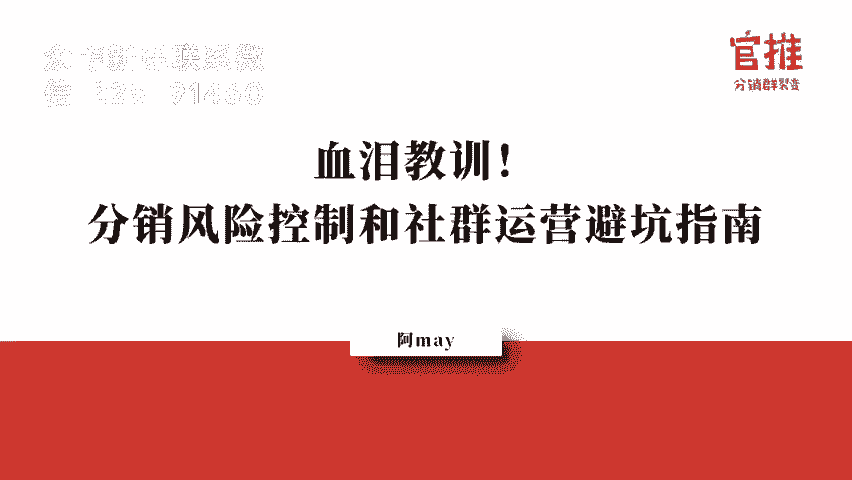

大家好，欢迎大家来到分销裂变实操体系课的第八课。那也就是在这两天呢，我陆陆续续已经接收到了很多同学在实操过程当中得出来的案例结果。这就是这两天同学给我汇爆出汇报他的一个实战结果的。就在这两天哈。

他们从刚开始学习之后，听完第一节课之后就开始打磨自己的流程。到现在的话，其实今天我又接到了三个同学给我发过来的喜报。虽然有的时候呢，虽然有的时候呢，不一定说他的结果很厉害，什么成千上万人。

但是呢他做了之后呃，如果说他做了之后能够比他之前的效果好那么一点，然后呢在不断的打磨和迭代的话，肯定会比之前的效果会更好的那有一个同学跟我说，呃前两天就做了一场。活动啊，然后呢一个人呃做了200多单啊。

一个人全部整套流程跑下来，就他一个人来做。另外一个同学呢叫呃亦飞同学跟我说，前两天也做了一场裂变活动，整个裂变的人数是500，转化率是达到了41%，整体的效果很不错哈。

这个是在他没有做任何的分销组队的情况下去做的，就是可能就是做完活动就把海报发出来去推广了，没有去组队和分销。第三个伙伴呢也跟我说，他听了听了我们的这课课程和思路之后呢。

就把他之前之前讲过的课程重新做了一遍活动。没想到现在每天都有新的进账哈，感觉出这个威力出来了。所以。大家一定要记得哈，就是自己一定要去实操，你不要看着别人怎么做，自己去做，才能真正的掌握这套玩法。

你做了之后就有结果，不管结果好还是坏，一定会比你之前有进步。我最喜欢大家天天都给我报喜报了。我期待的是我每天每天都可以收到大家的喜报哈。大家有如果有战绩，一定要记得跟我说。

我一定会把大家的一个方式传递给更多的人。以帮助其他同学呃学习到你的操作思路。然后呢，你也可以从其他同学的操盘思路当中学习到更多的技巧。啊，我们是互帮互助的一个团体啊。好。

那我们来先来复习一下昨天我们讲过的内容。昨天的话我主要是跟大家讲述了呃，在你没有资源，没有种子用户，呃，没有很多的粉丝的情况下，怎么去启动分销裂店，怎么去招募到和呃帮你推广的分销员，怎么去找到大咖。

帮你背书，怎么去找到合作的合作方一起联合推广。其实重点呢就是第一点就是带上你的合作方案去谈合作，就是你自己要去跟别人谈合作的时候，最重要的一点就是先准备好合作方案，而不是去找别人，让别人帮你想方案。

这样的话不可能会成功的。你做出来你你你勾搭再多也是不可能成功的。所以真正好的合作方，你一定要自己去准备好合作方案去跟他谈。第二个的话就是混群，找资源去跟大咖去勾搭。

这里边的话最重要的就是你自己要做出成绩出来，自己要亮出你的成绩。第二个的话，真的做人要有人品哈，但是呢你的人品好，一定要去亮出来，就是你要多付出，只要多付出才能有回报，才能得人青睐。

第三点的话就是在分销员招募这一点，其实很多人其实并不了解，其实你身边是有一大群非常支持你的人的。昨天呢我给大家列举了10种就是招募分销员的一些渠道和资思路。但是呢实际上我会告诉大家。

其实你不要觉得你自己身边的粉丝数很少。你自己光是亲朋好友，包括你的员工，还有包括你的同事，老客户，这些加起来，几几十个人，几十个人，上百个人肯定是有的。所以你千万不要觉得自己真的粉丝很少。

他其实是有一大批人非常支持你的。第四点呢，就是大家在做裂变活动的时候呢。就是一定要注意你自己要去测试好你的这个素材，测试好你的转化率，然后再让大家去帮你推广。很多人都会犯这样的错误。

就拿着一个转化率非常低的一个产品，自己没有做出测试，这样别人帮你转发。那很多人转了之后根本一点效果都就不好，然后起不了波澜，那自然而然，别人也没有办法去，或者说根本没有动力去帮你自续去推广了。

所以你要调动别人帮你积极去推广，持续帮你推广。那首先第一个前提就是要做好准备，做好测试，做好调研。呃，这个这个不能少啊，千万不能少哈。然后第五个呢就是告诉大家怎么去调动我们分销员的积极我给了五大招。

这五大招是我自己总结出来的，就是我们自己自己在做自己的分销裂变活动的时候，就用这五大招给信心给到他们信心告诉大家就是别人是怎么成交的再收入。就是通过收入来刺激。

有一部分人可能会因为别人收入来刺激到还要教方法，就是教大家怎么去做成交。然后数点范就是去采访那些做的比较好的人，问一下他们是怎么做的。然后把他的经验传递给别人通数据就是要给及时的反馈。

让别人知道就是现在的战绩是怎么样的团队PK的数据是怎么样子的。我排名是怎么样的，这个要及时的反馈。这样的话让大家觉得我是跟你是同一条心的，我是该跟你一起搞事情。我跟你主办方讲我的信息基本上是差不多的。

数据是透明的。这样的话，别人才会愿意一直跟着你，觉得真的是跟你在同样的一个就是在同样的搞搞同样一个活常有深度的一个参与感啊。

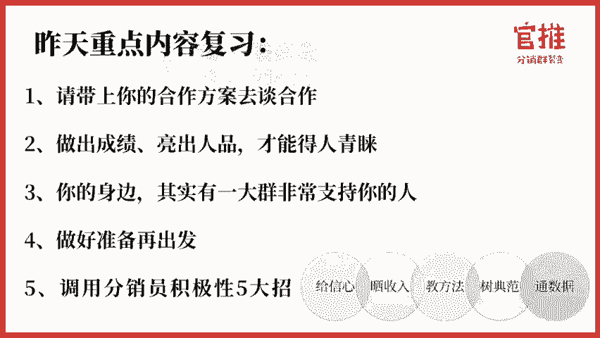

这是昨天我们重点的内容。然后呢，今天呢主要是给大家讲详细去讲一讲，就是很多活动，不不管是小活动还是大活动，其实都会遇到很多很多的状况呃。不管是呃你自己是做活动的操盘手也好，还是参与别人的活动的时候。

你要善于去观察。第一个别人是怎么去总结，怎么去做好这个活动的控制的。第二个的话，自己做任何活动之前，自己要做好风险这个控制的方案，否则的话，有可能你活报你你的活动一旦报起来了，或者活动呃。

就是因为有些原因被迫停止了。因为你没有做好风险控制就损失很大。所以你要让你的活动能够顺利的去举举行完毕，而且能够做的好，做的久，你就要提前做好风险的控制。

所以今天呢我将会从以下两大部分呢给大家分享一下我自己在做分销裂变活动当中的时候，一些血泪的教训哈。首先是第一点，就是风险控制。很多同同学在做活动的时候，首先就会问我可能会遇到什么样的风险。

又会问到就是现在微信风气那么厉害，就是会不会被封号呀，呃，就各种的各种的担忧。我我能呃很很清楚的了解到家这这种担忧哈。所以呢我会详细去跟大家详细说一下，你在做活动的过程当中，可能会遇到哪些风险。然后呢。

我们是同通过什么的样的方案来解决的，怎么去提前做好准备。第一点的话就是用户没有加上你的个人号，就是无法添加你的个人号。这个的话就是在做分销裂变活动的当中的时候，可能会有这样的风险。

所以呢很多用户哈不明白为什么他在上在后台关通的后台上下活动的时候，购买后的那个自定义页面一定要上传个人微信号或者说微信群二维码。

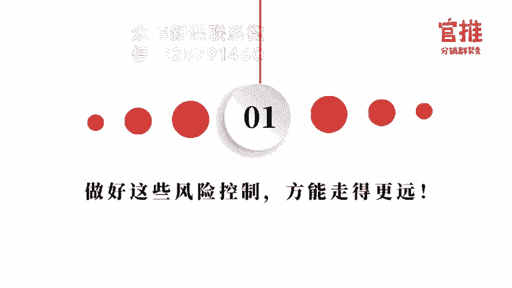

这个其实是因为用户购买之后，你是没有办法联系到他的。除非你把我们的那个报名表单打开了，要求用户先填这个报名信息，然后再购买。否则的话，你没办法联系到他。那如果说他他你没有办法联系到他。

如果你还不留下联系方式的话，别人是没有办法联系到你的。所以你在购买后的页面一定要放联系方式。这个联系方式可以是个人微信二维码，也是可以是微信群二维码。甚至于你活动量大的时候，可以放活马链接。

但是一定要记得放，这个是非常非常重要的。所以我们才会安排说在第一次上架官推活动的时候，我们会安排客服去帮你审核。就是第一个把控你的内容的话是帮你是帮你把整个流程帮你检查清楚，避免出差错哈。这是第一点。

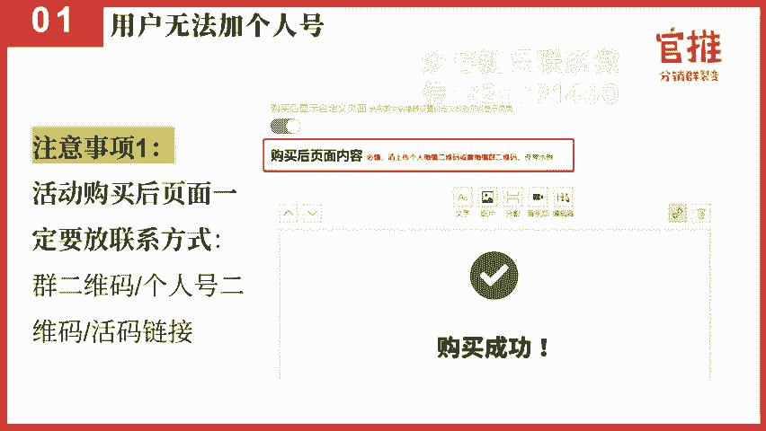

第二点呢就是在做这个个人在这务裂变活动的时候呢，还有还有一些用户呢，就是可能就是他没有注意到说购买之后可以去加个人微信的。他以为支付完毕之后就完了。所以你在这里的话是要提醒的？呃。

我们其实也做了一些额外的一些东西，让用户可以在没有购买你的时候就可以加上你的个人微信，或者说在进入你的这个详情落地页的时候，就可以联系到客服。这个也是帮你第一个解决有部分用户，他想咨询一些问题。

然后再购买的。呃，所以呢很多朋友在注册关推后面就发现其实要提醒你完善信息，为什么要提醒你完善信息。因为你完善了主办方信息，用户才可以再没有过时候就联系到你。这样的话就是在主办方信息那里的时候呢。

大家就可以把微信呃，客服的微信放上去。这样的话就是用户在没有购买的时候可以及时加上你，就算他购买了，也可以及时找到你啊，这个是非常重要的。

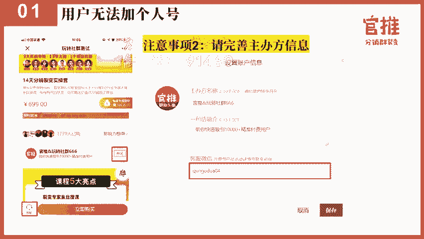

好，那还有一些呢，就是因为一些活动的风险的问题了。还有一种就是第一个的话，就是你在个人号。添加的时候，如果你活动的数量很就是你活动比较爆，那一天可能成交几百单上千单。

那可能一天这个个人号只准备一个的话是不够的。因为个人号每日被动添加的这个家人的数量控制在180到230人左右，其实是比较好的，超过这个数量值的话，就有可能被微信那边封控，就一种的话是客户扫你的码加你了。

但是你收不到，但是你收不到验证信息，这个这个问题其实是因为你的个人号被加的数量太多了，就是当天被加的数量太多了。所以你一定要把你的个人号准备好控制这个被加的人的数量。比如说。你超过180人的时候。

你可以在后台马上更换第二个号，这个后台是可以随时去更换购买后的页面的这个信息的。所以最重要的这一点就是不要贪，就是不要觉得哎我超过230人，我这个号比较老啊，权次比较高，你不要贪心。

你就控制在230人之内，超过之后马上切换下一个号，这是第一个避免有用户扫了你加了你其实根本就收不到呃，这个验证信息。这个用户就会过来呃投诉，说哎，为什么加了他老是不通过啊，这是第一个。

第二个的话就是如果你做活动的话，建议你还是提前准备好个人微信。如果说你自己做活动的那个流程是设计先加微信再拉进群的话，提前要准备好你的个人微信，至少要准备3个。这样的话就就可以一天至少有600人加过来。

你就不用愁嘛。所以至少要准备三个号。那这些号的话，提前要养好号呃，养号的流程其实蛮多的。但是我其实养号的过程当中，我最重视的是三点。第一个的话是线呃实名认证，这个是实名认证，还有就是银行卡绑定啊。

这是非常重要的。第二个的话是线下支付，就是你拿你的这个注册好的号去线下便利店买东西，经常去买早餐啊，买水呀呃多走一走啊，这个就是就是让要就是一定是让微信觉得你是一个真实的人在操作嘛。

第三个的话就是你要让要跟用户一对一的多互动，就是每天多互动交流。那在提前养号的阶段的话，就跟老号多交流，就是私聊频率要多交流，这样的话才能稳定说你这个用户每天是有互动的。而且别人也会回你信息是互动的。

还有一个呢就是注意一点，就是尽量不要用wifi能用手机流量，就用手机流量啊，就是在养号过程当中最注重的这三点啊。还有呢就是在做这个呃裂变之前的话，最好你的个人微信要做好形象的形象的建设。

什么叫形象的建设，就是IP形象的建设。你的微信昵称头像，微信签名，朋友圈内容，还有封面图，这些都要重新去做一次更新。就是尤其是微信签名。因为别人扫码加你的时候，最主要看到是微信头像，微信昵称和微信签名。

如果你的这个量比较大的时候，你微信签名，你就要这样说因为加的人很多，所以。呃，我会晚一点通过，请大家耐心等待。这样的话，用户就不会那么着急。我知道有些用户非常急的，加了一分钟就跟你说。

加了很久了都没有通过。但是你通过需要时间的。所以你在这个微信签名上，如果做活动的时候呢，叫备注备注上让他耐心等待。还有一些小技巧。就是好友的验证是可以把他这个加好友验证关闭，就是加你好友不需要验证。

加了就能上就能直接通过。这样的话就可以呃批量通过就是好友就不需要你用软件批量通过，就防止被封嘛。就是在做做裂变的时候需要注意的一些小技巧。那第二种呢就是除了这个用户没有办法加上微信之后呢。

还有第二种就是用户可能就没有办法进群。就是用户没法进群的原因。其实有几种。第一种的话就是你的群二维码就是满100人，他就扫不进去了。就是很多用户在后台的话，你直接用微信群二维码。

然后满100人是可以在后台直接切换了嘛。但是呢在做活动过程当中，有一些用户他其实没有那么的留意这个活动的情况。那满100人就没有及时换，就导致用户扫码进不去。所以在这里的话，大家做活动的时候。

一定要实时实时的留意活动的数量。如果你在后台直接用群二维码的话，你你满990人的时候，你马上就换了，避免这个二维码过期。或者说这个二维码满100人。第二呢就是如果你的活动这个情况比较长的话。

那就要避免二维码过期。因为群二维码7天之后它就会过期嘛，扫不进去了嘛。第二个的话就是你用户量特特别大的时候，你直接更换群维码。这个人手忙不过来。那你可以使用活马。活马方式呢。

活马的方式呢就可以帮你实现每满100人自动切换群二维码这个功能。活马的工具的话是可以用进群宝或者其他的活马工具。比如说咕噜管家呀、马云啊这些也有一些市面上呢会提供一些免费的。

大可以直接百度搜索活马就可以找到了。那进群宝呢，这种带机器人的一些工具的话，它还可以自动帮你建群。呃，不过这些工具其是第三方的工具，但是可以跟官推后台灵活使用的那在使用这种进群宝的这种活马工具的时候呢。

其实是可以使用呃官推。

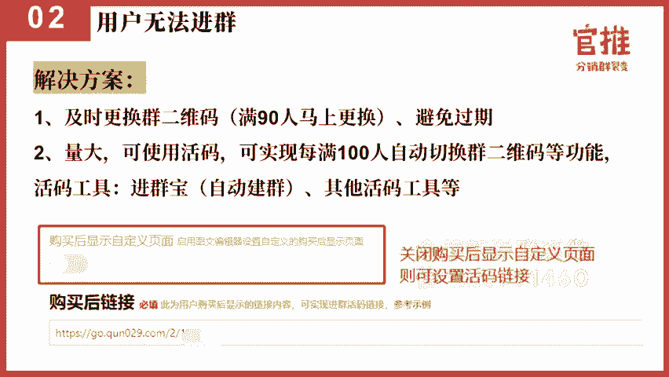

后台有一个关闭这个购买后自定义显示页面的话，是可以出现一个购买后链接，就可以在这个链接上把你的活码链接放上去。这个做的好处是什么哈。如果你用活码的话，实际上就是用户扫一次码之后呢。

还要再进去一个真正的群二维码，用户就要扫两次码，就上就是流程上会多一步嘛。那如果你直接用活码链接的话，就是用户一购买之后，它自动跳转到活马链接那里去。其实在这个时候他已经判断了用户的身份。

他已经帮你自动切换了一个真正的群二维码，用户就不需要扫两次码，就避免说你真正的活马链接被泄露出去。第二个的话，就是用户只能进去一个群，它不可不可以通过一些就是把你这个群活码的方式流传出去。

导致他同时进入多个群的情况。就是用户无法进群的时候的解决方案。还有呢就是呃在这个活动页面的时候呢，大家要注意去把这个。进群的流程要说明白，就是如果说真的因为呃用户量比较大的时候呢。

你在落地页的就是销售落地页的时候就要标注进群的流程，并给出具体的提示。比如说没有办法进群的时候，添加微信号刷刷叉，引导用户添加手工人工去手动帮他拉群。另外的话就是关推后台那个呃主办方信息的时候呢。

那里的话其实可以在描述那里去告诉大家，就是购买之后，不要马上退出3秒之后会弹出这个微信的二维码。这个的话就是可以提醒用户就是不要马上退出去加到个人微信去进行服务。呃，这个可以参考一下分销网址这个设置哈。

第四个的话就是你自己在作为呃操盘手来说，你自己一定要自营这个交流群，及时去留意这个群是否出现人数过多的情况，及时处理问题。

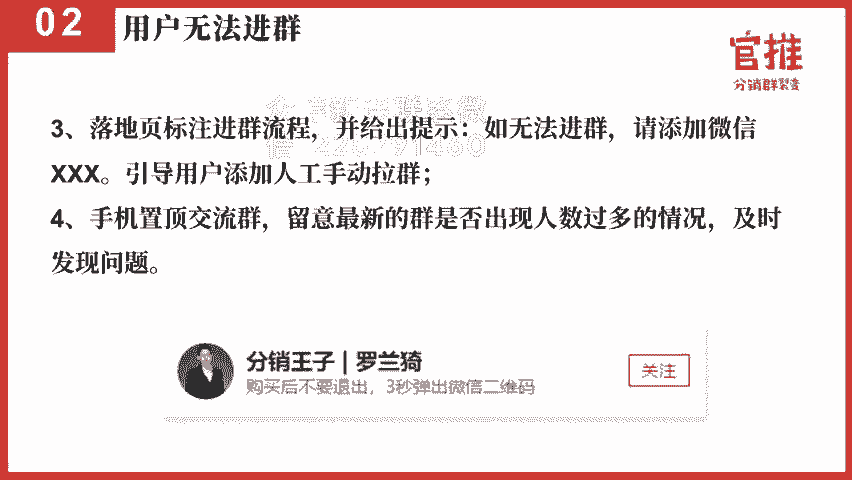

这个是进不了群的处理的呃情况。还有呢还有就是第三种，这个说是很多大型的主办方或者知名的品牌担心的问题。就包括我们在吃跟喜马拉雅知乎和知星球这个平台去合之后。包括故工就是你好呀。

故宫这样的一个主办方合作的时候，他们都会担心这样的问题。因为他们的那个渠道的流量还是比较大的那像我们当初跟喜马拉雅做423听出节的时候，他们的活动数据就很快，就是一天之内可能就几百万PV这样的一个情况。

那通过这样的大的流量的时候，你要提前做好预警。比如说你真的你活动数量比较大的时候，你就预估的人数会比较多的时候，如果你是用官推的这个平台，那你就及时跟我们工作人员打好招呼，我们帮你做好预警。

比如说你真的活动数量很大的时候，可能是需要进行服务器的矿油来准备好你这个活动。呃，当然如果说你没有把握说你一天能够你一下子能够推广到几万单的话，其实还好，我们平台就是你如果一个活动，你你做个几千单。

我们平台是没有什么担心的。但是如如说你一一之内做个几万单。几万单在微信当中就很容易达到阀值嘛，所以我们需要帮你做好充分的准备。这是第一个的话就是提前做好预警。第二个的话就是如果流量很大的时候，呃。

我们就建议用户会选择机构版或者专业版这样去做。这样做的话就可以通过就是设置多域名来进行分流。比如说同一个活动可以分配到不同的域名里边，那就很容易就是不不不是那么的容易达到微信设定的阀值呃。

就不容易被微信这边检测到封禁你的这个活动。因为现在是这样的，微信不管你做什么活动，只要你流量太大的话，它都会给予一定的限制啊，流量的阀值大概是100万PVUV左右哈。这个其实也不是固定的呃。

节假的时候节日的时候可能会更低一些。这个其实跟你域名的权重也有关系来的。好，第三点的话就是呃第三点的话就是要准备好多版的海报，就避免的海报被屏蔽。因为你活动流量量比较大的时候呢。

一般就建议大家做多版海报呃，就避免同一个模板，同同时被多次传播的话，朋友圈发都是同一张海报的话，这个海报就容易被屏蔽嘛。所以就建议准备多张海报，就像新事项啊这样的活动，他们都是准备多张海报的。

就避免活动被屏蔽。还有就是呃流量太大的时候呢，基本上是不会加个人号再进群了，而是采用就是自动建群这种方式来配合来做的那这个时候的话你就要提前建好微信群。就是机器人建群。

他也是需要时间的而且呢你一定要让你的个人，就是你的管理员能够进入这些微信群。那你提前要把这个群建好，并且进入对应的微信群里边。那由于每个号你每天基本上是只能少。

十几个群进去就是每个号基本上每天能够扫码进群的数量是10到13个或者15个左右。这样的话你就需要提前准备好，否则的话你号不够，你建的群建的太多，你人不进去，你根本就不知道用户在里边交流什么。

那就问题就会很大。所以在流量太大的情况下，你要做好这些充分的准备。还有呢就是如果你流量真的很大，就是为了避免被封哈，这个时候你就要控制好速度了。比如说刚开始的时候把这个分销东西的宣传比较充充分嘛。

那么到了后面可能你就要及时去隐藏起来这个分销按钮，这样新人不要去生成它的分销海报了。然后呢，如果说你开了二级，那就可能就是先去除二级，先保留一级啊，就通过这样的方案来做调整，把控这个速度控制下来啊。

就是在做活动的时候要注意的。本上其实基本上其实你做好这55个风控的话，基本上是大型的活动，应该是没有太多问题的那有一些的时候就是可能被封禁的原因有很多种啊。像有一些活动的话，就是你开二级分销。

如果你用比较猛。然后呢，你这个用户又投诉你比较多的话，就有可能导致被封禁。所以建议大家在做活动的时候，一定要做好充分的准备。就是第一个的话就是如果你要开二级没问题。但是你要做好域名的分流啊。

做好就是充足的人力来应对这些用户，而不是说到时候急急忙忙的用户都没办法应急过来，到时候有可能就会引起很多的投诉。

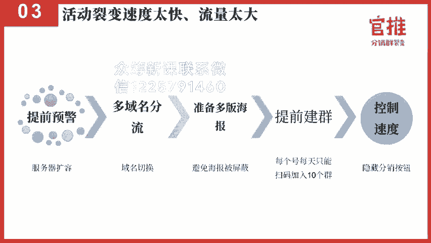

第四个呢就是呃可能会遇到一个问题，就是听课的链接被外泄。就是因为我们不是让用户进群之后吗？有一些人呢是听课的，就是有些用户是做听课的嘛。那用户怎么听课呢？

有些人是在群里面用呃一起学堂这样的一个多程直播工具直接直播。这样的方式体验是比较好的，也不容易被外泄嘛。还有一种的话就是大家会用第三方的那个呃工具，就是支是付费的工具，比如说像千聊啊，荔枝微课啊。

这些平台来做这个微信直播。但是呢又为了避免大家就是呃就购买了群的人能够听嘛，所以大家会发优惠券的方式发到群里面，让他点优惠券去听课。但是因为你直接把这个优惠券发到群里边的话，别人会转走啊，转转走的话。

不购买人也可以领到优惠券去听课，就导致你听课链接外泄。所以呢我们针对这个情况，我们专门做了一个改进哈。第一种的话就是如果说你是用了一些呃知识付费平台。比如说像小儿通啊有赞啊。

这些我们都是机构版都是可以做那个呃数据对对接的这个所谓的数据对接呢，可以把订单信息同步到对应的APP里边，比如说我们喜马拉雅跟我们合作，喜马拉雅用的是我们的机构版哈，它合作之后呢。

就是用户在光推的系统里面这边购买，它不属于机构版。购买之后呢，用户是下载喜马拉雅的APP去听课，他只要登录上喜马拉雅APP就可以听课了。他不需要领优惠券。

因为我们直接把数据通过呃接口的方式同步到喜马拉雅APP里边，他已经确定这个用户是购买的用户。所以呢。很多APP推广的时候，其实用课程的方式做分销裂变的方式去推广效果也是非常好的。

包括当初新事项做这场做这场活动，它的目的其实也是为了开推广他的APP就是用户购买之后进群，进群之后怎么听课，下载他的APP绑定手机号去听课。

这个的话其实也是用了这个第三方接口对接的方式来进行数据对订单同步的。呃，官推这边的机构吧，其实都是支持这个。嗯，第三方接口对接的，包括我们有很多用户，他不仅是对接他的那个呃就是常见的一些平台。

甚至于说你自己自主开发的平台都是可以对接的。包括我们有个用户叫狂看文化，也是对接了他自己开发的平台。呃，就是比果说你自己的系统没有分销的功能，那你完全是可以用官推的机构版来做分销。

然后呢同步到你的平台里面去听课，或者说都不同步到你的平台去做呃其他的功能。比如说你自己是有社交电商的。平台APP或者小程序。那你会员的时候，你没有没有做分销裂变这种模式。

那你就可以用官推机构版来做分销裂变。あ。只要做了接口对接，我们把数据同步到你的APP上面。用户就可以直接在之后用你的APP来进行购买，有优惠哦，享可以享受会员的服务。就是通过这样的方式来实现的。好。

那呃刚才说的是接口对接这个解决方案。但是呢很多的用户其实是没有必要用到机构版的。因为毕竟机构版价格还是比较高嘛。那你用体验版或者说平台版专业版的用户，他怎么去解决这个呃听课链接外泄的问题呢？

所以呢我们专门做了一个兑奖链接这个功能。这个兑奖链接的功能是什么功能呢？他可以针对已购买的用户，已购买的用户，他才可以领券去听课。第二个呢无购买的用户，他点击进去是需要购买的。

这次其实我们也是用了这个功能，大家如果在进群之后，其实有体会到就是我们其实是让大家先点击这个领课券去听课的。而不是直接给一个优惠券给到大家。如果直接给一个优惠券给到大家。

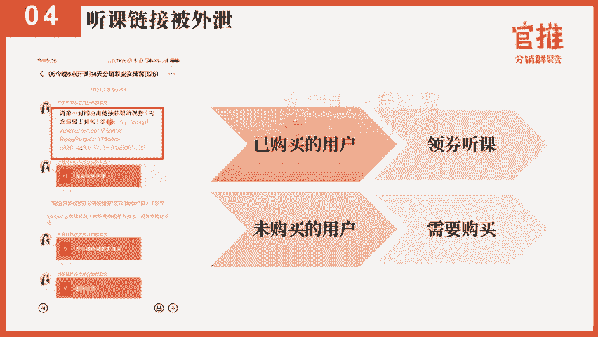

把荔枝微客的优惠券发给大家，这有可能就是把这个链接发给别人，别人也能够领券。这样的话就导致我们听课的链接外泄嘛，是吧？那怎么去设置呢？其实就在官推的后台有一个兑奖链接兑奖页面，你开启这个兑讲页面。

然后有两种设置的方案。一种的话就是你把这个按钮做好，这个是一个图片来的，做好之后呢，在右上角是有一个外链的设置。你把这个优惠券放到这个外链设置这里，就用户点击进来，它看不到你这个链接的地址。

它只能看到你这个按钮，但是这个按钮是可以点击跳转的，这是第一个方案。第二个方案呢，就是呃用135编辑器。135编辑器呢是有一个文本超链接的功能啊。然后呢，这次我其实也是用了超链接的这个功能。

文本超链接的功能。然后你点击这个超链接的功能设置这个超链接就可以了。这样的话就是用户点击进来，它就可以看到一个听课券的按钮，或者说一个优惠券的按钮，就可以直接领券去听课了。

这个是听课券外泄的这个一个解决方案。

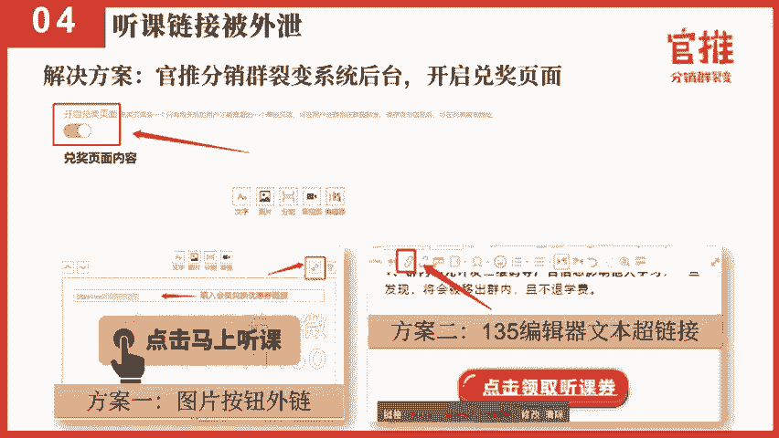

还有一个是什么呢？第五种呢就是有可能会遇到的是你的海报或者你的链接被屏蔽。这个这个时候你怎么去解决哈。首先第一个，你先把你图片上的二维码先隐藏，然后把你这个图片发朋友圈看一下你的图片在没有二维码的时候。

是不是可以正常显示是不是会被屏蔽。如果是会被屏蔽的话，那说明你是你这个图片出了问题。你就需要调整图片，甚至于重新改一版这个图片。

第二个的话就是你检查一下你的图片或者你的标题是否是否出现以下的这个敏感关键词。比如说分享返利一级两级红包淘宝这些。就把这些关键词先删掉，再发朋友圈试试看能不能会出现。如果不会出现了。

那说明是敏感关键词的问题。第个的话。第三个的话就是海报颜色。呃，有些海报的颜色就是有可能别的人正在做一场大型的活动。这个大型的活动就是用于你现在用的海报的颜色。

有可能就会因为这个活动的这个海报颜色跟你所做的海报颜色比较类似。同从而呢微信那边出现误判，导致你这个海报被屏蔽。所以像这种情况，你就先更换颜色，看一下还会不会被屏蔽。第二。然后呢。

第四种就是把你海报的样式给换了，再发朋友圈试试看。下面其实我们都试过，就是呃有的时候啊其实并不是说是光推的链接出了问题。不是的，而是因为你海报本身出了问题。有一次我们有一个朋友。

就是有一个用户找到我们说的海报被屏蔽了。然后我们就发现其实他海报是青色嘛。然后就叫他换一个颜色，它换成蓝色马上就不被屏蔽了。所以其实有的时候就是因为这种合巧合的原因导致你的那个海报被或者链接被屏蔽了。

那实在不行啊，说明你实在这个海报被屏蔽了，或者是你一个链接实在被屏蔽的，上面那个方法都行不通了。那就建议在上另外一个活动去试试的。所以建议大家在做活动之前其实要提前做测试的，没做测试的话。

可能就会出现这样的问题。

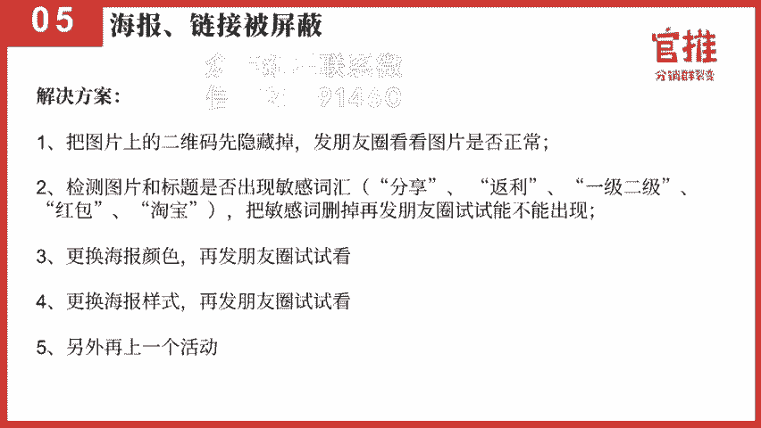

好，第六种是什么呢？第六种呢也会有部分的用户会反馈这个问题，就是反馈分销佣金无法提现。其实这里边出现的事实一般是有两种原因。一种原因的话就是。微信这边提现是每天是有受上限的，这是微信官方那边的上限。

我们也没有办法，就是微信官方这边对微信商户是有限制的。像我们的商户的话是每天自动到账的那个金额，现金是50笔。超过50笔的话，就是要第二天才能到账。还有呢就是最高是5000元，甚至是2万元。

就是大概是这样限额。如果超过了5000元，就是他当天的分销佣金超过5000元的话，这个钱就会到次次日再去提现就可以了。就是他没有到账的这个费用。这个钱其实在他的个人中心里。

让他去个人中心那里提现就OK了。那这是使用我们体验版平台版，包括专业版用户会出现的一个问题。另外的话就是使用机构版的用户，机构版的用户，因为是对接了你自己的微信支付商户。

那么你自己的微信支付付商户在第一次上活动的时候，其实你需要提前充值好这些分销佣金的。因为微信那边结算是有周期的，他会T加一或者T加期嘛，它是有一个时间周期的，你今天收到了钱要明天才能到账。

你不可能今天收到了钱，今天就到账了。但是我们的分销佣金是即时到账嘛。那当天的佣金要计时到账，这部分的钱其实是需要你提前去充值，就是针对机构版用户需要做好的准备。

那第第七种呢就会出现一个问题，就是用户要退款呃，用户要退款这个问题的话，其实是因为这里面呢就很尴尬了。就是第一个你分销佣金是因为即时到账也已经支付给他分销员了。但是他要提出要退款。

所以要避免这个问题的话，第一个解决方案，就是你提前在你的页面上要说说好，就是我们的产品是特价产品或者虚拟服务的产品，谨慎购买。购买之后，原则上是不支持退款的。因为其实虚拟支付的产品没有哪个是支持退款的。

基本上都不支持。但是呢的确有用户说他要退款，那你就要给他一条就可以退款的渠道，就告诉他，如果有争议，请联系谁谁协商处理。那退款的时候呢，就是要申请退款的时候，你要判别这个人到底是不是过来羊毛的。

还是真实的，有真实的退款原因哈。就是如果遇到特别难缠的客户，那就建议大家快速响应，避免过度的纠缠。有时候你跟他纠缠的时间太长，反而还不利于你活动的举群。所以遇到很难缠的客户，那就给他退嘛。

只是呢有的时候你自己可能要承担一部分这个分销佣金了，或者说跟他说明，因为有部分的分销佣金，被他的朋友拿走了，所以让他把朋友拉进群来一起协商呃，通过这样的方式来进行解决。好。

下面的话就是我们在做活动的时候需要注意的点，就是做好对应的准备。主要你做好这些准备，基本上你在做活动干过程当中遇到任何的突发情况，其实基本上你就可以及时去解决了。那下面的话我们讲一讲。

就是在社群就是用户进群之后，可能会遇到哪些问题。我们要如何去避免这些坑。

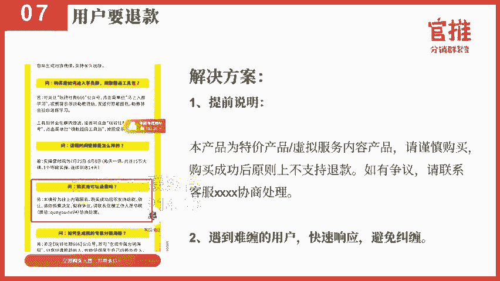

第一种的话就是在社群里面做活动的时候，很多时可能会遇到一个很常见的问题。就是社群嘛，大家都在群里边，大家都可以发发表信息，那就会遇到一个问题，广告，就是很多人做裂变活动的时候就会遇到一些呃。

就是专门来做引流啊，或者是专为挖用户的人过来就打广告过来就打广告。那说作作为这样的一个情况。首先你怎么去避免呢？所以你在进群之前要说明群规。也就说有可能你在就是在进群之前的那个页面。

你就说明群内不能打广告打广告会被封，而且不能退款，就给他一个威慑，就是第一个第二个的话就是进进行专门的用户分群，就是有一些人你把他踢了，他就会跟你说我要退款。你为什么要把我踢了。作为这样的问题嘛。

是不是？所以呢针对这部分的用户，有第二种方法，就是你专门设置一个群，这个群专门接收广告打引流人士的就是。

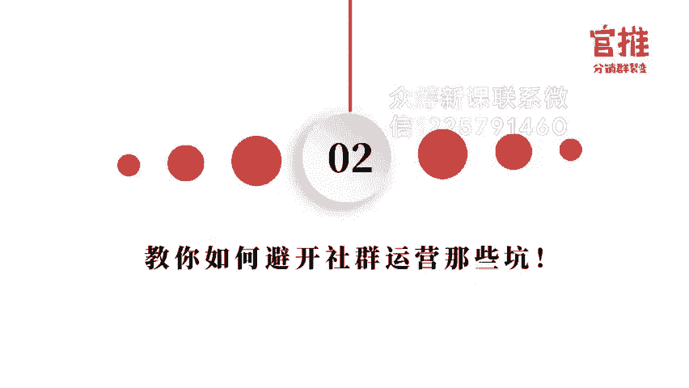

你看到这个昵称一看就是竞争对手啊，会一就觉得呃一看就觉得这个用户其实是过来引流的，会过来挖用户的，不是你的目标用户啊，或者说他过来打广告的那你就把他专门拉进这个群里边。比如说他在正式群群里面打广告。

就把他艾特他说我拉我把你拉进另外一个群，这个群，你就先不要在这里的，把因为就相当于降级嘛，你在群里面打广告去降级嘛。那么就把他在另外一个群里面听了，然后把他拉进专门的广告群里面就OK了。

就是在做第二做做活动的时候可以运用的这个方式，其实这个方式非常的有效哈。就是可能很多人没想到，但是其实你专门去做一个针对广告档的群，其实是非常有效的。就告诉大家，一旦你打广告，或者说做了很多违规的事情。

你就要降级，然后拉到降级群里边。然后你要在降级群里面继续升级的话，你就要在降级群里面去做奉献才可以。第三个的话就要及时开启群聊验证。就是当你当你的群，比如说用活马进群的时候，群聊满100人的时候。

你要开启群聊的验证。第二个的话就是呃当你群呃要主动去就是你个人微信去拉人的话，你要开启群聊验证，只允许你的管理员和群主去拉人。这样的方式的话就可以避免群友他自己去拉人进群。

还有呢就是可以使用V two这样的工具来验证，就是会有一部分的用户他就混群的混群的话，看到你在做活动，可能会呃看到你一个群，然后呢进群。第二个群又进群。第三个群进群，有可能你做了10个群。

10个群都有他就是他会找各种的小号混进你的群里面。所以呢你可以用V two这样的工具，他这种工具可以帮你检测，就是很呃群重复的人数，这样的话就可以帮你快速识别出来。哪些人是在混群的。所以大家注意哈。

这其实有很多的方法的，不要觉得你这混取是没有方法可以检检查出来的，其实有很多方法可以出来的。

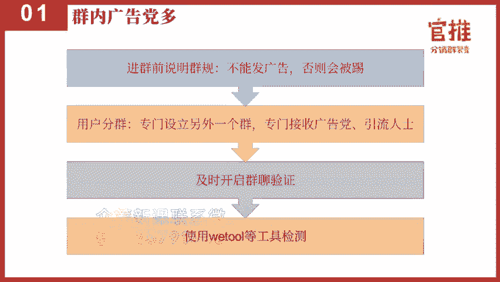

第二个呢就是社群很冷很冷清，就是你的氛围非常的冷。这样的话其实是有解决方案的。因为用户进群之后呢，很多时候你是引导用户领取福利啊，赚做报名，就是赚钱啊，或者上课通知啊，你没有进行破冰。

也没有任何的主题讨论，导致前期你的社群用户很冷，就是没有激活他。后面你做任何的通知就很难触达到他了。所以你在做这个社群的时候，大家进群之后可以做以下一些这些准备。首先让用户进群之后，呃，按格式改昵称。

然后让大家做自我介绍，就激活用户。而且呢在这里还有一个好处，就是让大家去改昵称和做自我介绍的时候，让你更加去了解这些用户的情况。那比如说你自己做自己做母婴产品呢。

你就可以让妈妈们去改呃什么宝宝月龄啊、男宝还是女宝啊。如果你是做教育产品呢，你就可以改宝宝年龄呃，宝宝年级他的兴趣爱好、学习目的等等这些这样方便的话，你去了解用户，针对性的去跟用户去打交道，对吧？好。

而且可以快速去定位到你的精准的目标用户。第二个的话就是进行用户的调研。在群里面可以去问痛点的问题，就是可以去了解一下，就是他经常会遇到哪些痛点或困难，这个就也一方面的话，方便你后面去做引导嘛？

比如说你自己做少儿教育，你就可以问哎，妈妈们每天陪孩子做作业，孩子们会完按时完成吗？会不会遇到什么问题呀？这种话题的话，就一下子就可以戳中他们的痛点，引起集体的吐槽。而且从群的发言和吐槽的程度。

你可以更加深入的了解每个人情况，啊，可以深入迅速的带入这个群体当中啊，这样的话群的氛围就可以快速去被带动起来了。然后第三个的招募群内的志愿者，你可以提前准备好20个话题来进行互动。然后呢。

在群里面安排好志愿者用这些话题来进行互动。这样的话就是可以很快的这把这个群的氛围做起来。

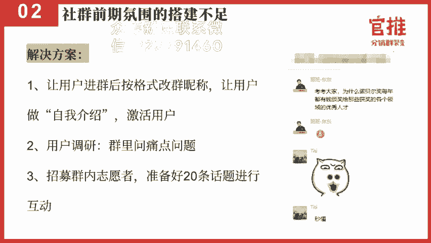

第三个点呢，就是社区里边还会出现的一个问题，就是你在兑奖流程上出了问题，导致呢就是扣诉会比较多。第一个的话就是因呃志愿者没有了解流程，他没有办法帮你及时解答。但是你自己个就是分身乏味哦。

就是罚这个怎么说来着，分身不足啊，就是你自己没办法了忙的过来嘛，所以志愿者不了解流程这个点的话，就是如果你招志愿者的话，你一定要提前把他们拉一个群里面，然后提前去培训，并且准备好常见问题回答提集警。

就是唐会问到什么问题。比如说分销佣金什么时候到账啊，然后分销到到账的时间是什么时候啊，怎么提现啊，这些问题，大家准备好。大家要提前准备好，避免呃就是用户问到的时候，志样者根本就不了解。

还有啊就是呃怎么去生成自己的分销海报啊呃课程什么时候上啊，然后讲什么问什么什么内容啊，我需要做什么准备啊，怎么看回放啊，这些问题啊。然后第二个的话就是很多人在做那变活动的时候会加一个诱饵嘛，组合诱耳嘛。

可能就会准备一些资料包啊这些信息。但是呢他准备的资料包太大了。像我们这次实操项目的时候，我发现有一个组在做项目二的时候准备了1个1000G的这个社群资料，我瞬间我就说你赶紧把这个重新去设置一下，为什么？

因为你送了资料太大的时候，你只能用压缩包，就是通过百度云盘的方式去去发送嘛。但是压缩包太大。文件太多的时候呢，这个百度的这个网盘根本没办法保存，也就导致他要开保这个百度的网盘超级会员才可以保存。

那会引起用户觉得你是在帮百度做广告，然后呢，要他买用钱才能下载这个资料，他就会引起极大的反感。所以大家送资料包不要太大。最多不要超过两个G，而且不要压缩包。最重要的我是说用户要获得感，你送的资料包。

你给他一个压缩包，他会看吗？不会看的，他也感受不到了这个价值。所以建议大家如果送资料的话，一定要用获得感，让用户一点击就能看。比如说用腾讯文档啊，石墨文档啊，有道云笔记啊，幕布啊这样的资料。

在线的一个工具去整理你的资料，让大家一点击链接就能看。一点击链接就能看。这样的话他的获得感会更强，而且也会更认可你的活动。第三个的话就是联合合作方的服务速度跟不上。呃。

这个其实也是我们这次活动犯的一个问题，就是没有预备好东西，导致我们这个工具包有一个合作方他的服务速度跟不上，就导致扣。就个有一些群友老是在群里面问啊，工具包怎么领，工具包怎么领。

其实因为对方可能就是联合合作方，他那边太忙了，太多人找他了。所以呢他可能人手不足哦。所以呢导致他响应的时候呢，可能不是那么的及时，就导致就是用户这边的问题比较多，导致我们的客服压力特别大。

所以以后大家在做活动的时候，一定如果你要找联合合作方一起合作的话，一定要沟通好大概会有多少人，然后提前要准备好兑奖的流程。人如果人多的话，一定要简化这个兑奖的流程，然后部署好对应的人手再开始。

否则的话就可能会导致你客服压力的问题。第四个的话就是呃做弱变，做裂变活动，尤其是做课程裂变的时候，可能会导致就是。前面的时候进群的时候，大家轰轰烈烈到了到了真正听课的时候，大家都没来听。

就是买了课囤课没听。这样的话就是导致你可能有些东西你要传达的，让用户感觉到价值的东西，根本就没听没感受到。所以要怎么样让用户接到这个课程开课的通知，知道今天讲什么。其实这里边非常有技巧啊。

这次其实我们也没有做的很好。其实真正做的好的，就是每每天群内要接龙告知。

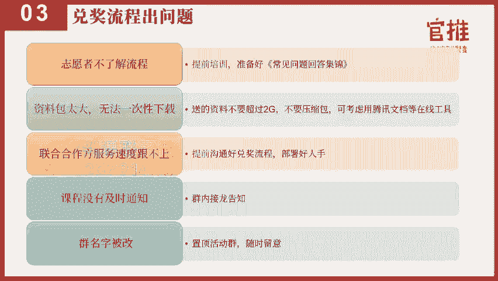

就是。你自己通知之后，你一定要让用户接龙，这样的话才可以有一个氛围。并且呢每个人都注意到今天的东西是什么啊，这个就相当重要的。还有一点呢就是群名字被改哦，这个就是可能会遇到了一个问题。

群名字被改就导致你根本找不到这个群，可能这个群乱乱糟糟了，你都不知道。所以你提前要把活动群全部置理，并且随时留意这个活动群的情况。还会出现是什么呢？就是这个是比较严重的问题，就是群里面有有人取哄。

然后呢一直在发负面的情绪，发泄负面的信息。这种情况的话，就是之前我记得是新事项的活动啊，呃就会出现了这样的活动情况。这个里边的话，当然我觉得这首先第一个你可能在群的人手部署上可能是不足的。

所以要做好这个准备。做做好这个备案的话，提前可以做些什么哈。第一个就是提前安排好志愿者进群，提前去解决大家问题，让他感受到服务。跟这个是可以提前做的。但万一真的有人起哄了，起了这个负面情绪。

发泄这个负面情绪怎么办呢？这个情况千万不要跟用户生气。所以。就很多人啊一听到用户在抱怨了，或者说用户在里面捣乱，就很生气，就把他埋灭了。其实。你这样操作有可能会引起这个用户更多情绪，更火爆的情绪。

就甚至他组织人来投诉你。导致你这个活动根本就没办法举行下去，或者受会的损失会更大。所以针对这种情况的话，第一个方式就是先了解他为什么会有负面的情绪，并且马上安抚，这是最重要的。就是先从这个态度上要诚恳。

要安抚他，先了解他的原因。🤧。接下来就是危机空勘的公关的处理。其实危机公关这里边的话也有一次呃这个海底捞就处理的非常好，就是它不是有一个店被检测出来，有老鼠啊呃卫生的问题，这个套路是非常值得我们学习。

就整个套路是什么呢？这锅我我背这锅我背是什么意思？首先承认错误。如果真的是客户反馈的问题，真的是我们出错了，那这个错误马。马上就承认说是我们做错了。然后第二个马上就说这个错，我马上改啊。

然后我改就是态度要非常诚恳，就是这个错我改，然后呢，改的速度是什么？我马上去做，就是你要非常的诚恳，就是第一个这锅我背。知道错了，我马上认错，而不是跟用户在那里反驳。第二个的话就是做错，我改，我马上改。

然后第三个就是马上去做哈，就做好这三步，一般的用户都不会跟你纠结，他心里也会得到极大的安抚。那如果说真的是那种很刁很刁难你的用户，那你就。给他退款处理，就是只能是这样子哈。就是在危机公关上。

其实我们有一次就是在我们完全社群日6的时候，我们出现过一次危机公关。因为那次我们的确人手部署不足，导致一万多个人，我们只有两三个人在那里做服务，根本做不过来。闹场的就有。

就好用户呢就是进群之后马上就打广告，马上打广告之后，导致我们当初有另外一个运营的人就是把他踢了嘛。然后这个用户就很反感了，说为什么要把我踢了。其实遇到这种情况，不是马上跟踢的。就是遇到这种情况。

应该跟用户说明清楚，先给一次警告。因为那一次其实我们没有做的很好，就是那一次没有在进群之前就告诉大家不能打广告。所以后面我的所有的活动，我第一个件事就告诉大家，不能发广告，发广告会被踢的给用户费威慑。

但是刚开始的时候没有做好这一点，所以呢用户进群就打广告，就会那那。然后我们另外一个运营的负责人呢，他就就马上把他踢了，就导致这些用户呢是是什么组织人来投诉我们，还写了一篇文章来投诉我们。

所以像在这种情况，你怎么做处理啊？像我的话，我马上去联系他，联系他之后呢，拉专门拉了一个群嗯，专门拉了一个群来处理，告诉大家，告诉首先他是什么问题。然后呢，他他对我们活动哪里不满。

然后把我们所做的事情明明白白的跟他解释清楚。那得到他们的了解之后呢，给他做退款处理。而且呢给他告诉他就是我们是怎么去做退款的，而且呢公示出来啊，就是通过这样的方式来解决问题呃。

解决问题是比你跟用户去对骂或者对怼要重要的多。所以你不用花那么多心思跟很多用户去纠缠的。如果真的遇到这种难缠的用户，那你就跟他就直接说退款，或者说呃直接他要他他告诉你他要什么，你就想办法说能不能满足。

不能满足，没办法，我只能给你退款。你就是因为怎么说呢？很多活动并不是用。不选择我们我们其实也可以选择用户的，我们给自己留一条这样的后路。就是在负面情绪的时候，可以这么去操作。就包括自己呃。

你包括新事像那次活动也是如此。就是他遇到用户这么多的负面情绪的时候，你是怎么做处理啊？首先告诉大家我们是怎么回事，就是当初用户是反馈什么课程质量差。反馈课程质量差，那就是需要做的是什么？

不是去反驳说我们我课程真的准备很好啊，怎么怎么地，其实没有必要这么做。最重要是什么？把课程的竹字稿整理出来，告诉大家哪些内容我们讲的很清楚，把竹字稿发出来。因为很多用户其实根本没有去听课嘛。

所以你在那里反驳说，我真的准备很久，还不如直接把干货漏出来哈，就是就是处理方案上的一些东西哈。好。那讲完这里的话，基本上就是所有的这个呃情况的处理呀，包括一些就是社群的坑啊，还有前面的一些预警情况啊。

大家都按照我所说的都做好准备的话，实际上其实你做活动基本也可以就是降到很低很低了。

那相信通过前面八节课的学习，大家已经掌握了怎么去做一场分销裂变活动了。那前面呢我们通过呃具体去解析怎么去设计一场一个活动的诱饵，怎么去定价，怎么去设计分销的规则，怎么去打造你的裂变海报和落地页。

以及怎么去撰写朋友圈的分险文案，怎么去招募这个分销的合作伙伴，以及呢今天呢讲到怎么去控制你的分销风险，以及社群运营当中会遇到哪些坑，怎么去解决。相信通过这些问题，呃和这个课程的学习，呢。

大家已经完整的了解了整套模式了。那接下来呢更多是需要大家去实践，把真正的这个学习到的内容实践到你的实际项目当中，真正去掌握这套分销的玩法。那接下来的八节课内容呢。

将会由8位的老师从他们的一个轻身操盘的经验，去分享他们整一个操盘的一个过程，把详细的步骤，细节都分享给大家呃，通过不同行业，不同这个产品的分享，希望大家呢能够更深一步的体会到。

就是整个分销裂变活动当中呃，我需要注意哪些东西，然后呢有哪些细节需要去掌握的。因为很多时候啊呃你可能知道跟你做到其中最重要的就是细节的把控。

那今天的训练任务是继续去招募你的分销队长队员并且统计出你的战队名单。第二个呢就是要正式去部署你的活动了。呃，登录上官推分销群裂变系统，然后呢进行活动的部署，并且进行AB的测。是迭代优化你的活动流程。

此外呢，如果你做好你的活动裂变海报，请发到我们的学员群里，让大家帮你把把关。好，那今天的课程就到此结束。我们所有的课程都支持随时回看。大家可以在玩转社群66公众号菜单栏听课入口处进入观看。

如果你学习完课程后，觉得课程内容对你有帮助，也希望你可以把优质的内容分享给你的朋友，也许能够帮到他。点击玩转社群666公众号菜单栏生成专属分销海报，即可生成你的专属海报。有好友购买之后。

你还可以拿到50%的奖励金哦。

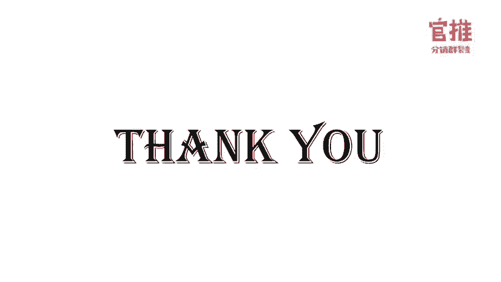