# 微社群裂变营销私域流量池增长秘籍创业运营销售获客视频课教程 合集 8套 374资料 13.1G 分销群裂变模式介绍及9大行业案例解析 - P9：第08节【加餐】：最新分销裂变案例介绍及直播互动答疑 - 高端网创试错赚钱大师 - BV1Ux4y1b7xM

hello，大家晚上好，我现在的声音能听得清楚吗？我感觉现在中气十足，应该讲话还是比较清楚的。今天一整天喉咙都比较沙哑，现在我感觉嗯要讲课了，好像是一下子就好起来了。

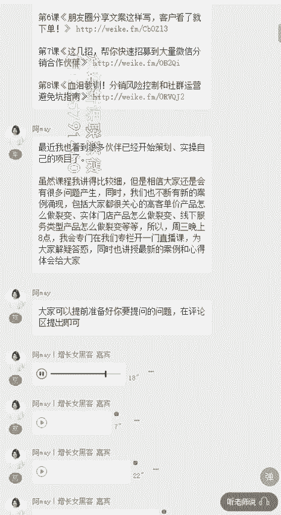

呀，我看到有人已经在现场喽，那先到的伙伴可以先回复一签个到哦。

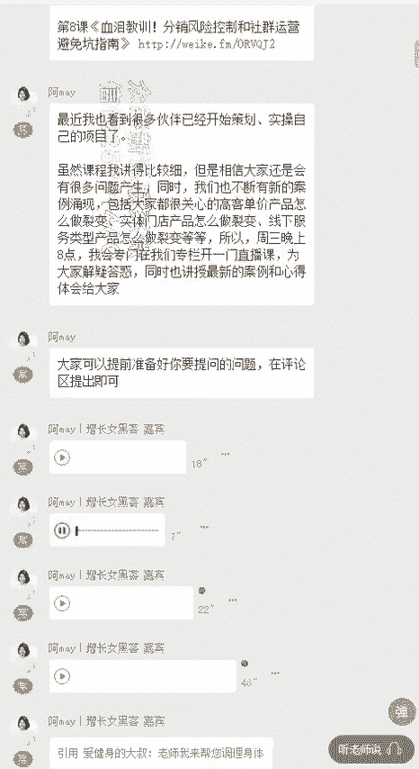

最近一个星期，我们整个办公室的人都扁桃体发炎细菌感染，每个人都发生感冒，大家一定要注意休息啊，工作再累再苦也不要熬夜了。医生都跟我说，再好的药都比不上早睡觉，所以大家一定一定要注意身体啊。

这个真的很关键。

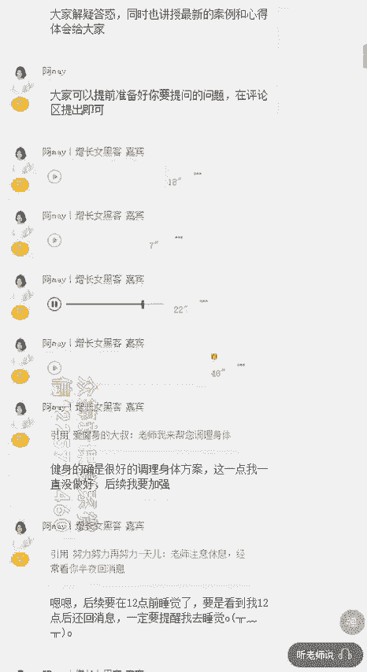

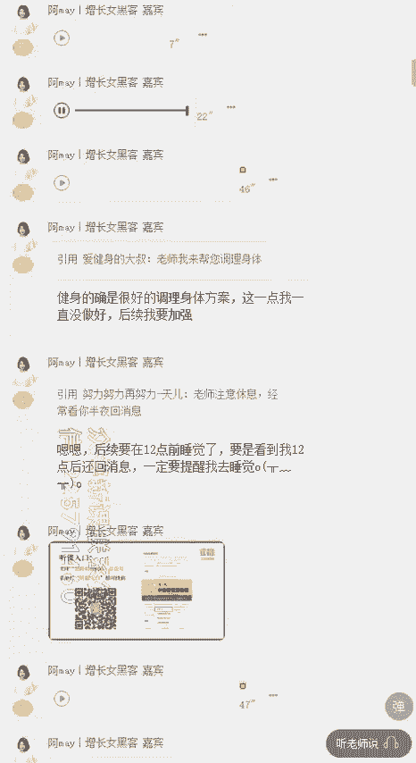

今天晚上这次分享呢主要是给大家分享一下我最新发现的一些分销裂变案例，以及我的一些最新的心得体会。另外的话我最重要的一个部分是给大家解答。因为有很多同学已经在做实操了，可能会遇到就是自己想策划方案。

但是不知道从何着手。虽然课程里边呢有很多细节我都讲到了，但是真正遇到自己的问题的时候，还是不知道怎么个性化去做解决。所以呢大家在呃课程里边可以尽量在呃这个评论区提前提出问题。

到时候我分享大概呃大概是20分钟时的分享结束之后呢，我就会逐一回答大家的问题。

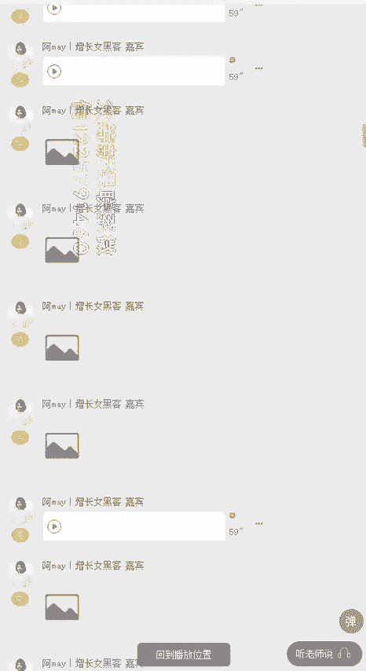

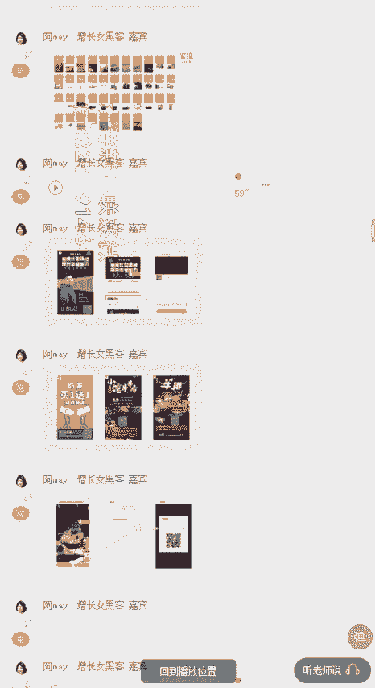

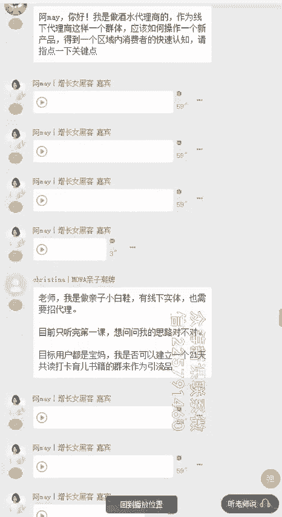

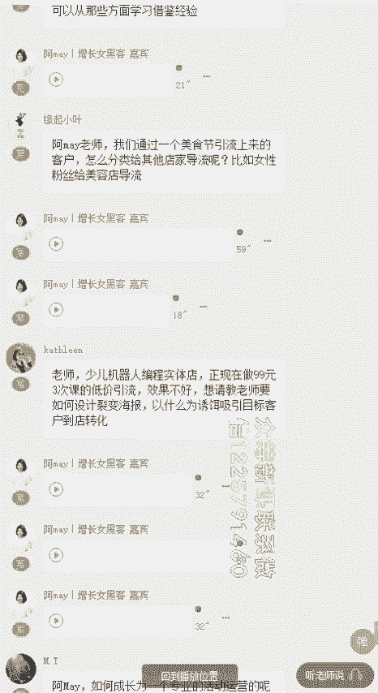

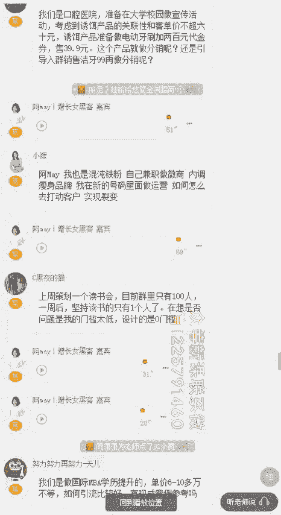

好的，那现在8点钟我们正式开始吧。呃，先说一下重要的提醒啊，就很多同学一直来问我重复的问题，就是听课从哪里听课。

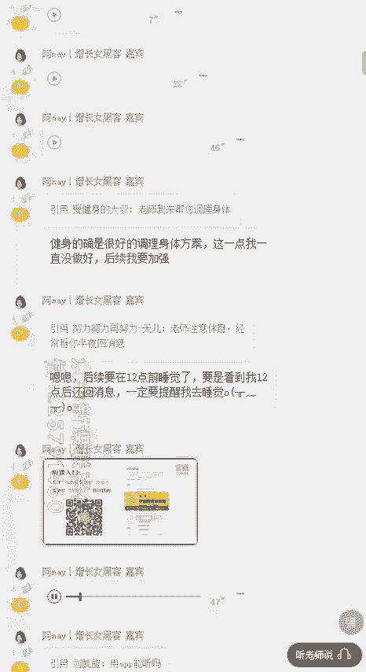

就是后续你听课的话，可以在玩转社群66公众号有一个菜单栏呃，听课入口那里就可以找到听课链接了。因为我们的课程都是视频课程嘛，都是可以随时回放的。你自己安排时间听课就可以。

有些同学一天都可以把课程全部听完。有些同学呢呃一天听一节课听几次都有。可以。所以说大家自己根据自己的进程来安排。不过呢尽量大家都要赶上进度。因为呢赶上这次的进度的话，可以参与实操。

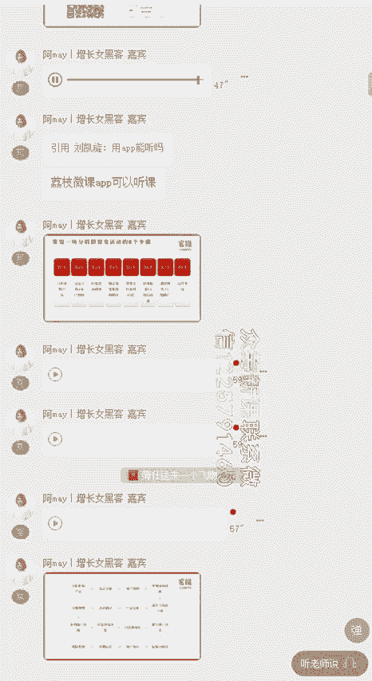

那前面呢在第一节课和第二节课呢，我给大家详细讲述了一场分销裂变活动的8个步骤。

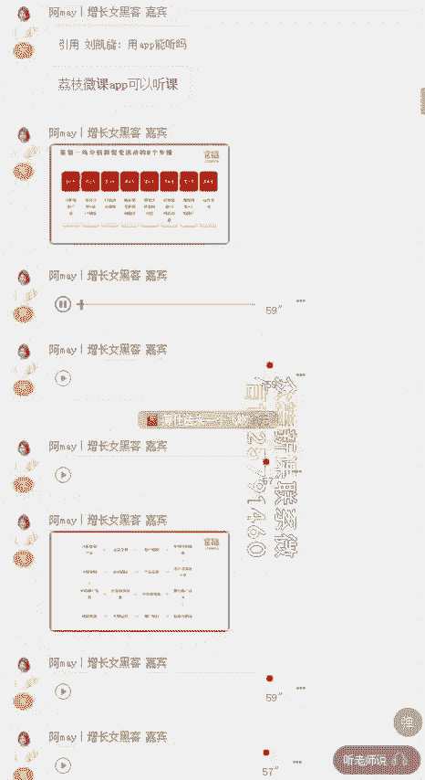

呃，首先你要做一个产品的引流方案的时候，首先第一步，你分析你的业务的产品本身它是做什么的。第二个的话去了解他的竞争对手。那如果你自己连他竞争对手是谁，你都不知道。那这样你要去了解他的老用户。

你去找他老用户去问，平时呢他会去从哪里了解到这些产品的信息的。呃，第二个的话去网上搜索百度搜索，你可以快速找到就是相对应的竞争对手。第三个呢，在新版那里也可以找到，就是这个在课程里边我也有讲哈。

就是找到竞争对手之后呢，去分析他的这个公众号的阅读数量或者参与活动的情况，找到阅读数排名前十的，或者说参与活动排名前五的活动来分析这个到底是哪个活动或者是。紧张。哪些文章讲述什么点最引人注意啊。

这些注意点就是用户不比较关心的点。第二个的话是进进行做用户调研，去了解用户的想法。就是本身呢他是通过什么方式可以了解到这个产品的资讯，那就去了解他想他会关注哪些信息。尤其你会找到这些用户关注近期的鱼塘。

我们所说鱼塘就是说你去找用户的话，你不是漫无目的的去找。你要在一个用户就是精准用户的一个鱼塘里面捞鱼，这样的话效率才会比较高。比如说你怎么去了解到哪些鱼塘呢，那就是从用户信息里面去获取。比如说去问他。

之前我做保险项目也是我去问这个用户啊，你是做保妈，你想给孩子买上保险，那你一般会关注哪些公众号的信息呀，会去哪里？那这些了解信息的渠道就是他获取信息的渠道。

那往往就是你可以去引流被动引流或者说合作的引流渠道很好的一些渠道。第三个呢就是通过这些渠道的调研和那个竞争对手的调研，以及用户调研，能了解了整个用户的关注点在哪里，跟你产品可以结合的点在哪里。

这样的话你就设计你的引流品方案了。呃，然后呢再去设计你的裂变机制和路径呃，然后确定下来之后设计你的这个呃裂变的素材呃，去招募你的启动呃这个渠道和寻找启动量去推广，然后调整优化上限啊，运营变现。

这是我当初呢用一个例子去告诉大家就是裂变活动的八大步骤。但是实际在做的过程当中。实际在过过程当中，相信大家会遇到很多很多的细节啊，我又把这个八大步骤呢拓展成16个步骤，呃，再一次分享给大家。

就是这十六步骤呢，就结合了我们整一个分销裂变当中比较细节的步骤了。比如说第一步分析这个业务产品，然后呢，第二步是竞品分析。第三步是用户分析。然后呢去罗列你可以用的资源，你可以用的资源，包括什么。

你的大V，呃，然后呢你以往已经有的这个资源。比如说呃是有课程呢，还是已经有什么好的引流品呢？呃，这些东西把这些东西罗列出来之后呢，你就可以知道你的这个资源大概有哪些地方可以用得上的。

第三个呢就是设计你的引流品方案了。引流品方案在我们第三节课有讲到设计方案的时候有三个相关性。第一个高价值、低成本和。关。就是跟你的产品是相挂钩的，这三个核心要点。呃。第三个第三节课呢。

我详细给大家讲述了，就是怎么去设计一个引流品方案，里边也会列举很多案例。但是呢这一点其实很多很多朋友都会去问的，就是怎么结合自己的产品去设计引流品。下面呢我会分析一些案例给到大家。我想讲完这个流程呃。

设计完引流品方案之后，你就要确定定价价格，是不是这个价格到底是定19。9块，39。9块69。9块还是199啊，这个价格怎么去确定这个呢在我们第四节课也有讲到啊，然后呢就设计你的活动路径。

到底是让用户付费之后加群还是让付用户付费加个人微信还是付费之后呢，让用户关注公众号呃，这些呢都是去结合你的活动本身去设计路径的。然后呢，就设计你的分销规则。嗯，我们主要是讲分销裂点嘛。

所以你要设计分销规则，到底是一级分销，还是有二级分销，还是针对渠道有额外的渠道的分销比例。那分销规则里面也有很多种类别。比如说我可以针对大渠道设置不同的分销规则。针对小渠道负责不同的分销规则。

甚至呢有些做分销的过程当中，我可能是只允许呃我找的推广员来分销。其他人我不允许分销，我就把因分销按钮隐藏。甚至官推这边呢也可以设置说只有付费的用户才可以分销，不付不付费，不可以分销。

这些规定呢都是可以根据你的方案来确定的。

有些产品是这样的，你高价格，如果你又把这个分销的按钮大大的放在那里呢，就会引起就是客户去购买的时候，会觉得哎推荐我那个人是为了挣我的钱，所以才推荐我的就会有这理心理障碍。

所以当你是高价格高分成的比例的时候，你最好是隐藏分销按钮，就招募这个分销人员推广就行了。甚至呢就只只允许购买过的用户来购呃来推广就可以了。这样的话就避免了用户这样的心理压力呃，推广起来。

他也没有任何的心理压力。然后呢就去罗列你的自己的推广资源，你本身可以有哪些推广资源，你的亲朋好友可不可以帮你推呃，你自己有没有公众号粉丝，有没有个人号粉丝，有没有微信群呃，如果没有那你怎么去积累呢？呃。

可不可以谈合作，或者现在去付费加入其他人的社群圈子呃，先混个圈子是吧？你就先要积累这些呃这个推广渠道，如果你一点渠道又没有现在呢有些同学来找到我收能不能操盘。我这边呢一般我自己不接操盘呢。

因为我这边很忙很忙，那我会培养一些操盘手来接操盘，但是呢有些同学他自己第一个他没有预算。嗯。第二个呢，它的产品就又没有知名度。第三个呢就是自己也没有任何的启动量。这样的情况下，你找别人做操盘。

说说白了就没钱没资源，没启动量。这样的情况下，你找别人操盘是很难的，这种情况只能你自己做，知道吧？就是你没有钱投入，你那只金自己学自己做，你找别人操盘，那别人总是要付出劳动成本的人家就肯定是要收费的。

知道吧？嗯，那也不可能很便宜的给你做，因为他他给你做，为什么不给别人做嘛，是吧？所以你自己要意识到，如果自己没有钱，没有资金这个预算的话，你就自己做呃，第一次活动失败没关系，你总算是把活动流程跑完了嘛。

这就是一次经验嘛。慢慢的谁都是从零开始的，你慢慢的慢慢的你就会越来越好的。呃，活动经验越来越好的。对。那我分享一下我当初是怎么起步的。我当初不是一开始我就做活动策外，我一开始做操盘熟的。

我一开始我是先从参与别人的分销活动开始。那就比如说看到别人在做分销活动，那我先去做推广员，我去参与别人的分销，我选一个好的产品，我认可的产品去做分销。那我分销的过程当中。

我是不掌握了朋友圈推广的方这个呃文案的撰写。是不掌握了跟客户打交道的能力。这个时候呢我要了解这个作为真正的分销员，他的心态的变化啊，他怎么样才能让用户买单啊，这是第一步的能力。第二呢。

我要去参加别人的分销的时候，我就去做做队长。呃，我去组队，就比如说呃我们呃这一次做这个三呃就是项目二的时候呢，很多朋友呢自己做抛盘手，下面也要招队长去组队，是不是？那。那你是不是就可以呃我去组队。

我作为队长，我招5级，我身边的朋友呃一起来做分销，那你就锻炼你带团队的能力。首先你要了解呃，我怎么样帮助下面的人把这个产品卖出去，怎么带动这个团队的积极性呃，有一些人动有些人没动呃。

怎么样才能促进他动起来。呃，怎么样让大家呃愿意听我的话，幸服我呃，这些能力呢，就是你当队长的时候，过程当中掌握得到的，包括你怎么招募真分销人员，也是你当队长的时候呢，可以掌握得到的。好了，当了队长之后。

你就下来你就更更往上跃生是吧？你就是自己组织一场活动呃，真正的从一个主办方的角度设计这个分销规则，设计这个比赛规则呃，自己慢慢去做一次活动，你不要期待抬高呃，当然我比较幸运啊，我做。

我我做分销活动的时候，我第一次做的就做爆了。但是呢不是每个人都那么幸运。你像我们上期的操盘手海林，他一开始也没有做过任何的这个裂变。但是呢他就是从呃从队员到队长到操盘手这的一个能力去阅签。

但一场活动也不算特别成功，卖了200多份。但是对他来说已经好了。他因为怎卖出200多份，但是他已经完整的走完整套流程了，他就掌握了怎么去设计方案呃，怎么去设计海报怎么设计落地详情页，怎么去跟客户打交道。

怎么写完案啊，这些能力，他全部走一遍之后呢，慢慢去优化迭代就行了。所以到现在你看他去做操盘，他就有信心了，因为他做过好几次之后呢，慢慢的每次都比上一次好嘛，效果就起来了。所以呢再让他去做活动。

他就有能力去做了，他就敢去做了。大家也是无。嗯。不要害怕，你是小白也没有关系，一步一步的来多看看别人的案例，多拆解别人的这个案例啊，这对你提升自己的能力是非常有帮助的。好了。

那这个呃设计完分销规则和那个呃罗列完推广资源之后呢，去打造你的裂变海报。裂变海报这一些环节打包打造过程当中是蛮重要的。因为在微信里面传播，无非就文字图片和链接嘛，是吧？还有小程序。

小程序又不能传播朋友圈，所以你还是文字图片链接，那图片占据的空间是最大的，所以海报推广起来的话，它的速度还是最快的。所以你不一定自己会设计。因为设计东西交给专业的人呃，可以找设计师帮你设计。

但是你要懂怎么判断这个海报海好还是不好，那判断的标准，我在那个第五节第五节课我已经告诉大家了。比如说比如说一张海报，你起码你要看得清楚主题不打开的时候，就看得清楚主题。那你设计出来。

你有没有尝试发过朋友圈去看一下，不打开的时候，能不能看清楚出主题呢？第二个海报的文字能不能看得清楚啊，不要花里胡哨的，整个海报版面不要超过三种颜色啊，呃，然后呢整个布局是不是合理是吧？呃。

排版是不是清爽是吧？这个文案看起来打不打动人，这些你自己还要有判断的标准，判断的标准，你大家你去好好学一学我第五节课，我详细告诉大家怎么去快速去做一个列表海报，我讲课的内容基本上在市面上你也找不到。

因为我很懒。我都是按照最懒的最有效的方法教给大家哈，不用你学习特别长的知识。比如说设计海报，有一些人专门开了一门课，呃，专门讲怎么设计海报，可能你要学十几个小时。按照我的方不用学习，按照我的方法。

你不用学习十几个小时，你学习呃这个呃就学习一节课够了，就按照我的方法来就够了。😊。

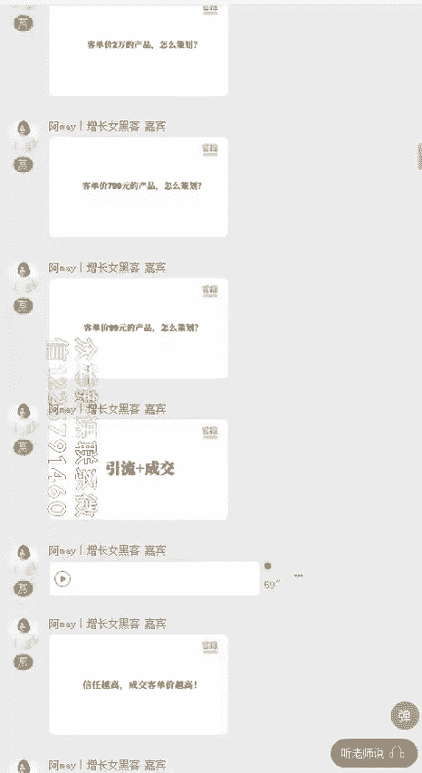

然后去打造这个落地页啊，然后呢就是招募这个分销团队的人员啊这些好，就是大概的整个整完整的步骤就是这样子的。好了，那就是呃很多朋友呢就是现在最大的困惑是什么？就是个问我呃，不同客单价的产品怎么卖。

不同行业的产品怎么卖？我简单跟大家分享一下。😊，比如说单客单价2万的产品呃，怎么卖，怎么策划，客单价799的产品怎么卖，怎么策划，客单价999的产品怎么卖，怎么策划？下面呢我先说一下理论的知识哈。

我们说啊在微信里面成交也好，在其他地方成交也好，就是无非就两个。😊，这是一个是引流，一个是成交。引流是什么？把客户引过来获客是吧？第二个客搞定客户成交他成交是一切营销的这个最重要的这个呃最重要的目的。

就没有成交谈不上这个做生意哈，没有成交，企业也不可能长久，所以呢引流加成交是最重要的两个部分。那么比如说我们刚才所说的，有人问我，客单价2万的产品怎么去做引流啊，怎么去引流啊？

那你想一想客单价2万的产品，人家开了你的落地页，开了你的海报就可会购买吗？谁会这样，除非他跟你很熟。啊，我们说信任越高，客单价就越高，除非他跟你非常的熟悉。你推出来1个2万的产品。唉。

说我我我我我我我收图，或者说我开一个线下课啊，或者说。什么呃产品啊，通过这个朋友圈长期营销，然后他才会跟你下单购买是吧？不可能只是看了一下你的海报，就要你购买了。所以2万的产品它不是这样的思路哈。

不是一下子拿2万的产品来做产品来来做营销的，他肯定是通过一个前期的引流引，然后呢，再做高客单价的一个这个首首先是引流品过来之后呢，再做信任的培养。

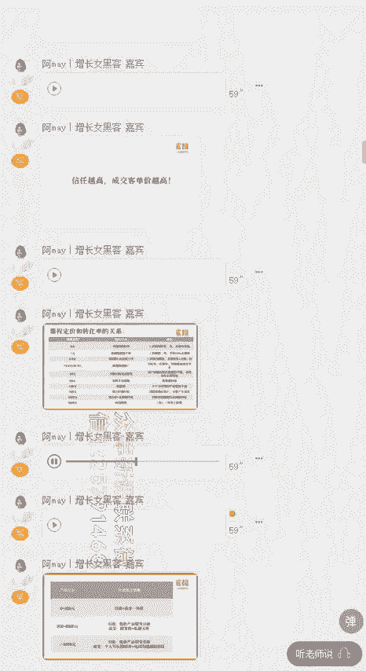

它跟你的互动频次越高呃，互动的这个是成次越深，你成交的客单价才会越高。它不可能随随便便的就把2万块钱转给你的，能理解吧？那我在第四节课讲这个产品定价和那个呃分销规则的时候。

给大家讲述了课程的定价和转化率的关系。大家可以再看一下这个表。课程的定价从。较觉。课程的定价从低到高转化的行为就从剪刀到复杂，我们都可以看到0到100。之内的产品基本上呢你只是看让他看一下海报。

看一下落地页，他就愿意购买了。但是从300到1000的产品，它就需要结合社群营销，它跟你多次互动，他才会购买。那超过5000的产品啊，如果说他没有跟你多次沟通，没有跟你一对一的客服沟通。

没有跟你电话取消沟通，基本上他不可能马上就下单购买的。除非是什么？除非他是你公众号的粉丝天天关注你，你已经跟他沟通很多次了，用文章的方式跟他沟通。而。你说呃现在推出一个产品一让他购买，他才会下单购买。

又或许说他是你本来就是你朋友圈的这个粉丝，然后呢，天天。你呃多次沟通，然后你在朋友圈推出产品，说我5000的产品，他才会下单销售，下单购买。所以说你要搞定5000以上的用户，我们说的所说的策略是这样的。

不同的客单价，你用到的策略是不一样的。

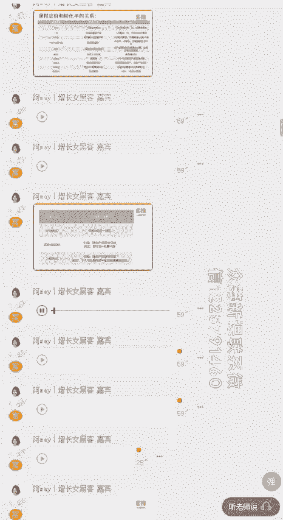

在0到200之内的产品，你引流跟成交是可以一体化的。比如说就用分销群类变种方式去做。你那200内的产品是可以搞定客户的，客户不用思考，他的决策是轻度的，他不用跟别人商量，就是可以下决定。哦。

这叫什么清决策。😮，这个低消费的产品啊，这种产品的话成交非常简单，所以成交跟引流它可以一体化。他流量来了，他可以马上就成交。但是200到5000的产品，它就需要什么呢？首先需要以。

价的低价的产品来做裂变的引流。也就是说你需要有1个0到200之内的产品来做引流针跟成交一体化。引流之后呢，再做高客单价的发售。这个成交呢就需要你用群发售的方式。或者加私聊关怀的方式跟他成交群发售怎么做？

就是在社区里面发售嘛。呃，关建明老师的案例，我在课程里面讲过多次了哈，关键林老师就是9。9块的99%的分庸的这么一个产品去做引流。引流之后，每一场活动，现在关建明老师做了好几场了，每个月几场一场了。

好几场了。😊，一场活动有四五千人来参加啊，四五千人就是大的流量是吧？这些流量首先他付了费的市少付了9。9块，所以是精准的有意向的用户的。而且付了9。9块，他会来听课啊，免费的，他不听课的。

免费课程不听啊，你好看似看似轰轰烈烈，的流量很多，但是他不听没问没用啊。所以呢9。9块，他到群里面，然后再用群发售的方式。让这个客户在群里面听完课之后呢，感受他的高价值，然后再转化799的训练营。

而现在他可他都转化5000块钱的这个高端社群了。所以可以说哈成交一定是要前期的一个沟通之后呢，可以用群发售和私聊关怀的方式来做成交。群发售这个在第十第九呃第十节课。第十节课由分销王子给大家取啊。

不是不是第十节课，我待一会看一下，应该是第十节课由分销。哦，这个群发售是在十四节课，十四节课由分销王子给大家详细去解析怎么去做一场群发售。啊，很多就有几百块钱。

甚至呃一两千块钱的产品在群内做发售效果是最好的，包括实体产品也是如此做快闪的群发售啊，这个效果是最好的。

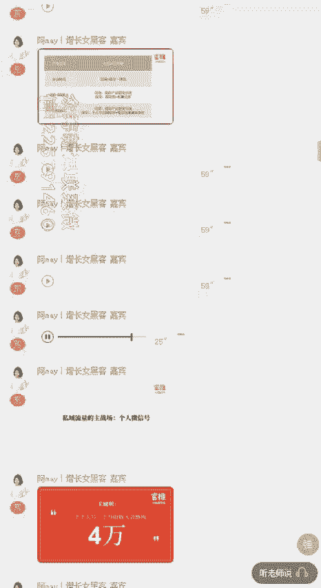

如果是超过5000的产品啊，超过5000的产品，你用群发售效果其实是不是很好的。因为这个超过5000的产品，它属于一个重决策。这个高高消费的产品，这样的产品就一般会前后左左右犹豫很多哈。

所以呢这种产品你需要多频次深度沟通，这个时候就需要你用个人号跟他沟通。个人号是什么沟通？第一个私聊。第二个通过朋友圈。所以呢我们说未来啊私域流量的主战场是在个人号里边去。呃，关键明老师都说一个个人号。

一个月的收入合格线是6呃4万块钱。大家可以检测一下自己呃，你的个人号是不是达到了4万块钱的收入。呃，关老师有1212个微信号，呃，每个月的收入就靠这12个微信号，所以个人微信号是非常值钱的，要。

每一个珍惜每一个跟你在一呃，是关呃跟你是同一个好友的微信好友啊。那么现在呢大家都拼了命的从公域流量把这个流量引到私域流量池里边。呃，我们说哈这个5000人的个人微信好友。

它的成交量几乎是等于10万的微信公众号粉丝的成交量的，大家可以可想而知哈。也就说你一个人把一个个人微信号加满5000好友，你相当于价值是等于同人家做公众号涨粉10万的所以你说你是积攒5000好友容腻呢。

还是涨10万粉丝的公众号容腻呢？啊，大家自己去思考一下就知道了。

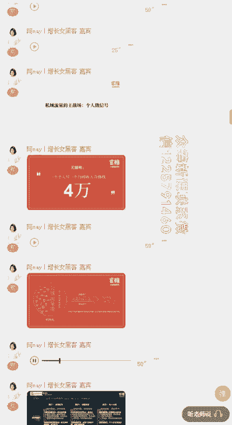

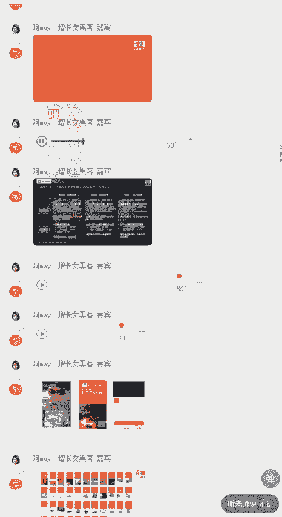

这个呢呃也加到个人号之后呢，会有几种角色。我发了这个几个角色呢是线下门店。注意哈是线下门店可以用来做呃个人号运营的几个角色，一般呢会有三种模式。比如说购物助手话题专家和私人伙伴。呃，详细我不说。

大家可以看一下，就是大家可以看一下，就是购物助手就是客单价比较低的。呃，这种就是标准化程度很高。但是呢它成交的客单价肯定是比较低的。呃，私人伙伴呢它是比较立体的。

它是以顾问的角色给客户解决方案的方式来出现的。所以这种人他的一个消费者归属感就非常强，忠诚度非常高。所以他成交的客单价也会比较高。呃以呢呃你们想一想，我官推最大的优势，其中呢就是能够把所有购买的用。

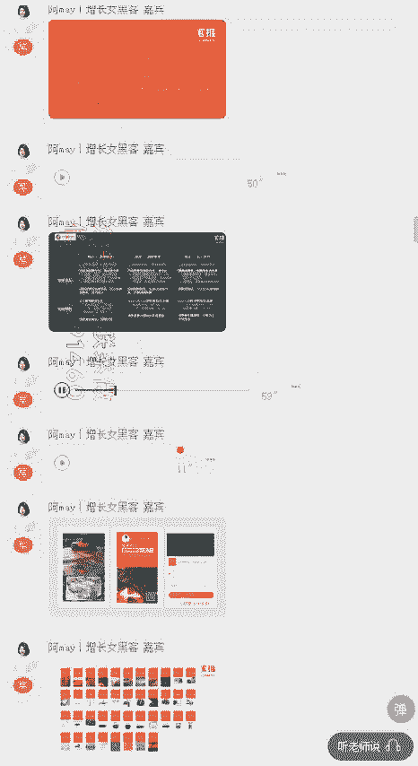

都导到你的微信个人号里边去。那导到个人微信号之后呢，你要想好后续的运营啊，这个是非常重要。好，下面我讲一些案例哈，举一些案例给到大家。因为有些人是做实体店的啊，他需要很多的功能，然后一直来问我们啊。

能不能满足这些。所以呢我也简单讲一下啊，比如说这个卖地图的。

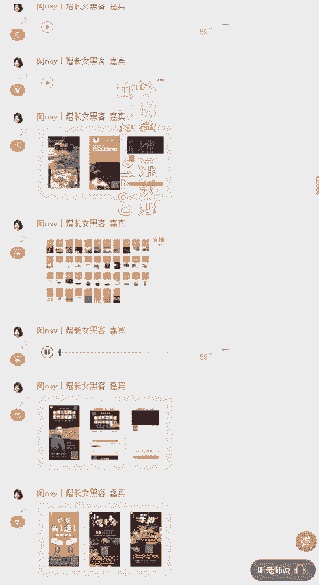

呃，有人用官推卖地图啊，这个地图现在营收都已经差快20万了。呃，他卖地图它就可以什么呢？你比如说你想呃公推现在实现的是活动营销嘛，你想唉弄个双人套餐，三人套餐，一样他可以多下单，下单的时候可以买多份啊。

你就可以通过这样的方式，通过产品多规格的方式来实现一人可以下单多次啊，他的方式就是邮寄的嘛。所以后台呢也是可以设置这个收货地址的，可以收集客户的收货地址。这个客户有点意思哦，他做地图的。

他在后台上传了50多张这个分享海报。大家可以看一下我。佩服他。这就是肺不。😊，然后第二个案例呢是做线下那个大会的。线下大会呢有一些朋友来问我啊，就是可不可以呃不同的位置，我收票不一样。

比如说有VIP门票，有SVIP门票，可不会收费不一样，同一个活动里面设置不同的价格，呃，这个也是可以实现的呃，这是呃上个月这个反正做的活动啊，反正做的这个活动卖了差不多4000多张票啊。

这个也是非常给力的，他们就是不同的座位，收费不一样的。而且呢就是线下的门店和线下的这个大会都需要核销的功能嘛。这个功能我们都做了啊，我们可以看一下啊，这个这些都是线下门店的，它都是需要这个核销的功能啊。

这个核销功能后台可以直接设置的。嗯。

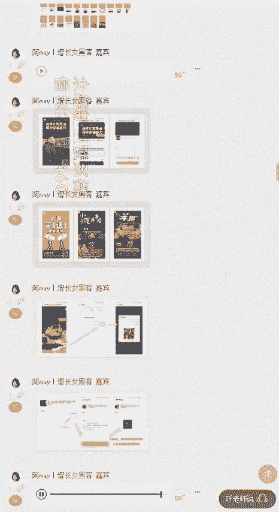

就是到时候客户购买之后。到时候客户购买之后会给他生成一个专属的这个呃二维码卡券。到时候呢他到场之后呢，我们的工作人员啊，直些扫码就可以就是兑换了。

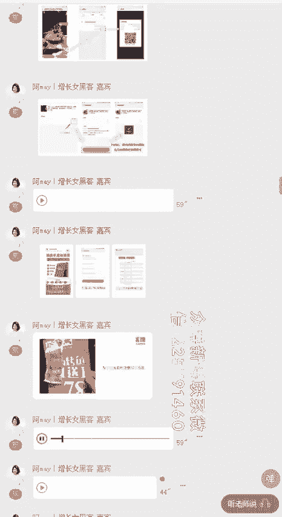

那还有一些朋友呢就是问我啊，就是这个可不可以发物流，可不可以查快递单号啊，这个也是可以实现的。呃，比如说现在正在跑的这个活动，就是卖这个操盘手成长锦囊的，也是买这个实体的资料哈，就是纸质版的资料。

他需要收集用户的收货地址。然后呢，用户也要看到这个快递单号嘛，物流信息嘛，这个在后台都可以配置的。嗯，最近我还看到一个非常有意思的案例，就是发传单的。你看别人为了引流啊，真的是想尽的方法啊。

发传单搞了1个5块钱，你说你领还是不领是吧？那是这样的话，你得来的客户其流量你。😊，流量很不精准哈，所以你虽然花了钱，真的是想尽的方法，但是不一定真的有效。所以你你你要做营销的时候，一定要考虑有效性哦。

不是不是说我把存单发出去就是好了。😊。

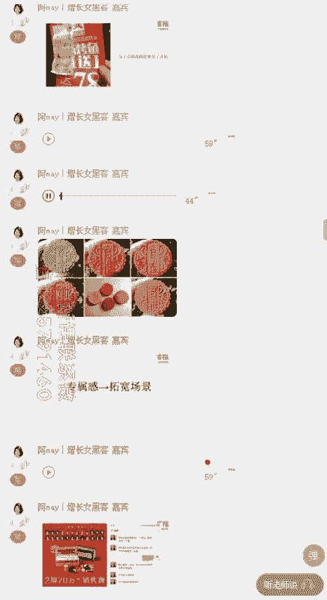

啊，我们现在呢很多人就是想办法就是线下发传单的时候，一定要让客户加到了你的个人微信里边去。这样的话客户才可以跟你进行长期的互动沟通啊。要不他路过了，拿了传单，他就走了，有用吗？你你找不到他了，知道吗？

转眼他就把传单分扔垃圾桶了。😊，所以一定要想方法把客户留住，有真最重要的是让他留到你的流量池里。还有一个案例，我想跟大家分享一下，特别的有意思。这个呢是8月15的时候，有一个同学。

上一期的这个石超营的同学给我发了一个月饼，我特别喜欢。有好多人给我吃月饼。但是这个月饼让我印象特别深刻。因为什么？因为专属感啊，就很多朋友也在做实体的产品呢，我也给大家提供一条思路。

你可以拓宽你的一个场景，就比如说很多人说我自己做的产品跟别人的竞争性其实拉不开。因为差异化真的太小了，大家都是同样的进货渠道。

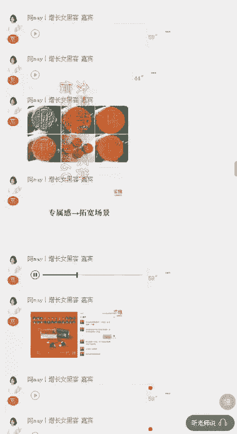

差异化不大。那么如果说你不是要做很大很大的生意哈，那我建议啊专属感专属感送礼啊，这个场景还是很适合就是你去从零开始起步做创业用的这个真的很好用。因为为了专属感，大家愿意付出更高的价格。

是为了就是为了那份专属感。啊，所以说你可可以看到像这样的月饼，你自己去做月饼品牌，你能竞争的过那些什么呃劲酒月饼啊，这些已经就是很出名的月饼品牌吗？你能竞争得过吗？很难很难是吧？

但是你可以定制那就不一样了，你可以卖高价是吧？另外呢还有一个也是中秋节的一个产品。这个他现在其实把它拓宽成生日呃，任何时候需要送礼的时候都可以用的一款产品。这个也是我们的同学。呃。

他本来呢是做这个茶叶的那茶叶的话能能卖茶叶的时候呢，你怎么去呃卖的更好呢？他就做了一个场景，就是送礼这个场景，他做了什么？他做了藏头诗啊，不是叫藏头诗长尾。他这个产品很有意思。

它小罐茶每一罐呢罐子上面呢写的是收件人送礼人的那个。那个那个姓名啊，然后用8种不同的字体把它的信写出来。第二个呢是那个产品本身呢有一有一条有一条纸。这个纸呢上面呢写的一首一句诗。

这个诗呢就是这个收受受礼收礼人的那个名字的。两个名字呃，这个名字里边就有长尾或者长头啊，用红色特别区隔出来，并且呢会把送礼人的名字也印到这个纸里面啊，特别的有新意。所以呢大家收到之后呢。

每个人我中秋节送了好多这样的礼物出去。每个人收到哇，好有心啊，好有心啊，他就会特别的惊喜。就是这么一款产品，他就会比普通。就会比普通的送茶叶啊，这个效果就要更好。

所以这款产品它之前一直都是用线下的渠道去推广的。现在在他学了第一期的是操营嘛，然后第二期刚好就学完之后呢，就马上到中秋了嘛，他就趁着这个机会就组织了一场分销裂变活动。你看之前呢都没有做线上的这个分销的。

晚上之后呢，第一次通过我的课程学习了分销裂变这种组队的方式，然后呢去去销售，然后呢又找到了一条新路啊，就是内心非常感激我，你可以看到就是他两周就销售了70万的销售额。

所以啊你就算你没有办法把分销裂变整套模式都学完，你学到一个就是组队组战队这个对你来说也是很有用的。比如说像混沌大学。混沌大学总部他们的产品经理以及运营负责人在上一期也学习了我的实操营学习之后呢。

他们9月份的大促，就用了战队这个方式去推广，也是用了分销裂变这种模式。当初还邀请了我去组队，我那会呢也因为我也是混沌的铁粉嘛。所以我也组队了，当初我们设置了很多的一个方法啊。

也拿到了这个50万瓜分奖金的资格。所以呢就是在这次活动当中，混沌的价格相对来说呢是比较高。呃，他也用分销裂变的方式去推。但是呢他价格是比较高的。所以呢光是用一张海报去销售呢，效果并不是特别好的。

像这种方式呢。

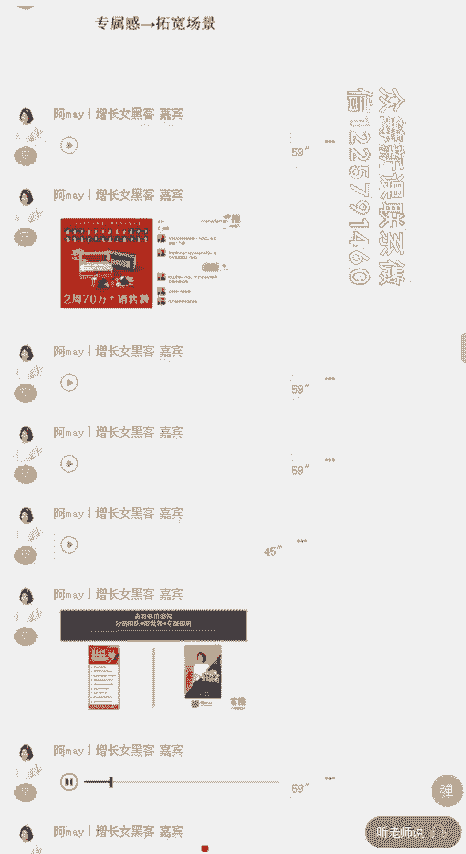

像这种情况呢，我们当初战队就用了分销组队群发售将加专属福利这样的方式去推广。呃，最后才拿到了这个资格哈。所以针对高科燃价的产品。所以呢针对高客单价的产品啊，你光用一套方式呢可能还不适合。

还是要多频次沟通。好，那今天晚上的分享呢，我就到这里结束。然后接下来我会回答大家的问题。呃，最后呢我想总结一下，就是好的产品是一切营销的基础。就是你不管卖什么，一定是好的产品，你不好的产品。

你卖第一个商你自己呃呃这个就名誉。😊。

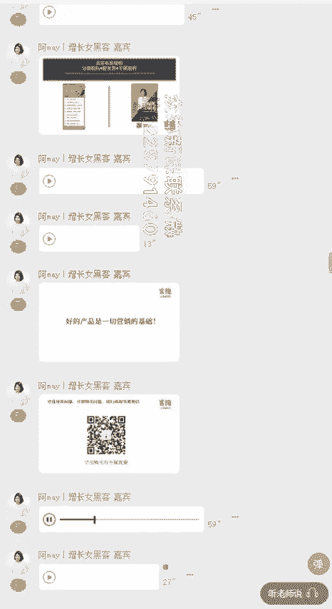

客户也不会长久跟着你，你推起来也很难推，所以一定要选好的产品去推广。最后呢就是有很多同学天天来问我官推的使用的教程，或者使用的问题或购买的问题。因为我这边呢我个人经历呢不在这块。

就是呃这个官推的使用教程和这个使用的新这个方法，以及那个官推的购买呢，大家可以联系一下周记。周记是我们这边的商务。嗯，就是官推这边的使用，还有这个购买，大家可以联系周记哈。咱们学员我告诉他了。

会有专属的优惠给到大家。所以这些问题大家就可以直接联系他就行了，不用联系我。因为我这边的话一下就比较忙，可能回复没那么及时，我怕伤了用户体验嘛，所以大家还是联系他，他这边会及时响应的哈。好。

针对基吻这个问题啊，就是策划一场活动大概需要多长时间？这个根据经验呃，我我有我有尝试过我们呃明天就是七夕节。今天我们说哎明天七夕我们搞一场活动吧。然后当天我们就策划之后做海报，明天就上线。

也就是说一天半的时间，我们把活动搞出来了。

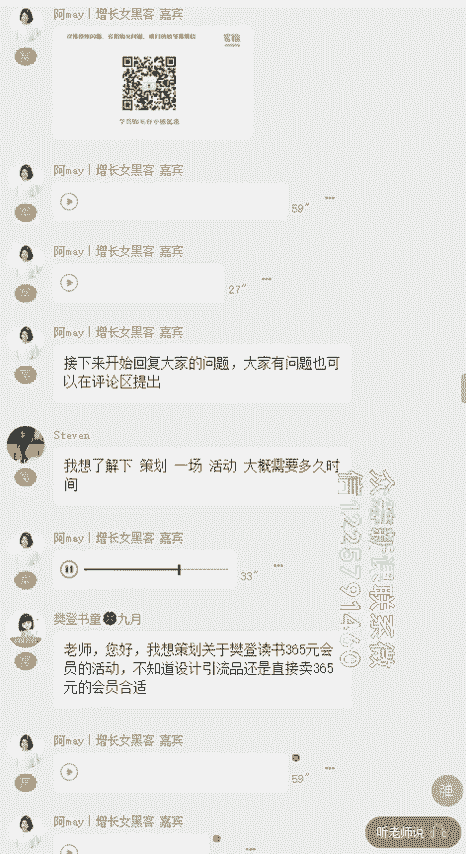

呃呃正常流程下来的话，策划一场活动大概就是7天策划加7天执行，大概15天的时间我会比较合适。第二个问题啊，樊登读书会的活动。这个活动其实我跟你说哈。

就是樊登读书呢这边有很多很多省代呃代理商都在我们这里有开活动，呃，有做那种21天打卡的，也有做线下的活动，也有做读书会的活动，也有直接卖卡的，呃，效果比较好的，我告诉你就是看你的目的是什么？

如果你刚开始的时候呢，你流量不多。有流量不多，你就开始最重要的是先把引流品设计好。比如说我知道的樊登这边有很多的这个呃线下的读书会的活动，或者说线上的那种21天共读一本书的这么一个活动。

或者说你搞个7天共读都可以。这样的活动的话，你可以先用来做引流品，然后呢在在群里面卖这个365的这个会员。因为365的会员的话，反正这边没。年也会搞大促嘛，明年也会搞大促，我看到也会直接去销售都可以。

只不过看你自己现在的情况。如果说你已经积累足够多，对反登有有兴趣的种子用户，那你直接卖365呃的卡也可以。但是现在你的流量比较精准，用户比较少。那我就建议你先设计引流产品。呃。

比如说樊登这边本本身他也会提供很多的线上课程给你们去做引流屏啊，这样的方式也是很好的。

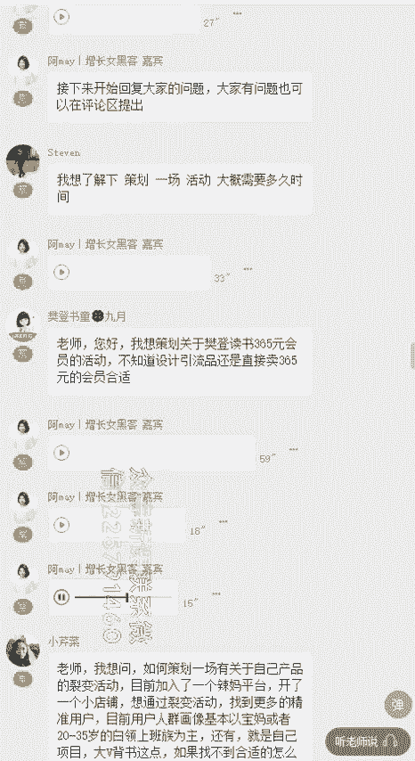

呃，针对于辣妈平台哦，我不知道你是做实体产品，还是说课程类的，其实课程类的或者说社群类的话，又大V背书这一点呢非常重要。实体产品的大V背书，其实这一点呢也有也简单，怎么说呢？因为实体产品啊，它有几种。

第一种的话，用户其实不会太过于看重是说是不是需要大V。当然你有大V更好是吧？比如说范冰冰用过的产品。啊，或者说李佳琪推荐的产品呃，这个也是可以的对吧？也就是说这个大V可以从几个角度来策划。

如果说你这个产品本身呢没有任何的明星用过，那我有几种方案。第一种，你先把这个产品送给某一些知名的平台或者企业使用。呃，我举个案例。比如说有一个线下的蛋糕店，那他刚开始开业的时候。

他没有任何的知名的客户啊，那他怎么去塑造自己的专业性，证明他的蛋糕好呢？他刚开始的时候就去找那个呃呃这个五百强的企业，告诉大家，告诉他的行政，说我这个蛋糕，我可以半价优惠卖给你们。

先请这个行政去尝试是吧，免费送给他试，然后呢再半价呃，送给他呃，卖给他。那行政肯定是从这个成本的这个角度去考虑嘛。好了，他只要给这个这个五百强的企业足够多的优惠，他一定可以拿下。

这个就是成为他的背书就他就可以说某某某五百强呃特供的这个蛋糕店是吧？这样就可以拿到这个背书了嘛，是吧？

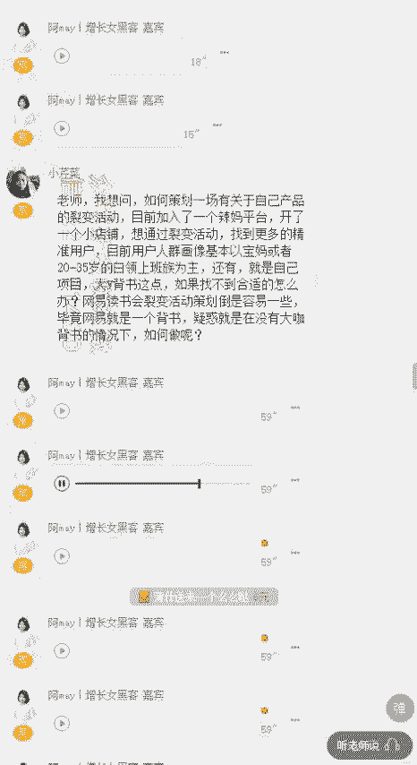

所以作为实体产品。作为实体产品，你就可以把你产品送给一些知名的用户使用。然后只要他使用了，你就可以说哎送给他使用了。他正在使用的一款产品。哎，这个就可以，这是第第一种方案嘛。好。

第二种方案第二种方案就是实体实体的产品。呃，你现在的话要以宝妈和白领上班族为主，对不对？那实际上的话，它不一定是知名的，用这个这个大V它可以是什么？是大家认为的比较知名的企业的用户就行了。我举个例子吧。

比如说你就送给腾讯的产品经理使用啊，或者说送给呃百度的这个员工使用。那你到时候你就说百度员工都在这个百呃百度员工在用的什么什么什么什么就就可以了嘛，就是说知名的企业也可以当帮你做背书嘛，是吧？

所以背书这个东西呢有很多种，所以就看你怎么去借助别人的势能了。呃，借助别的势能这一点非常的重要。比如说像我们当初做完专色群666的时候，它是一个新品牌。那当初我怎么去找到这个大V帮我做背书的呢？

那我在课程里面其实也有分享，我今天再重复呃讲述一下，你怎么去找到这些大V愿意帮你做背书呢？就是几几个方面，几个比较容易的方式哈。第一个付费加入他的社群。哦，很多人付费加进群内的话，就在那里潜水了。

不说话。其实这一点非常不好，你不说话，别人根本不认识你，群主也不认识你是谁啊，你一定要主动当这个机头啊，一定要主动出现在大家的眼中啊，把你做事的风格亮出来。了解你。让大家了解你，认识你。

这样有人才愿意看到你知道你之后，才愿意帮你推荐。我再举个例子，现在很多同学学习完之后呢，在我们的学员群里面不说话，他其学习了效果也好，自己学了心得，但是他不说话，不说话这样呢我就不知道他是谁。

甚至我都不知道这个人这个人是不是有学习过我的课程是吧？因为我这么多的学员，我几千学员呢。那么你怎么样在几千人突出来呢？那你就是多活跃。那你可以去实操，把你实操的案例跟我说啊，这个是一种方案。

第二种呢呃多写心得啊，多写心得。我天天我看到你，我自然就会知道你哎这个人学习很认真啊。然后呢如果你能够呃就是有机会呃去分享。那当然。非场分享能够让我听到，让我了解到。那这样子的话。

这个我我对你的信赖度就越高。那你再找我去做背书，我当然愿意了。哦，我不会因为你是我的学员，我就推荐你的。因为我推荐别人，我要经过我的审核。因为不是说你付费了，我就觉得你你一定很好是吧？

我一定要经过我的审核。那如果我要经过我的审核，我怎么了解你啊，我要了解你，我怎么通过方式了解你啊。如果你不主动来勾搭你，我我很难主动去勾搭你的。所以呢你主动去勾搭大V。然后呢呃多在他的面前发现啊。

这是一方面。第二个呢呃有一些朋友呢就是比如说有一些大V呢，他是有公众号的，你经常去打赏。打赏多次之后，你再加他微信，那他就愿意通过是吧？再比如说像昨天聚星社搞了一场活动呃，前天刘克亚老师。

老师的微信怎么加得到啊，就是你帮他推这个课，他排名前五的就可以加他微信向他提问，这样的机会就很难得。这样呢你就可以加到他微信，勾搭到他就是通过这样的方式去链接的。

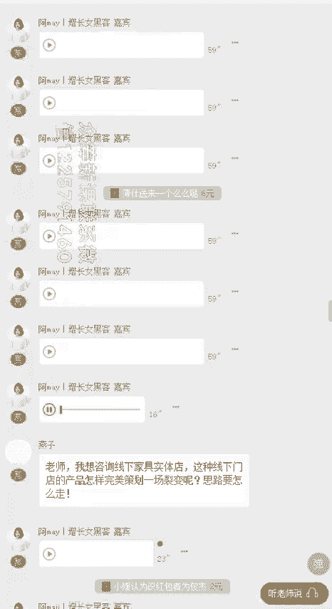

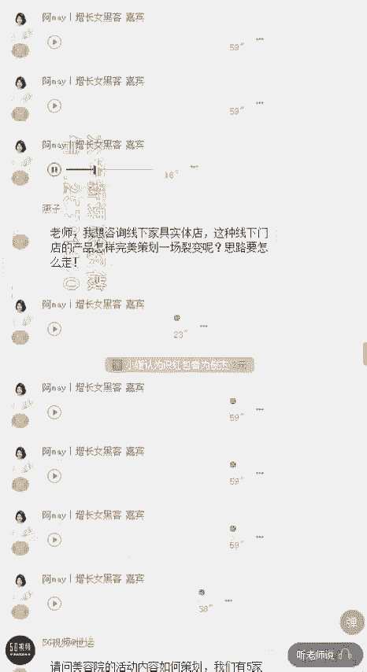

啊，刚才的问题回答有点长了，我下面加快速度哈，线下家具实体店，线下这样的产品怎么完美策划。首先你要了解买家具的成功呃，这个客户一般是什么类型的，是不是他是呃呃这就是新房入住要装修。第二种是不是他那个。

第二，是不是它的这个呃要要做这个二次的翻新改造嗯。就是或者说呢是什么呢？或者说是不是他要搬家新搬家啊，这是类型的用户可能是购买这个线下家具比较多的这个用户，对吧？那你要去分析了。

那一般来说他们会在什么地方出现，他们一般会去怎么获取这个资讯，比如说他是要装修的产呃，这个客户，那装修的客户，你要去分析你上下游。比如说呃装修的公司呃，装修的这个呃。

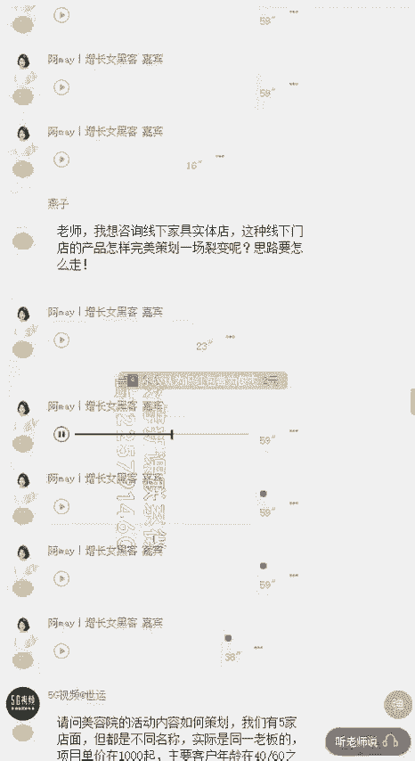

什么什么呃，装修队，这些呢就是你的上游是吧？那上游搞好关系，他可以给你引流。嗯，他们的就客户流量池就是你的很好的流量池。那这样的产品的话，首先。这个。这个客户流量池你就可以去找这些。

比如说像土霸兔啊这样的，他们如果拉了客户群，经常讲的这个业主论坛啊这些那你赶紧去参加他们线下活动嘛，是不？那他们做的这个线上的这个社群。那你赶紧去加他们的微信啊，加入他们的群啊。

这里边都是你的目标客户啊，然后呢加入之后呢，想方法把这客户引流到你的个人微信里边去。呃，这样的话，这些客户不就是你的第一批种子客户了嘛？是吧？那怎么去设计这个产品来让他去做裂变呢？那有几种方案哈。

我们在第三节课的时候也讲到，就是呃设计引流品方案的话有两种形式，一种是实体产品。第二种呢是线下虚拟产品。我当初呢设计了几个模式，你可不可以按照那个模式，先把你能用的上的产品先罗列出来。

比如说要购买线下家具的那。太克。要开什么样的课可以吸引到客户的注意。如果是要客户到线下来做活动的，要做什么样的活动主题，能够吸引到客户的注意。啊，然后呢，比如说线下家具。

你可不可以选到一个大家很常用到的一个家具，然后呢这个价格呢又比较容易呃就是有这个很明显的这个感知度，一下子能让它吸引到哎，我在这个里买，的确是优惠，的确是好哦，然后呢就到你线下门店来买我举个例子哈。

我不是很清楚啊。但是呢我只是简单举个例子，比如说凳子。那种板凳啊，就是吃饭的时候呃，有时候还是用得上那种板凳啊，这种板凳又便宜啊，然后呢它又是跟你的产品相关联啊，它价格。低这成本还是比较低的嘛。

你可以你比较低的成本拿到那客户感知度又是比较高的这样的产品就可以去做是吧？那还想想有没有其他的方案，你就从这样的思路去想去思考。啊，呃，当然我觉得实体店的产品呢。

它有很多种呃就是跟线上成线上的产品有不同的一个操作方案。比如说像这种产品，卖家具的产品。呃，也不一定要拉群啊，你跟用户加到微信可能就很好啊，不一定要拉群。因为你也避免就客户被别男人来挖走，对吧？

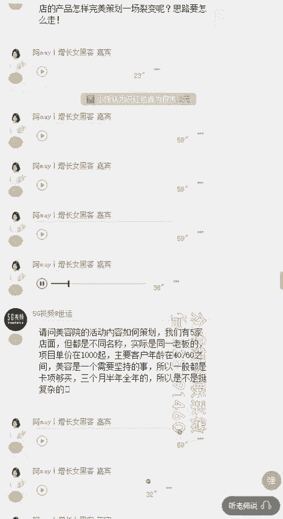

好，美容院的案例美容院的案例我好像记得有讲过呀。你像这种的话，你看你完全可以搞一次性的美容，先让他过来体验一个活动嘛。比如说你这个项目单价都1000起，你这个价格真的是有点高啊。

比如说你可以做一个引流品嘛，美容院嘛，你想想大部分都是什么类型的客户啊，这40到60的客户，我都说了，引流品不一定是你自己。真正的产品，也就说你可以购买来引流的，就是这些类型的客户40到60的。

他一般会比较注重什么？比如说艾灸啊这种呃就是还有那个什么蒸脸蒸蒸就是。呃，面膜啊就是反正跟美容有关联的那种产品，其实都可以成为引流品啊，不一定是一定是你们自己的这个产品才算呢。

只是呢因为你们是线下活动先。吗线下的实体店嘛，最好设计的引流品都是要到店领取就好了。我举个例子吧。Yeah。比如说搞个什么样的活动啊，就是呃每个月都可以去你那里领一次奖品。

就锁定客户每一个月都来一次来领一次。你可能每一次的这个呃奖品的价格大概也就在呃几块钱到十几块钱，20块钱之间就可以了。但是这个价格呢呃虽然比较低，但是呢你要设计高价值的产品。

这样的话就呃比较容易锁定客户呢，又又又比如说可以拿花呀，比如说每个月来领一枝花是吧？啊，你规定在某日来领啊，这样的话你就安排客户跟进客客服跟进来领取这个到店的客户有一套流程设计出来怎么转化就可以了嘛。

所以你可以一年啊买买买一年花，你看那个。

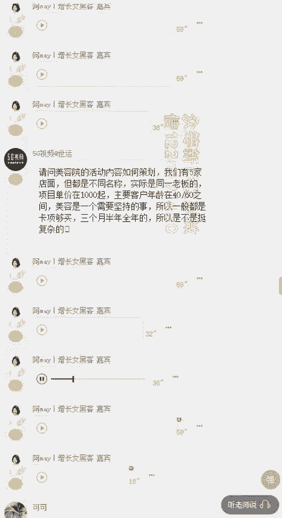

有一些是年卡呃，就卖花的产品，它卖的很贵，那你可以卖便宜啊，因为你不靠这个赚钱嘛，是吧？所以你就可以通过这种方式让客户上门来。我记得还有一个案例是讲美容院的，你就是什么意思呢？

就是美容院的产品是呃比较贵的嘛。然后呢，他就专门找了一个这个减肥类型的这个客户，因为他美容院有那种减肥的项目嘛。嗯然后呢就专门请了一个老师讲教那个减肥操的托呃弄了一个场地专门跳。

但是呢说实话没有几个人坚持的了嘛。但是因为老师给他教的时候呢。比较用心，所以他特别相信老师。然后老师那些坚持不了的学员就推荐他哎，直接去那个二楼的美容院去找这个某某检老师傅帮你调理。

这样速度也可以可以减肥，这样的话学员很容易就销售转化了嘛。所以他跳操很便宜啊。跳操就是囤一个场地，然后请一个老师很便宜。学员就是到到下面跳操，可能一个月也就付了一两百块钱就可以来跳操了。

他这个是他的引流品，他就。挣钱。啊，甚至不挣钱啊，就可以获取客户嘛啊思路都是有啊，因为不同的这个呃。不同的这个产品，它的思路不一样，但是我只给你提供思路，你按照的这种思路去设计你的引流产品就可以了。

衣服包包彩妆日用的电商，那你完全可以拿一款比较好的比较知名的产品拿出来做历练呢。呃，我之前在群呃群里面其实有呃，就是在课程里面有分享过专门做这个呃面膜和这个洗面奶的裂便吧。我们有一个客户。

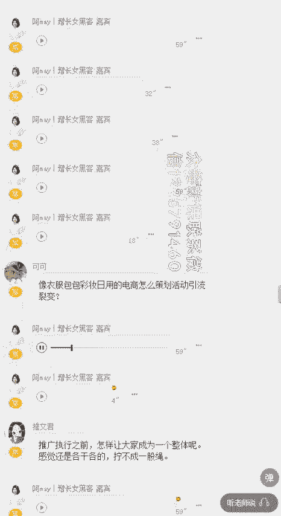

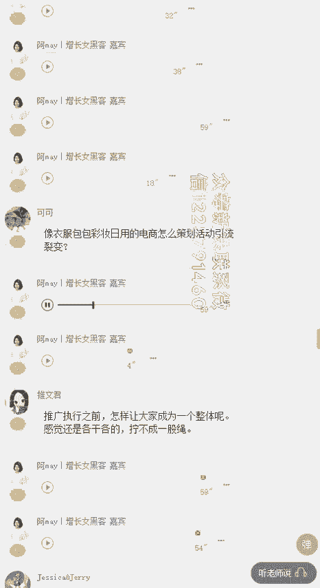

用棺材卖面膜，卖了5万多份啊。😡，但是我跟他签了这个保密协议，我不敢呃不不不好给大家透露他的信心，但是他的确卖面膜卖了5万多份，就是用分销裂变的方式来做的。因为你像做这个微商产品啊。

特别特别是非常注重什么粉丝来一个这个精准的目标客户的这个微信啊，他愿意花50块钱，你知道吧？所以呢你要是学会用分销裂变这种方式去做裂变。这个来的粉丝，你要一个活动能卖出100单，来了100个粉丝。

50件乘以100就5000块钱到手了，知道吧？在执行之前怎么样让成为一个整体感觉各干各的啊。首先第一个作为操盘手，你自己要分工好。就是你确定哪些人能干活，哪些人不能干活。

你要先了解一下每一个人的他的一个优势和特长在于哪里？然后第二个的话，分工好之后要私聊对方，就有的时候大家不看群，对吧？那私聊对方之后呢，让对方到群里面回应啊，回应的多了，大家一定会在群里面有个氛围啊。

第三个一个要利他，大家为什么要一起干活，一定是利他，你作为一个操盘手，第一个，要让大家知道跟着你做操盘有哪些好处，是学到知识呢，还是能赚钱呢？还是提高自己的能力呢啊这都很重要。所以你作为一个操盘手。

你要掌握好，为什么那么多人愿意跟着我干活？跟着我去做分销，因为他们每次跟着我，他都能学到东西啊，我都会除了，除了让大家去分销之后，我还会教大家各种方案。比如说群那边。呃，群发售的方案。

我会把详细的操作步骤都告诉大家怎么去操作。然后呢，这个推广文案怎么写啊，什么时间点发啊，然后呢也会激励大家，就是除了这个真真实实给到大家的这个利益，也会激励大家。比如说我在做混沌战队的时候。

我弄出了一个口爱号叫做什么？不做无名之辈。叫什么？你你既然选择参加了个活动啊，那我们就要拿第一，我们不做无名之辈。作为一个战队的成员之一，不用求多奉献一单，至少奉献一单，不做无名之辈啊。

就激励大家这种就有高度对集体的认同感。怎么操作一个新产品？这一点其实有一点呢就是要造势。

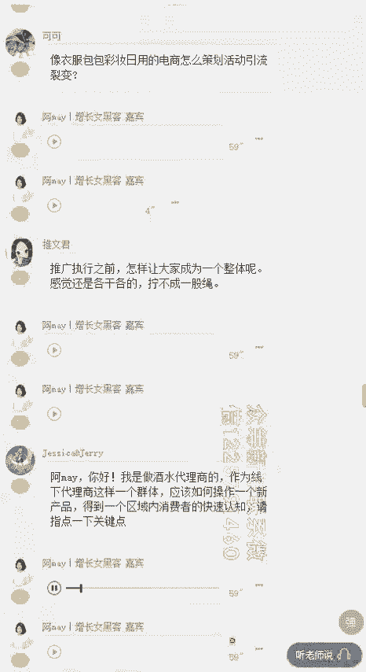

这新产品要上市，你就要造势，造势很重要，可以让大家快速对你这个产品获得认同感。像我们在做玩转社群666的时候，我前期要造势，就是为什么前期会做第一次的这个任务宝裂变活动，那我会借势，啊。

你自己没势能的时候就借势。比如说我在第一次做活动的时候，我借了什么事？我当初呢做完专社群绿六这个活动的时候，我就呃去找了这个市面上这个秋月老师的这个书。因为我没有势能啊，当初是新新品牌嘛，没有势能。

但是秋月老师的书是市面上呃社群营销里面畅销书可以说是排名前。的第一名的畅销书。大家对这个面的。他对玩转社群66没有概念，那知道对书有概念，对吧？那我就借势就告诉大家。

你要邀请5个好友就可以免费进我这个群。你要是在某某几几几个月几几日前邀请排名这个前40名，我就给你送这本书啊，好多人因为这本书啊来加入了我们的社群，当然进了群之后，我会给他马上呈现价值。

啊让他马上感知到玩转社群666本身很有价值哦，这个就很重要。所以呢当你自己是新产品的时候，你就想方法借势。比如说你做酒水代理商的。哎，那你能不能跟当地比较知名的这个呃。这个百货超市搞一次促销的活动。

你给他出方案。只不过你在出方案的时候，到时候呢，你搞这个品牌。啊，或者说搞这个促销方案的时候啊，把你的酒水啊，这个品牌啊做一次势能的爆发呈现啊，怎么去呈现？比如说当地的首富我都送给他。

那说明当地的首富可都都在用这样的产品是吧？都在于喝这样的产品，哎，再拍几张照片，那就很好是吧？那再比如说你把你这个产品啊，怎么把势能造起来啊，能不能跟一些现在比较热门的这个网红的这个关键词。

或者说网红的玩法结合起来，那你就选网红这个酒水是吧？这样的话就是给他这什么呢？你是一个新产品，你是套一个大家都知道的一个名词，这样的话就是什么所谓创新，就是旧要素的重新组合。

这样的话就变成一个大家比较熟悉的新产品，这样的话也就容易。就容易把你产品推向大众。Yeah。亲子的小白鞋亲子的小白鞋，你要建这个21天育儿的书籍来做引流品。

呃，我这么想啊，就是你想要招这个宝妈来卖鞋呢？就是做代理呢，还是来只是拿来当你的客户。如果你只是你是要招代理的话，那你要招代理，你就不建议去做这个育额的书籍的。这个群因为招代理啊。

他们是为什么想做代理呀？他们想赚钱呢。所以你做余额的群呢就不太合适。因为余额的群呢大家都会导致什么？大家都在关注余额，那反而呢跟你这个产品的相关性呢会比较低。所以呢就是如果你是想以招代理为主的话。

那你首先呢你要去呃。就是一般像我，如果是我。来做的话，可能我的方案是这样的，让大家先了解这个小白鞋嘛，对吧？那你是有线下实体验的那一般人很少因为鞋来组成一个社群，明白吧？大家不会在群里面天天讨论鞋子。

那像你呀比较适合什么？在混入别人的社群，打自己的广告。就混当地的宝妈群，跟大家成为好朋友，先做人再做事。哦，然后你在群里面传在传授这个育儿的知识。在育儿的知识持之后呢，大家对你有比较好的信象。

再告诉大家，哎呃我我我我有在这卖这个小白鞋啊。群里面的同事呢，我同学购买的呃，这个好友购买的话，我都会给有专属的这个优惠给到大家，让大家唉感受到唉你在我这个群里面。

我是给了我专属的优惠的那既样我都要买鞋，买谁不是买那我跟你买。对吧通过这样的方式建立长期的合作。那么你要列代理呢，接下来就是列代理了嘛，前期这些都是总监护嘛，列代理呢就要做宝妈兼职创业赚钱，呃。

在家也能赚钱这样的社群。这样的话才可以成为一个长久的交流的群，而且跟你主题比较相关的。呃，你做育额群可能还不太合适，反而你可能花了大量的精力去讲育额。但是呢跟你产品又没有什么挂钩啊，就不建议。

线下实体的护肤品店怎么引流，怎么策划分销裂变？你知道玫琳凯吗？你就知道他是怎么做引流的，他专门就开各种的护肤品化妆的课程。然后这不就这就是活动主题了嘛，然后再吸引客户到店来培训。

然后就顺便就卖护肤品了嘛。所以你卖课嘛，卖线下课嘛，卖线下体验课嘛，这样就很好嘛。

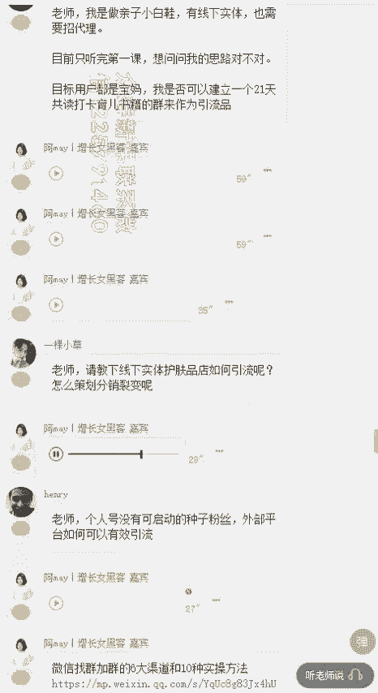

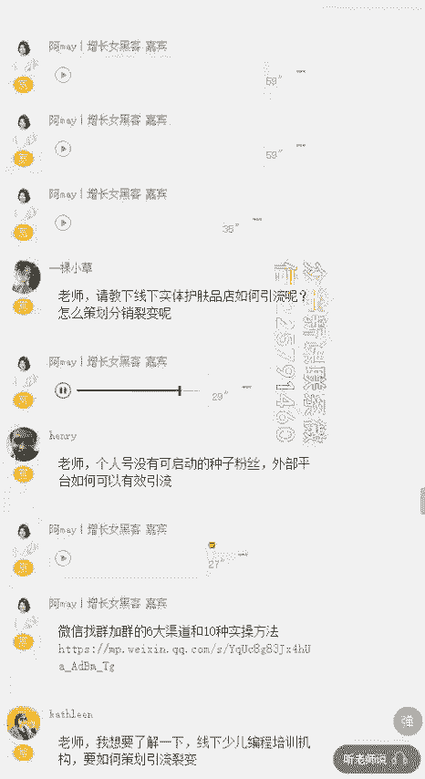

个人号没有可启动的种子用户，那你就去加群啊，付费加群，加付费的精准群去参加别人的课程啊，然后去建立自己的威望。通过这样的方式吸引客户呃，这里好像我有专门写了一篇文章。我把文章链接发到这里来。

那你可以从这个方向去学习。做培训机构的其实最常见的引流方案就是呃线下的体验课嘛，这个引流方案还是比较常见的。第二种的话就是你看一下你能不能设计一款可以到店领取的实体产品。

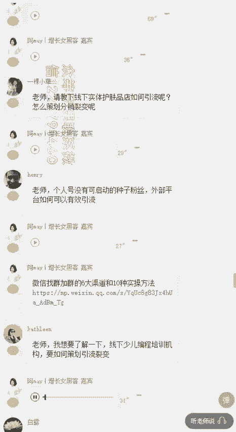

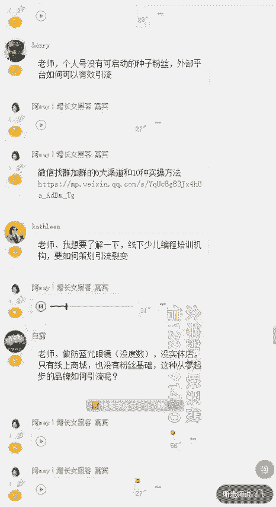

呃，跟你的课程相结合，然后呢呃又可以跟少儿相结合。比如说训练儿童编程或者说儿童思维的玩具啊，这样的产品也是可以的。首先第一个防蓝光的眼镜本身呢不是一个高频的产品。这种产品说实话做私域流量也很难。

因为这种产品不属于。复购率高的产品，你做了。还不如直接叫淘宝销售就好了。所以如果你产品没有特别好的竞争力，其实这种产品真的很难很难做。我倒觉得如果首先第一个，如果你的产品本身有了竞争力。

这种产品的话可能就比较适合在这个电商平台做这个关键词，或者说优化好你的广告推广渠道。否则的话，这种产品很难做啊，这种品牌也很难做。反蓝光的眼镜没有度数的眼镜。这个真的我我自己觉得这种产品是非常难做的。

让为我选超盘的话，这种产品我会选择放弃。不过我对这个行业可能不是很熟悉，你也千万不要输去信心。你可以去去了解一下竞争对手怎么做。啊，这个产品我没有什么思路，因为一来是我觉得是低客单价，低复购率的产品。

所以哦在我来说在我看来不是特别好做的一个产品。那我做我肯定做高复购率的产品，或者说高客单价的产品。

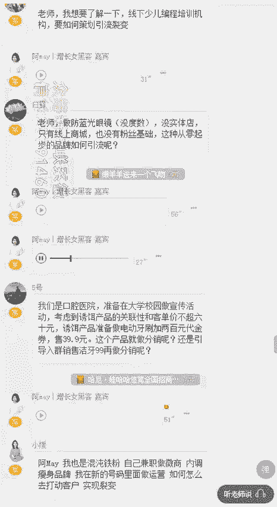

呃，幼儿产品是这样的，如果说你准备做地推呃，做地推去卖这个39。9块的产品的话，那么你可以现场直接地推。然后把这个用户积累起来，算是你的种子用户，然后呢再去卖这个洁牙的产品做分销，这样也是可以。

然后呢电动牙刷的产品。如果你可以做分销的话，你可以样利多少呢？就是呃这个产品的话，如果能够样利的话，那么客户买了之后，你再让他去帮你做分销。那当然也是可以的，这个也是没有问题的。所以呃就看你自己呃。

我是让我去操做操盘的话，我可能会选择尽可能的让更多的客户带来老客户。比是我可能从第一个产品就引导用户去做分享。做微商，如果在新号里面做，没有导老用户进去的话，很难做。没有老用户的支持。

你新号你很难一下子建建立起信任，那你就很难做了。所以一般来说微商他开第二个号的话，第一个号也会把呃也会把这个忠实的老粉，导到这个新号里面再去做运营的，这个就很重要，怎么去打动客户。

那瘦身的产品你去可以去了解一下柚子妹，他就是做瘦身产品的，他怎么打动用户啊，用人品用人格用做事的方法，那用好的产品，所以呢呃这个打动用户有很多种方式。呃，但是瘦身的产品呃。

我我我我我不知道柚子妹那个产品怎么样啊。因为我没有体验过。但是他既然坚持一直在做应该还可以吧。我我不是很清楚，我只是跟你说，柚子妹我是挺佩服他这个朋友圈营销的。

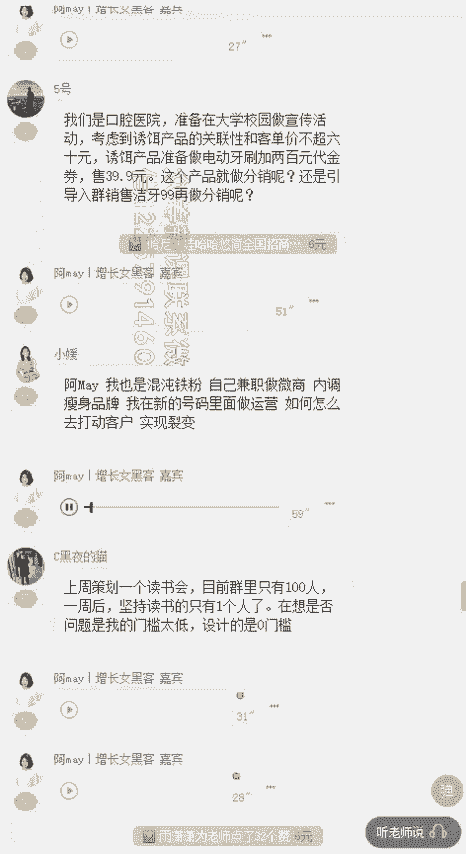

因为他在朋友圈里面一直传递自己做人的原则，是利他。做人的原则是感恩啊，做事的原则是靠谱可靠啊，责任心强。也就说人大家都爱跟这样的人打交道，对吧？所以我们说做微商啊，与其是说卖产品，不用去卖人啊。

一定要传递出你做事的理念和态度，能让大家认知你这个人信任你这个人，那不管你卖什么产务，我都买是吧？这样肯定是的，你零门槛坚持的人肯定很少，而且呢大家没有动力啊，读书会是很难的。嗯。

所以现在大家做读书会都是搞押金制度嘛，就是坚持打考完毕才可以收回押金嘛，然后坚持的人可以瓜分押金嘛。所以你门槛为零，那肯定没有法办法坚持啊，所以一定要收费，一定要收费，一定要收费。

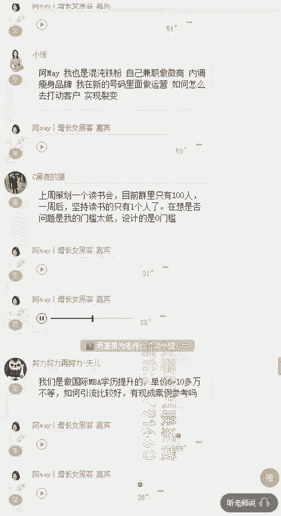

你们做的这个产品本身的客单价很高。这种的话，第一个你要求是精准的用户学历提高吗？第二个一定是客户跟你长期沟通，多次互动才可能达成交易的，属于重决策的产品。所以前期你要去了解什么样的人会去做这个学历提升。

你先去调研你的老用户，哪些人会去做。哦，然后你再去想办法，这些人了解一下这些人关注哪些领域，关涉哪些信息，在这些地方去引流。那刚开始引流的时候可以有什么方案啊？

有些就是成功的师兄师姐去说一下提升这个学历之后的成功案例。然后呢呃通过这样的方式来引流是吧？但是呢我觉得就是因为现在啊我头上有点晕啊。你最好还是按照我们的思路去分析问我有没有现成的案例参考。

我现在手头上没有。但是呢作为高客单价的产品都是这样的，一般会设置一个引流的课程啊，也会有很多人对这种课程有兴趣的，会了解怎么去提升自己的学历的啊。所以你最重要的是找准你的目标用户。然后找准你的精准鱼塘。

然后设计好精呃这个好的引流品，我后去去引流就可以了。

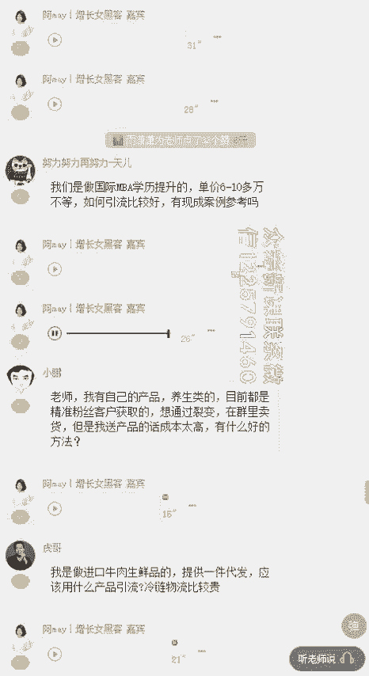

你不一定要送自己的产品嘛，你可以送别人的产品嘛，跟你产品挂钩就可以了嘛。

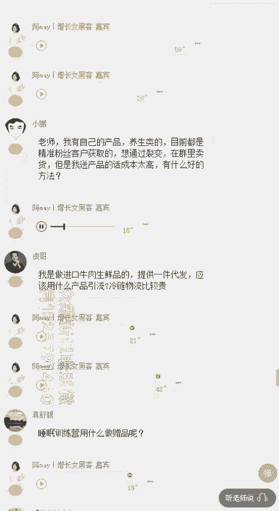

那我也看到有一些人，因为有如说我我玩这事情，66我送书，那也是一样的嘛，产品不是我自己的嘛。说实话，你要是自己亲自去卖货的话，特别难。像你们这种的话，最重要是走社交电商渠道会比较好一点。

所以你最重要是拓展渠道，而不是想办法自己一件一件把货卖出去，真的很难啊。这种的话还是找渠道会好一点。那么你渠道就有很多种嘛，比如说是微商，那你提供一件外代发，你就想找渠道去做找找微商去帮你去代发。

是不是？

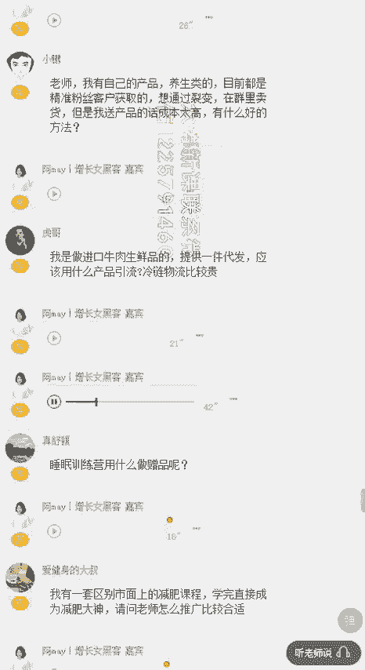

那微商的这个群体，你可以通过什么方式去了解到他们，让他们知道。你的产品以后呢愿意帮你去分发。嗯，然后第二个的话就是涉及到电商的渠道，那种渠道的话就一个个沟通啊。那微商的渠道你是可以找到人群的。

用微商的群体特别热爱学习。嗯，你找一些微商的课程，里边就是一对一微商了。嗯，一开始的话，你可以先送你的产品给他尝一尝。那大家感觉好了，再帮你去销售，那也是可以的嘛。睡眠训练营啊跟睡眠相关的东西啊。

比如说眼罩、耳塞，还有那个什么。呃，什么像熏灯之类的。啊，可以考虑跟这个睡眠相关的东西吗？甚至于那种睡眠抱枕是吧？这些都有。

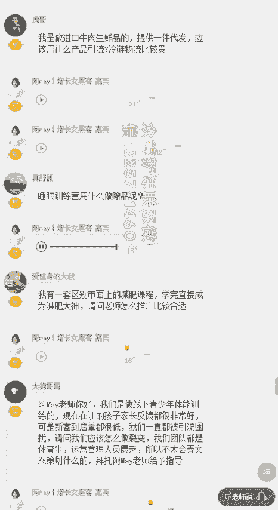

说实话，市面上减肥课程也很多，你怎么知道你这课程一定比别人好呢？如果学完之后直接成为减肥大神，那你肯定会有很多成功案例嘛，那你就发展这老学员帮你去推广就可以了嘛，给他们利益嘛，是吧？

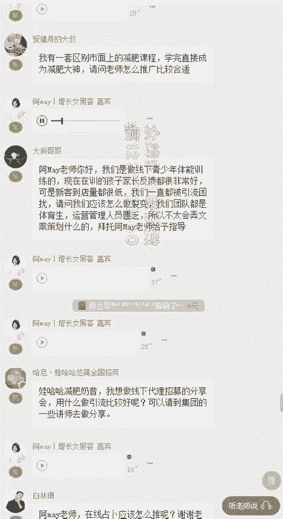

你现在的问题是说你本身有客户量，但是呢客户到店很低是吗？还是说本身量都很少，然后客户也没有到店的，这个具体的问题不是很清楚哈。呃后如果是到店利低的话呢，就想办法吸引用户到店。那第一个优耗话术嘛。

邀约到店的话术，这个你最好是测试多套方案，然后呢，怎么吸引到客户一定要说服到他到店呢？那就要给丽友嘛。He。给丽友嘛？比如说让他到店领取一个小小礼物，他不就到店了吗？

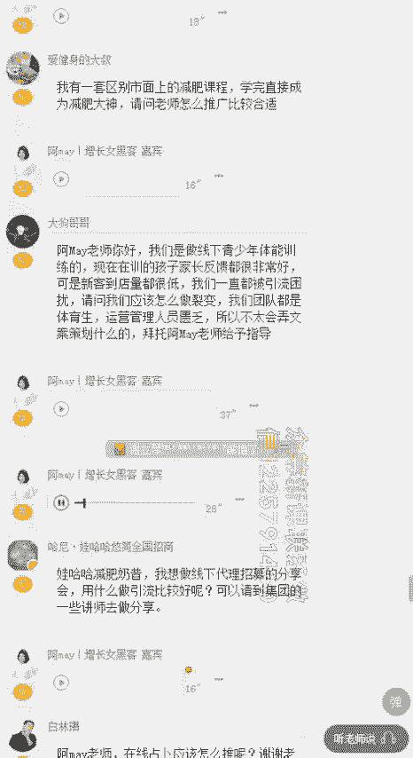

啊，最重要你是吸引那个青少年到店的嘛，孩子到店了嘛，那么你就可以让他到店领取一个跟你产品相关的小礼物就可以了嘛。啊，这种也可以，反正这是你自己要设计好方案嘛，你不能说就邀请他到店来体验。

到店来体验这个吸引力就比较低嘛。这个思路其实我在那个第一节课好像就讲到吧，要教代理的那就讲赚钱课、兼职课、创创业课。哦，这种课程啊比较容易吸引到目标客户。妈呀，在线占卜啊。😔。

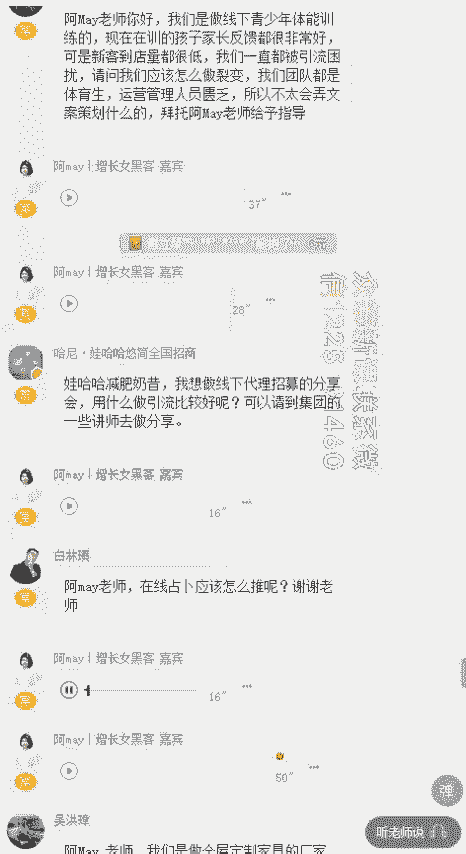

呃，你知不知道这个AI面线啊，他们就用分销的方式推啊，他们就招各种代理帮忙推啊。不过呢这里边呢涉及到设计系统的问题。不过我个人呢不是特别喜欢这种类型的产品。不好意思。😊，这类型的产品的话，我据说这个。

嗯，我倒是有认识一些风水的，做风水的，怎么推啊，写文章嘛，写软文推吗？做公众号做社群嘛，还有那个做呃这个淘宝嘛都有。嗯，反正方法有很多，你其实抓一种就可以了。其实最重要的是你能不能造势。

因为这个方向的话，还是要看你能不能出一些让人吸引的案例出来嘛。或者说引流品有很多种类型嘛，这种的话有一些就是专门做一些测试的一个工具，也可以快速来客。你们那种呢就是价格比较高嘛？价格高的话。

做分销是可以的。你经销商本身就是分销嘛，是不是？你要说要做裂变的话，你要做活动哦，一定要设计活动，而不是直接是卖家具本身，因为直接卖家具本身很难裂开来。客户不会专门就是推推家具的。

在自己朋友圈天天卖别人的家具，不可能的。所以你要想好引流品的设计。

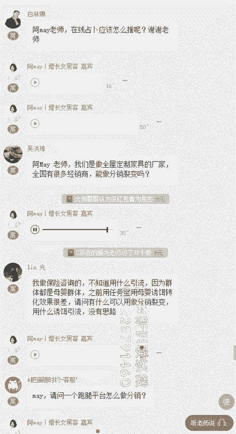

保险咨询啊，我我之前有做过。这个项目我做过。母婴类的群体啊讲课。

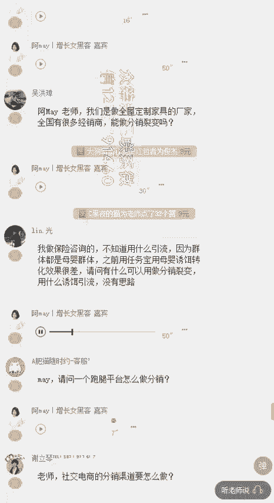

保险咨询讲课就是方法还是挺好的。就卖保险相关的课程。比如说你这类型的客户，他比较关注什么？就是少儿，你你的母婴类的产品嘛，母婴类就是少儿保险，对不对？

那么你可以请一些医生来帮忙讲这个孩子的这个感冒怎么处理啊，就是常见的这个病怎么处理啊，然后再说现在呢有病呃，就是保险都是风险意识嘛，就是让大家呃注意宝宝的健康啊，然后提前做好预防啊。

通过这种方式去使用过嘛。跨腿平台是什么平台？不是很清楚。落后了。测一销电商的分销渠道，比如说云集、拼多多。还有呃像什么。嗯，这个云日淘这些都是这些电商啊，那你最好要找到他们的这个渠道商的申请渠道嘛。

他们其实都是有对资资料出来的，可以去申请啊。Yeah。你这个蛋糕品牌可以考虑拆解一下幸福西饼的案例啊，他们经常搞裂变活动的，他们也做分销裂变啊。他们经常就搞一款爆品，比如说下午茶拿这个爆品来做分销裂变。

但是呢他这种分销裂变呢不是印对普陀大众都做的。

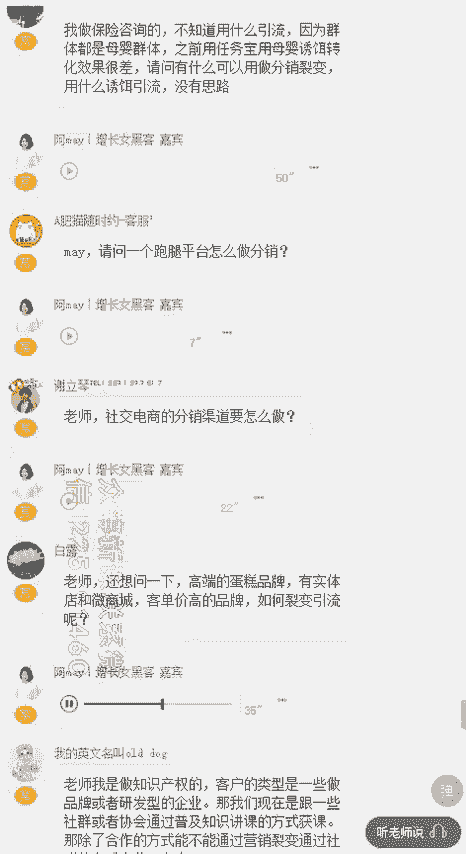

他是会建立自己的这个经呃这个代理团队。比如说培养一些老客户，成为他的代理团队去推广啊，这样方式去推。

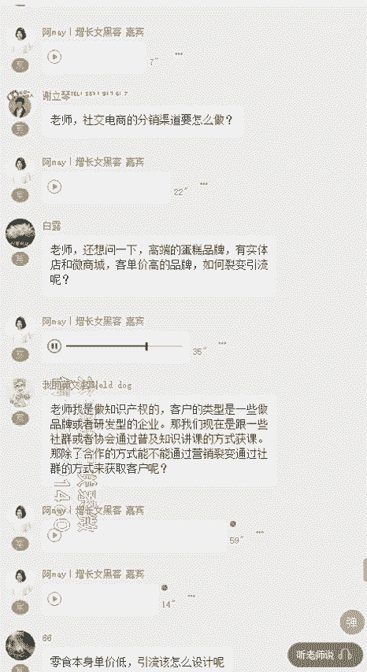

知识产权类的。第一个是通过软文的方式引取长尾流量可能会比较有效。第二个的话，社群和这个讲课的方式肯定是很好的。呃，就是去去提供一些内容给到提供好的内容给到一些社群或者协会。那你们这种方式的话。

自建社群不是特别好，因为没有人天天听知识产权的课程，知道吧？所以你们这种最好的话就是去加入很多的这个创业者的付费社群啊，或者企业加的付费社群，然后呢，通过这样的这个合作的方式跟社群合作，跟群主合作。

啊后在在他们那里讲课，通过这样的方式获可呃，效果会比较好。另外的话也可以做这个联盟呃这个互推和活动啊，比如说像那个。叫什么名字来呀？我想想啊，有一个也是做知识宝产权。金金版权。他们也是跟我们合作嘛。

当初也跟我们互推嘛，他们就出版那个知识产权的报告啊，这样的话其实也是一种推广的方案嘛。零食单价本身很低，但是我记得有一个案例是承包你一年的零食啊。

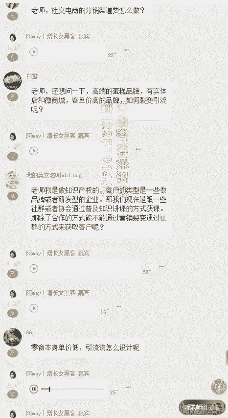

这个好像就就就挺好的，就一年1一个月，你甚至一周可以寄一次零食给他。唉，这样就可以，是不是啊你可以想办法把这个场景拓宽，把把这个多维度去思考嘛。另外的话，零食本身客单价低，你不一定用零食来吸引大家。

因为你要想办法思考什么样的人爱吃零食，什么样类型的用户，他是白领人群，女孩子还是什么样的人群，比较喜欢吃零食哦，你只要吸引这么类型的用户就行啦，是不是你不一定要拿零食来吸引啊。注意问题很多。😔。

你最好是你不看你不听课，你大概浏览一下PPT吗？最好还是看一下PPT会比较好一点。其实这里边最重要是设计海报，然后优化迭代你的这个海报。

另外的话要去测试调研用户的这个对海报的感知度以及对这这个课呃课程和活动的感知度，愿不愿意去转发推广啊，还有你注意一下你的转化率。呃，如果转化率比较低的话，你你你你再去推你效果就很差，知道吧？

有些产品好像是有资质规定，以及不允许去做引流推广的。

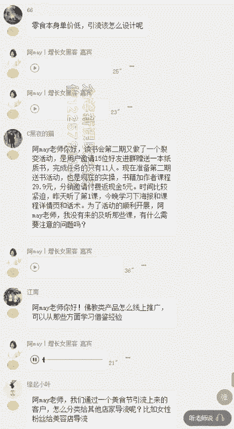

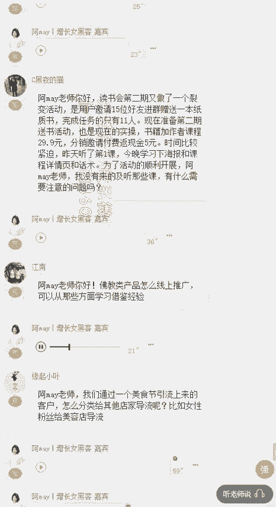

佛教类的产品，我觉得好像就属于这类型吧。所以。😔，我觉得这类型产品做线上营销，其实大众感觉是不好的。あ。呃，不知道你这个分类要多细分，就是说你现在客户是在哪里？你是准备推广一个活动。

然后再导留给不同的店家，是吗？那这种方式的话可以用这个活马工具。就比如说像金群宝这样的工具，它就可以让用户去选择标签，然后再弹出对应的群，让他进群。比如说呃女性用呃女性朋友点这，男性用户点这。

他一点他就可以加进对应的群里面啊。当然我觉得你可能标签呢不一定是这样设置，因为这样设置的话，就太死板了哈。啊，你你可以设置不同的标签，让用户选择，然后呢再加不同的人就可以了，或者说再加不同的群就可以了。

当然如果说你是有用到工具的话，就工具本身它也是可以做区分的。比如。这个比如说像我们的这个公众号，它本身呢是可以区分这个用户本身是哪个城市的，他的性别以及呃。好好像还是可以根据它的活动进行标签细分的啊。

这些东西就可以做分类嘛。活动效果不好，你要去分析。第一个先看一看你的活动转化率低还是高，转化率低，那去详情页肯定有问题是吧？第二个有可能来的流量不精准是吧？那再去往回推，详情页能不能提升？

第二个来的流量不精准是什么问题？

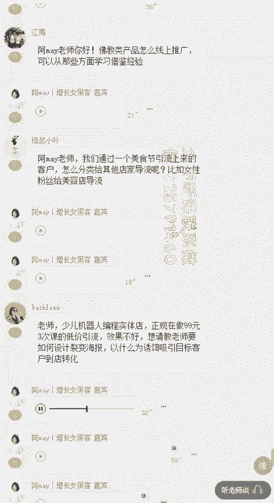

然后呢再去往回推，转化率低，有可能你害怕浑身做的不好。海报有可能做的不好，那海报的设计有没有跟我一样在课程里面讲的去做用户调研，就是这样的海报，你能清楚看得出来是最是受什么活动吗？

这样的价格愿不愿意下单，愿不愿意去推荐啊，然后呢就是你这个呃本身落地页转化率的问题。每因落地页转化率的问题，有可能第一个就是你价值没有提升出来，体现出来。第二个就是你说99块钱三次克低价。

别人是不是真的觉得低价啊，这个就不好说，所以呢你这个高价值是不是有塑造出来文案是不是有处理恰当。啊，这些都会影响你的转化效果。然后呢，最重要的就是你前端的流量是不是足够的。

就是你不可能就每个人都像我一样呃，做过一两百人，就想报出11万多人，其实能够达到这样的活动效果，需要你多方面去做测试。哪方面的做的好哪方面做的好才会有这样的效果。所以呢你要效果好。

那前端的流量灌入还是要有一定的流量灌入的对吧？你没有基础流量，你根本没办法推起来。能理解吧，所以你肯定还是要做种子用户的啊，种子用户从哪来啊？老客户啊，然后身边有就是对这个呃少尔编程有兴趣的客户。

那就去找精准鱼塘去钓鱼，先把这个种子用户吸引到是吧？如何能够成为一个专业的活动运营？成长路线有几种啊，我觉得最快速的第一个，你先去参与别人的活动。从一个活动的这个参与者的角度参与之后呢。

你去拆解别人的活动啊，拆解别人的活动。啊后拆解完了之后呢，如果能够跟到一个专业的活动运营一起办事情，就是跟着你不能干，那效果就就是速度会更快。那就是这个三三个步骤成长，就是第一个作为参与者。

但参与者如果你不去拆解的话，你会很难只就只可能一页账目，你很难见到整个。

这个筋果，所以呢你要去拆解啊，作为一个活动的运营，我怎么去做这次活动的，别人是怎么做的？拆解完了之后呢，跟一个专业的活动运营跟着他干，从头到尾干一遍啊，这个成长速度很快。第二个。

把市面上关于活动运营的书都买回来，全部看一遍，提炼出来做活动运营最需要的东西。这样的话，首先先有个框架，你自己有了框架之后呢，你再去实战。啊，实战里边每一次实战都往里边填肉，积累你的实战经验。

那就很快成为一个专业的活动运营了。讲保险课程当然也可以，只不过呢这种方式的话，需要你前期有流量池啊，找渠道合作，那就可以啊啊。讲保险课程当然可以了。

你去找这种育儿类的这个公众号大V或者说育儿类的这个群主啊，甚至于说找某一店某一店的老板跟你去合作就可以了。我们上次是用了什么幼儿，我们当时讲了这个辣妈啊这个课程，然后呢里边会有保险的课程啊。

这就是七节课选了这个辣妈啊，最关心的7个问题。比如说减肥呀、保险啊，还有这个这个常见的病症，怎么处理啊，啊，七大问题，睡眠啊，还有兔奶啊啊这些问题啊，反正呢就是你自己去设计案例的时候。

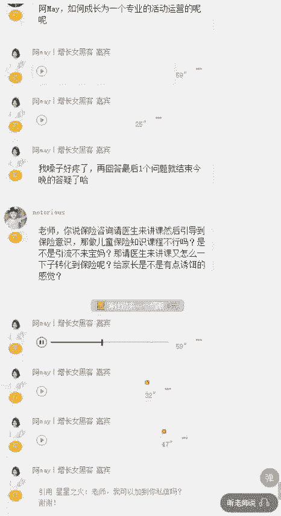

设计案例的时候，如果是只只讲保险的话，就别人不愿不愿意帮你转发，能理解吧？就是只能找举办合作。因为保险人家转发到朋友圈的话，往往会让会容易让别人以为他在卖我卖保险，他会有心理压力。

他转这个这个这个讲生病啊，这些处理的课程当，人员人家还还还好，就讲这样的课程，他没有这样的心理压力。所以我是从那边的角度去设计主题的。

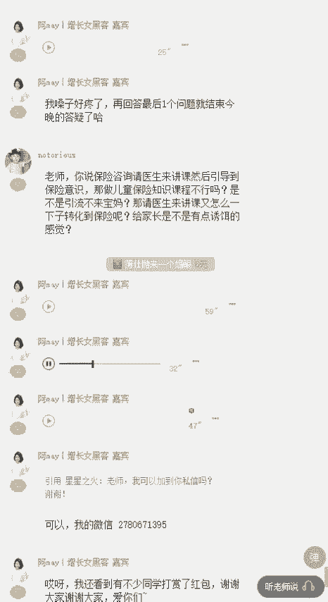

好的，不知不觉的快两个小时了，我的嗓子受不了了，不好意思了。所以今天的答疑就到这里吧。后面大家有问题还可以在群里面提出来的啊，那没问题啊。好，那今天晚上的分享就到这里结束了啊，谢谢大家，可能有些问题呢。

我没有办法回答的很深入。因为呢你的这个行业，我不是很清楚。我只能告诉你思路，更多的还是需要你自己结合自己的这个行业的情况去做分析啊，这个思路我觉得还是蛮有用的。我做任何行业。

我都是从这样的思路去分析的啊，所以大家可以按照这个思路想详细思考一下。然后呢在问问题的时候，最好带上你的思考。😊，那接下来的这个八节课呢，我会邀请8位老师，呃，都是这个实操的操盘手。

他们去分享他们自己做分销裂变，或者说做群发售的案例呃，从一个案例的完整的这个操盘过程拆解分分给到家。所以呢呃接下来的这个八节课，大家可以根据自己的呃情况选择来看呃，明天的这个课程呢？

就是郭亮练老师分享他从一个带队队长的角度怎么去带队的。然后呢，怎么靠分销就可以收入超过6万的呃，这个经验还是很宝贵的。

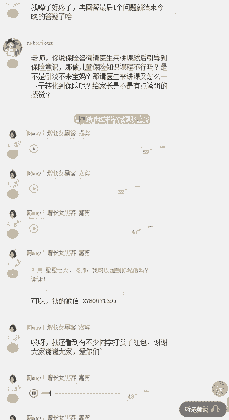

而且明天中午12点，我会邀请琪杰老师来到我们的群内，给大家分享一下他做呃平安的这个项目。在建在社群里面卖这个在线医生这款产品的这个深度拆解复盘过程分享给大家。

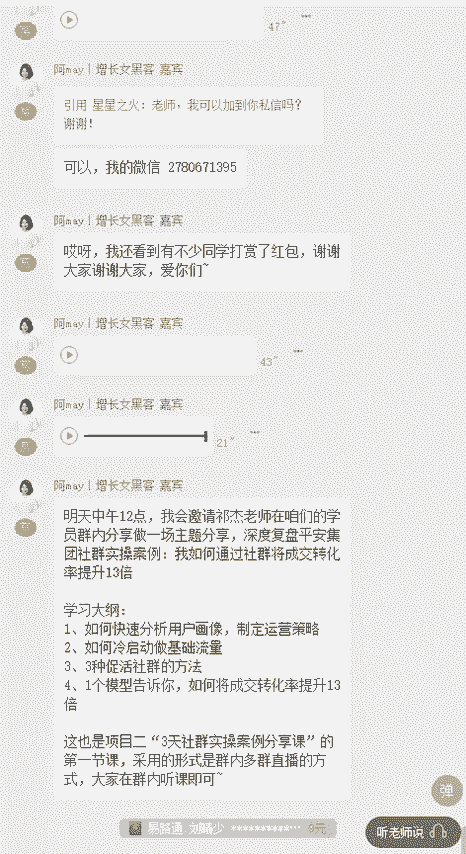