# 微社群裂变营销私域流量池增长秘籍创业运营销售获客视频课教程 合集 8套 374资料 13.1G 定位策略篇：一套让用户自动找上门来的营销方案 - P1：【Day01】定位策略篇：一套让用户自动找上门来的营销方案 - 高端网创试错赚钱大师 - BV1tn4y1X7Sv

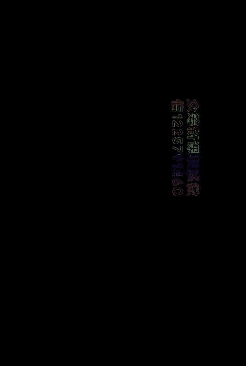

这个声音大家都能听得清楚吗？hello，大家好，欢迎大家参加21天的获客成交实操营。😊，呃，这次的实操营呢，我没想过会有这么多人来参加，真的非常非常感谢。呃，我我本来呢以为这次可能就两三百人。

因为我跟琪姐商量说，我们这次价格定比之前的实操营，我们价格其实也定的比之前高一点。另外的话，因为后续会有很多作业点评，这样的服务成本。所以呢我本来想小班教学的。

但是没想到呃这次很多朋友都跟我说是呃他的朋友强烈推荐他来参加，所以呢现在都有400多人了，都快500人了。这些沉甸甸的信任，要我近期都压力山大，每天都开发课程到一两点，我都在想，哎。

怎么去把这个课程表现出来更好呢。😊，而且呢还有很多朋友啊，自己已经我看了他们的介绍哈，还有很多朋友其实已经做的很成功的事业了，还来学习我们的课程。😊，啊，好，前面的韩暄说完，我们直接进入正题。

那我先做个自我介绍吧。我们21天里面呢，总共呢是要帮大家解决两个问题。一个呢是获客的问题，一个是成交的问题。我个人呢是比较擅长获客板块的。所以呢由我来做这个获客带队的导师。

我个人呢从12年开始进入呃工作。呃，从工作以来一直都在做互联网营销的工作。嗯，自己呢也操盘过很多很多的案例啊，包括很多的营销方面都有涉及过。呃，服务过的客户呢像喜马拉雅混动广州啊，反正读书的授权点啊。

美老板商学院这些企业呢都有呃服务过，给他们提供这个增长流量的支持。那之前很多朋友认识我呢，可能是来源于我们呃做过的一些产品。比如说像官推呀、群勾搭、玩转社群666。

还有呢我自己呢其实也做了一个公众号叫增长女黑客。呃，可大家去总结一下我做增长的一些经验。那成娇的带队导师呢是齐杰齐杰老师。那下面呢让琪杰老师给大家做个自我介绍。大家晚上好，我是齐姐。

首先欢迎大家参加咱们21天裂变成交实操营。呃，在咱们这个开营仪式中，我也做一个简短的自我介绍。那我是社群公社的创始人，同时也是雅培，平安好医生蒙牛的社群营销顾问。那目前也在担任安利中国的呃社群营销导师。

😊，呃，在我的过往呃工作经验中，其实我一直是在做企业服务啊，然后大大小小的企业服务过比较多啊，这里也就不一一介绍了。啊，那么我们社群公社呢在近两年中啊主要啊在服务我们的甲方企业啊。

做这个社群方面的战略转型啊，也帮助他们做社群的企业内训也帮助他们做社群的代运营咨询等等OK那其实在我们社群的这两年社群的代运营的过程中啊，我们的服务经验中啊，我们做过比较多的行业。比如说快消品啊，母婴。

护肤品、服装啊、水果生鲜，包括一些餐饮啊、实体店等等啊。目前来说我们服务已经累积服务了呃70多家企业。那么每一家企业呢啊可能有大有小，有的群都有的群少。我们累积呢也是管理操盘了6000多个社群啊。

累计帮客户实现了4000多万的营收。好了，那么我的自我介绍先到这里啊，接下来呢呃我们把时间交给我们的阿美老师啊，我会在咱们21天的呃训练营中，后半段啊陪大家一起，然后来教会大家说具体啊。

我们通过阿美老师的方法学会了来做流量。那么我们具体在社群里边怎么样接住流量，怎么样促活社群啊，这也是很多人关注的说我的群死群了，是吧？OK我会教大家怎么样接住流量，怎么样促活社群。

以及在社群里边怎么样完成成交。OK好了，我们后半段的课程，再见。好，那现在我们来介绍一下在21天里面，我们到底学什么。然后具体怎么去学习。首先呢我们在21天里边的第一周。

也就是本周我们需要完成的工作是呃听三节课。然后呢有三个是训练的任务。周日呢是彩蛋课，我会请钟艺老师给大家去做分享。

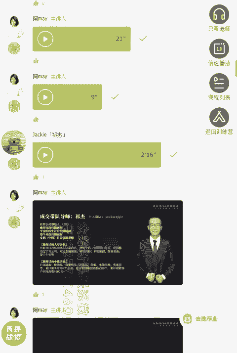

这一周的学习目的呢就是让大家去掌握如何搭建线上获客系统的。大家实操的结果呢，我希望是大家通过这三节课的学习，做出自己项目的线上运营方案。那我今天呢会去讲定位策略篇。

一套样呃就是我自己做出来的一套让客户主动找上门来的营销方案给大家做分享。然后周三呢会跟他去分享怎么去做IP打。周三会跟大家去分享怎么做IP打造，我会告诉大家，从我的经验以及我结合身边的朋友的经验。

怎么去快速提升你的个人品牌影响力以及你的企业品牌影响力。周五呢会告诉大家怎么去生产内容，怎么高效生产大量的高质量内容。我会用我的方法告诉你怎么低成本，而且大批量的快速生产内容。然后做好你的知识营销服务。

周日呢就是周艺老师给大家去分享。他个人在数字时代怎么去通过个人IT的影响力，打造事业人生的非对称竞争优势的。好，那第二周的内容呢就是让大家具体掌握怎么去做获客了。其实呢在第一周的时间呢。

我已经把具体的方案告诉大家。但是呢我们在第二周里边呢就要具体把这个我们设计的方案呢进行设计，把宣传素材设计出来。同时呢琪杰老师就会告诉大家怎么去把人引进来之后呢。

怎么去做社群社群的整个模型的策划那还有好好让大家去做成交的。所以呢第二周的实操结果呢就是设计具体的推广方案以及宣传的素材，并且梳理好你社群的模型。简单来说理解一点呢。

就是我会告诉大家怎么把客户从各大的平台引流到你的微信来，引流到你的社群来。然后琪杰老师呢？琪杰老师会告诉大家，引流到群里面来，或者说引流到微信来之后呢，怎么去去做运营和进一步的多一对多的这个成交。好。

第三周呢第三周总要的主要的学习方目的呢？就是让大家掌握社群运营实战的方法和成交的策略了。琪杰老师呢会从社群的活跃社群怎么去做活动，社群怎么去做成交等各方面呢给大家去教怎么去做社群的运营和成交。

那实操的结果就是大家要设计出你整个社群运营和成交的方案，并且把执行的SOP输出出来。整个课程的安排是每周一、周三、周五晚上8点直播，我们原定的是用视频来直播。不过呢后面我们经过测试。

发现这个视频直播需要比较高的网速。呃，我们现在因为在家里的情况说以没办法满足，所以采取语音直播的方式都是可以听回放的。那我们每周二周四周六都是做实操任务的训练。周日呢会是牛人的彩蛋日。呃。

分别有两大牛人给大家去做分享，一个是综艺老师，一个是志音老师。同时呢会有很多朋友会问到，就是怎么去看课程的回放和交作业，请大家关注一下社群公社商学院这个公众号。

在菜单栏正在直播那里就可以查看到听课入口了。另外呢我们入学呢还承诺了送两个大礼包给到大家。一个呢是琪洁老师会根据大家的盈利模式以及行业的分类，提供个性化的这个咨询服务，让大家的学习效果得到落地执行。

这个形式呢会在必营仪式的当天，我们会拉行业群。在群内提供行业内的个性化咨询服务。然后我呢会赠送一个我自己的一个知识应星球一年的门票给到大家。呃，这个星球的门票如果之前是我原本星球的成员呢。

就可以顺延一年到期后再找我续上就可以了。呃，我会在这个课程结束之后，在我们群里面发放小程序的领取入口，请大家留意今晚的群内消息。好，那针对我们这次课程和实操营的优秀学员呢，我们给出两个奖励哈。

第一个呢就是我们会有9次的实操任务训练。然后每一次实操的优秀者，可以得到我们就是导师的精准点评，我们会深入的去根据你这个作业进行深入的点评。另外呢你的作业还可以入选我们的行业案例库。

而且呢可以留下你的联系方式或者长期的曝光和宣传机会。这个行业案例库是什么东西呢？我们在课程里边呢会告诉大家怎么去做整理这个行业的案例库。然后呢，我们会集合我们群体的力量，把我们一个行业案例库整理出来。

并且成为一个长期可以宣传的一个资料包，给到大家共同去宣传的。好，这是第一个第二个呢。本期的实操营的所有呃实操营会选出呃几名的优秀学员，具体呢选谁或者选几名，我会根据大家的表现来进行评选。

这个优秀学员呢就可以获得荣誉的海报，并且呢可以和得到我跟期间老师两个人的发圈推荐。我们两个人发圈，我我我我跟大家说一下，我发一幅朋友圈，别人如果要我发圈的话，一般会给广告费至少是几千上万起的。

所以这个价值是非常大的。通常我一条朋友圈可以带带给你起码是几百万呃，几百几百的粉丝是肯定有的。好，那我们今天开影仪是就到此结束，我们进行正式正式进入我们的上课环节，我们来看我们第一节课。

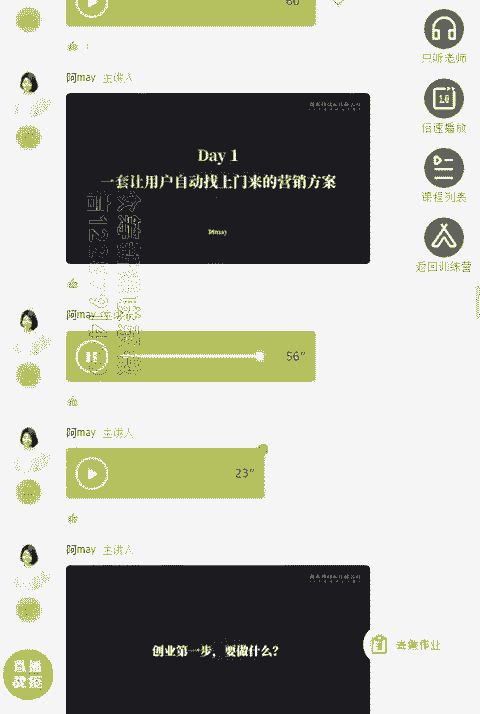

今天呢主要是跟大家去分享怎么去做线上的运营整体方案的。我会以我个人的自己的这个案例给大家去说明怎么去做整体的这个线上运营方案。但是呢在正式分享之前，我想问大家一个问题，你觉得创业的第一步要做什么？

我知道这次呢课程有很多呢是企业带着团队来学习的，有很多呢是个人来学习，希望提升自己的这个社群运营技巧和线上运营的整体能力。那我在我看来哈，要不的话，大家是企业的创业者，要不的话大家是个人的创业者。

你好好想一想，如果是你你觉得创业的第一步要做什么。

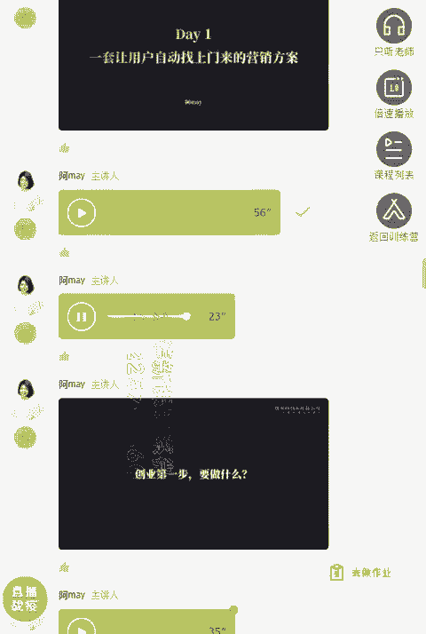

换一个角度呢，就是如果说你接手一个新的项目，如果要你变成运营负责人，你觉得第一步要做什么？好，我看到很多朋友都回复了，有的人觉得是定位，有的人是说要做好市场的分析，要做好规划，大家说的都有道理啊。

不过呢我有一个朋友跟我分享的。我觉得是猫，就给我的感觉就是一下子就开阔了，真是打开我的天窗，我的朋友叫昆龙，他跟我说，第第一步是先算好账，这是非常非常非常重要的。

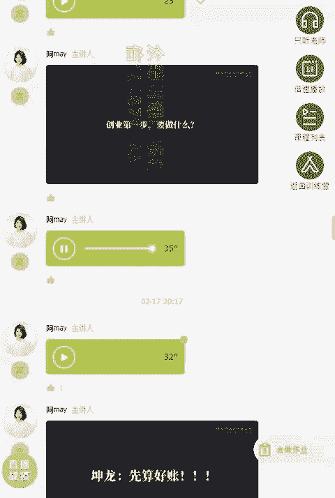

这是我踩过的一个大坑，就是我觉得定位肯定是非常非常重要的。但是呢你如果作为一个企业老板，你如果是要做创业的话，你创业的第一步，你要做什么，你肯定是要先算好账。我之前呢就觉得是需要做好用户的定位啊。

只要我提供价值，只要用户认可我，他肯定会过来找我，对吧？但是呢你创业很多人创业就是想要赚钱，就是想要变现。所以你首先要想好你怎么赚到钱，这一步真的是非常非常重要。

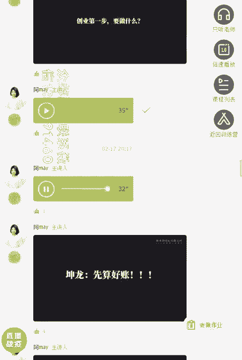

我之前在做群殴搭这个项目的时候，就因为没有做好这一步。我们之前定位什么都做好了，我们知道我们要做什么，但是呢就是没有算好账，没有想过怎么去赚钱。我们定位好了，我们目标客户，我们甚至于我们做了几场活动。

效果都特别好。很多用户找上门来，有很多人在用我们的小程序，但是没有算好账，没有很好的收入，没有办法覆盖团队的开支，就导致我我们一直都在烧钱，知道吧？所以没有入账，就会导致整个团队非常非常的艰难。

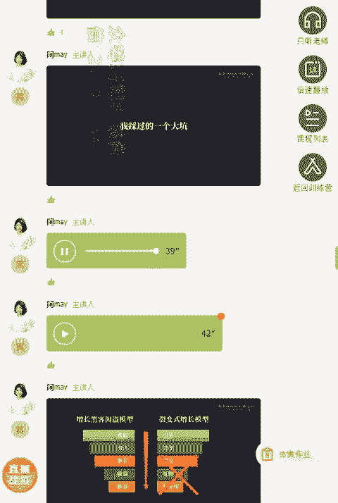

所以作为一个运营人员，我以前呢犯过一个最大的坑，就是总是把观点和这个注意力在获客上。但是呢没有把注意力回归到算账上，没有把注意力回归到成交上，这是最大最大的问题。还记得我之前呢给大家看了一篇文章吗？

我讲那个非常时期线上运营化的应对策略里面分享了一个模型叫裂变是增长模型，有四四步走，一个是引流裂变成交复购转介绍。你就会发现我在引流和裂变上面都做的很好了。但是就是因为没有算好账。

没有想好自己要卖的产品是什么，导致后面成交复购转介绍。这一个环节全部断掉。所以大家一定要算好账，怎么去算账呢？我给大家一条公式。假如说你自己规划，你创业了，你要一年挣100万，你要想一想你怎么做得到。

怎么去算这个账啊，有一条公式的这个公式就是很常见的销售额等于客户数乘以客单价乘以复购数。你就去算，假如说你要赚100万，你要获取多少个客户啊？当然这个公式有很多种变化的方式了。

比如说你可以获取1000个客户，每个客户给你100块，每个月呢给你这就算他每年给你复购呃10次。那这样的话就是1000个客户每年给你100块呃，给你一年付购10次就可以得到100万了。

那如果说是500个客户，那每个客户给你付就是100万。所以呢很多人把观点。很多人把观点都集中到获客上，但是呢没有想好我应该怎么把这个目标定下来，我应该定多少，怎么去拆分。

如果你只是把目标定户在啊无穷多的这流量上，没有想好后端要给他卖多少钱。他每个客单价是多少。怎么去做好复购，你就会发现你整个创业的项目就会非常非常的混乱。好，那通过刚才的分享。

大家发现了有一个非常非常重要的就是要设计好你的盈利模式，设计好你的产品体系。做。所以作为一个运营负责人，虽然说你不一定是自己是这个产品的这个呃这个产品的创始人，或者说是个团队的创始人。

但是呢你依然还是要去做好这个工作，就是设计好你的产品体系。怎么设计，有三个问题，大家一定要回答。那有一个定位核心三问呢，我觉得是非常好记的呃，定位的理论很多，我觉得这个呢是比较好记的，也比较容易理解。

我把它分享给大家，就是卖给谁，卖什么，怎么定怎么卖。那这三个问题，用专业一点的语言表述的是卖给谁，就是你的目标客户到底是谁。第二个卖什么，就是你的产品体系要设计好，你到底设计什么样的盈利模式定多少价格。

第三个呢，怎么卖，就是你的推广运营体系怎么去设计。因为呢有很多学员呢可能自己现在手头上没有项目，所以呢我也简单分享一下你怎么去设计你的产品体系。然后呢，在发现新项目的时候。

有哪些呃这个框架可以让你去快速抓住这个时代的红利。有一条企业的成功公式，不知道大家有没有听过这条公式啊，最近对我的影响特别特别大。这个公式是这么说的，成功的企业等于时代红利千位，加上好的战略。

百百位加好的组织，10位加好的管理个位。也就是说，如果你只是做好了好的管理和好的组织，但是前面时代红利和好的战略没有做好，那你这个成功的企业往往远远比不上别人，只是抓住了时代的红利。

因为是人家是千位级的，所以我们才说嘛，一定要抓住抓住风口是吧？或者说站在时代的红利上，比如说前前些年呃人口的红利，导致互联网这个居民不断的膨胀。所以呢那时候抓住微信，抓住淘宝人。

他就可以很快抓住这个红利，不一定是自己真的做好了，做对了什么，可能就是抓住了这个时代的红利，就就是成功了。但是呢现在呢不一样了，人口红利消失了。那还有哪些红利呢？如果你现在是处于想要发现新项目的时代呢。

我倒是可以建议大家多去看一看行业的报告，找到红利。然后呢接入这个红利里边自己去找方向，这样呢效果是比较好的。比如说在年度得到消税的中国财富报告里面就提到，现在整个中国。

它已经过去整个公中国在现在已经处于转型期了。未来呢会变成服务化服务业和城市化比较大的趋势。还有一些时代的红利。比如说人工机智能、5G时代的到来，它经济的带到来，还有在线教育，这些呢都是都是时代的红利。

如果你要发启动新项目，建议你就抓住这些时代红利去入入进入，肯定会比你进入其他的行业会更好的。另外呢就是可以选一些就是我记得有个高人说到哈，有一个永不过时的六六大赚钱的行业，就是这6个回答，女人怕变丑。

男人有需求，孩子要高分，老人要长寿，富人要服务，穷人要翻身。只要你针对这六大这个这个行业去去去做，也是永呃不会不会过时的，也是可以赚钱的，可以从这些方向去着手准备。好，那接下来我们继续往下看。

前面呢我们讲到就是企业赚做做创业最重要的一件事情，要算好账，要设计好你的产品体系。那到底怎么去设计呢。然后另外的话。企业做好产品体示之后呢，接下来就要做推广的运营。因为。最难最难的其实就是获客了。

对于很多很多人来说。霍客如果你能够有招生的能力，很多基就是你很多很多这个教育机构，如果你有招生的能力，你就比一般的机构要好活很多，是吧？所以你会发现现在好的教育机构并不是说你课程质量好。

而是你的招生能力好，你才能真的活下去，而且呢能够真的赚到钱。所以呢霍客在目前这个时代真的太重要太重要了。那到底怎么做呢？我给大家分享一下我的心得。今天呢就跟大家复盘一下。

我在做关推这个项目的整体的整个运营的方案是怎么设计出来的？希望呢能给到大家一个整体线上运营化的一个方案的启发。很多人呢现在已经了解到官推了，但是我想跟大家回归一下整个项目在刚开始启动的时候。

它是什么样的背景。官推呢是2019年1月份正式上线的。呃，在这之前呢，它是什么样的一个背景呢？之前呢这个工具呢是我们给喜马拉雅定制的一个工具，这个工具之前开发出来之后呢。

我们自己又拿这份工具做了一个活动，叫完全社群66。我们发现这个工具还可以。但是呢之前不是我们一直在做群殴单嘛。所以呢呃就没有去推这没怎么去推这个工具，所以当时就定这个价格定的很高。定也也不算是很高。

就因为我们当时候给别人定制开发嘛，程序员成本都在那里嘛，所以呢我们是2万块钱一套一个机构版。外加服务区域门域名等等费用呢。就只有少少数的那些大机构才会去选用。

很多一般的这个企业啊呃咨询到我们一问价格基本上都会退缩了。另外呢这个项目之前只有一份PPT的这个产品介绍资料。此外呢也没有专职的销售人员，这是整个项目之前的这个情况啊。

就是大家可以想而知第一个价格很高2万。第二呃，这个产品其实呃还没有正式的这个ss化只是给呃企业单独部署的。另外呢这个销售的资料，基本上没有这个PPT产品介绍呢，还是我抽空做出来的。

另外呢也没有配备专职的人员。这个呢就好像很多朋友呢就是在接别人的项目一样，会遇到很多很多的问题。我这个项目在在我手上，我大算把这个项目开发成一个正式的上线的产品的时候呢，我是怎么。可以看到哈。

就是如果是传统的做法，可能遇到了这样的问题的话，第一个肯定是要想办法怎么把产品卖出去，对吧？那2万块钱的产品就可能想到，因为现在啊只有少量这个大机构才能购买，那可能就是找大机构。

然后去找他们的联系方式去跟他推广是吧？传统的做法。第二种呢就是可能投广告，看能不能获取到线索，再用专职的销售去跟进。那但是呢这样的做法其实非常非常的慢。好，那来看一下我是怎么做的。

首先呢我们按照刚才我们说的定位三问法。首先第一个你要定位好这个产品要卖给谁，之前呢只有少量的机构才可以卖才可卖得起，对吧？那现在我要重新把这个产品重新去梳理了。那因因为之前呢我们定制这个产品的时候。

定制这个产品的时候呢，就是只是给这个在线的教育机构去使用的。所以呢就发现我们刚开始卖给谁，这个产品呢，基本上都是给喜马拉雅知乎啊这样的机构去购买。包括我们自己呢也也在使用。

但是呢你就会发现因为客单价的问题，就很多很多人无法购买。而且呢如果只是卖给在线的教育机构呢，你就会发现。我看到评论区好多人一直在问回复这个直播的问题，为什么不直播？我现在就是在直播呀。好。

我们继续啊呃就是。可能我们这次呢因为受限于设备问题，我们只能用语音直播的方式。我尽量的话就是看这个这个时间，然后呢控制好每段每段和每段都连续起来。好。

我们现在先来讲一讲官推这个产品本身是什么样的一个产品。因为很多朋友呢可能没有接触到。呃，这呢是一款分销的裂变工具，它其实是一个非常简单的切入点。呃，就是帮助这个教育，就是卖课程。

当初通过卖课程或卖社群呢，来用这款工具呢，效果就特别好。因为我们呢其实呢呃虽然是分销工具呢，我们我们改善了很多分销的功能。比如说传统的分销工具呢，就是你买了课程之后呢，就直接去听课了。

但官推这个呢就是你买了课程之后呢，它会引导建议呢引导加个人微信再进群里面，然后呢再去听课。另外呢如果你是直接卖社群的话，也就非常合适了。因为他直接就是让你购买之后呢，先加个人微信再进群。嗯。

另外呢这款工具呢它的分销裂变的功能呢其实要比一般的裂变工具呢多一个特殊点。比如说即是计时反馈这一点就是分销佣金是计时到账的。这一次的课程呢，可能有些朋友也体验到我们这次呃课程的售卖系统。

我们这个课程的售卖系统，实际上用的就是官推这个工工具。呃，如果是有参与我们这次的分销的话，应该就可以体验得到。但是如果只是定位为在线教育机构，我们其实遇到的竞争是非常非常剧烈的。

首先会有市面上会有小儿童千聊励枝微客这样的产品，他们已经有分销的功能。另外呢针对于呃就是这个客单价来说的话，比如说我们2万的客单价。这客单价来说，相应比一般的这个在线教育机构，他也不会支付得起。

如果只是说哎你就可这么一个功能切入就卖这么高的客单价的话，是很难很难说服大家的。所以呢我当初把整个产品的人群进行了重新定位。我不再去定位，仅仅是在线教育机构。

而是把它定位为想要用社群或者课程线下线下活动来获客的企业或个人。

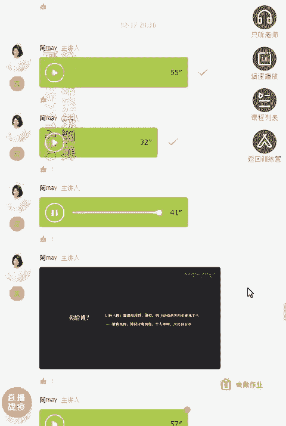

那么这一下定位下来的话，整个客整个人群它的范围就广了，他只不不会只是切在小小的一块小领域里面。他现在呢可以推给什么样的人群呢？

比如说在线的教育机构、线下的教育机构、知识付费的教育机构以及个人讲师以及大社群的群主。还有现在呢很多电商的微商的人群也在用我们这款工具。就是因为我把这个人群进行了调整，把它范围扩大了。否则的话。

像以前那种方式你去推广的话，你会面临着非常非常惨烈的战争竞争。所以卖给谁这一点就是定位人群这一点，大家一定要想好了，你卖给谁，一定要从他本身的需求出发。我们定位好我们的叫。

比如说我们定位好我们的官推分销工具。我们定位好并不只是一个工具，我给你是一套的解决方案，我给你的就是一套分销裂变解决方案。这样一来的话，他才可能把它的价值塑造开来。否则的话，如果只是卖一个工具。

你怎么可能跟其他那些工具系统进行竞争呢。

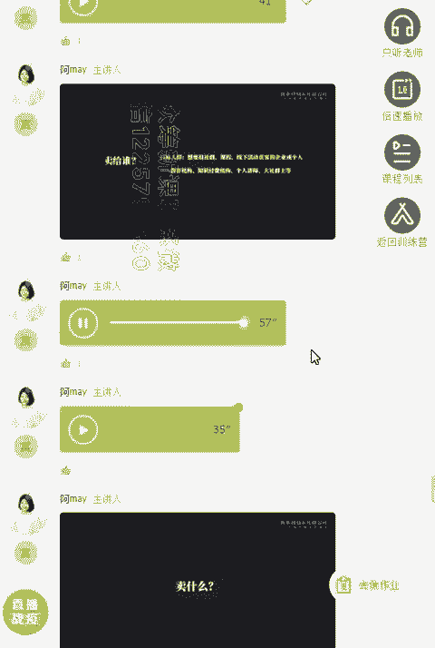

好，那我们继续来分享。那到底我卖的是什么呢？真的要只是卖这个2万的系统吗？像我们之前这套系统，以前是2万1块2万块钱一套的转化周期非常长，用户也非常少。现在呢有很多朋友找到我说哎。

我的产品的客单价比较高啊，几万块钱，你看一看怎么去做裂变。我真的会会跟你说，你这样的产品体系本身设计是不太合理的，真的是不太合理的。你要去想一想，除了2万块钱的产品。

还有没有前期的产品可以去做引流和转化。后续会没有有没有更好的产品去帮让用户帮你去转发分享转介绍和帮你去销售。所以呢我马上进行了整个产品体系的改造。我们来看一下哈整个产品体系可以去怎么去改造。

大家呢其实也在设计自己的产品体系的时候呢，也可以根据我这条方式，或者说我这个模型来设计。首先呢我认为正确的这个产品体系的设计，尤其是在运营这个体系里边，你一定要设计这样的产品。

比如说你公司本身的正常的产品的客单价是一个是是几百块钱或者几千块钱，我们定位为这样的产品叫消费产品。就客户真正跟你成交是这个产品。但是呢因为很多时候你的这个消费产品，或者说你客单价比较高的话。

很难客户一下子跟你成交。因为它会存在一个客单价高的产品的话，决策周期长，它就会存在着先要。先要获取线索，后面再跟进这么一个很长的环节。所以呢你要获取线索，前面你怎么去获取线索。

你就肯定要设计一个吸粉的产品，让客户先知道你了解到你，加到你，这就是获取线索了。这是吸粉的产品。第二个呢就是裂变的产品。就很多时候呢我们已经把客户引流到我们的这个流量池来了。但是呢引流到之后。

我其实还会去做一个动作，就是让他去帮我分享。就未必他马上就帮我马上去成交，成为我的客户。但是呢所有的流量我都会通过一次裂变的引导，让他去帮我去做分享。从而呢让更多更多的客户呢诱到我的流量池来。

所以呢整个逻辑，那就是你先设计一个吸粉的产品。然后呢再去设计一个裂变的产品，让用户可以快速帮你去做转转介绍和分享。嗯。好，那裂店的产品基本上呢就是低价的产品，或者说是需要有门槛才可以参与的产品。

这样的话用户会跟你建立了一定的信任了。然后建立一定的信任之后再去转消费的产品，正式消费的产品，这样的话它的转化率就会高很多。此外呢，转成消费产品之外呢，我在这个呃那个文章里面也告诉大家了。一般来说的话。

转化成消费产品之后还会再设计一个会员产品，让客户跟你长期去做绑定。比如说你设计一个呃他成为你的会员之后呢，他会存一笔钱在那你这里，每次消费呢，扣多少，他可以打个折之类的这样的一个会员产品。

让他跟你长期绑定关系。这样的话就是客户就会跟你长期产生互动，不容易被别人撬走。嗯。那成会员产品之后呢，还会去设计一个合伙人产品。我这设计合伙人产品就是为了方便客户帮我转介绍的。我们可以看到哈。

就是从客户的引流裂变、成交复购转介绍这五步骤来看。对应其实每一个步骤都要有对应的产品设计。很多产品呢其实是就是我们运营的负责人人来负设计出来的。我们可能是一个活动，有可能是呃一个资料包。

有可能是一个大礼包。这样的产品其实产品方案呢就是我们的运营人员来设计的。那在转介绍这里我多说一嘴啊，好多人呢觉得转介绍呢就是让客户直接去转介绍了。实际上你要设计两种类型的转介绍。一种呢就是他帮你转介绍。

他其实帮你就是为了推荐朋友来满足朋友的需求的这部分的转介绍。这部分的转介绍人员呢，他其实呢很很担心呃，就是他的朋友知道哎，他在分享的时候有有有这个好处。

所以呢这类的转介绍最重要是帮他的朋友和他获取呃优惠。第二呢就是真正那种以销售为目的，以赚钱为目的的这个转介绍。我们其实叫分销了。这部分的分销人员呢，就相当于我们以前说的呃加盟啊、招商啊，招商啊。

这部分的人员呢就叫呃就是呃分销体系设计。那分销体系设计，其实你就要设计分销的产品，我们叫做合伙人产品。好，那我们来看一下我是怎么去设计整个官推的呃55个产品的。首先我们来看一下吸粉的产品。

那从用户的角度来看哈，就是他怎么去关注到你。他为什么要关注你。所以呢我们其实设计的一个吸粉产品也很简单，就是有一个资料包。我整理了所有分销利店的整个复盘的方案，以及各个行业的方案。

就让大家关注一下我们公众号就可以获取这样的方案，所有的我们传递出去的所有的文章，我们都会带上这样的引导，吸引用户去关注我们的公众号。好，客户关注我们公众号之后呢，我们会再去做一个裂变的产品。

让客户帮我们转发去分享。好多人关注我们公众号之后呢，他就会获取我们的行业案例嘛，获取行业案例之后呢，我会在每一篇文章的前面，我会做一个裂变的产品，让客户引导客户回复关键词。那我们裂变产品我会设计几个。

比如说像我们的知识星球。呃，也是我们其中一个社群的产品，我就会作为裂变的产品来用。他可以通过任务宝裂变的方式，通过这样的方式邀请用户在关注我们的公众号。

现在我们就涨到15个关注好友才可以免费领取这样的一个入群门票。那另外呢还可以去呃设计一个资料包。比如说像我们在做分销裂变过程当中，有一个非常重要的是裂变海报。我们收集了1000张刷屏的裂变海报。

Yeah。收集了1000张刷屏的裂变海报，也是做成一个海报，让客户回复一个关键词，要邀请三位好友来扫码关注，才可以领取到这样的一个呃海报。此外呢，我还设计了一个这样的一个裂变产品。

就是我的14天分销裂变实操营，通过分销裂变的方案呢，让更多的这个客户去帮我们去转介绍和这个分销，从而呢带来更多的新客户进来。今天呢我没有跟大家去具体讲述我是怎么去做到这个裂变的方案的。

因为我们后面的课程里边，我会教大家怎么去设计自己的裂变体系，和怎么去设计自己的裂变方案。今天呢我更多是希望大家在整体的框架上面有个整体的认知。所以作为一个运营负责人，大家要注意了，前面让用户关注到你了。

你一定要接下来让用户帮你去做分享和裂变。否则的话这个词很难扩大。你每次都要辛辛苦苦自去引流的有多累呀，是吧？如果你能够让客户帮你转介绍，或者帮你去老带薪。你想一想，如果你能吸引到10个客户。

然到你的流量池里。如果这10个客户有5个客户可以帮你去转发。如果5个客户又可以给你带来三个用户，就是15位。15那15位客户又自动过来你的流量池里面。如果又是一半的人帮你去转介绍。

你就会发现整个链条就会很大很大。所以就是因为裂变这个概念呢，他可以通过一传十十传百百传千的这么一个概念，呃，而且有可以真正得到这样的效果，所以呢他这个威力是非常非常大，所以大家在正式的消费产品之前。

其实。一定要设计好。一定要设计好你的。引流产品以及你的裂变产品，否则的话，仅仅是让客户直接过来就买，你就可想而知，其中的流失力会非常大。因为你真正去转化这个转化成交率。

如果是几百块钱的产品转化成交率能够得到10%以内呃，十0以上都是非常厉害的转化率了。就算你投广告，投了一如果1块钱一个点击，点击100块100块，也就是100个客户过来，有10个人购买。

那是非常非常厉害的。但是基本上是不可能。所以我们做的一夜切的运营动作，尤其是日常的运营动作，我们都是希望客户帮我们转介绍，帮我们去转发，帮我们去做分享。

所以呢我们在前面的这个呃产品设计里边就要设计下这样的一个产品方案，这样的一个产品方案属于运营的产品方案。这个运营产品方案实际上是为了构建你整个产品自流量自增厂长体系所涉及到的。

所以这两个产品方案是非常非常重要的。好，那接下来呢我再去告诉大家，我整个消费的产品我怎么去做策划的？我们看一下官推整个产品呢，刚开始只有2万块钱的产品是吧？但是呢2万块钱一一下子从零成交到2万块太难了。

所以呢我其实从前面呢又设计了几个产品方案。第一个我设计了一个体验版，让所有的客户过来一注册就能用。但是呢我会抽取一定部分的手续费。另外呢就是设计一个平台版，让个人用户也可以用。但是呢功能会有一定的限制。

但是它价格相当于就比较轻民一点，2000块钱就能用。那相对于大部分的个人和企业来说都可以付得起，基本上呢也是这个成交率也会非常高。另外呢还设计一个专业版，就是从2000到2万，这个跨度太大了。

你就会发现有很多的人直接漏到2万的太难了。你就会发现，如果你从中就加一个两呃5000块钱的产品，有很多人以前呢想用2万的。想用2万的产品，但是呢他一直因为价格太高，一直犹豫不买。后面加了5000的产品。

毫不犹豫就买了。所以你就会发现整个产品的体系里边你要有几个价格，而且这个价格体系里边一定要有高中低。有一个呢一定是高价，在那里锚定的。这个高价本质上我们给到客户的服务是值这么多钱的。

但是呢它会影响就是有个高价和没高价的一个最大的区别，就是高价的产品它会影响下面就低价产品的成交。比如说有个高价产品在那里低价产品。如果说在同样的情况下去做对比的话，低价产品就会非常好卖。

那我们当初的会员产品呢是还没有做出来。呃，因为要绑定用户的长期消费，并且呢呃要跟客户长期去做交流和服务呢。我打算其实后面是用合伙人产品来代替。我们当初其实有呃设计了一个合伙人产品。

就是呃招募这个合伙人去帮我们去做分销推广。但是呢后面没有继续往外推。因为我发现合伙人产品不是把产品设计出来了，就可以了。一直你设计产品之后呢。别人真的交了钱，成为你的合伙人，最重要你是要给人家服务的。

而且呢真正要带大家一起赚钱。因为有很多人成为合伙人或者成为代理商，目的就是想赚钱。那怎么赚钱？很多人是没有这样的能力，或者说现在目前还没有这样的能力。所以呢你要去做培训。很多人问我，很多人找到我说，哎。

我想去招商招商，或者说自己在起盘一个社交电商的项目，希望可以快速起盘。我就问他，我说你准备呃这个呃招商过来的这个培训体系了吗？他说没有，那你怎么快速起盘呢？就是你要去招商。

你你不仅是要把这个产品给到他们，你还要教他们怎么去卖，怎么卖的好，而且还教他们怎么去招人，怎么去就是怎么去招他下面的代理这样这样一套体系，你去看一下，观察一下市面上做的好的这个项目。

他们整套体系都是非常完善的。如果没有这样的体系，再好的产品也很难做得起来。所以就算像呃小米油品啊，或者唯品会这样的一个大的企业，他要起盘社交电商的项目的时候，他们都会去找专业的操盘手来帮忙起盘。

因为这些专业的操盘手他有经验，包括整个培训体系怎么去设计，怎么去。我们简单一点说出俗一点，就是怎么拉人头怎么去设计，这些体系都是非常完善的。大家一定一定要记住，就是讲到这里啊。

就是我们整个产品体系大概的思路给大家去展示了。但是呢我一定要告诉大家的是，一定一定要设计一个客单价高的产品。因为我刚创业的时候啊，心里比较虚，总总觉得自己的服务什么的，我都比较虚嘛，不敢把价格设的太高。

后面你会发现其实你设高客单价之后呢，你会筛选一部分，真正这对这个产品有需求的。呃，真的是有钱人土豪。呃，他们就会愿意去购买。呃，往往一个高客单价抵得上你成交10个低客单价的用户。

所以呢呃有的时候呢你自己如果没有信心的话，一定要想办法就是怎么去把这个高客单价的产品去做出来。并且呢把对应的权益和服务做好。好，我们继续来分享。那这么具体怎么去搭整个运营的推广方案呢？

首先第一步就是要准备好呃弹药库。这个弹药库就是我们呃做成交时候需要用到的啊，这个是非常重要的，很多人呢一辈的在做前面的获客，但是没有把后端的弹药库准备好，你就会发现客户流量来了，但是承接不了，转化不了。

就很浪费。所以呢像我们这种产品呢客单价比较高的那就需要把提前把这个弹药库准备好。比如说像呃我们这样的产品一般来说呢需要销售去跟进的。

所以呢要准备好产品的PPT并且一定一定要去建立官网官网的重要性啊是来源于很多客户会去百度搜索。很多客户会去百度搜索，那你就会发现去百度搜索的话，如果没有找到你客户就会觉得哎你是不是一个小品牌。

是不是嗯这个这个是骗人的，但是会影响一部分你在微信里面宣传好好的人，他就会相信不会相信你。所以我其实建议大家都去做这个官网。呃，做官网其实不建议大家一下子掏那么多的钱去建立，可以去找一些模板。

我也有一些方法告诉大家，后面我会把这个方法都告诉大家。比如说怎么去快速建立一个官网。比如说快速建立官网，我们当初呃我们公司本身有程序员，我们让程序员去开发了。但是如果你没有包括个人的创业者。

怎么去建立官网呢，你可以用word这样的一个工具，通过模板工具，域名加这个服务器也就几百块钱就可以搞出来了。另外呢公众号是肯定要建立。

还有整个宣传和推广的文章也是要建立的整个客服客户的FAQ就是客户常见的疑问，方便客服快速应答的，以及客户的好评权威的推荐操作教程这些东西都准备好。尤其是一个新的产品。如果你要新上市的话。

前面如果你能够找到一些权威的人帮你去做推荐的话，整个效果是会好很多的。包括我们后面会去教大家怎么去策划一个裂变的活动，那确保策划策划裂变活动的时候，权威的推荐也是非常非常重要的。

权威的推荐会帮助大家快速拉高。你这个产品的level，并且取得很多客户的信任。因为新的品牌嘛，你新的品牌没有客户认知，但是权威很多人已经认知到了他的倍数会呃帮你提升你的这个权威性。好，我们继续来看。

那具体去哪里推广呢？客户从哪里来呢？我先给大家一个框架啊，这个框架呢是我获取流量的一个我觉得很好用的一个框架。我整体呢把整个流量的渠道呢，我们分为五大类。一大类呢是引引流量，就是在各大的平台。

把客户引到我们的这这个私域流量起来。第二个呢就是列列呢就是通过活动营销的方案去裂变这个用户。第三个呢就是买通过付费投放的方式去买客户。第四个呢就是换通过异业合作的方式呢，把客户换过来。

第五个呢就是转呃带就是通过老客户的方式转介绍带新客户进来。这五个方案呢，大家可以看一下整个推广的速度投入的成本和转化的这个速度，转化速度就是客户从接触到你到最后承担。

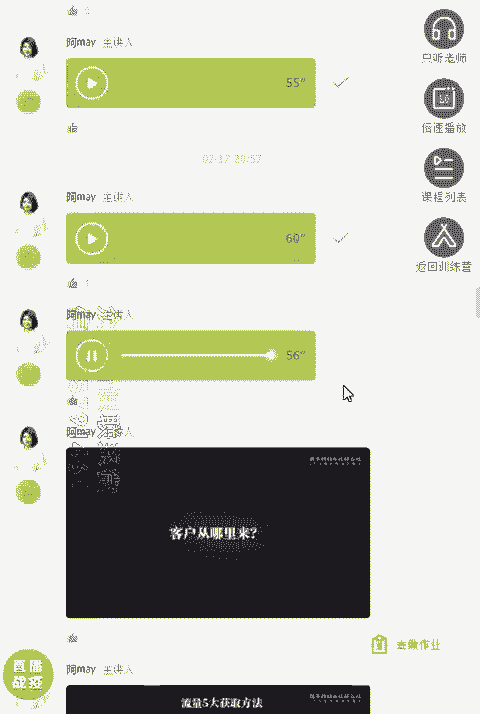

嗯。

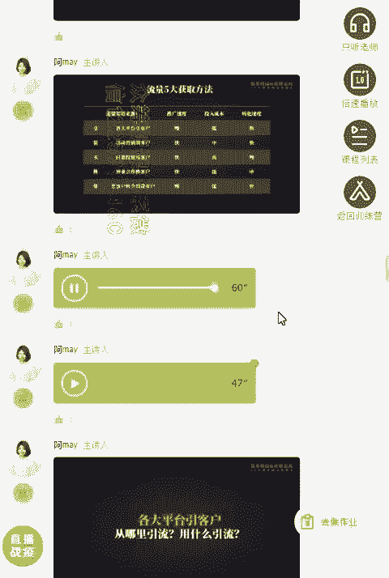

整个转化的速度。好，我们来看一下哈，基本上呢就是。从转化速度来看的话，就是通过引流裂变以及这个呃活动营销的话，还有老客户转介绍的话，转化速度是非常快的那从投入成本和这个推广速度转化速转转化速度来看的话。

整个我觉得整个方案里面比较中等的，就是通过活动营销来利变客户是比较快。并且呢整个投入成本呢算是比较中等啊，而且转化速度比较快。所以呢你会看到很多很多企业的运营人员，他其实最大的工作就是在做活动。好。

了解完这个流量的渠道之后呢，我们来看一下推广运营啊。呃推广运营呢，我其实就是按照这五步步五步骤来设计的，就是客户的整个生命周期，从引流裂变成交复购到转介绍整个五五步骤来设计的。

首先呢我们考虑到怎么去引流，从各大平台去引流客户。在那在哪里引流呢？用什么引流呢？其实这这这之前我有在分享啊，就是通过优质的内容从公益流量池引流到微信里啊。

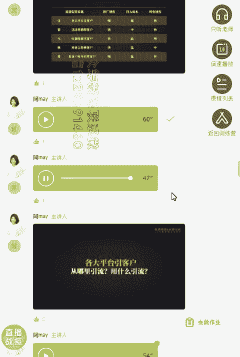

那优质的内容实际上不管你是做to B的企业也好，客单价低的这个呃产品也好，高客单价的产品也好。其实内容这一块渠道实实整个效果是非常非常好的。但是呢他需要长期的积累，不是一蹴而就的。

往往呢就是呃好的内容呢，它是可以给你带来很很多的长尾流量。呃，我举个例子说吧，像官推我一上线，我就开始去部署这个内容的分发渠道以及优质的内容去撰写了。呃，尤其是做我我做了7年to B产品。

这一点我是非常非常重视的。因为在to B领域里边，尤其是客单价高的产品，一定是通过内容吸引客户的。你通过其他的产品去吸引客户，其实是非常难转化的。我会发现内容产品一来呢，就是流量是基本上是客单价为0嘛。

居然是零流流零流零零成本投入是吧？就是人工投入而已，就是基本上不用付费去推广的。另外呢我们这个内容产品呢就是我们分发到各大平台之后呢，它会有一个长尾的搜索流量。

而且呢很多这个第三方的平台是非常欢迎优质的内容的，他还可以给你带量。我们来看一下具体会有哪些分发的平台。比如说微信体系里面，我们会有公众号、朋友圈、微信群。另外的话，假如说你的内容写的比较好的话。

还可以通过大号的方式，或者说行业平台去投稿来获取这个客户资源。还有呢就是我们可以常见的第三方的自媒体平台，比如说像微博、知乎、小红书、今日头条、一点资讯啊。

百家号、大于号这些自媒平台也是非常欢迎好优质的内容。因而且呢他还可以给你推荐好的流量。那当然如果你们内容的这个素材会有视频或者音频的话，也会有对应的分发渠道。

比如说像抖音、快手B站这些就是视频平台可以分发的渠道。还有音频平台呢，比如说喜马拉雅、亲亲FN、地JFN这些也是音频平台的分发渠道。另外的话在这里呢我想提一点。前提一点的就是搜索引擎S优化这一块。

好多人其实呃在做新媒体久之后可能就会非常忽略。但是呢其实SEO优化这一块在目前来说还是比较比较重要的。你会看到哈现在SEO优化。比如说你在这个呃知乎上去做这个优化的话，你会发现。

不仅你是百度上可以搜索到微信上也可以搜索得到。The。那搜索流量这一块给你带来的好处就是会有一部分已经有需求的用户通过搜索找到你。这样的话给你来的客户其实是非常精准的需求的。好，大家可以看一下。

我们当初是做了什么样的内容。比如说我们因为是工具类的产品嘛，所以呢非常注重客户案例以及案例的复盘。所以呢我会有大量这样的产品。另外呢会有这样的内容就是教程以及呢客户常问的问题。

我们之前说客户常问100答100万嘛，把100万做出了文章。然后呢到各大平台去分发。你在百度上搜索，可以看到像简书啊，B站呢，还有这个呃新浪博客啊这样的这个搜索，呃排名还是比较靠前的。

另外呢去通过建立这样的一个内容社区在官网建立内容社区就会领许很多用户对我们专业度的信赖。好的内容可以帮你去做长期的转化和这个成交。我们很多的客户其实就是因为看到我们很多优质的内容，然后相信我们专业度。

从而呢呃跟我们去做成交的。所以大家如果是做呃这个客单价高的产品的话，呃，尤其是做教育机构的话，其实内容是非常非常重要的。当然我有方法告诉大家怎么快速去做高质量的内容。这个我们在下面的分享我们会分享得到。

好，我们接下来继续来讲。好，前面呢通过内容来引流客户，但是呢比较慢啊，虽然说比较慢，但是呢因为效果非常久，他他做出一次的效果，他后面可以给你持续不断的带来客户。所以呢非常值得做。但是呢它属于就是重要。

但不紧急的。很多人会把重要不紧急的东西老是推后，我是建议大家每天做一点，每天做一点，你慢慢积累下来，你的内容库就建立起来了。另外呢一个非常快的方案就是做裂变活动了，就是通过活动呃营销的方式去裂变用户。

那到底选什么样的活动方式，用什么样的裂变方法呢？估计这个板块是大家非常关心的内容。因为我通过前期的了解，发现大家很多人都是在社群里面呃，希望通过学习这次课程学习怎么去把社群搭建起来是吧？

那你要搭建社群起来，你就要需要去想办法怎么把你的社群推广出去，怎么快速性引大量的这个精准的付费的，或者说呃愿意进入你社群的成员，所以呢怎么去通过策划这样的一个活动，快速裂变客户呢？

我我给大家举一些我们当初用的一个案例啊。比如说我们第第一次做的是用书籍的方式去获客的。呃，当初我在成立这个玩转社群链6的时候呢。刚开始是零基础零粉丝的一个品牌，完全是知名度为0。

所以呢我们当初策策划一个什么样的活动啊，就是你通过加我们的这个。啊，你通过扫我的海报，然后呢拉。当初是设计了拉5个好友关注，你就可以免费进入我们的一个社群。

这个社群呢就是帮你去拆解这个付费社群的一个社群。另外呢我还设计了一个二阶的任务。就是通过呃设计一个排行榜。如果你在规定的时间内，你拉好人的数量。在我们排行榜的前40名。

你就可以得到秋叶大叔清理签名的这个社群营销实战手册。一本就通过这样的书籍获客的方式呢，快速把第一批的用户给裂变起来。所以大家也可以想一想，就是如果说你自己的产品属于现在是知名度为呃比较低的。

或者说品牌还不够大，那你可不可以借名借势，可不可以借别人出名的产品，或者说别人出名的这个品牌，跟你去谈合，跟别人去谈合作。通过别人的名名去帮你去快速取得用户的信赖，快速把这个活动的事造起来。

好多人呢想搭社群，但是实际上不知道应该怎么设计社群，应该怎么去呃设计社群的权益。那刚才我这个思路就给大家一个思路哈。我们们当初策划的第一个社群是怎么一个社群啊。就是因为我们吸引要吸引运营圈的人。

社群是吸引想要去做社群运营的人。所以呢我们当初做的这个社群叫完转社群预6。他给到给到大家的服务是什么？就是去拆解市面上呃做的比较好的付费社群，这么一个服务已经够大家吸引了，已经够吸引大家了啊。

就是拆解服服务就可以了，就提供案例给到大家。好，这是一个思路。另外一个思路呢？

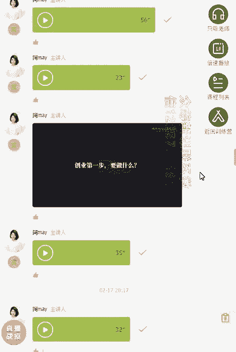

就是可以带大家一起去读书。因为呢。

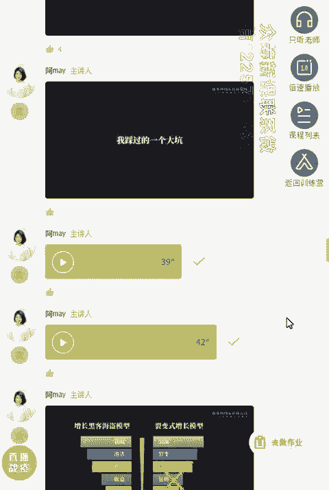

因为很多朋友加入社群，无非就三个需求。第一个获取资讯，他可以了解到最新的资讯，他会因为这个原因加入。第二个呢就是学习成长了。他想要在社群里面学习获取技能。第三个呢就是勾搭人脉，就链接人脉。

认识新的朋友啊，无非我我统计了那么多社群无非就这三个需求。那么这三个需求你可以围绕这三个需求来设计。前面呢我们提供案例，其实就是他想要了解学习成长的一部分。第二个呢也是可以从这个方面去设计的。

我当初呢设计另外一个社群，就是通过书籍加社群的方式去获客，怎么去获客呢，之前我们说送书是吧？但送书这个成本还是有点高哈。呃，虽然我们后面还是通过社群的费用给这个成本给覆盖的，收回来了。

但是成本还是有点高，而且呢还是比较麻烦嘛。

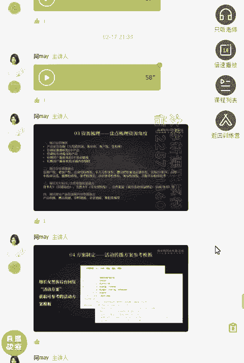

所以呢我们想设计一个虚拟的产品，不需要去邮寄的。我设计第二个社群呢就是通过打卡啊，共读打卡计划，就吸引这部分对社群有呃有兴趣的人，什么人。

就是对社群营销实战手册这本书感兴趣的人就是社群营销的相关的人这个目标用户，对吧？那这部分的用户，我们当初设计的第二个活动，就是通过书籍加社群的方式去获客。

那很快也是拢聚了一大批对这部分的这个共读打卡计划非常感兴趣的朋友。而且呢我们当初整个共读计划采取的也是重。呃，就重创模式啊，每每一个每一天的打卡计划都是有一位社群的朋友呃，带着大家一起去读书的。好。

第三种方案可以是什么呢？可以是资料包。那资料包的方式获客就是比如说你整理你这个行业里边就是大家都需要了一个资料。那这样的方式的话，也可以快速去获客。比如说我们当初就整理1个1000张裂变高准化海报。

而且我还告诉大家，刚开始的海报还不是我整理的，是我好朋友六六整理的。然后我跟他说，哎，我们的1000张裂变海报，可不可以拿来送我们的粉丝，他说可以，所以我们就直接可以把把他的这个呃资料过呃拿来设计。呃。

所以呢大家可以去去想一想，如果说你没有能力去做客，可不可以去做整整理这个资料包。你会发现资料包是会吸引一大批对这个资料感兴趣的。而而且如果说你挖的这个资料是真的是切痛大家的这个痛点的话。

其实要领的人还是蛮多的。就算你真正用到一些裂变的手段，好多人为了领这个资料包还是非常愿意的。而且呢我们做了这些活动啊，其实都是可以长期可持续性的去做的。也就说这样的活动方案一旦设计起来。他可以一直在跑。

他不会停。它不会像那个实物，或者说我们像我们这种实操营，它是有周期性的。过一次活动呢，就21天嘛，这21天过完之后，下面再想有人去加入的话就很难。但是呢像这种活动呢，他可以一直一直做。你做出来之后。

他一直都可以用。好，那刚才呢我说到社群，很多人加入社群目的就三个获取资讯，然后学习成长以及勾搭人脉，对吧？那只要你针对社群的这三个核心的需求去设计你的社群方案，其实都可以设计出来。我再举一个案例。

就是我们当初利用大家想要去勾搭人脉这么一个需求，我们设计一个玩转社群6资源对接群这么一个方案。呃，然后呢再通过分销历练这种方式去进行启动。呃，在我们当初启动量非常少的情况下。

在不到24小时内就有1万多名用户付费进群，整个公众号涨粉就8000多。其实呢呃我上面的这个活动怎么去做的，具体怎么去执行的。我在之前已经把我的复盘案例发给大家了。所以我今天其实没有想具。

所以我今天呢其实没有想把这个细节再次在这里重述了。大家呢再回去看一看我们当初发到群里面大家的阅读文章里边已经有具体的执行的方法。另外呢，除了建社群来获客之外呢，其实我还用了一个方案，就是课程。

我做了14天分销裂变实操营。实际上我们当初做这个分销裂变实操营的时候呢，我本质上一方面呢解决很多人使用工具不懂怎么去操作的问题。另外一方面呢，其实也是为了获取新客户。所以当初做了两期呃。

总共的付费学员有4000多人。我们通过这次实操营获取了很多很多的好评，并且呢大量的用户通过学习到我们这个方方案之后呢，自己真正掌握了，做出了很多很好的案例出来。

就会给我们带来了很多很多其他的很好的这个反馈，以及给我们带来了额外的惊喜。我们来看一下，通过社群的运营，我们得到了什么样的额外的惊喜。我上面所说的每一个方案，我其实都会拉群拉群去培育。

而且一般我不会随便解散群啊。因为很多人会觉得我群太多了，我没办法管理啊，一方面会觉得耗人力，第二方面会觉得大家在群里面打广告好烦啊，然后就把群解散了。其实我一般我不会解散。

而且呢我有一种呃有一些方案呢去运营社群的时候非常轻松，没有那么累啊，用的是第一个工具加人力的这个批量的运营。第二个呢会有一些就是社群运营的方案，后面我会告诉大家怎么运营省力省心。

但是呢我现在今天先告诉大家，我现在所建的这个所有的活动我都会建了群。那运营社群给我们带来真正的好处有哪些呢？第一个很明显的，大家听过我的课，听了我的课对我信赖度就会提升了。提升之后呢。

再去买我们的工具的话就非常简单。并且呢所有参加客户的人基本上都会注册我们的这个产品，然后去体验。第二个呢，很多很多的学员通过学习之后呢，他真正做出效果，他会在社群里面进行反馈。

他就给我们提供了用户的好评。呃，另外的话很多人做出的效果，也给我们提供了客户的案例。呃还有一些朋友呢，他在做这个操盘的过程当中，他还会去做复盘，我会引导他去做复盘。

这样又给我们提供了这个呃很好的这个宣传的文章。此外呢，这些社群的人员在群里面氛围特别好，而且我们经常也会去做一些分享。所以呢客户在这里边呢得到了非常好的学习，所以他会给我们带来转介绍。

所以呢通过运营社群都会。所以通过运营社群给我们带来什么好处啊？第一个，我们刚才说的所有的运营之前，我们要建立一个弹绕库，运营社群就是可以给你丰富的弹药库。而且你会发现后面在做社群运营。

或者说做私域流量运营的时候，非常非常重要的一个抓手就是内容。那内容到底哪里来呢？很多发你会发现很多这个微商啊，他就是因为有社群，否则的话他那些朋友圈的宣传的这个截图都不知道去哪里截。嗯。

因为他就是在社群里面经常会产生沟通和互动。并且这个沟通互动，很多时候呢就是有正面的效果。比如说用户的好评，夸你啊，称赞你啊。第二个的话，客户会告诉你呃，跟你反馈啊。

还有呢就是客户在你这个群给你建立的培养的关系，他就会愿意跟你长期购买。我你会发现呢很多ss工具商，他的销售人员只会跟别人介绍呃，这个工具是什么特点呃，怎么使用，但是呢不会真正去帮客户解决。

但是呢因为我们有了社群，我们就可以通过社群的方案给大家传递别人是怎么解决的，很快速的把我们这个呃客户的案例传递给所有人一下子呢就得到就一下子呢所有人都接收得到传递的效率非常非常高。

所以呢通过以上这些运营的方案和我们产品的整体的设计，现在整个官推的数据啊，它是可以说是发展非常快速的一个ss平台。比如说。现在我们已经服务了近万家的企业和个体了。好，那前面的案例已经分享完了。

正在收听你快联系微信客服1225791460进同步更新群，不更新群。那其实呢我通过层面的案例，我其实总结出一条非常好的一个方式，就是知识营销。知识营销这个方法呢，我发现他在培育用户上面有非常好的效果。

我给大家去展示一下，我觉得知识营销的整体的产品分类哈，就是他会有长图文、短图文的方式，还有音频、长视频、短视频问答、电子文档、社群课程、实体的产品及线下的活动。呃，代表产品都在左边都可以呃。

就是旁边都有看得到哈。很多传统的销售呢是主动去做销售，就是发硬广，或者说直接发业务的介绍。这情况呢一般会被带家业务。啊，可能你在群里面直接发硬广，或者说发你的业务介绍很快就被群主踢出去了。

或者让让你发红包。但是呢知识营销他的本质是被动吸引。啊，会懂知识营销的人，会把自己的营销内容化变成分享，变成干货就连他们自己的自我介绍都没有放过，都会变成你吸引他的一个钩子。只要你的内容是真的有价值的。

是名副其实的。观众也好，这个这个群主也好，都是欢迎你的，也是喜欢你的。所以你就会发现真正会做这个知识营销的人，他连自我介绍一发出来就会得到很多人的赞叹。在我们的群里面。

我们石操云的学员里面就有很多这样的人。那么好的知识营销就是好内容吗？就是做出好的干货吗？不是的，好的营销还需要有人设。啊，如果说在社交圈子里面，你没有去把人设打造出来，你就发现会是非常难卖产品。

因为在社交圈子里面，大家认的是人，人家看中的是你的长期的价值，也看中是朋友的关系。所以呢你自己要去想，如果你要想在社群里面做的好，或者说在私域流量史里面能够快速去做。转化你就需要把这2块都打造好。

一个是好的内容。第二个是好的人设。明天呃下一节课呢就会告诉大家怎么去做个人品牌的影响力和怎么去打造人设。另外呢，前面我去分享过我怎么去获客的，你会发现我获客其实并不是直接把我的产品直接拿来卖，对吧？

直接向外推广产品，你会发现直接推广产品特别难。因为别人会因为你推广产品直接推广硬管呃，厌恶你，而且呢也很难找到呃好的客户。因为。老客户呃，尤其是老客户不太愿意直接把你的产品直接分享出去。

而我们呢更多去把这个前端的利变产品和这个引流产品设计成知识营销。那而且呢好的知识营销基本上是收费的。像我的课程，我的社群基本上都是收费的。呃，虽然定价不高，但是呢他的确是赚钱的产品。

所以你就会发现别人去获客，其实是要花钱的，要付费投广告的，去呃求着别人帮忙转发的。但是呢我们的产品在前端去设计引流和裂变的时候，很多人是愿意帮我们去转发的。所以你会发现我们获客很多时候还是赚钱的。呃。

包括我之前做这个14天分销裂变实操营，每期虽然我收费不高，但是每一期都有那么多人来听，有几千人来听嘛。几千人来听，总结下来一场一场这个实操营下来，不仅呢很多人去呃购买我们官推的产品，转化成后续的客户。

另外呢还有大量的客户，就是购买我们的课程过程当中其实就已经赚钱的。而且呢知识营销最好的一点呢就是客户帮你转发的时候是非常非常愿意的。就是别人帮你转发这个面膜，到朋友圈，帮你推荐的时候。

会会觉得哎会不会让朋友觉得我们在做微商。但是呢别人帮你转发一个好的社群，或者说转发一个好的课程。他会觉得哎我是愿意的，不会让别人觉得我在上镜，我在。那么活动产品到底选什么形式比较好呢？

其实知行营销的产品，刚才我也发了有很多种形式是吧？呃，那其实普遍上来说的话，用的比较多，就是这三类啊课程社群资料包啊，以及一些实物的产品，说地图啊啊电子书啊、书籍啊等等啊。

基本上呢我觉得就是三类这三类呢，我来说一下分别说一下他们的这个优劣势哈。首先呃课程课程的产品呢，很多人都去用课程。但是呢会有一个问题，很多人呢选课的时候会担心自己有没有时间听课啊，他会会犹豫。

这是第一个。第二个会去考虑啊，这个课课程的老师怎么样，我有没有听过。第三个就是这个课程的质量怎么样讲的课程是不是我需要的，这三个是他最需要考虑的东西。第二呢就是资料包。那基本上资料包呢。

就是大家知道一一点击就可以获取嘛。但是呢基本上不会愿意为了资料包付太高的费用啊，这是一个特性。第三个就是社群嘛。呃，很多时候呢我我我一般会设计的产品就是社群和课程比较多。呃。

资料包呢一般会做引流吸粉产品用。那社群他有个好处是什么呢？他可以跟课课程比起来呢？社群呢他会有一个就是不不用担心说我有没有时间听的问题，很多人进入社群，我刚才说的就三个需求嘛。

所以他不会担心我有没有时间听，第二个呢，他不会去想，哎，这个社群有没有很多的干货，他会觉得哎我只要在进去里面认识那么多人，我就值得了，是吧？所以呢他会觉得我进入个社群。

如果能做这三个需求当中满足其中一个我就满意了。而且呢做社群和做课程两个困难度来说哈，就是社群其实比较比课程的困难度要低一点点的。因为开发一门课程真的很不容易啊。如果你真心自己去开发课程的话。

其实是有点难的，而且要把课程讲好啊，整个思路非常清晰还是非常难的，但是呢你去做一个社群，你可以通过链接资源的方式快速把这个社群产品做出来。比如说你自己会运营，那不一定会讲课。没关系啊。

你可以请一些好的老师跟你一起合作，然后呢，让他来做分享就可以了，对吧？所以呢搭建社群产品是比较快速的，而且呢也比较容易起量。很多人在购买的时候犹豫不会那么大。那但是课程和资料包呢，它的这个呃这个犹于。

这呃课程呢它会有益度比较大啊，除非他客单价比较低哈。社群呢也容易卖卖得了高价。那到底怎么去设计自己的运营方案呢？呃，给一个底层思路给大家，就是模仿加微创新。啊，市面上其实有很多人已经做的很好了。呃。

很多90%的运营方案，其实市面上有很多优秀的案例，可以直接拿来用的。所以呢你要学会站在巨人的肩膀上。呃，我有一条呃就是这个六步法啊。

这六步法其实后面还会持续去用的也就是你可以通过这六步去设计出你的线上运营方案出来。第一个就是拆解复盘。拆解复盘，把你。把你呃身边的这个营销的案例积累起来哦呃，去积累你的这个营销案例库。

你会得到很多很多营销的方法。像我呢就经常去拆解一些营销的案例。而且呢这次的这个星球会送给大家，我的星球里面已经积。我的心球里面已经积累了很多这样的营销案例，到时候呢大家都可以在里边找得到。

并且我们这次的课程团队，我们的助教们会把我们的这个呃各个行业的案例也会去整理一份，提供这个资料给到大家。第二个呢就是选择标杆了。就是我们看了很多的这个案例。另外呢大家要学会去拆解嘛。

把这个案例的这个细节拆解出来。比如说人家是怎么去设计主题的，针对哪些人群，然后呢，那边的路径是怎么设计的。对应的推广话术和推广的素材是怎么设计的，积累这样的案例库之后呢。

你就可以选择其中你觉得有一些可以直接拿来用的标杆。比如说你要做社群，那我就可以哎，是不是可以直接用我们完成社群内6的这两个社群的案例可以直接来来套用。比如说你就去拆解我们的整个呃案例。在我们。

去拆解我们怎么去做宣传的素材的。比如说我们宣传素材里边用到的有些权威的背书啊，还有整个呃价值的验证啊，还有我们的这个呃裂变的路径啊，都可以去模仿参考。呃，这些裂变路径大家实时都可以直接复用。

那怎么去找到我们这个行业的标杆呢？前期呢大家可以通过百度搜索的方式，或者说通过微信搜索的方式，还有呢淘宝购买的方式去搜索。呃，比如说你是一家母婴呃产品的企业，你想要用社群来作为引流的产品。

呃么首先你就要搜索市面上你这个行业内的社群复盘案例。你去找到优秀的标杆学习榜样。这样的话可以快速把方案做出来。第二个呢就是问你的用户呃，你可以去问一下你真正的用户问他呃，现在有没有进入哪些社群啊。

觉得哪些不错的啊，多问几个多问。如果你能够调研一个呃几十个几百个客户肯定会问到很多很多这样的渠道出来啊，这样的渠道一找到的话，你继续复盘和拆解别人的这个呃营销方案，就很快就可以积累到呃。

就是手头上就很多这个优秀的营销案例了。那例如你是做课程的，别想要用课程来作为引流的产品，那怎么去做呢？首先你就可以收集市面上所有同类的社群呃，课程参考他们的主题，有哪些卖点，或者主挡用户哪些痛点。

就比如说你可以去课程多的平台上找，比如说千聊啊，励志微客啊，小额通啊，这样一个课程里面找啊，可以根据销量来找。通过前面的拆解和复盘之后呢，你就会发现手头上已经积累了很多优秀的案例了。

另外呢你也找到对应的标杆了。接下来你就去梳理你手头上的资源。嗯，可以从以下的这个资源角度去进行梳理。比如说运营的现状啊，还有呢你自有的渠道的盘点。如果没有的话，自己要去着手准备去建立了。

还有就是你自己的呃整个公司的大V呀，或者说合作的资源进行盘点。啊，还有现有的产品资源以及内容的资源进行盘点，然后去从而去设计你的产品方案。那产品方案的模板也提供给到大家。在我的公众号后台回复活动方案。

可以获取到呃可以参考的活动方案模板。大家可以根据这个模板去设计你们的产品方案。嗯。呃，的确今天分享的时间特别长啊，可能很多朋友的确听的不太舒服哈，我自己也感觉特别不好呃，再次给大家道道歉了。呃。

下一节课我一定会提前准备好，然后呢尽快尽量的就是不要这么一段一段的发，尽量的话快速把它去把课程讲完，最重要的是让大家去掌握整体的思路。因为今天呢我主要是想从我操盘关推这个项目的整整个过程呢给大去梳理呃。

作为一个运营负责人，你可以从哪些角度去做你整个线上的运营方案。比如说很多人会不注重你整个产品的设计，尤其是运营负责人，他不一定是创始人，产品不一定是自己设计的。

你就会发现很多人直接拿公司的产品直接想推出去。😊，就没有很好的考虑到就是。的增长体系的搭建呃，你会发现我在整个搭建官推的整个产品的设计的时候，我其实是也就围绕着我们呃我们说的裂变式增长模型来做的。

就是引流裂变成交复购转介绍这五大步骤，然后呢好好去设计你的吸粉和裂变的产品，这只是运营负责人手头上可以去操作，而且是很多运营的负责人，最重要的工作之一。就比如说像你的产品呃，转化前期怎么去吸吸引用户。

那前期的吸引用户，就是需要用户。去关注到你，那你通过什么去关注到你呢？所以你在外面发布的所有的文章都需要留钩子，让用户去加到你。很多人呢就是发文章，你会发现很多人发文章根本没没有留钩子。

就觉得哎反正好像很多干货就发出去了。但是呢他没有留一点点钩子，让大家去关注你。这样的话就很多人看了文章，是有启发，有收获，有干货，但是呢他没有关注你。他只是觉得他阅读了一条很好的文章，他并没有认识你。

所以你就会发现非常的痛苦。就是你文章阅读量有了，但是粉丝量不高。是不是就说你在其他的平台，甚至有一些呃头条号啊，一推荐可能就是几万几十万的阅读量。但是真正加到你的粉丝数又有多少呢？

所以所有对外宣传的所有的素材都要留一个钩子，这个钩子就叫C粉的产品。那我一般呢这个钩子我会留资料包。因为呢资料包，它可以持续性的去做，它不不像那种活动型的产品。

你要实时关注资料包放在那你就可以一直在运转了。所以整理一个你现在的产品对客户非常有吸引力的一个资料包出来，让客户看了就想关注你。这样以后你所有对外发放的所有的文章，所有的内容其实都可以留下这样的钩子。

让别人来关注你哦。不管你是在知乎去进行回答，还是在头条号发文章，在简述上发文章，在公众号发文章，都要留这样钩子。因为我们说到我们其实最重要的就是把用户从公域流量池引流到我们的私域流量池里来。

所以吸粉的产品这个也是一定要设计的。好，第二个呢？就是告诉大家，整体过来，你为什么要去做裂变的产品。因为我们的消费产品往往让客户去转介绍的时候，是非常难的。你想想你的产品，尤其是客单价高的产品啊。

你能不能用一句话去介绍清楚。很难吧，你想想你的客户都不是你的专职销售人员，怎么可能。把你的产品说的清楚呢，很难啊。所以很多客户用了你的产品，并不是不想帮你转介绍，是真的很难转介绍。

我不知道怎么去介绍你的产品啊，尤其是一套方案的时候啊，所以呢像我我在做这个官推这个产品的时候，我就把其中一个点打的很准，就是分销裂变。你会发现像小儿通啊，还有千聊这样的产品。其实你给别人去介绍的时候。

你还很难去介绍的清楚。你肯定是拎其中一个功能点告诉大家，你用千聊可以直播课程，这样的话才可以介绍的清楚，对吧？你跟大家说，这是一个知识店铺，谁先谁明白啊，是吧？另外呢还要考虑到用户帮你转介绍的这个面子。

呃，很多产品就是让客户帮你转介绍的时候呢，尤其是让他帮你发朋友圈的时候，他心里是有障碍的。因为他心里会觉得哎，我帮你发这个朋友圈，我就是帮你打广告嘛。呃，这个朋友会不会觉得我在做微商，或者说我在做销售。

我在坑他，他会有这样的一个心理负担。所以一般呢这个消费的产品，你很难让别人帮你转介绍，也很难帮别人发朋友圈。呃，但是呢我一般呢会在前期设计一个知识产品来作为裂变的产品。

让别人帮我转发的时候转发我的知识产品。这样的话就是用户会比较容易帮我去做转呃，转发和分享。比如说我把我的实操营作为一个裂变的产品。那用户帮我去分享我的实操营的时候，他还是非常乐意的。

因为他会觉得我帮朋友推荐是帮他真正在帮朋友。另外的话，我推荐起来我不丢脸，对吧？你会发现不管是推荐社群还是推荐课程来说，他不会觉得丢。他不会觉得丢脸，而且很乐意帮你去转发。你就会发现其实用课程产品。

或者说用社群这样的一个知识产品去做裂变和做吸粉是非常容易的这也是我为什么一直倡导大家用知识营销这种方式去做获客的原因，其实并不仅仅说只有线上的和线下的教育机构才可以去做社群做课程。

其实其他的行业依然是可以做你的社群和课程的。因为你并不是靠社群和课程来赚钱的，你只是用来做裂变，做获客而已嘛。所以在做运营方案的过程当中，一定要考虑让客户帮你转介绍，让客户帮你自传播这一点哦。

这个是你的底层思维啊，只要你掌握了这个底层思维，你在以后设计方案的时候，加上这一点，实际上你的效果就会比之前不加要好很多很多。

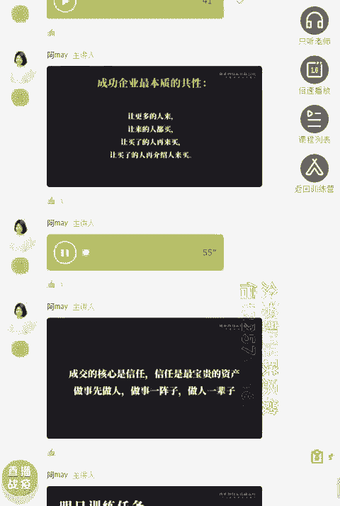

我认为最成功的企业，其本质的共性就是这4个让更多的人来，让来的人都买，要买了人再来买，要买了人再介绍人来买哦。

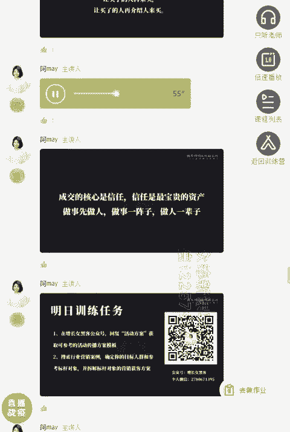

而且呢在整个成交的过程当中，我最最感悟最深的一点就是成交的核心其实是信任。信任呢就是你最宝贵的资产。呃，你不管是做任何生意。只要你是能够取得别人的信任，你往往就容易成功。所以呢在我看来啊。

就是做事像做人，做事是一阵子的，做人是一辈子，尤其是在现在的私域流量这个领域里边，人家加了你微信，其实就是跟你交朋友。所以你也想在私域流量池里面做生意。你就想要把你的人啊好好去做经营。

把你的信任好好去做经营。好，那今天晚上的分享呢就到这里结束了。明天呢是整个实操的任务呃。首先第一个呢，大家在呃我的公众号增长女黑客后台呢回复活动方案，获取可参考的活动传播方案模板。啊。

第二个呢给到大家一个非常重要的任务。就是搜索行业营销的案例，并且确定好你的目标人群和参考所标杆的对象，并且去拆解你的标杆对象的营销获客方案。呃，很多人其实应该没做过这一点啊。

就是很多人一直在外面获取方案，但是呢没有主动真正去做整理和搜索。我不知道你有没有参考的标杆对象。所以我要求大家明天一定要动起来，去把你行业的营销案例收集起来，并且确定好呃你的目纲呃标杆目标对象。

把他的营销获客方案进行拆解。那下节课呢我就会告诉大家。呃，如何去打造你的个人IP通过什么样的宣传方案，可以快速把个人的品牌影响力营造起来。因为我们说好的知识营销是好的人设加好的内容。好。

那今天晚上的分享就到这里结束了。呃，非常感谢大家。呃，因为呢这次的课程准备呢其实跟之前完全不一样。呃，我也是第一次去讲这种框架式的这个课程啊呃可能呢讲的方法呢，跟以前我专门去拆解案例课的时候不太一样。

所以大家听起来可能有点吃利，或者觉得我讲的时后呢比较零散。我也希望呢大家可以给我去提提呃，多提一些意见。呃，我我待会呢发一个调研表给到大家。大家呢根据这个调研表去填写一下。

下一节课呢就是具体的方法以及具体的案例了。呃，相信呢下节课呢会大家听的更舒服一点。😊，对了，大家如果有问题的话，也可以在直播间里面直接提出来，我会在直播间直接回答。

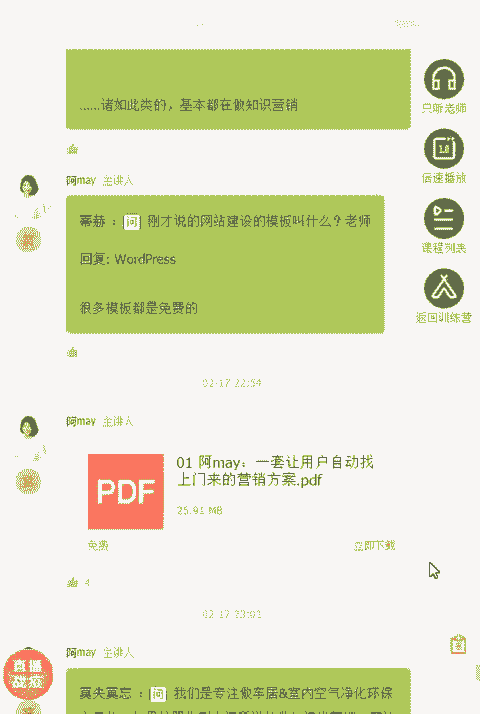