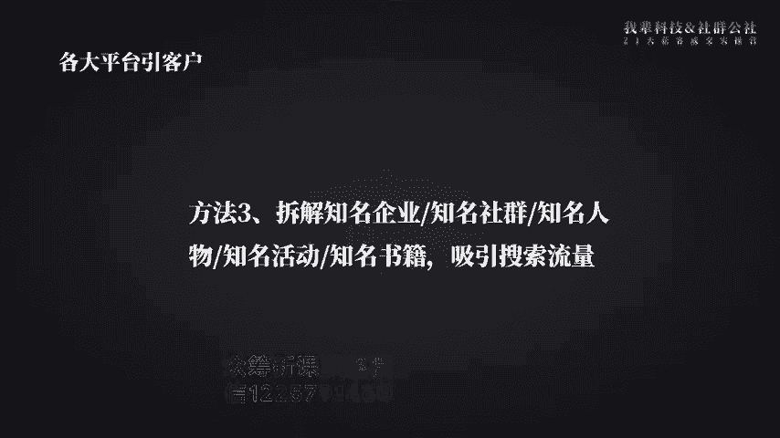
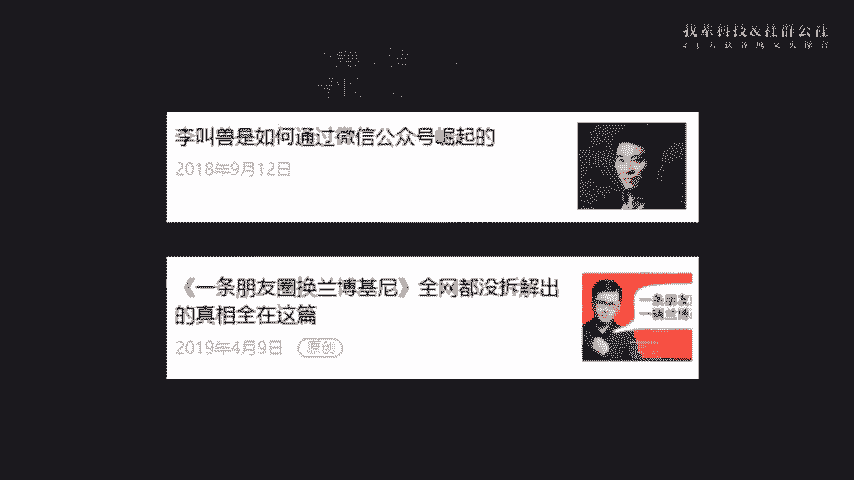
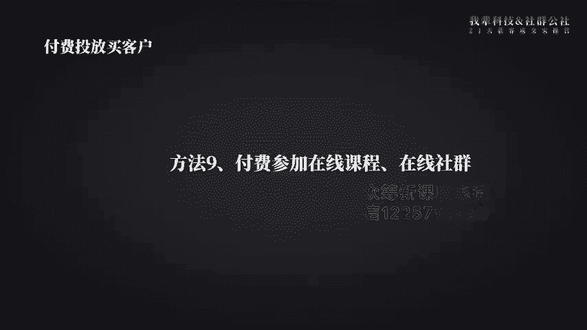
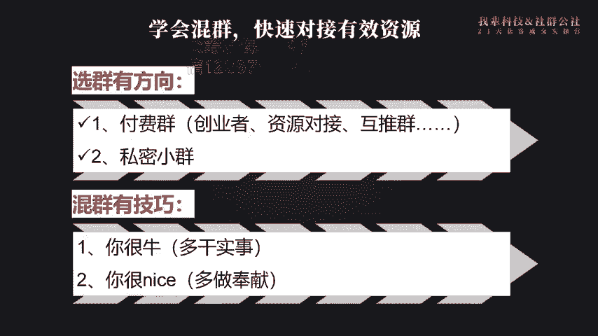
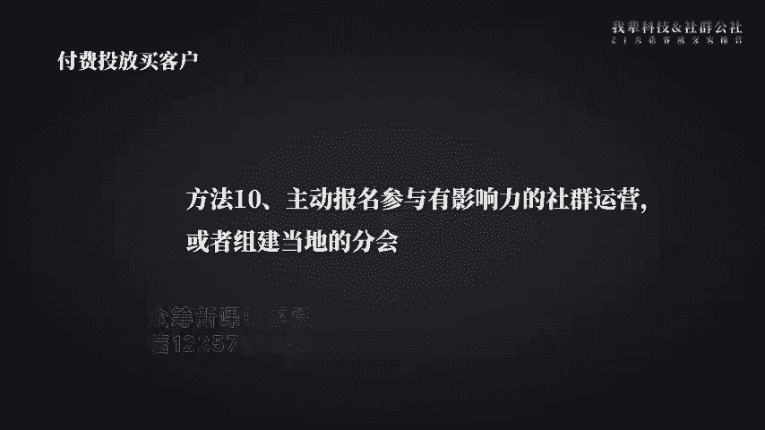
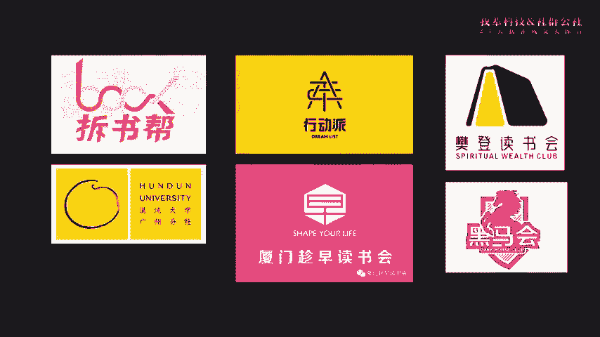
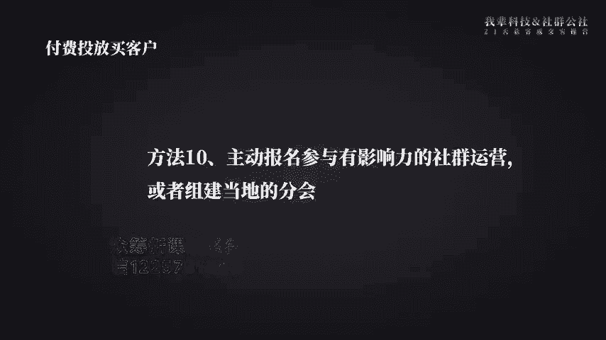
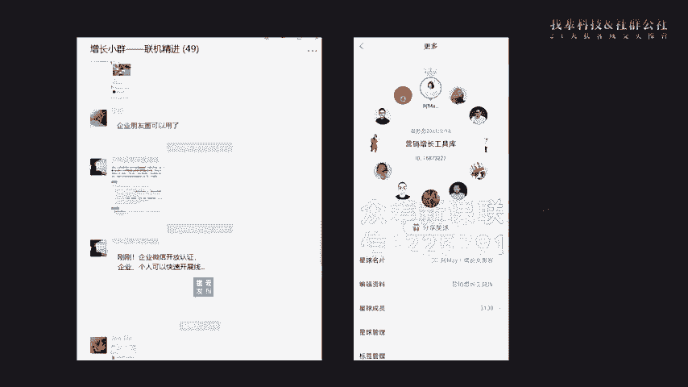
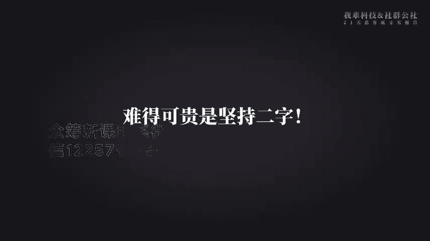

# 微社群裂变营销私域流量池增长秘籍创业运营销售获客视频课教程 合集 8套 374资料 13.1G 定位策略篇：一套让用户自动找上门来的营销方案 - P2：【Day03】IP打造篇：25个提高个人知名度的宣传方式 - 高端网创试错赚钱大师 - BV1tn4y1X7Sv

退了。怎么看就行。嗯。嘿，怎么没有没有反应啊，是不是有延时啊？好。没有反应哎，是不是设置有对对啊，已经开始了。对是对的，刷新一。刚刚才休习呢。你确定为那个什么东西都没问题吧？对是对的。

wifi接我用一上，上不了。家里为什么，我觉得好奇怪的画风蹭了邻居家的网。あかし。请向过。Oh。啊，我怎怎么回事？😊，真的好紧张。😊，你跟我说，两才开始了，你打开就可以了，别乱说话。🤧。嗯。

这个朋友看点下会直。🤧等我错。嗯。我要看呢。那肯定要看了。你这会不错呢？传了我把要声音传在一起。🤧。看。一分钟都不多，我怕我就呃，我这手机快没电了。你小心点啊，这个时间应该都不一定准的。从那个时开始。

我就40多。我是不是？佢是。诶。Oh。好。开始啦。hello，大家能听到我的声音了吗？听到的朋友，请在我们下方的评论区打666。听到了。hello，大家好，欢迎来到21天获客成交时操营的第三天。

我就是阿妹了。可能很多朋友还没有见过我呃，第一次用视频的方式跟大家见面了，能听到我的声音吗？声音能不能听得清楚啊？😊，差距太大了，是不脸太胖了，我也觉我也觉得上镜更不好看。😊。

那个电脑的那个摄像头完全没有任何美颜功能啊，在家养了20多天的猪啊，养的很胖。好，那我们就呃话不多说，马上进入我们正式的课程环节了。我切回PPT了啊。好，呃，我们先来复习一下我们上节课的内容吧。呃。

其实呢我给大家看了一份阅读材料，是我最己写的最近写的一篇文章，我说到就是最近这个现在的特殊时期呀，几乎所有的企业都要想办法把线上的业务呃，就是把业务线上化来构建好抵御风险的护城河。

因为风险永远都会存在的。我们现在遇到病毒的风险，不知道未来要会到什么样的风险。而且呢就算在平时运营过程当中，你下雪呀下雨呀还会遇到花天气的风险了。所以我们始终要做好抗风险的能力。所以以前没有做线上运营。

或者说有线上可交付业务的朋友，一定要想办法说在线上搭建你的销售渠道，以及想办法去搭建一个可以在线上就可以交付的业务。嗯，这样的话以后你再遇到线下业务暂停的问题，依然有线上的业务可以做嘛。

否则的话你抵御风险的能力就会很弱了。好，那经这这个整一21天的获客成交时超盈呢我们解决的问题就是要告诉大家线上怎么去做获客，在线上怎么去做成交。那么到底怎么做呢？

我们上节课讲到在计算销售额的时候有一条公式。销售额等于客户数乘以客单价乘以复购数。这不管在线上线下其实都是试用的那围绕的这个计算的公式啊，我们把客户的行为分为了这5步，第一步是引流。第二步是裂变。

第三步是成交。第四步是复购和最后一个转介绍。很多人都在找这个运营的框架以及运营的这个模型。我觉得大家其实不用去记那么多的框架，你只要去记住这个模型就够了。那我们后后面我们所给大家传递的运营动作。

其实都是围绕着这五步开展的那当你自己的鱼塘里面没有鱼的时候，那就去别人的鱼塘里面钓鱼。那别人怎么会去上钩呢？所以呢你要去准备对应的鱼饵。也就是说你在想要别人上钩的时候，你要设计好吸粉的产品。

那当你的客户来到你的鱼塘里被你吸引来了。如果这个时候你马上就会去做成交的话，因为成交这个客户到成交一定会有流失嘛。那你就会发现前端的引流的客户不够多的时候，直接去做成交。你会遇到流量枯竭的问题。

所以呢在新媒体里边，如果跟传统媒体相比的话，新媒体最大一个威力，就是每个人都是自带流量的。我们就建议大家呢让客户来到你的流量池之后，其实你要想办法让这些客户就可就去帮你去转转发和裂变。

从而呢帮你带来新的朋友。如果你能让每个人带帮你带来两位新的朋友，那你就10个用户可以变成30了。但是呢往往你想卖给他真正的产品，客户是不一定愿意马上帮你分享，帮你去转发的。

所以你一定要先知道什么样的内容，什么样的产品，客户愿意帮你去转发。比如说你是让他转发有好处啊，或者说转发出去，可以帮帮他去表达出他想说的话，或者可以提升他的形象。这样的内容，用户才会乐意帮你转发。

所以呢这个时候你要设计一款裂变产品，好样这些对你信任度还不够高的朋友，可以放开心扉，大胆的去帮你去做转发。那当你做到这一步的时候，你就会发现，慢慢的你的用户流量值就可以自增长了。

那当然我们目的最后我们要的是业绩增长。所以对我们来说，最重要是让客户成交。那但是很多人往往只有一款产品，没有设计用户复购的会员产品，或者说让客户帮你转介绍的合伙人产品。

就导致你还是得不断去做客户呃做流量。但是其实复购率比转化率更重要。80%的人现在每天都在里拉新，但是你忘记了复购率是同样重要的。影响业绩的三要素，就是我们刚才说的那个计算公式啊，客户数客单价购买数。

有如说复购数，这三个公式是非常非常重要的。我们运营动作其实都是围绕的三个动作来展开。那么我们常常见的那些消费品呢，它是永远不缺生意的。因为呢客户买了还要买，会一直去重复购买。

但是如果你是买烤箱啊或者洗衣机这样的一个产品就不一样了。可能客户买了一次，就又用了好几年，复购率就比较低呃，所以呢你要考虑说我除了买给客户烤箱之外，我还可以买什么产品给他。

可以让他从呃就是一直在我这里消费。总而言之呢，你与其花时间去拉新，呃，还不如想办法让一个客户帮你复购产品买的容易。因为你已经帮跟客户建立的这个信任的关系了嘛。此外呢还有很多朋友其没有意识到转介绍的价值。

就是因为用户其实如果跟你消费了很多款产品，跟你复购多次了，实际上他已经认可你了。那这么高的信任，如果你能够让他帮你去转介绍，把他对你的信任转介绍给他的朋友，那就是非常非常有效的。

而且呢这样的话就朋友是信为因为信赖他呃从而信赖你。这样的话成功率也会比较高，成本也会比较低。甚至是我们所说的成交路径比较短的一个方式。

当然我们后面呢还会有呃就是就是方法告诉大家怎么去让客户做复购和准介绍。在这里呢我就不详细说了。总而言之，只要大家做好以上五步，相信你的客户自循环体系就搭建起来了。那到底怎么去选吸粉的产品。

怎么去做利变的产品，怎么去设计利变的体系更合理呢？哦，上节课我给大家提供了一个思路，那就是模仿加微创性。微创新，当你自己没有思路的时候，看看别人是怎么做的。如果你要快速成为高手。

那最好的方式就是找高手学习嘛，看看别人是怎么引流产品，怎么去设计裂变活动的那我自己大部分操盘的活动，其实我都会找到对应的标杆参考对象。呃，当你自己也积累足够多的案例之外呢，之后呢。

你自己也会形成自己的方法论，有了自己的这个可以说是灵感源泉池嘛。所以当我给大家布置了第一个任务。就是一去拆解别人的运营案例。有不少同学是通过这两天的案例拆解。

找到了自己的标杆参考对象的那还有一些同学在群里面直接说，这次拆解真的受益匪浅，是吧？一下就打开了思路。我刚刚看了作业，这次活动一共有就是这次作业，一共有100多朋友都提交了。每个作业我都详细看了。

很多朋友都拆解的很棒。那今天呢我就挑选了三个不同行业的朋友的作业来进行点评。我们先来看一下第一个朋友的作业，这是微肖宝小站同学的呃作业哈。呃，大家可以在PPT上呃浏览一下作业的内容，我就不细读了。

他举的这个例子，我觉得是比较有意思的。呃，很多朋友呢自己去做线下餐饮的哈。呃他举的这个例子其实是在拆解一个自己本身可能并不是餐饮店的一家企业是吧？那他呢其实利用了资源整合的方式啊。

一方面呢整合了餐厅的这个礼品的资源啊，因为餐厅主要是想获客嘛，他可以帮助餐厅获客的话，餐厅是会愿意出样部分这个资源来作为获客的这个礼品的，所以呢他把所有这个热门的餐厅呃，好的这个产品呃。

用1元的这个价格拿到了。第二个呢。它的启动流量池也是通过这些餐厅来做快速的启动。所以我给我觉得就是这个案例呢给到大家有一个很好的参考对象。就比如说你自己本来要列本地的粉丝的话，你怎么去做啊。

就可以参考这样的一个案例。比如说你能不能整合你同就是本地的商家资源去做一个大的联合活动，要通过各商家的这个转发呃这个分享来作为启动量快速呢把本地的这个粉丝拢聚起来。嗯，而且我觉得小站同学他有一点呢。

就是还是比较不错的。他在分解整个活动过程当中，他不但是分。现在能听到声音吗？现在。我去哎，你重新推流，是不是前面录的东西录不了啊？やまたつの。现在可以了吗？现在可以了吗？可以了是吧，能听到声音了是吧？

好好，那我们继续往下哈，可能刚才稍微卡了一下。好。😊，好，这是呃小任同学的作业哈。呃其他呢我看到还有其他一些朋友也在拆解线下的餐饮案例的。我相信通过大家的群测群力，我们可以建立一个各行各业的案例库。

当然我自己其实本身也收集很多这样的案例。后面呢我们会把这些案例呢全部分享给大家。那让大家呢拥有更多的案例的思路呢，这样的话就是方式会更呃就是让大家有这样的案例。当你积累这个这个资源和思路特别多的时候。

后面你去做裂变活动的时候，你会发现有特别好的效果。现在还卡吗？现在还卡吗？现在不卡了是吧？好的。好，我们继续来看第二个同学的案例啊。第二个同学是乔静祥同学拆解的，他拆解的他选的这个案例。

我自己之前也拆选过，就是超常规营销。其实超常规营销，我觉得他有一点做的特别好，就是他的产品体系规划做特别好，就包括他的入门产品啊，他其实除了这个小课之外。

他还有很好的这个呃资料包以及这个文章这些东西都都都都很好。而且呢他的历练产品也做的特别的多。包括呃这个呃乔同学拆解到了这个298的创业团的成成员的这个产品是吧？另外其实还有很多我自己拆解过，晚一点的话。

我把我拆解的这个思路也分享给大家。我的乔同学选的这个案例特别特别值得大家去拆解。因为呃尤其是我们呢呃的整个同学群里面有很多都是做教育的。那么做教育的话。

其实你会发现在教育机构里面其实有很多这样的经典案例。呃，在做裂变的这个活动里边有很多很多做教育机构的那个案例。所以我给到大家一个参参考啊。就是有几个机构大家记一下这个名单是非常值得大家去做拆解的。

第一个就是桥同学列举的这个超常规营销。第二个呢是深度处网，深度处网这家公司据说转介绍做的特别好。呃，尤其是他让每一个员工向每一个每一个客户都要求帮忙转介绍这一点执行做的很到位。然后呢。

长头学堂长头学堂的整个运营的社群，他的整个运营体系搭建特别好。所以建议大家去拆解。而且我们其实也拆解过很详细，有很详细的资料，大家在星球里面可以搜得到的。另外的话还有微秒商学院。

微秒商学院在前端的裂变引流方面做的特别好做的特别好。啊，还有那个斑马英语，斑马英语其实现在在做抖音投放做的特别多的样式，我经常在抖音上刷到他们啊，这几个机构大家都可以好好去做拆解。

尤其做线上教育的这个朋友啊，是非常值得去拆解的。还有一个公司大家也可以去拆解，叫橘子会哦，橘子会专门教社群营销的。好，那第三个案例呢是一个做to B的一个企业的案例。思源同学呢拆解了牛商网的案例。

这是一个非常典型的知识营销的案例。呃，因为。牛沙网后端推的那个产品叫呃头牌客单价一般是比较高的。因为我是比较了解牛沙网。我你呃我是呃牛沙网是我呃钱东家哈，它后面的那个建站的产品。

小程序的产品都是客单价几万块钱的，所以客单价非常高。所以我们常用的那个方式，前端都会设计一个低价的引流产品。一般呢都是采取课程的方式课程的方式呃来做这个课这个刚才我看到评论区说打几个机构的名字。

等待会儿我呃唉我看到有朋友去去去打出来了，晚一点我补充哈，因为我现在今天准备的内容比较多，我们继续往下讲啊。就是你会发现客单价比较高的产品，尤其是呃你的客户对象是企业，或者说客单价比较高的产品。

你一定要去做知识营销，这是非常非常重要的呃，你如果没有前期的知识营销的产品，你很难让客户一下子给你买几万块钱的产品是吧？这通常呢需要比较长时间的培育的。呃，那往往呢就是这样的培育过程。

用教育这种方式来实现是非常有效的。啊，就是大家可以看一下牛双网这个分析的产品，它其实这一次响应速度比较快，因为我们就是疫情之下公开课的方式来让用户来进行呃进群，然后转发分享啊，同时获得听课的资格啊。

后面呢再去做转化。大家呃我觉得就是思源同学，你可以在在这个案例过程当中，除了去拆解它前端的引流，你一定要去拆解它是怎么去做转化的。就是客户进了群之后，很多人其实前端这一步都做了。

但是呢后端的这个转化怎么去做转化没做好。所以后端的转化的整个流程，你最好把这个流程和话术都拆下来，这样效果还会比较好。好看吗好看吗？现在能听得清楚吗？听不清楚啊。听得清楚吗？听得清楚吗？听得清楚吗？

很卡吗？可以是吧，那可能有些同学的网络效果一般，有些同学的网络呃，这个可能不是很好。那我建议大家如果卡住的话，刷新一下啊，卡住的话刷新一下，可能就会比较好了。好，那我们今天的作业点评。

我就选择三位同学的作业，其他的作业呢？就是如果说你自己还有什么问题的话，都可以在群里面直接提出。我和齐杰，还有助教们都在群里啊。我们的同学有很多藏龙卧虎的，也可以给到你解答啊。

有什么问题可以在群里面直接提出哈。好，那我们正式开始今天的课程分享。那我们刚才讲到啊，对于一个新项目来说，首要是引流，不管你做任何的活动，都需要有基础的流量，尤其是在微信体系里。

如果没有种子用户帮你去转发分享。你做再好的活动策划，也很难传播出去，是吧？那到底怎么样具体是积累种子用户呢？如何才能让用户源源不断的找到你呢。今天我就给大家分享25个，可以快速提升知名度。

以及可以帮你去做引流的方式，帮助大家去提升你的整个品牌的影响力。我将会从以下三个方面给大去做分享。第一趴为什么要去做个人品牌？第二趴这个个人品牌核心的三要素。第三趴是25个提高知名度的宣传方式。

那为什么要去做个人品牌啊？流量池作者杨飞有个观点，我是非常认可的。他说，从流量池的角度来看，做品品牌不仅是心智的占领和信任背书，而且品牌本身就是非常巨大的流量池，而且是非常稳定的流量池。因为你有了品牌。

别人会被你吸引。所以呢就算你不是BAT这么大级别的流量。呃，但但是你往往一个企业，甚至一个个人来说，只要你有了一定的品牌影响力。呃，就是这个就可以全源源不断的有用户找到你啊，然后找到你合作。呃。

就比如说现在很很热的这些网红啊，他们的微博下面总是有很多粉丝去回复他，走到哪里都是牵呼后拥的，是吧？做一场直播就可以收到十几万的礼品啊，一点八卦就能上大号的头条，甚至于刷屏整个朋友圈哈。

他们整这些网红巨大的流量就来源于两个方面，一方面呢是关注。另外一方面呢是粉丝。那对于企业来说，关注就是关注力的经济就是商机，也就是大量的免费的流量的涌入。

你看呃小米的雷军锤子的罗永浩为什么坚持用新品发布会来为产品站台啊？而且呢雷军还经常做出are youOK这样的这个炒作噱头是吧？实际上是用个人的方式来引发公众对产品的关注。呃。

因为关注可能并没有倾向性的。有可能呢有些用户呢是比较关注你的产品。但是呢有些用户可能就是想看一下你的八卦新闻或者负面信息。所以呢我们来说啊就是呃为什么要去做个人品牌啊，是因为。

如果你只是打企业的品牌的话，你会发现产品是死的，你很难去塑造太多的八卦的内容，或者说呃就是你其他的一些衍生的内容。但是呢人是活的，人除了这个工作之外，还有很多生活的经历，他的故事啊，这些内容可以撰写。

那从流量的角度来说的话，就是用户往往会关注人呃非关注产品，所以呢你去做个人品牌会更有利于你这个企业的品牌的打造。而且现在你会看得到在知名的那些企业基本上都会有比较响亮的个人IP比如说张小龙是吧？

比如说马云哈呃，还有雷军啊这样的就是都会有一个明星的企业IP站在那里。大家往往是关注企业IP关注这个打造出来的企业家说的话，呃，往往他说的一句话，未必跟他的产品本身挂钩。但是呢他就可以风靡整个网络。

那么品牌对于企业的价值在于就是心智的占领，提高提高信信任。而，对于个人来说哈，就是很多朋友会觉得哎我自己是做一个普通人，我又不是要出名啊，我为什么要去做个人品牌啊。实际上呢就是对你个人来说。

你不管是在一家公司工作还是自己出来自己创业啊，你有了个人品牌，跟没有个人品牌，最重要的一区别是在于有个人品牌的人，他会更容易得到别人的信任。而且呢很容易得到更多的资源，可以提升自己的圈子。

你会发现我自己就是深有体会啊。我自己呢呃以前打工的时候呢，就是没有做个人品牌的这个这么一个意识。以前呢？客户找我，我很害怕，因为我以前一直在做市场嘛，做品牌嘛，也就是基本上是呃我我不是做售后的。

所以我很害怕客户找我，客户找我一定会问问题，我就很烦，所以呢我基本上微信我都不会通过客户的这个微信的。当我刚出来的时候创业的时候，我的微信才几百人。这很少很少。但是呢我听了阿河的私房客。

他给我一个非常大的一个启发。就是人呢一定要做有积累的事情啊，就是你今天在这家企业打工。如果你没有个人品牌，你面临找工作呢，你还得重新去投简历，你要靠面试不断的面试才可以找到新的工作机会。

但是如果你有个人品牌，或者说有一一定的粉丝量，有别人认知，你觉得你很靠谱，愿意帮你做推荐的话，你可能再去找工作，你不需要再去投简历了。别人会抢着要。来要你就好比如说如果我现在放出说我我我去呃我我自由了。

然后呢呃我我想找一份工作，肯定很多人愿意给帮我去做推荐是吧？是因为很多人已经认识到我的能力了。那么对个人来说也是如此，就是第一方面，你自己在职业发展道路上面，你自己要考虑清楚。人到了5年。

如果5年就是一个台阶。如果5年还得靠简历平台去投简历的话，那就很辛苦啊。而且呢就是人超过35岁之后，你会发现也是一个台阶，也是一个门槛。如果你想不断的跃升，你就得让你的价值被更多的人知道啊。

那你什么样的价值被哪些人知道呢？这就是你定位最重要的问题，就是你要去想清楚我给别人呈现的是什么样的一个印象啊，是靠谱的印象，擅长什么呃，别人愿意推荐我什么，这个就是非常非常重要的。好。那。

那我们继续来说哈，就是认知到品牌对个人的核心重要性啊，我觉得有一点呢，就是大家一定要记得，就是做不管是做就是做企业也好，做个人也好，品牌是可以产生复利的。就是呃你你如果只是做一个活动。

没有打响一个品牌的话，别人没记住你。你可能留下东西太少了，那后面你还得再去做这样的活动。但是呢如果别人能记住你，下次呢他会愿意帮你去做推荐。因为这次已经跟你打过交道嘛，有一有一有一定的信任度嘛。

所以巴菲特有句话就说人生就像滚雪球，你只要找到湿的血和很长的坡道，雪球就会越滚越大。呃，大家一定要去做有能够产生富力的事情。我们说一份付出换来一份收获，这是很多人的商业认知嘛。

实际上呢呃你的这个时间和精力是有天花板的。所以呢你如果能够做一些可以产生复利的事情，它会越积越大啊，越累积越大啊。所以呢呃你要去做一个可以产生持续效果的事情呢，最好的事情，就是做你的个人品牌。

这相当于是改变了我整个事业的轨迹，这个认知非常非常的重要啊。所以选择比努力更重要。以前我觉得我自己能力也很好啊，但是没有人知道啊，所以你选择就很少嘛，你可能会面临着啊工作薪酬并不高啊。

然后呢呃就是领导还各种就批评你，你又不敢吭声，害怕被炒，是吧？但是呢当你呃有了个人品牌之后呢，呃你的选择就会更多了。呃，而且呢就是可能看到的世界都不一样啊，你选择你进入了圈子也不一样。

所以选择真的是比努力更重要的。呃，从现在开始一个人就是一家公司，你要经营公司一样去经营自己啊。那怎么去做个人品牌呢？我觉得个人品牌核心就有3点。就回答这三个问题。第一个呃，你是谁？第二个你有什么案例？

第三个何以见得，就是呃你怎么证明你说的是真的呢？真的是这样吗？有没有呃人呃帮你推荐，或者说有没有呃你说的案例有没有证明证明的材料，就是。打造这三点，你就可以很快的把你这个个人品牌传递出去。好。

那么其实个人品牌有一点非常非常重要的就是你的个人标签呃，个人标签。其实我觉得第一个是你的这个title啊。第二个的话其实是你的名字，一个好的名字，其实能够为你节省100万的广告费哈。

就是我其实很早就开始做个人公众号了。我之前的公众号叫增长说SEO不知道有没有我以前的粉丝哈。后面呢我又把它改成增值运营笔记，但是我其实在做这两个呃名就是都是同一个公众号。这个公众号我做两年。

粉丝只有几百人，很少很少，是因为我真的是没有找到很好的定位，就是没有找到一个精准的标签。所以说我也发了文章，但是呢实际上呢没有人记得住你，或者说记得住你，但是呢没有给你传播开去。

直到后面我找到了我的增长女黑客这么个定位之后呢，才开始爆发的。所以一个好名字真的可以为你节省100万的广告费啊，打造个人品牌最好的切入点就是浓缩成个人标签去传播啊，在注意力的稀缺的时代。

如果你不自己给自己贴标签的，别人根本没有义务记得你的。回忆起来也是这个面目模糊的这个陌生人。所以呢如果你能够很快便接记住呢，下次还有什么事的话，就可以记得找你哦。我认为个人标签三个非常基本的原则。

第一个是单点聚焦。第二个是简短。第三个是迅速记住啊，你要设计一个非常有辨识力的这个个人标签。啊，比如说如果你是公司特别知名。当然你的企业就可以帮你去做背书了。你可以用企业家职位的方式帮你去做背书。

那如果你的企业并不知名，或者说在比较跨行的这个社交领域，你就可以用你的能力去做标签，要么别人瞬间就知道你可以为他做什么啊，那对大部分人来说，业务标签是更容易产生链接的。比如说你能够提供什么样的业务啊。

服务的特点是什么啊。有4个问题可以帮大快速检测你的名字是不是一个好名字啊，包括你的个人标签。啊，这四个问题我其实是踩过坑的。像我阿妹，我就觉得不是好名字。第一个我讲阿妹的时候，别人不是一下子就写出来的。

不知道是英英文和中文相结合的。其实我刚开始的还不是中文加英文，我是那个MA呀。AAM。AMAY那个，但是呢很多我发现很多中国人根本就对英文无感，所以我们才改，我后面才改成MA的。

第二个的话就是这个搜狗输入法可不会直接打出来。第三个的话就是输入你这个名字的时候，你需不需要切换键盘，我这个名字就很不好，对不对？需要切换键盘啊，我幸好还有个真长女黑客，这个tt还是比较有意记的。

第四个的话也是我犯的一个大坑，就是别人收你这个名字的话，是不是只有你而会出现更多人。如果只有你一个辨识度的话，就是你的名字是比较独特的话，你就很容易打造出你的个人品牌宣出来。

因为在网络上很容易搜到跟你相关的内容嘛，那跟名字同步的，还有你的各品牌昵称啊，啊域名啊、商标啊，这些也是如此。包括你去想一个项目的品牌名字的时候也是如此。如果你的名字已经有很多人起过了。

那你去打的时候就很难打。嗯。稍等一下啊，我要切下一页PPT了，稍等一下啊，看这个直播。还不是特别熟练。其实这两天我们一直都在测试，唉，下面的那个PPT怎么没有了？大家稍等一下啊。这PPD没有了。

怎么又回到了第一第一页？好，因为我们今天的内容更多是想告诉大家具体的推广方案。所以呢怎么去做自己的个人品牌这些东西呢，我我自己我觉得我自己也不是特别的专业，所以呢建议大家呢去找相关的资料。

或者去呃就是去阅读这样的一个书籍啊，最快的方式呃，最系统的方式还去学习这样这样的书籍会更好。我呢更多呢是从推广角度告诉大家应该去哪些品牌去做引流哪些平台去做宣传，怎么去做宣传效果更好。

这些角度呢给大家去做分享。所以呢我准备了25条这样的一个宣传渠道。呃，从我个人的这个实际操作案例给大家去做分享的。啊，我们稍等一下下现在的那个PPT的内容稍微有一点点问题。嗯。现在大家都能听得清楚吗？

能听得清楚吗能听得清楚吗？哎，能听得清楚的朋友。请回复。可以是吧可以是吧？好，现在可以了。哎，我我我旁边有一个技术技术大牛啊。😊，好，前面呢其实起这个个人标签呢，其实那都是呃就是就是做好准备嘛。

我现在就是比较懊悔，我这个起我自己的名字没有年谨哦，导致现在想改名有点难啊。好，那第二步呢？就是要做出真正好的案例，就是把你的用，你既然做好定位了是吧？想好自己要做什么事情，要突出自己哪些能力。

那你就要把事情做到最好，打造出自己的经典案例。我们刚才说到，你是谁？就是你的个人标签。那你做了什么代说明你有这样的标签呢？那一定要打造出自己的经典案例，所以呢一定一定的起码要验两个的案例。

能够出可以拿出来分享的。所以拼命拼尽你的权利，把一件事情做到最好打出出经典的案例出来。最后一个呢，我们说何以见得是吧？那就是要去结交这样的牛人，或者说结交这样的品牌公司，看有多少人可以帮你去做推荐啊。

我们说多了牛人认你决定了别人认为你有多牛。所以呢这次像我们这次课程哈，就是因为有综艺啊，徐老师啊，这样的一个大咖真妙啊，建峰啊等等。这要的大咖来帮忙推荐。所以很多朋友可能一开始并不认识我和启杰。

但是就因为认了牛人，所以呢也愿意去过来购买，这是非常重要的一点，就是你要去作为品牌，能不能让别人帮忙推荐。那能让别人帮忙推荐也是一种能力。下面呢我会从具体的这个方法告诉大家怎么去操作。

那我简单把我的个人自我介绍呢，简单用我刚才说的这三个标呃三句话来进行罗列一下，让大大概看一下。就是呃很多人呢其实并不注重自己的自我介绍啊，就包括我们今天不在群里面整了一个自我介绍合计嘛。

你会发现有些朋友自我介绍发出来，就好多朋友说哇，好厉害哦，呃马上就吸了一大波粉丝是吧？包括王娜啦拉娜姐他一发在群里面一发出来，就好多人就说哎那就是我听过你们的课呀，很牛啊，然后呢呃特别佩服你啊。

然后相信那天晚上肯定是有很多很多的朋友去加了他是吧？就是因为他展现出了自己的这个标签和展展现出来自己的成绩啊，所以呢自己做好自己的自我介绍，在微信这个圈子里面是非常重要的。啊。

不管是在微信这个圈子里面啊且在线下。参加活动的时候也是非常重要的。所以呢自己要好好准备好你自己的一句话自我介绍。像我呢就是。呃，我我就把我就比较好的成绩啊，比如说我们自己的成绩罗列一个出来。

然后呢真正的背书呃进行去呃罗列。比如说你帮助过哪些知名的客户啊，然后呢，有哪些知名的牛人可以推荐你啊，这些都是可以去梳理的。所以接下来呢今天呢呃给我我建议大家好好去呃梳理一下自己的自我介绍。好。

我们继续往下去看啊，就是最重要的环节来了，就是到底我怎么去操作，才可以把我个人的这个呃知名度提高，我有哪些渠道可以积累我的粉丝呢。首先呢大家先要做好准备工作。第一个呢，你要去做个人品牌。

最重要你是要有一个形象照的这个形象照很重要。比如说别人请你去讲课，如果你没有招这个形象照的话，别人的海报都不知道怎么把你这个形象剖出来是吧？所以呢舍得花钱去照一些一张你的职业照啊，这个职业照呢。

比如说天空蓝呃海马体这些这个摄像摄摄摄影摄像馆还是不错的，建议大家去花呃两300块钱招一张职业照，这很重要。我的自己职业照，就就是拍了之后一直都用，后面可能我都是要考虑更换。第二个呢是生活照。

第三个是演讲照，这是照片呢，后面你在传播你自己的个人故事的时候用得上，所以要经常去积累。第二个呢就是自我介绍了，因为自我介绍这个呢其实经常用得上。第一个别人加你的时候，是不是你要给大家做自我介绍。

所以在。自我介绍版本要准备好微信群的自我介绍版本要准备好，因为你会经常进入新的群嘛。啊，好的自我介绍事实是可以吸吸引很多粉丝的。还有呢要准备好啊你的创业是心路历程个人自传加的故事。

后面我告诉大家怎么去用。还有呢就是要准收集好你的亮点素材，很多人是不注重收集自己的这些材料的。呃，比如说你做出了很牛逼的案例，那牛逼案例的过程有没有截图证明，后面可能在写你的经历的时候用得上。

第二个呢就是你的作品及啊，包包括你自己呃可能是设计师啊，还有那个呃什么摄影师啊呃，包括什么就是很多所作人啊，其实都会有很多的作品，好的作品有没有这样的这个作品及整理呃，第三个呢就是你的成就呃。

你的荣誉照片就是得到哪些就是荣誉，有没有对应的照片提供。最后呢就是你的用户推荐和好评的这个截图，或者说有没有对应。呃，当然我觉得好评有分几种啊，第一种是截图。第二种呢是用户给你录个音频是吧？

第三个的话是拍个视频来称赞你啊。还有呢你帮助了别人真正做出了成绩，有没有这样的一个案例的证明啊，喜报了证明这些素材，要建立好自己的素材库，尤其是你是作为一个个人讲师来说更是重要。

因为我们在宣传课程的时候，经常要用到。如果你是企业的这个培训机构的负责人，那你更要积累这些素材了，尤其你是要帮讲师去积累。因为后面你在宣传，呃，这个落地页的时候，经常需要这些模块的。

包括大家去拆解别人的这个案例的时候，你会发现其实需要特别多这样的这个素材来丰满你整个。丰满你整个宣传的这个证明的对吧？最后呢是呃把你的微信形象重新去打造装修啊。

我估计很多朋友已经参加过类似这样的一个课程，所以呢已经做好了这样的准备，但还是没有的话，建议大家重新去做梳理。比如说你的头像呃，是不是真人啊，是不是符合你的形象的啊，还有呢就是昵称。

我建议大家啊千万不要起一个什么A呃，一堆那些难搜的昵称啊，有没有这个符号很难输入的，有没有生僻字啊，有没有那个。什么呃呃什么那个高跟鞋呀，这些我就建议大家不要去用这样的一个字符。

这样的字符一来呢就尤其是A牌牌开头的。我一开看，我就觉得这个是一个销售，所以我就不愿意跟他深入打交道啊很多小技巧，别人一看就懂的就不要用了。还有封面图，封面图，如果能够把你的这个资源呃能够整理出来。

别人去点击你朋友圈的时候，知道你在做什么啊，这个只是一个非常好的广告位，但是不要纯打广告，而是要展示出你的资源出来。这样的话，别人用什么资源可以跟你配合的，可以跟你合作。啊，最要是你的个性签名。

因为加你好友的时候可以看得到嘛。当然我们说要做个人品牌的时候，尤其是做企业组的个人品牌的时候，就是需要大量的这个微信号来做承接的，所以要准备好对应的微信号。当然现在呢用企业微信来做承接也是O的。

有机会呢我会跟大家去分享企业微信，现在的一个。运营的一个情况。因为我其实一直在在研究企业微信。好，准备好以上的工作之后呢，我们来看一看到底怎么去做引流和宣传。

昨上一节课呢我给大家分享了流量的五大获取方法。其实流量的获取渠道就这5种呃，只是呢每一个渠道下方呢可以细分很多种呃方法而已。我今天呢选了25种，对打造个人品牌非常有效的方式给大家去做分享的。

首先呢我们刚才说到了选择合适的流量载体。因为我们说我们要去别的平台去引流也好，去做宣传也好，我们要有一个落地的东西是吧？这个落地的东西就承载粉丝的载体。很多人其实用公众号来做载体。当然公众号是需要的。

但是呢它是不是你最后一个载体呢？也说你从公众号漏到最后还是需要一个个人号为企业微信来做载体。这样的话呃大家好好去看一下，我有一篇文章叫个人号的这个呃万万万字常闻，有一个个人号的增粉的那个文章。

那个文章我就详细给大家去分析了，为什么要去做个人号。因为在微信这个体系里边，个人号跟用户的黏度是最高的。而且呢他的那个发送信息的频率呀呃获取用户的成本呢。

就是整合起来整合起来的话是比较合适的那对于企业来说，其实用企业微信也是比较合适的。因为企业微信粉丝数量它有。25万的上限，而且每个号都有25万。所以呢它比个人号来说这一点是比较大的优势啊。

而且呢其实现在企业微信也开放了很多的这个接口。比如说现在呃只要你认证了，每天都可以发一条朋友圈。呃，企业的微信的确是可以发朋友圈的哦。第二个呢是群发可以群发一条信息，是每个企业微信都可以群发一条信息。

而且呢每个月企业还可以统一群发4条信息。所以总合来说的话，如果。企业去经营企业微信的话，呃，你的用户全部加到某一个店长的这个手机里面。我们去线下门店来说哈，他就可以跟用户。

第一个用一条朋友圈跟用户打交道。第二个的话可以用群发一条消息的方式跟用户去，你可以跟分标签群发嘛。第三个的话，可用私聊的方式跟大家打交道。而且呢现在企业微信呃已经开通了100人的这个外部的微信群啊。

就是企业微信他跟你去发信息的时候，你是不需要加下载企业微信的，可以直接就跟呃这个企企业微信的用户直接去进行沟通的。所以在这一点上是呃比较有优势的。好，我们今天其实不是想讲解企业微信的，我们继续往下看啊。

我们选好企这个流量载体之后，我们继续往下看。我们今天跟大家去讲的这25种方法到底是怎么做？第一个呢？怎么做？第一个方法就是去各大的自媒体平台发作品引有。我说的是从零开始，我刚开始的时候就是这么做的。

就是呃很多自媒体平台都支持你在上面发作品。我列举一些呃自媒体平台出来，就是呃我我在后台整理了30个只得做的自媒体平台全部的介绍，包括公众号、头条号、知乎专栏、讲书、新浪微博、百家号、熊掌号等等等。

有30个哈，包括是文章的和视频的。其中呢，如果你是做，因为我知道每一个人其实的长处都不一定相同。有一些人比较擅长用文字，有一些人比较擅长用这个视频，像我可能就比较擅长用文字。

所以呢我经常就是用这种自媒体的这个文图文的平台来进行分发。第二个呢，如果你是比较适合用视频的啊，我就建议大家现在马上入局去做短视频啊，现在短视频真的是风口流量都在那里，你不去做你呢你呢还去做啥，是吧？

但是呢如果如果说你要考虑流量的长尾的效应的话，其实做这种图文的自媒体是比较好的。因为呢它的首先文章本身就有容易搜索嘛，客户很容易通过搜索关键词找到你。所以你通过图文的方式去就各大平台分发呢。

就可以获取很多自动搜索的用户流量。那其中有几个几个渠道，我是觉得值得好好做的。第一个呢是知乎知乎呢在我看来啊，就是第一个知乎权重非常高，它很容易被百度收入。

只要你写将写好的文章放到上面去搜索对应提问再回答，就很快就可以来流量了。我也是用户每天在知乎就每每天几百人几百人的引流，也不是要很很很大的一个动作，就是在上面发一篇文章。

第二个呢就是知乎上面除了有问答之外，它还有一个知乎专栏，你可以在知乎专栏发布自己的作品，而且还可以支持引流到个人微信和公众号上面，收入排名也非常不错。我就很多粉丝经常从知乎上找到我。

虽然我都没怎么经营知乎哈，但是我就发现知乎真的是非常好的渠道，包括昆龙也经常去推荐知乎。第二个呢是简书。简书有一个好的地方，就是第一个它收入也是特别好。你你去搜官推的时候，你会发现就是简书的排名非常高。

第二个呢，它也非常支持流导流到微信公众号或者个人号上去。啊。第三个呢是熊掌号，熊掌号百家号，还有搜狐号啊。这几个号都非常值得做。这几个号都是因为百度权重很高，很容易被收录，非常做，非常容易做的。🤧嗯。

我列举一些案例啊，就是我们当初在做头条号的时候。我做的第一篇文章就获得了300多万的推荐，而且阅读量就已经有呃20多万了。呃，其实你在做一点资讯和头条号的时候，你会发现有个问题。

就是如果你买这个微信公众号或说微信。这个个人号的点的话，会有有的时候他不会通过，会觉得你涉嫌广告。所以他对这方面的管制有点严格。所以呢在我在用头条号去做的引流的时候，我会再设一个什么样的钩子呢？

就设置让用户在头条上面直接回复关键词来进行引流。通过在头条号设置关键词自动回复之后，再引导用户加我微信，这样的方式去引流的。这样的方式其实很不错的。因为头条号在呃第二个呢就是你在文章中间埋下诱饵。

引引导用呃读者主动添加，不要在头尾，因为头尾很容易被检测出来。所以当你自己没有流量的时候，利用第三方的流量，这些流量都是可以分发的。因为公众号没有流量分发给你，只有靠自己死推。

但是呢你去做一点资讯头条啊哦百度啊这些它是有流量分发给你的。只要你文章有一定的内容啊，我可以报的话，就很容易把这个内容传传递到给你。所以就很容易从这些平台上可以说是捞流量。He。又又不行了。

那个PPT咋回事？它是不是只能放20张啊？稍等一下啊。啊，我发现视频直播的方式并不是特别好。唉，大家觉得呢？我觉得语音直播更好。可能有些朋友就是一直在觉得我们呃直播一定要用视频直播。

其实我个人觉得我自己更喜欢语音直播了。语音直播一来，你好像以快速去翻看之前的内容嘛，而且可以呃去看那个这个头呃PPTE的内容。但是用视频直播呢作为一个问题，就是你只能看到现在的内容。而且呢现在这个平台。

我觉得并不是特别的好用啊。🤧And。好，刚才提到就是那个自媒体平台的引流啊。第二个呢就是抖音上的引流啊，抖音和快手啊，快手其实和抖音都支持放这个号。但是呢你不要直接说是微信呃。

很多人是说呃呃直接放微信两个字的话就很容易被屏蔽掉，而且说我给你推荐新的流量。第二个呢就是你你不要直接在用户私信你的时候，直接推你的这个微信二维码引流。这样的话可能抖音也会不再分配新流量给你。

所以呢我有呃昆龙跟我分享过一个案例，就是说你分享出去，你用一张图片，然后把微信号放上去，这样的方式去做引流，效果会比较好。🤧Yeah。🤧嗯。好，呃，我我我是推荐大家。

就是如果现在你要去打这个个人品牌的话，真的是优先考虑抖音和快手。呃，我觉得抖音和快手就是值得去花时间去研究。我有一个朋友昨天跟我说，他有一次视频爆了，就就有5000多万的这个这观看量啊，就非常牛逼。

就是其实呢其实做报抖音也是有很多方法的。有时间我给大家去做分享。刚好我有个朋友叫艺人，他最近写了一个普通人怎么利用抖音赚钱的文章，我分享给大家这篇文章，我觉得大家都可以去做实操。好。

除了前面我们说去各大平台去做引流之后呢，这些方法呢可能有点慢。那你怎么快呢？快的方法就是你把一篇文章写出来之后呢，找大号或者知名行业平台投稿。这样的话就要你上的话就很快就可以快速达到很高的流量。

🤧像我我之前在写这篇文章的时候，我自己公众号粉丝并不多。所以呢我当初是投了人都是产品经理啊，人人都是产品经理，是我们做运营圈的一个经常看的一个平台啊，所以呢你会发现啊这些平台就是他很缺内容的。

如果你有好的内容啊，他也是非常愿意帮你去做报道的。而且呢他也支持去放你的呃微信啊，像我呃就一般来说的话，投稿的时候都可以在下方加一下你的作者信息以及你联系方式，而且你可以在他的签名地方放上你的微信。

不不仅自己发文可以引流，给别人评论的时候也可以引流。你看有些朋友就在评论我的文章。而且他在评论我的文章的时候，是放一个人微信，你就可以快到看到他的微信。如果你觉得他有意思，你可以去加他。

所以有些人呢自己如果没有很好的内容，什么怎么去做引流啊，就是评论别人的内容。我记得有一个做评论比较出名的朋友，我我叫姓周来的。他就是做评论大王。

就是基本上你可以看到每一条热文的右片热热门的文章都可以看到个评论，他就是因为评论火的。🤧Yeah。第三个方法呢就是拆解知名企业或知名社群、知名人物、知名活动知名书籍来吸引搜索的流量。

就是当你自己没有势能的时候，你去借释，这是非常好的一种方法。像我我们有一个朋友啊，他就是去拆解拆解李教授啊。还有呢我有一个朋友叫盖盖嘛。他当时去拆解了真妙这篇文章，当时他公众号文章特别还不是特别多人了。

但是呢他因为拆解了这个活动就被曾妙推荐了，所以这篇文章就火了啊，所以呢当你自己呃影响力不够的时候，你可以去拆解有影响力的人，很快就可以获得别人的关注。

现在的声音没有吗？现在没看到声音吗？现在听不到声音吗？想听不到声音吗？听不到吗？哎呀，我我。我特别希望能够给大家非常好的体验。所以呢我之前有朋友一直在反馈这个视频直播的问题。如果不行的话。

我们下次用语音直播的方式啊。如果实在不行的话，这节课后面我重新录一个给大家啊。

好，那第四种方法呢就是主动去写文，去宣传大咖，借助他的朋友或者他的粉丝自动帮你去做传播。比如说像明白啊，明白也是我的朋友，他就是选了艺人啊，就是去拆解这个艺人。然后呢，就很多朋友认识艺人呢。

就是愿意帮他去做转发。就是很多时候你去拆解大咖大咖的朋友，他咖的粉丝就会很乐意帮你去做转发。所以从通过借势的方式一下子就传播出去了，包括你去拆解牛人也行啊，任正非啊啊，罗永浩啊这些也可以嘛，对吧？好。

第五第五种呢就是去建设自己的网站，去优化你的网名产品啊，社群活动等名字的关键词排名。呃，我自己以前呢一直是做SEO的，所以我还是比较关注这一点的。呃，因为呢在其他人的平台，毕竟是其他人的平台。

有可能就是会有很多的限制，包括你不能去引导啊用户关注二维码呀，不能引导客户去呃加你微信啊，会有一样的限制。但是呢只要你有自己的网站，你的网站，你自己可以为所欲为啊，这就不代表说客户如果一收你。

如果你的网站排名第一的话，客户进来就可以看到你所有的宣传的内容啊，所以建立自己的网站还是有必要的。很多人会觉得哎我又不是公司，为什么要建自己自己的网站啊或建一个网站要花多少钱。我在第一节课也跟大家说了。

建一个网站其实并不需要花很多钱。像我自己建这个网站。我自己建这个网站的时候，才花了，就是域名，可能每年就花几10块钱嘛，然后服务器呃200多块钱吧，然后再加上这个模板。这个模板呢，其实我当时是买的。

买了100多块钱嘛，你就几百块钱就加起来了，是吧？如果你是公司的话，也是可以的。what price我之前跟大家去介绍过，就是word price这个。产品这个产品来做建站呢是有很多很多的插件啊。

可以免费去调用的。而且呢呃它其实有很多的模板，也包括企业的模板啊，个人博客的模板啊，这些模板可以去搭建啊，包括增长黑盒也经常去推荐这家这这个工具啊，就是这个工具。

你自己去研究搜索一下怎么用wordpress搭建网站啊，有有有网上有很多这样的教程教大家，如果实在不想自己搞定啊，可能要花点时间嘛，之前不想搞定，没问题，你去淘宝找一些技术。帮你去搭建啊。

淘宝上面可能花几10块钱就可以找到人，帮你去做搭建了啊，也不用很花钱嘛，对不对？哦，当然如果你是真正是做企业的话，啊，非常注重这个百度搜索过来的这个流量的转化率。

那我还是建议大家找专业的人去建专业的网站。但是对于我们一般的个人这个来说的话，搭一个wordpress的网站，通过内容来吸引客户的注意力已经足够了。那做网站呢其实有一些坑，我给大家去建议哦。

就是第一个的话，一定要注意你的网站的页面一定要设置静态页面，容易被收录啊。一般后缀是点HTML或者HTM这样的网页就是静态页面可以很快被被收录，很容易受上搜索引擎。而且心在现在是有保护的。第二个的话。

建完晚站之后呢。立即去绑定百度统计百度站长360站长这些，他会帮你去抓你网站的内容啊。啊，另外的话就是很多人是自己一直在写公众号文章嘛，那你就可以通过一个插件叫呃密封采集插件。

它就支持一键导入公众号文章啊，所以这个网站其实有很多很多呃这个wordpress本身有很多的这样的插件。呃，以后有机会我会给大家去分享。但是呢就是因为今天呢我们还是呃想要去讲更多的内容。

所以大家可以自己自行在百度上搜索相关的资料去了解啊。🤧。怎么又不行？天哪，怎么会事？怎么回事啊？好，我们继续来看啊。🤧嗯。好，第六个方法呢就是呃我们刚才是说用文章的方式或者建证建网站的方式去去引导用户。

那第六个方法呢就是你去收集整理干货资料包来引导用户来添加。就是文章呢是很容易去被留存的。但是呢它一般来说很难去做持续的裂变，所以呢你去整理一个干货资料包，你可以持续去使用。这个就是你的吸粉产品了。

就可以作为吸粉的产品了。像我自己我自己刚刚出来做这章女黑客这个号的时候，我就整理了一个八大建站工呃，建群工具对比，就是怎么去突破微信建群的二维码期间有效和满呃，当初是满100人扫码不进两个权限限制。

我对比了现在目前八大的建群工具，就会发现这个工具图一剖出来。哇，整个运营圈人都就就就在因为没有人去做这样的整理啊。呃，所以呢我们就会发现这样的资料对于很多人来说是有很大的这个需求的。啊。

我经常就用这样的钩子去去做这个吸粉，就会发现很多人都在后台回复建站工具，想要获取这样的一个高清软的一个文件。而且呢我上面也留了自己的微信号和二维码。还有一些朋友呢，就是如果说你自己没有精力去做整理的话。

那你可以找网上的一些产品啊。比如说别人已经整好了资料帮你再去梳理也可以的。你看我有呃有一个朋友叫酷酷哈，他有个酷酷的说钱的这么一个公众号。那么他就是去收集了很多网上的这个PPT的模板啊。

很多模板都是收费模板，他说是收费，你怎么知道是不是收费，他把这些模板全部都下载下来，然后整整理了一个呃文章，然后说明这个模板有多好多好，然后告诉大家，你要加我微信来获取，就发现有很多朋友都加了他。

而且你知道吗？他其实是把这篇文章跟别人做了互推。而且呢还用了一个裂变的方式，就是别人加了他，他就告诉他我这个模板收集不易啊，你可以帮我去做分享嘛。别人帮他分享之后，他才可以获取这个模板。

往往别人也愿意帮他去做分享是吧？分享之后又给他带来新的用户，所以通过这样的方式也可以裂变用户。那像我们之前也收集了1000张这个裂变转化率的海报，也是通过这样的方式收集一个做做成一个吸吸粉裂变的产品。

可以长期有效去使用的。第七个方法呢就是在微信群里面去做自我介绍，分享来引流。很多人也做自我介绍，但是没有想过自我介绍，其实可以给你打开知名度和引流的。我举个案例哈，很多人一一发自我介绍。

下面就说要加我干嘛干嘛。其实呢我建议大家不要一开始去这么做。因为一开始这么做就会很容易引起别人的反感。因为你在短短的一句话，自我介绍里边根本就没有办法呃，就是突出来说。

你自己到底有多多就是有多少的一个就是是不是你说的是真的哈。所以一般来说我建议大家就是先发自自我介绍。然后呢，举三点，你这个专业的这个你觉得非常好的一个知识点去分享出来。然后再告诉大家。

哎呃因为在这个群主的群里面不方便呃分享更多。如果大家有兴趣的话，可以加我继续去交流啊。比如说你说我有10个方法，我先分享三个，还有7个方法，它可以加我微信去交流，这样的方式就可以快速吸引到别人的家里。

第二个呢就是你在如果你真的是非常牛的话，你剖出你的自我介绍出来，像娜娜是吧？一剖出来有N多人就马上蜂拥而至。因为你很牛嘛？好，还有一种方法呢，叫被动引流的方法，被动引流的方法呢。

就是设计了一个资料包的引流方式。但是呢他别人加了他了，是不是别人加了他之后，他会告诉他，你可不可以在群里面帮我回复一下，就是告诉大家，我这个资料已经收到了，感知一下我把这个话术发给他。

让他在群里面发一下，你就会发现很多人收到你的资料包了。然后他就会在群里面帮你发，因为微信群的信息顶的很快，你前面发的信息很快就被淹没了。但是如果你做了这么一个引流的钩子啊，让别人帮你发一下。

你收到你就会发现好多人前面聊了聊着就会有人在下面回复，哎，你收到某某某给的这个什么什么资料，感谢他。哎，人就会发现呢，送了什么资料包啊。哎，我我可不可以也有啊，他就会继续去加你。

第八种呢就是积极去参加微信的分呃微课的分享，线下的分享，去涨粉啊，尤其你是个人讲师或者教育机构的时候啊，通过参加分享涨粉的方式是非常快的。呃，一般来说的话就是其他的机构要去做公开课啊。

他其实是很缺讲师的。如果你帮他去做分享的话，他会乐意把这样的一个机会给你。而且呢一般来说也会同意说你去宣传自己。但是呢。呃，很多机构的时候，你跟机构合作就很难。就是比如说。你是你这是A公司的。

你会请一个B公司的人过来呃B公司以公司的名义过来你这里去做分享吗？很难。所以一般来说是以个人的名义来做分享的。比就说B公司派出他的讲师过来A公司的平台里面去讲课。

那一般来说也不会在A公司的这个群里面直接宣传B公司的公众号，对吧？而是很很顺畅的一点，就是讲师抛出自己的个人微信号去做引流，这样的方案是比较合理的。那很多人其实在分享之后啊。

都会直接把自己的微信号直接发出来。但是呢没有设立钩子，就会导致你就算分享完了，但是没多没多少人加你。这里我有个小技巧啊，一般来说你分享完之后，别人啊都都很想要你的课件。所以呢你可以这么设置。

就是大家可以加我的微信，然后呢或者加我的企业微信，我把课件发给大家，留一个这样的扣子，你的这个加粉率会大大提升。第九个方法呢就是我们刚才说呃，前面我们都是做引流嘛，去别的平台去做引流嘛。

那还有一种方案呢，就是我们说要去。别人的鱼塘里面钓鱼是吧？那么去哪些鱼塘呢？怎么找到这些鱼塘呢？就最好的方式就是去付费参加你的精准客户聚集地的地方。比如说在线的课程，还比如说呃这个微信群啊。

这些呢渠道是你非常容易这个跟用户打好交道的一个渠道。

那那么你在选择群的时候，其实是有方向的。比如说我们一般来说你要去选这个群里面，一般是选付费群，或者说私密的小群，这样的群呢质量比较高。如果只是进免费的小群，你在这里面做分享啊。

或者说在里面过过多的运营动作。因为运名的群很少人去就是免费的群好少人去关注。所以呢一般来说我们都是用付费的群在这里面去做互动，别人才会有更多的关注。

所以选群的话建议大家花点钱去进入付费的群里面呃去做分享。这样的话才能吸引更多的客户。那换群有技巧是什么意思呢？就是别人为什么要加你啊？基本上是因为这两个原因。第一个你很牛哦。

所以呢你要多干实事来显示你很牛。第二个呢，你很nice，别人也会乐意加你。所以你在群里面可以多做奉献。比如说我之前有个朋友。我之前建星球的时候，我不太愿意建微信群，我也觉得微信群要打理嘛。

但是呢他好多朋友都跟我说，还是要建微信群，这样的话可以增强供用户的粘度。所以后面我决议要建微信群的时候，有个朋友就提出来群群群友就提出来说。呃，老师，你你不用操心了，我帮你建好，然后把群主转给你吧。

后来我就同意了，所以呢他就在我们的新球里面直接发出，哎，我们呃我们新球里面有群啊，大家加一下，我，我把他拉进群，一下子就幸了几百个人去加他。当然他最后把群主转给我，但是整个过程当中。

确实他已经吸引了几百个用户了，对吧？所以其实呢你只要帮群主多做事儿，其实是很容易得到这个群主的推荐，也很容易有这样的资源的。

那么怎么找到目标客户聚集的这个微信群呢？我建议大家。最优先参加的方式就是付费课程了。因为付付费课程你很容易找到目标客户聚体的微信群。我举个例子，你要减肥的客户，那你要减肥的客户是不是去找那些减肥的课程。

这些客户的资源是不是都是要减肥的客户啊？那再举个例子。我之前我我之前公司的合伙人，他要找合呃运营合伙人，他是做技术的嘛，他要找运营合伙人，那他去哪里找啊？他去找朋友推荐吗？是很难的，别人都不认识你啊啊。

而且他之前都是技术的圈子，很难找到运营的人是吧？他根本不不了解身边的人谁懂运营的。所以呢他想到一个方案，就是去哪里啊，去运营的。高手可以去参加的地方。🤧咳。

🤧所以你他当初呢就参加了很多呃运营的这个付费的课程。而且呢一般来说他要找运营合伙人，一般是运营总监以上的这个用用呃人群嘛，所以他就参加。比如说进呃高阶的运营课程，或者说一些呃比较高价的课程。

一般就是呃他认为是运营合伙人比较集中的地方。所以当初呢我跟他其实就是在一一个运营的课程，线下的课程上遇到的。嗯，线下的课程遇到他的。所以大家如果要找客户的话。

其实参加对应客户会参加的付费课程是非常快速的方式。往往一场课程也有几百人是吧？嗯，尤其是一些to B的企业啊，你去让你去投放百百度广告。一个客户可能整个客单价下来都要就是流量成本下来，可能要几几百块钱。

但是呢你参加一个付费课程，可能就是几百块钱或者说几千块钱，一下子就可以。呃，聚拢到几几百个目标客户，这个投入产出比绝对是可以的。第二个呢就是参加线下的活动。因为很多人参加线下活动。

他目标都是为了勾搭资源链接人脉嘛。所以你参加线下活动是非常好的方式的。还有第三个呢就是参加一些打卡的活动。因为我们知道呃付费课程未必会建微信群，但是呢打卡的群或者训练营的群一定会。一定会有这个微信群。

如果你在这样的一个参加这样的活动的话，就很容易找到这样的这个目标用户。第四个呢就是要参加付费的社群嘛。因为付费社群的话，它是一个长期交流的阵地，很容易产生长期的情感。哦，尤其是用户的年度。

很容易培养起来。那怎么去参加到付费的社群呢，我推荐一个产品给到大家就叫知识星球，上面有很多很多这样的付费社群，我自己其实最开始找的付费社群也是从知识星球找的，我自己参加了几百个支识星球呃。

就相当于几百个群，而且知识星球的群不是500人的群哦。他支识星球的群其实是几千人，有有些是几万人的群。呃，当然也时群主呢会建对应的微信群，有些没有，但没关系啊，因为他这些都是一个封闭的社群社群圈子。

所以他的整个用户的质量是非常高的。第五种呢就是互推了，就是你有微信群，他有微信群来后互推。你看我自己哦，我刚开始的时候我就发了很好的内容的话，我就会在其他人的星球里面也去做分享。往往一天分享的话。

也有好多人去点赞，也好多人去赞赏。而且呢通过你的分享可以快速跟新主打好关系，可以获得新主的推荐。这样的话你下子就可以涨很多粉了。🤧嗯。那我有一有一些朋友呢在刚开始去做个人品牌的时候。

因为你的积累还是比较少嘛，所以呢你可能需要去主动加别人是吧？那我这里的话我也列举了加别人通过率比较高的10种话术给到大家，就是当你去加别人的时候，我是建议大家不要随意去骚扰别人的。

但是呢如果你是真正想要去加别人的话，尽量是选择合适的理由去添加，这样的话效果还会比较好。啊，我在这里就不细读了。课后的话，我会把课件发给大家，大家可以通过课件的方式了解到这些话术。

第十种方法呢就是主动报名参加有影响力的社群运营或者组建当地的分会。通过这样的方式，相当于去借了有影响力的社群帮你去做背书了。就比如说像呃我们所说的就是蔡数帮啊，混沌大学啊，还有行动派啊，反能读书会啊。

这些就是当你自己没有名气的时候，借这样的这个社群的名头，你可以快速去建立起自己的这个知名度，因为别人已经认识了这些社群了。如果你说是这些社群的这个运营的人员是吧，别人都会高看你一眼啊，所以链接资源啊。

是非常好的。就是尤其是一些就是高阶的高阶的社群啊，有如时候像混沌大学还是比较优质的，这些企业组或者高管，他所在的微信群。如果你能够去主动帮忙他们的这个这个班主任承担一些工作的话，你会得到很多这个资源。

所以呢主动。

去做运营和分享是可以呃是一种快速提升，提高自己知名度和快速链接到人脉的一个方法。

好，那。大家稍等一下，我再切换一下那个那个PPT。因为我们这次准备的PP特别的多。然后这个平台的话，它好像每每一页PPT它只能。准备准只能放几页PPT，我们再切换一下。下次我们就采用语音直播的方式了吧。

那稍等一下啊，稍等一下下。不要全部删哦。哦，好。好。😊，第11种是什么呢？第11种就是这次这对企业组去打个人品牌是非常好的。呃，第一个呢就是。去先写一份你的创业经历和你的创业故事出来。然后呢。

在各大的新闻源平台去进行投放。你就会发现一下子这个百度一搜索全部是新闻平台，在报道你的故事，就很容易取得客户的信赖。所以我们以前哦我们在打造这个客户的信信任度的时候，经常用这个方法。

就是而且这些新闻源平台并不贵啊？好多人是觉得哎会不会很贵啊。在凤凰这个凤凰网上报道或者腾讯网报道会不会很贵，其实真的不贵了。我给大家透露一下。像有些凤凰的地方型的网站，比如说安徽呀、福建啊这些。

你发一篇文章，可能只需要花100多块钱就可以发了。有一些1050块钱，60块钱就可以发了。我们之前之前发长江网啊，还有凤凰、安徽呀、腾讯啊，还有那些都可以。你看基本上这些门户网站啊主流的。

这些网站你只要发100多块钱就可以发一篇了。你发个花个1000多块钱就可以发好几篇了。而且有一些像搜狐啊。它本身是有那个自媒体平台的吗？你能够上自媒体平台，也可以在这个资讯栏目看得到的。

所以通过这样的方式可以快速取得用户的信任度啊，尤其是做呃这个就是如果你说你需要用户到时候搜索的时候，可以快速找到你啊，而且能够上这样的平台的话，可以快速提升你的字。这个用户信任的话。

用这个方式是比较快速的。第二个呢就是12个呢第12个方法呢就是花钱做过人物百科百百度百科，你会发现有百度百科的人物的人是不是很牛逼？每个人会有这样的感觉哈，所以呢你花钱去做个百度百科的话。

是很是很容易快速拉伸你你的这个。知名度或者说快速把你的这个信任度给呈现给到你的客户的。呃，我一个朋友见袁慧君啊，但是他他这个百度百科是很早之前就是自己建立的哦，就是你自己其实也可以去建自己的百度百科。

但是现在建百度百科不是那么的容易，一般的需要去这个资料的参考来源嘛。所以前面才去建议大家去发新闻源。这是新闻源的平台去作为百百度百科的参考来源的话，他会会比较容易通通过。

那如果说你自己呃不想自己花精力去搞啊，想找人去搞，也也可以一般来说的话，这做一个百度百科，也就是1000多块呃，3000块钱这样的一个价格啊，就可以做出一个百度百科了。所以你要做这样的资料。

以及刚才我们说要做这样的人物故事，你就要做好个人经历的一个准备。我建议大家，如果说你要打企业家IP的话，一定要做这两个动作。做两个做这两个动作的话，可以快速把你企业的这个企企业家的这个IP快速的打出去。

啊，因为很多企业其实是很多用户会去收你的，所以一搜你就可以看到你这样的信息的话，就比你其做其他的动作要快速的多。呃，可以自己去找一个那种就那那个朋友去呃，或者说写的比较好的文案去帮你写文案啊。呃。

一般来说找呃比较好的文案，帮你写一篇这样的故事文的话，一般几百块钱到1000块钱不等，也，也是可以的。如果大家需要这样的资源的话，倒是也可以找我呃，我手头上倒是有一些。

当但当当然我觉得更更多是大家自己去去写啊。我我我觉得。你自己对你自己是更更加了解的嘛。好，那第四三种方法呢就是付费去推广你的个人号了。呃，其实百度付费推广虽然比较贵，但是呢它如果遇到比较好的品。

就是有一些比较就是如果不是特别热门的投放词的话，也不是特别的贵啊。而很多人去投放的时候注意一点，就是一般来说建议大家就是投放的时候，就是推人推人。让客户加个人号，这是最好的。

要不的话客户如果只是在线咨询一下，然后就没有留下任何的信息，那你这个流量就是很浪费了，一定要让客户加你加微信啊，就是这是给大家一个建议啊。第14种方法呢就是主动自主去跟你所在的群主申请群内的分享。

因为很多群啊它是很缺用户的呃，很缺这个内容分享的群主也非常希望用户去主动去做分享。呃，尤其是你觉得呃这个群里面这么多的牛人，我怎么好意思去做分享。但实际上真的主动来分享的人还是少的。所以主要你主动了。

基本上都可以得到这样的机会啊，你只要准备好内容就可以了。通过这样的方式分享呢。你起码是可以在一个小群里面把你的IP推出去，打出去了，是吧？

所以有的时候啊不一定我们说的知名度不一定说我们在整个全网范围内知名度有多高。只要你是在一个小群内小群里面知名度高，能够取到几十人甚至几百人的深度信赖。唉，那你算是一个小IP了。

而且呢做完分享还要记得留钩子。你看像我有个朋友这个朋友就是在群里面做分享之后，就告诉大家，哎，如果你要这个什么什么啊资资资料吧，是吧？再找我可以免费领取。这样的话一下就吸引很多人去找他领取了啊。

这也是说你做任何分享，要记得给自己留个勾子。第15种方法呢就是帮有影响力的人做事。比如说你帮他写文案啊，去帮他去做预社群的运营啊，或者说做PPT啊、做海报啊、拍照啊呃剪辑视频等等啊。

我给大家分享两个案例，一个是许昕啊，他他经常就跟大家去说，我是罗永浩运用的幻灯片制作者。所以很多人在做自己的，不管是做企业的品牌的时候，或个人品牌的时候，你都要给他自己找案例。

如果你能够找到一个知名的案，知名的客户，那其实对你的作用是非常大的。像我们公推为什么可以那么快起来？也就是因为我们。第一批合作的客户还是很优质的啊，像喜马拉雅就是响当当的名字嘛。

所以大家会认为哎这么大的公司，这么大的这个大咖都用它了呃，我们肯定也没问题。所以呢基本上你有知名的客户，或者说未知名的客户做过事的话，别人会因为相信这个客户呃，会相信他而相信你。还有一个朋友是做摄影的。

他刚开始的时候呃，他就帮那个。呃，彭小六他们呃呃就是肖秋水，他们李海峰，他们他说呃老师啊，我觉得你这个头像啊呃我我可以帮你拍一个很好看的头像，免费的。所以呢刚开始的时候他就去帮这些呃知名的老师去拍照。

刚开始的时候是免费拍照的。但是呢因为他帮他免费拍照了，所以呢他他拿了很好的背书是吧？就告诉大家，我是为这个呃彭小彭小六老师李海峰老师拍这个头像照的朋友的人哦。所以你会发现经过这么一轮包装之后呢。

他在其他人眼里做摄影就非常牛逼了。所以建建议大家，如果说你自己手头上没有很好的案例，或者说没有很好的客户的话，可以先去主动帮知名的朋友去做摄啊，包括我我我我群里面也有一个有几个朋友是帮我做设计的。

他就跟别人说是我的应用设计师。那从而。来说，在设计裂变海报上面也可以获得很多的这个资源。第16种呢就是去撰写你的个人精彩的经历，真正正把你的一个就是自己真正做过的呃，可以说是精彩的案例进行一个复盘。

比如说你是怎么赚取第一桶金的，你怎么去呃就是减肥成功的这样的一个精彩的经历，然后呢去联系大号进行发文。这种发文的方式呢，可以通过人脉互推、广告费或者说赞助的方式来换取大号的推荐机会。你会发现。

如果大号他在这个微信这个微信里面发了你的个人经历，你的知名度一下子就打开了。比如说你会发现像呃就是维库啊、千聊啊，他去打个公司就是怎么去写这样的经历哈，可以参考千聊维库这样的一个公众号。

他上面用的基本上都是很多都是素人来的，他去用他一些从起点低到过程苦到结果好，整个逆袭的过程经常是这种逆袭的过程的故事给大家去做分享，你会发现你听完这个人的故事，你对这个人自然而然就产生了信赖。

如果你在后期可以附上你的个人微信，那你的这个大号一推啊，阅读量一上去，你的这个个人粉丝量就很快就上来了。所以可以通过这样的方式呢，快速获取呃这个大量的这个个人粉丝。

第十第17种的方式呢就是参加大咖的课程，社群训练营。最重要的不是参加之后，而是参加之后要去做出效果，就做出效果之后马上反馈，争取能成为案例被大咖推荐。而很多人参加课程之后，就默默无闻在群里面都不发言的。

就是当一个呃沉默沉默着，觉得我就是来呃学习的嘛？我不是来干嘛的？我为什么要去发言，或者说习惯性了，但是这样其实是不利于你被别人认识的。

所以一般来说你看到啊呃每一个班级里面或者每一个课程里面总会有那么一批人，他呢很容易在整个批的那么多同学当中冒出来。什么样的人会冒出来，肯定是优秀的学员，或者是有独特见解的人，是吧？

所以你就会发现出发言多的人容易被人记住。然后呢做出真正效果的人容易被人记住。而且呢很多大咖其实手头上呢，也希望有很多的用户案例嘛。所以如果你能做出这样的效果，并且马上反馈给朋友反马马上反馈给他的话。

他很容易帮你去做推荐的。你看万看像这个千逊啊，千逊呢经常会被阿和以及昆仑以及呃关老师推荐，就是因为他就是很会去把自己的这个做出来的效果反馈给这样的老师。

然后呢让老师可以快速拿到他的案例去做去做案例去做分享。因为这是一个互赢的关系嘛。老师需要案例，你需要名气，那相互互助嘛。那包括我自己哦，我自己之前又帮了一个朋友，他他叫洛阳。

他参加了我一个我之前组织了7天辣妈成长营，他成为了分销冠军，我就答应他，我帮他发一条朋友圈推荐。看我发了一条朋友圈，他跟我说，老师你的人脉太厉害了，我加人加到加到呃就是他两个小时之内就跟我说加了几百人。

而且呢就是后面还有朋友跟我直接反馈说已经跟他达成合作了。所以你会发现当你做出效果的时候，马上就给予效果的反馈。你会快速获得这样的推荐的资源。这样的话你的名气也很容易被人人家去。打出去，因为你想想嘛。

大咖经常去讲课，他讲课的时候经常举你的案例，他会把你的案例说的非常好。而且呢。在说的过程当中，别人已经对这个人产生了很好的印象。有些老师呢呃还还会去把这个呃就是学员去二维码啊，或者是联系方式告知大家。

相互互助嘛。你所以呢你会发现呢千逊通过关老师的推荐。阿河的推荐，昆仑的推荐。他也获得了很多这些老师的人脉。哦。第18种方法呢就是以相同粉丝量级的朋友进行朋友圈微信群的互推。这个其实是一个非常好的方法。

以前的其实微商经常用啊。不过呢我我我我给大家截了三张图啊，大家可以看一下啊，就是一般来说啊呃互推的文案时是有技巧的。一般来说呢，就是首先跟大家说明我要推荐谁。第二个的话说明它为什么值得推荐？

就是它做出了什么样的成果。第三个呢？一定要留个勾子，为什么要去加它，加它有福利呀。嗯，而且呢不是谁加他他都会通过啊，你要备注是我推荐的，他才会通过。所以呢通过这样的一个互推的方式，我帮你涨粉。

你帮我涨粉。如果我们俩都有1000粉丝，如果每个人推荐的时候有200人添加，那我就变成1200，你也变成1200，对吧？第十第十种方第十9种方法呢就是跟平台的运营团队打好交道。争取做出成绩之后呢。

要争取推荐的机会。如果平台愿意推荐你哦平台就可以用它的流量帮你去做引流，这其实是一个快速成名的方式。像呃明白哈他其实呢呃他的知识星球，我不知道现在运营的情况怎么样。但是呢他做了一个动作。

让知识星球的创始人吴鲁佳快速认识了他。比如说他做了一个呃精品知识星球这么一个网站。他这个网站呢就是把有价值的付费知识星球全部筛选出来。哦，你看他内容是不是就生产出来了。他其实就是把知识星球上面好的星球。

星组的星球都收集起来，然后呢形成一个网站。第一个他做了这个网站之后呢，所有的新主其实他都有开分享有享的。如果有朋友从他的网站里面加入对应的新厨的话，他是有这个奖励金的。第二个的话，他之前也找过我们。

他他跟我说，他建立了这么一个网站。呃，问我可不可以免费拉他进进去星球里面。然后呢，他可以帮我去做推荐。那我当然很很乐意啊。所以他通过这样的方式就可以免费加入很多的付费星球。省了一大笔钱，是不是？あは。

😊，所以你会发现呢你你如果说自己不太会去生产内容，那你可以通过这样的方式快速把自己的知名度做起来。也就说你只要习惯去做整理，习惯去做整合也是一种方法。

那像我自己呢，就是我自己做了星球之后，呃，我现在在星球里面，就是基本上是付费星球，也是超星主也超过了99%的星球嘛。所以对于这持星球的用的运营人员来说，他就认识了我。

那我其实呢也加了呃就是星球的本身的一些运营的工作者，比如说像五鲁加呀，刘荣啊，他们这些啊，他们都有加我。那么当你跟这个运营人员打好交道之后，你会发现得到很多平台的推荐资源。

像之前我自己的星球就主动就是星球的运营人员就主动联系到我说，哎我的星球已经有一定的这个付费用户了。现在呢就可以帮我去做这个广告位的推荐，免费的哦。就是这是免费的这个推荐推荐广告帮我去在星球里面去发。

第二个的话，还跟我说，让我自己去写写一下我自己的个人经历呃，他的这个50多啊，150万的公众号可以帮我去发文推荐也是免费的。所以你跟官方打好交道，他是很乐意去帮你去推荐的。因为他推荐你。

他其实也是有利益的嘛。第三个呢就是有对应的活动的时候，官方也会拉上你一起去参加。像我之前官呃就是星球官方的活动，我基本上都有参加。像618的活动，还有双十一双十二的活动，我都有参加。

那这样的活动他一推广，一宣传是所有的新主在推广，他官方也在推广，所有的流量都会涌进来。所以你就会得到很多新用户的机会。所以跟这个官方的运营人员打好交道，其实非常重要的。第20种方法呢就是。

打讲好好内容啊，只不说你真的讲课很好，那你就真的把这个好内容。打造好，然后找各大平台去做分发。比如说千聊啊、励枝微客啊、小儿童啊、实店读书等等。像呃就是柚子妹刚出道的时候，他其实就跟梅老板合作。

那得到梅老板的这个整体的课程的推广和运营的规划，他自己去负责把课程打打造好。那梅老板妈他就做推荐。那推荐之后，你就会发现他这个课程报了，现在有6000多人在学习，课程报了之后，其他平台看到了。

因为像千聊啊，小额通啊，还有荔枝微课啊这样的平台，他其实很需要好的内容了。他就会渠道人员就会看到就会找到你跟你谈合作，看能不能帮你去做分发，大家是进行分拥比例的这个分成，我卖多少份就给你多少份。

第二个呢，像朱丹，朱丹也是我的一个朋友啊，他当初就是呃他是一个大学的呃，是大学的老师。那其实呢他其实是在做教育的，他后面呢开发了一门课叫超级搜索术。呃，这门课呢其实是他刚开始的时候没有自任何的资源啊。

他就找到什么，找到二合，找到维护，维库呢就帮他去做推广。维库帮他推广之后，这部门课就报了。这门课报了之后呢，其他平台也是过来找他去做分发，通过这样的方式呢，快速把自己的这个品牌搭搭起来。呃。

现在你看到朱丹在朱单上面呢呃在在在行上面呢，还有就是各大平台还是比较持有有一定的知名度的。所以你如果有自己有好的内容，一定要想办法说能不能找到平台帮你去做内容的分发。

这样的话可以快速通过课程的方式吸引到大量这样的一个粉丝。第21种方法呢就是自己建群去做分享。呃，这个其实呢自己建自己的社群啊，是可以快速去把自己社群运营的技巧打做好，或者说可以这么说。

你自己建自己的社群，我自己刚开始的时候也是没有信心说啊，我自己能不能运营好一个群啊，我又没有长期的内容啊。其实呢当你去建立之后，你会发现其实也没有那么难啊，我自己就是刚开始建薪球的时候，我自己觉得天哪。

我还收，我要收费，会不会有人愿意加入啊，会不会很少人愿意加入啊，会不会就是一直都是呃可能只有几个人加入啊。你但然没想到就是现在已经有3000多人都加入了，是吧？呃。

所以有的时候啊就没有把自己想的那么的就卑微，也不要把自己想的那么的渺小。实际上只要你有一技之长。啊，如如果在日常过工作的过程当中，经常有人问你问题，就是这证明说其实你在这方面还是比较擅长的。

你就可以考虑自己建群去做分享。那单自己去建群分享。刚开始的时候不要把运营做的那么重，你可以考虑说一周做一次分享啊，或者说呃就是就是分享一下自己看到的好的文章啊，这些都可以。慢慢的话你掌握这样的技巧之后。

你让你你就可以组织并运营大规模的社群。呃，然后通过裂变的方式把社群的方式呃，把社群的规模扩大。后面呢我会有一节课告诉大家怎么去呃，快速裂变大量的各社群用户。

那还有一种方式可以快速把你的社群知名度搞搞大的，也就是搞线下的活动。当然现在现在不能搞，但是以后是可以搞的。比如说你搞线下的沙龙会座谈会啊，还可以弄个什么节啊，还有什么大会啊啊，然后每次搞完会议之后呢。

一定要做的什么呢？一定要做这个一定要做这个照片的宣传啊，尤其是做大会，不要吝啬拍照摄影师的这个费用呃，你可以请自即享应即享影像这样的一个摄影师帮你去做拍照。因为他拍完照之后呢。

这个照片很快就可以即使可以拿到，并且呢可以带上你的企业logo以及企业的这个呃二维码等等等等等信息。

这样的话你就会发现有大量的用户参加线下活动之后，就会乐意朋友圈各种分发。因为大家都想在朋友圈提升自己的个人形象嘛，所以有好的照片跟没有好的照片是有很大的区别的。而且留下了这些影像的资料。

后面你在宣传自己个人或者宣传自己社群的时候，都是一个非常好的主族。这个佐料，所以在了这个活动，其实对你提升自己的个人品品牌影响力是有很大帮助的。第22种呢就是去做线上的免费课程，或者说收费的课程。

通过用户裂变的手段快速吸引精准的用户，精准的粉丝了。像我们之前啊就是呃帮助。呃，帮帮助关建明老师，他用这个分销裂变的方式，每一期呢就做一个引流课，9。9块的引流课。呃。

那就是分销的佣金比例是设99%这么高的。然后呢，通过他的粉丝。因为对于很多用户来说，9。9块的课程，如果能够给他9。8块。你推荐一个人所有的这个费用都给到你很多用户其实是。呃，还是蛮感兴趣的。

而且呢关建明老师本身口碑在那里，所以呢他每次课程都有呃几几千个人来听课，而且呢。用分销练面的方案安来做的话，每一个听课的用户都加到他的个人微信里面。所以关键你老师都说了，一次涨几千个粉丝。

确实只有这种方法。因为这是帮他减，帮帮他去涨个人号粉丝的。还有最近刷屏的一个案例叫就是他经济啊，刀姐，他们做了一个案例，他的也是通过课程分享的方式呃，在朋友圈去裂变开来的。他用的方式就是免费的方式。

但是是用任务宝的裂变方式。就是用户扫了码之后呢，进了群，群里面会有一个机器人艾特他需要分享这个对应的文案和海报到朋友圈之后才可以获得听课的机会啊，就通过这样的用户分享，快速去做裂变的。

现在好像他这个活动已经有几万人来听了。第23种方法呢就是要借事借热点的事件和知名的品牌。有一个非常经典的案例，我身边的朋友就中意。呃，综艺经常跟我说，就说不要单打独斗，要懂得揭势。

我记得当初他在分享他的故事的时候，呃，他他讲的这个故事呢，其实我觉得是呃非常值得所有制造型的企业学习，尤其是当你的产品是不性感的时候，因为综艺他本身是做制造型企业的，他是做什么呢？

这个游泳池的那个热泵啊，所以呢他当初想做粉丝经济的时候，他就去请教呃，罗振宇，罗振宇就跟他说，哎，你这个不可能，你都没有故事，谁知道你是谁呀，我们都不知道怎么描述你什么企业老这个工厂老板很难。

关键呢是你产品不行，因为你产品不性感，别人对你这个不感兴趣。你像小米是做手机的，大家天天都拿在手上聊天啊什么多好玩，你做什么？空气过滤器呃，冷气热水器，你见过有人玩这个热水器吗？你怎么做粉丝呢？

所以罗振宇当初给到中艺支招的一个方式就是去借势。那当初呢他自己非常喜欢呃特斯拉，他是中国第一批的特斯拉车主，他认为这特斯拉是世界上最伟大的产品啊，所以呢他当初呢。就第一批的车主就订了特斯拉这个这个产品。

但是呢它其实在广州的特斯拉提车点呢是在北京。所以呢你就会发现呃，当初从北京开车回广州的时候，过路上没有充电桩，就很难把车从北京运回到这个从呃广州来。最简单的方法可能就是弄个卡车运回来了。所以呢。

当时他有个员工说，哎呀，这个是怎么是你干的呢？你要把它开回来才符合你的身份啊，所以他就想那就开吧，开也不难，所以呢就想了一个方案方案，他自己买了200个呃20个充电桩，说我要去送给呃这个员工做福利。

所以特斯拉很快就答应他了。就还以打折的价格卖给了中艺呃，但是他他拿了这个充电桩之后呢，其实是呃。需要去呃用众筹的力量，把这个就从北京到广州这一条充电之路打通的，怎么做呢？他就是把充电桩。

捐给这个这个这这个酒店，然后让酒店提供这个充电的免费免费充电的机会。你想想嘛，特斯拉的车主一般都是比较有钱的，是吧？酒店肯定很愿意特斯拉的车主过他那里去住宿。

所以呢这是非常愿意提供充电这个这个这个装备给到车主的，但是你会发现呃，他其实只买了20个，对不对？🤧う。因为他他觉得他不需要买那么多个，不需要每一个都是他的贡献。因为呃他做了第一个之后呢。

第二个第三个之后呢，你就会发现其他的酒店，你看哎别的酒店有我没有不行啊，这样的话我们就吃亏了。所以酒店都会自己去买这个充电桩来安装上。所以你就发现通过这样重头的力量，他就把南北充电之路打打开了。

瞬间他把这个充电之路。打通了之后呢，很多媒体都找到他啊，就是很多很多的媒体来报道。大家不是因为他去做那个冷气泵，报道他，是因为他做了呃用自一指之力打通了这个南北充电之路去报道他。

所以他自己说啊他可能整个充电之路策划呢，花的钱不多。但是呢实际上他得到了全渠道的全渠道的这个媒体报道价值就高达了两个多亿。嗯，而且呢很多人因为这个事情认识的到了中意，了解到了他现在做的业务。

所以呢很多朋友是他的客户的话，就会主动找上他来。然后呢给他带来订单。所以当你自己的产品不够性感的时候，你要想一想，哎，我能不能借释能不能跟现在的热门事件，或者说呃热门的人物跟他去绑定关系。

这样的方式的话，也可以快速把你的知命度度打开来。像综艺后面成为了广州分社的社长。他他就是因为他自己的产品去裂变比较难啊，所以呢他就做了广州广州混沌的社长，混沌的产品还是比较容易裂变交育的产品。

大家去传播也比较简单，比较比较乐意嘛。所以呢他通过广州混沌这个品牌也快速把自己的知名度进一步去做扩大。所以当你自己的产品，如果说知名度不不大的时候，前面我们说过，可不可以去参加一些知名度的社群。

或者说呃比较有知名度的机构去就成为他们的合伙人，或者说参与他们的运营啊，这样的方式去曲现提高自己的宣传知名度。好，第24种方法呢就是出书了。其实呢一般人呢听说出书都觉得很牛逼，所以你只要听过书。

你说你是某某书的作者，人家都会高看你一眼啊。所以出书第一个可以给自己提供专业的背书。第二个呢可以长尾传播出书是一件有腹利的事情啊。呃，刚才我们说别人听过你出书，没打交道就会佩服三分。另外呢。

别人会因为你会因为书的持续的传播，获得更多的合作机会。比如说有些人出书之后呢，他说能够卖出啊几十万册啊，你想想几十万人都看过他的书呃？如果他在书籍里边留下自己的呃这个微信。

是不是很快就可以积累大批的量样的粉丝了。但是呢呃如果你只是去发文章啊，你会发现你的文章很难达到出书这样的效果。所以呢呃一定要想办法尽快去出书。我自己之前会觉得哎我心里总是觉得我自己料还不够啊。

怎么敢去出书呢？后面呢我就参加了综艺的线下课程，他给我一个非常大的启发说，一定要去出书，因为出书给自己带来的这个。常委的这个传播效效应太太重要了。呃，他自己很多的客户都是看过他的书，然后认识了他。

因为他写书的过程就是跟别人多次交流的过程。啊，客户看完你一本书，基本上对这作者呃，是什么样的风格的人，什么样的人品，什么样的故事，基本上了解的7788了，他基本上经历了整个人生是吧？

所以你你你如果通过一本书去阅读到你如果你加上这个作者的话，你肯定会对他非常的佩服。如果他有什么产品，刚好你也需要的话，就很容易去做成交了，而且出书的门槛其实没有想象的那么高啊。

如果你是大学的老师就可以申请科研经费呃，来出书。如果你是著名的学者，很多出版社也会主动联系你出书，甚至会给你版税出书。如果你是普通人。哦，只要你找到出书的中介或者代理机构，也可以帮你操作输书的哦。

而且呢有的时候啊写文章啊，还有出书啊也没有那么的难。像我有的时候我自己会觉得哎写一篇文章，我就觉得耗费好多脑筋。但是往往我就会把我自己讲课的整个经历啊，写成逐字稿，你就会发现啊一篇望字长文又出来了。

所以很多人会觉得唉我可能不太善于写作，但是很多人是善于讲话的。你知要把你讲话的记录录下来以后找个人帮你翻成逐字稿，就很快就出来一篇文章了。那如果你暂时出不了书的话，没有太多的内容的话。

就可以跟别人几个伙人几几伙人啊做一个合集出来，这也是可以的。呃，甚至于说你也可以直接写成电子电子书免费去做传播。比如说我有个朋友叫frank，他出了一本书叫爆款写作。他在这之前呢。

其实就做了PDF的电子书来传播起来的。后面就为这个纸质版的书做预热，一方面呢收集读者的反馈来修改。另外的话也为他真正出书，给出了很好的预热，这里是一个非常好的方法。

像我们之前呢我们也超呃我我我我的呃官推上面也有很多这样的案例，就是呃自己其实呢是整理了很多的案例的合集，直接形成电子版来进行售卖的。呃，当然这些电子版售卖的过程当中是有技巧的。

比如说当用户看到实体书籍的时候，一定要写的是非卖品。因为你并没有出版的这个资格嘛，所以你不能。直接去卖出版物哦，但是你其实可以去做销售啊，只是走了一条就是偏路吧。可以这么说，就是稍微曲曲折了一点。

我知道很多朋友其实都很讨厌写作啊，像莫失莫望都说很讨厌写作。我其实刚开始我也很讨厌，但是实际上你会发现写作是一个有复利，可以产生复利的事情。啊，其实如果坚持写作的话，你会发现哦，不管是对于你成名也好啊。

对你积累这个粉丝也好啊。对你自己的业务也好啊，是非常好的一种方式的。其实真的是如果你要做个人品牌，一定要学会去写作，去做内容的输出。🤧最后一个方法，其实这我是我觉得这是一个最底层的方法。

就是呃自己做出牛逼的案例出来，并且积极去做传播。很多人做出了牛逼的案例，但是去传播，别人根本不知道他牛逼，所以你自己做出牛逼的案例出来之后，一定要学会经常去做传播。

有的时候你也不会觉得我自己做的事情并不觉得很牛逼啊。那实际上你的这个事情，只要你是坚持的，真的是可以牛逼的。比如说我们会看到很多文章在复盘，说哎，我是如何做到日根的。

我是像罗罗振宇是可以说我是如何实现每天60秒语音的啊，还有是你如果你减肥成功，说我以我如何实现在3个月内减肥50斤的，我如何在6个月内赚到100万，这些东西，如要你去做复盘。

瞬间就可以收获一大批这样的粉丝。所以说很多人呢。很多人呢就是觉得自己啊并没有那么多牛逼，没有那么多这个案例可吹。但是实际上你对一般的人，普通人来说，你已经做的很好了。

你要坚持把你的案例不断的去往外去输出，不断的去积极的宣传，别人才会一步步的看到你的进步，从而你会发现哎你身边的能量越勇聚越大啊。如果你没有学会去表现自己，没有办不不主动去把你自己的案例说出去。

别人根本就不知道，所以你就会发现会说的人会喊的人往往的就是知名度越高，他获得的资源你会越多。好，讲到这里，我觉得今天晚上不知不觉好像又讲了好久了。我今天准备的PPT其实真的很多，讲讲了90多页。

一共90多页多。呃，下一次我一定会把这个课程的内容进行减少。其实我希望说用更多的这个内容告诉大家。然后希望大家真正能够就是掌握到其中的精髓。像这次的内容里边，我觉得总的来说，就四个原则。第一个。

你要去打造自己的个人品牌，一定要不断的折腾，不要三天打网两天赛于的，就是一定要去呃三三天一定要不断的折腾，一定要去坚持，要做出实事出来积极的去做传播。第二个的话要去做能够产生复利的事情。

刚才有个朋友说我不喜欢写作。那写作其实是可以帮你产生复利的啊，写作出出拍视频都是可以帮你产生复利的。第三点呢就是要想办法，不要去大胆不动，要懂得抱团借势啊，啊。借别人的是可以快速起盘的啊。

后面呢我们在讲裂变案例的时候，我会具体举举例子，要告告诉大家就是怎么去解释。最后一个呢就是要多平台去曝光，让别人能够收到你，看到你。所以简单来说，难得可贵是坚持二字。其实做个人品牌。

我觉得最重要的是坚持二字。我现在跟综艺几个朋友，我们组了1个50多人的每日日更的群，每天都更新500字。如果不更当天就要罚100块钱红包，我们60呃50多人已经坚持了有一些朋友已经坚持了几个月了。

我也坚持了快应该两三个月了，所以有的时候你会发现哎自己其实觉得很难做到。我刚开始的时候觉得很难做到入更啊，太难了。500字，我刚开始还以为300字，结果是搞500字啊，太痛苦了。

但是后面也会发现慢慢的坚持慢慢的坚持，其实也没有那么难。呃，我给大家讲一个方方法啊，就是你你可以用那个讯飞语音啊，语音转文字的方式，你就是说出来有很快。你就可以很快的就是把你的这个文案写出来了。

我自己的每日更新，我现在就是大部分我会把内容发到星球里，但是有一些内容我会去就就是进行保存啊。但是有一些朋友的话，他会用呃简书呃知乎呃，还有那个头条这样的平台进行日更。

你会发现呢在简书知乎头条这样的平台进行日更的话，他会产生一日积月累的效果。因为他平台会做流量的推荐嘛。嗯，当然你做完日更之后啊，那些内容我刚才不是给大家去讲了方法吗？方法一就说了。

可以分发到各类各类的不同的平台。啊，这些平台呢就可以为你产生。就是比如说这个平台不报，可能那个平台就报了。

好，那讲到这里的话，今天的内容就讲完了。其实呃我我我讲完之后呢，其实我我讲了2呃25种方法哈，大家一定要去梳理哈。25种方法当中哪些方法是大家目前马上可以做的啊呃，我后面会把PPT发给大家。

有些朋友说呃，发到哪些平台比较好呢？其实呃第一第一种方法里面我就说到了，如果你是文字类型的平台，你可以用搜狐、头条、一点资讯呃，知乎简书呃，这样的平台去进行分发。因为这种平台权重比较高。

而且呢一般来说引流也比较好。大家可以在我的公众号增长女黑客公众号的后台回复平台两个字，获取30个值得做的自媒体平台，并根据自己的情况选择合适的推广平台注册账号。这是明天大家要实操的任务哦。

第一个明天要实操什么？注册推广平台啊，注册账号。第二个要根据我们今天讲到的25种的方法啊，去梳理出来哪些是你目前马上要做的，做出自己的规划出来，分享给大家并带上自己的思考。第三呢是参考课程当中。

我给到一个互推的文案嘛。我因为我觉得这个呢是可以马上去做的。大家呢去撰写一条自己的互推朋友圈文案，并找到合适的朋友进行一次互推的操作。这是给到大家今天的任呃，明天要完成的训练任务。

我们的作业统一在周五的中午12点之前交哈。所以明天和后天的训练任务任务还是比较重的。第一个要注册这个平台账号。第二个的话要去梳理你的推广方法。第三个。的话要进行一次互推的实操。

那周五呢我会给大家去做分享，就是刚才不是有很多朋友在问我怎么去写内容，我怎么去生产内容吗？包括你在运营这个朋友圈的时候，需要去运营朋友圈的内容，对吧？如果你要去运营你的社群的时候。

你需要社群里面也要发内容啊。如果你需要呃发这个各大平台的文章的时候，你要在各大平台发内容，啊，你要做你的短视频平台的时候，你要短视频的内容，那好多好多的这个平台引流的方法也好啊，跟呃都需要很好的内容。

所以我们周五呢就会告诉大家怎么高效去生产大量的高质量内容，具体的方法给到大家。好，那今天的内容就讲到这里。呃，接下来有大家有问题吗？如果有问题的话，可以在评论区里面提出来，我进行回答。

不知不觉又讲了两个小时。我虽然我是不是每次讲课都讲太久了，大家听了是不是都没耐心了？打个人品牌真的很重要啊。我我我我其实说实话，我觉得我自己能到做到现在这样的成绩，完全是因为有了个人品牌的这个助力。

在如果再像以前一样，我没有完全没有去做自己的个人品牌。我我相信不管我去创业也好，我去打官推也好，呃，他效果肯定没有那么好，别人是因为认我嘛，那我才要然后呢相信我，然后再相信我我我介绍的产品。

我介绍了这个平台是吧？所以做个人品牌，其实要比做这个企业的品牌要简单很多。因为人很容易去相信一个人，但是你要相信一个品牌，相信一个企业其实是蛮难的。因为他找不到落地的点嘛。

但是相信一个人其实很容易做得到的。不知道今天的分享有没有给大家带来启发哦。是不是好饿，我我我现在觉得好渴，赶紧喝一点。带有什么内我们。呃，我那个辣妈成长营其实是我当初做了一个活动，是做。

因为他当初是一个保险的公司，保险的公司的话，他发现他面对的大部分的客户都是宝妈，宝妈呢一般来说卖保险都是说实话是女人去部署的，是吧？男人一般很少去关心，所以呢。我当时就定位目标客户是三四线。

或者说二线城市的宝妈人群。嗯，所以呢当初做了一个引流的产品，就叫辣妈成长营，做了7天的课程，专门讲呃，辣就宝妈会遇到的期大难题。比如说呃这个产生产完之后怎么快速收腹，怎么去减肥。然后呢。

宝宝呢就是呃就是经常就呃不喜欢睡觉，然后。怎么去哄宝宝去睡觉？还有呢就是呃怎么去呃喂奶啊这种各种的方式。然后宝妈宝宝经常会遇到很多生病啊，怎么去做。

我不知道时候可以把这个呃辣漫成长营的海报发下发发一下给大家。我们当初呢还帮他帮他打造了一篇宣传的文案。你知道吗？我当我帮这个辣漫成长营的讲师去打造的时候，他以前基本上都很少去出去讲课的。呃呃。

只是呢他其实有做过线下的分享，但很少很少，所以我们其实相当于从班他开始打品牌的。但是我其实当初是帮他做一次裂变活动哈。啊。做个人品牌是不是比较适合自己创业的人群？其实并不是的。你想想啊。

就是如果你在公司里面去做工作，我我举个例子吧，你是运营的负责人。呃，如果你有个人品牌的时候，你会发现你去链接资源或者说找资源互单互推，或者找品牌合作，非常容易。

像我自己现在也是我现在去找别的品牌跟我合作，或者找大咖去推广我公司的项目的时候，你会发现简单很多。因为哎别人不一定听过你公司，但是听过你哦，他就很容易取得信赖。所以如果有个人品牌的话。

会有助于你去做工作的，会有助于你自己去做自己的工作。我举个例子吧，非常典型的一个呃案例啊，像李教授，李教授他其实就是毕业之后他才2025岁还是26岁是吧？他就是因为在网络上通过就是持续的输出干货的文章。

然后把自己的个人品牌打造出来了？所以他后面成为了百度最年轻的副总裁。你想想1个20多岁的这个小伙子怎么可以成为一个副总裁呢？多少人，拼了命想，成为百度的员工都很难是吧？

但是呢他就是因为个人品牌就获得了百度呃整个高高管层的信赖。进而去获得了这个百度副总裁的机会啊，所以呢对于你个人来说，你做个人IP啊，你有个人的IP你就很容易进大厂，而且也很容易获得内推的机会。

所以建议大家就是呃如果你是想要去在公司里面工作的话，其实有个人品牌会很利于你去开展你自己的工作的。第二个的话就是因呃我们说的个人品牌呃，并不一定说你在全网都很出名。哎，你在你这个企业里面出名也可以啊。

呃，比我之前在一家公司有300多人，你就会发现总会有十几二十多人是非常出名的。那么这些出名的朋友呢，他的才能就很容易被领导看到，你就会发现他很容易得到升迁的机会。

所以当你自己个人有一定的就是你要自己去把自己的才能表现出来，你要有这样的意义识啊，把自己的个人的呢这个优势传递给领导。这其实也是在做个人品牌的过程呢。说我的形象照非常好是吧？要感谢我老公。

我收到了生日礼物。😊，其实我觉得你去拍那个你会发现大家可能很多人拍过形象照，我自己没有去拍那个职业照的时候，我也会觉得哎可能可能我这人形象去拍职业照可能不好。

但是实际上你会发发现就是擅长拍职职业照的人啊，他这个机构他会有一套的方式，可以帮你的这个形象表现的很好的。就是第一个的话会帮你去化妆啊，会帮你去调整发型啊啊，然后呢再帮你去修一下图啊。

你会整个形象照就非常好。是不是大家看的看到跟这个个人不太一样啊？😊，输出文字啊，对了，我今天忘了给大家介绍一个工具了。后面我会有一个工具箱给大家大家就是我们呃有很多的平台嘛。但是我每天平台都去发的话。

你会发现还是蛮耗工作量的。其实有一个工具可以呃一键同步到多个平台。虽然有的时候不是特别好用，但是还是可以用的，呃，这个工具叫做我像新媒体管家，还有呃叫剪煤吧。

就是简单的减媒体的媒这个工具是可以实现多平台的同步的。老板以前有个人品牌，我还需要再做个个人品牌吗？呃，如果说你公司里边有就是老板有个人品牌的话，其实可以打个人品牌。

就是你在你在工作当中可以打呃老板的品牌。但是呢你自己在业余时间就要想办法去建立自己的个人品牌啊。另外的话就是你在公司也可以去建立自己的个人品牌。

我们说的个人品牌并不一定说你要出来去做一个呃就是不一定说你我们说的这个人品牌啊，不一定说你自己是呃一定是去做自己的项目一样呃，而是说你自己要想办法在你这个人群当中像让自己快速冒出来。

那怎么去快速冒出来呢，那就是第一个你要有一个标签，比如说你在公司里边别人提到你第一个会想到什么？你要把标签告诉别人。哦，像我之前有个做销售的小伙子，他就告诉大家，我就是销售界的小宋小宝。

是不是很快就让别别人看听到了，知道就很很快就让别人认识你了啊。还有呢就是你去参加线下的设线下的课程，或者说沙龙的时候，你要去介绍自己，那怎么快速给让别人记住你啊。

所以你要把自己的一个个性化的标签提炼出来，让别人认识你嘛。大家还有没有什么问题呀？百度百科的资源是吧？我我我建议大家先尝试自己做。因为百度百科，我我觉得自己去摸索一下的话。

其实对你提升对百度认识还是比较好的。呃，百度百科可以这么做。首先呢你自己准备一篇文章，然后呢，通过百度新闻源的方式去做发布。就刚才我说的找一些新闻员进行发布几10块钱，或者是100多块钱就可以发布了。

那发布之后呢，这些文章的资料就可以作为你呃就是到时候写百度百科的参考资料。呃，其实百度百科啊，第一个是自己的这个。个人品牌的名字去做百度百科。第二个的话是公司的品牌，也建议大家去做个百度百科。

还有呢你的社群的名字也可以考虑去做百度百科啊，是吧？那当然除了百度百科，还有360也有，还有搜搜搜狗也有是吧？嗯，所以这些这些这些平台的资源，大家要利用好啊。姐妹不是PPT呃。

不是APP它是它是一个网站，直接在百度上搜索就可以了。它有时候不是特别好用，但是呢还是可以用的。爱丽丝鲸鱼，我不建议大家用那个名字做微信名。如果是你你觉得爱丽丝鲸鱼是一个你自己的名字还是个人标签？

就如果说个人标签超呃5个字左右是可以的。但是你自己的名字，我就不建议用这么长的名字，名字最好是两个字或三个字，超过三个字的都很难记得住了。那就找百度百科的朋友吧。呃，我倒是有认识。到需要的话。

我们到时候可以推荐给大家认识。打造个人品牌，需要注册公司，需要以公司运作吗？呃，刚开始的时候先做先做了之后，你认为哎我需要成立一家公司了。呃，成立公司的好处是什么呢？

比如说你去做一些吸呃类变吸粉的动作的时候，比如需要服号，公司就可以去建立一个服务号。第二个的话呃，其实我还要一条方式就是如果做公司团队运作的方式的话，就用小程序吸粉效果是很好的。呃。

我经常会做很多类似的这种小工具。比如说我们像群国大群国那些产品不挣钱，一点都不挣钱。但是呢群国他这个产品吸粉呢，是吧现在每天自动就是它已经形成了自动传播的方式，我都不管它，我都不去传播。

他我一直不怎么运营他了，但是他每天来很多很多的朋友很多的很多的用户，我以前呢还放了一个个人号在上面，我们个人号老是被加暴，老是被就是加加加到那个被屏蔽，所以就报加到被封号，所以后面我都没有没有放了。呃。

现在企业微信。啊，上来了，那就好一点了。就是我觉得后面可以把这个这个号全部的资源全部打到位企业微信上，这个就很很好。呃，注册公司还有一个好处，就是当你收入比较高的时候，你用公司的方式可以避税啊。

就是合理避税。因为公司一般来说会有一个就是会有一个免税额嘛。那你个人的话，如果一般个人的话，我像我星求，我之前星求每每次的收入，每个收入都会扣20%的税。说实话，这好高。所以你如果用公司的去做的话。

他就不会收那么高的税嘛。裙殴搭是谁都可以用的，裙殴搭是一款呃群内自我介绍的一个小工具，嗯，是谁都可以用的。呃，是现在目前来说，我们发现相亲交友的朋友用的比较多。等会啊，我看一下。

个人品牌和社群引流裂变一般会有先后顺序吗？呃，其实是这样的，我觉得呢呃没有特别的说一定要先做哪个。但实际上呢你如果能够把个人品牌建立起来，再去做社群的引流裂变的话，他的社群引流的裂变的效果会更好啊。

当然你可以先做社群引流裂变，然后再去做个人品牌，这个没有没有特别的这个问题啊。就是我觉得这个问题你可以考虑先做社群，但是呢社群这方面的话，呃，如果没有个人品牌很难报起来。因为没有人帮你背书嘛。

我再看一下注册公司和代账公司如何打造个人品牌。注册公司和代价公司，你需要吸引的是准创业者。对不对？其实吸引是我这种类型的人。😊，所以你要去参加准创业者的社群，那你怎么去吸引到准创业者呢？

那其实你可以给自己呃打造一个呃类似这样的一个品牌。比如说你在创业方面很有经验。那你可以给就是别人就准创业者去呃避免很多踩坑是吧？所以你要考虑什么人会考虑创业啊啊，是不是大公司的高管会考虑出来创业。

第二个的话就是一些就是自由自由职业者呃，也会考虑成立公司。所以你要去定位好你的目标客户，然后想想想一想你的目标用户，他需要什么。然后呢，你不能在这方面满足他的需求。然后你从这方面去考他考虑打造个人品牌。

且微信用于打造个人IP连锁企业怎么操作合适？其实我觉得连锁企业可以打造这个KOC就是比如说你的连锁企业，你会有很多企业嘛。那比如说线下门店，比如说像我们湛江哈，我我现在人在湛江呃。

我老家在湛江的那湛江的企业，它是不是完全可以打造当地的店主作为1个IP啊，所以说连锁企业，你就可以打打造当地的店主，作为1个IP啊，他他这种IP不一定是在网上特别出名，因为像那种。

如果你是线下的连锁企业，你只要在当地啊让别人觉得靠谱就可以。婚纱店怎么打造个人品牌？婚纱店你的目标用户其实是要结婚的人，对不对？那其实你如果能够成为爱情的导师，其实就很容易吸引到呃就是谈恋爱的人啊。

或者说呃这这方面的人的注意嘛。所以我想啊就是你要去考虑就是你的用户会关注什么样的人去呃，如果说你能够从这方面去呃输出这方面的需求的话，那这是我我我首先说一下哈，我刚才说的那个思路是企业的思路。

就是企业打个人品牌的思路。就是如果企业你要吸引用户，那你肯定要考虑从用户的需求角度出发。但是呢打自己的个人品牌是不一样的，自己个人品牌，你要考虑长期可持续自己喜欢做的事情。所以你个人品牌这个事情。

如果是从个人角度考虑的话，一定是做自己能够坚持比且热爱的事情。然后呢，从中找出一个标签出来去去突出。但是当然我我是建议大家找自己可以。快速变现的标签。休闲食品类怎么。做果冻凉粉，怎么做个人品牌？啊。

这个太多啦。这个抖音啊，还有那个快手啊，B站上面好多这种up主啊，就是你看他们是怎么做，他们经常就教别人哎，怎么去做菜啊，然后怎么去做零食啊啊，然后是特别有生活意味的一个家庭主妇啊之类的，这种都可以啊。

工程灯具类的。工程灯具类的，哎，你可以查考虑一下中大这的方式啊。这个是我朋友哈亲。我我们当初我们当初在线下混沌的时候，训练营是在一起的啊，那我我觉得是这样的。视频啊视频啊就是我觉得是这样的。

就是你是做灯具照明的。你想在你这个行业里面出名的话，我是建议哈怎么去做呢？比如说灯具行业内有没有社群，如果没有这样的社群的话，你可以考虑成为你当地或者说等一个灯具行业里边的社群的便则便接者啊。

就是作为行业资源的这个中间流转者。这样的话，你的品牌很快就可以打打造起来。老板企业将会集中在哪里平台社群或者活动。我一直都在做to B的运营，所以我在这方面还是比较了解的。比如说老板企业家。

他会参加什么样的课程？你去参加这样的课程，他们就会就就可以快速找到他们。比如说三人资讯的课程基本上都是老板参加，那你去参加这样的课程，你就竟然找到了很多的老板是吧？那另外的话呃老板还会参加什么样的课程。

团队管理的课程啊，还有就是这营销啊，推广运营的课程。这样的这个这个这个课程就可以快速找到。第二个的话就是社群。老板的社群还是比较容易找的。比如创业者社群呃，黑马会啊，还有那个你像混混沌也是啊。

很多都是老板聚集地啊。嗯，活动的话怎么去找呃，两个平台大家去可以参考。比如说互动吧活动型上面都有很多活动去发布。大家可以通过关键词的方式搜索对应的活动，有一些免费的可以去线下参与。

金融贷款服务中介前期怎么去做启动？金融贷款服务中介。是做贷款服务的中介是吧？🤧那你要考虑你需要的人群是什么人群，是针对企业还是个人？如果是针对个人的话呃，贷款的服务的话，针对个人的话。

基本是需那些只是借钱的人嘛。那么你要好的借钱款的话，就是你要考虑。其实我觉得是这样子的啊，像如果从我的角度去着手准备的话，我会考虑。首先你去调研一下你的之前的客户画像一般是哪哪类型的用户比较多。

然后去考虑他们是呃聚集地在哪里，拿进去去里边，你就加掉加进他们的聚集地，然后去设计一个引流品，把用户引流出来。嗯，这个具体什你领品是什么的话，我觉得还是要根据用户的需求，具体去分析。像我我举个例子哈。

金融贷款服务用什么样的课程可以快速把大批量对贷款服务有需求的人吸引过来。就是教大家怎么去快速借到钱，快速赚到钱的那种课程肯定是很有吸引力的。珠宝怎么做？通常买珠宝的人都是什么样的人啊，是不是女性居多呃。

我不知道你定位的珠宝是哪类型的珠宝啊，有一些是日常佩戴的，有一些是结婚的呃，当然我觉得不同定位，你定位的人群也不一样。因为定结婚的珠宝有可能是男性买呃，但是呃平常日日常带的珠宝的话，很多是女性买嘛。

那么珠宝人群一般是我们可以说是富富婆卖的比较多是吧？那现在也也开始走平民化。那么你就想想，哎一般来说对于就是就是富人，他一般会关注什么样的一个社群，或者说呃会聚集在哪里，你能不能加入这样的群体呃。

或者说你能不能组建出组建起来这样的社群。其实社群啊，你不能只只给人家去传递珠宝的内容，你可以从一个就是。比如说我说有一个有一类人群就是贵妇是吧？他是有时间有钱的人，经常会研究。

那你如果能够组建一个这样的平台，然后把这批人冷静起来，给他提供他们需要的价值。比如说珠宝的这个佩戴啊，然后呢怎么穿衣打扮比较好看啊，呃，然后怎么去佩戴合适的服饰啊呃，就是怎么怎么就是么什么茶叶呀。

反正就是围绕女人变美，这个角度去做社群或做课程，都是很快可以可可以可以可以做启动的。当然其中你要快速取得大家的信赖的话，要有一个灵魂人物存在。这个灵魂人物就是我们说的个人IP了。

软件定制开发团队可以打造个人品牌吗？当然可以啦。你知道我以前做女上网的时候，女上网其实也是打的定制为主嘛？啊，这部分的受众大部分是什么用户啊，你会发现很多唉你知道吗？软件开发的团队。

你目标用户有两类人群，一类呢是呃这个小企业的老板，一类呢是呃大企业的运营负责人。这两类人群是你比较需要需要去把握的。因为只有这两类人群，他是对软件定制有需求，尤其是互联网企业。

或者说传统企业想要转互联网企业的这一批人。那么怎么去找到他们呢？你先思考他们需要什么。呃，像我我们以前就是经常去教大家怎么转型互联网啊，然后呢呃就是怎么去打造网上的这个武器啊。

然后呢怎么去打造这个盈利的系统啊，这样的课程其实对他们来说就很有吸引力啊。然后你通过传递一套的这个思维里边，你会发现我们讲嗯你你去研究一下三人资讯和牛沙网啊。

因为牛山网就是做定制定制开发的然后你就会发现他整一套课程里面会给你传递一套这个营销推广的理论。然后呢，再告诉你应该怎么去做。包括你要去做网站的时候，应该怎么去部署网站比较合理。你在听他课程的过程当中。

你会对这个团队哇，好专业。哇，这个这一定要这么做，别的团队做不了，我一定得找你们做，就是这样的。第二个的话，我建议你刚才我们说在打造个人品牌上面，你做定制开发的。如果你没有知名的客户。

那说服别人找你是很难的。所以建议定制开发第一个要找知名的客户，那怎么去链接到这个知名的客户啊？举个例子。你可以去找大咖的参加大咖的社群，或者参加大咖的这个呃线下的课程。这样的话快速认识了大咖。

很多做培训课程的老师都有开发软件的需求。如果你能够给他开发一套系统，那他就是你的客户，以后你都可以用他的名气给你去做倍书。就是街区就是这样啊。我们官推的第一个第一个版本就是给喜马拉雅定制开发的嘛。

怎么链接到喜马拉雅？呃，只是因为我认识了剑峰，剑峰推荐了喜马拉雅。所以认识大咖很重要哦。当然我觉得你认识他。还不够，你要让他认识你，所以进任何一个付费社群，只要让群主认得你知道你是干什么的。

你擅长做什么，你能够表现出来，这这就很重要就很好了。卡通动漫形象的IP是不是更能深入人心，要看什么类型的企业，那你像暴种漫画可以，但是你做普通正规的企业，基本上是真人更容易取的人的信赖吗。

美食博主的IP美食博主的IP是比较多，但是呢同质化也是的比较的的确比较严重。但我觉得每个人做事做做人的风格都不一样了。你要吸引的是对你这类型的风格和对你这类型的这个做事的人比较感兴趣那一批人。

因为你不可能讨好所有人，你要吸引对你这种类型的人感兴趣的就行了。当然我觉得做美食博主，你还是要有自己的一点技巧，要走出自己的独特风格出来。你像叶子柒，他就走了那个田园风，他就走出自己独特风格。

那像我经常关注的一个up主呃，就王刚，他是有经经典语言是吧？技术总结是吧？还有那个呃是还有一些尝鲜的专门，就是去体验各种美食的呃，像那个那个什么。哎，我就突然有点想不起来了，叫做叫鹏。凭什么忘忘忘了。

想不起来，就是你会发现每个人都会有自己一套风格，你要有自己的风格，像中大，后面他自己直播，后面搞个熊肉啊，我我我这里没有做准备。我我我素我素材还是很齐全，你看这个是是我准备的音响挂脖子的。呃。

后面看发现测试效果不是很好，然后呢，我还准备了一个这样的耳机，但是发现效果不是很好。后面还是发现电脑本身的那个收音效果更好。所以我就直接用电脑的收音了。法律方面打造品牌啊，律师吗？我有个朋友做律师的。

在快手做的很出名啊呃，不是很出名，但是有100多万粉丝，你去可以关注一下他，他叫。呃，我我想想他快手上面的这个名字叫什么，好像叫律师。什么雷来着？唉呀，我突然忘记我后面找给你啊。他在快手上面做。

我告诉大家啊，就快手变现的效果其实要比抖音好很多。因为我研究了一下快手，你会发现快手的粉丝真的我我我都无法想象。我我朋友跟我说，他研究了快手3个月就会发现快手的粉丝说，如果你三个月还不变现，他会说哎。

你怎么还不卖东西啊？呃，你怎么还不变现啊，到底卖什么啊？好像就说我就是一颗韭菜，你快来割我呀，你不卖东西，怎么对得起呢？老铁，所以你就会发现快手上面的评论很奇怪。上面发了一下哦，那个内容就会问哎。

这东西多少钱，怎么买？所以呃好多人在犹豫做抖音和快手，那抖音的有个好处，就是它流量的确很多，但是呢快手其实更容易变现，因为它的这个呃黏度会更强。心理咨询师业务号的个人品牌内容是什么呢？

你们的客户是心理咨询师，但是你给他提供什么样的服务呢？我现在看不出来。怎么零启动？我其实刚才已经提供了25条的思路了。呃，晚一点，大是不是没有听到没听完整的课程呢？晚一点我把PPT发给大家。

大家到时候去看一下具体的PPT。卖苹果怎么做自己的IP，你是卖线下苹果吗？其实做线下还是比较容易做的IP的。我觉得因为线下的IP就是因为用户是跟你经常沟通的嘛。所以对于用户来说，你只要做事真的是靠谱。

而且为人是非常呃就是友善，或者说乐观的，很容易给他留下很很具体的印象的。所以这个印象其实就是你给他的个人品牌的印象，就是你的标签化。所以呃你可以有意识的去做一些标签化的东西。

比如说你经常去穿同款颜色的衣服，也是一个标签，就快让别人快速记住你嘛。还有一一个呢就是呃你你在某一个地方与人与众不同，别人就会记住你一个标签，呃，这个是要快速印让别人快速记住你的一个方法。

另外的话就是呃在线下的过程当中，线下打交道的过程当中，你就是注重第一个满足客客户的需求。比如说卖水果的。哎，你你做卖水果的。加到客户的微信，那在微信里边怎么去传递你的个人价值，你的生活观。

你的这个价值观这些东西就可以快速把你整个形象丰满起来嘛。线上卖水果。我有一个朋友就叫呃，就是我们都叫道他木头，他之前是卖那个猕猴桃的，你知道呃，他是做有机水果的，他给我感觉就是他是一个生活的艺术家。

就是根本看不出来是个果农，知道吗？嗯，他其实就是在做线上，他做有机水果所是针对的人群会比较相烟富裕一些。所以你就会发现他打造个人品牌，就是他的整个人呢是非常热爱这个事业的。

就是第二个的话是非常呃希望能为国家和这个农业生态做一点事情的人，就非常乐意奉献的人。所以我我我我我就觉得就是只要碰遇到他，我们觉我们很多人都很喜欢他，就很乐意去跟他去做生意。这就是他给人家整个感觉。

就是他有一个非常独特的这个魅力，就是他整个人的感觉与众不同。就是他经常穿一身那个。就有点像那个唐装的这样的衣服，然后呢表现出是一个儒雅大叔的这么一个行为。所以如果你要从线上去卖苹果的话，呃。

个人品牌就是就是如果是卖水果的话，基本上就是大家乐意去跟谁去卖水果。你会想一想，就是一般来说的话，就是你比较靠谱。第二个的话就是呃你是比较乐观和就是友善的人，这个这几点就很重要。

另外的话就是你卖的水果品质很好。哦，这些这几点，你主要从这几点去围绕着你的自己的个人人设去打交道就行了。比如说你热爱生活，你是非常热爱生活的一个人。

然后你从你热爱生活这一点去打造你的整个就是整个发朋友圈的内容也好啊，就是给人家展示的这个各种方面，就是从这些方面去展开。节能环保项目如何线上获客裂变？节能环保的项目嗯。好像就是节能环保的项目是这样子的。

就一般来说，像你们这种项目属于to B的项目，对吧？面对的客户一般是需要线下谈单，或者说需要长期跟踪的。啊，所以我给到大家建议是是先设计一个引流的产品。比如说我们刚才说到的，就是你要去做内容库。啊。

从各大平台去发内容，然后呢把客户引流到你的个人微信里边，再做长期的跟踪。那内容怎么去做分发，就各大平台去做分发。就我刚才列举的这些各大品牌是虚以一种方式。第二个的话就是你们的老板。

或者说你们的整个团队的人员要注意打造自己的个人品牌，去参加有目标客户的这个社区或者课程，然后呢，要积极把自己表现出来，让人别人先认知个人，然后再认知你在做什么，就很容易去获取到这样的客户资源了。

这基本上以前智能环呃节能环保这样的一个项目。以前我知道的大概是线下展会，或者说百度付费推广这样的方式获客的。我我经常研究的是那个微信怎么获客。那像针对这种这种这种企业的话。

你就是一定要想办法了解到你的客户，像工厂的客户，他会聚集在哪里。他有没有聚集地，有没有这样的社群，可以参加。如果有这样的社群去参加，让你们的人参加进去，并且要积极表现，跟群主打好交道，呃。

看能不能呃就是参加运营社群的运营，这样的话把自己的价值呈现出来，让别人先认知自己，然后再认知自己在做什么，就可以获得这样的客户的信赖。因为你们这种项目有可能合作一个客户之后，他会持续不断的给你复购。

所以开发一个客户虽然困难，但是呢他是呃可以获得长期的效果的。信用卡智能还款APP前期推款如何快速启动？信用卡智能还款APP。我现在不太清楚你这个产品跟别人的优势在于哪里。因为。

支付宝和微信好像都支持自动还款啊。因为在我看来啊，就是你要选一个项目，一定要选。有差异化的，有竞争力的，可以长期做的复利的项目。我要去做那种一下子就就是就是没有办法产生复利的项目。

你就很很容易就是东打一锤又打西打一锤，两天又换一个项目打。你会发现这对你个人品牌建立非常不利。🤧嗯。种线下的产品，像水果生鲜，用什么的方式引流做摄群效果更好。有两类的产品呃，之前有试过。

一种的话是做那个用大米哦，用大米引流方式，那个方式还不错。第二是鸡蛋，鸡蛋还可以。呃，是可以考虑一下，呃，不过怎么操作呢？就是一定要用户转发分享之后，拉人进来之后才可以给到他啊。

而且一定要每个人都加到个人微信上，不是加到群里边啊，这个是而且呢加到之后一定要登记好对应的信息，在哪个小区的，然后做好这个长期的跟踪和对推进。酱油。调味类怎么做更好？做零售吗？还是做那个批发呢。

就是我不太清楚你的目标客户是谁。如果你说做C端跟做B端，这个玩法是完全不一样的。是不是是不是太晚了？好，我们再回答一个问题，我们就结束了。因为刚好是在别人家里，不好意思打扰太久了。啦。你农村家里吗？

一般10点多就睡觉了。哎，我觉得互动环节用这个视频直播还是很不错的。就个语音直播的效果，大家可能听课的时候还还不是很好，但是互动的后面答疑用这个还是很不错的。好，那那就回答到这里吧，就是具体的问题的话。

到时候我们在群里面再继续回答好不好？就是其实大家问的很多问题，我们其实在我的星球里面有对应的案例可以去做参考的，大家到时候可以在新群里面收一下。啊，最后再回答一个问题吧，这个这个车道哈。呃。

高客单价低频的高端汽车服务项目适合做社群。类便吗？谈单周期特别长。呃，是这样的，社群裂变适合什么？不是说你做社群裂变是在群里面直接做成交。我们做社群裂变的目的是获客呀。所以你去做获客是可以的。

但是你在群里面只做成交还是不行的。你是还是要客户加到你微信长去做跟踪的。所以其你其实最重要是获取精准的目标客户资源。而且我们做了那变和影联的目的是什么？低成本的获取精准的目标客户资源。

所以像高端汽车服务项目怎么做。呃，我我了解的是现在高端的汽车服务项目，其实用快手做和那个抖音做，还是比较容易快速吸引大量的粉丝的，可以考虑呃，如果说你这个行业，如果没有太多人去做的话，可以考虑去做。

这是第一个。第二个，你去思考高端的汽车项目，有没有跟你合适匹配的精准目标客户人群的上下游渠道进行合作嗯，可以想办法搞一个联合的活动。然后因为你们的目标客户可能是呃。目标客户因为是比较有钱的人嘛。

有钱人他不一定利变就是利变的效果呢。就是有钱的人呢，他不会为了蝇头小利帮你去做转发。但是呢他会为了有趣和提高自己的名声呃，来帮你去做转发。尤其我们做做企业家的裂变项目的时候，我们会特别注重这两点。

第一个就是不是让他转发之后，他得到某一点小利现金，而是可以如果你可以给他提供资源或者名气，给他带这个呃就是宣传的资源的话，他会非常乐意帮你转发。你像流尚网好像很就讯每年搞了那个呃实代流商比赛。

多少人拼了命了，老去去去转发去分享，去拉人是吧？就是因为企业想要得到什么，想要得到正这个这个报道新闻的报道。第二个的话，想要得到这个名气。得到这个名气之后呢，自己可以得到背书，以及更多人认识到他。

所以对企业来说，这点还是最重要的。那高端汽车的项目，高端汽车项目其实又会有很多的车友会啊。其实我觉得像你们这种的话，不一定是自己去做。你可以考虑说自己潜入别人的社群里面，把自己的个人品牌做好，做出来。

很很也很容易得到这样的一个客户的资源，是吧？呃，刚才有个朋友是做酱醋油调味类生产厂家，你的目标客户是超市，客单价不高啊，就是相当于是主要是做批发了。那你的目标客户主要是超市。

那超市它会不会有这样的这个聚集地呢？比如说行业的论坛，或者说呃。有没有这样的一个社群呃，我不太清楚会不会有会不会有这样的一个组织去组织这样的线下活动，把全国的超市的这些老板都聚集起来。会不会有这样的。

如果没有唉，那你可以考虑说自己去建这样的社群。比如说资源对接群这样的这样的一个这样的一个方式去做裂变呢？再比如说就是你不是做酱醋油调味类吗？那这些超市要进货，是不是？

那你是不是可以通过哎什么呃叉叉叉这个调味类什么什么对比对比大表呃，这个这就对比表这样的一个资料包去吸引他们的注意。另外的话就是除了你们他他们超市还要进货很多其他的这个货品啊。

那其他的货品是不是可以跟你进行一个渠道的互推呢？因为你们跟他们不一定是有这个。竞争的关系嘛，你想一想啊，如果能够。能够有这样的一个方式的话，可以进行互推的话，也是一个不错的方式。嗯。

我觉得就是因为我个人呢也没有说从事从事特别多的行业，所以有些行业可能呃我们群里面的朋友更有经验。所以大家呢有这样的问题，可以把你的问题进行整理到群里面去询问一下，看看没有其他的朋友可以给到你更多的意见。

哎，就是莫失莫望，他给出的建议就很不错哦。连锁超市或者连锁便利店。如果你能进驻的话，你比如说7071或者说盒马生鲜这样的一个渠道，如果能进驻的话，那肯定是呃不错的。那其实对于这样来说。

如果你打连锁超市或者连锁机构或者知名的超市品牌的话，其实联系人或者说品牌它的这个。就是你你跟其他去做裂变不一样了。因为像这种话，你主要是打人脉关系了。哦，那怎么去能让别人能推荐你信任你呢？

那就是个人品牌的打造的过程很重要了。那就是你的人靠谱哦，你怎么样才能让别人呃觉得你靠谱，然后进而去推荐你呃认认识你。然后第二个的话，你产品靠谱是吧？哦？好的，那好，那我们今天晚上的分享就到这里结束啦。

呃，大家一定要记得我们的这个明天的实操啊。呃其实呢我这次实操营，我我本质上不是想就是我知道很多朋友来参加这次实操营，是希望我能够教大家做一次活动要快速抱起来。那我自己是觉得就是趁这种特殊的时期呃。

反而呢其实更是你修炼好自己的内功，呃，把自己的基础打好一个非常好的时期。呃，所以我这次呢除了就是后面我会教大家去做裂变。但是呢不会像我以前做分销裂变实操营那样，呃，就只教大家做一种裂变的活动。

我会更多的是希望从更多的角度和运营的这个这个全局的方这个方面去做分享。希望呢就是大家可以有更多的一些思路做启发。因为做活动做。裂变活动呢。有很多企业并不是说很擅长。

或者说他还是需要一定的这个活动策划能力才能做出来。但是我列举的那些宣传的方案，我觉得并不需要说特别这特别好的策划的能力，它是一个就是只要你去执行落地它就可以去就是就可以去做，就可以出效果的一个东西。

它最重要需要的是大家的执行力啊，执行力这一点非常非常的重要，就坚持二字啊，所以说嗯我希望大家就是呃更多的是去坚持。就是如果你选定一个行业，或者选定一个个人的标签。

你要想办法说怎么让自己在这方面呃能够不断的出新的成绩，然后有这个很好的案例出来。然后就是在这方面不断去做有累积的事情啊，然后产生复利的效应。我希望大家呢都是。呃，都能做时间的朋友呢做完。

做做做做时间的朋友之后呢。哦，真正是能够找到自己的人生幸福之道。好，那我们今天晚上的分享就到这里结束。好呃，非常感谢有这么多朋友，我觉得现在啊。快3个小时了。非常给以非常非常感谢大家。好。

希望我今天的分享能给大家一点点的帮助。好，接下来呢我觉得实操更重要啊，大家一定要参加实操啊。好，那今天晚上就到这里啦，拜拜。

