# 微社群裂变营销私域流量池增长秘籍创业运营销售获客视频课教程 合集 8套 374资料 13.1G 定位策略篇：一套让用户自动找上门来的营销方案 - P3：【Day05】内容生产篇：6年内容生产经验告诉你，如何高效生产大量高质量内容 - 高端网创试错赚钱大师 - BV1tn4y1X7Sv

呃，各位小伙伴晚上好，欢迎来到21天获客成交实操营的第五天，先到的伙伴回复一签到吧。😊。

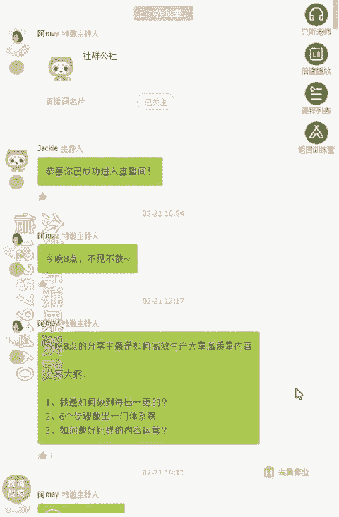

大家好，由于呢前两天大家普遍反馈，呃，可能是由于在家网络的问题，呃，听课的流畅度不够。呃，我也没有想到，因为在家的问题导致就是呃语音直播和视频直播，都导致有部分的同学体验不是很好。

所以接下来我们的课程呢都会采取语音直播的方式跟大家去讲课。那为了大家听课更加流畅，所以我就提前的15分钟来讲今天晚上的课程。

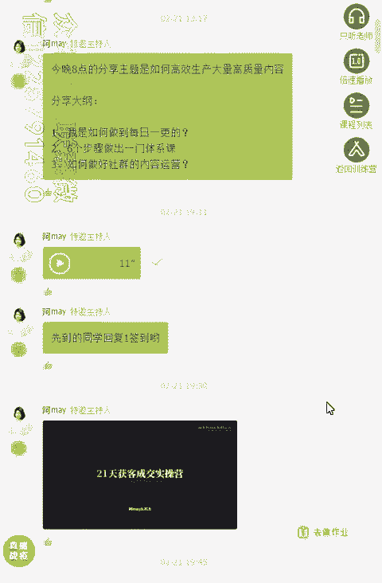

呃，有有有不少同学呢最近都有私聊我，呃，我就摘取了部分同学呃，在。跟我交流过程当中觉得比较迷惑的点，然后跟大家去复习一下前两节课我们的重点内容。

第一节课呢其实我是从一个呃我经常用到的一个用户模型跟大家去交流。呃，我作为一个运营负责人，怎么去设计一个新产品或者是操盘一个新项目的整一个运营方案的思路的。首先呢呃很多运营的模型。呃。

我觉得大家其实主要掌握这个模型就够了。这个模型相对于来说的话，它是比较通用的模型，不仅是用于线上的模型，还是线下的模型都是比较通用的。呃，就是推广呃从用户的引流裂变成交复购转介绍这五个角度来进行思考呃。

来去设计你整一个运营过程当中是怎么让用户关注到你。然后呢加到你的微信。的私域流量词理，然后怎么去通过裂变的方式让用户帮你去自传播去分享，把你的量词做大。最后呢怎么通过社群啊，或者说私聊啊。

朋友圈成交的方式，促使用户跟你进行成交。最后呢还要想办法说让用户成交之后，还继续回来，你这里继续购买进行复购。复购之后呢，还要想办法让已经对你满意的这部分的老客户，呃，帮你去做转介绍。

甚至呢有一部分人可能会成为你的合伙人帮你去作为呃真正的销售去帮你去销售产品。所以从这个模型来说的话，我们作为一个运营负责人，就要想哎，我怎么让用户做到这样的行为啊。

所以前端呢你必须要有对应的产品的设计体系以及运营的方案来促进用户完成你所说的这个这个我们社交客户自循环体系。所以呢刚开始的时候第一步你就要设计好你的产品体系，包括你怎么引流客户啊。

所以你要设计你的吸粉产品啊。第二个，让用户加到你微信之后，你要设计用户的帮你传播的产品，我们就说这种传播呢，这个客户不一定购买了你的产品。但是呢他就会可以帮你传播，可能是一篇文章，可能是一个资料包。

可能是个课程，可能是个社群这类的型的产品。呃，我们叫历练产品。那客户进来之后呢。就是客户进来之后，我还要想办法帮他去做成交，那就是我们正常销售的产品了。这个我们叫做消费产品。呃。

消费产品之后还要设计会员的产品，锁定客户，让客户呢不断的在我这里重复购买。啊，最后呢设计合伙人的产品，让。最后呢要设计合伙人产品，让用户帮我去转介绍，或者说真正去成为我们公司的兼职销售。啊。

那么最近呢有一些朋友您已经开始筹备自己的裂变推广。呃，整个产品的活动了。那么有咨询到我就是自己在设计这个吸粉或者说裂变产品的时候，是不是考虑跟自己业务的相关系，需不需要是呃拿自己公司的产品去做裂变。

首先明确第一点，就是吸粉产品和裂变产品，其实并不一定是你们公司现有的产品。你可以是去购买。也可以是跟别人合作，也可以是请外部的讲师啊。

去开课开课这类型的产品都OK他吸粉的产品和裂变的产品的主要传存在的目的其实就是帮你吸引精准的目标客户关注到你。并且让这些客户帮你去传播，对吧？所以呢。

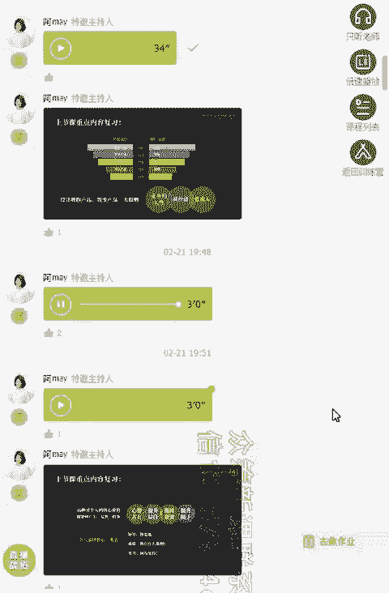

不一定是你现在公司的产品，而是只要是你公司就是只要是你要要裂变那部分的目标用户，他需要的产品，你去拿这部分的产品去裂变就可以了。我举个例子，像我们以前去做裂变活动的时候，我经常会选的产品是一个畅销书籍。

那畅销书籍不是我写的呀，作者，也不是我，而是我只是选了他，因为客户需要他，但需要他这个畅销书籍的客户，刚好也是我的目标客户啊，所以呢我就可以选这个产品作为我的引流和吸粉产品。那么这部分的产品呢。

其实是有三大原则的，并不是说什么样的产品主要市面向大家都需要都拿去裂。比如说口罩，口罩是不适合拿去裂变呢，其实也并不一定，因为有可能你裂变过来的粉丝，跟你最后要成交这个产品没有任何的相关度。

他就算在你这里通过口罩的方式吸引到你这里来了。但是你要去转化它，成为你。深圳消费的产品的客户其是非常难的，所以自己自己要定位好吸粉和裂变的产品，它吸引的客户，一定是你需要的那部分的精准的目标客户才行。

所以呢手下的第一个原则，就是其实你要选的这个产品要跟你的业务是有相关性的。第二个呢，因为我们说吸粉产品和裂变产品其实是呃让客户低门槛进来。呃，因为我们消费产品一般来说，我们价格定的比较高嘛。

那么这类型的产品呢什么样的价格比较合适呢？基本上我们说定价在60元以内的产品是比较合适，用来做吸粉和裂变的产品的。另外的话不是说低价的产品就一定是低价值。呃，很多人喜欢拿很low的产品去做裂变。

实际上不适合。因为这样列来的客户他不会觉得你这个品牌是一个很好的品牌。所以呢其实你要拿高价值的产品，就是一看就。一看就价值很高，但是呢其实成本很低，这样的产品去做裂变效果是比较好的。所以呢总的来说。

根据这三个原则，我们经常选的产品，基本上吸粉产品和裂变产品用虚拟产品来代替，是比较合适的。因为像课程啊、社群啊，这样的产品，你去包装它的整个价值是很容易包装高的。

比如说有人说这个老师的课程它价值几千块钱呢，你可以包装没问题。但是呢有可能你是需要花。

几十百几百块钱请他来讲，这讲一节课就OK了。所以可能你付出的成本并不需要这么高。好，那讲完呃，这是第一节课的思路啊，就是告诉大家我们在呃做一个项目的时候，其实我们需要设计好对应的产品体系的。

并且呢呃我怎么去设计这样的产品体系，我怎么去设计我的裂变路径，其实最好的方式，就是去拆解，拆解你的优秀同行的案例，以及市面上优秀的刷屏的案例。呃，很多朋友呢听到我说拆解自己不明白什么叫拆解。

实际上就是相当于说你去找优秀的参考对象。比如说我做运营的，我可能就看到建峰，有一些活动做的很好。那我就可能去看他们的活动，去真深度参与到他的活动当中去看一下人家是呃怎么引导用户去转转发的。

怎么去用了什么话术，怎么去设计整一个裂润路径的，呃，哪一步到哪一步，比如说先关注海报，海报里边用什么的按钮。按钮上面用什么文字，落地页用了什么这个几个结构的框架，就是去拆解这些内容。

往往你去拆解过程当中，你自己就可以了解到很多优秀的操盘手，他做出来的成品，你自己可能拿来稍微改一下就可以直接用了。就包括我在第二节课的时候，其实也给到大家。比比如说你是做教育机构的。

你就可以去拆解长头学堂呃，像微秒商学院呃以及是集集体会，还有我我们说的那个呃斑马英语啊，这些他们其实在整个流程上面，裂变流程上面花了很多的精力去打磨。那你直接去把人家的这个过程去直接拆解出来。

拆解出来之后，甚至他的话术，你都可以直接拿来改一下就可以用了，就不用自己花那么多时间探索那么多的时间。呃，这是最快的方式啊。好，那么我们讲到第二节课里边呢，第二节课呢我就讲到呃。

就是我们要去打造个人品牌。为嘛要去打造个人品牌呢？首先第一个你有品牌，很容易让人家就是在同行当中就马上看到你选择你，这就是有品牌跟没有品牌之中最大的区别。

而且呢除了解决这个用户的心是占有以及信任的问题之外呢。

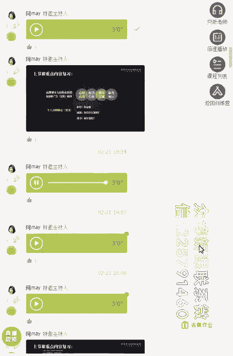

品牌本身就是一个很稳定的流量池，你有品牌的人，很容易人家就会自动找上你来。因为人家比如说呃在增长这个行业里边，人家一想到呃要找一个增长裂变比较厉害的人找谁呀？有可能第一想到就是我是吧？

就是我阿威因为我给他植入一个心智，就是说我是增长女黑客，告诉别人，你找增长的话，找我是比较好的。我在这方面很擅长，这就是我给别人的这个印象给别人的这个概念，让别人知道哎，我是干什么的。呃。

我在哪些方面比较优秀，这就是你给别人的品牌。那么在公司和个人来说的话，呃，其实现在你会发现很多企业也会非常注重个人品牌。呃，他会着重去打造企业当中某一类人的品个人IP比如说。

小米他就会着重去打造雷军是吧？把包括雷军的哎OK都变成了一首歌是吧？呃，包括微信就会着重去打造张小龙啊，都会去有意识的打造这个产品的一个核心人物，让这个核心人物去代表公司去发言。

这是公司的这个这这个行为，你会发现现在有企业IP的公司跟没有企业IP的公司，他的宣传广告的成本是非常低的。你看呃那么多的公空调厂商是吧？为什么格力特别知名。当然，除了他产品好之外，董明珠这个IP的存在。

其实给格力传播公司的品牌，呃，就是增加了很多的宣传资源，有的时候董明珠出来哎就说一下格力要怎么样对员工好，都翻天覆地的新闻去报道他。呃第二个呢就是对个人来说。就很多人觉得自己普普通人嘛。

为什么我要去做个人品牌呢？那对个人来说，其实你在你的圈子里，你如果想要得到更好的升迁的机会，或者说想要得到更好的职业发展的机会，其实都需要你给别人留下一个深刻的印象，知道你的能力。

把你的能力快速的传递给别人，别人才可能哎第一念头就想到你那么。个人品牌很重要啊，嗯有了个人品牌之后呢，你会发现你整个圈子可能都不会都会不一样。我自己就是如此，我以前呢就是当幕后的工作人员的。呃。

虽然我自己去做运营，但是运营策划都是公司嘛。所以呢我从来不被人知，都是在幕后慢默默无闻的工作。所以我那回工作到第五年的时候，我心里还是很慌张的。因为我想如果我要换一份工作，我还得自己去投简历，很可怕的。

但是你会发现真正的到了工作第五年的时候，好的。

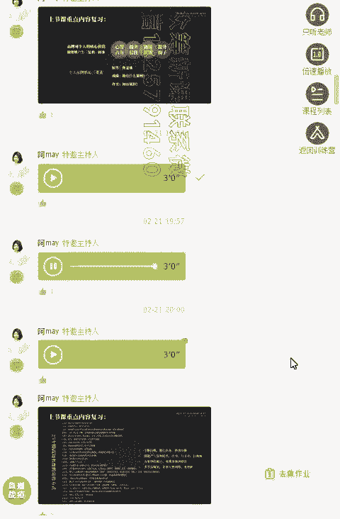

好的人才基本上都不需要投简历的。他说他自己离开，可能就会很多人给他推荐新的岗位，会得到内推，会有很多人抢着要他。为什么会有人抢着要他，或者有人给他去介绍呢？就是因为他的个人品牌已经打出去了。

所以有了个人品牌，一方面可以给你提供的这个提提高你对别人的这个第一印象，让人家马上记住你。第二个的话可以极大的提高你跟别就是客户对你的信赖度。第三个的话，你可以得到很多链接资源的机会。呃。

我现在就是我发现当我自己的个人品牌有一定影响力之外呢。之后呢，我去谈合作也好，打找大咖，帮我背书也好，我都会发现哎要简单的多。以前你想找到一个品牌的合作方，跟你谈合作，太难了，各种托关系。

但但是人家可能都不会鸟你。但是现在唉发现哎你是你是某某书的作者是吧？你是某某这个专栏的作家是吧？哎呀，我太欢迎了，太欢迎了，就是这个这就是这个问题嘛？还有第四个呢就是提升你的圈子。

你会发现当你自己有个人品牌之后呢，因为别人也希望你跟他一起互相背书嘛。所以有的时候你会发现你会拉近很多很多更高层次的圈子里，我现在我我在做我个人品牌的时候，我根本没有想到。

哎我到我现在既中艺老师可以帮我背书呃，可以跟我就是成为好朋友。呃，李教授也可以跟我成为这个微信的好友呃，可以相互去背书，哎，没有想过是是不是？但是呢。当你做出来一定的名气之后，你慢慢的就会发现，哎。

原来以前我觉得是跟我很遥远，我仰望了人，现在我可以平视了，可以坐在一起交流吃饭了是吧？还互相请教了。所以这就是你有个人品牌给你带来了一个价值。而且这种价值给你带来是可以有累积的。

就是说你做了这个个人品牌之后，对你整个人生都会有极大的影响，我其实就是受益匪浅的。所以有句话就是送给大家，就是一定要去做能够产生复利的事情。那么做个人品牌，我觉得有三个要素是非常关键的。

就是你是谁你有什么案例可以见得这三点呢，你一定要去梳理。就是你自己要传递给别人是一个什么样的印象。一般来说呢，我们是说业务标签比较多。第二个的是你有什么样的案例来证明你说的就是真的。第三个呢就是背书。

就是有哪些牛人来推荐你很多人呢就是你可能。并不出名。但是有时候呢很牛人推荐你就会觉得你很牛。就好比如说当初得到推出的第一个专栏叫李翔商业内参。我那会哪知道李翔啊。

我根本都没有听过他有没有看过他的任何一篇文章的报道。但是我为什么选择买他的专栏啊，就是因为马云他。就是因为马云推荐了他，马云的推荐让我觉得这个人真的好牛啊，以为马云都在推荐他，这就是一个最重要的道理。

就是有多少牛人认你呃，就证明你有多牛。

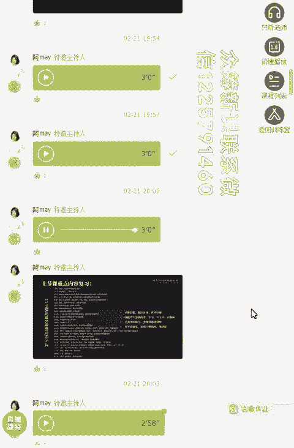

这就是为什么现在大数人都是喜欢去混圈子的原因，因为混圈子可以提高你链接资源的能力，可以提高你的知名度，而且还可以相互背书。Yeah。然后呢，在上节课最重点的内容呢。

就是给大家去分享了我觉得有25个可以快速提高知名度的宣传方式。呃，总的来说的话，这25条方式，我觉得是如果你能选择5条出来坚持去做，就已经足够了。呃，我只是呢因为有不同的朋友呢他自己擅长的东西不一样。

呃，可能你有些人擅长用这个写文章，有些人擅长去讲课，有些人擅长呢去做私域流量，有些人擅长的去做社群运营，所以呢给到不同的思路给到大家。但是实际上你只要是沿着自己擅长的能力圈一直去做就可以了。

像我自己我就是比较擅长写文章和就是做社群是吧？所以我就集中力量做这两部分，你就会发现我也是可以出效果的。并不一定说25条方法，我全部都要用呃，这并不一定呃，第二个呢就是总的来。

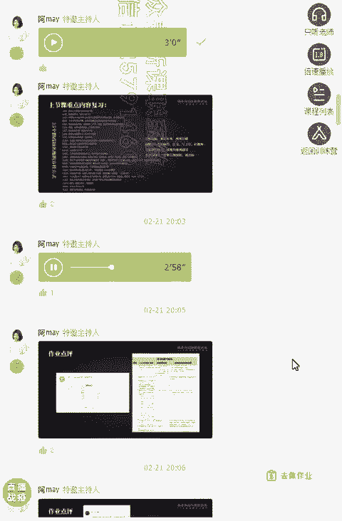

说这25条其实是有4个原则。就意思是说你一定你要做你个人品牌，你一定是要不断的折腾，做出实事来。然后呢积极去做传播。好多人呢其实跟我以前一样，就是你自己可能真正做出的案例也很多，但是呢没有人知道。

是因为你从来没有把自己做牛逼的事情推出来，对吧？没有把你做的这个案例去说出去，所以别人根本就不知道。

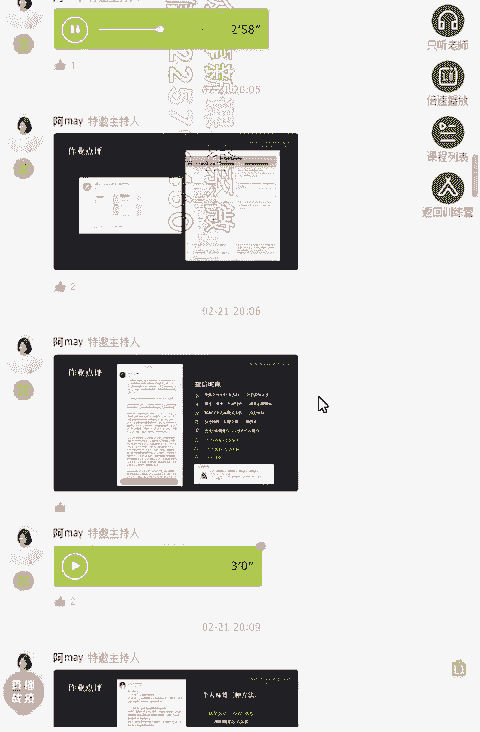

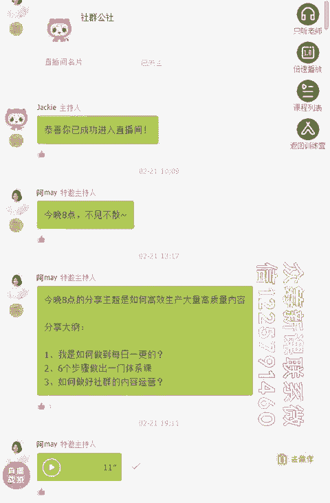

不知道你原来这么牛逼啊，很多人其实朋友圈都没有发几条，导致说他以前的同学根本就不知道他现在在做啥。第二个呢就是你一定要去做能够产生复利的事情。啊，就是你要做出来的东西，你发现以后呢，你在过了中年的时候。

这些事情还可以依然给你带来，源源不断的粉丝或者源源不断的知名度，这就是你后期要去考虑的事情。你是现在做的事能不能被为你以后产生复利。第三个呢就是不要单打独斗，不要单打独斗，靠一个人是不够的。

你一定要懂得抱团去借势。这样的话才快速把你的能量放大。嗯，第四个呢就是要想办法的多平台曝光，让别人收到你看到你就是总的来说就是这四个原则。好，那么复习完我们呃上两节课的内容之后呢，我们来看一下这节课呃。

上上一次布置的作业。

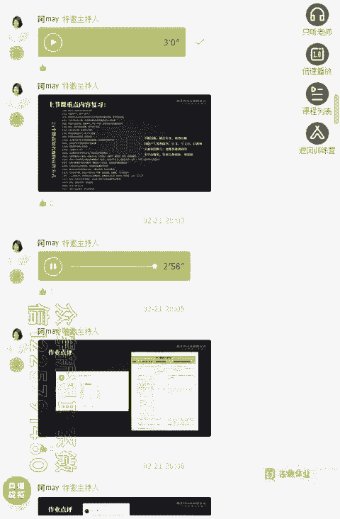

Oh。那上一次的作业，其实我看了一下，基本上完成的朋友呃不是很多，有现现在是大概50个人。实际上我中午我在下午的时候呢，我已经把中午12点之前提交的所有朋友的作业都看了，而且都逐一去做点评了。

所以大家作业还是要去做，千万不要偷懒，咱们这个是实操营，我上一次布置的作业，其实第一方面呢是让大家去了解自己，认知自己。第二个呢真的是想大家就是马上去做行动了，但是为什么让大家去注册这个平台的账号。

并且让大家去想想一想，你马上要去做的事情是什么。嗯，并且要去进行一次互推实操的原因，就是真正的去实实践。其实做实操也并不是并不一定要花那么多的时间，真的不需要花很多的时间，不要被一点点的困难所阻碍掉。

一定要积极的去折腾，这真的是很重要的。好，那我们来看一下呃，我选了三位同学的案例。我们来看一下哈。首先第一个呢是有一个叫文娟的朋友，我觉得他这个作业呢，我让我感觉的是特别特别的认真。

他把我的25条方法做出来了一个表格，并且呢自己手旁边呢还做了一个第一个自己呢去对标检查自己现在有没有做到。第二个呢马上去思考自己现在遇到的问题，以及马上去做的事情。所以呢他这个方案，我觉得是特别好的。

呃，我看到他在我们群里面也把他的表格分享出来了，大家也可以按照他的方法去对标检查，并且马上去做深入的。思考去想一想，你现在可以马上做的事情啊，这种方法是非常棒的。啊。文娟这个方法我觉得是很赞很赞。呃。

另外呢就是有两位同学，我觉得在做作业的过程当中，我发现了一点点小问题，所以呢也挑出来跟大家去讲一讲。首先第一位第二位的同学呢是叫呃，我不知道这个名字是叫龙少还是萌少还是忙少，还是庞少。

所以你会发现呢就是我觉得我我就说你是龙少吧。龙少你你你会发现你今天分享非常棒。因为包括你第一天的分享也写的很详细，你拆解了一个案例，非常的详细，也很好很好。但是你这个个人品牌的名字，其实犯了一个呃。

我觉得我觉得是不是很合适的。就是你自己用了一个生僻字，就会导致很多人根本就不知道你叫什么，叫不出来，所以导致很难去给别人去转介绍，除非很方便，就在微信给你推个名片了。否则的话就很难去跟别人介绍了。

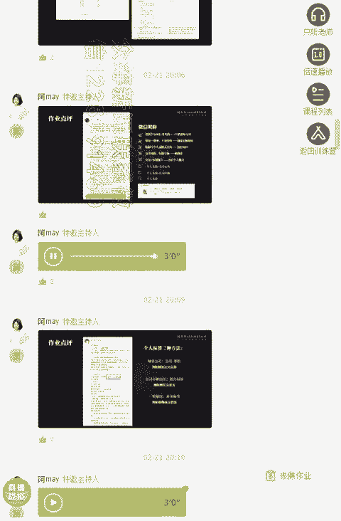

所以我其实非常建议你去换个名。

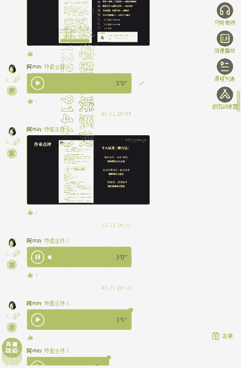

头桃的这个专家，那就不。比如说你自己在腾讯或者说在阿里工作，那你直接说你是腾讯的公关总监，或者腾讯的运营。呃，阿里的这个运营一下子人家就对你有印象了。所以呢在知名公司就是有这么一个好处。

知名公司本身就可以给你带来一个标签，这个标签很快就让人家觉得你能力很牛逼。而且呢你说你是公关嘛，就知道你肯定是公关方面很厉害。所以如果有公关上卖的东西，可能就会找到你。第二个。

当你公司并不是特别知名的时候呢，就可以考虑用能力标签。像我自己我刚创立的公司嘛，刚创立的C公司，那我公司肯定不够出名，肯定没有阿里啊、腾讯啊、小米啊这样的出名。

所以呢我就用我自己能力标签就突出我自己是擅长做什么的。啊，第三个呢就是一般来说业务就是业务标签是比较适合，就是呃比如说关老师他的标签就是讲师成交教练，就是告诉大家，我是做什么呢？我是帮讲师去做成交的。

所以呢就是用业务标签去代表你的个人标签是比较合适的。一般来说这个个人标签呢，就是忌讳两点，第一个呢是太泛了。如果你定位太泛了，你的对手就太强了，你打不过别人的。比如说你现在定位自己是营销专家。

你面对的对手是谁啊？小小马送这样的一个高手，你能跟别人拼吗？很难拼得过，对不对？但是呢。如果说你定位在你的这个领域里面成为专家，那就OK。比如说你做装修的，你定定位这己是家装的营销专家。

那就跟小马松的赛道切换了。你就现成的细分领域的专家。所以呢像我有一个朋友叫燕燕涵啊，他就打自己是餐饮行业的营销专家，你就会发现他在餐饮这个领域里面就会有一定的知名度。所以你自己的定位千万不要太泛了。

太泛，除非你自己真的很强，否则的话，你是打不过你的竞争对手的。第二个呢，定位不要太多。

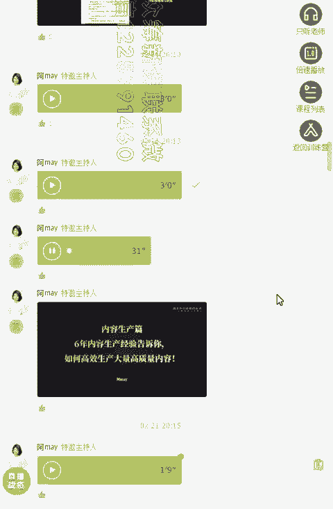

你定位太多，你的敌人就太多了，记不住。所以最重要的就是你的定位最好是聚焦一点，聚焦的好处是容易记容易红。比如说你说美妆的达人很难，因为做美妆的达人太多太多了。但是呢如果你说我是做美妆的复购第一人。

那就不一样了。你你说我在美妆复购中做的很厉害啊，以后你如果你的化妆品想要呃你的这个产品想要做复购的话，就找我为什么能够做到复购者特别厉害啊，我有什么什么技巧是吧？这就是很重要了。还有呢就比如说。

你自己是做那个水果的，你自己说打自己是水管专家，水管专家。为什么凭什么说你是水管专家太难了。那如果说你打猴桃了，这个专家那就不一样了。你像柚子妹，他刚开始打什么，打我是卖柚子的，所以一想到想吃柚子。

就不想要找他，就是这个道理，你不要打太泛的定位，推对手太强了，你要打细分领域的垂直的定位。我们说这个标签，个人标签要做就一定要做细分领域的第一，一定要做到第一，别人才会记得你要不的话。

你说出来别人都不相信了。好，那讲完这三个同学的作业之后呢，我们继续来讲我们今天的课程。今天的课程呢主要是给大家分享我是怎么去生产大量高质量的内容的。因为我们发现呢你要做个人品牌是吧？

其实做个人品牌最重要的就是你要不断的曝光，不断的输出。所以呢做内容是非常非常重要的。啊，而且要持续的去做这样的内容，所以你就会发现很多同学就会觉得哎呀，天哪，我肚子里面没有那么多料啊。

哪能天天去输出那么多的内容啊，太难了，我怎么做呀。第二个我的内容就那么一点，我都讲完了，我后面都没有东西可以讲了，怎么继续去生产啊。呃，然后第三个的话就是我本身是有很好的内容的，我怎么把它表述出来啊。

啊，这些方法呢？我想通过今天晚上的这个分享告诉大家，当然大家在听课的过程当中有什么问题都可以在我们的评论区呃，直接。写出来，到时候呢我们在课程结束之后呢，会有一个答疑的时间。呃。

我会在课后呢给大家去呃一一答疑。好了，那我们继续按照我们今天的这种节奏来哈。呃的确我觉得语音直播，其实要比视频直播的好处就是在于后面要进来的朋友，他随时都可以查阅到前面的内容。

而且很方便大家就是后面去翻译，就是有时候你想到唉我可能要检索某一个内容。但是呢只视频直播他的检索没有那么方便。那语音直播，因为他很快就可以看到课件嘛，所以他很容易去检索。呃，他还是有自己的优势的。好。

那我今天呢将会从以下的三个方面给他去做分享。呃，第一个呢跟大家分享一下，我自己是怎么去做到每日跟的。第二个呢，因为我们有很多教育机构的朋友嘛。而且呢有很多是想做个人品牌的朋友。那么其实做课程的时候。

可以快速把你的知名度扩大的一种方法。所以呢我会从呃就是怎么去打造一门体系课的方式告诉大家，怎么去快速把自己体系课做起来。

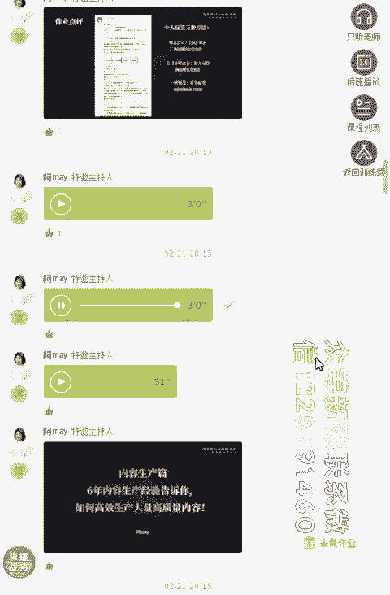

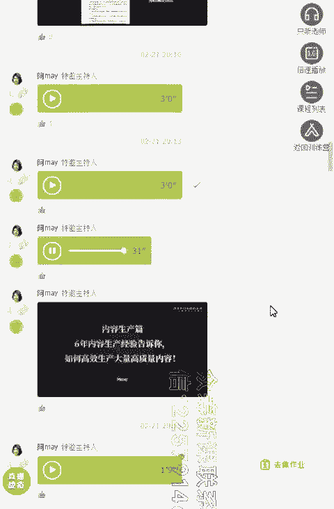

第三个呢就是怎么去做好社群的内容运营。因为很多朋友今这一次来学习呢，主要也是想学习呃，怎么去用社群来做为营销的。呃，好，那我们继续进入第一趴，是我是怎么做到每日日更的。首先我想问大家一个问题。

就是你获取信息的渠道是有哪些的。这个问题其实我自己在面试呃运营人员的时候，我是必问的呃，包括我去问销售人员，我是必问的。这个问题我会发现有很多种回答的方式，不同的人会回答不一样。有些人呢他会告诉我。

就是呃我会问他晚上会呃业余时间做些什么。然后呢，经常会去哪里获取信息，有些人会告诉我呃，今日头条啊，抖音啊呃公众号啊呃，就是这这这些那有些人会告诉我呃，我我得到啊呃，然后呢我偶尔会听课啊。

偶往会有一些这个付费的群啊，会列举一些，比如说做运营前会关注一些鸟哥笔记啊，三节课这样的一个公众号。唉，你就会发现后者的回答呃朋友他的运营能力，往往会比前者的运营能力要强。

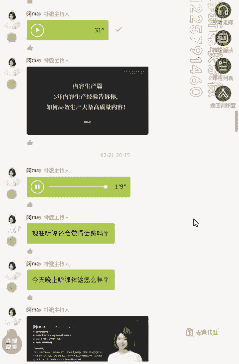

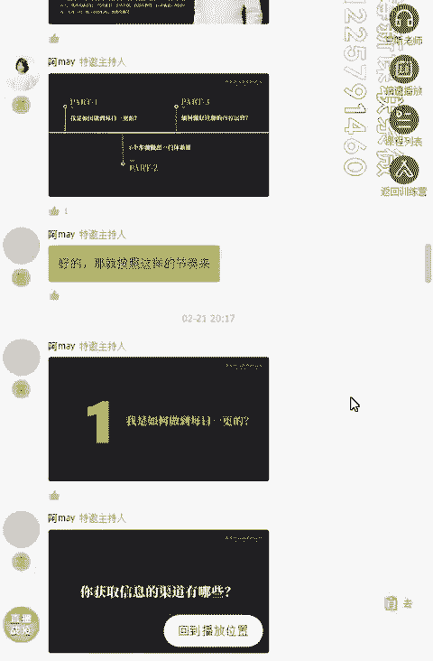

为什么？其实就是因为你获取信息的渠道有区别。很多人呢就是自己是不舍得花钱去听课，或者是不舍得花钱去学习的。你会发现这些人他一般下班下完班之后呢，都是习惯性的去刷刷抖音啊，看看头条啊，然后看看公众号。

刷刷朋友圈就完了。呃，不会去付费学习的呃，所以你就会发现他们的消息渠道。第一个是比较泛的。而且呢你会发现抖音和头条是根据你自己个人喜好给你推送的。而且什么东西会让你推送关客人喜操看的多啊。

基本上是娱乐性的东西会比较多。所以你基本上如果你不去付费学习啊，关注的内容大部分是。你关注到的内容大部分都是娱乐性的这个东西，我自己也会就是我自己去去刷抖音的时候，不知不觉的时间就过去那么久了。

但是我发现我自己刷的东西真的是对我有什么用啊，就看啊这个好有趣。哈哈哈哈就没了。所以你如果说我真真心心想做一个个人品牌，想成为一个领域的专家，一定要更新迭代你的消息渠道，这个是真的是非常非常重要的。

在我看来呢，怎么去快速成为一个领域的专家哈，主要是有五个方法。第一个方法就是你自己定位好一个领域。比如说我自己想要去做运营和做增长。我就赶紧的去找到增长或者运营领域里面的高手，跟他们去学习。

怎么去找到高手啊，最快的方式就是去读书，看经典的书籍是最快速的。人家既然可以把它的理论体系写成一本书，并且可以成功出版，说明这个理论体系或者说出版的这个质量一定不会太差，绝对不会太差。

不会比你在百度学随便搜索到的内容差是吧？所以呢去看书是最快速的。而且呢我一般看书，我会先额外去翻他那个前面的目录，去把它目录的内容全部搬下来。目录其际上就是整个作者他的思考框架。他对这个内容的思考框架。

比如说我之前要学销售的时候，我就会买很多销售的书，然后把目录全部都。全部都弄成这个呃思维导图，然后把思维导图全部去捋捋出来。你会发现当不同的书籍的目录全部整合到一起的时候。

你会发现基本上内容框架好多都是有重复的。重点的内容你就那么多。呃，这是第一个。第二个呢是去听成体系的系列课，成体系的系列课。比如说参加训练营参加一门呃，比如说十二节十六节这样的网课。

或者说参加线下的两天一夜的那种课程，这种呢是快速可以让你快速把一个领域的这个重点的内容快速掌握的一种方法。听说。

呃，就是20个小时就足够让你去成为这个领域里面的专家了。呃，就比这个领域70%的人啊要强了。就是只要你学习20个小时，刻意学习20个小时。第二种方法呢就像高手高手问，就前面呢那种方法啊。

因为他可能只是给你灌输嘛，你还没有办法说根据我的情况去呃给到更好的建议。所以呢最好呢是找到高手跟你交流。所以呢这种高手呢，你可以根据你的情况告诉他，让他根据你的情况给你建议。

那这这个高手一这种高手一般从哪里找啊，一般是在行上面可以去约这样的行家。第二个的话，比如说呃我们说就是前面开课的训练营的老师啊，或者说开线下课程的老师啊，付费课程的这个群主啊，他也是一定的高手。

就可以跟他们去讨教他们的成功经验。呃，当然我建议大家就是不要是觉得你去讨教别人，别就有义务给你回答的。所以我为什么建议大家用在行。因为在行人家是呃已经确定说我是可以这么去给大家去做这样的服务的。

只要你付费，我就愿意是吧？但是其他的不是说哎好多人就是一过来问我好多人就过来问我问题嘛，加了我微信之后就拼命问问题，就觉得我一定要有义务给他回答一样。我要是不回答好像我就得罪他一样。

实际上我哪有那么多时间给你那么多人都去做解答呀，是不是？所以自己要去跟高手问的时候，一定要有一定的意识，说别人是没有义务给你解答的。所以你一般来说你要去付费，付费去提问啊。

就是一定要要对人家的服务时间要有偿给人家啊，第三个呢就是加入社群。加入这样的社群呢，可以找到大群跟你是想有共同爱好的人可以去加。交流，而且最重要的是加入社群，他可以快速获取到这个行业最新的资讯。

我自己在做增长和运营这行业，我就加入很多增长和运营的社群。我很多资讯也是从这些社群里面获取的。我现在基本上我都不怎么去看公众号了。因为我深圳时间太满了。

但是呢主要我在这样的社群里面会很多人去把这样的好的信息分享出来。我就可以快速从社群里面获取到。所以加入社群就很快速的方式，呃，什么样的社群，比如说知识星球里边就很多的付费社群。

也可以去加入知识星球可以去搜索你这个行业里面的社群去加入。如果没有的话，好，那你机会来了，你完全可以建一个你个行业的社群，后面我会告诉大家怎么去搭建你这个行业的社群。好。

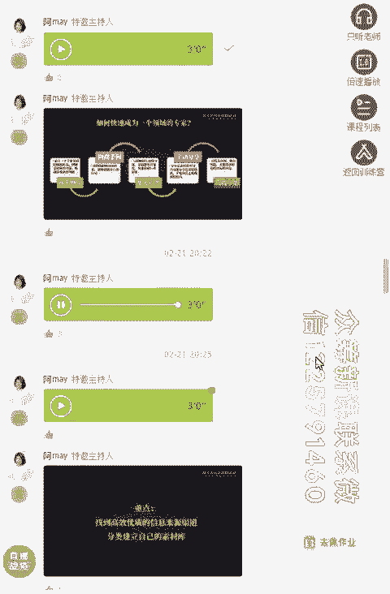

第三点呢就是前面我们都是说去学习，去跟别人交流啊。第三点呢最重要呃就这第四点呢最重要的是什么？你要去分享，其实跟别人交流，或者说跟别人学习，很多人以为自己听懂了。实际上还不够呃。

你还是需要主动去跟别人分享，这样子的话，你分能能你能够被给别人先去说清楚这个知识点才说明你真正掌握了，所以分享是最好的学习，最后分享出来的东西才是你真正吸收到的东西。最后一点呢就是实践中悟。

前面这四种都很容易忘记。就算你跟别人去讲，也容易忘记。但是如果你真正自己去做实操，就真不容易忘。只有实践才可以填补你跟理解呃，理论跟实际的个鸿沟。所以你真正去实操是最重要的。所以。所以我告诉大家。

今天大家去学习的这个课程，也建议大家学习完之后，尝试的找一个人去跟他分享。如果你能够分享出来，说明唉你其实已经吸收了很多内容了啊，最后呢我会布置一个实操的作业给到大家，一定一定要去做实操。做了实操之后。

你还真正去掌握了。那通过这5点呢，其实你已经真正去做实施的话，你其实已经真的可以成为一个领域的专家了，缺的只是时间而已。这个时间真的需要很长吗？不需要。刚才我已经说了，集中精力学20个小时。

其实你就已经对一个领域有很多的了解了。重点是什么呢？重点就是你要去找到高效优质的信息来源渠道，这是最最最重要的。找到之后，我们刚才说你学习到这些书籍也好啊呃，然后呢学习到课程也好啊。

你把人家的书籍的目录以及课程的这个体这个大纲全部用思维导图整理出来，然后把它分类分类之后呢，就把这个素材库给建立起来。什么是高效优质的信息来源渠道，我给大家去分分享我自己的，我我经常呃获取信息的渠道。

第一个是知识星球的付费星球。像呃用我我我会比较关注几个星球。比如说我自己的星球肯定是天天我都关注了。第二个的话是呃身材有数啊，这是一个就是教大家去怎么去赚钱或创业的一些想法的星球，还有超大的星球。

淘大星球会分享一些互联网的资讯呃这类的星球。然后建峰的每日案例精选的星球，会分享很多就是拆解的案例。当然我自己星球也会去分享。啊，还有群想这样的一个社群啊，它也是一个流量的社群。所以呢。

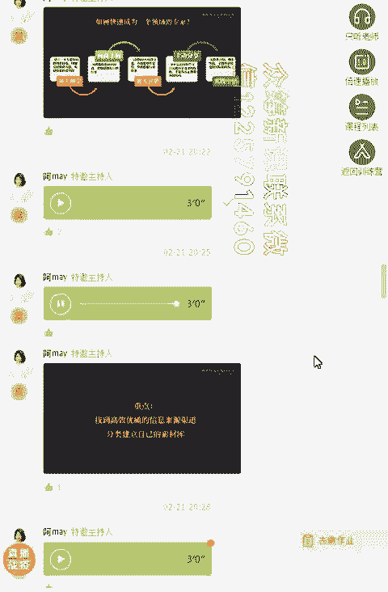

还有一些我自己的一些私密的群，这是私密的群是不是不是对外付费的。是我们去把呃这个领域里边。比如说我跟建峰呃，就是就是曾妙他们也建了一个top talkKKKKOL了100的这个社群。这样的社群的话。

它是需要邀请制的。呃，真的是到了一个知名度才可以进去。那这样的社群的话，大家分享的资源就会非常的优质的。然后第二个的话就是我会去我我我经常去学习的几个渠道。第一个是得到得到真的是非常优质的信息来源哦。

而且上面得到会有很多的内容。而且现在得到它它其实现在打了一个口号叫知识就在得到哈。其实得到现在有一个功能非常好用。就是你去得到里面搜东西，你会发现得到收入的电子书书里边的某一个片段都可以搜得到。

所以当你去了解某一个行业，或者说某一个知识点的时候，你去里边搜，能够能够搜到内容的话，基本上你都可以试读啊，可以快速把这个领域的基本重点啊。所以得到其实真的是非常好的一个内容来源。

而且得到最近推出了一个10万个怎么办的这么一个栏目。呃，里边也有很多优质的这个问题的答案，所以呢是一个非常值得关注的这个信息来源渠道。呃，我经常呢也会去听得到了每天听本书。

因为呢我自己去看书的确是很费时间，我就每天听本书，我听完书之后呢，再从书里面觉得感兴趣的呃，觉得值得深读的书再去挑出实体书出来去学习。啊，有的时候呢呃我不一定去关注我这个行业里面的这个信息。

因为我自己要去拓拽。因为创业创业你其实要关注外界的信息，不一定只是自己专业的信息。所以呢我要去听一听，比如说我自己非常感兴趣的一个领域，就是物理学和去宙学。我说我是非常喜欢听这类型的书的。

还要去听一下心理学的书啊，其实中大呢其实跟我交流的时候跟我说。其实你从30岁要准备自己的40岁，有3个能力，你一定要去去构建的。第一个就是你的沟通能力，你跟别人的沟通能力。第二个呢是你的演讲能力啊。

其实也这是也是沟通能力。因为沟通呢有时候是一对多和一对一的沟通。那演讲能力其实就是一对多的沟通。还有呢就是你的商业基本常识。那商业的基本常识，我建推荐大家去学习刘润的5分钟商学院。呃。

刘润的五分钟商学院有两个，一个是基础版，一个是实战版，都建议大家去学习。还有刘任其实在得到还上门们的上线了一门课，叫三十讲洞察力，这个也是非常非常棒的。刘任老师的公众号也非常值得关注。

这是学习商业基本知识的一个很好的信息渠道嗯。

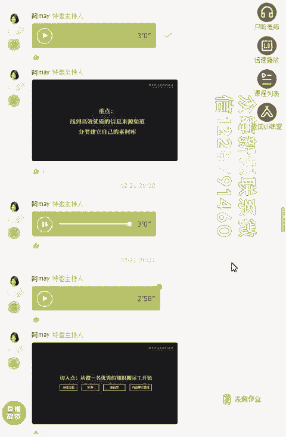

呃，另外呢还要学习什么呢？管理的知识，管理的知识的话基本上其实呃得到也很多。像得到那个宁向东啊，他有一个管理门的课呃，也可也也挺好的。另外的话有很多管理学的大师的书籍是非常值得学习的啊。

还有一个渠道呢就是混沌的渠道，就是我自己啊，因为我是创业经常去创业者嘛，所以混沌呢是聚拢了很多创业者和创新者。所以呢混沌呢它其实是一个学习思维模型非常好的地方。呃以你会发现混沌的同学啊非常的优质。

非常的好学嗯，所以呢混沌的同学是觉得深交的。我觉得呃，只不过呢混沌呢它会有一点就是他更多是跟你去讲理论的这个思框架比较多。呃，你要去想实战呢学习素的层面的话，可能还是需要找另外一些渠道去学习的。呃。

这些渠道主要这几个渠道呢主要是我自己的觉得非常优质的渠道。呃，我相信大家自己也会有自己的优质的兴趣渠道。比如说你关注的公众号啊，这些东西呃，自己呢还是呃可以去梳理一下的。好了。

其实好的信好的信息渠道和好的素材库建立起来之后呢，你就会发现你写作的东西其实可以很多很多很多了。呃，其是前前面其实真的很重要。如果没有你肚子里面没有货，者说你仓库里面没有东西，你怎么可能往外搬嘛。

是不是？所以你要先积累啊？你刚开始的时候切入点是什么呢？就是你要去学东西，你切入点，我建议大家如果说自己还没有觉得自己还没有这个原创的能力，那你可以先从一个优秀的知识搬运工开始啊。

就刚才我说的你去学的书，你去学的这个呃课程，那你可以把这个课程和书做成一个思维导图进行传播也是个很好的方式。第二个呢读书笔记是个很好的方式？另外的话你看樊登樊登每天就是他的读书会，他都是他的内容。

很多时候是不是就是来源于别人的书啊，他把。别人的书，然后重新讲一遍，就是变成他自己的内容了。所以呢就是从优秀的就是搬运工开始，你可以不用自己懂那么多东西，直接去把人家好的内容进行整理。

就可以去去形成你自己的内容去传播。还有呢就是去像我们做运营圈的，我们就经常去拆解别人的案例。呃，这个也是非常好的一个灵感的来源。所以。帮帮作者把他的书籍变成思维导图，做成PPT，把他的书籍变成读书笔记。

呃，还有你去拆解别人的案例库，以及做一些书籍的部分的精华整理。比如说你看每天听本书，其实就是把呃一本厚厚的书，他把其中的一些重要的内容拎出来做精华的整理，那也是形成了自己的内容。

所以呢当你自己还不够有原创内容的时候，你就去从一面优秀的优秀的知识搬运功开始，这就是很快的方法，你就会发现你只要积累了。比如说你去买了10本书，你就每天拆一本书的其中一部分，这已经足够你猜好多个月了。

是吧？

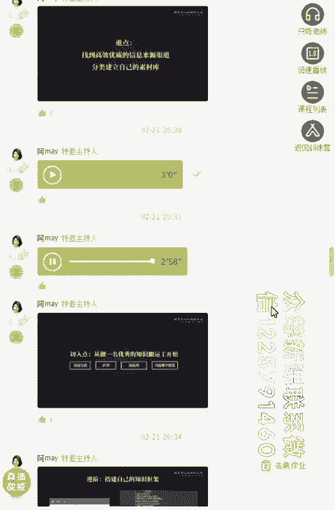

那当然你要进阶，你要去进阶形成自己的方法论。所以呢你要去搭建自己的知识框架。刚开始的知识框架呢，我建议大家呢先用思维导图把别人就是老师呃或者说书籍你作者做的那个框架，你去直接他拿他的框架。

你觉得有哪一些框架比较好用呢，拿出来用，拿出来用之后搭好之后呢，再去往里边，因为你不是买不同的作者，或者说不同的老师的这个课程嘛，你就把不同老师和不同作者的内容，在你这框架里面不断的填填完之后呢。

再形成自己的知识框架。因为你也不断的再做实践嘛，对不对？所以呢首先呢先把别人东西拿出来搭框架。第二个呢，你自己再根据自己的这个经验。不受任何的控制，不要受拘束，随便的去罗列一些要点出来。

就围绕着这个主题去做头脑风风暴，不要在意是不是要点，也不要在意排序顺序，尽管写下来，把这些呢重种思维导图的方式呢，全部罗列下来，然后呢分成几个模块。呃，然后呢再把这个模块里边再去细分一些细点啊。

就可以把自己的这个框架慢慢搭起来了。有了框架之后，你就会发现，哎，可能我这个知识点不够，那我去学习那个知识点不够，我们再去学习，要深入再去学习，慢慢的你这个理论体系就搭起来了。

由知识框架和理论体系去做事情，要比没有知识框架，没有理论体系，要做事情快速的多。有好的时候你会发现为什么别人在做决策的时候可以迅速准确。而你去做决策的时候，你总是犹豫啊到底这个客户这么处理好呢。

还是不好呢？呃，有人在测群里面捣乱，到底是踢了他呢，还是在群里面好好劝。解一下呢，你就会发现有很多这样的一个问题存在。其实是因为你犹豫纠结，是因为你不知道怎么去做选择是正确的。而真正就是真正牛逼的人。

他是背后是有一套选择的框架的。比如说我们说做运营的时候，呃，好的运营操盘手，它就是有一套模型，我的模型就是我说的引流裂变呃成交复购转介绍。这这五步，这就是这五步就围绕这五步去开展你的模型是什么？

你的模型难道就是成交吗？你有没有前端的引流和裂变，有没有成交后面的这个复购和转介绍。你只要某每每一次你在考虑一个产品的时候，都考虑这五步，你就会发现其实你的灵感和设计的思路就会源源不断的来。

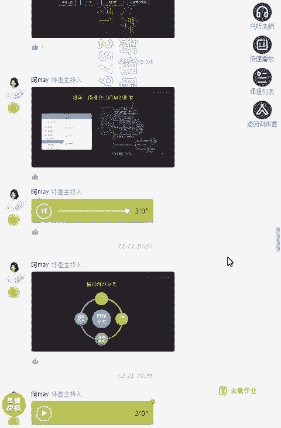

当然你当你搭这个框架之后，你要做到每日更嘛，那可能呢有的时候你的每日日更的内容不一定全部是你工作的内容。所以进行一个知识的分类啊，比如说有些时候呢就写工作的内容。因为你要完善好你整个人格。

因为你要是做个人品牌。你的个人品牌里边如果只有工作，那你就是工作狂，给人的感觉就不够丰满。所以一般来说的话，你把你的这个内容框架进行分类。比如说哪些内容是讲我工作上的思考的，哪些内容是讲这个干货的。

哪些内容是讲我身边的故事的。比如说我生活遇到的故事。我今天去哪里的，去哪找哪里去吃了什么逛街，去哪里逛街，去哪里，跟别人谈合作啊，反正就是发生的故事。还有一个呢就是最新的资讯分享。

就不一定全部是我原创的内容的？有可能我是关注了最新的一些资讯啊，这些资讯也可以及时去做分享，这就是成为了一个很完整的内容框架，这个包括你自己去发朋友圈也好啊，在社群里面做输出也好啊，都可以用得上。

而且呢当你把这个是内容分类进行整理的时候，你会发现有时候身边的故事可以帮助你在写文章的时候，很好去代入读者的感受。因为有真实的故事去代入的话，会利于读者的阅读。好，那怎么去写好一篇文章呢？

我给大家一个建议，还是我刚才我之前一直给大家的建议，就是模仿加微创新，这是最快的方式。所以呢当你自己不知道怎么去写一篇文章是比较好的结构的时候，你就去裁解标杆的对象。

比如说呃你会发现哎刘润老师他最近做公众号，哎，一下子就做起来了，很不错。那你就去猜解他是怎么写文章的呀。刘润老师其实也猜过自己是怎么写文章的。在这里呢，我给大家去讲简单讲述一下，他就说他写文章这五步。

第一步的话就情景导入，就把作者带入你的文字空间里面导入他的身份和情绪，就比如说就是一个小故事呃，刚开始，然后第二步呢就是打破熟见的偏解呃，就是常熟见熟知，这个意思就是说哎以前是怎么样做的。

现在是怎么样做才合理啊，是吧？所以你可以去帮读者问出他想要问的问题啊之类的，然后呢，就再解释原因呃，然后呢再给出建议，再总结生活。你会发现这五步就是他写文章的这一个套路。

他要5分钟上学院全部都是按照这样套路来写的。全部全部都是。所以呃如果当你自己觉得自己不会写文章的时候，你就去找你这个行业内，你觉得谁。写文章很牛逼的，就去猜它是怎么写的，把它的结构弄出来。

你就按照这样的结构去抄。我不是教大家去抄它的文字，而是抄它的结构。

知道吧？抄它的结构，有的时候你抄你找一个跟你不同行的，你就抄他的思路都OK都没问题。尤其是我们之前以前常去写那种销售类的文案的话，当你是不知道去怎么去写这个销售类的文章，你去找人家卖货，卖的很好的文章。

直接拿来哎看别人写了。哎，他这个啊这里需要读者见证啊，那我我也要搞一个读者的见证是吧？呃，他要勾起痛点，用勾起洞点的方法，有几点击点。那我也用这种方法就OK了。所以模仿跟加位创新这是最快速的方法。

好手写出文章之后呢，要去修改哦，一定要去修改。比如说像文章的时候，很多人习惯写的文绉绉的文采飞扬，实际上不需要，最重要是好读好读，就是容易读，所以尽量用口语化的方式去写文章，这样是最快的。

不要写的那么文绉绉的，没人阅读的。所以呃写完之后不断的修改。写完之后不断的修改。呃，然后呢，排版上面也要做一点呃重要的提示，就是排版还是要去做的那怎么排版比较好看呢？你就去找人家写的比较好的文章。

把它的这个排版的样式，直接用一些现成的工具。比如说挨排呃挨排版或者一半一半这样的工具，直接把人家样式采集过来，自己刷一下，就可以变成自己文章的排版了。所以真正的好的内容，别人都做了。

你就不用花那么多心思去研究了。人家早就已经把怎么排版好看，眼睛好研究好了，你就套用，就是最快速的方式。排版好看是很重要的这决定了人家就是好的内容。也要颜值高是吧？要不的话人家都没耐心看得下去。

另外有一点呢，就是呃其实你写文章是有复利的，这个复利就是在于你文章的内容可以重复利用。这其实这比拍视频稍微好，我觉得是先写文章再去拍视频要好。所以你做出文章之后，要想办法去提高你内容的复用性。呃。

有好多内容稍微加工一下，就是可以复用了嘛。比如说你自己先说呃就是嗯呃写一篇文章，你像半佛仙人也是我的朋友哈，半半佛仙人，你看他现在要开B站的up主是吧？他在B站的up呃很快也也涨了几几十万的粉丝哈。

你看他的那个B站的内容是不是全部来源于他的文章，他的选题全部来源于他的文章，所以他是先写文章再去拍视频的。所以你自己也可以啊，我先我在公众号，我用文章的方式显示，我在B站。

我就用这个呃视频的方式去去显示。然后呢，可以把这个每一篇文章又裁剪出啊，可能10个20个抖音的短视频是吧？

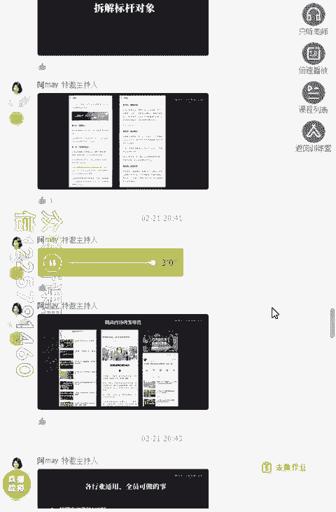

就可以把你的文章的这个内容的复用性啊不断的去加工。那么最后呢就是给到一个大家觉得我觉得是非常通用的一个方式。其实这个呢在我之前做一个线上的分享的时候，也提到过，就是全行业。

我觉得都可以通用全员都可以做的事情。就是你去梳理你的客户常问100问。然后呢用图文的方式把这个100问的答案呃，问题和答案整理出来，然后呢形成文章，再形成短视频的内容进行内容的分发。呃。

昨天有我刚好今天看到一个作业，有个朋友说呃，觉得简书的这个内容分发，就是流量不是很大。其实做简书，我建议大家不要去看开或看待它的内容的分发的流量。

像简书为什么习惯用简书去做这个S这个SEU是因为简书权重的确比较高。简书呢它又可以给你放公众号啊，这些所以你中简书去做的时候，你就去去做SEU做百度搜索引擎来的流量。只要客户搜索这个关键词。

就可以看到你简书的内容点进去，可以被你关注，可以关注到你的公众号就关注到你的个人号，就OK了。这就是很完整的这个。体系了就是让客户搜索的自动流量全部吸引到。所以为什么要去做100万呢？

因为这个100万是客户常会搜索的关键词。做这个100万的话，是可以把那些有需求的用户快速的吸引到。所以我们看到以前啊就是做这个流量比较厉害的人，其实是做SEO比较厉害的，就是会找关键词。

或者说会做常尾关键词的人。这个就是呃那种做的比较厉害的人。而且你会发现呢就是在抖音和短视频上面，我也的确会发现就是有一些人其实是在做呃这样的这个问答。他其实他拍摄的技巧并不是很复杂。

他就是一个人在那里呃，就告诉你呃，我我一个一个视频，一个知识点，一个视频，一个知识，一个视频，一个知识点，这样去拍就OK了。我找了几个案例，大家可以看一下。比如说我今天在刷这个抖音的时候就看到两个案例。

一个是做辣妈育额恢复身材的，这个是减肥的朋友可以去参考啊。他就是通过这样的上方式去拍视频，我找了一个视频给大家看一下。啊，发现千聊没有办法直接发视频啊，他只能发那个音频或者说你像优酷上面的视频。

我就没有办法直接发了。晚一点我发到群里面给大家看，我就是在千聊上面呃，在在抖音上面今天刷到了几个就是用知识营销的方式，就是做那个问答的答疑的方式去做抖音号的这个这个这个这个叫主播是吧？

所以你会发现就是这种方式的确还是有人在做，而且效果也还OK我觉得还OK的。不是而且呢因为他做这种方式的话，很容易取得这个粉丝的信赖嘛。

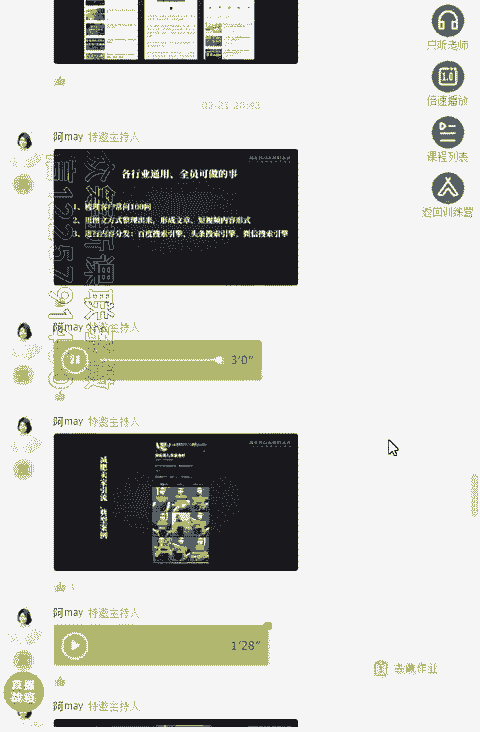

包括就是我另外还看了一个案例，就是做个人律师的，刚好前天晚上就有朋友跟我说，他就是做法律的，刚好想讲法律的呃例子。我还给他告诉他说我有个朋友就是在做呃律法律这方面做短视频做的比较好，就是叫律师付小雷。

后面呢我今天在刷抖音的时候，又发现一个律师还是OK的。他现在有70多万粉丝嘛，也是一个人在那里讲讲讲这个知识这么一个方式去做营销。你看到上面就是也还是很好的。整个货站量啊，每个视频的货赞量还是很高的。

之前呢其实也给大家举了一些例子，比如说像育儿的呀，还有就是呃做培训的呀，还有做中医养生的话，其实都是一个人就在那里说呃，其实做抖音有一个很重要的点，就是你做抖音的时候，你要讲话的话，一定要打字幕。

没打字幕的话，很多人是听不清楚的，在讲什么的。有字幕跟没字幕，你会发现报的视频都会有字幕，没报的视频呃，不没字幕的基本上都报不起来。呃，我看到今天有朋友在群里面去问，唉。

怎么去就是用什么工具去剪辑视频啊？呃，其实我我有在找到一些小技巧，包括呃怎么快速去写文章，我也有一些技巧可以分享给大家。比如说。

呃，你知道我每天去写每日更的时候，我每天我要写500字的文字嘛。如果不写这个500字，我就会被罚款嘛。所以我基本上我每天都要花时间去写这个500字的那怎么写比较快呢？其实你就会发现真的是用笔去写的话。

你就会觉得好慢啊，不想写很痛苦。所以呢我就用了一个输入法叫讯飞输入法，它可以边说边写。呃，像我的这普通话这么差的话，它都可以快速识别出来。所以呃你就你就在那里说话。

说完之后它就会自动的把你文字自动辨辨别出来。但你稍微修改一下就OK了。呃，就是讯飞输入法。第二个呢就是呃如果你是已经讲完课的。呃，你像看我我很多文章万字长文，基本上都是讲完课之后呢，再去形成逐字稿的。

Yeah。那么怎么去形成组字稿呢？也有方法，就比如说你讲课的时候都会有语音或者说视频导出来吗？你把它变成语音之后呢，你可以用呃如果是比较简短的，是可以用那个迅捷转化器。呃，这个迅捷转化器。

它是语音识别成文字，它是免费的。不过呢需要是20兆以内是免费的。如果超过20兆，它是收费的。但是呢它付费比较便宜，我记得是呃一个月是几10块钱还是一年几10块呃，几百块钱就可以搞定嗯。

另外一个呢就识别度比较高的，而且呢有人工的这个服务的话，就是讯飞听见讯飞听见这个搜索一下这个网站就可以进去了。它就是有人工可以帮你去做组织稿，或者说呃用机器翻译也可以。它人工校对那种方式呢。

准确率会比机器高一点呃，收费也不贵，我记得是一个小时呃60分钟大概是90多块钱嗯，就可以搞定了。所以你写一篇文章。如果你是真是写一篇文章，我一般来说我是非常乐意掏这个钱呢。

我才不想自去花这个时间去整理的，是吧？呃，当然你是拍视频或者15分钟之内的哦，那你其实如果是视频的话，有两个网两个工具是可以给到大家的。一个是呃PC版本，这两个工具其实都是头条戏出来的。一个叫巨量创意。

这也是头条做的，在PC上面直接把你视频拉进去，它会自动帮你生成字幕。然后手机的话有一个这个工具叫剪映，也是可以自动导入，生成字幕的。呃，字幕会自动语音识别出来，自动帮你形成到这个视频上面，非常好用。

那么怎么去做到每日更呢？呃，就是有一个非常大的一个诀窍，就是一定要用你的输出到处你倒逼你输入。呃，我就是因为我自己参加了一个每日更的群，这个每日更的群就是呃混在他么所建的。

就是首先第一个我为了强迫自己快速成长。我自己建薪球的时候，我就承诺我必须每周要更新三次以上的动态，否则的话我就做不到我这个这承诺了嘛，所以我放假我也不敢停歇，就是因为我自己已经承诺在那里了。

就逼迫自己每天必定要去输入。否则的话你哪有那么多内容可以写，对吧？所以呃如果你觉得自己呃现在需要学习更的内容，又怕自己懒下来的话，给大家给自己一个承诺。呃，这个承诺一定要对外公开，这样的话。

有一个监督机制可以促促使你自己。

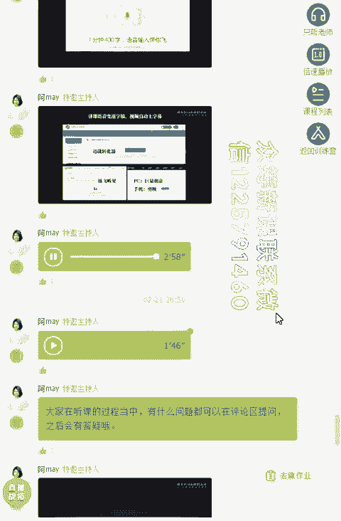

去不断的去输入，然后不断的去输出。第二个呢，我加入一个每日更的群，这个每日更的群就是每天要写500字的内容，发到群里面。如果不完成，你就要发100块钱红包，不完成就要发100块钱红包，就说你发了红包。

这个补根还得补上补上呃，就非常的强，这个非常的严厉的。嗯，而且是非有监督人员一定强迫着你一定是要去交这个作业的，否则的1个100块钱，一定是要交的。所以我自己交过好几次啊，增大也要交过好几次。

所以你就会发现就是有这样的一正在收听你快联系微信客服1225791460进同步更新群不更新群个呃机制逼迫着你自己去输输出的时候呢，你就发现你自己要强强迫自己不断的输。输入了。

所以呢我自己是坚持一直在输入的。像我自己我我在我的卫生间厨房客厅房间里面都装了一个天猫精灵啊，呃这个这个工具真的是推荐给大家。天猫精灵天猫精灵晚上一买，我记得我买的时候才几10块钱一个。

他也可以全屋播放，很方便，我洗澡的时候一般我洗澡比较时间都会很长了，我就我就会听课，就是用天猫精灵在那听课，或者听一本书，一个洗澡的时间。然后呢做饭的时候也会听听听书。

然后呢就那个呃早上刷牙的时候也是在那里听课。哦，有时候课很多课程我我我我都是通过听的方式听完的呃，这个方式是非常有效，超级推荐给大家。因为天猫精灵动动嘴，它就可以叫醒他哦。

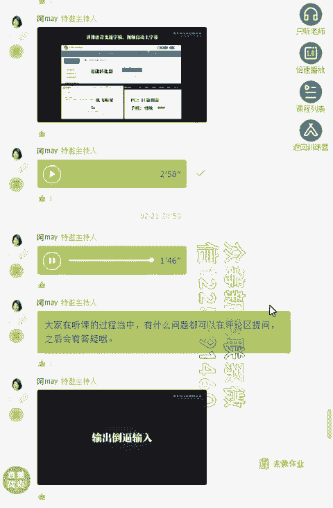

所以你要强迫自己不断的去去坚持，那坚持有一个非常好的方法，一定是要主动加监督的趋势啊，这是非常重要的这就是我做到每一日更的这个这个这个最重要的核心的要点。好，那接下来我们来分享一下怎么去做一个体系课。

天，我今天又讲那么久。就是我觉得做力体系课的话，有六大步骤是很快速就可以让你去做出一门体系课的。第一个是定人群。第二个找标杆保标杆。第三个猜猜题纲，第四个新组合。第五步是磨大纲。第六步是多调研。

我们接下来我们详细拆分拆解一下。第一个是定人群。首先呢你要做课程的时候，你自己要认知自己，就是呃要选定好足够的足够好的方向，就避免自己好的方向，自己做不好，能做好的方向，市场又不受欢迎啊。

你自己要定什么样的方向啊，定这个你可以超过90%的人的那一点，或者说你听过学习就可以做到的那个点。那就是你可以做到呃就是比较好的这个方向或者优势。第二个呢是这个点呢是你自己的最大的热情所在。

你可以持续深入全面去探索的一个领域啊，然后另外的话你要做课嘛，你可能还要考虑消课的问题。所以要考虑你自己的圈子人脉链接的资源，能不能覆盖到你想要做的这个部分的类型的客户，所以在做课的这个主题的选择上面。

最好去选择自己比较擅长的点，或者说你通过学习，可以做到的点。第二个的话是你自己比较。就是比较热爱的一个点。好，那第二个点呢就是要分析你的受众面是否足够的广泛。

因为同样的主题可能不同的策划受众面会急续的变化。比如说之前阿和跟我分享的时候，他在做一个摄影的课。刚开始的时候呢，别人都是把摄影的课程呢定位为喜欢摄影的人。实际上真正喜欢摄影，摄影的人。

可能他的这个受众是很狭窄的，或者说受众并不会很呃就是喜欢摄影的人，他的这个受众可能是会零散的。后面呢他把这个摄影呢定位为想要记录美好生活的人，这样的话一下子就把受众的面扩大了。

就把从喜欢摄影到喜欢美好生活，喜欢用。

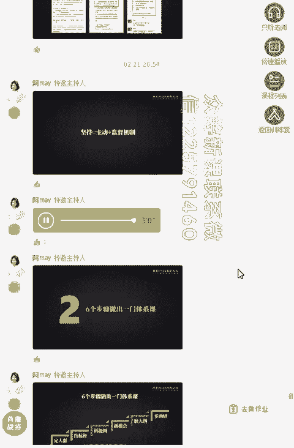

记录美好生活的方式来。把自己的生活记录下来。他通过这样的一个变化，就把它受众面扩大了。所以呢你可以去想一想你的钱在受众是不是可以去通过这样的变化可以广换起来啊，所以呢呃第二个呢就是你在考虑这个。

课程的人群的时候，其实要考虑一点，就是人群的分布特点。那天我有想说嘛，到底是分散的呢，还是集聚的？分散就是说假如说你的客户他转发朋友圈之后。转发朋友圈之后，基本上他的朋友圈不会加到同行。

或者说呃不怎么容易加到同行。这样的话其实就相当于说他的人群是比较难以链接的。他不是集聚的。呃，就是相当于你去想想你的客户，他的朋友圈会不会加你的客户会不会有你的客户。如果有的话，那就是比较容易集聚的。

如果说没有的话，那就是分散的这种类型的话，只能靠靠搜索引擎来通过了这样的方式去连呃连接他们。Sure。第二个呢就是找标杆，还是要找标杆，课程其实也是非常需要找标杆的。因为如果尤其是你第一次做课程的时候。

你更需要找标杆了。因为人家已经有些可能市面上同类的课程，有些人已经做的很好了。所以呢你去直接去参考人家的主题，把人家的主题去搜出来，人家是打了哪些卖点，打了哪些痛点，你就可以知道客户的痛点是什么。

面卖点是什么。如果你说互联网运营，你就去找互联网运营的标杆。你做心理咨询，你去找心理咨询的标杆。呃，这些标杆去哪里找呢？就去课程多的平台去找呃，比如说千聊荔枝微课呃。

得到喜马拉雅混沌大学识点读书想要通这些上面都有很多的课程，你可以直接通过搜索的方式，然后通过销量一排行就可以把呃这个课程销量比较好的课程找出来了。而且找标杆这个事情啊，大家一定要集中时间去做。

不要今天找一个明天。找一个中途就被其他事情分心了，这个事情可能就放下了。所以你要集中时间把所有的课程这个标杆课程全部找出来。然后呢把它的文案全部汇总起来。

他每个宣传文案都会有每个课程的大纲更新说明适配的人人群，然后配套的运营动作，呃，那这个这个推广的动作以及礼包福利等等。你就把你就用那个思维导图，把这些文案的大纲全部整理起来。

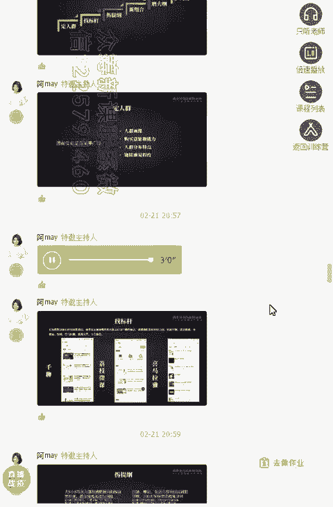

成立起来之后呢，你就把这个些标杆进行拆解。比如说呃你说的减肥的课程，那你看唉有一些讲师讲呃有些讲师就是讲怎么吃的，怎么吃减肥的。有些人想怎么运动减肥的是吧？你就把这些呢进行归类。

把它的大纲全部拆下来归类，分成几个大的模块，把这些大的模块拆出来，拆成模块之后呢，你就会发现嗯，你自己因为你自己在这行业里边，你自己也有自己的理解嘛，再根据自己的理解。

用这个呃不同的这个提纲重新去做转合组合。因为你提取了很多课程大纲了。你把这课程大纲打散之后，分在不同的模块下方，然后呢，把这些模块去精简，然后呢或者。或者去删去重复的，或者说合并进事项。

然后再把这些精简后的这个模块进行分类。比如说呃第一层、第二层、第三层这样的进行分类。分类完之后呢，你就开始自己再去梳理一下。嗯，很快通过这样的新组合一合你的这个课程大纲可能就可以了，就可以做出来了。

做出大纲之后呢，你还要去磨大纲。因为。因为做出大纲之后，可能你的大纲并不够有吸引力。呃，可能真正拿到市场去投放的时候，有可能别人还是觉得不够。所以你要去磨，怎么磨呢？最重要一个点就是去场景化。

比如说我举个例子哈，什么叫场景化，就是看学photoshop的学PS的人，你看以前的PS的这个老师啊，他讲的那个PS的课程大纲就会教你他是从老师的角度出发的，就从供应端的角度出发的。

他会教你呃怎么去弄那个画布，怎么去做工作区，呃，怎么去打开常规的文件，怎么去做动图啊，这些就会发现很复杂，很痛苦，看不懂他不知道大纲讲的是什么。因为他根本就不不认识嘛。

但是呢阿和老师他做的一个一套这个PS的课程大纲。你看一下右边的这个大纲哈，你就会发现他的大纲是有场景化的。他真正把用户的需求放在第一位，而不是把老师的知实放在第一步。真根据用户的需求，把大纲磨出来。

比如说。他本来呢是要教别人去怎么抠图，怎么去进行图片的呃合并的。他就用这么一个句话去告诉大家，就学会这一招，让你和明星轻易合影。

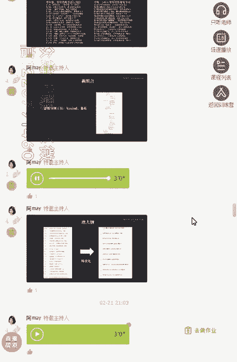

就告诉别人，哎，其实对于用户来说，他要解决的是日常生活的需求是吧？他学 photos度时实际上是要解合需求的。所以你去磨大纲的时候，从你的需求出发，把你的需求，把用户的需求放在第一位。

从用户解决用户需求的角度去写大纲，这是最重要的。还有啊就是比如说。你的你你看这个PSPS很多人去学那个呃抠图以及换那个底图的时候。好多老师写的大纲跟阿和老师写的大纲相比。

你就会发现阿和老师写的大纲一下子戳中你的心。因为很多人想要换证件照，他就告诉你，你学会这个之后呢，你的证件照蓝底红白底可以随心换，一下子就告诉你唉，这个是可以达到什么样的呃这个目标的。

一下子是让你知道哎学了这个课，我可以掌握到什么。所以从大纲也好，从我们后面要报的，从我们后面要去做海报的这个海报的文案也好，实际上最重要的就是从用户的角度出发，告诉大家，你能够获得什么。

而不是说我给你什么，而是你收获什么，这是最重要的。做完大纲之后呢，你还要去做调研，真正去问一些真正的客户或者用户告诉他哎，我做这样一门课，你觉得呃够不够吸引人呢？如果我收费这么多钱呃，你觉得你会购买吗？

啊，去做一些这样的调研。真正的客户会给你意见。另外的话我之前上二和私房课的时候，二和二和我老师呢其实也给出了一个质检报表出来告诉大家就是好的课程是有哪几个标准的。然后呢。好的，课程大纲你有哪些标准的？

我我给到这个质检表表给到大家，大家呢可以根据这个质检表去检查一下自己做的课程的标题呀，还有自己做的课程的大纲啊，呃，是不是已经按照这样的方式去做了，可以根据这样的表格去做自己检查。其实做完大纲之后。

你再根据大纲去开发你的课程内容就很简单了。那其实很多人呢其实做一门课程最重要的还是因为大纲没出来，就导致说你其实真正的课程还是没有完整做出来。你只要做出大纲之后，你去开发，接下就去录课嘛。

那如果说你是想做内容分发的话，你就最好是用视频的方式去录课。那视频的方式录课。比如说会有一些工具，比如说EV录屏啊这样的工具。呃，后面我们会整理一个工具的大全给到大家告诉他告诉大家。

比如说我要做呃这个写作有哪些写作的好用的工具。比如说AI的写作的工具，或者说帮你起标题的灵感的工具。呃，第二个做图图片，比如说公众号的头图啊，还有海报呀，呃，要有哪些图片的模板是比较好用的呃。

这些我们都会整理给到大家，包括比如说像直播的工具，其实我们以前用签聊都一直觉得挺好的。可能这次呢是因为这个。

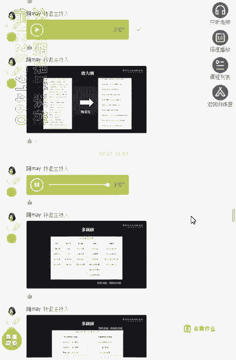

疫情的情况用的人很多，所以导致比较卡。比如说这个做录课的时候会有很多平台，比如说荔枝微课、小儿童千聊，呃，还有很多像像短书啊这样的平台都有录课的功能。那哪一种平台是合适你的人？作为个人讲师来说。

我更喜我我用哪个平台性价比更高。这些工具都会给到大家的。好，那讲完第二部分之后，我们来进入第三部分。Yeah。怎么做好社群的内容运营？啊？呃其实呢呃我们见过市面上非常多的做社群的人。

其实实际上做社群都是为了最后去做销售。呃，实际上呢我们会发现现在很多做社群的人说是社群，实际上都不是社社群，你会看到很多那种做社交电商的呀。还有很多的有还有很多人其实拉了个群，就是在里面发广告。

就是在里面一直发产品，一直发产品，一直发优惠券。这种方式非常的粗暴。但实际上你会发现他其实转化率是非常低的。就把社群把自这个微信群搭成非常简单的一个韭菜。呃，根本就没有花时间在关系的培养和内容的运营上。

所以效果自然就不好了。呃，你要做社群运营的话，实际上你知道呃组建社群很容易，但是活跃很难。实际上优质的内容是可以给到用户一个呃最好不离开或者说活跃的一个理由的。你通过不断的策划打磨优质的社群内容。

不断的给社群成员产生价值，就可以保持他对这个社群的吸引力呃，你自己可以想一想嘛，那些你一直关注的群，为什么要去关注呢？是不是因为呃这个社群是有温度的，或者可以给你产生呃价值的。那么一般来说呢。

你要去做好这个社群的内容运营，很多人就会觉得哎我是不是要做很多的分享啊，呃，是不是很难啊？实际上呃也并不是呃我其实有非常简单的方式。所以呢今天也是是想分享一些我自己觉得比较简单的方式分享给大家。

比如说像呃社群运营的过程当中，我觉得客户其实是有三大需求的。这个三大需求之前也跟大家说过，第一个呢是进一个社群，无非就是想要获取最新的资讯，了解这个行业的资讯，第二个的话想要学习成长嘛。

第三个的话就是想链接人脉嘛，是吧？所以只要你其实能够满足这三大需求，基本上的一的社群。呃，只要满足一个需求，人家都不会离开啊，那怎么去做呢？其实最好的方法，还是模仿加微创新。

第一个呢就是找到你心目中觉得呃你经常关注的社群，你去猜他是怎么运营的，找标杆。

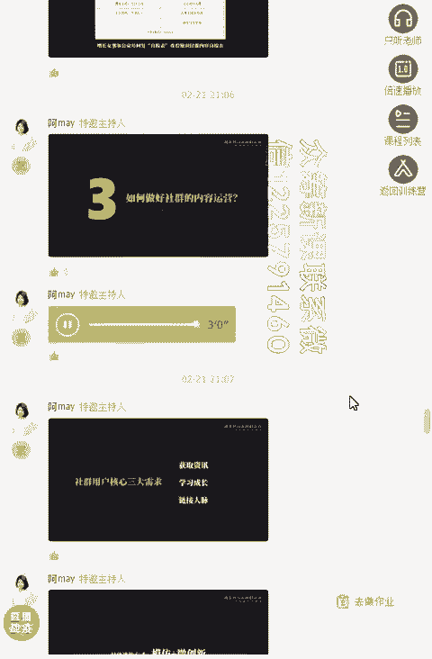

呃，现在的话就是我截了几个图啊，就是我可以呃发发一些就是现在市面上一直都在做的社群。我这我这我比较关注这三个社群，刚才有个朋友在群里面呃，直接问呃，我可不可以把我加入社群，用文字打出来。

我加入的这三个社群，就是这三个。第一个是群享。你看他群享的会员权益就可以看得到它其实运营逻辑的。第一个圈子嘛就社群运营嘛。第二个资源对接嘛，第三个是什么？就用一个天然小程序把群成员的资料全部收集起来。

当然自己如果不会开发小程序的话，你用我们的群勾搭小程序也可以实现把群成员的这个呃资料全部收集来这么一个目的。第二个的话就是什么高频高质量的线上线下的内容，就是组织，比如是线下的群享的大会啊。

线下的闭门会议，还有线上的这个操盘手的分享啊。另外的话就是干货的给到大家。就干货的资料可以给到大家讲。所以你看到看到的权益就是可以看到它的运营节奏了。第二个的话，生材有数。

身材有数的介绍其实也有把它的运营呃节奏说出来。比如说他固定有专栏，比如说第一个周一会有一个倾享，分享一个小技巧。周周周二周三的话会请一个合伙人来进行分享，分享，他是怎么赚钱的。周五的话一起参赚美元。

就是分享，只是国外有人是怎么赚钱的，然后呢会有一些活动，比如说去实操的活动，还有一些资源对接，就是做资源对接，比如说专人的对接啊，快闪群的对接，还有一些线下的活动，就发现别人是怎么运营的一个社群的。

基本上都是固定的这几个栏目。实际上你只需要坚持去做就不难。还有现丰的深度呃这个每日运营。案例库的这个你就会发现他的这个运营是什么？第一个鼓励大家去分享，它是UGC的这个模式，鼓励大家去分享。

超过赞就会打赏，对吧？第二个的话是呃会帮你去精设精华，帮你去曝光。第三个的话就是IP帮你去推做推荐，帮你链接人脉。然后呢，答疑呃，每周一思。Yes。这么一个运营动作。

你就发现当你自己不知道怎么去运营的时候，你就去拆解别人是怎么运营的，自然你就可以找到很多运营的思路了。那怎么去做社群的内容营销呢？我把这个内容的社群营销我分成三个板块。第一个板块呢是自己去输出。

其实社群的内容输出啊，我觉得是呃有有有很多很巧的方式的。第一种的话就是自己提供资讯。这种资讯呢，就不一定是原创了资讯嘛，其实就是讲究就是整理收集，你就去关注很多你这个行业的公众号。

或者关注你各行业的这些呃相关的新闻网站之类的，就可以快速获得很多的资讯，你就可以把这些资讯全部分享，就是做一个分享梳理，比如每日就更新一些资讯。第二个的话就是固定的栏目。比如说你固定每周呃。

我我是固定每周必定会分享三次。那我固定的栏目就是呃最新的这个刷屏的案例的拆解是吧？第二个的话，营销思路，一一个值得参考的营销思路，就是我自己的一些固定的栏目。

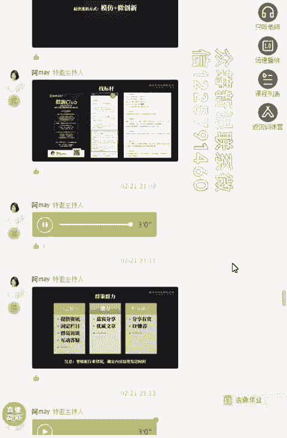

自己也可以去想一想，你在你这个行业里边可以有哪些固定的栏目。第三点呢就是进行群成员的访谈了。因为你群成员里边一般都是你这个行业的人，他必定是在某些地方呢做的牛逼的地方，那就可以进行牛人的采访啊。

把他的经验进行分享出来，就是一个内容了吗？第四点呢就是互动的问答。呃，定时的收集大家的问题，然后再进行回答。就是我们刚才说的什么，100问100答。100问100答。

那这样的话就是呃呃就可以把输出的这个栏目给定下来了。第二个呢就是借力。呃，社群的内容并不一定全部是自己原创的内容。呃，比如说你去邀请嘉宾来做分享，那借嘉宾的力嘛。第二个的话就是你看到一些优质的文章。

你就可以把优质的文章去分享到群里面，那也是给大家提供最新最好的干货资料资料啊，所以借力也是一个很好的方式。第三个呢是借助群员自己的力量，就是我们要群测群里哈，就借助群员的输出。

就比如说群员输出的时候就会打赏。第二个的话，给他一些好处。比如说帮他去推荐。那他也是很乐意去说输出的。像今天我在群里面，我去设立了一个积分的奖励有谁在我们的社群里面在我们的群里面去提跟一个非常好的问题。

或者分享你很好的笔记。分享你的干货呃，或者我觉得是回答了群群其他群友的一些问题。只要你在这个社群里面做奉献，我就可以给你加积分。当然，加积分有什么奖赏啊？这个奖赏我可以分类别去去去做奖赏。

那肯定是惊喜哈，给大家亲惊喜啊。呃，所以你可以通过这样的这个激励的手段呃去鼓励群成员去输出，把这个群成员的自运营的一个氛围建立起来。呃，不过呢不同行业这个内容发送时间是不一样的。所以有一点需要注意的。

就是你的内容最好是呃根据你的行业情况来确定。比如说像餐饮行业，他可能最佳的餐发送内容呃，比如说活动的内容时间它可能就是呃呃早上的10点半呃出内容，然后呢，告诉大家要定外卖。哎。

这样的内容就促使大家去订餐嘛，是吧？所以要根据你自己的这个行业的情况来来制定内容。

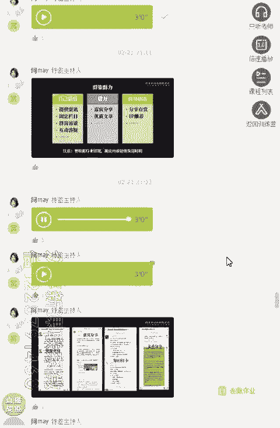

还有一些就是呃像线下的一个餐饮，希望大家去堂食的，可能就是网上要大家过来堂食。所以你可能早晚上的时候呃，五六点的时候就发内容会促使大家来订餐啊。所以要根据你自己的这个行业的情况，也多去测试，去调研。

真确定下来你这个社群的最佳这个内容的这个关键点。另外的话，在社群里面全部传递内容啊，其实我给大家说一个小技巧，很多人喜欢用语音的方式去输出。另外呢我刚才说不是有一些优质的文章吗？

直接在社群里面分呃发文章。实际上最好的方式，你是把优质文章里面的一些内容直接用文字版的方式复制出来之后呢，做几个几段的分享之后呢，再去把内容这个链接发出来，效果会更好。而且呢直接发那个语音也不好。

因为发语音不直观。人家根本就不知道你讲什么。如果除非说你这个人本身带大家的人，你就觉得是牛人，他讲的东西，我一定去听，我会点开语音去听。否则的话，一般人不会点开语音去听，你就会发现你讲一大堆没用。

所以我是建议大家就是如果在社群里面去做内容的运营，除非我们说固定的栏目。比如说我固定说今天就要邀请一个嘉宾来做分享语音的方式去做分享。否则的话。

建议大家一定是用文字加图片的方式去去传播文字和图片呢尽量是一段一段的发，不要一下子一堆人家看不过来，一段一段的发。下面呢我也给大家看一些案例，就是比如说我们说的一个资源对接是怎么去对接的那资源对接。

你就是去收集这这个人有什么资源，然后呢，可能要做一些小卡片，然后呢，不是直接把卡片发到群里面就可以了，要用文字的方式告诉大家啊。第二个就是嘉宾的分享，尽量用文字的方式去做分享。

因为文字的方式可以有内容的复用性。如果只是语音，那很难去做复用性是吧？还有什么内容啊？就是做一些固定的栏目。比如说每日让大家去打卡啊，还有文章的分享啊，这些就是已经是社群的内容的这个分享了啊。

我我我我觉得其实最重要的就是社群里面跪在坚持两次，就是能能持续去做，这个是最重最重要的啊，好，那通过下面的这个讲解呢。我其实我今天的内容已经分享完了，我我不知道今天的内容分享完之后，对你有没有启发。

另外的话我自己真的觉得做内容的这个坚持是这样的。一开始你会觉得很累，很辛苦，就包括我刚开始的时候，我想500次，天哪，我每天都感觉好好急躁。我就是啊天哪，又要100块钱啊，就想了啊100块钱还是挺痛的。

是吧？所以呢就想啊还是可以去写了，那写什么呢？就很纠结很纠结，所以后面我按照我的方法把我的这个。

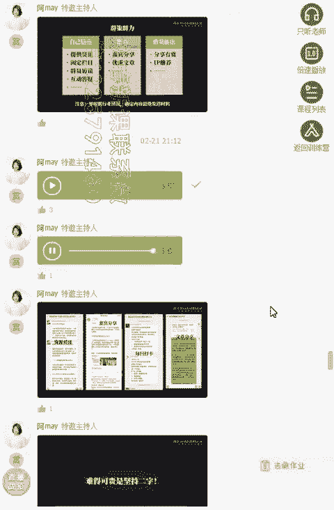

呃，知识框架输出来啊，当我找不到这个灵感和思路的时候，我就去框架里面挑一个点专门就写就可以了。所以刚开始的时候你会觉得写的好难好难，后面你会写哎，500字很容易。我现在我现在十0分钟我就可以写完了。

所以其实你是会越来越来越容易的，越来越容易的，一定要坚持去写啊，这是才这才是最重要的。呃。那今天呢给到大家的一个任务是什么呢？就是给到大家的实操任务。

第一个呢是去我的公众号回复质检表来查看这是付费的内容质检表。第二个呢是。第二个呢是回复案例这个字呃，查看问答类的参考案例。呃，抱歉，我这个案例还没有放上去，晚一点我整理好再放上去。

大家可以晚一点再去回复。呃。然后实操任务是什么呢？就是根据我们今天的课程内容，我以直我给出来的优秀超卡操卡案超参考案例。然后呢自己去写500字的图文的内容。

并且把这500字的图文内容拍摄成一条短视频放上放放到这个抖音上面截图。发到我们作业本里啊，这是我们今天交代大家的训练的任务。下节课呢呃我就开始给大家去做分享，就是怎么去做裂变了。

因为这个内容一定就是大家一直都在问，就是前面其实都是铺垫。呃，包括我们说怎么去设立产品产品体系怎么去呃做个人品牌怎么去做这个内容其实都是铺垫。那铺垫完了之后，我们就要去做用户裂变。

因为我觉得就是呃你懂得裂变，可以把你的宣传以及你的个人品牌这个有这个流量放大很多倍。所以呃下周一开始我就会给大家去分享裂变相关的内容，我会挑出现在目前比较有效的四种裂变方案，给大家深度去做解析。

并且告诉大家整个裂变的路径是怎么做的，用到什么样的工具。呃，周日呢。今天是周五嘛，明天是实操哈，周六是做实操。那周日呢会有一个超级的大咖给大家去做分享，就是我邀请了我的好朋友，那边是创业的作者钟艺。

现在呢他也是混动大学广州分社的社长也是分你的科技的创始人，并且现在呢还出了一本新书叫非对称思维。呃，反正就是非常牛逼的一个朋友啊，他其实在2014年还跟马云雷军呃，一同被评为中国的这个营销一百强呢？呃。

他会给大家分享什么内容呢？他会分享他是如何通过个人IP的影响力来打造事业人生非对称的竞争优势的，他会给大家去分享他是怎么从一个工厂的小蓝板变成现在这个样子的。呃，我看过他的APP啊，内容非常的精彩啊。

大家一定不要错过，在周日的晚上，他会给大家去带来分享。

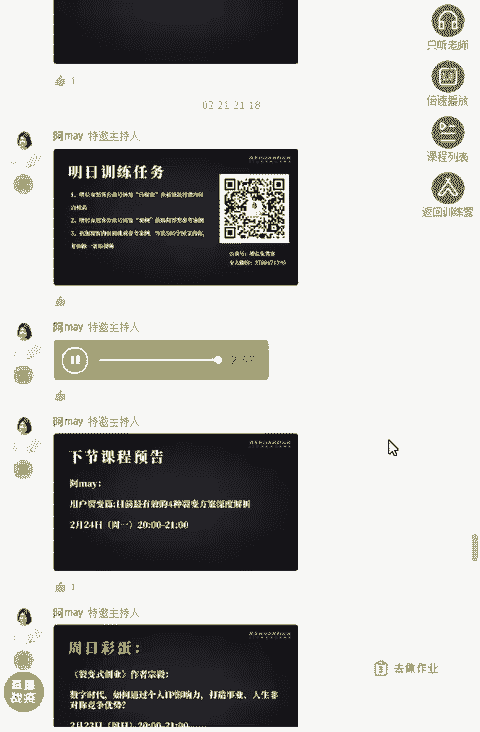

好，那今天的分享就到这里了。嗯，接下来是我们的互动答疑时间，大家有什么问题可以积积极在我们的这个评论区进行提问。

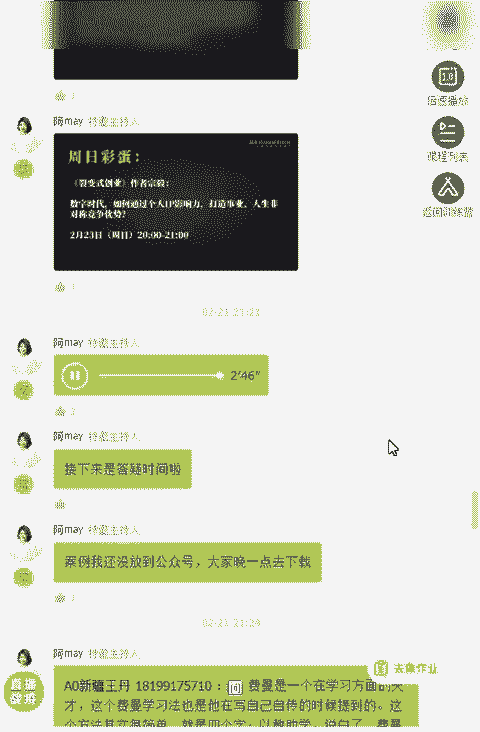

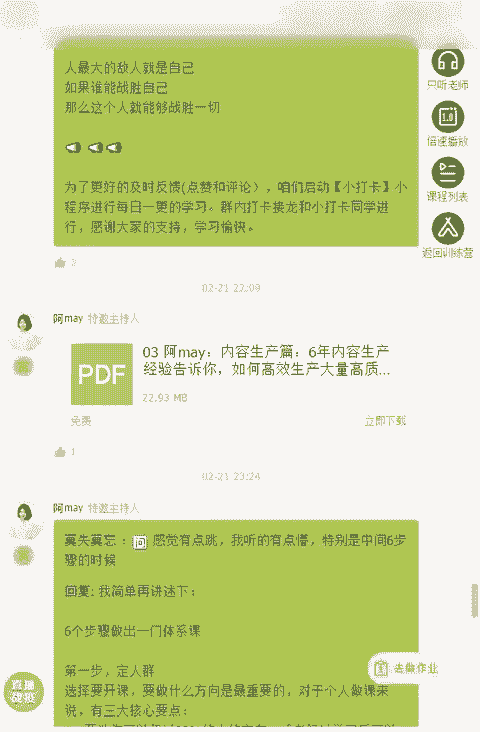