# 微社群裂变营销私域流量池增长秘籍创业运营销售获客视频课教程 合集 8套 374资料 13.1G 定位策略篇：一套让用户自动找上门来的营销方案 - P4：【Day07】牛人彩蛋：《裂变式创业》作者宗毅：数字时代，如何通过个人IP影响力，打造非对称竞争优势 - 高端网创试错赚钱大师 - BV1tn4y1X7Sv

各位同学，大家晚上好，欢迎来到21天获客成交实操营的周日的晚上，今天晚上真的非常非常荣幸哈，能够邀请到钟艺老师来给大家去做分享。😊。

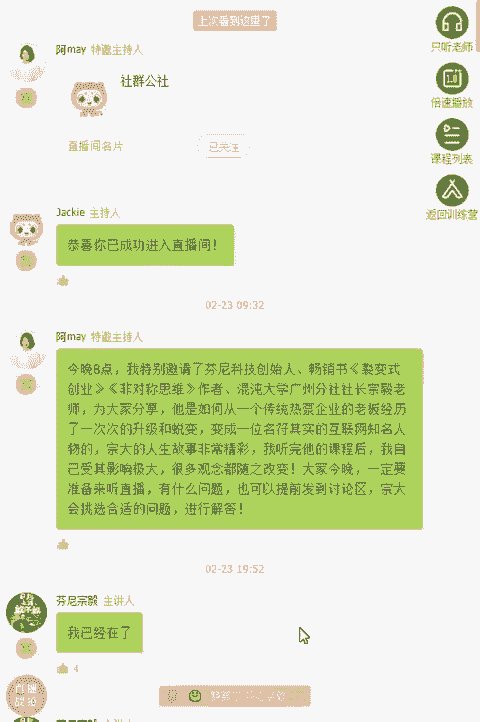

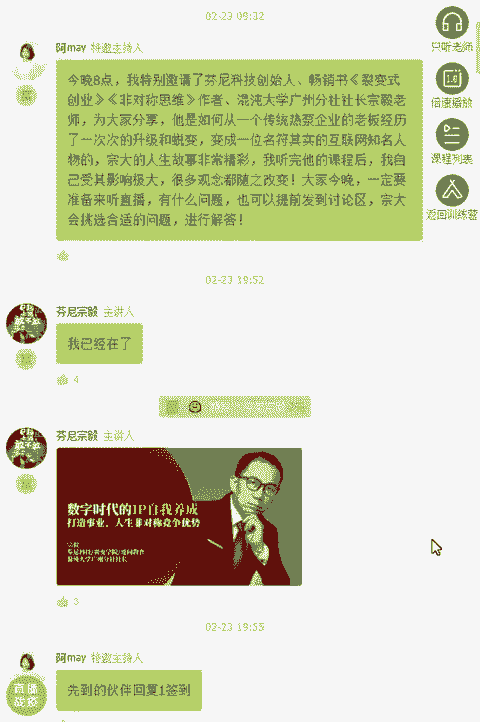

哦。先到的同学可以在评论区回复一签到我们的分享准时8点开始。大家今天晚上听课的过程当中呢，如果对个人品牌有什么问题，都可以在评论区呃提出你的问题。我们在老师分享之后呢，会有一个呃互动答疑的时间。

老师会突然挑选你的问题进行回答。

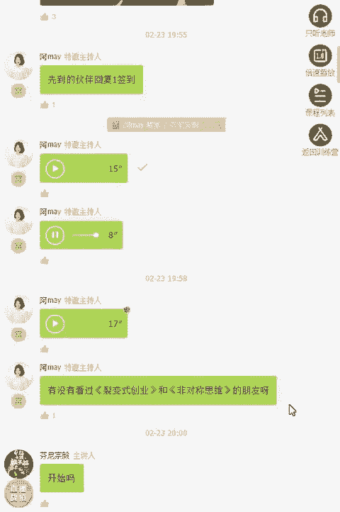

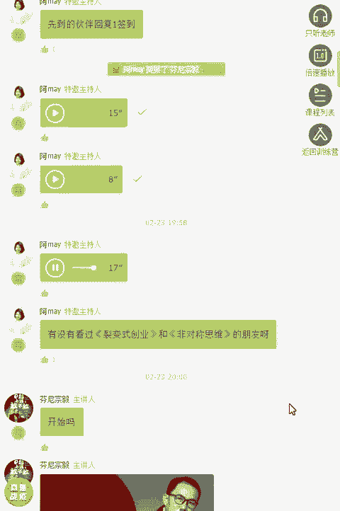

今天晚上真的非常非常荣幸能够邀请到中艺老师老师来到我们的直播间。中艺老师呢是芬尼科技的创始人和CEO，并且呢他写了两本畅销书，一本呢是那变式创业，一本是非对称思维，不知道咱们的学员里面有谁有看过。😊。

朱老师是传统企业转型互联网最成功的企业家哈。他在呃2014年被美国最有影响力的商业杂志评选为2014中国创意人物一百强和马云雷军都是同时被评一起评奖的。他呢先后裂变了现在是20多家裂变公司了。

所以呢他以一直之力打通了整个中国这个贯穿南北的电动车充电之路，呃，也发起了互联网大鹏车的公益活动。所以呢他有很多很多的故事。呃，真的我觉得他有一条信条，让我特别特别的佩服。

就是他说他一生一定要做一件很酷的事。那今天晚上呢他就会给大家去分享他是怎么去打造自己的个人品牌的。他对呃打造个。😊，品牌需要具备哪些因素，有哪些呃思考？好，那接下来我就话不多说，有请钟艺老师。

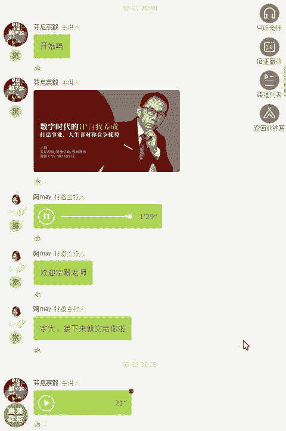

大家好，我我是分尼科技创始人综艺啊，也是列维市创业的创始人。啊，今天呢很荣幸应MA的这个邀请来跟大家讲一讲呃IP养成啊，尤其是我们有至于把企业做大的朋友们呃，去怎么样做个人品牌。呃。

今天我的这个讲法呢可能会跟很多人不太一样啊。呃因为其实有很多课程讲这个呃要用什么工具啦，呃怎么样来定位了，去打造一个人啊，但是我觉得呢呃打造IP呢其实最关键还是他的个人的内涵。呃个人的素养呃。

和他自己呃所成就的一些事情啊，这些实实在在的事情呢才能够长久的去塑造1个IP，我相信谁都不希望呃塑造1个IP呢，只是昙花一现，像流星一样啊，那个呢其实没什么意义。

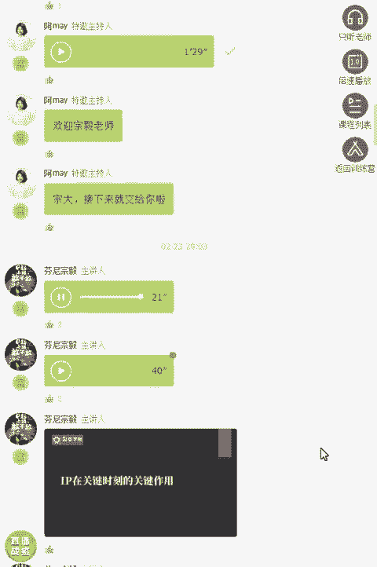

今天呢我想从这个。

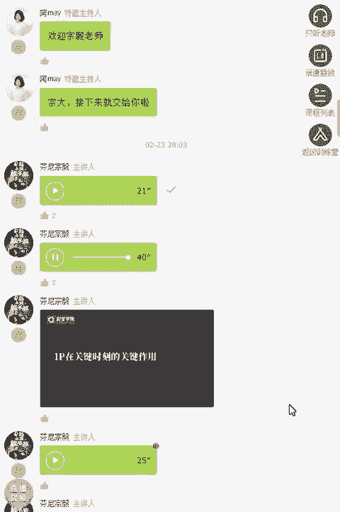

呃，在IP的关键时候的关键作用开始讲起。嗯，大家知道最近呢是这个呃。呃，这个sars啊新冠肺炎啊，所以在这个时候呢，其实呃大家想一想呃目前大家最受关注的IP都有谁？对，一定是他们两个哎。

他们两位都是咱们中国的工程员院士。

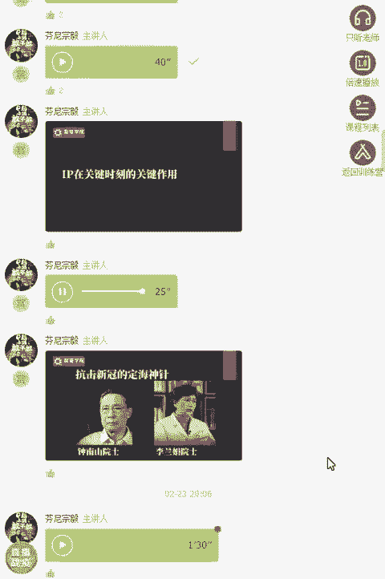

呃，一个是钟钟南山院士，一个是李兰娟院士。啊，其实大家看到没有？他们两位呢，其实在咱们这个新冠肺炎的过程中呢，起到了这个定海神针的作用。哎，在这个钟院士去到武汉之前呢，其实大家处于一种这个迷茫的状态。

也搞不清发生了什么事情，也不知道呃应该会怎么样。啊，所以说其实处于非常恐慌的状态。但是你发觉没有，当钟院士到达武汉以后，其实他发出的声音啊，立刻让大家知道。这个方向是怎么样的？还有李丹军院士啊。

到了武汉以后啊，他提出了要立刻封城的这个建议。就大家想想，封城这件事情，其实在建国这么多年，从来没有试到过啊，所以说其实对呃国民经济的影响是特别特别大的啊。你想想作为一般的人，怎么敢提这个建议啊。

即使提了，我相信也很难得到执行。啊，但是他们两位的建议，为什么得到了咱们呃中央和省市政府的这个执行？就是因为他们是大IP，他们说的话是非常有分量的啊，而且呢。成就他们成为IP的也是在这种大事件中间呃。

敢于说真话啊，真正的把这个国家和人民的利益放在第一位啊，是实实在在的真正能做事的人啊，这个叫做IP大家其实看看就是说呃因为我是做企业的。哎，所以我举的案例呢呃大部分呢也是企业级的案例。啊。

这些伟大的公司呢其实呃很多啊都是呃有IP的，尤其是在在这个时代哎，大家去看一看。

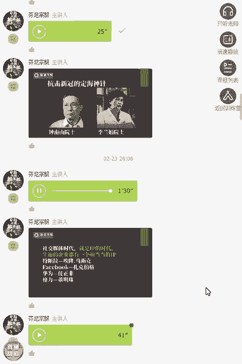

最有最有名的是吧，一龙马斯克哎，他创造了特斯拉创造了。spaceX创造了这个高铁啊这样的公司。所以说呢他在这个创业者和企业家心目中呢，实际上是天神级的人物。清。

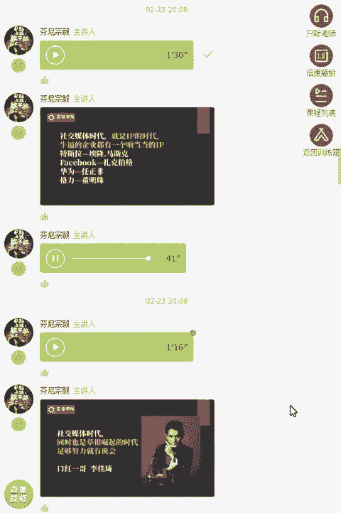

Yeah。啊，再比如说这个facebook的扎普狗格是吧，它都专门有一个电影啊，就叫。

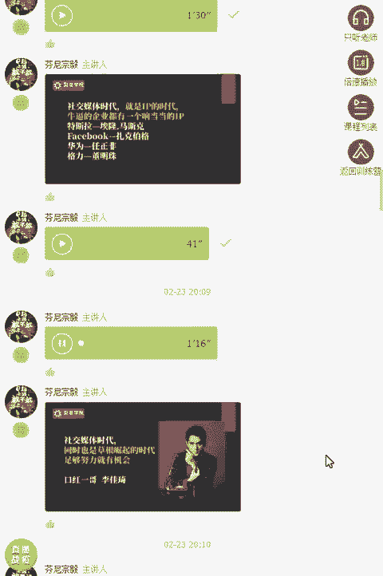

这个呃我印象就叫脸叔啊，还有咱们华为的任正飞是吧？格力空调的董大姐。哎，大家看到这些企业背后其实都是哎呃非常个呃非常大的个人IP在背后撑着啊，所以大家想一想，如果你想去做空调这个行业。啊。

如果你遇到了呃董大姐。其实你很难跟他竞争是吧？你就算投啊十几亿的广告，恐怕也没有他一篇文章管用啊，那这个其实就是IP的力量啊。我有一次听华为的一个副老总讲课，他说我们华为的手机为什么可以定位高端啊。

作为一个国产品牌？其实这个是难度非常大的。但是他说你想一想，如果你作为一个企业家。你如果不想用苹果手机，那你还有什么好选的呢？对吧？因为企业家很多人都是呃学华为的管理思想啊，学习华为啊，这样出身的哎。

所以说呢华为做手机，那自然能够把品牌定位高端。那其他的品牌，虽然手机可能做的也不错。但是你想定位到华为这个定价那难度是非常非常。这里还有一个呃李佳琦，对吧？这个是最近的呃超级网红啊，那很多人把它叫网红。

但是呢我觉得其实他也非常不容易啊，大家去了解一下他的历史。他以前站柜台的时候，真正的是能够把美妆这个产品做的非常非常的透啊，所以说呢啊我想展示李佳琦的意思就是告诉大家，在这个时代啊，社交媒体的时代啊。

就算你是呃非常呃这个草根的出身一样可以成为大IP啊，为什么呢？因为在今天。

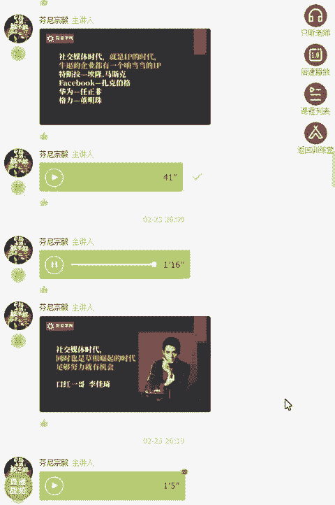

所有人都可以发出声音。啊，这个跟以前有特别特别大的区别啊，如果说2011年以前你要想发出声音，那你肯定要在央视投广告啊。那个成本呃，如果你不是好的企业，其实是很难承受的啊，但是在今天不是了啊。

有抖音啊这样的工具啊，所以说呢其实所有的人只要你的内容好，只要你的故事励志啊，你都是有可能成为IP的。

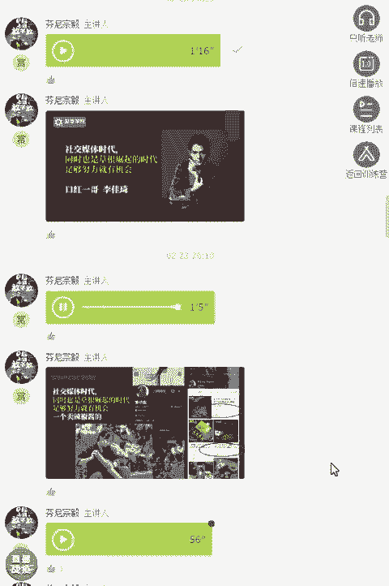

这个姐姐呢叫李子柒。他呢自己打造的这个呃食品的品牌是吧？比如说他有一瓶辣椒酱呢可以卖到三十几块钱啊，大家想一想这个老干妈才卖多少钱是吧？而且老干妈还要经过渠道啊。

所以说他呢就通过拍平时自己的这个呃劳动和生活啊，这些照啊，和这个当然他也是美女啊啊就打造出这样一个品牌。当是他的产品也不错啊，所以我告诉大家呢，啊在这个时代关键是你把你的标签啊做好啊在。

一个长板上特别的突出，你就啊有可能成为IP啊，成为IP的商业价值是非常非常大的啊，你们看一下李子柒的这个。这个这个粉丝的数量有多少啊，几千万是吧？就算几个粉丝帮他买一瓶辣椒酱，哎，那也是不得了的事情。

所以我现在才定义一下什么叫IP。

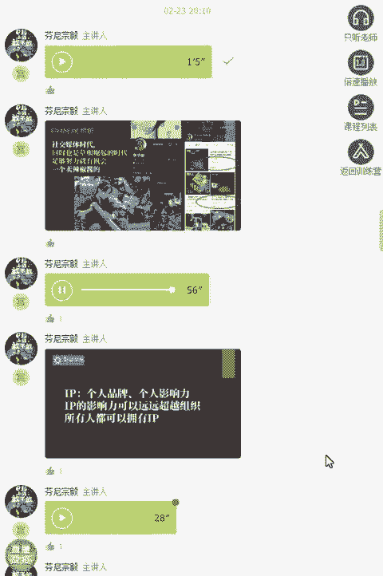

IP就是个人品牌哎，个人影响力。啊，IP的影响力可以远远超越组织，大家一记一定要记住，个人影响力其实是可以远远超越组织的。而且呢在这个时代，所有人都有机会哎，创造自己的个人品牌。哎。

创造出来个人品牌以后啊，其实它的商业价值是非常巨大的哎，不管是成就公司还是成就。

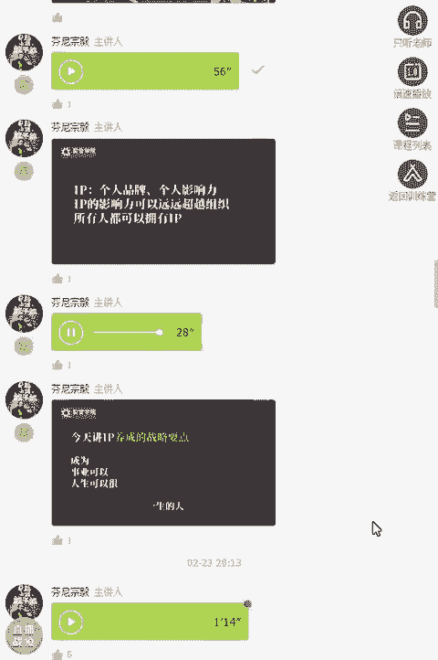

今天呢我主要讲这个呃IP的养成的战略要点是吧？呃，成为IP的人生呢，事业可以事半功倍啊，人生呢也可以很精彩。啊，但是呢他对你的个人生活呢肯定也是有一些影响的啊，是吧？因为你可能成为名人啊。

所以你平时的这个言行举止呢，都会受到一定的局限。啊啊，所以说我说IP呢其实是只是适合于那些拒绝平庸一生的人啊，那如果你说我想作为一个普通人，怎么样成为IP啊，因为我呢讲课比较多啊，经常有人会跟我说啊。

那我作为一个普通人，我应该怎么怎么办啊，那我应该作为一个普通人，我应该怎么样成就我自己的事业啊我作为一个普通人，我应该怎么样成为1个IP。我觉得。当是我说的不一定对啊不对，大家指正啊。

我觉得如果你只想做一个普通人，那你就做一个普通人算了啊，你也不要想成为IP那是不可能的啊，所以说呢想成为IP呢，其实你不能够是太普通的一生啊，所以说我若是拒绝那些。平庸的人啊，这个是做IP的这个前提。

所以IP的第一个要点。做成一个牛逼的事业。啊，或者是做成一个牛逼的事情也行啊，这个是特别要注意的。哎，大家看看我前面举的那些案例，不管他是企业家还是个人IP，其他们做成的事儿都挺牛逼的啊。

甚至我觉得这些个人IP做成的事情更加让人不可思议，是吧？你说华为可以做个大事，这个大家都能够理解啊，特斯拉可以做个大事儿，大家都可以理解。但是一个卖辣椒酱的，也能做个大事啊，这个大家不太容易理解啊。

所以说呃最关键还是要做成一个牛逼的事儿那很多人呢什么都没做，平白无故的就是说我要打造IP啊，那个我觉得很难啊，你就算行了啊，可能你说的一两句话啊，特别牛逼啊，但是呢那也就是昙话一现是吧？啊。

所以说事儿没做好啊，就想打造IP可能就会本末倒置啊，原来我有一个同学。呃呃，号称要打造一个特别牛逼的这个餐饮啊，然后呢。后来呢其实餐饮做的不太好呃，然后呢但但是呢花了太多的精力去做宣传，呃。

名声做的特别特别大。但是后来你会发觉呃这个名不符实以后呢，其实呢消失的也非常非常的快啊，这个是我给大家的这个建议，就是千万不要本末倒置，是吧？呃，如果是公司的话呢，我建议大家要建立强大的团队啊。

比如说你在外面打造个人品牌，但你的公司后面的后台，你的团队一定要强啊，团队要做好啊，是吧？那你在外面讲就没有问题的。就像我们马爸爸啊大量的这些讲演是吧？大家特别幸福，但是大家要想一想。

如果阿里巴巴做不好啊，如果淘宝做不好，如果支付宝不是很牛逼啊，他在外面说什么是吧？所以说呢最重要最重要的事先把事儿做好啊，不管是事业还是实践。嗯。

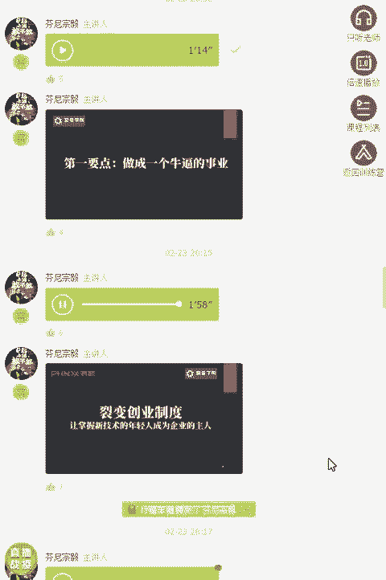

今天阿妹呢叫我多举一些案例啊，所以说呢我觉得呃以我个人来说呢，其实呢我从14年开始呢，就呃有这个IP的意识啊，那个时候虽然还没有大家说IP这个词啊，那个时候呢其实是罗振宇老师提出的这个魅力人格体。啊。

所以说其实我觉得呃我这个过去这些年呢做的事情可能最大的一件事情呢就是那边是创业制度啊，我不光是分尼的创始人，我利用分级科技啊做出了那边是创业的这样一个制度啊。

那边是创业呢其实就是让年轻人啊成为企业的主人。而且他们要投资啊去成为企业的股东来创造一个一个的新企业。所以为什么分尼科技就裂变了十几家公司？呃，我旗下的呃所有的企业加起来呢列变了有20多家公司。

其实也成就了很多年轻人啊，不光是一些创业的带头人，还有他们的团队啊这个制度呢。后来呢其实成为了好多商学院的案例是吧？比如说我毕业的中国国际工商学院，还有马爸爸成立的湖畔大学。

也是把那边式创维作为第一个案例。呃，包括华南理工啊，其实中大呀，有很多很多的大学呃，都在用这个做案例呃，像这个呃樊正老师的读书会是吧？也有呃把我的那边式创业呃。

作为这个他的呃一本重要的创业类的书籍来讲给大家听。哎，所以最后的影响呢还是比较大。那边是创业呢，其实啊就是通过竞选制度是吧？这张照片呢站在我右手边的这个小伙子呢呃是我们这个物联网公司的创始人。呃。

他在2017年上任的时候呢，实际上只有30岁左右啊，他以前呢也并不是说呃这个呃做做过企业，他只是我们的海外部的这个大区经理啊，但是在我们这边是创业的制度下呢，他也能够成就自己的梦想。

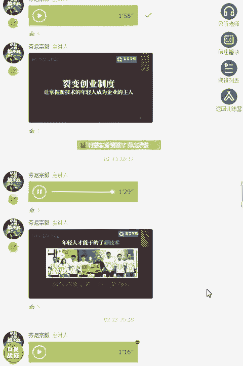

啊，所以那边是创业制度呢，其实创造了一个大平台小公司的这样一个模型啊，所有有理想的年轻人都可以在我们这个平台上创业。然后呢，他需要做的事情就是把产品做好啊，公司提供了很多好的这个基础是吧？

比如说呃制造系统啊，质量管理系统人力资源系统啊，财务管理系统啊，所以说呢其实作为一个创业者来说呢？他不像普通的独立创业者需要是什么事情都去干啊，为什么独立创业的成功率那么那么低啊，就是因为你条件太差了。

没钱没人啊没没有这个这个后后台支持啊，但是那边是创业呢，后面有个大后台是吧？就好像阿里巴巴想成立一个什么公司啊，派一个人去做，实际上成功率一定会比你一个独立创业者要高得多啊，这个是完全一样的道理。

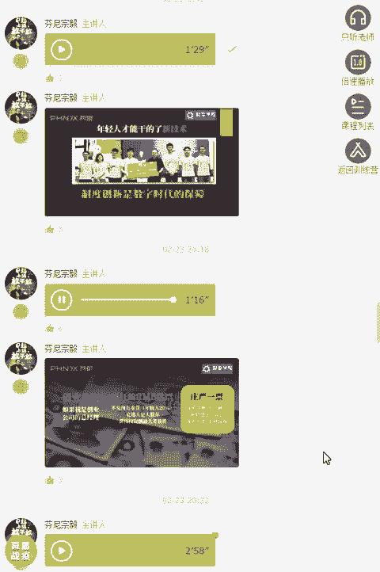

那边是创业制度里头呢，最重要的内容其实是人民币竞选。嗯，就说很多老板老是跟我讲，这个我也想学裂变式创业制度，但是我不知我们公司人才不够，我也不知道该列变什么样的项目。

其实呢这是对裂变式创业制度完全不了解的这个后果啊，呃其实你什么都不用想，是吧？只要你提供这样的制度，年轻人自己会提出来。啊，那我们应该做什么？啊，那这时候呢到底叫谁来做呢？那我们是通过竞选的方式。啊。

这个方式呢实际上是2010年产生的啊，当时呢我们的那边创业制度已经用了4年。在这之前，所有的创业总经理都是我来选定的。但是10年呢，我们当时要做互联网营销啊，做品牌。这比我原来成立的公司的难度要大得多。

啊，在以前都是供应链公司。所以当时其实我花了两个月的时间，我也没选出谁能够成为这个公司的总经理。因为我是传统制造业出身，我周围的这些老臣子其实都是搞工厂的哎，都不太善于。啊，应该是完全不不懂互联网啊。

也不善于做这个消费端的产品。当时我想选一个年轻人呢，但是呢我也担心哎很多这个老臣子不服哎，所以后来我没办法，我就想出竞选。但是一说到竞选呢，其实所有人都担心，因为竞选。就意味着口才好的人占便宜。

那如果我们选上的人光是口才好，其他不行，哎，那肯定是不行的。所以最后我们用的是人民币进去。就是说在我们公司超过3年以上的这些资深员工都有机会成为股东啊，他们参与投票。

那呢所有的员工都有机会成为这个总经理啊，只要你愿意，你就参与进去。那作为这些。选明他们要决定的是我把钱投给谁。哎，当时我们要求最少是5万块钱，最多是不限。再举个例子，比如说你手上拿着50万。

你想投资这个项目啊，14个同事，你选一个哎，要所以说右边那个黄色的选票呢，是我一辈子最大的发明，对吧？但是选票上不是填，你同意还是不同意，是填你给谁多少钱。啊，然后签上你的大名嗯，所以大家仔细想一想。

这个选票有多厉害，你会不会非常仔细的去思考谁会成为总经理？你会不会把选票投给那个只是跟你关系好啊，或者是你的领导，但是水平一般的人，你不会的，你一定会把选票投给那个真正有水平啊，道德水平没问题。

能力优秀，但是跟你关系好不好，其实无所谓的人。所以这个就是啊那便是创业。所以精髓的方法。啊，其实大道置典，就这么一个简单的方法，我们每一次都能把公司最优秀的人选出来啊，大家仔细想一想，你就明白了。

这个事情实是我一辈子最大的发明啊，这个事情呢不光成就了分你，也成就了很多很多的传统企业转型。

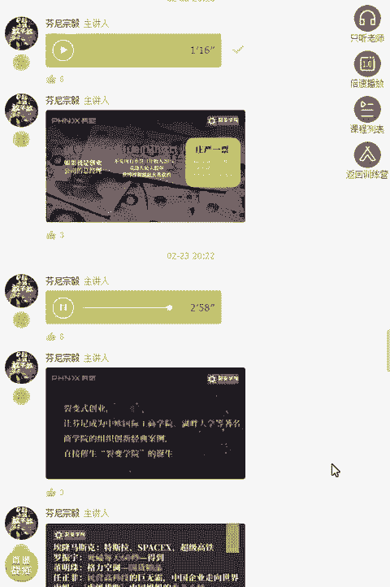

所以那边是创业呢的成功啊，成为了中欧和湖畔等的著名案例。所以这个呢同时呢对芬妮的这个宣传作用是非常非常大的，是吧？就很像说呃大家去海底捞，其实很多人都去学学服务的啊。当年我印象我我去海底捞。

是因为我看了那个海底捞，你学不会的那本书，我就直接去学服务了，而且后来还带了很多人去了好多次，是吧？最后自己也养成了去海底捞的习惯啊，其实你说海底捞的火锅与其他的火锅有多大的差距呢？我觉得其实也不是啊。

最关键是他的服务水平，啊，他的这个经营理念啊，有非常非常大的优势啊，导致它成为品牌，而且不需要怎么做广告啊。所以大家看一看我后来哎发的下一张PPT是吧？艾罗马斯克啊做了这么多厉害的事业。啊。

特斯拉kyX超级高铁啊，罗振宇呢死磕60秒哎到创造得到是吧？罗老师这个我认识他的时候，他正是他死磕60秒的时候啊，那个时候我觉得这个人真不得了，每天60秒1秒不差是吧？啊，现在我觉得他也很很厉害。

坚持20年去做他的这个这个得到每年的这个。得到新年大会是吧？啊，今年还做了这个得到的春晚。啊，所以说他是一个对自己特别特别自律的人。而且他创造了支付费这个行业是吧？那董大姐是吧。

他就是他的格力空调是国货精品。啊，所以说呢。后面都是有特别特别好的标签啊，人老爷子就不用说了啊，中国企业走向世界是吧？我在国外这个有很多著名的景点，经常能看到我们华为广告。

但是其他的中国品牌几乎是见不到的。嗯，那不一定是要企业家，你像虎妈是吧？他的这个育儿经啊，其实也变成了呃这个。呃，非常大的IP是吧？李佳琦口红一个是吧？那我呢其实呃主要是利用分析科技打造了裂边式创业。

嗯，那最近呢我又写了第二本书叫非对称思维。其实我想打造创新的教育啊，打造富诸人生的教育。所以打造IP的。

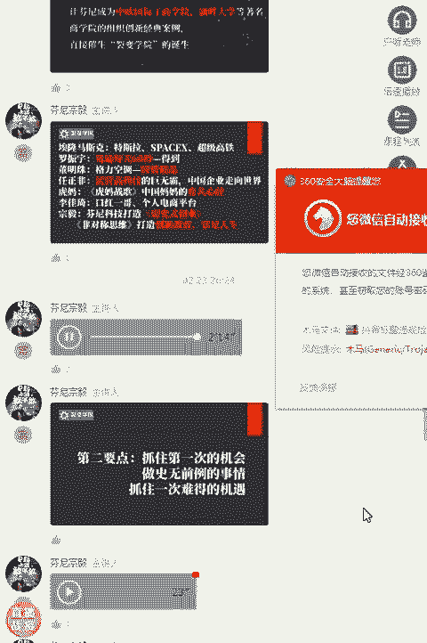

第二大要点。啊，是抓住第一次的机会，做史无前例的事情啊，或者抓住一次难得的机遇。啊，这个是特别特别关键的啊，其实呢我我也是成功的呃抓住了这个比如说特斯拉充电之路这个事情啊，所以今天呢我就大概给。

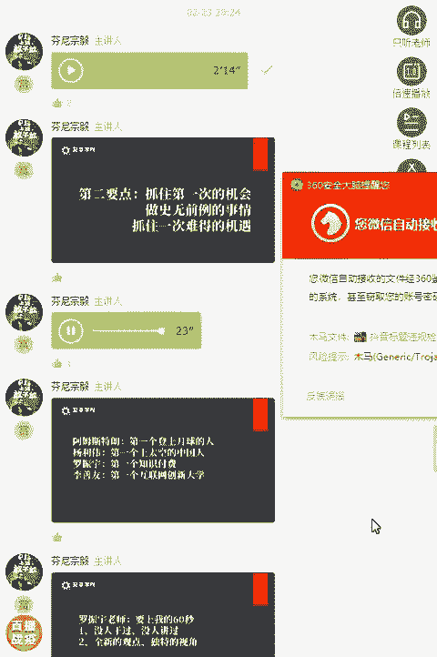

我随便写了几个例子是吧？嗯，比如说第一个登山月球的人阿姆斯朗，大家都知道，咱们中国第一个太空人杨立伟大家都知道。但是第二个太空人是谁呢？大家都不记得对吧？啊，那第一个知识付费的这个企业啊是罗振宇老师啊。

那第一个互联网创新大学，那是我们李尚友教授，对吧？啊，我记得呢我刚刚呃见到罗老师的时候呢。他就跟我讲，他做这个60秒。嗯。然后呢，后来呢，我跟他熟了以后呢，呃因为他第一次呃跟我合作呢。

其实是那个特斯拉充电之路哎，我们俩一起策划。然后呢，那一次呢，其实呃他和我共同策划这个特色化创业之路的时候呢。呃，因为他也觉得这个事情挺厉害的，就个人的力量去众筹一条充电之路是吧？啊，所以我们就做了。

但是那个时候呢，我其实并不知道罗老师内在的要求是吧？那件事情做了以后，我跟他就比较熟了。所以后来呢我说哎能不能帮我宣传一下我的分析科技是吧？这是我的事业。他说没问题，他说你找一些故事，我来帮你宣传。

结果后来我就给了他几个故事，他都说不行。后来我说那你到底要什么样的故事才行呢？他说这样我有个原则，第一个是没人干过。啊，或者没人讲过，他说你看我就是个讲故事的人啊，那我就希望讲一些新故事，新观点啊。

独特的视角。所以呢后来呢直到我给他找到一个什么呢？啊，因为当时我正在盖我的新工业园，我为了解决我们员工入托的问题，因为我们在广州相对比较偏的地方。啊，我们员工入托呢其实是个大问题啊，员工的孩子入托啊。

我就在楼顶建了一个这个有玻璃泳池的呃空中花园的这个幼儿园。哎呦他说这个事情挺牛逼的。哎，我愿意跟你讲这个事情。所以后来罗老师专门写了一篇文章，叫做每一个公司都都应该有一个空中幼儿园啊。

所以那个那个事情呢，其实后来对芬妮带来了大很大的这个呃影响。有好多这个朋友们都来参观我的幼儿园。其实有一段时间呢，他的这个影响还大过我的那面式创业啊，我也因此呢开始干了创新教育是吧？

所以后来我把我这个幼儿园呃开到社会上去了啊，然后呢我也有一些自己独特的这些课件是吧？比如说财商教育了，比如说这个呃素质教育了这些东西啊。所以说呢全新视角啊全新观点。这个我觉得是做IP的一。

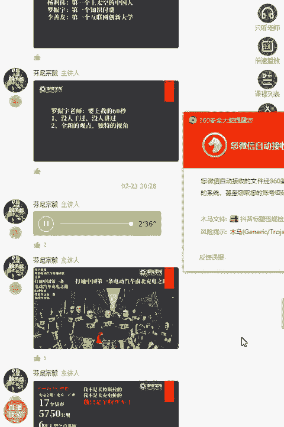

我先讲的我的一个最重要的故事之一呢，其实是呃特斯拉南北充电之路。这个呢其实是我做个人IP的一个起点啊，其实那个时候还不懂什么叫个人IP啊，只是那个时候刚好呢特斯拉进中国，那我呢是个车迷。

所以说我是中国第一代特斯拉车主。但是呢特斯拉这个在交车的时候，其实当时我等了两年啊，我12年就交钱了，但是14年呢才通知我们交车啊，所以足足等了两年。啊，但是呢当时第一批车主我在名单里头。

但是呢我们广州的车主却拿不到车，但是只有北京上海的车主能拿到车。但是我们作为第一批车主呢，也去北京啊，见了这个伊龙马斯克。所以当时呢我就觉得很不高兴，我说为什么他们有，我们没有。

后来特斯拉也给我们赔礼道歉，就是说啊因为我们这个充电桩没有按计划修起来啊，只在北京和上海各修了一个超级充电桩，其他地方都没有。所以我们就不能够按期把车交给你们。但是我们承认你们第一批车主的待遇。

那这样你就更难受了是吧？有名无实嘛。所以后来我说那我如果想尽快拿到车，应该怎么办？他说，如果你能够把你的交车地址改到北京，那我们也可以把车交给你。但是怎么样运回去，那就是你自己的事情。啊。

其实把车运回来也很容易啊，找个卡车运回来就行。但是后来我的小伙伴跟我说，能不能利用这次事件，哎，做一次我们环保理念的这个这个环保型是吧？我们能不能把车开回这个广州去，从北京？那那这样的一路上。

我们可以宣传环保啊，宣传节能。哎，这个方案提出来大家都觉得挺好，但是呢后来呢还是学得不够酷是吧？那后来有个小伙伴提出来说，哎，我们一路上。开回来的时过程中，我们不是要呃一路上接上家用充电桩。

我们做法很简单嘛，就是在酒店装上充电桩，很简单的呢就是家庭用的那一种，然后呢充好电，第二天就接着走啊，这个呢酒店老板一般都能接受，因为你住在那里嘛，他总是可以帮你，大不了给点钱。啊。

但是后来有小伙伴提出，如果我们把这个家用充电桩留在这个酒店是吧？我们多买一些充电桩，隔个300公里，留一个，隔个300公里留一个。那这样不就其他的车主也可以通过这条路啊，能够穿越中国嘛。哇。

这个方案提出来以后，大家都觉得好棒啊。嗯，后来呢我就找到了罗振宇老师，他也觉得这个主意挺好的，所以我们就一起来策划这个事情啊，这个其实后来呃成就了这个我的个人IP的这个起点啊。

因为这件事情还是呃有点牛逼，对吧？而且他的这个。意义呢就是在于你不是用传统的方式是吧？传统的方式，大家想想建充电站那得多大的投入。但是我们这种方式呢，在那个时代其实对电动汽车的推力呢起了非常好的作用。

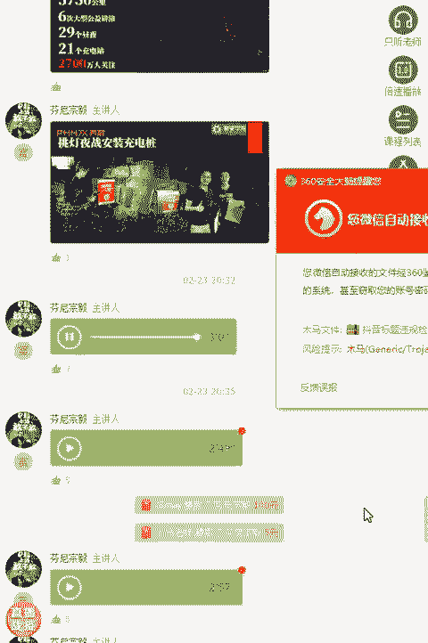

Yeah。所以一路上呢我们就用这个方法啊，只是在呃第一个桩是在北京，是我的朋友帮我装的，第二个桩是在天津，也是我的朋友帮我装的。然后呢，就把在这两个装装的这些照片啊、视频啊发到这个微信里是吧？

当时也有微信啊，结果你后来发觉呃全中国有几百家的酒店。哎，我当时印象有500多家的酒店和这个饭店跟我们联系，希望我们也能把他的充电桩装在他的这个酒店里头，为什么呢？大家想一想。

这个中间其实是一个多营的局面，是吧？酒店里了这个充电桩，让这些车主都是高端用户，他们就愿意住在这个酒店。啊，你到了酒店以后。要是平时开的汽油车，你可能就开车出去吃饭。那现在一到酒店开始充电啊。

那你的这个车可能就插在墙上，你就没有车出去吃饭，那你可能就在酒店吃饭是吧？酒店老板本来只是赚个住宿的钱，哎，现在又能赚个饭钱。嗯，你开始出去吃饭，不敢喝酒。啊，那你在酒店吃饭还可以喝两瓶酒。哎。

他又赚个9000，所以我们就把这套话术呢跟这些酒店老板一说，哎，他们个个都愿意。嗯，所以说呢我们这条充电之路其实大概用了一个月的时间，嗯，很快就建成了。哎，我记得当时还有一些特别感动的事情啊。

当时我刚刚上路两天，有一个车主在北京，他打电话给我，他说哇，你你你是不是一定能把这个充电之路修呃修通啊？我说是啊，我已经在这么干了，他说我是准备到上海。你修到上海，我就赶快顺着你的充电之路走到上海。

你可千万别修到一半不修了。我说你放心吧。啊，结果我没有到上海呢，其实那个蓬勃商业周刊和华尔节日报就开始跟我约港。啊，然后呢呃这件事情办完以后呢，我回到广州啊，央视的国际频道马上就跟我约采访啊。

所以后来我我总结了一下，我兢兢业做我的分级科技，做了11年都没有省级电视台以上的这个媒体采访过我。但是我只是做了一个事件营销。啊，你会发觉全世界最大的媒体都来采访我啊，然后后来呢。美国的快公司啊。

我为什么被评为20142015中国创新五十强啊，就是美国的快公司评的，他们跑来找我是为了采访特斯拉充电之路。结果到了我们公司一聊天，发觉这个裂边式创业是更牛逼的事情。

所以那一届我其实是以组织创新的这个方式入选中国创新五十强，而不是营销创新。哎，所以我告诉大家呢，哎很多这个点睛之笔其实特别特别有用。当然前提条件。还是你的企业做的还行，还挺好啊。

值得呃这个这个大家去学习，那，这个才是最关键的点。

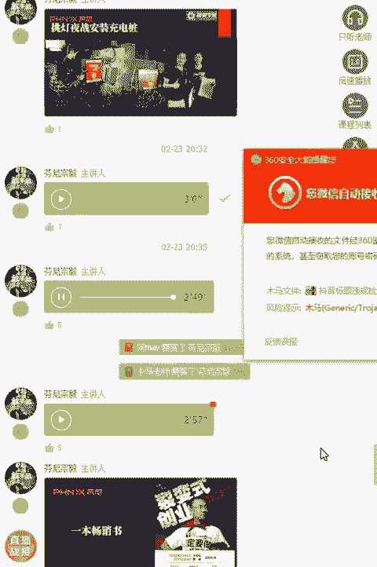

呃，这个在这个路上呢，修第一条充电之路呢，从北京到广州啊，一路上呢17个县市5000多公里，我做了大6次大型的公益讲演啊，修了21个充电桩啊，其实呢我只是一个车主，我并不是卖特斯拉的是吧？

那个时候其实我的很多朋友哎，包括这个呃其他的车主都想不通，他说你做这个事情有什么意义呢？跟你的事业有啥关系呢？但是大家想一想，如果我是特斯拉的销售副总，我去做一件事情，对我的事业是有意义。

但是会引起什么样的关注呢？别人觉得那是你的工作是吧？所以我告诉大家，你要想做一个影响力的事这个这个事情呢啊千万不要只基于自己的行业来做啊，基于自己的行业就没有讨论的这个价值啊，大家就不会觉得惊奇。啊。

你反而是要基于社会是吧？哎去做哎，基于怎么样推动一个大行业的进步，哎，甚至是跟你没有关系啊，这个才叫公益是吧？但是最后做完了以后呢，其实对你的事业有很大的发展。因为大家都在讨论啊，你为什么要做是吧？

你的方法是怎么样的。那么在社交媒体时代，你是谁？你的企业是什么？那自然大家就会哎讨论出来。所以说呢？一定要做一些出奇的东西，嗯，而不是说这个呃跟你的公司特别有关系的东西。啊。

如果这个事件跟你的公司呃紧密相连，反而效果不好。为什么呢？大家觉得你在做营销是吧？而不是在做公益啊，所以它就没有传播的价值。啊。所以在这个路上呢，其实我们有很多呃特别感人的照片是吧？

我今天这个呃没有太多的时间给大家展示啊，回来以后呢其实我们公司呃经过讨论，觉得嗯这个事情特别好，我们应该一直做下去。而且呢当时我的合作伙伴就提醒我说，你应该写一本书。

其实那个时候我对我自己能写一本书完全没有任何的信心。啊，但是呢我就是其实把我的故事组合起来。啊，当时请了我的一个粉丝啊，我们两个一起写啊，结果这本书写起来，居然是很畅销书啊，我我印象他呃前三个礼拜。

居然拿了京东的这个畅销排行榜的前三名啊。而且后来呢被这个樊正老师选入了这个反正都是会哎，我这本书呢，其实我自己卖了两年卖了8万本。但是对于财经类图书来说呢，已经算是比较多的了。啊。

但是呢呃上了反正读书会以后呢，三周啊100多万人听过这本书啊，那还是早期的时代。如果今天的反正读书会，我估计得有1000多万啊，所以我这本书呢其实也有很多这个呃大咖帮我写了推荐，像吴晓波老师啦。

罗振宇老师了啊，是吧我的恩是李尚友教授了啊，这个猎豹的复圣了等等啊，所以说呢其实当你做的事情啊比较厉害的时候呢，是有很多人啊愿意帮助你的。是。

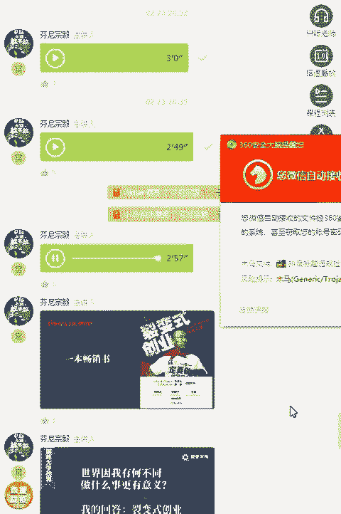

呃，这个事件呢后面对我的影响其实是深远的啊，因为呃裂变式创业广为人知呢，也是因为特斯拉重建之路这个试点营销啊，因为我在路上开始做讲演，主要讲的呢就是呃裂边式创业。啊，回来这本书写的也是裂边式创业。

所以说呢这次试点营销呢其实开启了我们整个分尼科技这个实点营销和我个人的IP打造之路啊，然后呢后面的很多机会呢啊全部来自于这一次哎，所以找到一次机会呢，其实一定要紧紧抓住而且人生呢呃不会有很多次机会啊。

现在想做一个第一次其实难度是极大的啊，所以说我20。15年上湖畔大学啊，当时湖畔大学的这个考题啊，就最后的面试呃，是马校长和郭广昌老师亲自面试。啊，就一个命题，3分钟讲清楚世界因为你有什么不同。

我当时就讲了两件事情。啊，特斯拉充电之路推动了中国电动汽车的发展。啊，在没有超级充电桩和大量的咱们国家电网的充电桩休起了之前啊，用社会的力量修了将近有1000多个啊这种微型的充电桩。啊。

这个时候呢让很多人有信心买电动车。另面是创业呃，用这个人民币竞选的方式，其实帮助很多企业找到了这个选人育人的方法啊，同时也成就了很多员工啊，所以这个推动了大量的企业转型啊，这两个都是社会价值很大的事情。

所以我很容易就通过了，反而是那些讲自己事业有多牛逼的人啊，考湖畔大学不是那么容易啊，因为湖畔大学转就的是社会价值。所以我告诉大家，打造IP。呃，讲究的是社会价值。啊。

如果你说光是你的企业做多牛逼多大是吧？那你做房地产啊什么的就好了啊，但是很多人其实也没有这个机会是吧？嗯，所以说呢个人品牌。一定要有他自己的这个特色。对。我想讲的第二个故事呢是80天电动汽车环球。呃。

我做完特斯拉充年之路以后呢，没多久，突然有一天有个电话找到我是80天环球的这个发起人叫做ra，西班牙人。啊，这个人呢可以说是一个特别勇敢的人。嗯，他说安el，我在网上看到你的事迹。

我正在筹划2016年6月份呃，我想组织一些真正有想法的电动汽车的勇士们一起去环球。我说啊，环球这个可能吧，全世界也没几根充电桩是吧？那我们一路上怎么充电呢？是纯电动汽车。所以后来2015年。

我在买房的客户见他。哎，我问出了所有人问我的问题，我们怎么充电？他说安卓，你想一个问题，这个世界上有电的地方多还是有油的地方多。那我说当然是有电的地方多是吧？有有人的地方一般都有电，那只有加油站才有油。

他说对了。他说有电的地方比有油的地方还多。那你告诉我开汽油车环球有没有难度？我说有难度，但是难度不大。哎，因为很多人都干过，他说既然有电的地方更多。哎，那么开电动汽车含球是不是应该更容易？

所以我恍然大悟啊，其实这不是个技术问题，对，这是一个使命驱动的问题。啊，其实你能够影响多少人帮助你啊，决定为你能不能开电动汽车换球。但是大家想一想。我们的使命是什么？

我们的使命就是推动电动汽业的发展是吧？我们不能改变大家开车的习惯，但是我们可以改变大家开什么车的习惯。刚才我发的第二张照片呢，就是我们环球车队的呃大合影。大家看到没有？只有我一个中国队啊，9个欧洲队。

一个美国队啊，唯一的中国队。而且呢。

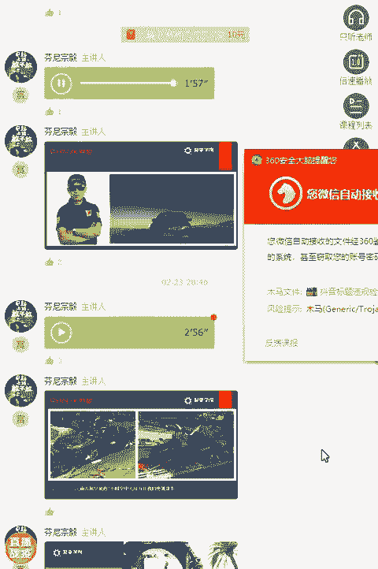

嗯。大家看一下我的车牌。蓝色的那个车，粤A车牌，广州车啊。啊，我第一次穿带着国旗的衣服，啊，当时感觉身上沉甸甸的。本来呢我是特斯拉的车主，那肯定是开特斯拉的。但是2015年11月份。

我们在阿姆斯特丹开了车队长最后一次会议。啊，我突然发觉所有的车只有一个型号，就是特斯拉的mod S，包括我在内也是。然后我就跟我们队长说，我说那我们这个车队怎么就像一个特斯拉的工厂宣传车队。他说是啊。

他说原来的福特日产全部都换了车。为什么呢？是因为那个时候的电动车续航里程普遍都在200公里以下，每次充电。啊，只有特斯拉每次充电能够到将近500公里。那这说面就意味着。那些跑步不远的车。

每天要充好几次电，充一次电时间大概要花10个小时，那就意味着开这些车的人根本就回不来啊，因为你的时间不够。啊，那所有的人啊都要开特斯拉。那我说这样。我们就好像感觉在为特斯拉做宣传。他说是他说确实不好。

但是也没办法。我说如果我开中国造的汽车上路，你觉得怎么样？他说那太好。就后来呢我回来以后找到了腾氏啊，腾氏为了支持我把他们当时只有300公里的车改成了400公里。因为当时他们400公里的车还没有上上市。

哎，我是最先拿到的。这样呢我其实勉强的跟特斯拉可以拼个旗鼓上当。但是问题就是在于路上。的充电桩啊都是。这个。呃，国际标准的呃，我们用的是国标啊，国家标准啊，所以说呢穿越美国的时候呢。

其实我们遇到了呃巨大的问题。啊，然后呢。呃，一直是落就落落到最后啊，但是呢开中国车其实起到了两个特别好的效果。啊，第一个是媒体关注的焦点。特斯拉很多媒体都见过。没什么出奇的，但是中国车参与环球。

很多媒体都觉得很吃惊。所以这绝对是养我过位。还给大家看到没？我的车牌是粤A车牌，我们很多老花叫的是广东人。啊，这种大的这种。呃，冒险事件呢其实中国人很少参与是吧？不是不想参与，而是以前我没实力。

很多老华侨当看见我们挂着国旗的国产车的时候，因为我当时我除了这一台赛车，我还有6台拍摄车全部都挂了过去。那很多老花侨。都不相信，当他们摸到着我们的车的时候，很多人老泪纵横。他们知道祖国终于强大了。

是吧这个就是。啊，真的是特别特别的感觉自豪啊。啊，所以说开咱们国产车确实是仰我国威。80年环球呢有特别特别多的故事，啊，我没有时间讲。今天我就讲一个南方航空的故事。

我刚已经说了，因为我们充电桩的是国标，所以我们在穿越美国的时候呢，一直落后啊，我们中间呢其实经历过两次跨大洋，那是怎么过去呢？是用飞机运过去啊，一次是从葡萄牙飞到加拿大，这次我们还算比较顺利。

第二次是从美国的洛杉矶啊，飞回咱们中国。啊，那第二次呢，由于我们中国车队一直拖后腿，所以我们赶到海边的时候呢啊第二天就要上飞机了。啊，我们一到我们队长就火急火燎的跑来找我，说完就出大事了。

我说我们中国队到了，终于赶上了，有什么大事儿，他说是这样，他说飞机没有了，你们中国队赶快去协调。啊，原来呢。因为有一架飞机坏了，所以航空公司呢把我们的本来定的专机呢拿去做通用航空的货机啊。

因为它要保证大量的货品是吧？那些快递啊什么按时到达。哎，所以像我们这样的专机呢就会被取消。他说你们中国得赶快去协调一下，我都协调了4天，但是没结果。我说你作为大队长，你协调了4天都没结果。

我这个中国小队长去能有啥结果？他说是你们中国的航空公。我一听我就赶快啊带着人去了，到那一看，是咱们南方航空是吧？那不是咱们广州的航空公司。南方的领导看中国队来了，非常热情的接待我们说。

你们队长已经找了我好多次，但是我真的没办法，没飞机就是没飞机，我也不可能给你变个飞机出来。然后我们又跟他解释。这个事情哎，后果有多严重啊，当时他们给我们的方案是分14天用货机1。1点把我们的车都运回过。

这样我们要晚14天啊，晚14天本来也没大事，但是后面我们有很多大型活动，比如说登陆广州的活动是吧？各国都有大型活动，那所有大型活动全部都乱淘了。好吧，那这个时候。那个那个南航的总经理跟我说。

他说我们其实已经留了这个准备啊，不敢跟你们大嘴讲说，我们其实给中国队留了一个车位啊，咱们明天偷偷上飞机，其他国家队咱们就先不要管。但是大家想一想这种事儿你能干吗？是吧？特别是登陆中国。哎。

我们准备了盛大的活动，吴晓波老师亲自过来给我做讲演，然后咱们中国队自己回去了是吧？哎，说实在真的是说不出口啊，所以后来我就跟他说，我宁愿不会去啊，也不能上这个飞机啊，然后呢南航的领导说。

这样我们下午跟这个总部开会我再争取一下，但是你不要抱什么希望哎，因为我们不太可能啊，为了一个私人车队去改变整个的这个商业航空。啊，结果这个会议开了3个小时，他才出来。出来以后笑眯眯的跟我说，我们干了。

嗯。

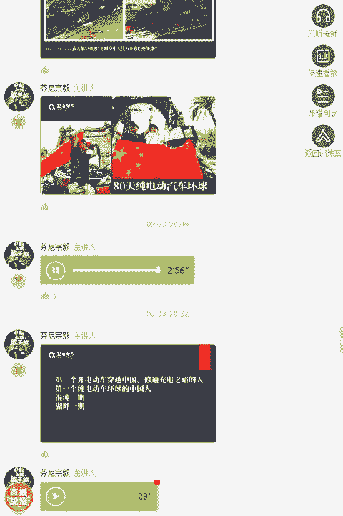

讲辉这个第一次的重要性。其实啊其实我做了啊不少第一次啊，第一个开电动汽车修充电之路的人。第一个开纯天的学车环球的中国人。嗯，然后我还是这个混沌大学一期啊，啊因为我是混沌的这个共创人之一啊。

也是湖北大学一期的这个这个学生啊，其实这些都让我呃受益匪浅啊，所以我特别建议大家如果能去做第一个哎，那就。

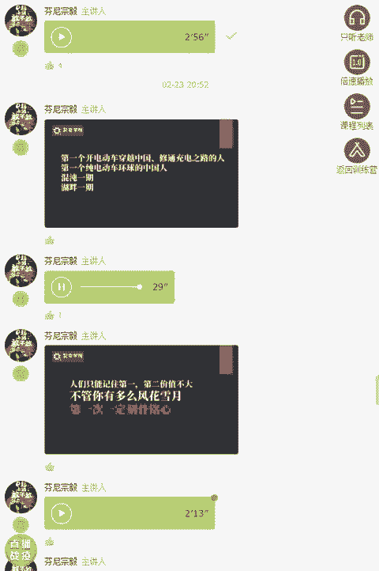

呃，那是怎么干的呢？嗯，他说明天全体上飞机。哎，真的搞定。后来我问他，我说你为什么这么大的改变，他说是这样。啊，我们突然觉得我们必须得做这样一件事情。啊，这么大一件事情，如果毁在中国南方航空手里啊。

这个是最巨大的国际影响。他说能不能我也有个请求啊，我有两个请求，第一个，请在每个车上帮我们贴四个字。我说什么字？他说南方航空，第二个能不能帮我写一篇文章，表扬表扬我们是吧？发在这个国外的媒体上面。

这样万一总部那边怪罪下来，哎，我也有个理由，这是国际民生的大事。哎，大家想一想为他为什么要这么干。啊，如果不这么干，有可能第二天美国媒体就会有一篇文章。

人类有史以来第一次啊电动汽车环球毁在哎中国南方航空手上，对吧？啊，所以说。这个事件非常大啊，谁都会很重视。而且呢这个也是呃国家力量是吧？咱们是唯一的呃中国车队啊，亚洲整个亚洲就咱们一个中国车队。

绝对是仰护国威的。啊，所以说呢大家都会支持。啊，所以后来呢其实国家电网啊帮我们修了4000公里的充电桩啊，一直把我们从甘肃为送到了这个霍尔果斯啊，其实我们的使命跟国家电网也是一致的。

他们也要推动中国电动汽车的发展。像一路上好多好多这样感人的故事，你会发觉其实就是你的使命有多大啊，然后呢。谁都会帮你。所以这个事情呢其实已经远远超越了我个人啊，我的企业啊其实已经到了国家荣誉的层面。

这个时候打造IP才特别特别的有力量。啊，最后大家看到没有？我们在巴索罗那是吧？终点啊竖起我们的五星红旗啊，唱起国歌。哎，广场上咱们很多很多的中国游客都涌过来，哎，大家一起唱国歌，啊，扣了个稀里哗啦啊。

这个绝对是高光时刻。

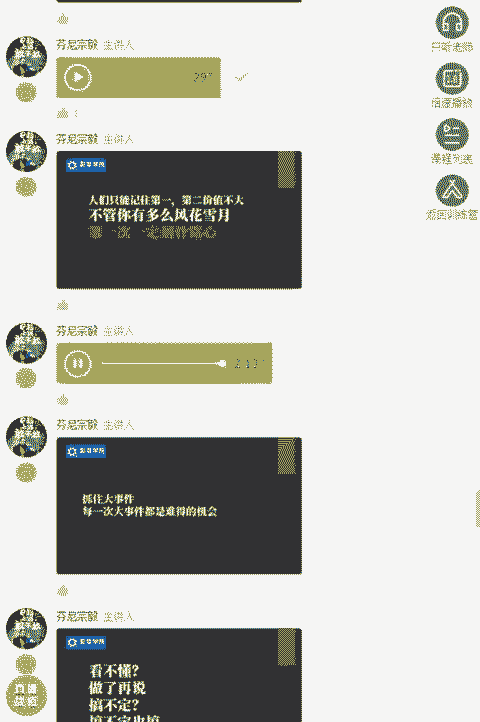

那很多人说第一次很难，的确第一次很难，很多时候你也不知道为什么要做是吧？比如说我做特斯拉充电制度的时候，其实有什么结果根本也没想清楚。但是今天我给大家的观点就是看不懂，做了再说，搞不定搞不定也要搞是吧？

我们只讨论怎么搞，而不讨论搞不搞得定。哎，当你的使命哎的高度足够高的时候。就能搞得定啊，我记得当时作为了做环球，我去找吴晓波老师。我以前并不认识他，也是经别人介绍的。啊，去了以后，吴老师说。

你找我干什么？我说我希望您在我们登录仪式上，广州登录仪式上哎，帮我做个讲演。他说这个人这个事情跟车有关系啊，我是某品牌的这个呃代言人，我不能够其他的车我不能够出厂。我说这个这个事情跟车没关系。

这是环球啊，这是证明电动汽车时代到了。哎，我觉得你作为中国的第一个财经作家，应该在这样的大型的历史事践中呃，这个呃展示一下您的观点啊，这个无异跟哥伦布航海都有可能是类似的呃定位啊，他立刻就觉得嗯。

那我们吴晓波频道能够为你做什么？所以后来我的整个环球的拍摄的策划啊，都是吴老师的团队帮我搞定的啊，我也因此跟啊他和他的团队呃建立了很深厚的友谊啊，一起，因为一起打过仗吧，是吧？

所以后来吴老师专门呃出席了我在广州的登陆仪式，还专门飞到巴基罗那啊，出席了我们的这个闭幕式。下面我讲一下第三个要点，赞住关键词。哎，所以说呢这个就相当于你的标签，对吧？大家知道打造IP呢一定要有个标签。

就是你到底是什么什么什么人是吧？啊，比如说我呃裂变是创业的这个创立者，是吧？这个这个标签呢其实比分尼科技还要更大，对吧？

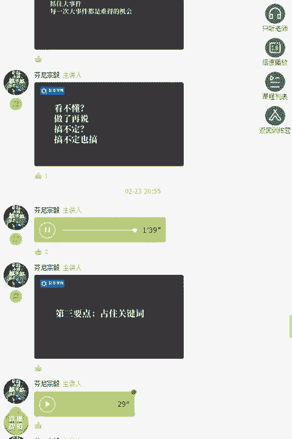

那下面呢我要做教育，那我可能要去做一个创新教育的标签。这个呢我正在努力。嗯。这里呢我就随便举几个例子是吧？啊，这些人物呢都有特别大的标签，比如说稻盛和夫是吧？阿米巴金此敬天爱人呃，日本著名企业家。

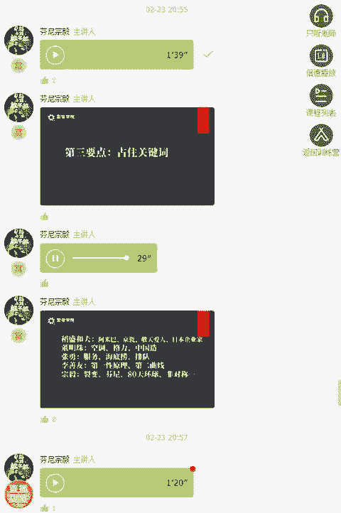

大家想一想，金瓷公司是做这个呃基础陶瓷材料的，如果他没有阿米巴啊，没有这个他的这个管理思想，没有敬天爱人的这个思想啊，是不可能成就稻盛河的。是吧所以我告诉大家，他占据了几个特别大的关键词。啊。

那你说董大姐啊，咱们国货精品的空调是吧？格力啊，中国造啊，都给他占。你就说你想中国造，你会想到董民主，你想空调，你会想到董民主，对吧？啊，那比如说张勇。你想好的服务，你会想到。海底捞你会想到他排队。

你也会想到他是吧？那我们一说第一性原理，一说第二曲线，那我们会想到我们混沌大学的创始人李尚友教授。那你说利面是创业，说分离啊，说80天环球。你会想到综艺是吧？那以后说非对称。你也可能想到总艺，哎。

我正在努力啊，所以说呢一定要站住一些关键词啊，让一大家一说到这个词的时候，那背后就是你啊。

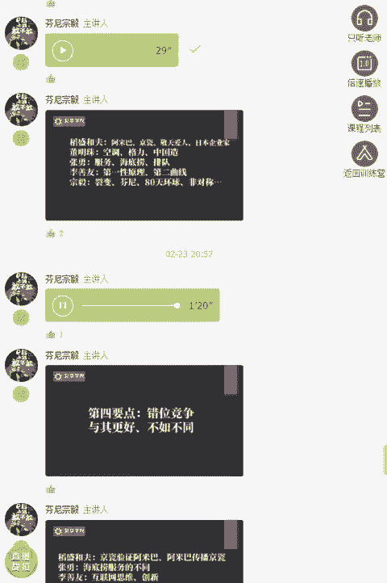

下面讲一下第四个要点，错位竞争啊，这个也是我们混沌大学的理论啊，与其更好，步如不同啊，就是说你要想比别人是吧？你要想比董大姐在他的领域做的更好，这是不太可能。你唯一的是要做独特的是吧？

所以说呢呃再说一下我刚才的这些例子。啊，其实都是有独特之点啊，千万不要跟别人雷同啊。对啊。下面讲一下第五个要点，规范行为。啊，因为为什么呢？你成为IP以后啊，你的一言一行啊，就算你成为IP之前，其实。

大家都可能会去传播是吧？行为不当，会有灾难性的后果啊，IP越大越开不的玩笑啊，其实这里头也其实有已经有很多很多的这个呃例子了。比如说有些演员是吧？他的这个行为不端是吧？那可能会造成灾难性的后果啊。

像咱们呃强东哥是吧？多厉害的大IP啊，但是在这个呃这个这个个人问题上也出现了问题，所以其实对京东的影响呢也特别特别大啊，所以这个呢其实提前就要做好准备是吧？呃，IP越大啊，越要在这方面也要注。

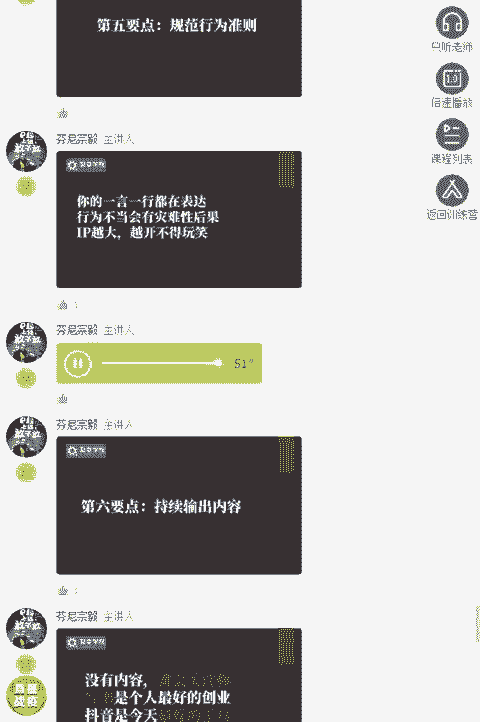

第六个要点啊，也是平时要做的最关键的要点，就是持续的输出内容啊，其实你会发现IP呢都有大量的那个内容输出是吧？你像马爸爸啊，经常会有各种各样的讲话呀，视频啊，这个在互联网上大量的传播啊。

所以说这个呢才才能让大家持续关注你是吧？如果你没有内容，谁会关注你啊，所以我特别建议有能力写书的朋友们啊，要写本书啊，当然能写书的话，也是因为你有内容是吧？你没有内容，你怎么能写得支出来。

还有一个呢就是要利用今天最好的工具，比如说抖音啊、快手啊啊，因为这些新的工具呢效率特别高是吧？呃，抖音呢可能一瞬间可以让百万人知道你啊，因为他是人工智能的是吧？抖音知道谁喜欢你，抖音也知道啊。

你的爱好是什么，这样他会把你的写的东西把你的这个拍的东西传给那些喜欢你的人啊，这样呢它会形成自传播是吧？喜欢你的人又会帮你传播。所以说呢他的效率是特别特别高的啊。

所以我教大家呢对在今天这个呃短视频时代一定要关注啊，最好的短视频工具。嗯。

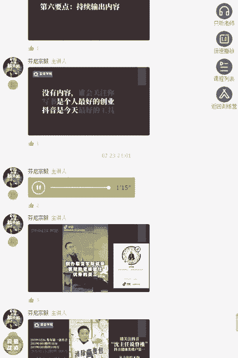

因为今天呢我们用的是千聊，所以我其实没有办法给大家展示我的抖音啊，大家其实可以关注一下我的抖音，是吧这个图片上扫一扫的都可以看到啊，我也花了不少时间去拍抖音。

其实就是把我的观点用很很短的视频把它表达出来。啊，这个传播量呢其实都还可以啊，因为我呢肯定很难去跟李佳琦他们比。但是我已经是我们这个行业啊，最大的抖音大V了。其实对我们在行业的这个影响力是有很大帮助的。

呃，下面那个沈教授他呢。所以说也是一个传奇。呃，他呢是一个脊椎这个呃科的这个教授，那就是我们广州最好的脊椎专家。啊，他自己有一个医院叫龙济康啊，然后呢这个医院呢其实一直生意都不太好啊。

因为不知道该怎么宣传，他也不会宣传。但他在19年2月份开始做抖音的时候呢，刚开始的时候呢只有。啊，完全没有什么粉丝。啊，但是呢很快。2月份才开始发到4月份，他就有40万粉丝，5月份突破100万。

12月的时候是将近400万粉丝。是吧超过千万量千万辆播放的就有10条。千万大家想一想，超过一个省级电视台了，可能。啊，最高的播放量的这个单次的视频有8000万次。啊。

所以是所以说他现在这个医院已经忙的不得了了，是吧？广州的总院早就忙不过来了，现在已经开始在开深圳分院。啊，这个就是用好工具。

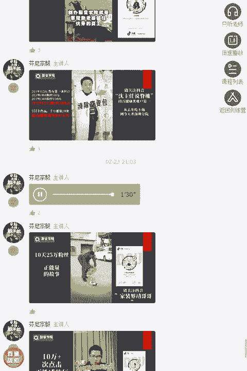

其续。再给大家举两个例子啊，是我们分尼科技的例子啊，这个呃家装界的靖哥哥啊，我们10天就做了25万粉丝。现在呢大概是60多万啊，大家有时间可以去看一下这个抖音。

这个号呢其实是我们呃这个采暖事业部的总经理呃，自己拍的一个号，他主要呢是讲正能量。他这个号里头没有一点是介绍我们分妮产品的，就是介绍怎么样去做一些对社会好的事情。啊，你会发觉涨粉特别特别高。

然后同时呢他又做了另外一个号叫做野生暖同人，也是他来做的。同样一个人那这个号呢粉丝量就没有办法跟上一个号比这个号大概只有2万的粉丝，上一个号60万粉丝，但这个号呢就特别精准，他主要讲什么讲地暖啊。

这帮空调啊，家装啊这些东西。啊，所以我告诉大家不性感的行业其实一样是要做可以做粉丝的对吧？如果你想想这种专业号有2万人关注，那已经是不得了的事情了。大家想一想，你开一个商店啊。

一个这个采暖的这种专业的商店，怎么可能会有那么多人来呢？是吧？哎，你你想想他那个呃那个内容号几十万的粉丝，你就算开个万达广场啊，也不会有那么多人的关注你嘛，对吧？所以大家一定要把这些新媒体的工具用好。

哎，我告诉大家，所有的行业都可以做啊，不要跟我讲，你是towo b的做不了。其实to b的粉丝更好做是吧？就比如说我的粉丝很多都是 to b的啊，因为很多喜欢我的人呢都是做企业的企业家是吧？

他们更关注我们怎么做企业，啊这个时候如果他变成你的粉丝，你会发觉他会整个公司给你买东西，他是集团采购是吧？他是对公的采购那个采购量可能是百万千万级的啊，不像普通的这个个人粉丝。

可能采购量只是几百10千0几的。所以我告诉大家，千万要记住，所有的人都可以做饭。

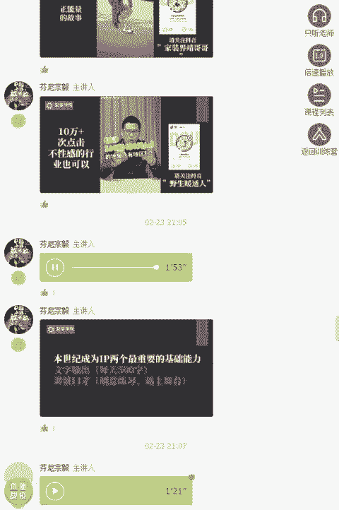

所总结一下这个第六条是吧，本世纪成为IP的两个最重要的基础能力。大家一定要记住啊，你要真想做IP呃，这个基础能力要有。第一个是文字输出。啊，我现在是每天500字啊，每天都写啊，如果有我朋友圈的同学啊。

可以去关注啊。如果没有我朋友圈的，可以上我的知识星球啊，去关注。第二个呢是讲你的口才，这个是要练的啊，这个特别特别重要啊，其实我呢得益于口才还可以是吧？我有很多讲课的机会。

当然是呢你为什么会有讲课的机会呢？也是因为你的故事比较精彩啊，你的企业做的还不错，值得大家学习，所以我告诉大家，离开了这个真正把事做好这个前提，其他的事情都是浮云是吧？首先大家要把那个一做好啊，然后呢。

你的文字输出能力，你的口才就是那个零啊，他会让你的事半功倍是吧？啊你比如说阿梅，我觉得一个小姑娘你得益于他的输出能力特别特别强，所以他才能以这么小的年纪来做这样的社群啊。

然后呢她是在我们裂边学院认识了我是吧？他是我的学员啊，那后来我觉得这个小姑娘真的是很值得鼓励。所以他来开课的时候呢，我也愿意站出来啊。去帮助他啊，所以说呢。IP的力量是吧？是很大的啊。

大家都会互相呃支持，互相帮助。

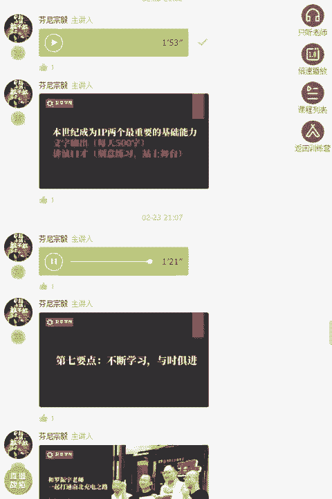

嗯，因为一本书是吧，我那本书还算是畅销书，我跟樊正老师也建立了链接。

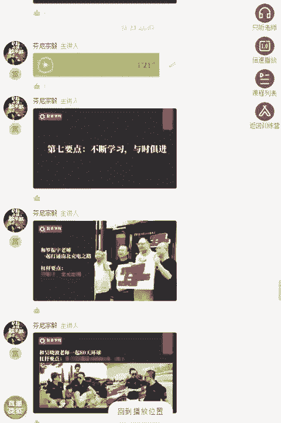

啊，樊正老师呢其实是最大的IP了啊，他有大概3000多万的粉丝啊，可能是在我们中国这个IP这个杀伤力最大的老师了是吧？从这个家庭主妇一直到企业家，大家都很喜欢樊正老师是吧？呃，那我因为这本书的原因呢。

也跟他建立了很好的这个呃呃链接啊，包括我后来办教育，其实樊正老师也专门来帮助我是吧？那张照片呢就是樊正老师来参加我的第一次教育研讨会啊。

右边那张照片呢就是我们俩创立了反正读书会里头的这个作者光临的这个栏目啊，我是第一个作为作者光临栏目的这个嘉宾啊，去做这个作者光临啊，我觉得呃这个也特别特别的值得骄傲。

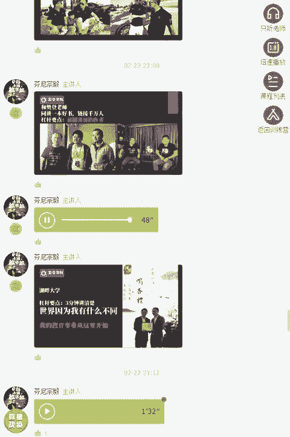

站在我右手边的大家都认识是吧？马爸爸啊，因为我是湖畔一西的这个学生啊，就我的这个呃这个呃关键点呢就是抓住第一次啊，所以说我成为湖畔一西的学生啊，也能够这个很近深的得到马校长的这个教诲啊。

真的是受益匪浅啊，他作为我们中国最成功的企业家啊，的确是有很多很多呃值得所有人学习的这些地方啊呃阿里真能做的那么好，那绝对不是平白无故的啊，所以说呢其实我觉得我自己很像郭靖。啊。

就是射雕英雄传里那个郭靖啊，大家看看郭靖其实出生的时候也很低微是吧？啊，开始跟那个这个江南七怪学了一点武功。哎，以为江南七怪很厉害，其实后来呢你会发觉啊跟了很多很多的这个大使是吧？权真七子啊。

这样呢还有一个中神通啊，然后呢，后来有一次被这个吸毒欧阳锋抓去，又学了这个蛤蟆功啊，他当丐帮的这个。当时是帮主吧，跟这个洪七公在一起啊，学习降龙十八掌，后来又去了黄蓉，跟了天下武功第一的东邪是吧？

所以东邪西毒啊，南帝北丐，其实他都学过啊，他还跟过成吉思汗那可是一代天骄是吧？所以我觉得呢其实人生呢三人行必有我师啊，大家一定要善于跟别人去学习啊，这个其实是最有效，最快最直接的这个方法。

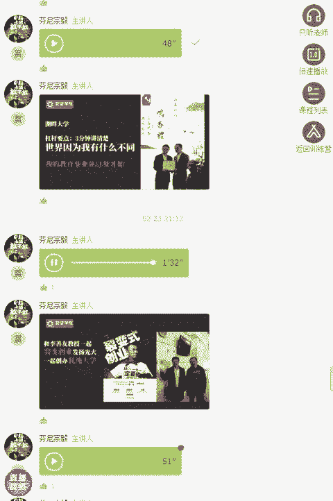

还有我的恩师李善友教授是吧，这个就不用说了。哎，我们一起创办混沌大学。我呢做了李善友教授，混沌大学广州分社的社长。啊，其实呢并不是我们这些社长啊比别人这个思维模型厉害到哪里去啊。

我记得我们创办混沌大学之前的一次旅行是穿越欧洲，那次是我组织的。哎，后来我发觉我们几大社长就是当时穿越欧洲同一个车里头的车友啊，因为你跟高人在一起的时间长嘛，我们在一起。这个一个车里关了10天是吧？

那混沌大学的雏形其实就在我们的讨论过程中就建立起来了，是吧？那个时候我也与能够参与嗯，去创办混沌大学感到为荣，是吧？因为我们心目中他就是我们将来中国的呃网上的斯坦福大学。

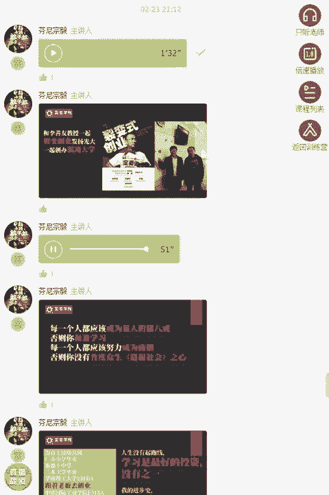

所以我觉得呢其实每一个人。都应该成为某人的猪八戒。什么叫猪八戒呢？就是你跟着去学习，对吧？你看唐猪八戒跟着唐僧去西天取经，啊，那一路上啊不断的去修炼自己啊，那最后回来以后都成佛了，是吧？

如果你不能去跟随某人，其实呃你和谁学习是吧？很多老板我觉得企业做的不大，但是呢特别骄傲啊也没有学习之心，那这样呢其实呃就没有办法再继续进步了。啊。那每一个人呢也应该努力成为唐僧是吧？啊。

要乐意分享你的这个经验分享给大家。这个我觉得分享也是作为做IP的一个最重要的一个点。啊，因为你只有分享，你让别人受益是吧？别人反过来才会感谢你，才会帮你传播。啊，所以说呢我们大家都要有普度众生。

造福社会之心。

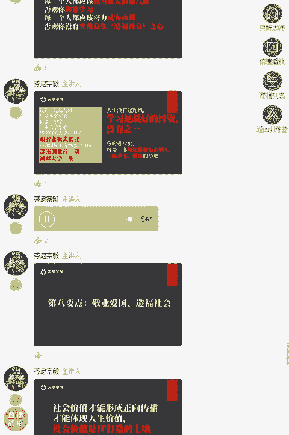

最后一个要点。敬业爱国，造福社会啊，就说如果你想成就自己的IP。哎，这个是最重要的啊，因为呢社会价值才能形成正向传播。其实像湖畔大学一样，世间因为你有什么不同，对吧？哎，这个呢才能体现你的人生价值。啊。

如果负向的东西呢，那是不被啊广大这个怎么说呢？呃，社会民众所接受的那也就无法传播，对吧？政府也不会让你传播。啊，所以社会价值是IP打造的这个土壤。

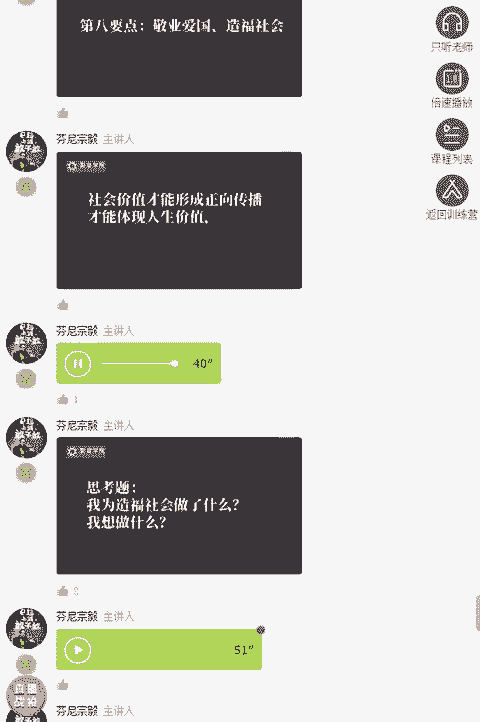

哎，所以说。啊，这里呢我给大家一个思考题啊，每个人都去想一想，我为造福社会做了什么。啊，如果还没有的话，那么我能够为这户社会做什么？嗯。所以说呢做IP最重要的一点就是说你不要基于个人。嗯。

和这个你所在的企业。去考虑问题，这个是远远不够的。因为这个别人为什么要传送你，对吧？你至少要基于对行业的贡献去考虑问题。我为行业做了什么？是吧我为国家做了什么？我为人民做了什么。啊。

这个呢才能为广为传颂，值得大家学习。大家仔细想一想，我们今天讲到的这些IP人民啊。是不是？是不是这样的？Yes。啊，如果不是这样的话啊，你想想大家为什么要传播你？所以总结一下，打造。

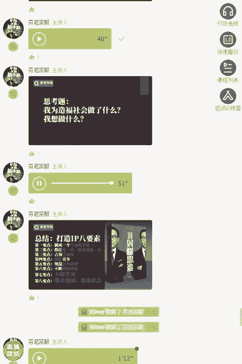

IP的。八大要素。啊，应该说是养成IP的八大要素，对吧？第一要点，做成牛逼的事业或者事情。啊，第二要点，抓住第一次哎，抓住难得的一次机会。啊，人们只能记住第一次。第三要点，占领关键词啊。

这个就是你的标签。第四要点，错位竞争，哎，不要试图用别人的办法去呃做的比别人更好。那个很难，一定要用不同的办法，不同的观念去做。第五，要点，规范行为准则啊，不要因为一些小错误坏了大事情。第六要点。

持续不断的输出内容啊，每天500字。我建议大家坚持。开始的时候非常难，第一个月真的是非常非常难。后来你会发现其实很容易。啊，第七要点不断的学习。不断的跟高人学习啊呃这个学习才能够让你不断的输出新的内容。

第八要点也是最重要一要点，敬业爱股，造福实惠。一定要做一个真正有于社会的人。

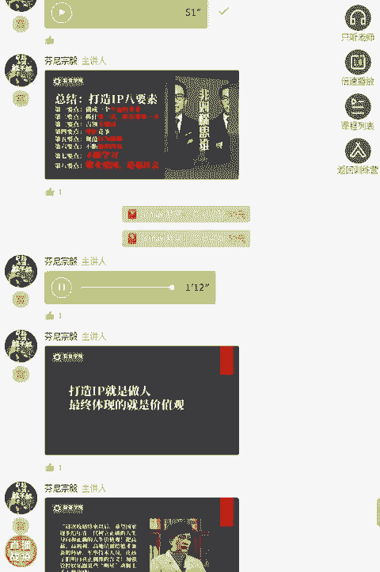

说到最后，打造IP的就是做人，最终体现的呢就是你的价值观。啊，所以我也想用这个李兰军院是最近讲的一句话，对吧？这次疫情之后，希望国家逐步给年轻人树立正确的人生导向和正确的人生价值观。

把高新高福利、高地位留给德才兼备的科研军事技术人员，让孩子们明白真正的偶像的含义。加强管控是吧？娱乐业呃明星这些行业啊，少年强则国强呃，为祖国未来培养呃自己的国家之栋梁。啊。

其实呢这个就是呃李院是希望输出正确的价值观去影响年轻人啊，其实我觉得我们每一个人啊都应该是这样的。你想在大灾大业面前，在战争面前，谁真正能够救这个国家是吧？谁真正的能够让大家受益，让这个。

所有的人出于呃得到安慰啊。那是科学家啊，是咱们的这个呃科研技术人员啊，是军事人员。啊，所以大家一定要明白这个道理啊，所以说呢打造IP其实就是呃。做人啊，其实就是做人，最关键的是把人。

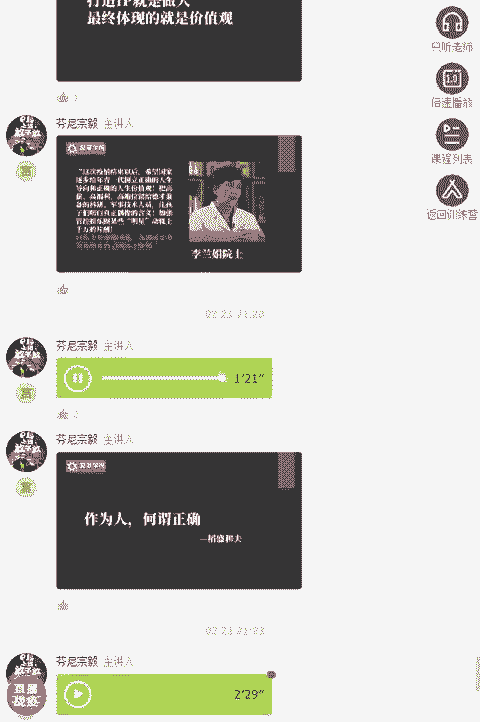

啊，差不多讲完了啊，这里我留给大家一句话啊，这个是道盛和夫讲的，作为人何为正据。啊，这句话呢其实对我的影响很大，我我把它专门写成了扁，挂在我的这个办公室。啊，为什么会有这句话呢？其实道盛讲的。

他创业的时候特别早，他没有太多的这个人生经历。所以他在很多重大的问题面前呢，他其实也不知道该怎么办。啊，他不知道该怎么决策。因为他创立金次的时候，只有27岁。其实呢并不是一个有人生阅历的人。

但是他说我就把我的决策标准定义成做人。每到这个想不清楚该怎么做的时候，那我就想作为人应该怎么做这件事情。啊，其实很简单啊，我跟大家举个例子，就像我当时做这个办公室幼儿园的时候，大家记不记得？

也是在那个时候携程也做了一个幼儿园。后来被上海市政府这个查封了啊，交给了这个上海市的总工会去经营。结果后来没搞好以后呢，出了这个虐童事件，当时对携程的这个影响其实还是蛮大的。

那我们公司当时也处于这个呃这个有点纠结的状态。啊，其实也有我的朋友提醒我说，这个幼儿园的风险很大是吧？万一出了什么问题，呃，对企业也会有很大的影响。但是当时我就在想。我做这件事情，我的初衷是什么？

我反复问。我是为了员工好哎，我是为了让员工安居乐业啊，解决他们最痛点的问题。啊，我并没有什么啊其他的啊太多的这个杂念，对吧？但最后的结果呢，实际上对企业比有非常呃这个正面的宣传。啊，我当时记得特别清楚。

有一次有一位广州市的领导到我们这里来视察。嗯，他能一直板这个脸。啊，呃非常严肃，然后呢，直到他看到我们幼儿园的时候，他笑了，他说你们办了一件好事啊。

所以后来呢这个广州市总工会把我们列为国家级的这个企业办园的试点基地。啊，这个是我原来根本没有想到过的。我原来只是想做一件小事情。啊，结果没想到树立了很好的社会典范。啊。

所以说呢这个其实最初衷的就是作为人何为正确。我做的这一件事情是为谁考虑问题啊，如果说是为了呃员工是吧？为了社会，我觉得这个事情就应该去做。没。

嗯。最后我想讲一讲，从企业竞争角度上来讲，我觉得单一维度的竞争呢是不够的这样一般企业的竞争呢肯定是停留在产品啊、营销啊这些维度啊，这些维度都叫说单一维度，就是因为你有别人也有是吧？所以仅仅以产品差异化。

难以实现长久的有，很多人说差异化，但是我现在讲非对称。什么叫非对称呢？非对称？就是说别人很难模仿产品，你做的再好，别人都能模仿。你说iphone做的好不好？但是我现在觉得华为做的更好，对吧？

但是呢有些维度，尤其是IP维度产生的这种非对称优势，别人是学不会的啊，非对称就指别人学不会是吧？就比如说美国打伊拉克。这个时候你看伊拉克的战士有多么这个这个不怕死，有多么的这个坚强，其实已经不重要了。

呃，因为别人的飞机，别人的雷达，别人的导弹比你要先进好多好多，打你根本就不用看是吧？这个这个隔着半个地球的人打你啊，所以说你再勇敢，其实没有意义是吧？这个就是非对称优势啊，你想学。

那不是18号能学的会的。啊，所以大家看看这些成功的企业海底捞是吧？餐饮大家都学得会，服务学不会格力国货精品学得会，董明珠学不会是吧？你想再做一个董明珠出来。嗯。

不太可能小米呃产品学的会粉丝加平台的模式学不会，哎，到现在还没有第二家企业能够做成华为高科技是吧？啊，那我相信这个中兴也是高科技，但是任正非的管理思想，它的影响力你学不会。啊，京瓷更厉害，日本制造是吧？

学的会，但是阿米巴加稻盛和夫经营之圣，你学不会。啊，芬妮啊我们的产品别人也可以抄，但是裂边式创业你学不会。啊，所以我告诉大家，这些都是在IP维度上去讲竞争优势啊，如果这个优势被创造出来。

其实别人就很难跟你竞争。

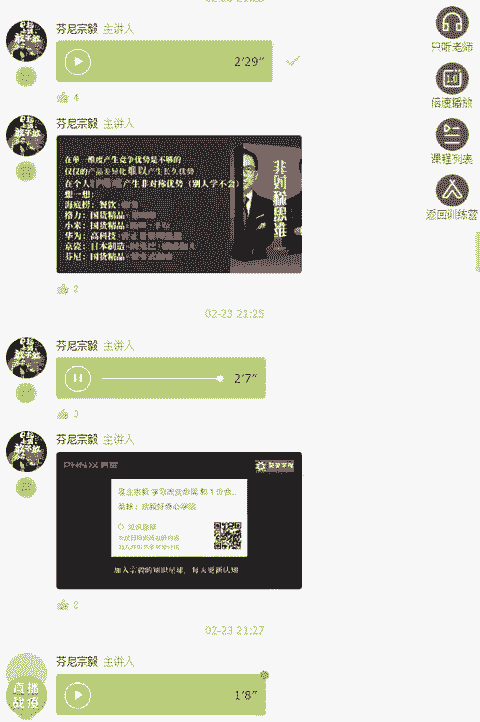

因为其实呢今天讲的内容还是挺多的。呃，打造IP呢也是一个挺复杂的系统工程。我觉得不是一时一会儿。但是我觉得有一件事情大家可以做的，就是每天啊从300字开始写起，每天都写。呃，内容可以非常的丰富，是吧？

你看我写的有企业管理的呃有这个孩子教育的，有疫情的，有一些自己的思考，什么都可以。所以我也觉得呢大家呃可以关注一下我的这个知识星球。啊，呃也不贵，几年好像几十100块钱吧。

里面有我每天的这些思考和写的东西啊。呃呃这样呢大家可以深入了解这个IP打造的这个思维。那这个呢而且也是IP的基本功。就是说如果你们想打造自己个人品牌，如果连这个事情都不愿意做呢，我觉得其他事情也不要想。

哎，所我建议大家现在我的知识星球里研究一下。然后呢，你们就照着做啊，其实写的东西呢其实是可以啊也是造福社会吧啊，就是说写着写着你的这个思维会变，你的水平就会越来越高。

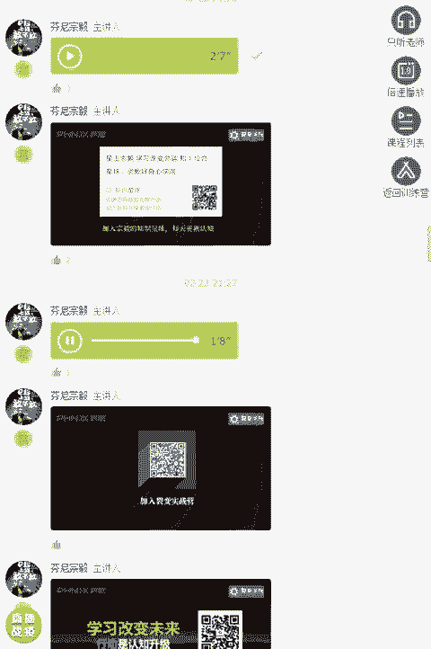

还有呢就是如果想学习我们的裂变式创业，想学习IP打造，那就加入我们的裂变学院实战营。呃裂变学院呢我们原来是线下课。那最近呢我们正在研发线上课啊，而且裂变学院呢现在每天其实都有一些呃大咖来分享啊。

如果有需要的话呢，可以找阿梅联系啊，然后我们的线下课呢肯定是在这个疫情啊，现在我们初步决策，我们第一期大概是3月26号，就是疫情过之后的第一期啊，也欢迎大家来过来过学习，我们可以面对面的交流。

因为裂变学院呢我会呃亲自授课。而且三天呢我基本上都会在。而且裂变学院呢。呃，我们的授课目前这段时间呢已经改在分尼科技里头进行啊。因为后来我们的学员反映呢。

在分尼授课比在外面这个我们原来的课时授课效果要好。就大家想一想你学习华为的管理思想是不是应该去华为。啊不应该在外面酒店里头，对吧？嗯，所以说呢呃相信大家会有一些收益。

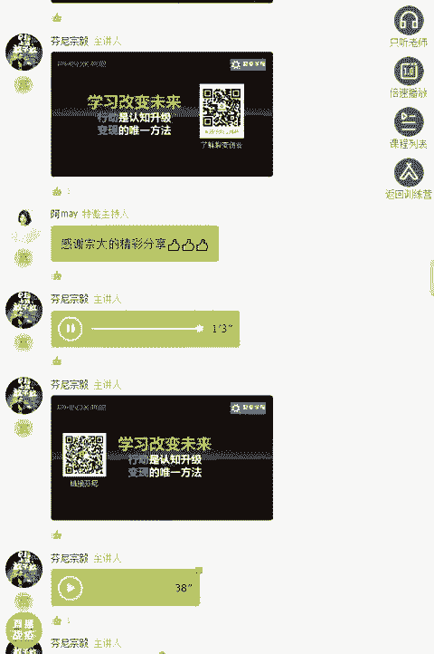

呃，最后呢是如果有啊想链接我们分尼的是吧？芬尼是做空气的热泵的企业，也做很多特种行业。那比如说新风净化啦，电视烘干啦这些行业啊这个。呃，什么污泥空干了，什么都有哎，不光是采暖啊。

当然我们也是中国空气的热门做的最好的企业，啊，可以扫这个码嗯。呃，也希望跟大家能够深度链接在各方各面啊，不管是企业管理还是IP打造等等都好啊。今天呢我的内容就这么多啊，谢谢大家。

最后呢看看大家有什么问题啊，可以在群里头提出来。

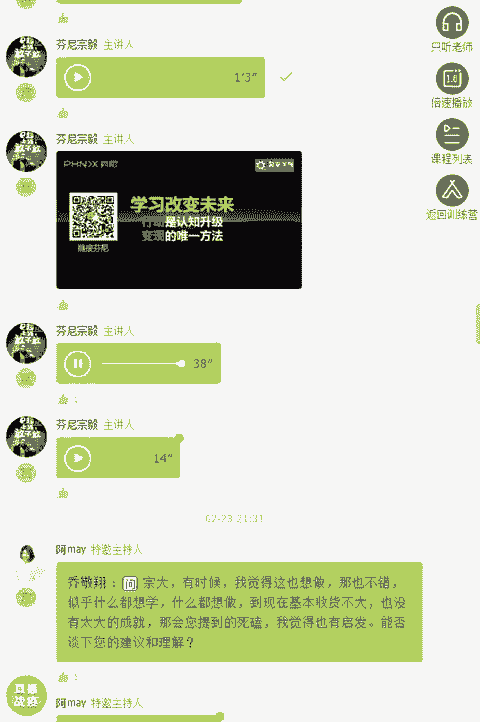

嗯。各方面都可以。呃，非常感谢大家花一个多小时来听我絮絮叨叨。非常感谢中大这么精彩的分享。我相信大家听完中大的故事之后，也多多少少都会有很大的触动。发现，其实你真正呃就是要让所有人都认可你。

其实本质上还是在于你自己的初心，以及你想为这个社会奉献些什么。😊。

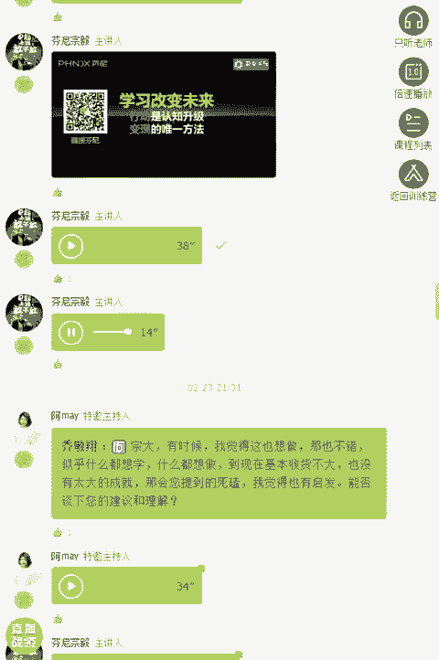

呃，那接下来呢是我们的互动答疑环节，大家可以在评论区提出你的问题。中大呢会根据呃大家的提问进行逐一回答。

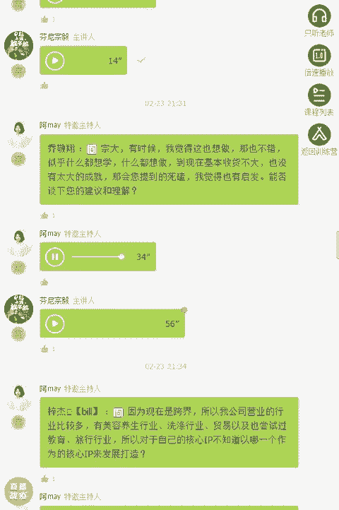

没。有个朋友问说，这也想做，那也想做，什么也做不好啊，的确是这样。

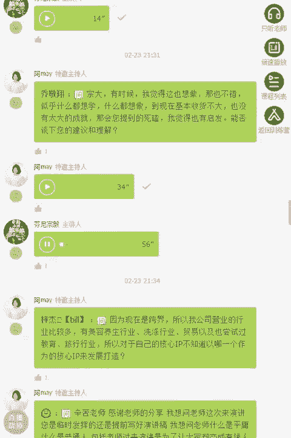

呃。IP打造呢，我觉得首先还是要把自己的事业做好。其实我在14年开始打造有意的到IP之前呢，其实什么也没想过。我02年创业，我兢兢业业做我的分级科技，做了整整的12年啊，然后呢在游泳池恒温热泵这个领域。

做到了世界第一。啊，同时我们是整个空气热泵出口行业中国最大的企业。啊，而且是那边是创业的创立者。哎，我做这些东西的时候是心无旁骛的在做啊，我也没有想过，那边是创业最后可以商业化。所以我告诉大家。

不要的试图去做一些呃这个花花肠子的事情。哎，那个是经不住推敲的。啊，一定是要把你的本业做好，非常感谢，这样的大家才会向你学习。嗯，刚才有个同学说他他有很多行业啊。

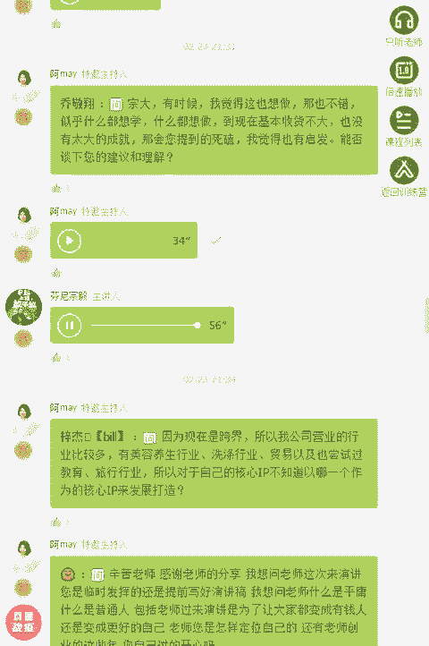

呃，这个呢其实我很难给出建议，我是觉得你还是要找到你的初心。你最热爱的行业是什么？啊，然后你在那个行业争取从为行业做事情。开始入手。是吧你比如说你做参与行业协会的这个发展，为行业做贡献啊。

去做你热爱的事情，而不是去做投机的事情。啊，很多朋友做企业呢，我也看到他们是这个做赚钱就做这个过两天那个赚钱又做那个。啊，他没有初心的，他的初心就是赚钱。那这样呢我觉得是打造不出IP的是吧？

很多人最近要转钱去做口罩。我觉得这个特别不好啊，就是说其实你心目中不知道你到底要干什么。啊，那你其实是个投机分子，那你打造的IP就是一个投机者的形象啊，一个投机者的形象，你觉得大家会向你学习吗？呃。

我这次跟大家来讲课呢，我还是有准备的。因为我这个课呢其实讲过好几次。那那这次呢我也是提前跟阿妹沟通过，根据她的需求来专门改了PPT啊，其实刚才上课之前，我还在改PPT呃，就是因为阿妹跟我说。

大家还是希望听故事嘛啊。呃。

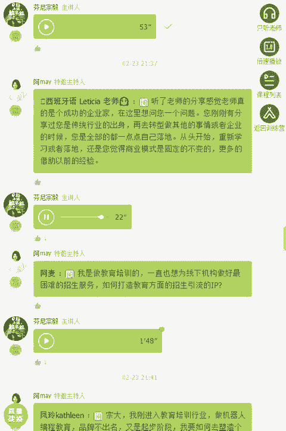

嗯，我做分尼科技的时候是一点一滴做起来的。但是后面转型做其他的行业呢，其实我是用那边创业的方式去做的。呃，为什么呢？因为这边创业其实。他是用人，他的逻辑是用人，就说你没有必要从头去学习一个行业。

那个难度太大了是吧？其实你只要用好愿意去做这个行业的人啊，用好那个行业的行家里手就好了。所以我们每一个裂变公司如果涉及到跨行的时候呢，我们一定会引入那个行业的专家。是吧比如说我们在污泥烘干这个行业。

虽然核心技术用的是我们空气的热泵，但是我们对空服泥烘干这个行业我们是不懂的。所以我们引入了清华的一个教授开的公司啊，我们是两家其实合资企业，这样呢我们非常顺利的进入这个行业。尤其一开始订单的。

都是这位教授提供的啊，所以说我告诉大家，你怎么样去团结人。这个才是最重要的啊。大家想想马爸爸就知道了。嗯，他的核心能力是什么？是吧如果你说专业。呃，他也不懂互联网是吧？他也不懂IT。但是他知道谁懂。啊。

然后呢他有使命运营价值观，他就靠他的使命运营价值观去团结了像蔡琼星这样的高手。啊，那就能成就阿里巴巴的事业。啊，所以这个是其中的呃最重要的一点。所以说其实你能够团结谁。啊，这个才更关键是吧？

其实打造IP对你团结人是特别特别呃有帮助的啊，就像阿梅和我现在其实我们呃就会成为合作伙伴，对吧？啊，那其实为什么呃大家会成为合作伙伴呢？啊，就是因为我们都想把这个呃职业教育，把创业教育把它做好啊。

这个是我们共同的使命。

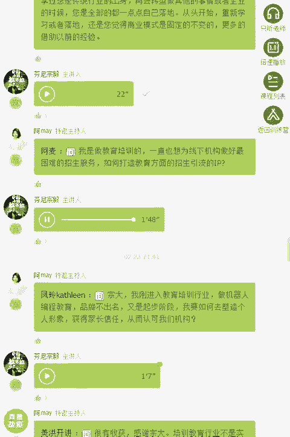

这个阿麦提的问题是我是做教育培训的。呃，一直想为上下机构。嗯，做招生服务打造IP啊，这个我觉得。其实是先有IP，你做什么都比较容易啊，如果你很有目的性的为你自己的这个企业打造IP我告诉你很难。啊。

其实你应该为行业去做事情。是吧你应该对你们这个行业做出贡献来，你慢慢就会变成IP啊。我我昨天给另外一个行业在讲讲课，他其实是我们暖通行业的，原来我的一个经销商而已。但是他这几年呢我觉得他变了。啊。

他专门去这个为行业的教育去发力。哎，他呢其实呃培养了很多他的竞争对手。是吧我觉得反而他在这个行业变成了1个IP啊，他请我去给他讲课，我也很愿意去啊，所以说其实你不要老想着为自己去做什么事情。

那个是成就不了IP。你要想的是为行业，为社会，为国家做一些事情，这个我觉得是前提。刚进入这个行业，就想做IP，我觉得不现实。

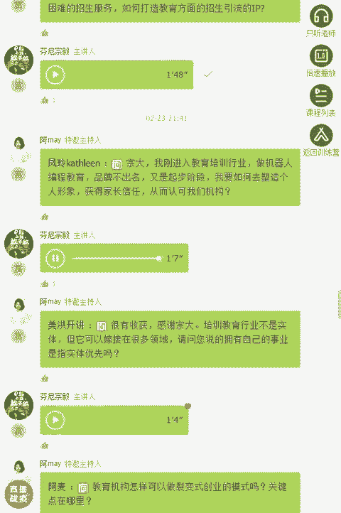

嗯，因为你以前并不是IP，你先把事儿做好。我刚才已经说了，打造IP的第一点，把自己的事业做好，做出特点来，你不一定要很大，但是一定要很有特点，要别人有值得向你学习的地方。啊，你连这些都没有做好。

光想打造IP这个叫本末倒置。因为IP不是演员，IP做的是真事，就大家一定要明白，演员是假的，演的好就行。是吧你说古月。他与毛主席很像。但是他是毛主席吗？是吧。啊，有多少人会向他学习。

那我们全世界的呃人民是吧？全中国的人民啊都在传颂毛主席。但是不会有多少人去传送一个演员的啊，演员演的好呃，注明是因为他演的好，但他并不是真正的IP明白吧？他并不是个人的这个。呃。

真实的呃这样值得大家学习的东西。啊，这个是有区别的。

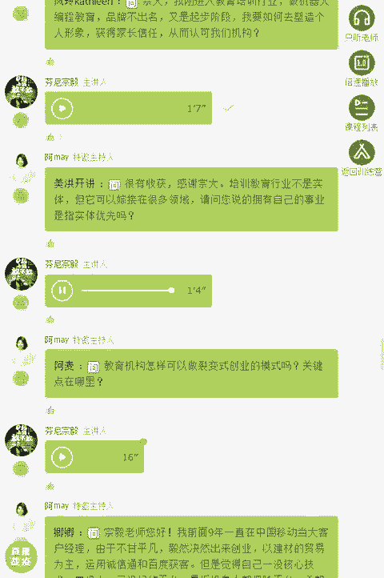

啊，事业当然不是实体，什么事业都可以是事业啊。李佳琦也是事业啊，那你觉得李佳琦是实体吗？

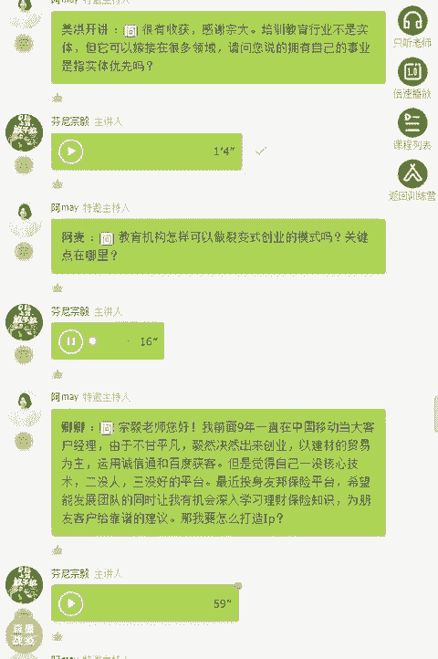

是吧阿没做的也是事业，做社群也是事业。嗯。嗯，绝对不是指实体。

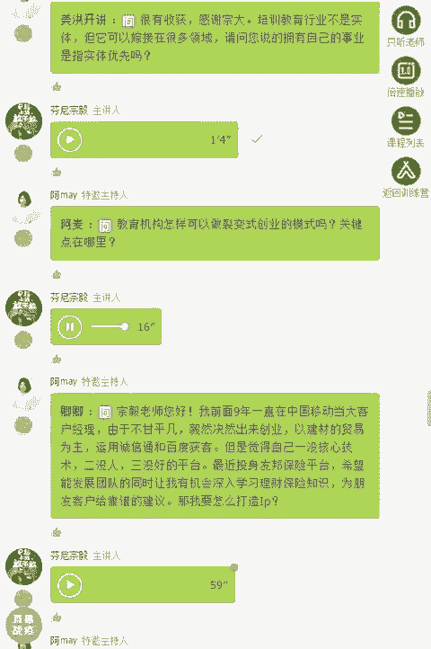

呃，任何行业都可以利用裂变的方式，裂变其实跟行业没有任何关系啊。大家老是喜欢讨论行业的问题。我建议大家站在人的角度去考虑问题。啊，那便是说你能够吸引大量想成就自己事业的人，给他们机会。

帮助他们成就自我啊，那这样的话就会有很多人愿意跟着你。啊，那你就能够做更大的事业，这个就是裂变式创业，是吧？每一个公司你都可以投资，都可以入股啊，都可以去帮助他们成功。这跟行业没有任何关系啊。

你们老是喜欢问行业的问题，我觉得这个问题我没法回答啊，哪个行业都可以裂变。其实我做实业，实业是裂变最难的，因为实业需要做产品，需要叫生产制造很麻烦是吧？裂变最容易的行业是微商。啊。

电商他们只要选品就好啊，其实那边就是找到合适的人啊，去成就他，去投资他。他当是他自己也要成为投资者。这跟行业没有任何关系。刚刚从这个国企出来的，我并不建议你打造IP，因为实在是很难。

因为国企所谓的能力其实很难说是不是你真正能力，因为你平台太大了。就怕你在航空母舰上指挥飞机降落，你以为世界都在你掌控之中。嗯，但是那不是你的世界是吧，那是美军。啊，那谁在航空母舰上经过训练以后。

呃都可以指挥航飞机降落。呃，那你试试看，你自己去成就一个美国。那完全是两件事情，对吧？两件差距啊几百万倍大的那个事情。啊，所以说呢。我倒建议你先去创业公司。嗯，先去学习学习怎么样做自己的事业。

所要当然你去保险平台也可以其实保险平台最好的是学习怎么样带团队。啊，但是在大平台上呢，其实你没有办法学习到前面的知识，你只能学习到很小很小的一个细分。哦，我以前是大公司出来的。

我出来的时候也以为自己很牛逼，后来发现自己啥都不懂。啊，然后呢只会很小很小的一点事情。然后那点事情呢，还要必须要在大平台上才能施展得开。是吧然后呢，自己独立创业完全不懂。

所以后来我是跟了一个创业的老板去学了三年创业，我才敢创业。啊，所以我提醒大平台出来的朋友们，千万要注意这件事情。你出来以后呢，你会失去大平台的支撑力。呃，然后呢。难度创业难度非常非常大啊，非常难以成功。

啊，所以一定要先去创业公司去学习啊，去跟着别人创业啊，用别人的钱交点学费啊，再自己去做自己的事业，这样更靠谱一点。做外包呢的确我认为不是一个好的行业哦，因为你一直在为别人服务。就大家想一想。

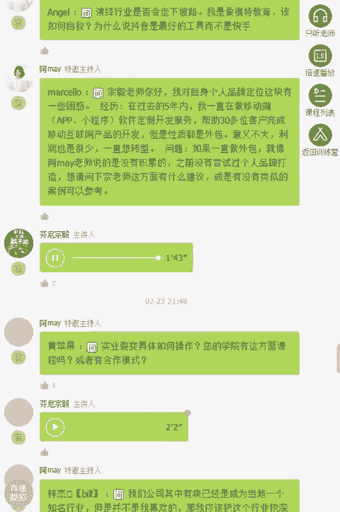

如果你是华为。你是在打造自己的品牌。那如果你是华为的供应商，你其实在帮助华为打造自己的品牌。我记得有一次在这个樊登老师的一个课上啊，我听樊登老师说话一语中地。当时也是一个。打造品牌的公司。

他跟他问反正老，他说你看我打造了某某品牌，某某品牌，某某品牌。他说的你品牌都很大。那反正老师说。如果说这些品牌真的是你打造的。那么你为什么不打造一个自己的品牌？是吧啊。

那就是其实说你是不是真的有能力打造品牌，那都是一个疑问啊，所以后来反正老师说，我建议大家不要做乙方。哇，当时我一听，我真是觉得这个这个怎么说呢？醍一醐贯耳，对吧？啊，就是说你其实做外包。

其实你就是在帮助别人成就事业啊，我倒不反对大家做外包，因为外包简单嘛，那那品牌公司叫你做什么，你就做什么。啊，我也是从这个这个做外包做起的嘛，对吧？我也是帮国际大公司做外包。但是你后来一定明白。

你还是要成就自己的品牌。啊，如果你不能成就自己的品牌的话，其实你很难说你去做个大IP是吧？就好像乔布斯跟这个。郭台明就吧郭台铭也是把外包做到了这个无以伦比才有一IP属性。但是大家想一想，除了郭台铭以外。

你还能说出来谁是做外包能做出品牌来的对吧？啊，所以说这个大家一想就明白了。如果你有能力，最好是去做自己的事业，做自己的品牌。但是这个难度要大很多很多很多啊，所以我倒不建议说你一定要去做自己品牌了。

那不是一个级别的事儿。啊，就好像你帮华为做生产，跟你自己是华为，那是一个差100倍难度的事情。

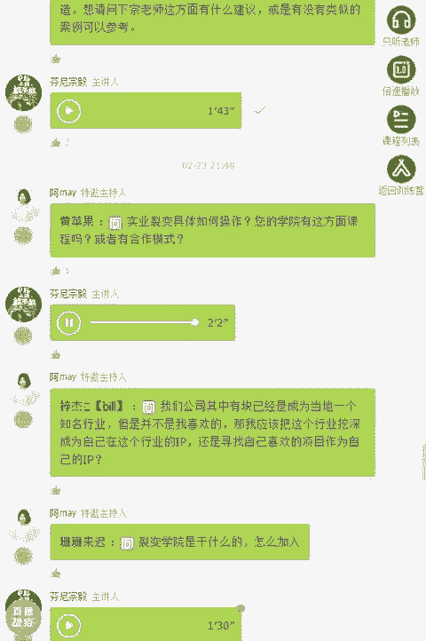

所以如果想致力于做品牌的朋友们呢，我建议你们先去品牌公司。啊，去学习一下，去大公司去打打工干一干，知道什么叫品牌。哎，那可不是做外包能够解决的。就像当年我为什么那边是创业要竞选。嗯。

我前面那边的几个公司其实都是给我们这个母公司做外包的公司，那个真的很简单，你把生产做好，质量保证，那我们就会用。但是你想打造一个分级科技出来，那可是百倍以上的难度。啊，所以说我建议大家呢先去品牌公司。

如果不是品牌公司出身的人。其实不太会做品牌啊，因为做外包的逻辑。跟做品牌的逻辑完全是两回事。啊，你想想富士康也曾经想做自己的品牌，但是他成功了吗？其实所有的苹果手机都是富盖康生产的。按道理，从产品来说。

它是没有问题的。是吧，但是它就不是品牌，你会买一个叫富士康的手机吗？啊，所以品牌代表的是一种精神。哎，那个可不是说产品质量好就能够保证的是吧？啊，茅台代表的是呃百年的历史是吧？

中国第一瓶呃第一白酒的这个传承。啊，那可不是说你只是酒酿的好就能做的事情。那有很多很多内在的生意在里头是吧？你像特斯拉啊，有多少人想学的特斯拉都有谁能学得成呢？啊，你没有穆斯科那种远大的理想。

没有钢铁侠的那个性感，根本上是搞不定的。所以大家千万千万要记住，不是说你能把一件事情做好，你就能做品牌的那不是一件事情。呃，我那个PPT上有裂变学院的这个联系方式啊，大家可以加进去。

到最后等一下阿梅可以把我们裂变学院的工作人员的微信啊拉到咱们群里头。啊，大家就可以呃链接裂变学院了。也很欢迎大家来裂变学院啊面对面的学习。

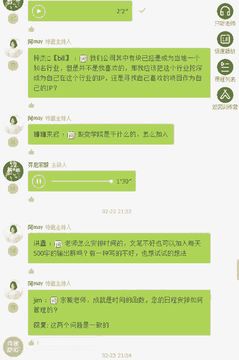

哎，那边轩那几天呢我都会在，反正大家有什么问题。各种各样的问题我都可以解答，而且你会看到其他同学。是怎么学习里边的？啊，所以为什么一定要到线下来学习？呃，就是你光看我的书，其实是没用的。

就好像你读过北京大学的书，跟你上过北大，那完全是两回事。嗯，我得益于我这么多年来高强度的线下学习是吧？我是华南理工的EMBA我是中欧的EMBA呃，混沌的创业营都是线下的呃，湖畔大学啊。

所以说呢一直在到湖畔到现在还没有毕业啊，经常还会有线下的大课啊，因为一定要到线下来跟同学们一起学习啊，其实湖畔大学的老师呢主要都是知名企业家他们其实没有太多的时间跟你讨论，但是湖畔大学的同学厉害是吧？

其实我们混沌大学也是一样啊，那么多优秀的创业者啊，企业家啊都在线下一起学习。这个其实特别特别好啊，我现在发觉呢线上学习其实大部分呢是个心理安慰是吧？你能够明白这个事情的道理就可以了。

但是真正的想有收获呢，一定是线下学习。啊，真正的有实操，有演练是吧？还有一个呢就是互相切磋，你搞不定的事情，可能你的同学早就是行家里手是吧？啊，其实真正的最好的资源其实校友资源。

你像我为什么能够拜那么多的这个名师，其实一步一步的是吧？我我在呃中欧认识了李尚友教授啊，然后成为他的这个大弟子之一啊，我是一起的学生。然后呢，李校友教授又把我推推推荐到湖畔大学。呃。

成就成了马校长的这个这个弟子。所以这是一步一步的。所以你你说你一下就想去上湖畔大学。那怎么可能呢？人也不会招你啊，对吧？所以说这个历程是一一辈子的事情。所以很多人想诉称，我觉得不可能的。我其实。

读书我这一辈子职业生涯，我基本上就没停过。啊，因为大量的各种各样的这种呃校友资源啊，校友的这个见识，其实帮了我非常非常多啊，这个我觉得为什么是学习是最大的投资，而不是其他的。就说你上一个中欧。

你上一个混沌，上一个湖畔呃，比你买一栋房子的价值要大很多很多。但是很多人宁愿花几百万去买个房子呃，却不愿意花几万块钱去读书啊，这一点呢我觉得是特别遗憾的地方。呃。

所以大家我建议大家每年把10%的钱花在自己的培养上面啊，这个特别特别的关键而不是攒钱去买房子，等你成功了，房子根本就不是个事。

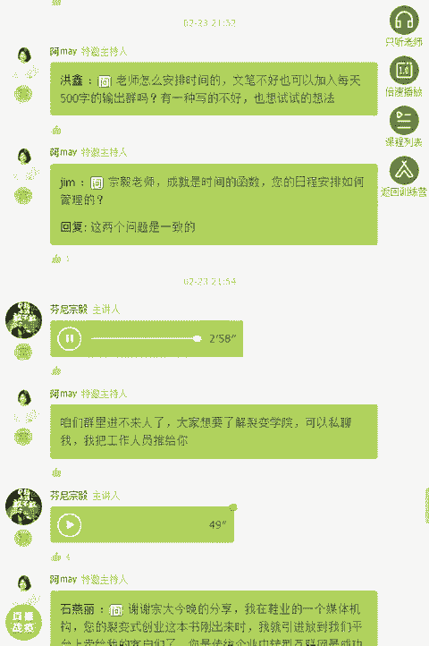

写500字，我现在20分钟就能写的出来啊，所以说呢你写不出来的原因是因为你没有思想。嗯，写不好也要写，先写给自己看，发到朋友圈里给其他人慢慢就写好了。谁一开始就能写好了，所以我觉得问这种问题呢。

其实你想过没有是吧？谁一开始就能写的好。那谁一开始就能够做大事业呢？任正非40多岁才创业。啊，所以怎么都不晚是吧？我30多岁全能去才去学英文啊，现在可以全球做英文讲演。啊，所以我告诉大家，你先做起来。

别问那么多，很多人老是说什么怎么写写什么，我觉得这都是没用了，是吧？呃，问这些问题，我都建议这是属于比较低级的问题。

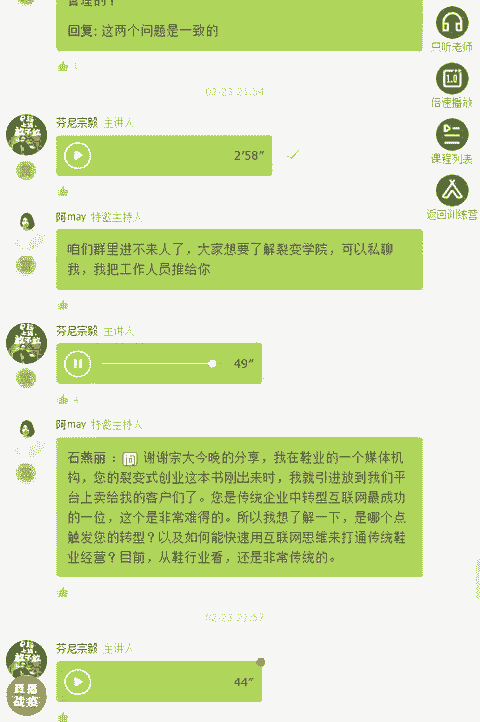

不。鞋子这个行业我不懂，但是我建议你去关注一下抖音，好像有一个叫什么专门卖大码鞋的女生，呃，做的特别好，她就把她变成了，因为她个应该叫叫高个子。高个子敏哥吧，好像是叫这个你搜一下高个子吧。呃。

专门卖鞋的，人家呢每天都能卖很多鞋。呃，就靠拍抖音，一定要拍出性格来哎，打上IP了。你要靠普通这种卖鞋，那你跟别人其没什么区别。是吧所以我说其实你们很简单，你们上抖音去学习一下，你做任何行业。

你到抖音去搜一搜都能搜得到。你看看别人是怎么做的，你照着做就行了。其实卖鞋比比卖我们空气能简单多了。

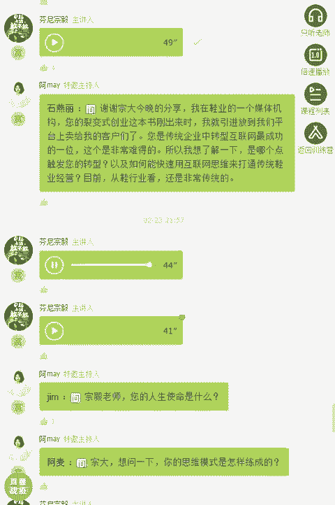

其实越传统的行业越好做，因为传统的行业里头的这个互联网人才不多。那这个时候你的竞争对手比较弱啊，就说比如说我去做腾讯这个行业，那我必死无疑。啊，我们空气能这个行业呢就没有雷军师这样的英雄人物是吧？

所以我就写得还可以。所以说大家一定要做降维打击。用互联网思维去做传统行业。啊，其实做互联网的行业挺苦逼的，你想想你的对手都那么聪明是吧？都是马化腾、马云这个级别的人，那你怎么赢啊，难度很大。

但是反而传统行业呃基本上没有这样的人，对吧？那你这个时候你从互联网行业学到的那些东西用来做传统行业是特别特别好用的。我的思维模型是怎么炼成的？我告诉大家，对我影响最大的就是混沌大学。

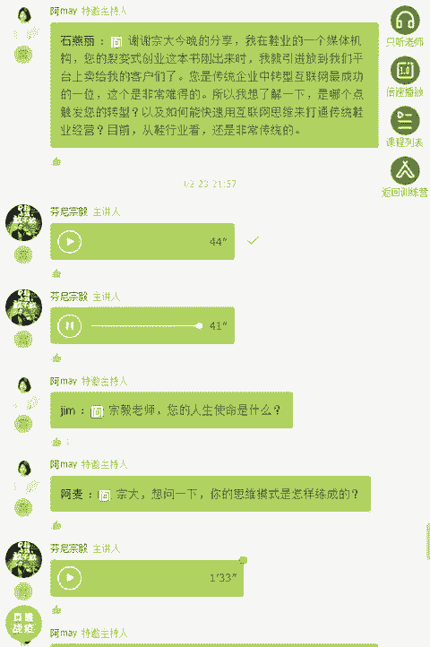

哎，我思魔型真正的转变就是2012年，我进入了周国创业，就是霍南大学的前身。啊，所以你们想转变思维模型啊，我别的都不推荐，就推荐混沌大学。你们上网去下个APP交1000块钱，你就可以学习了。

你把混沌的所有的课都听了，你的思维就一定会变。因为我觉得他是中国创新教育做的最好。啊，嗯思维变了，其他才能变。啊，其实你要想你思维变化，唯一的办法就是学习啊，去跟那个你值得学习的人学习。啊。

还有一个我教大家。一个关键的点，有很多人问。哇，这个人跟我说这么做，那个人跟我说那么做，我到底该怎么做？😡，嗯。其实呢你最重要的就是。去看谁是你值得学习的那个人是吧？如果你想成为谁，你就听谁的是吧？

那有很多可能你的这个亲戚是吧，你的朋友啊，都给你以这个过来人的姿态给你讲一些什么老人眼，对吧？这个时候大家怎么去判断呢？你就去看断这个人的人生是不是你值得学习的那个人。啊，如果他不是你想成成为的那个人。

你就不要听他的。啊，你想成为谁，你就听谁的。是吧你想成为我这样的人，你就听我的。啊，你不想成为我这样的人，你就别听我了。😡，嗯，这个就比较准确了啊，否则的话各种各样的观点，你真的不知道该听谁的。

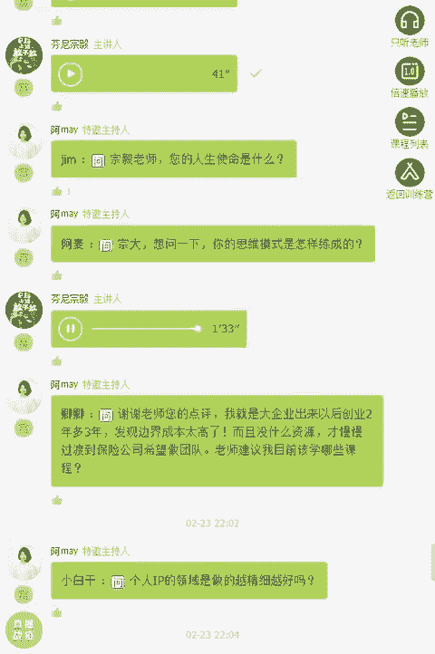

如果你想创业，就去创业公司学习。啊，因为你在大学是学习不到创业的。啊，所以我对这些想创业的年轻人呢，我给的建议是你毕业以后，你在大企业兢兢业业的干个两三年。够了，不能太长，因为太长以后。

你的思维模型就变成了一个螺丝钉的思维模型。你的眼界就会变得很窄。然后呢，赶快去创业公司，跟着创业的老大干个两三年。大家要记住，一定要想办法混到老大身边。就像你是马云的司机，和你是一个普通老板的司机。

肯定是不一样的。啊，你能够介绍的信息是不一样的。那具体怎么样混到老大的身边，那你肯定是要把事做好，老大才愿意带着你是吧？所以说一生都要努力工作，打工的时候要用老板的心态去打工啊，那跟老板的心态呢。

那更要以老板的心态去打工。让那个厉害的人带着你啊，我刚才跟大家讲的猪八戒就是这个意思。你跟在唐僧的身边。你就能臣服。是吧你跟在一个什么牛魔王的身边，你就是个妖怪而已。啊，所以这个大家一定要注意啊。

你怎么样能够去到厉害的人身边，那真的是要费一点功夫的啊。你加入太大的企业，你说马阿里巴巴已经这么大，你想混到马云身边。嗯，那太难了，所以说你一定要在还小的时候就加入你这个才是有可能。

所以这个世界是比眼光的。就好你嫁对一个人跟嫁错一个人，那一生完全不一样啊，所以一生啊只有一个能力是特别重要的那就是看人。是吧在你没有办法用人的时候，你要跟对。啊，你跟了马明哲，你跟了马云，你跟了马化腾。

那就比你跟一个普通老板要强得多。啊，那在你有能力用人的时候，你要看对人。啊，就像嫁人也是一样啊，看对一个人啊，这个才对的啊，特别是当你团队打的时候，你更加也会看人。啊，其实雷军说他用80%的时间在找人。

那不就是在看人吗？啊，这个其实是人生最重要最重要的能力。好，回答最后一个问题啊。这个。

也有同学问做IP是不是越行业越精细越好，我觉得不是的啊。啊，其实IP呢是越宽泛，我觉得还会更好一点。就是这样的更多的人能够接触到你吗。这样你的威力就更大嘛，对吧？

所以为什么你看我的这个IP不是打造我在空气的热泵的这个领域，而是打在我在这个企业管理，在那边是创业这个领域。哎，因为那边是创业是没有行业的。我刚才也说了，什么行业的人都跟我们学习呃。

我们那边学员现在大概有3分之1的这个学员居源来自于互联网。哎，啊居然还有微商，对吧？所以他们用我这个特别容易用，因为他发展速度特别特别快，反而实业的难度会越大。

因为有生产制造、质量管理了一大堆的东西裂变起来会更麻烦一些。啊，所以说呢。其实我觉得如果有可能呢，当然是越宽泛越好。你像樊正老师的IP，我觉得就是特别宽泛啊。对，应该他讲的孩子教育是最大的一块是吧？

什么创新创业也是一块啊，职场也是一块啊，还有什么论语啊，这些文化的这一类啊，所以说特别特别宽泛，这才是大IP。是吧你你你范围越窄了，你威力就没那么大啊，就有可能做的大那肯定是越大越好啊。

但当然难度也是越来越大。嗯，但是呢。刚开始的时候肯定是从某一个细分领域开始，对吧？好，这个。

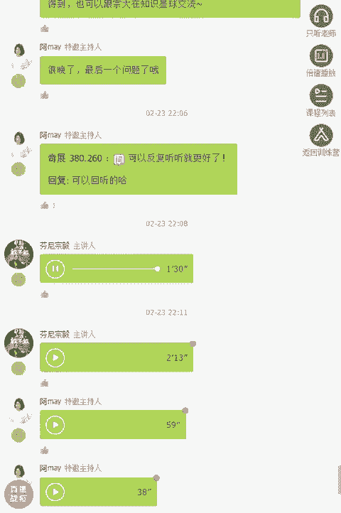

呃，非常感谢大家啊，呃，已经很晚了。😊，这个咱们今天的这个讨论到此为止。啊，如果以后呃大家还想这个跟我交流的话呢，可以加入我的知识心球也好了。呃，或者是在抖音上也可以是吧？其实要想找到我其实很很容易啊。

很多人老是问你在哪里找到你，其实我觉得这属于不用心啊，其实你想想做一件事情。你要抱着必胜的把握。是吧一定能找得到啊，这样才可以。哎，我记得当年有一次我去面试。呃。

当时我的湖畔同学刚好参加了我那次在大学的面试，他突然出了个主意，他当着所有那天参与面试的同学说，他说今天晚上。如果有谁能够把一个信送到呃中艺住的酒店。怎么样？第二天你就会被直接录取。嗯。

但是大家呢其实都当这个是来开玩笑，其实不是开玩笑。我当时还问那个同学，我说。万一呃第二天有100多个人送信送到我那里，那我是不是都得收？他跟我说，你放心。很少有人愿意去干这个事情，结果呢就有一个女生。

她晚上一直跟踪我们，跟踪到我们的酒店。把该做的事做了啊，就一个人啊，所以说我告诉大家，其实最终还是看你的想不想成就这件事情的欲望是吧？嗯，如果你你成就的这个欲望不够，其实你什么事也做不成。啊。

打造IP是有难度的，但是还是要看你是不是真的特别想成就自己。啊，如果想成就自己，你就按照我的这个方法论，先把自己该做的本职工作做好啊，一点一滴去做，不要有太多的功利心。啊。

如果你一开始就想着自己什么要出名啊，要什么，那是肯定做不到的。嗯，IP不是演员。啊，我告诉大家，就算是演员，要想成名，也是非常非常难的啊，万分之1的机会都没有。哎，你去看看横店那些跑龙套的。

你就明白是怎么回事了。好，谢谢大家。今晚到此为止，谢谢谢。针对这个同学的问题，我想补充一点，就是就是我上节课不是讲过那个个人IP打造，要做一开始做就要做细分领域的第一嘛。

就是这就是为什么一开始让大家去选细分领领域，选单点聚焦的原因，是因为你很容易在细分领域面做到第一。就比如说我们说做营销，你要做营销大师，你现在是面临的竞争对手太强大了。

那你为什么呃你怎么去做到在营销这个领域里面有一个个人品牌呢？那你就可以去做营销的某一个点，把它一点做到第一，比如说我在裂变，我就专门去拱拱裂变，对吧？那你可以转拱什么呢？拱转介绍，拱复购呃。

有些人专门管会员管理，哎，你就可以拱这些细的点，你把这个点做的很透，做到第一，你就很容易在这个点上冒出来，当他冒出来之后呢，这个。

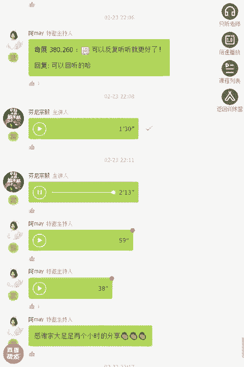

当你在细分领域冒出来之后呢，你就可以把你的IP出圈，继续扩大，把你的这个IP面对的领域呃继续去扩大它，把你的能量就是往坏散法。呃，这样的话，慢慢的话你就可以把你IP影响力拱起来。呃。

当然你后面选赛道的时候，如果你有一定的影响力的。那你肯定你选赛道的时候，面面对的人群越广泛越好。呃，当然我们说越广泛，但是也是有相对应的定位的。不是不是呃我这普罗大众呃见到鱼就捞啊，不是这样的。

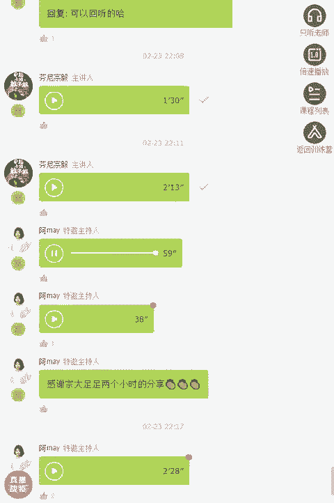

非常非常感谢中大今天晚上足足两个小时的分享。我想今天晚上的分享，最重要的就是其实不是说真正的告诉大家，就是具体怎么去执行哈。我觉得最重要的是让大家从认知和思维上有更多的启发。呃。

尤其是中大讲到就是在打造个人IP的很多的方法的时候呢，它其实其中一直强调的一个点，就是你要打造自己个人IP前提是你一定要做事，其实也是如此。个人IP就是要你先做出一件牛逼的事。

所以我们当初在给大家去说怎么去做个人IP的时候，也是让大家先选好赛道之后呢，选好你自己要定位要做的那个标签之后呢，你一定要想尽办法让自己超越90%的人，成为这个领域里。里面真正的专家，真正去做到实事。

真正把你的案例打造出来。这样的话你才是真正名副其实的。否则的话就跟钟大所说的，你就是个演员，那就没有任何作用。你知道吗？如果你把IP名字，你想亮已经打出去了，宣传做的很棒。

但是别人找到你发现你根本没有那么多量。那实际上你的这个个人形象和个人IP也会一下子碰塌的。所以其实前提还是大家要去打好基础，练好内功，把自己真正要做的事情，好好夯实基础。如果现在不会那去去学习。

真的学习是一辈子的事情，要不断的去学习，不断的去成长。呃，要舍得花钱去投资自己。好，那今天晚上的分享就到这里结束了。呃，还没有教我们这两天的作业的同学要记得及时去玩。成作业。明天呢我会给大家去分享。

就是前面已经给大家去分享怎么去做呃，就是产品的体系和个人IP以及内容的体系。那明天我给大家去分享怎么去做裂变和引流了。那明天晚上8点，我们继续在直播间再次相见。好，那今天晚上就分到这里啦，感谢大家。

今天晚上两个小时的陪伴。😊，我们群里再见。

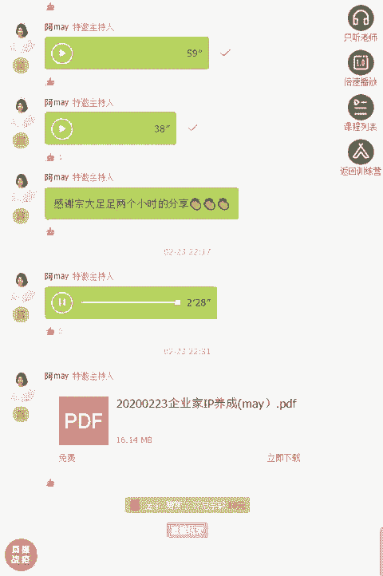