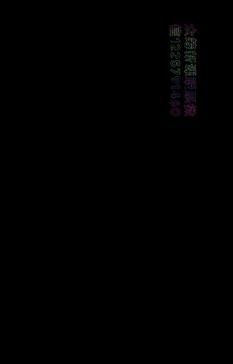
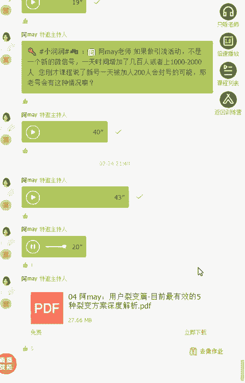

# 微社群裂变营销私域流量池增长秘籍创业运营销售获客视频课教程 合集 8套 374资料 13.1G 定位策略篇：一套让用户自动找上门来的营销方案 - P5：【Day08】用户裂变篇：目前最有效的4种裂变方案深度解析 - 高端网创试错赚钱大师 - BV1tn4y1X7Sv

hello，大家晚上好，欢迎来到21天获客成交实操营的第八天。😊。

那因为我们今天准备内容比较多，为了大家的听课体验呃更好，所以呢我就提前开始讲课了。好，那我们还是回来复习一下我们之前讲的内容。可能呢很多同学以前学习的知识点呢都是一个点一个点去学习的。

第一次呢遇到是我们这种类型的，就是我是希望让大家有一个整体的运营体系的一个结构。所以呢前面的课程呢会更加从一个运营的负责人，运营的操盘手这个角度呢？带大家怎么去了解一下，就是作为一个运营的操盘手。

你应该怎么去规划你的项目，应该怎么去策划你的整个产品体系，所以可能有些同学呢会觉得哎有一点懵呃，是不是要做事情太多了。呃，我我觉得是这样的哈，就是大家再跟着我的思路回复一复习一下我们之前讲的内容。

第一节课呢我带着大家去学习，就是我举一个例子，假如说现在有个项目交到你手里，或者说。你要成为一个项目的咨询的顾问。那你怎么去快速着手去了解这个项目情况。

然后怎么去帮他规划这个项目的呃就是接下来的运营动作。我是从这个角度去切入的。所以第一节课呢告诉大家，就是在掌握运营模型的时候呢，其实你有个运营模型。

抓住这个运营模型去部署你的这个接下来的运营动作就可以了。我给到大家运营模型呢，就是我们说的裂变式增长的模型。这个模型就是客户是从引流到裂练到成交到复购到转介绍，就是5个行为。

你所有的运营动作都围绕你这5个行为来行为来进行的。那么作为一个创业者或者作为一个运营负责人，刚开始的时候，第一步并不是马上着手去做运营的方案，而是先去了解你这个行业的情况。呃，另外的话要去。做好。

接下来你要卖的产品是什么，也就是要规划好你的产品体系。那怎么去快速了解你这个行业的情况，呃，怎么去了解你这个行业呃竞品的情况呢？所以呢我第一节课告诉大家怎么去规划这己产品体系之外呢。

给大家布置了一个作业，就是拆解行业的案例。其实呢呃很多朋友啊可能自己未来也会去面临着创业，或者自己想去做一个新的项目。这一点大家一定一定要记得，就是你当时该开始一个项目的时候，千万不要活在自己的世界里。

要出去看看天看看地，也就是要了解一下竞争对手现在是一个什么样的一个情况。市场是什么样的一个市场。整个用户端是什么样的一个需求，而不是就是受限于自己呃，我好像也对这个行业做了几年了，我很了解这个行业。

有的时候并不是这样子的。所以我是建议大家就是你要了解一个项目也好，或者自己要创业的也好。首先第一步就是要去做做好调研。这个调研怎么做呢？呃，最快速了解一个行业的方案，其实是了解你这个行业的报告。

因为有可能很多行业这个是都已经有很多人去做过调研了，他们已经输出很完整的这个行业报告了，所以看行业报告可以快速帮你了解这个行业的大致的情况。包括这个行业的供应端有哪些供应的供应商，用户端有哪些需求。

然后现在整个行业的这个市场的规模前景，以及现在整个行业的用户的痛点。呃，这个用户现在想要解决的方案，这些等等等等这些东西，可以从行业报告里面快速了解到行业报告去哪里找呢？第一个就可以去百度搜索。

比如说行业关键词加。报告两个字就可以搜出来。第二个呢可以利用就是像现在很常见的调研平台。比如说艾艾瑞资讯、艾瑞资讯，还有那个呃。呃，有1个199IT的咨询网站，这个网站里面有很多可以做调研的工具。

可以去那里找。另外的话，其实市面上有很多这样的报告，已经被别人收集起来了。所以呢你可以通过什么样的方式快速找到呢？闲鱼或者淘宝上面去搜你这个行业在家报告两个字，也许会收到很多这样的一个资料库。

然后可能花几块钱就可以购买了。呃，这是第一个这是收行业的报告。第二个呢就是去拆解竞争对手的案例。这个呢是也是很快去了解别人正在做什么。然后别人正在用的营销手段是什么样的呃方式，这是一个很快速的方案。

所以呢给大家留下的作业就是去拆解行业的案例，怎么去猜呢，就是去找你这个行业，比如说你认为他是做的比较好的，你去了解它推广渠道是什么。然后呢是用了哪些推广的动作，阅读量最高的十0篇文章是什么。

然后呢参加的活动，哪5个活动人数是比较多的，这些东西你调研出来之后，你很快就会了解到用户的真正痛点是什么，也很快去了解到到底用什么样的运营方案或用户会喜欢会受欢迎呃。

很多朋友说呃我这个行业我很难找到运营的复盘资料。如果找不到运营复盘的资料也没不要紧，你去猜你去猜去。了解你这个行业的竞争对手，你去猜他的案例。那你就是在做这个行业的复盘了嘛。

那当然如果能够找到别人复盘的案例更好了，是吧？别人都帮你猜完了。所以今天呢我今天的课程之后呢，我也会给大家带来。所以今天呢我也给大家带来一个大礼包，我们整个助教团队呢呃花了几天时间去做整理。

把呢很多行业的案例的复盘资料都整理起来。然后呢呃到时候会发给大家，就是我这是我们整理的资料，而且很多资料我觉得是非常非常好的。呃，就是复盘的资料会给到大家好，这是第一节课讲的内容呃。

我还是希望大家能够呃快速去回复一下。然后呢，第二节课讲的是什么呢？就是比如说你接手一个项目也好，或者说你自己要出来创业也好，第一步就实做做完了产品之后，马上就面临的是要去推广去获客了，对不对？

那很多人直接就着手去做推广了。那在做推广之前，我其实觉得大家需要做一个准备。这个准备呢就是做你的品牌。这包括其品牌的名字啊，包括你整个宣传资料的准备啊，这些东西都是要去做准备的这资料库。

那么这个资料库呢，我认为首先第一个呢就是要做品牌。因为对于很多人来说，你做一个企业的品牌，其实一下子要去做成功其实很难。但相比来说的话，做个人品牌会更容易一些。

所以呢我就从个人品牌一个角度去给大家去讲述为什么要去做个人品牌等去打造自己的个人品牌。然后呢，有525条就是做个人品牌可以用得上的宣传引流的方案给到大家，实际上我是想从个人品牌这个角度切入。

让个大家更多的去了解说，不管你是作为普通人也好，作为企业主也好，你都可以从个人。这个角度去打品牌。呃。另外的话就是。这25条的宣传方案不仅是可以用于个人，很多企业的宣传其实也可以用得上的这是引流的方案。

好，我们学完引流之后，马上要去学裂变，对吧？那写完引流之后呢，又在引流的过程当中，除了个人品牌之外呢，其实有一块很大的重要的内容，就是要去做内容营销。

也就是说有很多东西你需要去勾引别人来到你的流量池里面呢，那用什么来勾引呢？就是用好的内容。那好的内容怎么去做呢？所以第三节课呢，我给大家去讲述，怎么去快速生产高质量的内容，嗯，那从高质量的内容。

生产的过程当中，我给大家五个方案，就是你你要去生产高质量的内容。首先呢基本上你自己要成为这个领域里面的专家，对吧？那我给到大家的一个方案就是可以有这五步步骤。第一个呢向大师学，就是去看书。去学习。

尽可能的把自己的知识架构给构建起来。那知识学完之后呢，你就基本上掌握了这个行业比较好的知识了嘛。好你学完之后呢，再去找高手问，去讨教一下他们的成功经验。比如说去跟在在行的行家去约。

就跟他们进行深度进一步的交流。另外呢就是加入社群，加入你这个行业里边比较好的优质的社群里边呃，加入这个社群呢就可以跟别人快速进行沟通交流，并且可以快速获得这个行业的最新的资讯。呃。

但是呢前面其实都是被动吸收，都是去学习。啊，但是呢后面这两种呢就是需要自己去主动输出。比如说主动去做分享，你把学来的东西去分享出去，就要分享出去的东西，在这你真正学到的东西。然后学完之后分享之后。

你还要学习，怎么去实践去实操。只有真正实操了这个东西，你才去真正掌握了这个本领才去真正掌握到你手里的。我相信通过这五个步骤，你一定可以成为某一个领域里面的专家。你一定会超过这个领域里面90%的人呃。

另外的话就是很多朋友去做这个内容的时候呢，主要是做两个，一个是做课程，一个做社群。所以呢我也从做课程的角度呢给大家去说我是怎么去做课程的呃，最有效的做课程的快速的方法是什么？所以定出你的人群。

然后呢找到你这个行业里边做这个课程的标杆对象。然后把它提纲进行拆分，呃，拆分之后，你再重新去做组合，最重要是磨出大纲，磨出大纲之后呢再去做调研，做出调研，做出大纲就是最重要的。然后你就去开发课件嘛。

对吧？嗯，对于做一个搭建一个社群来说，你只要抓住核心的三大需求，获取资讯，学习成长和历接人脉的核心需求。然后呢，可以用通过自己输出加巡肉输出，加邀请嘉宾借力分享的这三种模式，快速输出内容。

具体的课程的话，大家去可以看我们之前的课程回放。好后昨天呢呃听完中大的分享之后呢，有一些朋友私聊我就觉得呃是不是做个人品牌太难了。呃，觉得要做到中大这样子，然后感觉我自己肯定做不到。

实际上呢就是我我是觉得是这么说的，就是为什么强调普通人也要去做个人品牌呢？呃，我觉得中大讲的就是他讲的其实是你已经做出一个牛逼的事情之后，你去做的事情。呃，但是呢在前提你要做牛逼的事，对吧？

那我其实为什么要强调大家要去做个人品牌呢？我是希望大家有一个明确的赛道和方向给到大家。给到自己定下这个目标之后呢，你再针对这个赛道和这个方向。专心致志的把这个案例打磨出来，然后打磨出来之后呢。

打磨出来之后呢，你再通过我们说的宣传的方案，把这个放大，然后呢把你的这个个人品牌打造出来。啊。所以说其实这里边最重要的一点其实是呃你自己呢首先要选好你自己的赛道。呃，如果你做不到全网很出名，没关系。

在你的圈子里面，你能够把你的能力让大家所认知哦，把你的所做的事情让大家都知道这已经是一个个人品牌的一个小范围的个人品牌的输出了。所以不要觉得我是不是真的很难重点是你是不是要去做呃，执行才是最重要的。

像我刚开始的时候，我也想不出来，我自己可以跟中大成为好朋友，我自己根本想不到，就是你其实是事情是靠人做出来的。呃，永远不要想的，我自己就是一个普通人。呃，你就是一个普通人。如果你只想打两份工。

那那那你就是做普通人，你就不要去打个人品牌了。你可能最合适的工作，就是去。找一份教师或者说医生这样的一个工作去做。呃，就这种就不用打个人平牌，就算是打医生是教师难道不用打吗？个人品牌吗？

一要去的需要的是吧？医生别人也是任专家教授啊，有名的医生啊，是吧？然后老师的话也是要看老师是哪一位老师的，对吧？所以其实不管你从事哪个行业，还是需要把自己的这个能力提升，这是最重要的。

做出你自己牛逼的事情。呃，那这这两个。这这两天呢我看了很多朋友的案这个作业哈，我我点评一下，就是呃有有一个朋友跟我说，就是他在学第一节课的时候呢，觉得自己很有很有的想法。

然后后面学后面的课的时候觉得有点懵逼，没想到哎原来做一个项目要思考这么多东西的。呃，原来只是觉得哎做一次裂变活动很简单而已。呃，当然我今天讲的课程呢会涉的涉及到裂变活动，怎么去做。

但我是希望大家有一个全局的思维，这样才能够真正帮助到大家说真正从认知层面上和思维模型上，真正提高大家整个呃这个整个能力圈的。好，我们来看一下今天完成作业的同学，我想我选了三个案例，其实我选了这三个案例。

比如说这三个案例一定做的很好，或者说呃呃其他的没选上就是做的不好是。这样的我选出的案例呢，我是觉得有一定的代表性。另外的话我觉得可能里边有些案例呢呃可能会有一些些问题。所以我单独拎出来呢呃告诉大家。

你在写作业，或者说自己在以后写文章的时候要注意的点。Of。比如说像这位张张艺张艺默是吧，这位同学哈，他其实跟我说到，今天他跟我私底下也有交流，他其实针对的目标对象是宝妈人群。然后呢，他就很兴奋。

学习完之后呢，自己想了一个品牌叫做堂克邦。呃，我觉得这个其实就是容易犯的一个问题，就是大家在想品牌的时候啊，自己觉得很厉害啊很厉害。这个品这个名字。然后结果我自己看的时候，堂课帮。

我觉得跟妈妈一或或者跟宝妈我一点关系都没有联想得到。所以我今天还跟他说，我说这个名字可能是有问题的。呃，你自己要好好想一想这个堂克帮到底是面对的对象是什么。如果你要面对的是宝妈人群，那宝妈人群。

你应该我觉得可能辣妈帮可能还会比你这个堂课帮要就快速都好很多，包括我之前在帮一个购物去想一个叫辣妈能力圈都可能会比你这个堂克帮要好很多。所以你自己要想好，就是自己真正面对对象是什么。

然后另外的话你起了这个品牌名字之后，一定一定要去做调研，不要陷入到自己的思维里面。你陷入到自己思维里面有可能就是你自己觉得很好的一个名字，但是用户根本一点感触都没有哦，这这这其实是我们容易犯的一个问题。

就包括我自己都觉得我自己经常做的一些海报，有可能自己觉得很好。但是呢拿出来一看，唉，去问一下用户可可能客户并不是特别。的感冒。所以呢不管做什么，我都会去做一下用户调研这个动作，然后再迭代去修改。

你会发现再牛逼的这个策划，其实还是需要过用户这一关之后，他再去迭代修改之后才会真正牛逼的。不是他看到这个呃这个方案以后一策划就很牛逼，不是这样的大部分牛逼的案例都是在不断的策划。呃。

修改迭代之后才会真正变得好的。你你包括真正好的产品也是如此。你看微信微信很多功能做出来之后都是要灰度测试。灰度测试之后，有些功能。如果觉得效果不好，他就不开放了。嗯，都要去做这样的动作的。这是这位同学。

我觉得最大的这个点我要拎出来跟大家说的。第二个呢是一个叫吴秀。哎呀，我我这个。我我这个名字我听看不太明白啊，是吴秀莲是不是啊，还是吴秀金啊，不好意思，我就觉得可能就是你自己的名字。

如果爸妈给你起的名字有这种就是比较生僻字的话，还建议自己修改一个同音的，比较好记的名好一点。这个这个吴同学他完成的作业我觉得非常好，而且他还很认真完成了一个抖音的视频。而且呢视频我觉得拍的非常棒哈。呃。

我不知道你是不是第一次拍，但是呢我觉得拍的非常棒，因为你还配了字幕，就是抖音上的视频一定要记得加字幕，你会看到抱的视频基本上都加字幕的，不加字幕基本报不了。

然后这个同学他完成的整个案例就是按照我们给出来的问答模板来做的。你看到他其实呃很明显的几个点哈，第一个点就是告诉你怎么养出大长腿的宝宝，然后呢要想有个大长腿的宝宝只要做好这三点，尤其是第二点。

你看他举了第一步是什么。第二步是什么，第三步是什么，然后最后还留了一个勾子，关注我，下次告诉你怎么样孩子不挑食。所以整个模板是不是就按照我们给的模板来写的。

但是你会发现这样写是不是很快速就可以出一篇文案出来了。所以。😊，大家如果觉得自己不会写文案，就按照我们给出那个问答模板，就把你的客户100问，就按照这个问答模板每个门的这么写，这么去拍视频啊。

然后呢这么去分发各大平台一定会有效果的这是一定一定会有效果的。另外呢我还挑了两位同学，一个呢是叫不忘初心，不忘初心，这个也是完成的非常的好。你看他给出了那个模板也是按照我们说的模板来写。

就是第一个给出一个问题，如何培养孩子的时间观念，然后你主要是做好这三点啊，第一点第二点，第三点，然后呢持续在关注我，下次告诉你再玩5分钟的要求，要不要答应呢？哎，你就会发现这个钩子留的很好。

我觉得就是这两位同学就是在钩子上还是设计的很好的。而且呢整个模板也很清晰啊，这样的文字大概是这样的文字去拍短视频也很很很很好拍。我看到这个同学呃他虽然不是真人出镜啊。

但是呢做了很棒的这个短视频是那种多字去叠加的。所以这两位同学我真的觉得呃还好多位同学都拍了短视频。我觉得大家执行力真的很强。还有一个乔同学乔同学呢。呃，他的这个案例呢，我想单独拎出来。

是因为他发的那个几个平台。我看他是发头条号的。刚好呢有很多同学也在问我，就是他会发现自己的文章发头条号呢，呃虽然是呃呃如如果你发头条号跟知乎跟搜狐这些平台来相比的话，你就会发现你发头条号。

他站内的资源扶持还可以，但是呢你就很难说你的头条号会被百度搜录，然后通过百度搜索。看到你头条内容来关注你的。呃，而且头条呢其实它的就对留公众号啊，留微信啊还是有比较多的这个呃呃限制的。

所以呢其实我是建议大家就是除了头条号，还是一定要去做知乎简书和那个搜狐。嗯。知乎简书搜狐这几个平台呢，它比较好的就是它是百度收入特别好，权重特别高。往往就是你在百度上搜索。

也很容易搜索知乎和这个简说上的内容的。另外的话。就实很多朋友在写的时候会忘了一个点，就是你会忘了留钩子，尤其是在头条号，你如果不能留下自己的文章呃，自己的微信号之类的，一定要留个勾子。

要他去你后台回复一个关键词啊什么的，要你信引他加你微信啊，所以呢钩子还是一定要记得留的，要不的话，你每篇文章发出去，你真的只是在做奉献，但是没有给自己留下一点什么。啊，因为我们之所以发文章。

我们最重要的目的还是要引流嘛。好，那前面的作业就点评到这里。那今天呢主要是给大家去分享，我认为目前最有效5种裂变的方案。好，那我们正式经入我们今天的分享内容。

那今天呢主要是从呃以下这三方面给大家去做分享，一个是裂变式传播的基本逻辑。第二个呢是裂变活动的准备工作。第三呢是用5个案例告诉大家，目前最有效的5种裂变的方式。我们呃先来讲。

第一部分裂变是传播的基本逻辑。其实从目前来说哈，如果是做活动运营肯定是最有爆发力的运营。就是包包括你是说公司冷启动也好啊，还有说公司要呃一下子说取得比较高的业绩增长也好，一定是靠活动。

所以呢做活动无疑来说是基本上每个运营都要去做的一个事情。那我经常做的一种活动呢，就是无非都是要去拉动业绩的增长或者拉动用拉拉新啊这些动作嘛。所以就其实都离不开去做裂变的活动的。那么。那么裂变式传播呃。

它基本上呃什么去叫做裂变活动呢？呃，裂变式活动它到底的传播逻辑是什么？呃，我给大家去讲一个例子啊，也不知道以前大家还对这个高中的物理课有没有印象，有一个核裂变的概念。

核裂变的概念呢就是说呃原子弹或者核电呃核电站发电，它的能链来源呢就是来源于核裂变的，其原理呢就是用中子抨击原子会产生总链条的反应，它会呃一直发生这样的变化，一个原子核会分成分裂成几个原子核。

那这种链式反应在营销上其实就叫裂变式传播。整个传播路径呢就是从A到B，然后B再到C呃C在D这样子的。你就会发现，其实基本上就是我们作为如果要做裂变式活动的时候呢，基本上也说传播源来源于官方。

比如说公众号、微博、微信群、朋友圈等官方渠道。然后呢，接下来我们要激发一批人帮我们去做转发。比如说我们的员工铁粉朋友合作渠道这样的。然后呢，接下来呢他们的转发会带来裂变的新的用户。

就是说我们从就是B的朋友、铁粉和这个员工，然后呢裂变成C如果他幼员愿意去转发分享的话，你就会发现。如果一旦突破三层。呃，他就整个活动就可以取得比较好的增长了。

那如果说一个裂变活动能够顺利的走过C就是这一层C愿意去做分享的话，可能这个活动就达到了裂变式传播的这个效果。其实呢在以前啊微信和微博没有出现之前呢，我们在互联网上进行交流。

基本上是通过论坛博客这样单向或者双向的沟通方式。大家每个人的影响力都非常有效的。但是呢当微信和微博这种社交媒体出现之后。社交媒体出现之后呢，它就会带来不一样的变化了。我认为主要是带来两大变化。

相对于我们传统营销方式来说。第一个呢是信息传播的方式变化了。就传统时代几乎只有组织或者企业才可以在媒体上发生，信息传播是由品牌到广大消费者的单向传播，消费者和消费者之间是孤立的。

所以你看到以前基本上你在央视投一个广告，你就可以火。因为所有消费者只关注电视啊、广播啊这样的信息渠道。那社交媒体呢就是信息传播的成本几乎为0，每个人都可以成为信息的传播者，并彼此相连。

正因为如此信息的传播就可以直数直己的增长，你可以将一条信息传播给可能完全无法想象到的人，可能我现在我就觉得我可能我的信息，如果通过通过一些渠道，它就可以传播给马云是吧？啊，所以运运运营的得当。

的资源将超乎你的想象。第二点呢就是。消费者的关系链变化了。传统的时代呢，每个人都只能影响身边的亲朋好友，每个人影响也就是非常非常有限的。但是在现在这个时代，大家更容易跟共同爱好只有利益的人进行连接。

就形成了一个虚拟的社交网络。所以你会发现网这个社交的网络微信的网络是点就是节点网状式的圈层的效益是非常明显的。比如说大家都是做互联网新媒体相关工作的，你会发现微信的好友50%都是做这个职业的。呃。

针对这个行业的人群去做呃营销裂电引爆的时候呢，因为人群的密集性和重合性非常高，就很容易在小圈子里面形成一个短暂的刷屏的现象。第二点呢就是相比一官方渠道发出的信息，大家会更倾向于相信圈子内部流通的信息。

也就是我们通常所说的口碑传播。不过。由于每个人都是关社交关系列，有些人呢其实势能会更大。呃，所以呢我们会发现有些人就是他可能链接的人脉资源会更多。比如说有些人他只能有几百人。

但是呢像我们的呃像我们现在呢我们可能可以链接几万人。所以呢有些人的确是呃势能会大很多的。所所以像你去做一些业务的时候，你也会倾向于找一些KOL了的人去做引爆。比如说你要做校园的活动的时候。

你最好去找学生会主席班长啊，这样的人去帮你去转发。因为这样的人自带光环和信任背书。这是因为有这样的特征啊，所以你做活动的时候，呃，想尽办法去让货客户沉淀到社群里面，再通过引导呃建立用户跟你的信赖感。

然后呢再帮你去做，再去让用户帮你去做分享，就比较容易。🤧嗯。好，所以呢归根结底啊，就是我们在做裂变活动的时候，最重要的其实我们依赖的还是用户的老带薪。也是说我们更强调是老用户去带来新用户的增长。

所以你在策策划裂变活动的时候，你要去想一想，就是我这个活动除了我的员工愿意转之外，我能不能让到让我们的用户看到这个活动，他会不自主的帮我去做转发。所以这一点是非常非常重要的。很多人在策划活动的时候。

很容易乐轮入到自嗨的情况。就是他设计的海报也好啊，推广的话术也好，你会发现基本上只有他们公司的员工才会以这样的口吻去发出来。你要是帮他转发他的海报，好像就是你是公司的员工一样。

所以这样的海报是不会有人愿意去转发的。所以我们在做裂变的活活动的过程当中，一定要注意这一点，就是要体会到，真正当你是消费者的时候，你会愿意转发什么样的信息。

所以我们在这之前我们必须要了解到用户愿意转发的五大动机是什么呃，我其实我总结成5点哈。第一个是利益的诱惑。呃，利益诱货有哪些呢？比如说省钱福利合作求胜赚钱这些什么叫省钱啊，比如说转发可以得优惠券啊。

转发可以呃便宜啊啊这些利益点呢就跟价格有关。所以呢他帮你转发可以省钱还有一些呢以前人经常喜欢搞转发集赞呃，集多少赞就可以送什么福利啊，送一道菜或者送一杯饮料啊，这些呃，这些呢就是省钱。

他就会愿意帮你去转转发。第二个呢是呃福利什么叫福利呢？比如说呃转发之后呢，我可以领到一个什么样的奖品啊啊之类的。还有呢就是呃合作，就比如说呃你跟他是合作的那比如说你在同一个活动里面，呃，你是合作者呃。

嘉宾讲师或者代理商呃，一般也会帮我你去转发。因为是利益捆绑啊。那还有一种呢就是求胜。比如说在线下活动当中，就很多人愿意去朋友圈集赞。

他就呃因为可能活动方设计了一个就是排名前几名的人才可以去进行发这个奖励。那可能他为了求这个奖励，或者说为了求这个PK的第一名，他就会帮你去转发。还有一种呢就是赚钱，就是呃设计分销。这种呢。

他为了帮你去赚钱，呃，为了赚钱，他也会乐意去转发，基本上就是这几类了。嗯。那第二个呢是提提供谈资。比如说呃他发出来这条信息呢，他会让别人觉得他是最就是呃呃发出了新的话题，或者说呃了。

或者得知了最新的资讯啊，这些些就是表达他的自己的这个得到消息的灵通性。所以你就会发现啊，就是当一个刷屏的活动，大家看到刷屏的时候，很多人也会去转发。因为他发现唉那了个刷屏，我要是不转发。

是不是显得我很low是吧？嗯，所以呢他这种信息也不去转发，所以我在设计这种。呃，文案的时候文案的时候我也会就是强调一点，就是比如说我们这个活动很火啊。然后呢这个活动刷屏了呀。

这样的话很多人也会愿意帮我们去转发。第三个呢就是让他去表达他的想法。比如说你的海报上面会写的哎呃不学习真的要晚了，我要去多学习，要多成长啊，这些呃，第四个呢就是帮助别人。

就是比如说他转发这个海报那朋友圈其实是真正认可了这个产品，觉得这个产品真的可以帮助到他朋友，所以转发给需要的人。另外的话就是人情的捆绑。比如说之前呢呃你帮他去做转发。那现在的话到你需要他了。

他也会帮你去做转发。第五个呢就是塑造他的形象。呃，比如说很多人参加呃一些知名的社群的活动，或者知名的呃课程的话，或者说呃跟别人合影一些知名的呃这个大咖合影都会马上就发朋友圈。

就是为了塑造他自己的一个朋友。的形象显得自己很上进，一直在学习之类的。所以基本上你在设计活动的时候，就根据用户愿意转发的这五大动机来设计就对了。好，那前面呢我们了解到就是用户为什么愿意去转发。然后呢。

裂变式传播。基本上我们是呃要走过第三层的。那么呃接下来呢我们要去做策划裂变活动啊，那在真正做活动之前，其实我们要做好准备的。所以呢我在这里先讲一讲，我们在做活动之前要做哪些准备工作。

首先呢我觉得就是你要预公寓散棋是必删利奇器，你要准备好你的工作，你的工具，比如说你要做裂变活动，那你的裂变的过来的流量承载在哪里呢？这个流量的载体，你要准备好，比如说呃我们之前有分析过。

你要选择好合适的裂变载体是吧？如果如果你选择公众号，那O，但是你要注册好服务号或者订阅号，要注册好。然后呢公众号要搭建好，比如说菜单栏呃那个这个公众号的关注的语语言。

还公众号的介绍logo这些东西都要搭。包括公众号一些内容也要去进行装饰，否则的话一个新的公众号也那一看，哎呀，什么内容都没有，他裂变过来也会觉得很困惑。所以我们说你要裂变的话。

如果你是新的公众号去裂变的话，一定要去先搭建内容，一般会去养半个月左右的时间。如果你要选择呃微信群个人号或者企业微信的话，我们其实都要养号，那微信群不需要养哈。

那企业微信和个人微信都是需要养的那小程序和APP我们就不讨论了。因为这两类比较少，那小程序一般是呃就是有技术开发，或者说呃就比较了解社交媒体传播的人才会去设计。那今天我们先不讨论这个。

那么像呃个人号其实也是需要养号的。比如说个人号，呃，因为个人号被动加粉，每天只能加200人左右。如果超过200人很容易被封。所以如果你是做大规模的裂店活动的话，基本上你需要准备好几个个人号的。

那么好几个个人号提前去做好准备，呃，基本上你都是要提前去做15到呃就是20天的这个养号的时间。呃，那么这个时间呢就是首先如果说你个人号不足，你要去注册，那每个人每个移动营业厅都可以注册5个号码。

比如说移动电信联通，每个人每个人都可以注册5个实名认证5个呃，总共15个都可以注册微信号，然后再做去做实名认证。那实名认证，每个人只能认证5个啊。然后呢你可能还要求注意爸爸妈妈。

其他人去去帮你去做这个认证。那怎么去养号呢，给大家去分享一下我的技巧。比如说。你在养号期间千万不要发任何文件信息，朋友圈不要发二维码，也不要谈钱，千万不要登录外外挂。第二个呢，每天要坚持发发朋友圈。

发发那个呃这个视频啊之类的。第三个呢要加几个熟人，一定要去私啊，一定要去私聊，也方便以后封号的时候申速找回来。然后要完善所有的信息，绑定银行卡。然后呢，最好要去什么线下的这个便利店使用微信支付。

就是去实体店进行微信支付。这样的话可以增加你的权重。还有一个呢就是购买公益，呃，购买理财通，可以增加你的权重啊，千万不要在养号期间就去频繁的加人之类的呃，也不要频繁的上下号去切换。另外呢有一些技巧，呃。

去分享给大家。比如说隔两天去操作3分钟的视频通话。呃，还要发语音啊，这些就是都可以增加你的权重的养号技巧。其实非。就是这么几个，只要坚持一段时间就okK了。然后企业微信其实也是要去养号的。

因为呃现在我其实大大部分的裂变活动。如果说你是用企业的方式去做的话，我倒是建议大家去用企业微信去做。因为企业微信它的承载量会比微信号更好。而且呢企业微信现在它的那个活马，就些工具都是官方做的。

所以基本上就是安全性肯定是要比用外部工作工具更好的。那企业微信呃，我有试过一个号，每天加了四五百人，也没有被封号。而且企微信其实有官方的自带活码，它可以自动分帮你去分配不同的微信号来做承载。

这点是很好的。嗯，那企业微信怎么去养号呢？比如说你要去完成你的企业微信的认证，另外的话要保持企业微信的活跃度。比如说你公司的打卡请假审批，这些呃，还有公司内部的聊天，最好的迁移到企业微信上。

还有呢就是加入的成员一定要绑定个人微信要实名啊，最好还开通企业微信的支付认证。啊，然后完善一下工作台的应用管理，这些嗯，只要你坚持做一段时间，肯定就是没有问题的。基本上呢企业微信养号不用那么难啊。

只要你完成这几步，基本上就可以正常使用了。那做好工具之后呢，还要去做一个方案的准备。嗯，我们说我们知道你做营销肯定是要设计引流品和利润品的。呃，我我们之前有呃第一节课也分享我给大家。

就是我们要设计好你的吸粉产品裂变产品，成交产品会员产品和合伙人产品。那么好的商业模式，其实你除了成交产品之外，你后面肯定还要设计这个会员产品呃以及合伙人产品跟用户产绑长期绑定关系的。

那么提前呢我们说的裂变活动啊，我们都是先去包装一款高价值高诱获利的引流品，然后呢通过超低价的销售，甚至呃通过让用户完成一些转发分享活动。呃，方式，然后把客户吸引过来。这这产品基本上可能我们本身不赚钱。

但是我更多的是希望能够裂变更多的客户进来是。进来我的流量值。比如说关老师，他做的3天9。9块的朋友圈赚钱客，佣金高达99%，就是不不赚钱的引流品。所以他才能够在短短三天之内就招募到4000多人进群啊。

然后呢他进了群之后，他再去针对这些已经购买9。9块的客户呃说三天的课嘛。这三天课呢本身是呃讲的非常的干货，建立了很好的信赖。然后最后一天推出一个让人家无法抗拒的高客人家的产品，实现进一步成交。

比如说他推出了9799的训练营哦，呃针对引流来的4000多个用户给出了减免100块，还送一大堆赠品的方式，就吸引了呃400多人购买他的高价训练营啊。

所以你就会发现就是通过这样的方式就可以去进行成交用户的转这个这个这个转化。那很多人设计到这一步就算了，其实不是的，你还可以设及多一步，就针对。已经购买客单价比较高的这部分用户。

比如说购买了699的训练营的客户再设计一个让别人无法抗拒的会员产品。呃，比如说以前呃我我们逻辑思维，铁岗会员，他就是绑定你的会员了嘛。一个月进一本书呃，就跟你长期绑定关系。那像关建明老师。

他在他的训练营开课之前就宣布说，如果你获得优秀学员，就可以获得内推的资格。什么叫内推的资格啊，就是可以获得他训练营的分销权。而你要获得优秀学员，就需要在训练营当中不断的输出做分享。

从而提高了提高其他学员。呃，在这个训练营过程当中的学习体验，提高了整个训练营的满意度。他就通过这种设计方式就聚拢了一大批对他非常认可的铁杆粉丝。这些铁岗粉丝后续会成为他的助教，他的销售员。

所以呢现在他只有三个人团队就可以做到几十个人的团队才可以创造出来的业绩。所以你自己要做活动的时候，首先要搞清楚这三点。第一点，你的目的是什么？你是要涨粉引流呢？还是说你马上就想卖货，追求利润。

这两种活动打法是不一样的。第二个呢，要明确的了解你的活动的目标人群是哪些人，一定要垂直精准，不能谁都想要活动的内容本身本身就划分了目标的用户，而且你的目标用户标签越细分，行业越垂直。

目标用户的密集性就会越高，就容易在这个用户群体里面引爆。再比如说宝妈这个群体本身就比较泛。如果你再细分一点，比如说再细分到3岁宝宝，上海宝宝呃，上回宝妈，这样的话会更细分，它更容易引爆。

第三呢就是你要想清楚，你要卖给这些人群什么，也就是你的活动诱饵是什么？一个好的活动诱饵是裂变和引流成败的关键，不仅是做裂变引流还是做被动引流，一个好的活动诱饵都是和裂变和引流成败的关键的。

用好这一招可以让你的裂变效果发挥到极致，瞬间的击败你的竞争对手。而且你裂变的诱饵的选择，也会直接影响你后续的成交转化率。所以很多人问我说，唉我可不可以用口罩来做引流。我就问你，你是做口罩去做引流的。

你后面的产品是不是跟健康有关系的。如果不是的话，那引流完来的客户跟你后面的产品毫无关联，怎么可能成交转化率高呢？所以一个好的引流的诱饵带来。应该是精准强需求的客户转化率会比较高。

如果你业我本身选择的不对，就就算带来了粉丝也很难成交转化的。那么怎么去根据自己的产品和服务设计出可以让客户去转发的引流诱饵呢？所以呢我给大家提供了两个呃两点。一个呢是三个关键呃。

这个关键要素分别是业务相关性，高客呃高价值低成本，什么是业务相关性。比如说你的宝妈群体是高价值、高消飞用户，很多人都在做宝妈群体的粉丝，那你就可以用玩具绘本课程这些做引流的诱饵。

如果你做的产品跟幼儿本身相关度很弱的话，后期转化就会很困难。比如说你是卖运动器材的，你设置的诱饵是水果，那么靠水果引过来的粉丝跟运动器材就搭不上边，这样就很难转化成后面的客户。

那如果你改成就是什么NBA篮球赛的经典教程或者说各类健身运动VIP教程效果可能会更好一点。如果你是做卖。减肥产品的，你拿早教知识来引流就不合适。

你完全就可以用啊什么网红健身课21天瘦10斤这样的这类的课程来讲来找减肥产品，后面的转化才会比较可观。所以你的这个引流的产品，最好是跟你的这个业务是有相关性的。什么叫高价值呢？

高价值就是这四点有用实用通用必须用。同理啊就是餐饮行业当中常用的设计的诱儿用半价用餐呀言特色菜啊等等。这些呃，很多人会觉得我的引流产品就是低成本嘛，肯定是客单价比较低，我可不可以用很低廉的产品去做引流。

其实不是的，就是引流产品并并不一定代表说我的价格很低很低。比如说几块钱。那如果你要要引流是高端的企业家，你用几块钱的产品，它会感兴趣吗？他会用了几块钱的产品帮你去转发嘛？不会呀。

所以你要根据你客户需求来说，呃，高客单呃就是高高价值这一点是非常重要的，一定要给用户有用的产品，没有用的产品，别人不会要的，也不会愿意帮你转发的。那低成本就很好理解了。我们作为吸引吸引吸粉的产品。

那肯定编辑成本越低越好嘛。这样你才可以给出呃就是就更比如说你呃成本越低。那如果你收费的话，你可以给出更高的生销比例给到推广员帮你去分销。那如果说你成本比较低的话，编辑你的成本比较低的话。

那你可以吸过来的用户越多越好是吧？你不用担心成本的问题啊呃。所以呢就是我们既要做到低成本，又要做到高价值。所以呢就是付费类的产品就很有优势了。只要你打造成一门课程啊，或者说做出一个社群。

你编辑成本几乎为零了，你卖出越多，赚的越多。所以为什么我们非常喜欢用就是产品作右啊，就是这个原因了。那么在引流幼儿产品的选择上呢，主要是分两大类，一类呢是实物产品，一类是虚拟产品。呃。

实物对我的选择呢主要是遵循这几个相关性、通用性、实用实用性，还有必须产品啊。呃，还有呢就是虚拟产品，比如说像培训类啊，资讯类啊、会员制啊、服务字啊都可以。呃。呃，我在这里就不详细说，我大家做个分类啊。

大家到时候呢可以做个对比。好，我们接下来来了解一下，就是目前来说的话，就是基本上都会用到哪些利变的方案嗯。我将这个裂变的方式分为两种，一种是关注用户的分享行为的。就是用户只要帮我转发就可以。

第二种是关注用户的分享结果的。就是我必须要用户带来一个用户。呃，这才是真正的这个这个裂变。所以呢我把这两类行为呢，再加上我们的渠道呢，我们分为8种的裂变方式，比如说我们基于公众号的。

关注分享行为的是要用户帮我分享就行了。像文章裂变，就是这种方式，对是后台转发这个文章到朋友圈截图到那个公众号就可以了。呃，然后呢关注分享结果是什么？就像任务宝，这种就是关注任分享结果的呃。

后面我会详细讲到这种方案。比如说什么叫任务宝啊，就是你的服务号会生成一个带有专属头像的专属海报，那你必须要把这海报邀请到多少人扫码，关注这公众号，你才可以获得奖励。那。

基于微信群呢关注分享行为就是群裂变了，主要用户把你的海报呃二维码分享呃海报和文案发朋友圈在截图回到群里面呃，只要审核通过就可以获得奖励。那什么叫分享结果呢，就是必须要用户邀请多少人加入到群里面呃。

获得这个审核才可以获得奖励了。那么基于个人号呢，就个人号裂变，就是关注分享行为，主要用户分享就可以得到奖励。那么关注分享结果就是必须用户拉到多少个赞呃，才可以获得奖励。呃，那基于小程序和网页也有呃。

比如说用网页呢？基于小程序和网页呢，就很多用户分享之后就可以获得积分和奖励。那基于分享结果呢？比如说分享分销裂变，拼团裂变即刻裂变这些呢都是分关注用户的分享结果的，就必须用户分享之后。

好友产生点赞付费呃，这些行为才算真正的呃分享成功。所以。我将这8种方式呢都连累，基本上都围绕这种方式来去做组合了。那么因为这个利练的方式有很多，我目前来说的话，我用的比较多的是这5种。

我觉得这五种方案对于我们很多用户来说也是目前比较有效呃，比较容易上手的。呃，分别是文章裂变呃，个人号裂变、任务宝裂变、分销裂变和群裂变。

下面呢我会用5个案例结合具体的话术告诉大家这5个裂变的方式到底是怎么玩的。好，我们先看第一个文章裂变。呃，我给大家分享一个我自己操盘的一个案例。呃，我当初在启动玩转社群666这个产品的时候呃。

这个公众号的时候，我第一个做的一个方案，就是文章裂变的方案。这个方案是什么样呢？他的一个主题就是我当初建了一个星球。这个星球我其实额外这个星球除了有星球之外，我还额外有一个群复送。

所以这个活动主题就叫做免费入群。呃，一人见峰，真的要等大咖点赞的圈子门票免费送限2000张。整个目标人群就是针对社群运营者和运群主的用户的那整个裂变路径是什么呢？就是我发这篇文章。

用户主要关注我的公众号回复关键词，我就会引导他去帮我转发分享分享之后呢，他再回来截图，截图之后就完成的这个这。个任务嘛，然后完成任务的话，引导他加5个人然号再进行领需球。整个裂变过程是这样的。

整个启动量当初是用了2400多人的优质群，然后呢再加上三个微信好友呃，3天时间这个公众号就涨了4000多粉丝。下面呢我给大家逐一去做拆解。首先呢公众号推文，像这种文章裂变的活动呢，基本上我是比较明确的。

比如说告诉大家，明确告诉大家，我是一个免费的活动呃，就是而且呢你看我这里还是用了信任背书，当初就找了几个朋友来做信任背书了。那么像公众号推文这里呃标题和那个这个呃。

头图以及后面的那个备注都蛮重要的这一点大家可以参考一下，因为我们当时是推的一个群嘛。呃，那下面我看我我给文章具体去告诉一下大家，我们当初为什么这个活动效果这么好，是因为就是呃第一个这个文章本身呢。

我当初真的是借助了大咖的背书塑造了整个星球的价值告诉大家，我们这星球真的很棒。那么多大咖都在推荐了，是吧？第二个呢给大家展示了一下我们这个需求里面的确是有高质量的内容的，打消了用户的余力。

解决信任信任感的问题，告诉大家，我们这个东西真的很好。呃，很多人在做这种就是人章裂变的活动基本上都是用呃这个资料包或者群或者课程这种方式去做的那课程你很难一下子把课程内容展示出来。那相对来说的话。

资料包呃，和那个群的话，它是一个可以长期做的一个活动。所以呢基本上你把那个资料包的截图一放，很多人就会被吸引住了。另外的话，我还找了用户的评价以及大咖的推荐来打消用户的余，建立的建立了这样的信任感。

其实呢我做任何事情，我都会先找一些用户进行内测，看看用户的反馈。然后任务好，如果有好评的话，那这就可以成为我们的宣传资料了。所以大家在做活动之前是不是一定要准备好这些工作。否则的话你活动要做准备的时候。

你再去做这个工作就有点来不及了，是吧？最后呢就是突出一个限时限量，就告诉大家只有2000名哦，你要快快点去行动呃，怎么去行动呢？就告诉大家，你在公众号后台回复2，关注这个二维码就可以获取这个奖励。

所以你看到我在这个文章的过程当中，其实有三点比较大的一个要点，就是高准化落地页，就是这三大要点。第一个就是建立用户的信任感。怎么去建立用户的信任感，大咖的背书，真实的案例。

用户的评价都可以帮你建立信任感。第二个呢就激起你的欲望，就是要挖痛点给减掉，就告诉大家，你为什么要学这样的一个呃进这样的群，你就进了这样群有什么好处？第三个促促进行动，就限时限量，告诉大家。

你要是再不来出满了。我把当初的这个裂变的过程截图也发给大家。其实这里边呢有几点呢，大家一定要看到的，就是我在细节上处理是蛮注意的。比如说很多人。嗯，也做了这样的活动。

就是但是呢很多人根本就是你发现用户说公众号后台回复2，他根本就不知道公众号后台原来是要关注公众号在那个输入栏回复二，最很多用户都会很懵逼。所以这样清晰的只是一定要做到，告诉大家，你就是扫这个二维码。

而且你看到我做的图是直接就截图，公众号的那个对话栏，然后告诉大家下面就要输入二画了一个箭头。哎，你会发现很多活动啊裂变起来和不裂变起来，很多时候就是因为细节，有时候你细节做的不到位。

用户根本不清楚是什么意思，他就不去做了。呃，所以这一些细节很重要。第二个，你看用户回复二之后，你看我的那个呃发出来的话术，你看到我其实给用户给了两个选择的。第二个选择是分享。第二个呢是付费。

你会发现的确有一些用户不愿意分享。那你要付费喽。是吧要给两个选择给到他，要不的话会很容易被封掉。如果一次要分享啊，没有这个付费的话，很容易被封掉的。第三个呢就是呃你会发现我收到用户的截图之后。

我会再去提醒用户。呃，另外的话，因为我们当初是采取自动审核和人工审核相结合的方式的。呃，我会不不会那么快就让用户一发截图马上就完成，就给他奖励，我会等一等。因为服务号他可以直接跟用户对话框出现的嘛。

所以这里我用了一个小心机呃，告诉大家，就是第一个再次提醒审核条件，需要保留朋友圈3个小时。第二个的话告诉大家，已经收到他们的截图了，符合要求的朋友，我会在5分钟之内完成审核，并拉他入入群。

那因为有人数告较多，请他耐心等待。如果超过5分钟没有收到审核消息的话，就回复帮帮助。所以你就会发现有一些星级的人，他就回复帮助。那回复帮助之后就会自动提出跳出个人号，告诉他已经完成任务了。

请加微信去领取薪球。所以在这一点上，大家有没有发现，就是这里其实就相当于用户已经帮我们完成了审核这部分的工作。就是说用户他等了5分钟，还没有拉他进群，他就回复帮助。

所以有很多人问我说呃公众号有没有那种自动审核截图的工具啊。我告诉大家都不太好用，的确都不太好用呃，然后我用了这个方法，反而效果很好，就是就是用公众号自动回复的方式。第五个的话就是让用户加了个人号。

通过V two的方式自动验证，通过再自动发出邀请，然后告知群规，就是这样的一个流程。所以基本上都不不不需要太多的人工。嗯。这里边的路径大家可以看一下。整个路径呢就是从客户从活动文章进来。

然后呢关注到订阅号或者服务号，再回复关键词，弹出分享的引导。呃，然后用户完成转发任务之后截图回到公众号。然后公众号呢再给他弹出消息，让他引导他加个人号再领取奖品。呃。

很多人呢其实也会去做这样文章转发利变的一种方式。但是呢他其实没有把用户沉淀到个人号里，而是直接在公众号回复之后呢，直接就弹出这个呃弹出这个奖品了。呃，其实如果你作为一个机构来说的话，我建议发奖品的方式。

还是让客户加个人号更好。因为加了个人号，你可以通过个人号的朋友圈私聊加群等等各种方式，跟用户建立更多渠道的一个连接。他除了关注你公众号，还关注你个人号，就跟你公通渠道增加了，就很容易接收到你的信息。

否则只有一个公众号，很容易看。到信息的。那这里边用到的工具是哪些呢？首先如果你要用到发送图片自动损环工具的话，倒是有呃叫V5工具。我当时是用V5客服这个工具，它是一个免费的工具来的。

就是这个功能是免费的，就是收到。投图片之后自动弹弹回话术，但是设计的过程比较复杂。呃，另外还有一个工具，以前呢就小微就是有个小微机器人微软开发的叫微软小微，它也可以实现这样的功能。但是它只能。

去只能审核朋友圈的，而且还要特定的话术。我觉得那功能不不好用，一点都不好用，所以我就没有给大家推荐了。第二个呢是微信群自动。呃呃微信自动通过好友，然后自动回复自动拉群的工具。

是用了V two V two的他改版改了很多，我一直都用它的企业版。所以我不知道像在免费版有没有这样功能，以前免费版是有这样的功能的。大家可以去试一下。

我其实一直都用V two V two是我用来做群管理和个号管理。我觉得是现在目前最好用的工具。呃呃，但是呢它只有呃PC的window系统才可以用一直要挂机的，第三个呢。

你会发现我用了一个知星球来承载我的资料包，这里其实有个小心机，很多人其实也做了资料包的这个活动，但是呢你会发现他们都是用百度网盘的方式去做承载，对吧？但是我其实用知星球来做承载。

那这些呢星球来做承载有个好处，第一个这星球可以收费，网盘你说你网盘收费，谁愿意付费啊，对吧？所以我用知识星球一下子就把这个资料的价值给。提高了拉高了拔高了。第二个的话，就是星球。

它是一定要在群里面去发星球的进入链接的。所以他很容引导用户去加群，加个人号，再加星球。啊。另外的话这星球比网盘还有个好处是什么呢？很多人用这个网盘，你会发现他领了资料之后呢？他就收藏，他不看。

很多人都是收藏屁，他根本不看。就会发现就是你资料真的做的很好，很优质，客户根本就没有意识到你这个资料的价值，他只会自己收藏。但是这需求不一样哦，你点击进去之后，你是不是马上看到资料了。

那是不是马上可以看到这个资料的价值。如果价值很高的话，他会一下子被你打动，进而马上就认可你。而且呢他会非常乐意去帮你去再次去做转发。但是资料包没有这样的效果，而且呢你用网盘很容易泄露啊。

很容易把你的资料一下泄露，它就不用再转发了，会有这样的问题。呃。后面呢其实我们用了一个群自我介绍的工具，用群勾单呃，群播单是可以快速把自己的自我介绍收集起来这么一个工具。这是我们用文章裂练用到的工具。

那接着这次活动，我第二马上就做了第二个活动叫任务宝裂变。啊，其实也是紧接了这个活动来做的那当初呢用文章裂变呢裂变过来的客户呢还是比较优质的。但是呢文章裂变的效果，它没有那么爆。

也就是说它其实是一个长久可以慢慢去做的一个产品，它是没有没没没有那么快速。因为它是客户分享到朋友圈，但是你未必知道是不是真的可以给你带来新的用户嘛。但是呢任务宝这种方式呢。

就可以帮你判判定说这个用户必发这么多用户关注，才可以获得。用务宝这个关系的话，任务宝的话就可以实现。就是你必须要帮我拉这么多的好友关注公众号，呃，才可以获得这个奖励，他就可以验证它的效果结果。

所以我当初做了第二个活动是任务宝的活动。那这个任务宝活动当初也是紧接着这波是这个这个活动做的。当初呢这批人。进了群之后，这些人已经完成转发任务了，然后呢再进了群。呃，进了群之后。

我想他继续在帮我去做转发。因为很多人已经进了群之后，他已经进了群，他就没有动力再帮你转发了嘛。所以我紧接策划第二个活动就送书。建立了呃秋月大叔的亲笔签名书，就是社群营销实战手册。

当初找了秋月大师签了40本的这个亲笔签名。你会发现很多社群的群主对这本书还是很感兴趣的。他进是尽管他进了群赢了星球了，但是他还是想要这本书。那我当初设计的这个任务宝的这个活动呢。

我设计这个活动还是用了一小小心机，就是告诉大家。你不是说你拉多少个好友，我就给你送书，而是说你拉了多少个好友。然后呢，我会在某一个时间段告诉你排名前40名的人都可以拿到这本书。

所以你会发现刚开始排名前40名的人都很少嘛。所以他很容易就达到40名了。但是呢他很容易被别人挤下去，马上他被他已经完成一部分的拉新工作了。所以他就不愿意被拉下去，所以他会继续再去帮你去转发。

所以呢通过排行榜的方式快速促进大家去帮你去做转发，这个效果是很好的，就比你一下子告诉大家，你要拉够多少人去转发分享效果更好的多。而且呢我在这个这个海报里边，我设计了是设计了二阶任务的。

第一阶任务就是你完成5个转发呃，拉拉5个好友扫码关注这个海报，就可以获得这个星球的奖励。这个呢是给到那些已经在群里面的人。他拉新之后，那些用户扫了他的二维码进来关注公众号之后呢。

我会再去引导这批关注公众号的人再去生成自己的二维码，再呃海报，再去分享嘛。所以呢设这个任务的目的就是让他想要进群，让这些用户拉来的好友，再想进群的欲望，触发他们再去分享和裂变，来看一下具体的路径嘛。

呃结合路径看可能会更清晰。第一个就是呃会生成一张专属的二维码海报，然后呢，这张二维码海报，你扫码之后呢，关注就会弹出你一个专属的海报。那个专属的海报就会告诉你呃，你要去分享这个这个呃海报。

然后呢你才可以获得这个奖励，要不的话你可以购买啊，也可以购买是吧？第二个呢，你第二个呢就是你把海报分享出去给好友去呃扫码的话，它会有一个进度提醒，告诉你还差多少人啊，完成任务的情况。

然后用户任务完成之后呢，会自动弹出一个个人号呃，让你添加入群啊，整个流程也是然后添加入群之后，整个流程就跟前面的这个文章是一样的了。就是设计自动好友验证通过。然后呢再等待30秒自动发出邀请，并告出群规。

这个方法用的就是任务宝的裂变。的模式这个任务宝的裂变模式呢呃最好是用服务号来做，所以是必须是公司呃认证的服务号才能做这样的活动。呃，订阅号做的效果并不好。那么他整个页变的路径。

就是呃你用一个任务宝的工具，它会配套这块工具呢会帮你自动生成呃这个活动的海报。呃，自动生成活动海报的话，好也好友扫码这个海报它会识别到有好友扫码，他会自动帮你去提醒。然后呢。

呃当他扫过那么多人之后就会自动完成任务呃，提醒他去兑奖啊，就是这么一个这么这么一个路径。那任务宝这种裂变的模式呢，它其实也可以根据比如说。呃，根据地域去筛选用户。

就是只有某一个地域的用户才可以参加这样的用产品呃，奖奖品奖励。呃，不是这个地域的用户，他参加不了，他会他可以这样的限制呃。那么。在这里呢也给大家分享一下其他的一些案例。比如说呃像你去如果是做这个HR的。

可以去送书是吧？还有呢就是课程呃社群。还有呢如果你是做呃宝妈这个群的用户的话，可以用绘本啊，你会发现还有玩具啊，绘本啊呃这样的产品呃拿出来送也是可以的。但是呢这种的话，其实真的就真的不赚钱了。

你要计算每一个投入产投入产出笔了，你要算好，就是我我花了这么多钱，比如说买一个奖奖品，大概的成本，像我买书，我我的书的成本大概是40到60块钱一本书嘛，我买40本书大概花了2000多块钱。

那我2000多块钱，我当初是做活动做了7天就涨了1万多粉丝呃，一万多粉丝，你就考虑。比如说唉你这个成本能不能回来啊，这是第一个你要考虑的事情。第二个呢就是呃我当初其实是。制了一个购买的链，就是两个方式。

一种是分享，一种是购买嘛。所以当初设置购买的时候，还是有不少人去购买的。当初买了4400多块钱，就把我们买买书的成本给覆盖了。呃，还还不说我们后面去做转化哈。所以你去如果你把后面的整个路径去选好的话。

呃，这个投入产就比还是可以的。对。但是呢呃我我我我我说一下，就是我在做这种活动的时候，我用那个排行榜的确是要比没用排行榜效果更好。我最后出来的40本书排名最后一名的，他拉新的用户是多少个50名。

但是一开始你就告诉他，你要拉50名才可以赢了这本书他是不会动的，他是肯定不会动的。但是最后一名都有50名，最高的那个是得了拉帮我拉了一个人帮我拉了250个用户的。所以。整整体来说还是非常棒的。

而且他领了书之后，他会帮你们去写好评，还会晒朋友圈。呃，几个意师感到做的很好。嗯，这次活动还算是比较成功的。呃，就给他分享一下，就是这是任务宝的裂变方式。那如果你是要找公众号粉丝的话。

那这个方式找公众号粉丝是很快的。但是很多人在选品的时候不太会选，就是比如说你要做这个公众号的。这个裂便活动这种活动呢很容易被薅羊毛。就是呃可能会有一部分人呢就是请一些虚假的呃这个用粉丝去刷你的这个量。

然后呢从从而把你的这个产品薅走。所以呢基本上要做这种活动的话，你要去注意一些风险。比如说你要去检查一下呃，真正获得奖品的用户是不是真的是真实的用户去缺货的去去拉新的。呃，你要去问一下他。然后呢。

还有有一些就是任务稿的工具已经做了一些部分的检测的检测的功能。比如说要建检测出来。哎，哪些用户有可能去刷的嗯，你要去排查这些。另外的话给一份这个选品的参考表给你嗯。

因为燕务宝这个产品呃这个活动呢做起来还比较简单，它不用设计太多，它主要设计好彩海报然，设计好活动的流程呃，选好产品就可以去做了。它做起来没有那么没有没有我们说后面做分销活动的时候。

还要需要考虑落地页这些它这个呢没有考虑不用考虑落地页。所以选品选的好还是最重要的。这个呢是1个K12的行业。它选品选的不同的产品，如说舒立啊呃这个望远镜啊、电动牙刷呀，就是作业本套装啊，儿童的水枪啊呃。

不同的这个选品裂变的用户呃出来的情况。你可以看到裂变比较多的是那个。页变比较多的用户的是那个我看一下啊，呃你13000多人的两个，一个是呃晨光考试专用笔的活动。另外一个是那个。就是就是那个。

作业本套装这个活动啊，这两个活动是效果比较好的。大家可以对比一下，你可以看到这个选品可以看到这个选品的数据了。好，那么任务宝可以用到哪些工具呢？任务宝的工具的话，我们当初用的是星耀任务宝啊。

星耀任务宝呃，这个是一个付费的工具的那如果你要选免免费的工具的话，如果你要做课程的话，呃，是有免费的工具代替。比如说千聊和荔枝微客这两家都是可以提供免费的工具去做裂变的。嗯，任务宝的工具呢。

市面上有很多，我们一直呢是用星耀家的，还算是比较稳定的。呃，自动拉群自动回复的工具，还是用Vwo了，后面的工具还是一样的。好，我们继续往下讲。呃，第三个活动呢就是群页店的活动。呃，群面店的活动的话。

目前来说还是不少人在用，其实他用的效果比较火爆的说是18年18年很多很多人靠群裂变这种方式裂变了千万级的粉丝料。呃，尤其是呃那个什么薄荷英语啊，很多教育机构，那那一年真的是爆发了。

又通过那个群裂变的方式快速起牌。包括万门万门大学也是如此。那在这里呢我也举一个案例，这个案例呢是我一个朋友做的。他他当初呢做了一个就是领领取资料包的一个案例。这个案例呢。

就是他当初是用了两个5005000好友的这个微信微信号，然后10个微信运营群来启动。然后通过两周的时间裂变了100多个群。折裂边路径是怎么样的呢？我们来看一下哈。首先呢这个任群裂变的方式很简单。

这个逻辑也很简单，就是大。看到了一个海报上面的是一个活码，什么叫活码呢？就是你的微信二维码不是会有7天过期，而且呢现在是满200人就进不来了嘛。那活马呢就是让用户可以扫这个二维码呢。

对外传播这个二维码呢，是一个活码，扫码进去之后呢，再看到一个呃真正的微信群的二维码才扫码进去微信群，而不是上面的二维码就是群二维码。如果上面的码就是微信群二维码传播出去，有可能马上就进就满人了。呃。

就别人看到海报进不来。呃，所以他用了一个转中转站来进行中转一下，上面就就这叫活码的意思。那他整个路径是怎么样的呢？就是用户扫码进群之后呢，进去之后大不不知道大家有没有体验过这样的活动啊，进去之后呢。

会有一个机器人艾特你告诉你，哎，你要完成转发分享任务之后才可以领取到这个资料。呃，如果不完成转发分享的话，是领取不了的。呃，所以看一下具。因为这里边的话就是逻辑可能大家都懂，但最重要的是话术呃。

在群裂变的过程当中，话术很重要啊。话术呃，我我我他这个活动裂变效果还是蛮不错的。所以呢我把他的话术也摘下来，给到大家直接去做参考。你看他说他是给大家送资料包的雷锋君。然后呢。

这个资料包是他耗时多少小时精心筛选的，给大来这个零预算的个人号精准涨粉的玩玩玩法教程，然后附这个裂变的细节，然后海报大也看到了，上面会有这个免费工具下载地址啊，100张100张裂变海报呀。

然后这个个人号两号策略啊之类的。然后领取的方式就是第一个你可以转发分享啊，第二个如果不行的话，加我微信发这个红包就可以。然后呢，接下来发了第二段文案，就是让大家去转发的话术嗯，呃给到用户去转发的。

你可以看到哈，就是他给的用户转发的话术，这里边用到一个就是前面是挖痛点。第二个的话是用了限时限量，只开放500个名额，今天免费手卖没有。所以呢用户一转发这样的话术，他的朋友圈会带来新的朋友去关注。

也会进群。进群之后又会引导他的朋友去转发。他是通过这样的路径去那边开开去的。好，前面是转发的话术啊，再加上海报。然后呢，第二段就是用户真正转发了，然后把他的转发截图发到群里边呃。

看一下他审核的话术是怎么设计的。呃，他第一段就告诉大家，哎，恭喜你完成任务了，请扫码添加客服领取资料，请没有请不要删除朋友圈，客服会二次审核呃，然后再再发上客服的名片，然后再提醒一下大家。

就是这个要加微信领取资料。呃，这里边呢会发现就是呃里边有用到一个小信息告诉大家，就是你不要翻朋友圈呢，很多人完成转发之后，不是马上删朋友圈吗？他告诉你不要删呃，用客服会二次审核，实际上不会去审核的。

是吧？那么多人他怎么审核的过来，但是告诉你还是不改删嘛，你以为他会审核啊？好，那审核通过之后呢，他就加了他个人号去领取微信了嘛。然后。😊，你甚会发现还有很多人其是没有动静的啊，他进了群。

他是没有完成转发任务。所以呢呃过一段时间你要催发一下，就是告诉他下要加不要拒绝伸手党2分钟之后就要开始踢人了呃，踢既不愿意转发任务又不愿意加我发红包的用户。

正在收听你快联系微信客服1225791460进同步更新群，不更新群。这样的话就是会杜绝说有一部分不行动的用户，又想得到资料的啊，还是赶紧行动起来。好，下面呢就是这个裂变资料包的整过程的展示。

那除了裂变资料包的之后呢，群裂变有很多人是用来裂变课程的。呃，你会发现群那边一般是过会去裂变课程或者资料包。因为这两种方式，它的编辑成本为0嘛。所以就算被薅也不怕。呃。

另外的话通过这样的方式可以快速吸引一大批就是对这个资料或者课程的有兴趣的用户，就可以快速把这个活动爆发开去。前阵子我还看到一个裂变活动。呃，裂变了。2万多人啊，就是他经济延他经他经济的一个活动。

在我在我星球里面可以看到他的复盘。好，我们来看一下这个活动啊，你看到吗？就是在群裂变的整个过程当中，话术很重要啊，进群怎么去做引导。然后呢呃用户转发之后怎么去做审核。然后呢，审核之后怎么催他发送。

然后催他发送之后呢，怎么去做引流啊，就最后的一个话术，我把具体的话术发给大家啊，这里边最重要是话术啊，很多人第一次做，不知道怎么做。没关系，你去抄，比抄别人的话术啊，这样审的效果最快，人家用了这些话术。

尤其有一些具体的这个文案都是他们研发了很久啊，打磨出来，发现这种文案效果是最好的。你可以直接去拿来抄啊。那整个裂变的路径呢就是用户扫码海报，然后呢进入一个活马的页面，然后再扫码进群群里面引导用户分享呃。

用户分享朋友圈到群之后呢，再截图回到群里面，然后机器人提醒完成任务，再再引导添加个人号领取奖品。也给大家看一下更多的参考案例。呃，这个这个海报啊，就是45讲入门人工智能这张海报。外门大学靠这张海报啊。

不断的裂变，不断的裂变，不断的裂变。他刚开始的时候呢是自己列列效果特别好，后面呢就给到各个分公司去列各个分丝启动量从哪里来啊，他们就是去呃找那个公众号，投这张海报的广告。呃，他们一般投了广告也不会很贵。

就是他去找贴片广告，就是公众号，你正常发你的文文章，你只是在后面带一下我的广告就可以了。这种广告有的时候投很便宜。一两百块钱都有人接。所以就是这种贴片广告的方式去做启动量的。怎么去找这样的公众号啊？呃。

可以去呃像微小宝。像微小宝和新榜后台都可以找到这样的公众号去投放广告的。呃，那那那那那大开看一下，就是这几张海报效果都是曾经刷爆朋友圈的广告，效果都是非常好的。大家可以去做参考啊。

比如说呃你做课程类的呃，烧鸟一小时引爆你的学习力。还有呢就是三节课从零到京东速城包啊一销三节课这个呃这些都是在朋友圈刷的比较爆的海报啊，大可以直接去做参考。包括你看那个如果你是做一效的。

你看茂萌大学有一门有一张海报，就是一校的，他直接用一笑的风格做了一张海报，效果也是非常好的。另外的话这群里边还有一种方式呢，就是如果你是做群的，你裂变的这个活动，因为我本身是群的话。

有的时候你根本不用做什么海报。你直接把公众号呃，这个微信群原生的那个群二维码，直接把它图片截图下来。然后呢把这个群二维码换成你的活马链接就可以直接去裂变。我记得之前有一个朋友叫文玲。

他在做那个论文查重的这么一个活动的时候，裂变大学生的时候，他就直接用那样的原生海报，发现比真正设计出来的海报，效果更好。我前阵子不还试验了一次做那个前微性的活马吗？我也发现那种效果真的挺好。

你根本就不需要自己设计海报，直接去用原生的这个呃二维码，效果很好。那么这群那边呢也有现成的工具。呃，比如说就是我们说进群之后，机器人会艾特他引导他自动转发。然后他完成任务之后。

机器人会艾特他说呃活动审核通过呃，要艾特他去引导用户加个人号啊，这些那这些市面上呢有很成熟的工具。比如说进群吧八角鱼AI去群裂变等等。这两家呢还是我觉得还是用的比较稳定的呃。

那当然其实用群那边呢很容易被封那个活马，就是火马活马的海报很容易被封，或者说很容易被那个屏蔽朋友圈。所以呢在做活马的活动的时候，你其实要额外去留意一下海报有没有被屏蔽这样的情况。发生。

有时候你可能要多创建几个活动，避免这个呃活动被封。另外的话给大家告诉一个好消息。现在如果你只需要那变群的话，微信。这些也有群活把的功能，并且呢它有群机器人的功能，呃，可以做入群的欢迎。

可以部分来代替群那边的活动。所以如果你小规模的活动，我建议大家直接用企业微信快呃官方出品的呃，会更合适一些。嗯。另外的话就是还有一个工具，就是你如果多管群的话，用群群就是如果有很多个群。

要想同呃多个发消息，又想多个群同时发消息的话，用Vwo这个工具是蛮好的。B two呢有两个功能，我是觉得在微信群发，这里是我用的比较多的。第一种呢是。企业付费版的那个多群转发的功能。

一个号可以转发9个群，它可以同步帮你去做分享。就比如说你在一个群之后，他马上帮你同步到其他个群。另外的话就是群发工具，群发工具是你每次都要去设计，他才会帮你群发的。呃，那个多群转发，只要你设计好之后。

挂了Vwo，你只要在这个群里面发消息，他就会自动同步了。所以有的时候我好多人问我，哎，阿梅，你怎么去管理这么多的群啊，都是你自己一个人管理的吗？我说是的，我就是用V two叫工具啊。

就是我可以一个人管上百个群我都没问题啊，因为他可以帮我自动充当我的手和脚嘛，他可以自动把我的，想要分享的内容自动同步到上百个群里面，我几个号几个号结合起来，他就可以分享到上0百个群了。

那当然如果你要做这个资料包，呃，像这种资料包的话，就可以用网网盘百度网盘，或者说有到云体基站的工具来做承载。好，呃，讲完群那变之后，我们再讲一个个人号裂变的案例。个人号裂变呢。

它其实整个路径呢其实就是用个上面的码是个人号的二维码。然后呢，通过让户用户引导用户转发之后再审核。它整个活动呢，我给大家举一个案例，就是当初在网易现金课开门课之前其实有做了一个案例来做铺垫的。

就是那个呃做了一个个人号裂变的活动。我给我给大家去看一下整个活动的整个设计。首先呢就是用户。上面的那个二维码是个人微信啊，然后呢，客户加了个人微信之后呢，第一段的转发话术是呃亲爱运营同学你好。

我正在测试个人号那边的方法，请复制下面这段话和海报发朋友圈帮我宣传，我会给你发我买的免费听课券，就告诉大家，我这个网易运营课是我买的。然后呢，主要是帮我去做分享，我就会把优惠券送给你。

然后最重要的是一点是什么呢？是他的引导转发话术。大这这个话术一定要好好学习一下哈。第一个。一下子引起大家关注，就是今典刷屏最多的网戏今网易爸爸在2018年做的第一件事情，竟然是教大家做怎么做运营。

网易是大导师亲售网易内部的运营方法论，原价199，朋友手滑买了40张票，需要的朋友请加他免费领先到先到先得送完即止。这个话术有4点，我觉得是特别好的特别好的。首先第一点。

充分调用了大家对运营人群的好奇心理。呃，你看他引导转发的话是说我是在测试个人号裂变的玩法哦，所以呢是充分调用了这个目标人群，运营人群最喜欢去看人家怎么去做裂变的玩法了，是吧？

第二呢给出非常有吸引力的福利。原价199元的网易内部运营方法论，现在是免费听。第三个你付出的代价非常低，只需要帮我转发一下就可以了。而且你看他转发的话术是对这个用户社交形象是有提升的。哇。

我是给大家送福利福利来的是吧？然后转发话术用的是用户口吻，转化率特别特别高。你看需要的朋友家他免费领啊，是因为手滑买多了10张票，这里边你看到。一点就是很多人在做这种转发话术的时候。

没有没有考虑到用户的心理转发话术。特别特别的生硬，或者说特别特别的广告，会让用户产生内部很抗拒的心理，根本不愿意帮你转发。而且呢你要他帮你写呢，他又觉得很困难。所以很多人在做这一点的时候，没有留意到。

就是你写的转发话术这一个细节没做好，导致这个转发力特别低。如果你转这个转发的话术，真用到用户的口吻。真的是替用户着想，让用户翻发这个朋友圈之后呢，对他的这个形象是有提升的。

他肯定很乐意帮你去做转发分享的那而且这样的转发，首先转发率高，第二个转化率高是吧？所以自己可以直接参考这样的话术来做参考。当然我觉得就是其实最重要第三段还可以加一句，就是呃转发之后，麻烦截图发给我。

我把听课券发给你。这样的话可能整个这个转化率更高。整个流程案例给大家看一下。首先第一个就是我正在测试这个玩法。然后呢，这个是案例呃，就是转发的话术加海报。嗯，很多人继续转发，转发之后呢。

就告把优惠券发给他，然后呢再引导他去转发分享，去赚钱嗯。呃，很多人其实到了转发这一点，其实就已经很满足了。但是呢其实在网易新金课这一点的话，呃，有一招还用的很好。用用户领取了这个课程之后。

再引导用户去转发课程本身，加入分销，去传播赚钱。这样的话，用户又可以引起新一轮的裂变和转发。所以你看到个人号的转发的路径是怎么样的吗？就是整个路径其实呃前面已经展示过了。整个路径前面已经展示过了。

就是通过呃活动的海报上面的扫码进入这个活码的页面添加个人微信，然后呢自动通过好友再引导用户去做分享。用户分享到朋友圈之后呢，再截图的给给个人微信，再通过呃个人微信给发送奖品。这些呢都是其他其他的案例。

比如说有送这个肩颈的社群的呀啊送这个小猪佩奇的呀，送那个什么呃资料包的呀。大家可以看一下，对应这样的海报，这样海报也是做个人号裂变用的。你可以看看到它比较比较突出，免费送的这样的字样字样啊。

那这里面用的工具是什么呢？这个工这个活动本身用的是草料二维码，我不建议大家用，一定要记得。我不建议大家用这样工具了，草料二维码很容易被封，千万不要用。这个时候其实我比较推荐大家用企业微信。

企业微信有现成的这个呃活马的工具，就是我我给大家发一下截图，企业微信现成的活马的工具在企业微信的后台可以直接设置。大家可以找一下这个你的客户联系那里设置那里就可以找到了切微信的呃这个活马的后台。

其业微信这个活马后台完全是免费的，不用收费的不用收费的啊。好，另外的话，它这里用的是呃个人号自动回复的工具，叫Vwo啊，其实就有多次介绍了啊，然后还有优惠券的系统，优惠券的系统是荔枝微客。

这是一个免费的工具来的。呃，优惠券的是免费听课的系统嘛，就是比如说呃。这次很多同学也是领了千聊的优惠券进入我们的课程的。千聊的这个呃优惠券也是一个呃免费的一个工具，也是免费的一个工具。对。Yeah。

后面呢我们其实会整理一个工具的大全给到大家，而且很多工具呃，从我这边，因为我之前跟主办方都很熟嘛，我跟他说能不能给我的学员上一点优惠呀，他们都说可以，所以有很多工具包括像千聊啊呃进群宝啊。

这样的工具都会给到大家会员哦，到时候我们整理给到大家啊，都会给会员给到大家，给大家免费使用一段时间。好，讲完个人号裂变的活动之后，我来讲一下分销裂变。因为很多同学可能接触到我也是因为分销裂变。呃。

我还是复盘一下我这个案例吧。因为我其实做分销活动我特别多呃，这个活动是我做的效果比较好呃，特别好的一个活动。因为这个活动真的是出乎我意料。当初我们的启动量特别少呃。

是只只有几几几十个人的这个当初我们拉了4个分销的队长，这四个分销队长在帮我们拉了每个人拉了几十个人来做分销。呃，就大概是100来号人，然后呢再加上我们之前不是列了一堆的用户嘛，一万多粉丝的公众号。

就这么一点启动量，然后在24小时之内付费用户就突破了1万多人。我来给大家展示一下整个裂变活动的过程。呃，就是首先是用户通过扫码进入详情页，详情页之后呢，引导用户购买购买的同时会让用户关注公众号啊。

一般用户会关注。关注之后呢，就会引导用户进群啊，进群之后呢再及时发送福利包。同时呢在群里面引导他去做分享。另外的话，你会发现他关注公众号呢会自动弹出分销的专属海报。

然后呢呃用户购买之后会自动弹出通知来刺激他去继续去分享。并且我们的分销佣金是即时到账的，可以马上到他的钱包啊，从而整个路径是这样的引爆分享的。我们来看一下整个分销裂变的路径哈，就是分销啊。

其实大家都很常见，为什么我们做分销裂变效果会这么好呢？呃，这个原因是在于哪里呢？就是分销裂变，大家可以看到很多平台都有哦，大家可以想一想，你以前购买产品或者购买课程，整个路径是怎么样的？

首先第一个你购买了这个产品之后，客户是不是呃就比如说你购买产品之后，是不是马上让你填收货地址，填完收货地址，会引导你去续购买第二个产品，对吧？嗯，第二个呢是如果你买课程的话，你购买课程之后。

会不会引把它引导你去听课，是不是。那就算他已经设置了分销的这个路这个UI上面，这个平台也开发了分销的功能。但是你其实没有意识到说哎原来分享是可以赚钱的。另外的话，你也没有意识到说哎我要去帮他去做分享。

是不是你们有这样的意识，其实呢我改造了整个路径啊，我让用户购买之后，我不要让他马上去做交付。我要用户购买之后呢，先进微信群？呃，或者我先让他加个人微信，然后再进群。

我会在个人微信和微信群里面提醒用户分享是可以赚取奖励金的。就是以前呢很多用户看到上面有UI，但是有有那个按钮提醒，但是呢它会自动忽略掉。但是因为他加了我的个人微，我们的个人微信和微信群。

我们会主动引导他去做分享。所以呢这一步呢已经提醒他分享是可以赚取佣金的，会有一部分用户在这里就可以生成海报去做分享了。第二个，他进了群之后呢，我们群里面马上去做教付，马上去做价值的呈现。

让他产生第一步的信赖。信赖之后呢，我我们会引导一些用户在群里面说一下分销的事情。比如说哎哇，人家这个活动可以分享我刚分享的朋友圈马上就领到了这么多的奖励金哦，好棒哦，就是会以这样的方式引导用户。哎。

原来可以引导可以去分享了，有需要的人，那这个活动又那么好是吧？我进一步就觉得这个价值的确不错。那我也可以去分享，所以从而这这里的引导用户去做分享，就是强引导和社群的强引导。这一步呢起到很关键的作用。

第二步呢就是佣金即时到账，就很多人可能也帮你去做分享。但是呢以前你的分享佣金是不会计时到账的，你的分享佣金可能会有一个周期T加7或者T加3这么一个周期。呃，就所以所以你会发现你就算分享了。

你不知道哪些用户买了，到底有没买呃，有没有买呃，你不知道那我们其实在这个路径呢做一个改进，就是你的分享佣金是马上到账，到微信钱包，就算你不关注公众号，这个微信支付也会提醒你佣金到账了。

所以呢这一点呢就刺激了很多用户，就是我记得当初我们在这这个海报的时候，很多人拼了命版，我们去做转发。因为他发现他先发朋友圈的话，呃别人后发的话，很多人看了他的朋友圈就可以马上付费了。呃。

所以你就会发现在这一点上，很多人其实对赚起几块钱或者几10块钱还是有一定的这个效果的。因为对于很多就是工作人员公正在打工的人来说几十。块钱对他来说可能就是一顿早餐的钱就是一顿午饭了。

他只需要转发到朋友圈，又是一个很好的活动。他何乐而不为呢？可能一个晚上就会赚取了几千块钱啊，就是我们当初分享最高的那那个人就赚起了1两万一两万啊。所以其实不要忽视了这种小的力量。

但而且呢以前你分享的朋友圈，他的那个呃就是他没有计时反馈嘛，所以呢他只会帮你分享一次。但是呢现在你做了计时的反反馈，就是分销佣金计时到账之后呢，他发了朋友圈，没想到哇一回到那一个一回到这一个很刺激啊。

所以他就会发现哎反正我还有那么多的微信群，那我也发一发，甚至还有很多朋友啊，他就是通过那个微信的群发助手，一对一群发好友去让他们购买我们的活动。所以我们的活动才会那么爆啊。

我们当初当根本没有想到包括这次的活动也是如此。这次的课程也是有很多朋友帮我们去做推荐，也是因为。我们做了这样的一个引导。第三点呢就是除了我们说前面的技术沟通之后，技术反馈之外呢，第三点是最重要的。

很多人呢做了一场活动马上就上线，马上就跑了，就自己管自己发朋友圈。就从来没有想过说靠你们这一点起动量活动怎么可能起得来量是吧？很难起得来量。所以一般我们会配合活动策划来做策划分销比赛。

就是比如说你会提前去拉一个分销群，先要把你身边的员工好友，这些人都拉到一个群里面告诉大家，我们要做怎么样的活动，提前把规则告诉大家，你分享会赚钱啊，有多少佣金啊，呃，要不要开二级，有没有二级呃。

把这个活动全部告诉大家，在活动正式上线之前，大家已经了解了活动的情况，已经了解了活动的分销的这个佣金。那一下子，比如说你的员工有几个人，他又可以分享到朋友圈招募更多人来赚取参与这个活动。

那一下子你可能会拉起来几百人的这个分销群。如果有几百人同时帮你去转发活动的话，那可能你容易很容易爆起来的。我们要说这个活动。我们当初只是招募了4个队长，这四个队长，我是从哪里招募的呢？

就是观察别人的分销活动，排名比较靠前的人都是谁，他肯定可能量很大，我就提前去加了他的微信。然后当我们活动出来之后呢，我们去续跟他沟通，这个方案，我们的分销佣金，一般我给的比较高嘛。

因为我们是做过客的一个活动，根本不是想靠这个活动赚钱了。虽然最后还是赚了钱是吧？最后还是挣了钱，但是我本身不是想靠这个活动挣钱了。唉，所以我们就发现就是你去找到他，如果你方案的确不错。

他会愿意帮你去组队的。当初我们其实本身积累的粉丝量还不够多的情况下，就靠这些分销队长，他底下又会有一大堆人跟着他干，靠他的信赖感。呃，可能很多人都不认识我们。但是信任队长他就帮我们去转发活动了。

所以就靠这么100多人的启动量，我们活动才一瞬间爆发了。所以你会发现呢，通过分销利店这种方式去过客，它有个好处。第一个客户，你是你你的成本完全是可以用客户付费来抵回来的。像我们的活动，一般我们定价19。

9块啊，十9。9块这样的活动。那么这样的活动基本上就是用户是付费了之后才可以获得我们的奖奖励，所以客户肯定是经过付费这一关啊，我你说我们做群或者做课程呃，成本并没有那么高，是吧？

所以基本上只是成本肯定是覆盖得了的。第二个呢是。你用分销那店活动，一个蛋子不花钱啊，你可能还赚钱，你还赚了钱。我们当初做这场活动，我还赚了十几二十万的，所以我还是赚了钱的。

所以我们为什么说好的知识营销其实是赚钱是营销呢？就是这个道理。你你做这个支持营销，支持活动的时候，本身是赚钱的活动来的，而且通过赚钱活动结合裂变的方式的话，它是很容易就是把用户量做的很大。

而且呢呃呃不仅是社群啊，或者说课程啊，这样的行业适合用分销裂变这种模式。其实很多呃很多行业都适合你包括喜马拉雅，他是推广APP的，他也是用分销裂变这种模式，引导用户进群之后。

再下载喜马拉雅的APP去听课。然后呢，像我们之前有一个客户叫蓝蓝小二，他是做一个线下的门店的。他是用分销裂变的模式去做获客，也是可以。呃。他他其实当初组了他做了这个活动。

就是让服务员去拉他当地的是身边的亲朋好友去做转发呃，通过这样的方式，而且你看啊在三四线城市一2块钱两三块钱的分销佣金，对他们来说吸引力很大哦，我都没有想过。还有一个朋友他做那个绘本。

他也是用绘本去免费送。但是呢他跟任务宝的方式不一样。他这个免费送，他是让用户付了6。6块的邮费。所以呢一来不会产生退费的问题。因为你是付邮费嘛。第二个的话，他可以通过呃邮费的方式，通过设计分销的方式。

让宝妈们去那变。那么在分销裂变的过程当中可以用什么工具呢？第一个是官推的分销裂变系统啊，这个系统呃我我会给大家赠送一个月的平台版，大家可以免费用一个月的平台版。呃。

第二个呢就是在这里边我因为我当初用户量比较大。所以呢我就用了活马进群的工具。其实大家不需要用到也可以的。其实你用那个企业微信的个人号，让客户加了加个人号再拉进群效果会更好。因为用户又沉淀到你个人微信。

又沉淀到你微信群里了。然后其他工具大家都介绍过了。好，那介绍到这里呢，5个方法都介绍完毕了，我们来总结一下。就是我其实用的比较多，就是这5种方法。其中呢我其实用分销裂变用的比较多一点。

因为我做的活动它部分我说付费的活动，我为什么要做付费的活动而不做免费的活动呢？就是免费的活动呢，它虽然可能是用户门槛比较低，所以呢它基本上获获取用户的数量可能会多一点。但是呢因为用户进入的门槛比较低。

用户的精准度就很一般，基本上呢用户的质量就会一般。所以你要转化高价的产品的话，这部分的用户转化效率没有那么高。所以我基本上我是用分销裂变，现让用户付费。用户付费。第一个他肯定是有需求，他会付费。

第二个呢，他有购买力，就是至少他愿意付费了，他肯定是有购买，他肯定有购买，他肯定有购买力的。所以这部分的用户是相对精准，而且质量比较高。就就拿听课来说，你用任务宝裂变过来的客户他听课率。

他就算他真的付出了行动帮你去转发分享了，他也不一定来听课哦，你说这些人坑不坑。但是呢你让他付费，他基本上都会来听。因为要不的话，他付费干啥呢？而且呢有一个对比效果的。比如说你付费1块钱和付费9。

9块也不一样，付费9。9块听课的效，这个听课率会比1块钱听课率会高一倍，而且转化率差不了多少。所以有很多人会觉得我做1块钱更好，实际上可能做9。9块更好啊。而且从这个风险来说的话。

我也是觉得其实这个分销群月风险会低一些啊，当然也会有风险。比如说你如果诱导这个分销的这个。明特别明显的话，也可能会导致说呃你的海报被屏蔽呀，或者说你的这个二维码呃就是被屏蔽呀这样的问题存在。呃。

但是呃像我们官推都是有做防风的这个系统的。呃，所以基本上呢我们现在目前客户用过来也没有什么太大的问题。好，以上呢就是我们所说的5种呃裂变的模式了。呃，可能有些朋友会问到我就说唉我怎么去操作这些工具啊。

呃，怎么去呃，就是怎么去使用这些工具啊。后面我会整理一个，就是工具的使用使用，以及工具的介绍大全给到大家啊，有什么问题也可以及时跟我们去交流。那明天的训练任务是什么呢？

第一个就是大家接下来就要真正进入裂变实操了。呃，前面呢其实教大家怎么去设计产品方案，怎么去设计自己的这个个人品牌，打造品牌呃，去引流。呃。

接下来呢就是让大家去做裂变的那今天的其实明天的这两天的实操任务非常非常重哈。第一个的话，你要去在我的公众号后台回复一个裂变活动。因为呢很多朋友其实之前不是提到过呃，自己没有找到自己的标杆嘛。

然后或者说自己没有思路嘛，所以呢我们整理了很多行业的拆解案例的文档，给到大家给尤其是很多教育行业的用户，我就拆解了很多裂变。呃，就是教育行业的裂变案例给到大家去做参考。这是第一个给到大家可以去做参考的。

第二个呢。在第一天的时候，不是给大家做了一个活动的方案吗？方案模板呢？大家根据那个方案。根据那个方案模板，再根据我们今天讲的这个5个裂变的方案，以及呃前面提到的活动的右饵去确定自己的裂变方案啊。

确定自己的裂变方案，然后进行提交哈。就是如果在这个做方案的过程当中，觉得有什么困难的，可以及时在群里面跟我们去交流。那下节课呢我会给大家去讲到，就是我们在裂变的过程当中，最重要不是海报话术嘛。

所以呢我会给大家去讲述呃怎么去做这个裂变海报以及推广话术。我有一些比较快速做出来的这个方法。那我们周三呢会给大家去做这样的分享。好，那今天晚上分享部分就到这里结束。呃，大家有什么问题可以在朋友区呃。

这个评论区提出来。如果你要的就是个人号的粉丝，那你完全可以在公众号的那个文章，那里直接就引导用户加个人号回复，就不要让大家去公众号后台回复了。我我我其实我是希望用户在我的所有流量池过一遍。

所以我才会这么去设计路径的。呃，我你看到我所有的方案里边，一来让用户关注的公众号，二来加了我的个人微信，再来建了我的微信群，四来建了我的星球。第四五来建了我的小程序。

是不是我会让用户在我所有流量池都流传一遍。因为只有这样的话，用户才可以从多角度多方位的接触到你，他才会才会就是跟你产生比较深的这个黏度。客户其实加了你5个5个渠道的话。

他就会觉得唉这个群我我我这个渠道我非常呃就是了解了，也很信任了，会有这样的感觉，而且他做了这么多动作肯定很珍惜的。群的机器人怎么设置，不用如果是微信群的话。

我一般是用V two V two的方法教程晚点教发给群里面吧，就是你需要去百度一下V two呃，WETOOL，然后下载他的那个客户端。Yeah。然后你也下载那个viwo之后呢。

就是先登PC版电脑端的微信，然后呢再登那个V two就可以了。我是建议大家买企业版的。如果大家经常用社群来做营销的话，呃，那当然我这里也有一些就是我我有7天的免费的这个渠道给到大家去做体验啊。

如果大家呃需要的话，可以从我们这边先领取7天体验一下啊，然后再考虑是不是要购买。那如果是企业的微信群的话，企业企业微信的微信群的话，它是自带一个机器人的。你在手机端点开群管理就可以看到了。あ。

Vwo的工具使用过程当中是不是有很多bug？其实Vwo，我使用工具，我使用Vwo很少被封。是有很多原因的。Vwo的工具使用的话，你要注意很多技巧。比如说一般来说你先登PC版的微信，登录5个小时之后。

你再去挂V two就会安全很多。第二个，你在使用V two的过程当中，所有的设置。比如说发话发送话术的频次，你不要太频繁，你比官方贴推荐的都要拉慢拉慢一倍。嗯，第二个呢，就是比如说你一开始回复一大段话。

微信肯定会认为你肯定用了工具。因为真正正常人打字的速度不可能这么快的。所以呢如果你要回复大一大段话，你一定要停留过一两分钟，三四分钟之后再去发，这样会更好。呃，用企业版的V two的话。

它是可以有这个呃延时发送的功能可以设置时间的。另外的话，千万不要用Vtu发个人这个群发一对一啊，我我觉得那个太危险了，你发群还没有什么问题。你发个人一对一，我跟你说，发100人他就很容易被封了。

千万不要做这么冒险的事情。对，Vwo4外挂V V two4外挂用起来是会有封号的危险的，所以一定要谨慎使用。大家可以在我的星球里面查一查V two的使用规则。工具大全我们现在正在整理。

预计这两天就可以给到大家。因为工具我们想要给大家推荐比较好的，所以呢呃一直也在做整理，并且呢很多这个工具需要对应的教程给到大家才会有效果，所以呢还是需要一点点时间。工具的确需要一点点时间哈。

呃我其实今天用到的工具我都在课程里面讲了。嗯，百度一下也是有的。呃，我我会在这争取明天再给到大家吧，好不好？但是可能有点困难哦，可能就是这两天我会尽快把这个工具整理给大家。做裂变活动肯定都有风险。

肯定都有风险。重点是怎么去规避这样的风险。呃，下节课呢我会告诉大家怎么去规避风险。因为今天主要是让大家先做裂变的方案。下节课呢第一个我会去讲怎么去规避风险。第二个呢会讲到就是怎么去做裂变的素材啊。

呃比如说风险我说我提前说几个哈，第一个像你做任务宝裂变活动，你肯定星号你要养号啊，然后呢，第二个你符号，你下子如果是新号你增粉不能太快啊，你增粉太快就很容易被封啊，包括做分销活动也是如此，你做分销活动。

如果你一下子就是裂变速度太快的话，那你肯定要告诉呃这个工具方，要让他们准备好，多问域名去分流啊。呃，这些东西都是要去做做做准备的。企业微信不可以看到聊天记录，呃，这个是肯定是不可以的。呃。

第二个呢就是如果你要用一台电脑管理多个同事的企业微信，我已经在找，现目前还没有找到合适的方法。前阵子看了一个方法，我折腾了几项没折腾成功。要看你是什么样的老号，我之前有个老号。

一天加了800人就不敢加了，加800人之后就肯定会被封了。所以新号一天加200人。我说的新号是至少养了两个月。呃，你要是养一个月就加200人，也是会有风险的。呃，如果你一一天要增加几百几千人的活动。

那你肯定要涨准备几个号来做承接。所以我才建议大家如果是很多人还是建议大家用企业微信来做承载，可能会更安全。我的企业微信并不是养了很久哦，那天也加了四五百人，也没什么事。在这里呢我想补充一下。

就是你看我列举的这五种案案例和方法啊，其实有些活动是可以长期做的。比如说你送的是资料包。是不是可以长期做完全没有问题。所以你可以把这样活动做成你的裂变产品一直长期使用。

像我们现在那个裂变呃1000张裂变海报啊，还有我们的这个星球啊，那现在的裂变活动还是依然在进行呢。呃，而且你会发现有这样的裂变活动可以就是弥补一些。就是比如说你如果推一篇一推一篇文章。

有其符号很易掉粉嘛。你要是加一个裂变活动，反而每一次推活动还可以增粉，真的很快。好了，那大家如果没有什么问题的话，要记得去完成这个实操的作业。呃，这次实操的任务真的很艰难，大家一定要去完成哈。呃。

那我今天的分享就到这里结束了嗯。好，那感谢大家今天晚上的时间。那我们下节课再见。😊。

