# 微社群裂变营销私域流量池增长秘籍创业运营销售获客视频课教程 合集 8套 374资料 13.1G 客户倍增方法论 - P2：第1周-1：【裂变营销】让你的客户从500人快速裂变成5000人 - 高端网创试错赚钱大师 - BV1RS411w7AE

。

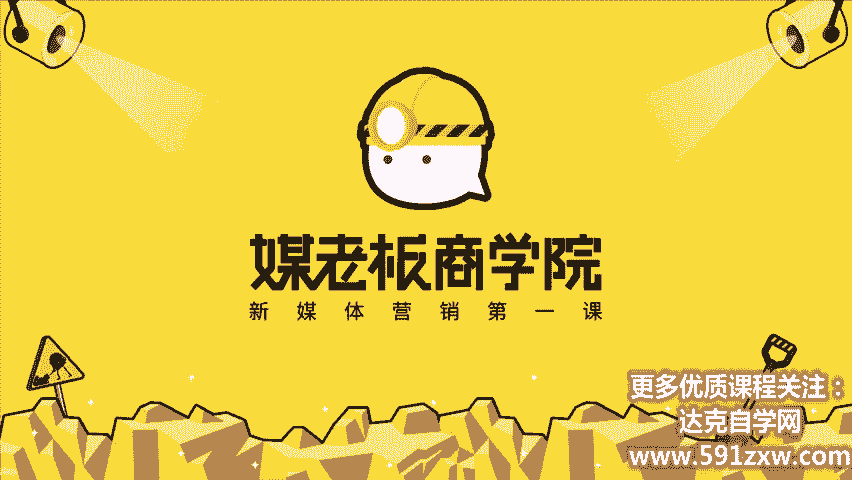

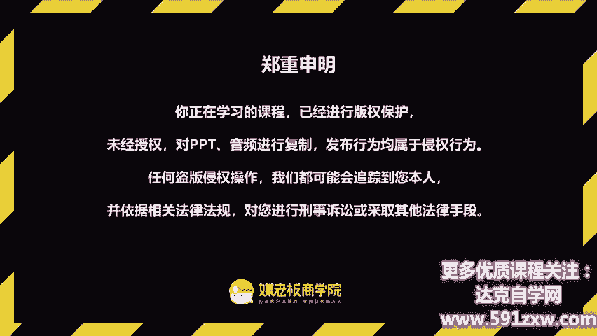

客户自动裂变，利润自然倍增，欢迎你来到客户裂变操盘首持阵营，让你的客户从500元快速倍增到5000人。我是昆龙，90后新媒体老司机，我将用三周的时间带你成为最值钱的裂变操盘手。

今天啊是我们第一周课程的第一节课裂变营销。那我们在开议里面跟大家提到，我们在设计这门课程的时候，是模仿我们线下在驾校学车的整个过程。那我们学过车的同学可能有印象。第一周或者说第一阶段我们在学车的时候啊。

其实基本上呢都在刷题。为什么我们刷题呢？因为我们要考科目一科目一考的就是我们的交通安全意识啊，基本的一些常识，正确的一些观念。同样的，我希望呢在我们第一周虽然只有两天的课程。

也是希望给大家树立这个正确的裂变思维，裂变意识。所以呢我们第一周的第一天的课是裂变营销，让你的客户从500人快速裂变倍增成5000人。我们来看一下这一节课的课程目标。第一。

认识到裂变的重要性以及了解裂变的基本玩法。第二个呢是把我们的客户分层，扩大裂变半径，对准目标客户。

今天呢我们将会以三个部分啊去为大家一一讲解。第一部分是裂变模式，没有裂变，等于坐吃三空。客户倍增的秘诀是什么？第二部分裂变的玩法。我们可以快速掌握让客户倍增的N种裂变新玩法。第三呢，裂变案例。

我们对准目标客户轻松做对每一次裂变营销。首先我们来第一部分啊裂变模式，没有裂变，等于坐吃三空。

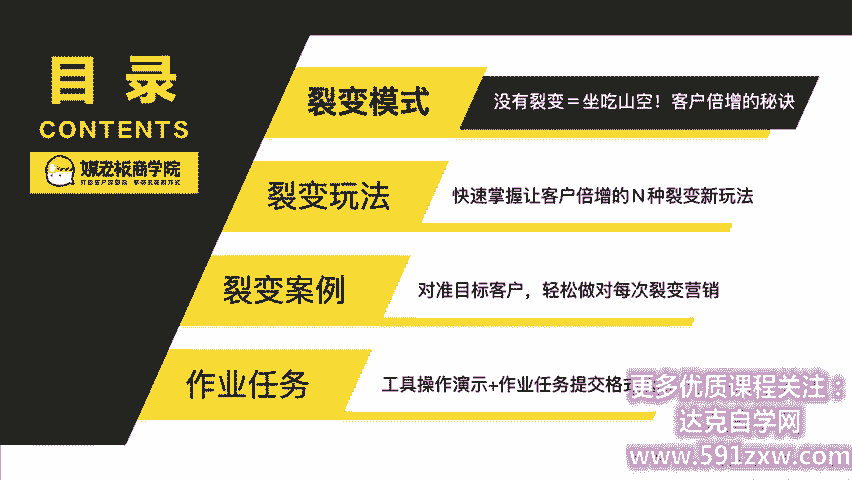

那么在讲这个呢，我们首先呢要来理解两种两种营销模型。这样子呢我们才能够理解为什么我们要做裂变式的营销。首先我想跟大家啊提的第一个观念就是没有裂变，等于坐吃三空。那我们常见呢有两种模型营销模型。

第一种呢是从关注兴趣渴望记忆购买这种漏斗式的模型，也就是首先要有很多人关注再来感兴趣再来购买。它是逐渐往下递减的这样的一个漏斗式的模型。第二种呢是他关注感兴趣购买再到分享，哎，就变了一种沙漏型的模型。

那么杀漏型的模型啊有什么样的好处呢？那我们看到这个模型当中啊啊它有一个分享的这样的一个呃关键的流程。那如果你的产品，你的客户每个人都为你发一个朋友圈，你还愁客源吗？啊，我们就是基于这两个营销模型的观察。

主张呢你更应该去打造一个杀漏型的营销模型。那我们来看啊营销模型当中呢有一个非常关键的一个要点啊，如果做营销的或者做投放的，基本上呢都听过一个概念，叫做ROI，也就是投入产出比啊，你的产出要比你的投入大。

这样你才是赚的。那这种呢就是投产比。那么我们在裂变营销当中啊，我提出一个概念叫做裂变比。也就是说一个老客户啊，一个用户会不会带来新的用户，他带来多少个，就是一个裂变比。

那假设你的模式里面裂变比是大于一的话，会发生什么神奇的事情呢？举例啊，你的每一个客户在一定的周期内，比方说是一个季度都会给你带来两个新的客户，那么你的裂变比就是1比2，也就是说你目前有1000的客户。

那过三个月之后呢，这1000的客户啊，平均会给你每人带来两个新的客户。那加起来呢，就有2000的新客户，加上你原有1000就变了3000。那同样的新增的这2000啊。

假设他又在3个月内又是维持了在1比2的裂变率。这样子呢，他就可以。持续的裂变下去。如果你的裂变率是大于一的话，那么你整个商业模式是非常容易倍增的。

这就是我们观察到的两种营销模型当中推导出来完全不同的商业结果。我们自己没老板来说的话呃，我们线下课的学员每新增100个学员，其中有90%以上都是老学员转介绍的。那么也就是说，我的老学员越多。

为我们转介绍的人就越多。那么我们呃招生就越容易。这个就是我们。裂变的秘密倍增的秘诀。所以我们的目标呢就是要打造一种裂变比大于一的这样的营销模式。这样的营销模式。我们整个课程的设计都是从各个关键的节点。

各个关键的流程去帮助你突破一裂变比大于一的这一种状态。那我们第二部分呢是裂变营销啊，有哪些常见的误区，裂变就是搞活动，裂变来的粉丝没办法成交。那其实我在啊给大家介绍裂变模式的时候啊，最常见有这四个误区。

第二呢就是狭义的理解，以为裂变活动只啊以为裂变只是搞活动。第二呢是难以转化。就是裂变只能吸引到低价的用户啊，通常难以转化。第三呢是裂变的效果啊，一开始。

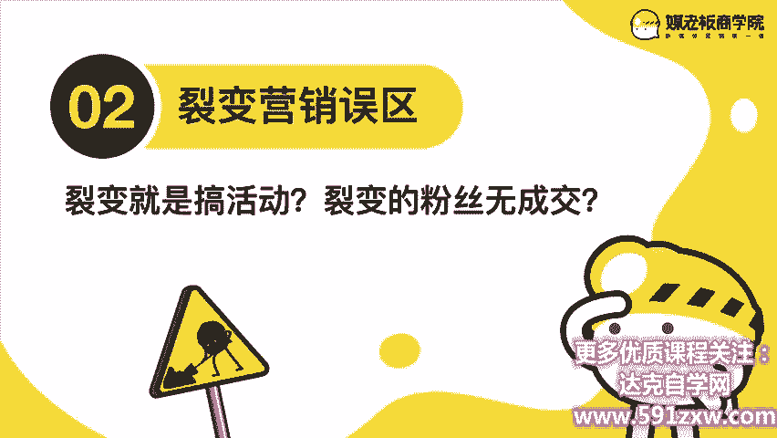

效果并不会很理想，所以呢导致很多人就很快就放弃了。第三个呢是啊分销代理，以为裂变啊就是分销啊拉人头。那在这里面呢，我希望跟大家建立一个共同的意识。裂变是什么。那我对裂变的定义呢，有两个维度来看。

首先呢从狭义上来讲，裂变啊是指通过任务宝啊、进群宝啊、分销宝啊等各种工具。在微信的生态下做的一次曝光活动。那广义上来讲呢，其实只要能实现人传人性质的营销策略，营销活动，商业模式都可以称之为裂变。

所以这个关键点呢在于人传人。啊，以前我讲人传人的时候，可能很多人是不太理解是什么意思的那现在呢因为啊疫情的影响，大家都非常知道人传人最终会带来一个多么可怕的传播。但是我们倒括来讲。

如果能让你的产品和服务像病毒一样传播，传播到全世界，那是不是对我们商业来说是一个非常良好的一种状态呢？第三，裂变的有两个大的前提啊，如果你的客户不具备这两个前提，再多的方法也没用啊。

首先呢第一个前提我们的用户啊，他分享我们的内容到他的朋友，或者说告诉他的朋友，有助于他帮助身边的人。这里面呢我提出一个概念，叫做蚂蚁效应。想象一下，如果现在呢有一个蚂蚁，它在路边啊看到一块糖果。

它会怎么做呢？他会不会立马回到自己的蚁窝里面去告诉他的小伙伴说哎，外面有一个。糖果是吧我们一起去把它搬回来吧。哎，这一种就是蚂蚁效应。首先我去判断一个。项目或者一个产品能不能做裂变呢？首先要看人群。

那我怎么看呢？从两个维度。第一呢，它的线下是否有聚堆的空间，也就是说呃使用它产品的人是否在学校啊、办公室啊、家里啊、办公室啊宿舍聚会活动、商场等等这样的线下有聚堆的场景当中去使用它的产品啊。

如果是在这种场景当中去使用它的产品呢，那有概率啊是能够裂变的。第二个维度呢就是聚堆的人群啊，比方说可能线下聚集的不多。但是线上呢也有相关的很多社群啊，比如说家长群啊，妈妈群啊，学生群啊，白领群啊。

家长啊那个家人的群啊，亲戚群啊，闺蜜群啊、同学群啊、战友啊等等。这些呢都是能够。帮助我们引发裂变非常好的啊群体群体。第二个前提呢就是有助于提升他的社交形象。啊，简单来说呢。

他把你的内容或者你的产品发在朋友圈，能够提升他的逼格，提升他的品味，让他更有面子。如果符合这一个呢，就是正面且可以公开的这一种呢裂变效果是最好最好的那第二种呢就是唉正面。但是呢不好公开。

但它可以私下闺蜜讨论。哎，这种也是可以有助于裂变的，只是它裂变的范围没有那么大，比较难的是这种负面且私密的这一种啊其实是呃很难去分享的。比方说贷款啊私密用品啊等等。这样的相对来说是难以裂变的。

还有这一个公开的负面的这一种呢更加难以裂变。所以正常来说呢，我们第二个前提是啊我们的目标用户分享我们的内容到朋友圈有助于提升他的社交形象。这就是非常重要的。第二个前提。简单来说。

就是用户发你的东西到朋友圈会不会提高他的逼格啊？如果没有的话，那可能啊我们会做一些特殊的包装来做这个逼格的提升。这是啊裂变营销的。

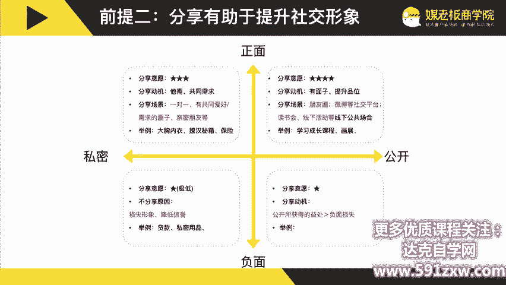

第二部分是裂变的玩法啊，快速掌握让客户倍增的N种裂变新玩法。

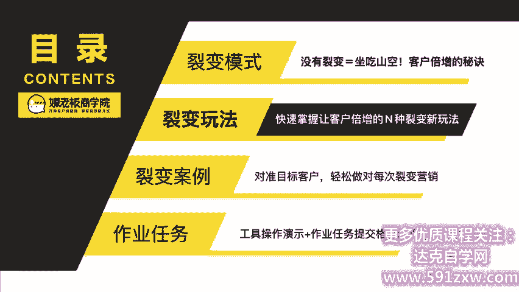

啊，首先呢我们把裂变分为两个阶段，两个阶段。那分别呢是成交前跟成交后。成交前呢我们称之为流量裂变。它有做活动的那个裂变，做通过技术来裂变，通过拼团的裂变。这种呢都是称之为流量裂变。

也就是它还没有成为我们的客户之前，那我们统一呢先称为浏览量浏览量，这一个就是成交前。那成交后呢，我们称之为客户裂变。比方说口碑传播啊，利益相关的传播啊，以及产品传染的传播啊等等。

这些都是我们成交后可以去做的关键抓手。简单来说呢，一句话去概括，在裂变中成交，在成交中裂变，在成交后再裂变，就是我们需要做的啊这个裂变的几个关键的环节。那裂变有什么样的玩法呢？裂变有什么样的玩法呢？

就是第二部分。裂变的N种玩法，找对传播引爆点策划出N种裂变玩法。

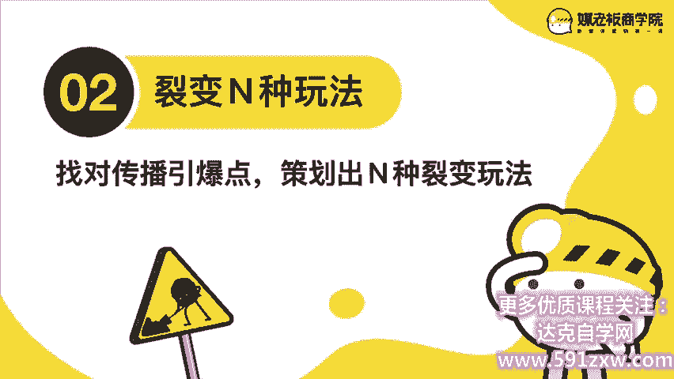

啊，首先来看你应该会看过类似的海报啊，这一些活动呢，它只要一张海报就可以轻松列变N万的粉丝。比如说我们做的这一个1域流量营销实战的送书活动，就累计吸引了5万的粉丝。比如说我的12招掌握微信引流与成交。

就累计吸引了4万的粉丝。那同样的我们一个学员模仿我们的送书活动啊，做了1个1元试吃猕猴桃的那我们一次呢也涨粉了4000，最终呢有2000位2000位啊伙伴来进行试吃。然后另一个学员呢是专门做这个。

连锁培训和咨询的，他也是模仿我们这一种啊1二招掌握微信与你域成交的裂变活动。然后他一次活动呢就涨粉了5万。其实我们一次呢我们自己的话其实大概是五六千啊，因为他的人群技数比较大。我们的线下课100元。

他们的线下会议大概是11000多人，所以他的涨粉量是到达了5万，这些呢都是啊掌握了我们的裂变的思维和活动以及执行出来的效果。那我把我们刚刚把裂变呢分成了成交前流量裂变，成交后客户裂变。

那么我们各自呢又有三种不同的裂变形式和活动。我们一一为大家做一个拆解。那这一些活动啊，这一些要点都会在我们啊接下来的课程里面有更详细的。了解更详细的拆解。那么现在这一部分呢，我先带大家啊浏览一遍。

浏览一遍它到底有哪些要点，常见的形式是什么样子的。首先我们来看。成交前的流量裂变。第一啊成交前的流量裂变一活动裂变。那我们在朋友圈呢可能会看到这几种海报，比方说扫码之后会进入到一个公众号。

那公众号会提醒你去转发这张海报，邀请人，邀请朋友来关注，就能够得到相应的奖品。那这种呢叫任务宝裂变，它依托的是公众号。第二种呢就是你扫码进呢是进到一个群里面。群里面有机器人提醒你说呃需要转发。

然后截图到群里审核。那这一种呢叫进群宝裂变，它依托的是微信群。那第三种呢就是分销宝啊，你扫码进到了一个网页H5里面，然后呢上面有提示你购买啊，右上角呢还有这一种呃那个分享海报可以赚奖学金的这样子。

那这一种呢一般来讲啊都是这种分销宝的裂变。常见的在朋友圈刷屏的裂变活动啊，基本上都是这三种。我们的主体内容呢，主体课程呢啊首先第二周的课程里面也是会教会大家如何设置一个啊这样的裂变活动。

那成交前的流量A裂变2技术裂变啊，我们在朋友圈偶尔就会看到这一种刷屏级的啊证件照啊，或者说名片啊等等这样的一些刷屏的活动。其实呢这个就是简单的一种H5就能做的裂变活动啊，就是把你的信息啊填上去啊。

这样子呢它就生成了一张海报。最终呢啊引爆了我们的这一些啊希望跟朋友开玩笑啊，去炫耀一下的这样的一些心理。啊很多人呢就会因此传播。啊有这些结婚证啊，也是直接可以生成的那另一种呢就是答案测试题。

简单来说呢就是啊你通过扫码进去之后呢，可以看到一些测试题。当你测试完之后呢，就需要关注公众号啊看答案。这种呢就是常见的测试题的啊裂变活动。啊，第三种呢就是好友助力猜红包啊，就是你把这个红包发给朋友。

朋友点击一下，你就可以获得从0。1到100块的这个现金。不过呢你要积累到100块之后才能够提现啊，这种也是常见的红包助力的啊技术裂变的活动。那第三个呢就是成交前的流量裂变3拼团裂变。

那做的最好的就有拼多多为代表的做这种实物裂变。那么我们也模仿拼多多做了课程的裂变。那原价购买是39块，发起拼团，只要9。9块。这种呢就能够帮助我们触发客户去呃一起拼团。还有比较新的这种形式。

就是内购的拼团啊，你要有内购价的话，就要发给朋友。那么朋友点击呢，你们两个都能获得这一种内购券。还有第三种就是好友砍价。但好友你发这个页面给你的好友，好友砍价的越多，你的价格就越优惠啊。

这三种呢就是我们常常见的成交前的流量裂变，流量裂变啊，分别呢是。活动裂变、技术裂变和拼团裂变，每一种裂变呢都会触发到不同的效果，不同的人群，不同的人群。我们也会在接下来的课程里面为大家详细讲解。

那第二个阶段呢就是我们成交后的客户裂变。成交后的客户裂变那第一种。成交后的客户裂变是口碑传播啊，比方说我们自己啊，我们呢线下课会的发圈率是高达80%。也就是说每100人参加我们的线下课。

其中有80%以上都会发朋友圈，都会发朋友圈。那这一种朋友圈传播的效果就非常的好了。第二个就是转介绍。那我经常去的一个培训机构啊叫高危学堂，它是专门培训。

如何科学创业的那呢他有96%的新学员呢都是来自于朋友介绍的那以及我们的大众点评啊，小红书啊等等，这些都是比较容易引起口碑传播的一些渠道和平台。那成交后的客户裂变二呢就是利益相关。

那我们把它分成利益低到高做了一个排序，分别是代言人呢、分销员呢、合伙人啊、经销商、代理商、加盟商等等。那这个有什么特点呢？这个特点呢就是统一都是有这个利益相关啊，有利益相关。

也就是利益越高它传播的动机动力就越强就越强。这也是我们常见的利益相关的这种裂变模式。

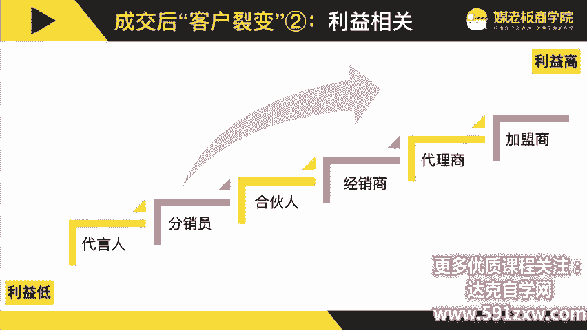

那成交后的客户裂片三呢就是产品产品传染啊，比方说得到你在得到APP上学习啊，你如果做了笔记或者听课比较多，他就会给你发很多虚拟的荣誉勋章因为它设计的很好看，会让你忍不住的想要去分享。

那以及呢如果你的产品包装设计的比较有趣，有意思啊，也会引发用户的传播。比方说这个斑马金量，只要买满6瓶啤酒，你就可以把照片定制上去。假设你收到一个有你照片的啤酒，你会不会发朋友圈呢？啊。

如果是我我肯定会发朋友圈的。还有这种附附属型的会员卡，也就是你办了一张会员卡啊，你可以让身边的6个人给你共享这个卡，一样的积分一样的优惠。这样子本身呢我们只买了一个会员卡。

但是呢我身边的6个人都可以享受一样的啊权益啊，以及呢第四个我们线下课的物料啊，我们发现呢我们精美设计的这种笔记本啊教材啊是学员发圈率最高的物料啊，所以呢这些物料我们精心的设计。

精心的编排是非常有价值的啊，所以成交后啊有三种客户裂变分别呢是口碑传播利益相关和产品传染。好的，我们第一部分呢为大家讲了为什么要做这个裂变的模式？客户倍增的秘诀是什么？

我们如何我们的目标打造一个裂变比大于一的营销模式。第二部分呢，我们通过裂变的两个阶段成交前是流量裂变有三个三种玩法，成交后又有三种玩法。客户裂变。那我们用一个具体的案例来去为大家拆解啊。

我们怎么样能够帮助一家企业可以玩转，成交前后两种裂变的。

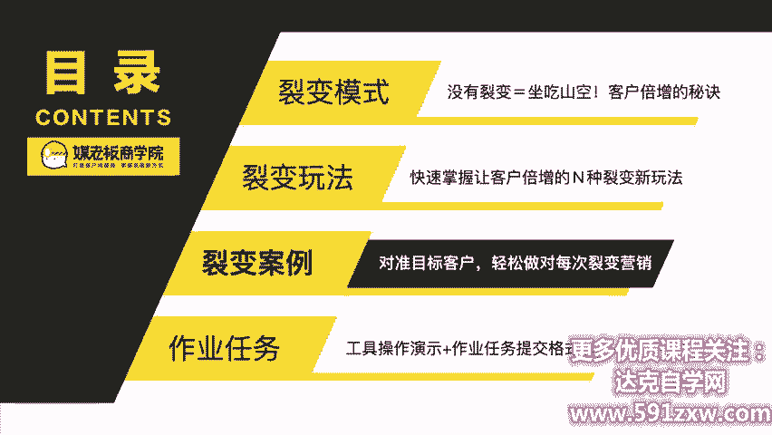

首先呢这一个品牌叫做智工教育，它是专注广西公务员考试辅导的一家培训机构。那在广西呢每年新增的三个关公务员当中，其中有一个就是来自于我们的自工教育。

那自工教育呢是在广西区域内非常厉害的一个啊公务员考试辅导品牌。那它是怎么玩转这个裂变的呢？那它的客户群又是谁呢？首先呢我们来看一下考公务员的人，一般是谁。

以及常见的这一种公务员考试辅导的产品是什么形式的。那一般来讲啊，考公务员有两个条件，第一个是学历的条件。第二个呢是啊这个年龄的条件。那么呃一般来讲呢，我们在调研这个客户群里当中啊。

有相当多的一部分人是大学生。大学生，但是。在这个行业呢，成交难的地方是在于公务员考试辅导这样的产品和服务啊，基本上普遍的售价呢。是在那个3万块钱左右，3万到4万块钱左右啊，便宜一点。

可能一些小作坊可能是一两万，但普遍呢价格都比较高比较高。所以我们第一件事情呢是要做到一个杀手级的产品。那么我们就针对广西大学生啊做了一个这样的产品。啊，叫做什么呢？980无限学什么意思呢？

就是你可以先只交980块，你就可以选5啊学习5年学习五年。那你考过之后再来付尾款。如果你没考过呢，就不需要付尾款。同时呢你考过之后，我们还会给你6个月的。6个月的时间去筹钱，6个月的时间去筹钱。

所以呢你考过之后也不需要马上付啊，等你有了工资收入之后再慢慢付都没有问题。所以是这样的一个产品。第三呢，如果你越早通过，我们就有越大的奖学金。比方说你给了首付980，但你尾款还有29800。

但是假设你第一年通过呢啊，我们会给你1万块钱的奖学金啊，所以呢你只要付尾款19800就okK了。第二年呢有5500的奖学金，第三年以后就没有奖学金了。那同时还有转介绍的这个激励，转介绍激励。

那同时呢呃我们也要为这个产品呢做一个包装。首先呢我们了解到哎，980块相当于一个广西大学生两周左右的生活费。那如果他考上公务员呢，相当于什么呢？啊，相当于就拿了一个金饭碗。

所以我们打出的口号就是用两周的生活费换一辈子的金饭碗。这样的一个旗号。那我们设计好这个产品之后，就要寻找我们的目标客户群。那首先呢啊我有一个客户分层的这样的一个图表，我把客户由远到近分为4个层次。

第一个是潜在客户，就他符合成交条件，但是并没有产生需求。第二个目标客户他已经产生了需求，但并没有进行购买。第三呢，他已经成为了客户，但没有推荐客户。第四，已经成为客户且有推荐客户。

那我们来对照到自攻里面。首先潜在客户啊啊，我们符合的条件呢是广西大学生。广西大学生。他只要是广西大学生，就是我们的潜在客户了，只是不是所有广西大学生啊都愿意都会选择考公务员而已啊。

所以我们要针对潜在客户呢啊引导他考公务员，并且选择我们。第二个目标客户就是已经报考了公务员考试的广西大学生啊，就是我们必须要争取到的，让他成为我们客户的最重要的一个群体。第三呢是购买客户，就是啊。

因为有一些考试他并不一定选择辅导，也不一并并不一定选择我们。所以购买客户呢就是选择我们的自工公考辅导的广西大学生。

然铁杆客户呢就是已经成为客户又有推荐的那我们的目标只有一个就是啊不断的培养更多的铁杆客户。那我们一步步来啊，我们是怎么样来策划这一些裂变的活动的啊，首先呢我们在国庆的时候啊。

针对广西大学生策划了一个裂变活动啊，这个裂变活动呢非常的简单。我们设置了三个奖品。第一个奖品呢是啊我们判断。在国庆期间，大学生呢他只有两个选择。第一个呢就是啊不回家，可能去周边游玩一下。第二个呢。

他回家啊，第三个，要不然在宿舍看剧是吧？三个的呃三三个的主要场景，那么我们就设置了三个奖品，一等奖就是广西周边的双人游，二等奖是给你报销，回家往返的车票，三等奖呢是给你爱奇艺或者腾讯视频的会员。

那这个活动非常简单，只要你转发一下这张海报到朋友圈，你就能够获得一个抽奖机会。那我怎么鉴别裂变的人吸引过来的人，是不是广西大学生呢？我们就加了一个条件啊。如果你最终中奖了。

需要兑换奖品的时候需要出示广西大学生的这个学生证，哎，这样子我们就能够排除掉，不是我们目标人群的受众了。后来呢过了几天，到了国庆的时候，哎，我们这个活动效果非常好。

一下子呢就吸引了几千的这一种潜在的客户，也就是广西大学生。那我们紧接着又做了一个请你看电影的活动啊，就是国庆70周年啊，我们请我们的用户看这一个我和我的祖国这样的一个话题，活动流程形式是一样的。

只是啊把奖品改成了电影票，哎，这个呢我们的范围传播就更加广了。同样的，如果他要兑换这一张电影票呢啊，我们需要他出示广西大学生的学生证，这样子呢就能够确保我们吸引到的潜在客户啊，都是我们的目标人群。

然后第二个呢，我们针对这个警察学院的学生做的裂变活动。那警察学院他必须要考公务员的，只不过他可能不一定选择课外的这种辅导机构。那同样的我们也是根据警察学院设计了很多各种各样的奖品。

然后吸引他们来关注我们的公众号添加我们的课程顾问。那平常啊一呃一个警察学院的学生大概有2000多人。但是呢我们通过这样的一个裂变的活动。

我们就吸引了相当多的一部分七八十的警察学院的学生啊都关注到我们的公众号啊，有相当一部分人呢也添加到了我们的课程顾问。那这个活动呢，我们后面明天会教大家如何去做细节的这个策划。

今天呢我们先在这里去过一遍啊，这个活动这个活动的主题以及基本的形式。那通过啊。送呃，送送。送礼抽奖的这个活动吸引了广西大学生啊，通过这个针对警察学院的学生做的裂变活动。

这样子呢就能够吸引我们的成交前的潜在客户和目标客户。那如果成交之后，我们又有什么办法呢？那我去做这个客户调研的时候啊，发现一个很有趣的现象。什么现象呢？啊是有相当多的一部分在公务员呃。

在单位里面工作的人呢，他是在职不在编的什么意思呢？就是他在单位里面，但是他并没有编制啊，他会有什么情况呢，就是他可能干着同样的活，收入只有别人的一半，甚至没有编制的保护啊。

所以这一部分人他是最渴望考公务员的啊，以前我们去触达这部分人，其实是很难的。但是呢因为我们有很多的这种毕业成功的，就是毕业成为公务员的学员。所以呢他们有相当一部分呢，他还需要交尾款的嘛。

因为一开始他只交了980。所以我们就做了一个设计，说哎如果你去到单位那里面给我们介绍这一种在职不在编的同事啊，那我们会给你相应。的减免学费，也就你尾款原来要交两三万的，现在呢就可以少交很多了。

这样子呢就能够触发我们这些已经成为公务员的。学员啊成为公务员的学员，给我们转介绍他的在职不在编的同事啊，这个策略是非常厉害的。然后同同时呢呃我找到一个点，我在一个客户身上问我说哎。

你当时是怎么知道自工的那这个学员说我有一个亲戚啊，在自工报考了这个公务员考试辅导啊，在自工考上了，所以呢我就知道了自工。后来呢我毕业了呃，也也在自工学习，我自己也考上了。哎，你发现了没有？

就是亲戚的介绍是非常有用的。而且是这种成功案例的样板啊，是对身边的人非常大的一个刺激。那我联想到在我们。在我们老家，如果你考上了公务员，其实呢啊我们家里会给你白酒，我们家里会给你白酒啊。

这样子呢就上一个大学酒。那么我联想到了这个大学酒啊，其实考上公务员对很多家庭来说，无异于古古代考上了进士，甚至当上了状元。那我发现呢就自贡教育，他们啊也有这个庆功宴。

也就是说把考上公务员的这一批学生啊聚在一起，我们一起吃个饭是吧？吃吃喝喝的。但我发现呢其实你简单的吃吃喝并不会带来什么特别大的传播效果。所以呢我就策划了一个状元晚宴。那状元晚宴凡是考过的这个学生啊。

他可以邀请他的亲朋好友来参加这一个状元晚宴。这样子呢他的父母肯定会拍照发朋友圈，甚至呢忍不住的向他的亲朋好友啊去分享，去炫耀说，哎我的儿子在职工考上的公务员。他现在在什么单位。

这样子呢就能够达到我们这种非常好的传播效果了。那所以呢我们把成交。前后分成两个裂变的阶段，非常有助于我们去做不同的裂变活动。不同的裂变活动。以前呢我们策划裂变活动的时候，有两个难题。

第一个难题呢吸引不到精准的客户啊，吸引不到精准的客户。第二个难题呢是我们渴望的客户啊啊非常精准，它的范围呢就非常的窄。但是呢当我们有了这样的一个啊客户分成的图表，我们把它分成潜在客户。

目标客户购买客户跟铁杆客户，分别做不同的营销裂变活动。这样子呢我们就可以扩大这个裂变半径来做更精准的营销。啊，我不知道你听听完这个案例对你是否有启发，但是我非常希望你可以针对自己的潜在客户、目标客户。

购买客户跟铁杆客户做一个分类，做一个分类，做一个梳理。这样子呢非常有助于我们后面策划裂变活动。

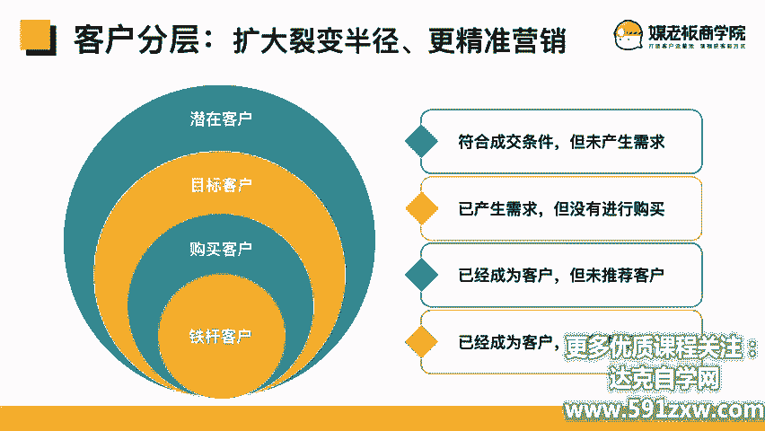

好的，我们稍微总结一下今天的三个部分的内容。第一个部分，裂变模式没有裂变，等于坐侧山空。裂变客户倍增的秘诀在于裂变比。第二部分啊裂变的玩法，快速掌握让客户倍增的N种裂变新玩法。

我们分享了有成交前的流量裂变的三种玩法，也分享了成交后的客户裂变的三种玩法。最后第三部分呢，客户案例，对准目标客户轻松做对每次裂变营销。

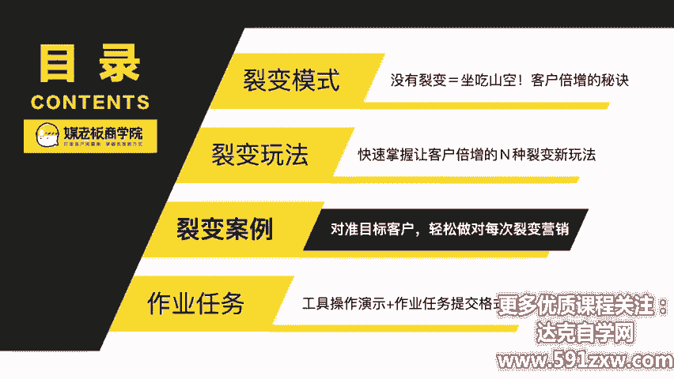

那再回顾一下我们今天的本节课的课程目标。第一，认识裂变的重要性，了解裂变的基本玩法。第二，把客户分层，扩大裂变半径，对准目标客户。

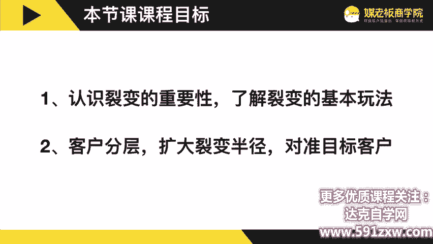

行为发生改变，学习才算开始，有学习没行动等于0。那第一课的作业任务呢是梳理自身的客户分层来扩大裂变半径，分别是潜在客户、目标客户、购买客户。

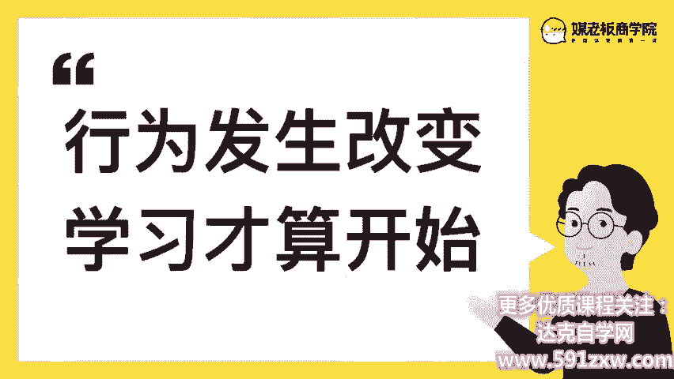

精准是我们成交的前提。有大部分的啊客户潜在客户成交不了，都是因为不够精准。所以呢我们要做对这一个分层，做对裂变营销。那我们的作业提高提交格式。有这个参考啊，那你呢就是复制这一个潜在客户。

目标客户以及这一个购买客户铁杆客户再来。坐。再来做这个有效的区分。我们做这个区分的目的呢是区分好你的啊这个客户的分层来做对这个裂变的营销。这样子呢你才会有的放矢。那购买客户跟铁杆客户呢。

你们是非常容易区分的。但是呢在潜在客户跟目标客户这里面呢可能会有一些难潜在客户他必须要有一个条件啊，如果你的产品呢有地域性的，那么你的潜在客户就是某个地区内的啊用户。

但是如果又有第二种这种角色身份的限制的那也是要把这个思考出来。第三呢就职位的。第四呢是场所的。比方说它会出现在哪里？就拿厦门的伴手礼品牌苏小唐来说，那他的潜在客户呢就是下去厦门旅游的游客。

这个是主要的潜在客户。那这个呢啊就做一个比较好的一个梳理。如果他去杭州旅游跟苏小唐有没有关系啊，其实没有关系，我们就可以放弃掉了。所以他主要聚焦，就是在厦门旅游的游客啊，以及身体的状况啊，体型啊。

健康啊等等这一些还有第六点呢就是啊间接间接客户啊，有可能呢是我们的产品呢。使用者跟购买者并不是同一个人，比方说老板报名员工听课，父母报名，孩子听课，也有可能是孩子购买给连长的父母，父母来用啊。

都是有不同的间接的。所以呢这一些潜在客户啊，是做一个比较好的一个梳理。啊，第二个呢就是你的目标客户，也就是说正在进行比较阶段准备购买的这个客户群有哪些啊，也请你做一个比较好的一个梳理啊。

为什么这个作业非常非常的重要呢？因为我们后续啊都是围绕这个客户群去策划的裂变营销。如果一开始我们的客户群没有找对。那么我们后面设计的这一个裂变营销啊，可能方向都会走偏。所以这一节课呢希望大家认真思考。

然后提交这个作业。那我们的助教团队呢也会给大家良好的这个反馈来对准我们的目标。客户。那作业提交的方式呢，跟我们提交自我介绍的流程是一样的，就在群里面打开我们的小程序，点击我要打卡确认完成。那完成之后呢。

我们欢迎你分享到我们的学员群里面和其他同学过过招。

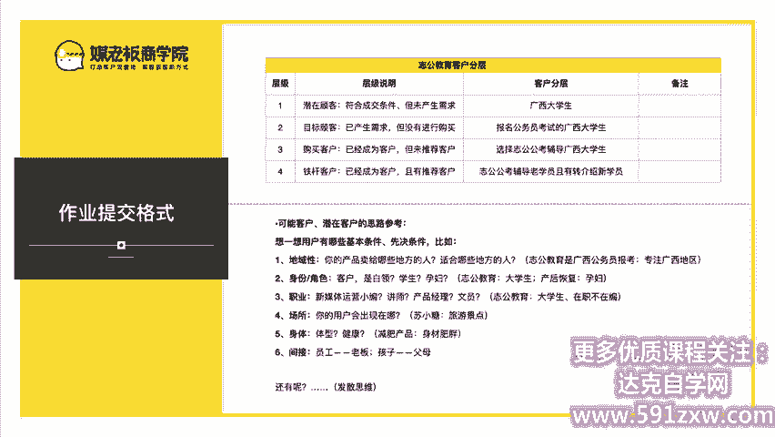

那我今天的第一节课程呢就到这里。明天呢是我们第一周的第二节课，明天的主要内容啊是教会大家如何操盘一个裂变的明天的同一时间，记得准时收听啊。

