# 微社群裂变营销私域流量池增长秘籍创业运营销售获客视频课教程 合集 8套 374资料 13.1G 客户倍增方法论 - P3：第1周-2：【项目操盘】百万裂变操盘手，必须掌握这3个基本功 - 高端网创试错赚钱大师 - BV1RS411w7AE

。

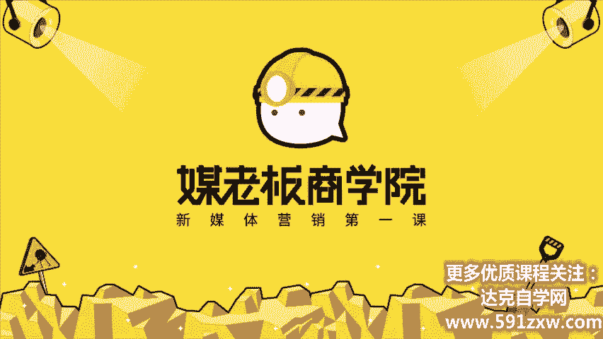

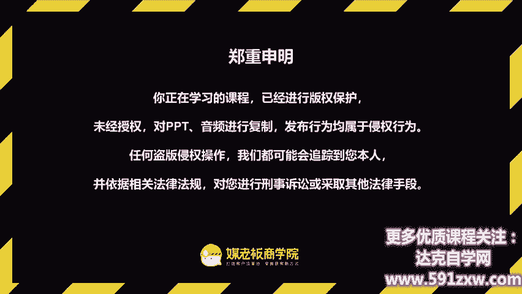

客户自动裂变，利润自然倍增，欢迎你来到客户裂变操盘首持阵营，让你的客户从500元快速倍增到5000人。我是昆龙，90后新媒体老司机，我将用三周的时间带你成为最值钱的裂变操盘手。

今天是我们第一周的第二节课项目操盘。百万那变操盘手必须掌握这三个基本功。本节课的课程目标第一，认识裂变操盘手的基本功，掌握裂变关键的要点。2。开始着手丛林做一个可落地的裂变方案。

今天呢我们会以三个部分为大家去分享，分别是操盘的秘密、操盘的能力以及裂变方案。那相信你呢经过昨天的这个课程学习啊，也大致了解了原来裂变有这么多种玩法。那么我们今天呢。要掌握基本功的能力。

也就是不管你玩法怎么变，你要掌握这几个基本功，然后你就可以以不败，不变应万变。首先第一部分操盘秘密，从中专毕业到年入1000万的操盘秘密。啊，首先呢大家可能都经常听操盘手。

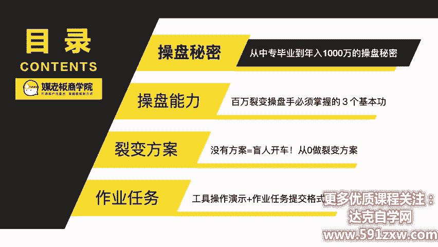

那什么是操盘手呢？原来他的意思是在股票市场里面帮别人去操盘资金的这样的一个人员就叫操盘手。为什么他是在商业世界里面最值钱的人呢？因为他可以让钱生钱，所以他是商业世界最值钱的人。那么什么是裂变操盘手呢？

刚刚我们讲到操盘手，因为它可以让钱生钱，所以它非常值钱。那裂变操盘手呢是新媒体时代最值钱的岗位。为什么这么说？因为它可以让客户裂变客户，也就是客户生客户，所以它是在新媒体时代最值钱的岗位。

那裂变操盘手跟一般的传统的操盘手有什么不同？那我认为呢有两个非常不同的能力。

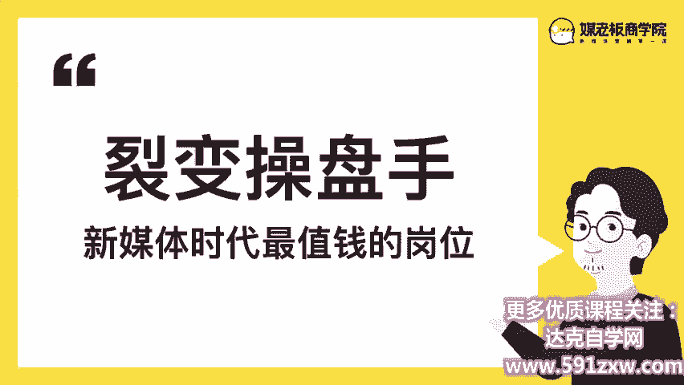

首先，裂变操盘手呢，我们拆开来看是裂变能力和操盘能力的结合。什么是裂变能力？就是让客户自我复制的底层能力。你怎么样通过各种各样的形式来驱动，驱使我们的客户，我们的用户，让他能够带动身边的人。

也成为我们的客户，也成为我们的用户。这个就是让客户自我复制的底层能力。这也是呢能让客户用户利润倍增的秘诀。为什么呢？因为我们可以低成本的。复制客户，所以这个就是倍增的秘诀。第二个是操盘能力。操盘能力。

我的理解是对结果负责的项目管理能力。因为操盘它本质是项目管理。那么项目管理如果它能够对结果负责的话，那么因为结果良好，所以呢它更加的值钱。所以这个我称之为城市的秘诀。

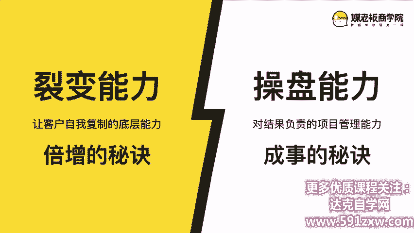

那我分享一下我自己的个人经历，我是怎么样从中专毕业到年入1000万的操盘经历。那在我刚毕业的时候呢，我进入到了一家啊销售公司。卖的是什么呢？卖的是微博的广告位。所以我每天要打很多的电话给客户。

邀约他们上门，或者到我们的活动现场了解我们的服务和产品。那我当时呢因为非常喜欢这种线上的传播形式，刚好我们卖的也是微博的广告位，所以那个时候就开始研究人为什么会传播什么样的内容。

什么样的形式能在互联网传播。我如何帮助我的客户，我们的商家通过互联网新媒体的方式快速传播。所以那个时候才正式入行。那么第一份工作呢，就到了呃后来的一份工作是正式进入这个新媒体运营。

负责的是一个职场类的大号。那一开始呢我们只是通过互推呀，或者说导流的方式来让这个账号慢慢壮大。后面呢我发现有一种比较好的这种裂变式的涨粉方式。什么呢？

就我邀请了很多职场类的大咖行家来我们的微信群里面做分享。那学员怎么样能收听这个课呢，怎么样能进群呢？很简单，他只要把我们的活动介绍，转发一下到朋友圈截图给我，我就可以邀请他进群。就是这么简单的一个设置。

让我们从60万的粉丝快速倍增的到。100万就是这样的一个设置。那么我们知道啊，我们当时从0到60万，我们花了两年的时间，但60万到100多万我们只花了。6个月的时间，我们就达到了这个翻倍的效果。

那如果我们早一些用这种裂变的方式，其实我们的涨粉效果可能会更加好，可能会多涨一倍。

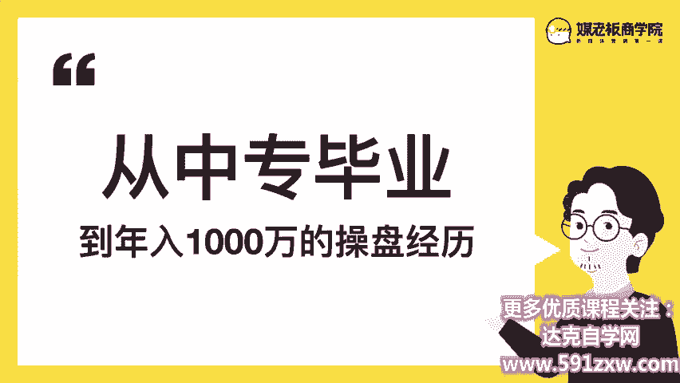

那到了我的第一个创业项目，正好有空。那这个呢是主要是针对生活类的。线上微课的平台。同样的我也是邀请了很多啊这种生活类的行家专家来到我们的微信群来我们的直播间来做分享。学员只要转发一下我们的海报。

就可以进群收听我们的课程。也是因为这样一个很小的设置。我从0到20万到40万粉丝，我们只花了4个月的时间，就达到了这样的一个效果。那后来呢我再创立了煤老板，梅老板呢也用同样的方式。

当然呢已经比当年的那种方式啊迭代了很多了。那现在呢我们也是从零啊，我是从5万块钱起家做煤老板的，也是从零做这种啊邀请行业类的大咖来做分享。现在呢我们也积累了有近30万的粉丝。那我个人呢5年的时间里面呢。

累计策划了近1000场裂变活动。那这个是裂变活动的那我们煤老板商学院的公众号呢，日常裂变，你可以回复这一些关键词，都会触发不同的裂变。也就是说我们每一天呢都有不同的裂变活动在后台启动着。

所以这个为什么我们这么低成本又可以获取到这么大量的潜在客户精准客户的秘诀和秘密。那除了我们掌握裂变活动以外呢，裂变思维也是非常关键的。在17年的时候，我参与了一个APP的创业项目。

他通过三年的时间积累了有300万的下载用户。日活呢也有几十万。但当时呢用户一直上不去。我看了一下他们的APP，然后我就提了一些建议。因为他的APP是完全没有用裂变的思维传播的思维在做的。

基本上呢就是纯交付啊，进到用户的界面，也没有社交也没有传播的引导，所以呢我就写了一版的建议啊，让他们加入了一些社交传播的一些属性上去。比如说一个付费的音频，他可以邀请好友来下载，输入他的那个邀请码。

那么他和他的好友都可以。免费得到这一个音频啊，这个是其中的一个小点。那么我刚刚讲到他花了差不多三年的时间，到了300万的用户。但是他从300万到500万，只用了半年的时间。当时我们就拍大腿。

如果早一点加入这一些传播的要点，传播的节点，我们的用户量可能就会翻几倍。所以同样的啊，可能你刚刚起步，但是没有关系，你越早掌握这个裂变的技能，裂变的能力。裂变的思维，那么你的用户量就会越来越多。

因为裂变呢它是一个正向累加的营销模式。第二，操盘能力百万裂变操盘手都必须掌握的三个基本功。那我5年的时间里面呢，策划了近1000场这种裂变活动。那我总结了有三个操盘手的核心竞争力。

分别是起盘、运盘、控盘。

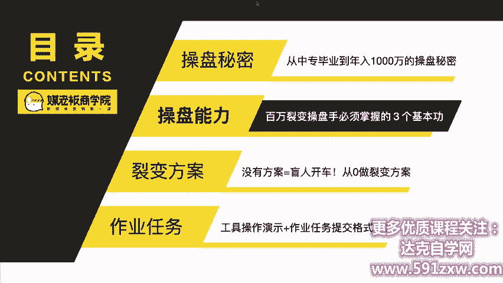

什么是起盘？是做对市场的洞察，做好项目的策划。什么是运盘呢？就确保我们的策划，我们的计划能够执行和落地，并且呢可以做运营和推广。什么是控盘，就是保证持续稳定，做好风险的管控。我们一个个来看。

首先第一个起盘前期的准备。如何从零策划一场爆款裂变活动。

因为下一周的课程里面呢，我们就要具体重零。执行策划一个裂变的活动。那么在今天呢，我希望大家养成一个全局观，用全景的方式，也就是现在带你啊坐上直升机来看一下我们这座城市是怎么布局的。第一部分啊第一点。

裂变策划策划呢我们需要从5个维度去考虑，分别是主题、奖品、成本、目标和时间。我们需要策划什么样的主题，才能撬动更多的人群。我们需要设置什么样的奖品来吸引他们来关注我们的公众号添加我们的个人微信。第三。

我们要怎么样控制成本，能够让我们的效果最大化，以及设定怎么样合理的目标，如何一步步达成。1第五点，时间从策划测试上线到复盘，怎么样规划这个时间？第二点，流程的设置。流程的设置。

首先我们要设置好用户整个参与路径应该怎么设置的。那么在下一周的第二课里面呢，我们会详细的告诉大家用户流程怎么来设计，每节每味节省用户一个流程，我们的裂变效果就会大幅度的提升。第三点就是引导的话术。

话术呢有大致有4种，分别是活动的话术啊，转发的话术啊、审核的话术啊、奖品的话术啊等等。这些呢话术我们都需要提前准备好。第四点就是工具的准备，好的工具能让我们事半功倍。如果我们选对了工具。

可以大大的节省我们的人力成本以及裂变的效果。第五点是海报的设计，海报有8个基本的要素，以及呢有很多呃设计的一些小技巧，包括里面的文案。那么我们在下一周的第三课会带着大家从零设计出一张能够刷屏级的海报。

第六点就是我们的启动资源。当我们的还呃活动策划啊，前期准备都准备好了之后，我们还有一个需要盘点的就是我们的启动资源。简单来说，我们早期能够请到多少人，以及我们自身有多少的流量，能够启动发动这一期裂变。

就能够决定了我们最终裂变的效果。那百分我认为呢90%的工作都是可以在开始前做好的，而这个习惯呢又可以适用于一切的工作，这是前期的起盘准备。第二点第二部分。硬盘执行落地，如何推动一场裂变活动顺利进行呢？

第二部分，第一点，裂变启动啊，就是我们刚刚是盘点的资源。但是呢我们会把这些资源分布式的，或者说分阶段的来应用。比方说在测试期的时候，我们只会少量的测试，直到测试出一个不错的一个活动和流程。

这个时候我们再进入成长期爆发期大规模的推广。如果成熟期，我们就可以往外去啊寻找更多的流量，把我们这个活动做大。第二点就是活动的执行。比如说我们进群的提醒啊，客服处理啊、审核处理啊、奖品处理啊等等。

这一些我们事先虽然有比较完美的完整的这个策划，但是在活动执行当中，我们需要有人时刻的盯着这一些。因为你方案再完美。如果执行跟不上的话，也是会大打折扣的。所以第二第二个观点呢是快一步会使慢一步会错失。

所以掌握节奏可以让裂变来得更猛烈一些。第三步。控盘风险管控如何有效的提高安全性，降低出错率呢？啊，如果我们做一个裂变活动，做一次营销事件，它是有风险的。是吧它是有风险的。同时呢我们怎么样能够跟风险。啊。

怎么降低这个风险，怎么降低这个出错率。那一边一般呢裂变的风险呢是有可能会被封号，有可能会有一些状态异常。所以呢我们要做好这种预备方案，以及如何应急处理这些对应的。

我们都会很详细的带大家万一到时候出现这样的情况，我们应该怎么来办。所以第三个观点，你担心的事情一定会发生的，所以提前做好万全的准备。

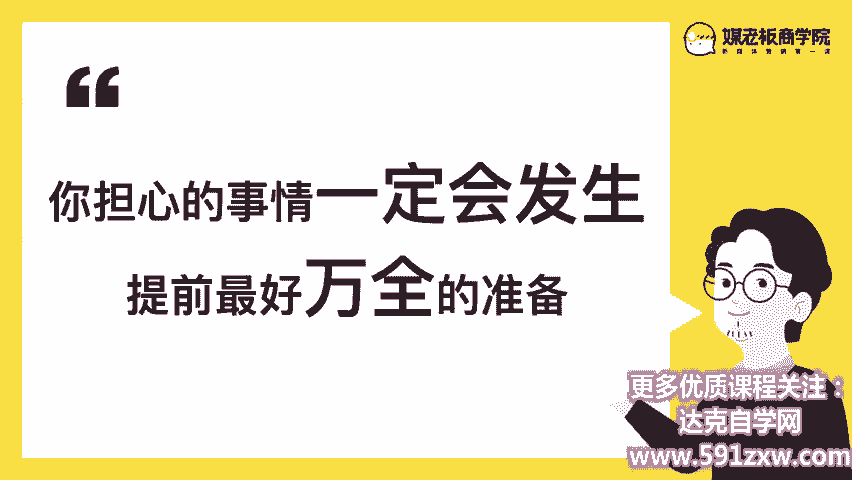

所以这三个能力呢是我5年时间累计做了1000场这种裂变活动之后，总结的操盘手的三个核心竞争力，起盘、控盘和运盘。那关于这些知识点呢啊我也准备了总结了一张。

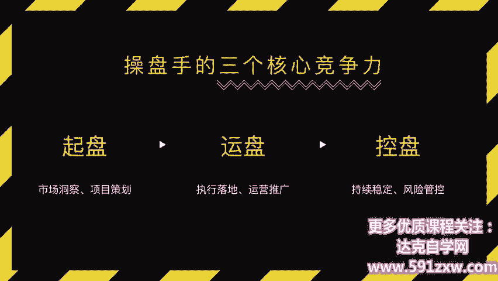

一张操盘手地图，这也是我们对我们这一部分核心内容的总结。这个图呢也会发给大家。那么第三部分裂变方案，没有方案等于盲人开车从零做裂变的方案啊，我们用一个方案来带大家看哎一个方案是怎么样从零策划出来的啊。

首先呢我们昨天是看了自攻的这个案例。这里面呢是我们当时策划的这一个方案。那它包含哪一些内容，我们又是啊怎么样非常简单的，就能够把这个活动落地呢？那我这里呢可以给大家保证和承诺。

只要你完成了下一周我们的几个作业和任务，基本上呢你也能做一个能够轻松裂变客户的方案以及活动出来。那我们第一步来看。

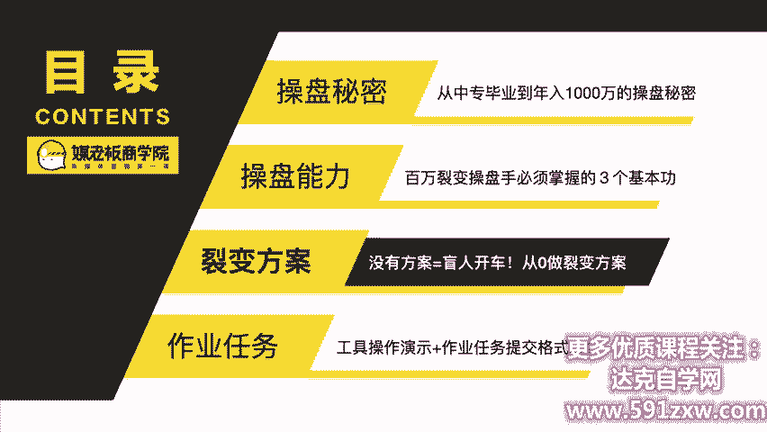

活动的主题策划没有主题，等于盲目航行策划的第一步。首先呢回到我们昨天讲到自攻的是针对这个广西大学生。自贡教育做的国庆期间，针对广西大学生的裂变活动。那我们当时是如何策划出来的呢？啊。

首先我们要来看这个活动的目标。我们的目标是呢吸引一波大学生的粉丝作为原点用户，为后续的成交啊积累流量。即使后面不报班，在这次活动当中呢，也也能够帮助传播裂变更多的用户，后面再做用户的筛选。

这个是我们活动的目标。那活动的主题呢，因为当时正值是国庆期间，那么我们就策划了一个针对广西大学生的抽奖活动。活动的周期是5天的时间，4天的传播期加一天的正式开奖，用的形式是任务宝裂变。

活动规则是尽可能的吸引足够多的大学生人群，有要有足够的吸引力，人员都能参与。所以我们划分了三个奖品。一等奖呢是送景点的旅游门票，三选一，就是景点有3个，他可以三选一5位。二等奖呢是可以给他报销往返。

就回家往返的车票5位啊，三等奖呢是一个月的爱奇艺会员或者。腾讯视频的会员50位。那么他要兑奖的时候呢，需要出示学生证，这样子呢就能够保证完成我们的目标人群的筛选。

那这个是在早期我们对这一个活动目标以及活动主题的策划。那第二部分就要来做这个活动流程的设计了。没有流程呢等于蒙眼走路有效落地的秘密。第一步就是我们刚刚讲到的活动流程的设计。在这一步呢。

我们会一步步来推敲能不能更节省。更节省用户的时间，让他们更加方便。第二步就是这个成本的核算呢，就是我们要有哪一些成本，奖品是多少，预算是多少等等。那我们最终算出这个预算的时候。

我们才能去确认我们目标应该定最低是多少。以及第三点，我们要盘点资源。那自工呢它有自己的公众号，以及呢有很多课程顾问的朋友圈，还有高校班干部的班群啊等等，以及QQ空间。那这一些是我们当时盘点的启动资源。

第四点呢，我们当时也要盘要预估这个风险。第一个风险呢是活动是否足够吸引人。如果活动不吸引人，那么我们这个活动你也是白做。第二点呢，启动量我们担心不够，裂变不出去。第三点呢是工具和流程操作不熟练。

第四点呢，我们怕啊这个公众号或者个人号被封，所以呢都提前做好了这些解封的准备。那第三个呢就是呃我们这一个素材的准备，素材库等于真军火库。我们要珍惜每一发子弹。第一步是这个海报的设计。

那我们设了很多相关的一些海报。那最终出街呢是这样的一个海报。海报设计呢我们后面会重点讲。海报设计呢首先要清晰的看出来这个海报是干嘛的，这个活动是干嘛的？第二点呢就是我们准备了很多这些话术啊。

分别是比方说这个朋友圈的转发话术啊，一对一的群发文案啊，以及回复参与后的这一种话术啊。等等，以及那个成功抽奖的活动这样的一些话术都要提前准备好。第三点呢就是我们的公众号推文也一样要准备好。

因为公众号呢是我们比较大的一个流量池的来源。所以我们在上面呢也会进行这个推广。但是一开始我们是先在个人号先启动啊，这个裂变能裂变起来的时候，我们再从公众号去启动的那这个活动的详细版呢。

我们也是准备了文档给大家。大家呢首先要仔细阅读这一个文档啊，里面呢有很多关键的一些节点要点。因为第一周的任务我们是先来全景式的来看这个方案。第二周最后的大作业，就是你需要做一个裂变的活动方案。

这个就是一个非常重要的参考。

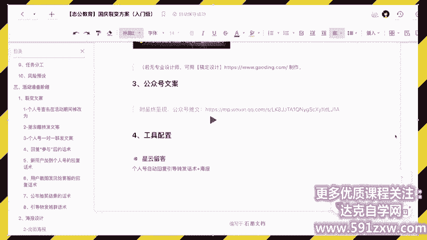

那最后呢我们这一个今天的这个课程作业和任务是什么啊？行为发生改变，学习才算开始，有学习没行动等于0。我们回顾一下这节课的课程目标，认识操盘手的基本功，掌握裂变的关键要点。第二，开始着手从零。

做一个可落地的裂变方案。

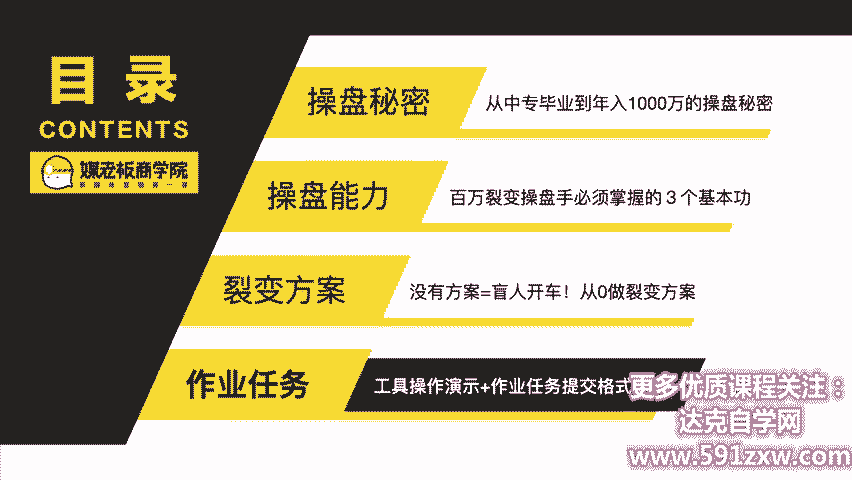

那今天的这个第二课的课程任务作业任务是什么呢？就拆解我们梅老板图书日的。做的这一个私域流量实战营销指南的送出裂变活动。这个活动呢一共为我们带来了有啊第一次是1。5万的粉丝，第二次累计是4万的粉丝。

所以这个活动给我们带来了5万的粉丝。5万的粉丝呢差不多是我们。一个季度全部的新增的量了。所以呢我们通过一个活动，短短几天就吸引了几万的粉丝。这个呢也是一个样板级的案例。

那提交的格式呢是啊根据这个海报扫码进去之后。你去做一个拆解。假如你来做这一次活动的执行和策划，你会怎么做？那拆解的思路呢是将每一个步骤都截图。and后呢让你你的理解来去写。我们在做什么？

如果你来优化的话，你会怎么优化？那今天呢如果完成了这个作业的同学啊，我会给你我们整一套这一次活动的全套的策划方案。这个策划方案呢呃是非常全面的，也是非常完整的。如果你拿到了这一份方案去仔细阅读的话。

相信呢对你的活动策划的能力会有大幅度的提升。记得是你完成了今天的作业之后，才可以得到这一分。活动方案啊，如果你没有完成这个作业呢，那你只能得到我们入门版的这个方案。我希望你呢可以认真对待今天的作业。

因为今天的作业呢决定了我们下一周啊全部的内容。所以呢我希望你可以通过今天的作业来了解裂变的活动怎么是从0到1是一个什么样的体验。你也可以以用户的角度来给我们提意见。啊，非常感谢你收听今天的课程内容。

我们下周见。

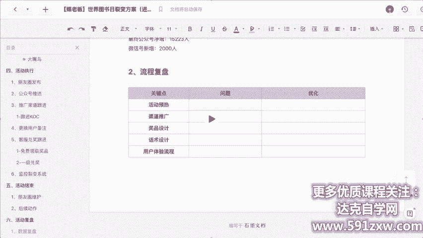