# 微社群裂变营销私域流量池增长秘籍创业运营销售获客视频课教程 合集 8套 374资料 13.1G 客户倍增方法论 - P4：第1周-加餐课1：【人群定位】如何找准目标人群，彻底引爆裂变活动 - 高端网创试错赚钱大师 - BV1RS411w7AE

Yeah。

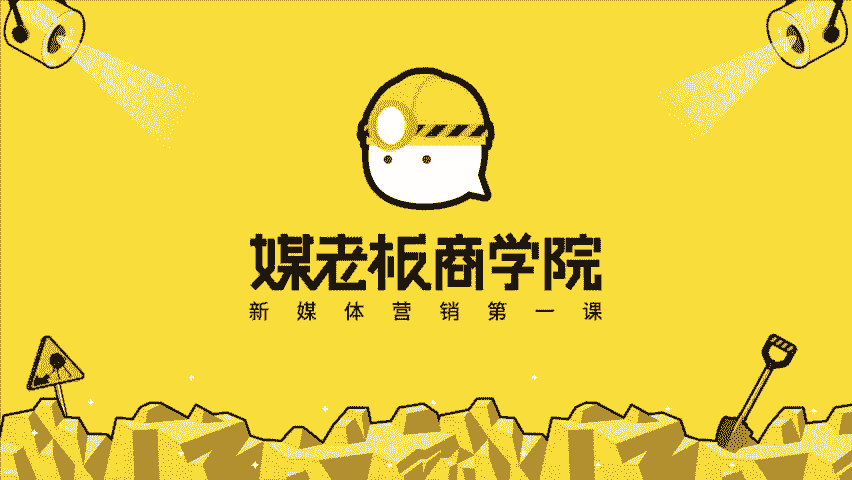

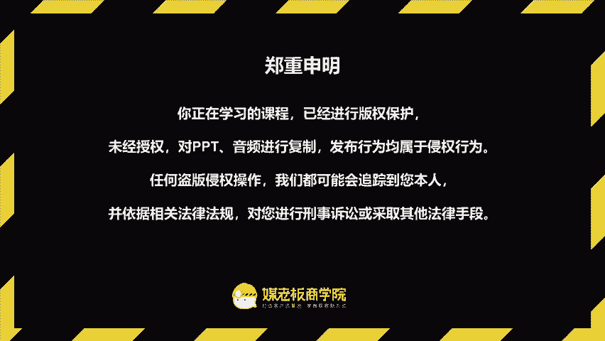

客户自动裂变，利润自然倍增，欢迎你来到客户裂变操盘首持阵营，让你的客户从500人快速倍增到5000人。我是昆龙，90后新媒体老司机，我将用三周的时间带你成为最值钱的裂变操盘手。hello，大家好。😊。

今天呢是我们那个加餐课。那在上两节课呢，我们学习了什么是裂变营销，然后呢也学习了如何操盘一个裂变的活动。那在我们进入到课程之前呢，我们需要有一个呃清晰的目标，或者说我们讲的是获客，对吧？希望是吸引客户。

那么第一点呢就非常重要的是到底是吸引谁呀？我们为谁而服务，谁又需要我们。那所以呢今天有这个加餐课。那加餐课跟政治课有什么不同呢？啊，政式课呢我们是有这个作业和任务。加餐课呢相当于是啊一个间隙。

那如果你听了会功力大增。如果你没有听呢啊可能也不会影响正常的这个进度。所以今天呢我们心情可以放轻松一点，放轻松一点。那我们加餐课的第一课人群定位。如何找准目标人群彻底的引爆裂变活动。

那这节课的课程目标呢是了解到客户画像的重要性来拓展我们裂变的营销的新思路。第二点呢是掌握用户画像的构建方法，来找对精准的目标客户。

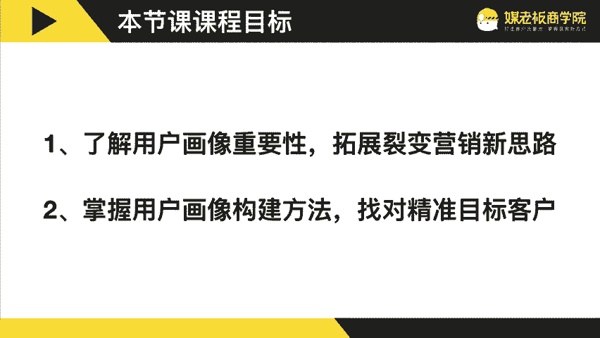

那一样我们是有三个部分。第一部分呢是搞懂客户画像是吧？是裂变活动有效的前提。那这里面呢第一个观点跟大家分享的是你的用户画像越清晰。那么你的营销推广就越容易。

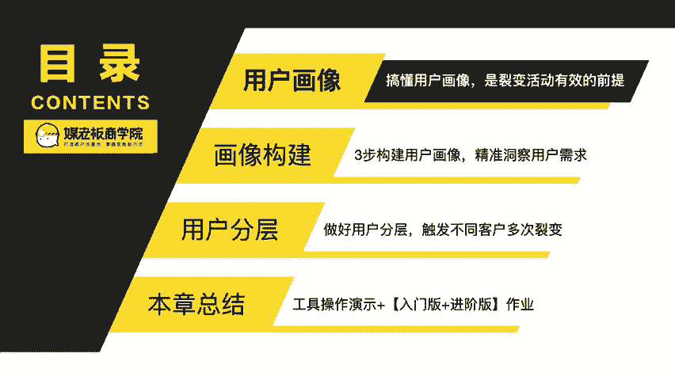

我重复一遍，你的用户画像越清晰，你的营销推广就越容易。我们来看那什么是用户画像呢？简单意义上的用户画像啊，就是用户信息的标签化。比方说人口属性啊、年龄啊、性别啊、地域啊啊。

还有他的场景、生活场景、工作场景、行为啊，性格、兴趣爱好等等等等一系列的这个标签。那我现在呢可可能跟你说，有一个很爱吃的胖子。

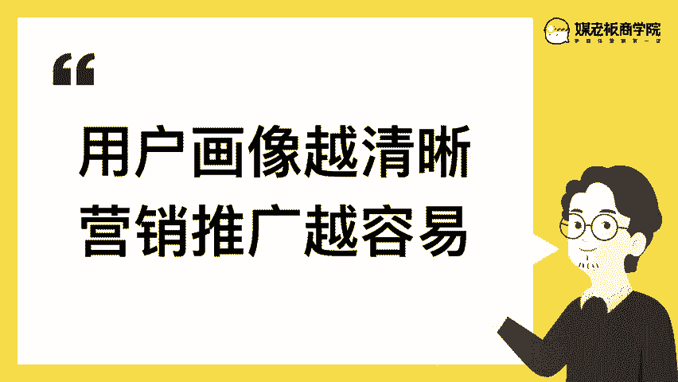

他住高老庄，你能想到是谁吗？啊，对了，那这个呢也是慢慢由模糊的用户认知到标签化到清晰的认知。刚刚我讲的这一位用户画像呢啊你没有猜错，就是猪八戒。因为我没一想到住在高老庄的。胖子很爱吃，对吧？又好色。

那我们可能第一时间就会想到猪八戒，对吗？所以呢一开始啊我们的用户画像有可能是很模糊的，他可能是啊黑黑狐的一片。慢慢的他开始有一些标签化了。比方说是耳朵大啊，比方说喜欢美女风趣幽默，高富帅。

当过元帅等等等等等等。这些标签越来越清晰之后，就会形成一个角色。就是我们讲的这个猪八戒这个角色了。这是为什么要做用户画像的。元因。啊，比方说现在呢要你去对一个胖子去做这一个裂变营销啊。

可能你未必有什么样的一个思路，对吧？但是呢我来考你说，如果你要对猪八戒进行一次。吸引的活动是吧？你怎么把它留住，怎么把它待在一个地方，这个呢是不是就简单容易的多啊？对了，就是你对用户画像越清晰。

你的营销推广就越简单啊，所以这是非常非常重要的，就是啊为什么要做用户画像的原因。你的用户画像呢最好能够啊非常的具体具象，就好像是你身边的一个人一样，或者说呢是某一部戏剧里面的某一部电影里面的一个人物。

那人物呢它有自己的一些性格特征特点等等。那做用户画像的四个优点呢。第一是了解到用户的真实需求。真实需求。第二点呢是可以定位到啊目标用户。第三点呢是实现精准分层的裂变。

第四点呢是可以优化我们的用户消费体验一个个来。第一个呢是了解到用户的真实需求啊。我们从猜测到呃实际上做出产品呢是有很多不确定性的。但是如果你的用户画像越清晰呢，那我们就越真实。

你开发出来的产品或者服务或者活动就不会啊让用户呢是无动于衷，不知道你要做什么。第二个呢就是啊能够准确的定位到目标用户啊，因为呢呃我们的资源永远都是有限的，我们没有办法用啊很多很多的资源来服务所有的人。

所以呢我们只能服务一小部分人。所以进而呢我们做好用户画像之后呢，有些是符合我们的画像的，有些是不符合我们的画像的。所以我们呃要资源有限有限的情况下，我们只能服务最精准的目标用户。

第三点呢就是实现这个精准的分层裂变。那么我我们也长也学过了这一个呃客户的分层，客户的分层。那么。我们会发现把客户分成之后。你做的活动就能够对症下药，对症下药，就是把它分成不同的需求，不同的角色。

不同的阶段之后，我们就能够对症下药。不仅是列别活动可以对症下药。其是我们平时的营销活动也是可以对症下药的第四点呢是优化用户的消费体验。那从啊因为顾客和企业的矛盾呢。

永远都是顾客呢总是希望最低成本的获得最个性化的服务。那企业呢总想我一个标准化的产品能够满足所有的人。所以这里面呢，我们需要通过用户画像来找到一个准确的平衡点来优化用户消费的体验。那从呢这一种呢。

我们既能够规模化标准化，对用户来说呢，又相对来说是非常的个性化的。所以呢是第四点优化用户的消费体验。那呃整个用户画像啊，当我们有了这一个呃群体库之后，它是如何形成用在何处，并且是如何啊那个优化的。

首先呢我们会给我们的用户啊分成很多个群体，或者说呃数个群体，这样子呢形成了我们用户群体的画像库。比方说这里就有点像是西游记团队，对吧？西游记团队，他们共同的目标都是去西天取经，那西游记团队呢。

它就有几个啊，几个用户画像，比方说是孙悟空啊、唐僧啊、沙僧啊、猪八戒啊、龙马啊等等这一些用户画像，那它就是一个群体，那么当我们提取一个，因为你的产品呢有可能不仅是服务一种人群的，它可能是多种人群的。

比方说我们提取出来，我们呢需要为猪八戒来办一场营销活动。那我们就提取这个个体的。精准的用户画像来给他推应用不同的内容、产品活动和需求来做精准的精细化的营销。最终呢就是我们推出了这个内容啊。

产品的活动啊需求之后，这位猪八戒是吧，他是有什么样的行为反馈的。如果他是正面反馈呢？那我们就可以把它记录下来。哎。

原来对猪八戒出出美女这张牌确实是有用的那么我们就能够正面的去强化这个用户画像确实如我们所想。那如果我们提取了孙悟空的这一个用户画像出来呢，我们给他发这个美女牌是吧？用美女去摄诱他。你觉得我们有效吗？

所以就没效了，对吧？所以这里面呢正面的反馈可以带来画像的强化。如果负面的反馈呢也可以带来矫正矫正啊，所以是这样的一个循环的图循环的图。这个图呢我们持续的慢慢的去迭代，去优化。

就可以形成我们一个非常强大的用户群体画像库。当你每一次做活动的时候去抽取说我到底是对我们的哪一个人群做什么样的活动，他们会有什么样的反应。

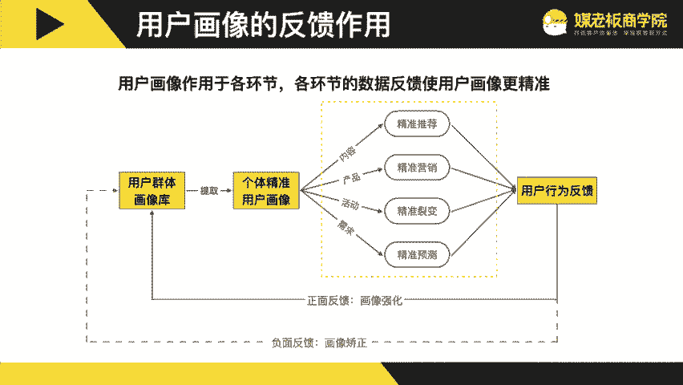

所以这里面呢是没有用户画像啊，就等于浪费营销资源。所以一定一定要有清晰的用户画像。

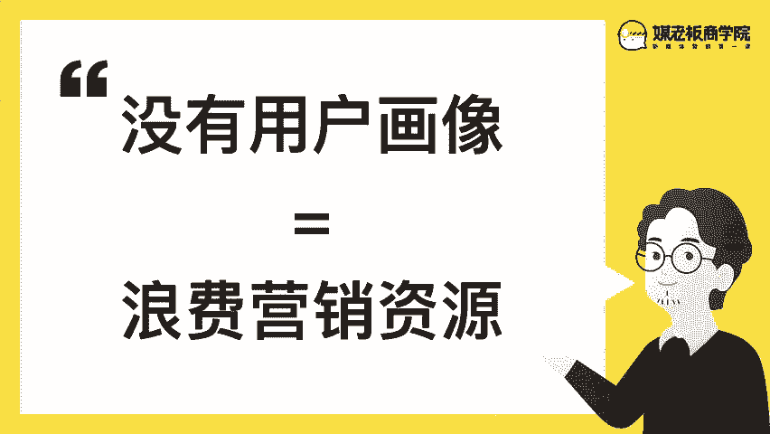

那第二部分啊第一部分我们了解到了哦，我觉得用户画像是一个从模糊到清晰的这样的一个过程。当我们啊掌握的用户画像越清晰，我们的营销推广就越容易，对吧？那么怎么样来构建呢？三步三步构建用户画像。

精准洞察用户的需求。

首先呢用户画像啊它有两个非常重要的一个来源跟体系啊，第一个呢是标签标签就是我们首先呢要给我们的用户去建立一些标签。第二呢是它虽然是符合这个标签的，那么他在使用我们的需求以及发生需求购买的场景是什么？

简单来说呢，最终我们会得出三个问题的答案。第一个是。我的目标人群是谁？第二个是。我的目标人群在哪里？第三个是我们如何找到我们的目标人群。首先来看第一个啊这个用户标签。那我们呢会给我们的学员。

用户去贴上不同的标签。比方说他是线上课的学员，线下课的学员。这个呢是以学员的维度去分的。比方说他是上了哪一个课。那其实他每每个人上不同的课，其实就证明呢他有不同的一些需求的那集合在一起呢就越来越清晰。

比方说他上了企业微信的课，又上了这个咨询室成交。那么我们大概两个拼在一起呢，就会知道其实他是一个在中大型公司里面专门做对话成交的啊一线人员或者是主管级以上的人。

那这里面呢在两个标签加在一起的时候就会更加的清晰了。那另一个维度呢就是他的行业是什么是线下的实体呢，电商的微商呢还是第三。方服务等等。这个呢是以行业来划分的。最后呢他的职位是什么？

是创始人、合伙人、经理、总监还是运营等等。这些呢也会拼成一个清晰的用户画像，以及他企业的阶段等等。这个呢就是我们梅老板自身的这个用户体系，用户标签。所以当你的标签库越完善。那么你对你的用户的理解就越深。

那整个啊用户画像呢是它有几个步骤，几个阶段以及输出的东西是不同的。首先呢我们第一步啊是数据的挖掘。最好呢是你原来就有一些数据记录。最简单的就是你的微信里面你的私域里面有没有给你的好友贴标签。

第二呢就是第三方平台的这些数据以及这个行业的数据来提出一个画像的假设啊，这个画像的假设呢就是一句话，它到底是什么样的一个用户。这些这这一句话是有很多的标签来拼贴出来的。第二个我们提出了假设之后，对吧？

那我们就需可以用一些问卷调研来去调研这些用户是否是真的这样子的。第三步呢是当有因为用户调研问卷，这一些啊，他没有办法问一些很个性化很临时性的一些问题。所以呢我们还要进行第三步。用户访谈做分层的筛选来。

用户比方说是呃知道我们但没有购买，购买过我们，但没有推荐购买过我们且有推荐的这些用户，我们会做分层的访谈。第四步就先生成我们的画像图，生成我们的画像图。然后呢，这个时候呢生成画像图之后。

我们就可以得出一个精准的目标客户的画像。那我们来到这个精准的目标客户的画像，就可以进行产品的研发产品的研发营销推广以及服务流程等等。这些呢都要建立在我们精准的画像的前提下。

那第一点呢是我们刚讲到通过数据的挖掘。比方说是公众号的后台的用户数据啊，以及这个小程序的数据啊等等。这些呢都有助于我们去完善我们的用户画像。那提出这一个用户假设呢，就是我们需要通过一些问题来提炼出来。

比如说我们的产品和服务到底解决客户的是哪一些哪方面的问题或者需求和痛点。那他们在什么时候会需要我们的产品呢？第三，什么样的用户会有这样的痛点和需求呢？第四，这样的用户会有什么特点越具体越好。第五。

他们在什么时候可能会关注我们的产品或服务。第六，他们会在什么渠道关注我们的产品或服务。第七，他们选择类似的产品服务时，最看重的是什么？那我们呢这些问题呢分别导出的答案是不同的。他有可能是导向用户的痛点。

用户的定位裂变的时机，那变的渠道以及产品卖点等等。那第二点就是做这个问卷的调研。比方说他是什么行业的，什么身份的，以及呃他的拳头产品是什么？这一些呢都有助于帮我们更加更加的了解用户。

那设计问卷呢我们有四类的问题啊，第一是用户类的这个用户类呢简单来说就是硬指标。比方说男女是很清晰的，地域很清晰，行业也清晰，职业也清晰。这些呢是根据用户的属性来方便我们了解。

但是呢简单的用户类的问题是没有办法解决个性化的需求的，只能够大概率的差不多。然后行为类呢就是主要是从哪些渠道了解到我们的产品的，还有什么情况下呢？会使用我们的产品，它使用产品的目的是什么？

最希望解决什么问题。这个的问题的目标呢是了解用户的具体的行为操作和场景。里面呢就会诞生非常非常多，我们可以去完善迭代，或者通过我们的产品去解决他们的需求和问题的。第三类是啊产品类的问题啊。

比方说是否使用过我们的产品啊，使用过什么类型的产品，为什么吸引你使用完之后呢，又怎么评价的等等这一些啊，简单来说，第一类呢是行为，他是什么怎么知道你的什么时候用，解决它什么问题。

然后产品类呢就是对产品的调研，就有没有用过，还还有没有用过什么替代品，以及呢他用完之后感受如何。这个问题的目标呢是了解用户在使用我们产品或者竞品的时候是什么情况啊。第四类啊，就是态度类的。

这个呢就是评价感受啊等等。就是用完我们的产品之后，情评价是什么。这个时候呢我们就要有意的去收集我们的那个客户评价或者说使用评价等等。那在过程当中呢，有没有哪些觉得可以继续优化啊，有什么不好的地方？

那最后一个问题呢，就是还希望我们的产品具有哪些功能解决什么问题。这个呢这些问题啊很有可能会衍生出周边的产品，或者说下一代产品迭代的方向。啊，所以目标是用户对产品的看法或者建议。那第三个就是做用户访谈。

那呃我们如果有有机会的情况下，还是需要做啊用户的访谈。那这个呢是我们在做学员访谈的时候的这些啊原本设定的这些问题。我们会呢根据这些问题，在一种非常轻松愉快的情况下啊去获得我们想知道这些答案。

那么在提这些问题啊，除了这个问题库以外，还有一个非常重要的一个要点。大家呢啊要仔细听。就是不要让用户给你专业性的建议，而是要用户去搜索他真实的情况是怎么样子的。比方说你就说哎你想听一个什么课。

你不应该在一开始的时候问，可能说哎你在解决这个问题的时候，通常在寻找什么课。那你会发现这两个问题很接近，但是是完全不同的。你想听什么课，或者说你建议我们开什么课，那用户呢就会陷入到一个给建议啊。

他变成专家的这样的一个角色，他会给你很多建议。但是呢由于他又没有受过这种专业的调研，有可能呢他给的建议方向啊，不一定是非常准确的。但是你可以这样问，假设你在解决这个问题的时候，你通常会去哪里找。

你想找一个什么样的一个课程。那么他就会跟你说，我呢会在什么渠道去找什么样的课程。然后呢，我其实内心里面想的是，如果有这个课，有一个什么什么样的课就好了。那你会发现呢这个是他真实的需求。你去问他建议呢。

他可能会给到一些伪需求，或者说他认为好的。这两个呢是有非常大的差异的。大家可以感受一下。就是用户给你建议，以及他自己真实的路径是完全不同的。所以我们做调研的时候，目标是为了得到。客户真实的路径的反馈。

而不是他给你建议。给你建议。当然我们在后面去问这一些开放型问题的时候是可以的。但是我们在寻求答案的时候，尽可能的是让他去搜寻，而不是给建议。那针对用户生命周期的一些访谈呢，也是有不同的一些要点的。

比方说路人啊、潜在客户啊、新客户啊、使用客户啊、老客户啊、流失客户啊等等。你要访谈的要点都是不同的，都是不同的。所以这里面呢是用户访谈是一个非常呃重要非常重大的一个工程。

那么我们呢是尽可能的希望在这里面呢给到大家最完整的一个知识体系。大家呢可以根据这个路径一步步来。那最终呢我们要得出的一个结论呢，一个结果就是寻找金主客户，寻找金主客户，就找到这一个金主客户。

比方说什么意思呢？是我们前面做了那么多那么多的画像，我们要带着一个问题，资源有限的情况下，我们应该做什么？那现在呢可能有很多个客户画像，有很多个客户群体，如果资源有限的情况下，我只服务一一群人群。

那我服务谁呢？肯定是服务给我们买得多，买的贵，自己买给人买代人买的这样的一个群体，我称之为金主客户，在客户关系管理学里面呢？这里面也有个重要的概念叫做关键客户，所以我们关键的资源只去在资源有限的情况下。

我们只够去服务关键客户，所以找到你的关键客户就非常非常重要了。刚刚呢我们分享的是调研法是吧？调研法，从从无到有的去推演。假设呢今天你已经有。有一定的客户量了，那就太棒了，那就太棒了。

我们呢可以省去前期的非常非常多的这种猜测推演的这些工作，直接跳到找到金主客户。金主客户的6个标准就是这6个买的多，买的贵，买的勤，自己买给人买，带人买6个标准。如果我说到这些标准。

你脑海当中已经出现一些人名，出现一些画像，那么恭喜你他就是你的金主客户，那么如果你愿意是吧？如果你你呃很想做这个事情，你想不想让。你的金主客户更多，你的金主客户更多。如果你也想让你的金主客户更多呢。

那么我们的目标就是复制更多的金主客户。那金主客户呢，他已经越过了前面我们的这一些客户画面的分析，他直接呢就是你的非常非常典型的金主客户。所以呢我们可以从对金主客户的分析来去优化我们整个营销路径。

以及我们的这个活动的流程。那我通常呢碰到一个呃金主客户是吧？符合这6个标准的金主客户，我会问他5个问题。第一个问题就是渠道。就我想知道他是在哪里知道我们的那问渠道的好处是什么呢？

就是你可以精细化的去运营这个渠道。所以我会问，哎，你第一次听说我们是在什么地方啊，什么时候啊，这个问题的关键点呢是在于。问出这个用户是来自于哪里的？找到背后的潜在的渠道或者鱼塘啊，简单来说。

有一条鱼游到了你的鱼塘里面，对吧？你是不是可以采访说哎，你之前是在哪一个鱼塘的，很有可能之前的这个鱼塘啊，有非常多你的潜在客户。所以呢如果我们能跟这个渠道啊去搭上关系的话。

那么我们就有非常多的潜在客户即将会流入到我们这个呃流入到我们的思域，我们的体系里面。所以这是第一个问题。第二个问题呢，就是探寻竞品呢，就是很多时候我们并不知道我们的竞争对手是谁的。所以呢我会问哎。

其实你当时在考虑我们的产品的时候，同时在考虑哪一些产品呢？为什么？啊，所以呢这个时候我是会挖掘我们的竞品，了解他们的优劣势，客户选择我们的原因究竟是什么。第三个就是诱因。

诱因呢就是他在决定购买下单的那一刻的原因是什么？那一瞬间是什么，这个是非常重要的，呃，如果我们找到了这个准确的诱因，我们的营销推广啊，就会非常的简单啊，比方说诱因是什么呢？啊。

你身边有一个朋友突然间买保险的，对吧？几乎可以断定的是他身边是有一位朋友出了事，但是并没有买保险，对吧？这个就是诱因，所以呢就是身边朋友出事，没有保险，这个世界会让他身边发生连锁反应。

他身边的所有人啊相当多的一份呃朋友可能都会说哎我赶紧去补一个保险，这个就是诱因，挖掘到了这个诱因呢，我们可以一起来编写朋友圈啊一对一的话术啊，以及。策划活动都是可以基于这个准确的诱因。第四个就是阻碍啊。

这个问题是这么问的是哎，当时有没有什么特殊的原因让你差点没有购买我们的产品。问这个问题的好处是什么呢？因为你是很难去调研到那些没有成为你客户的用户的，简单来说，你去问一个客户说，哎。

你当时为什么不买我的产品呢。他很有可能回答你是错误的，或者说呢他也不会真心的去回答你。但是如果我们有一些比较好的关系比较好的金主客户，我们就可以通过这个问题来得到答案。就是当时有没有什么特殊的原因。

让你差点没有购完购买我们的产品，问这个问题的意意义呢？就是在于我们可以快速的去找到。快速的去找到一定有其他人。因为这个原因。就没有购买我们的产品呢。那这个问题呢，我是问过一一些学员，其中有一个学员呢。

他说呃他已经到了我们的线下课，我就问哎，当时有没有什么特殊的原因，让你差点没有来我们的线下课哦，他说你们总是在广州开课，我一直等等等等。希望你们能来北京开，后来实在等不及了，所以我就来了。

所以呢就是地域，就是你在哪里开课，可能很有可能呢是呃如果我们没有去开没有开在北京，有很多在北京有需求的这样的一些啊学员呢，可能就没有来到我们的课堂啊，所以这是一个。第二个呢，我又问问另外一个学员。

我说有没有什么差点呃，有没有什么特殊原因，让你差点没有来。他说我去百度你们的时候，什么都没有百度到。所以呢我觉得你们是一个琵发公司哦，那个时候我才会发现原来百度对最后一层的决策是非常重要的。

所以呢我进而去优。画了我们百度搜索的这个结果和页面。那以后呢陆续我会还会继续去问我们的学员啊，但是呢已经很少说去百度你们没有没有啊。没有任何正面的消息导致没来的，基本上呢都都说哎，我去有收过你们。

但是呢基本上也觉得还不错。第五个问题是口碑，就是你会向身边的人，哪些朋友来推荐我们呢，以及怎么介绍呢？因为啊是我们这一个呃推荐的时候。很有可能我们推荐设计好的这个路径啊。用户不会用，或者说客户不会用。

他是呃以自己的理解来给你推荐的来给你推荐的。那么我做了很多轮调研，其中有一个非常有效的一个呃触点呢，就是我们会给我们的学员去发一本教案。那么这本教案呢，他通常都会带回公司。带回公司呢。

他就会跟同事讨论说我周末去上了一个什么课啊，有什么样的一些启发。慢慢呢他身边的人，他同事或者说去他们办公室拜访他的这些朋友，也都会因为这一本啊教材来知道梅老板。所以呢这个时候我们就可以优化这个教材。

在教材上呢去做更大的投入，更好的研发。所以第五个问题是口碑，他会向身边的谁来推荐我们，以及怎么介绍的。这个问题呢有助于帮我们找到用户传播的人群，话题诱因以此来设计传播和裂变的因子。好，这是金主五问的啊。

金主客户的5个问题。那么我们在用户调研呢是有几个方法几个方法。首先呢我们来回顾一下啊。第一点呢是通过这个呃通过这个用户用第一点呢是通过这个数据的挖掘，数据的挖掘。第二个呢是通过这个问卷的调研。

第三呢是通过用户的访谈。那么如果你的数据呃越清晰，那么你的目标人群就越清晰啊。如果你的呃一些基本的一些问卷呢是可以把呃比如说一些基本的特征就能够搞定这个用户画像了。那么啊就不一定需要又做用户访谈。

那么第三个呢做用户访谈，我们讲到是一定要是他搜寻答案去搜寻到过去是怎么样的，而不是给你建议。啊用户访谈里面呢，我最推荐的一种方法啊。如果你有老客户有金主客户的前提下，我最推荐的一种方法就是。

直接采访金主客户的5个问题。那么如果你没有，那么可能就需要问更多的问题来得到你想要的答案。那么这是第二部分。那么我们再来用这个用户分层的方式来去呃继续来去学习。哎，当我们有一个清晰的画像之后。

怎么给他做分层。

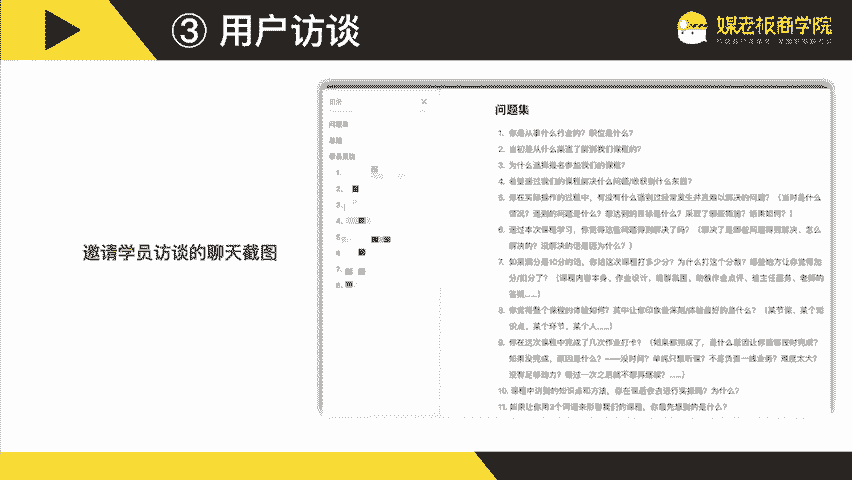

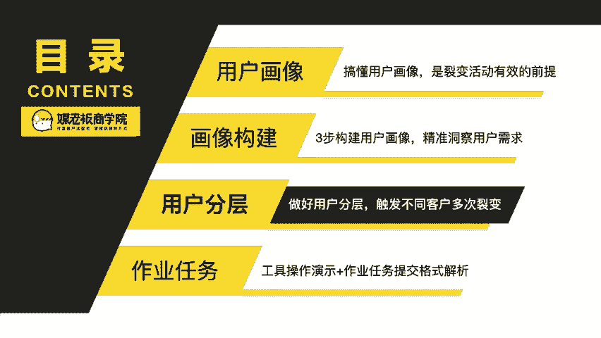

啊，比方说啊我们也看过这个图，用户分层可以扩大裂变的半径做更精准的营销。我们再来复习一下这个准确的定义。首先呢潜在客户就是他符合成交条件，但是并没有产生需求。目标客户呢是他已经产生了需求。

但是没有进行购买。购买客户呢他已经购买了，但是呢没有推荐客户铁杆客户，也就我们讲的金主客户。他已经成为了客户，且有推荐客户。那我们自攻的呢，就是呃符合条件的就是他因为公务员考试呢。他需要年龄有要求。

学历有要求。所以自攻的就是广西大学生。那么目标客户呢就是报考公务员考试的广西大学生，他不一定选择辅导，也选择辅导呢，也不一定会选择自攻。所以购买的客户呢就是选择自工，且呃选择辅导。

且选择自攻的广西大学生。铁杆客户呢就是自工公考辅导的老学员，且有转介绍新学员的。那么我们做好分成之后呢，就是针对广西大学生做了国庆的这个抽奖的呃门票的往返加票的呃往返家里的车票的这个活动。

那针对警察学院的这个目目目标用户就做了这一个哦警察学院的这个大礼包。然后针对呢这个已毕业的这一个哦。王牌班的老学员，我们就可以推出这一种呃转介绍可以减免学费的优惠。然后针对这个已入学的。

我们就可以呃给他办这一个入学的状元晚宴，那么苏小唐呢，他是一家呃在厦门的旅游景区里面的一家礼品店，他是卖糖的啊，也叫伴手礼。那么潜在客户呢，就是首先第一个条件就是去厦门的游客。

如果不去厦门呢是难以知道厦门有一家糖果店叫苏小糖的对吧？那第二个目标客户呢，就是到厦门买伴手礼的游客。到厦门买伴手礼的游客啊，这是第第二点。第三点呢是他要买伴手礼，且会选择苏小唐伴手礼的游客。

这个就是我们购买的客户。那铁杆客户呢就跟刚刚的有所不同了。首先呢他要买这个伴手礼，他要送人的嘛，所以呢他就有个自然转介绍，送送礼也是一个转介绍的过程，或者说也是转介绍的一部分。他买促小城的伴手礼。

且呢会添加我们的微信，继续复购的游客。这个就是我们定义的铁杆客户。那分队做不同的营销，比方说呢游客他未必进店消费是吧？那我们呢可以给游客拍专业的照片，让他进店呢来去领我们这一个照片啊。

这个呢就是做了用户分成之后来做的设计。第二点呢是假设呢他进了店又要消费是吧？那我们呢就会给他做这个抽奖啊，或者说给他一些小赠品啊，扫码加微信就可以免费领取了。那这个呢我们加微信的概率就会非常非常的高。

第三点呢就是经啊针针对这个收礼的对象是吧？那因为送送礼呢，他是一个有温度的一个行为，所以呢他呃可以啊，他是可以去去去给收礼的人，在我们的工具里面就是一个音乐留声机去留一段言。

那收礼的人他只要啊打开之后去。输入他的手机号就能听了。同时呢我们也做这个索客的会员，9。9块的特权会员。9。9块呢就有九大权益。那他买了之后呢，他复购的概率是非常非常高的。所以呢我们也是做营销的时候。

也要做这个客户的分层来做更精准的营销。那最后呢就是我们梅老板。那潜在客户呢是需要通过线上获客的企业。第二点呢是因为有很多需要通过线上获客。但是呢他不一定会学习，他有可能自己做了或者请人啊什么等等的。

所以目标客户呢是他是想通过学习来掌握线上获客的企业。那这个呢因为新媒体营销啊，它本质上是线上获客的一个分支。所以呢购买的客户呢，他是选择学习梅老板的线上获客的企业。

那最后一个是有为梅老板转介转介绍过学员的企业。那我们也是做分层。第一个呢就没有付费过的，我们会设计这一种非常非常多的多平台引流获客的公开课，一节呢大概是30分钟左右。

我们呢就会啊每周都会有一节这样的公开课来吸引更多。不知道我们的啊不知道梅老板的，或者从来没有购买过梅老板课程的这样的一个潜在用户，到我们的公众号以及个人微信里面。那如果他到了微信呢，到了公众号之后呢。

他最低一个门槛的课程，就是我们的线上多平台引流获客的课程。比如说抖音获客，比如说豆瓣引流，比如说知乎引流等等。

这一些都是为了帮助企业解决引流获客的难题的那么最后一个呢就是呃我们去针对这个已经为我们转介绍过的老学员啊，会给他发这个感谢信。我们会给他发这个感谢信。那当他收到这个感谢信呢，他会非常的惊喜。

进而呢再次去转介绍啊，再次去转介绍。所以呢是一个非常有温度的一个社群和组织。那这个呢就是啊自工教育，苏小唐以及梅老板的客户分层。听到这里面呢，你有没有想过给你的客户做分层，然后做更加精准的营销呢？

所以今天的这个没有作业，但是呢给大家留个思考题啊，请你用一句话来描述你的目标客户。比如说自攻的是报考公务员考试的广西大学生。苏小唐的是到厦门旅游且会买伴手礼的游客。

比如说梅老板的是想通过学习掌握线上获客的企业。那么请你用一句话来描述你的目标客户是谁。那么欢迎你在我们的群里面接龙。那我看到呢也会给你去做一定的反馈。那这节课呢，我们用一句话来总结。

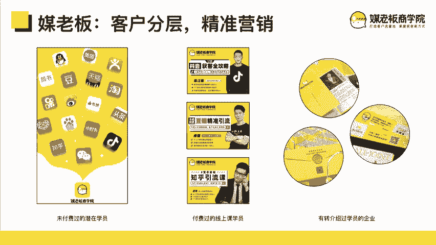

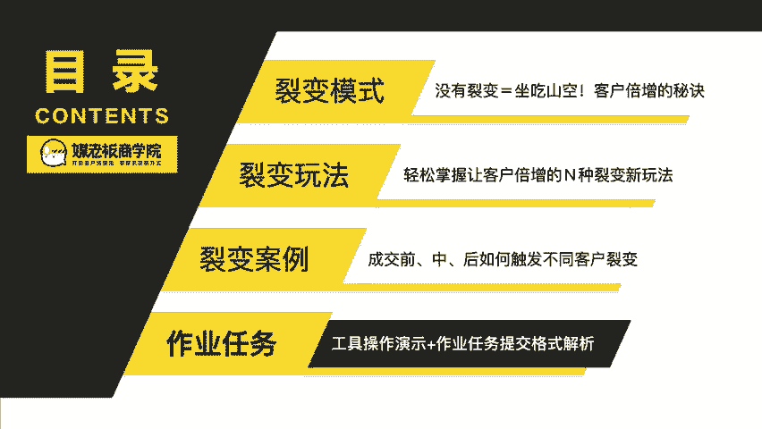

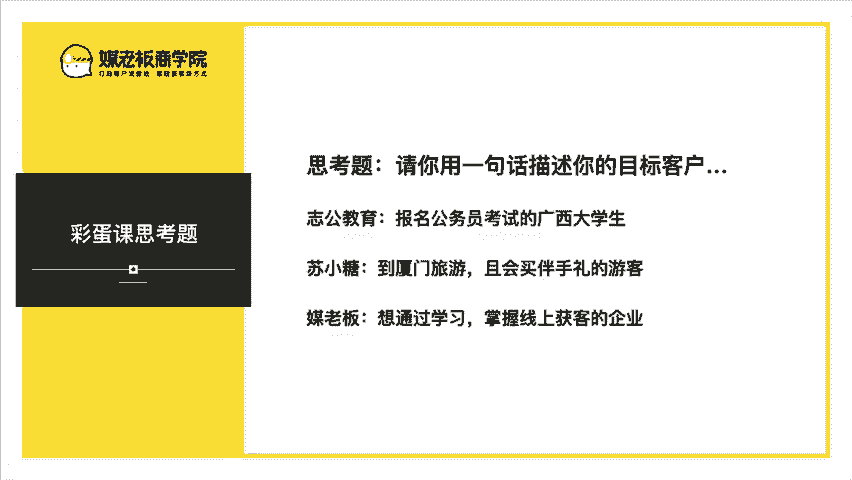

用户画像越清晰，营销推广越容易。那今天的加三课呢就到这里，我们下周见。

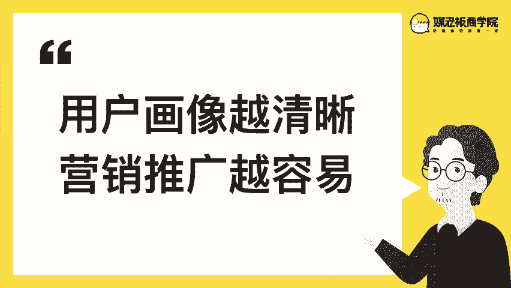