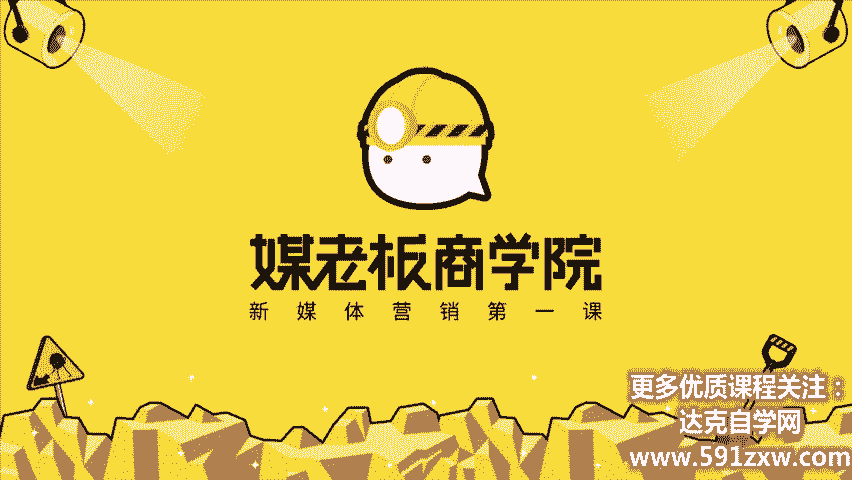
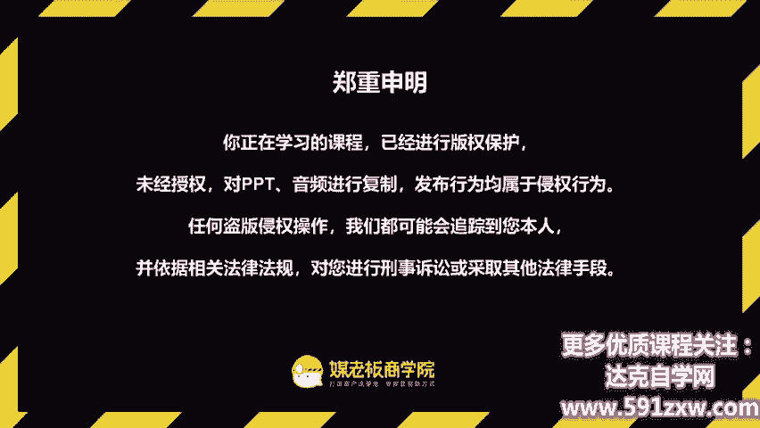
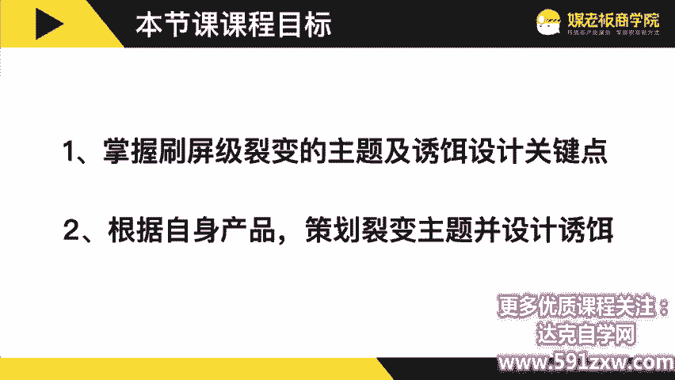
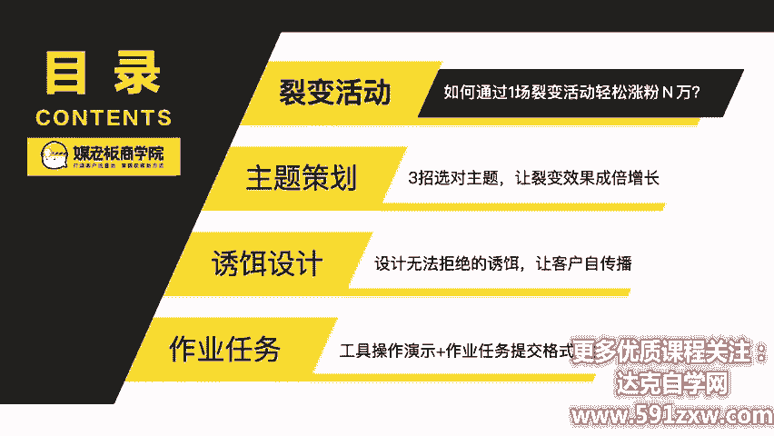
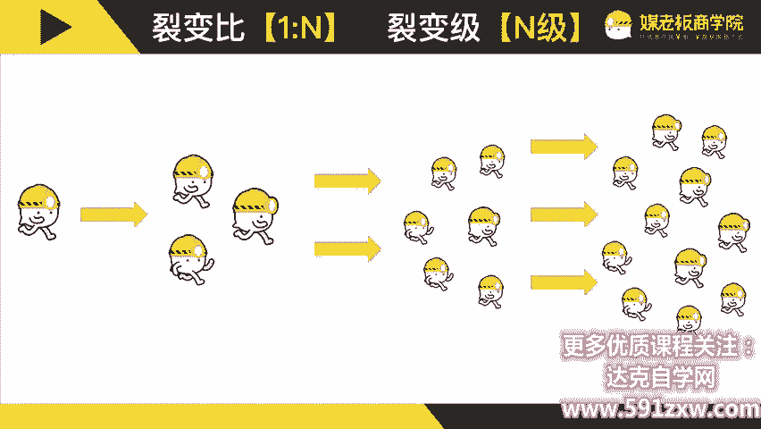
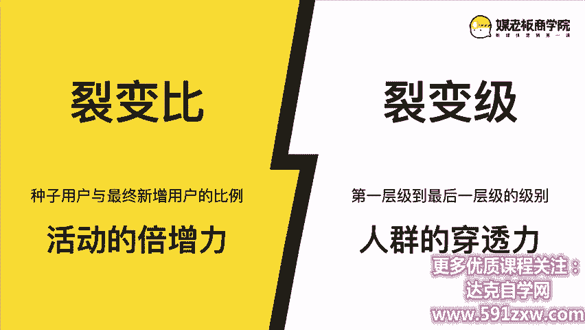
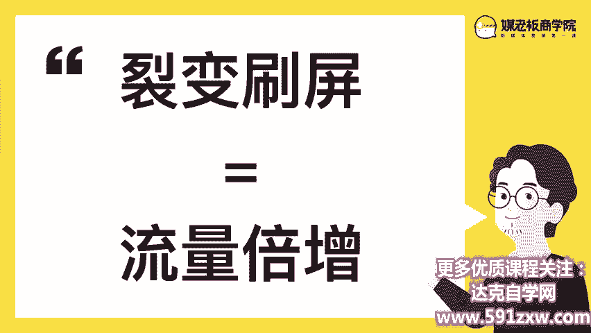
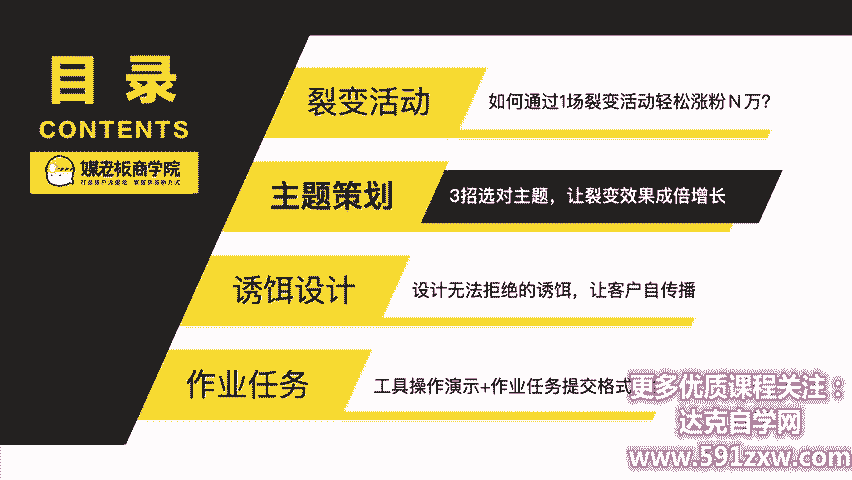

# 微社群裂变营销私域流量池增长秘籍创业运营销售获客视频课教程 合集 8套 374资料 13.1G 客户倍增方法论 - P5：第2周-1：【主题策划】好的主题=成功一半！3步做对主题策划（上）-主题部分 - 高端网创试错赚钱大师 - BV1RS411w7AE

。

客户自动裂变，利润自然倍增，欢迎你来到客户裂变操盘首持阵营，让你的客户从500元快速倍增到5000人。我是昆龙，90后新媒体老司机，我将用三周的时间带你成为最值钱的裂变操盘手。

今天是我们第二周的第一节课，主题策划。好的主题就是成功的一半。三步做对主题策划。那么这一周开始啊是到我呃我们的第二周的课程。那么我们在上一周的课程里面呢？是基本掌握了什么叫裂变营销。

有哪种常见的活动形态。它要达到一个什么样的一个结果，以及呢我们的客户客户分层应该怎么做，怎么来操盘等等。那么这一周开始啊，实际上呢是一个裂变入门。那这一个阶段呢，就像你是新手上路。

我们的主要的目标呢是先流畅的把车开稳。那这一周呢一共呢是有三节正课，一个加上课。第一个呢是今天的课程，就是裂变的主题策划。第二个呢是非常重要的一个素材要素，叫做海报设计。第三呢是文案策划。

就是如何错做好这一个裂变当中。所需要的文案以及最后的这一个加餐。那么如果我们这一周完成了这一周的作业呢，就可以接受我们第四周的裂变高阶的玩法。那个阶段呢，就像职业的赛车手可以呢开高速去超越别人。

那有很多很多的玩法。那么这一周开始呢，我们就进入到一个非常实操非常操作的一个环节，非常。非常多细节的一周。那么今天这个课呢也是呃我们这一周的课最重要的一门课。也可以说呢是我们整一个系列课。

整一个系列的训练营。最重要的一节课就是在今天那么啊以我的这个。了解来看，这一节课呢可能你不只会听一遍。在我们训练营过程当中，你会听在实际去做这个裂变策划的时候，也会给你非常大的启发。

在你去总结和复盘你的裂变的时候，也会用到这一节课。所以这一节课呢是。我们三周的课程里面最重要的一节课。那所以呢啊希望大家可以集中精力。同时呢因为这节课非常的重要，我也会呃分成两个部分，两个部分。

因为呢我们整个啊主题策划是非常重要的，就是重中之重。所以我会分成上下两个部分，上下两个部分。上一部分呢就主要是教大家如何去做这个裂变策划的主题。

那么下一部分呢就是这个主题啊它需要有具体的右饵以及怎么包装，怎么选择等等。所以呢我们今天呢是分上下两个部分啊，总体来说呢，这个课时也会比啊前面的会要长一点，也会比后面的要长一点。

因为这节课呢特别特别重要。那有同学说哎你干嘛不分成两天来学呢？确实是可以这么安排，但是呢希望更连贯更连贯。因为呢你隔一天学，可能你这个热度那个理解可能会有一些偏差，这也不是我想看到的。

所以呢我们希望呢今天我们一鼓作气把这个课听完。然后呢，当中你要记录很多你的一些呃想法想法，或者说一闪而过的这种创意等等。所以呢我们今天这个课时会比啊会比较长一点，当呢我也会分为上下两个部分。

那么这一节课的课程目标是什么呢？第一是掌握这个裂变级的叫就刷屏级的裂变的主题以及右饵的设计的关键点。第二就是根据你自身的产品或者业务的特点来策划裂变的主题，并且设计又。

这是我们的课程目标。那同样的我们分成三个部分。第一部分呢是我们首先呢如果你要入门裂变呢，你必须要从一个活动开始。那我听过呢很多人去聊这个裂变。其实裂变呢这个话题是。非常的大的，它的涵盖面也很广。

所以呢我们要入门裂变呢，我建议是先从一个活动开始，或者说呢你先熟练操作一种流量裂变的活动开始，这样子呢反而会。反而会让我们更加的呃快入门快入门。就简单来说，如果你要炒菜，你最好是先从这个番茄蛋炒起。

对吧？从最简单的菜式炒起，你慢慢呢再再来入门更深了。所以我们这一个呢也是这一周的时间啊，都是围绕做一个活动为目标啊，都是围绕这一个做一次裂变回度啊，做一场裂变的活动为目标。那么首先呢就是呃我要解释一下。

我们的客我们的目标最终的目标是客户倍增，对吧？就通过裂变来达到客户倍增。那么我们有很多种方式可以去裂变。我们在第一节课里面也讲过了。那这里面呢我想解释一个概念叫做粉丝和客户之间的关系。

粉丝和客户之间的关系。那众所周知呢，我是做公众号起家的，也就是先做了自媒体，然后再做了这个线上线下的培训。所以呢它是有个过程。那么我跟其他培训机构啊，有一个巨大的一个差异，就是在于说他们总谈客户啊。

学员啊等等。他们呢是销售思维，就是说我手上有一个客户，我马上就要成交他，这个是销售思维。那么我是做运营起家的，就运营思维有什么不同呢？运营思维跟销售思维最大的一个差别就是在养。就是在运营啊。

就是养就是养粉丝的养啊，就是养着。所以呢我们首先第一个目标，你要有非常多的精准的有效粉丝。再来呢把它变成我们的目标客户。所以呢我认为有效粉丝啊，其实就是潜在客户，我们的潜在客户越多呢。

那么我们成交的概率，我们成交的机会就越多。OK那大家应该能够理解这个概念。那么我们来看一些案例啊，为什么这一些可以轻松裂变几万粉丝啊，都是通过一张海报呢？比方说我们自己这一个私维流量营销实战指南这本书。

那累计呢是为我们吸引了5万的潜在客户。那我的课呢12招掌握微信与流友成交，也是累计为我们公众号吸引了4万的潜在客户。那我们的学员做了一次活动，也是啊通过一个1元4次猕猴桃的这样的一个活动。

一次呢涨粉呢就4000。那那我们要再暴露一个数据。这个学员呢，他的好友只有几百只有几百。那么他的公众号呢以前基本上也是没有粉丝了。那就从这一次活动开始涨了4000，最终呢是成交了2000单。

那么还有这一个美丽研习社，它一次活动呢是涨粉了505000。所以呢呃一张海报，我们从界面上来看，可能它是一张海报的事情。那我们的拆拆解一下他是一个什么样的一个过程。首先呢就是用户可能在公众号啊朋友圈呢。

或者说他的朋友发给他的一张海报。他看到了这个活动。进而呢就领取任务啊，领取任务呢就会收到他自己的带他头像的名字的。这样的一张海报啊或者图文或者链接，他领到了这个任务呢，就开始去做任务。

做任务呢其实目标非常简单，就是邀请更多的人来关注公众号。或者邀请更多的人来参与这个活动，这个就是做任务。那做任务它有几个流向转发朋友圈，转发微信群，转发到某某平台，或者说转发给某个好友。那他做了任务。

他就会激发他身边的人啊，所以呢他是一层一层的往外去扩展的。那么最后呢就是啊第四步呢就是教任务，发截图也好，或者说系统自动完成这个助力，或者他人购买，来完成了这个活动，就来领取这个奖品。

那么这里面呢有两个非常关键的一个动作，就是。扫码参与活动分享，要邀请更多的人扫码，这个不断的循环。那么我们在PPT上看是两个动作，在不断循环。但实际上呢它是先由一个人或者说种子用户。

然要扩散到第一层第一层级，可能有三四个用户。那么第第二层级的时候呢，它又扩散出去。第三层级又扩散出去，这里面呢就不断的向外的无限的扩散。那这里面呢我要提两个非常重要的概念。一个叫裂变比，一个叫裂变级。

裂变比是什么意思呢？裂变比呢就是首批种子用户，你已有的客户里面有多少人扫了这个码，就是原始码，有多少人扫了这个原始码，啊，那么最终一共裂变多少人。比方说我原始码是100人参与，100人少了码。

最终呢我裂变了总共不管多少级，总共呢是裂变了1000人回来。那么我们刚刚说到是100人扫码，对吧？最早的种子用户是100个。那么现在裂变了1000，所以我们的裂变比呢，就是1比10，简单来说。

你的裂变比的数据就是从种数除以你的种子用户，就是你的裂变比。那么你的裂变比越大。就证明了你的整个倍增的力度是最越大的。那么什么叫裂变级呢？就是由第一批的第一级的种子用户去裂变了。

最终呢它穿透了很多很多个圈层，最终呢裂变到到第10级了，第10个层级，还有人继续在裂变，这个呢就叫裂变级。那裂变比跟裂变级，它分别代表什么呢？

裂变比的准确定义就是种子用户与最终新增的用户的比例，就是裂变比。它代表着你整个活动的倍增力。那裂变级呢就是从第一层级到最后一个层级的级级差级别有多少级，这个呢就说明了你整个裂变的穿透力，就人群的穿透力。

所以这两个是非常重要的概念。裂变比跟裂变级。我们这里呢先打个一节。那么如果你的裂变比越大，就证明你整个的那个呃数据就越大。那么如果你的裂变级越啊越大，就是证明你的人群的穿透力越强啊。

那我们呢啊会以裂变活动为一个核心，就裂如果你的裂变能够刷屏，就等于流量的倍增。因为我们简单来算一个数据啊。假设有100人参与一次活动，通常都会啊都会都会有500人以上看见这个活动啊。

这个就是曝光率跟参与率的关系，就是100人参与呢，至少都会被500人看见啊，这是最少最少的啊，所以呢就是你做一场刷屏级的裂变，肯定会流量倍增的，肯定会流量倍增的。所以呢啊你的流量越大。

那么你能够吸引的潜在客户就越多。

我们来看啊任务宝的案例，任务表的案例。刚刚我们讲到任务宝顾名思义就是用户去完成了你设定的一个任务之后，他所能得到的奖励。那这个任务是什么呢？就是不断的啊去邀请更多的人来参与你的活动。这个就是任务宝。

顾名思义呢就是啊邀请更多人，简单来说就是拉人头，这个就是任务宝。那我们来看一下这个呃这一些案例啊。比方说这个新东方在线是吧，我们来想象一下他的目标客户是谁呢？他的目标客户是谁呢？很显然就是家长，对吧？

很显然就是家长啊，但是呢如果我们以前思路没有打开，我们会觉得新东方啊，它只能做这种英语课啊，或者说相关的一些课程作为裂变。但是我们来看这个案例，限时0言领取双头彩色马克笔三十色是吧？

三十色动漫专用孩子超爱。那么我们发现了哎，他为什么不是用他新东方自家的产品去做裂变呢？自家的产品去做裂变呢啊，因为其实不需要我们的目标呢只是去吸引我们的目标客户，对吧？至于这个肉啊。

至于这个主题是不是跟我们非常非常密切的相关，是不是我们自己的产品其实不重要。所以这里面呢它的种子用户。是1144，最终呢它当场活动的涨粉是9000，这个裂变比是差不多接近1比9了。

也是非常高的非常高的一个数据。那第二个呢是好未来。那好未来呢它有一个呃产品，有一个产品线在是专门针对这个校长的。啊，叫做未来校长学院。它是一个to B的啊。

它是一个to B的那我们来看到它的这个数据是啊种子用户3，就是只一开始只有3个人参与那变，但它最终呢是3000人啊，吸引了3000人。那么它的裂变比是多少呢？很显然是1比1000对吧？1比1000。

所以这个是非常非常高的。那么第三个就是这个做这个呃考试的是吧？考试的。那么啊我们看到这个2019年的护士资格，考前解密6套卷0元领取，对吧？要助你成为未来5年最值钱的护士。那么这一个呢品牌叫做为人机考。

为人机考。那他这个奖品呢是呀押题的密卷啊，其实就是资料包。那么他首批的种子用户呢是735，最终呢是7000多。那这个裂变比呢也是大于十也是大于10。所以这些案例啊是给我们非常大的这个启发。

还有行动派呢啊他也做了这个减肥的资料标，再加这个瑜伽垫两重双重，而且呢它是订阅号裂变。那它呢只有呃其动啊就是首批的扫码用户呢643。那最终呢整个活动啊是吸引了7000多的这个目标用户啊。

所以呢这个也是非常不错的一个活动。基本上呢啊我挑的这些案例啊，都是裂变比接近1比10，是非常值得去拆解和参考的案例。那第五个呢就宁愿领取儿童家用滑滑梯的秋千免费送。那么这里面呢。

它的总结用户呢是5000多，最终呢是呃涨涨了1万多的粉丝，1万多的粉丝。那这个呢虽然裂变比不高，但是呢整体上来说呢，也都是大于一大于一啊，所以大于一是最基本的一个要求了。

第二个就是餐饮零售行业的啊这一个呃。爱事晨曦爱事晨曦。那么它的品牌呢是蒙牛的蒙牛的，他就做了一个奶酪的大礼包。同样呢是用这种任付宝的活动来200多的种子用户，但是当场裂变了3500啊3558的粉丝。

还有第二个是做这个啊蛋糕的蛋糕的，我们看到它是那个蛋糕boss kboss。然后它的奖品呢也是他们呃自己的一个产品，种子用户呢255，最终呢当场活动啊是裂变了7000。

那还有第三个特别值得拆解的一个啊这个顺德的火锅店，顺德的一个火锅店。那么它的奖品呢也非常的诱人，非常诱人，是波士顿龙虾加储值卡。那波士顿龙虾呢也是要到店去消费的嘛。那储值卡呢它储值之后也是分次消费的。

所以呢它也是一个引流到店，且索克的，非常好的一个。这边优啊，那他的总结用户呢？9000呃924，最终呢单场活动是裂变了2万以上2万以上。这个是非常非常值得拆解的那还有第四个就是这个花店的啊。

他就出这种啊，按照季节来出这个啊星座花啊，比方说天蝎座了是吧？10月份11月天蝎座了，他就做这个天蝎座的花，种子用户呢700多裂变了6000多。那还有这个呢，它本身呢是做这个眼镜的。但是呢他选了一个。

选了一个呃应该很多女生都非常想要的这个SKwo的神仙水套装。那这个诱饵呢就非常的有吸引力了，非常的有吸引力了。以及这个迪士尼的门票啊，还有最后才是他们的这个代金券。它的种子用户呢只有147。

但是呢他当场呢是吸引了7000多的目标客户，7000多的目标客户。OK那还有这个啊医疗形体的啊，像这种卖牙膏的也是200多的200多，最200多的种子用户，最终呢是裂变了2500多。

那还有这一个呃做呃产康的产康的啊，100多的100多的总监用户裂变了是2000多。那还有呃这一个做防晒的。防晒口红等等啊，以及这个代餐的。还有这一个做这个呃。美甲。美甲的课程的等等啊。

这些呢都是这个医美或者说这个形体行业的。还有这个金融。保险的像大象保险，这一个是做这个呃的诱饵呢是小额重疾险，种子用户呢只有100多158，最终呢是裂变了7000多。那还有这个买保险怕被坑啊。

还有这个重疾险的对比图等等。这个也是资料包的裂变100多的112的种子用户，最终裂变了3000，那等等等等。那上面的非常非常多的这些案例是值得大家去拆解的那你可能会说哎这里好像没有我的案例，对吧？呃。

我们呢为大家整理了非常非常多的这一些呃各个平台，各个工具的刷屏级的裂变案例集。裂变案例集应该来说各个行业都会有的，各个行业都会有的。大家扫码了就会呃看到我会发给你的这一个。裂变的啊案例库。

你只要呢去啊点击这个链接，就可以找到我们整理的这个案例库了，去找到你相应的案例来进行拆解。为什么拆解特别重要啊？😡，因为呢本质上学习就是一场拆解。学习就是一场拆解啊，可能你现在要学炒菜，对吧？要学开车。

你肯定是先拆解别人是怎么做的，然后再关联到自己的自己可以怎么做，自己需要怎么做，对吧？所以呢你啊必须要掌握更多的这个裂变案例，然后你去啊做自己的裂变的时候呢，才会更加更加的有效。

所以呢为什么我们花很长的时间帮大家去整理那么那么多的裂变的啊，就这种刷屏级的案例，就是这个道理。包括我自己呢我看到有一些。只要一个活动在我的朋友圈里面。

同意就是一个小时内看到三四个人都发都在发同一个活动的话，那我们肯定会拆解的，肯定会拆解。所以啊这个拆解是非常非常重要的一个习惯。第二部分就是做我们的这个主题策划，做我们的这个主题策划。那么啊我们。

上一部分呢我们主要我们总结一下。第一个呢就是说我们要学习入门裂变呢，最好是先从一场先执行一场裂变的活动开始。那如果我们要执行裂变的活动呢？如果要入门的话，最好是先通过任务宝。因为任务宝呢。

它相对来说是最直接最简单最易上手的裂变活动，那我们只要有公众号就能够去操作了，我们也会给大家啊配呃那个配置相应的工具和软件。那么为什么有效的粉丝，它就是等于我们的潜在客户呢？因为销售跟运营是两个概念。

销售呢是希望得到立马就能成交的客户，这个呢其实是有一定的困难呢？我们运营呢更多是能够啊去关注粉丝的需求，然后先养一段时间再来考虑说我们如何更好的啊变现。所以呢就是我们先来积累更多的有效粉丝。

更多的潜在客户。第二步，我们再搞定成交。那么还提到两个非常重要的观念，叫做裂变比跟裂变级。裂变比呢就代表了你整个活动的倍增力倍增力就是你的活动火不火爆不爆，主要就是看你的裂变比是吧？裂变比。第二点呢。

第二个关键点呢就是裂变。裂变极就是你对你的人群的穿透力。你这个选题是否能够穿透非常多的圈层，非常多的圈层。这个就是我们的目标啊，就是裂变比跟裂变级。那么裂变比呢，我希望大家都可以超过一或者说到十。

但是我们起码先要一大于一，就是100个人扫码，起码。会给我们带来100个新增的客户。这个是我们最低的要求。那么海报啊啊我们通常啊去看一个裂变活动呢，通常都会只看到海报啊。

但是呢其实我们要善于拆解它整一个流程是怎么样子的，然后有哪些亮点是吧？但一开始呢我们先把基础的流程拆解出来。所以呢你就要看非常非常多的案例。那么我们呢就给大家准备了非常多的这种刷屏级的裂变案例。

你可以找到你的行业啊，因为你对行业呢对你自己的行业是最熟悉的，你找到自己行业的案例，你看你带入进去呢，会更加有感觉。但是呢你最多呢就是拆解他们的这个海报以及这个卖点，对吧？因为整一个裂变的流程呢。

我们已经测试了上千场的裂变流程，我们提供的流程呢，一定是用户参与最方便，同时我们商家的吸粉效果最佳的。所以呢你只要去拆解它这卖点是什么啊，它的策划。

按如何就够了。至于流程呢，我们的流程是相对来说最啊最规范的，就是用户参与。最简单，我们商家吸粉效果最好啊，所以呢你去你可以拆解这些裂变案例是怎么策划的啊，怎么执行的。

那么整一个用户的流程设计呢啊你可以直接用我们的啊我们推荐的流程设计。那这是呢我们今天课程的上半幅的内容啊，就是非常重要的一些概念。以及啊我们如何去析取拆解更多的案例。

