# 微社群裂变营销私域流量池增长秘籍创业运营销售获客视频课教程 合集 8套 374资料 13.1G 客户倍增方法论 - P6：第2周-2：【海报设计】刷屏级营销海报，原来只要写好这５行字 - 高端网创试错赚钱大师 - BV1RS411w7AE

Yeah。

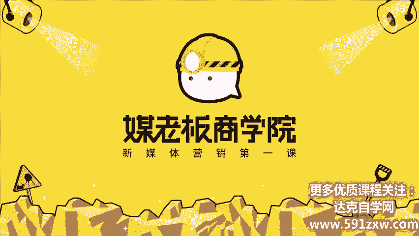

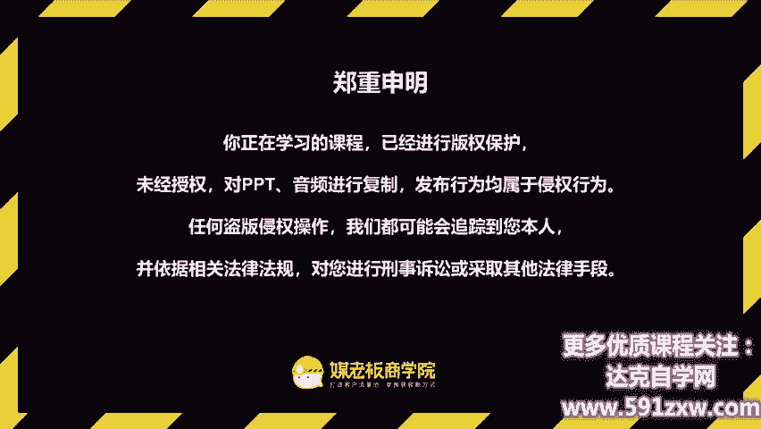

客户自动裂变，利润自然倍增，欢迎你来到客户裂变操盘首持阵营，让你的客户从500元快速倍增到5000人。我是昆龙，90后新媒体老司机，我将用三周的时间带你成为最值钱的裂变操盘手。

今天啊是我们海报设计刷屏级的营销海报，原来只要写好这五行字。那不知道你呢之前有没有设计过海报啊，也不知道你们公司啊之前设计海报的流程是怎么样的，是直接把需求给到设计师。

让设计师自己去想象去创去思考来设计的呢，还是有运营去配合，一起来规划策划这个设计应该怎么去做。那我接触到一些学员呢啊，他们会认为设计师也要包含文案的，也要包含文案的。

其实呢设计师他很多我接触的设计师当中，不太有很多人是有这种营销思维的。可以说大部分他们都是美感至上的。所以他们在做营销海报的时候，可能不一定能达到营销的效果。

那么今天呢我们就花一节课的时间来搞定海报设计这个话题。那这节课的目标呢是掌握营销海报的结构，文案策划和海报设计，用营销的视角啊从您画一张营销海报的原形图。那为什么我们要花一节课来讲海报。

会觉得海报有那么重要吗？好，我很肯定的回答你非常非常重要。有三个原因。第一个原因呢是海报是我们做新媒体营销，私域营销最重要的一种呈现方式，为什么呢？因为海报啊，它是在朋友圈里面占评率最高的形式。

你比方说看到有人发了一个链接，其实它的那个呃范围是很小的，可能只有一个标题。因为你标题不吸引人，可能大部分人都不点击了。如果你发纯文字，当你超过五行四行，你就会被折叠成一行。那这个呢也是相当。

难以传达有效的信息的。而且很多人呢是不太看文字的。那第二种呢就是你发9张图，哎，可能都有缩影，但是呢他可能都看的不太清。所以呢海报你光发一张海报，两段文案，这样子其实是我们最推荐的形式。

那为什么朋友圈这么重要呢？简单来说，我们裂变就是要在朋友圈里面去传播的。所以第二个呢，第二个重要性是海报是裂变活动中最重要的素材。因为我们配置后台啊，话术啊等等。它不是在一级界面的，只有一级界面的。

只有海报，就是每个参与活动的都首先是通过这个海报来进入到这个入口的。所以海报呢是我们裂变活动当中啊，最重要的素材。第三点，海报呢也是我们的效果广告当中啊最常用的物料。那除了我们这种朋友圈的形式。

还有哪些形式会用到海报的设计呢？啊，比方说我们的电梯广告，比方说我们的传单等等。其实这些图形的设计，图像的设计就是海报，就是海报，它用的都是同一种逻辑。那么今天呢我们除了分享这一个营销裂变的海报之外呢。

还来分享啊，如何做出有吸引力的文案加海报的结合。那所以呢我认为啊文案在营销当中，它就相当于炸弹的效果。可以在我们的消费者的眼中眼球当中炸出一个窟窿出来。

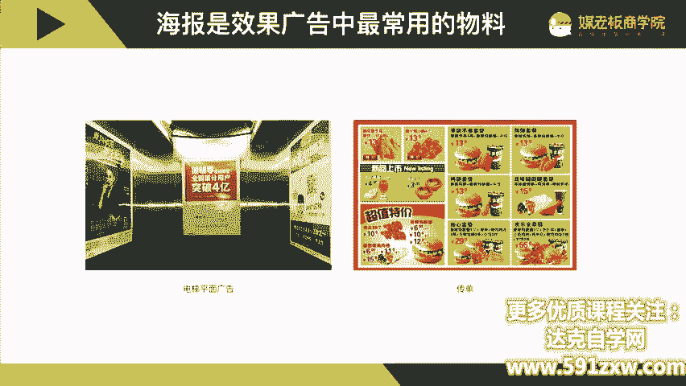

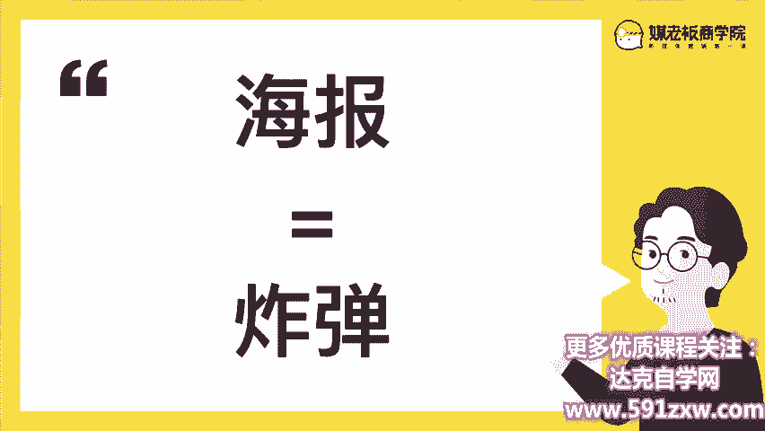

那我们今天呢也是分为三个部分，第一部分是海报的结构，结构不对，努力白费。我们海报结构的解析。第二部分是海报文案啊，刷屏级的营销海报原来只需要这五行字，海报设计不懂设计也没有关系，一招呢轻松搞定海报。

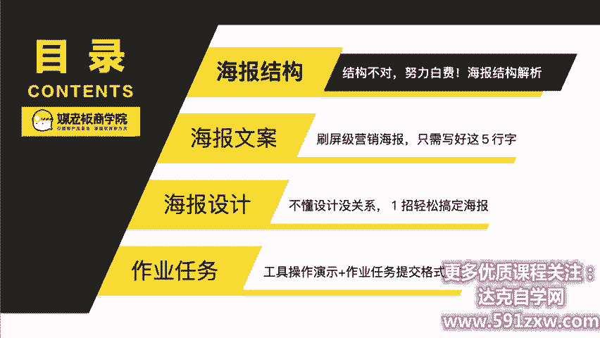

那首先呢。结构不对，等于努力白费。啊，那我们一张很好看的图跟营销海报之间，他们两者有什么不同呢？啊，我觉得最大的不同啊。是目的。啊，我们做营销，做销售是有目的的，而不是纯粹的让我们的目标客户啊。

让我们的读者让受众会觉得哇，你这张图好好看哦，就完了。我们是希望他采取行动的，如果他不行动，我们后面就没有下文了，对吗？所以这是最大的差别。那什么样的结构能够引起。对方读者目标客户的行动呢？

那有一个非常好用的营销模型，叫叫AITDA。那我总结呢叫做成交五步方程式，分别是A注意力。I兴趣T信念D欲望A行动。那这一个呢就是AITDA的五步方程式。也是我们内部用的最多的这个成交的流程啊。

那我们一一来拆解它是一个什么样的重要性。第一点呢，没有注意力，就没有购买力。啊，就是当我们的目标受受众啊，完全没有注意到你的话，那他就不可能有任何的行为的。他可能略过了。第二个，如果有注意到你啊。

你可能吼了一声。他听到了是吧，然后看了一下，你唉，觉绝对不感兴趣。他就跑掉了，所以没有兴趣啊，也就没有下文。第三呢是没有信任，就等于没有成交。如果你连基本的信念都没有的话。

其实你是很难在一个平台或者在一个商家当中去买东西的。第四，没有欲望就没有动力。他可能也注意到你也感兴趣，也有信任。但是他为什么迟迟没有啊没有采取行动呢？有很大一个原因是你可能没有激起他的欲望。最后一点。

没有行动，等于没有结果啊，这个是不用再多说的。那么在5个当中，哪个最重要呢？啊，每个人可能有每个人的不同的看法。那我认为行动是最重要的啊，行动和注意这一头一尾是最重要的。那在海报当中。

我们怎么应用这个成交五步方程式呢？那来看一下我们这一张之前做的啊抖音投放卖货的一个课程。那这个呢我们就是非常根据这个AITDA的流程。这个模型来建的海报。比方说我们的主标题是。

通过主标题来抓住读者的吸引力的。呃。抓住读者的注意力的那通过副标题呢来激发他们的兴趣，再通过老师简介啊来建立信任，再通过课程提纲呢来刺激他们的欲望。再通过我们的报名方式来催促。读者的行动。

那除了我们的课程以外呢，我们的实物也是就是我们的产品，我们的实物也是用同样的一个方程式来设计的，也是主标题抓住注意力，副标题激发兴趣。产品的图片来建立信任啊，精华的提炼来刺激欲望领取的方式来催促行动。

这是我们自己的那希望你呢通过这个五步方程式的模型的建立啊。以后呢你就可以带着有色的眼镜来审视一切的营销海报，甚至你像我一样每看到一张电梯的海报，电梯的广告，我都会拍下来啊，甚至我会去做拆解，去做分析。

这里面它用什么方式来催促行动，用什么方式来建立信任的这些你日积月累呢，就会有非常强烈的这一种海报设计的体感呢？也就是。五か？还有这一个呢，我在网上找到一张裂变的海报，我觉得这张海报非常有意思。

它是送一个雪糕型的充电宝。这个充电宝非常非常的可爱，我都非常感兴趣。那它也是一样，通过免费领取限量包邮100个这样的主标题来抓住吸引力啊，抓住注意力。然后再通过副标题来激发兴趣，还有产品的图片啊。

看起来呢就非常的想买想拥有的冲动。再通过价格对比来刺激欲望。还有呢其实啊这个粉红色的报纸是一个非常知名的品牌，再通过这个logo来建立信任。还有呢通过这个领取的方式来催促行动。所以你发现了吗？这个模型。

一样可以用在我们的海报设计当中。所以我们要掌握这个AITDA的模型，就可以做出一个还不错的。海报至少你的结构是不会错的，结构是在海报当中设计最重要的。

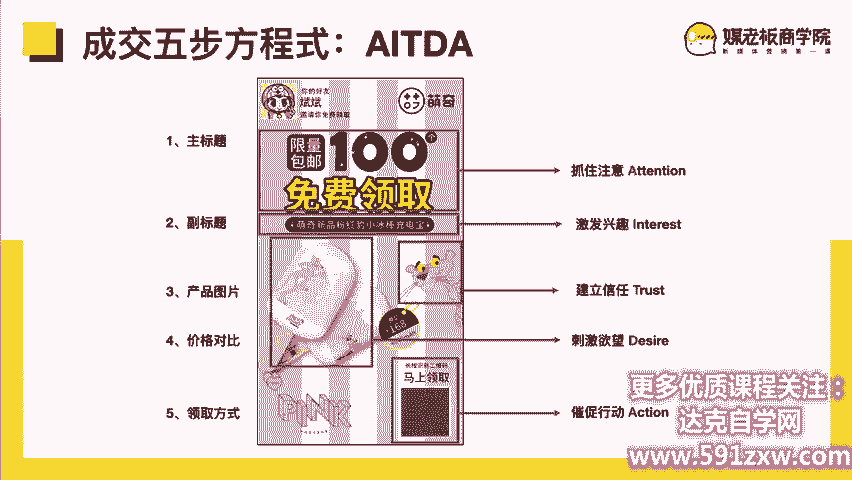

第二点呢就是到了我们的。海报文案刷屏级的营销文案，只需写好这五行字。

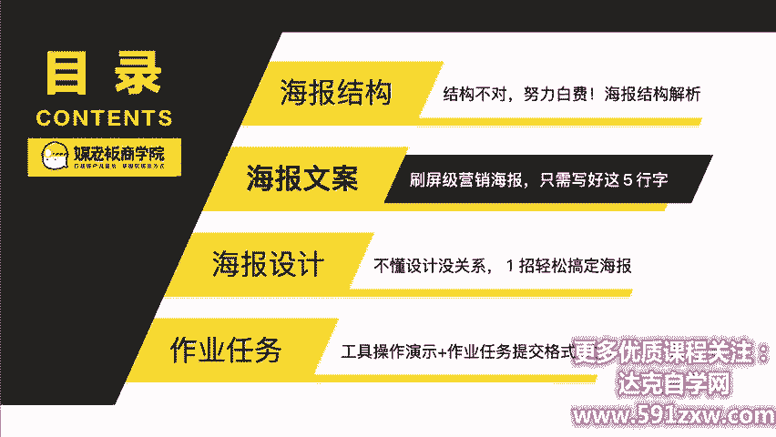

那如果说海报是炸弹的话，那么我认为文案就是子弹了。有很多公司啊他会让设计师来出这个文案。他会把海报设计的全部责任都给设计师。这其实是错误的，因为设计思维跟营销思维，它是两种思维。啊，是两种思维啊。

我们公司呢设计师他只做图，只做图，我们的运营营销策划人员，他需要策划好文案。那我们刚刚讲到了成交五步方程式AITDA它可以应用在我们的海报设计的结构当中。那我们一一来拆解是怎么样来应用的，怎么来应用的。

以我们这一场一堂课带走抖音投放带货指南这个课为例。首先呢我们通过主标题来抓住注意力。一堂课带走抖音投放带货指南。这个就是我们的主标题。

那我们的主标题要求呢是在朋友圈里面它不需要打开大图也能够看得清这个标题，标题是非常非常重要的那有这一些模板可以供大家参考。比如说明上5分钟等于熟悉一小时，在家如何练出紧致好身材，怎么样打扮最有气质。

普通手机如何拍出专业级照片，免费收听才艺入门课。等等。这一些呢都是我们千锤百炼当中啊测试出来，相对来说。

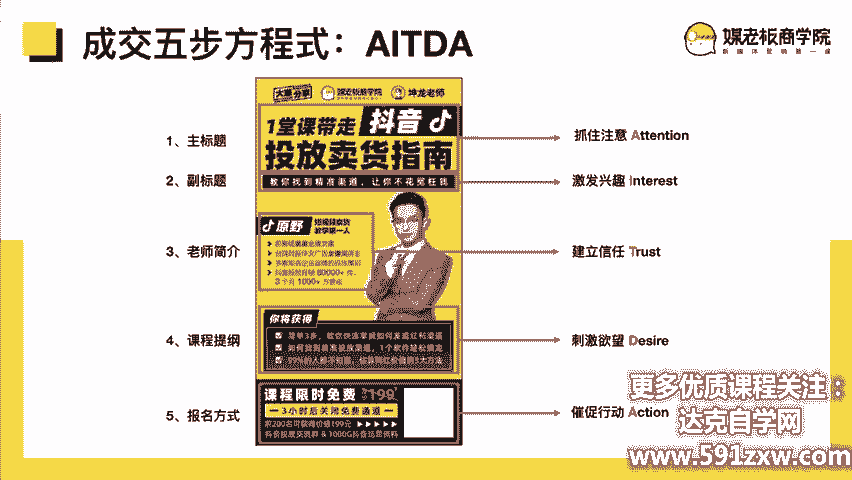

比较能够抓住注意力的主标题。嗯，那有的时候呢我抓住一个选题的时候，也会在百度或者说我们的搜狗搜索去搜索一下这个关键词，有什么样好的一些标题灵感。这个就是我的标题来源。第二个呢是激发兴趣。

我们通过副标题来激发兴趣啊，教你找到精准渠道，让你不花冤枉钱。其实我们是通过副标题的方式来激发兴趣的比方说刚刚的冥想5分钟等于熟睡一小时，一小时学会轻松冥想术，在家如何练出紧致好身材啊。

不去健身房不寝私教的健身法，怎么样打扮最有气质。一节课帮你找对穿衣风格。普通手机如何拍出专业级照片，顶级摄影大师手把手教你拍。免费收听茶艺入门课，一小时让你从喝茶到懂茶，这些呢都是模板级的标题。

大家只要套上自己的关键信息，参考这个格式就可以了。那第三步，建立信任呢，我们是通过老师的简介来建立这个信任的。比方说袁野啊，我们。发现呢他当时是短视频卖货业绩最高的一位老师啊。

所以呢我们也挖掘了他背后的一些背景。哦，原来他还是奥美的金牌文案，还得过台湾时报华文广告的金像奖，还是多家企业品牌的投放策划啊，抖音投放月销8万件，三个月营收1000多万。

那这一些呢其实是老师简介当中啊，我们是分别从四个维度去包装策划。第一个呢是他过去的职业经历。第二个是他所得到的荣誉。第三个呢是他不仅自己厉害是吧？不仅自己强，他还可以辅导很多的品牌啊。

第四呢他最近的业绩也很好啊，所以呢我们是从多个维度包装同一个老师的所以呢在四个维度呢就更好的建立信任了。第四点就是刺激欲望啊，我们通过课里面讲什么来刺激欲望。比如说简单三步。

教你快速掌握如何发现红利渠道，如何找准精准投放一个软件轻松搞定，90%的人都不知道估算网红的三大方法。那这一个呢其实每一个点啊都是能够吸引我们的目标客户和潜在客户的，并且呢是以结果为导向的。

而不是说呃发现渠道是吧？怎么什么呢？就是这这一种啊就不一定有什么味道。那在这一些呢我们其实梅老板内部啊，有我们非常强的非常多的这一种标题模板标题模板，那我们是怎么提取的呢？啊。

我们呢会先提取一个句子的句式。比方说只需不用掌握成为用好轻松啊等等。再来呢有具体的例子，比方说订阅号那面，只需做这五件事，不用日更也能持续涨粉。

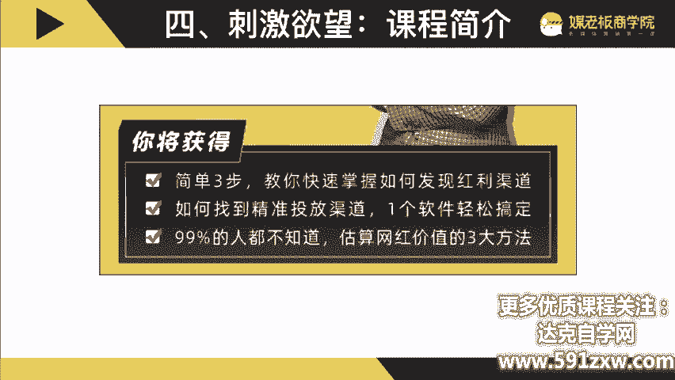

啊，名牌啊品牌明星掌握四大届势秘籍，成为朋友圈的带货明星等等啊，这一些呢就是我们在写课程提纲的时候经常用到的这一些参考模板参考模板。第五点呢啊第五个催促行动就是我们的报名方式啊。比方说啊课程限时免费。

原价199，3小时后关闭免费通道，前200人名可以获得199的抖音投放交流群和1000G的抖音运营资料。那这一些呢就会再次加码给我们的课题啊，再次加码，然后让我们的目标受众啊，尽快报名。

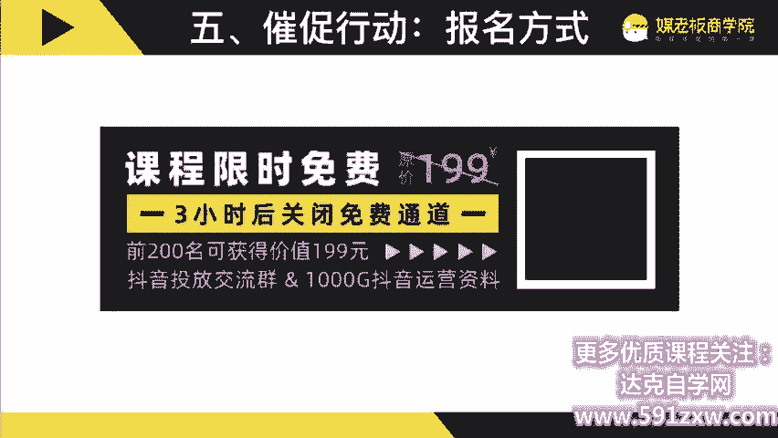

那这一个呢是五步方程式AITDA那其实五步方程式啊，每一步我们都可以做更详细的拆解。刚刚呢我们是通过一个海报的案例来做了一个五步的大致的了解。那我觉得在这里呢大家非常非常有必要掌握每一个要点。

每一个要点。那我们来继续分享五步方程式AITD的A抓住注意力。那这里面呢我想跟大家分两分享两个原理。第一个呢叫鸡尾酒会效益。啊，想象一下，你现在呢正在。办公室里面啊，可能啊你正在咖啡厅吧。

然后你的这个咖啡厅里面呢坐满了桌。然后你其实旁边的人说话也很大声，你不一定能听到他说话。但假设有个角落里面有人提到你的名字，你就会立立马听到，为什么呢？

因为我们的听觉会有选择的去吸收那些跟我们有关系的信息。那如果我们理解了这种原理啊，原来人他会优先去吸收了一些跟他有关系的信息，那我们就可以优化我们的表达方式啊。比方说通过强化用户的信息啊。

比方说那个你的好友某某邀请你一起来收听这节课，已经有谁谁新手妈妈成功领取到了。如果他是跟你有关系的，正好是你的朋友，可能你就会多看几眼。第二个技巧呢是人群标签。3到6岁超外听的20个启蒙故事。

可能你的孩子刚好是3到6岁啊，就会被圈进去。那首届中国产品经理大会。那这一个呢可能对产品经理的人群就会比较有吸引力。所以我们可以把目标人群的标签啊把它打上去。

这也是为什么这种星座能够流行开来的最重要的原因。啊，第三个技巧是模拟对话，用你呀我啊来开头。比方说你有多久没有读完一本书了，你做营销浪费了多少钱。那其实这一种呢都是让用户感觉到跟它有关系。

从而不被过滤掉，优先进入到它的那个接收信息的状态当中。第二个原理呢是对比原理啊。你你面前有三桶水，中间是常温的。旁呃，左边是热的，右边是冷的。你先把两只手放在一冷一热的桶里面，然后再把两只手拿出来。

放在中间这里，你有什么感觉呢？你会觉得中间这糖常温的水啊。它的温度是不同的。所以我们先前的体验。决定了会影响到我们后面的判断。所以对比原理也是一个非常好的吸引注意注意力的方式。比方说是效果对比是吧？

他中专毕业自学新媒体后月入10万。那这种对比就很强烈。普通手机如何拍出专业级大片。那这种呢对比也是很强烈。还有一种呢就投入产出品，也就是我们讲的ROI。啊，小的投入大的产出。

比如说冥想10分钟等于熟睡一小时，如何用一年的时间读懂100本书，那这种呢也是一个非常好的对比。还有一些前后对比，比如说听课前是吧？一节课掌握老司机的十年经验，一小时从喝茶到懂茶啊。

这种呢都是能够非常好的吸引注意力的。第二个。成交五步方程式的第二兴趣。兴趣呢有两个原理，第一个呢是好奇心理。好奇心里的第一个技巧啊，我们可以通过用故事来代入啊，比方说有多少人最后嫁给了自己的高中同学啊。

那你看到这样的一个文案是吧，你会不会好奇呢？我。毕业后选错工作，浪费了3年。那这种呢就是用我开始的。这样子一听起来呢就像一个故事，很想知道为什么。第二个技巧，提出问题，联终报告你做对了吗？

这种是直接提出问题的。因为当我们面临一个人的提问的时候，会倾向的回答一个人的提问。啊，如何和叛逆期的孩子沟通，那这也是一个非常好的一个问题。第三个技巧，制造强烈的反差。为什么父为什么说父母越笨。

孩子越聪明。那这个呢就会有一定的反差的效果。咖啡能通便咖啡的10个真相，那这种呢也能够引起大家的好奇，从而达到兴兴趣。第二个原理是滑梯理论。滑梯理论呢是我们要把我们的内容，我们的文案变成一道滑梯。

让它从上面慢慢的流畅的滑下来，有三个技巧。第一个技巧是分段完成。比如说简单三步做出爆款抖音号零基础，从入门到进阶。那这种呢就是呃让大家降呃分段完成，觉得这个目标是可可行的。第二点，第二个技巧降低门槛啊。

正常来说你买房啊需要攒首付。大家可能会说哎，买房需要很大一笔钱。但是我们说哎月薪5000呢，也能学得买房客教你买对人生第一套房。那这个标题和主题啊，就相对来说比较有吸引力了。那一台手机。

一台电脑如何轻松加满5000元，这个门槛呢也被大大的降低了。要扫除障碍，比方说你为什么不去健身，可能没有时间呢，或者说健身房太贵啊等等。那我们就啊帮客户帮用户扫除障碍，不去健身房，不请私教的健身法啊。

不买器材，不请演员的抖音课，这种呢都是可以帮助到我们的用户啊扫除障碍的，从而完成这个滑梯理论。五步方程式。第三，信任，建立信任。建立信念呢有两个重大的这种原理。第一个呢是权威效应啊。

权威效应呢我又分为三个技巧。第一个呢是通过媒体的报道，比方说舌尖上的中国节目推荐某某卫视电视台采访报道。这种呢就是通过杠杆借力啊，借助媒体的报道。来那个证明我们厉害。第二个技巧。资质证书啊。

权威欧盟权威机构认证啊厦门十0佳伴手礼品牌啊，这个呢都是通过证书啊、认证啊、奖励啊等等奖啊那个奖项啊来提高我们的权威性，从而达到建立信任的效果。第三点呢，这三个技巧。通过名人背书。

比方说我说马可可能呢你们并不知道他是谁。那如果我说他是迪丽热巴的御用造型师，哎，一下子你就知道是谁了。那如果你是做这种药药物类的产品的是吧？三甲医院某某教授实名推荐，这种呢也是借助名人效应。

第二个原理是重重重重效应。啊，多数人的选择一定是对的选择吗？不一定对吗？但是多数人的选择代表了安全的选择。所以在一些陌生的领域，人们倾向选择更多人的选择。

所以我们也可以运用这一个从重效应来达到建立信任的效果。从重效应呢，我又分为三个技巧，第一个技巧是总数特别多。比方说累计多少人报名啊购买啊。如果报名和购买不多，那可能可以用预约啊这样的字眼去体现。

还有这个12万人都在学的人生管理数，一听哇，12万人都在学很多哎。第二个呢，如果你总数不多，第二个技巧我们就可以突出爆发性强。比如说每分钟有多少人报名是吧，或者一分钟销售了多少件。啊。

比如说这一个双十一一天销售3个亿是吧，很有可能他一年也就卖2。8个亿是吧？不一年也就卖3个亿，几乎就是双十一一天的全部业绩。那除了这一种总数多，爆发强，还可以用第三个技巧口碑好。

你可以说啊有多少的客户来自于朋友推荐啊，这一种呢也是比较有强有力的这一种文案啊，口碑好啊，金杯银杯不如学员客户的口碑。那这种呢也是能够体现口碑好的这是我。建立信任的部分。那刺激欲望呢啊有两个原理。

第一个呢是使喜好效应，或者说喜物喜好和厌恶效应。第一个技巧是描述愿景。啊，如何赚到人生的第1个100万？这句话很妙哦，不是说赚到第100万是吧，是第1个100万，好像浴室这里还有好多个100万似的啊。

第二个是一节课教你显瘦显高显白显年轻，基本上把女性对于美的这种憧憬啊都描绘出来了。第二个技巧，刺激痛点，孩子中暑了怎么办？那这一种呢也是非常能够刺激到痛点的啊这个问题。这句文案。第二个啊，忙的要死。

赚的还少。哎，这个呢应该是普遍人的新生了吧。那这是第一个技巧。第三个技巧呢是厌恶损失啊，有心理学家统计过啊。如果你掉了100块钱，你要减300块钱的快乐才能弥补这个一掉了100块钱的痛苦，所以损失啊。

损失给人的心理影响，可能是得到的3倍所以我们厌恶损失也非常重要的啊，比方说是周年庆特惠是吧？买贵补差价就给他一个承诺等等，这样子呢就可以啊避免掉他这种厌恶损失。那我们也可以。利用借用它的业务损失。

比如说错过这一次就要再等一年哦。那这一种呢也是加强这种业务损失。第二个原理。攀比效应。攀比效应啊有三个技巧。第一个技巧呢是促进攀比啊，最怕竞争对手听到的一门课。哎，你会觉得哇会不会真的很厉害呀？第二个。

情敌看了都暗暗点赞的一套衣服。哎，这个呢就很有画面感了，对吧？可能就是竞争对手啊、情敌啊，都是我们默默关注，并且咬牙切齿的对吧？所以这一种呢也也能够啊刺激他的欲望。第二点呢，强化身份啊。

只有聪明妈妈才能听得懂啊这一个还有这一个呢，当时我认识一个长江商学院的朋友，我说哇你们长江好厉害啊。他说对啊，这是我们中国商界精英的一致选择。那哇我就觉得好牛啊，我就好想加入啊啊。

就就是这样强化身份的技巧。第三点呢。😊，巧用排名。比如说我们开机打开的时候，恭喜你击败了85。5的人啊，这种呢也会。啊，去促进你去分享啊，促进你就有有这种啊优越的心理啊等等。还有先让一小部分人先富起来。

那这一句呢口号就非非常有名了。就是我们改革开放的时候，深圳的口号。第五步。行动催促行动。催促行动呢也有两个原理。第一个呢是稀缺效应。稀缺效应呢总结来说就三个关键词，限时限量限购。

因为你如果说我的东西很多很多是吧？可能他不一定要那么快行动，那我不着急嘛，慢慢来。但是如果你说唉限量的很快就没了，要抢，哎，这种呢反而能够促进它的行动。比如限时啊。

活动截止日期几月几号几几点那他看的时间快结束了啊，他就会引起他的行动。第二，仅限今天免费领取。那这种呢也是通过时间的维度来限时限量呢就是仅限前90名免费，每天仅限免费派送100份，这种就是限量的。啊。

限购呢是兑奖时请出示学生证明。本活动仅限女性参与这种表达这种策划呢也会提升我们的啊这个稀缺效应，从而促进用户的行动。最后一点啊最后一个原理护卫原理。互惠原理啊，就是再给你一点优惠。

我们会不会去买东西的时候啊，经常有这种纠结，价格呢虽然有点贵，但是也可以买。不过呢销售这个时候假设说哎呀，如果你今天嘛就可以送你什么什么东西。哎可能在你半推半就之间呢，就下单购买了。

同样呢我们这个也可以应用在我们的好办海报和文案当中比如说邀请优惠是吧？邀请好友一起免费体验啊，我是老学员报我的名字可以省1000那，这种呢也是互帮互助的。第二个技巧就额外的福利就相相当于赠品了是吧？

凭本海报消费再送100元优惠券是吧？前100名进群再送1000G的抖音资料。那这种呢就是额外的福利了。还有团购的优惠是吧，一人报名，4人免费，三人同行，一人免单啊，这些呢都是可以促进互惠的。

那以上呢就是这个成交五步方程式AITDA的基本原理，以及我们可以用在文案上的一些啊创作文案写作的技巧。那希望你呢可以。以后啊在写文案或者写这个海报策划的时候，可以再回听这一节课里面有非常非常多的句子。

我是花了好长的时间啊，一一对应帮大家整理出来的啊，其实很多是你直接换掉，换成你自己的，就可以写出一个很不错的一个标题。这个标题呢又可以应用在我们的海报上。

那OK我们通过这个成交五步方程式AITDA这个模型来看这一张海报。现在的你跟刚刚听听课之前的你已经很不一样了。因为你现在呢已经掌握了一个有色眼镜。以后你看海报都会套入这个模型，叫AITDA抓住注意力。

激发兴趣，建立信任，激发欲望，催促行动。这个就是AITDA的模型。那我们再来看这一章我们策划的这个课程。理财必学，防坑课。12招让你人在休息钱在赚。这个话题，那我们看一分钟。

你去找一找里面我们用了什么原理，用了什么技巧。我们通过一分钟的时间来拆解这一张海报，也希望你可以截图下来做一个拆解。好，那大家有看出什么吗？我们用了哪一些技巧呢？那我们用了第一个用户的信息啊。

累计帮助1700多个家庭B坑。怕你被坑邀请你一起学。正常我们做验务宝的时候呢，这里会有用户的昵称，以及他的头像在这里面。这个部分呢就是增加我们的那个信任感，以及激发他的兴趣的。那这一个抓住注意力呢。

就理财必学防坑课，代你轻松避免掉90%的理财坑。那这个呢其实用的是投入产出比的对比原理啊。第二点呢是社交让你人在休息，钱在赚，其实用的是。描述愿景。那杨安他是菜鸟学院的创始人和院长。

那他呢是全国十0家理财规划师啊，全国十0家是吧？那就证明非常厉害了。第二个，他的经验有近十0年的金融投资经验是吧？第三呢，他帮助了1700多位家庭改善了资产配置，我们就通过啊证书啊、资质啊来证明。

他的专业度来建立信任。第五点是吧，就是只用了厌恶损失，在这个课程的提纲里面学透不理财贬值。理财亏钱的4个原因，避开这11个理财坑，降低损失本金的风险，解析99种理财产品陷阱，让你不轻易亏钱。

那这个呢就是哦用厌恶损失的方式来刺激欲望。那最后呢我们再来用了。名人的背书，比如说广东金融学院教授、中信建设证券营业部总经理啊，大胡子说房的创始人等等。这些联名推荐用名人的背书啊再来啊马上避坑。

原价199元，特惠价99块。催促行动啊，这个呢就是用AITDA的模型来做的营销海报。

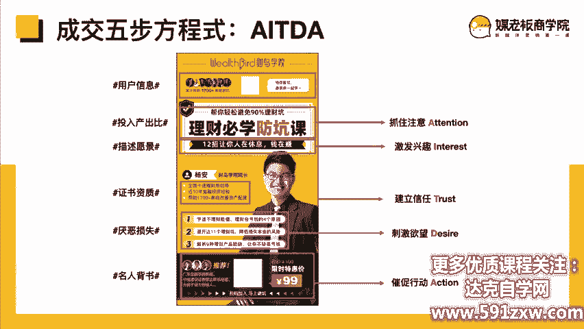

好，我们知道了海报的结构，也知道了ARTDA的每个关键流程的原理应用和方法。那我们就要来具体设计一张海报了。那我不确定你是否有设计的功底。那我就假设啊你可能不太懂设计。

但是呢你有一定的啊你听完课之后有一定的运营基础了。那我们可以来做策划。所以不懂设计没有关系，一招呢可以轻松搞定海报。

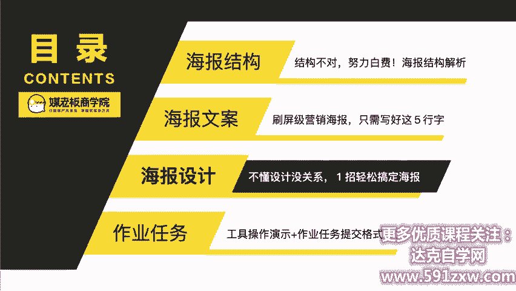

啊，首先呢我们第一步先要梳理你这一次营销海报的基本要素。那我梳理的基本要素呢有8个，第一个是主标题。啊，主标题还记得有什么原则吗？就是在朋友圈里面不点开大图的情况下，也能看得清主标题。第二点是副标题。

副标题呢可以说是对主标题的一个补充。因为刚刚我们主标题的要求是不能啊看不清，所以它的字数必然是少的。所以说我们再通过副标题来强化这个主标题。那还有呢啊第三点就是产品的图片啊，或者老师的照片等等。啊，这。

第四点这产品的描述，怎么介绍这个产品。还有呢第五点啊价格的对比，第六点活动的时间，第七点，行动的指令。第八点，品牌的信息，我们把这些基本要素梳理出来啊，到底一张海报我们必须要包含什么东西？第二步啊。

规划营销海报的设计结构。那当我们梳理了这一些基本的要素之后呢，我们就要排到底放在什么位置。那这个呢是我做的一张圆形图。那我们大概会先做一个分区，比如说活动啊，logo，还有主题副标题讲师的照片。

讲师的简介，大纲是吧，放哪里，然后报名的方式怎么怎么放啊，这些呢我们都做一个结构结构的梳理。那我的是用圆形图来做的那大家呢啊也可以使用工具，也可以用一张白纸啊，去把它画好分区就可以了。

那这里面呢我也推荐一个工具叫做磨刀。磨道它是免费制作圆形图的一个工具网页啊，就是做出来这样的一个图，非常简单。就可以做出来了。第三步呢就结合圆形图的结构啊，我们来写文案呢。

比方说主标题一小时带着带着抖音投呃，抖音投放卖货值了，这个就是我写的主标题。然后副标题呢就招你找准投精准的投放渠道，不发不花冤枉钱。老师介绍就是啊金牌文案呢，广告金像奖得主啊，多家知名品牌的投放策划。

然后抖音月销8万件3个月营收。1000万呢等等，这些就是老师的简介。那课纲呢就是简单三步，快速让你掌握发现流量渠道，如何找准金融投投放一个软件。轻松搞定啊，90%人不知道估算网红的价值三个办法。

那这个呢就是老师简介和课程提纲。那最后的报名方式呢，就课程限时免费报名中原价199元，然后画个线，然后先小时后关闭免费通道，前200名可以获得价值199的抖音投放交流群1000G的抖音运营资料。

那这个呢就是啊我们花了一定的时间来写出来的文案。一开始呢你就照着我们那个表格来去写一些文案，再慢慢去优化就可以了。那当我们的原形图啊，把当把我们的文案呢放进我们的原形图之后呢。

它就得到了一张相对啊分区比较清晰，并且文案。啊，比较清楚的一个圆形图，就是左边的这一个圆形图。那么我们再根据圆形图啊来设计出海报。那如果你有设计师，那你就直接给原形给圆形图给他。

剩下的你就交给设计师就可以了。设计师呢他会根据这个原形图啊啊，他会去自己做好这个美化。但有的时候你要跟设计师沟通的是信息比美感更重要啊，信息的传达比美感更重要。你光有美，但是用户看不到你的内容。

看不到你想表达什么的话，其实他也是一张没有效果的海报。

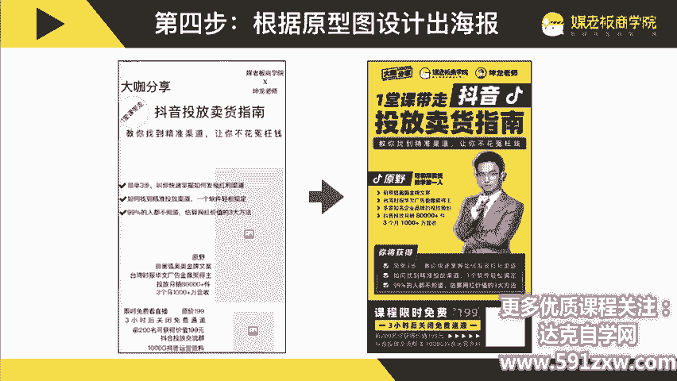

那如果你没有设计师，你也自己有比较强的动手能力。我可以推荐一个工具叫做搞定设计。它是一个非常简单易用的设计工具啊，它的网址呢就是搞定dotcom啊，搞呢是稿费的稿文稿的稿搞定设计。

那如果你公司没有设计师啊，又不太。不太想自己动手设计，那你也可以通过淘宝啊、猪八戒啊这样的一些网站来找兼职设计师的服务。设计一张海报呢也就是几10块钱。那可能你自己折腾，如果是新手的话，可能要折腾个。

两三个小时才能把海报设计好。那我建议呢还不如花几10块钱请人设计一下海报得了。那在这里面呢，我也为大家准备了1000多张营销裂变的海报案例啊。

分了这种测试类的场景化的单元物的多元物的卖卖点汇总的送书的实物的那个详情页的等等啊，有1000多张这种营销海报的案例。大家呢如果你是啊刚开始做，可以先临摹。你找到一个比较好的一个案例。

可能跟你有关系的或者没关系也没有关系。所以它它可能是一个比较啊让你有感觉的一张海报，那你又可以去临摹啊，临摹就是用原形图的方式来临摹这张海报，再换上你的文案，基本上呢就做的不错了啊。

刚刚呢类似分类的那这一个呢是1000张，没有分类的啊，总共呢是1000多张的海报供大家参考。那今天的作业任务啊是什么呢？啊，行为发生改变，学习才算开始。

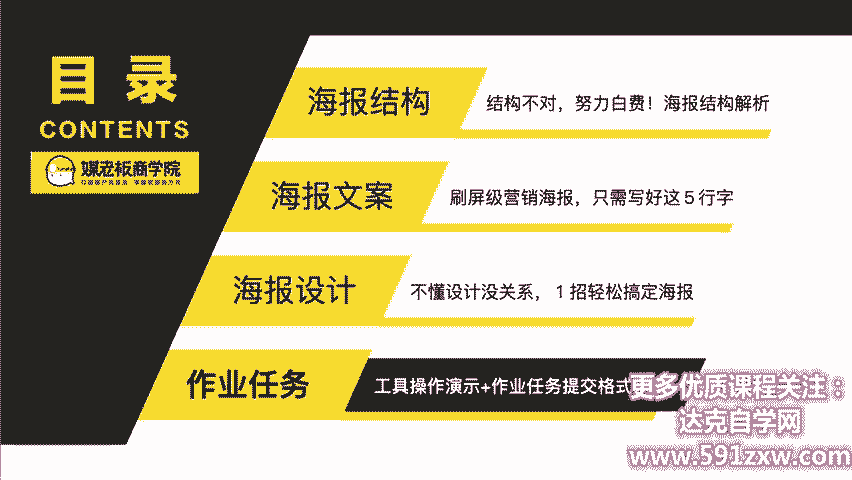

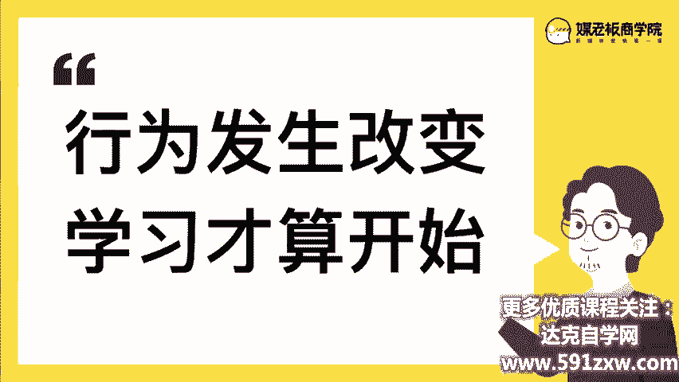

有学习没行动等于0回顾一下今天的课程目标，大家掌握了吗？啊，掌握营销海报的结构，文案策划和海报设计。结构呢是根据AITDA的模型来设计海报。文案策划呢，根据AITDA的啊原理技巧来写不同的文案。

当这些文案创作出来呢，我们再放进我们的海报原型里面。第二个，用营销的视角从您画一张营销海报的原型图。啊，这里面啊尽管你会你们公司已经非常流畅了，不一定需要你画原形图。我希望你还是再画一张。

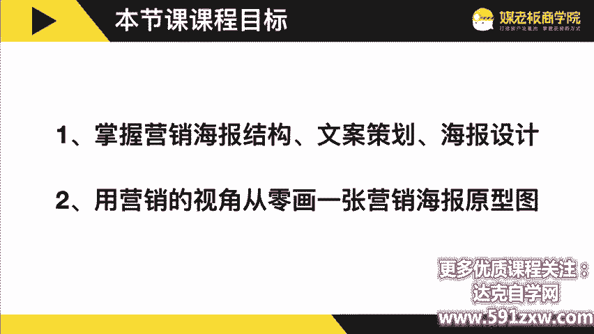

啊，再画一张。所以今天的课程作业呢任务是根据你们之前啊这段时间策划的裂变主题，选一个裂变裂变的活动主题来结合这个AITDA的模型来画一张海报的原形图啊。如果。你可以通过末刀来画，那就最好啊。

如果你更擅长用这一种白纸来画也可以，但是呢是需要符合AITDA的模型，并且呢有一定的文案在上面，有有有你的文案结构在上面。所以呢提高的提交的及格式是原型图，以及旁边呢？你要备注哪一点是抓住注意的。

哪一点是激发兴趣的，哪一点是建立信任的，哪一点是刺激欲望的，哪一点是。催促行动的一定要结合AIRTDA的结构模型来做。那可能你会问AIRTDA能够适用一切的海报吗？我可以回答你是百分百不适用。

但是大概率适用。因为你掌握了这个模型啊，你就可以应用在很多的地方啊，可能你少一步不会有什么。但是呢我们这次是学习，我们就要以最完整的一个模式，一个形式来要求自己这样子呢我们学的会更多。

那有可能你会说那那些权威背书啊什么等等，我没有啊，怎么办？因为我们这次练习没有也可以虚拟的杜撰上去，因为你不是政治出街的嘛。现在的啊现在的目标呢是锻炼你有这种文案写作海报策划的能力。

所以呢如果有一些条件，你没有没有关系。有一些标题，可能你达不到。但是也没有关系，你先学会这种标题的。啊，写法文案的写法以及海报的用法。这个时候我们后面呢再来慢慢去达到这些条件。

或者用一些润色的方式换成其他表达方式就可以了。那我们今天的啊课程讲解就到这里。那么今天呢啊是我们第二周的第三课。那明天呢就是讲到我们具体话术怎么去设计朋友圈应该怎么发。那我们明天同一时间准时践哦。

对了啊，如果你完成了今天的作业呢，我们可以给你两份小彩蛋。第一个彩蛋呢，就是刚刚我们团队内部用的这一个啊提纲的模板。标题的模板。第二个呢，我会给你一个我们我们的这个海报设计的。

原文件啊原文件你如果会PSD啊，如如果你会PS如果你可以使用这个搞定设计，也可以直接打开修改成你的海报。你的海报啊OK那我们今天的课程就到这里，我们同一时间。

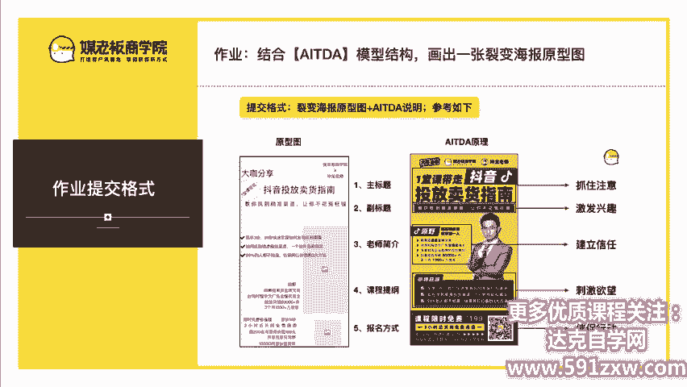

明天见。