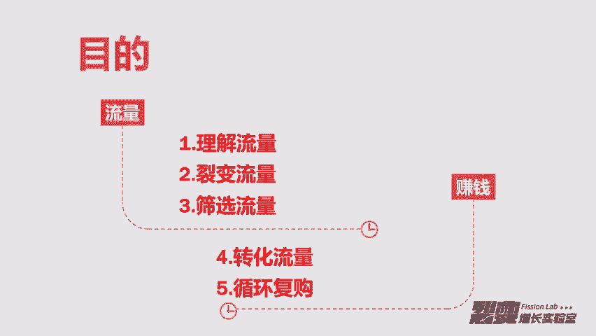
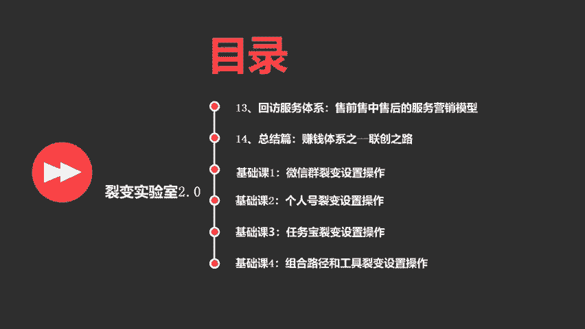

# 微社群裂变营销私域流量池增长秘籍创业运营销售获客视频课教程 合集 8套 374资料 13.1G 搭建流量循环体系的知识框架 - P1：00【导读课程】搭建流量循环体系的知识框架 - 高端网创试错赚钱大师 - BV1Hs421M7k3

🎼首先呢恭喜各位成功的加入了裂变增长实验室2。0的社群。那我先做一下简单的自我介绍。嗯，我叫王柳柳，是咱们这个裂变增长实验室社群的创始人。然后呢，我自己也是一个也入制的运营。

实操经验比较丰富的一个裂变操盘社。嗯，那裂变增长实验室这个社群是我在2018年1月份的时候，然后创建了这样一个社群，通过几个月的时间，然后把裂变增长实验室1。0的社群做到了2000多人的付费社群。

然后在这个过程中呢，其实我们已经建立了一套就是完善的社群运营体系。那首先恭喜大家的是什么呢？我恭喜大家三点，第一个你以一个最低的价格进到了这个社群，也就是说从今天开始，365元是最低的一个价格。

然后第二个是我们后面的价格调整是翻倍式调整。比如说现在是365，下一次调整。🎼价格就是乘以2大概是730这个样子。然后我们社群第三个，你第三个受益的是服务周期是最长的。

因为我们社群是从加入的这一天起到次年的1月1号是这么长时间的服务周期，所以加入的越早，享受的服务周期越长。那2。0社群呢目前是公司化运作。每个群呢我会有1到3个全职的同事去维护。

然后我们服务周期就跟前面说的一样，大概服务周期就是到次年的1月1号，那从我们1。0的内容到2。0的过渡，1。0的内容主要讲裂变的数，也就是说我主要讲裂变的技巧。那2。0的内容我可能以裂变的框来讲。

所以我们定位就是从裂变增长，1。0的裂变增长切入，然后到我们2。0的社群模式结尾。然后在这个过程中，我们会建立一套赚钱的循。🎼团体。🎼所以我我们做这个社群的主要目的是搭建出来一个流量江湖的平台。

也就是说在这个平台上面有精通各种流量玩法的裂变玩法的，或者说社群玩法的。🎼这些人聚集到这个平台上，大家相互赋能，形成利益的共同体。那我们再说一下我们的目标。其实我做2。0社群的时候。

我我给自己定一个目标，就是我要做10万的付费用户，然后做1000个联合创始人，可能说我这个目标你感觉到不可思议。那我整体给你解释一下，我们这个社群的整体框架。我把这个社群分我把这个社群的框架。

定位定位分成为4个层级，班主任是一个层级，我们大概会做200位班主任，然后课代表是一个成级，我大我大概会做1000位课代表，然后小组长是一个层级，我们大概会做11万个小组长。

然后同学就是会员我们会大我们大概会做10万的会员。那班主任从何而来呢？就是班主任相当于每一个人会有1个500人的社群，200个500人的社群，我们就达到了10万人。

🎼课代表呢相当于1000个100人的社群。那小组长呢就是1万个10人的社群。所以我把社群划分为3个，一个是500人的社群，一个是100人的社群，一个是10个人的社群。那后面我会跟大家讲。

我为什么要这样设计200个班主任管理的是1000个课代表，然后每个班主任相当于管理了5个课代表。然后呢，1000个课代表，他管理的是1万个组长，然后每个课代表相当于管理了10个组长。

然后1万个组长管理的是10万个实验室的同学，每个组长相当于管理了10个同学。所以在这个架构的过程中，嗯，我给你解释一下，我为什么要设计这样的一个架构。你平常加入的社群或者你自己所创建的社群。嗯。

只要人数大于50人，你会发现你每一次通过群公告或者群消息去触达的时候，能接收到的人。🎼仅占30%。所以我们做这种自上而下的这一种这种层级的社群架构的主要目的是为了让我们的触达性达到最高。

你可以发现你去看上面架构的时候，你可以发现就是每一个层级管理之间它都不会超过20个人。所以最高的就是10个人，少的甚至是5个人，这个地方会保证一个很强的触达性。也就是说后续在我们带着去做实操。

或者我们一块去去做做东西的时候，能保证到触及触及到每一个我们实验室的同学。那我们这200个群组是从哪里来呢？200个群组会从1000个联创里面去做筛选。

然后筛选的形式呢我们就无论是群组还是班主任课代表还是小组长，我们筛选的形式都是按社群中的贡献值做屏蔽。社群会有一套积分的体系。好，整体的架构我们明。🎼之后，我们再说一下我们社群的愿景。

愿景就是如果我们做到10万的会员，那我们要帮助这10万的会员快速去复制霍克裂变的技能。然后帮他们搭建出完善的赚钱体系。因为我们做裂变还是做增长。我们主要的目的是什么？主要的目的就是赚钱。

所以在我们学会了霍克裂变的技能之后，我们要迅速通过这个技能去搭建出来一套自己能赚钱的这样的一个体系。那有了愿景之后，我们再说一下立场。🎼我为什么要说立场？就是在做社群的过程中。

其实筛选有时候比运营更重要。嗯，这也是我们设立付费门槛的呃一个主要原因。所以呢。🎼社群里面去做筛选，除了付费，其他的筛选还有更多。比如说我们建立的这个社群，如果你你对这个目标和愿景，我们的立场不一致。

那你可以申请退款，然后脱离这个社群。所以呢我就设立了我我就设立了三种形式。第一种就是呃如果你是一个伸手党，就一味的指挥索取。然后在社群里不给任何人提供任何价值。所以这样的人你可以在24个小时之内联系呃。

实验室的工作人员，然后申请退款。然后第二种人就是立场不一致。无论从目标还是愿景，从你学习的态度，从你的执行力。然后第三种就是加入社群就是为了耍小聪明，然后过来坑蒙拐骗，呃。

在群里面报粉去在群里面报粉抱完粉去开始去推自己的东西这个样子以上。🎼三种人只要被实验室发现，永久会拉入黑名单，然后不得参加实验室任何免费付费的活动。我们会在公司的群里面去嗯通告。

然后所有的号群会全部给你加黑名单。好，以上。🎼是我们的主要以上是我们给大家讲的说社群的愿景目标和我们做这个手社群的目的。那我们下面说一下我们的内容框架。也就是说这一期的2。

0的内容是经过详细的设计设计出来的。所以我把这个设计的端口给大家讲一下，就是我们会从流量端到赚钱端。然后我我把这两端的链接中分出5个部分。第一个部分叫理解流量。第二个部分叫裂变导入。

也就是说我们做裂变导入。🎼第三个叫筛选流量。第四个呢叫转化流量。那第五个就是循环复购。所以我会从这五个部分去给大家分享这个内容。然后这五个部分的内容呢只是我们实验室2。0的，其中一个栏目的内容。

这个栏目叫入门必看。所以我在这个栏目做了14天的内容，这14天的内容主要讲流量的道语数，也就是说你理解流量其实比制造流量更重要。🎼嗯，所以在这14天的内容里面。🎼你花14天去学习，然后再花16天去实践。

这一个月的时间内会有专门的人，会有专门的人跟踪你。希望每一次我我希望是他们每一次向你们呃要反馈的时候，你们都能及时的回复他们。这个这样你对自己负责，同时也对监督你的人负责。

🎼那我们这五个就是五个大的框架下面理解流量，这个框架下面是有两个两天的课程。第一天的课程是流量的秘密，嗯，就是我们先理解流量，再去做流量。因为很多时候我们做流量都不知道我们为了什么做流量。

然后我们做流量做过来之后，这些流量干嘛，我把第一课设计为流你先去理解流量，然后你再去做后续的动作，然后呢，第二节课呢，也就是说你第二天的课程是搭建流量的框架。

这个时候的就是你先设计一套流量循环的这样的一个系统搭出来这样一个框架，然后你再往这个框架里面去做流量积累自己的流量池，所以先理解完流量，然后做出来一个框架，然后就开到第二个大的框架。

就是导入裂变流量导入到你前面设计的那个框架里面，所以导入的这个部分呢，我我是给大家设计了。

🎼66天的课程，那导入的。🎼第一节课就是说我们怎么获取种子用户，获取种子用户，就是我们去做裂变，要有启动用户，你没有启动用户，你是没有资格去做裂变的。所以从0到1的这个流量积累。

我们肯定要有一个做的过程，然后获取完种子用户之后，我会教你怎么设计诱饵以及怎么挖掘诱饵。所以在第四天的内容里面，我会教你两种挖掘诱饵的技巧。那到第五天的内容的时候，你就要去找流量的入口。

因为我们挖掘完诱饵之后，然后也有了种子用户，所以这个时候我们要找更多的入口，然后去把我们的东西把我们的诱饵填过去，然后到第六天的内容呢，我们就进入模式的框架，模式的这个流程。🎼设计裂变的模式。

其实我不知道你有没有拆解过很多案例。如果你有拆解过很多案例的话，你会发现其实裂变的模式有很多。然后每一种模式它都能做做一个单独的项目来做。所以这时候我会给你讲三种裂变起盘的这样的一个模式。

那到底七天的内容，你已经了解了模式了，那你要学习的是什么？你要学习怎么去拆解这个模式，所以我到时候会给给出大家四个裂变的案例。🎼这四个裂变的案例，它包含流量号以及内容号，以及他们变现的模式。

那到第八天的内容，你要去做风控，做风控的过程中主要涉及到什么？就是在你去做裂变去导粉的过程中，你怎么样能能使一个用户的最终价值实现到最高。所以这个时候你要去做怎么通过一次导多个账号。

然后又能达到没有风险？🎼嗯，当你实实现完以上，就是说你能把粉丝导到你的账号，甚至导到多个账号之后，你要理解的是什么。也就是说我们第九天的内容，我会教你怎么去做流量漏斗的模型。

就是让你把流量通过最上层到最下层这样一个过滤，然后你就形成了一个金字塔漏斗的模型体系，到最后从上面漏到最下面的这些人。🎼你不用你都不用去成交，它有可能自己就成交了。

然后到第10天我会给你讲一个裂变嵌套的设计。🎼这个设计主要包含于。🎼产品裂变的设计，流量裂变的设计以及转化裂变的设计。所以每一环产品环环相扣，流量环环相扣，以及转化环环相扣。

这个时候你会发现他的威力是巨大的。所以在第10天的内容，我会给你讲裂变怎么嵌套，怎么设计。那第11天，我们给出的内容是流程化成交的一个体系，就是说一个陌生用户他进来之后。

如果不走我们上面流流量漏斗的模型，就是一个陌生用户直接进入到你这边。然后你怎么去转化它，这是有一个有一个很牛逼的步骤，也是一个漏斗，但这这个漏斗跟上面的金字塔漏斗，它是不太一样的。

然后到底第12天我会给你讲一种静默转化的方式。因为很多人尤其是90后，很多人是不善于去通过以前的销售方式以及化销的方式去给用户这种。🎼沟通的形式去转化用户的，他更喜欢的是这种佛系的转化。

所以在第12天我会给你一种静默转化的方案。🎼然后就是你去设计剧本，然后设计转化路径，让用户通过剧本，通过路径产生静默转换。🎼那到第10天的内容，也就是说我们最后一个篇幅。🎼就是循环复购的这个篇幅。

所以在最后一个篇幅的时候，我会给大家讲的是回访服务体系。就是从你开始卖这个东西之前和卖的时候和卖了以后，你怎么给用户建立这个服务营销的模型？🎼你只有服务好用户，用户才会产生复购和转接绍。然后到第14天。

也就是说实验基本快结束的时候，我给你讲的是。🎼怎么搭建自己的赚钱体系？🎼然后以及我们开通我们的联创之路。然后最后呢，当你14天的课全部学完之后，你要花16天去做实践，对吧？然后在做实践之前，我再给你。

🎼赠送4天的基础课程，这4天的基础课程主要教操作。那基础的第一课就是教微信群裂变的设置操作。这个我会直接通过。每一个步骤的设置。🎼然后你可你直接可以看着我的设置跟着做。

你就能设计出来一个裂变微信群的裂变。然后赠送的第二个基础课是个人号的裂变设置操作。这个过程中，你也跟着我的步骤。🎼去设置，然后你就能达到一样的这样的一个流程。然后第三课是任务宝的裂变设置操作。

那第四个赠送片就是通过前面三个，你学会之后怎么组合他们的裂变路径以及工具之间怎么组合，设计出裂变的流程。那以上呢就是。🎼我们这个实验是2。0第一个内容专栏里面的。

🎼课程框架。所以这个专栏叫入门必看。也就是说你们只要加入到实验室，一定要把这个流程全部走完。🎼这个流程走完是需要一共是需要34天的时间。所以我希望在34天的时间内，大家都能认认真真的把这个搞完。

然后接下来我们再继续介绍我们的内容框架。🎼除了这14天的。🎼入门必看我们还有三个小的社群，这三个小的社群分别是在小儿童的这个系统上面。三个社群我来解释一下，分别是干嘛的。第一个小社群叫疑难杂症。

这个里面就是在你们前面14天的。🎼学习和实践的过程中，你有任何问题全部提交到疑难杂症这个小社群里面。🎼然后你提交过后，我们后面还有一个专栏叫小赵诊断。🎼在每个月的20号。

小赵诊断都会提取你疑难杂症这个社群里面提交的问题来做社群直播，会会深入的去给你解答你的问题。在每个月的20号。然后第二个小社群呢叫互通有无。互通有无是大家在社群里面学习完之后，就是你这14天呢。

🎼内容你学的过程中，你们要去交流。🎼交流的过程中，你们肯定会碰撞出一些新的火花。也就是说每个人学习和吸收的这个是不一样的。所以在你们互通交流的过程中。🎼把你们交流的问题。

🎼或者交流的干货可以分享到这个社群里面。🎼然后第三个小社群呢叫毛遂之荐。也就是说每个人进来。🎼只要加入到这个社群里面，先要进去填一份。🎼呃，我上面已经给大家一套自我介绍的模板，所以你要把按这个模板。

把自己的。🎼把自己推荐出去。所以你写的时候一定要写的全面，一定要把自己给推荐出去，然后让更多的人认识你。🎼这样你才你才能在这个社群里面获得最大的收益。好，我们接下来说我下面的内容框架。

🎼除了入门必看的专栏，我们还有4个专栏，这四个专栏分别叫流量有数，这是一个专门为流量所开的专栏。那这个专栏呢？🎼流量意味着用户。🎼客户和粉丝对吧？🎼然后数呢就意味着怎么获取客户。

怎么获取用户的技巧和方法。所以流量有数这个专栏会专门同步一些平台流量的技巧。🎼然后以及裂变流量技巧，这些案例提炼拆解，然后会做成可复制的方法论。我给大家举个简单的例子，比如宝宝玩英语。🎼他做流量的数。

他用裂变加组织分销的体系，然后不不断深入的。你如果不经过深入的研究，你很难摸索出这些能持续性做流量的技巧。🎼但是保完他就用这样一种体系，两种获取流量的形式撑起来年营收过两个亿的营收。

🎼所以类类似的案例还有太多太多，我们后面会用一年的时间。🎼去分解流量的数。然后第二个专栏，摸金色群。🎼摸金社群是一个专门为社群开的专栏，摸金就是意思就是从别人的兜里去掏钱。社群剂是什么呢？

就是组织一个组有组织的群体。🎼这个专栏会从社群的搭建体系以及社群的商业模式的案例，也是拆解并提炼出可复制的方法论。🎼大家在朋友圈可能有看到刷屏的薄荷阅读的打卡社群体系。

以及深度触网的1元听课社群运营体系。🎼但是你看到的这些都是浮在表面的那还有更多年营收过千万，却仅仅只有一个人在运营的这样的社群体系。🎼但是。🎼无论它是浮在水面还是水下的。

我们也会花一年的时间去分解色群的玩法。然后同步给大家。然后第三个专栏叫赚钱小赵。赚钱小赵是一个专门为赚钱开的专栏。那赚钱我感觉鬼都知道是什么意思。小赵呢就是在我们内部小范围，然后去去讲这个东西。

所以这个专栏会从各种赚钱的路子里面去做筛选和优化。并且可能把这些优化和筛选过的赚钱路子做跨跨领域的套用和复制。🎼比如我自己之前玩过的就是刷单赚钱的体系。其实在刷单赚钱的体系里面。

这个模式可以套用到很多行业，而且它是基于线上有成熟体系的，就相当于一个公司的组织架构。然后再比如我们之前做的CPC广告联盟体系。🎼那现在很多那些做公众号联盟的。

他们也是模仿以前CPC广告联盟这样一个体系去赚钱的嘛。再包括微信刷布、广电投户点，就是这样的赚钱的东西有很多。🎼所以有些我们看着很不起眼的。🎼这些人他们闷生中都每年做到年入百万，年入千万。

🎼所以我们也会花一年的时间去专门聊一聊赚钱。🎼然后第四个专栏呢叫六六八道，六六八道是一个专门为个人成长开的专栏。六六对，是我就是王六六的意思。然后八道呢就是我会说我自己的观点，所以我把它叫为霸道。

那这个专栏呢主要目的是逼迫我自己不断的不断的就是在我不断学习的过程中去持续性的给大家做输出。因为我每年呢。🎼呃，通过线上或者线下的学习。🎼呃，基本都会花十几万去外面。🎼然后每年也会花很多时间去看书。

我会看很多书。那我学习的范畴基本上在营销，然后文案、个人品牌，然后成长、商业赚钱等这些领域。所以我愿意把我学到的东西，我学到的精髓，然后通过我自己信息转化的能力，然后再输出给大家。

当然你也这个专栏大家也有一年的时间去听我来胡说。然后我顺便再说一下这四个专栏。🎼他做内容的一期内容大概需要7到15天的内容。所以这四个专栏我是没有承诺固定的期数。然后基本上我们这边做出来一期内容。

我都会给大家同步上去。这个大家可以放心。然后除了这四个专栏和我们前面入门必看的那个专栏之外，我们会有7个附加的专题。🎼这附7个附加的专题分别是什么呢？🎼第一个叫拆解小分队。

这个拆解小分队主要是拆解裂变的一些案例，然后会同步到这个社群里面。🎼同步到这个专题里面，我们目前已经拆解过大概30期，后面也会慢慢的往这个拆解小分队里面去更新。然后第二个叫增长实验室计划。

这个主要是实操。也就是说我会设计这样的实操的SOP流程给大家。然后大家就通过这个专栏同步给大家，大家就按照这个SOP去做，就能做出来很好的这样的一个裂变的裂变的。🎼流程。

🎼然后附加的第三个呢就是实验室线下。那这个专栏呢就是我们每一次举行线下会分享很多会请嘉宾。当然我们自己也会分享一些内容。

所以嗯这个专栏的主要目的就是把每一期线下分享的内容和我们线下组织活动现场的这些照片。🎼嗯，然后同步给。🎼同步给没有去参加线下的这些小伙伴。然后第四个是联创人访谈。

就是我会对社群的每个一个联合创始人做深入的这样的一个访谈。嗯，为的是什么呢？就是我我是想通过这样的访谈。

让更多的人知道联创他们在自我成长和在在社群里自我成长和他们思考用流量的方式怎么去赚钱的这样的一种思维。🎼然后第五个呢就是。🎼第五个附加段呢就是。🎼我们会把群聊里面所有的精华。🎼就我们所有的群里面。

所有会员群里面聊天的精华全部同步到专栏里面。因为有一些小伙伴是在一群，有一些小伙伴是在二群。那还有一些小伙伴是在三群。所以每一个群跟每一个群的聊天内容是不一样的。但是我们又不能一个人同时加入多个群。

所以我们会把每一个群的这样的群聊知华都放到这个专栏，以共与就是你在这个群没在那个群，但是在这个专栏，你可以看到每一个群的内容。🎼然后下一个下一个附加段呢，就是小赵诊断。我们前面有提过说你在那个。🎼。

提交在那个小社群里面，你可以提交你遇到的问题。但是嗯。🎼你在这个里面提交的问题，我每个月都会抽出来，在我们小赵小赵诊断这个专栏里面去给你解答。然后这个解答是通过社群直播的形式去解答。

然后直播之后会专门整理出文字稿和音频，然后同步到小赵诊断这个专栏里面，可以反复回听。然后最后一个附加专栏，就是我们1。0的所有的课程内容，以及所有的拆解的精华内容。

以及我们分享的所有的嗯这样的石墨文档会全部同步到1。0精华存档。这个里面。如果你嗯想去了解一下1。0的内容的话，你可以看一下这个专栏。🎼好，那我们的学习形式是怎样呢？就是。

🎼从裂变实验室入门可以看到这个你14天的学习是在裂变增长实验室这个服务号去进行学习的。每天的内容呢是一天一节，我希望大家不要贪多求全和急功近利。🎼就每节课嗯你尽量去写作业，写笔记去提交。

你花14天结束后，用16天的时间去理解和实践。🎼嗯，在你被邀请入群之后，你就可以看到你就可以开始。🎼在裂变增长实验室，当你入群之后，你被邀请入群之后。

你就可以在裂变增长实验室这个服务号上去回复关键词实验。🎼你回复实验，你就进入了这个学习的模式，你就会进入这个系统，且记一天仅能回复一个关键词去获取当天的内容。🎼好，那我再讲一下。🎼呃。

关于社群这个圈子的文化，就我从大一的时候开始去付费加社群。在这一路的过程中呢，其实让我最受益的就是圈子呃和社群圈子也就是社群，这个是让我最受益的。所以我对付费和圈子的理解呢。

我给大家分享出来有以下4个点。🎼第一个点买到一个点，你去加任何社群，你都要抱着这样的一个心态，买到一个点。就比如你付钱加入这个群，加入这个组织，你学习到这个群的模式，以及这个群的架构。

再或者群里面分享的其中一个知识点，一个工具或者一个微信号的推荐一个社群的推荐，能让你受益了。好，我们买到这一个点，我们花的钱就值了。那买到一个点。

还有还有一个就是除了上面我我跟你说到的那就工具啊或者一个知识点，别人给你一个微信号的推荐。这样你已经赚回来了。那还有就是买到一个人，买到一个点中延伸出来买到一个人。

就是我很多时候加有一些圈子都是为了买人，就是我是为了认识这个群主这个圈子的发起人，所以我会去买他的群，我会去给他会给他交钱，我会相当于买我添加他一个微信好友。那圈子的发起人这个过程中，我们就相当。

🎼于买了他的好，买了买了他的圈子，以及买了他背后所有的好友和他所有好友的圈子。那除了买到一个人，还有一个是买到一个组织，买了一个组织就是你在这个圈子里面去学习的时候，你能知道这个圈子的人都在学什么。

他们有什么样的活动。因为我以前加社群，只要他们这个圈子里面有线下，我就会立马加进去。好，那第二个点是什么呢？是投产比这个地方我为什么会说投产比。因为现在不付钱的社群没有人加的，太浪费时间了。

所以我们加都加付费的社群，我说投产比的意思，就比如说你花1万块进群，然后你用什么样的形式能赚回来，你要思考你要算你的投入和你赚回来的钱是否成正比。然后第三个呢就是投资回报的周期。

比如你一次性加10个付费的社群。然后你要把这10个付费的社群的总金额给计算一下。然后你再计算就是要计算这个总金额。🎼他回报到你这个就是你赚回来这个总金额的时间大概是多久。所以你要计算好这个投资回报周期。

然后第四个呢就是衍生回报。衍生回报就是这些就是未知的一种形式。比如你在你加了裂变增长实验室这个社群，你在这个社群里面认识了另外一个人，然后这个人你跟他签了一个100万的单子，然后你赚了30万。

所以这这样的衍生回报是他他是未知性的。但是一个社群里面几百个人很有可能产生这一种衍生的回报。所以你加我的社群，从这个社群体系的设计，你已经完全赚回门票了，这是我花了几万块钱加了很多社群研究出来的。

所以知识看你怎么去应用。比如说你学到现在这个架构之后，你怎么去运用这个社群的架构的设计，在什么时间对什么人怎么去应用。好，最后我们再说一下，就是社群的规则，社群的规则，我现在是设计了三个规则。

第一个规则是升级的制度。🎼第二个规则是留级的制度。然后第三个规则是赚钱的机制。我们先说习说一下留级的制度。留级的制度是怎样的。就是说比如你在这个群里面发广告，然后开自动抢红包的挂，长期潜水活跃值比较低。

然后又持续的索取，没有任何的分享，这样的人会被留级，那我广告怎么广告怎么去监测呢？就是我设群里面会有专门的监测官。然后他只要评判你为广告，你就会被移除群聊，也不是被移除群啊，你就会被直接留级。

然后持续索取呢，会有专门的信息关，会在群里面也会监测。如果一直发现你是持续索取的选手，你即使加了很多天我也会把你嗯留级出去。然后第二个就是开挂的监测，你开自动抢红包的挂，或者开其他的挂。嗯。

我这边是有专门的人去在半夜不定时的去进行监测。🎼去检测。如果检测出来，你也会被留级。然后第三个就是长期潜水活跃值比较低的。我现在用的工具是唯有助手，你只要长期潜水。

我这边从后台的用户社群数据可以完全看得出来。然后我们的统计周期是以1月，也就是说30天会统计一次。你可以从PPT上看到这个图，我们就以这样的循环形式去做筛选去做留级。🎼然后呢，我们说一下升级的制度。

升级的制度主要以社群的贡献值。还有就是你如果是班主任课代表小组长，可以直接升级。然后升级的条件，如果不是班主任课代表小组长，他升级的条件是你通过解答别人的问题。

通过分享自己呃学到的东西或者本身就知道的东西。然后通过跟我们社群共同去维护这个社群，通过学习的作业，这四个你都可以达到升级的这样一个形式。那升级的权益是什么呢？你只要升级。

我所有的付费社群会推广你的个人号一次。然后第二个是联创的免免审核权限，你可以不用审核，直接可以做联创。然后第三个就是我们还有一个社群还有一个社群叫流量洼地实验室，这个社群我们也是做目标做了10万人。

这是一个需要转发的一个转发获取权限的一个社群。🎼我会给你这个社群1个500人群的群主的权限，也就是说直接给你分配500个流量。你是这个群的群主。🎼所以你可以想到升级是有多大的好处。🎼好。

我们说最后一个赚钱的机制。🎼赚钱的机制主要体现在我们这个社群里面。🎼我们社群里面有两种等级，第一种等级是你花了365块钱加了会员。那会员的权限我上面介绍的基本上全是你花了365可以获取到的权限。

然后这个赚钱的权限呢就是。🎼365的分销权限，分销比例是10%。🎼然后如果你后续去推荐呃会员购买了实验室的，嗯，比如说训练营，14天被动引流训练营或者14天任务宝裂变的训练营，这个会有30%的自动分佣。

但是推荐365%的会员，就是10%的分佣，这个是固定的那联创呢是我们联创的价格现在是3650。联创的权益。第一个我会给10张365元的会员卡。也就是说你相当于免费拿到一个联创的名额。

🎼然后第二个会开通二级分销的权限。二级分销的权限。🎼就是一级的365会员推广是分分呃佣金是50%，大概是180块左右。然后二级的分佣是30%，大概是105块左右。所以两级的分润加起来大概是在300块。

然后训练营的自动分佣是50%，就是联创的比例可能相对高一点。然后联创的权益呢会有一份个人品牌的打造计划。然后第二个会在花名册的首页去做展示，大家手里面拿到的花名册。嗯，你看到最前面的全是联创。

然后第三个会给流量外地社群的流量使用权限。也就是说我做流量洼地的主要目的是给联创做流量。第四个呢就是你会拿到10张365元的会员卡，10张的售价大概是3650元。

🎼然后二级分销的权限以及训练营自动飞行的权限。所以以上是。🎼如果如果会员学习。🎼就是你按照我前面所讲的。🎼把这上面的流程全部走一遍，按照我们制定的流程全部走一遍。然后如果。🎼先学内容吧。

学完内容之后感觉先体验内容。🎼我不想。🎼自己夸自己啊，我我想用内容去给大家去呈现。🎼如果你听完我们。🎼如果你听完我们内容比较受益，希望你能分享实验室优质的内容，给更多身边的朋友。嗯。

你点击首页右上角有一个钻字，你可以生成自己的海报，然后还能拿到10%的奖励金哦。嗯，如果你想赚取更多的佣金，可以联系你的推荐人申请联创，然后踏上我们实验室的赚钱之路。嗯，我们今天的内容基本就分享到这里。

当你进群之后，开始回复开始在裂变增长实验室这个公众号回复实验这个关键词开开启系统的学习之路。好，谢谢大家。

