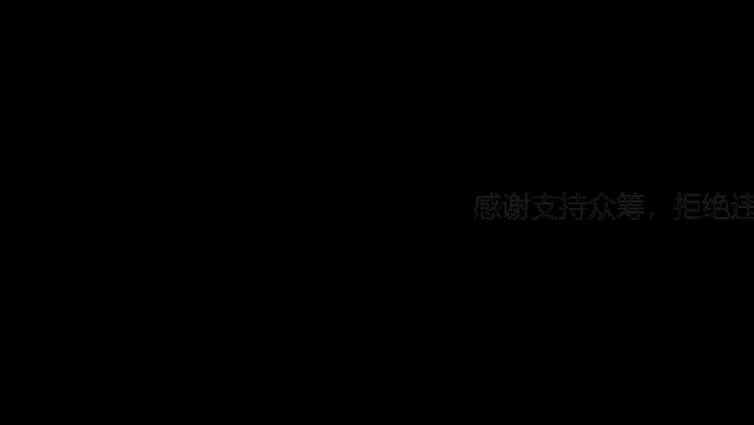
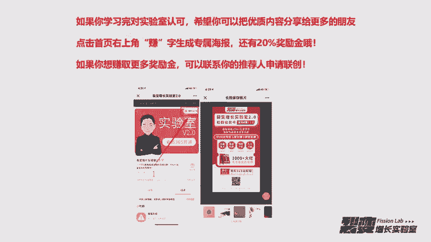
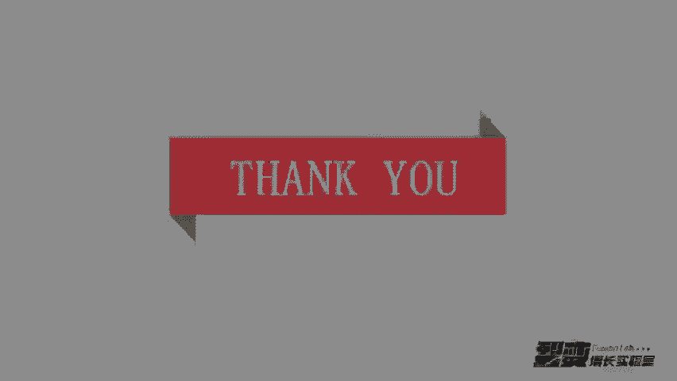

# 微社群裂变营销私域流量池增长秘籍创业运营销售获客视频课教程 合集 8套 374资料 13.1G 搭建流量循环体系的知识框架 - P2：01【流量的秘密】先理解流量再制造流量 - 高端网创试错赚钱大师 - BV1Hs421M7k3

🎼这是我们01天的课程。🎼然后1。0实验室呢以实操的流程为主。我们2。0现在做了个更改，就是现在以裂变的模型为主。🎼然后我们课程呢在赠送篇会普四节实操的课程。

这是这四节实操的课程是我手动就是我会在电脑上面去操作和录屏。🎼它包含每一个就是你去设计裂变，无论是群裂变还是任务吧，或者说个人号裂变，它包含每一个步骤。所以你从我们前面讲的裂变模型，加上后面的实操步骤。

呃，保证每一个人都可以搭建出来一个裂变的流量循环体系。那14天的课程内容，我的希望是这样的，就是我每节课解决大家一个大的问题。在这个过程中。🎼呃，每一节课我能把问题讲的明白，然后你能把问题理解的清楚。

嗯，这或许是大家最希望得到的。呃，另外呢每一节课我会放一个彩蛋。🎼这个彩蛋里包含了我之前跟大家说混圈子的4个点的其中一个，比如说推荐一个人，或者说推荐一个圈子。

再或者说课程内容里面跟我们这个主题不是特别相关，但又特别重要的这些资料，我都会存放到文档里。然后你听完课程之后，通过文档去拿到呃这些资料，然后在课程结束之后，你去自己再去做参考做学习。

然后呢我们今天第一天的内容解决的这个问题呢，是你对流量的理解。也就是说你学习做流量的过程中，理解流量其实比比我们去裂变或者制造流量，它更重要。所以很多时候我们去做流量的时候，我们对这个流量是没有概念的。

然后只知道去裂变过来很多用户到微信号上，到微信个人号上，或者说呃公众号涨了很多很多粉丝。然后但是呃在你不理解的这个过程中，你做了那么多的流量到底是为了什么。那我解释一下这句。🎼句话我们怎么理解这句话。

就流量。其实它就是呃在以前来说的话，就是获客。我们需要的用户，其实就是把它称为用户。那我们的用户其实一直都是有的。就在任何时候呃，人群和流量它都一直存在的。🎼只是。🎼现在我们做的这个东西需要的这个用户。

他有可能不在我们这儿，所以要有一个载体，这个载体可以是个人的微信号，也可以是公众号，也可以是微信群。然后你通过这个载体来把这些用户给接过来。

但接过来的前提是我们必须有一个这个用户需要的产品我简单给大家举个例子，比如你现在加入了裂变增长实验室啊，你加入裂变增长实验室之前，你你是不是有加过别人的社群，比如说运营的社群。

或者说呃也是同样学习增长的社群，你以前肯定会加过这样的社群。🎼呃，当然我们这个我们这个社群里面肯定有一些是在别的社群里看到了增长实验室的信息，然后后面又加入到这个组织里面的对吧？

所以通过这个呃从别的群到这个群的这样一个案例，你来理解的话就是。🎼我们的用户群体。🎼呃。🎼是一直都有的，可能现在没在我们这儿，在别人那那边。🎼那社群呢只是我们上面说的其中一个载体。那这类载体呢？

🎼我我把它称之为平台流量。🎼在后面的内容里面，我们会专门解解释平台流量它的优势和劣势，以及怎么搞平台流量。🎼所以当你理解完流量之后呢。🎼你不会再担心你没有流量的问题。

🎼你不会单纯为了获取更多的流量去做裂变。🎼那我们现在嗯我我上面跟你说的这些就是因为我现在的公司就在做这样的事情，我们就是从不会天天为了去获取用户而去做裂变。那我们做裂变的第一个目的。

🎼绝对不是说获取更多的用户。我们的第一个目的是做事能。🎼嗯。🎼你现在无论懂不懂是那个关键词，它不重要。然后呢第二个目的呢才是获取用户。🎼呃，为什么我把势能作为作为我们去做裂变的第一个目的？

🎼这个其实太重要了，就是我认为所有的转化就我们无论是卖产品，卖社群还是。🎼呃，卖自己的课程。🎼这所有的转化均来源于市呢。如果你这个课程的，如果你做的这个东西，它的势能比较强，它的转化率就会超级高。

然后传播的人数也会超级高。所以你后面可以去参照以前经常在朋友圈刷屏的这些案例，那你可以研究和观察的三个群体，然后通过这三个群体。🎼你基本上会对事呢这个关键词有一个比较深入的了解。🎼嗯。

第一个你应该观察的是央视在在中央电视台，或者说央视旗下的这些广告电视台。🎼他去投放广告的这些企业，这是第一个你需要研究的。🎼和观察的群体。然后第二个是楼盘发售的房产公司。比如像恒大。

🎼That was想。🎼万达这样的楼盘发售的这样的公司，你去你去看他们在楼盘去。🎼开售的时候就开盘的时候，你会发现他们做势能的这个这个技巧和方法非常的多。然后第三个群体是微商的明星代言，赛车赛房赛出国。

对你可以。🎼把重点观察的群体放在这三个上面。🎼这个时候你肯定好奇，就是说呃势能的这个关键词，它人性的本质是什么？🎼我今天会在彩蛋里面，就是我们今天的彩蛋就是这个等后面内容结束后，你拿到这个彩蛋。

这个彩蛋会协助你去理解势能的重要性。所以我们在在这个课程里面就不详细讲这个。然后呢，第二个目的呢就是说我们要获取用户。其实这个目的呢获取用户这个目的是一个假目的，你能理解吧？🎼他后面真正的目的是什么？

是赚钱。你看任何一家企业或个人。🎼他自己去获取流量，最终的目的，他不是为了转化变现。🎼如果不是他最终的目的，如果不是为了转化变现。🎼那这个人或者这个公司，他在商业模式上肯定是存在问题的。

所以我我们做流量最核心的目的是赚钱。🎼那互联网商业其实。🎼最重要的就三个关键词。🎼产品。流量转化率。🎼呃，这不是我说的这是梁宁老师说的。🎼在他的那个产品经理。🎼呃，产品30奖就得到上面那个专栏。

产品30奖。🎼上面有说过这个。🎼互联网商业里面的核心。所以我去拆过很多就是别的公司的这样的商业模式，确实都是这样。我们关于产品流量转化，还专门拆解了那个宝宝玩英语这样的一家公司。

你抽空的话可以去王六六说这个账号去看宝宝玩英语，这个专门拆解的内容。这家公司真的是以产品流量和转化，每年做到2亿的营收。🎼从产品来看的话就是。🎼我们与竞争对手之间无非就是。🎼产品之间比谁的产品更有优势？

🎼然后流量比谁搞的流量多，然后转化率。🎼比谁的转化率更高，优化的更好。这就是在我们与竞品之间的这样一个竞争的一个流程。你给这三个。🎼呃，核心的关键词排一个序。比如说你说是产品排在第一位。

还是流量排在第一位，还是转化率排在第一位？🎼这个时候你可以思考一下。好，那下面是我给大家排的一个序。🎼就是这是一个有6个步骤的顺序。🎼第一个步骤是产品，第二个步骤是流量。第三个步骤是转化。

然后第四个步骤还是流量，第五个步骤转化，然后到第六个步骤就是循环。🎼嗯，我为什么会写6个步骤？就是它对应的下面的6个步骤，就是第一个步骤，产品是为了吸引流量。然后第一波流量过来之后。

你会有一个承载承载的承载流量的。就我们上面说到的个人号或者微信公众号或者是微信群。🎼然后第三个，你会去测试转化你承载的这一波流量。对你测试完之后哈，这个时候的流量是大批量。就是你如果测试成功了。

你肯定会想尽一切办法，你可能会花钱去买，你可能想尽一切办法找别人去帮你推流量，然后这个时候再过来的，他这一次承载，就是对应的这个承载，就是你去把转化流程已经跑的很熟悉了。这个时候再过来的流量。

你是能接得住的。🎼然后这个时候转化完之后，你唯一循环的就是你把流量做的越来越多，然后把流量进入到你现在的这个体系里面。如果你流量不欠缺，能循环的进入到这个体系，那你这个循环能一直走的下去。

所以我们对上面的这6个步骤做一下路径的分析，因为在每一个环节上面，其实它都是有很多因素的。比如说我们去看产品，如果你的产品好，你说你能你能在这个路径上面你能满足的是什么？🎼我认为它能满足的两个点。

第一个点，如果你的产品好，他能满足复购，就是用户买了之后会再过来买，就它循环会在你这一个地方买。所以这是节点上面的第一个关键点。然后第二个是你产品好的话，用户会去转介绍。所以产品好。

在这个我们上面画的路径当中，它是。🎼它这个节点上面是满足两个条件的。第一个就是。🎼满足了复购。第二个满足了转介绍。🎼那这时候我给大家说一个案例，你可以去研究所有做直营零售的这样的公司。如果他们的路径。

🎼里面满足不了第一个产品号这样的一个节点。🎼这家公司是不可能赚到钱的，这家直营公司是不可能赚到钱的。🎼那你怎么找到这样的直营公司呢？你去百度搜索。🎼关键词比如说蜂蜜、海参，然后祛痘。

🎼你去搜索这样的关键词，然后去添加上面的微信，然后去聊天，你就能基本走通整个流程。🎼好，那我们现在说路径分析里面的第二个节点。🎼第二个节点就是流量多，那流量多，它主要满足什么呢？满足你有的卖。

你如果没有流量，你是没得卖的，你没有人卖。🎼你不知道卖给谁，所以。🎼获取更多的流量。他唯一满足的就是。🎼能我们这个东西能有人去卖给他们。所以在。🎼呃，流量多的这个案例里面。

我可以给大家说几个在微信体系里面的，比如说十点读书。🎼然后有书，然后还有一条。那前两个像10点读书和有书，他们是以知识付费为主的那一条的话，它是以电商为主的这种流量大户它存在一个共同点就是。

🎼他的售卖多样化。🎼他去卖东西的时候。🎼他会以多种形式去卖，为什么？🎼你看无论是电商知识付费还是线下，只要流量比较多的，它会延伸出无数的这种贩卖方式。因为每一个人都要追求一个流量的最大化变现。

🎼你说买知识的人，他不用买买商品吗？他不用买。🎼就是电商里面的这样的产品嘛，他肯定是要买的。🎼那第三个节点就是转化转化满满足的是什么？满足的是不好卖的问题。就是说你这个产品可能本身很好。

🎼但是产品本身很好，是不是要用户买过来用了之后才知道好。就比如课程，你买了之后听了之后，你才知道这个课程好不好，对吧？你买之前你不你是不知道这个课好不好的。🎼所以这个转化是在在前在最前置的。

🎼他他就满足了不好卖的问题。那我我给大家一个案例，这是一个很厉害的公众号。🎼这个公众号呢其实它仅仅只有4000的粉丝。🎼就是微信公众号上的粉丝只有4000，他一年卖货能卖200多万。

🎼这个账号的名字叫有时遇见熊。🎼因为我们不主要讲转化，所以我不详细。🎼呃，说这个账号关于这个账号的拆解资料，我已我已经整理到我们这个课程的彩单里面。后面大家课程彩单里面去详细了解。

所以在我们做流量的过程中。🎼你要清晰的是你做哪个产品的流量。🎼这个时候你理解的产品，我我我是这样先给你举几个例子，然后你再去理解产品。🎼比如说社群它是产品，然后一个课程它也是一个产品。

🎼一个个人的IP它也是一个产品，那服务也是产品，商品也是产品。所以这个时候我希望你你思考一下，你自己在售卖的产品，或者说你自己想做的产品是什么？比如大家现在买的那边这长实验室这个社群，它是不是一个产品。

🎼你按我们上面讲的，你从三个维度想一下实验室的产品流量和转化的问题。🎼或者你随便找一家公司，你看看他们家的产品流量转化的问题，你是不是发现。🎼流量的。🎼重要它是有产品和转化两个前提的。如果没有这些前提。

🎼你这边过来的流量真的是完全没用的，而且很有可能你这边的流量过来都成了你的负担。🎼你可以从下面这个PP你可以从这个PPT上面看到，我是找了三个这样的案例。🎼第一个一个月的数据大概是42万。

他卖的是一个什么东西，是微信刷布。我不知道大家对这个微信刷布有没有概念啊，就是你在微信运动的时候，运动那个界面，你会发现总是有那个。🎼9999就是99990，然后666688880。

这是我们很早的时候玩的一个东西，以前靠这个去刷。🎼呃，帮别人刷刷布，然后去在那个刷布的界面上面放那个广告位，然后去赚钱。这是很早我们在做的东西。现在你看到在淘宝上还是有卖19。9块。

然后每个月的数据大概有42万。🎼然后第二个呢是。🎼那微信群呢就是。🎼他给你拉群，这个是其实是群的地下地下产业，这是一个很厉害的行业。包括现在我周围也有一些朋友在做这个。🎼呃，他们一个月的数据。

🎼就是在这个平台，在淘宝这个平台，一个月的数据大概是1万多块。就是如果按正常的一个人来做的话，一个月1万多块也是白领的薪资，对吧？🎼好，你再看第三个。🎼第三个呢，他是。🎼卖微信多开。

🎼我不知道大家有没有用过这样的软件啊。🎼呃，这个你说他是在卖什么呢？🎼他是专卖信息商。🎼他一个月的数据大概在8万多块钱，就是一个微信多开的软件，大概在8万多块钱。🎼那这样的软件你想一下。

🎼它的编辑成本是不是零？🎼软件是开授权码，是直接可以用的。🎼那比如像现在的这样的，很多人他是不知道手机是自带微信多开的。比如苹果手机里面有捷径，用捷径是直接可以实现微信多开的。

🎼那安卓手机你如果想实现多开。🎼像我们这一些专门做微信流量的，我们会用小辣椒的手机，小辣椒S6，然后360N5S这样的手机，它一个一台手机能开七八个账号，然后也不会封号。所以很多。

🎼他的这些不知道有这些手机的人，他就会去。🎼网上买这些就是。🎼呃，多开了软件嘛？这也多开了软件。🎼其实别人卖的就是授权码，一个码卖给你58块，一个月都能卖8万多块钱。🎼所以我们要思考三个问题。

第一个这些人在卖什么？🎼比如微信刷捕，他主要第一个卖装逼，卖广告位。🎼呃，第二个微信群它主要是在卖流量，那微信多开，它主要是赚信息差，或者说卖软件的授权码。🎼第二个，为什么在这里买？

🎼你可以看一下这三个案例全是在。🎼淘那个阿里体系里面在卖。🎼他在这卖肯定有他在这卖的原因。所以。🎼像这样的，就是他在他在阿里系卖，就是证明阿里系的流量能够满足他这个商品。这里面有各种各样的流量。

那第3个。🎼呃，他卖完这些软件之后，比如说在淘宝上有人买了。🎼他卖完之后还能干嘛？🎼嗯，如果我我们前面理解了流量之后，你绝对会思考这样一个问题。就是我卖给他这个软件之后，我还能干嘛？

这是我们每个人需要思考的问题。比如说你现在在卖一个产品，你卖给他之后，你还能干嘛？🎼那尤其是软件类的，他买软件容易，但是使用软件就比较难了。🎼很多时候这些卖软件的他都会。把使用的这这个教程。

🎼做成一个诱饵，让你去添加这个店主的微信，然后给你发这个诱饵。🎼然后有些时候呢，他们会设计一些赠品。比如说我们买上面的多开软件，他会给你送一个微信自动抢红包的这样的一个软件。

其实这所有的无论是赠送的还是卖给你的这个编辑成本都是零，可以无限制生成的。就是卖的码。🎼所以单次购买后的用户，你如果。🎼再次主动或者引导到微信，做长期的触达。

你会发现你才能实现把一件商品把100件商品卖给一个人，而不是说把一件商品卖给100个人，所以做流量呃，所以做流量前，我们必须呃完成的两件事。第一个打造出自己的产品出来。然后第二个，搭建出流畅的转化流程。

如果你目前没有合适的产品也没有转化的流程，那怎么去做流量。好，我我这时候再给你讲一个，你既不满足产品，又不满足转化。那这个时候你要用一个技能，这个技能叫借力变现。🎼那借力变现是什么呢？就第一个点。

你找到优质的产品，这个优质的产品满足三个点，第一个是复购，第二个是转介绍。第三个你有利益。🎼就我们前面所讲到的，所以这样的产品属于优质的产品。然后第二个找到这个产品之后，对标这个产品转化流程。

你只要满足这两个点好，你就可以借力去做变现去赚钱。比如下面你看到我是在百度体系内找了三个竞价广告页。这三个竞价广告宴都在卖一个东西，就是留克亚的光盘。他为什么会卖刘克亚的光盘。

他是不是在借力刘克亚的流量。因为刘克亚他是他本身他是营销做营销的比较厉害的一个营销大师，所以他自己本身是带搜索流量的，很多人会去搜索它。那这个时候别人在他自己能卖他的光盘，你你也可以卖他的光盘。

比如你成为他的代理商，所以这个时候你就相当于在借刘克亚的力量，然后再卖刘克亚的东西。如果他的产品好，嗯，满足了复购转介绍，并且对你有利益。这三个点，你直接去复制他们整个的转化流程。

然后套用过来去做你自己的转化流程，你就能。🎼赚钱了。所以这就是在我们后面，你去看到市面上很多做知识付费的，他们会有分销的这个体系，为什么会有分销的这个体系？就是只要他分发分销的这个人，他把产品做的很好。

并且他这个品他这个平台或者说他的品牌性特别强的时候，很多人是愿意分销的。因为他产品好啊，你你会看你会发现他们产品肯定是满满足上面这三个点了。第一个就复购转介绍，并且对他有利益。要不然他肯定不会去卖。

🎼你会发现以上的案例呢，他们有一个共同的特点。这共同的特点是什么呢？他们都在借助平台的流量。🎼比如说淘宝平台的流量，或者说下面这个卖卖刘克亚光盘的，它是用百度平台的流量。那平台的流量好做。🎼嗯。

所以这些人他会用平台的流量。因为如果像我们提到的，像现在的裂变这一种，它不属于平台流量，它属于社交流量。🎼我有一个做佛珠的朋友，是之前就是我花钱加入一些圈子嘛，加那个情光会商学院这个圈子我认识的。

他是从14年开始做微信，做那个Q呃百度贴吧。🎼他做百度贴吧的时候，就天天在一些这种。🎼呃，旅游旅游贴吧和那个摄影还是怎样？这样的贴吧里面，他天天去混混混经验发帖子。🎼然后到16年的时候，他卖佛珠啊。

他都做到了2000多万。🎼我后面就跟他聊，我就问我说。🎼呃，你去卖的时候是一般是怎么搞的吗？他跟我讲，他所有的用户都就在16年之前，他所有的用户都是来源于百度贴吧。那我们去看一下他的这三个核心的关键词。

他的产品是佛珠，然后他的流量来源是百度贴吧。然后那他的转化，就他自己一个人，他就通过微信，然后去通过跟别人聊天，贴吧过来的这样流加的微信的这个流量，他通过贴吧通过微信去跟他们一对一去聊天。

然后去卖这个佛珠，然后还有一个案例，这个案例呢是一个很励志的，这个是1个90后，嗯，是我一个朋友圈里面做网赚的，我们也很早认识他做的是祛痘护肤的产品。然后他们这个产品呢叫小掌柜。嗯。

那剑媒大侠最厉害的是他基本上把所有的平台流量都做了一遍。比如我们前面就刚才说佛珠那个案例，百度贴吧的案例，他会做兴趣部落，然后贴吧抖音，那他就因为这样的做平台的流量的。

🎼形式他一年做这一个祛痘套装的产品的营收大概在1000多万。那我们也看也看健媒大侠，他们这三个核心的关键词，嗯，它的产品是祛痘套装，它会分为两类产品。第一类产品叫流量产品。这个产品嗯。

也就是说你花100块，你买了这个产品，你就成它的代理商，然后你就可以去推套装。然后他会教你怎么做流量的方式。然后你。🎼就用他教你的方法去做流量去卖去赚钱就行了。🎼然后第二个流量的来源。

流量来源主要来源于所有它研究透规则的这样的平台。比如说你去做兴趣部落，然后你做的时候可能做不来流量。那主要原因就是你对规则不熟悉，所以他会把这所有的平台去全部研究，研究完之后，他会去教他的。

因为他要教他的代理商，所以他会去拼命的研究。所以大家做平台流量居多做不起来的原因是因为。🎼没有一个东西反逼着你去做这样一件事情。🎼比如说你不去做平台流量，你的代理商就卖不出去货，你就赚不到钱。

所以这个时候你也会去。🎼研究像现在比较比较火的抖音，你肯定会去研究。因为每一个新兴的新媒体平台，它都是一个新兴流量的发源地。那他们的转化的形式也是通过微信一对一这样的聊天。因为它的套装的客单价较高。

你在微信上只要是客单价较高的这样的产品都需要是一对一这样的聊，你不可能说通过朋友圈静默的就把它转化了。那平台流量的特点就是我们要花很多的时间去研究这个平台的规则。当你研究透一个平台的规则之后。

它的流量真的是太好太好做了。那就是说它做的速度没有我们像裂变这么快，但它的持续性强，持续性强的意思是什么呢？比如说你在贴吧上发14年发了一个帖子，可能16年的时候还会有人添加过来过来找你的。

就它会有很多长尾的流量。那裂变的基础量就是我们去做裂变要有种子用户，它的基础流量来源都是平台流量。微信群也是平台，我们上面说的这个载体。🎼微信群这个载体，我我们也把它称为平台。所以现在如果你想快速的去。

🎼获取这个平台流量的呃载体，你去寻找的时候，我我给你建议的话，你最好是找微信群。然后后面种子用户部分我们会详细讲怎么获取这样的呃微信群和种子用户。🎼好，这时候思考点来了，嗯，你思考3个。

第一个你的产品是什么？🎼然后你的流量来源在哪？你的转化形式以及转化率是多少？🎼这三个问题嗯，你在这个中间在我讲完前面的，你可以详细的思考一下。后面我们会有一个呃专门提交文档，让你去填这些东西的。

然后后面会说，然后呢，我们现在再说一下社交流量。我们前面说了平台的流量，现在说一下社交流量。嗯，在之前呢，89月份的时候，有一个案例叫玩转社群666。然后这个案例呢，他的操盘手叫阿妹。🎼嗯。

也也也叫增长女黑客，就是是我一个比较好的朋友。他最早做这个案例的时候，大家在PPT上面可以看到这两张海报。嗯，最开始最开始启动的时候呢，他其实没想做嗯社群。他只是想去导导用户到他最开始没想做付费社群。

他只想做免费社群，就是导用户到他那个嗯玩乐社群666的那个星球，就因为他刚开始找我的时候，上面嗯基本没有人，但是他在上面更新内容去做诱饵。🎼然后后面当推这个。🎼呃。🎼呃，19。

9块的这个时候他是因为他他们的小程序有一个小程序叫群勾搭。这个小程序要获取流量。所以它的主要目的呢就是做社交流量的主要目的就是推广群勾搭这个小程序。所以他建立了玩转社群666的这个社群。

当时定价的时候是19。9块嘛，他定价是19。9块。我们在第二天和第二天流量框架和第四天幼儿课程的时候，我都会提及这个案例。就是你们现在不用着急去摸索它这个流程。我后面。🎼第二天和第四天的时候会详细讲。

然后我们可以看就是完转社群666，它这个三个体系是什么？就它的它的产品体系是社群，然后他送了一个知识星球，这个知识星球也是呃相当于一个诱饵吧。🎼然后它流量的形式呢，它是用。

🎼就是知识付费行业现在目前最惯用的一种形式，就通过二级分销的裂变。但是它是采用这种组队PK的形式实现二级分销的裂变。🎼那这一次活动，如果你是在运营的圈子里面，你应该都能看到这张黄色海报。

他们当时是有1万多的付费用户加入。🎼所以社交流量的特点相比平台流量的。🎼难易程度是比较难的，就是做社交流量是比较难的。就不是说每一个人都能做出来这么牛逼的案例都能做出来。🎼呃。

几万付费用户或者十几万付费用户的这样的一种形式。但是。🎼社交流量它最适合的是以小博大。就是说你如果现在你的产品。🎼没有变现的途径，变现的非常慢，然后你去积累平台流量，你是活不下去的，你能理解吧？

有可能当你平台流量做出来的时候，你这家公司已经没有钱去。🎼发工资没有钱去运作了。所以。🎼嗯，对于。🎼你想以小博大的这些这些人或者企业，你可以以社交流量的形式来做它的速度快规模大。

就是能从01从0到1是非常快的。🎼所以听完这节课之后，你一定要先。🎼思考一下你们是什么类型的公司。🎼是先先做平台流量，还做做平台流量的原始积累，还是做社交流量的以小博大。那在我们1。0课程里面啊，在1。

0的课程内容里面，专门有一节课是讲这个平台流量的。你们可以在1。0的内容专栏里面去找到这节课去做辅助。当然，平台流量是我们做流量值搭建的裂变核心的前提。🎼所以。你最好是最好是去看一下这节课做一下参考。

🎼好，我们回顾一下我们上面的整个内容，就说我们做流量先梳理出来，我们的主要目的是做什么？比如说我们的目的是为了赚钱。🎼那你围绕赚钱产生了三个核心的关键词，这三个核心的关键词分别是产品流量和转化。

🎼我们我们说两个点，第一个点，你有流量有渠道，有流量渠道，然后产品没利润转化高。你说这样的事情能不能做？🎼然后第二个有流量渠道，产品利润高转化低。🎼这种这两种都是没得搞的对吧？🎼你如果有很多流量。

然后产品没有利润，你转化再高，你不赚钱了。然后你有了流量渠道，你的产品利润也很高，但是你转化很低，你还是不赚钱。所以你会发现这是一个等边三角形。🎼就是流量产品和转化，这三个是等边三角形。

任何任何一个不足，然后它都不可能说让你赚到很多钱。🎼所以它的核心是。🎼高利润的产品，然后转化率高。🎼然后你只需要学习我们先后面的课程，掌握怎么做流量。🎼然后怎么买流量，然后就赚钱了。🎼好。

今天是第一天的内容，你学习完。🎼呃，我的建议是不要听直直接听第二天的内容。🎼这是我我在学习上花了很多钱悟出来的道理。🎼就我以前会。🎼花很就是看假如说我买到一个课，我感觉这个课还好啊。

然后我会就很急功近利，我会把这个课花最短的时间全部听完。🎼然后后面我慢慢发现，就是我这样做，其实后面我并没有得到什么。嗯，有时候慢就是快，所以大家不要急于求成。你用一天努力去学习。

把14天的内容几乎就是全部学完。你后面产生的功效性和我给你设置的这个流程相比的话，它的功效性只有20%。🎼那学完第第一天的课程，你需要做三个事情，这三个事情分别是。🎼梳理出来三个东西。

第一个东西是你的产品。那你需要梳理的是客单价和价值。🎼然后第二个你的流量就你的流量是什么样的用户，他的用户群体以及你获取流量的主要来源。还有就是可能会有你用户的地方。

🎼然后第三个呢就是你的转化流量进入后的转化流程。这个时候。🎼可能会需要你整个的话术，或者说你是通过微信朋友圈静默转化，还是通过一对一的转化。因为我你把这些全部处理成一个文档。

然后在页面增长实验室的公众号后台回复提交这个关键词。🎼回复后，你会收到一份提交你内容的链接。🎼这个链接是简出的链接，需要你投稿的形式发过去，然后到时候会有专门的人去整理，处理大家所提交的内容。

你提交的内容越详细，我这边就是可能会有越详细的诊断。然后后面在最后的就是我们转化片的时候，到时候。🎼会给出更多的这样的。🎼呃，彩单资料。🎼然后明天的内容呢，我会讲如何搭建流量的框架。🎼我讲流量的框架。

我讲的这些都是我现在就比如说我的公司，或者说我们实验室社群正在做的东西，就是我们自己在做的。后面我做的东西，只要有任何迭代的这样一种玩法，我都会在社群的内容上去做一次内容的迭代。

就是我们现在听了十四节课。从第一天到第十4天。后面如果说呃玩法上有有更新的话，这些课程会是直接更新的更新的通知，到时候会以群公告的形式去通知大家。🎼然后第二天的内容，你怎么获取呢？

你在裂变增长实验室的公众号回复02。🎼day，然后获取。那今天的彩蛋的关键词是你在后台回复重做，你可以领取到我上面就提到的势能以及提到势能有深入理解的这个资料，还有那个呃我们提到的这个公众号有时遇见雄。

他们这个高转化的。🎼这样一个详细的拆解。🎼呃，如果你听完比较受益，希望你能分享实验室优质的内容给身边更多的朋友，你可以在首页点击右上角的钻子，生成自己的海报，还会有20%的奖励金。

如果你想赚取更多的奖金，可以联系你的推荐人，然后申请联创，踏入实验室的赚钱之路。

🎼好的，我们今天的内容就到这里，明天见。

