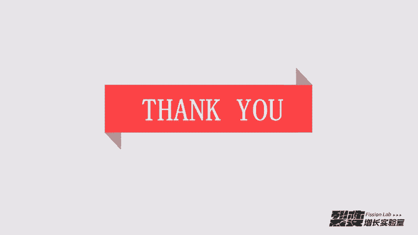

# 微社群裂变营销私域流量池增长秘籍创业运营销售获客视频课教程 合集 8套 374资料 13.1G 搭建流量循环体系的知识框架 - P5：04【诱饵的挖掘】2种挖掘诱饵的技巧 - 高端网创试错赚钱大师 - BV1Hs421M7k3

🎼好，今天是第四天的课程了，这是我认为做流量最核心的一节课。🎼嗯，课程里你需要补充一个技能，就是这节课我没办法完全把这些全部讲清楚。所以课程里你需要补充一个技能，这个技能叫幼饵的价值塑造。

🎼然后当然在课程结束的时候，我会给你一个价值塑造的彩蛋，你可以。🎼呃，拿到价值书的彩蛋的这个链接。🎼好，那，这时候我们强调一个重点，就是所有获取流量的方法都是在设计诱饵。🎼这一句话怎么理解呢？

比如说我们在群里面想让群里面一个人添加我们，我们是不是要给他一个。🎼添加我们的这样这样的一个理由。🎼或者说我们要给出一个诱饵，这个人才会去添加我，对吧？🎼嗯，那比如在抖音上面，我们去发一条视频。

🎼你想让别人关注你，你是不是要给别人一个关注你的理由，或者你要驱动你给他一个引导的动作，让他去关注你是不是这个样子？🎼再或者很早的时候嗯。🎼大家在做今日头条的时候，做今日头条导流的时候，你是不是也经常。

🎼写写那个今日头条文章的时候，写完之后，你也会给用户一个嗯让他去添加你的理由。比如你可以你现在可以去今日头条的嗯今日头条里面搜索限时免费这四个字，你会发现所有限时免费这样的文章导流的都是会给出一个诱饵。

这个诱饵都是能使这个用户去添加你的。所以呢诱饵的作用是什么呢？🎼诱饵的主要作用就是给别人一个想让他做的动作的理由。🎼也就是说你想让他添加你，你就要给他一个添加你的理由。你想让他关注你。

你就要给他一个关注你的理由。🎼所以诱饵的诱惑性越大，那驱动用户完成动作的动力它就越大。🎼这个诱饵的诱惑性怎么体现呢？它是主要以价值的展现形式去体现。🎼比如说我们现在做。🎼瑜伽，我做瑜伽的时候。

我我弄一个瑜伽的课程，瑜伽瘦身的课程。如果我仅以瑜伽的这样一个课程去做诱饵，它的吸引力，你说大还是不大？其实是有吸引力的。因为相比没有东西，它是肯定有吸引力的那如果瑜伽瘦身完之后。

我再建立一个瑜伽瘦身的群，大家互相监督，你说这个吸引力是不是又加大了？如果在这个基础上，我再送一个瑜伽的食谱，你看我这个食谱去吃，你可能。🎼，瘦的更快。

所以这个诱饵的诱惑性主要体现在就是我们又我们的这个价值上面。🎼那幼饵的展现形式呢就是。🎼它产产生极大的驱动力，产生极大驱动力的诱惑性的产品或服务。🎼就它可以是一个东西。

它也可以是一个虚拟的这样的一个服务，或者说一个虚拟的其他的东西。比如说电子书或者说一堂课。🎼那所以呢我把幼儿分成两类。嗯，第一类幼儿叫需要钱的幼儿，需要钱的幼儿它需要满足一个条件，就是低成本且价值高。

嗯，这个价值高呢它一共是有有有4种形式，第一种价值高体现在有用。🎼第二个是实用，第三个是通用，第四个是必须用。🎼那有用呢，我给大家找了一个案例，比如书或者说护警器。🎼就颈椎治疗仪按摩仪。

🎼这个地方我要解释一下，就是说。🎼价值有用，它它分为几个阶段。第一个有用它体现在。🎼呃，这个产品或者说这个服务的价值对吧？呃有用还体现在呃这个产品或者这个服务的使用价值。

🎼然后还体现的就是这个产品或者这个服务的个别价值。🎼那最后一个就是这个产品或者这个服务的社会价值，社会价值就上升到比如说。🎼上升到精神层面了，就上升到精神精神层面了。🎼所以你从这个PPT上面。

你可以看到这一个有用的。🎼颈椎按摩仪，这是一个有用的东西。🎼然后他他就会用这样的一个东西去做诱饵。然后这个诱饵你在这个海报上还可能还能还能看到嗯，豆瓣呃还可领取豆瓣top100任意的四本书籍。

这个地方就是我前面提到的，我说呃我们单纯的送一个。🎼按摩仪，你说它吸引力大吗？吸引力已经挺大了，相比没有东西啊，他的吸引力已经挺大了。那我再送100本。🎼于正义选四本书籍，对吧？

他这个吸引力是不是做加持，给这个诱饵去做加持，对吧？🎼然后呢，实用呢实用我举个简单例子，以水果来说吧，以前有一个呃产品叫惠过。那惠过上上线的时候，它的启动主要就是以免费送水果来实现的。🎼啊。

我说一个简单的逻辑，我们以现在最火的社交电商平台，美丽一淘来说。🎼嗯，你在每丽淘上搜索水果的品类，你搜索这种9。9块到19。9块的产品。嗯，这类产品居多以柚子和那个。🎼呃，橙子这两个为主。

🎼所以你把这两个产品作为免费送的。Your。🎼那免费送你给用户设置的条件是什么呢？条件就比如说邀请5个好友添加我这个水果我会包邮，给你免费送过去，对吧？🎼那完成后，这个用户比如说他邀请了5个好友。

已经添加你了。完成后你要发发什么发绑定就每日一淘绑定上下级关系的这个邀请的链接。这个链接从哪拿呢？从每日淘有一个小程序，你从小程序里面可以拿到这个链接，然后让用户去购买。🎼购买的时候，你发红包给他。

让他去买。🎼你这样想一下，你可以得到什么，你相当于花了9。9块到19。9块这个区间的钱换到了5个种子用户。这5个种子用户过来之后，你跟他同样的方式，也是让他邀请5个，你会发现就形成了一种裂变。

🎼然后5个种子用户加一个终身绑定的用户。🎼他点了你的链接，按你的这个来的话，他就成了你的下线。🎼所以。🎼这一段你如果能理解的话。🎼你去做社交电商平台的裂面。🎼你会你会收获很大的价值，我这样跟你讲吗？

你能收获很大的价值，所以这段好好理解一下。🎼那通用呢通用就是我们日常生活中说。🎼可能经常会用会用到的东西，比如说卫生纸。🎼你会发现很多做任务宝裂变的，就这设计诱饵的时候，他们经常会用这样的一种产品形式。

🎼来去给大家设计这个诱饵。🎼那卫生纸这个诱饵它就是通用型产品。🎼所以很多人会去参加，因为这种东西免费领过来肯定是有的用的对吧？那最后一类是必须用的，必须用的。比如说剃须刀，那男性他刮胡子。

他这个是必须要去刮的，是吧？那你不是所有人都不刮胡子的。🎼有一些留着长的那些。🎼他可能是。🎼自己个性，他他不他不那个他不刮胡子，但是我的剃须刀其实是一个必需品。你会发现它对于男性来说，它是一个必需品。

那比如牙刷牙刷，你说对于人来说是不是一个必需品，我们早上晚上要刷牙，所以。🎼那普通的牙刷它的吸引力比较弱，所以我们以电动牙刷来举例。🎼嗯，那这种必需品你去做诱饵的时候，它的吸引力就会变强，对吧？

所以通过这四个用，就是说我们通过呃有用实用通用必须用。你只要能把这四个用的产品给挖掘出来，你会发现你设计诱饵的时候就非常简单。🎼他就不是那么麻烦。那当我们是能能找到这样的产品之后，我们要计算粉丝的成本。

对吧？🎼你这时候要想你说产品你找的这个诱饵的成本越高，你的粉丝是不是越贵？🎼是不是这个样子？所以你要去压缩这个粉色的成本。当你把粉色压粉色的成本压缩到一定程度的时候，那你。

🎼你把产品的产品的成本压缩到一定的程度的时候，你的粉丝的成本就压缩到最低了。🎼所以我给大家介绍几个渠道。🎼这几个渠道呢都是。🎼最低价格的幼儿渠道。🎼比如说淘宝客。🎼淘宝客这个里面我给大家推荐两个。

第一个叫大淘客，第二个叫阿里妈妈。然后这两个。🎼这这呃这两个平台就是你可以比如说你在那个高佣高佣的那个里面，你去找商品，比如说9。9块的杯子。🎼可能你送出去之后，他会给你返过来8块钱。

你可能只花了1块钱，你就把这个产品给。🎼搞过来做诱饵的。🎼那还有一种形式就是大都数送书的，送书的很多都是从阿里巴巴上面直接找渠道。🎼找渠道阿里巴巴上面找渠道的话，他就会几块钱就能是就能搞到一本书。

所以你邀请个20个人，30个人，你这个成本是非常低的。我们测算的一个这样的一个粉丝的成本，大概就两两毛钱到3毛钱这样这样子。🎼那拼多多呢拼多多是。🎼嗯，很多人他是不会用拼多多来搞来搞这个的。

🎼不会用拼多多来找诱儿。那。🎼我有一个朋友，他们是怎么做的？🎼他们专门开发了一个拼多多自动下单系统。🎼它所有的这样的呃诱饵的产品都是从拼多多来找。那拼多多大家都知道这个上面真是便宜的，不能再便宜了。

对吧？所以这样的产品在拼多多上，你可以百度去找一下这个拼多多自动下单系统，找到之后，你可以在拼多多上找这个找这样的商品。🎼找这样的商品去做诱饵，这样的话你的粉丝成本和产品的成本都会压缩到最低。🎼好。

关于这几个渠道的这样的网址，后面我会打包在彩蛋里面，你到时候回复彩蛋就可以全部拿到。然后在每一个网址里面去寻找你的幼饵的产品。🎼那这时候我们讲一个案例。🎼这个案例呢是一个品牌叫完美日记。

他们做了一个活动，他送什么呢？他送眼影。🎼你会看到他，你邀请9个好友过来参加，你就能领取这个眼影。🎼下面呢这个PPT上面是他们整个的路径图。也就是说我们看到一张海报，扫完这个海报，关注到这个公众号。

这个公众号会推一系列的话术。🎼对吧他会推告诉你。🎼比如说11月26号到11月30号，每天定时给你发多少份？🎼然后你要按照他的要求去做，你要邀请9个好友来关注这个公众号。然后关注完之后，你付10块钱邮费。

就可以领取这个49块的。🎼嗯眼影啊。🎼然后你邀请完之后，你会看他的呃公众账号上面会有这个。🎼邀请成功的这样一个消息模板的提醒。🎼然后当提醒完之后。🎼你要去付邮费吗？付邮费，你会在菜单栏上。

你看他的菜单栏设计是很有意思的，他设计有签到，有在线客服。🎼然后你。🎼完成之后你去付的时候，你只需要再付10块钱。你付完这10块钱之后。🎼你可以从这个99元3件专区里面去选选其中的一件。🎼是这个样子的。

🎼那这个。🎼眼影的数据我先给大家可以说一下，它的数据是通过3个月的时间，两个月的时间做了169万的粉丝。🎼就是这样一个活动，做了169万的粉丝，他们呢启动启动了一个推文。🎼有1万份眼影待领取。

🎼这个推文的链接我也。🎼嗯，一同打包到那个我们今天的彩蛋里面，到时候你可以详细看一下这个推文，这个推文是。2018年。🎼就是就是在11月22号的时候。🎼呃，是一条刺条的推文。🎼它的启动量呢是一个。🎼呃。

100100多万的吧，100多万的公众号，然后就推了一次文，这一次推文阅读大概是6万多，然后点赞是400多。🎼他活动的数据。🎼24个小时。🎼就这这样一个眼影的数据，24个小时，涨粉1017万。

竞争粉15万，参与人数都。🎼到了1。2万。🎼参与人数1。2，完成1万个订单。🎼就光快递费，他们都收了10万块。🎼所以你看幼饵的重要性有多大，他选了这样一个眼影，1万1。2万个人参加，都有1万人能完成。

这个完成率你看有多高。所以他们从10月份才开始做任务宝。🎼然后就。🎼现在是现在我我我们现在也也没过年，对吧？也就是。🎼两个月的两个月的两个多月的时间，把这个做到169万。🎼所以他选选品的时候。

他去针对他的种子用户去设计这样一个产品的时候，就证明了这个产品。🎼他的诱惑力非常的强，邀请9个人还愿意支付10块钱。🎼所以你想一下这些人群对这个产品的需求是有多强。🎼一个好的诱饵真的太重要了。🎼好。

那我们说第二个部分，不需要钱的U饵。不需要钱的诱饵。这时候我给大家举几个例子。🎼呃，社群的我还以我们流量外地实验室的社群来给大家举例子，你说这个社群要钱吗？🎼不需要钱嘛，我就建个群就能做个诱儿，对吧？

🎼然后嗯课程类的课程类的，比如说一节知乎引流的课程，你看下面就我们做知乎的这个课程，这个课也不要钱嘛，也是免费的对吧？🎼呃，第三类电子书。🎼电子书这个就厉害了。你我推荐你关注的一个公众号。

就是王通王通老师的公众号，它底部的这个二维码，你会发现最左边。🎼立刻关注通哥，立刻赠送123三本电子书，他引导的非常好，所以他这个是非常有效的。🎼咨询呢咨询就是一对一的咨询，这个一对一的咨询。

你不可能做成那一种。比如说你转发一次就可以给我一对一咨询一次，这样是肯定不可能的。你设计诱饵的时候不能这样设计，那怎么设计呢？比如说。🎼王丽柳咨询一次呃，1000块。🎼然后大家转发完之后。

有机会参与网六6咨询一对一咨询的一个抽奖，他只抽10个一对一咨询的名额。所以这个时候你相当于把咨询和资格两个结合一块。那资格怎么抽取，怎么获取呢？一般都是以抽奖，或者说社群的名额。

或者说以优惠券的形式去体现。🎼好，那免费的基本上就是呃免费的诱饵，基本上就是这上面这一些东西。🎼那还有一些就比如说我们有了呃免费的诱饵，我们有了这些形式之后，我们怎么搞的这些东西呢？

🎼第一个我把这些幼儿的渠道先给你说一下正规性的。比如说像呃知识付费的平台，我们能在这上面搞到课程，对吧？嗯怎么搞课程？我们可以用深海道这个插件去向每一个平台上面获取到我们想要的课程。🎼比如说像千聊。

🎼呃，荔枝、喜马拉雅这上面的课程，你用深海道这个插件装到QQ浏览器里面。🎼你可以听每一段的时候，把每一段都下载下来。这些内容呃其实都是。🎼可以获取到的嘛，它都可以被重新当作为诱饵去使用。

🎼然后第二个就是你可以在淘宝平台上面你去搜索。🎼嗯，我我下面PPT上面有展示，比如我搜了java这个资料，你会发现你看。🎼一毛钱可以买到java的高级开发视频架构式进阶。🎼呃，什么什么C语言视频。

🎼然后circle202005年视频教程。🎼嗯，你看他能他能通过淘宝把这所有的资料全部买过来。所以这些资料买过来之后，那就是信息差。你买的时候，你知道是一毛钱买过来的，但是真正需求这个的人。

他不知道这个东西在哪找，他也不知道这个东西到底值多少钱。当他需要的时候，这个东西就很值钱，但是你又能免费提供给他。🎼你说他愿不愿意完成，你驱使他去做的这个动作，他肯定是愿意的对吧？

🎼那第三个渠道是什么呢？是百度。🎼第三个渠道是百度，这时候我要给你推荐几个。🎼能全部获取到幼儿的这样的一个平台。🎼嗯，第一个平台叫盘收。🎼嗯，这个盘收上面呢，你是可以直接。🎼呃。

搜索到我们想要的任何资料。比如说我刚才给大家举例子的java。🎼或者PSPPT。🎼嗯，这些资料都是可以在这个平台上面找到的。然后下面一个平台叫谭收嗖。🎼盘收收跟上面的盘收基本上呃是一样的。

所以你也是很容易能获取到的。🎼还有一个叫搜云盘。🎼啊，这三个平台基本上都是类似一样的。但是有一些啊幼儿在其中一个平台搜索不到的时候，你可以去。🎼其他两个这样的去搜索过来。🎼好。

后面我把这三个呃就是搜索平台的这个网址也一也也一呃一块打包给你放到彩单里面。🎼嗯，你你去找这个诱饵的时候，比如说你在嗯盘搜里面找，你没找到这个诱饵，你就试试用其他两个去找。如果三个都找不到，那怎么搞？

你去淘宝去搜索，就是说淘宝，你去淘宝搜的时候，如果还搜不到好，那你就不要做这个了。🎼好，基于以上呢。🎼我们基本把幼饵的免费和付费的两种形式都说清楚了。🎼嗯，那你我自己做的时候。

其实这两这上面两种我从来不会单独去用的，我是怎么用呢？那最大力度的就是组合幼饵法。🎼这个组合怎么玩儿？🎼嗯，在我们组合幼饵的时候。🎼嗯，他你要做两种形式。第一种形式就是嗯在你推广的时候。

你海报上面要表明大的诱饵去做吸引。🎼能理解什么意思吗？比如说我们设计两个诱饵，第一个诱饵是价值199元的一个系列课。第二个诱饵是跟这个课相关的一本电子书。🎼但是我在海报上面，我不表明我要送这一本电子书。

我只表明说我送这个199块的课。🎼但是。🎼当用户领取之后，我会。🎼给他刻完之后，我会再给他一本电子书。所以这个地方就很厉害的地方在哪呢？就是前面表明打诱饵的吸引，后面未表明幼儿的安抚。

就是说如果你这个活动，你发了这个诱饵，他拿到之后并不是太满意。🎼然后你在前面又没给他展示说。🎼有这个未表明的诱饵的时候，你只要把这个未表明的诱饵发给他。🎼好，你就已经把他给安抚了。

无论前面拿到的那个大诱饵，他满不满意，他后面都不会过来找你事情。你可以试一下，这是我。🎼用过很多次的招数。🎼所以也是第一次跟大家去做分享。🎼然后第二个类型呢就是。🎼嗯，单纯的一个诱饵一定要加上两个赠送。

单纯的一个诱饵其实。嗯，他的吸引力很弱的，就像我们前面讲讲的瑜伽的案例。🎼嗯，那相对于我自己做群也是一样。比如说我做流量外地实验室这个社群。🎼嗯，我们现在是单独给一个群。

如果这一个群后面再加两个赠送的东西。🎼嗯，比如说所有加进这个群里面的，我送一个。🎼50个平台引流的工具。🎼嗯，再加100个平台引流的方法。🎼我送这样两个赠品，你说它的吸引力会不会加大？

🎼那当然我们送的这个产品，你说应该送什么样的产品？🎼送的产品肯定要满足一个点，就是编辑成本为0，就我送出去。🎼不会对我的成本造成影响。🎼因为我们做流量的时候，如果成本太高的话，我们是划不来的对吧？🎼好。

这个最大的最大力度的这个诱饵的组合方法。🎼我自己一直用，从来没跟别人讲过，所以偷偷的跟你讲了，然后你就。🎼偷偷的用就行了，是吧？🎼好，那我们说呃前面。🎼呃，付付费的诱饵呃。

花钱的诱饵和不花钱的诱饵以及组合的诱饵我们都讲完了，那幼饵怎么挖掘呢？🎼这个时候还要提到一个工具，这个工具叫百度指数。🎼百度指数是是我们挖掘诱饵一个很好的工具。🎼我举个简单例子。🎼我们曾经做过一个课。

这个课叫沟通课。🎼然后我去做这个课的裂变的时候，我是不知道怎么去去做诱饵的，你知道吧？🎼然后我就搜索在百度指数里面搜沟通这个用户的人群。🎼我搜完之后发现他是一群什么样的人群呢？🎼嗯。

对钩通感兴趣的都是30岁到40岁之间的这样的一群人。🎼然后在百度指数的需求图谱里面，我会看到一系列这样的关键词，职场沟通。🎼对，都会跟职场有关。所以这时候就。

🎼体现在沟通这个诱饵最大的就是跟职场相关的这样的呃。🎼呃，挖掘跟职场相关的这样的产品，或者说这样的诱饵，它吸引力会变得更大。所以我们通通过百度指数挖掘诱饵的时候，只需要看一个栏目，这个栏目就叫需求图谱。

🎼然后第二个叫要获取信息。🎼获取信息的时候怎么获取呢？就比如说嗯我们现在设计出来一个U。🎼我设计出来这个诱饵之后。🎼我我先找我自己比较熟的这一波人，比如说我们自己的同事。

我先让他们看一下这个幼儿有没有吸引力。🎼那如果他们说有吸引力哈，那我就去对外去做测试嘛。如果他们说没有吸引力，这个时候我会建立一个表单，这个表单是扔到我的用户群里面，我去收集他们的需求。

然后收集完需求之后，我会根据他的需求去更改这个幼饵的设计。🎼所以这个地方啊这一招也很少很少有人去呃，因为一个诱饵去做这样的事情，他会感觉到很复杂。但是如果说呃你设计一个诱饵，你就用。

🎼就用这样的形式去做的话，你会发现你只要把这个幼儿设计的成功，你就能达到跟上面我我们讲的那个案例，就是呃粉底这样一个案例，两个月获取100多万的粉丝。你说这个划划得来划不来？🎼好。

所以呃今天呢第四天的内容。🎼我们回顾一下，就是说你如果能学习设计诱饵，你基本上就掌握了怎么获取流量。🎼我说的这一句话一点都不夸张，就是说你只要能掌握怎么设计诱饵，你就你就能掌握，怎么获取流量。

你会发现所有做流量的人，他们都是在设计诱饵。🎼只不过是有一些人设计完幼饵，再继续设计裂变，他每一个诱饵都能吸引到让这个人去。🎼做他想让他做的那一件事情。🎼所以当你掌握了以上东西之后。

你需要做的事情是怎么样？嗯，你会发现每一节课我都会给你设立一个你需要做的事情。🎼呃，我自己在学习的过程中。🎼我每年花很多学费，所以我是知道啊学习中怎么样能让自己快速的掌握学的这个东西。

所以就是你自己要去做。🎼啊，我们今天做的事情就是你要找到呃目标流量的载体。🎼找到目标流量的载体，然后。🎼根据你的产品。🎼你想做的。🎼流量设置两种诱饵。🎼能理解的清楚吗？根据你的产品。🎼然后你想做的流量。

🎼就是目标流量，然后设设置两种诱饵，这两种诱饵分别是一个是需要钱的诱饵。🎼需要钱的幼儿从哪找？我们前面提到几个平台，淘宝课。🎼啊，大逃客。🎼拼多多、阿里阿里巴巴一个不需要钱的诱儿，不需要钱的诱儿从哪找？

🎼淘宝盘多盘多多、盘搜。🎼然后第二个，把你设计的诱饵发到种子群，收集用户反馈。这个收集用户反馈的时候，最好是截图的形式，而不是说嗯你。🎼我说你提交的时候，最好是截图的形式提交到那个简速的里面。

🎼那提交的形式呢是在裂变智障实验室的公众号后台回复提交这个关键词。🎼你回复后，你会收到一份。🎼呃，让你提交内容的链接，这个链接是简述的链接，需要你投稿的形式。🎼发送过去会有专门的人去处理大家提交的内容。

你提交的越详细，我们越好给你做诊断。🎼好，我们预告一下明天的内容。明天的内容我们会讲流量的入口，拓展最多的流量渠道与使用的技巧。所以这时候我会讲免费的流量和付费的流量，他们的渠道入口。🎼嗯。

第十天内容怎么获取呢？在裂变这场实验室公众号回复05D，然后获取今天的彩蛋的关键词是包装，你可以领到课程的所有网址和说造价值的思维导图。🎼如果你听完受益，希望你能分享实验室优质的内容。

比身边更多的朋友点击首页右上角的专职，生成自己的海报，还有20%的奖励金。如果你想赚取更多奖励金，可以联系你的推荐人，申请联创，踏入实验室赚钱之路。🎼好的，今天内容就到这里，我们明天见。

