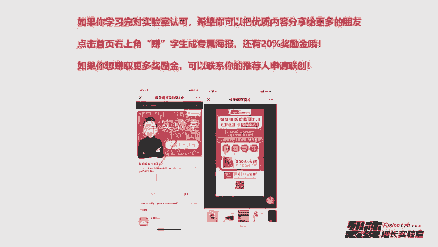

# 微社群裂变营销私域流量池增长秘籍创业运营销售获客视频课教程 合集 8套 374资料 13.1G 搭建流量循环体系的知识框架 - P6：05【流量入口】免费付费渠道置换技巧 - 高端网创试错赚钱大师 - BV1Hs421M7k3

🎼啊，不知不觉已经5天了。啊，大家感觉前面五节课的课程够干货吗？🎼如果现在让你评估那边实验室这个产品会员这个产品是不是一个好卖的产品？🎼如果买了的人买了，如果你推荐买了的人，买了这个产品之后。

他会不会感谢你？🎼所以当我们把产品打磨到这个模型之后，我们要干嘛？🎼我们要找到我们自己的流量入口和渠道，这是我们接下来要做的事情。那尽管前面我已经讲过了，说种子用户如何获取。🎼啊。

那为什么在这一节课我还会。🎼用一节课的时间去详细讲解流量入口和渠道呢。🎼因为呃我们可能。🎼把裂变作为一个很核心很核心的东西。其实裂变呢它并不是一个特别核心的东西，它只是一个技能性东西。🎼嗯，所以。

🎼流量入口和渠道呢它的重要性是什么呢？就是你已经把产品的模型打磨的很完美了。也就是说用户体验产品已经完全OK了。那我们如果加上找到我们自己的流量入口，再加上渠道的助推，这样会让我们的产品快速起飞。

🎼所以流量入口和渠道是一个很核心的节点，在助力你产品快速发展是一个很核心的节点。所以今天这节课的内容呢解决的问题就是呃当我们万事俱备的时候，东风应该怎么建？🎼你靠自己的靠自己的力量去裂变。

🎼你做的多么厉害，这些倒没所谓。🎼但是你你你想一下，如果我们就比如比如我自己我去做一次裂变，我做了涨了1万粉丝。好，这时候大家可能说呃1万粉丝也还好。但如果我邀请了10个QOL或者20个QL。

大家一块来助力去推一个呃活动。🎼他做的亿万粉丝太简单了，所以多么厉害的裂变，他都没有资源合力。就是大家支源聚集在一起，一块做一件事情，这来的来的快来的厉害。🎼所以今天这节课呢我我会分两个部分来讲。

第一个部分呢讲流量的入口。然后第二个部分我们讲渠道的技巧。🎼那关于流量的入口怎么理解呢？🎼是不是每一家公司他只要找到自己的流量入口，就能吃到一波流量的红利？🎼包括我们后面讲裂变的模式的时候。

也会讲裂变让哪些人抢占了呃这一次这一波的流量红利。其实有很多人是有很多公司就通过微信去裂变这样一个技能，嗯，他们就。🎼获得了很多很多的资源和流量。🎼所以他们就在这一波红利中就。🎼就吃到了这一波红利嘛。

🎼你可以先回顾几个关键词，比如说早期的派单红利投放红利，然后直播红利、自媒体红利，像今日头条大于号、百家号，这是在201716年末17年初的时候，这时候是自媒体的红利，对吧？然后后面又到了短视频的红利。

像快手、西瓜视频火山。🎼然后在后面是裂变增长的红利，包括今年今年大家一直在提的就是裂变增长。嗯，人人都在讲，无论做过没做过，人人都是讲师，都出来讲裂变增长。🎼嗯，现在呢呃现在到我们18年的年底的时候。

现在比较火的一个是社交电商红利。🎼所以在。🎼以上的这些关键词当中，其实我们基本上都经历过。比如说像直播，像自媒体、短视频。🎼然后再到现在的社交电商。🎼但这以上所有的红利其实我都没有赶上。

因为我没赶上的主要原因是什么？我可以跟大家解释一下，就是。🎼当这个风口来的时候，2000比如说自媒体红利，那时候是2011716年底17年初的时候，这个时候其实我我不具备这个风口的资源和能力。

所以我我就没有能能在这个自媒体红利里面赚到钱。🎼所以我们并不能感觉到遗憾。但是这个过程中啊，我得到了最宝贵的经验，就是对。🎼关于一个新的流量入口产生和红利的深入理解。

🎼再包括就是当我去理解流量和思考流量的时候，你产生的一种动顿悟。🎼这是这是我获得非常宝贵的呃一种经验。🎼那我现在把入口，我们把流量入口归为两类。🎼啊，第一类呢是线上线下流量入口。然后第二类是。

🎼免费付费流量入口。那我先讲第一类。第一类就是说线上线下的这样一种形式。🎼在我们去做流量的过程中，线上是比较轻的对吧？线下是比较重的。那线下线上呢一般是以虚拟物品做交付。就是以虚拟物品给到用户。

然后用户买单。那线下呢一般就是。🎼啊，真实物品。🎼然后去去给用户做交付。因为我们在做流量的时候，如果你线上也采用实体物品的话，你的流量成本会非常高。🎼那线上的流量入口怎么把握？嗯，做线上流量的人。

🎼就是他每一波红利都能把握的这这些人，他都具备一个特点。这个特点是什么呢？就是时刻保持期待性和好奇心。🎼呃，比如说什么呢？新浪微博玩家，你会发现在微信公众号领域一般也都是流量大佬。

🎼如果你经常去研究一些就是现在比较当红的这些自媒体大佬的时候，比如十点读书的林少。🎼然后视觉知的杀小皮。🎼你只要稍微拆解过，你都知道他们是靠微博起家的。🎼再比如玩公众号的玩家。

一般在抖音也能成为流量大佬。🎼嗯，比如我的朋友海云。嗯，我我11月1110月份见他的时候，他们才400万抖音粉丝。🎼然后到他发朋友圈的时候，是11月26号。

他们公司就已经完成了4000多万的粉丝10倍的增长。🎼所以线上流量入口，嗯，你只要吃到一波红利，后面的红利。🎼嗯，你基本上都不会让它跑掉，因为你确实从中从上一波红利中已经受益了。你知道下一波红利。

🎼你只要吃到你还能赚钱。那我们为什么每一个流量入口出现的时候都会犹豫，都是等别人做出来结果之后，就比如说像现在的抖音。🎼我我最早的时候，其实我们接触抖音是真的很早很早的。然后这时候我们不会去做。

我们会去等等有人通过抖音，比如说做了100万粉丝，那时候是唐倒鸭，做了100万粉丝。🎼然后这个时候你才会想去尝试一下，就你看到别人的结果了，你才你才想试一下。因为我们没有因为任何入口。

任何流量的入口获得的获得过任何的红利。所以我们不会去轻易去做尝试，因为你去轻易一个新平台去尝试的时候，第一个你不懂规则。第二个，你要熟悉这个app。🎼所以对每个入口的把握是否重要，我认为它是很重要的。

在1。0色情的时候，我每天群内都发嗯抖音怎么做粉丝的这样的精选的文章。🎼我们群里面其中一个好友就把呃群内发的所有的抖音文章全部收集起来，并且全部仔细阅读和拆解。

🎼然后他现在就能做到每个月做几百万的抖音粉丝啊，虽然变现并不是太多，但是。🎼就是通过这样一种形式。🎼然后他就能有一个自己所长的做流量的方式。🎼那我再说一下今日头条自媒体火的时候，嗯。

很多人在头条上赚了很多钱。那这群人对流量入口的把握就显得比较坚决嘛。🎼呃，比如说从最开始的时候，你们知道今日头条一般怎么引流吗？🎼我先跟大家讲一下2000。🎼17年初的时候，今日头条引流。🎼啊。

靠写内容送资料。🎼那这样一种形式，现在是18年12月份了，嗯，还还是有人通过今日头条送资料引流，到现在每天获取1000家以上加到微微信个人号的用户。你说这是技巧嘛？它并不是。

🎼这是考察的是一个人对流量入口他的趋势的把握。🎼你可以你要不相信你可以看下面PPT啊，这个PPT是我。🎼前几天刚搜索的。🎼就现在你搜索这个标题应该还是可以搜索到的1000套教师PPT。

🎼课件模板限时免费领，然后他的这个账号叫小学教学分享。🎼你会发现。🎼他也是通过送资料的，而且在下面他还还会理由说免费领取方式，关注头条号，然后通过发私信PPT可获得下载链接。🎼嗯。

那头条号现在有一个功能，就是啊关键词自动回复。你回你回复PPT之后，他会给你推一段话术，说让你添加他的个人号或者关注他的公众号。🎼然后通过这样的形式去引流。那你一篇文章如果曝光量比较大的时候。

其实这个流量是非常可怕的。我有一个朋友，他就。他是78月份的时候就开始跟我讲。🎼他做头条一天几百往往他的个人微信号上面去找，然后到后面慢慢的。🎼就是一天一两千一天一两千，他做什么粉丝呢？做创业的粉丝。

🎼所以如果你对这个流量的入口，你你去仔细研究。🎼啊，那每一个新兴的流量入口。🎼过来的时候，你基本上都能抓住这一波红利。🎼好，那关于今日头条的，我们后面会专门在那个外地实验室开一期。

就是今日头条怎么在这个平台上去做流量的课。我们实验室的会员现在不是都已经开通了这个会员卡吗？到时候大家都可以啊免费去听这样的一个今日头条的课。🎼好，接下来我们说先下的入口。🎼线下的入口。

我会在彩蛋中给大家一个详细的案例，这个案例非常的值钱。🎼而且我在嗯很多的二三线城市见到跟这个详细拆解案例的一模一样的形式在在做流量。🎼啊，你可以看PPT上面，这是我在17年中旬的时候。

然后就是这是我真实在路上遇见的。然后我当时就呃拍了几个照片。🎼他们就是通过送这个发卡的形式，小黄鸡发卡。🎼然后添加到个人微信号，其实他是卖减肥产品的嘛。🎼然后后面我就呃一直研究这一种。

因为你既然要做线上流量，你也要你也要去了解线下的这种流量怎么做。然后后面我就在艺人和曹政这两个人的呃小蜜圈里面就知识星球里面发现了一个很厉害的大佬。这个大佬呢，他就专门做这种。🎼宝妈的线下流量。

所以你从PPT上面可以看出来。🎼嗯，他他他上面有写到，他说他1。5块搞到粉丝，或者说一天做20万。🎼然后后面我就嗯给他发红包。添加了好友，不断。🎼嗯，去跟他聊，然后就问他他去做这个宝妈流量。

做线下的这个核心是什么？所以他就跟我讲了，我就把这。线下流量入口的核心是什么？我把它提炼成5个点。然后我把这5个点分享给你。嗯，第一个点呢，他做线下它是以二三线城市为主。然后他的目标地是什么？

就是人流量比较大的商场。🎼他就去人流的人流量比较大的商场。然后第二个，他的目标流量是什么？就是宝妈人群。🎼然后第三个第三个核心的点是。🎼嗯，他所有去工作的去引流的这些人员都会穿小丑的这样一种形象。

大家知道小丑的那个形象吗？就是话剧院里面有红鼻子，然后白脸，戴个花帽子，就是他会用这个形象。🎼然后第4个嗯。🎼当一个线下的用户过来之后。🎼因为他们也是送气球啊，送小黄鸡啊，送各种，反正就是送各种东西。

🎼然后如果这个人过来扫码领的时候。它会引导关注两个公众号。🎼你就这样想，一个用户既然过来少人，其实你让他关注一个，关注两个，他也没所谓了，他都会关注。🎼那第五个是最核心的这个最核心的地方在哪儿？

🎼你在第四个点的时候，他让关注了两个两个账号，你知道这两个账号为什么要让关注两个账号吗？🎼第五个核心就是跟第四个你结合一块想一下。🎼他一个账号是吸粉吸给自己，另一个字账号是吸粉吸给合作方。

这个合作方是谁呢？就是这个礼品的提供方。🎼能理能理解清楚吗？所以他用这样的一种形式做了好多好多的宝妈粉。你可以我们按产品流量和转化的形式来做划分。🎼嗯，这个人的产品是在哪搞的？他是找人合作提供的。

也就是说他送出去的所有是零成本的，他唯一的成本就是人工成本。🎼然后第二个是流量，流量的来源是哪？就是人流量比较大的商场。好，那第三个是转化，他跟我讲了，他转化的核心技巧就是小丑。

🎼就是穿这个小丑的这一套，然后去弄它的转化率就非常高。🎼好，那我们现在开始说第二种免费和付费流量的入口。🎼呃，免费流量呢我们可以忽略不讲。因为最后四节实操呢，我会专门讲，就是微信个人号裂变，微信群裂变。

🎼啊，以及任务宝裂变，以及它们组合之间的裂变。这样的裂变形式，在你有启动量的情况下，基本上它的成本是趋近于零的。所以在这个地方大家是呃先不先不用担心这个免费的流量。

包括我们在挖地实验室所有的这些呃平台流量的，基本都是通过免费流量去获取的。🎼那我主要说一下付费流量的入口。🎼付费流量呢一般是投放大家所了解的投放就是说在百度上投广告，或者说在微信公众号上面去投广告。

再或者说去。🎼呃，今日头条呃广电通这些就是投信息流的广告，对吧？所以我把投放分成两种，就是第一种叫投放购买。🎼投放购买的意思就是我们投诉一个广告，用户看完这个广告之后，直接花钱买了我们的东西。

这叫投放购买。🎼然后第二种叫投放添加。🎼投放添加是我们投广告出去之后，然后我不让他付钱，我只。🎼给一个诱饵，让他通过这个诱饵。🎼呃，看到之后添加我的微信，或者留下他的手机号，留下他的联系方式。

🎼那这两种区别很大的。嗯，投放购买的现在都过得很苦逼。🎼因为呃他没有承载体，所以他没有再次触达用户的机会啊。你听过前面课的话，你你在这个地方应该是能很明白的。🎼但是头添加的我我给大家讲一下。

这群人现在都活的很开心，因为他们有流量池。🎼嗯，头天家里面有一个非常非常有趣的玩法。这个玩法如果呃现在没人跟你讲，你可能你一直都不会清楚。很多人。🎼为什么这样做？🎼我以广点通为例给大家举这个例子。🎼呃。

有一家公司他做投放投广联通的目的是为了做个人号粉丝。🎼因为他家产品客单价比较高，对吧？所以他投放的时候想让这些用户添加到个人号。因为你只要客单价高，你只能通过一对一这样的嗯形式去做转化。

但是他投放的时候，他的目的是做个人号，但是他投放的时候投投的是关注公众号，在广电通上面投的是关注公众号。🎼然后在这个公众号上设计出答题。🎼啊，比如说在关注自动回复或者菜单栏或者消息任意回复的时候。

触发的时候。🎼啊，你一关注直接给你回复的就是个人号，然后一段话术加一个一个诱饵加一个二维码。然后你消息回错了，也是呃一个话术加一个二维码，或者菜单栏，你一点也是一个话术，也是一个二维码。

🎼所以在他不断投放的过程过程中呢，呃最后你会发现它相当于白捡了一个公众号。🎼因为他主要的目的是投个人号。如果就是这中间会有存在一个问题，就是他个人号的粉丝成本可能会上去一点。

但是他只要转化OK那他这个成本上去，他还能承受得了。但是到最后你会发现他会得到一个啊就相当于投放专门得到一个精准用户的公众号。🎼所以多个层载体在你。🎼就多个你设计多个成材体，在你有流量入口的时候。

你会发现它是非常非常重要的。🎼所以这样的一种投放形式呢。🎼很多人是不懂的那很多人现在头一个用户大概呃比如说祛斑，头一个用户都到130块。嗯，很多朋友找我买流量，说你只要低于100块。

我就你这边流量我就全要。但是我们一直没有做这种女性的流量。🎼好，那我们现在讲第二个渠道的技巧。🎼嗯ん。🎼就如果在转化可以的情况下，我们有太我们有太多的流量可以用了。就是你在测试过你的转化率OK的情况下。

你会发现。流量池太多了，有你流量的人太多了。🎼那这中间。🎼嗯，我们我们就是说。🎼怎么去用这些流量？它有一个核心的关键词叫置换。🎼嗯，第一种置换呢叫广告置换，这个是什么意思呢？就是我们写一篇文案。🎼或者。

🎼嗯，你做一张海报，以投广告的形式去找流量大户去合作。🎼嗯，在在前前一段时间有一个当红的案例，就是周佐罗老师。我不知道大家有没有听说过。🎼嗯，他出了一个新媒体的课程，就是呃。🎼199还是299块。

然后这个课卖了五六万份，就是通过这样投放的形式。你可以通过PPT看到他投放的文案基本是就是在不断测试过程中测测试出来一版转化率最高的文案。然后他一直在用这一版文案持续性的。🎼呃，在各个渠道上投。

🎼这个就是通过渠道置换的这样的一个案，广告广告置换的一个案例，他总共投了大概是50万的广告费。🎼你现在会发现周佐罗成了一个新媒体定域，很强很强的1个IP。🎼所以为什么我说渠道重要？

当你转化和产品都OK的时候，你会发现渠道是最牛逼的。🎼就以前有一本书叫渠道为王。对，这个才是最厉害的。并不是说我们做多少流量，这这样更厉害。🎼好，那第二种叫什么呢？第二种叫分销置换。🎼分销置换这个。

🎼这种完全靠利益驱动，就是目前在我们。🎼这个行业当中比较常用的就是什么呢？分销组队PK。🎼然后就是用两级分销的形式去做，就大家一块儿组队，然后PK。🎼嗯，在组队PK的这中间有一个嗯就比较核心的。

我把它总结为4个点。🎼第一个点呢是设立好处。🎼这个好处一般分为什么呢？就比如说奖金或者高分层或者层级分成。奖金的意思就是。🎼嗯，你当队长，你的团队如果排名靠前三名或者说前五名，然后你可以拿到多少钱奖金。

比如我我奖金设1万块，你的团队如果分销排名总金额占第一。🎼这1万块就归队长。🎼然后第二个高分嗯，然后就是说设立好处，其他的好处还有什么？除了奖金之外，还有哪些可以设置好处，比如高分层。🎼嗯，你做队长。

你可以拿到80%的分成或者90%的分成。🎼然后队员只能拿到20%30%的分成。🎼然后还有一种类型是层级分层。比如说你做了队长，你可以拿到两级的利润。🎼就是你的你这一级和你下级两金，你可以绑定他。

你可以拿他的利润。所以这个时候大家嗯都是队长是为什么他会去当，就是因为要么是奖金，要么是高分层，要么是成绩绑定，这个人才会去愿意做队长，他才会拼命的帮你拉下线。🎼啊，或者拼命的去组队。

搭更多的人进入他这个团队，来帮来帮你推这个东西。那第二个呢就是招募队长。🎼啊，招募队长就是用我们前面说到的啊设立好处。那招募队长其实。Niao。🎼一般招募队长是招招这种QOL有资源型的。

本身就有就有凝聚力，他能带来很多这样的呃跟着他一块去做的。🎼然后第三个核心呢就是队长招募队员。🎼嗯，队长招募队员的时候一般是。按一个团队来计算。🎼就是说我现在发呃比如说我是分销商，我现在做了队长。

我拉着大家一块，我说大家跟我一个队儿，然后我们来分销。嗯，如果我们排名第一，我把这1万块的奖金全部分给大家。🎼所以这个时候是按团队计算的那基本上就相当于队长担任起了这个维护团队的这个。🎼呃，这个职责。

然后官方其实是不用维护这个队员团队的。🎼然后还有一种就是绑定成绩绑定。然后我做队长招募队员，所有人要扫我这个队长的专属二维码，绑定到我的下面，然后你们的收益就会跟我的收益产生关联。就你赚钱的时候。

我也赚钱。比如说啊这分分认是两级分销，一级50%二级30%。🎼所以就是比如说二级你推销出去赚钱，我还赚钱，就是我是拿两级收益嘛？然后第四个就是启动分发PK。🎼嗯，启动分发一般都是大家会一块为了公平性。

大家会同一时间去推这样一个活动。🎼嗯，但是他比较厉害的是什么呢？因为他叫PK，所以他就会有这个团队之间的互相竞争。为什么？因为上面有一个奖金池。

他设计了1万块或者说呃更高的那这个时候哪个团队快超过另外一个团队的时候，那这个团队就不乐意了。他肯定拼命的再继续拉自己的队员，再继续去推。🎼所以这样的一种形式。🎼就形成了一种很牛逼的这种分销分销的体系。

分销推广的体系。🎼嗯，除了除了现在麦克的，他们经常用这种分销组队PK的这其实在任何领域都是用的。🎼所以彩蛋的部分我会给你一份详细的分销PK的设计方案。

这是我以前自己做的一个呃就是也是类似于我我上面给你讲的这四点的一个详细的呃P分销PK方案。这份方案是内部的，我希望就是大家拿到之后不要对外去传播，你自己看自己去学习就OK了。啊。

我们今天的核心内容呢主要是以流量的趋势的把握。🎼然后要建立自己的期待性与好奇心。🎼啊，你要相信任何一个流量的入口。🎼你当你说不能做的时候，其实都有一群做的很好的人在默默的执行。所以就比如说海豹裂变。

🎼我从2016年底到2017年到2017年初。🎼去研究这个东西。然后2017年到2018年，我是一直在做这个东西。你会发现朋友圈好多人。从很早的他们做微信群那边到现在都不做了。但是我们一为什么依然在做？

就是说。🎼嗯，就是我前面说的这一句话，就是说你说不能做的时候，其实都有一群做的好的人在默默的执行。🎼那我不敢保证我们做的是最好的，但是外面还有很多比我们更好的。🎼但是我就坚信这个东西一直能做。

所以我们就会一直在做。所以我才会做裂变智场实验室这样一个社群。因为我坚信裂变可以一直做。🎼那你今天需要做什么呢？就是按照彩蛋里面的组队分销PK的方案。

然后根据自己的产品或服务设计出来一套跟我给你的这个方案差不多类似的一套方案。但是由你自己来设计的这个设计的过程中要包含真实的。比如说奖金给多少，真实的奖金给多少。🎼然后分润分多少，这个都要按真实的。

你去往上面设计，你只有真实的设计一遍，你才知道。🎼后面你去实操的时候，他有多重要？那提交的形式呢是在裂变增场实验室的公众号后台回复提交这个关键词。🎼回复后，你会收到一份提交你内容的链接。

你需要以投稿的形式发送过去。🎼啊，因为发现很多人不会在简述里面投稿，所以我们专门做了一份啊简出投稿的操作模板。如果你不会的话，你也回复提交，可以收到这一份操作模板，按照操作模板去看怎么去提交这个呃作业。

🎼然后大家提交的内容呢，会有专门的人去处理啊，你提交的越详细，我们。🎼给出的诊断会越好。🎼好，第六天内容怎么获取呢？🎼第六天我们会讲三种裂变的洗盘模式。这三种模式是我。🎼呃，以分销为主来讲呢。

🎼所以第六天的内容是在裂本智场实验室的公众号回复06地日获取。然后今天的彩蛋关键词是你在公众号后台回复分销，你可以领到啊我自己写的这一份分销PK的方案。啊，如果你听完授益，希望你能分享实验室优质的内容。

给身边更多的朋友。点击首页右上角的转字生成自己的海报，现在还有20%的奖励金。如果你想赚取更多的奖励金，可以联系你的推荐人，申请联创踏入实验室的赚钱之路。

好的，今天的内容就到这里，我们明天见。

