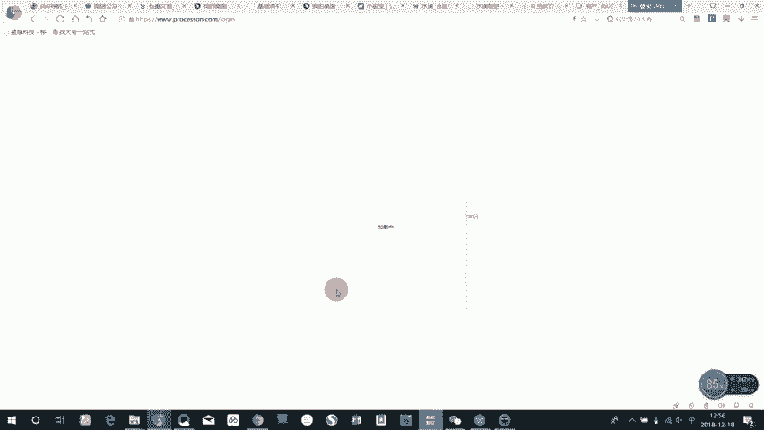
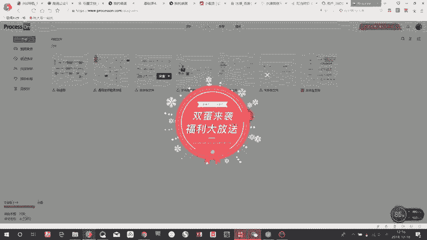
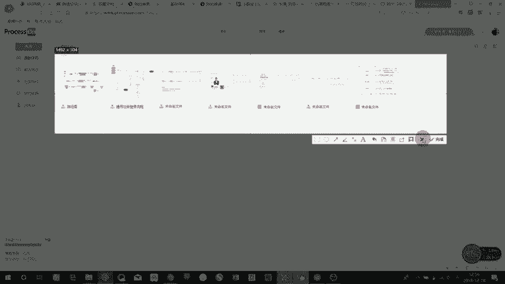
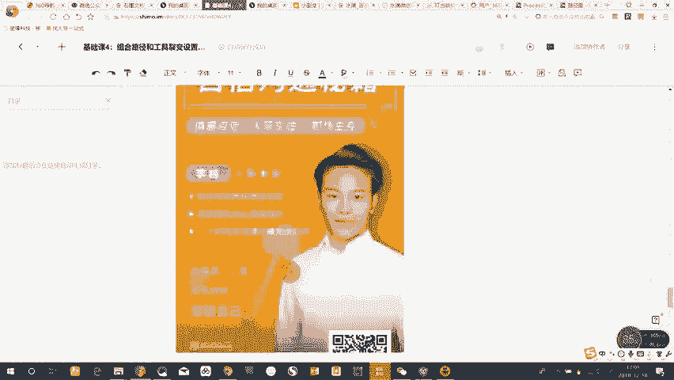
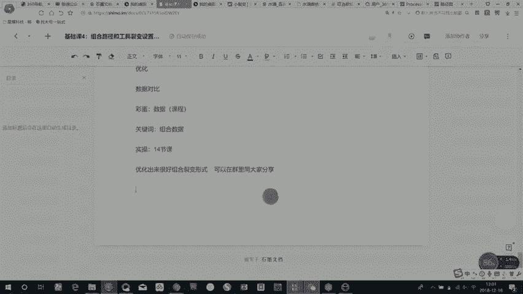

# 微社群裂变营销私域流量池增长秘籍创业运营销售获客视频课教程 合集 8套 374资料 13.1G 搭建流量循环体系的知识框架 - P7：20【基础课04】组合路径和工具裂变设置操作 - 高端网创试错赚钱大师 - BV1Hs421M7k3

🎼啊，这节课是我们最后一节课，就是基础课第十课。这节课主要讲的就是组合路径和工具的那边设置操作。等那讲这节课的时候，我们先把。裂变的。🎼啊，玩法。做一个汇总。啊，比如说现在微信群界面。

🎼这一种任务宝裂变。🎼个人方便点。🎼然后拼团。喧销。🎼じゃあ。🎼邀请。🎼还有哪些？有请助力抽奖。大致就列这些玩法。🎼那工具呢。我们前三个工具我做一个汇总。🎼啊，比如说这个工具分为微信机器。

🎼微险机器人工具。宝马。🎼啊，微信机器人主要通过什么实现WETO two。本。进群。微酒。あ。🎼要有管家。啥。🎼火马工具呢主要有炒料。不管。马语。🎼会有好吗。🎼然后拼团。可以用有的。🎼表额通。灯箱。啊。

天聊。🎼一直。有证。我的听。🎼这都是可以实现分销的。等一下。🎼砍价目前啊都是一些我们搜索一下。🎼好，这上面如果大家需要做砍价，你可以直接从百度去搜这样的模板。🎼啊，这个地方我们就不详细讲。🎼啊。

邀请助赁。邀请注意，这个大家可以去微请。🎼或者淘宝。🎼直接去找类似的。抽奖。🎼有些在小。🎼都两杯。🎼啊，然后还有一个微信第三方的叫第一。工号管理。🎼水泥公号，这个我直接给大家找一下网址吧。我。对。

这是它的网址。啊，通过以上我们去了解为什么我要讲组合路径和工具列边的设置操作。大型夜店活动。🎼一般都是组合路径。这的工具。🤧く。🎼所以整个流程是在你。🎼啊，熟悉完前面的微信群那变。🎼啊，任务宝那边。

🎼个人号裂变这些你要持续性去做，然后达造一种熟能生巧的这样的。🎼这样的一个境界。当你熟能生巧之后，你对路径的理解。🎼以及工具的理解。🎼会变得特别的深入啊，当你去对路径有了深入理解之后。

你才能达到这种路径之间相互组合。因为设计路径的时候。🎼我们需要强的强调的第一个核心点。参衣服。🎼你这个路径必须能让用户参与度高。第二个。🎼完成率。🎼你这个路径的完成率必须高3个。🎼裂变率。

🎼所以在这个过程中啊，一个路径他要满足这三个核心点参与度，你要让所有看到的人都想参加，让所有参加的人都想完成，让所有完成的人都都想裂变。🎼啊，对，那工具呢。设计工具有一个核心的点。第一个。

🎼你要根据工具的功能设计出最简单的。🎼路径。第二个。🎼根据工具的功能组合。🎼出来。🎼组合出来最有趣的，或者说啊完成率高，参与度大的这样的一个一个形式。所以啊他要满足的第一个是简单。

第二个是他们这些工具之间能随意的组合在一起。好，这时候我们讲。🎼两个案例。🎼你可以看这个路径图，点开海报，查按海报，扫描二维码。🎼然后用扫完二维码是关注公众号，关注公众号之后呢，弹出来的是影篇文案。

🎼对吧。🎼关注自动回复里面点我领出，然后你点击这一篇文案，扫文末的二维码，添加个人号，添加完个人号等待个人号回复拉群，告诉你报名的规则。🎼然后报名的规则是让你回到主页去搜索公众号，然后回复我要领出。

你回复我要领书之后，你会收到一个海报，加一个二维码，加一个海报，加一个话术。然后你复制发到朋友圈，然后截图截图回到群里算报名成功。🎼算报名，然后等待朋友啊帮你扫码助力，完成10个扫码。好。

你就可以进入这两个阶段去领书选书这样一个过程。所以你会发现啊这个这个过程中他用到的是三个工具的组合。第一个。添加个人号这个地方它要用维兔这样一个工具，个人号裂变的工具。🎼然后进入群之后。

🎼你去公众号回复，我要领书，这时候要用一个任务宝的工具。🎼然后当完成10个码之后哈，这时候又要用1个H5的工具，所以它这个。🎼通过个人好的东西。🎼加上。任务吧。我记。皆さん。H5。Thank you。

🎼所以呢我给大家看一下他们的实力海报。🎼这是他们的这一张送书的海报，然后做了这一个裂面活动。他用三重工具的组合做到了。🎼一张海报。🎼100半。🎼所以在这个工具组合的过程中，还。🎼在这工具组合的过程中。

还是看你啊怎么去把工具之间进行组合，然后设计出参与度完成率利变率都比较高的这样的一个流程。🎼啊，那在这个过程中，我给大家推荐这个工具。啊，这个工具呢是。🎼你去设计。🎼啊，组合裂变的时候。

你要去画的一个画路径图的。🎼一个工具，你通过这个画路径图的工具，你能够更直观的把你想想去做的路径，然后给展示出来。

🎼啊，你可以看到这是啊我们以前会画很多路径图。

🎼他的操作也非常简单，就是啊你通过拖动这上面呢，可以在这上面打字。🎼然后组合箭头。🎼对，然后他就会出来，大概就是这样，很简单。🎼这是我们以前组合工具做的一个这样的一个流程。

🎼所以大家可以通过这个工具去把这些工具组合的路径画到这这些。🎼路径图里面，那你这个画的时候需要注意的核心是什么？就是每一个节点。🎼你都要展示到图上面。

就是每一个你需要触发用户或者用户需要触发你的这样的节点，全部都要画到这个路径里面。🎼然后核心的点在下面啊记录下来。啊，这是我们曾经做的一个案例。🎼这个就是大概用上面我这个组合的形式。

然后去做了一天也有几万3万多的增长。🎼然后每一套你组合好的这样的一个裂变活动呢，你都可能可以把它作为。🎼啊，一个常规性的一个常规性的裂变。那我们组合完这一套之后就做出来常规性的啊，就可以用到很多领域。

🎼很多课程领域，然后一直用这样的形式作为一个常规的，然后来去做。所以在这个过程中。🎼每一次组合的测试，你尽量的去。🎼组合主要是为了检验。检验当你在不断的检验过程中，你要不断的优化。🤧优化的过程中。

你要做数据对比。🎼就是这里。🎼所以啊我今天再给你最后一个彩蛋。这个彩蛋呢。🎼我们专门对数据啊做出来的一个一节课，这也是一个视频。数据课程。🎼所以你在。🎼啊，这是我们基我们是组合工具。

是我们基础课赠送课的最后一节。所以你在页面组场实验室的公众号后台回复。组和数据。这个关键词。🎼获取这一节数据课。好。🎼那希望以后大家在听完课程以后，去不断的去实操。

🎼然后实操的过程中要不断的回顾前十四节课。🎼因为你前面听的前十四节课呢，中间是没有实操步骤的。然后这四节赠送的实操课呢，你要按照我去怎么设置的，你要去熟悉这些工具，去设置这些工具。

然后并且去操作操作的过程中，你要按前面十四节里面讲的理论，然后按这理论里面的东西去操作，这样你才能快速的掌握这个技能。🎼啊，后面如果。🎼你去提交问题，然后自己不断实操获取反馈的过程中，如果你优化出来。

🎼很好的。组合的。组合就变形次。可以。🎼在群里。🎼跟大家分享。🎼所以在群里只有大家不断的去实操，不断的去分享，然后不断的去交流。这一整个过程中，你才能把这一个裂变这个技能。🎼做的很好。

🎼好，我们今天的课程就到这里。

