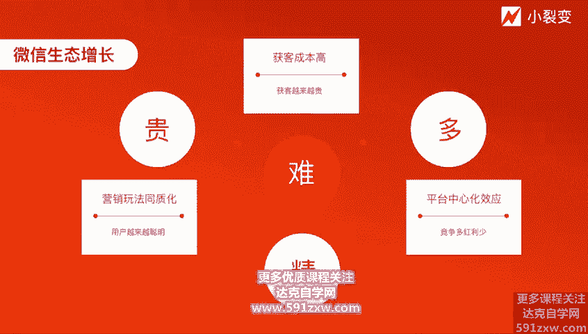
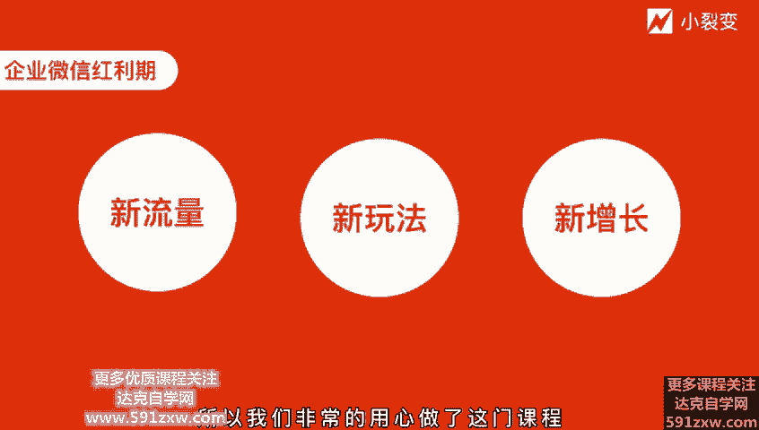
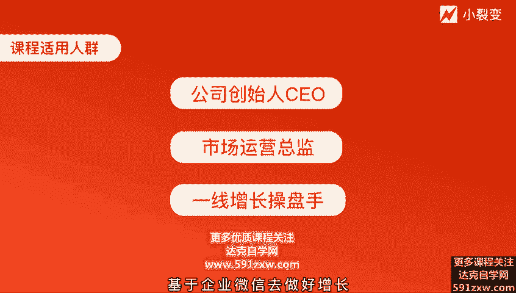

# 微社群裂变营销私域流量池增长秘籍创业运营销售获客视频课教程 合集 8套 374资料 13.1G 未来3-5年的新流量、新玩法、新增长 - P1：第00节：【启动仪式】未来3-5年的新流量、新玩法、新增长 - 高端网创试错赚钱大师 - BV1L1421k78g

，hello，各位朋友大家好，我是小六变的创始人张冬勤。非常开心和大家能够通过这门企业微信裂变增长实战案的课程开展线上的交流和互动。嗯，大家都知道小裂变是一家专注裂变增长的技术服务商。

通过运营驱动产品技术的公司。我个人呢也是一个喜欢做产品的运营人。在过去的实操经历中，3个月零成本那变增长了100万的精准粉丝，也曾4天零成本类变了10万用户。啊，是华为、伊利，还有移动等公司的内聘讲师。

目前带领着一帮90后专注裂变增长，通过我们小裂变旗下的公众号裂变、小程序裂变、企业微信裂变、分销拼团裂变、社区裂变、个人号裂变等解决方案服务了1万多家企业。

覆盖教育、电商、零售、餐饮、医美、自媒体、旅游、生鲜、文娱、家居、人工智能和金融等行业。累计帮助我们的客户节省了75%的营销成本，获客效率提升了10倍以上。啊，全网的裂变粉丝客户呢接近9500万家。啊。

所以我们的公司使命是要帮助企业低成本、高效率指数级类变增长的。因为这种使命也呢也形成了我们这家公司独有的文化。叫做相信增长的力量。所以我们团队永远是在微信生态内走在最前端的，也永远第一时间去了解。

深入研究新流量和新玩法。在过去两年多的时间呃，我们也发现。一家公司在微信生态内做增长也越来越难了。啊，因为它主要体现在三个方面。第一呢就是获取用户成本越来越高啊，变得贵了。另外呢。

第二点呢叫做平台的中心化效应逐渐明显，竞争多，红利少。

第三呢就是。在做流量做营销活动的过程当中，我们也发现用户越来越聪明。对于同质化的活动呢，形成了免疫力，大家都在寻找新的流量。尤其是经历了今年的这个疫情后，很多传统企业，中小商家机构是过于依赖线下的。

线下业务呢也受到了重创。所以我们小利变这个团队也在思考，那我们要帮助截去低成本高效率指数级的裂变增长。那么新的流量洼地到底在哪里呢？我们在新的流量洼地上面如何再进行去裂变呢？

我们经过大量的这种测试啊、调研观察分析，以及和企业微信官方团队的交流，我们得出一个结论，下一个新的增长点在企业微信。所以我和团队耗时半年多的时间研究企业微信，开发企业微信这边系统。

直操企业微信获客活动等一系列实战后，我们更加的坚信说企业微信真的是下一个时代的新的业务增长点。啊，他在面临风险的时候，我们能够通过企游信将用户。线上化啊，将企业的资产数据化。

那么企业微信呢也是当前时下比较流行的叫做私域流量的运营的正规军。啊，所以我们为了让已经在微信生态内做业务的玩家早点意识到。企业微信的红利。发现基于企微性的增长文法。可以对自身的业务带来新的增长点。

我们认真的做了今天的这样一门课程。我们也为了帮助更多的公司实现这种数字化的转型，拥抱私域流量运营的珍规军。我们用心的做了这门课程。所以非常的恭喜你能够看到这门课程。

这也许是目前为止行业内最全面讲解企业微信获客增长的课程了。相信我这门课程的内容可以帮助你比他人先一步抢占解微信的红利，也可以先一步实现业务增长的突破。那么我们团队同时在做了大量的实践之后。

我便调研了一下当前整个市场在对企业微信拥抱的这样个态度到底是怎样子。我们在6月中旬的时候，做了一场内测调研，收集了接近3000家的一个调研信息。我们看看当前大家到底使用企微信的深度如何。

对企游信又是否真的了解。我们发现有41%的企业还并没有开始使用汽油信，那只有43。5%的企业在尝试使用中，主要呢还是用于公司内部的办公使用。那有21。7%的企业是已经计划全面使用机油性了。从这组数据啊。

我们可以看出，大部分的企业还没有真正的意识到企业性的重要性。尤其是很多朋友、老板、一线的增长操盘手，甚至都不熟悉企业微信的功能，不清楚如何具体使用去运营。

更不清楚如何用企业微信去裂变获客规模化的增长词域客户。所以基实这样大背景。企业微信当前还是属于一个空前的红利期的。啊，行业变化呢是非常之快。一家公司要想持续的增长。

必须是在战略和战术上都有持续的迭代能力。那个人要想有持续的增长的价值呢，也必须要提早拥抱金物种。当新的变化，新的趋势出现的时候，总是不那么容易被接受的。但当我们真正的去拥抱研究它的时候。

一定会大声说出真香。嗯，所以我们。非常斩钉截铁的告诉大家，企业微信它未来将会是呃3到5年甚至更久的新流量、新玩法、新增长的战略要地，值得我们尽快的去参与进去。所以我们非常的用心做了这样一门课程。

就是关乎啊这个未来增长的一个议题，甚至说是关乎增长的议题。它是一家公司老板一把手的这样个工程。

所以这门课程呢也非常非常建议我们的公司创始人CEO去听，也特别特别建议市场运营总监去听，更建议一线的增长操盘手去听。企业微信裂变增长实战课程的底层思考呢源于我们对于微信大生态营销的变化认知。呃。

这种认知呢也的的确确催生了我个人啊，对于这个呃微信大生态增长变化的一些观点的一些理解。我希望能够分享给大家，让大家去尝试着去呃理解这些变化。因为只有理解这些背后的变化。

我们才有可能有决心的去基于企业微信去做好增长。

那分别是哪些观点呢？第一个就是在宏观上，因为这几年私域流量这个词很火嘛。那第一个宏观上的观点，我们认为私域流量将会向私域流量的一个升级转变。那用户运营呢也将会向客户运营的一个升级转变。

它虽然是两个字的变化，但其实背后的理念。经营理念的变化啊是非常明显的。因为我们不再把用户简单看成可以反复被收割的流量，而是更多了一些服务意识。客户关系才是第一生产力。

因为企业微信它打通了12亿微信用户的背后核心，它是服务的理念。用户不再是没有生命的流量，而是愿意认可品牌方的有超级消费能力的客户。啊，所以我们经常会说将品牌营销的啊五不曲，从用户认识你到了解你。

到啊认可你，到分享你，到传播你啊，的这个过程也是整个私域流量运营的一个背后的中心思想。我们每一个企业的员工啊都应该重视手上的客户精细化的运营管理，持续的呃这个呃去传递价值。好。

那第二个观点呢则是在微观上的微观上的观点。我们认为企业微信群将会基本取代社群营销。带有公司营销属性的群呢，将会基于企业微信去创建运营和管理。啊，原因呢主要是因为像个人微信群。

它是太依赖于说过去的一些第三方群供软件的群供软件已经被封杀的基本差不多了，而且是违规的，是有风号风险的。所以说呃大家一定是不要去再用了。那第二呢就是企业微信的个人号将会基本取代微信个人号营销。

以公司销售导向的客户链接将会基于企业微信去获取客户，触打客户、运营客户和管理客户。这里其实很明显的信号就是每年微信官方都会封杀那么一两家去做这个个人微信破解的一些第三方的工具啊。

它是呃走了一些微信的协议啊，它是官方不允许的。所以说啊很明显释放个信号，企业微信才是真正的正规军，大概率上啊企业微信的营销，基本会取代微信的营销而，微信呢它还回归它是一个生活方式两个理念啊，更多的会。

变为说大家在这里分享交流，甚至说传播活动的两歌渠道而真正的流量获取的中心则会集中在企业微信。第三个观点则是对于公司它的样一个变化。因为任何一家公司都要搭建规模化的企进群，群内变群交易群转化。

所以我要规模化去搭建这个事情。更要规模化的获取企业微信的客户联系人，建立好友关系。实现企业的员工和客户用户之间的一个联系，而不单独的像之前一个用户访问小程序，或者关注公众号粉丝。

这样的一个弱词语关系呃是变成好友的这样一个强词语关系。我们已经看到了这个非常突的案例了。比如说这个。当前这个中国最大的便利店易捷对吧？易捷它是中石化的旗下的一个一个一个品牌。

也是非油品领域的一个成功尝试。这也是中石化近年来探索的一个重点。因为虽然加油它是刚需，但是加油站呢它受限于地理位置，如何去突破物理位置的限制，提高用户的留存率，寻找新的销售增长点，它成了一个议题。

所以中石化的这个一节，他就通过企业微信直接添加客户的个人微信。啊，沉淀客户资产。也让加油站开展更多样化的线上运营，提供了更多的可能性。其实据官方统计，仅仅6个月的时间。

这个一节的广东的这分公司300多位加油站的站长就通过企业微信添加了近百万车主，并创建超过1000个车主社群，大大提升了加油站整体的运营效率和服务体验。用企业微信拉群定期发一些福利啊、活动啊等等。

甚至说用客户朋友圈的功能进行活动预告啊，让广东省300多家加油站累计发送优惠券，超过了5亿张，直接带动了中石化一节便利店超过1。8亿的一个营收，这还是非常非常可怕的对吧？原来这是一个空的一个业务板块。

但是把它做成线上化之后，把用户留住了之后，它能够做二4变现。所以，拥抱变化，早点自我革命，对于我们每一家公司来讲至关重要。企业微信的这一波是对于我们中小企业公司来讲是大机会。

越大的公司其实越难具备全面拥抱的决心的啊，尤其我会发现你在微信端的流量做的很好的这些公司很难去尽快的拥抱企游性。但这已经是一个趋势。我们中小公司传销好的好掉头，尽快杀进去。第四个观点则是对于个人的。

对于个人来讲的话，我们要超级的熟练的使用企业微信的各种功能，超级快速推动拥抱第三方工具，帮助企业微信那边获客精细化运营管理。更要超级懂得将业务形态和结构性的营销去结合起来。我们在运营的过程当中。

不光要用户的数量，也要用户的质量。另外一点呢就是啊要具备超级综合的运营综合能力，把原有的运营知识灵活运用，不必多说，更要多懂一点。企业微信的产品细节、技术细节和销售知识。

因为在未来这种基于企业微信的客户运营运营的销售化和销售运营化，将会逐渐体现在公司的企业微信营销的战略当中。过去运营，我们去做获客啊、拉新啊、存活啊、留存啊等等就够了。但是基于企业微信呢。

我们要为销售和转化去负责任啊，销售和转化呢也一定要有一些用户运营的一些思维在里面。所以在接下来的课程当中，基于上的4个观点，我将会逐一的去展开。将会通过三个篇章。

十5节课为大家逐一的去讲解企业微信裂变增长实战的课程内容。啊，分别是有三个篇章。第一个篇章是企业微信的功能实战篇，五大功能精细化运营企业微信私域客户值。第二个篇长是企业微信的裂片获客篇。

三大裂变玩法抢占裂变增长红利。第三个是企业微信裂变复复盘案例片，大行业可复制的增长套路。这15节课给大家讲完之后，大家就能够回过头来去理解说企业微信对于啊这个宏观上的变化以及微观上的变化。

还有对公司的变化，还有对个人变化，它带来的时续化的影响，而这种影响将会影响未来3到5年甚至更远中心的希望说各位能够有所收获。因为企业微信它的迭代非常非常之快。

我们要及时的去跟上这门课程呢也并不是说教制的教学啊，是一种分享式的交流。我将毫无保留的，将我个人和我们团队在产品研发和给客户服务的实战过程当中踩过的坑，总结出来的经验全盘托出输出给大家。

争取打造出一份可复用的可落地的可直接去执行的基于企业微信的利变增长的这样个方案给到大家拿过去直接去用。所以衷心的希望各位能够有所收获，获得新的流量、新的玩法和新的增长。好，感谢大家。

我们接下来将会开启我们的课程内容。好，下节课再见。😊。