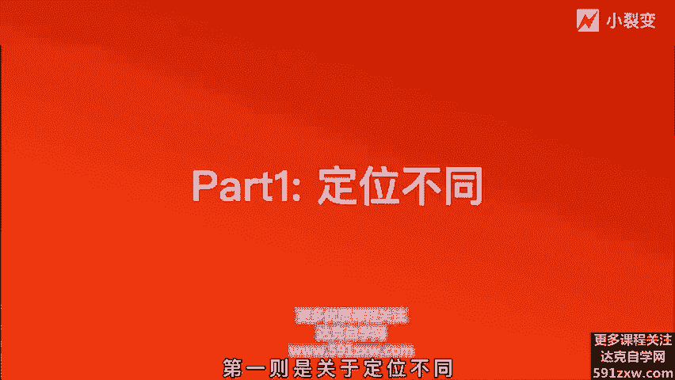
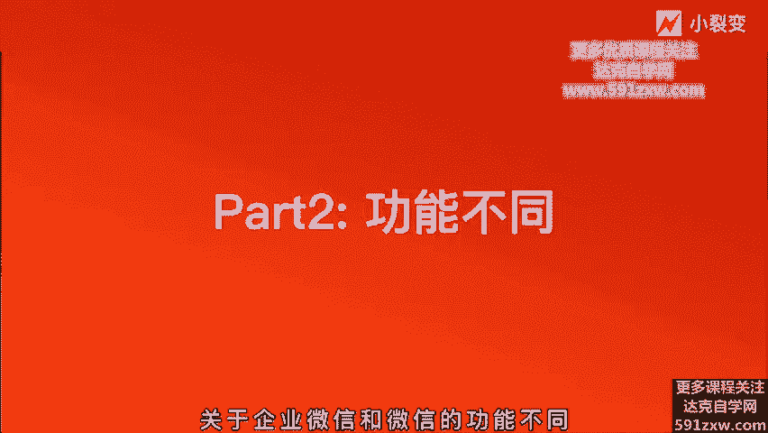
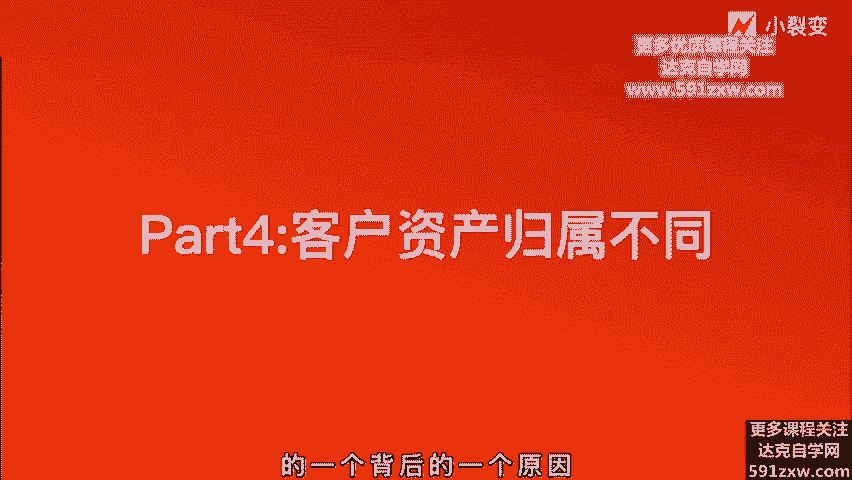

# 微社群裂变营销私域流量池增长秘籍创业运营销售获客视频课教程 合集 8套 374资料 13.1G 未来3-5年的新流量、新玩法、新增长 - P2：第01节：【认识了解】企业微信与个人微信的区别 - 高端网创试错赚钱大师 - BV1L1421k78g

hello，各位朋友大家好，我是小猎店的创始人张冬晴。今天我们正式开始企业微信裂变增长实战课程的分享。呃，企业微信呢已经逐渐被大家所接受了。就像刚开始开篇词，我给大家讲的那样。

已经有很多企业开始拥抱企业微信。应用到企业数字化转型的工作中。那么写业微信到底有什么优势呢？它相较于个人微信，写微信又有什么不同和它独有的一些特点呢？我们的第一堂课主要是来讲一讲连微信和个人微信的区别。

那主后我们会分为四个部分给大家去讲解。第一则是关于它的定位不同，第二则是功能的开放程度不同。第三则是链接客户的体验不同。第四则是客户资产的归属不同。让我们来一一展开吧。

企微信呢它作为其微信官方的客户服务工具，是唯一能够与微信互通的办公商业工具。这也是企微信它官方呈现出来一个观点。他在链接12亿微信用户的时候，具备了四大特点，分别是第一企业微信。

它的添加客户好友是无上限的。第二。协微信的运营工具非常的丰富，接口非常的开放。那其三则是企业微信，他的员工即使离职了，客户则不会流失。数据资产属于企业。第四，用企业微信的时候会更加的安全，更加的可信赖。

不像是个人微信一样。在服务过程中嗯显得不专业。所以有这样一个四大特征。那基这四大特征，我们去分别看一看它的企业微信和个人微信的之间的一个区别。第一则是关于定位不同。

我们都知道啊，无立性的底层定位是社交软件，一切功能的出发点呢都是为了改善用户的社交体验。对于影响用户体验的营销行为会严厉的禁止。所以，采用个人微信进行营销，是有极高的封号风险的。所以我们也看到。

近几年来微信内的营销打击其实越来越严重了。而企业微信的定位呢，则是企业管理工具。是微信官方的客户服务工具，面向企业内部管理的同时，也会面向外部客户管理。让每一位员工都能够成为企业的服务窗口。啊。

所以企业微信它是允许甚至鼓励企业基于企业微信的开展营销行为，而且是不用担心账号被封的这种风险。尤其是2019年企业微信发布了3。0之后。腾讯官方也将思域写入了财报。企业微信呢作为私域运营的最佳工具。

是帮助企业管理客户得成为一种大势所需。所以基础基于这种定位，我们就不难得去发现一家公司想要去做数字化转型，想要去链接深度的用户关系的话，CON则将会是未来的首选。那第二则是关于企业微信和微信的功能不同。

因为微信的定位是社交，对吧？关于营销的功能呢也会有所欠缺。比如大家急需的一种机器人啊、群发啊、快捷回复啊等等，这都是微信所不具备的那企业微信经过几次大的更新之后。

目前已经有了客户联系人、客户群、客户朋友圈群发助手等等，具备营销功能的这些能力。

这些能力分别在以下几个点呈现出来。第一个点呢就是好友上线。微信的好友上线是5000人。超过5000的这个用户啊，只能用于聊天，无法查看朋友圈。

所以大多数的公司会给员工配专用的手机以及多个手机号来注册公众微信。其实这是无形的增加了公司的运营成本。最重要的是，现在个人微信，他的好友一旦超过3000人，朋友圈也会容易被限流。

你发了朋友圈也只是一部分人能够看到。当你的好友超过5000的人人的时候，你再新加好友则是无法互相查看朋友圈的那企业微信它就很明显的一个优势是说他的客户好友无上限，可以不断的去申请扩容。

当你的好友刚开始到达5000的时候，你可以继续申请添加啊，可以扩到2万。那企业微信你的同一企业，你的员工的所有的好友量呢则是没有上限的。所以说意味着企业在获客方面是不会受到平台方限制的。

也是非常大的一个利好。企业则是一个活马系统。像个人微信的话，我们经常做营销的时候，给个人微信引流啊，一旦你的渠道曝光非常之大，你的流量进来比较多的时候，你的一个人客服是无法去承接这部分流量的。同时。

个人微信也不能够啊批量的去通过好友，也会容易被封，那则会依赖一些第三方的工具去生成活马去实现自动分流。但是企业微信它会自带这种活马功能，而且它不光是可以给客服进行活马的分流。

同时也还可以给客户群进行活马的分流。群活马和客服活马都可以具备。而且这是企业微信自带的这种活马能力。其三则是群发助手。嗯，我们用个微去做营销的时候，经常要做群发。

而且每次群发呢要只能选200个I一个一个点去选，非常的低效而且发起来也是比较痛苦的一个事情。你发到1000个人的时候，可能微信就限制你不让你群发了。但是企业微信呢它只自带客户群群发的能力。

批量选择200人啊，每天都可以去群发，而且不会受限制。同时你作为最大的管理员也是可以给所有员工的所有客户进行去群发的啊，同时企业微信也可以针对自己的客户群去进行群发。我们都知道。

个人微信针对群群发的时候，一次只能选9个群啊做规模化的群营销的这种公司是非常痛苦的啊，但是企业微信则具备了一键选择所有客户群群发的功能，而且非常非常的高效。这是作为社群运营人的一个非常大的一个呃福音吧。

其三则是。呃，关于个人微信和企业微信一些群机器人的功能的一个不同。个人微信呢如果想在群内做到自动化，或者说添加之后自动回消息这种功能的话，只要依赖第三方，而且非常容易被封号。

那那企业微信呢则是不需要依赖于任何第三方的。因为企业微信他自带这种机器人功能和自动回消息的功能。当用户成功添加企业微信的员工号时候，可以设置自动推送条欢迎语，类似于公众号的自动回复。

也可以针对企业微信客户群内的群设置群机器人功能。当群内的用户艾特机器人或者管理员的时候，可以自动回复关键词，也可以自动发送事先设置好的一些话术，可以结合群活码实现群里边的效果。😊。

这个我会在后面的课程给大家去重点去讲企业微信群是如何群裂变的。如何运用自动化的这个群机器人去实现规模化的群的一个裂变的这样一个玩法。那再者就是个人微信和企业微信。

它还有一个关于快捷回复语的这样一个功能的区别。因为企业的微信的话，它是有。聊天的侧边栏功能。在侧边栏呢可以去创建一些快捷与回复。同时呢对内提高了员工的一个工作效率。

对外呢也大大提升了客户的一个呃运营的一个温度感。因为当用户添加过来的时候，我们可以事先把一些用户的问题创建好，在快捷与回复当中，可以第一时间去给到用户，也会让用户觉得说，哎，你不光啊这个很智能。

而且回复的效率很高，它是一种温度的感觉在里面。那第三部分第三部分这是企业微信和个人微信在链接用户体验上不同。以上两点主要是讲的是功能上的不同和定位的不同。但第三点，我个人认为他也是非常亮眼的一个地方。

就是在用户和企业的员工在链接的时候，他的体验感。以前我们用个人微信去链接用户的时候，就像这张们PPT的左边这张图一样，他看到是一个个人，对吧？那对面是是一个什么样的人，他有没有被认证，他可不可碰。

用户是不知道的。但是相反，用企业微信去服务客户的时候，他则会拥有企业微信的独特认证。啊，企业微信需要对公司主体和个人进行实名认证。一旦企业微信和用户建立关系之后。

用户则会看到企业微信员工他的主页有企业的简称标识，形象则是更加专业的，而且是有效的增加了用户的信任度。这一点是非常非常呃。值得我们去关注的一个点。因为企业微信的主页，不光能够实现呈现你员工的头像。

你所在的企业，还有他的姓名，还有他的职务和他变化，都可以呈现出来。让用户觉得是一个非常可信赖的。但在不管是沟通，还是进行商业上的一些合作，都会觉得对方更加的专业啊，而不是一个个人一样，可能随时会跑路。

或者随时会把用户删掉的这样一个感觉。但是企业微信他的这个呃个人的这个主页呢还是无法展示朋友圈，用户不能更好的去了解员工和产品，这他也是一个比较大的一个缺失吧。啊。

不过好在呢我们小这便已经上线了关于朋友圈展示的功能。用户可以添加到员工号之后，会有显示这一个朋友圈的入口，也可以去更加的了解啊企业的一个员工的一些状态。那这是第三部分是链接用户体验的一个。

不同整体上来说，企业微信去链接用户的时候，它的专业度和体验感相较于个位有大幅的上升。比如说像这张图啊，当企业微信去发朋友圈的时候，他也能够展示在用户的啊朋友圈的这个信息流里面。

同时呢也可以去查看企业微信的历史朋友圈，通过小利变的这个朋友圈的功能入口啊，则是可以实现去查看员工的朋友圈功能的。第四部分则是客户资产归属的不同。这一点我认为是最最重要的一个不同点。

也是我们要强烈建议大家去拥抱企业微信的一个背后的一个原因。

嗯，因为我们在做私域运营，在做增长的过程当中，以前用员工去啊承接客户。如果一旦员工离职的话，所有的用户资产全被带走。而且是非常非常痛苦的一个事情，是吧？好一点的话，可能用员工还会把这种客户资源共享。

但是如果说啊闹得不很愉快的话，员工直接把用户带走，这是非常非常啊常见的一个问题。那么呃所以很多员公司啊也会采用说给员工注册工作微信啊，买了很多大量的手机，注册大量的微信号啊。

但是这就无形带来了成本的上升。那么企业微信就专注这样问题，的很好的去解决了。啊，就是与企信下面的员工所添加的客户啊，所有的这些客户关系和用户的资产都是属于企业的。即使说员工他去离职了。

那员工上面的好友关系也可以一键平滑的迁移到啊其他的员工身上啊，企业管理员工，这可以将离职的员工的客户和社群分配到其他的员工。甚至说员工在职的时候，这种客户资产也可以由公司统一去分配管理。

比如说员工A他有很多客户，但是他并不是很努力去维护客户去服务客户。那公司则会可以直接在企性的后台，将他的客户资产分配给到员工B。那因为员工比他很努力，很需要去服务客户，那公司的角度是可以这样去实现的。

实现客户的一个流动。一旦客户流动起来，整体的效率也会提升。而不是说你的员工把持了那么多的这个客户量又不作为，又没有绩效，没有服务。那这则是公司无形的一个损失。所以说这第四点，关于客户资产的归属啊。

啊非常非常的有必要性在我们运营运营大量的私域客户时的一个管理过程当中。企业微信是无疑是这个呃工具的一个首选，以上则是微信和企业微信的不同，分别是功能的不同。定位的不同，然后链接客户体验的不同。

以及客户资产归属的不同。基于这四个不同的点，我们也可以。得出一个非常非常代表官方的这样一个结论。那企业微信是去中心化私域运营的最佳的平台，这是符合腾讯大战略。

符合企业微信当前定位toP市场的这样一个重点的一个角色的一个诠释。尤其是教育行业啊，零售行业，还有电商，甚至说未来一些传统行业，我们在运营私域客户池的时候，不得不去选择企业微信。

因为这就是官方的推出的这样一款工具到大家去使用，我们不要再去想说用一些第三方的破解的一些工具。第一，他们不够安全。第二，他们会啊不够稳定。好。

今天呢主要是给大家讲解了呃第一门关于企业微信和个人微信的区别。我们下一节课再会给大家去阐述呃。企业微信它的独特的功能，关于客户联系人这一个功能。今天课到这里。好，我们下期再见。

