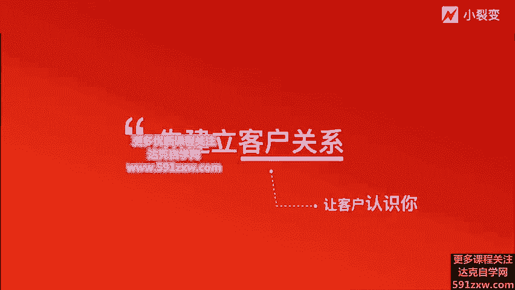
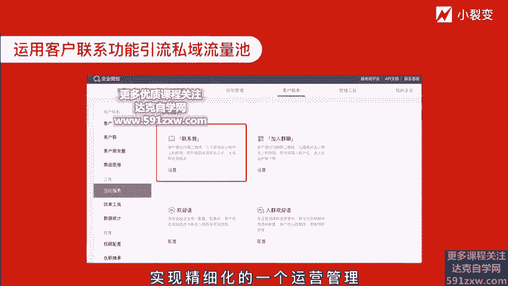
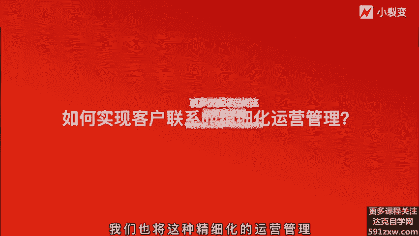

# 微社群裂变营销私域流量池增长秘籍创业运营销售获客视频课教程 合集 8套 374资料 13.1G 未来3-5年的新流量、新玩法、新增长 - P3：第02节：【客户联系】运营好私域客户，让客户认识你 - 高端网创试错赚钱大师 - BV1L1421k78g

hello，各位朋友大家好，我是小裂变创始人张梦琴，欢迎来到企业微信裂变增长实战课。😊，上节课给大家讲到企业微信和个人微信之间的区别，其中提到很多企业微信独有的功能。这些功能在私域运营过程中非常实用。

不仅安全可靠，还能大幅的提升运营工作效率。从今天开始，我们将逐一揭开写微信那些超神功能的神秘面纱。企业微信到底是如何在私域客户运营中发挥作用的？分别是企业微信四大重点私域功能。

客户联系客户群、客户朋友圈、产品图册加对外收款等四大私域功能。也分别对应着品牌营销中，用户从认识你到了解你，再到想起你，再到认可你的这四个步骤。那么本节课的重点呢则是。企业微信客户联系运营好私域客户。

让客户认识。大家都知道，思域的第一步就是要建立好友关系，想客户联系。实话说的好，客户关系是第一生产力，不建立好友关系，哪来的客户关系呢？所以第一步要做的就是通过客户联系功能，让用户加好友。

引流私域客户时。自从微信和企业微信打通之后，微信的用户是可以通过扫码群添加主动添加企业微信成员为好友。企业微信被动添加和主动添加客户都是毫无门槛的事情。

让海量的客户通过扫企业微信的联系我二维码，主动添加企业微信的成员，就能够快速的引流私域流量池。那比如有线下门店的企业，可以将企业微信的联系我二维码。印刷在海报上和工卡上。有线上资源的企业呢。

也可以把联系我二维码放到公众号、官网上，甚至投放朋友圈的广告。那比如说我们在做线下活动的时候，就会将企业微信联系我的二维码印制出来，放到传单上，放到书籍上，放到这个易拉宝上等等，实现线下的引流。

值得一提的是。企业微信的客户联系我的联系我二维码功能是具有活马能力的。当企业线上线下客源密集，或者在做营销活动过程中，大量的客户涌入。一个人是无法很好的服务好新客户的这个时候呢。

便可以启用联系我二维码的多人码能力。配置多个不同员工，客户扫码后随机添加到其中某一位员工，保证再多的客户也能够及时送上服务。而且可以实现不重复，既可以降低员工的服务压力。

同时呢也可以保证客户的精细化运营管理。这个功能还是非常之实用。那么如何生成联系我二维码呢？首先，在员工的手机端。提微信的工作台联系我。就可以生成自己的企业微信二维码，客户可以随时添加。

无需手动通过好友申请自动通过。就像这PPT的这个步骤一样，可以生成联系我二维码。那么同时管理员也可以在企业微信的后台生成联系我的二维码。在企业微信PC端的后台，客户联系我和互动服务这个功能栏点开联系我。

便可以删成带有活马能力的联系我的二维码，让客户先成为企业微信的客户联系人，成为合伙关系，做到分流精细化的去服务，可以高效的提升服务成本。那么接下来再通过客户联系的能力，实现精细化的一个运营管理。

我们去看一看到底如何实现客户联系的精细化运营管理呢。

我们也将这种精细化的运营管理分为四个步骤。第一步则是使用企业微信的自动欢迎语功能。在用户被添加完成后，向企业微信的好友发送欢迎语，迅速和客户建立服务场景。那自动欢迎语可以由企业统一配置。

配置后，客户将在添加成员为联系人后收到该欢言语。当前自动欢言语的功能设置可以在企业微信的后台直接配置。当然，也可以通过我们的小类变系统的后台配置实现。因为企业微信的自动欢原语功能，它当前只支持两条消息。

文字消息加图片，文字消息加小程序以及文字消息加网页这三种形式。结合我们小这边的企游新这变系统的好友欢迎与功能呢，则可以针对不同部门的不同销售配置不同的欢迎与内容，可以在不同的客户服务场景下灵活使用。

比如说你的销售一部和销售二部，他们负责的业务模块是不一样的。那么用户添加过来之后，那么理论上的服务场景和话术也是不一样的。所以说小店变的企业微心那边后台才可以实现这种个性化的设置。

从用户添加过来的那一刻，服务就要开始了。不论是优惠券、会员卡还是折扣商品链接，我们都可以通过设置为欢语第一时间触达给客户，建立服务场景。这是在精细化运营管理当中的第一步。

要通过欢语去提供温度的这样一个服务。那么第二步呢，则是通过快捷回复功能，提前设置好欢迎语，迅速帮助客户解决问题，去定位客户的需求。

企业也可以为成员统一的配置快捷回复。当然，成员更可以自己添加。添加后，成员可以在与客户的聊天过程当中去使用。当前企业微信只支持文字消息，可以结合我们小裂变企业微信那变系统去设置不同类型的快捷与回复。

因为我们的小裂变的企业微信那变后台可以支持企业话术库内容为多类型。比如说这个图文，还有文档，还有链接，这种非常丰富的样式。当客户咨询非常多的时候。

我们的销售服务人员是非常难以快速逐一回复解答问题的那这个时候应用到快捷回复功能的话，就可以将知识库提前创建好，及时的给用户得以反馈。

比如提前将产品问题啊、课程问题啊、销售流程啊等相关场景制定好话术放到整个的快捷回复栏这个过程当中，尤其是我们小那边的企业话术库。你不光是可以放不同类型的话术。同时还你可以在不同场景下做不同话术的分组。

比如说客户想咨询某个产品的时候，你可以发产品介绍相关的话术。当客户想了解公司的时候，你可以发公司的相关的一些介绍和公司的实力。当公司客户想和其他的产品做对比的时候。

你则可以放出一些客户的证言去更加让用户信任你的品牌，信任你的产品和服务。所以这种快捷的回复，能够大大的提升，在跟客户沟通过程中的一个效率，及时响应。那么客户的体验感也会得以提升。

这是在精细化运营当中的第二步。那么第三步呢则是运用企业的。客户标签功能。企业标签可以是由企业统一配置的，配置后，企业成员可以对客户进行打标签，给不同需求，不同行业、不同类型的客户进行标签化的管理。

做到高效的分组服务，提升服务效率和精准度。我们经常以前用各位去服务用户的时候非常的头疼。当用户加过来之后，我们聊了一段时间要给他去手动打标签，操作非常的复杂。在电脑端是没有直接打标签的功能的。

所以说标签的能力，就是这个形同虚设。啊，很难用。那么企业微信呢则自带标签能力，可以在电脑端手机端很快速的很方便的给对面的客户打上标签。设定完标签后，他会自动同步在客户的聊天绘话窗口。在跟客户沟通过程中。

根据客户的反馈，给客户制定标签，方便后续的批量化管理。可以说非常实用了。尤其是后续我们可以针对同一标签的客户进行去群发统一的拉群管理。不同的标签组的客户呢，后续运营动作应该是不同的。

那比如说针对标签为初步了解的客户，销售人员应该要做到的动作是进一步去介绍产品和服务。去解决客户的问题。那针对标签为已成交的客户，那销售人员应该要做到的是询问客户使用产品服务的体验。

提供更好的优质售后服务，为客户的复购去做准备。只有做好客户标签管理才是效率提升的关键。所以这是精细化运营当中的第三步。第四步则是使用群发助手功能，日常去激活客户，push产品和服务，深度链接客户。

我们的企业成员可以通把通知、祝福、活动等消息批量发送给不同的客户，并进行后续的服务。管理员呢或服务负责人也可以创建企业服务消息，由成员发送并进行后续的服务。因为我们都知道，在用各微营销的时候。

我们要去做群发是非常困难的一个事情。每次选200个客户，而且要手工点效率极低。当你发到1000人左右的时候，微信还会限制你，所以非常的不方便。那么企业微信这非常厉害的点在于说群发助手。

可以一次性的批量选择200个客户群发。不需要像微信一样手工一个进去点击。更可以选择指定的标签客户去做群发，实现精准性的营销推送。针对上面第三步提到的标签群组的客户，也可以做到P量步群发。

所以在日常的运营过程当中，群发助数这个功能能够极高的提升我们多次触达用户的效率。关于群发助助这个功能呢，大家需要注意的是，企业微信的员工每天都可以给自己的客户做群发，激活客户。

每个员工呢去服务跟进客户的进度不同，发送不同的内容，而企业也可以针对企业所有的客户进行去群发。企业统一选择要发送的客户，由添加客户的成员在手机上确认后发送给客户即可。当然这里要关注的是。

客户每个自然日最多能够接收来自一名成员的一条群发消息。每个自然月呢最多接收来自同一企业的管理员或业务负责人的4条群发消息。啊，不要去过度的打扰我们的客户，其实就可以了。在群发的过程当中。

当然大家也要注意到，发送的内容一定要合法合规，不应该过度的营销啊。一旦过度的营销，其实它是不符合企业微信服务客户里的这样一个服务理念的。所以大家要适可去叫适当的去用这样一个功能。

所以这是在精细化运营过程当中的第四步。以上啊这四小步就构成了企业微信的客户联系功能，精细化运营管理的四步曲。啊，分别是自动还原语去建立客户关系，快捷回复，去提高沟通效率。客户标签去做好客户分析。

群发助手，去提高客户粘性，做好这四步就可以让客户全方位的认识你，认识品牌，了解公司，建立良好的客户关系。好了，本节课的内容呢就到这里，我们呢去尽快的行动起来。把企业微信的客户联系功能去用起来吧。

希望你能听完本节课后立刻行动起来，打开企业微信。第一，去配置企业还言语。第二，去创建企业快捷回复内容库。第三，去创建企业客户标签组。第四，应用客户联系四步法运营私域客户。好的，非常感谢聆听下节课。

我们再见。