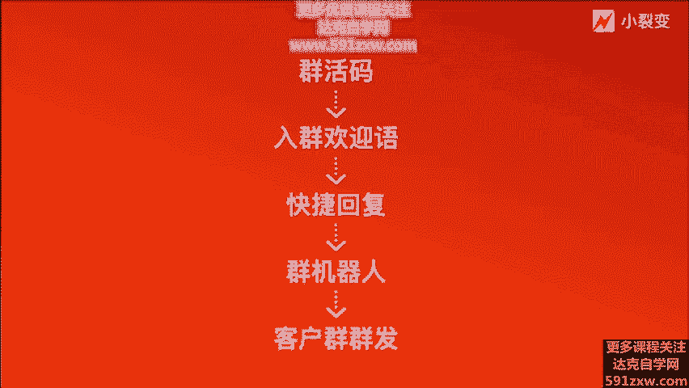

# 微社群裂变营销私域流量池增长秘籍创业运营销售获客视频课教程 合集 8套 374资料 13.1G 未来3-5年的新流量、新玩法、新增长 - P4：第03节：【客户群】做好社群用户运营，让客户了解你 - 高端网创试错赚钱大师 - BV1L1421k78g

hello，各位朋友大家好，我是小猎片创始人张梦琴。😊，啊，欢迎来到企业微信裂变增长十三课。😊，上节课呢给大家讲到了客户联系人功能，在私域精细化运营当中的一个玩法。啊。

我们今天这节课开始讲解企业微信的客户群功能。这节课呢是非常令我兴奋的课程内容。因为我们在用企业微信运营社群的过程当中，结合整个企业微信大战略，我们毫不夸张提出，企业微信群的营销将会替代微信群的营销。

大概率会有这样一个趋势。本节课的主题呢是企业微信客户群，做好社群的用户运营，让客户了解。在过往的私域运营工作中，我们接触大量的社群，也看到了做的好的和做的不够好的社群。我们对社群的思考是。

社群是用来服务客户的强化客户关系的手段，让客户更了解你。首先我们来看一看企业微信的客户群有哪些超级一天的禁理功能吧。首先，企业微信的客户群，它具备群活码、入群欢言语、自动维护群机器人小助理。

防骚扰、防广告。新人设置、防刷屏、客户群发、群驱虫等等功能。客户群呢它可以自动化创建生成多个群额码，组合成群红码对外曝光引流。同时，客户群内新进用户之后，可以自动推送入群的欢迎语自动回复。

客户群也可以开启这种防骚扰，将广告刷屏的群客户自动移出群聊，并设为永久进入群。这就可以大大的提升社群的这种用户的纯洁度，企业也可以为成员配置的规则，成员呢也可以自行去配置。直心的客户群。

群主是可以筛选出重复加入客户群的客户的，按需移出群聊，企业呢也可以统一的筛选，由群主确认后移出。客户群也可以开启防骚扰，将发广告的刷屏的客户自动移出，并且禁止用户进群。

这些其实都是我们日常在开展社群运营工作中非常刚需的功能。过去基于各微的微信群营销，我们常常会面临群内刷广告啊，群不够活跃啊，群成员重复啊等等，影响社群运营效率的情况。那可以说。

社群在过去运营过程当中虽然很好，但是对于我们运营者来讲的话，没有可以管控的工具和有效的方法手段，其实是比较痛苦的一件事情。那今天企业微信的客户群的功能刚好能够极大的满足社群运营中的常规运营工作需求。

不仅可以实现精细化的运营工作。还可以实现精细化的社群运营管理，极大的提升我们社群运营的工作效率。那么让我们来看一看说基于企业微信的客户群，如何去运营它，去做好社群的用户管理，让客户了解你呢。

我们在整个实操的过程当中，也将它分为四大部。啊，分别这第一步，通过群活码在线上线下渠道进行曝光，让客户扫码先进群。我们同时也可以将同一标签的客户拉进同一个客户群，或者将群的活码比如说放到最外的展示。

公众号也好，线下的易拉宝啊，展示传单等等都可以。一旦群满了200人之后呢，我们可以自动去分配到下一个群，实现分流。这就是企邮性的群活马能力。它一方面不会浪费任何一个潜在的客户。另外一方面。

不同的群内可以同时的及时响应开展线上服务。目前，企业微信的群红码的功能是可以通过企业微信后台进行创建的，也可以通过手机端进行创建，去成为群主。实现这种群活码的功能。第二步，当用户通过活马进群之后。

我们要开始去服务用户了，那就可以通过入群的自欢语，可以快速的和客户建立服务场景，可以自动下发这种群的欢言语。目前，企业微信呢它支持自动下发两条消息，分别是文字消息加图片以及文字消息加小程序。

还有文字消息加网页这三种形式。入群的欢迎语的设定可以在用户进群后随时触发欢迎语。当然了，也可以插入用户的昵称，艾特用户进群，让用户觉得说他真真正正的是被单独的欢迎了，会有一种叫做真的像是一种欢迎的感觉。

像那种入群的仪式，有种仪式感。同时，因为这种欢迎的存在，也会让用户感受到社群的温度和氛围。我们只需要在欢迎语的文案上去做相应的调整，就可以建立这样的一个啊群内的氛围。那第三步呢就是也做了群用户的欢迎。

那之后要干嘛？我们要通过群里的快捷回复功能。提前设置好群里的答疑，回复群消息。因为不论是教育行业还是电商零售，在社群运营过程当中，我们都会面临用务有各种各样的问题。我们要提前设置海量的话术库。

可以通过快捷语随时一键发送。其实这个功能用起来和上堂课讲到客户联系人的快捷与回复是非常非常类似的，是同样的一个功能。

它同时呢也可以应用到我们小裂变的企业话术库里面去单独进行社群类的用户去做话术的解答和呃用户的各种各样问题的一个回复。能够提升社群内的一个运营效率和响应的及时性。那第三步呢，这一块也是非常非常大一个特色。

基于企业微信群的。因为我们过去在用个人微信去创建群的时候，我们经常想说在群内能不能做机器人，那机器人这种功能，其实是微信是不会去开放给大家去开发的。而且现在市面上的基于各位的机器人都是违规的啊。

是容易被封号。所以大家就不要去用。但是企业微信群呢，他做了这种群内的机器人。😊，叫做小助理啊，他不会说百分百的智能，但是已经极大程度的能够解决在群内的各种问题的响应的及示性。那怎么做呢？

我们可以在企业微信的客户群提前设置好小机器这个小助理这样一个角色，通过我们提前设置了好的话术给到小助理。那当用户在群内艾特小助理的时候。发送相应的文字，则会触发提前设置好的话术。尤其是活跃的社群。

如果用户经常会在晚上甚至深夜在群内进行沟通问问题的时候，此时我们的社群运营人员大多时候已经下班和休息了。很难做到及时解答社群用户的问题。这个时候其实对社群是有一定负面的。

那企业微信的客户群的机器人小助理呢刚刚好在一定程度上可以解决这种问题，提前设置好这种问题库。一旦群内的用户艾特了小助理下发了相应的问题的时候，小助理才会自动回复啊，即使他不会像真人一样啊。

那么百分百的有一个感情但是他的及时性上能够做到最大化。所以说用户也会觉得说哎你的群内是用心的啊，你的群是想及时性的非常的智能啊，强烈推荐大家去使用。那第五步呢则是关于群发助手。

因为我们在做社群运营的过程当中，一定要去不断的去给我们的社群用户去push我们的产品。课程甚至说啊优惠啊等等相关的消息。尤其是规模化社群运营。对于我们这部分的运营来讲的话。

这个群发助手的功能可谓是非常大的一个福音了。以前我们用社群群营销，像批量将消息同步给每个群的时候，要么你冒着被封的风险，用破解工具，要么你手动一个一个选择群发，一次性只能群发9个群，而且效率非常之低。

对吧那当前企业微信的群发助手功能则会一键搞定。我们的群内的成员可以把通知、祝福、活动等等消息批量的发送到不同的客户群，并进行后续的服务。同时，我们作为管理员或者负责人，也可以在创建企业的服务消息。

由成员统一下发给客户群。这里要注意的是，每个客户群，每个自然日最多能够接收啊来自一名成员的一条群发消息。每个自然月最多接收来是同意企业和管理员的这个4条群发消息。在做群发的过程当中，大家一定要注意。

群发的消息不要出现违反法规和侵犯他人合法权益的内容，一定不要去用任何方式滥用此功能去恶意骚扰用户。微信也好，还是企微也好，永远秉持一个原则，说用户的体验是智障的。

我们永远不要去做过多的干扰性和恶意的营销。啊，当然了，如果说你的企业微信的成员账号存在异常的时候，可能会导致你的群发消息是发送失败。这里大家要留意。这里面的一个群发的注意事项。所以以上这五步。对啊。

我纠正一下是五步从群活马到入群欢迎语，移到快捷回复，还有群机器人，还有客户群的群发。这五步下来我们就能够完整的去建立出我们基于企业微信客户群的一个运营的一个精细化的一个标准步骤啊。

他也可以结合你们内部的一个内容SOP也好，还是说呃群的运营动作的SOP也好，去结合起来。这五步是绕不开的。所以说五步做好之后，我们基本上基于企业微信客户群的这个运营的整个框架和标准规范就已经出来了。

我们知道在什么时候要用群活码去引流。什么时候让用户进来之后要欢迎。

什么时候要用快捷与回复去啊响应用户，以及在呃特殊的时间节点，用机器人去啊给我们群的用户去解答。最重要的就是我们要在一定的周期和节点，要针对客户群的用户进行做群发，提升我们的效率。好。

那解游信的客户群那么好，我们到底有哪些？😊，品牌其实已经用到这样的功能了呢。我们看一看这两个案例。一个案例呢就是乐凯萨披萨的。他们呢其实是利用呃公众号和线下门店等的方式给企业微信群进行引流。

然后一旦用户进入到社群之后啊，这样一个呃群里的一个角色，就会叫做首席娱乐观是吧？啊，就会引导用户啊回复某某消息，拿到某某优惠啊，去抽奖福利等等，就回这样一个群里的一个呃氛围。编企业微信的社群运营之后。

乐凯撒他的三个月的群子的复购率从原来的19。1%提升到了29。4%。客单价呢也从原来的98。9块均升到了104。3。整个企微的社群的粉丝规模达到了30万家，所以说是非常嗯成功的一个案例。

通过企微信群的这些自动化功能提升了群的活跃度，带来了相应的一个数据转化。啊，这里就是我刚刚提到的相关的一个数据。大家可以去参考，看看人家的群是怎么运营的。刚进来之后是如何欢迎用户的如何去推送海报的。

以及群公告如何写的。那第二个案例呢，就是大家更熟悉的我们的瑞幸咖啡。飞性咖啡同样也是线上线下引流到企运社群内啊，大家可以看到通过。瑞幸咖啡的公众号的菜单栏啊，点击入群48折券，进群之后。

群里的福利官这会就欢迎你啊，如何进群，然后如何去秒杀小游戏啊，福利，然后折扣券等等。那我们看到瑞幸咖啡它的数据是说，当用户进群之后，它的月消费频次。比原有的情况提升了30%，月的复购率也提升到28%。

约的活跃用户呢提了10%。这个数据是可能这个是过去这个几个月的数据，但现在他的数据可能已经不是这个样子了，已经远远可能更高了。因为他们在这一端的社群的一个运营打法上已经不断的去优化。

当前呃整个的瑞幸咖啡在社群的一个C域用户池里面啊，已经有80万的社群用户。每天的贡献直接单量超过了3。5万倍。社群提醒下单超过10万枚。这个数权还是蛮夸张的啊我们看到瑞信的呃群，瑞信的城市群。

瑞信的每一个城市的每个线下门店的地区群都做了让类似的群的营销和管理都叫做福利观这样一个角色。所以说我们不禁去感叹说，因为企业微信的群，他做了这种智能化的功能，基于企业微信群有各种各样的营销工具。

让我们做社群运营的人员能够大大的去。提升我们的效率，解放我们的双手。同样的问题是说，它还能够是一个合规的一个官方的运营的一个私域工具。我们在做整个社群运营的过程当中，真的感受非常深。企业微信的客户群。

比原来的各位的群里营销的整个效率提升可能不止一倍那么简单，用起来真的是太香了。啊，所以非常非常建议大家立刻去行动起来。打开你的企业微信，去创建基于客户群的关联的群活马。第二去创建企业的快捷回复内容库。

放到我们的客户群内，去创建群里的自动回复的这个小机器人小助理。同时呢我们要尝试给我们的客户群去群发一条有价值的服务介绍。好，以上就是我们今天针对企业微信客户群的呃内容分享。我们当去做好社群用户的时候。

我们最终要达到什么目标，达到的是让我们的用户进一步了解我们品牌，了解你的产品，了解你的服务，了解价值观的这样一个目标。好，今天课到这里，非常感谢我们下节课再见。

