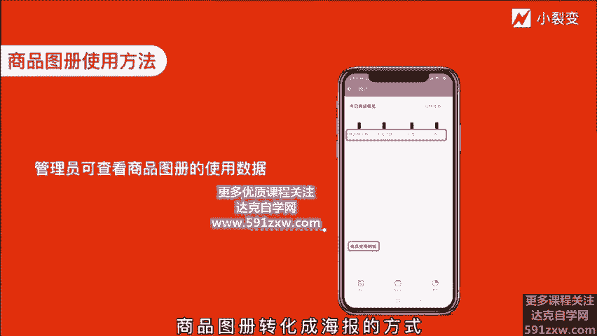
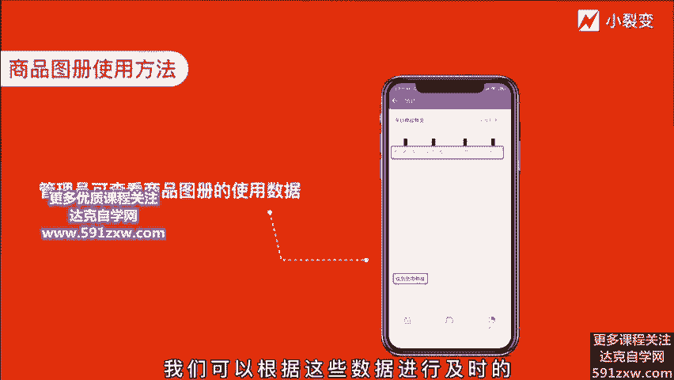
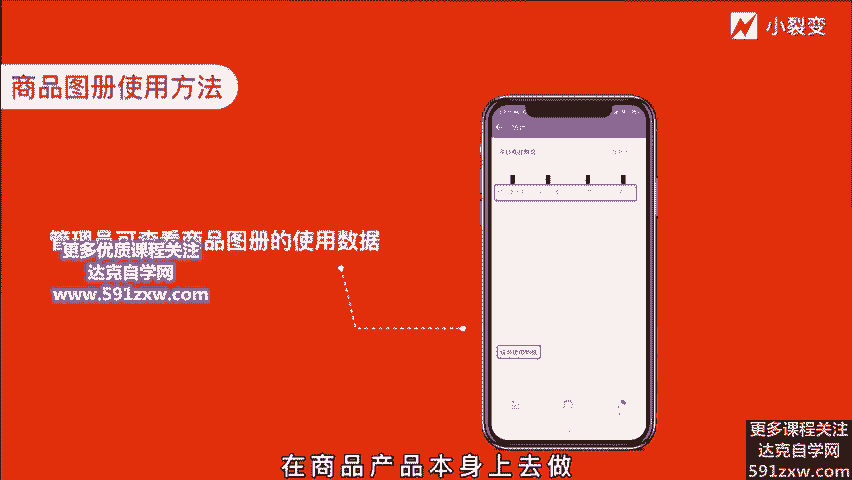
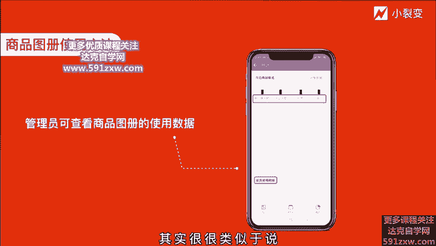
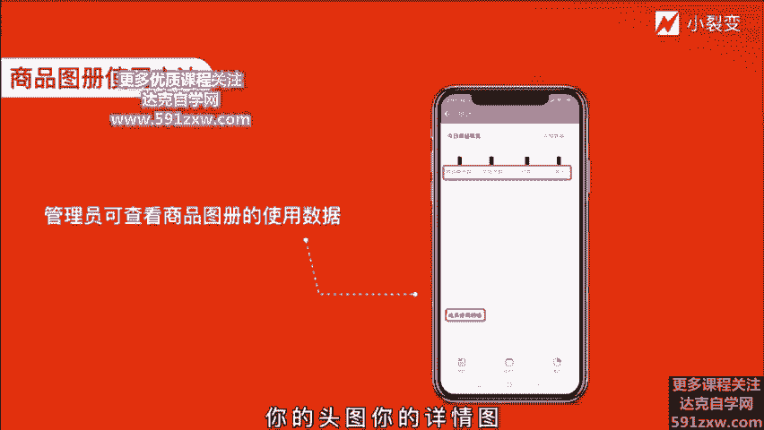
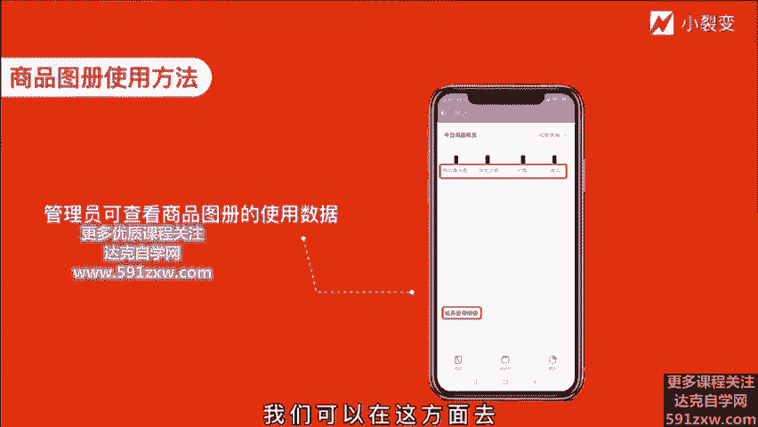

# 微社群裂变营销私域流量池增长秘籍创业运营销售获客视频课教程 合集 8套 374资料 13.1G 未来3-5年的新流量、新玩法、新增长 - P6：第05节：【商品图册+对外收款】交易能力，让客户认可你 - 高端网创试错赚钱大师 - BV1L1421k78g

Yeah。hello，各位朋友大家好，我是小这边的创始人张冬婷，欢迎来到企业微信这边增长实战课。上节课呢给大家讲到购物朋友圈功能的用玩法。今天这节课开始给大家讲解企业微信的商品图册和对外收款功能。嗯。

主题是企业微信的交易能力，让客户认可你。我们前面几节课其实一直在提到企业微信的功能，结合C域云的四个步骤，要让客户啊从认识你到了解你，啊，到想情你到认可你。那么今天我们就要说的是最后一个环节。

也是最重要的一个环节，让客户认可你达成成交。那么在企业微信达成成交的时候，我们可以用到的就是商品图册以及对外收款的能力。在微信支付已经相对成熟的一个状态下，为什么我们还要用到这样一个功能呢？

首先我们从大的方面来谈。从宏观上来讲的话。企业微信的商品注册及对外收款的能力，是可以把企业的数据资产这个更加深度的从这个用户运营这一侧直淀到销售变现这一侧。一个新的用户被获取到促活再到成交。

完整的数据是可以被记录被分析的。这是一件极其具有意义的一个事情。因为在过去销售侧的数据和营销侧数据经常会出现隔离的问题，尤其是啊很多公司应用到自己的CM系统。

但是你的营销侧或者你的商城册的数据和你CM数据是无法打通的那就很难去得到非常精准的一个用户销售行为的一个数据分析。

那这个一点的话会认为说基于企业微信是可以被解决的那我们可以看到像企业微信的商品图册和对外收款能力，你慢慢提供了这样的数据分析。

所以这种销售侧的数据和营销侧的数据可以通过企业微信提供的商品图册加对外收款能力去定程度的解决。第二点呢它是界定的对于员工来说，他其实也是可以提升员工的工作效率。和客户沟通的过程当中。

可以随时发送这样一个带有产品介绍和付款。制的一个呃小程序或者呢直接发起收款，也可以减少客户的决策成本。如果说我们的客户在跟嗯我们的销售去进行沟通的过程当中，如果是可以直接付款，及时到账的话。

那我们的客户肯定不希望说在走一个财务审核流程，可以减少客户的一个决策成本，缩短这样一个成交流程，提升我们的转化效率。那第三点呢，则是说在链接客户的体验上啊，相对于说一般的微信的收款码。

他会更具有公司属性。因为比如说像你单独的支付宝或微信的收款码直接放出来。你的合作的这些啊用户，不管是你to c的业务还是to业务，都会觉那么不那么放心，对吧？你可能是放了一个个人的收款码都有可能性。

当你在沟通过程当中能够发一个商品注册的这样一个能力，这样一个商品注册有非常详细的商品介绍啊，在这个过程当中，用户能够大大的提升一个对在。付款这个环节的一个信任度。

当然这也很考验我们的员工日常对于自己较私欲的客户上一个运营。因为对于已经很认可你的客户而言，发出这样一个商品图册的话，或者是对外收款上一个呃功能的话，我们的用户可以很快的进行一个成交。

但如果说前期的运营和沟通维护是不到位的。不管发什么样一个付款方式，它都会显得很常突。主要是这三个维度，我们去看两个功能的一个作用。那么接下来我们就看一看如何去使用商品图册及对外收款的功能。

首先就是我们可以看到啊商品图册呢，它呃可以分为两种。第一种是员工册，可以给自己去配置啊，商品图册，方便自己使用。比如说呃根据自己手上的客户属性去编辑，创建一个适合自己客户的相关的周边性的一些商品啊。

点开这己个结构性的工作台，点到商品图册啊，这样一个页面，在右上角会会新建，可以创建一个商品注册，你描述那个商品的呃特色然后名称呃图片和对应一个价格的编辑。可以直接创建好之后发送给我们的用户。

另外一种方式呢，则是企业统一的去配置，由管理员啊到企微性的工作台的商品注册在这个功能入口里面去统一的去创建商品注册，并配置所使用的成员。那同时我们可以将商品注册直接群发给客户，也可以。发到客户群。

更可以根据客户平时的行为习惯或者偏好去改变商品图册的形式。比如说我们可以将商品图册转化成海报的方式，也可以转化成这个图文的方式。啊，最重要的是说在用企业微信的这个商品图册的时候。

我们作为管理员是可以实时看到一个商品被应用到的相关数据。

从他的商品曝光数到浏览数以及它的销售的数量和收入数量，这些都是清晰可见的。我们可以根据这些数据进行及时的商品的结构的调整。能够第一时间呢让嗯在商品产品本身上去做相关的一些优化。

其实很很类似于说你做电商的时候，你的商品详情页，你的投图你的详情图，怎么去优化，能够带来更高的转化率。我们可以在这方面去通过数据的方式去驱动我们去做相的调整。好。

这里刚刚也提到说商品图册可以转发去分享到微信，也可以直接转发给客户，也可以直接做批发，还可以发送到客户群，这都是支持多样性的。

那它的这种展示方式呢也可以是呃小程序的一个卡片的方式，也可以是图文的方式，也可以是海报的方式。在形式上是支持多样化。相对来说用起来会比较灵活一些。

那上面关于商品图册这样个使用方法呃和配置内容是相对来说比较简单。大家可以直接在应的工作台进行创建。那么另外一个功能叫做对外收款功能，那它的区别它的创建方式又会怎样的呢？

那对外收款功能其实就是一个创建一个金额的这样个付款方式，的这样个独立金额，它是可以和我们对应的商品图册进行关联的。对外收款呢，相对于商品图册会更加直接。它区别于普通收款码的地方。

就是说刚刚我提到它可以直接关联我们提前创建好的这些商品，这样它好处是可以让客户知道我们的产品报价确实是统一的，或者呢。也可以体现我们的一些特定客户的专属折扣拉进和客户之间的关系。操作起来呢也是比较方便。

可以直接和客户的聊天对话当来当中直接发起，在底部的这样一个呃入口里直接创建一个对外收款就可以了。总的来说呢，企业微信的商品图册和对外收款能力，是提供了官方的商品售卖和收款的能力。

帮助商家可以基于企业微信的思域进行变现，更加的快捷，更加的高效，数据化的去指导我们的销售相关工作。是日常转化变现的一个好帮手。嗯。

这是我们对于企业微信的商品图册和对外收款这样两个能力的一个大功能体系的一个思考。我们小利店目前呢已经在日常的工作过程当中已经用起来这样功能，相对来说确确实实是比较方便的啊。

的确能够极大的降低一个客户和你打款过程当一个决策呃周期，尤其是to B的业务，你要知道他可能会涉及到啊财务打款这样一个流程，还有对公对吧？对公它流程会拉的很长。

那这个过程中如果我们能够直接将商品图册发给我们的客户就非常详细的介绍非常官方的感觉，那客户可以直接去进行打款，大的提升我们的一个效率。那对于to C的一些业务的话也是一样，对吧？

很多时候注册业务用户直接转款给这个微信了。那这样的话绝对是不可靠的一件事情。尤其是用企业微信，你是对。资收款的话，你没有说直接对公到你的公司账上，账起来管理起来是非常麻烦的一件事情。

但企业微信的商品图册和对外收款能力呢，就极方便的解决了这样的问题。所以也非常非常建议大家赶紧用起来。好，那今天的课程呢呃就到这里，我们还是是非常的希望大家能够尽快去熟悉商品图册和对外对外收款的能力。

所以给大家一个行动清单。第一，回去之后打开自己的企微性，配置一个商品注测。第二，尝试将商品发送给客户，并且记录一个商品，被客户浏览到转化的这样一个相关的数据，哦进一步的一个优化和迭代。好。

非常感谢大家的聆听。然后我们下节课再见。😊。