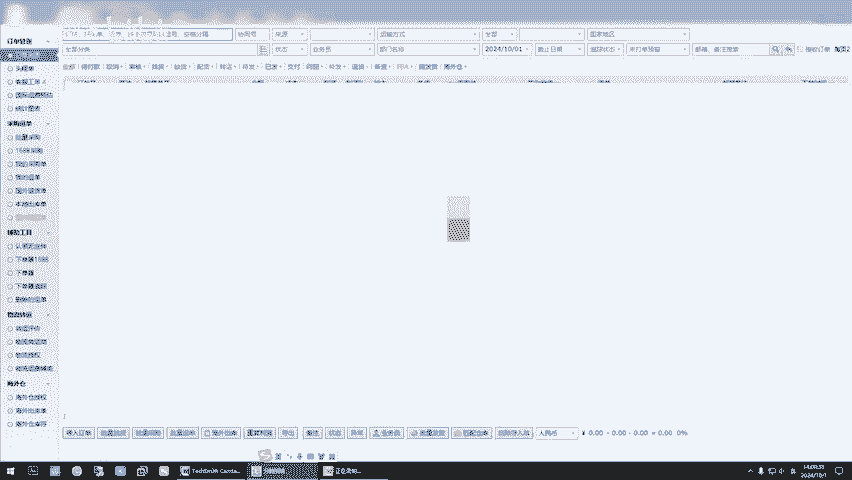

# 必看！亚马逊新手入门基础实操运营课-每月业绩记录，贵在真实！ - P1 - 鼎哥跨境说 - BV1uoxYeNEtE

。

hello，小伙伴。很高兴又和小伙伴们见面了。今天是咱们祖国伟大的生日啊。首先祝视频前的小伙伴们节日快乐。那么今天也是每个月交作业的日子啊，这个比较简单，因为顶哥靠近说，咱们本的就是真实，一切都是真实。

咱们不来假的，虚假的啊，是什么就是什么？首先呢你们也别拿顶哥和一些专业的机构去比，比不了顶哥是个个人啊，是个个人闲暇之语，捎带的自己去做点产品，自己去做一做，每天奋斗在第一线，你不做。

你没没有办法去琢磨技术，你也没有办法去琢磨这个东西怎么弄，对吧？🤧好了。我们看一下，今天是10月1日，那我们看一下9月份的数据啊，9月份的业绩是什么？9月份的业绩是整体业绩是销售了。18255。5对吧？

这个毛利率是54%，是9948。13啊，9000多点。利润啊是9000多点。那我们和8月份对比一下啊，我们看8月份啊。那是略微下降哦略微下降了一些。但是8月份是。嗯，销售了23000多。

利润率是51%啊，这个很正常，一个月多或者一个月少很正常啊很正常。呃，发这个视频没有什么别的，因为很多小伙伴有些时候问啊，你有没有在做呢？啊，顶哥只是发一些真实的数据啊。

你们不要拿我和一些专业的机构比啊，我不是专业机构，我就是一个个人闲暇之余出来分享，对吧？好嘞，那这个视频就到此为止，每个月的交作业。

