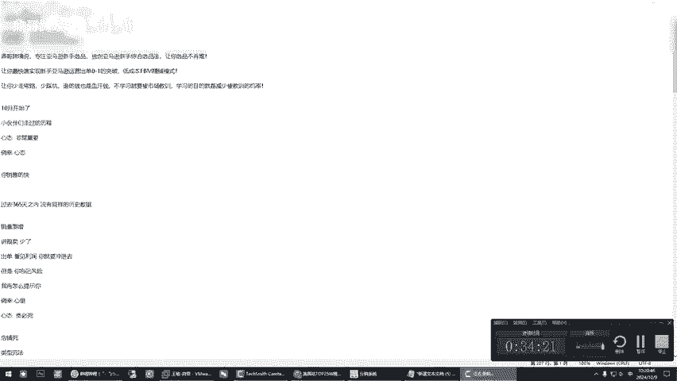

# 必看！亚马逊新手入门基础实操运营课2024-鼎哥跨境说带你手把手实操，贵在真实！ - P1 - 鼎哥跨境说 - BV1jh24Y8ESt

我们直接是实操啊，因为顶哥这里没有更多的一些花样，我们就是实操。是操我们去拿结果，好吧，因为10月份他已经更新了，更新的情况下，我们来去操作一下。还是以北美站为例啊，其实哪一个站点都可以。北美。

欧洲、日本我们都可以的，只是说每次我只拿北美战来举例啊。举一反三，以此类推就可以。我们先让他去跑数据，一会去跑。今天主要跟大家聊一聊。回顾一下这个多半年以来，小伙伴们走过的这个历程，有成功的。

也有失败的啊，也为领个这个人。我从来就实话实说，没有必要藏着掖着或者是忽悠，你们没必要成功就是成功的，失败的就是失败的。因为每个人的执行力不一样，悟性也不一样，对不对？是吧？那么拿到的结果就不一样。

那么这个我们先实操，我们让他去跑数据，我们用一代。这个选频工具先这么地做。这个时候呢还是做个简单的自我介绍啊，呃，顶哥跨镜说，专注亚马逊的新手选品，独创这个亚马逊的新手综合选品法，让你这个选品不再难。

让你最快速的实现亚马逊用于初单0到1的突破低成本的FBM的惊枯模式，让你少走弯路，少踩坑，因为谁的钱也是血汗钱，对吧？你不学习就要被市场教训，学习的目的就是减少被教训的几率。那么10月份开始了。

小伙伴们从。年初到现在都走过一些什么样的历程？因为。呃，很多人就是说举个例子来说，他是有概率的。有些小伙伴他可能在1到2个月的时间内，他就已经成功啊。也就是说，从一个新手到从选品开始做精铺到出单。哎。

到稳定的出单，到后面从FBM的精铺模式在兼容这个FBA的模式。现在开始有些小伙伴经历了不到一年，他们这种模式，FBM的精铺和FBA的这个模式已经在共存，而且还在持续盈利。那么这个是成功的啊。也有失败的。

就一开始的时候，小伙伴们有些比较急啊，就我之前跟大家分享过的，就是说心态急，这个心态啊，就是一个字急，为什么急呢？要出单要出单，那么持续开始，你看出单嘛，急非常急，为什么？出单了吗？出单了。

但是后面会拿到一个很不理想的结果，就是说有些时候你控制不住你自己的。他今天出了5单，明天出了十0单，后天出了20单，你不停的在投入，你不停的在投入。你们曾经忘记了我告诫你们的一句话。

亚马逊亚马逊对于新账户，对于新账户的这个判定判定和这个。监测。啊，就是说你们忘记了这个，我是不是告诫过你们群众勇哥？呃，比较跟我聊得来的一个。一个年纪差不多的一个学员。哎呀。

就是说前前后后在里面也砸了不少钱，前期呢销售非常好，但我一直告诫他，告诫他，告诫他，就是你要步子迈的慢一些，小一些，卖的大了，容易扯着，对吧，是吧？结果他并不是被同行搞，而是被亚马逊搞。

就是说你这个东西你要拿来授权，对吧？就任何时候你们在上架或者卖的好的时候，我都会给你们一个当下的敲警钟，这个东西会发生什么样的风险等等等等等。但有些时候。是吧就是有些时候我们聊一个什么东西，聊心态啊。

这个东西还是到这个心态非常重要的吧？心态这个非常重要。是吧非常重要。我就问你们，屏幕前的你们是是不是每一个人都有这个侥幸心态，认为不可能马上搞自己，不可能马上搞自己。亚马逊是一个秋后算账的一个。

一个一一个这样的一个平台是吧？😊，我们看一下数据哦，这个抓完了啊，我们看让它执行执行了A，执行了B啊，我们再执行一下B。亚马逊是一个秋后算账的平台啊，记住这一个。还有一个我之前一直在跟你们讲。

一直在跟你们讲一个什么东西啊，是吧？你销售的快。你你会被认为什么销量递增？你看你说你他的这个思维逻辑跟我们是不一样的。如果我们一个新店铺销售的非常好，对于我们来说是一件好事情。

但是在亚马逊认为你在过去的3655天之内，过去的365天之内。没有这个同样的历史数据哈，没有同样的历史数据。你看。他就会给你判定销量递增或者说。🎼冻结延迟你的这个资金发放计划，就说白了会延迟你的回款。

是不是呃，我这个学员里面是有碰到过的，是吧？有碰到过的，就是我说这个并不是说你们做的不好，你们其实非常优秀，在你们认识我之前和认识我之后，我曾经告诫过你们这条路子谁很深。

有的人他运气好会走的一帆风顺一些。有的人可能会遇到一些挫折。但是你如果你想长此以往的去坚持做这个事业的话，那么这个挫折应该是在你的承受范围之内，他其实让你赔的不是人民币，是不是你换个角度讲。

你做任何一个行业，你去试谁，你是不是要有一个损耗成本，是不是应该有一个这样的损耗成本，对吧？没毛病吧。你任何时候。🎼你控制你自己的止损成本是你要考虑的。当然了。你跟着我来学，你们跟着我来。

我有提前告知或者警示你们这个对吧？有些时候我在开头会告诉你们，他未来可能会预知发生什么情况。因为这个案例，他不光是我这个朋友了，这这个在之前也有，就是因为怎么来的？有些时候你看我后来我讲的跟麦非常少。

讲跟麦非常少，为什么讲。为什么讲这个。根麦非常少啊，我我今天跟你们说原因啊，讲根麦就少了。为什么少了？因为跟麦就如某些东西一样，它会让你上瘾。你从一个什么都不会的小白，你马上有可能就会出单。出了单。

你是不是看到人民币，看到利利润，看到欲望，听懂啥意思了吗？但跟麦你想去做好，它不是说单纯的就靠你一个店铺来完成这个事情的。有些时候。对吧我还是那句话，当你看到了不费吹灰之力，你就能出单拿到钱的时候。

你自己的心态就会发生改变啊，就为什么我讲三个字，贪必死，你的心态会发生改变啊，就心态。你看贪必死，你你们不要不相信啊。是不是？是不是出单看见了利润？是吧你你看你看见这个利润是不是你就要冲进去。

但是有一点。你忘记了风险是吧？我在。怎么提示你？你。侥幸心理是不是？直到有一天你的账户被冻结，你或者说被同行把你搞死，售假商标滥用，是不是各种搞你的邮件，其实简单的说，商家搞你同行搞你还好受一点是吧？

那如果亚马逊搞你。有一个非常可怕的东西，尤其是你们做了一些插边的，跟一些版权挂钩的，跟一些。动漫。呃，等等等挂钩的知道了吧？你做了些插边的东西，亚马逊不跟你说什么，只问你请出示你的正规发票或者说授权呃。

听明白什么意思了吧？这个时候举例说人家是卖的是某某某包是吧，那个大牌。请问你能拿到这个数据吗？你能拿到吗？是不是有些时候啊，我说水很深，为什么在你当初卖起来的时候，他不去搞你。

非要等到你砸进去很多钱的时候再搞你。人家不傻，知道这个意思。有些事我不能在这个视频里去跟你们明说，为什么说。做亚马逊，你们一定要稳稳的来，稳稳的来见好就收，知道吧？为什么跟麦我讲的少了。

是因为我发现很多人缺少这个自律和自控能力，因为他太容易让人得手了。得了手以后，你就控制不住你的欲望，听明白了，你会不停的往进深入啊，那你你如果是一个懂得自律自控的人，那，那你可以去玩这个东西。

如果说你不懂不知道把控，你只看到了人民币啊，这个东西这么简单，那好，离你跳进深坑的这个日子也不远了，是不是对吧？啊，这个也完毕了啊，完毕了以后，等一下啊，接着跟你们聊，你看让他去持续跑数据啊。

让他去持续跑数据啊。你看啊我们持续跑一下数据，我就随便找一个。程序吧，随便找一个程序来吧。我们要那个全能A和全能B去干这个事情去啊，就是说我们先去。干这个全能A全能。B。😔，我试一下啊。哎。

全能A全能B。😔，就是一一边的跟你们聊。好好，这个路径不对，路径不对，我稍暂停一下。그。嗯。Oh。Oh。好了，我们让他在里面跑数据，我接着跟大家聊，现在他在里面跑数据是吧？他在跑数据，对不对？

他在跑数据。嗯。网速有点慢呢。好。我们言归正传啊，就是说你看这几天有个小伙伴呢又碰到了什么问题，你看就是。这个店铺死。店铺死啊，就这个我发现很多很多类型了，很多类型的死法。因为。我从19年到现在。

我手上基本上有1过上百个店铺了，就是说。呃，最近的一个小伙伴他是什么问题啊？被亚马逊扫号。扫号。我相信很多。老伙伴们不能是新伙伴们，他们很多遇到这样的事情，扫号对吧？什么叫扫号？

就是他会提示你违反亚马逊商业政策第三条第三条。这样的店铺叫少号，那这个时候他有一个很奇怪的现象。你即使提交订呃账单或者什于是北美，你基本上也没什么用。但是我们在我们运营的过程中。

就是说有就是说这个店铺啊放置了一段时间，我们也没有去管，什么都没有操作，这个店铺居然又被激活，就是又被激活，就是我们什么都没有做的时候，他又被激活了。因为这个事情这个情况发生过好多有北美的，有日本的。

就是说当时被扫号，所有人他判定是死亡了，你怎么救啊，哪怕你去找服务商，你怎么救他都没有没有效果的时候，我放弃。结果过了几个月打开一看，他居然给活了。当然我说的这个是概率啊，不能说每一个店铺都这样。

我说的是概率。因为今天这个小伙伴第一是什么？找了一个不专业的机构把他自己的这个身份信息注册了营业执照，结果没有下店铺，没有下店铺干什么。让他去买了别人的一个用过的店铺。你看这个时候啊。

你买来的店铺有有些什么利弊啊，你看这个这个东西啊。那个利是什么？他他可能是。有一点的。有权重啊，尤尤其是销售过的啊，销售销售呃销售过的啊，这是有有权重啊，那B是什么？我们说它的这个弊端在哪里哈。

你不知知道这个这个账户之前做过什么啊，你不知道他某些上的品。其实有这个潜在的风险啊，但有可能卖给你的时候，它删除掉了啊，对吧？删除掉了，你不知道，但当你使用过一段时间以后啊。使用过一段时间后。

你这个赶上这个这个机器扫号是吧？你被扫扫这什么意思啊？机器扫号的时候，你可能被。某一个点触发了它机器扫号的这个因素，所以说导致你就那个原则上看是让你递交二审的账单，其实根本不是你就是递交了。

他会马上给你一条，你违反了亚马逊商业政策。第三条。第三条你涉嫌从事欺骗欺诈等等等。明白了，那个邮件我就不往上发了啊，就是说这是一种死店铺的方法，还有一种死是怎么死啊，就是你这个关联，就是有些时候。

你自己不注意啊。不注意这个IP关联IP关联知道吧？在同1个IP下，你登录了两个不同的账号，或者说同一个硬件。同一啊就是同一的这个就是是硬件，同一个设备上同一个设备上啊，就是你登录了两个不同的亚马逊账户。

你这个时候啊你就会提示你关联了，听明白啥意思吧？这种死店铺是死的最冤的，死店铺死的最冤，知道什么意思吧？就是说你看我给你们今天讲是回顾。从年初到现在，大家走过的路。

我给你们尽讲了一些这个他们失败的那成功的我们是成功的，怎么来的？成功的啊，成功的成功的学员怎么做的，是不是你看第一要听话。对吧慢，为什么我说这个慢呢？慢就是快。快就是慢，这什么意思啊？慢慢的。做好细节。

对吧？选品。还是。重。中之重对吧？对不对？选品是重中之重，是不是你要选好品？按照。哎，顶哥教你的方法是不是？对吧布局文案。头流是不是测试出单完，对不对？最后。量化是不是这样的对吧？你达到一个结果的时候。

你你开始选择是不是多模式。共共存是不是这道理是不是FBM和FBA是不是共同模式，对吧？我很多小伙伴他已经实现了，因为我不能去曝光人家做什么。但是但是我只能跟你说，他们选的品都是在经过精铺测试过程中出单。

销售稳定以后，转成的FBA知道为什么说我新手，你看我说新手。一上来。不不只是说不建议你，对不对？你你这个直接。FBA你为什么？你看啊我来跟你说为什么。不是这个FBA不香。

是吧是你有多少钱去做这个前期的铺垫，是不是？很多小伙伴都是做这个东西，想去做一个副务业，或者说80%的人，他是想去做一个副务业，或者说这大环境不好。一开始想去试水去做一个这个东西哈？我给你们算一笔账啊。

你做FBA你也要去学习，是不是学习是不是会有有产生费用，是不是学是不是学。FBA有费用是吧？做这个FBA有费用，是不是？选好品，你选好品发头程。是不是。都是费用是吧？那个货代对吧？它是有这个起重量的。

请问我问你们，你一开始自己算好账了没，你你就来不来？对吧你铺垫一下。是不是？最少。两个W出去了。这个时候还没有说你赚钱不赚钱。如果你你发到亚马逊仓，你都没毛病的时候，你赚钱了，你成功了。如果你不赚钱呢。

是不是等着一折清偿。你你所面对的是什么啊？一则清偿是不是？你还要付出。头留的费用啊是吧，等等。你是是不是？对你看我们我们对比一下。为啥这个新手建议。先去金铺啊，为什么？因为不需要前期。亲。

不需要前期干什么采购这个商品是吧？测试出单。流流量是不是？质量。反馈等等，是不是你是不是拿到了结果？你再去。做这个FBA是不是这个要稳稳定系数高一些，是不是对不对？你看我给你们分析是不是这样子来。

稳定系数高一些，我们不会去就是不要去打一些没把握的仗，好不好，对吧？因为大环境不好，钱不好赚，谁的钱也是血汗钱。对不对？你自己去算你的这个投资成本，就是说FBA和FBM的。投资成本啊，你做个对比。

没有说家这个FBA不好，国内很多教FBA的老师讲的非常不错。但事实上说，你看我跟你们说了，学费是一个支出是吧，对不对？第二，采购。支出是不是？软件举例说，选品的支出是不是文案是不是指这个图片视频？支出。

对不对？采购支出是大头啊，这里这个是大头，知道了吗？对啊，还有物流支出。是不是？其实很多个支出，你是前提你得选好学东西，选好品采购大头。因为货代它不可能说你支持你一件代发，它一定是起始量的。

举例说多少公斤起，是吗？他说体积重和实际重，那么多少公斤起是不是决定了你的你你你如果选的小东西，你当然一个品不可能搞几千个吧，你知道这个东西能不能卖得了嘛，是不是你看对吧？我们顶哥这里就跟你们讲点实话。

你们自己去相信你们都是聪明人啊，你们自己去对比，你看这个里面咱们还跑数据啊，这个是这个是咱们的基础程序，它是必须要用的，它是不是你看做对比，你是不是都是支出，是不是是吧？做个对比，前提这个是FB对吧？

是吧？我给你举例说FBM是吧？同样对不对？学费你跟谁，你也不你也人家不可能白交，你实话实说，对不对？学费支出是不是你接下来有个什么支出呢？基本上没有是吧？你看出单才采购，是不是对吧？

文案图片可以忽略不计，是不是对不对？那么也就是个运费成本啊，运费成本还有一个投留成本。是不是？是不是你如果如如果出单稳定，是不是改成。FB那你自己算一算，你计算一下这个结果，你会你会。你会省多少。

而且说你的风险是不是FB你不管你卖的卖得了，你得先把货发过去，是不是你得先把货商品，你得先采购了发过去，那么FBM不管你卖不，你卖不了，它就是几张图片，它没有什么成本。

它就是一个每天你要去用营去写list上架的一个时间成本，你有什么成本，是不是？我不是说在这里跟你们说，非得FBM啊，如果你子弹充足啊，如果啊如果你看你子弹多，你可以哈，直接这个FB。对不对？你子弹多嘛。

是不是玩得起？是不是这个道理？如果你子弹子弹少。你害怕。分析是吧你就FBM走起嘛，是不是对不对？是不是这个道理？顶哥跟你们说的是不是这个道理，对吧？所以说有些时候啊，你们你们自己看啊，我今天跟你们讲。

我是跟你们讲这个回顾，小伙伴们走过的这些路。因为我每天他们都在问我各种各样的问题，我在给他们解决问题是吧？有些时候还你还要你看你不要不相信这两个字啊，运气啊很重要，这个不是这个不是偶然啊，也不是必然。

这是什么意思？运气其实来源于你这个对这个细节的把控。啊，你看我说这个话是为什么？凡是我观察了做的好的，运气好的，他一定是执行力强，心思缜密，知道吧？把我跟他讲的话都都反复推演。

人你看啊任何时候把自己的这个风险放在第一位的人，他绝对是运气好的，不会不会触发些什么。你懂我这意思吧，所以说。你看回顾了这么久，因为起起落落的，因为有很多小伙伴啊来了找了我跟我学，学完了都没。

你看还是我再去监督，我在监督，你到了什么程度，你要跟我说，我都不监督也不动，你说你看谁的钱也赚起来不容易，对吧？所以说你一定要动，你得拿结果，是不是我们任何时候是要去拿结果的。那个10月开始了好。我们。

全力以赴吧。今天呢啊我就跟大家聊天嘛，聊到这里啊，我也会后续后续发现什么问题，跟大家说啊，得跟大家的通病。那么我们返回来他是不是在跑数据，是不是对吧？也就是为什么还是这个是一代产品，让他去跑数据。

跑完了数据就开始选品嘛，是不是你看我很多期很多期视频都是呃是你看。带着学员这个实操嘛，实操的这个录像啊，实操这个都在我的这个B站放的啊，你们可以去借鉴参考。因为这有些东西啊。不难知道吧？难在第一。

你执行力。第二，你不要去想太多是吧？第一，亚马逊。讲规则，你看你要理解规则这两个字啊，规则明白吗？理解规则，多去看亚马逊的受限商品政策，受限商品政策啊，多看这个东西，有些时候你选品没选对第一。

你选到了受限商品，你辛辛苦苦费半天劲儿，哎，结果是个受限商品，你说你是不是这个道理啊，你收到了个绩效，人家问你要某某某证书啊，你被判定为杀虫剂啊，你被判定为医疗用品，你被判定为等等等等等，是不是啊？

是吗？回过头来看啊，这个它是基础工具。为什么我刚才是不是说了吗？我们是不是把这个美国的刚更新嘛，对不对？10月8日更新的，因为人家也要放假。

我们把这个数据这个BB这个ABA这个是亚马逊后台提供的这个关键词数据，它是最新的。我们通过这种方式把它变成了asson啊，我们把它变成了as森以后，我们从这里面去选品啊，它这个是一代选品啊。

我们从这个里面去选品。你看啊，我现在我就不操作了，我给大家演示一下，一会儿我再去操作啊。你看他是不是到这个里面，他他是不是把这个关键词变成了A，你不用管它是什么，他是不是进来了很多数据啊，这个是一代。

那么二代产品时候，它是在这个地方选品大数据啊，这个里面是提前抓好的数据，你看自发货是吧？中国自发货或者FBA它都有，就是说任何时候。是吧你一定要有一个趁手的工具啊，你有一个工具才能提升你的效能。

你没有效能的时候，一切都是白搭。那么这个时候选品的时候，它这个是结果呢，这个是二代选品里面举例说榜单选品啊，你可以新建一个榜单放进去，对吧？这个是关键词选品啊，你是一样的，你把这个关键词呃，分类。

你选择了分类什么什么关键词，建议分类，你把它搞出来是不是对吧？啊都可以的是吧？链接店铺啊，这都可以，这个是二代选品。那么一代选品里面也有这种功能。一代选品一代选品和这个二代选品的，你看它有什么区别啊。

一代选品我们用的都是这个225万的这个最新的关键词数据啊，它是最新的数据，那么二代选品呢是二代选品是什么东西。二代选品是咱们提前啊，提前把这个数据抓好的数据，它是提前的提前的数。呢我先着让他继续跑啊。

因为他在跑了一会儿继续跑。哦，提前。对，这是一代选品抓的是最新的，二代选品啊，它是提前提前里面就有数据啊，这个搜索值排名它也有它只是个参考。这个里面我就不不过不过多的去分析了。

因为分析也是带着学员去分析啊，就说他有这己一种途径，他能到这个里面得到结果，然后这个是预先抓好的数据啊，举例说自发货变体数，哎，自己去衡量是吧？小类排名了5100的，对不对？它这地方本身就会带了销量。

是不是？有些时候我始终说一句话，你们选品的时候不用看表面的东西，一定要看它内内在的内涵是吗？去看它的小类，看它的市场，看它的同类不同款。就如就如举个例子说，哎，我叫顶哥是吧？全中国叫顶哥的人很多。

但我们长得不一样。那么这个顶哥其实就是通用关键词。但他不妨碍某些商品用这个关键词，懂了吧？所以说有些时候呃这东西它不难，关键你怎么去变通，怎么去理解。就如我在这里给大家说，你看我给你们举了这么多例子。

其实告诫你们什么，就是说。你做任何行业。你都没有百分百的成功，他一定是成功跟失败占一定的比例的。成功的人离不开执行力好，悟性高，去琢磨这个事情听话。那么不成功的人，我不能说他们不努力，他们欠缺一些运气。

我说了运气是什么，细节把控不到位，还有三个字贪必死，还有马上今天结婚，明天就想孩子出来，对吧？老师想这个就是说白了还是心态的问题，就是别的事情呢，其实我呢正好假期也过了，大家也收收心，该干嘛干嘛了。

是吧？我们这个时候要去就静下心来做一些事情了，10月份到年底到过年没几个月了，争取小伙伴们去大卖一下，对吧？是不是这个道理，我们大卖一下，呃，顶哥说话呢就是这样的，直来直去的，别的没有直来直去的啊。

我看我们时间也34分钟了好，今天再见啊，停止了啊。

