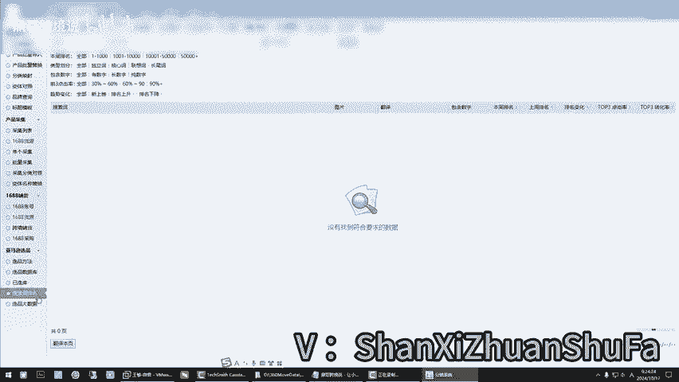

# 必看！亚马逊新手入门基础实操运营课fbm,你所不知道的选品方法！快速拿结果！ - P1 - 鼎哥跨境说 - BV1itycYUEqD

。hello，大家好，我是顶哥，很高兴呢又和小伙伴们见面了。😊，嗯，老样子还是做个自我介绍啊。顶哥跨境说，专注亚马逊的新手选品，独创这个亚马逊的新手综合选民法，让你选品不再难。

让你最快速的实现新手亚马逊运营出单0到1的突破，低成本的FBM的进铺模式，让你少走弯路，少踩坑，谁的钱也是血汗钱，不学习就要被市场教训。学习的目的是减少被教训的几率。那好，这节课呢是还是分享这个工具啊。

大家看一下，就是说上次给大家讲了这个二代选品，二代选品里面。上一课我们讲的是榜单选品法，就是说通过榜单对吧？这个地方我今天我们讲这个关键词选品，那么它的他们它的依据是什么呀？你看啊它的依据。这个。是。

呃，我从25万抓取来的词啊，就是说从25万热搜词，我们抓来的关键词。呃，我现在给大家演示一下啊。那我们让他演示一下啊。它会自动打开这个采集下来的表格。它会自动的输入关键词，并且找到这个自动的分类。

它这个悬屏有什么优点呢？就是说。嗯。他会更精确一些。那它这个结果会在什么地方？它这个结果会在这个地方，大家看一下选品数据库，它会在这个地方出现啊。现在因为它它有延迟，所以说大家等一下就是说。

这个地方的结果用了这个工具，那么会在这个地方有结果。这个数据量它相对来说要少一些，为什么？因为他跳过了一些举例说不出单的或者有品牌的等等等，是吧？他跳过了这一些，也就是这个地方，你看。嗯。😊。

如果你选择了全部，那么它数据会非常多。如果你选择默认的啊，咱们就是默认的，它没有这么多数据啊，我们其实就是更多的更精准一些，对吧？跳过没出单的等等等。你看它在里面还在继续跑数据。

所以说你看啊本期课程呢还是这个亚马逊的新手入门基基础实操运营课啊，这个金铺自发货系列啊。咱们这边的主要是实操实操实操。因为有些时候他选品没有那么难，只是你们没有把这里面的逻辑看明白。

你看明白了以后真的不难。还有啊就是说咱们定义的选品是什么？我们咱们定义的选品是选选择合适的对标产品，从而去找到它背后的蓝海市场。因为我前面的课都讲过这个东西。之前咱们是一代选品，一代选品的好处是什么？

一代玄名的好处是它这个数据新。你看这是前几天做的数据啊。前几天做的数据，这样的话是通过筛选的方式来做的那找个品它也不会太难。像这个猫，我这个是不是通过那个。抓了他那个链接以后，我们得来的。

我现在把他都清空啊。清空了。你像这边我们能做到关键词哦，店铺等等等。那么二代选品上这个地方是二代选品是吧？你看二代选品。他也会出数据，他要的数据就出来了。因为咱们现在数据少，它会过滤。

你看到时候它会出中国购物车的或者什么的，直接把购物车就出来了。哪个国家的卖家？因为数据现在还少嘛。看。是吧我们等一等让子弹飞一会儿，就今天给大家介绍这个工具的使用啊。介绍了这个工具的使用怎么用。对。

你看它这里还在全自动的运行中。这个奇码咱们为什么说让大家搞一个虚拟机呢？就是说它在里面跑数据，它不影响你在外面去选品，它不影响你去选品是吧？有些时候我们工具非常多，你看你和结合起来，这都能用，是不是？

这个是二代选品里面的优势。

他预制了一些产品进去，能帮助你能帮助你去选。因为顶哥跟你们说过，最核心的东西不是你眼睛所看到的东西，而是你眼睛看到的背后的市场，看到的背后的市场，不是说你眼睛里面盯着这个东西。

你就要做这个不是如果你真的还是这样的思维，那你别做亚马逊了，你做不了，你会被卷死啊，你真的会被卷死。好了，这节课我就分享到这里这个工具如何使用啊。

